## 一，环境搭建与HelloWorld

### 1，开发环境搭建


HUAWEI DevEco Studio是基于IntelliJ IDEA Community开源版本打造，为运行在HarmonyOS和OpenHarmony系统上的应用和服务（以下简称应用/服务）提供一站式的开发平台。

作为一款开发工具，除了具有基本的代码开发、编译构建及调测等功能外，DevEco Studio还具有如下特点：

1. 高效智能代码编辑：支持ArkTS、JS、C/C++等语言的代码高亮、代码智能补齐、代码错误检查、代码自动跳转、代码格式化、代码查找等功能，提升代码编写效率。
2. 低代码可视化开发：丰富的UI界面编辑能力，支持自由拖拽组件和可视化数据绑定，可快速预览效果，所见即所得；同时支持卡片的零代码开发，降低开发门槛和提升界面开发效率。
3. 多端双向实时预览：支持UI界面代码的双向预览、实时预览、动态预览、组件预览以及多端设备预览，便于快速查看代码运行效果。
4. 多端设备模拟仿真：提供HarmonyOS本地模拟器，支持手机等设备的模拟仿真，便捷获取调试环境。


**运行环境要求：**

为保证DevEco Studio正常运行，建议电脑配置满足如下要求：

- 操作系统：Windows10 64位、Windows11 64位
- 内存：8GB及以上
- 硬盘：100GB及以上
- 分辨率：1280*800像素及以上


**下载DevEco Studio：**

进入[HUAWEI DevEco Studio产品页](https://developer.harmonyos.com/cn/develop/deveco-studio#download)，单击下载列表右侧的下载按钮，下载DevEco Studio

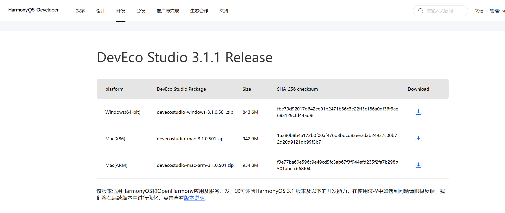


**安装DevEco Studio：**傻瓜式安装

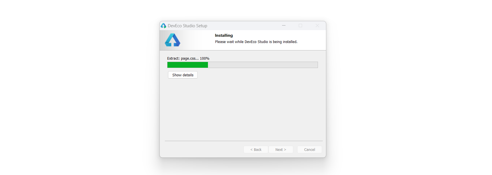


**配置开发环境：**

安装Node.js与ohpm。可以指定本地已安装的Node.js或ohpm（Node.js版本要求为v14.19.1及以上，且低于v17.0.0；对应的npm版本要求为6.14.16及以上）路径位置；如果本地没有合适的版本，可以选择**Install**按钮，选择下载源和存储路径后，进行在线下载，单击**Next**进入下一步。

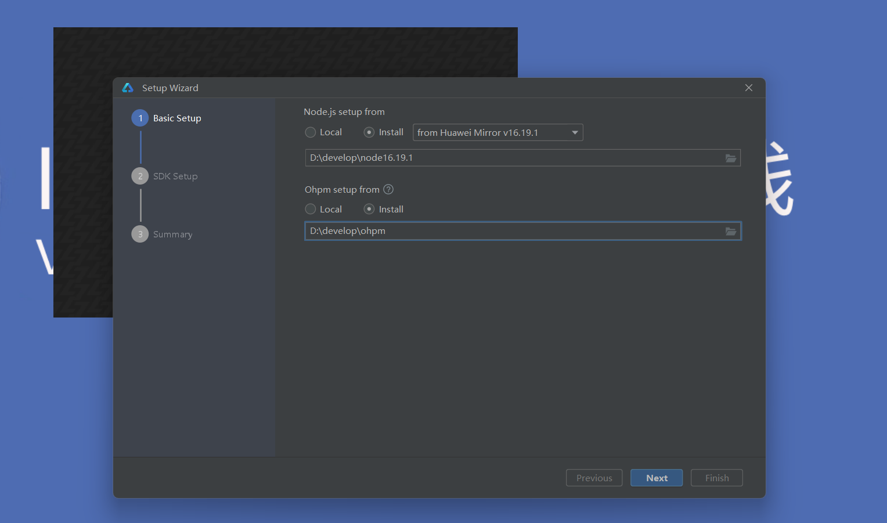

可能有做前端的同学是有Node.js的环境，由于版本和路径的原因，仍然建议单独安装。在**SDK Setup**界面，设置HarmonyOS SDK存储路径，单击**Next**进入下一步。

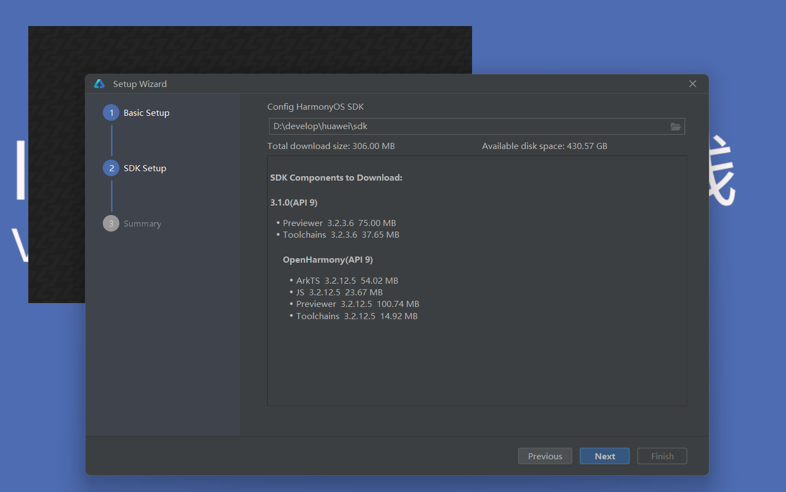


在弹出的SDK下载信息页面，单击**Next**，并在弹出的**License Agreement**窗口，阅读License协议，需同意License协议后，单击**Next**

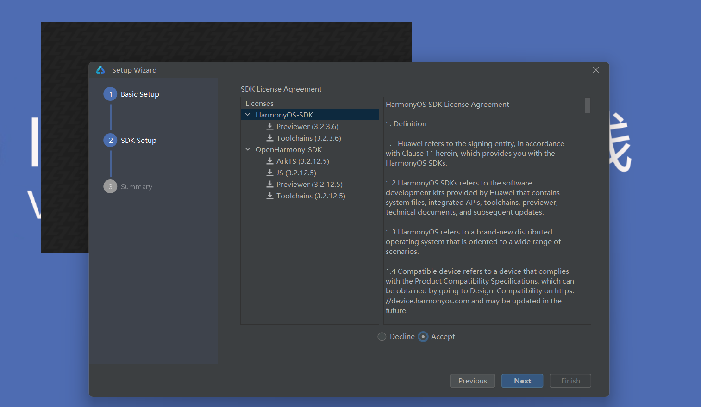

等待Node.js、ohpm和SDK下载完成后，单击**Finish**，界面会进入到DevEco Studio欢迎页。


### 2，HelloWorld

DevEco Studio配置开发环境完成后，可以通过运行Hello World工程来验证环境设置是否正确。接下来以创建一个Phone设备的工程为例进行介绍。


打开DevEco Studio，在欢迎页单击**Create Project**，创建一个新工程。

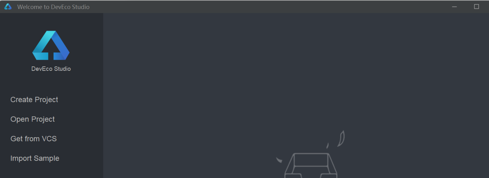


根据工程创建向导，选择创建Application应用或Atomic Service元服务。选择“Empty Ability”模板，然后单击**Next**。

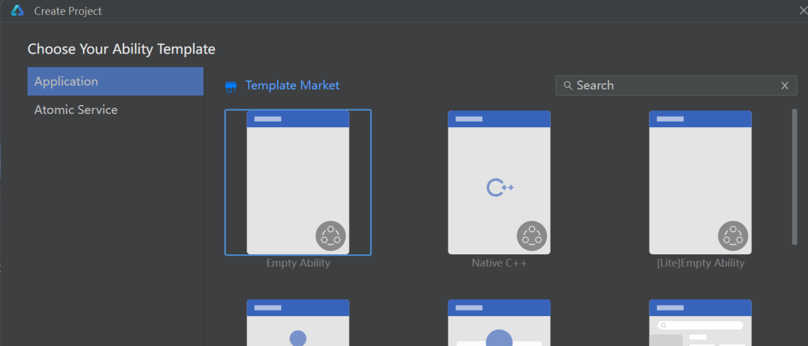


填写工程相关信息，保持默认值即可，单击**Finish**。关于各个参数的详细介绍

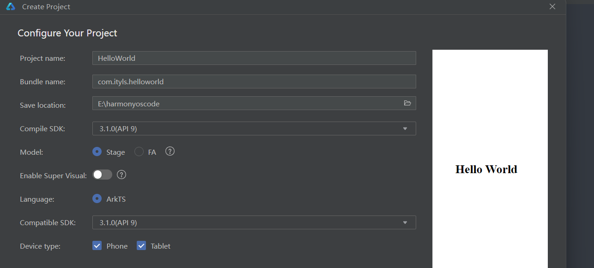


在DevEco Studio右侧菜单栏，单击**Previewer**。这种预览方式可以快速看到项目效果，但是如果项目过于复杂，则需要使用模拟器或者真机测试

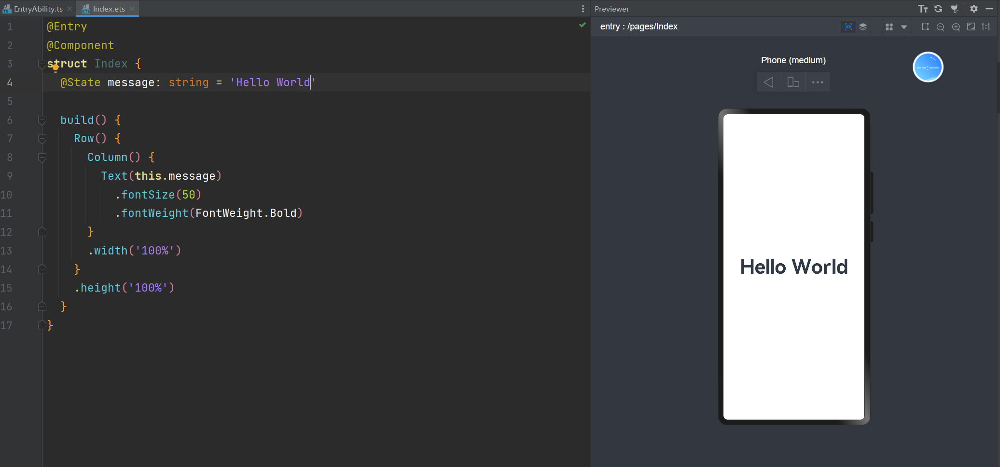


值得夸赞的是，Previewer支持热更新，在修改代码之后，保存可以自动更新效果

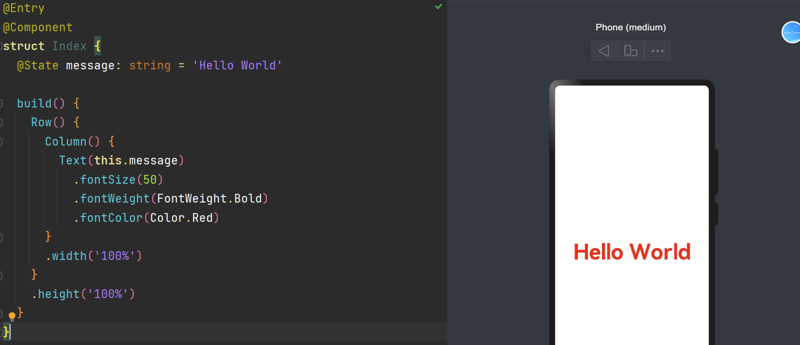


### 3，创建模拟器

**Previewer**预览项目，这种预览方式可以快速看到项目效果，但是如果项目过于复杂，则需要使用模拟器或者真机测试。


**诊断开发环境：**DevEco Studio开发环境诊断项包括电脑的配置、网络的连通情况、依赖的工具或SDK等。首先需要在DevEco Studio菜单栏，单击**Tools > SDK**。在弹出的对话框中，勾选**System-image-phone**进行下载。下载的项目比较大，等待时间较长。

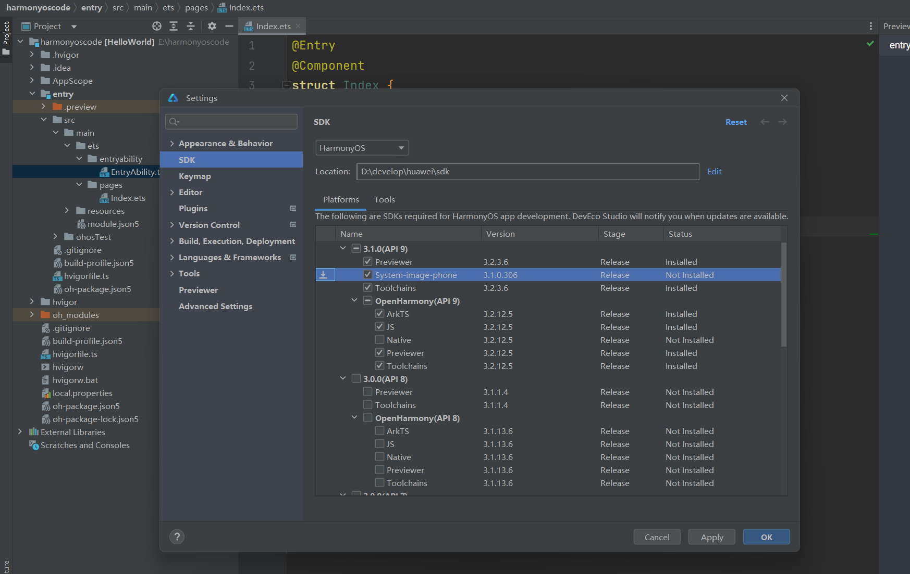


在DevEco Studio菜单栏，单击**Tools > Device Manager**。

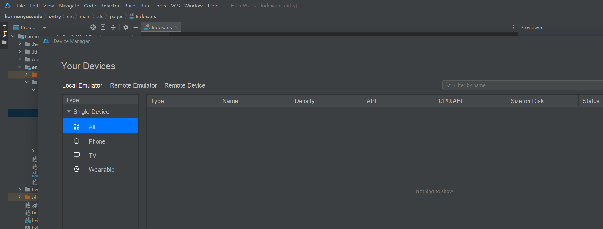


安装完SDK相关配置，创建模拟器

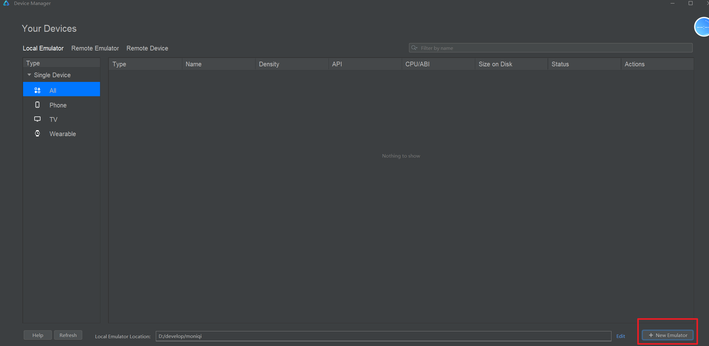

模拟器可以创建手表模拟器、电视模拟器和手机模拟器

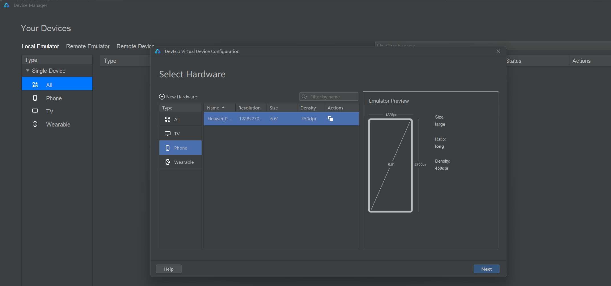

在模拟器创建的高级设置中，可以配置模拟器的内存、存储空间和CPU等设置。创建完成之后启动模拟器，点击**Action**启动即可

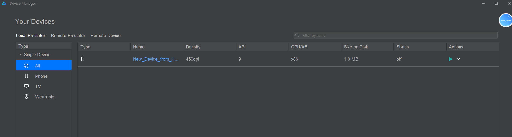


回到IDE中，选择手机模拟器，然后点击运行即可

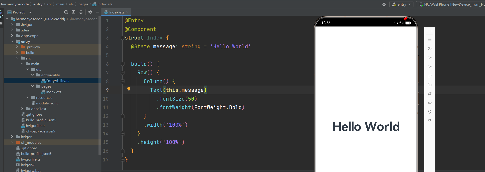


### 4，项目目录结构

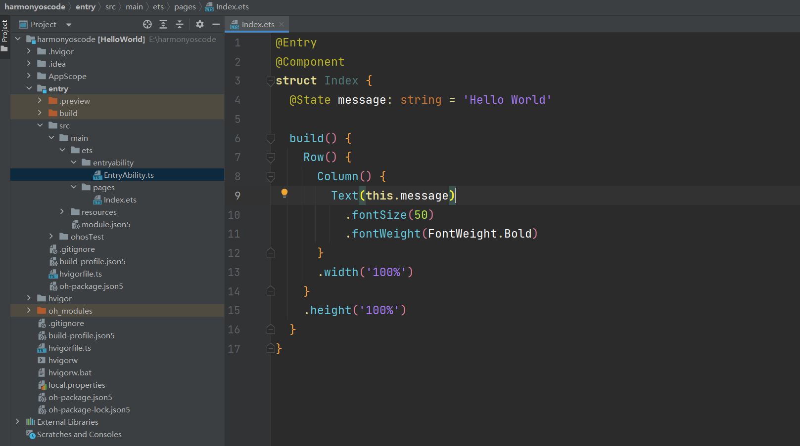

- **AppScope > app.json5**：应用的全局配置信息
- **entry**：HarmonyOS工程模块，编译构建生成一个HAP包
  - **src > main > ets**：用于存放ArkTS源码
  - **src > main > ets > entryability**：应用/服务的入口
  - **src > main > ets > pages**：应用/服务包含的页面
  - **src > main > resources**：用于存放应用/服务所用到的资源文件，如图形、多媒体、字符串、布局文件等。关于资源文件
  - **src > main > module.json5**：Stage模型模块配置文件。主要包含HAP包的配置信息、应用/服务在具体设备上的配置信息以及应用/服务的全局配置信息
  - **build-profile.json5**：当前的模块信息、编译信息配置项，包括buildOption、targets配置等。其中targets中可配置当前运行环境，默认为HarmonyOS
  - **hvigorfile.ts**：模块级编译构建任务脚本，开发者可以自定义相关任务和代码实现
- **oh_modules**：用于存放三方库依赖信息
- **build-profile.json5**：应用级配置信息，包括签名、产品配置等
- **hvigorfile.ts**：应用级编译构建任务脚本


### 5，页面跳转

搞定了开发前的准备工作之后，我们尝试完成两个页面之间的跳转。代码初始化结构：

```js
/**
 * 装饰器：用于装饰类、结构、方法以及变量，并赋予其特殊的含义。
 * @Entry：表示该自定义组件为入口组件
*  @Component：表示自定义组件
 * @State：表示组件中的状态变量，状态变量变化会触发UI刷新
 */
@Entry
@Component
/**
 * HarmonyOS是组件化开发
 * struct Index{}：自定义组件，可复用的UI单元，可组合其他组件
 */
struct Index {
 @State message: string = 'Hello World'
 /**
  * UI描述
  * build(){}：以声明式的方式来描述UI的结构
  */
 build() {
  /**
   * 系统组件
   * Row/Column/Text：有ArkUI提供的组件
   *  - 容器组件：用来完成布局，例如：Row/Column
   *  - 基础组件：自带样式功能的页面元素，例如：Text
   */
  Row() {
   Column() {
    Text(this.message)
     /**
      * 属性方法：设置组件的UI样式，方法比较多，后面在慢慢讲解
      */
      .fontSize(50)
      .fontWeight(FontWeight.Bold)
      .fontColor(Color.Red)
    }
    .width('100%')
   }
   .height('100%')
  }
}
```


### 6，创建第二个页面

新建第二个页面文件。在“**Project**”窗口，打开“**entry > src > main > ets ”，右键点击“pages**”文件夹，选择“**New > ArkTS File**”，命名为“**About**”，点击“**Finish**”。

配置第二个页面的路由。在“**Project**”窗口，打开“**entry > src > main > resources > base > profile**”，在main_pages.json文件中的"src"下配置第二个页面的路由"pages/About"

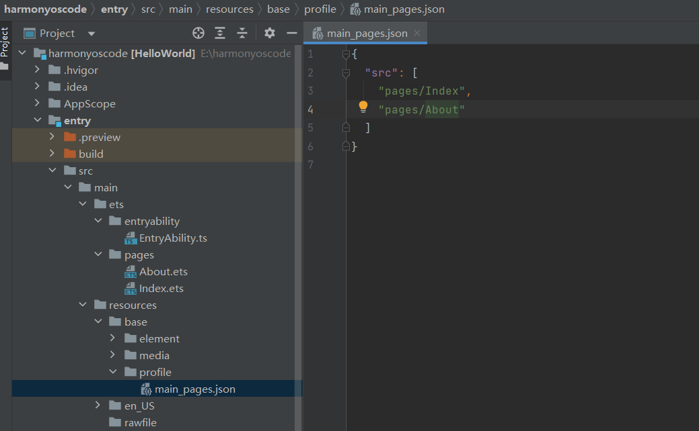

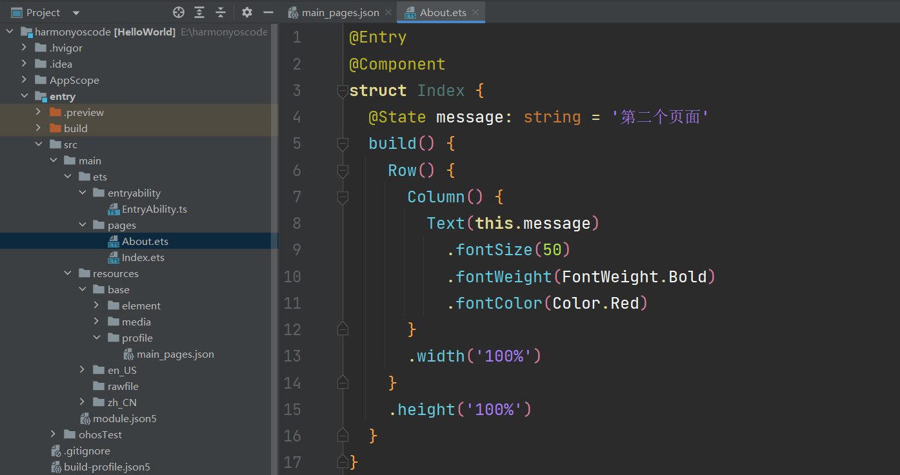


增加按钮组件，并实现点击事件和跳转到第一个页面

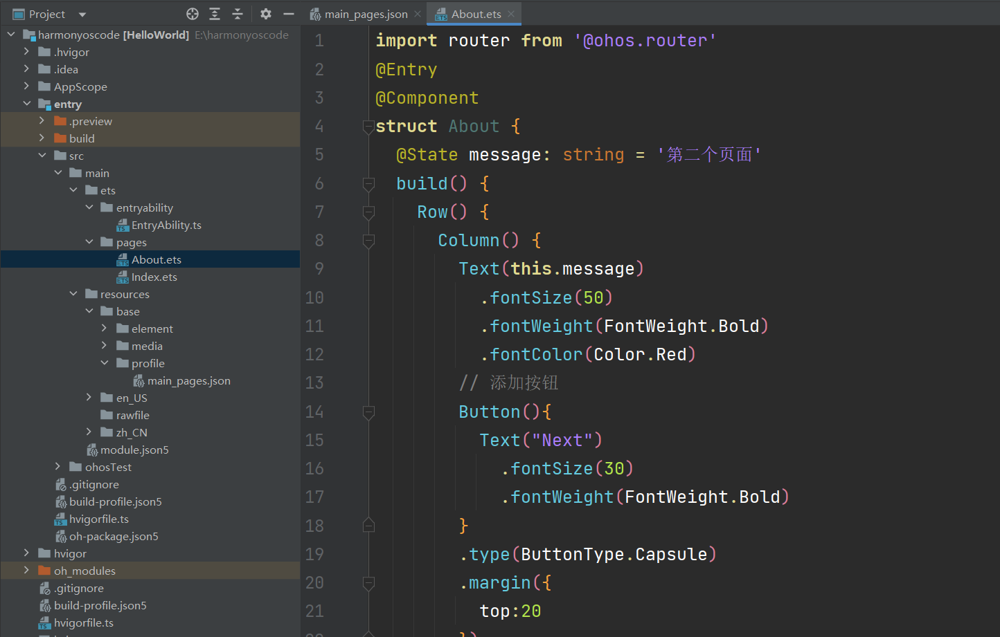

```js
import router from '@ohos.router'
@Entry
@Component
struct About {
 @State message: string = '第二个页面'
 build() {
  Row() {
   Column() {
    Text(this.message)
      .fontSize(50)
      .fontWeight(FontWeight.Bold)
      .fontColor(Color.Red)
    // 添加按钮
    Button(){
     Text("Next")
       .fontSize(30)
       .fontWeight(FontWeight.Bold)
     }
     .type(ButtonType.Capsule)
     .margin({
     	top:20
     })
     .padding({
     	left:20,
     	right:20
     })
     // 事件方法
     .onClick(() =>{
     		console.info(`点击事件`)
    	 	// 跳转到第一个页面
     		router.pushUrl({url:'pages/Index'}).then(() =>{
      		console.log("跳转成功")
      	}).catch(() =>{
        	console.log("跳转失败")
      })
     })
    }
    .width('100%')
   }
   .height('100%')
  }
}
```


测试：

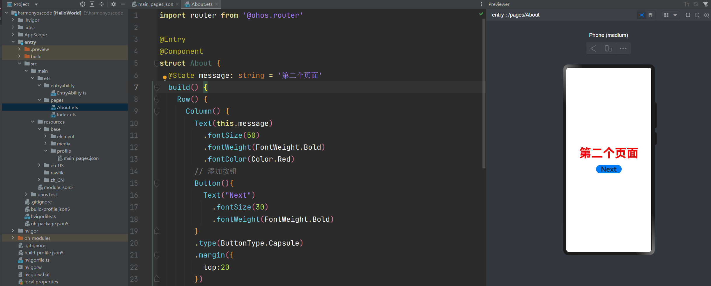


### 7，自定义组件

在ArkUI中，UI显示的内容均为组件，由框架直接提供的称为系统组件，由开发者定义的称为自定义组件。在进行 UI 界面开发时，通常不是简单的将系统组件进行组合使用，而是需要考虑代码可复用性、业务逻辑与UI分离，后续版本演进等因素。因此，将UI和部分业务逻辑封装成自定义组件是不可或缺的能力。


**自定义组件具有以下特点：**

- 可组合：允许开发者组合使用系统组件、及其属性和方法。
- 可重用：自定义组件可以被其他组件重用，并作为不同的实例在不同的父组件或容器中使用。
- 数据驱动UI更新：通过状态变量的改变，来驱动UI的刷新。


**自定义组件的基本用法：**

```js
@Component
export default struct CounterComponent {
  @State
  message: string = 'Hello, Counter!';

  build() {
    // CounterCompoennt自定义组件组合系统组件Row和Text
    Row() {
      Text(this.message)
        .fontSize(30)
        .fontWeight(FontWeight.Bold)
        .onClick(() => {
          // 状态变量message的改变驱动UI刷新，UI从'Hello, Counter!'刷新为'Hello, ArkUI!'
          this.message = 'Hello, ArkUI!';
        })
    }
  }
}

@Entry
@Component
struct Index {
  build() {
    Row() {
      CounterComponent()
      CounterComponent()
      CounterComponent()
    }
  }
}
```

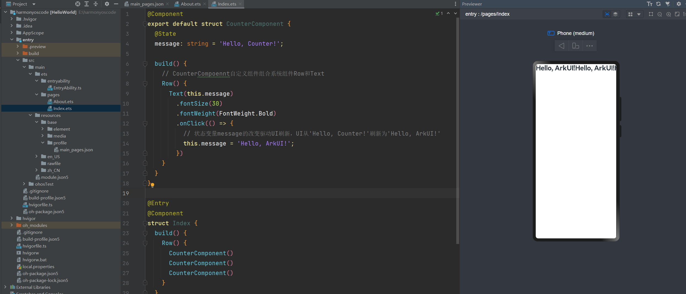


如果在另外的文件中引用该自定义组件，需要使用export关键字导出，并在使用的页面import该自定义组件

```js
// 组件文件中
export default CounterComponent
// 使用组件文件中
import CounterComponent from "../components/CounterComponent"
```

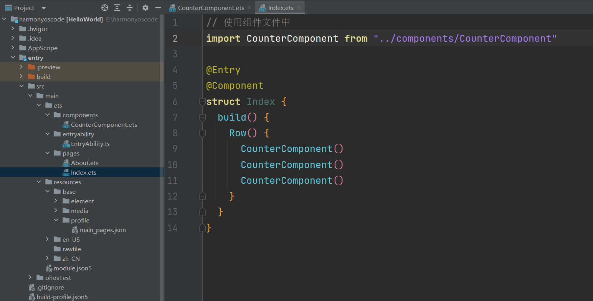