## 1. DOM介绍

### 1.1 认识DOM

**JavaScript是一门编程语言，它的运行环境有两个，一个是浏览器，一个是node，前面我们学的JS必于ECMAScript中的语法，浏览器的JS有三部分组成：**

- ECMAScript
- DOM
- BOM

> ECMAScript并不能和和网页进行交互，操作浏览器（网页），就需要给我们提供一个API，我们去调用API，实现操作，学习DOM和BOM就是学习浏览器给我们提供的API，所以说，DOM和BOM操作，也叫WebAPI。


**深入理解DOM**
- 浏览器将我们编写在HTML中的每一个元素（Element）都抽象成了一个个对象
- 所有这些对象都可以通过JavaScript来对其进行访问，那么我们就可以通过JavaScript来操作页面
- 将这个抽象过程称之为 文档对象模型（Document Object Model）


**DOM：Docuemnt Object Model  文档对象模型**

- 文档：html文档   之前的html文件就可以称一个文档
- Object: 对象  一切都是对象  所有的元素都是对象
- Model：模型 树模型   所有的元素，要形成一个树模型 


**整个文档被抽象到 document 对象中**
- 如document.documentElement对应的是html元素
- 如document.body对应的是body元素
- 如document.head对应的是head元素

```html
<script>
// 下面的一行代码可以让整个页面变成红色
document.body.style.background = "gold";
</script>
```

**DOM树**

- 在html结构中，最终会形成一个树结构

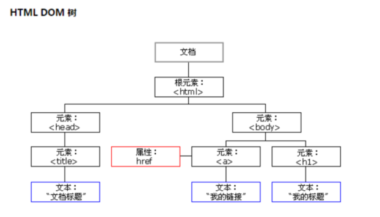


### 1.2 重新认识window

**前面我们学习了一个window的全局对象，window上事实上就包含了这些内容**
- JavaScript语法部分的Object、Array、Date等
- DOM
- BOM

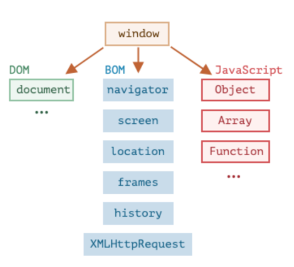


## 2. document对象

**Document节点表示的整个载入的网页，它的实例是全局的document对象**
- 对DOM的所有操作都是从 document 对象开始的
- 它是DOM的 入口点，可以从document开始去访问任何节点元素

**对于最顶层的html、head、body元素，我们可以直接在document对象中获取到**
- document.documentElement 得到 html元素
- document.body 得到 body元素
- document.head 得到 head元素
- document.doctype 得到 文档声明元素

```html
<body>
    <script>
        // document是内置对象  也是GO中的
        // 一个节点就是一个对象
        // 对象是属性和方法的无序集合  api
        // 学习DOM操作就学习一个对象中的属性或方法  api
        // console.dir(document);

        // 获取head元素节点
        // console.log(document.head);

        // 获取title元素节点中的文本节点
        // console.log(document.title);

        // 获取body元素节点
        // console.log(document.body);

        document.write("<h1>Hello DOM</h1>")
    </script>
</body>
```


## 3. 节点与节点关系

**节点分类：**
- 元素节点
- 文本节点
- 属性节点
- 注释节点
- ... 

**注意点：**
- 在DOM树上，只需要关注元素节点和文本节点，在DOM上，没有属性节点。
- 我们只需要关注三种节点：1）元素节点  2）文本节点   3）属性节点

```html
<body>
    <!-- 我是一个注释 -->
    <div id="box" title="haha">我是一个DIV</div>
    <a href="http://www.baidu.com">百度一下</a>

    <script>
        let oDiv = document.getElementById("box");
        // nodeType判断一个节点的类型
        // 如果是元素节点  它的nodeType是1
        console.log(oDiv.nodeType);  // 1 

        // 要获取属性节点，必须先得到元素节点
        // 通过打点的形式，就可以获取属性节点
        // console.log(oDiv.title); // haha

        // getAttribute 根据属性名获取属性值的
        console.log(oDiv.getAttribute("title")); // haha
        // getAttributeNode 获取属性节点
        let attr = oDiv.getAttributeNode("title"); // 2
        console.log(attr.nodeType);

        let text = oDiv.firstChild;
        console.log(text);  // 我是一个DIV
        console.log(text.nodeType); // 3
    </script>
</body>
```

**节点之间的关系一：**
- 获取到一个节点（Node）后，可以根据这个节点去获取其他的节点，我们称之为节点之间的关系
- 父节点：parentNode
- 前兄弟节点：previousSibling
- 后兄弟节点：nextSibling
- 子节点：childNodes
- 第一个子节点：firstChild
- 最后一个子节点：lastChild

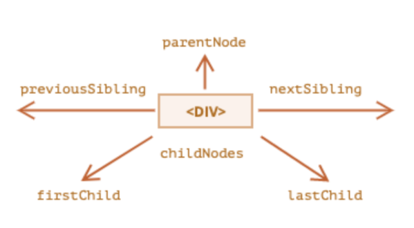

```html
<body>
    <!-- 我是一个注释 -->
    我是一个文本
    <div class="box">
        我是一个孤独的DIV
    </div>
    <ul>
        <li>One</li>
        <li>Two</li>
        <li>Three</li>
    </ul>
    <!-- <script>
        // 获取body的元素节点
        let bodyEle = document.body;

        console.log(bodyEle.firstChild);  // #text 换行节点

        console.log(bodyEle.firstChild.nextSibling);

        console.log(bodyEle.parentNode);
    </script> -->

    <script>
        // 通过节点关系去获取某些节点，非常麻烦，因为需要考虑换行节点和注释节点
        let bodyEle = document.body;
        console.log(bodyEle.firstChild.nextSibling.nextSibling.nextSibling);
    </script>
</body>
```


**节点之间的关系二：**
- 获取到一个节点（Node）后，可以根据这个节点去获取其他的节点，我们称之为节点之间的关系
- 父节点：parentElement
- 前兄弟节点：previousElementSibling
- 后兄弟节点：nextElementSibling
- 子节点：children
- 第一个子节点：firstElementChild
- 最后一个子节点：lastElementChild

```html
<body>
    <!-- 我是一个注释 -->
    我是一个文本
    <div class="box">
        我是一个孤独的DIV
    </div>
    <ul>
        <li>One</li>
        <li>Two</li>
        <li>Three</li>
    </ul>
    <script>
        let bodyEle = document.body;
        console.log(bodyEle.firstElementChild);
        console.log(bodyEle.firstElementChild.nextElementSibling);
        // 得到一个伪数组
        console.log(bodyEle.firstElementChild.nextElementSibling.children);
    </script>
</body>
```


**节点关系总结（加粗的是需要记的）：**
- **parentNode**    获取父元素节点    没有兼容性问题
- **parentElement**   获取父元素节点    没有兼容性问题   
- firstChild   获取第一个子节点  会考虑换行节点和注释节点   不要用
- **firstElementChild**   获取第一个子元素节点   可以使用
- lastChild    获取最后一个子节点  会考虑换行节点和注释节点   不要用
- **lastElementChild**   获取最后一个子元素节点   可以使用
- nextSibling  获取下一个兄弟节点   会考虑换行节点和注释节点   不要用
- **nextElementSibling** 获取下一个兄弟元素节点    可以使用
- previousSibling   获取上一个兄弟节点   会考虑换行节点和注释节点   不要用
- **previousElementSibling**   获取上一个兄弟元素节点    可以使用


## 4. 获取元素节点的方法

通过节点关系可以得到某个元素，但是，在实际开发中，我们希望可以任意的获取到某一个元素应该如何操作呢？

**DOM为我们提供了获取元素的方法：**

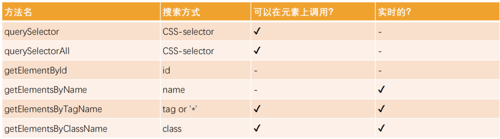


**最常用的几个方法如下：**
- document.getElementById
- document.getElementsByTagName
- document.querySelectorAll
- document.querySelector


```html
<body>
    <div id="box" name="a" class="item">我是一个DIV1</div>
    <div id="box" name="a" class="item">我是一个DIV2</div>

    <p class="father">
        <span class="son">son</span>
    </p>

    <ul class="wrap">
        <li>1</li>
        <li>2</li>
        <li>3</li>
    </ul>
    <script>
        // 1) ------  document.getElementById  获取1个
        // let oDiv = document.getElementById("box")
        // console.dir(oDiv);

        // 2) ------  document.getElementsByTagName 得到的是伪数组
        //     伪数组  本质是对象   Array.from()
        //     是文档中所有的div  要获取某个div，需要通过索引
        // let oDivs = document.getElementsByTagName("div")
        // console.log(oDivs)
        // console.log(oDivs[0])

        // 3) ------  document.getElementsByName 得到的是伪数组
        //     是文档中所有的div  要获取某个div，需要通过索引
        // let oDivs = document.getElementsByName("a")
        // console.log(oDivs)
        // console.log(oDivs[0])

        // 4) ------  document.getElementsByClassName 得到的是伪数组
        // let oDivs = document.getElementsByClassName("item")
        // console.log(oDivs)
        // console.log(oDivs[0])

        // 5) ------  document.querySelectorAll 得到的是伪数组
        // querySelector是选择器的意思    通过选择器来获取元素
        // querySelectorAll 获取多个
        // let lis = document.querySelectorAll("li")
        // console.log(Array.isArray(lis)); // 得到的也是一个伪数组
        // console.log(lis[0]);

        // 6) ------  document.querySelector 得到的是伪数组
        // querySelector 获取第1个
        // let li = document.querySelector("li")
        // console.log(li);
    </script>
</body>
```


## 5. 节点的属性

### 5.1 节点的属性之nodeType

**不同的节点类型有可能有不同的属性，但它们有共有属性：**
- nodeType 属性提供了一种获取节点类型的方法
- 其他类型可以查看MDN文档： https://developer.mozilla.org/zh-CN/docs/Web/API/Node/nodeType

**常见的节点类型有如下：**

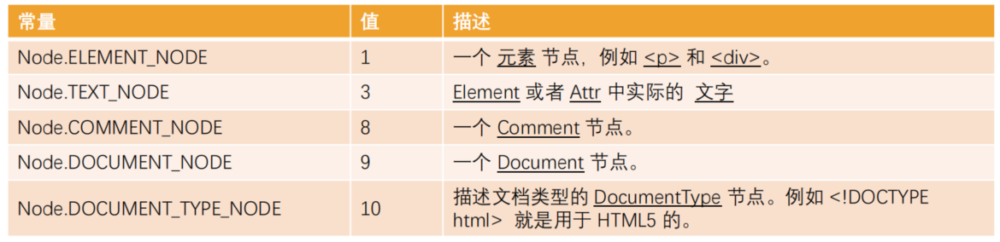


```html
<body>
    <!-- 我是一个注释 -->
    我是文本
    <div class="father">
        <h2>我是一个H2</h2>
        <p>我是内容</p>
    </div>
    <script>
        let bodyChildNodes = document.body.childNodes;
        let commentNode = bodyChildNodes[1];
        let textNode = bodyChildNodes[2];
        let divNode = bodyChildNodes[3];

        console.log(commentNode.nodeType);
        console.log(textNode.nodeType);
        console.log(divNode.nodeType);

        for(let node of bodyChildNodes){
            if(node.nodeType === 8){
                console.log(node + "是注释节点");
            }else if(node.nodeType === 3){
                console.log(node + "是文本节点");
            }else if(node.nodeType === 1){
                console.log(node + "是元素节点");
            }
        }
    </script>
</body>
```


### 5.2 节点的属性之nodeName

- nodeName：获取node节点的名字；
- tagName：获取元素的标签名词；

**tagName 和 nodeName 之间有什么不同呢？**

- tagName 属性仅适用于 Element 节点；
- nodeName 是为任意 Node 定义的
- nodeName 对于元素，它的意义与 tagName 相同，所以使用哪一个都是可以的；
- nodeName 对于其他节点类型（text，comment 等），它拥有一个对应节点类型的字符串；

```html
<body>
    <!-- 我是一个注释 -->
    我是文本
    <div class="father">
        <h2>我是一个H2</h2>
        <p>我是内容</p>
    </div>
    <script>
        let bodyChildNodes = document.body.childNodes;
        let commentNode = bodyChildNodes[1];
        let textNode = bodyChildNodes[2];
        let divNode = bodyChildNodes[3];

        // 得到节点名
        console.log(commentNode.nodeName);  // #comment
        console.log(textNode.nodeName);  // #text
        console.log(divNode.nodeName);  // #DIV

        console.log("-------------");

        console.log(commentNode.tagName);  // undefined
        console.log(textNode.tagName);  // undefined
        console.log(divNode.tagName);  // #DIV
    </script>
</body>
```


### 5.3 节点的属性之innerHTML和textContent

**innerHTML 属性**
- 将元素中的 HTML 获取为字符串形式
- 设置元素中的内容；

```html
<body>
    <!-- 我是一个注释 -->
    我是文本
    <div class="father">
        <h2>我是一个H2</h2>
        <p>我是内容</p>
    </div>
    <script>
        let bodyChildNodes = document.body.childNodes;
        let commentNode = bodyChildNodes[1];
        let textNode = bodyChildNodes[2];
        let divNode = bodyChildNodes[3];

        // 获取div标签中的内容
        console.log(divNode.innerHTML);
        // 设置div标签中的内容
        divNode.innerHTML = "<strong>我是一个Strong标签</strong>"
    </script>
</body>
```

**outerHTML 属性**
- 包含了元素的完整 HTML
- innerHTML 加上元素本身一样；

```html
<body>
    <!-- 我是一个注释 -->
    我是文本
    <div class="father">
        <h2>我是一个H2</h2>
        <p>我是内容</p>
    </div>
    <script>
        let bodyChildNodes = document.body.childNodes;
        let divNode = bodyChildNodes[3];

        // 获取div标签中的内容  outerHTML相比innerHTML来说，带上自己本身
        console.log(divNode.outerHTML);

        // 对于设置来说，使用innerHTML多一点
        divNode.outerHTML = "<strong>我是一个Strong标签</strong>"
    </script>
</body>
```

**textContent 属性**
- 仅仅获取元素中的文本内容；

```html
<body>
    <!-- 我是一个注释 -->
    我是文本
    <div class="father">
        <h2>我是一个H2</h2>
        <p>我是内容</p>
    </div>
    <script>
        let bodyChildNodes = document.body.childNodes;
        let divNode = bodyChildNodes[3];

        // 只能获取文本节点
        console.log(divNode.textContent);

        //  设置也是针对文本节点，如果写了标签，也不会解析
        divNode.textContent = "<strong>我是一个Strong标签</strong>";
    </script>
</body>
```

**innerHTML和textContent的区别：**
- 使用 innerHTML，我们将其“作为 HTML”插入，带有所有 HTML 标签。
- 使用 textContent，我们将其“作为文本”插入，所有符号（symbol）均按字面意义处理。


### 5.4 节点的属性之nodeValue

- 用于获取非元素节点的文本内容

```html
<body>
    <!-- 我是一个注释 -->
    我是文本
    <div class="father">
        <h2>我是一个H2</h2>
        <p>我是内容</p>
    </div>
    <script>
        let bodyChildNodes = document.body.childNodes;
        let commentNode = bodyChildNodes[1];
        let textNode = bodyChildNodes[2];
        let divNode = bodyChildNodes[3];

        // 获取注释节点中的内容
        console.log(commentNode.nodeValue);
        // 获取文本节点中的内容
        console.log(textNode.nodeValue);
        // 元素节点的nodeValue是null
        console.log(divNode.nodeValue);  // null
    </script>
</body>
```

### 5.5 节点的属性之hidden

- 用于设置元素隐藏

```html
<body>
    <button id="btn">Toggle</button>
    <div class="box" style="color: red;">
        Hello DOM~
    </div>
    <script>
        let btn = document.getElementById("btn");
        let div = document.getElementsByTagName("div")[0];
        
        // console.log("start...");

        // 给btn绑定点击事件  btn叫事件源    click叫点击事件（事件类型）
        // function(){} 事件处理程序，也叫监听器
        // 事件绑定是异步任务，是宏任务
        btn.onclick = function(){
            // console.log("click...");
            // 隐藏div
            // div.style.display = "none";  // 隐藏方式一
            // div.hidden = true; // 隐藏方式二

            // if(div.hidden === false){
            //     div.hidden = true;
            // }else{
            //     div.hidden = false;
            // }

            // 经典
            div.hidden = !div.hidden
        }
        // console.log("end...");
    </script>
</body>
```

## 6. 创建和挂载节点

**我们想要插入一个元素，通常会按照如下步骤：**
- 步骤一：创建一个元素；
- 步骤二：插入元素到DOM的某一个位置；


**创建节点：**
- createElement  创建元素节点
- createTextNode  创建文本节点
- createComment   创建注释节点
- createAttribute   创建属性节点

**挂载节点：**
- node.append(...nodes or strings) —— 在 node 末尾 插入节点或字符串，
- node.prepend(...nodes or strings) —— 在 node 开头 插入节点或字符串，
- node.before(...nodes or strings) —— 在 node 前面 插入节点或字符串，
- node.after(...nodes or strings) —— 在 node 后面 插入节点或字符串，
- node.replaceWith(...nodes or strings) —— 将 node 替换为给定的节点或字符串。

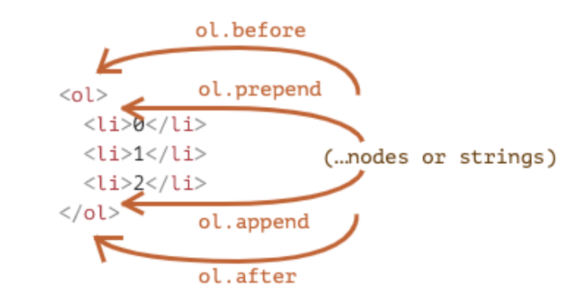

```html
<body>
    <div class="father">
        <div class="son">
            SON
        </div>
    </div>

    <script>
        let father = document.querySelector(".father");

        // 使用innerHTML也可以添加元素，不推荐
        // father.innerHTML = "<h2>我是一个H2标签</h2>";

        let h2Ele = document.createElement("h2");
        h2Ele.textContent = "我是H2标签";
        console.log(h2Ele);

        // 需要把h2挂载到DOM树上
        father.append(h2Ele);
        // father.prepend(h2Ele)
        // father.before(h2Ele)
        // father.after(h2Ele)
        // father.replaceWith(h2Ele)

        let spanEle = document.createElement("span");
        spanEle.textContent = "我是一个孤独的span";

        h2Ele.append(spanEle)
    </script>
</body>
```

## 7. 删除，替换，克隆节点

**删除节点：**
- removeChild   只有父元素才有资格删除一个子元素
- remove   移除元素我们可以调用元素本身的remove方法：

```html
<body>
    <div class="father">
        <div class="son">
            son
        </div>
    </div>
    <script>
        let father = document.querySelector(".father");
        let son = document.querySelector(".son");

        // son.remove， 自己移除自己
        // son.remove();

        // 父也有能力去移除它里面的元素
        father.removeChild(son)
    </script>
</body>
```

**替换节点：**
- replaceChild

```html
<body>
    <div class="father">
        <div class="son">
            son
        </div>
    </div>
    <script>
        let father = document.querySelector(".father");
        let son = document.querySelector(".son");

        let pEle = document.createElement("p");
        pEle.textContent = "GrandSon";

        father.replaceChild(pEle,son)

    </script>
</body>
```

**如果我们想要复制一个现有的元素，可以通过cloneNode方法克隆节点：**
- 可以传入一个Boolean类型的值，来决定是否是深度克隆；
- 深度克隆会克隆对应元素的子元素，否则不会；

```html
<body>
    <div class="father">
        <div class="son">
            son
        </div>
    </div>
    <script>
        let father = document.querySelector(".father");
        let son = document.querySelector(".son");

        // 默认是浅copy  只copy一个节点，内部的其它节点不会copy
        // let newFather = father.cloneNode();
        // console.log(newFather);

        // 如果传递一个true表示深copy   如果不传或传一个false表示浅copy
        let newFather = father.cloneNode(true);
        console.log(newFather);
    </script>
</body>
```

## 8. 元素的属性之attribute

**一个元素除了有开始标签、结束标签、内容之外，还有很多的属性（attribute）**


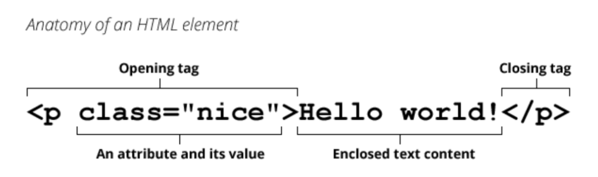


**浏览器在解析HTML元素时，会将对应的attribute也创建出来放到对应的元素对象上。**
- 比如id、class就是全局的attribute，会有对应的id、class属性；
- 比如href属性是针对a元素的，type、value属性是针对input元素的；


**attribute的分类**
- 标准的attribute：某些attribute属性是标准的，比如id、class、href、type、value等；
- 非标准的attribute：某些attribute属性是自定义的，比如abc、age、height等；


## 9. attribute的操作

**对于所有的attribute访问都支持如下的方法：**

- elem.hasAttribute(name) — 检查特性是否存在。
- elem.getAttribute(name) — 获取这个特性值。
- elem.setAttribute(name, value) — 设置这个特性值。
- elem.removeAttribute(name) — 移除这个特性。
- attributes：attr对象的集合，具有name、value属性；


**attribute具备以下特征：**
- 它们的名字是大小写不敏感的（id 与 ID 相同）。
- 它们的值总是字符串类型的。

```html
<body>
    <div class="father" title="hehe" score="88" id="box">
        <div class="son" abc="abc" age="18">
            son
        </div>
    </div>

    <script>
        let boxEle = document.querySelector("#box");
        // 可以判断标准的、也可以判断非标准的
        // console.log(boxEle.hasAttribute("class"));
        // console.log(boxEle.hasAttribute("title"));
        // console.log(boxEle.hasAttribute("name"));
        // console.log(boxEle.hasAttribute("score"));

        // 通过Attribute的属性名，获取属性值
        // console.log(boxEle.getAttribute("class"));

        // 设置Attribute
        // boxEle.setAttribute("adress","bj")

        // 删除Attribute
        // boxEle.removeAttribute("title")

        // 得到所有的Attribute
        console.log(boxEle.attributes);
    </script>
</body>
```


## 10. 元素的属性之property（打点形式）

**对于标准的attribute，会在DOM对象上创建与其对应的property属性：**


**在大多数情况下，它们是相互作用的**

- 改变property，通过attribute获取的值，会随着改变；
- 通过attribute操作修改，property的值会随着改变；（但是input的value修改只能通过attribute的方法）

**除非特别情况，大多数情况下，设置、获取attribute，推荐使用property的方式**
- 因为它默认情况下是有类型的；


```html
<body>
    <div class="father" title="hehe" score="88" id="box">
        <div class="son" abc="abc" age="18">
            son
        </div>
    </div>

    <input type="text" class="ipt" value="我是默认值">

    <hr>

    <!-- checked="checked" -->
    <input type="checkbox" class="ipt2">

    <script>
        let boxEle = document.querySelector("#box");
        let iptEle = document.querySelector(".ipt")
        let iptEle2 = document.querySelector(".ipt2")

        // obj是对象  对象是属性（property）的无序集合
        // 所谓的property就是对象的中的属性
        // let obj = {
        //     name:"wc",  
        //     age:18
        // }
        
        // boxEle.setAttribute("title","xixi"); // 改变了attribute
        // console.log(boxEle.title);

        // boxEle.title = "heihei";  // 改变了propety
        // console.log(boxEle.getAttribute("title"));

        // iptEle.setAttribute("value","lala")
        // iptEle.value = "hehe"

        // 建议使用property
        console.log(iptEle2.checked);
        console.log(iptEle2.getAttribute("checked"));

    </script>
</body>
```

```html
<body>
    <div class="father" id="abc" title="hehe" age="18" score="88">
        我是一个DVI
    </div>
    <!-- <input type="checkbox" checked="checked"> -->
    <input type="checkbox" checked>

    <hr>
    <input type="text" class="account">
    <button class="btn">设置input的值</button>

    <script>
        let divEle = document.getElementById("abc");
        console.log(divEle.getAttribute("id"));
        console.log(divEle.getAttribute("age"));
        console.log("-----------------");
        console.log(divEle.id);
        // 对于非标准的attribute 是没有 对应的property
        console.log(divEle.age);  // undefined

        console.log("-------------------");

        let iptEle = document.getElementsByTagName("input")[0];
        // if(iptEle.getAttribute("checked")){
        //     console.log("处于选中状态");
        // }
        if(iptEle.checked){
            console.log("处于选中状态");
        }
        console.log(typeof iptEle.checked);

        console.log("-------------------");

        let iptEle2 = document.getElementsByTagName("input")[1];
        let btnEle = document.getElementsByClassName("btn")[0];

        btnEle.onclick = function(){
            // 通过property设置数据时，优先级是高于attribute
            iptEle2.value = "66666"; // 通过property来设置

            iptEle2.setAttribute("value",88888); // 通过attribute来设置
        }

    </script>
</body>
```

## 11. HTML5的data-*自定义属性

**HTML5的data-*自定义属性，它们可以在dataset属性中获取到的**

```html
<body>
    <!-- 以data-打头的，叫html5中的自定义属性 -->
    <div class="father" age="18" data-score="88" data-address="bj">
        我是一个孤独的DIV
    </div>
    <script>
        let boxEle = document.querySelector(".father");
        console.log(boxEle.dataset);
        console.log(boxEle.dataset.score);
        console.log(boxEle.dataset.address);
    </script>
</body>
```

## 12. 动态操作样式

**JavaScript动态修改样式，有两个选择：**
- 选择一：在CSS中编写好对应的样式，动态的添加class；
- 选择二：动态的修改style属性；

```html
<!DOCTYPE html>
<html lang="en">
<head>
    <meta charset="UTF-8">
    <meta name="viewport" content="width=device-width, initial-scale=1.0">
    <title>Document</title>
    <style>
        .active{
            color: red;
            font-size: 30px;
            background-color: gold;
        }
    </style>
</head>
<body>
    <div class="box">
        我是一个box
    </div>

    <script>
        let boxEle = document.querySelector(".box");

        boxEle.onclick = function(){
            // 1）操作行内样式
            // boxEle.style.color = "red";
            // boxEle.style.fontSize = "30px";
            // boxEle.style.backgroundColor = "gold";

            // 2）操作class类 
            // class的attribute 对应的 property是 className
            boxEle.className = "active"
        }
    </script>
</body>
</html>
```

### 12.1 元素的className和classList

**元素的class attribute，对应的property并非叫class，而是className：**
- 因为JavaScript早期是不允许使用class这种关键字来作为对象的属性，所以DOM规范使用了className
- 可以对className进行赋值，它会替换整个类中的字符串

**如果我们需要添加或者移除单个的class，那么可以使用classList属性：**
- elem.classList.add (class) ：添加一个类
- elem.classList.remove(class)：添加/移除类
- elem.classList.toggle(class) ：如果类不存在就添加类，存在就移除它
- elem.classList.contains(class)：检查给定类，返回 true/false


```html
<!DOCTYPE html>
<html lang="en">
<head>
    <meta charset="UTF-8">
    <meta name="viewport" content="width=device-width, initial-scale=1.0">
    <title>Document</title>
    <style>
        .active{
            color: red;
            font-size: 30px;
            background-color: gold;
        }
    </style>
</head>
<body>
    <div class="box">
        我是box
    </div>
    <button>切换</button>

    <script>
        let boxEle = document.querySelector(".box");
        // 把人家本身的覆盖掉了
        // boxEle.className = "active"

        // boxEle.classList.add("active")
        // boxEle.classList.remove("box")

        let btn = document.getElementsByTagName("button")[0];
        btn.onclick = function(){
            // boxEle.classList.add("active")

            // boxEle.classList.toggle("active")

            console.log(boxEle.classList.contains("box"));
        }
    </script>
</body>
</html>
```

### 12.2 元素的style属性

**单独修改某一个CSS属性，那么可以通过style来操作：**
- 对于多词（multi-word）属性，使用驼峰式 camelCase
- 多个样式的写法，我们需要使用cssText属性，不推荐这种用法，因为它会替换整个字符串


```html
<body>
    <div class="box" style="background-color: gold; color: white;">
        我是一个孤独的DIV
    </div>
    <script>
        let boxEle = document.querySelector(".box");
        // 获取
        console.log(boxEle.style.backgroundColor);
        console.log(boxEle.style.color);

        // 设置
        // boxEle.style.fontSize = "30px"
        // boxEle.style.color = "red"

        // 使用cssText 了解
        boxEle.style.cssText = "background-color: pink; font-size:30px; color:red;";
    </script>
</body>
```


### 12.3 元素style的读取 - getComputedStyle

- 对于内联样式，是可以通过style.*的方式读取到的
- 对于style、css文件中的样式，是读取不到的
- 通过getComputedStyle的全局函数来实现


```html
<!DOCTYPE html>
<html lang="en">
<head>
    <meta charset="UTF-8">
    <meta name="viewport" content="width=device-width, initial-scale=1.0">
    <title>Document</title>
    <style>
        .box{
            color: gold;
        }
    </style>
</head>
<body>
    
    <div class="box" style="background-color: red;">
        我是一个孤独的DIV
    </div>
    <script>
        let boxEle = document.querySelector(".box");
        console.log(boxEle.style.backgroundColor);
        // console.log(boxEle.style.color);

        console.log(getComputedStyle(boxEle).color);
    </script>
</body>
</html>
```

## 13. JS操作盒子模型

**js操作盒子模型：**

- 操作盒子模型的位置
- 操作盒子模型的大小


**不管是操作盒子模型的位置，还是盒子模型的大小，一共有13个api:  说明：需要记的没几个，三类：**
- client系列   width  height  top  left
- offset系列   width  height  top  left   parent
- scroll系列    width  height  top  left


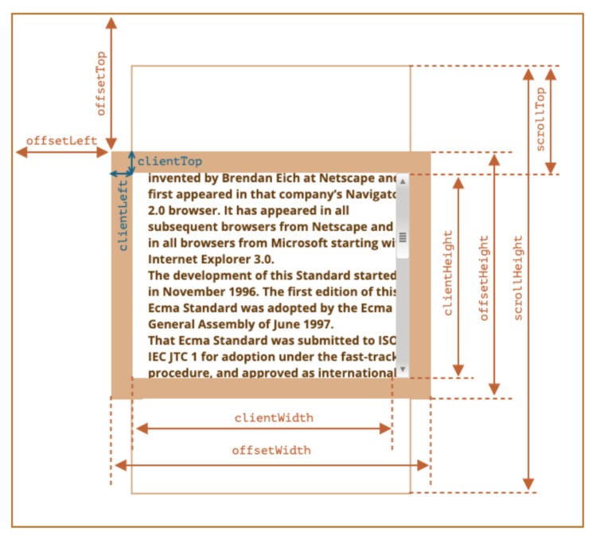


### 13.1 client家族

**client系列：**
- clientWidth（可视区域宽度）: 获取盒子的内容width+左右的padding
- clientHeight（可视区域高度）: 获取盒子的内容height+上下的padding
- clientTop:获取盒子的上边框的粗细，了解
- clientLeft:获取盒子的左边框的粗细，了解


**要获取当前页面内容的宽度（可视区域）：**
- console.log(document.body.clientWidth) // 获取一屏的宽度
- console.log(document.documentElement.clientWidth)
  

**要获取当前页面内容的高度（可视区域）：**
- console.log(document.body.clientHeight); // 获取内容（多屏）的高度 获取可视区域高度
- console.log(document.documentElement.clientHeight); // 获取一屏的高度


**client系列的注意点：**
- 不能获取，不能设置，它们是只读的  
- 得到的是一个数值，没有单位
- 得到的是一个整数，不是小数，及时测试量出来是小数，也会转化成整数
- 不管你的内容是否溢出，得到的是可视区的大小  


### 13.2 offset家族


**offset系列：**
- offsetWidth: box.offsetWidth  在clientWidth的基础上加了border  不常用
- offsetHeight: box.offsetHeight  在clientHeight的基础上加了border  不常用
- offsetTop: 获取一个绝对定位元素相对于参考点的上面的距离
- offsetLeft: 获取一个绝对定位元素相对于参考点的左面的距离
- offsetParent(***): 获取一个定位元素的参考点


### 13.3 scroll家族


**scrollWidth:**
- 在没有内容溢出(水平方向上的溢出)的情况下：scrollWidth == clientWidth
- 在内容溢出的情况下：scrollWidth的值约等于真实内容的宽度，此时，clientWidth的值是约等于，不同浏览器中得到的值可能不一样
- overflow属性会影响scrollWidth。 只能获取值，不能设置值


**scrollHeight:**
- 在没有内容溢出的情况下：scrollHeight = clientHeight
- 在内容溢出的情况下：scrollHeight的值约等于真实内容的高度，不同浏览器中得到的值可能不一样
- overflow属性会影响scrollHeight。
- 只能获取值，不能设置值


**scrollTop:**
- 获取垂直滚动条滚动的距离（获取垂直滚动条卷去的高度）
- 特殊：不只可以获取，也可以设置（可读可写）  重要


> 问：如何获取当前页面卷上去高度？     <br />
> 答：1）document.body.scrollTop   2）document.documentElement.scrollTop


> 问：一张网页卷上去最大高度是多少？   <br />
> 答：scrollHeight - clientHeight


**可视区的高度 + 卷上去的高度 约等于 内容的高度**


**scrollLeft: 没什么用**
- 特殊：不只可以获取，也可以设置（可读可写）
- 获取水平滚动条滚动的距离（获取水平滚动条卷去的距离）  基本上用不到


> 问：我要获取当前页面真实内容的高度。  <br />
> 答：1）document.body.scrollHeight   2）document.documentElement.scrollHeight


### 13.4 总结
**client系列: width, height, top, left**
- clientWidth/clientHeight: 获取盒子或页面可视区域的宽高
- clientTop:获取盒子的上边框的大小
- clientLeft:获取盒子的左边框的大小

**offset系列: width, height, top, left, parent**
- offsetWidth/offsetHeight: 获取盒子或页面可视区域的宽高+border
- offsetTop:获取一个定位元素相对于参考点的上面的距离
- offsetLeft:获取一个定位元素相对于参考点的左面的距离
- offsetParent:获取一个定位元素的参考点

**scroll系列: width, height, top, left**
- scrollWidth/scrollHeight:获取盒子或页面真实内容的宽度
- scrollTop:获取页面或盒子向上卷去的高度
- scrollLeft:获取页面或盒子向左卷去的宽度  基本上用不到
        

**需要记的三个常用高度：**    
- 获取一张网页可视区的高度：document.body.clientHeight 
- 获取一张网页真实的高度：document.body.scrollHeight   
- 获取一张网页卷去的高度：document.body.scrollTop


## 14. 事件类型

**事件 + 事件的反馈 = 前端交互（前端的核心）**


**鼠标事件：**
- onclick 点击事件  = onmousedown + onmouseup
- ondbclick  双击事件
- onmousedown   鼠标按下去
- onmouseup   鼠标抬起来
- onmouseover   鼠标移到某元素上面
- onmouseout   鼠标离开某元素上面
- onmousemove   鼠标在元素上面的移动
- ....

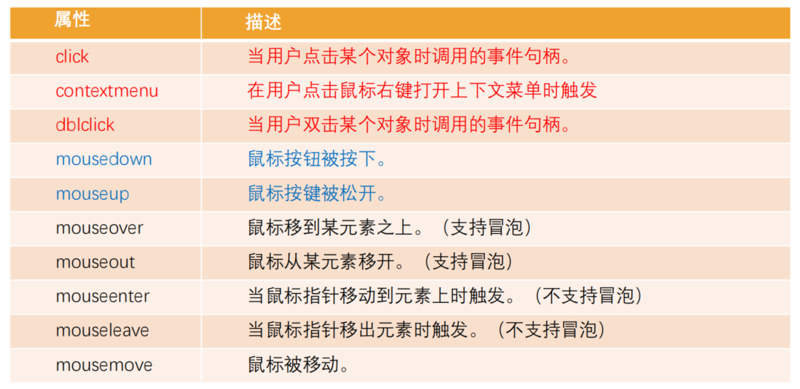


**键盘事件：**
- onkeydown  键盘按下去
- onkeyup  键盘抬起来
- onkeypress  键盘抬住

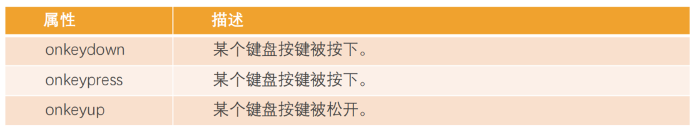

事件的执行顺序是 onkeydown、onkeypress、onkeyup
- down事件先发生
- press发生在文本被输入
- up发生在文本输入完成


**加载事件：**
- load 加载    浏览器不仅加载完成了 HTML，还加载完成了所有外部资源   事件源是window
- unload 加载    退出页面  此事件不好捕获到  也没有什么用
- DOMContentLoaded：浏览器已完全加载 HTML，并构建了 DOM 树，但像 img 和样式表之类的外部资源可能尚未加载
完成。


**表单事件：**
- focus: 获取焦点
- blur: 失去焦点
- change: 改变输入框中的内容，并失去焦点时触发
- input：内部发生变化，立即触发，不等到失去焦点
- submit: 当点击了提交按钮，会触发submit事件
- reset: 当点击了重置按钮，会触发reset事件

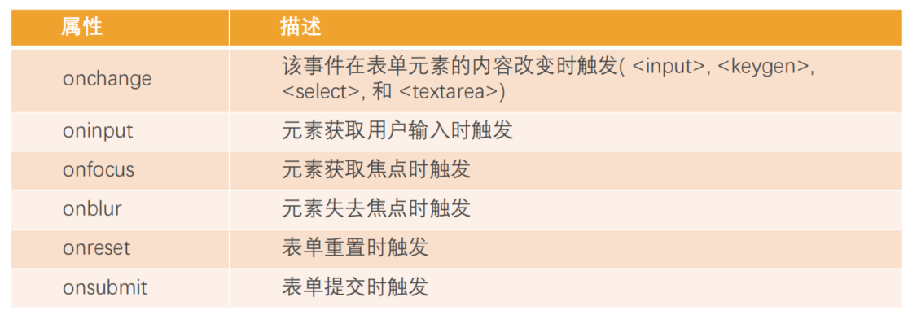


**其它事件：**
- resize: 改变了浏览器窗口大小时，会触发resize事件
- scroll: 页面滚动时，会触发scroll事件
- ....


```html
<html lang="en">
<head>
    <meta charset="UTF-8">
    <title>Document</title>
    <script>
        // 代码执行是从上到下执行，在执行JS代码时，
        // HTML结构还没加载完毕，获取DOM节点，是没有
        // 办法获取的。
        // 所以我们需要等DOM节点加载完毕，再去获取DOM元素，
        // 加载事件  load事件  事件源是window
        window.onload = function(){
            let btn = document.getElementById("btn");
            console.log(btn); // null / button
        }
    </script>
</head>
<body>
    <button id="btn">登录</button>
</body>
</html>
```

```html
<!DOCTYPE html>
<html lang="en">
<head>
    <meta charset="UTF-8">
    <title>Document</title>
</head>
<body>
    <input type="text" id="ipt">
    <script>
        window.onload = function(){
            let ipt = document.getElementById("ipt"); 
            // 表示表单获取焦点时触发
            ipt.onfocus = function(){
                console.log("表单获取了焦点~");
            }
            ipt.onblur = function(){
                console.log("表单失去了焦点~");
            }
            // 输入框中的数据发生了变化，并失败了焦点就会触发
            ipt.onchange = function(){
                console.log("表单中的数据发生变化~");
            }
            ipt.oninput = function(){
                console.log("内容变化了~");
            }
        }
    </script>
</body>
</html> 
```

## 15. 事件的绑定和解绑

### 15.1 HTML级别的事件绑定

**可以在HTML开始标签上，去绑定事件，这种绑定基本不用**

```html
<body>
    <!-- 
        button叫事件源  
        click叫事件类型    on仅仅是前缀
        "alert('点我弄啥~')"事件反馈   事件处理程序   也叫监听器
        我们说的事件绑定：指的是绑定监听器
    -->
    <!-- <button onclick="alert('点我弄啥~')">点我</button> -->
    <!-- test() 加了() 这行代码在你眼中就是一个值 -->
    <!-- 在test()外面，还包一层函数，这一层函数你看不到   -->
    <!-- 只有点击了按钮，外面的函数才会执行，才能执行到里面的test() -->
    <!-- ()不加不行 -->
    <button onclick="test()">点我</button>
    <script>
        function test(){
            alert("点我弄啥~~")
        }
    </script>
</body>
```

### 15.2 DOM0事件绑定

**DOM0事件绑定，就是给DOM元素的onxxxx属性赋值，是基于属性赋值的操作**

```html
<!DOCTYPE html>
<html lang="en">
<head>
    <meta charset="UTF-8">
    <title>Document</title>
    <style>
        .loading{
            background-color: #ccc;
            color: #424242;
            outline: 0px;
            border: none;
        }
    </style>
</head>
<body>
    <button id="btn">加载更多</button>
    <script>
        let btn = document.getElementById("btn");
        // DOM0级别的事件绑定
        // 基于属性赋值   如果重复绑定多次，后面的会覆盖前面的
        btn.onclick = function(){
            // console.log("1");
            this.innerHTML = "加载中...."
            // this.className = "loading"
            this.classList.add("loading")

            var self = this;
            setTimeout(function(){
                // this表示window
                // this.innerHTML = "加载更多"
                // this.classList.remove("loading")
                self.innerHTML = "加载更多"
                self.classList.remove("loading")
            },2000)
        }
        // 由于是基于属性赋值，后面赋值的会覆盖掉前面的
        // btn.onclick = function(){
        //     console.log("2");
        // }
    </script>
</body>
</html>
```


**现在学习了ES6，可以使用箭头函数，如下：**
```html
<!DOCTYPE html>
<html lang="en">
<head>
    <meta charset="UTF-8">
    <title>Document</title>
    <style>
        .loading{
            background-color: #ccc;
            color: #424242;
            outline: 0px;
            border: none;
        }
    </style>
</head>
<body>
    <button id="btn">加载更多</button>
    <script>
        let btn = document.getElementById("btn");
        btn.onclick = function(){
            this.innerHTML = "加载中...."
            this.classList.add("loading")
            setTimeout(()=>{
                this.innerHTML = "加载更多"
                this.classList.remove("loading")
            },2000)
        }
    </script>
</body>
</html>
```

**如果有HTML级别的事件绑定和DOM0的事件绑定，谁的优先给高，演示如下：**
```html
<!DOCTYPE html>
<html lang="en">
<head>
    <meta charset="UTF-8">
    <title>Document</title>
</head>
<body>
    <button id="btn" onclick="test()">加载更多</button>
    <script>
        function test(){
            console.log("html级别的事件绑定");
        }

        // dom0级别的事件绑定优先级是高于HTML级别的事件绑定的
        let btn = document.getElementById("btn");
        btn.onclick = function(){
            console.log("dom0级别的事件绑定");
        }
    </script>
</body>
</html>
```


### 15.3 DOM2的事件绑定

**DOM2的事件绑定是基于事件池的，不是基于属性赋值的，所以可以多次绑定，不会覆盖掉，演示代码如下：**

```html
<!DOCTYPE html>
<html lang="en">
<head>
    <meta charset="UTF-8">
    <title>Document</title>
    <style>
        .loading{
            background-color: #ccc;
            color: #424242;
            outline: 0px;
            border: none;
        }
    </style>
</head>
<body>
    <button id="btn">加载更多</button>
    <script>
        let btn = document.getElementById("btn");
        // DOM2的事件绑定
        // 基于事件池   事件绑定都是异步代码  都是宏任务
        btn.addEventListener("click",function(){
            this.innerHTML = "加载中..."
            this.className = "loading"
            
            setTimeout(()=>{
                this.innerHTML = "加载更多"
                this.className = ""
            },2000)
        });
        btn.addEventListener("click",function(){
            console.log("~我是有底线的~");
        })
    </script>
</body>
</html> 
```


特别需要注意，绑定的是事件处理程序，也就是监听器，也就是事件反馈，如果你的监听器是同一个，即使你绑定了多次，也只会执行一次，演示如下：

```html
<!DOCTYPE html>
<html lang="en">
<head>
    <meta charset="UTF-8">
    <title>Document</title>
</head>
<body>
    <button id="btn">加载更多</button>
    <script>
        let btn = document.getElementById("btn");
        btn.addEventListener("click",function(){
            console.log("111");
        });
        btn.addEventListener("click",function(){
            console.log("222");
        })
    </script>
</body>
</html>
```

```html
<!DOCTYPE html>
<html lang="en">
<head>
    <meta charset="UTF-8">
    <title>Document</title>
</head>
<body>
    <button id="btn">加载更多</button>
    <script>
        let btn = document.getElementById("btn");
        // 如果这样绑定，事件池中只有一个Fn
        btn.addEventListener("click",fn);
        btn.addEventListener("click",fn)
        function fn(){
            console.log("xxx");
        }
    </script>
</body>
</html>
```


## 16. 事件解绑

绑定它是绑定的监听器，解绑也是解绑监听器，解绑也分DOM0的解和DOM2的解绑，演示DOM0的解绑代码如下：

```html
<!DOCTYPE html>
<html lang="en">
<head>
    <meta charset="UTF-8">
    <title>Document</title>
    <style>
        button{
            outline: none;
            border: none;
            width: 100px;
            height: 30px;
            background-color: red;
            color: #fff;
            text-align: center;
            line-height: 30px;
        }
        .got{
            background-color: #ddd;
        }
    </style>
</head>
<body>
    <button id="btn">领取优惠劵</button>
    <script>
        let btn = document.getElementById("btn");
        // 事件绑定  绑定的监听器
        btn.onclick = function(){
            this.innerHTML = "已领取"
            this.className = " got"
            console.log("已领取~");

            // 已领取 需要解绑  解绑的也是监听器
            this.onclick = null; // DOM0的解绑
        }
    </script>
</body>
</html>
```

下面的DOM2的事件解绑是不OK的，如下：


```html
<!DOCTYPE html>
<html lang="en">

<head>
    <meta charset="UTF-8">
    <title>Document</title>
    <style>
        button {
            outline: none;
            border: none;
            width: 100px;
            height: 30px;
            background-color: red;
            color: #fff;
            text-align: center;
            line-height: 30px;
        }

        .got {
            background-color: #ddd;
        }
    </style>
</head>

<body>
    <button id="btn">领取优惠劵</button>
    <script>
        let btn = document.getElementById("btn");
        
        // DOM2的事件绑定
        btn.addEventListener("click",fn,false)

        // DOM2的解绑  解绑的参数需要和绑定的参数一样
        // 不行：因为上，刚把fn扔到池中，下面紧接着，把fn从池中扔出来的
        btn.removeEventListener("click", fn,false)

        function fn(){
            this.innerHTML = "已领取"
            this.className = " got"
            console.log("已领取~");
        }
    </script>
</body>

</html>
```

正确的解绑如下：


```html
<!DOCTYPE html>
<html lang="en">

<head>
    <meta charset="UTF-8">
    <title>Document</title>
    <style>
        button {
            outline: none;
            border: none;
            width: 100px;
            height: 30px;
            background-color: red;
            color: #fff;
            text-align: center;
            line-height: 30px;
        }

        .got {
            background-color: #ddd;
        }
    </style>
</head>

<body>
    <button id="btn">领取优惠劵</button>
    <script>
        let btn = document.getElementById("btn");
        
        // DOM2的事件绑定
        btn.addEventListener("click",fn,false)


        function fn(){
            this.innerHTML = "已领取"
            this.className = " got"
            console.log("已领取~");

            // DOM2的解绑  解绑的参数需要和绑定的参数一样
            btn.removeEventListener("click", fn,false)
        }
    </script>
</body>

</html>
```

其它的解绑方案如下：

```html
<body>
    <button id="btn">领取优惠劵</button>
    <script>
        let btn = document.getElementById("btn");
        
        // DOM2的事件绑定
        btn.addEventListener("click",function fn(){
            this.innerHTML = "已领取"
            this.className = " got"
            console.log("已领取~");

            btn.removeEventListener("click", fn,false)
        })
    </script>
</body>
```

```html
<body>
    <button id="btn">领取优惠劵</button>
    <script>
        let btn = document.getElementById("btn");
        
        // DOM2的事件绑定
        btn.addEventListener("click",function(){
            this.innerHTML = "已领取"
            this.className = " got"
            console.log("已领取~");
            // console.log(arguments.callee);

            btn.removeEventListener("click", arguments.callee, false)
        })
    </script>
</body>
```


## 17. 事件冒泡和事件捕获

- 我们会发现默认情况下事件是从最内层的span向外依次传递的顺序，这个顺序我们称之为事件冒泡（Event Bubble）
- 另外一种监听事件流的方式就是从外层到内层（body -> span），这种称之为事件捕获（Event Capture）


**如果我们都监听，那么会按照如下顺序来执行：**
- 捕获阶段（Capturing phase）：事件（从 Window）向下走近元素
- 目标阶段（Target phase）：事件到达目标元素
- 冒泡阶段（Bubbling phase）：事件从元素上开始冒泡

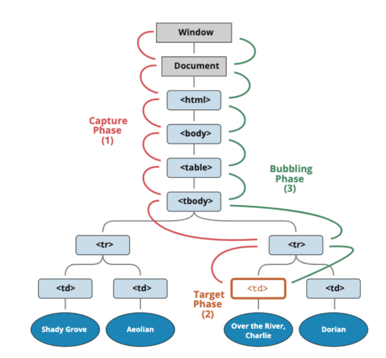


**开发中通常会使用事件冒泡，所以事件捕获了解即可。**


## 18. 事件对象

**当一个事件发生时，就会有和这个事件相关的很多信息：**
- 比如事件的类型是什么，你点击的是哪一个元素，点击的位置是哪里等等相关的信息
- 那么这些信息会被封装到一个Event对象中，这个对象由浏览器创建，称之为event对象；
- 该对象给我们提供了想要的一些属性，以及可以通过该对象进行某些操作；


**如何获取这个event对象呢？**
- event对象会在传入的事件处理（event handler）函数回调时，被系统传入；
- 我们可以在回调函数中拿到这个event对象；


**常见的属性：**
- type：事件的类型；
- target：当前事件发生的元素；
- currentTarget：当前处理事件的元素；
- eventPhase：事件所处的阶段；
- offsetX、offsetY：事件发生在元素内的位置；
- clientX、clientY：事件发生在客户端内的位置；
- pageX、pageY：事件发生在客户端相对于document的位置；
- screenX、screenY：事件发生相对于屏幕的位置；


**常见的方法：**
- preventDefault：取消事件的默认行为；
- stopPropagation：阻止事件的进一步传递（冒泡或者捕获都可以阻止）；


## 19. 事件处理中的this

**在函数中，我们也可以通过this来获取当前的发生元素：**
- 在浏览器内部，调用event handler是绑定到当前的事件源上的


## 20. 事件委托（event delegation）

**事件冒泡在某种情况下可以帮助我们实现强大的事件处理模式 – 事件委托模式（也是一种设计模式）**
- 当子元素被点击时，父元素可以通过冒泡可以监听到子元素的点击；
- 可以通过event.target获取到当前监听的元素；

## 21. 认识BOM

**BOM：浏览器对象模型（Browser Object Model）**
- 简称 BOM，由浏览器提供的用于处理文档（document）之外的所有内容的其他对象
- BOM就是让JS与浏览器进行“对话”，获取浏览器信息和操作浏览器

**BOM没有规范**
- ECMAScript：JS语法规范的标准
- DOM：W3C， DOM的核心：document
- BOM：没有规范，不是的浏览器厂商去定义自己的API，兼容性非常不好。BOM的核心：window

**BOM主要包括一下的对象模型**
- window：包括全局属性、方法，控制浏览器窗口相关的属性、方法
- location：浏览器连接到的对象的位置（URL）
- history：操作浏览器的历史
- navigator：用户代理（浏览器）的状态和标识（很少用到）
- screen：屏幕窗口信息（很少用到）

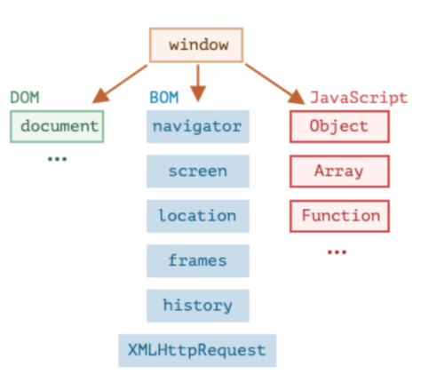


## 22. 再次认识window


**window对象在浏览器中可以从两个视角来看待**
- 视角一：全局对象  GO
- 视角二：浏览器窗口对象, 提供了对浏览器操作的相关的API


**window对象的作用**
- 第一：包含大量的属性，localStorage、console、location、history、screenX、scrollX等等（大概60+个属性）
- 第二：包含大量的方法，alert、close、scrollTo、open等等（大概40+个方法）
- 第三：包含大量的事件，focus、blur、load、hashchange等等（大概30+个事件）
- 第四：包含从EventTarget继承过来的方法，addEventListener、removeEventListener、dispatchEvent方法
- MDN文档：https://developer.mozilla.org/zh-CN/docs/Web/API/Window


```html
<body>
  <a href="http://www.baidu.com" target="_blank">百度一下</a>
  <button>百度一下</button>
  <button class="close">关闭窗口</button>
  
  <script>

    console.log(window)
    console.log(window.outerHeight)

    // 一些方法
    var openBtnEl = document.querySelector("button")
    var closeBtnEl = document.querySelector(".close")
    openBtnEl.onclick = function() {
      window.open("./page/new.html", "_blank")
    }
    closeBtnEl.onclick = function() {
      window.close()
    }

    // 3.常见的事件
    // window.onfocus = function() {
    //   console.log("窗口获取到焦点")
    // }
    // window.onblur = function() {
    //   console.log("窗口失去了焦点")
    // }

    window.onhashchange = function() {
      console.log("hash值发生改变")
    }
  </script>
</body>
```


## 23. location对象


**location对象用于表示window上当前链接到的URL信息**

**常见的属性有哪些**
- href: 当前window对应的超链接URL, 整个URL； 
- protocol: 当前的协议；
- host: 主机地址；
- hostname: 主机地址(不带端口)； 
- port: 端口；
- pathname: 路径；
- search: 查询字符串；
- hash: 哈希值；

**我们会发现location其实是URL的一个抽象实现**

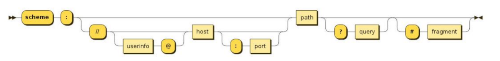


**常见的方法有哪些**
- assign：赋值一个新的URL，并且跳转到该URL中
- replace：打开一个新的URL，并且跳转到该URL中（不同的是不会在浏览记录中留下之前的记录）
- reload：重新加载页面，可以传入一个Boolean类型


**URLSearchParams介绍**

- URLSearchParams 定义了一些实用的方法来处理 URL 的查询字符串
- 可以将一个字符串转化成URLSearchParams类型
- 也可以将一个URLSearchParams类型转成字符串
- 中文会使用encodeURIComponent和decodeURIComponent进行编码和解码


**URLSearchParams常见的方法**
- get：获取搜索参数的值；
- set：设置一个搜索参数和值；
- append：追加一个搜索参数和值；
- has：判断是否有某个搜索参数；
- https://developer.mozilla.org/zh-CN/docs/Web/API/URLSearchParams


## 24. history对象

**history对象允许我们访问浏览器曾经的会话历史记录**

**常见属性**
- length：会话中的记录条数
- state：当前保留的状态值

**常用方法**
- back()：返回上一页，等价于history.go(-1)； 
- forward()：前进下一页，等价于history.go(1)； 
- go()：加载历史中的某一页；
- pushState()：打开一个指定的地址；
- replaceState()：打开一个新的地址，并且使用replace；


## 25. navigator对象(了解)

- navigator 对象表示用户代理的状态和标识等信息。

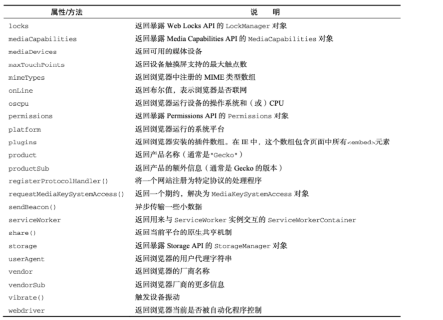


## 26. screen对象(了解)

- screen主要记录的是浏览器窗口外面的客户端显示器的信息
- 比如屏幕的逻辑像素 screen.width、screen.height

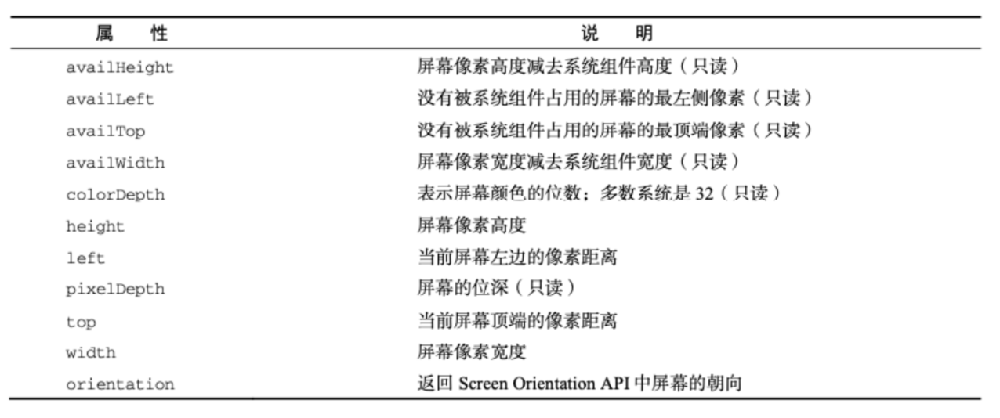


