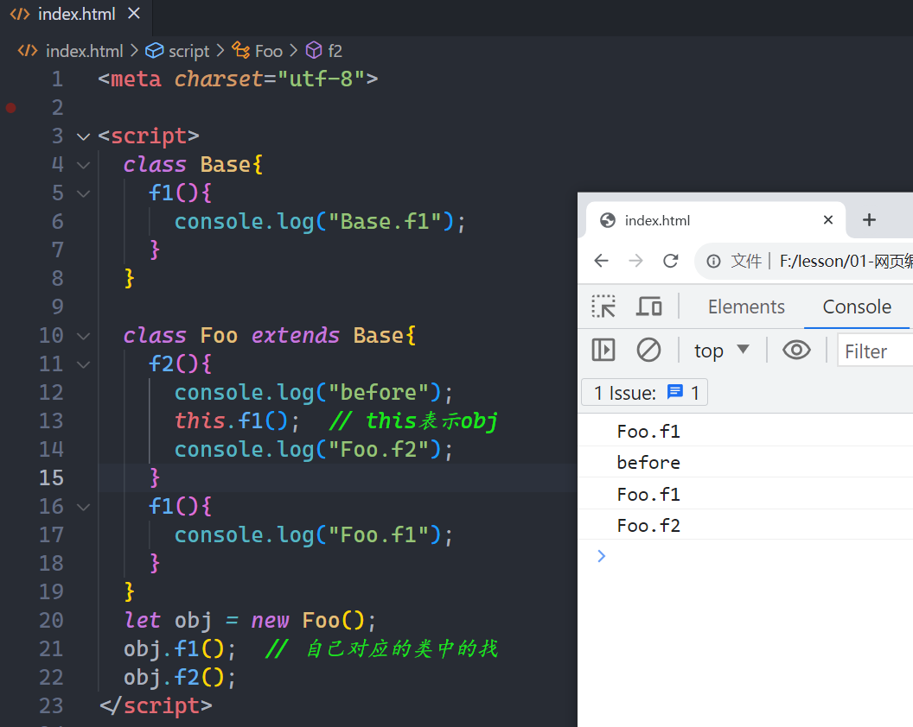
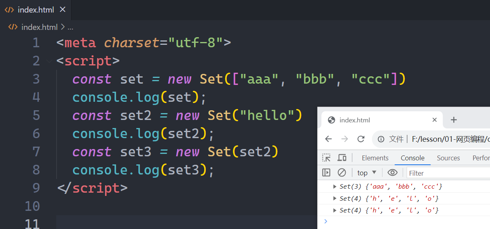
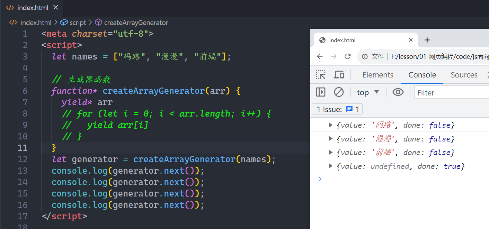

## 一，初识面向对象

### 1，面向函数和面向对象

JS支持两种编程方式，分别是函数式编程和面向对象编程。分别：


JS支持两种编程方式（其他很多语言只支持一种），作为初学者，如何选择哪一种编程方式？行业内对于 函数式编程 vs 面向对象编程 之间谁更好的讨论也是难分胜负，其实在开发中，无论要实现什么功能，两种编程方式都是可以实现，暂时不要去纠结哪种方式更好，编程语言都是工具，把功能实现就OK了。一般情况下，对于初学者，在选择时，遵循如何的规则：

* 函数式，推荐初学者使用。理由：上手快且逻辑简单清晰。
* 面向对象，推荐有一些代码经验后使用。理由：面向对象的思想需要有一定的项目积累之后（写多了&看的多）才能真正理解其精髓，基于面向对象可以编写出扩展性更强的代码（在一定程序上也可以简化代码）。

玩面向对象，分两步：

* 定义类，在类中定义方法，在方法中实现具体的功能
* 实例化一个对象（new一个对象），通过对象调用并执行方法

代码演示：


注意点：

* 类名首字母需要大写&驼峰命名
* 在类中编程的函数叫方法，只不过不需要写function关键字

在一个类中可以定义多个方法，如下：


通过上面的小案例，发现，使用面向对象的编程方式，有点类似归纳的意思，将某些相似的函数归到一个类中。目前看上去，有点鸡肋，为什么不直接使用函数式编程，不着急，我们继续往后学。

### 2，对象和this

在每一个类中，都有一个特殊的方法，叫constructor，当你去new这个类时，这个方法会自动执行，在这个方法中，可以做一些初始化工作，如下：


来个图，如下：


通过上面的小案例，你会发现：

* 对象，可以让我们在它的内部先封装一部分数据，后面要使用时，再去获取。
* this，表示你new出来的那个对象，通过this添加属性，说白了，也是给这个对象添加的属性
* 方法，本质就是函数，函数的参数和执行与我们前面讲的函数是一样的。

### 3，常见成员

在编写类时，最常见的成员：

* 实例变量，类中通过this来访问，在类外通过对象来访问，不能通过类名来访问
* 实例方法，类中通过this来访问，在类外通过对象来访问，不能通过类名来访问

代码演示：


再去看一下案例，如下：


### 4，小案例

案例1：不停实现用户注册，当按Q时，结束注册，注册时，将用户信息（姓名，密码，年龄）封装到一个对象，结束注册时，打印出这些用户信息。


上面的案例体现出来的封装，所谓的封装就是把一些数据和方法封装到一个类中的。

案例1：有1000个用户，存储在数组中，实现分页，用户输入1，获取第1页数据，用户输入2，就获取第2页数据....


基于上面的代码，实现一个分页类，new这个类时，传递页码和一页几条数据，如果不传递一页几条数据，默认是10个数据。代码如下：

```html
<meta charset="utf-8">
<script>
    let user_list = [];
    for (let i = 1; i <= 1000; i++) {
        user_list.push(`用户${i}`)
    }
    // 分页类，考虑到类的健壮性
    class Pagination {
        constructor(current_page, page_num = 10) {
            this.page_num = page_num;
            if (typeof current_page != 'number' && typeof current_page != 'string') {
                this.current_page = 1;
                return; // 1）提供返回值  2）结束函数
            }
            if (typeof + current_page == NaN) {
                this.current_page = 1;
                return;
            }
            if (+current_page < 1) {
                this.current_page = 1;
                return;
            }
            this.current_page = current_page;
        }
        start() {
            return (this.current_page - 1) * this.page_num;
        }
        end() {
            return this.current_page * this.page_num;
        }
    }
    while (true) {
        let page = +prompt("请输入页码：")
        if (page == 0) {
            break;
        }
        let pg = new Pagination(page, 20)
        let temp = user_list.slice(pg.start(), pg.end());
        for (let user of temp) {
            console.log(user);
        }
    }
</script>
```

浏览器测试如下：


案例3： 有两个类，一个是警察类，一个是恐怖分子类。

* 警察类，有名字，有角色，角色有两个，一个是队长，一个是队员。队长生命值有500，队员的生命值有200。也就是说实例变量有3个。还有两个方法，一个是查看警察的状态，也就是查某个警察的生命值。还有一个方法，是用的投炸弹，去炸掉恐怖分子。炸一个恐怖分子血量减200。
* 恐怖分子类，有名字，有血量。也就说有两个实例变量。还有三个方法，一个是射击某个警察，射击一次，警察的生命值减5，自身血量减2。另一个方法是扫射某些警察，扫射时，警察的生命值减8。最后一个方法是查看恐怖分子的状态，说白了就是查看某个恐怖分子的血量。

参考代码如下：

```html
<meta charset="utf-8">

<script>
    class Police {
        constructor(name, role) {
            this.name = name;
            this.role = role;
            if (role == '队员') {
                this.hit_points = 200
            } else {
                this.hit_points = 500
            }
        }
        // 查看警察的状态
        show_status() {
            let message = `警察 ${this.name} 的生命值为: ${this.hit_points}`;
            console.log(message);
        }
        bomb(terrorist_list) {
            // 投炸弹，炸掉恐怖分子 
            for (let terrorist of terrorist_list) {
                terrorist.blood -= 200;
                terrorist.show_status();
            }
        }
    }
    class Terrorist {
        constructor(name, blood = 300) {
            this.name = name;
            this.blood = blood;
        }
        shoot(police_object) {
            // 开枪射击某个警察
            police_object.hit_points -= 5;
            police_object.show_status();
            this.blood -= 2;
        }
        strafe(police_object_list) {
            // console.log(police_object_list);
            // 扫射某些警察
            for (let police_object of police_object_list) {
                police_object.hit_points -= 8;
                police_object.show_status();
            }
        }
        show_status() {
            // 查看恐怖分子状态
            let message = `恐怖分子 ${this.name} 的血量为: ${this.blood}`;
            console.log(message);
        }
    }

    let wc = new Police('wc', '队员'); // 生命值是：200
    let xq = new Police('xq', '队员'); // 生命值是：200
    let ml = new Police('ml', '队长'); // 生命值是：500

    let a1 = new Terrorist('a1'); // 血量是：300
    let a2 = new Terrorist('a2', 200); // 血量是：200

    // a1暴徒射击wc
    a1.shoot(wc);
    a1.show_status();

    // a2扫射上面的3个警察
    a2.strafe([wc, xq, ml])

    // a2暴徒射击wc
    a2.shoot(ml)
</script>
```

总结上面的案例，把数据进行了封装，在一个类中封装了不同的数据，数据名是可以重复的。不光封装了数据，也封装了方法，方法是对数据进行加工的，说白了，就是对数据进行处理，不同的类中，方法名也是可以相同。

## 二，三大特性

### 1，封装

大部分的编程语言都支持OOP，如C++，JAVA，PHP，Python，JS...。面向对象有三大特性：封装，继承，多态。

再说一下封装，封装体现在两个方面：

* 将数据封闭到类中（对象），在实例化一个对象时，可以在constuctor方法中对数据进行初始化，方便后面使用。
* 将同一个类方法封装到一个类中，如在警察类中，封装了警察相关的方法，在暴徒类中，封装了暴徒相关的方法。

### 2，继承

在OOP编程中，子类可以继承父类中的实例方法和实例变量，这里的继承并不是copy，父类的实例变量和实例方法还是父类的，子仅仅是继承了而已。有这样几个名词：

* 父类（基类）
* 子类（派生类）

上代码，演示：


一个父类（基类），可以被多个子类继承，如下：


然后，出一些练习题，大家做一下，如下：





对上面的案例小结一下：

* 当一个对象打点一个方法时，优先去当前对象所关联的那个类中找，没有的话，才去她的父类中找。
* this是谁，只能你去new一个对象时，才能确定this是谁。
* js不支持多继承，在C++和Python中是支持多继承。

### 3，多态

多态，从字面翻译就是多种形态，在JS和Python中的多态和JAVA中的多态不太一样，或者说，JS和Python天生支持多态。先写一下JAVA中的多态，如下：

```java
package com.malu;

abstract class Animal{
    abstract void  eat();
}
class Cat extends Animal{
    public  void  eat(){
        System.out.println("吃鱼");
    }
}
class Dog extends Animal{
    public  void  eat(){
        System.out.println("吃骨头");
    }
}
public class Test {
    public static void main(String[] args) {
        Cat cat1 = new Cat();
        show(cat1);
        Dog dog1 = new Dog();
        show(dog1);
    }

    public static void show(Animal a){
        a.eat();
    }
}
```

测试如下：


在JAVA或其它语言中多态是基于：接口或抽象类和抽象方法来实现的，让数据可以以多种形式存在。在JS和Python中，由于没有对数据类型有限制，也就是说JS和Python是弱数据类型语言，所以它天生支持多态。如下：


在程序设计中，有一个概念，叫鸭子类型。在鸭子类型中，关注点在于对象的行为，能作什么；而不是关注对象所属的类型，例如：一只鸟走起来像鸭子、游泳起来像鸭子、叫起来也像鸭子，那么这只鸟可以被称为鸭子。

小结一下：

* 封装：将数据和操作数据的方法封装到一个类（对象）中，方便后面使用。
* 继承：将类中的公共方法提取到基类中，子类去继承这个基类。
* 多态：JS和Python天生支持多态（这种方式叫鸭子类型）

### 4，作业

* 简述面向对象三大特性?
* 将以下函数改成类的方式并调用 

```js
function func(a1) {
    console.log(a1)
}
```

* 面向对象中的this指的是什么?

```js
this出现在方法， this也指向了你new出来的那个对象。 给this上添加属性相当于给你new出来的那个对象添加属性。
```

* 看代码写结果

```js
class Foo {
    func() {
        print('foo.func')
    }
}
let obj = new Foo() // new Foo()在你眼中是一个对象
let result = obj.func() // obj.func()在你眼中是一个值，返回值
console.log(result) // und
```

* 看代码写结果

```js
class Base {
    f1() {
        console.log('base.f1')
    }

    f3() {
        this.f1()
        console.log('base.f3')
    }
}

class Foo extends Base {
    f1() {
        console.log('foo.f1')
    }

    f2() {
        console.log('foo.f2')
        this.f3()
    }
}

let obj = new Foo()
obj.f2()
```

* 看需求写程序

```js
// 需求
// 1. while循环提示用户输 : 户名、密码、邮箱(正则满足邮箱格式)   UserInfo类     user_list=[]
// 2. 为每个用户创建一个个对象，并添加到user_list中。
// 3. 当列表中的添加 3个对象后，跳出循环并以此循环打印所有用户的姓名和邮箱
// 4. 按Q就退出
```

* 补充代码: 实现用户注册和登录

```js
class User {
    constructor(name, pwd) {
        this.name = name;
        this.pwd = pwd;
    }
}
class Account {
    constructor() {
        this.user_list = []; // [user对象{name:"wc",pwd:"123"}，user对象，user对象....]
    }
    login() {
        // 用户登录，输入用户名和密码然后去this.user_list中校验用户合法性
        // todo...
    }
    register() {
        // 用户注册，没注册一个用户就创建一个user对象，然后添加到self.user_list中，表示注册成功。
        // todo...
    }
    run() {
        // 主程序
        // 提示你要选择的功能，1 表示登录，2表示注册
        let choice_all = {
            "1": {
                "title": "登录",
                "method": this.login
            },
            "2": {
                "title": "注册",
                "method": this.register
            },
        }
        // todo...
    }
}

let obj = new Account();
obj.run();
```

参考答案：

```html
<script>
    class Foo {
        func(arg) {
            console.log(arg);
        }
    }
    let obj = new Foo();
    obj.func('malu');
</script>
```


```html
<meta charset="utf-8">
<script>
    class User {
        constructor(name, pwd) {
            this.name = name;
            this.pwd = pwd;
        }
    }
    class Account {
        constructor() {
            this.user_list = []; // [user对象{name:"wc",pwd:"123"}，user对象，user对象....]
        }
        login() {
            // 用户登录，输入用户名和密码然后去this.user_list中校验用户合法性
            // todo...
            console.log("登录啦~");
            while (true) {
                let userName = prompt("请输入用户名（Q/q）：");
                if (userName.toUpperCase() == "Q") {
                    break;
                }
                let userPwd = prompt("请输入密码：");
                for (let user of this.user_list) {
                    if (userName == user.name && userPwd == user.pwd) {
                        console.log("登录成功");
                        return;
                    }
                }
                console.log("登录失败");
            }
        }
        register() {
            // 用户注册，没注册一个用户就创建一个user对象，然后添加到self.user_list中，表示注册成功。
            // todo...
            console.log("注册啦~");
            while (true) {
                let userName = prompt("请输入用户名（Q/q）：");
                if (userName.toUpperCase() == "Q") {
                    break;
                }
                let userPwd = prompt("请输入密码：");
                let user_object = new User(userName, userPwd);
                // console.log(this);
                this.user_list.push(user_object)
            }
        }
        buy() {
            console.log("买东西~");
        }
        run() {
            // 主程序
            // 提示你要选择的功能，1 表示登录，2表示注册
            let choice_all = {
                "1": {
                    "title": "登录",
                    "method": this.login
                },
                "2": {
                    "title": "注册",
                    "method": this.register
                },
                "3": {
                    "title": "购买",
                    "method": this.buy
                },
            }
            // console.log(Object.keys(choice_all));
            // console.log(Object.values(choice_all));
            // console.log(Object.entries(choice_all));
            let message = "";
            for (let choice of Object.entries(choice_all)) {
                // console.log(choice[0]);
                // console.log(choice[1].title);
                message += choice[0] + "," + choice[1].title + ";"
            }
            // console.log(message);
            // todo...   1,登录;  2,注册

            while (true) {
                console.log(message);
                let choice = prompt("请选择功能（序号），退出按Q：")
                if (choice.toUpperCase() == "Q") {
                    break;
                }
                let info = choice_all[choice]
                // console.log(info);
                if (!info) {
                    console.log("选择错误，请重新选择");
                    continue;
                }
                // console.log(info);
                let method = info.method
                method.call(this)
            }
        }
    }

    let obj = new Account();
    obj.run();
</script>
```

## 三，成员

### 1，实例变量

什么是封装？把数据和操作数据的方法封装到一个类中（对象）。数据和方法对于类来说，都是它的成员。这些成员又分：

* 实例变量
* 静态变量
* 实例方法
* 静态方法

在OOP编程时，遇到不同的情况，需要使用不同的成员来实现。实例变量，它是属于某个对象，也就是每一个对象，都各自维护自己的数据。写代码如下：


除了在constuctor里面定义之外，还可以在外面定义，如下：


### 2，静态变量

除了实例变量之外，还有一个叫静态变量，静态变量属于类的，当每个对象中都存在相同的实例变量时，可以选择把它放在静态变量中，这样可以避免多个对象维护多个机同的数据。静态变量只能通过类名来访问，不能通过对象来访问。

代码演示：


写代码测试一下：


再测试一个题目：


看一个面试题：


### 3，实例方法

实例方法，只能通过对象来调用，在Python中，实例方法也可以通过类进行调用。在JS，JAVA，C#中，实例方法只能通过对象来调用，如下：


### 4，静态方法 

静态方法是通过类进行调用，不能通过对象调用，但在是Python中，是可以通过对象来调用的，代码演示：


## 四，公有与私有

### 1，设置成私有

JS中的成员修饰符就是指：公有和私有。

* 公有，在任何地方都可以调用这个成员。
* 私有，只有在类的内部才可以调用改成员（成员是以#开头，则表示该成员为私有）。

代码演示：


### 2，练习

看如下练习：


封装：把数据和处理数据的方法封装到一个类中（对象）。在封装数据时，有些数据是可以暴露给外部，让外部调用并使用，此时这个数据就是公有的。如果有的数据不想暴露给外面，需要设置成私有的。但是这个私有的在本类内部是可以使用的。

## 五，对象嵌套

### 1，情景1

在基于面向对象进行编程时，对象之间可以存在各种各样的关系，例如：组合、关联、依赖等（Java中的称呼），用大白话来说就是各种嵌套。先考虑第一个情景：


### 2，情景2


### 3，情况3

定义一个学校类，有学校的名称，如：北京校区，上海校区。定义一个班级类，有班级名称，班级所属的校区。如全栈班在北京校区，云计算班在上海校区。再定义一个学生了，有学生名字，学生的年龄，学生所属的班级。

参考代码：

```html
<meta charset="utf-8">
<script>
    class School {
        constructor(name) {
            this.name = name;
        }
    }
    let s1 = new School('北京校区');
    let s2 = new School('上海校区');

    class Classes {
        constructor(title, school_object) {
            this.title = title;
            this.school_object = school_object;
        }
    }
    let c1 = new Classes('前端班', s1);
    let c2 = new Classes('全栈班', s2);

    class Student {
        constructor(name, age, class_object) {
            this.name = name;
            this.age = age;
            this.class_object = class_object
        }
        message() {
            let data = `我在 ${this.class_object.school_object.name}, 我是一名 ${this.class_object.title} 学生，我叫：${this.name}，我今年${this.age}岁了。`
            console.log(data);
        }
    }
    let wc = new Student('wc', 10, c1);
    let xq = new Student('xq', 11, c2);
    let ml = new Student('ml', 12, c2);
    wc.message();
    xq.message();
    ml.message();
</script>
```

浏览器效果如下：


## 六，迭代器和可迭代对象（尽可能掌握）

### 1，迭代器

创建一个迭代器类（类型），new这个类，就可以得到一个对象，这个对象叫迭代器对象。要求这个对象必须有一个next方法。迭代器英文叫Iterator，先创建出这个类，如下：


也可以迭代其它的容器，如下：


当new IT时，可以把要迭代的容器传递进去，如下：


### 2，可迭代对象

一个对象是否是可迭代对象，需要满足两个条件：

* 满足条件1：必须实现一个特定的函数: [Symbol.iterator]
* 满足条件2：这个函数需要返回一个迭代器(这个迭代器用于迭代当前的对象)

直接上代码：


只要你是一个可迭代对象，在JS中都可以使用for of遍历。在python中，都可以使用for in遍历。如下：


JS中哪些容器天生就是可迭代对象，如下：

* 数组
* Set
* arguments
* 字符串
* JS中的对象不是可迭代对象

直接上代码演示：


### 3，可迭代对象的应用场景

可迭代对象的应用场景: 把一个非可迭代对象 转化成 可迭代对象，如下：


可迭代对象的应用场景: 一些类的构造方法中, 也是传入的可迭代对象，语法：new Set([iterable])。代码演示：



可迭代对象的应用场景: 自定义类的迭代，代码演示：

```html
<meta charset="utf-8">
<script>
    // 可迭代对象的应用场景: 自定义类的迭代
    class Person {
        constructor(name, age, height, friends) {
                this.name = name
                this.age = age
                this.height = height
                this.friends = friends
            }
            [Symbol.iterator]() {
                let index = 0;
                let iterator = {
                    next: () => {
                        if (index < this.friends.length) {
                            return {
                                done: false,
                                value: this.friends[index++]
                            }
                        } else {
                            return {
                                done: true,
                                value: undefined
                            }
                        }
                    }
                }
                return iterator;
            }
    }

    // p1和p2不是可迭代对象
    const p1 = new Person("码路", 18, 1.88, ["aaa", "bbb", "ccc"])
    const p2 = new Person("漫漫", 30, 1.98, ["111", "222", "333"])

    for (const item of p2) {
        console.log(item)
    }
</script>
```

在[Symbol.iterator]方法中的代码，可以简写，如下：


## 七，生成器（尽可能掌握）

### 1，生成器函数

生成器函数的特点：

* function后面会跟上星号 

* 代码的执行可以被yield控制

* 生成器函数默认在执行时, 返回一个生成器对象

* 要想执行函数内部的代码, 需要生成器对象, 调用它的next操作

* 当遇到yield时, 就会中断执行

* 如果按照迭代器的规定来看，其实生成器类也是一种特殊的迭代器类（生成器也是一个中特殊的迭代器）

代码演示：


yield叫产出，产出数据，代码如下：


通过next，也可以给函数内部传数据，如下：


再去强调一下，如下：


看如下的程序，输出什么结果，如下：


### 2，生成器是特殊的迭代器

使用生成器 替代 之前讲的 迭代器，代码如下：


上面的的写法，还有一个语法糖，如下：



使用生成器 生成某个范围的值，代码如下：


## 八，作业

01. 把课件上的代码打两遍。

02. 列举面向对象的成员并简述他们的特点。

```text
数据：
	实例变量，属于对象的。每个对象中都封装了各自的值。只能通过对象打点的形式访问。
	静态变量，属于类的。每个类中各自保存的数据。只能通过类来访问。
方法：方法就是用来处理数据的
	实例方法，在方法中，有一个this关键字，表示你new出来的那个对象。
	静态方法，属于类的。只能使用类名来调用。
```

   

03. 面向对象中如何让成员变为私有。

```text
前面加上 # 
```

04. 简述你理解的：迭代器、生成器、可迭代对象。

```text
迭代器:它本质是一个对象，它里面有一个方法，叫next，调用next，就可以迭代出一个数据（{value:xx,done:false}）

生成器:它是一个特殊的迭代器，它也有一个next方法，调用next，迭代出来的数据，需要靠生成器函数产出。使用yield来产出，yield还可以让代码暂停。我们也可以调用next时给生成器函数传递参数。

可迭代对象：是一个对象，里面必须有一个 [Symbol.iterator]，这个方法，返回一个迭代器。在JS中，天生的可迭代对象有：数组，字符串，set，arguments等。对象不是可迭代对象，但是我们可以把它变成可迭代对象。可迭代对象都可以使用for of进行遍历，for of的本质也是把数据一个个的迭代出来。
```

03. 看代码写结果

   

```html
   <meta charset="utf-8">
   <script>
       class Foo {
           static a1 = 1;
           constructor(num) {
               this.num = num;
           }
           show_data() {
               console.log(this.num + Foo.a1);
           }
       }

       let obj1 = new Foo(666)
       let obj2 = new Foo(999)
       console.log(obj1.num);
       console.log(obj1.a1);
       obj1.show_data();
       obj2.show_data();

       obj1.num = 18;
       obj1.a1 = 99;
       console.log(obj1.num);
       console.log(obj1.a1);
       obj1.show_data();
   </script>
```

06. 看代码写结果

  

```html
   <meta charset="utf-8">
   <script>
       class Foo {
           f1() {
               return 999;
           }
           f2() {
               let v = this.f1();
               console.log("f2");
               return v;
           }
           f3() {
               console.log("f3");
               return this.f2();
           }
           run() {
               let result = this.f3();
               console.log(result);
           }
       }

       let obj1 = new Foo(666);
       let xx = obj1.run();
       console.log(xx);
   </script>
```

07. 看代码写结果
    

```html
    <meta charset="utf-8">
    <script>
        class Foo {
            f1() {
                console.log("f1");
            }
            static f2() {
                console.log("f2");
            }
        }

        let obj1 = new Foo(666);
        // obj1.f1();
        // obj1.f2();

        Foo.f1();
        Foo.f2();
    </script>
```

08. 看代码写结果
    

```html
    <meta charset="utf-8">
    <script>
        class Foo {
            a1 = 1; // 实例变量
            #a2 = 2; // 私有的
            #salary;
            constructor(num) {
                this.num = num;
                this.#salary = 1000;
            }
            show_data() {
                console.log(this.num + this.#a2);
            }
        }
        let obj1 = new Foo(666);
        console.log(obj1.num);
        console.log(obj1.a1);
        // 语法报错，所有的代码都不会执行
        // SyntaxError: Private field '#a2' must be declared
        // console.log(obj1.#a2);
        // console.log(obj1.#salary);
        console.log(Foo.a1);
        // console.log(Foo.#a2);
        obj1.show_data();
    </script>
```

09. 看代码写结果
    

```html
    <meta charset="utf-8">
    <script>
        class Foo {
            constructor(age) {
                this.age = age;
            }
            display() {
                console.log(this.age);
            }
        }
        let data_list = [new Foo(1), new Foo(2)];
        // console.log(data_list[0].age);
        // data_list[1].display()

        for (let item of data_list) {
            console.log(item.age, item.display());
        }
    </script>
```

10. 看代码写结果
    

```html
    <meta charset="utf-8">
    <script>
        class Base {
            constructor(a1) {
                this.a1 = a1;
            }
            f2(arg) {
                console.log(this.a1, arg);
            }
        }
        class Foo extends Base {
            f2(arg) {
                console.log("666");
            }
        }
        let data_list = [new Base(1), new Foo(2), new Foo(3)];

        for (let item of data_list) {
            item.f2(1)
        }
    </script>
```

11. 将如下的Python代码翻译成JS代码，并写出结果
    

```python
     class Department(object):
         def __init__(self,title):
             self.title = title
     
     class Person(object):
         def __init__(self,name,age,depart):
             self.name = name
             self.age = age 
             self.depart = depart
     	
         def message(self):
             msg = "我是%s,年龄%s,属于%s" %(self.name,self.age,self.depart.title)
             print(msg)
         
         
     d1 = Department('人事部')
     d2 = Department('销售部')
     
     p1 = Person('wc',18,d1)
     p2 = Person('xq',18,d1)
     
     p1.message()
     p2.message()
```


12. 看代码写结果

```html
     <meta charset="utf-8">
     <script>
         // 老的写法，写类，也是使用function 
         // 新的写法，写类，使用class ClassA
         function ClassA() {
             let value = 4;
             this.getValue = function() {
                 return value;
             }
             this.setValue = function(value) {
                 this.value = value;
             }
         }

         let classa = new ClassA();
         document.write(classa.getValue());
         classa.setValue(1);
         document.write(classa.getValue());
         document.write(classa.value);
     </script>
```

```html
<meta charset="utf-8">
<script>
    // function ClassA() {
    //   let value = 4;  // 就是一个普通的局部变量
    //   // function getValue(){  // getValue就是ClassA函数中的内部函数
    //   // }
    //   // let getValue = function(){} // getValue就是ClassA函数中的内部函数

    //   // this.value = 4;  // 实例变量
    //   this.getValue = function () {  // 实例方法
    //     return value;
    //   }
    //   this.setValue = function (value) {  // 实例方法
    //     this.value = value;  // this.value叫实例变量
    //   }
    // }

    let value = 4;
    class ClassA {
        // value = 4;  // 实例变量
        constructor() {
            // this.value = 4;  // 实例变量
        }
        getValue() {
            return value;
        }
        setValue(value) {
            this.value = value;
        }
    }

    let classa = new ClassA();
    console.log(classa);
    console.log(classa.getValue());
    classa.setValue(1)
    console.log(classa.getValue());
    console.log(classa.value);
</script>
```

浏览器结果：


13. 使用**面向对象**的思想，实现tab选项卡。（结构和样式直接去网上copy）

## 九，异常

### 1，浏览器自动抛出错误

在Javascript中，异常通常表现为一个对象，不同的对象表达了不同的异常类型，不同类型的异常对应着不同的错误。


**语法错误**

* 这类错误最好解决。只要有语法错误，所有代码都不会执行。

代码演示：

```js
const user = [name: 'ml', age: 18]
```

我上面的这段代码是一个很明显的语法错误，错把数组当成了对象来存储数据，这时候控制台就会报语法错误的提示:


**引用错误**

* 错误之前的代码还会执行
* 错误之后的代码不会执行
* 通常情况下，我们使用了一个没有声明的数据，就会报这样的错误

代码演示：

```js
function get() {
    console.log(111);
}
set()
```

我这段代码定义了一个get()函数，但是我们调用的是set()方法，看控制台的报错信息：


**范围错误**

代码演示：

```js
// let arr = new Array(2); // 表示定义一个数组，里面可以放2个数据
let arr = new Array(-2);
console.log(arr);
```

浏览器报错：


**类型错误**

代码演示：

```js
let arr = {
    name: '111'
}
arr.push(222)
```

我这里定义了一个对象，但是后续调用了push()方法，这个方法只有数组才有的，所以此时就会报这个类型错误


 其实呢，所有的错误都是以对象形式存在的，比如我们也可以自定义一个错误，并将其打印出来:

```js
let err = new TypeError('arr.push is not a function')
console.error(err);
```

控制台也会输出相应的错误：


### 2，异常处理

#### a)异常的执行流程

当代码在执行过程中遇到了错误，会发生什么事情？

01. 自动创建对应的异常对象，抛出错误

02. 程序终止运行，我们知道js代码是从上到下依次运行的，如果前面出现错误，后面的代码也就不会执行了

03. 控制台会显示异常对象，异常对象中包含了二个信息：程序异常的类型和原因，以及会描述出程序异常出现的位置

看下面这个例子：

```js
function A() {
    console.log('start A');
    B()
    console.log('end A');
}

function B() {
    console.log('start B');
    C()
    console.log('end B');
}

function C() {
    console.log('start C');
    let a;
    console.log(a.name); //这里会出现错误
}
A()
console.log('程序执行完毕');
```

初步分析我们可以知道 a.name这是一个典型的类型错误，a并不像一个对象，控制台信息：


可以很清楚的看到代码并没有执行完就终止了，因为中途遇到了错误导致的，报错信息也很详细的告诉了我们程序出错的原因，以及它出现的位置，并且这个报错信息会将有关的成员全部牵扯进来，最终的错误原因是因为在C()函数中的第52行，间接原因是B()中调用了C(), A()中调用了B()，总路线中出现的错误在54行，很清楚的描述了错误信息。

#### b)捕获异常

> 捕获异常说白了就是去捕获在代码运行时可能会发生错误的代码，然后对其做出一些处理，让我们的代码能够完全执行完，不至于报错后就停止运行了。

利用try catch捕获异常，看下面的代码：

```js
try {
    console.log("try 开始");
    console.log(a.name); //这里会出现错误，进行捕获
    console.log("try 结束");
} catch (err) {
    console.log("catch 开始");
    console.log(err.message); //错误提示
    console.log("catch 结束");
} finally { //无论是否发生错误都会执行
    console.log("整个程序结束");
}
```

这是运行结果:


从结果我们就能看出来try catch的执行流程了，首先运行try中的代码，只要发生了错误就是捕获错误，运行catch中的代码，并能从err.message中捕获到错误信息，并且整个代码都可以执行完毕，并不是出现停止运行的情况。 其实在绝大多数情况下我们是不需要捕获异常的，毕竟写好的代码怎么可能无缘无故报错呢，一般都是跟一些业务场景结合才会使用捕获异常，如：

* 我们提前就能预知某段代码会出现异常，比如网络请求，出现错误的情况，用户在断网的情况下，然后就是我们必须要确定出现异常后该做些什么事情，就比如用户断网了，我们捕获错误后应该提醒用户

修改上面的案例：


#### c)手动抛出异常

它的语法是这样的，错误的类型我们可以随便定义：

```js
throw new TypeError('这是一个类型错误')
```

控制台的报错:


 什么时候会用到手动抛出错误

01. 可以预知某段代码可能会发生错误

02. 浏览器不会自动抛出该错误

03. 该函数无法处理这个错误

看如下代码：

```js
//这是一个求和的函数
function sum(a, b) {
    if (typeof a !== 'number' || typeof b !== 'number') {
        throw new TypeError('传入的参数必须是数字')
        // throw "你的参数不合适，请传入数字"
    }
    return a + b
}
let s = sum(1, '2')
```

这是一个求和的函数，并且我们规定传入的参数必须是整数，但是执行此函数浏览器并不会报错，这时候我们就可以手动的抛出这个错误来提醒开发者:


由于JS是弱类型语言，我们可以给函数传递各种各样的数据，如果内部没有进行校验，会给项目带来很多隐藏bug，这也就是现在TS为什么这火，因为TS中有很多类型校验。我们自己在JS中进行校验，如果参数不合法，怎么办？

**解决：**

01. return “你的参数不合法” 不好 一般不会使用return去提示调用者
02. 使用throw语句【推荐】

总结：

01. 对于异常的知识，大概要知道基本的错误类型有哪些，这样在写代码，调试代码时能更快的找出程序的错误

02. 要能够根据错误信息迅速的反应过来是什么错误，并能找到错误的代码行

03. 要知道捕获异常的语法以及捕获异常的时机

04. 会在适当的时机手动抛出错误
