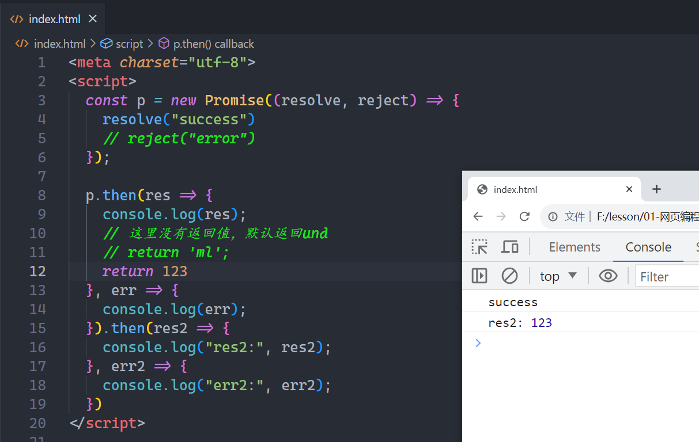
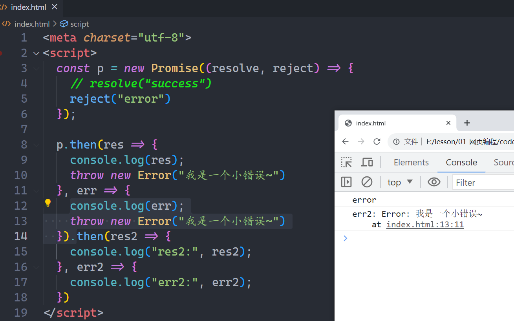
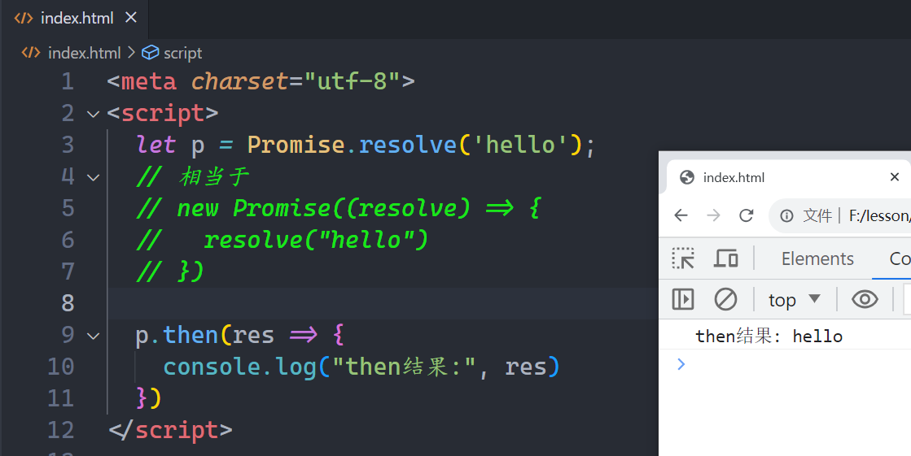
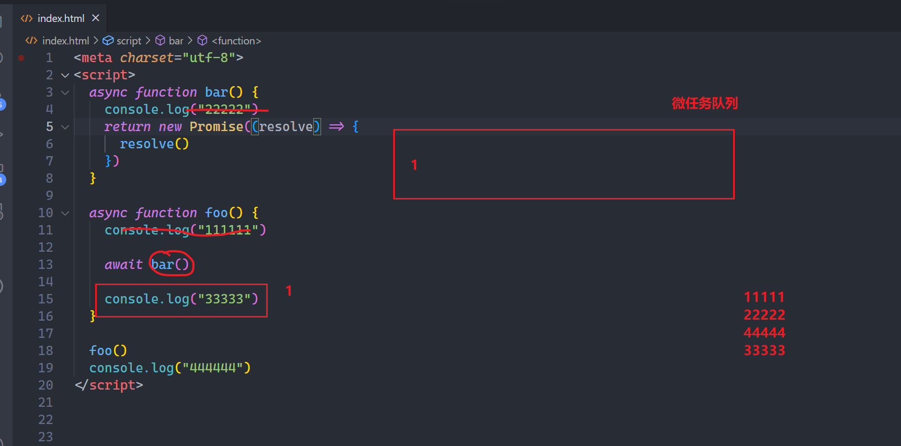

## 一，最早解决异步

### 1，代码分类

**JS中的代码，分两类**

* 同步代码
  + 我们写的绝大代码都是从上到下执行的，也就是说代码的书写顺序和代码的执行顺序是一样的，这样的代码是同步代码，也就说，你看到的98%的代码都是同步代码。
* 异步代码
  + 还有一部分代码，是异步代码，异步代码的书写顺序和代码的执行顺序不一样，这样的代码很少，我们学一类，说一类，前面学的定时器，就是异步代码。

看如下的代码：


计算从0到某个数的和，三秒后出结果，给的数可以是正确的，也可能是不正确。实现之，如下：


参考代码：

```html
<script>
    function fn(counter){
        setTimeout(()=>{
            if(counter>0){
                let total = 0;
                for(let i=0; i<=counter; i++){
                    total+=i;
                }
                return total
            }else{
                return "你传递的数据不合法~"
            }
        },3000)

        return "ok"
    }

    console.log(fn(100))
</script>
```

上面的得到的结果是OK。不是我们需要的，解决之：

```html
<script>
    function fn(counter,successCallback,failureCallback){
        setTimeout(()=>{
            if(counter>0){
                let total = 0;
                for(let i=0; i<=counter; i++){
                    total+=i;
                }
                successCallback(total)
            }else{
                // return "你传递的数据不合法~"
                failureCallback("你传递的数据不合法")
            }
        },3000)

        return "ok"
    }

    let res = fn(100,(value)=>{
        console.log('执行成功了：',value);
    },(reason)=>{
        console.log('执行失败了：',reason);
    })
    console.log("res:",res)
</script>
```


如果异步任务嵌套了多层，会导致回调地狱，如下：


回调地狱的代码，功能是没有问题的，但是代码不优雅。如何更加优雅解决异步问题，就需要学习我们今天的promise。promise知识也是原生的JS的知识点。说白了，学习的还是原生JS。

## 二，Promise

### 1，Promise介绍

**Promise是ES6中的一个类，翻译是承诺，许诺的意思。**

* new Promise就可以得到一个对象，new Promise时，需要传入一个回调函数，这个回调函数是立即执行，叫执行器，这个执行器中有两个参数，分别是resolve和reject，在执行器，可以写代码代码，代码如下：

```html
<meta charset="utf-8">
<script>
    // 函数也是数据
    // Promise resolver  执行器  必须是一个函数
    // p叫promise对象
    // new Promise时，写的那个函数，叫执行器，执行器会立即执行
    // Promise有三个状态  当new出来时，是处于等状态
    // 调用resolve可以把等待状态的promise变成成功态
    // 调用reject可以把等待状态的promise变成失败态
    // 一个promise只能从等待到成功或从等待到失败
    // 一但成功了，就不能失败了
    let p = new Promise((resolve, reject) => {
        console.log("我是执行器，我立即执行了...");
        // 在执行器中通常写异步代码，我们说的异步指的是定时器中的回调函数
        setTimeout(() => {
            console.log("我是定时器");
            // 在异步代码中，可以调用resovle或reject
            // resolve,reject是一个函数
            // resolve中的值，就是成功的值，也就是终值  value
            resolve("包包"); // 就是把等待的promise变成成功的promise

            // reject中的值，就是失败的值，也就是失败的原因  reason
            // reject("没钱"); // 就是把等待的promise变成失败的promise
        }, 2000)
    });
    console.log(p); // pending 是等待的意思

    setTimeout(() => {
        console.log(p); // rejected 表示失败态   fulfilled表示成功状态
    }, 3000);
</script>
```

**Promise有三种状态:**

* 等待状态：pending 默认你创建出来的promise是处于等待状态
* 成功状态：fulfulled 当调用resolve时，就可以把promise从等待变成成功
* 失败状态：rejected 当调用reject时，就可以把promise从等待变成失败

改造一下上面的写的案例，如下：


参考代码：

```html
<script>
    function fn(counter) {
        let promise = new Promise((resolve,reject) => {
            setTimeout(() => {
                if (counter > 0) {
                    let total = 0;
                    for (let i = 0; i <= counter; i++) {
                        total += i;
                    }
                    resolve(total)
                } else {
                    reject("你传递的数据不合法")
                }
            }, 3000)

        })
        return promise;
    }

    // console.log(fn(100));
    fn(-100).then(value=>{
        console.log('--value:',value);
    },reason=>{
        console.log('--reason:',reason);
        
    })
</script>
```


### 2，resolve的实参问题

调用resolve，pormise不一定都是成功的promise，分三种情况：

* 传递一个普通的数据，promise是成功的promise
* 传递一个p(promise)，最终的promise是成功还是失败取决于p。
* 传递一个thenable，最终的promise是成功还是失败取决于thenable。

代码演示：

```html
<meta charset="utf-8">
<script>
    // const p = new Promise((resolve, reject) => {
    //   setTimeout(() => {
    //     // resolve("p的resolve")
    //     reject("没钱")
    //   }, 2000)
    // })

    let promise = new Promise((resolve, reject) => {
        //  1）参数是普通的数据
        // resolve('包包')
        // resolve(111)
        // resolve(["a","b","c"])
        // resolve({ name: "ml" })

        // 2）参数是promise 
        // 如果resolve的参数是promise，最终结果由p决定
        // resolve(p)

        // 3）参数是thenable(就是一个对象中有一个then函数)
        resolve({
            then(resolve, reject) {
                // resolve("包包")
                reject("没钱")
            }
        })

    });

    promise.then((value) => {
        console.log("value:", value);
    }, (err) => {
        console.log("err:", err);
    })
</script>
```

### 3，then方法

一个promise对象，都有一个then方法，只要是一个promise，都有一个then方法，代码演示：


### 4，then函数的返回值

then方法是有返回值的，它返回一个新的promise，只要你敢then，就返回一个新的promise。代码如下：


现在我们需要研究新的promsie是成功的还是失败的，新的promise是成功的还是失败的，取决于上一个then做了什么，当上一个then方法中的回调函数在执行时，新promise处于等待状态，当上一个then返回一个结果时，那这个结果就决定了新的promise的状态，情况有下面四种：

* 上一个then返回一个普通的值（包含und） 新的promise是成功的promsie
* 上一个then返回一个promise，新的promise是成功还是失败取决于返回的那个promise
* 上一个then返回一个thenable值，新的promise是成功还是失败取决于thenable是成功还是失败
* 上一个then抛出一个错误，新的promise就是失败的promise

上一个then返回一个普通的值（包含und） 新的promise是成功的promsie，代码演示：



看如下的题目：


上一个then返回一个promise，代码演示：


上一个then返回一个thenable值，代码演示：


上一个then抛出一个错误，新的promise就是一个失败的promise，如下：



### 5，then的顺延

当我们调用then方法时，可以传递两个函数，第一个函数是pormise成功的时候调用，第二个函数是promise失败的时候调用。我们要考虑，这两个函数，能不能就传递一个呢？如下：


测试一个失败的promise是否可以顺眼，如下：


根据then的顺延，引出catch，如下：


在开发中一般是这么玩的，在then中获取成功的结果，在catch中获取失败的结果，如下：


### 6，finally

在ES9中，新增了finally方法，无论promise是成功的，还是失败的，最终都会执行finally，直接上代码，如下：


### 7，Promise的静态方法

前面学习的then，catch，finally都是promise实例上的方法，其实在Promise这个类上面，还有一些，这些方法，叫静态方法，代码如下：




还有一个all方法，all的作用：

* 所有promise都成功后，得到所有成功后的promise结果
* 如果有一个先失败了，直接得到最先失败promise的结果

代码演示：


参考代码：

```html
<script>

    const p1 = new Promise((resolve,reject)=>{
        setTimeout(()=>{
            // resolve("p1 resolve")
            reject("p1 reject")
        },3000)
    })

    const p2 = new Promise((resolve,reject)=>{
        setTimeout(()=>{
            // resolve("p2 resolve")
            reject("p2 reject")
        },2000)
    })

    const p3 = new Promise((resolve,reject)=>{
        setTimeout(()=>{
            resolve("p3 resolve")
            // reject("p3 reject")
        },5000)
    })

    // axios.all([p1,p2])
    Promise.all([p1,p2,p3]).then(res=>{
        console.log("--res:",res)
    }).catch(err=>{
        console.log("--err",err)
    })
</script>
```


还有一个方法，叫allSettled，作用：

* 获取所有的promise的结果，不管成功还是失败

代码演示：


参考代码：

```html
<script>

    const p1 = new Promise((resolve,reject)=>{
        setTimeout(()=>{
            // resolve("p1 resolve")
            reject("p1 reject")
        },3000)
    })

    const p2 = new Promise((resolve,reject)=>{
        setTimeout(()=>{
            resolve("p2 resolve")
            // reject("p2 reject")
        },2000)
    })

    const p3 = new Promise((resolve,reject)=>{
        setTimeout(()=>{
            resolve("p3 resolve")
            // reject("p3 reject")
        },5000)
    })

    Promise.allSettled([p1,p2,p3]).then(res=>{
        console.log("--res:",res)
    }).catch(err=>{
        console.log("--err",err)
    })
</script>
```


还有一个方法，叫race，race是比赛的意思，作用：

* 会等到第一个Promise有结果(无论这个结果是fulfilled还是rejected)

代码演示：


参考代码：

```html
<script>

    const p1 = new Promise((resolve,reject)=>{
        setTimeout(()=>{
            // resolve("p1 resolve")
            reject("p1 reject")
        },3000)
    })

    const p2 = new Promise((resolve,reject)=>{
        setTimeout(()=>{
            // resolve("p2 resolve")
            reject("p2 reject")
        },2000)
    })

    const p3 = new Promise((resolve,reject)=>{
        setTimeout(()=>{
            resolve("p3 resolve")
            // reject("p3 reject")
        },5000)
    })

    Promise.race([p1,p2,p3]).then(res=>{
        console.log("--res:",res)
    }).catch(err=>{
        console.log("--err",err)
    })
</script>
```


最后一个，叫any，作用：

*  返回第1个成功的  或者  返回所有都失败了

代码演示：


参考代码：

```html
<script>

    const p1 = new Promise((resolve,reject)=>{
        setTimeout(()=>{
            // resolve("p1 resolve")
            reject("p1 reject")
        },3000)
    })

    const p2 = new Promise((resolve,reject)=>{
        setTimeout(()=>{
            // resolve("p2 resolve")
            reject("p2 reject")
        },2000)
    })

    const p3 = new Promise((resolve,reject)=>{
        setTimeout(()=>{
            // resolve("p3 resolve")
            reject("p3 reject")
        },5000)
    })

    Promise.any([p1,p2,p3]).then(res=>{
        console.log("--res:",res)
    }).catch(err=>{
        console.log("--err",err)
    })
</script>
```


总结Promise的静态方法：

```
Promise.resovle();
Promise.reject();
Pormise.all();
Promise.allSettled();
Promise.race();
promise.any();
```


## 三，async函数

### 1，什么是async函数

async是一个关键字，用于声明一个异步函数，async是asynchronous简写，是异步的意思。直接上代码演示：


### 2，async函数的返回值

**记住：异步函数的结果永远都是promise**

异步函数内部代码的执行过程和普通函数是一样的，默认也是同步执行。异步函数和普通函数的区别，如下：

* 异步函数可以有返回值，但是不管返回什么普通值，都会包裹在Pormise.resolve中
* 如果异步函数自己返回了promise，得到的Promies状态由这个promise决定
* 如果我们异步函数返回值是一个对象并且实现thenable，得到的Promies状态由then方法中做了什么才能决定
* 如果在async函数中抛出一个错误，得到的promise是一个失败的promsie

异步函数可以有返回值，但是不管返回什么普通值，都会包裹在Pormise.resolve中，代码如下：


如果异步函数自己返回了promise，得到的Promies状态由这个promise决定，代码演示：


如果我们异步函数返回值是一个对象并且实现thenable，得到的Promies状态由then方法中做了什么才能决定，代码演示：


如果在async函数中抛出一个错误，得到的promise是一个失败的promsie，代码演示：


async函数返回一个promise，如何得到的成功的结果，如何得到失败的结果，如下：


## 四，await关键字

### 1，await关键字介绍

async关键字可以单独使用，在异步函数内部可以使用await关键字，但是在普通函数中不能使用await关键字，await关键字有什么作用？

* await后面跟一个表达式，这个表达式普通是一个promise
* 这个await可以等待它后面的promise成功后，拿到成功的结果，得到之后，才会执行后面的代码。

await后面可以跟不同的数据：

* 如果await后面跟一个普通值，那么会直接返回这个值。
* 如果await后面跟一个thenable对象，那么要看你这个thenable中的then做了什么。
* 如果await后面的promise是失败的，需要通过try catch来获取失败的结果。

如果await后面跟一个普通值，那么会直接返回这个值。代码演示：


await后面通常跟promise，代码演示：


如何获取失败的结果呢？如下：


### 2，使用async+await处理异步问题

```html
<script src="https://cdn.jsdelivr.net/npm/axios/dist/axios.min.js"></script>
<script>
    async function getData(){
        // 1）await后面一般跟promise
        // 2）await前面可以得到成功promise的成功的结果，失败的结果需要使用try catch
        // 3）await下面的写的代码相当于写在了then中

        // console.log("start")  // 1
        // let data = await axios.get("https://tenapi.cn/v2/yiyan")
        // console.log(data)  // 2
        // console.log("end")  // 3

        console.log("start")
        axios.get("https://tenapi.cn/v2/yiyan").then(data=>{
            console.log(data)
            console.log("end")
        })
    }
    getData();
</script>
```


## 五，浏览器事件环

### 1，进程与线程

**进程：**

计算机已经运行直来的程序，是操作系统操作程序的一种方式。当一个软件运行起来后，就是一个进程，电脑上可以运行很多软件，在OS上，有很多的进程，进程是OS分配资源（CPU和内存）的基本单位。OS可以当在一个工厂，一个个的车间就是进程。

**线程：**

操作系统能够运行运算调度的最小单位，一个进程中，至少要包含一个线程，用来执行程序中的代码，这个线程叫主线程，线程才是真正干活的，类似于工厂中的工人。一个车间如果只有一个工人，就是单线程，如果一个车间中有N个工人，就是多线程。

**浏览器是多进程：**

浏览器是一个多进程的软件，一个选项卡，就是一个进程，进程之间一般是独立的。在每一个进程中，包含了很多的线程，其中就包括JS代码执行线程。

**JS主线程是单线程：**

执行JS代码的线程就一个，也就是说，同一个时刻，只能做一件事，那么我们就说JS是单线程的。如果遇到了一个非常耗时的任务，线程不会阻塞，此时，JS的主线程不会等待，浏览器会开一些其它线程去执行耗时任务，主线程，会把所有的同步代码都执行完毕，浏览器会开一些其它线程去执行耗时任务，我们说的JS是单线程的，是指主线程是单线程的，浏览器内部还可以开一些其它线程，如定时器线程，如ajax数据请求线程。

**异步代码分两类：**

* 宏任务：ajax，setTimeout，setInterval，DOM事件监听，UI渲染....

* 微任务：promies中的then回调 Mutaion Observer ...

  

### 2，JS代码的执行顺序

**JS代码的执行顺序：**

1. 从代码段开始执行，先所有的同步任务执行完毕。
2. 如果遇到一个宏任务，会把这个任务放到一个宏任务队列，如果遇到一个微任务，就把这个微任务放到微任务任务中。
3. 当同步代码执行完毕后，先去清空微任务队列。
4. 当微任务队列清空完毕后，从宏任务队列中取出一个宏任务，去执行，在执行过程中，你的宏任务中可能还有同步代码或宏任务或微任务，重复上面的步骤，执行完一个宏任务，肯定要清空微任务队列。
5. 上面的这个循环就构成了浏览器的事件环。

### 3，事件环练习题

第一个题目：

```html
<script>
    console.log(1)
    setTimeout(() => {
        console.log(2)
        Promise.resolve().then(() => {
            console.log(3)
        })

    })
    setTimeout(() => {
        console.log(4)
        Promise.resolve().then(() => {
            console.log(5)
        })
    })
    Promise.resolve().then(() => {
        console.log(6)
    })
</script>
```

解析：


第二个题目：

```html
<script>
    console.log('script start');
    setTimeout(function() {
        console.log('setTimeout');
    }, 0);
    Promise.resolve()
        .then(function() {
            console.log('promise1');
        })
        .then(function() {
            console.log('promise2');
        });

    console.log('script end');
</script>
```

解析：


第三个题目：

```html
<script>
    setTimeout(function() {
        console.log("setTimeout1");
        new Promise(function(resolve) {
            resolve();
        }).then(function() {
            new Promise(function(resolve) {
                resolve();
            }).then(function() {
                console.log("then4");
            });
            console.log("then2");
        });
    });

    new Promise(function(resolve) {
        console.log("promise1");
        resolve();
    }).then(function() {
        console.log("then1");
    });

    setTimeout(function() {
        console.log("setTimeout2");
    });

    console.log(2);

    new Promise(function(resolve) {
        resolve();
    }).then(function() {
        console.log("then3");
    });
</script>
```

解析：


第四个题目：

```html
<script>
    async function bar() {
        console.log("22222")
        return new Promise((resolve) => {
            resolve()
        })
    }
    async function foo() {
        console.log("111111")

        await bar()

        console.log("33333")
    }
    foo()
    console.log("444444")
</script>
```

解析：



第五个题目：

```html
<script>
    async function async1() {
        console.log('async1 start')
        await async2();
        console.log('async1 end')
    }

    async function async2() {
        console.log('async2')
    }

    console.log('script start')

    setTimeout(function() {
        console.log('setTimeout')
    }, 0)

    async1();

    new Promise(function(resolve) {
        console.log('promise1')
        resolve();
    }).then(function() {
        console.log('promise2')
    })

    console.log('script end')
</script>
```

第六个题目：

```html
<script>
    Promise.resolve().then(() => {
        console.log(0);
        return 4
    }).then((res) => {
        console.log(res)
    })

    Promise.resolve().then(() => {
        console.log(1);
    }).then(() => {
        console.log(2);
    }).then(() => {
        console.log(3);
    }).then(() => {
        console.log(5);
    }).then(() => {
        console.log(6);
    })
</script>
```

第七个题目：

```html
<script>
    let start = Date.now();
    for (let i = 0; i < 10000000000; i++) {}
    console.log("哈哈")
    let end = Date.now();
    console.log((end - start) / 1000);

    setTimeout(() => {
        console.log("111")
    }, 10000);

    let start1 = Date.now();
    for (let i = 0; i < 10000000000; i++) {}
    console.log("呵呵")
    let end1 = Date.now();
    console.log((end1 - start1) / 1000);

    // while(true){}
</script>
```

## 六，总结异步的解决方案

### 1，回调函数解决异步

要搞清异步解决方案，你需要掌握的知识点：

* promise
* 迭代器
* 可迭代对象
* 生成器

最早的异步方案，就是回调函数，嵌套过多的话，导致回调地狱。有如个的需求：

1. 发送一次网络请求, 等到这次网络请求的结果  传学生的编号  得到  学生的姓名
2. 发送第二次网络请求, 等待这次网络请求的结果  传学生的姓名  得到 学生的成绩
3. 发送第三次网络请求, 等待这次网络请求的结果  传学生的成绩  得到 成绩的等级

写代码实现上面的需求：

```html
<script>
    function ajax(data) {
        return new Promise((resolve, reject) => {
            setTimeout(() => {
                resolve(data)
            }, 2000)
        })
    }
    // 一层屋嵌套  不优雅
    function getData() {
        // 第一次ajax请求
        ajax("001").then(res1 => {
            console.log("res1是学生的姓名");
            // 第二次ajax请求
            ajax(res1).then(res2 => {
                console.log("res2是学生的成绩");
                // 第三次ajax请求
                ajax(res2).then(res3 => {
                    console.log("res3是学生的等级");
                })
            })
        })
    }
    getData();
</script>
```

浏览器测试之，如下：


### 2，使用then链进行优化

上面的代码不优雅，进行优化，如下：


### 3，使用生成器函数 


### 4，终级方案（async + await）


