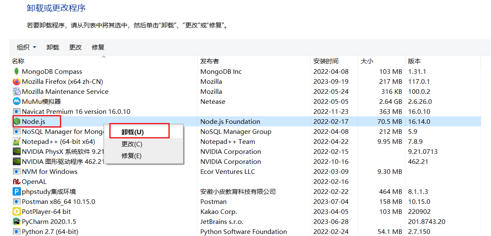
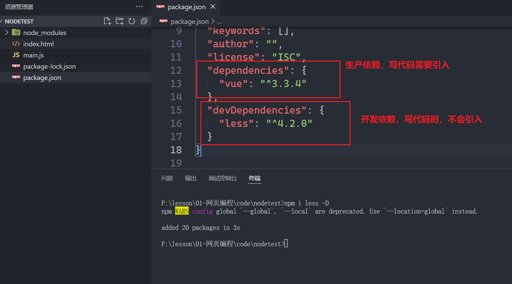
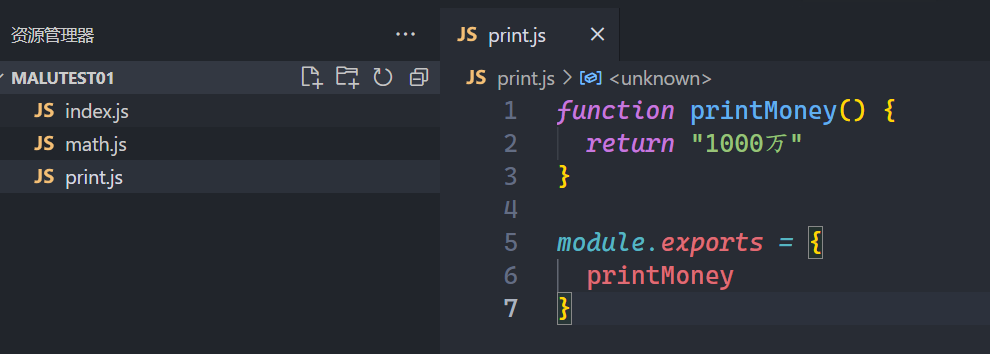
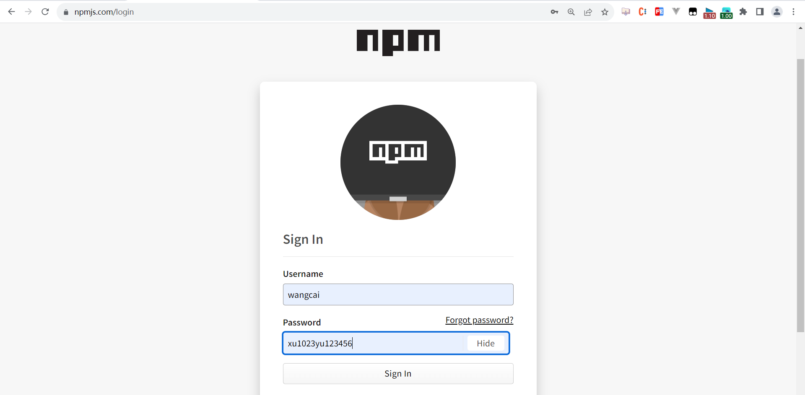
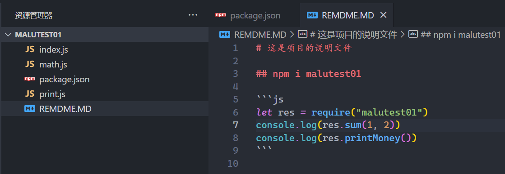

## 一，Node介绍

### 1，什么是node

官方对Node.js的定义：Node.js是一个基于V8 JavaScript引擎的JavaScript运行时环境。<br/>

中文网：https://nodejs.org/zh-cn/


node就是JS代码的运行环境，之前，我们写的JS代码都是在浏览器环境中运行。从今天开始，我们写JS代码，就需要在Node环境中运行了。 到目前为止，运行JS代码，有两个环境：

* 浏览器
* node环境

现在作为前端开发者，node是必学的：

* 前端目录存在的依赖（包），都是以node包的形式进行管理，后面会大量学习别人封装好的包。
* node也可以做为web服务器，配合mysql数据库，再学一个koa或express框架，就可以开接口。
* vue或react框架，到时候，需要学习服务器渲染，也是基于node的。
* electron框架，用来开发桌面应用，也是基于node的
* ....  

**Node的应用场景**

* 前端开发的库都是以node包的形式进行管理，后面会学习大量的库
* npm、yarn工具成为前端开发使用最多的工具
* 服务端渲染，借助Node.js完成前后端渲染的同构应用
* 使用Node可以编写一些脚本工具
* Node也可以开API接口
* 使用Electron来开发桌面应用程序，是需要使用Node
* 使用Node.js作为web服务器开发、中间件、代理服务器
* ....  

### 2，node安装

傻瓜式安装，一直下一步，下一步...。下载：


如何证明node安装好了？

答：键盘中的win+r：弹出一个窗口中，在窗口中输入cmd命令，就会弹出一个CMD窗口，在CMD窗口中输入：node -v，如果弹出了版本号，表示node安装成功了


### 3，安装多个版本的node

有时候，我们需要在电脑上安装不同的版本的node，使用nvm。nvm: node version manger。下载：


下载nvm-setup.ext。安装也是傻瓜式安装。证明安装OK：在CMD窗口中，输入nvm version。如下：


安装完后，就可以利用nvm下载其它版本的node的。必须以管理员的身份打开cmd窗口。如下：


nvm有如下几个命令：

* nvm list 查看电脑上都安装了哪些版本的node
* nvm install 16.18.0  安装指定版本的node
* nvm use 16.18.0 使用指定版本的node

演示上面的几个命令：


注意点：

* 如果说，nvm在你的电脑上安装不成功，现在也不用管，你需要保证，你电脑上至少有一个node。
* 上课的版本是16.16.0，大家最好和我一样。

### 4，卸载node

找到控制面板：




光点卸载是不行的，还需要删除两个文件夹，如下：


可能会遇到的问题，如下：


原因：在你安装的时候，可以安装不成功，因为你安装时，他是从国外下载Node的，可能不成功。需要换源，找到nvm的安装路径，在安装目录下面，有一个settings.txt文件，打开这个文件：


使用vscode打开此文件，换源：

```txt
root: D:\develop\nvm
path: C:\Program Files\nodejs
node_mirror:npm.taobao.org/mirrors/node/
npm_mirror:npm.taobao.org/mirrors/npm/
```


保存，把cmd窗口关掉，重新打开，再重新安装node，如下：


如果还不行，把nvm也卸载掉，去安装16.16.0的node，如下：


总之，需要你电脑上要安装一个16.16.0的node。

### 5，安装npm

安装了node，会自动安装npm，如下：


### 6，在node环境中运行JS代码

方式一：打开JS文件所在文件夹，在输入框，输出cmd，按回车。


方式二：vscode中，打开cmd窗口


方式三：安装一个vscode插件


### 7，node事件环

之前node事件环和浏览器事件环还是不一样的，现在基本上一样了。面试时，可能会问到。回顾一个浏览器的事件环：

* 代码从上到下执行，遇到宏任务，就放到宏任务队列，遇到微任务，就放到微任务队列，先把所有的同步代码执行完毕。
* 清空微任务队列
* 从宏任务队列中取出一个宏任务，执行，执行时，还可能遇到宏任务或微任务，重复第一步。
* 一个宏任务执行完毕，清空微任务队列，再取一个宏任务执行，也就是说在执行宏任务时，微任务队列需要清空。

node环境中能写dom或bom代码吗？

答：不能，官方对Node.js的定义：Node.js是一个基于V8 JavaScript引擎的JavaScript运行时环境。浏览器中的JS包含三个部分：ES + BOM + DOM。我们说的JS运行时环境，运行的是ES代码。BOM和DOM是属于浏览器中的内容。

在node环境中，添加了一个定时器，叫setImmediate，肯定是一个异步任务，是宏任务，写代码演示：


setImmediate setTimeout  谁先执行不好说，演示如下：


在node环境中，还有一个微任务，如下：


安排一些小练习，如下：

```html
<script>
    console.log("script start")

    function requestData(url) {
        console.log("requestData")
        return new Promise((resolve) => {
            setTimeout(() => {
                console.log("setTimeout")
                resolve(url)
            }, 2000);
        })
    }
    async function getData() {
        console.log("getData start")
        const res = await requestData("wc")
        console.log("then1-res:", res)
        console.log("getData end")
    }
    getData()
    console.log("script end")
</script>
```

```html
<script>
    console.log("script start")
    setTimeout(function() {
        console.log("setTimeout1");
        new Promise(function(resolve) {
            resolve();
        }).then(function() {
            new Promise(function(resolve) {
                resolve();
            }).then(function() {
                console.log("then4");
            });
            console.log("then2");
        });
    });
    new Promise(function(resolve) {
        console.log("promise1");
        resolve();
    }).then(function() {
        console.log("then1");
    });
    setTimeout(function() {
        console.log("setTimeout2");
    });
    console.log(2);
    new Promise(function(resolve) {
        resolve();
    }).then(function() {
        console.log("then3");
    });
    console.log("script end")
</script>
```

```html
<script>
    async function async1() {
        console.log('async1 start')
        await async2()
        console.log('async1 end')
    }

    async function async2() {
        console.log('async2')
    }

    console.log('script start')

    setTimeout(function() {
        console.log('setTimeout0')
    }, 0)

    setTimeout(function() {
        console.log('setTimeout2')
    }, 300)

    async1();

    new Promise(function(resolve) {
        console.log('promise1')
        resolve();
        console.log('promise2')
    }).then(function() {
        console.log('promise3')
    })

    console.log('script end')
</script>
```

```html
<script>
    async function async1() {
        console.log('async1 start')
        await async2();
        console.log('async1 end')
    }

    async function async2() {
        console.log('async2')
    }

    console.log('script start')

    setTimeout(function() {
        console.log('setTimeout')
    }, 0)

    async1();

    new Promise(function(resolve) {
        console.log('promise1')
        resolve();
    }).then(function() {
        console.log('promise2')
    })
    console.log('script end')
</script>
```

## 二，模块化

### 1，什么是模块

* 在node中一个 js 文件就是一个模块
* 模块内部代码对于外部来说都是不可见的，可以通过两种方式向外部暴露
* 模块化（组件化）指的就是将一个大的功能拆分为一个一个小的模块，通过不同的模块的组合来实现一个大功能。
* 优点：1. 复用性 2. 维护性

没的模块化，面临的问题，通过代码演示：


创建一个index.html文件，引入上面的两个文件，如下：


浏览器中执行，效果如下：


早期使用IIFE解决命名冲突问题，如下：


总结一下：

* 第一，我必须记得每一个模块中返回对象的命名，才能在其他模块使用过程中正确的使用
* 第二，代码写起来混乱不堪，每个文件中的代码都需要包裹在一个匿名函数中来编写；
* 第三，在没有合适的规范情况下，每个人、每个公司都可能会任意命名、甚至出现模块名称相同的情况；

### 2，commonjs规范

CommonJS是一个规范，简称为CJS，Node是CommonJS在服务器端一个具有代表性的实现

* Node在服务器端实现了这个规范
* webpack打包工具具备对CommonJS的支持和转换

**CommonJS规范要求**

* 在Node中每一个js文件都是一个单独的模块
* 模块中包括CommonJS规范的核心变量：exports、module.exports、require，使用这些变量来方便的进行模块化开发
* exports和module.exports可以负责对模块中的内容进行导出
* require函数可以帮助我们导入其他模块（自定义模块、系统模块、第三方库模块）中的内容

**exports导出**

* exports是一个对象，我们可以在这个对象中添加很多个属性，添加的属性会导出
* 另外一个文件中可以导入，require通过各种查找方式，最终找到了exports这个对象，将这个exports对象赋值给一个变量

代码演示：


创建一个模块，进行导入，如下：


尝试导入ｂ.js，如下：


当我们去reuire一个模块时，它会把模块中的代码全部执行，require多次时，也是执行一次，因为第1次去执行时，就把结果放到缓存中了，第二次再去require时，直接从缓存中获取结果，不会再去模块中的代码，如下：


**module.exports导出**

* CommonJS中是没有module.exports的概念的
* 但是为了实现模块的导出，Node中使用的是Module的类，每一个模块都是Module的一个实例，也就是module
* 所以在Node中真正用于导出的其实根本不是exports，而是module.exports，module才是导出的真正实现者
* 之所以exports也可以导出，是因为module对象的exports属性是exports对象的一个引用
* 就是说 module.exports = exports

开始写代码啦，如下：


在源码中exports 和 module.exports指向了同一个对象，指向同一个堆，在源码中是这样的： exprots = module.exports


上面的两种写法，用的都不多，常用的写法，如下：


让exports指向一个新堆，能不能导出数据呢？如下：


总结导出数据：

* 方式一：  exports.a  = a; exports.b  = b; 在源码中是这样的： exprots = module.exports
* 方式二：   module.exports.a  = a; module.exports.b  = b; 
* 方式三：    module.exports = { a, b }
* 不能这样写：exports = { a, b }; 

### 3，导入

**require是一个函数，可以帮助我们引入一个文件（模块）中导出的对象**

模块分类：

* 自定义模块，就是程序员自己写的模块  a.js。必须以./或../打头。
* 系统模块  node中提供好的模块，不需要下载，也叫核心模块，这些模块在安装node时，就安装到你电脑上了。
* 第三方模块   一些大牛自已开发的模块，上传上网上，我们用的时候，就需要下载安装

代码演示：


require函数解析流程：

* 情况一：require("x")   x是一个Node系统模块，比如path、http
  + 直接去你电脑上找系统模块，找到了，就停止查找。
* 情况二：X是以 ./ 或 ../ 或 /（根目录）开头的，表示是自定义模块
  + require("./x.js")    如果有后缀名，直接找对应的文件。
  + require("./x")  没有后缀名，查找顺序：
    - 1，直接查找文件x
    - 2，查找x.js文件
    - 3，查找x.json文件
    - 4，查找x.node文件
    - 如果还没有找到对应的文件，会把x当成目录，查找目录下的文件
      - 1，查找x/index.js文件
      - 2，查找x/index.json文件
      - 3，查找x/index.node文件
  + 如果没有找到，那么报错：not found
* 情况三：require("x")  x不是一个系统模块，就是一个第三方模块
  + 会在用户电脑上查找这个第三方模块，会在多个地方查找，如果找不到，就报错

### 4，ES6Module规范

**ECMA推出自己的模块化系统，弥补了JavaScript没有模块化一直是它的痛点**

* CommonJS、AMD、CMD等，仅仅是JS社区的规范，并不是官方的
* 采用ES Module将自动采用严格模式：use strict

**ES Module模块采用export和import关键字来实现模块化**

* export负责将模块内的内容导出
* import负责从其他模块导入内容

**规范：**

* 每一个文件，都是一个模块，模块与模块之间天生隔离
* 你想让别人使用你的数据，你就需要导出去
* 你想用别人的数据，你就是导进来

直接上代码演示：


如何运行代码，先在node环境中运行，如下：


在浏览器中运行上面的main.js，如下：


说明浏览器默认也不支持es6module，需要告诉浏览器，我们要采用模块化，如下：


此时，需要安装一个vscode插件，叫live server，如下：


通过插件运行网页，就会走http协议，如下：


上面就演示了如何导入和导出。再看一下导出，如下：


再看一下导入，如下：


再尝试导入b.js中的标识符，如下：


针对导出，还可以批量导出，如下：


可以把多个模块放到一个文件夹，如下：


相当于tools文件夹，下面有两个模块，在另外一个模块中，就可以使用上在的模块了，如下：


但是这样写，有点模块，我们可以在文件夹下面，创建一个文件，如下：


导入使用之，如下：


也就是说，在一个文件夹下面创建了一个index.js，在index.js中导入标识符，再直接导出去，这种写法，有一个简写，如下：


上面的代码还可以简写，如下：


针对导出，上面讲的是export导出的，导出的是标识符，还有一个导出的方式，叫exprot default。如果一个模块中，只有一个数据时，可以使用exprot default，叫默认导出，如果一个模块中，有非常多的标识符，都需要导出，建议使用epxort。如下：


批量导出，如下：


如果说我们就打算打出一个标识符，可以使用默认导出，如下：


如果是导入多个数据，要使用epxrot，如下：


导入，如下：


### 5，import函数

准备一个模块如下 ：


在main.js中导入之，如下：


有一个需求，如果满足某个条件了，再进行导入，如下：


如何解决？答：import函数。如下：


还可以使用async + await，如下：


## 三，包管理

### 1，什么是包管理工具

上在的演示的模块都是自定义模块，除了自定义模块，还有系统模块和第三方模块，系统模块我们先不讲。现在我们研究一下第三方模块，第三方模块都是一些大牛开发的模块，会放到网上，我们使用时，需要下载，通过放在npm网上，如下：


在下载第三方模块，需要使用npm下载工具。这个工具，你在安装node时，就安装好了。npm叫Node Package Manager，就是包管理工具。通过 NPM 可以对 Node 的工具包进行搜索、下载、安装、删除、上传。通过where npm就可以查看你的npm安装在哪里，如下：


### 2，初始化配置文件

安装命令：

```shell
npm install jquery   install可以简写成i
```

安装的依赖有很多版本，默认安装是最新版，演示一下：


一个项目，可以有N个第三方模块，我们需要生成一个配置文件，去记录这些第三方模块。你在安装第三方依赖时，它会生成一个叫package.json文件，这个文件，就是项目的配置文件。它里面记录了，项目所用到的依赖。如下：


一个项目，有非常多的包，我们需要通过一个配置文件（package.json）来管理这些包，配置文件会记录着你项目的名称、版本号、项目描述，项目所依赖的其他库的信息和依赖库的版本号，可以生成配置文件：

```shell
npm init -y   # -y 表示所有选项都采用默认
```

演示一下：


生成的package.json，如下：


有了package.json后，后面就可以安装第三方模块，如下：


当执行npm init -y时，需要注意，如下：


总结一个package.json文件，如下：

```json
{
  "name": "nodetest",      #包的名字(注意生成的包名不能使用中文，大写 ！！！ 不能使用 npm 作为包的名字)
  "version": "1.0.0",   #包的版本
  "description": "",    #包的描述
  "main": "index.js",   #包的入口文件
  "scripts": {			#脚本配置
    "test": "echo \"Error: no test specified\" && exit 1"
  },
  "author": "",			#作者
  "license": "ISC"		#版权声明
}
```

更加详细的配置：

* name是项目的名称，必填
* version是当前项目的版本号，必填
* description是描述信息，很多时候是作为项目的基本描述
* author是作者相关信息（发布时用到）
* license是开源协议（发布时用到）
  + http://www.ruanyifeng.com/blog/2011/05/how_to_choose_free_software_licenses.html(关于开源证书扩展阅读)
* private属性记录当前的项目是否是私有的，当值为true时，npm是不能发布它的，这是防止私有项目或模块发布出去的方式
* main属性，设置程序的入口，实际上是找到对应的main属性查找文件的
* scripts属性用于配置一些脚本命令，以键值对的形式存在，配置后我们可以通过 npm run 命令的key来执行这个命令
  + npm start和npm run start 它们是等价的，对于常用的 start、 test、stop、restart可以省略掉run直接通过 npm start等方式运行；
* dependencies属性
  + dependencies属性是指定无论开发环境还是生成环境都需要依赖的包
  + 项目实际开发用到的一些库模块vue、vuex、vue-router、react、react-dom、axios等
* devDependencies属性
  + 在生成环境是不需要的，比如webpack、babel等
  + 通过 npm install webpack --save-dev，将它安装到devDependencies属性中

版本：

* X主版本号（major）：当你做了不兼容的 API 修改（可能不兼容之前的版本）
* Y次版本号（minor）：当你做了向下兼容的功能性新增（新功能增加，但是兼容之前的版本）
* Z修订号（patch）：当你做了向下兼容的问题修正（没有新功能，修复了之前版本的bug）
* x.y.z：表示一个明确的版本号
* ^x.y.z：表示x是保持不变的，y和z永远安装最新的版本
* ~x.y.z：表示x和y保持不变的，z永远安装最新的版本
* package-lock.json 是包版本的锁文件，专门来固定包的版本的，不要手动修改

### 3，换源

默认情况下，你安装的第三方依赖，是去国外下载的，速度比较慢，并且容易被墙掉，说白了就是安装不成功。我们可以把下载源换成国内下载源，通过一个工具，叫nrm来实现换源，所以现在我们需要安装一个nrm工具，通过npm i xxx -g。 -g表示全局安装，全局安装就是以工具的形式安装。说白了，安装完后，就可以使用这个工具了。

先安装一下，如下：


通过nrm ls查看都有哪些下载源，如下：


上面的taobao就是国内的下载源，可以换源，如下：


### 4，全局安装（工具）和局部安装

上面已经把下载源换成了国内的下载源。开始安装依赖，安装分全局安装和局部安装，先说一下全局安装：

```shell
npm install 工具名称（nrm） -g
```

演示一把，如下：


讲局部安装，局部安装，就是不加-g，项目中用到的依赖，需要局部安装。依赖分两类：

* 生产依赖（写代码用到的依赖）
  + npm i xxx
  + npm i xxx -S                      -S表示安装成生成依赖
  + npm i xxx --save               --save表示安装成生成依赖
* 开发依赖（写代码用不到依赖，和环境有关的依赖）
  + npm i xxx -D                      -D表示开发依赖
  + npm i xxx --save-dev       --save-dev表示开依赖

演示一下：




跑环境，把项目发给别人，一般是不会发node_modules中，这个node_modules在我电脑上没有问题，在你电脑可以有问题，并且这个文件夹，里在文件非常多，copy的话，很容易出问题。你拿到代码后，你需要安装项目中所需要的依赖，通过一个命令，叫npm i就可以把所有的依赖都安装了，这个过程叫跑环境，如下：


总结：

* 不管是生产依赖还是开发依赖，安装的依赖都会放在node_modules文件夹下面
* 全局安装是把这个依赖当成工具，npm i cnpm -g    cnpm就是一个工具。
* 局部安装分开发依赖和生产依赖
* npm install(i) axios 默认安装生产依赖
* npm install(i) axios --save（-S） 生产依赖
* npm install(i) webpack --save-dev（-D） 开发依赖
* npm install(i)  安装package.json中的依赖包(跑环境)
* npm install(i) --production // 只安装 dependencies 中的依赖
* npm uninstall  axios  删除某个依赖
* npm uninstall  axios  -S
* npm search(s) vue  搜索依赖
* npm cache clean  清除缓存

### 5，cnpm 和 yarn

npm工具，是我们在安装node时，就已经安装好了，npm这个工具，叫下载工具，就是用来下载一些第三方依赖。除了npm这个下载工具之外，还有一个下载工具：

* cnpm 
* yarn 
* pnpm

yarn:

* yarn是由Facebook、Google、Exponent 和 Tilde 联合推出了一个新的 JS 包管理工具
* 早期的npm存在很多的缺陷，比如安装依赖速度很慢、版本依赖混乱等等一系列的问题
* 从npm5版本开始，进行了很多的升级和改进，但是依然很多人喜欢使用yarn
* yarn 安装 npm install yarn -g
* yarn 修改仓库地址 yarn config set registry https://registry.npm.taobao.org

yarn相关的命令：

* yarn --version  检测是否安装成功
* yarn init   初始化，生成package.json 
* yarn global add  package    全局安装  
* yarn global remove less   全局删除 
* yarn add package  局部安装  
* yarn add package --dev   (相当于npm中的-D)
* yarn remove package  删除局部包文件
* yarn  安装package.json中的所有依赖 
* yarn info packageName   获取包的有关信息  几乎不用

要有兴趣的话，自己打一下这些命令，目前先把npm 相关的命令掌握就OK。

cnpm:

* npm install -g cnpm 
* cnpm 相关的命令和npm命令基本上是一样的

pnpm:

* 后面大家自学

### 6，发包

所谓的发包，就是你开发一个很NB依赖，上传到npm官网，让别人使用。流程：

1. 修改为官方的地址 ( npm config set registry https://registry.npmjs.org/   也可以通过nrm )

   


2. 创建文件夹，并创建文件 index.js， 在文件中声明函数，使用 module.exports 暴露

   


   



   


3. npm 初始化工具包，package.json 填写包的信息 （越复杂越容易提上去）

   


4. 账号npm注册（激活账号）,==完成邮箱验证==

   



   尝试可以登录了，表示账号和密码是正确的。

   

5. 命令行下 『npm login』 填写相关用户信息 (一定要在包的文件夹下运行)

   


6. 命令行下『 npm publish』 提交包 👌

   


7. npm 有垃圾检测机制，如果名字简单或做测试提交，很可能会被拒绝提交，可以尝试改一下包的名称来解决这个问题

8. 还可以添加项目的说明文件，如下 ：

   



   

   
