## 一，Ajax初识

### 0，搭建后端代码

创建一个后端项目，如下：


生成一个配置文件，如下：


后端需要使用到一些依赖，如下：

```json
"dependencies": {
    "@koa/router": "^12.0.0",
    "axios": "^0.27.2",
    "body-parser": "^1.19.0",
    "cookie-parser": "^1.4.5",
    "express": "^4.17.1",
    "express-session": "^1.17.2",
    "koa": "^2.13.4",
    "koa-body": "^5.0.0",
    "koa-logger": "^3.2.1",
    "koa-static": "^5.0.0",
    "koa2-cors": "^2.0.6",
    "mongodb": "^4.4.0",
    "nprogress": "^0.2.0",
    "qs": "^6.11.0"
  }
```

上面的依赖，就是第三方模块，copy到package.json中，如下：

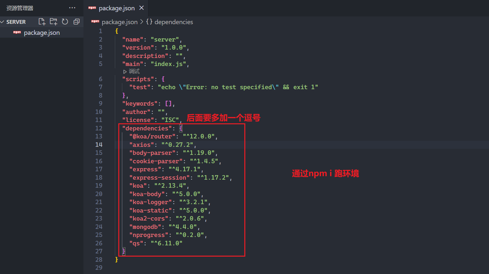

跑环境，如下：


开始书写后端代码，由于大家没有学习过后端，代码直接copy，如下：

```js
const Koa = require("koa");
const cors = require("koa2-cors");
const logger = require("koa-logger");
const Router = require("@koa/router");
const koaBody = require("koa-body");
const app = new Koa();
const router = new Router();

app.use(cors());
app.use(logger());
app.use(koaBody());

router.get("/get", async (ctx, next) => {
    ctx.status = 200;
    ctx.body = "hello Ajax";
});

app.use(router.routes())
router.allowedMethods();

app.listen(3000, () => {
    console.log("running in http://127.0.0.1:3000");
});
```

在vodecode中，copy上面的代码，如下：


然后，就可以请求服务器，通过浏览器或通过poatman来请求，如下：


使用postman试一把，如下：

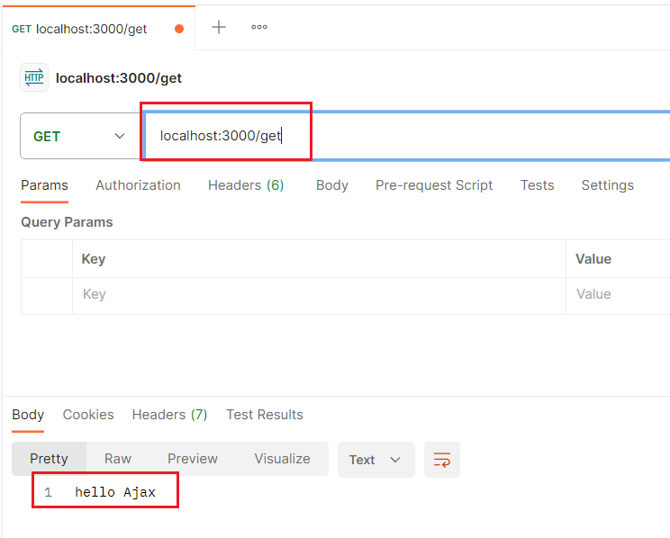

到此，后端服务器就运行起来了，上面的后端代码使用的是JS来的，后面我们会使用JAVA来写。

### 1，原生Ajax经典步骤

之前我们发请求，可能浏览器发请求，也可以通过postman发请求，我们之前学习的html标签中的link标签的href，img标签的src，script标签的scr，a标签的href... 都是可以发请求的。今天我们学习的ajax也是用来发请求的，非常重要的。<br/>

**AJAX**： 全称为Asynchronous Javascript And XML，就是异步的 JS 和 XML。它可以使用 JSON，XML，HTML 和 text 文本等格式发送和接收数据。Ajax不是编程语言，还是原生JS中的内容。<br/>

**Ajax发送请求的经典步骤**

* 第一步：创建网络请求的AJAX对象（使用XMLHttpRequest）
* 第二步：监听XMLHttpRequest对象状态的变化，或者监听onload事件（请求完成时触发）
* 第三步：配置网络请求（通过open方法）
* 第四步：发送send网络请求

在桌面上，再创建一个文件夹，表示前端代码，如下：


代码演示：

```html
<!-- 
   HTML:
      <div>  <p>   <span> ... 

   XML:
      <pig>   <dog>   <student>...
      在10年前，是前后端通信的一种数据格式
      现在，前后端通信主要是以json为主

 -->
<script>
    // 1）创建一个ajax对象   XMLHttpRequest   属于BOM中的内容
    let xhr = new XMLHttpRequest();
    console.log(xhr);
    console.log(xhr.readyState); // ajax刚创建出来的时状态是0

    // 2）监听ajax对象的状态变化 
    xhr.onreadystatechange = function() {
        console.log("==>", xhr.readyState);
        // if(xhr.readyState === 4){
        //   console.log("---------------");
        //   console.log(xhr.response);
        //   console.log("---------------");
        // }
        if (xhr.readyState === XMLHttpRequest.DONE) {
            console.log("---------------");
            console.log(xhr.response);
            console.log("---------------");
        }
    }

    // 3）配置网络请求
    xhr.open('get', 'http://127.0.0.1:3000/get')
    console.log(xhr.readyState); // 调用完open方法后,ajax的状态就变成1

    // 4）发出请求  send(请求体)  请求体就是给后端传递数据
    // get请求没有所谓的请求体  只有post请求才能请求体
    // 你发出了get请求,send()  ()中不需要写任何内容 
    xhr.send()
</script>
```

截个图，如下：


上面是前端代码，对应的后端代码第0小节中。<br/> 

上面我们说了ajax的状态：

* 0       UNSENT       代理被创建，但尚未调用 open() 方法。
* 1       OPENED       open() 方法已经被调用。
* 2       HEADERS_RECEIVED       send() 方法已经被调用，并且头部和状态已经可获得。
* 3       LOADING       服务器正在给ajax数据, responseText 属性已经包含部分数据。
* 4       DONE       服务器已经完全把数据给了ajax

注意：

* 这个状态并非是HTTP的相应状态，而是记录的XMLHttpRequest对象的状态变化

### 2，xhr对象的load事件

除了onreadystatechange，还有其他的事件可以监听，如下：

* loadstart：请求开始
* progress： 一个响应数据包到达，此时整个 response body 都在 response 中
* abort：调用 xhr.abort() 取消了请求
* error：发生连接错误，例如，域错误。不会发生诸如 404 这类的 HTTP 错误
* load：请求成功完成，我们也可以使用load来获取数据
* timeout：由于请求超时而取消了该请求（仅发生在设置了 timeout 的情况下）
* loadend：在 load，error，timeout 或 abort 之后触发

我们重点关注load事件，如下:


参考代码如下：

```html
<script>
    let xhr = new XMLHttpRequest();

    xhr.onloadstart = function() {
        console.log("onloadstart...");
    }
    xhr.onload = function() {
        console.log(xhr.response);
    }

    xhr.open('get', 'http://127.0.0.1:3000/get')

    xhr.send()
</script>
```

后端代码也是第0节中的后端代码。

### 3，响应JSON数据, 指定响应类型

上面的程序，后端响应的是字符串，我们通过响应头，可以看出来，如下：

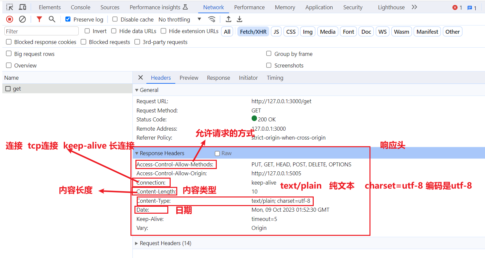

再去看一下请求头，如下：


通过上面的响应头分析，知道了，上面的案例，后端返回的是纯文本。能不能让后端返回JSON呢？

答：肯定可以的。

由于上一个服务，监听的端口是3000，一个端口，只能被一个服务监听。也就意味如果再开一个服务，你是不能监听3000端口，你要么换一个端口，要么把上一个服务关掉，通过stop run code，就可以关掉服务，如下：


创建第二个服务，copy后端代码，如下：


参考代码：

```js
const Koa = require("koa");
const cors = require("koa2-cors");
const logger = require("koa-logger");
const Router = require("@koa/router");
const koaBody = require("koa-body");
const app = new Koa();
const router = new Router();

app.use(cors());
app.use(logger());
app.use(koaBody());

router.get("/json", async (ctx, next) => {
    ctx.status = 200;
    ctx.type = "json";
    ctx.body = {
        name: "码路教育",
        culture: "为学员服务",
    };
});

app.use(router.routes())
router.allowedMethods();

app.listen(3000, () => {
    console.log("running in http://127.0.0.1:3000");
});
```

启动服务，如下：


开始写前端代码：


分析网络面板：


浏览器的地址栏也可以发get请求，如下：


使用postman也可以发请求，如下：


### 4，响应XML数据

关闭上一个服务，如下：


重开一个服务，如下：


参考代码：

```js
const Koa = require("koa");
const cors = require("koa2-cors");
const logger = require("koa-logger");
const Router = require("@koa/router");
const koaBody = require("koa-body");
const app = new Koa();
const router = new Router();

app.use(cors());
app.use(logger());
app.use(koaBody());

router.get("/xml", async (ctx, next) => {
    ctx.status = 200;
    ctx.type = "xml"
    ctx.body = `
        <content>
            <name>码路教育</name>
            <culture>为学员服务</culture>
        </content>
    `;
});

app.use(router.routes())
router.allowedMethods();

app.listen(3000, () => {
    console.log("running in http://127.0.0.1:3000");
});
```

启动服务，如下：


开始写前端代码：


分析网络面板，如下：


### 5，响应的状态status

看一下我们之前响应的状态码：


除了200状态吗，还有一些其它的状态码，如下：


演示404，如下：


再演示一个500，如下：

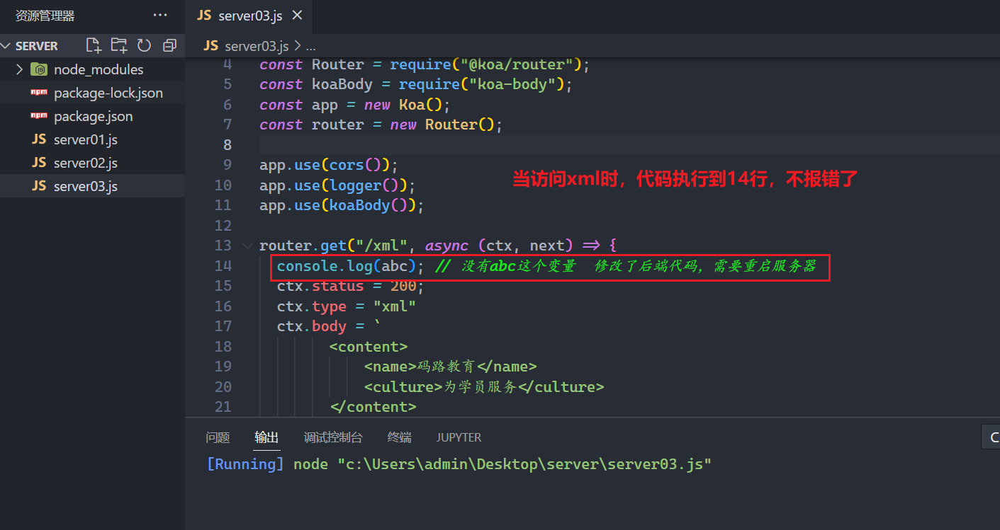


在后端代码中设置的状态码是200，实际上运行程序，得到的状态码，不一定都是200，如下：


对于http的状态码设置，并没有强制要求，理论上你爱设置什么就设置什么，现实中我们还需要遵循http的规则，测试如下：

后面再去演示案例，先停止上一个服务，以后就不说了。后端代码：


参考代码：

```js
const Koa = require("koa");
const cors = require("koa2-cors");
const logger = require("koa-logger");
const Router = require("@koa/router");
const koaBody = require("koa-body");
const app = new Koa();
const router = new Router();

app.use(cors());
app.use(logger());
app.use(koaBody());

router.post("/status/500", async (ctx, next) => {
    ctx.status = 500;
    ctx.body = 500;
});

router.post("/status/503", async (ctx, next) => {
    ctx.status = 503;
    ctx.body = 503;
});

router.post("/status/403", async (ctx, next) => {
    ctx.status = 403;
    ctx.body = 403;
});

router.post("/status/404", async (ctx, next) => {
    ctx.status = 404;
    ctx.body = {
        ok: 1
    };
});

app.use(router.routes())
router.allowedMethods();

app.listen(3000, () => {
    console.log("running in http://127.0.0.1:3000");
});
```

启动服务，如下：


开始写前端代码进行测试，如下：


### 6，URL地址的编码和解码

**情况1**：基于 encodeURI/decodeURI 对整个URL进行编码解码。

特点：只处理了中文和空格等，对于比较特殊的字符（例如：// : ? # & 等）不处理。

代码演示：


**情况2**：基于 encodeURIComponent/decodeURIComponent 对URL地址中的某一部分进行编码和解码

特点：在encodeURI的基础上，还会对 “// : ? # &” 等特殊符合编码

代码演示：


如果url中有中文件或空格，或特殊符号，我们会对它进行编码，如下：


**总结：**

还可以基于 escape/unescape 达到类似于 encodeURIComponent 的效果，只不过：escape一般只有前端有，后端语言中很少具备这个API！所以，建议大家还是使用 encodeURIComponent或者encodeURI（因为大部分后端语言，都具备这样的API）！ 

## 二，给服务器传递参数

### 1，我们可以给服务器传递哪些参数

我们传递给服务器的参数可以有：

* 查询字符串数据（query参数）  get和post都可以
* 路径参数（params参数）  get和post都可以
* 表单数据（urlencoded格式的字符串）
* formdata数据
* 文件数据
* 上传JSON数据
* 上传XML数据
* 通过请求头传递数据

### 2，查询字符串数据（query参数）

后端代码如下：


参考代码如下：

```js
const Koa = require("koa");
const cors = require("koa2-cors");
const logger = require("koa-logger");
const Router = require("@koa/router");
const koaBody = require("koa-body");
const app = new Koa();
const router = new Router();

app.use(cors());
app.use(logger());
app.use(koaBody());

router.get("/get", async (ctx, next) => {
    ctx.status = 200;
    ctx.body = ctx.query;
});

router.get("/get/:name/:age/:address", ctx => {
    ctx.status = 200;
    ctx.body = ctx.params;
})

app.use(router.routes())
router.allowedMethods();

app.listen(3000, () => {
    console.log("running in http://127.0.0.1:3000");
});
```

运行服务器：


前端代码，如下：


分析network面板：


点击view source 和 view URL-encoded，如下：


把bj变成“北  京”, 测试如下：


再查看之，如下：


现在我们通过postman发请求，如下：


### 3，路径参数（params参数）

后端代码同上。

上前端代码，如下：


分析network面板，如下：


上面的面板中没有所谓的payload。再通过postman查看之，如下 ：


测试，使用中文，会不会编码，如下：


浏览器中测试之，如下：


### 4，表单数据

后端代码如下：并运行起来了


参考代码如下：

```js
const Koa = require("koa");
const cors = require("koa2-cors");
const logger = require("koa-logger");
const Router = require("@koa/router");
const koaBody = require("koa-body");
const app = new Koa();
const router = new Router();

app.use(cors());
app.use(logger());
app.use(koaBody());

router.post("/post", async (ctx, next) => {
    ctx.status = 200;
    ctx.body = ctx.request.body;
});

app.use(router.routes())
router.allowedMethods();

app.listen(3000, () => {
    console.log("running in http://127.0.0.1:3000");
});
```

前端代码如下：


分析面板，如下：


现在去看一个请求头，如下：


如果有中文，如下：

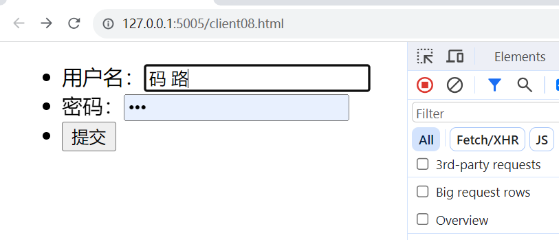


能不能通过ajax发一个表单类型的数据呢？

答：能，直接上代码，如下：


分析面板，如下：


看请求头，如下：


现在使用postman发请求，如下：


### 5，formdata数据

后端代码如下：


参考代码如下：

```js
const Koa = require("koa");
const cors = require("koa2-cors");
const logger = require("koa-logger");
const Router = require("@koa/router");
// 之前: body-parser
// 现在: koa-body
const koaBody = require("koa-body");
const app = new Koa();
const router = new Router();

app.use(cors());
app.use(logger());
app.use(koaBody({
    multipart: true
}));

router.post("/post", async (ctx, next) => {
    ctx.status = 200;
    ctx.body = ctx.request.body;
});

app.use(router.routes())
router.allowedMethods();

app.listen(3000, () => {
    console.log("running in http://127.0.0.1:3000");
});
```

前端代码：


分析面板：


再去看一个请求头，如下：


formData是一个容器，可以直接把一个表单放到这个容器，如下：


分析面板和上面是一模一样的。

在postman中测试之，如下：

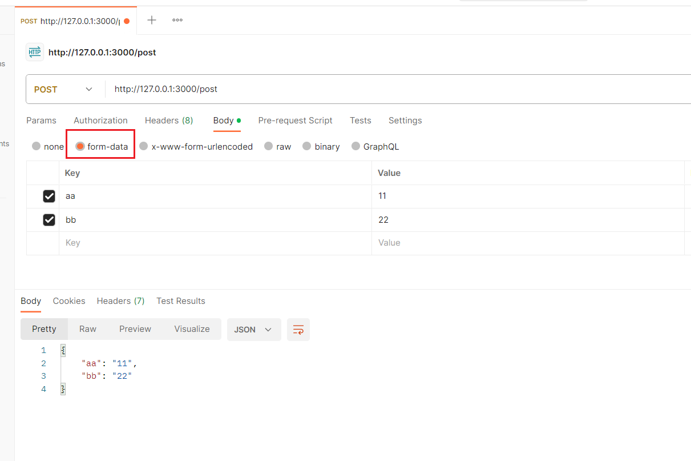

### 6，上传JSON数据

后端代码如下：


参考代码如下：

```js
const Koa = require("koa");
const cors = require("koa2-cors");
const logger = require("koa-logger");
const Router = require("@koa/router");
// 之前: body-parser
// 现在: koa-body
const koaBody = require("koa-body");
const app = new Koa();
const router = new Router();

app.use(cors());
app.use(logger());
app.use(koaBody({
    multipart: true
}));

router.post("/post", async (ctx, next) => {
    ctx.status = 200;
    ctx.body = ctx.request.body;
});

app.use(router.routes())
router.allowedMethods();

app.listen(3000, () => {
    console.log("running in http://127.0.0.1:3000");
});
```

前端代码：


分析面板，如下：


看一个请求头，如下：


使用postman发json数据，如下：


### 7，文件数据

后端代码如下：


参考代码如下：

```js
const Koa = require("koa");
const cors = require("koa2-cors");
const logger = require("koa-logger");
const Router = require("@koa/router");
// 之前: body-parser
// 现在: koa-body
const koaBody = require("koa-body");
const app = new Koa();
const router = new Router();

app.use(cors());
app.use(logger());
app.use(koaBody({
    multipart: true
}));

router.post("/upload", async (ctx, next) => {
    const file = ctx.request.files.file;
    console.log(file);

    ctx.body = '文件上传成功';
});

app.use(router.routes())
router.allowedMethods();

app.listen(3000, () => {
    console.log("running in http://127.0.0.1:3000");
});
```

先不使用ajax传文件，先使用传统的表单传文件，如下：


浏览器测试之，如下：


看面板，如下：


看请求头，如下：

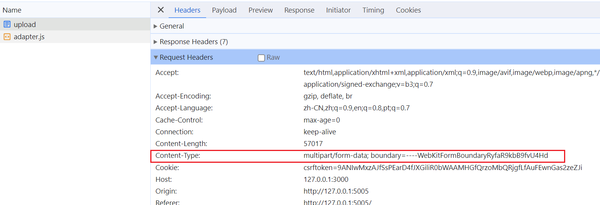

通过postman上传一个文件，如下：


现在使用ajax上传文件，如下：


看面板，如下：


看请求头，如下：


### 9，通过请求头传递数据

可以把数据放到请求头，传递给后端，不写后端代码，直接上前端代码，如下：


面板中看请求头，如下：


后端从请求头中，也可以得到的你传递的数据。

### 10，延迟时间timeout和取消请求

在网络请求的过程中，为了避免过长的时间服务器无法返回数据，通常我们会为请求设置一个超时时间：timeout

自动取消请求，代码如下：


浏览器测试之，如下：


也可以手动取消请求，如下：


浏览器测试之，如下：


## 三，Ajax小案例

### 1，检测用户名是否存在

后端代码如下：


参考代码如下：

```js
const Koa = require("koa");
const cors = require("koa2-cors");
const logger = require("koa-logger");
const Router = require("@koa/router");
const koaBody = require("koa-body");
const app = new Koa();
const router = new Router();

app.use(cors());
app.use(logger());
app.use(koaBody());

// 模拟从数据库中取到的用户信息
let users = ["wc", "xq", "admin"];

router.post("/check", (ctx) => {
    let username = ctx.request.body.username.trim();
    if (users.find(user => user === username)) {
        ctx.body = {
            code: 0,
            msg: "对不起,该用户名已经被注册,请换个用户名"
        }
    } else {
        ctx.body = {
            code: 1,
            msg: "恭喜你,该用户可以使用"
        }
    }

})

app.use(router.routes())
router.allowedMethods();

app.listen(3000, () => {
    console.log("running in http://127.0.0.1:3000");
});
```

前端代码：


参考代码：

```html
<!DOCTYPE html>
<html lang="en">

<head>
    <meta charset="UTF-8">
    <title>Document</title>
</head>

<body>
    <h2>用户注册</h2>
    <form method="post">
        <ul>
            <li>用户名：<input type="text" name="username" id="user"><span id="msg"></span></li>
            <li>密码：<input type="text" name="pwd"></li>
            <li>确认密码：<input type="text" name="repwd"></li>
            <li><input type="submit" value="注册"></li>
        </ul>
    </form>
    <script>
        let user = document.querySelector("#user")
        let msg = document.querySelector("#msg")

        user.onblur = function() {
            // this 表示事件源  this.value 表示输入框中的内容
            let username = this.value;

            let xhr = new XMLHttpRequest();
            xhr.onload = function() {
                let res = xhr.response;
                // console.log(res);
                if (res.code == 0) {
                    msg.innerHTML = res.msg
                    msg.style.color = 'red'
                } else {
                    msg.innerHTML = res.msg
                    msg.style.color = 'green'
                }
            }
            xhr.responseType = "json"
            xhr.open("post", "http://127.0.0.1:3000/check");
            xhr.setRequestHeader("Content-type", "application/x-www-form-urlencoded")
            xhr.send(`username=${username}`)
        }
    </script>
</body>

</html>
```

强调：

* 传递给后端的数据格式是 application/x-www-form-urlencoded
* 后端给我们响应的是json格式   xhr.responseType = "json"

分析Network面板：


同样上面的接口，让你使用postman发请求，如下：


### 2，省市区三级联动

后端代码如下：


参考代码如下：

```js
const Koa = require("koa");
const cors = require("koa2-cors");
const logger = require("koa-logger");
const Router = require("@koa/router");
const koaBody = require("koa-body");
const app = new Koa();
const router = new Router();

app.use(cors());
app.use(logger());
app.use(koaBody());

// data表示服务器端的所有的数据
let data = require("./cityData.min.json")

// 响应所有的省份
router.get("/province", (ctx) => {
    let province = [];
    data.forEach(item => {
        // item代表每一个省的所有数据
        province.push(item.n)
    })
    // json有两种形式：1）对象的形式 2）数组的形式
    ctx.body = province; // 响应给xhr一个json字符串  ["北京市","河南省","河北省"...]
})

// 根据省份，响应对应的市
router.get("/city", (ctx) => {
    let province = ctx.query.province;
    let cities = [];
    data.forEach(item => {
        if (item.n === province) {
            item.s.forEach(item1 => {
                cities.push(item1.n)
            })
        }
    })
    ctx.body = cities
})

app.use(router.routes())
router.allowedMethods();

app.listen(3000, () => {
    console.log("running in http://127.0.0.1:3000");
});
```

前端代码：

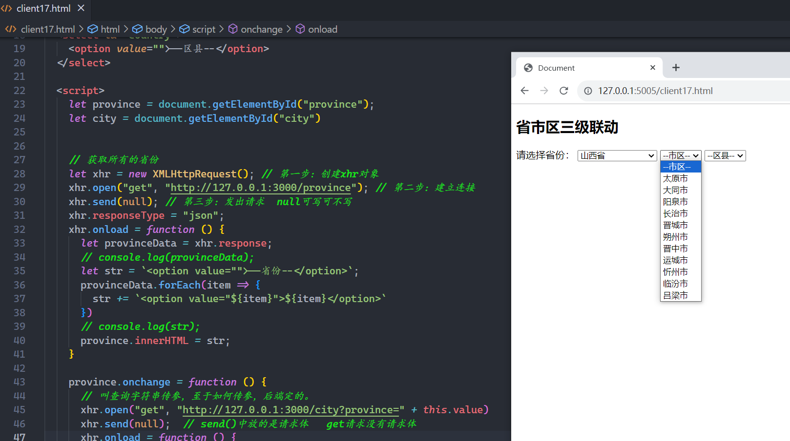

参考代码，如下：

```html
<!DOCTYPE html>
<html lang="en">

<head>
    <meta charset="UTF-8">
    <title>Document</title>
</head>

<body>
    <h2>省市区三级联动</h2>
    <label for="">请选择省份：</label>
    <select id="province">
        <option value="">--省份--</option>
    </select>
    <select id="city">
        <option value="">--市区--</option>
    </select>
    <select id="country">
        <option value="">--区县--</option>
    </select>

    <script>
        let province = document.getElementById("province");
        let city = document.getElementById("city")

        // 获取所有的省份
        let xhr = new XMLHttpRequest(); // 第一步：创建xhr对象
        xhr.open("get", "http://127.0.0.1:3000/province"); // 第二步：建立连接
        xhr.send(null); // 第三步：发出请求  null可写可不写
        xhr.responseType = "json";
        xhr.onload = function() {
            let provinceData = xhr.response;
            // console.log(provinceData);
            let str = `<option value="">--省份--</option>`;
            provinceData.forEach(item => {
                str += `<option value="${item}">${item}</option>`
            })
            // console.log(str);
            province.innerHTML = str;
        }

        province.onchange = function() {
            // 叫查询字符串传参，至于如何传参，后端定的。
            xhr.open("get", "http://127.0.0.1:3000/city?province=" + this.value)
            xhr.send(null); // send()中放的是请求体   get请求没有请求体
            xhr.onload = function() {
                let cityData = xhr.response;
                // console.log(cityData);
                let str = `<option value="">--市区--</option>`;
                cityData.forEach(item => {
                    str += `<option value="${item}">${item}</option>`
                })
                // console.log(str);
                city.innerHTML = str;
            }
        }
    </script>
</body>

</html>
```

强调：

* 获取所有的省份时，没有给服务器传递数据，服务器响应了json数据
* 获取所有的市时，给服务器传递了查询字符串，服务器响应了json数据

分析Network面板：


### 3，传统ajax分页

把mongodb安装到自己的电脑上，软件如下：


安装也是傻瓜式安装，安装后完，你的电脑也可以提供数据库服务了，你电脑上就有这个服务，如下：


你还需要安装一个软件，去连接Mongodb服务器，如下：


双击打开这个软件，如下：


使用这个软件去连接mongodb，如下 ：


创建一个数据库，如下：


创建一个集合，如下：


在一个集合中，就可以放很多的数据，如下：


连续添加15个，如下：


后端代码如下：


参考代码如下：

```js
const Koa = require("koa");
const cors = require("koa2-cors");
const logger = require("koa-logger");
const Router = require("@koa/router");
const koaBody = require("koa-body");
const MongoClient = require('mongodb').MongoClient
const app = new Koa();
const router = new Router();

app.use(cors());
app.use(logger());
// app.use(koaBody());

const client = new MongoClient('mongodb://127.0.0.1:27017')
// 链接服务端
client.connect()
console.log('链接成功')

// 获取数据库 
const db = client.db('ajaxtest')
// 获取集合
const grade1 = db.collection('news')

router.get("/news", async ctx => {

    let page = ctx.query.page || 1;
    (page <= 0) && (page = 1)

    let pageSize = ctx.query.pageSize;
    let r = await grade1
        .find()
        .skip((page - 1) * pageSize)
        .limit(+pageSize)
        .toArray()

    let total = await grade1.find().count();
    let size = Math.ceil(total / pageSize) // size表示一共有多少页

    ctx.body = {
        news: r,
        total: total,
        pageSize,
        page,
        size
    }
    // 关闭客户端的链接
    // client.close()
})

app.use(router.routes())
router.allowedMethods();

app.listen(3000, () => {
    console.log("running in http://127.0.0.1:3000");
});
```

前端代码：


参考代码：

```html
<!DOCTYPE html>
<html lang="en">

<head>
    <meta charset="UTF-8">
    <title>Document</title>
    <style>
        * {
            margin: 0;
            padding: 0;
        }

        li {
            list-style: none;
        }

        body {
            background: #eee;
        }

        .wrapper {
            background: #fff;
            width: 970px;
            margin: 20px auto;
            padding: 15px;
        }

        h1 {
            text-align: center;
            border-bottom: 1px solid #ddd;
            padding-bottom: 20px;
        }

        li {
            margin: 20px 0;
            border-bottom: 1px dotted #eee;
            padding-bottom: 20px;
        }

        p {
            line-height: 25px;
        }
    </style>
</head>

<body>
    <div class="wrapper">
        <h1>新闻列表(AJAX普通分页)
            <script>
                document.write(new Date().toLocaleString())
            </script>
        </h1>
        <ul id="newsWrap">

        </ul>
        <div class="footer">
            <p>总共有<span id="total"></span>条新闻，每页显示<span id="pagesize"></span>条，
                当前是<span id="page"></span>/<span id="size"></span>页
                <a href="#" id="prev">上一页</a>
                <a href="#" id="next">下一页</a>
            </p>
        </div>
    </div>
    <script>
        let ul = document.getElementById("newsWrap");
        let total = document.getElementById("total");
        let pagesize = document.getElementById("pagesize");
        let currentpage = document.getElementById("page");
        let size = document.getElementById("size");

        let prev = document.getElementById("prev")
        let next = document.getElementById("next")

        let page = 1;
        let pageSize = 3;

        function getNewsList(page, pageSize) {
            let xhr = new XMLHttpRequest();
            xhr.open("get", `http://127.0.0.1:3000/news?page=${page}&pageSize=${pageSize}`); // 第二步：建立连接
            xhr.send(null); // 第三步：发出请求  null可写可不写
            xhr.responseType = "json";

            xhr.onload = function() {
                let res = xhr.response;
                // console.log(res);
                let str = "";
                res.news.forEach(item => {
                    str += `
             <li>
                  <h2>${item.title}</h2>
                  <p class="time">${item.time}</p>
                  <p class="summary">${item.summary}</p>
              </li>
          `
                })
                ul.innerHTML = str;
                total.innerHTML = res.total;
                pagesize.innerHTML = res.pageSize;
                currentpage.innerHTML = res.page;
                size.innerHTML = res.size;
            }
        }

        getNewsList(page, pageSize);

        prev.onclick = function(e) {
            e.preventDefault();
            if (page > 1) {
                getNewsList(--page, pageSize)
            }
        }
        next.onclick = function(e) {
            e.preventDefault();
            if (page < +size.innerHTML) {
                getNewsList(++page, pageSize)
            }
        }
    </script>
</body>

</html>
```

分析Network面板：

### 4，点击加载更多

后端代码同上   <br/>

前端代码：

```html
<!DOCTYPE html>
<html lang="en">

<head>
    <meta charset="UTF-8">
    <style>
        * {
            margin: 0;
            padding: 0;
        }

        li {
            list-style: none;
        }

        body {
            background: #eee;
        }

        .wrapper {
            background: #fff;
            width: 970px;
            margin: 20px auto;
            padding: 15px;
        }

        h1 {
            text-align: center;
            border-bottom: 1px solid #ddd;
            padding-bottom: 20px;
        }

        li {
            margin: 20px 0;
            border-bottom: 1px dotted #eee;
            padding-bottom: 20px;
        }

        p {
            line-height: 25px;
        }
    </style>
    <script src="https://cdn.bootcdn.net/ajax/libs/axios/0.21.1/axios.min.js"></script>
</head>

<body>
    <div class="wrapper">
        <h1>新闻列表(ajax点击加载更多分页)
            <script>
                document.write(new Date().toLocaleString())
            </script>
        </h1>
        <ul>

        </ul>
        <div class="footer" style="text-align: center;">
            <button id="btn" style="width: 120px; height: 60px; font-size: 20px;">加载更多</button>
        </div>
    </div>

    <script>
        let page = 1;
        let pageSize = 5;

        let ul = document.getElementsByTagName("ul")[0];
        let button = document.getElementsByTagName("button")[0];

        async function getNewsList(page, pageSize) {
            let {
                data
            } = await axios.get("http://127.0.0.1:3000/news", {
                params: {
                    page,
                    pageSize
                }
            });
            if (data.news.length) {
                let str = "";
                data.news.forEach(item => {
                    str += `
                  <li>
                      <h2>${item.title}</h2>
                      <p class="time">${item.time}</p>
                      <p class="summary">${item.summary}</p>
                  </li>
            `
                })
                // ul.innerHTML = str;
                ul.innerHTML = ul.innerHTML + str;
            } else {
                console.log("没有数据了...");
                button.disabled = true;
                button.innerHTML = "没有更多数据了..."
            }
        }
        getNewsList(page, pageSize);

        button.onclick = function() {
            getNewsList(++page, pageSize)
        }
    </script>
</body>

</html>
```

浏览器效果：


大家，多看看network面板。

### 5，滚动加载更多

后端代码同上 <br/>

前端代码：

```html
<!DOCTYPE html>
<html lang="en">

<head>
    <meta charset="UTF-8">
    <style>
        * {
            margin: 0;
            padding: 0;
        }

        li {
            list-style: none;
        }

        body {
            background: #eee;
        }

        .wrapper {
            background: #fff;
            width: 970px;
            margin: 20px auto;
            padding: 15px;
        }

        h1 {
            text-align: center;
            border-bottom: 1px solid #ddd;
            padding-bottom: 20px;
        }

        li {
            margin: 20px 0;
            border-bottom: 1px dotted #eee;
            padding-bottom: 20px;
        }

        p {
            line-height: 25px;
        }
    </style>
    <script src="https://cdn.bootcdn.net/ajax/libs/axios/0.21.1/axios.min.js"></script>
</head>

<body>
    <div class="wrapper">
        <h1>新闻列表(ajax滚动加载更多分页)
            <script>
                document.write(new Date().toLocaleString())
            </script>
        </h1>
        <ul>

        </ul>
        <div class="footer" style="text-align: center;">
            
        </div>
    </div>

    <script>
        let img = document.getElementsByTagName("img")[0];
        let ul = document.getElementsByTagName("ul")[0];
        let footer = document.getElementsByClassName("footer")[0]

        let page = 1;
        let pageSize = 5;
        let load = true;

        async function getNewsList(page, pageSize) {
            img.setAttribute("src", "./imgs/timg.gif")

            let {
                data
            } = await axios.get("http://127.0.0.1:3000/news", {
                params: {
                    page,
                    pageSize
                }
            });

            if (data.news.length) {
                let str = "";
                data.news.forEach(item => {
                    str += `
                  <li>
                      <h2>${item.title}</h2>
                      <p class="time">${item.time}</p>
                      <p class="summary">${item.summary}</p>
                  </li>
            `
                })
                // ul.innerHTML = str;
                ul.innerHTML = ul.innerHTML + str;
                load = true;
            } else {
                footer.innerHTML = "-----------我是有底线的-----------"
                load = false;
            }

        }
        getNewsList(page, pageSize);

        document.addEventListener("scroll", function() {
            let st = document.documentElement.scrollTop; // // 卷上去的高度
            let ch = document.documentElement.clientHeight; // 一屏的高度
            let dh = document.documentElement.scrollHeight; // 整体内容的高度
            // console.log("st:",st);
            // console.log("ch:",ch);
            // console.log("dh:",dh);

            if ((st + ch) >= (dh - 10) && load) {
                console.log("到底了~");
                getNewsList(++page, pageSize);
            }
        })
    </script>
</body>

</html>
```

浏览器效果：


大家自己分析Network面板。

## 四，Axios

### 1，认识axios

**axios是什么?**

* 前端最流行的ajax请求库
* react/vue官方都推荐使用axios发ajax请求
* 文档: https://github.com/axios/axios

**功能特点**

* 基于xhr + promise的异步ajax请求库
* 浏览器端/node端都可以使用
* 支持 Promise API
* 拦截请求和响应
* 转换请求和响应数据
* 支持请求取消
* 批量发送多个请求

**axios请求方式**

* axios(config): 通用/最本质的发任意类型请求的方式
* axios(url[, config]): 可以只指定url发get请求
* axios.request(config): 等同于axios(config)
* axios.get(url[, config]): 发get请求
* axios.delete(url[, config]): 发delete请求
* axios.post(url[, data, config]): 发post请求
* axios.put(url[, data, config]): 发put请求
* axios.defaults.xxx: 请求的默认全局配置
* axios.interceptors.request.use(): 添加请求拦截器
* axios.interceptors.response.use(): 添加响应拦截器
* axios.create(config): 创建一个新的axios(它没有下面的功能)
* axios. Cancel(): 用于创建取消请求的错误对象
* axios. CancelToken(): 用于创建取消请求的token对象
* axios.isCancel(): 是否是一个取消请求的错误
* axios.all(promises): 用于批量执行多个异步请求
* axios.spread(): 用来指定接收所有成功数据的回调函数的方法

**常见的配置选项**

* 请求地址      url: '/user'
* 请求类型      method: 'get'
* 根求路径      baseURL: 'http://www.mt.com/api'
* 请求前的数据处理      transformRequest:function(data){}
* 请求后的数据处理      transformResponse: function(data){}
* 自定义的请求头      headers:{'x-Requested-With':'XMLHttpRequest'}
* URL查询对象      params:{ id: 12 }
* 查询对象序列化函数      paramsSerializer: function(params){ }
* request body      data: { key: 'aa'}
* 超时设置      timeout: 1000

准备后端代码：


参考代码：

```js
const Koa = require("koa");
const cors = require("koa2-cors");
const logger = require("koa-logger");
const Router = require("@koa/router");
const koaBody = require("koa-body");
const app = new Koa();
const router = new Router();

app.use(cors());
app.use(logger());
app.use(koaBody());

router.get("/get", async (ctx, next) => {
    ctx.status = 200;
    ctx.body = "hello axios";
});

app.use(router.routes())
router.allowedMethods();

app.listen(3000, () => {
    console.log("running in http://127.0.0.1:3000");
});
```

前端代码演示：


参考代码：

```html
<!DOCTYPE html>
<html lang="en">

<head>
    <meta charset="UTF-8">
    <title>Document</title>
    <script src="https://cdn.bootcdn.net/ajax/libs/axios/0.21.1/axios.min.js"></script>
</head>

<body>
    <script>
        // 利用axios发请求，得到的结果是一个promise
        axios.request({
            url: "http://127.0.0.1:3000/get",
            method: "get"
        }).then(res => {
            console.log("res:", res);
            console.log("服务器响应的数据：", res.data);
        })
    </script>
</body>

</html>
```

network面板分析：


### 2，发get请求

后端代码同上。<br/>

前端代码演示：


network面板大家自己点开看看。

### 3，get请求传参

准备后端代码：


参考代码：

```js
const Koa = require("koa");
const cors = require("koa2-cors");
const logger = require("koa-logger");
const Router = require("@koa/router");
const koaBody = require("koa-body");
const app = new Koa();
const router = new Router();

app.use(cors());
app.use(logger());
app.use(koaBody());

router.get("/get", async (ctx, next) => {
    ctx.status = 200;
    ctx.body = ctx.query;
});

router.get("/get/:name/:age/:address", ctx => {
    ctx.status = 200;
    ctx.body = ctx.params;
})

app.use(router.routes())
router.allowedMethods();

app.listen(3000, () => {
    console.log("running in http://127.0.0.1:3000");
});
```

前端代码演示通过查询字符串传参：


network面板分析：


通过查询字符串传参，还有一种写法，如下：


前端代码演示通过路径传参：


看network面板，如下：

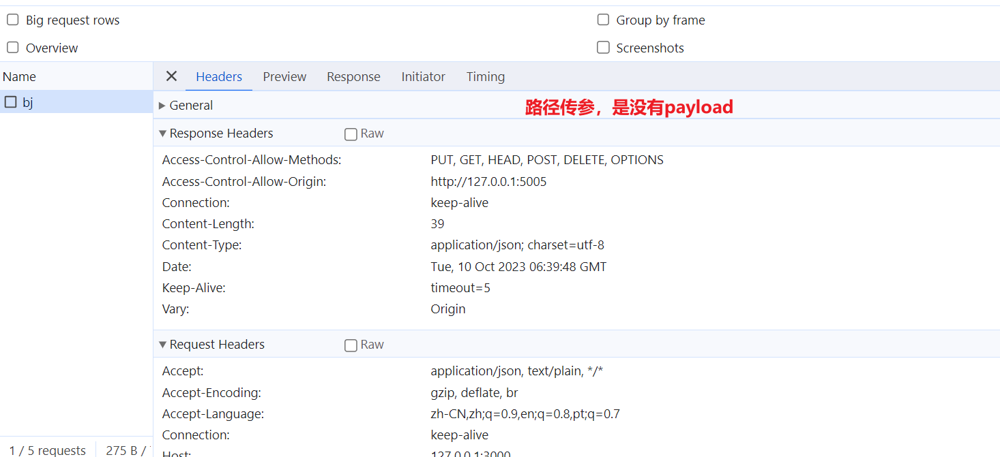

### 4，发post请求

准备后端代码：


参考代码：

```js
const Koa = require("koa");
const cors = require("koa2-cors");
const logger = require("koa-logger");
const Router = require("@koa/router");
const koaBody = require("koa-body");
const app = new Koa();
const router = new Router();

app.use(cors());
app.use(logger());
app.use(koaBody());

router.post("/post", async (ctx, next) => {
    ctx.status = 200;
    ctx.body = ctx.request.body;
});

app.use(router.routes())
router.allowedMethods();

app.listen(3000, () => {
    console.log("running in http://127.0.0.1:3000");
});
```

前端代码演示以Json的形式把数据给服务器：


前端代码演示以表单的形式把数据给服务器：


### 5，其它

axios发送多个请求，如下：


axios是一个实例，是一个对象，可以做一些默认配置，如下 ：


还可以配置其它的，如下：


### 6，axios创建实例

前面使用的axios，是默认的实例，引入axios.js，就有默认的实例。前面我们讲了，可以给这个默认实例作一些配置。当给该实例设置一些默认配置时, 这些配置就被固定下来了，但是后续开发中, 某些配置可能会不太一样，比如，我们要向两台服务器发出请求，如下：

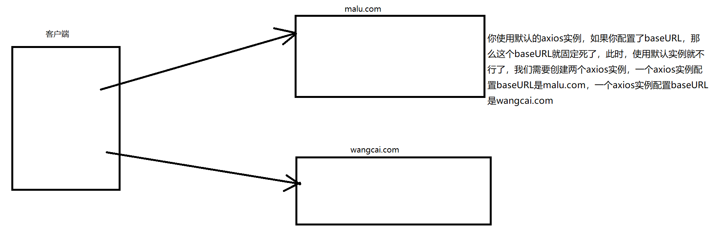

**面试题**

* 需求: 项目中有部分接口需要的配置与另一部分接口需要的配置不太一样, 如何处理
* 解决: 创建2个新axios, 每个都有自己特有的配置, 分别应用到不同要求的接口请求中

创建axios实例，如下：


创建出来的axios实例和默认axios实例的区别：

* 新axios只是没有取消请求和批量发请求的方法, 其它所有语法都是一致的
* 根据指定配置创建一个新的axios, 也就就每个新axios都有自己的配置

### 7，请求和响应拦截器

**axios的也可以设置拦截器：拦截每次请求和响应**

* axios.interceptors.request.use(请求成功拦截, 请求失败拦截)
* axios.interceptors.response.use(响应成功拦截, 响应失败拦截)


直接上代码：

```html
<script src="https://cdn.bootcdn.net/ajax/libs/axios/0.21.1/axios.min.js"></script>
<script src="https://cdn.bootcdn.net/ajax/libs/nprogress/0.2.0/nprogress.min.js"></script>
<link href="https://cdn.bootcdn.net/ajax/libs/nprogress/0.2.0/nprogress.min.css" rel="stylesheet">

<button>发送请求</button>
<script>
    let btn = document.querySelectorAll("button")[0];

    // 给默认实例添加请求拦截器
    // config就是实例的配置
    // 这样写，相当于，这个拦截器什么也没有做
    // axios.interceptors.request.use(config => {
    //   // todo...
    //   return config;
    // })

    // 所谓的做一些事，就是做一些配置
    axios.interceptors.request.use(config => {
        // 添加请求头
        config.headers.Authorization = `abc123`;

        NProgress.start(); // 显示进度条

        return config;
    })

    axios.interceptors.response.use(response => {

        NProgress.done(); // 关闭进度条

        // 在响应拦截器中过滤出data数据  data才是服务器给你的数据
        return response.data;
    }, err => {
        // 失败的回调，直接响应失败的promsie
        return Promise.reject(err)
    })

    btn.onclick = function() {
        axios.get("http://httpbin.org/delay/5").then(res => {
            console.log(res);
        })
    }
</script>
```

浏览器效果如下：


### 8，取消请求

**基本流程**

* 配置cancelToken对象
* 缓存用于取消请求的cancel函数
* 在后面特定时机调用cancel函数取消请求
* 在错误回调中判断如果error是cancel, 做相应处理

**实现功能：点击按钮, 取消某个正在请求中的请求**

* 在请求一个接口前, 取消前面一个未完成的请求

直接上代码：


### 9，简单二次封装

**功能点**

1. 统一进行请求配置: 基础路径/超时时间等
2. 请求过程中loading提示
3. 请求可能需要携带token数据
4. 请求成功的value不再是response, 而是response.data
5. 请求失败/出错统一进行处理, 每个请求可以不用单独处理

直接上代码，如下：

```html
<!DOCTYPE html>
<html lang="en">

<head>
    <meta charset="UTF-8">
    <script src="https://cdn.bootcdn.net/ajax/libs/axios/0.21.1/axios.min.js"></script>
    <script src="https://cdn.bootcdn.net/ajax/libs/nprogress/0.2.0/nprogress.min.js"></script>
    <link href="https://cdn.bootcdn.net/ajax/libs/nprogress/0.2.0/nprogress.min.css" rel="stylesheet">
</head>

<body>

    <script>
        // 一般会自己创建一个axios实例    instance是实例的意思
        let instance = axios.create({
            // 在这里，可以做很多配置
            // baseURL是配置基础路径
            baseURL: "http://127.0.0.1:3000",
            timeout: 8000
        })

        // 目前在请求拦截器中配置了：
        //    1）开启Nprogress进度条
        //    2）在请求头中添加token
        instance.interceptors.request.use(config => {
            let token = localStorage.getItem("token") || "fasdfasdfsadf";
            config.headers["token"] = token;

            NProgress.start();

            return config;
        }, err => {
            return Promise.reject(err)
        })

        // 目前在响应拦截器中配置了：
        //    1）关闭Nprogress进度条
        //    2）过滤出data数据
        instance.interceptors.response.use(response => {

            NProgress.done();

            return response.data;
        }, err => {
            NProgress.done();
            return Promise.reject(err)
        })

        // 后面发请求，就可以使用自己的实例
        instance.get("http://httpbin.org/delay/5").then(res => {
            console.log(res);
        })
    </script>
</body>

</html>
```

## 五，JSONP

### 1，JSONP原理

发送http请求的方式：

* 浏览器的地址栏，只能发送get请求
* postman软件，可以各种请求，类似postman这样的软件有很多
* html中有些标签也会发请求，如img, link, script, a, form....
* ajax可以发各位请求，最大的特点：局部刷新，提升用户体验
* .....

JSONP不是ajax，JSONP发请求本质是利用script标签的src发的请求，先准备后端代码：


写前端代码，如下：

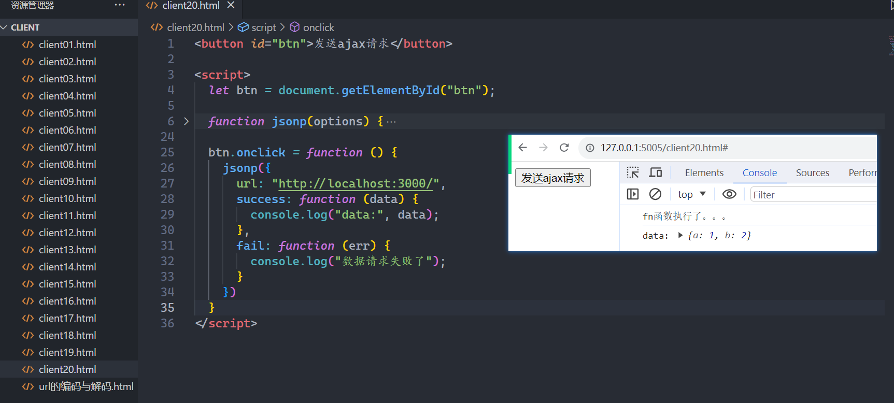

参考代码如下：

```html
<button id="btn">发送ajax请求</button>

<script>
    let btn = document.getElementById("btn");

    function jsonp(options) {

        let callName = "fn";
        // data就是服务器响应的数据
        window[callName] = function(data) {
            console.log("fn函数执行了。。。");
            if (data != null) {
                options.success(data)
            } else {
                options.fail();
            }
        }

        let url = options.url + "?callBack=" + callName;
        let scriptEle = document.createElement("script");
        scriptEle.src = url;
        document.body.append(scriptEle)
    }

    btn.onclick = function() {
        jsonp({
            url: "http://localhost:3000/",
            success: function(data) {
                console.log("data:", data);
            },
            fail: function(err) {
                console.log("数据请求失败了");
            }
        })
    }
</script>
```

### 2，JSONP案例

做一个百度联想搜索的案例：


直接上代码：


HTML结构如下：

```html
<!DOCTYPE html>
<html lang="en">

<head>
    <meta charset="UTF-8">
    <title>百度联想词</title>
    <link rel="stylesheet" href="css/index.css" />
</head>

<body>
    <div class="search-wrap">
        <div class="input-wrap">
            <input type="text" class="search-input J_searchInput" />
        </div>
        <div class="list-wrap">
            <ul class="wd-list J_wdList"></ul>
        </div>
    </div>
    <script src="js/index.js"></script>
</body>

</html>
```

CSS样式如下：

```css
div,
input,
li {
    box-sizing: border-box;
    outline: none;
}

ul {
    padding: 0;
    margin: 0;
    list-style: none;
}

a {
    text-decoration: none;
}

.search-wrap {
    position: relative;
    width: 536px;
    height: 40px;
    margin: 200px auto;
}

.search-wrap .search-input {
    width: 100%;
    height: 40px;
    border: 1px solid #b8b8b8;
    border-bottom: 1px solid #ccc;
    text-indent: 10px;
    font-size: 18px;
}

.search-wrap .search-input:hover {
    border: 1px solid #999;
}

.search-wrap .search-input:focus {
    border: 1px solid #38f;
}

.search-wrap .list-wrap {
    display: none;
    position: absolute;
    top: 40px;
    left: 0;
    width: 100%;
    border: 1px solid #ccc;
    background-color: #fff;
}

.search-wrap .list-wrap .wd-item {
    height: 25px;
    padding-left: 10px;
    line-height: 25px;
}

.search-wrap .list-wrap .wd-item:hover {
    background-color: #efefef;
}

.search-wrap .list-wrap .wd-lk {
    font-weight: bold;
    color: #000;
    font-size: 14px;
}

.search-wrap .list-wrap .wd-lk .font-normal {
    font-weight: normal;
}
```

JS功能如下：

```js
;
(function() {
    // 接口地址：https://sp0.baidu.com/5a1Fazu8AA54nxGko9WTAnF6hhy/su?wd=
    // "https://sp0.baidu.com/5a1Fazu8AA54nxGko9WTAnF6hhy/su?wd=" + value + "&cb=" + callbackName

    // <li class="wd-item">
    //     <a href="https://www.baidu.com/s?wd={{wdLink}}" target="_blank" class="wd-lk">{{wd}}</a>
    // </li> 

    let searchInput = document.getElementsByClassName("J_searchInput")[0];
    let wdList = document.getElementsByClassName("J_wdList")[0];
    let listWrap = wdList.parentNode;

    searchInput.addEventListener("input", function() {
        let val = this.value.trim();
        if (val.length > 0) {
            getDatas(val, 'fn')
        } else {
            wdList.innerHTML = "";
            listWrap.style.display = 'none';
        }
    })

    window.fn = function(data) {
        // console.log("data:", data);
        renderList(data)
    }

    // 调接口，获取数据
    function getDatas(value, callbackName) {
        let oScript = document.createElement("script");
        oScript.src = "https://sp0.baidu.com/5a1Fazu8AA54nxGko9WTAnF6hhy/su?wd=" + value + "&cb=" + callbackName
        document.body.append(oScript)
    }

    // 渲染数据
    function renderList(d) {
        let data = d.s;
        let len = data.length;
        let str = "";

        if (len) {
            data.forEach(item => {
                str += `
                    <li class="wd-item">
                        <a href="https://www.baidu.com/s?wd={{wdLink}}" target="_blank" class="wd-lk">${item}</a>
                    </li> 
                `;
            })
            wdList.innerHTML = str;
            listWrap.style.display = 'block';
        } else {
            wdList.innerHTML = "";
            listWrap.style.display = 'none';
        }
    }
})()
```

## 六，网络理论补充

### 1，从输入URL地址到看到页面，中间都经历了啥？

先上图：


#### 第一步：URL地址解析

有如下的URL： http://www.xxx.com:80/index.html?lx=1&from=weixin#video

url的格式：

* 传输协议（负责客户端和服务器端之间信息的传输（可以理解为快递小哥））
  + http（Hypertext Transfer Protocol）：超文本传输协议（除传输文本内容外，还可传输图片和音视频等）
  + https（Hypertext Transfer Protocol Secure）：HTTP + SSL 更安全的传输协议（经过加密处理）
  + ftp（File Transfer Protocol）：文件传输协议，主要用于往服务器上，上传和下载内容
* 域名
* 端口号
  + 作用：区分相同服务器上部署的不同项目的，取值范围 0~65535 之间
  + 浏览器有默认端口号机制：我们在地址栏中输入URL地址，如果没有写端口号，则浏览器会根据当前的传输协议，自动把端口号加上！！
    - http -> 80
    - https -> 443
    - ftp -> 21
* 请求资源的路径名称
* 问号传参信息
* 哈希值「Hash值」

#### 第二步：缓存检查

针对静态资源文件（例如：html、css、js、图片、音视频...）：强缓存和协商缓存

缓存存储的位置：虚拟内存（Memory Cache）、物理内存（Disk Cache）

* 正常刷新页面：先从虚拟内存中获取，如果不存在，再去物理内存中查找
* 关闭页面重新打开，直接去物理内存中查找
* 强制刷新页面（CTRL+F5），直接去服务器获取最新的

不论是强缓存还是协商缓存，都是由服务器进行设置，浏览器自动配合完成相应的缓存机制！

**强缓存介绍：**

* 第一次访问网站，本地没有任何的缓存，需要向服务器发送请求；服务器在返回相应资源信息的时候，如果想开启强缓存机制，会在响应头中设置相关的字段：
  + Expires：存储缓存过期的具体时间「HTTP/1.0」
  + Cache-Control：存储过多久缓存将过期（单位：秒）或者其它信息「HTTP/1.1」
* 当浏览器获取到服务器返回的资源信息，除了正常的渲染以外，还会去看响应头中是否有 Expires/Cache-Control 字段，如果没有，则啥都不处理，如果有，则把本次获取的资源信息和这两个响应头信息，缓存在客户端本地！第二次及以后访问这个网站，首先看本地是否有”具备有效期的缓存信息“
  + 没有/过期了：重新向服务器发送请求，来获取最新的资源
  + 有：则直接渲染缓存中的信息，无需再向服务器发送请求了

**强缓存的特点：**

* 不论从服务器还是缓存中获取，只要可以拿到，HTTP状态码都是200
* “html页面千万不要做强缓存”，以此来保证，即便本地有生效的缓存，但是只要服务器资源更新了，也要从服务器实时获取最新的资源进行渲染！！
  + 我们平时开发的时候，需要基于 webpack/vite 等前端工具，对代码进行编译打包，把编译后的内容部署到服务器上！
  + 在webpack编译的时候，我们可以设置一个规则：根据文件的内容，让生成的文件名带唯一的HASH值（例如 main.sare3fd9jk.js）；这样只要代码修改了，每次打包都会创建不同的文件出来，而html页面中导入的也是最新的文件！
  + 这样只要html不做强缓存，就可保证，服务器资源一但更新，我们获取的是最新资源，而不是本地缓存！

**协商缓存介绍：**

* 协商缓存是强缓存的一种补充「如果强缓存还在有效期，即便服务器设置了协商缓存，那么协商缓存的机制也不会触发；只有没有强缓存或者强缓存失效了，设置的协商缓存机制才会生效！！」
* 第一次访问网站，本地啥缓存都没有，需要从服务器获取；如果服务器想对当前的资源设置协商缓存，则在响应头中返回/设置相关的字段：
  + Last-Modified：存储该资源在服务器最后一次修改的时间「HTTP/1.0」
  + ETag：存储该资源在服务器最后一次修改的标识(唯一的)「HTTP/1.1」
* 浏览器获取资源信息的同时，观察响应头信息，如果具备这两个字段，则把资源和标识都缓存在本地！
* 第二次访问网站，不论本地缓存是否生效（前提：强缓存肯定是没有或者失效了），都需要重新向服务器发送请求，并且在请求头中携带两个字段：
  + If-Modified-Since：存储的值是Last-Modified的值
  + If-None-Match：存储的值是ETag的值
* 服务器接收传递的信息及标识，用 If-Modified-Since/If-None-Match 和当前服务器上最新的资源进行对比
  + 对比后是一样的：说明服务器上的这个资源没有更改过，则服务器直接返回 304 「Not-Modified」，浏览器接收到这个状态码，则从本地缓存中获取资源信息进行渲染
  + 对比后是不一样的：说明服务器上的这个资源更改过，此时服务器返回 状态码200、最新的资源信息、最新的Last-Modified/ETag值 ！浏览器获取最新的信息后，除了渲染，再把最新的信息和标识缓存在本地！

**ajax获取的数据不能缓存：**

* 基于ajax/fetch从服务器获取的数据，不能设置强缓存和协商缓存，如果需要对不经常更新的数据进行缓存，需要开发者基于本地存储进行处理！
* 最好的数据缓存方案是：vuex/redux「既可以避免频繁向服务器发送请求，也可以保证在用户刷新后，可以及时从服务器获取到最新的信息」
* 但是对于一些不经常更新的数据，基于localStorage来存储（自己设定时效性）也是不错的选择！

参考代码：

```js
const query = async function query() {
    // 执行QUERY方法的第一件事情：先看本地是否有此数据的缓存
    let result = storage.get('CACHE', 7 * 24 * 60 * 60 * 1000)
    if (result) {
        // 本地是具备有效缓存的，则停止向服务器发送请求
        console.log('请求成功：', result)
        return
    }
    // 数据没有缓存过：则向服务器发送请求
    try {
        let result = await axios.get('/api/list', {
            params: {
                lx: 'my'
            }
        })
        console.log('请求成功：', result)
        // 请求成功：把请求的结果存储到本地
        storage.set('CACHE', result)
    } catch (_) {}
}
query()
```

#### 第三步：DNS解析

所谓DNS解析，就是去DNS服务器上，基于域名获取服务器的外网IP地址(主机地址)，DNS解析也是有缓存机制的「比如谷歌浏览器记录“DNS解析”的缓存时间，大概是1分钟左右」。

流程：

* 基于“递归查询”在本地缓存中查找DNS解析记录
  + 浏览器DNS解析缓存 -> 本地Host文件 -> 本地DNS解析器缓存 -> 本地DNS服务器
* 基于“迭代查询”在DNS服务器上查找DNS解析记录
  + 根域名服务器 / 顶级域名服务器 / 权威域名服务器
  + 每一次DNS解析的时间，大概在 20~120 毫秒左右

单纯这样看，减少DNS的解析次数，会提高页面的加载速度！想要减少DNS的解析次数，需要把所有的资源，部署在相同服务器的相同服务下！！但是在真实的项目中，我们往往要把不同的资源部署到不同的服务器上「例如：静态资源服务器、图片和音视频服务器、数据请求服务器...」，这样会导致网站中出现多个域名请求，也就需要多个DNS解析！！

* 资源的合理利用
* 降低单一服务器的压力，提高并发上限
* ...

在DNS解析次数增加的情况下，我们可以基于 dns-prefetch 「DNS预解析」，来提高网站的加载速度！

- 

```html
  <link rel="dns-prefetch" href="//static.360buyimg.com">
```

*  DNS预解析的原理：就是利用浏览器的多线程机制，在GUI渲染的同时，开辟新的线程去解析域名(解析的结果会缓存在浏览器中)，这样当GUI渲染到一定的阶段，遇到新的资源请求的时候，可能域名已经解析过了，直接用缓存中存储的外网IP，去服务器发送请求即可，不用再解析了！！

#### 第四步：TCP三次握手

目的：根据DNS解析出来的服务器主机地址，建立起和服务器之间的传输通道，为了保证传输通道的稳定性，需要进行“三次握手”

#### 第五步：客户端和服务器之间的数据通信

客户端向服务器发送请求，把一些信息传递给服务器「Request请求阶段」

* 请求起始行：请求方式、请求地址(包括问号传参信息)、HTTP协议的版本
* 请求头(首部)：各种各样的键值对  Content-Type、Cookie、User-Agent、Authorization...
* 请求主体(Request Payload)：请求主体中的数据格式是有限制的
  + 支持字符串
    - JSON格式的字符串  Content-Type:application/json
    - urlencoded格式的字符串  xxx=xxx&xxx=xxx   Content-Type:application/x-www-form-urlencoded
    - 普通字符串  Content-Type:text/plain
  + 支持 FormData 格式对象「主要用于文件上传」   Content-Type:multipart/form-data
  + 支持 Buffer/二进制 等格式数据
  + ...
  + 不支持其余的对象格式
    - 如果请求主体中，我们传递的是普通对象，则浏览器默认会把其变为普通字符串（例如：“[object Object]”）传递给服务器
    - 在Axios内部，如果我们传递的是普通对象，其内部会默认把普通对象变为JSON格式字符串，基于请求主体传递给服务器！

服务器接收客户端的请求，把客户端需要的信息返回给客户端「Response响应阶段」

* 响应起始行：HTTP协议的版本、HTTP响应状态码
* 响应头：Connection: keep-alive、Date「服务器时间」...
* 响应主体：一般返回的都是JSON格式字符串，但也有可能是其它的格式（例如 xml、buffer...）

HTTP事务：Request + Response  <br/>

 HTTP报文：请求(响应)起始行/头/主体，统称为HTTP报文！「在控制台的Network中可查看详细的报文信息」

#### 第六步：TCP四次挥手

上一个课件中讲过了。需要说明的是，如果每一次请求都重新的“三握四挥”，这样太浪费性能和时间了。我们期望第一次请求，把传输通道建立好后，当本次HTTP事物完成后，这个通道先不要关闭，保留一段时间，让后面的请求，继续基于这个通道通信即可！解决方案：请求/响应头中设置 Connection: keep-alive , 保持TCP通道的长链接即可「HTTP/1.1版本中，自动就设置了keep-alive长链接机制，服务器端可以修改长链接的时间或者次数」

#### 第七步：客户端渲染

浏览器把服务器返回的信息(包括html/css/js/图片/数据等)进行渲染，最后绘制出对应的页面！！

A）构建 DOM-Tree「DOM树」，从服务器获取HTML页面后，浏览器会分配 GUI渲染线程，自上而下进行解析！

* 遇到 link标签 ：分配一个新的HTTP网络线程去服务器获取样式资源，同时GUI继续向下渲染
* 遇到 style：虽然不需要去服务器获取样式，但是此时的样式是不渲染的，只有等待DOM-Tree构建完毕后，并且其余基于link获取的样式也回来了，才会按照原定的顺序(编写的顺序)进行渲染！
* 遇到 @import：也会分配一个HTTP线程去服务器获取样式资源，只不过其会阻碍GUI的渲染，只有等待样式资源获取完毕后，GUI才会继续向下渲染！
* 遇到 img标签，audio标签，video标签：和 link标签 一致，但是对于音视频来讲，如果设置了 preload="none" 属性，则开始渲染页面的时候，并不会去服务器获取音视频资源！
* 遇到 script标签 ... script标签：立即把JS代码执行（交给JS引擎线程渲染，但是GUI会暂定，也相当于阻碍了GUI渲染）
* 遇到 script src='' 标签：阻碍GUI渲染，分配一个新的HTTP线程去服务器获取JS资源，等待JS代码获取到之后，交由JS引擎线程去渲染，只有JS代码执行完毕，才会继续GUI的渲染！
* 遇到 script src='' async 标签：分配HTTP线程去获取JS资源，此时GUI会继续渲染，但是等到JS代码获取到之后，会立即停止GUI的渲染，先把JS执行！
* 遇到 script src='' defer 标签：和link 标签一致了，会分配HTTP线程去获取JS资源，GUI继续向下渲染，等待DOM-Tree渲染完毕，并且其它设置defer的JS资源也获取到了，再按照编写的顺序，依次执行JS！
* 当把所有的HTML结构解析完毕后，会构建出DOM元素之间的层级关系，这就是DOM树！在DOM树构建完毕后，会触发一个事件：DOMContentLoaded

B）构建 CSSOM-Tree「样式树」

  + 等待样式资源从服务器获取到之后，会按照既定的顺序，开始渲染CSS样式，最后生成 CSSOM-Tree！
  + CSS样式被称之为“层叠样式表”，就是因为其实具备：层级、权重、继承的

C）把 DOM-Tree和CSSOM-Tree 合并在一起，创建 Render-Tree「渲染树」

* 渲染树中，已经非常清楚的知道了：DOM元素的层级和每一个元素的样式

D）Layout 布局排列计算「回流/重排 Reflow」

* 根据当前视口的大小，计算元素在视口中的位置以及相关的样式

E）分层

* 在一个页面中，不仅仅只有一层，它是一个3D空间，会存在很多层「所谓的脱离文档流」
* 而分层的目的就是：把每一层及每一层中的元素样式都详细的规划好，包括具体的绘制步骤

F）Painting 绘制「重绘 Repainting」

* 开始一层层的，按照规划好的步骤进行绘制，直到整个页面都被绘制完毕！

#### 基于上面知识点总结平时项目开发中的一些优化技巧

* 建议把 script 都放在页面的底部，防止其阻碍GUI的渲染，而且在JS中也可以获取到渲染后的DOM元素了
* 如果我把 script放在了页面顶部，此时在JS中是拿不到DOM元素的，该如何解决？
  + 设置 defer 属性
  + 可以监听 DOMContentLoaded/load 事件，在事件中去获取DOM元素
    - DOMContentLoaded：只要DOM-Tree构建完毕后就触发
    - load：只有所有资源都加载完毕才会触发
* 平时开发的时候，如果把 script都放在了页面底部，那么 defer/async 可以不加；如果没有都放在底部，我们可以设置 defer/async 来减轻对GUI渲染的阻碍！
  + 如果JS之间没有依赖关系，设置 async 即可，谁先获取到资源，就先把谁执行！
  + 如果之间是存在依赖的，那么只能设置 defer，要等待所有JS资源都获取到，再按照编写的顺序依次执行！
* 对于样式的处理，坚决不用 @import 导入式「除less/sass中的@import」
* 剩下的情况，如果样式代码比较少，建议我们使用内嵌样式（尤其是移动端），样式代码较多的情况下，还是使用外链式更好一些！！
* 而且要把 link 放在页面头部，让GUI和HTTP同时工作，加快页面的整体渲染进度！
* 同源下，我们可以同时分配的HTTP线程数量，最多是5~7个
  + CSS和JS建议进行合并压缩
  + 第一此渲染页面的时候，对于图片/音视频等资源，一定要开启懒加载，不要让这些资源，占据有限的HTTP线程数，并且第一次渲染如果不渲染图片，页面绘制的速度会更快！！

### 2，常见的HTTP状态码

  + 200 成功
  + 206 断点续传
  + 301 永久重定向「一般用于域名迁移」
  + 302/307 临时转移/重定向「一般用于服务器的负载均衡」
  + 304 协商缓存「服务器资源没有更新」
  + 400 请求参数有误
  + 401 无权限访问
  + 403 服务器拒绝访问「原因没有告知」
  + 404 请求地址不存在
  + 405 请求方式不被允许
  + 408 请求超时
  + 500 未知的服务器错误
  + 502 服务器网关错误
  + 503 服务器超负荷

### 3，常见的请求方式

* GET系列：GET、HEAD、DELETE、OPTIONS
* POST系列：POST、PUT、PATCH

平时开发的时候，大家约定俗成的规范：基于GET系列发送请求，我们把传递的信息以“问号传参”的方式发送给服务器，如果是基于POST系列发送请求，则我们把传递的信息，基于“请求主体”发送给服务器！

* 浏览器对于URL地址的长度是有限制的「IE 2KB、谷歌 8KB」, 而基于GET方式发送请求，需要把传递的信息，以问号传参的方式，拼接到URL的末尾，这样对于传递信息的大小就有了限制！而POST系列请求，是基于请求主体把信息给服务器，请求主体理论上是没有大小限制的（实际开发中我们会自行限制）！

* GET请求容易产生缓存，而POST请求不会

  + 问题描述：如果很短的时间内，向服务器发送多个请求，这些请求的地址及传参信息都一模一样，那么后面请求很有可能获取的是第一个请求缓存的信息！

  + 解决方案：只要保证每一次请求传递的参数不完全一致即可「多加一个参数 _=随机数/时间戳 」

  + xhr.open('GET',   `/api/list?lx=1&name=AA&_=${+new Date()}`)
  
* GET请求相对于POST请求来讲，是不安全的「但是POST也不安全，互联网面前人人都在裸奔」

### 4，TCP和UDP

* TCP经过三次握手，建立起一个“稳定可靠”的传输通道；但是因为每一次的通信，都需要经过三次握手，确保通道稳定后再传输，这样导致传输效率慢！
* UDP是不需要经过三次握手的，每一次的传输都是直接进行，这样保证传输的效率，但是不能保证传输的稳定性！
