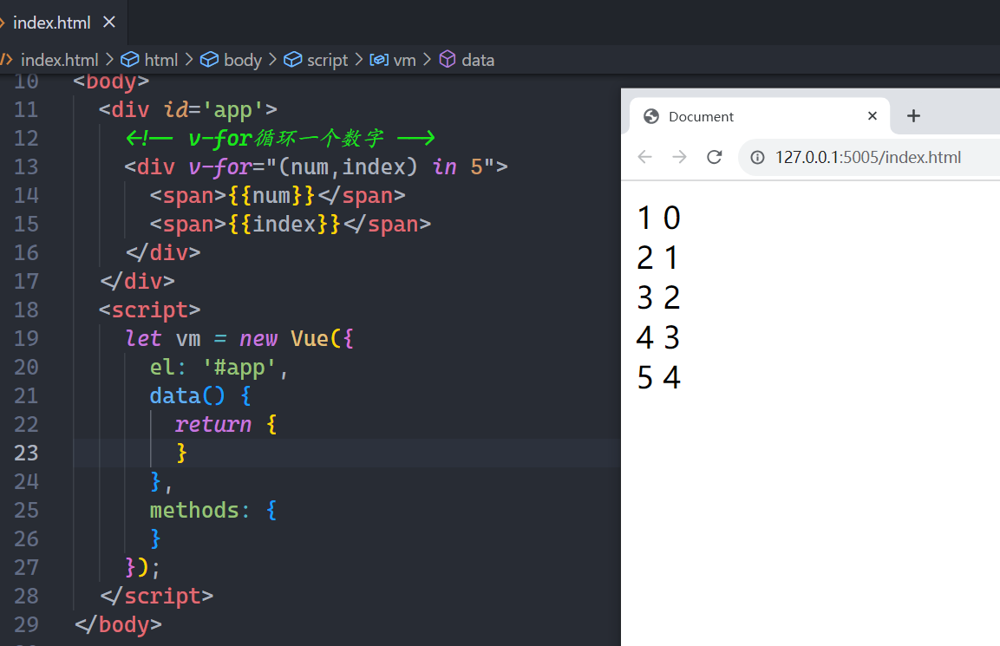

## 一，Hello Vue2

### 1，vue2介绍

特点：

* MVVM框架
* 响应式（声明式）
* 丰富的指令（DOM功能的抽象）
* 基于选项式（template、data、computed、watch、methods....）
* Vue的文档，最好的教程    https://v2.cn.vuejs.org/
* vue的生态丰富且简单
* 渐近式的（可大可小的项目都能做）

vue的开发思想：

当我们需要在交互事件中改变视图时，先在data选项中声明一个合适的变量，再在交互事件中改变这个声明式变量即可，视图自动更新，这是一种间接的操作。

关于vue.js的版本

* **vue2**，经典版本，现在绝大部分的企业项目都是用vue2版本开发。
* vue3，也是主流，后面都会过渡到vue3上。

体验一下vue2，如下：


参考代码如下：

```html
<!DOCTYPE html>
<html lang="en">

<head>
    <meta charset="UTF-8">
    <title>Document</title>
    <!-- 引入vue.js -->
    <script src="https://cdn.jsdelivr.net/npm/vue@2.7.10/dist/vue.js"></script>
</head>

<body>
    <!-- 这个div叫vm实例对应的模板 -->
    <div id="app">
        <!-- {{}} 叫小胡子语法 -->
        <h2>{{name}}</h2>
        <button @click="changeData">改变数据</button>
    </div>

    <script>
        // Vue是一个构造器   new一个构造器就可以得到一个对象
        // vm也叫根组件   new Vue时，传递一个配置对象
        // 配置对象中需要写很多的选项
        // 所有的响应式数据，都会挂载到vm上。
        // vm代理data中所有的响应式数据
        let vm = new Vue({
            // el表示vm实例与上面的html容器进行关联
            el: "#app",
            // data是一个选项
            // data就是给模板提供数据的，放在data中的数据是响应式数据
            // 所谓的响应式的数据，就是数据变了，模板会自动刷新
            // 现在开发思想就变了：
            //   之前：获取DOM，操作DOM，改变视图
            //   现在：定义响应式数据，改变响应式数据，视图会自动的更新
            data() {
                return {
                    name: "码路", // 响应式数据
                }
            },
            methods: {
                changeData() {
                    // 改变响应式数据
                    // this，表示vm实例
                    this.name = "xxx";
                }
            }
        });
    </script>
</body>

</html>
```

再去体验一下，数据驱动视图，如下：


参考代码：

```html
<!DOCTYPE html>
<html lang="en">

<head>
    <meta charset="UTF-8">
    <title>Document</title>
    <!-- 1.引入vue.js文件 -->
    <script src="https://cdn.jsdelivr.net/npm/vue@2/dist/vue.js"></script>
</head>

<body>
    <!-- 模板 -->
    <div id="app">
        <h1>欢迎学习Vue.js</h1>
        <div>我叫{{name}}，微信{{wechat}}</div>

        <input type="button" value="点我" @click="clickMe">
    </div>

    <script>
        // 2.创建Vue实例，并且让vm与HTML中的容器进行关联
        let vm = new Vue({
            el: "#app",
            // data是给模板提供数据
            data: {
                name: "wc",
                wechat: "8764567765"
            },
            methods: {
                clickMe() {
                    this.name = "malu";
                    this.wechat = "66666666"
                }
            },
        });
    </script>
</body>

</html>
```

总结一下：

* vue的思想：数据驱动视图
* data  定义响应式数据，所谓的响应式，就是数据变了，视图会自动刷新
* el  让vm实例与某个容器进行关联
* methods   是专门用于定义函数方法的地方

## 二，Vue常见指令

vue中基本上不会再手动操作DOM，vue作者就帮我们封装了很多的指令。什么是指令？就是vue内置的一套“模板（都是以v-），用于在视图节点上动态绑定变量（表达式）的。**指令实际上是DOM功能的抽象，所以指令实际上也是DOM操作。**

**指令分类：**

* 文本相关的指令
* 属性绑定相关的指令
* 事件绑定相关的指令
* 表单相关的指令
* 列表渲染相关的指令
* 条件渲染相关的指令
* 其它指令
* 自定义指令

### 1，文本相关的指令

```html
下面的是文本相关的指令：

- {{}}文本插值、v-text、v-once、v-cloak、v-html
- {{}} 用于绑定节点的文本，它和v-text功能是一样的。区别是{{}}这种绑定值的方式会出现“{{}}一闪而过”的效果，建议使用v-cloak来解决。
- v-text 用于绑定节点的文件，在大多数时候，它和 {{}} 可以相互替换。
- v-once 用于指定节点的动态内容只绑定一次。当前节点中所对应的变量发生变化，视图不更新。一般情况下，v-once只能和{{}}一起用。
- v-once 和 v-cloak 都是不需要接收表达式来做为“值”
- v-html 用于绑定动态的html节点，相当于DOM中的 innerHTML。这个指令默认已经做了“防注入攻击XSS”的处理
```

代码演示：


参考代码：

```html
<!DOCTYPE html>
<html lang='en'>

<head>
    <meta charset='UTF-8'>
    <title>Document</title>
    <style>
        [v-cloak] {
            display: none;
        }
    </style>
    <script src='https://cdn.jsdelivr.net/npm/vue@2/dist/vue.js'></script>
</head>

<body>
    <div id='app'>
        <div>
            <!-- {{}} 小胡子语法仅仅是v-text指令的语法糖 -->
            <h2 v-cloak>{{name}}</h2>
            <!-- v-text "name" 不是字符串，不是字符串，不是字符串 -->
            <!-- 是表达式，后面看到"" 里面放的是表达式 -->
            <h2 v-text="name"></h2>
            <h2 v-text=" '年龄：' + age "></h2>
            <h2 v-text=" `年龄：${age}` "></h2>
            <h2 v-cloak>{{'年龄：' +age}}</h2>
            <!-- <h2 v-cloak>{{`年龄：${age}`}}</h2> -->
            <div v-text="msg"></div>
            <div v-html="msg"></div>
            <h2 v-once>{{age}}</h2>
            <button @click="changeAage">改变age</button>
        </div>
    </div>
    <script>
        // setTimeout(() => {
        let vm = new Vue({
            el: '#app',
            data() {
                return {
                    name: "码路",
                    age: 18,
                    msg: `<a href="http://www.baidu.com">百度一下</a>`,
                }
            },
            methods: {
                changeAage() {
                    this.age++
                }
            }
        });
        // }, 2000);
    </script>
</body>

</html>
```

### 2，属性绑定相关的指令

```html
- v-bind 用于动态绑定节点的属性（比如title、value、class、style等）
- v-bind 用得非常多，所以经常简写成 : &lt; div :id='变量'>&lt; /div>
- 动态class语法（一）：&lt; div :class='`${变量1} ${变量2} `'>&lt; /div>
- 动态class语法（二）：&lt; div :class='[表达式1, 表达式2, ...]'>&lt; /div>
- 动态class语法（三）：&lt; div :class='{ 类名1: 布尔值1, 类名2: 布尔值2, ... }'>&lt; /div>
- 动态style语法（一）：&lt; div :style='`color:red;fontSize:20px`'>&lt; /div>
- 动态style语法（二）：&lt; div :style='[{css键值对}, {css键值对}, ...]'>&lt; /div>
- 动态style语法（三）：&lt; div :style='{css键值对}'>&lt; /div>
```

绑定普通的属性，代码如下：


参考代码：

```html
<!DOCTYPE html>
<html lang='en'>

<head>
    <meta charset='UTF-8'>
    <title>Document</title>
    <script src='https://cdn.jsdelivr.net/npm/vue@2/dist/vue.js'></script>
</head>

<body>
    <div id='app'>
        <h1 title="haha">我是一个孤独的h2</h1>
        <!-- 一个指令后面的""中放的是表达式 -->
        <h1 v-bind:title="a1">我是一个孤独的h2</h1>
        <h1 :title="a1">我是一个孤独的h2</h1>
        <h1 v-bind="{title:a1,class:a2}">我是一个孤独的h2</h1>

        
    </div>
    <script>
        let vm = new Vue({
            el: '#app',
            data() {
                return {
                    a1: 'ok',
                    a2: 'bad',
                    imgUrl: "https://img0.baidu.com/it/u=1732521231,1421026517&fm=253&app=138&size=w931&n=0&f=JPEG&fmt=auto?sec=1697216400&t=407e58ecae68be0e0bbf7d27ac586278",
                }
            },
            methods: {}
        });
    </script>
</body>

</html>
```

绑定class属性，如下：


参考代码：

```html
<!DOCTYPE html>
<html lang='en'>

<head>
    <meta charset='UTF-8'>
    <title>Document</title>
    <script src='https://cdn.jsdelivr.net/npm/vue@2/dist/vue.js'></script>
</head>

<body>
    <div id='app'>
        <h1 class="box">绑定class属性</h1>
        <h1 :class="a1">绑定class属性</h1>
        <h1 :class=" `${a1} ${a2}` ">绑定class属性</h1>
        <h1 :class=" [a1,a2] ">绑定class属性</h1>
        <h1 :class=" [ 1==1 ? a1 : a2 ] ">绑定class属性1111</h1>
        <h1 :class=" {box1:true,box2:true} ">绑定class属性</h1>
        <h1 :class=" obj ">绑定class属性</h1>
        <h1 :class=" {f1:Math.random()>0.5} ">绑定class属性</h1>
        <h1 :class=" {f1:110} ">绑定class属性</h1>
    </div>
    <script>
        let vm = new Vue({
            el: '#app',
            data() {
                return {
                    a1: "info",
                    a2: "danger",
                    clr: "red",
                    size: "19",
                    obj: {
                        box3: true,
                        box4: true
                    }
                }
            },
            methods: {}
        })
    </script>
</body>

</html>
```

还有一个比较特殊，绑定style，如下：


参考代码：

```html
<!DOCTYPE html>
<html lang='en'>

<head>
    <meta charset='UTF-8'>
    <title>Document</title>
    <script src='https://cdn.jsdelivr.net/npm/vue@2/dist/vue.js'></script>
</head>

<body>
    <div id='app'>
        <!-- v-bind是单向绑定：把JS中的数据绑定到HTML上。  修改JS中的响应式数据，HTML也会修改。 -->
        <h1 style="color: red; background-color: pink;">绑定行内样式</h1>
        <h1 :style=" `color:yellowgreen; background-color: pink;` ">绑定行内样式</h1>
        <h1 :style=" `color:${a1}; background-color: ${a2};` ">绑定行内样式</h1>
        <h1 :style=" {color:a2,fontSize:fs+'px'} ">绑定行内样式</h1>
        <h1 :style=" [{color:'red'},{fontSize:fs+'px'},{textDecoration:'line-through'}] ">绑定行内样式</h1>
        <h1 :style=" {[a3]:a1} ">绑定行内样式</h1>
    </div>
    <script>
        let vm = new Vue({
            el: '#app',
            data() {
                return {
                    a1: 'blue',
                    a2: 'gold',
                    fs: "46",
                    a3: 'color'
                }
            },
            methods: {}
        });
    </script>
</body>

</html>
```

### 3，事件绑定相关的指令

```html
- v-on 用于给视图节点绑定各种JS事件，比如click、mouseenter、blur、keyup等
- v-on:click
- v-on:dblclick
- v-on:mouseover，
- v-on:mouseout，
- v-on:change
- v-on:focus
- ...
- v-on 用得非常多, 所以简写成 @ 基本语法: div @事件名. 事件修饰符='事件处理器'
- v-on 上可以使用事件修饰符: .stop阻止冒泡 .prevent阻止默认事件 .enter绑定键盘Enter键盘....
```

直接上代码：


参考代码：

```html
<!DOCTYPE html>
<html lang='en'>

<head>
    <meta charset='UTF-8'>
    <title>Document</title>
    <style>
        .outer {
            width: 200px;
            height: 200px;
            background-color: gold;
            display: flex;
            justify-content: center;
            align-items: center;
        }

        .inner {
            width: 100px;
            height: 100px;
            background-color: skyblue;
        }
    </style>
    <script src='https://cdn.jsdelivr.net/npm/vue@2/dist/vue.js'></script>
</head>

<body>
    <div id='app'>
        <button v-on:click="handle">点我</button>
        <button @click="handle">点我</button>

        <!-- 事件相关的修饰符  stop 阻止事件冒泡 -->
        <!-- prevent 阻止默认事件 -->
        <!-- once 只绑定一次 -->
        <!-- 事件修饰符可以连用 -->
        <div class="outer" @click="outerClick">
            <div class="inner" @click.stop.once="innerClick"></div>
        </div>

        <button @click="fn">点我</button>
        <button @click="gn(1,2)">点我</button>
        <!-- 手动的把事件对象传递下面，在模板中有一个$event表示事件对象 -->
        <button @click="kn(1,2,$event)">点我</button>
    </div>
    <script>
        let vm = new Vue({
            el: '#app',
            data() {
                return {
                    // 方法写在data中，也行，不建议
                }
            },
            methods: {
                handle() {
                    console.log("handle...");
                },
                outerClick() {
                    console.log("outerClick...");
                },
                innerClick() {
                    console.log("innerClick...");
                },
                fn(e) {
                    console.log("e:", e);
                },
                gn(a, b) {
                    console.log(a, b);
                },
                kn(a, b, e) {
                    console.log(a, b, e);
                }
            }
        });
    </script>
</body>

</html>
```

### 4，表单相关的指令(v-model)

```html
一般用于在交互的表中中使用，例如：input、select、textarea等。【双向绑定】

- v-model 用于表单取值(表单双向绑定), 比如input/select/textarea等
- 基本语法: input type="text" v-model. 表单修饰符='变量'
- 三个修饰符: .trim自动去除文本首尾空格 .number隐式类型转换变成Number类型 .lazy用于性能, 当表单失焦时再进行双向绑定
- v-model 还有更深的理解, 在组件化中进一步去理解
```

先简单的使用一个v-mdole，如下：


参考代码：

```html
<!DOCTYPE html>
<html lang='en'>

<head>
    <meta charset='UTF-8'>
    <title>Document</title>
    <script src='https://cdn.jsdelivr.net/npm/vue@2/dist/vue.js'></script>
</head>

<body>
    <div id='app'>
        <!-- 姓名：<input type="text" :value="name" @input="fn"> <br> -->

        <!-- 如果方法中只有一行代码，可以把代码直接写在模板中 -->
        <!-- 姓名：<input type="text" :value="name" @input="name = $event.target.value"> <br> -->

        <!-- v-model写在标签上，等价于:value + @input -->
        <!-- 姓名：<input type="text" v-model="name"> <br> -->

        <!-- v-model都有哪些修饰符？答：number trim lazy -->
        <input type="text" v-model.trim="name" @keyup.enter="submit">
        <input type="text" v-model.number="age" @keyup.enter="submit">
        <h1>{{age}}</h1>
        <!-- v-model是双向绑定 默认情况下，v-model等价于： :value+@input-->
        <input type="text" v-model="age" @keyup.enter="submit">
        <!-- lazy 就可以把input事件，变成change事件 -->
        <input type="text" v-model.lazy="age" @keyup.enter="submit">
    </div>
    <script>
        let vm = new Vue({
            el: '#app',
            data() {
                return {
                    name: "码路",
                    age: 18
                }
            },
            methods: {
                submit(e) {
                    // console.log(this.name);
                    console.log(this.age);
                    // console.log(e.target.value);
                },
                fn(e) {
                    // console.log(e.target.value);
                    this.name = e.target.value;
                }
            }
        });
    </script>
</body>

</html>
```

回顾一下上午的v-model，如下：


参考代码：

```html
<!DOCTYPE html>
<html lang='en'>

<head>
    <meta charset='UTF-8'>
    <title>Document</title>
    <script src='https://cdn.jsdelivr.net/npm/vue@2/dist/vue.js'></script>
</head>

<body>
    <div id='app'>
        <div>
            用户名：<input type="text" v-model="user">
        </div>
        <div>
            密码：<input type="password" v-model="pwd">
        </div>
        <input type="button" value="登录" v-on:click="clickMe" />
        <input type="button" value="重置" v-on:click="resetForm" />
    </div>
    <script>
        let vm = new Vue({
            el: '#app',
            data() {
                return {
                    user: "",
                    pwd: ""
                }
            },
            methods: {
                clickMe() {
                    console.log(this.user, this.pwd);
                },
                resetForm() {
                    this.user = "";
                    this.pwd = "";
                }
            }
        });
    </script>
</body>

</html>
```

v-model收集其它数据，如下：


参考代码：

```html
<!DOCTYPE html>
<html lang='en'>

<head>
    <meta charset='UTF-8'>
    <title>Document</title>
    <script src='https://cdn.jsdelivr.net/npm/vue@2/dist/vue.js'></script>
</head>

<body>
    <div id='app'>
        <div>
            用户名：<input type="text" v-model="user">
        </div>
        <div>
            密码：<input type="password" v-model="pwd">
        </div>
        <div>
            性别：
            <input type="radio" name="s" v-model="sex" value="1" /> 男
            <input type="radio" name="s" v-model="sex" value="2" /> 女
        </div>
        <div>
            爱好：
            <input type="checkbox" value="11" v-model="hobby"> 篮球1
            <input type="checkbox" value="22" v-model="hobby"> 篮球2
            <input type="checkbox" value="33" v-model="hobby"> 篮球3
        </div>
        <div>
            城市：
            <select v-model="city">
                <option value="sh">上海</option>
                <option value="bj">北京</option>
                <option value="sz">深圳</option>
            </select>
        </div>
        <div>
            部门：
            <select v-model="dept" multiple>
                <option value="js">技术</option>
                <option value="xs">销售</option>
                <option value="yy">运营</option>
            </select>
        </div>
        <div>
            其他：<textarea v-model="more"></textarea>
        </div>
        <input type="button" value="登录" v-on:click="clickMe" />
        <input type="button" value="重置" v-on:click="resetForm" />
    </div>
    <script>
        let vm = new Vue({
            el: '#app',
            data() {
                return {
                    user: "",
                    pwd: "",
                    sex: "1",
                    hobby: [],
                    city: "sz",
                    dept: [],
                    more: "..."
                }
            },
            methods: {
                clickMe() {
                    console.log(this.user, this.pwd, this.sex, this.hobby, this.city, this.dept, this.more);
                },
                resetForm() {
                    this.user = "";
                    this.pwd = "";
                }
            }
        });
    </script>
</body>

</html>
```

上面每一个响应式数据，都是独立的，可以把这些响应式数据放到对象，如下：


参考代码：

```html
<!DOCTYPE html>
<html lang='en'>

<head>
    <meta charset='UTF-8'>
    <title>Document</title>
    <script src='https://cdn.jsdelivr.net/npm/vue@2/dist/vue.js'></script>
</head>

<body>
    <div id='app'>
        <div>
            用户名：<input type="text" v-model="info.user">
        </div>
        <div>
            密码：<input type="password" v-model="info.pwd">
        </div>
        <div>
            性别：
            <input type="radio" name="s" v-model="info.sex" value="1" /> 男
            <input type="radio" name="s" v-model="info.sex" value="2" /> 女
        </div>
        <div>
            爱好：
            <input type="checkbox" value="11" v-model="info.hobby"> 篮球1
            <input type="checkbox" value="22" v-model="info.hobby"> 篮球2
            <input type="checkbox" value="33" v-model="info.hobby"> 篮球3
        </div>
        <div>
            城市：
            <select v-model="info.city">
                <option value="sh">上海</option>
                <option value="bj">北京</option>
                <option value="sz">深圳</option>
            </select>
        </div>
        <div>
            部门：
            <select v-model="info.dept" multiple>
                <option value="js">技术</option>
                <option value="xs">销售</option>
                <option value="yy">运营</option>
            </select>
        </div>
        <div>
            其他：<textarea v-model="info.more"></textarea>
        </div>
        <input type="button" value="登录" v-on:click="clickMe" />
        <input type="button" value="重置" v-on:click="resetForm" />
    </div>
    <script>
        let vm = new Vue({
            el: '#app',
            data() {
                return {
                    info: {
                        user: "",
                        pwd: "",
                        sex: "1",
                        hobby: [],
                        city: "sz",
                        dept: [],
                        more: "..."
                    }
                }
            },
            methods: {
                clickMe() {
                    console.log(this.info.user, this.info.pwd, this.info.sex, this.info.hobby, this.info.city, this.info.dept, this.info.more);
                },
                resetForm() {
                    this.user = "";
                    this.pwd = "";
                }
            }
        });
    </script>
</body>

</html>
```

### 5，列表渲染相关的指令

```html
* v-for 用于渲染数月、对象、Number变量等等
* 当 v-for 渲染列表时, 语法是这样的 <div v-for='(item, index) in array'></div>
* 当 v-for 渲染对象时, 语法是这样的 <div v-for='(value, key, index) in obj'></div>
* 当 v-for 渲染Number变量时, 语法是这样的 <div v-for='(num, index) in 5'></div>
* 注意: v-for在循环渲染时要求加key, 为什么呢? 在响应式原理时再解释
```

上代码演示，循环数组，如下：


参考代码：

```html
<!DOCTYPE html>
<html lang='en'>

<head>
    <meta charset='UTF-8'>
    <title>Document</title>
    <script src='https://cdn.jsdelivr.net/npm/vue@2/dist/vue.js'></script>
</head>

<body>
    <div id='app'>
        <!-- v-for循环一个数组 -->
        <div v-for="(item,index) in todolist" :style="{background:(item.done ? 'red':'transparent')}">
            <input type="checkbox" :checked="item.done" @click="fn(item,index)">
            <span>{{item.text}}</span>
            <span>x</span>
        </div>
    </div>
    <script>
        let vm = new Vue({
            el: '#app',
            data() {
                return {
                    todolist: [{
                            id: 1,
                            text: "学习vue1",
                            done: true
                        },
                        {
                            id: 2,
                            text: "学习vue2",
                            done: false
                        },
                        {
                            id: 3,
                            text: "学习vue3",
                            done: false
                        },
                    ],
                }
            },
            methods: {
                fn(item, index) {
                    this.todolist[index].done = !this.todolist[index].done
                }
            }
        });
    </script>
</body>

</html>
```

v-for也可以循环一个对象，如下：


也可以循环一个数字，如下：



### 6，案例：数据管理案例

数据的管理包括对数据：展示、动态添加、删除、修改。

先实现展示：


参考代码：

```html
<!DOCTYPE html>
<html lang='en'>

<head>
    <meta charset='UTF-8'>
    <title>Document</title>
    <style>
        .penal {
            border: 1px solid #dddddd;
            margin: 20px 0 0 0;
            padding: 10px;
            border-bottom: 0;
            background-color: #d9d9d9;
        }

        .table {
            width: 100%;
            border-collapse: collapse;
            border-spacing: 0;
        }

        .table>tbody>tr>td,
        .table>tbody>tr>th,
        .table>tfoot>tr>td,
        .table>tfoot>tr>th,
        .table>thead>tr>td,
        .table>thead>tr>th {
            padding: 8px;
            vertical-align: top;
            border: 1px solid #ddd;
            text-align: left;
        }
    </style>
    <script src='https://cdn.jsdelivr.net/npm/vue@2/dist/vue.js'></script>
</head>

<body>
    <div id='app'>
        <h3 class="penal">数据列表</h3>
        <table class="table">
            <thead>
                <tr>
                    <td>姓名</td>
                    <td>年龄</td>
                </tr>
            </thead>
            <tbody>
                <tr v-for="(item,index) in dataList">
                    <td>{{item.name}}</td>
                    <td>{{item.age}}</td>
                </tr>
            </tbody>
        </table>
    </div>
    <script>
        let vm = new Vue({
            el: '#app',
            data() {
                return {
                    dataList: [{
                            name: "malu",
                            age: 18
                        },
                        {
                            name: "wc",
                            age: 28
                        },
                    ]
                }
            },
            methods: {}
        });
    </script>
</body>

</html>
```

要实现添加，要通过表单进行添加，就是收集表单中的数据，就要用到v-model，代码如下：


参考代码：

```html
<!DOCTYPE html>
<html lang='en'>

<head>
    <meta charset='UTF-8'>
    <title>Document</title>
    <style>
        .penal {
            border: 1px solid #dddddd;
            margin: 20px 0 0 0;
            padding: 10px;
            border-bottom: 0;
            background-color: #d9d9d9;
        }

        .table {
            width: 100%;
            border-collapse: collapse;
            border-spacing: 0;
        }

        .table>tbody>tr>td,
        .table>tbody>tr>th,
        .table>tfoot>tr>td,
        .table>tfoot>tr>th,
        .table>thead>tr>td,
        .table>thead>tr>th {
            padding: 8px;
            vertical-align: top;
            border: 1px solid #ddd;
            text-align: left;
        }
    </style>
    <script src='https://cdn.jsdelivr.net/npm/vue@2/dist/vue.js'></script>
</head>

<body>
    <div id='app'>
        <h3 class="penal">表单区域</h3>
        <div>
            <div>
                <label>姓名</label>
                <input type="text" v-model="user">
            </div>
            <div>
                <label>年龄</label>
                <input type="text" v-model="age">
                <input type="button" value="新增" @click="addUser">
            </div>
        </div>
        <h3 class="penal">数据列表</h3>
        <table class="table">
            <thead>
                <tr>
                    <td>姓名</td>
                    <td>年龄</td>
                </tr>
            </thead>
            <tbody>
                <tr v-for="(item,index) in dataList">
                    <td>{{item.name}}</td>
                    <td>{{item.age}}</td>
                </tr>
            </tbody>
        </table>
    </div>
    <script>
        let vm = new Vue({
            el: '#app',
            data() {
                return {
                    dataList: [{
                            name: "malu",
                            age: 18
                        },
                        {
                            name: "wc",
                            age: 28
                        },
                    ],
                    user: "",
                    age: ""
                }
            },
            methods: {
                addUser() {
                    let row = {
                        name: this.user,
                        age: this.age
                    };
                    console.log(row);
                    this.dataList.push(row);
                    this.user = "";
                    this.age = "";
                }
            }
        });
    </script>
</body>

</html>
```

要实现删除，如下：


参考代码：

```html
<!DOCTYPE html>
<html lang='en'>

<head>
    <meta charset='UTF-8'>
    <title>Document</title>
    <style>
        .penal {
            border: 1px solid #dddddd;
            margin: 20px 0 0 0;
            padding: 10px;
            border-bottom: 0;
            background-color: #d9d9d9;
        }

        .table {
            width: 100%;
            border-collapse: collapse;
            border-spacing: 0;
        }

        .table>tbody>tr>td,
        .table>tbody>tr>th,
        .table>tfoot>tr>td,
        .table>tfoot>tr>th,
        .table>thead>tr>td,
        .table>thead>tr>th {
            padding: 8px;
            vertical-align: top;
            border: 1px solid #ddd;
            text-align: left;
        }
    </style>
    <script src='https://cdn.jsdelivr.net/npm/vue@2/dist/vue.js'></script>
</head>

<body>
    <div id='app'>
        <h3 class="penal">表单区域</h3>
        <div>
            <div>
                <label>姓名</label>
                <input type="text" v-model="user">
            </div>
            <div>
                <label>年龄</label>
                <input type="text" v-model="age">
                <input type="button" value="新增" @click="addUser">
            </div>
        </div>
        <h3 class="penal">数据列表</h3>
        <table class="table">
            <thead>
                <tr>
                    <td>姓名</td>
                    <td>年龄</td>
                </tr>
            </thead>
            <tbody>
                <tr v-for="(item,index) in dataList">
                    <td>{{item.name}}</td>
                    <td>{{item.age}}</td>
                    <td>
                        <!-- <input type="button" value="删除" @click="delRow(index)"> -->
                        <input type="button" value="删除" @click="delRow" :data-idx="index">
                    </td>
                </tr>
            </tbody>
        </table>
    </div>
    <script>
        let vm = new Vue({
            el: '#app',
            data() {
                return {
                    dataList: [{
                            name: "malu",
                            age: 18
                        },
                        {
                            name: "wc",
                            age: 28
                        },
                    ],
                    user: "",
                    age: ""
                }
            },
            methods: {
                addUser() {
                    let row = {
                        name: this.user,
                        age: this.age
                    };
                    console.log(row);
                    this.dataList.push(row);
                    this.user = "";
                    this.age = "";
                },
                // delRow(index){
                delRow(e) {
                    // this.dataList.splice(index,1)

                    console.log(e.target.dataset.idx);
                    let idx = e.target.dataset.idx
                    this.dataList.splice(idx, 1)
                }
            }
        });
    </script>
</body>

</html>
```

最后，要实现编辑（修改），如下：


参考代码：

```html
<!DOCTYPE html>
<html lang='en'>

<head>
    <meta charset='UTF-8'>
    <title>Document</title>
    <style>
        .penal {
            border: 1px solid #dddddd;
            margin: 20px 0 0 0;
            padding: 10px;
            border-bottom: 0;
            background-color: #d9d9d9;
        }

        .table {
            width: 100%;
            border-collapse: collapse;
            border-spacing: 0;
        }

        .table>tbody>tr>td,
        .table>tbody>tr>th,
        .table>tfoot>tr>td,
        .table>tfoot>tr>th,
        .table>thead>tr>td,
        .table>thead>tr>th {
            padding: 8px;
            vertical-align: top;
            border: 1px solid #ddd;
            text-align: left;
        }
    </style>
    <script src='https://cdn.jsdelivr.net/npm/vue@2/dist/vue.js'></script>
</head>

<body>
    <div id='app'>
        <h3 class="penal">表单区域</h3>
        <div>
            <div>
                <label>姓名</label>
                <input type="text" v-model="user">
            </div>
            <div>
                <label>年龄</label>
                <input type="text" v-model="age">
                <input type="button" :value="title" @click="addUser">
            </div>
        </div>
        <h3 class="penal">数据列表</h3>
        <table class="table">
            <thead>
                <tr>
                    <td>姓名</td>
                    <td>年龄</td>
                </tr>
            </thead>
            <tbody>
                <tr v-for="(item,index) in dataList">
                    <td>{{item.name}}</td>
                    <td>{{item.age}}</td>
                    <td>
                        <!-- <input type="button" value="删除" @click="delRow(index)"> -->
                        <input type="button" value="删除" @click="delRow" :data-idx="index">
                        <input type="button" value="编辑" @click="editRow" :data-idx="index">
                    </td>
                </tr>
            </tbody>
        </table>
    </div>
    <script>
        let vm = new Vue({
            el: '#app',
            data() {
                return {
                    dataList: [{
                            name: "malu",
                            age: 18
                        },
                        {
                            name: "wc",
                            age: 28
                        },
                    ],
                    user: "",
                    age: "",
                    title: "新增",
                    editIndex: undefined
                }
            },
            methods: {
                addUser() {
                    if (this.editIndex) {
                        // 编辑
                        this.dataList[this.editIndex].name = this.user;
                        this.dataList[this.editIndex].age = this.age;
                    } else {
                        // 新增
                        let row = {
                            name: this.user,
                            age: this.age
                        };
                        console.log(row);
                        this.dataList.push(row);
                    }
                    this.editIndex = undefined;
                    this.title = "新增"
                    this.user = "";
                    this.age = "";

                },
                // delRow(index){
                delRow(e) {
                    // this.dataList.splice(index,1)

                    console.log(e.target.dataset.idx);
                    let idx = e.target.dataset.idx
                    this.dataList.splice(idx, 1)
                },
                editRow(e) {
                    let idx = e.target.dataset.idx;
                    let {
                        name,
                        age
                    } = this.dataList[idx];
                    this.user = name;
                    this.age = age;

                    this.title = "编辑";
                    this.editIndex = idx;
                }
            }
        });
    </script>
</body>

</html>
```

### 7，条件渲染相关的指令

```text
* v-show 用于显示或隐藏视图节点, 背后使用的 display: 原本的显示模式 / display:none 来实现的
* v-if / v-else-if / v-else 用于显示或隐藏视图节点, 背后是真正地移除或插入视图节点
* v-if 因为是节点插入或移除, 比较耗费性能; v-show只是通过样式来实现显示与隐藏, 性能开销更小.
* v-if, 不建议和 v-for 一起使用; 如果一定要在同一个节点上使用v-if和v-for, v-for优先级更好
```

对于v-if，直接上代码：


参考代码：

```html
<!DOCTYPE html>
<html lang='en'>

<head>
    <meta charset='UTF-8'>
    <title>Document</title>
    <script src='https://cdn.jsdelivr.net/npm/vue@2/dist/vue.js'></script>
</head>

<body>
    <div id='app'>
        <!-- v-if 控制元素的创建或销毁-->
        <div v-if="isShow">我是一个孤独的DIV</div>

        <hr>

        <h1 v-if="row == 1">我是第一行</h1>
        <h2 v-else-if="row==2">我是第二行</h2>
        <h3 v-else-if="row==3">我是第三行</h3>
        <h4 v-else>我是第四行</h4>
    </div>
    <script>
        let vm = new Vue({
            el: '#app',
            data() {
                return {
                    isShow: true,
                    row: 1
                }
            },
            methods: {}
        });
    </script>
</body>

</html>
```

做一个小案例，如下：


参考代码：

```html
<!DOCTYPE html>
<html lang='en'>

<head>
    <meta charset='UTF-8'>
    <title>Document</title>
    <script src='https://cdn.jsdelivr.net/npm/vue@2/dist/vue.js'></script>
</head>

<body>
    <div id='app'>
        <input type="button" value="密码登录" @click="isSms = false" />
        <input type="button" value="短信登录" @click="isSms = true" />

        <div v-if="isSms">
            <p>
                <label>手机号</label>
                <input type="text" placeholder="手机号">
            </p>
            <p>
                <label>验证码</label>
                <input type="text" placeholder="验证码">
            </p>
        </div>
        <div v-else>
            <p>
                <label>用户名</label>
                <input type="text" placeholder="用户名">
            </p>
            <p>
                <label>密码</label>
                <input type="password" placeholder="密码">
            </p>
        </div>

    </div>
    <script>
        let vm = new Vue({
            el: '#app',
            data() {
                return {
                    isSms: false
                }
            },
            methods: {}
        });
    </script>
</body>

</html>
```

对于条件渲染，还有一个指令，叫v-show，它也可以控制元素的显示与隐藏，前面讲的v-if是控制元素的创建或销毁。v-show是控制元素的显示与隐藏，是通过样式来控制，元素是已经创建，代码：


### 8，案例：小练习

练习一：


练习二：


练习三：


练习四：


## 三，计算属性

## 四，侦听器

## 五，组件
