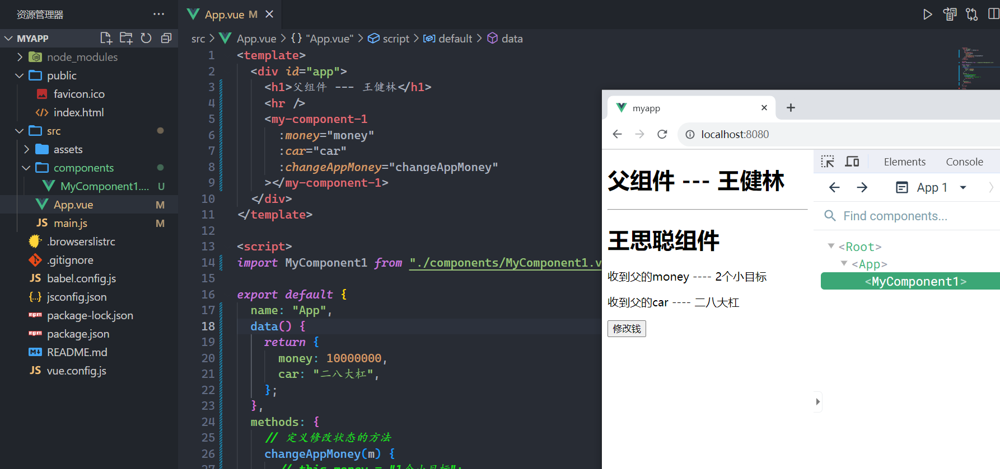
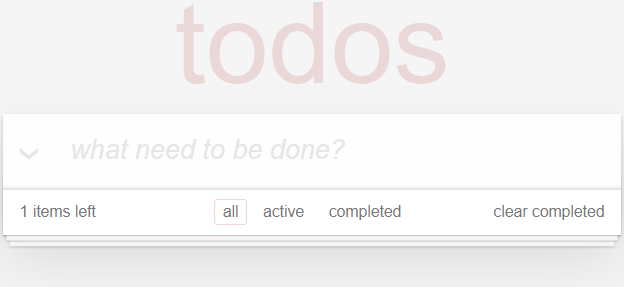
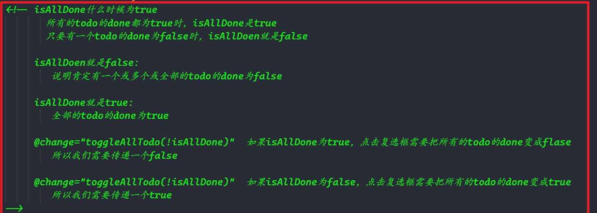
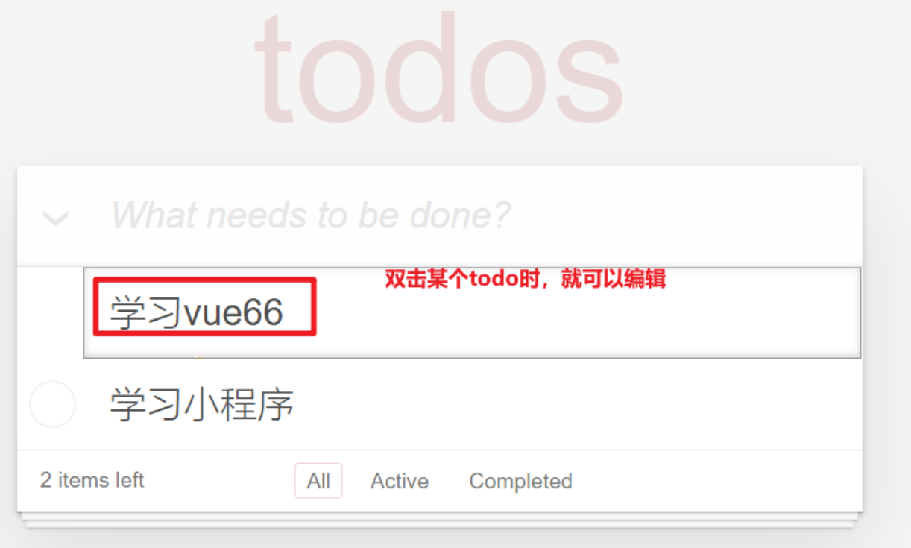
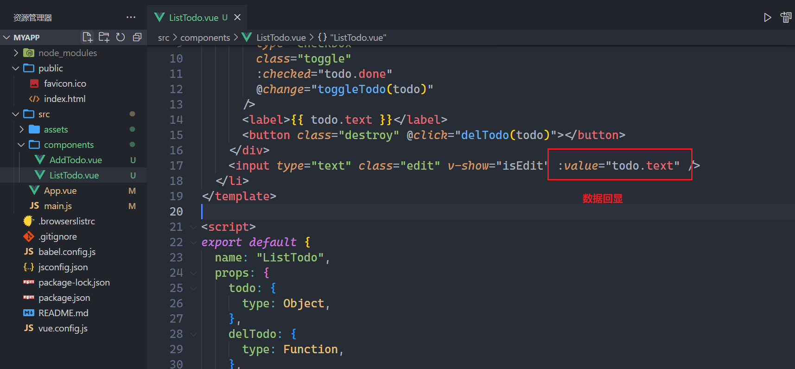

## 一，Hello Vue2

### 1，vue2介绍

特点：

* MVVM框架
* 响应式（声明式）
* 丰富的指令（DOM功能的抽象）
* 基于选项式（template、data、computed、watch、methods....）
* Vue的文档，最好的教程    https://v2.cn.vuejs.org/
* vue的生态丰富且简单
* 渐近式的（可大可小的项目都能做）

vue的开发思想：

当我们需要在交互事件中改变视图时，先在data选项中声明一个合适的变量，再在交互事件中改变这个声明式变量即可，视图自动更新，这是一种间接的操作。

关于vue.js的版本

* **vue2**，经典版本，现在绝大部分的企业项目都是用vue2版本开发。
* vue3，也是主流，后面都会过渡到vue3上。

体验一下vue2，如下：


参考代码如下：

```html
<!DOCTYPE html>
<html lang="en">

<head>
    <meta charset="UTF-8">
    <title>Document</title>
    <!-- 引入vue.js -->
    <script src="https://cdn.jsdelivr.net/npm/vue@2.7.10/dist/vue.js"></script>
</head>

<body>
    <!-- 这个div叫vm实例对应的模板 -->
    <div id="app">
        <!-- {{}} 叫小胡子语法 -->
        <h2>{{name}}</h2>
        <button @click="changeData">改变数据</button>
    </div>

    <script>
        // Vue是一个构造器   new一个构造器就可以得到一个对象
        // vm也叫根组件   new Vue时，传递一个配置对象
        // 配置对象中需要写很多的选项
        // 所有的响应式数据，都会挂载到vm上。
        // vm代理data中所有的响应式数据
        let vm = new Vue({
            // el表示vm实例与上面的html容器进行关联
            el: "#app",
            // data是一个选项
            // data就是给模板提供数据的，放在data中的数据是响应式数据
            // 所谓的响应式的数据，就是数据变了，模板会自动刷新
            // 现在开发思想就变了：
            //   之前：获取DOM，操作DOM，改变视图
            //   现在：定义响应式数据，改变响应式数据，视图会自动的更新
            data() {
                return {
                    name: "码路", // 响应式数据
                }
            },
            methods: {
                changeData() {
                    // 改变响应式数据
                    // this，表示vm实例
                    this.name = "xxx";
                }
            }
        });
    </script>
</body>

</html>
```

再去体验一下，数据驱动视图，如下：


参考代码：

```html
<!DOCTYPE html>
<html lang="en">

<head>
    <meta charset="UTF-8">
    <title>Document</title>
    <!-- 1.引入vue.js文件 -->
    <script src="https://cdn.jsdelivr.net/npm/vue@2/dist/vue.js"></script>
</head>

<body>
    <!-- 模板 -->
    <div id="app">
        <h1>欢迎学习Vue.js</h1>
        <div>我叫{{name}}，微信{{wechat}}</div>

        <input type="button" value="点我" @click="clickMe">
    </div>

    <script>
        // 2.创建Vue实例，并且让vm与HTML中的容器进行关联
        let vm = new Vue({
            el: "#app",
            // data是给模板提供数据
            data: {
                name: "wc",
                wechat: "8764567765"
            },
            methods: {
                clickMe() {
                    this.name = "malu";
                    this.wechat = "66666666"
                }
            },
        });
    </script>
</body>

</html>
```

总结一下：

* vue的思想：数据驱动视图
* data  定义响应式数据，所谓的响应式，就是数据变了，视图会自动刷新
* el  让vm实例与某个容器进行关联
* methods   是专门用于定义函数方法的地方

## 二，Vue常见指令

vue中基本上不会再手动操作DOM，vue作者就帮我们封装了很多的指令。什么是指令？就是vue内置的一套“模板（都是以v-），用于在视图节点上动态绑定变量（表达式）的。**指令实际上是DOM功能的抽象，所以指令实际上也是DOM操作。**

**指令分类：**

* 文本相关的指令
* 属性绑定相关的指令
* 事件绑定相关的指令
* 表单相关的指令
* 列表渲染相关的指令
* 条件渲染相关的指令
* 其它指令
* 自定义指令

### 1，文本相关的指令

```html
下面的是文本相关的指令：

- {{}}文本插值、v-text、v-once、v-cloak、v-html
- {{}} 用于绑定节点的文本，它和v-text功能是一样的。区别是{{}}这种绑定值的方式会出现“{{}}一闪而过”的效果，建议使用v-cloak来解决。
- v-text 用于绑定节点的文件，在大多数时候，它和 {{}} 可以相互替换。
- v-once 用于指定节点的动态内容只绑定一次。当前节点中所对应的变量发生变化，视图不更新。一般情况下，v-once只能和{{}}一起用。
- v-once 和 v-cloak 都是不需要接收表达式来做为“值”
- v-html 用于绑定动态的html节点，相当于DOM中的 innerHTML。这个指令默认已经做了“防注入攻击XSS”的处理
```

代码演示：


参考代码：

```html
<!DOCTYPE html>
<html lang='en'>

<head>
    <meta charset='UTF-8'>
    <title>Document</title>
    <style>
        [v-cloak] {
            display: none;
        }
    </style>
    <script src='https://cdn.jsdelivr.net/npm/vue@2/dist/vue.js'></script>
</head>

<body>
    <div id='app'>
        <div>
            <!-- {{}} 小胡子语法仅仅是v-text指令的语法糖 -->
            <h2 v-cloak>{{name}}</h2>
            <!-- v-text "name" 不是字符串，不是字符串，不是字符串 -->
            <!-- 是表达式，后面看到"" 里面放的是表达式 -->
            <h2 v-text="name"></h2>
            <h2 v-text=" '年龄：' + age "></h2>
            <h2 v-text=" `年龄：${age}` "></h2>
            <h2 v-cloak>{{'年龄：' +age}}</h2>
            <div v-text="msg"></div>
            <div v-html="msg"></div>
            <h2 v-once>{{age}}</h2>
            <button @click="changeAage">改变age</button>
        </div>
    </div>
    <script>
        // setTimeout(() => {
        let vm = new Vue({
            el: '#app',
            data() {
                return {
                    name: "码路",
                    age: 18,
                    msg: `<a href="http://www.baidu.com">百度一下</a>`,
                }
            },
            methods: {
                changeAage() {
                    this.age++
                }
            }
        });
        // }, 2000);
    </script>
</body>

</html>
```

### 2，属性绑定相关的指令

```html
- v-bind 用于动态绑定节点的属性（比如title、value、class、style等）
- v-bind 用得非常多，所以经常简写成 : &lt; div :id='变量'>&lt; /div>
- 动态class语法（一）：&lt; div :class='`${变量1} ${变量2} `'>&lt; /div>
- 动态class语法（二）：&lt; div :class='[表达式1, 表达式2, ...]'>&lt; /div>
- 动态class语法（三）：&lt; div :class='{ 类名1: 布尔值1, 类名2: 布尔值2, ... }'>&lt; /div>
- 动态style语法（一）：&lt; div :style='`color:red;fontSize:20px`'>&lt; /div>
- 动态style语法（二）：&lt; div :style='[{css键值对}, {css键值对}, ...]'>&lt; /div>
- 动态style语法（三）：&lt; div :style='{css键值对}'>&lt; /div>
```

绑定普通的属性，代码如下：


参考代码：

```html
<!DOCTYPE html>
<html lang='en'>

<head>
    <meta charset='UTF-8'>
    <title>Document</title>
    <script src='https://cdn.jsdelivr.net/npm/vue@2/dist/vue.js'></script>
</head>

<body>
    <div id='app'>
        <h1 title="haha">我是一个孤独的h2</h1>
        <!-- 一个指令后面的""中放的是表达式 -->
        <h1 v-bind:title="a1">我是一个孤独的h2</h1>
        <h1 :title="a1">我是一个孤独的h2</h1>
        <h1 v-bind="{title:a1,class:a2}">我是一个孤独的h2</h1>

        
    </div>
    <script>
        let vm = new Vue({
            el: '#app',
            data() {
                return {
                    a1: 'ok',
                    a2: 'bad',
                    imgUrl: "https://img0.baidu.com/it/u=1732521231,1421026517&fm=253&app=138&size=w931&n=0&f=JPEG&fmt=auto?sec=1697216400&t=407e58ecae68be0e0bbf7d27ac586278",
                }
            },
            methods: {}
        });
    </script>
</body>

</html>
```

绑定class属性，如下：


参考代码：

```html
<!DOCTYPE html>
<html lang='en'>

<head>
    <meta charset='UTF-8'>
    <title>Document</title>
    <script src='https://cdn.jsdelivr.net/npm/vue@2/dist/vue.js'></script>
</head>

<body>
    <div id='app'>
        <h1 class="box">绑定class属性</h1>
        <h1 :class="a1">绑定class属性</h1>
        <h1 :class=" `${a1} ${a2}` ">绑定class属性</h1>
        <h1 :class=" [a1,a2] ">绑定class属性</h1>
        <h1 :class=" [ 1==1 ? a1 : a2 ] ">绑定class属性1111</h1>
        <h1 :class=" {box1:true,box2:true} ">绑定class属性</h1>
        <h1 :class=" obj ">绑定class属性</h1>
        <h1 :class=" {f1:Math.random()>0.5} ">绑定class属性</h1>
        <h1 :class=" {f1:110} ">绑定class属性</h1>
    </div>
    <script>
        let vm = new Vue({
            el: '#app',
            data() {
                return {
                    a1: "info",
                    a2: "danger",
                    clr: "red",
                    size: "19",
                    obj: {
                        box3: true,
                        box4: true
                    }
                }
            },
            methods: {}
        })
    </script>
</body>

</html>
```

还有一个比较特殊，绑定style，如下：


参考代码：

```html
<!DOCTYPE html>
<html lang='en'>

<head>
    <meta charset='UTF-8'>
    <title>Document</title>
    <script src='https://cdn.jsdelivr.net/npm/vue@2/dist/vue.js'></script>
</head>

<body>
    <div id='app'>
        <!-- v-bind是单向绑定：把JS中的数据绑定到HTML上。  修改JS中的响应式数据，HTML也会修改。 -->
        <h1 style="color: red; background-color: pink;">绑定行内样式</h1>
        <h1 :style=" `color:yellowgreen; background-color: pink;` ">绑定行内样式</h1>
        <h1 :style=" `color:${a1}; background-color: ${a2};` ">绑定行内样式</h1>
        <h1 :style=" {color:a2,fontSize:fs+'px'} ">绑定行内样式</h1>
        <h1 :style=" [{color:'red'},{fontSize:fs+'px'},{textDecoration:'line-through'}] ">绑定行内样式</h1>
        <h1 :style=" {[a3]:a1} ">绑定行内样式</h1>
    </div>
    <script>
        let vm = new Vue({
            el: '#app',
            data() {
                return {
                    a1: 'blue',
                    a2: 'gold',
                    fs: "46",
                    a3: 'color'
                }
            },
            methods: {}
        });
    </script>
</body>

</html>
```

### 3，事件绑定相关的指令

```html
- v-on 用于给视图节点绑定各种JS事件，比如click、mouseenter、blur、keyup等
- v-on:click
- v-on:dblclick
- v-on:mouseover，
- v-on:mouseout，
- v-on:change
- v-on:focus
- ...
- v-on 用得非常多, 所以简写成 @ 基本语法: div @事件名. 事件修饰符='事件处理器'
- v-on 上可以使用事件修饰符: .stop阻止冒泡 .prevent阻止默认事件 .enter绑定键盘Enter键盘....
```

直接上代码：


参考代码：

```html
<!DOCTYPE html>
<html lang='en'>

<head>
    <meta charset='UTF-8'>
    <title>Document</title>
    <style>
        .outer {
            width: 200px;
            height: 200px;
            background-color: gold;
            display: flex;
            justify-content: center;
            align-items: center;
        }

        .inner {
            width: 100px;
            height: 100px;
            background-color: skyblue;
        }
    </style>
    <script src='https://cdn.jsdelivr.net/npm/vue@2/dist/vue.js'></script>
</head>

<body>
    <div id='app'>
        <button v-on:click="handle">点我</button>
        <button @click="handle">点我</button>

        <!-- 事件相关的修饰符  stop 阻止事件冒泡 -->
        <!-- prevent 阻止默认事件 -->
        <!-- once 只绑定一次 -->
        <!-- 事件修饰符可以连用 -->
        <div class="outer" @click="outerClick">
            <div class="inner" @click.stop.once="innerClick"></div>
        </div>

        <button @click="fn">点我</button>
        <button @click="gn(1,2)">点我</button>
        <!-- 手动的把事件对象传递下面，在模板中有一个$event表示事件对象 -->
        <button @click="kn(1,2,$event)">点我</button>
    </div>
    <script>
        let vm = new Vue({
            el: '#app',
            data() {
                return {
                    // 方法写在data中，也行，不建议
                }
            },
            methods: {
                handle() {
                    console.log("handle...");
                },
                outerClick() {
                    console.log("outerClick...");
                },
                innerClick() {
                    console.log("innerClick...");
                },
                fn(e) {
                    console.log("e:", e);
                },
                gn(a, b) {
                    console.log(a, b);
                },
                kn(a, b, e) {
                    console.log(a, b, e);
                }
            }
        });
    </script>
</body>

</html>
```

### 4，表单相关的指令(v-model)

```html
一般用于在交互的表中中使用，例如：input、select、textarea等。【双向绑定】

- v-model 用于表单取值(表单双向绑定), 比如input/select/textarea等
- 基本语法: input type="text" v-model. 表单修饰符='变量'
- 三个修饰符: .trim自动去除文本首尾空格 .number隐式类型转换变成Number类型 .lazy用于性能, 当表单失焦时再进行双向绑定
- v-model 还有更深的理解, 在组件化中进一步去理解
```

先简单的使用一个v-mdole，如下：


参考代码：

```html
<!DOCTYPE html>
<html lang='en'>

<head>
    <meta charset='UTF-8'>
    <title>Document</title>
    <script src='https://cdn.jsdelivr.net/npm/vue@2/dist/vue.js'></script>
</head>

<body>
    <div id='app'>
        <!-- 姓名：<input type="text" :value="name" @input="fn"> <br> -->

        <!-- 如果方法中只有一行代码，可以把代码直接写在模板中 -->
        <!-- 姓名：<input type="text" :value="name" @input="name = $event.target.value"> <br> -->

        <!-- v-model写在标签上，等价于:value + @input -->
        <!-- 姓名：<input type="text" v-model="name"> <br> -->

        <!-- v-model都有哪些修饰符？答：number trim lazy -->
        <input type="text" v-model.trim="name" @keyup.enter="submit">
        <input type="text" v-model.number="age" @keyup.enter="submit">
        <h1>{{age}}</h1>
        <!-- v-model是双向绑定 默认情况下，v-model等价于： :value+@input-->
        <input type="text" v-model="age" @keyup.enter="submit">
        <!-- lazy 就可以把input事件，变成change事件 -->
        <input type="text" v-model.lazy="age" @keyup.enter="submit">
    </div>
    <script>
        let vm = new Vue({
            el: '#app',
            data() {
                return {
                    name: "码路",
                    age: 18
                }
            },
            methods: {
                submit(e) {
                    // console.log(this.name);
                    console.log(this.age);
                    // console.log(e.target.value);
                },
                fn(e) {
                    // console.log(e.target.value);
                    this.name = e.target.value;
                }
            }
        });
    </script>
</body>

</html>
```

回顾一下上午的v-model，如下：


参考代码：

```html
<!DOCTYPE html>
<html lang='en'>

<head>
    <meta charset='UTF-8'>
    <title>Document</title>
    <script src='https://cdn.jsdelivr.net/npm/vue@2/dist/vue.js'></script>
</head>

<body>
    <div id='app'>
        <div>
            用户名：<input type="text" v-model="user">
        </div>
        <div>
            密码：<input type="password" v-model="pwd">
        </div>
        <input type="button" value="登录" v-on:click="clickMe" />
        <input type="button" value="重置" v-on:click="resetForm" />
    </div>
    <script>
        let vm = new Vue({
            el: '#app',
            data() {
                return {
                    user: "",
                    pwd: ""
                }
            },
            methods: {
                clickMe() {
                    console.log(this.user, this.pwd);
                },
                resetForm() {
                    this.user = "";
                    this.pwd = "";
                }
            }
        });
    </script>
</body>

</html>
```

v-model收集其它数据，如下：


参考代码：

```html
<!DOCTYPE html>
<html lang='en'>

<head>
    <meta charset='UTF-8'>
    <title>Document</title>
    <script src='https://cdn.jsdelivr.net/npm/vue@2/dist/vue.js'></script>
</head>

<body>
    <div id='app'>
        <div>
            用户名：<input type="text" v-model="user">
        </div>
        <div>
            密码：<input type="password" v-model="pwd">
        </div>
        <div>
            性别：
            <input type="radio" name="s" v-model="sex" value="1" /> 男
            <input type="radio" name="s" v-model="sex" value="2" /> 女
        </div>
        <div>
            爱好：
            <input type="checkbox" value="11" v-model="hobby"> 篮球1
            <input type="checkbox" value="22" v-model="hobby"> 篮球2
            <input type="checkbox" value="33" v-model="hobby"> 篮球3
        </div>
        <div>
            城市：
            <select v-model="city">
                <option value="sh">上海</option>
                <option value="bj">北京</option>
                <option value="sz">深圳</option>
            </select>
        </div>
        <div>
            部门：
            <select v-model="dept" multiple>
                <option value="js">技术</option>
                <option value="xs">销售</option>
                <option value="yy">运营</option>
            </select>
        </div>
        <div>
            其他：<textarea v-model="more"></textarea>
        </div>
        <input type="button" value="登录" v-on:click="clickMe" />
        <input type="button" value="重置" v-on:click="resetForm" />
    </div>
    <script>
        let vm = new Vue({
            el: '#app',
            data() {
                return {
                    user: "",
                    pwd: "",
                    sex: "1",
                    hobby: [],
                    city: "sz",
                    dept: [],
                    more: "..."
                }
            },
            methods: {
                clickMe() {
                    console.log(this.user, this.pwd, this.sex, this.hobby, this.city, this.dept, this.more);
                },
                resetForm() {
                    this.user = "";
                    this.pwd = "";
                }
            }
        });
    </script>
</body>

</html>
```

上面每一个响应式数据，都是独立的，可以把这些响应式数据放到对象，如下：


参考代码：

```html
<!DOCTYPE html>
<html lang='en'>

<head>
    <meta charset='UTF-8'>
    <title>Document</title>
    <script src='https://cdn.jsdelivr.net/npm/vue@2/dist/vue.js'></script>
</head>

<body>
    <div id='app'>
        <div>
            用户名：<input type="text" v-model="info.user">
        </div>
        <div>
            密码：<input type="password" v-model="info.pwd">
        </div>
        <div>
            性别：
            <input type="radio" name="s" v-model="info.sex" value="1" /> 男
            <input type="radio" name="s" v-model="info.sex" value="2" /> 女
        </div>
        <div>
            爱好：
            <input type="checkbox" value="11" v-model="info.hobby"> 篮球1
            <input type="checkbox" value="22" v-model="info.hobby"> 篮球2
            <input type="checkbox" value="33" v-model="info.hobby"> 篮球3
        </div>
        <div>
            城市：
            <select v-model="info.city">
                <option value="sh">上海</option>
                <option value="bj">北京</option>
                <option value="sz">深圳</option>
            </select>
        </div>
        <div>
            部门：
            <select v-model="info.dept" multiple>
                <option value="js">技术</option>
                <option value="xs">销售</option>
                <option value="yy">运营</option>
            </select>
        </div>
        <div>
            其他：<textarea v-model="info.more"></textarea>
        </div>
        <input type="button" value="登录" v-on:click="clickMe" />
        <input type="button" value="重置" v-on:click="resetForm" />
    </div>
    <script>
        let vm = new Vue({
            el: '#app',
            data() {
                return {
                    info: {
                        user: "",
                        pwd: "",
                        sex: "1",
                        hobby: [],
                        city: "sz",
                        dept: [],
                        more: "..."
                    }
                }
            },
            methods: {
                clickMe() {
                    console.log(this.info.user, this.info.pwd, this.info.sex, this.info.hobby, this.info.city, this.info.dept, this.info.more);
                },
                resetForm() {
                    this.user = "";
                    this.pwd = "";
                }
            }
        });
    </script>
</body>

</html>
```

### 5，列表渲染相关的指令

```html
* v-for 用于渲染数月、对象、Number变量等等
* 当 v-for 渲染列表时, 语法是这样的 <div v-for='(item, index) in array'></div>
* 当 v-for 渲染对象时, 语法是这样的 <div v-for='(value, key, index) in obj'></div>
* 当 v-for 渲染Number变量时, 语法是这样的 <div v-for='(num, index) in 5'></div>
* 注意: v-for在循环渲染时要求加key, 为什么呢? 在响应式原理时再解释
```

上代码演示，循环数组，如下：


参考代码：

```html
<!DOCTYPE html>
<html lang='en'>

<head>
    <meta charset='UTF-8'>
    <title>Document</title>
    <script src='https://cdn.jsdelivr.net/npm/vue@2/dist/vue.js'></script>
</head>

<body>
    <div id='app'>
        <!-- v-for循环一个数组 -->
        <div v-for="(item,index) in todolist" :style="{background:(item.done ? 'red':'transparent')}">
            <input type="checkbox" :checked="item.done" @click="fn(item,index)">
            <span>{{item.text}}</span>
            <span>x</span>
        </div>
    </div>
    <script>
        let vm = new Vue({
            el: '#app',
            data() {
                return {
                    todolist: [{
                            id: 1,
                            text: "学习vue1",
                            done: true
                        },
                        {
                            id: 2,
                            text: "学习vue2",
                            done: false
                        },
                        {
                            id: 3,
                            text: "学习vue3",
                            done: false
                        },
                    ],
                }
            },
            methods: {
                fn(item, index) {
                    this.todolist[index].done = !this.todolist[index].done
                }
            }
        });
    </script>
</body>

</html>
```

v-for也可以循环一个对象，如下：


也可以循环一个数字，如下：


### 6，案例：数据管理案例

数据的管理包括对数据：展示、动态添加、删除、修改。  

先实现展示：


参考代码：

```html
<!DOCTYPE html>
<html lang='en'>

<head>
    <meta charset='UTF-8'>
    <title>Document</title>
    <style>
        .penal {
            border: 1px solid #dddddd;
            margin: 20px 0 0 0;
            padding: 10px;
            border-bottom: 0;
            background-color: #d9d9d9;
        }

        .table {
            width: 100%;
            border-collapse: collapse;
            border-spacing: 0;
        }

        .table>tbody>tr>td,
        .table>tbody>tr>th,
        .table>tfoot>tr>td,
        .table>tfoot>tr>th,
        .table>thead>tr>td,
        .table>thead>tr>th {
            padding: 8px;
            vertical-align: top;
            border: 1px solid #ddd;
            text-align: left;
        }
    </style>
    <script src='https://cdn.jsdelivr.net/npm/vue@2/dist/vue.js'></script>
</head>

<body>
    <div id='app'>
        <h3 class="penal">数据列表</h3>
        <table class="table">
            <thead>
                <tr>
                    <td>姓名</td>
                    <td>年龄</td>
                </tr>
            </thead>
            <tbody>
                <tr v-for="(item,index) in dataList">
                    <td>{{item.name}}</td>
                    <td>{{item.age}}</td>
                </tr>
            </tbody>
        </table>
    </div>
    <script>
        let vm = new Vue({
            el: '#app',
            data() {
                return {
                    dataList: [{
                            name: "malu",
                            age: 18
                        },
                        {
                            name: "wc",
                            age: 28
                        },
                    ]
                }
            },
            methods: {}
        });
    </script>
</body>

</html>
```

要实现添加，要通过表单进行添加，就是收集表单中的数据，就要用到v-model，代码如下：


参考代码：

```html
<!DOCTYPE html>
<html lang='en'>

<head>
    <meta charset='UTF-8'>
    <title>Document</title>
    <style>
        .penal {
            border: 1px solid #dddddd;
            margin: 20px 0 0 0;
            padding: 10px;
            border-bottom: 0;
            background-color: #d9d9d9;
        }

        .table {
            width: 100%;
            border-collapse: collapse;
            border-spacing: 0;
        }

        .table>tbody>tr>td,
        .table>tbody>tr>th,
        .table>tfoot>tr>td,
        .table>tfoot>tr>th,
        .table>thead>tr>td,
        .table>thead>tr>th {
            padding: 8px;
            vertical-align: top;
            border: 1px solid #ddd;
            text-align: left;
        }
    </style>
    <script src='https://cdn.jsdelivr.net/npm/vue@2/dist/vue.js'></script>
</head>

<body>
    <div id='app'>
        <h3 class="penal">表单区域</h3>
        <div>
            <div>
                <label>姓名</label>
                <input type="text" v-model="user">
            </div>
            <div>
                <label>年龄</label>
                <input type="text" v-model="age">
                <input type="button" value="新增" @click="addUser">
            </div>
        </div>
        <h3 class="penal">数据列表</h3>
        <table class="table">
            <thead>
                <tr>
                    <td>姓名</td>
                    <td>年龄</td>
                </tr>
            </thead>
            <tbody>
                <tr v-for="(item,index) in dataList">
                    <td>{{item.name}}</td>
                    <td>{{item.age}}</td>
                </tr>
            </tbody>
        </table>
    </div>
    <script>
        let vm = new Vue({
            el: '#app',
            data() {
                return {
                    dataList: [{
                            name: "malu",
                            age: 18
                        },
                        {
                            name: "wc",
                            age: 28
                        },
                    ],
                    user: "",
                    age: ""
                }
            },
            methods: {
                addUser() {
                    let row = {
                        name: this.user,
                        age: this.age
                    };
                    console.log(row);
                    this.dataList.push(row);
                    this.user = "";
                    this.age = "";
                }
            }
        });
    </script>
</body>

</html>
```

要实现删除，如下：


参考代码：

```html
<!DOCTYPE html>
<html lang='en'>

<head>
    <meta charset='UTF-8'>
    <title>Document</title>
    <style>
        .penal {
            border: 1px solid #dddddd;
            margin: 20px 0 0 0;
            padding: 10px;
            border-bottom: 0;
            background-color: #d9d9d9;
        }

        .table {
            width: 100%;
            border-collapse: collapse;
            border-spacing: 0;
        }

        .table>tbody>tr>td,
        .table>tbody>tr>th,
        .table>tfoot>tr>td,
        .table>tfoot>tr>th,
        .table>thead>tr>td,
        .table>thead>tr>th {
            padding: 8px;
            vertical-align: top;
            border: 1px solid #ddd;
            text-align: left;
        }
    </style>
    <script src='https://cdn.jsdelivr.net/npm/vue@2/dist/vue.js'></script>
</head>

<body>
    <div id='app'>
        <h3 class="penal">表单区域</h3>
        <div>
            <div>
                <label>姓名</label>
                <input type="text" v-model="user">
            </div>
            <div>
                <label>年龄</label>
                <input type="text" v-model="age">
                <input type="button" value="新增" @click="addUser">
            </div>
        </div>
        <h3 class="penal">数据列表</h3>
        <table class="table">
            <thead>
                <tr>
                    <td>姓名</td>
                    <td>年龄</td>
                </tr>
            </thead>
            <tbody>
                <tr v-for="(item,index) in dataList">
                    <td>{{item.name}}</td>
                    <td>{{item.age}}</td>
                    <td>
                        <!-- <input type="button" value="删除" @click="delRow(index)"> -->
                        <input type="button" value="删除" @click="delRow" :data-idx="index">
                    </td>
                </tr>
            </tbody>
        </table>
    </div>
    <script>
        let vm = new Vue({
            el: '#app',
            data() {
                return {
                    dataList: [{
                            name: "malu",
                            age: 18
                        },
                        {
                            name: "wc",
                            age: 28
                        },
                    ],
                    user: "",
                    age: ""
                }
            },
            methods: {
                addUser() {
                    let row = {
                        name: this.user,
                        age: this.age
                    };
                    console.log(row);
                    this.dataList.push(row);
                    this.user = "";
                    this.age = "";
                },
                // delRow(index){
                delRow(e) {
                    // this.dataList.splice(index,1)

                    console.log(e.target.dataset.idx);
                    let idx = e.target.dataset.idx
                    this.dataList.splice(idx, 1)
                }
            }
        });
    </script>
</body>

</html>
```

最后，要实现编辑（修改），如下：


参考代码：

```html
<!DOCTYPE html>
<html lang='en'>

<head>
    <meta charset='UTF-8'>
    <title>Document</title>
    <style>
        .penal {
            border: 1px solid #dddddd;
            margin: 20px 0 0 0;
            padding: 10px;
            border-bottom: 0;
            background-color: #d9d9d9;
        }

        .table {
            width: 100%;
            border-collapse: collapse;
            border-spacing: 0;
        }

        .table>tbody>tr>td,
        .table>tbody>tr>th,
        .table>tfoot>tr>td,
        .table>tfoot>tr>th,
        .table>thead>tr>td,
        .table>thead>tr>th {
            padding: 8px;
            vertical-align: top;
            border: 1px solid #ddd;
            text-align: left;
        }
    </style>
    <script src='https://cdn.jsdelivr.net/npm/vue@2/dist/vue.js'></script>
</head>

<body>
    <div id='app'>
        <h3 class="penal">表单区域</h3>
        <div>
            <div>
                <label>姓名</label>
                <input type="text" v-model="user">
            </div>
            <div>
                <label>年龄</label>
                <input type="text" v-model="age">
                <input type="button" :value="title" @click="addUser">
            </div>
        </div>
        <h3 class="penal">数据列表</h3>
        <table class="table">
            <thead>
                <tr>
                    <td>姓名</td>
                    <td>年龄</td>
                </tr>
            </thead>
            <tbody>
                <tr v-for="(item,index) in dataList">
                    <td>{{item.name}}</td>
                    <td>{{item.age}}</td>
                    <td>
                        <!-- <input type="button" value="删除" @click="delRow(index)"> -->
                        <input type="button" value="删除" @click="delRow" :data-idx="index">
                        <input type="button" value="编辑" @click="editRow" :data-idx="index">
                    </td>
                </tr>
            </tbody>
        </table>
    </div>
    <script>
        let vm = new Vue({
            el: '#app',
            data() {
                return {
                    dataList: [{
                            name: "malu",
                            age: 18
                        },
                        {
                            name: "wc",
                            age: 28
                        },
                    ],
                    user: "",
                    age: "",
                    title: "新增",
                    editIndex: undefined
                }
            },
            methods: {
                addUser() {
                    if (this.editIndex) {
                        // 编辑
                        this.dataList[this.editIndex].name = this.user;
                        this.dataList[this.editIndex].age = this.age;
                    } else {
                        // 新增
                        let row = {
                            name: this.user,
                            age: this.age
                        };
                        console.log(row);
                        this.dataList.push(row);
                    }
                    this.editIndex = undefined;
                    this.title = "新增"
                    this.user = "";
                    this.age = "";

                },
                // delRow(index){
                delRow(e) {
                    // this.dataList.splice(index,1)

                    console.log(e.target.dataset.idx);
                    let idx = e.target.dataset.idx
                    this.dataList.splice(idx, 1)
                },
                editRow(e) {
                    let idx = e.target.dataset.idx;
                    let {
                        name,
                        age
                    } = this.dataList[idx];
                    this.user = name;
                    this.age = age;

                    this.title = "编辑";
                    this.editIndex = idx;
                }
            }
        });
    </script>
</body>

</html>
```

### 7，条件渲染相关的指令

```text
* v-show 用于显示或隐藏视图节点, 背后使用的 display: 原本的显示模式 / display:none 来实现的
* v-if / v-else-if / v-else 用于显示或隐藏视图节点, 背后是真正地移除或插入视图节点
* v-if 因为是节点插入或移除, 比较耗费性能; v-show只是通过样式来实现显示与隐藏, 性能开销更小.
* v-if, 不建议和 v-for 一起使用; 如果一定要在同一个节点上使用v-if和v-for, v-for优先级更好
```

对于v-if，直接上代码：


参考代码：

```html
<!DOCTYPE html>
<html lang='en'>

<head>
    <meta charset='UTF-8'>
    <title>Document</title>
    <script src='https://cdn.jsdelivr.net/npm/vue@2/dist/vue.js'></script>
</head>

<body>
    <div id='app'>
        <!-- v-if 控制元素的创建或销毁-->
        <div v-if="isShow">我是一个孤独的DIV</div>

        <hr>

        <h1 v-if="row == 1">我是第一行</h1>
        <h2 v-else-if="row==2">我是第二行</h2>
        <h3 v-else-if="row==3">我是第三行</h3>
        <h4 v-else>我是第四行</h4>
    </div>
    <script>
        let vm = new Vue({
            el: '#app',
            data() {
                return {
                    isShow: true,
                    row: 1
                }
            },
            methods: {}
        });
    </script>
</body>

</html>
```

做一个小案例，如下：


参考代码：

```html
<!DOCTYPE html>
<html lang='en'>

<head>
    <meta charset='UTF-8'>
    <title>Document</title>
    <script src='https://cdn.jsdelivr.net/npm/vue@2/dist/vue.js'></script>
</head>

<body>
    <div id='app'>
        <input type="button" value="密码登录" @click="isSms = false" />
        <input type="button" value="短信登录" @click="isSms = true" />

        <div v-if="isSms">
            <p>
                <label>手机号</label>
                <input type="text" placeholder="手机号">
            </p>
            <p>
                <label>验证码</label>
                <input type="text" placeholder="验证码">
            </p>
        </div>
        <div v-else>
            <p>
                <label>用户名</label>
                <input type="text" placeholder="用户名">
            </p>
            <p>
                <label>密码</label>
                <input type="password" placeholder="密码">
            </p>
        </div>

    </div>
    <script>
        let vm = new Vue({
            el: '#app',
            data() {
                return {
                    isSms: false
                }
            },
            methods: {}
        });
    </script>
</body>

</html>
```

对于条件渲染，还有一个指令，叫v-show，它也可以控制元素的显示与隐藏，前面讲的v-if是控制元素的创建或销毁。v-show是控制元素的显示与隐藏，是通过样式来控制，元素是已经创建，代码：


### 8，案例：小练习

练习一：


参考代码：

```html
<!DOCTYPE html>
<html lang='en'>

<head>
    <meta charset='UTF-8'>
    <title>Document</title>
    <style>
        * {
            margin: 0;
            padding: 0;
        }

        ul {
            width: 150px;
            list-style-type: none;
            background-color: gold;
        }

        li {
            width: 100%;
            height: 50px;
            text-align: center;
            line-height: 50px;
            border-bottom: 1px solid white;
            color: red;
        }

        .active {
            background-color: skyblue;
        }
    </style>
    <script src='https://cdn.jsdelivr.net/npm/vue@2/dist/vue.js'></script>
</head>

<body>
    <div id='app'>
        <ul>
            <li v-for="(item,index) in list" @click="fn(index)" :class="{active:currentIndex == index}">
                {{item.title}} -- {{index}}
            </li>
        </ul>
    </div>
    <script>
        let vm = new Vue({
            el: '#app',
            data() {
                return {
                    currentIndex: -1,
                    list: [{
                            id: 1001,
                            title: '母婴'
                        },
                        {
                            id: 1002,
                            title: '家电'
                        },
                        {
                            id: 1003,
                            title: '医用'
                        },
                        {
                            id: 1004,
                            title: '手机'
                        },
                        {
                            id: 1005,
                            title: '直播'
                        },
                        {
                            id: 1006,
                            title: '游戏'
                        },
                        {
                            id: 1007,
                            title: '酒水'
                        },
                        {
                            id: 1008,
                            title: '娱乐'
                        },
                        {
                            id: 1009,
                            title: '美食'
                        },
                        {
                            id: 1010,
                            title: '财经'
                        }
                    ],
                }
            },
            methods: {
                fn(idx) {
                    console.log(idx);
                    this.currentIndex = idx;
                }
            }
        })
    </script>
</body>

</html>
```

练习二：


参考代码：

```html
<!DOCTYPE html>
<html lang='en'>

<head>
    <meta charset='UTF-8'>
    <title>Document</title>
    <script src='https://cdn.jsdelivr.net/npm/vue@2/dist/vue.js'></script>
</head>

<body>
    <div id='app'>
        <button @click="fs+=5">点击放大P标签中的字体大小</button>
        <p :style="{fontSize:fs+'px'}">任何人都应当有自尊心，自信心，独立性，不然就是奴才</p>
    </div>
    <script>
        let vm = new Vue({
            el: '#app',
            data() {
                return {
                    fs: 16
                }
            },
            methods: {}
        });
    </script>
</body>

</html>
```

练习三：


参考代码：

```html
<!DOCTYPE html>
<html lang='en'>

<head>
    <meta charset='UTF-8'>
    <title>Document</title>
    <style>
        * {
            margin: 0;
            padding: 0;
        }

        .box {
            width: 400px;
            height: 200px;
            background-color: #000;
        }

        input {
            margin: 10px 0px;
        }
    </style>
    <script src='https://cdn.jsdelivr.net/npm/vue@2/dist/vue.js'></script>
</head>

<body>
    <div id='app'>
        <div class="box" :style="{background:`rgb(${r},${g},${b})`}"></div>
        <p>
            R: <input type="range" v-model.number="r" min="0" max="255"> <span>{{r}}</span>
        </p>
        <p>
            G: <input type="range" min="0" max="255" v-model.number="g"><span>{{g}}</span>
        </p>
        <p>
            B: <input type="range" min="0" max="255" v-model.number="b"><span>{{b}}</span>
        </p>
    </div>
    <script>
        let vm = new Vue({
            el: '#app',
            data() {
                return {
                    r: 0,
                    g: 0,
                    b: 0
                }
            },
            methods: {}
        });
    </script>
</body>

</html>
```

练习四：


参考代码：

```html
<!DOCTYPE html>
<html lang='en'>

<head>
    <meta charset='UTF-8'>
    <title>Document</title>
    <style>
        * {
            margin: 0;
            padding: 0;
        }

        .tab-box {
            /* background-color: pink; */
            width: 300px;
            margin: 20px auto;
            box-sizing: border-box;
        }

        .tab-box .tab {
            display: flex;
            position: relative;
            top: 1px;
        }

        .tab-box .tab li {
            list-style: none;
            border: 1px solid #ddd;
            padding: 5px 10px;
            margin-right: 10px;
            background: #eee;
        }

        .tab-box .tab li.active {
            color: lightcoral;
            background-color: #fff;
            border-bottom-color: #fff;
        }

        .tab-box .con {
            display: none;
            box-sizing: border-box;
            padding: 10px;
            height: 100px;
            border: 1px solid #ddd;
        }

        .tab-box .con.active {
            display: block;
        }
    </style>
    <script src='https://cdn.jsdelivr.net/npm/vue@2/dist/vue.js'></script>
</head>

<body>
    <div id='app' class="tab-box">
        <ul class="tab">
            <li v-for="(item,index) in list" :class="{active:selected == index}" @click="change(index)">
                {{item.title}}
            </li>
        </ul>
        <div v-for="(item,index) in list" class="con" :class="{active:selected == index}">
            {{item.content}}
        </div>
    </div>
    <script>
        let vm = new Vue({
            el: '#app',
            data() {
                return {
                    list: [{
                            id: 1,
                            title: "音乐",
                            content: "成都-赵雷"
                        },
                        {
                            id: 2,
                            title: "电影",
                            content: "新蝙蝠侠"
                        },
                        {
                            id: 3,
                            title: "电视剧",
                            content: "甄嬛传"
                        },
                    ],
                    selected: 0
                }
            },
            methods: {
                change(idx) {
                    if (idx == this.selected) return;
                    this.selected = idx;
                }
            }
        });
    </script>
</body>

</html>
```

### 9，面试题

* vue核心思想是？
  
  + 数据驱动视图
  + 基于选项式API
  + 组件化开发（自定义属性，自定义事件，自定义插槽）
* 常用的vue指令都有些？你是怎么理解指令？
  + 文本节点处理的指令   v-text  v-html  {{}}  v-cloak
  
  + 动态属性绑定指令   v-bind  简写成冒号   动态绑定class  动态绑定style    单向绑定
  
  + 事件绑定指令   v-on  v-once  简写成@  事件冒泡  事件对象  事件修饰符  按键修饰符  
  
  + 表单相关的指令  v-model   目的是为了收集表单数据  收集完毕，发ajax请求，把数据扔给服务器
  
  + 列表渲染  v-for 写在哪个标签上，就循环出多少个这样的标签。可以循环数组，对象，整数。
  
  + 条件渲染  v-if   v-else-if  v-else     v-show 
  
  + 其它：v-slot  插槽，后面讲     v-pre 用于调试的.....
  
  + 自定义指令：上面的指令是内置的指令，除了内置指令，我们也可以自定义指令。后面讲。
  
  + 指令本质上是对dom的操作，vue封装这些指令就是为了我们更为合理符合规范的操作dom，避免DOM滥操作。我们也可以自定义指令，自定义指令也是对DOM操作的封装，我之前工作中封装过一些自定义指令，如：xxxx
  
* 什么是单向数据绑定，什么是双向数据绑定？
  + 单向绑定，修改响应式数据，模板会发生更新。  或者修改了JS，更新了HTML。
  + 双向绑定，一向是修改了响应式数据，模板会发生更新。另一向是修改了模板，响应式数据也会更新。
  + 单向绑定：v-bind   v-text  v-html  {{}}
  + 双向绑定：v-model    也可以使用:value + @input
* v-if和v-show有什么区别？
  + v-if是控制元素（标签，也可以是组件）的创建或销毁，消耗性能大一点。
  
  + v-show是控制样式，来实现元素的显示或隐藏。通过display属性。消耗性能小一点。
  
  + v-show不支持template
  
  + 如果看过源码，可以从源码角度去分析。v-if最终编译成了什么，v-show最终编译成了什么...

  
  + 当需要频繁控制元素的显示或隐藏，使用v-show。在vue2中，v-if不能和v-for连用。因为在vue2中v-for的优先级更高。
  
  + 其它....
* 文本插值有“{{}}一闪而过”问题，怎么处理？
  + 使用v-text
  + 使用v-cloak，还需要配合css
* v-for 可以循环哪些数据类型？v-for列表渲染时为什么加key？
  + 可以循环数组，在项目中最重要就是循环数组，数组这个数据来自ajax请求。
  + 可以循环对象，循环对象，可以对象键，值，索引
  + 可以循环整数
  + v-for，需要加一个key，为什么，后面讲。
* v-model 有哪些修饰符？
  + .trim  收集数据时，去掉左右的空格
  + .number 收集数据时，数据是123abc，收集到的是123
  + .lazy  当失去焦点时，再去收集数据
* vue 中怎么阻止冒泡？怎么阻止默认事件？怎么监听键盘enter键？
  + 通过事件修饰符，或事件对象可以阻止冒泡，也可以阻止默认事件。
  + @keyup.enter = ""  .enter叫按键修饰符，还可以通过事件对象。

### 10，案例：登录


这个案例，需要调用接口，接口，我下去，找一个登录接口。我们需要用axios发请求了。

### 11，一些免费的API接口

* https://jsonplaceholder.typicode.com/
* https://reqres.in/
* https://picsum.photos/
* https://dog.ceo/dog-api/
* https://thecatapi.com/

## 三，计算属性

### 1，什么是计算属性

vue2是基于选项式API开发项目，前面我们学习了3个选项：el，data，methods。其实还非常多的选项，再去学习一个选项，叫computed。计算属性是对已有数据再加工，得到一个新的数据，在模板中可以直接使用计算属性。在方法中，也可以通过this来获取计算属性，作用：

* 作用1：当指令的表达式比较复杂时，我们建议使用计算属性来优化，提升视图模板中代码的可阅读性、可维护性。
* 作用2：用于缓存一个复杂的运算，避免组件更新时产生没有必要的性能损耗。计算属性本质上是一个函数，Vue会分析函数体中使用到了哪些声明式变量，有且仅有这些声明式变量发生变化时，计算属性才会重新执行。

直接上代码：


参考代码：

```html
<!DOCTYPE html>
<html lang='en'>

<head>
    <meta charset='UTF-8'>
    <title>Document</title>
    <script src='https://cdn.jsdelivr.net/npm/vue@2/dist/vue.js'></script>
</head>

<body>
    <div id='app'>
        <!-- 在胡子中做了复杂计算 -->
        <h2>{{ "总价$:"+ (num*price).toFixed(2) }}</h2>
        <!-- 虽然在定义时，把计算属性定义成函数，但是在模板中使用时，当成了普通的数据 -->
        <h2 v-text="total"></h2>
        <h2 v-text="total2"></h2>
        <h2 v-text="total3"></h2>
        <button @click="btnClick">修改</button>
        <hr>
        firstName: <input type="text" v-model="firstname">
        lastname: <input type="text" v-model="lastname"> <br>
        全名：<input type="text" disabled :value="firstname+lastname"> <br>
        全名：<input type="text" :value="fullname" @change="fn"> <br>
        <!--  v-model后面可以跟一个计算属性 -->
        <!-- 为什么v-model后面可以跟一个计算属性? -->
        <!-- 答: 原因是计算属性有setter -->
        <!-- 计算属性中不能写异步代码 -->
        全名：<input type="text" v-model.lazy="fullname"> <br>

    </div>
    <script>
        let vm = new Vue({
            el: '#app',
            data() {
                return {
                    num: 10,
                    price: 100,
                    msg: "hello vue",
                    firstname: "",
                    lastname: ""
                }
            },
            computed: {
                // 一般情况下，计算属性会写成函数的形式
                // 函数返回值，计算属性的值就是什么
                // 此时，tatal这个计算属性有data有关系，计算属性是由data中的状态计算而来的
                total() {
                    let t = (this.num * this.price).toFixed(2);
                    return '总价:$' + t
                },
                // 计算属性也可以和data没有任何关系
                total2() {
                    return "666"
                },
                // 计算属性还可以写在对象的形式
                // 在模板中使用计算属性时，会自动调用get
                // get的返回值就是计算属性的值
                total3: {
                    get() {
                        console.log("get...");
                        return this.msg
                    },
                    // 当修改计算属性时，就会走set
                    // 在修改时，会把新值传递给val
                    set(val) {
                        console.log("set...");
                        this.msg = val;
                    }
                },
                fullname: {
                    get() {
                        return this.firstname + "." + this.lastname
                    },
                    set(val) {
                        console.log("val:", val);
                        let arr = val.split(".")
                        this.firstname = arr[0]
                        this.lastname = arr[1]
                    }
                }
            },

            methods: {
                btnClick() {
                    this.total3 = "hi vue"
                },
                fn(e) {
                    let arr = e.target.value.split(".");
                    console.log(arr);
                    this.firstname = arr[0]
                    this.lastname = arr[1]
                }
            }
        });
    </script>
</body>

</html>
```

计算属性还有缓存的功能，代码如下：


参考代码：

```html
<!DOCTYPE html>
<html lang='en'>

<head>
    <meta charset='UTF-8'>
    <title>Document</title>
    <script src='https://cdn.jsdelivr.net/npm/vue@2/dist/vue.js'></script>
</head>

<body>
    <div id='app'>
        <div>
            <h2>全名(胡子中计算)：{{firstname+lastname}}</h2>
            firstName: <input type="text" v-model="firstname">
            lastname: <input type="text" v-model="lastname">
        </div>
        <hr>
        <div>
            <h2>全名(函数调用)：{{fullname()}}</h2>
            <h2>全名(函数调用)：{{fullname()}}</h2>
            <h2>全名(函数调用)：{{fullname()}}</h2>
            firstName: <input type="text" v-model="firstname">
            lastname: <input type="text" v-model="lastname">
        </div>
        <hr>
        <div>
            <!-- 第一个肯定要计算，计算的结果会缓存起来 -->
            <!-- 后面如果依赖的数据没有变化，直接从缓存中获取结果，不会重新计算，性能高 -->
            <!-- 在项目中，能使用计算属性的，尽可能使用计算属性，使用计算属性能使用的，使用方法也可以使用 -->
            <h2>全名(计算属性)：{{fullname2}}</h2>
            <h2>全名(计算属性)：{{fullname2}}</h2>
            <h2>全名(计算属性)：{{fullname2}}</h2>
            firstName: <input type="text" v-model="firstname">
            lastname: <input type="text" v-model="lastname">
        </div>
    </div>
    <script>
        let vm = new Vue({
            el: '#app',
            data() {
                return {
                    firstname: "",
                    lastname: ""
                }
            },
            computed: {
                fullname2() {
                    console.log("计算属性...");
                    return this.firstname + this.lastname;
                }
            },
            methods: {
                fullname() {
                    console.log("函数调用了...");
                    return this.firstname + this.lastname
                }
            }
        });
    </script>
</body>

</html>
```

### 2，面试题

* 计算属性有什么作用？（两大作用）
  + 作用1：把胡子语法中复杂的计算逻辑，封装到一个计算属性中。
  + 作用2：第1次计算的缓存，会被缓存起来，如果依赖的数据没有发生变化，直接从缓存中获取结果。
* 计算属性能不能绑定在v-model上？
  + 可以，因为计算属性不只有get，还有set。
* 怎么理解计算属性的缓存功能？
  + 有且仅有被关联的声明式变量变化时，计算属性才会重新计算。

### 3，案例：购物车


参考代码：

```html
<!DOCTYPE html>
<html lang='en'>

<head>
    <meta charset='UTF-8'>
    <title>Document</title>
    <style>
        * {
            margin: 0;
            padding: 0;
        }

        table,
        tr,
        td {
            border: 1px solid skyblue;
            border-collapse: collapse;
        }

        td {
            width: 150px;
            height: 50px;
            text-align: center;
            line-height: 50px;
        }
    </style>
    <script src='https://cdn.jsdelivr.net/npm/vue@2/dist/vue.js'></script>
</head>

<body>
    <div id='app'>
        <table>
            <tr>
                <th>商品名称</th>
                <th>单价</th>
                <th>数量</th>
                <th>总价</th>
            </tr>
            <tr v-for="(item,index) in cart">
                <td>{{item.title}}</td>
                <td>{{item.price}}</td>
                <td>
                    <button @click="minus(item)">减一</button>
                    {{item.count}}
                    <button @click="add(item)">加一</button>
                </td>
                <td>{{ item.price * item.count }}</td>
            </tr>
        </table>
        <h2>所有商品总价：{{total}}</h2>
    </div>
    <script>
        let vm = new Vue({
            el: '#app',
            data() {
                return {
                    cart: [{
                            id: 1,
                            title: "手机",
                            price: 1999,
                            count: 1
                        },
                        {
                            id: 2,
                            title: "电脑",
                            price: 9992,
                            count: 1
                        },
                        {
                            id: 3,
                            title: "衣服",
                            price: 29,
                            count: 1
                        },
                        {
                            id: 4,
                            title: "洗衣机",
                            price: 5321,
                            count: 1
                        },
                        {
                            id: 5,
                            title: "篮球",
                            price: 19,
                            count: 1
                        },
                        {
                            id: 6,
                            title: "球杆",
                            price: 2999,
                            count: 1
                        },
                    ]
                }
            },
            computed: {
                // 计算属性普通写成函数的形式
                total() {
                    // 得到购物车中所有商品的单价 * 数量
                    // 第一种方式
                    // 遍历
                    // let sum = 0;
                    // for (let i = 0; i < this.cart.length; i++) {
                    //   sum += this.cart[i].price * this.cart[i].count;
                    // }
                    // return sum;

                    // 第二种方式
                    // let sum = 0;
                    // this.cart.forEach(item => {
                    //   sum += item.price * item.count;
                    // })
                    // return sum;

                    // 第三种方式
                    return this.cart.reduce((prev, next) => prev + next.price * next.count, 0)
                }
            },
            methods: {
                add(item) {
                    item.count += 1
                },
                minux(item) {
                    if (item.count > 1) {
                        item.count -= 1;
                    }
                }
            }
        });
    </script>
</body>

</html>
```

## 四，侦听器

### 1，什么是侦听器 watch

*  作用：用于监听一个变量的变化，然后去做另一件事儿。
*  特点：当侦听器监听引用数据类型时，默认只能监听引用数据类型的第一层。为什么要这样？监听深度越深，Vue在背后要做的事儿越多，这是一种性能损耗，所以一般不要对一个引用类型的变量进行深度监听。
* 如何监听引用数据类型的每一层（深度监听）？侦听器语法这样写  info: { deep: true, handler() {} }为了避免deep:true深度监听导致性能损耗，我们推荐这种写 'info.child.age' () {}
* 在Vue中，侦听器能够监听哪些性质的变量变化呢？能够监听data、计算属性、vuex数据、$route等，凡是那些带有 _ _ _ob_ _ _ 变量都能被监听到。

直接上代码演示：


参考代码：

```html
<!DOCTYPE html>
<html lang='en'>

<head>
    <meta charset='UTF-8'>
    <title>Document</title>
    <script src='https://cdn.jsdelivr.net/npm/vue@2/dist/vue.js'></script>
</head>

<body>
    <div id='app'>
        <h2>{{name}}</h2>
        <h2>{{num}}</h2>
        <button @click="num++">+1</button>
        <hr>
        <h2>{{info.age}}</h2>
        <button @click="info.age++">+1</button>
        <hr>
        <h2>{{info.child.age}}</h2>
        <button @click="info.child.age++">+1</button>
    </div>
    <script>
        let vm = new Vue({
            el: '#app',
            data() {
                return {
                    name: "码路",
                    num: 100,
                    info: {
                        name: "ml",
                        age: 18,
                        child: {
                            name: "wc",
                            age: 20
                        }
                    }
                }
            },
            // vue2思想：数据驱动视图
            // vue2是选项式API   optionsAPI
            // vue3是组合式API
            // 在watch中可以写异步代码，在computed中不能写异步代码
            watch: {
                // 监听器（侦听器） 写法一：写在函数的形式
                num(newNum, oldNum) {
                    console.log(newNum, oldNum);
                },
                // info整体是一个对象，
                // info.child.age是info这个对象中的属性
                // 当改变info.child.age，info这个地址没有变
                // 什么叫改变info?
                //    vm.info = {a:111}
                // 这个是用来监听整体info是否变化
                // info(newInfo,oldInfo){
                //   console.log("info变化~");
                //   // console.log(newInfo,oldInfo);
                // },

                // 要监听info中属性的变化，监听器就需要写成对象的形式
                // info: {
                //   deep: true,  // 默认情况下，不会深度监听，侦听的层级越深,vue背后做的事情越多,也是一种性能消耗
                //   // 如果是深度监听，获取到的都是新值
                //   handler(newInfo, oldInfo) {
                //     // console.log(newInfo.child.age, oldInfo.child.age);
                //     console.log(newInfo.child.age);
                //     console.log(oldInfo.child.age);
                //   }
                // }

                // 可以直接对某个对象中的某个属性进行监听
                "info.child.age"(newAge, oldAge) {
                    console.log(newAge, oldAge);
                }
            },
            methods: {}
        });
    </script>
</body>

</html>
```

当深度监听时，如何获取旧值，代码如下：


### 2，案例：百度联想搜索

直接上代码，如下：


参考代码：

```html
<!DOCTYPE html>
<html lang='en'>

<head>
    <meta charset='UTF-8'>
    <title>Document</title>
    <script src='https://cdn.jsdelivr.net/npm/vue@2/dist/vue.js'></script>
</head>

<body>
    <div id='app'>
        请你输入搜索的关键字: <input type="text" v-model="keyword.a.b">
        <ul>
            <li v-for="(item,index) in arr">
                {{item.q}}
            </li>
        </ul>
    </div>
    <script>
        // https://www.baidu.com/sugrec?pre=1&p=3&ie=utf-8&json=1&prod=pc&from=pc_web&wd=nba&req=2&csor=1&cb=cb&_=1648605785333

        let vm = new Vue({
            el: '#app',
            data() {
                return {
                    keyword: {
                        a: {
                            b: "vue"
                        }
                    },
                    arr: []
                }
            },
            watch: {
                keyword: {
                    deep: true,
                    immediate: true,
                    handler() {
                        // console.log("xxxxxx");
                        let that = this;

                        window.cb = function(data) {
                            console.log("data:", data.g);
                            console.log(this);
                            that.arr = data.g;
                        }

                        let script = document.createElement("script");
                        script.src = `https://www.baidu.com/sugrec?pre=1&p=3&ie=utf-8&json=1&prod=pc&from=pc_web&wd=${this.keyword.a.b}&req=2&csor=1&cb=cb&_=1648605785333`;
                        document.body.prepend(script);
                    }
                }
            },
            methods: {}
        });
    </script>
</body>

</html>
```

### 3，面试题

* 什么是侦听器？有什么用？
  + 就是vue2中的选项，用于监听一个变量的变化，然后去做另一件事儿。
* 侦听器能不能监听数组/对象的变化？（可以，但默认不监听深层）deep:true
  + 可以的，需要尝试侦听，如果是对象，获取不到旧值，要想获取旧值，需要配合计算属性。
* 侦听器为什么默认不支持深度监听？（性能优化）
  + 监听深度越深，Vue在背后要做的事儿越多，这是一种性能损耗，所以一般不要对一个引用类型的变量进行深度监听。
* 如何监听一个对象中的某个属性变化？（deep:true, 推荐 'obj.key'这种监听写法）
  + “info.child.age”(){}
* 侦听器能监听哪些变量变化？（data、computed、vuex、$route等）
  + data中的数据
  + computed计算属性
  + vuex中的数据
  + $route
  + 其它....

## 五，组件与v-model

### 1，什么是组件化

**Vue核心：**

* 思路：数据驱动视力
* Vue2是选项式API，el，data，methods，computed，watch
* vue是组件化的，一个项目是由N个组件组成的。

**如何理解组件化？**

* 组件是HTML的扩展，使用粒度较小的HTML元素封装成粒度更大的标签（Vue组件）。
* 自定义组件，是前端框架的最重要的技术之一，可以实现快速开发、代码复用、提升可维护性。

**如何自定义组件？**

* 之前new Vue得到的vm，本质也是一个组件，叫根组件，这个组件由一堆选项组件。
* 一个组件，你可以理解成是由一组选项构成的。在封装自定义组件时，你可以使用大多数的Vue选项属性，比如data、template、methods等。
* 对一个组件来讲，最重要的选项是 template选项，用于指定组件的视图结构，在视图结构中你可以使用任意指令。

**如何进行组件注册？**

* 局部注册：components: { 注册名：组件实例 }  局部注册的组件，只能在当前组件作用域中使用。
* 全局注册：Vue.component( 注册名：组件实例)   全局注册的组件，一次注册，在任何其它组件中都可以使用。
* 要注意的是，注册组件时，组件名称名称必须由多个单词用中划线连接。

代码演示：


参考代码：

```html
<!DOCTYPE html>
<html lang='en'>

<head>
    <meta charset='UTF-8'>
    <title>Document</title>
    <script src='https://cdn.jsdelivr.net/npm/vue@2/dist/vue.js'></script>
</head>

<body>
    <div id='app'>
        <h1> =======引入子组件(局部注册)======= </h1>
        <!-- 使用组件时，使用的是注册名，使用组件时，当成html标签来用 -->
        <Demo></Demo>
        <Demo></Demo>
        <Demo></Demo>
        <h1> =======引入子组件(全部注册)======= </h1>
        <!-- 如果注册名是大驼峰，使用时，需要变成中划线命名 -->
        <my-son></my-son>
        <my-son></my-son>
        <my-son></my-son>
    </div>
    <script>
        // 创建一个子组件，是一个对象
        const Demo = {
            // 一个组件通常都是有模板的
            template: `
        <div>
          <h1>{{msg}}</h1>
        </div>
      `,
            // 一个普通的组件，它的data必须是一个函数
            data() {
                return {
                    msg: 'malu 666'
                }
            },
        }

        // 全局注册一个组件
        Vue.component("MySon", {
            template: `
        <div>
            <h1>数据列表</h1>
            <table border="1">
                <thead>
                <tr>
                    <th>ID</th>
                    <th>标题</th>
                </tr>
                </thead>
                <tbody>
                <tr v-for="item in dataList">
                    <td>{{item.id}}</td>
                    <td>{{item.title}}</td>
                </tr>
                </tbody>
            </table>
        </div>
      `,
            data() {
                return {
                    dataList: [{
                            id: "1",
                            title: "xxxxxxxxx"
                        },
                        {
                            id: "2",
                            title: "yyyyyyyyy"
                        },
                    ]
                }
            }
        });

        // vm是一个根组件  el是用来指定根组件对应的模板的
        let vm = new Vue({
            el: '#app',
            // 根组件中的data可以是一个对象，也可以是一个函数，函数要求返回一个对象
            data() {
                return {}
            },
            methods: {},
            // components是用来局部注册组件
            // 前面的Demo叫注册名，后面Demo是组件实例
            // 在根组件中注册的，只能在根组件对应的模板中使用
            components: {
                // Demo: Demo
                Demo
            }
        });
    </script>
</body>

</html>
```

### 2，案例：评分组件（体验一下组件化）

**组件化的三大技术：**

* 自定义属性：把父组件中的数据传递给子组件，子组件通过props选项进行接收，也可以通过this来访问。
* 自定义事件：把子中的数据传递给父组件。
* 自定义插槽：把一片html代码，传递给子组件，决定你的子组件的视图长什么样子。
* 组件封装：使用自定义属性、自定义事件、自定义插槽这三大技术实现组件化。

代码如下：


参考代码：

```html
<!DOCTYPE html>
<html lang='en'>

<head>
    <meta charset='UTF-8'>
    <title>Document</title>
    <style>
        .rate {
            display: flex;
        }

        .rate>span {
            display: inline-block;
            width: 16px;
            height: 16px;
            background: url("./imgs/score.png") center center / 16px 16px;
        }

        .rate>span.on {
            background: url("./imgs/score-on.png") center center / 16px 16px;
        }
    </style>
    <script src='https://cdn.jsdelivr.net/npm/vue@2/dist/vue.js'></script>
</head>

<body>
    <div id='app'>
        <!-- :value="xx" 自定义属性 子组件中接收到数据-->
        <!-- <button @click="fn">点我<button>  在button上绑定click事件  vue中的事件绑定 -->
        <!-- <button onclick="fn">点我<button>  原生的DOM的事件绑定 -->
        <!-- <ml-rate @xxx="fn">点我<button>   ml-rate是组件   @xxx叫自定义事件-->
        <!-- click事件，需要手动点击触发。自定义事件，需要写代码触发（this.$emit('xxx')） -->
        <!-- <ml-rate @click="fn">点我<button>   ml-rate是组件   @click叫自定义事件-->
        <!-- @click="fn"  当click事件发生了，会触发fn函数 -->
        <ml-rate :value="num" @click="num=$event"><strong>配送速度：</strong></ml-rate>
        <ml-rate :value="num2" @click="num2=$event">服务态度：</ml-rate>
    </div>

    <script type="x-template" id="rate">
        <div class="rate">
      <!-- slot叫插槽，预留出来的位置,name是用来指定插槽的名字 -->
      <slot name="default"></slot>
      <span v-for="i in 5" :class="{on:value>=i}" @click="kn(i)"></span>
    </div>
  </script>

    <script>
        let rate = {
            template: "#rate",
            // data是给模板提供数据的，props也是给模板提供数据
            // data叫响应式数据，是可以修改的
            // props是接收到的父组件的数据，是不能直接修改
            props: {
                value: {
                    type: Number, // 期望传递的数据类型
                    default: 0 // 没有传递的话，默认值是0
                }
            },
            methods: {
                kn(i) {
                    // console.log("i=",i);
                    // 触发自定义事件，事件名input
                    this.$emit("click", i)
                }
            }
        };

        let vm = new Vue({
            el: '#app',
            data() {
                return {
                    num: 1,
                    num2: 1
                }
            },
            methods: {
                // fn(i){
                //   // console.log("父接收到子的数据：",i);
                //   this.num = i;
                //   // this.num2 = i;
                // }
            },
            components: {
                'ml-rate': rate
            }
        });
    </script>
</body>

</html>
```

### 3，组件化之自定义属性

vue的核心（特点）：

* 数据驱动视图（无需操作DOM，操作数据）
* 基于选项式API，要学习一堆的选项，后期我带大家看vue2的官方文档
* 组件化开发（自定义属性，自定义事件，自定义插槽）

不管是自定义属性，还是自定义事件，还是自定义插槽，都是解决组件通信问题的。现在我们先讲一下自定义属性，它是实现父中的数据传递给子组件的。当然，通过自定义事件，也可以把子组件中的数据传送给父组件，如下：


**父组件传递给子组件**

* 父组件有一些数据，需要子组件来进行展示，可以通过props来完成组件之间的通信
* Props是你可以在组件上注册一些自定义的attribute
* 父组件给这些attribute赋值，子组件通过attribute的名称获取到对应的值

直接上代码：


参考代码：

```html
<!DOCTYPE html>
<html lang='en'>

<head>
    <meta charset='UTF-8'>
    <title>Document</title>
    <script src='https://cdn.jsdelivr.net/npm/vue@2/dist/vue.js'></script>
</head>

<body>
    <div id='app'>
        <h1>父组件 --- 王健林</h1>
        <hr>
        <!-- :money="money" 自定义属性，值不是字符串，是data中的状态 -->
        <!-- :changeAppMoney="changeAppMoney"  这里的changeAppMoney是一个方法 -->
        <!-- 换句话，我们可以把data中的状态传递给子组件，也可以把methods中的方法传递给子组件 -->
        <!-- 如果传递方法，在脚手架中是没有问题的 -->
        <my-component1 :money="money" :car="car" :changeAppMoney="changeAppMoney"></my-component1>
    </div>

    <script>
        let MyComponent1 = {
            name: "MyComponent1",
            template: `
        <div>
          <h1>王思聪组件</h1>
           <p>收到父的money ---- {{money}}</p>
           <p>收到父的car ---- {{car}}</p>
           <button @click="updateMoney">修改钱</button>
        </div>
      `,
            // props的写法一：写一个数组，数组中放接收到的状态和方法
            // 接收过来的状态或方法，都会挂载到this上
            // props: ["money", "car", "changeAppMoney"],

            // props的写法一：对象写法
            // type的类型可以是：
            // String
            // Number
            // Boolean
            // Array
            // Object
            // Date
            // Function
            // Symbol
            props: {
                money: {
                    // type:String, // 期望父传递的是字符串类型，如果不是，会发出警告
                    type: Number, // 期望父传递的是数字类型，如果不是，会发出警告
                },
                car: {
                    type: String,
                    required: true, // car是必传项，当你在使用这个组件时，必须给我传递一个car,不传递的话，也是会报警告
                },
                changeAppMoney: {
                    type: Function
                }
            },
            methods: {
                updateMoney() {
                    // 调用父组件传递过来的方法
                    // this 表示当前组件实例
                    // this.changeAppMoney();

                    console.log(this.money);
                    console.log(this.car);
                    // console.log(this.changeAppMoney);
                }
            }
        };

        let vm = new Vue({
            el: '#app',
            data() {
                return {
                    money: 10000000,
                    car: "二八大杠",
                    msg: "hello vue"
                }
            },
            methods: {
                changeAppMoney() {
                    console.log("xxxxxxxxxxxx");
                    this.money = "1个小目标"
                },
            },
            components: {
                MyComponent1
            }
        });
    </script>
</body>

</html>
```

### 4，先说一下脚手架

在真实开发，我们都是使用脚手架的，在脚手架中，会采用单文件组件，也就是一个文件，就是一个组件，这个文件的后缀是.vue。单文件组件的特点：

* 代码的高亮（安装必要插件，安装此插件：Vetur）
* ES6、CommonJS的模块化能力
* 组件作用域的CSS
* 可以使用预处理器来构建更加丰富的组件，比如TypeScript、Babel、Less、Sass等

脚手架就是一人工具，要使用这个工具，需要安装，如下：

```shell
npm i @vue/cli -g     # 全局安装脚手工具
npm update @vue/cli -g   # 升级Vue CLI(如果是比较旧的版本，可以通过下面的命令来升级)
vue create 项目名  # 通过Vue的命令来创建项目
```

我先升级一下脚手架工具，如下：


有了脚手架，就可以创建项目了，过程如下：


使用vscode打开这个文件夹，如下：


分析main.js，main.js是项目的入口，如下：


分析一下App.vue，如下：


删除一些代码如下：


目前项目中有两个组件：

* new Vue  得到的根组件   
* App.vue  App组件

如何把项目运行起来呢？


运行项目，如下：


运行起来后，它内置了一个服务器，托管项目，如下：


浏览器访问之，如下：


### 5，通过脚手架演示父传子

再通过脚手架项目，演示一下父传子，如下：


代码如下：



App.vue，如下：

```vue
<template>
  <div id="app">
    <h1>父组件 --- 王健林</h1>
    <hr />
    <my-component-1
      :money="money"
      :car="car"
      :changeAppMoney="changeAppMoney"
    ></my-component-1>
  </div>
</template>

<script>
import MyComponent1 from "./components/MyComponent1.vue";

export default {
  name: "App",
  data() {
    return {
      money: 10000000,
      car: "二八大杠",
    };
  },
  methods: {
    // 定义修改状态的方法
    changeAppMoney(m) {
      // this.money = "1个小目标";
      this.money = m;
    },
  },
  components: {
    MyComponent1,
  },
};
</script>

<style>
</style>

```

MyComponent1.vue，如下：

```vue
<template>
  <!-- 在vue2中，组件的模板，需要一个唯一的根标签 -->
  <div>
    <h1>王思聪组件</h1>
    <p>收到父的money ---- {{ money }}</p>
    <p>收到父的car ---- {{ car }}</p>
    <!-- <button @click="changeAppMoney">修改钱</button> -->
    <button @click="updateMoney">修改钱</button>
  </div>
</template>

<script>
export default {
  name: "MyComponent1",
  // props的第1种写法：
  // props: ["car", "money", "changeAppMoney"],
  // props的第2种写法：
  props: {
    car: {
      type: String,
      default: "xx",
    },
    money: {
      type: Number,
      required: true,
    },
    changeAppMoney: {
      type: Function,
    },
  },
  data() {
    return {
      wscMoney: "2个小目标",
    };
  },
  methods: {
    updateMoney() {
      // this.changeAppMoney();
      this.changeAppMoney(this.wscMoney);
    },
  },
};
</script>

<style>
</style>

```

总结一把：

* 一般情况下，我们是通过自定义属性实现父传子，也就是把父中的数据传递给子。
* 但是也可以通过自定义属性实现子传父，此时传递就是一个函数，在子中调用函数，把子中的数据传递给父。

### 6，案例：TodoMVC(自定义属性)

参考：https://todomvc.com/examples/vue/

#### 1）分析

需要准备两个状态：

* todos：[{text:"学习vuex, So easy~", done:false}, {text:"学习React, So easy~", done:false}]
* visibilty:，筛选的条件 :all completed active

功能：

* 显示todos数据
* 添加一条todos数据
* 删除todos数据
* 编辑todos的内容
* 修改某一项的状态：完成，没有完成之间切换
* 批量修改状态: 全部完成，全部未完成
* 统计没有完成的数量
* 删除已完成的todo
* 三种状态的筛选
* 本地存储(数据的持久化)

页面（静态资源）：


拆分组件：


把静态资源放到项目中，如下：


#### 2）显示todo

把html代码copy到App组件中，如下：


浏览器中看效果：


引入CSS，如下：


浏览器效果如下：


开始拆组件，如下：


ListTodo.vue对应的代码如下：

```vue
<template>
  <li class="todo completed">
    <div class="view">
      <input type="checkbox" class="toggle" />
      <label>react</label>
      <button class="destroy"></button>
    </div>
    <input type="text" class="edit" style="display: none" />
  </li>
</template>

<script>
export default {
  name: "MyComponent2",
  props: [],
  data() {
    return {};
  },
  methods: {},
};
</script>

<style lang="less" scoped>
</style>
```

AddTodo.vue对应的代码如下：

```vue
<template>
  <header class="header">
    <h1>todos</h1>
    <input type="text" placeholder="what need to be done?" class="new-todo" />
  </header>
</template>

<script>
export default {
  name: "AddTodo",
  props: [],
  data() {
    return {};
  },
  methods: {},
};
</script>

<style lang="less" scoped>
</style>
```

在App.vue中引入上面的两个组件，如下：


浏览器效果如下：


把状态定义在App组件中，叫状态提升，如下：


有丙个数据（todo），就需要循环出两个ListTodo组件，如下：


浏览器效果：


把todo传递给子，如下：


子接收之，使用之，如下：


浏览器效果如下：


到此，就实现了显示todo。

#### 3）添加todo

上面已经把添加todo的组件抽离好了，如下：


分析：


现在todos状态是在App组件中，需要把输入框中输入的todo添加到todos，就是子传父，先收集输入框中的数据，如下：


需要把数据传递给父，在父中定义一个方法，把方法先传给子，如下：


儿子接收之，并调用之，如下：


父中接收数据，拼装todo，把todo放到todos中，如下：


到此，把添加todo就实现了。

#### 4）删除todo

需求：


小X中子组件中，如下：


说白了，就是点击小x，把父中的数据删除掉，子不能直接删除父中的数据，套路和之前一样，在父定义一个方法，子中调用之。在父中定义方法，传给子，子中是有完整的todo，如下：


子去接收之，并调用之，如下：


浏览器测试之，如下：



#### 5）切换单个todo的状态

需求：


把握住：

* 状态在App组件中，也就是状态在父组件中
* 点击子组件中的checkbox，要去修改父组件中的状态，不能直接修改
* 在父组件中定义一个方法，这个方法中修改状态，把这个方法传递给子组件，让子组件调用

需要在定义中定义一个修改状态的方法，然后把方法传递给子，子去调用之，先在父中定义方法，如下：


子组件接收之，如下：


给子组件中的复选框绑定一个change事件，如下：


在调用父的方法时，把todo传递给了父，父就可以得到子传递的数据，数据是todo，在父中就可以修改todo的状态，如下：


浏览器测试之，如下：


#### 6）全选和反选

状态都在App组件，点击全选时，需要把App组件中的所有的todo都变成true或都变成false。全选按钮在App，如下：


当下面每一个todo都选中了，全选按钮也需要选中，如下：


使用计算属性，如下：


浏览器测试之，如下：


然后我们就需要实现全选和反选了，给全选输入框上绑定chagne事件，如下：


对于传参问题，分析如下：



实现对应的方法，如下：


浏览器测试之，如下：


#### 7）统计没有完成的数量

需求：


统计没有完成的任务的数量，说白了，就是数一数，todos中的任务为false的数量。使用计算属性，代码如下：


浏览器测试之，如下：


统计没有完成的数量，还有其它的写法，如下：


#### 8）删除已完成的todo

需求：


如果所有的todo都没有完成，清除的按钮是不能显示的，如下：


分析：

* this.todos.length   表示所有todo的数量
* unDoneNumber  表示没有完成的todo的数量
* this.todos.length-unDoneNumber   表示已完成的todo的数量
* this.todos.length-unDoneNumber>0  已完成的todo数量是大于0的，需要清除按钮显示
* this.todos.length>unDoneNumber  已完成的todo数量是大于0的，需要清除按钮显示

经过上面的分析，书写代码如下：


浏览器测试之，如下：


如果有todo完成了，需要清除已完成，如下：


浏览器测试之，如下：


#### 9）三种状态的切换

分析：


之前已经定义过了visibility，如下：


点击下面的三个按钮，就需要改变状态：


给上面的三个按钮绑定点击事件，如下：


实现方法，如下：


浏览器测试之，如下：


处理一下样式，如下：


浏览器测试之，如下：


现在页面上显示什么todo，就需要根据这个visibility来确定了，如下：


在模板中，就不能直接遍历所有的todos，要遍历上面的filterTodos，如下：


浏览器测试之，如下：


#### 10）编辑todo(难度)

双击某个todo时，就需要实现编辑功能，如下：



给ListTodo这个组件加一个isEdit数据项，用它来表示当前是否处于编辑状态，如下：


当双击todo时，就需要改变状态，如下：


浏览器测试之，如下：


根据isEdit状态，给li身上添加一个类，叫editing，如下：


浏览器测试之，如下：


要显示一个输入框，用于编辑，如下：


浏览器测试之，如下：


输入框，还需要有之前todo的内容，如下：



浏览器测试之，如下：


在输入框中，可以编辑内容，当按了回车，或失去焦点时，完成编辑，绑定两个事件，如下：


然后实现FinishEdit方法，如下：


可以得到输入框中的内容，如下：


你的目的是改变App组件中的状态，所以还需要把数据传递父，在父中定义方法如下：


子接收之，如下：


子去调用之，调用时，把数据再传递给父，如下：


父可以接收到数据，如下：


浏览器测试之，如下：


到此，编辑就实现了。

#### 11）本地存储

定义一个工具函数，如下：


当todos中的数据变化了，就需要存储了，设置一个监听器，如下：


存：


取：


浏览器测试之，如下：


### 7，组件化之自定义事件

vue的特点：

* 数组驱动视图
* 基于选项式API  el  data  methods  computed  watch  components  template....
* 组件化开发
  + 自定义属性（父传子，子传父）
  + 自定义事件（子传父）
  + 自定义插槽（父传子（html），子传父）

还可以通过自定义事件实现子传父。操作步骤：

* 在父组件模板中，绑定自定义事件，绑定的自定义事件，都对应了一个回调函数。
* 在子组件中，需要写代码触发自定义事件，在触发自定义事件时，可以把数据传递给父组件。
* 父组件在回调函数中，就可以接收数据，使用数据。

App.vue中的代码如下：

```vue
<template>
  <div class="app">
    <h1>我是父组件 王健林 -- {{ fatherMoney }}</h1>
    <hr />
    <!-- @wc="handler"   @wc表示自定义事件 -->
    <!-- @click="handler"  写在组件上了   @click表示自定义事件 -->
    <!-- 事件源：MySon   事件类型：wc   监听器：handler -->
    <!-- <button @click="fn">xxx</button> 需要鼠标点击button，才能触发-->
    <!--    fn(e){} 点击了button,触发了click事件，浏览器把事件对象传给fn的形参-->
    <!-- wc事件如何触发？答：你需要写代码触发：$emit("wc",110) -->
    <!--    handler(a){}    $emit("wc",110)写在子组件中 -->
    <MySon @wc="handler"></MySon>
  </div>
</template>

<script>
import MySon from "./components/MySon.vue";
export default {
  name: "App",
  props: [],
  data() {
    return {
      fatherMoney: 0,
    };
  },
  methods: {
    handler(a) {
      console.log("收到子传递过来的数据：", a);
      this.fatherMoney = a;
    },
  },
  components: {
    MySon,
  },
};
</script>

<style>
* {
  margin: 0;
  padding: 0;
}
html,
body {
  width: 100%;
  height: 100%;
}
.app {
  width: 100%;
  height: 100%;
  background-color: pink;
}
</style>
```

MySon.vue中的代码如下：

```vue
<template>
  <div class="son">
    <h1>我是子组件 王思聪</h1>
    <!-- @click="clickHandler" 不叫自定义事件 -->
    <button @click="clickHandler">触发自定义事件</button>
  </div>
</template>

<script>
export default {
  name: "MySon",
  props: [],
  data() {
    return {
      money: 500,
    };
  },
  methods: {
    clickHandler() {
      // console.log("clickHandler....");

      this.$emit("wc", this.money);
    },
  },
};
</script>

<style scoped>
div.son {
  width: 300px;
  height: 200px;
  background-color: gold;
  margin: 50px;
}
</style>
```

浏览器效果如下：


如何是在哪里绑定自定义事件的？


除上面的绑定自定义事件之外，还可以在另一个地方绑定，如下：


总结一下，自定义事件是为了实现子传父，把子中的数据传递给父，我们就可以改造一下昨天的TodoMVC。昨天的TodoMVC中也有子传父，昨天是通过自定义属性实现，今天你就可以把自定义属性实现的子传父，通过自定义事件改造一下。

### 8，案例：TodoMVC(自定义事件)

### 9，组件化之自定义插槽

自定义插槽也是为了实现父子间通信，插槽分三类：

* 匿名插槽
* 具名插槽
* 作用域插槽

#### 1）案例：Pannel(匿名插槽)

直接上代码：


App.vue代码如下 ：

```vue
<template>
  <div>
    <div>App</div>
    <UserSlot></UserSlot>
  </div>
</template>

<script>
import UserSlot from "./views/UserSlot.vue";
export default {
  name: "App",
  props: [],
  data() {
    return {};
  },
  methods: {},
  components: {
    UserSlot,
  },
};
</script>

<style lang="less" scoped>
</style>
```

UserSlot.vue代码如下：

```vue
<template>
  <div>
    <h2>UserSlot</h2>
    <!-- 码路666 传给子组件的插槽 -->
    <!-- 换句话说，在我们使用Pannel组件时，可以给Pannel组件传递一片html结构 -->
    <Pannel><span>码路666</span></Pannel>
    <hr>
    <!-- 在使用Pannel组件时没有给插槽插入html结构 -->
    <Pannel></Pannel>
  </div>
</template>

<script>
import Pannel from "@/components/Pannel.vue";
export default {
  name: "UserSlot",
  props: [],
  data() {
    return {};
  },
  methods: {},
  components: {
    Pannel,
  },
};
</script>

<style lang="less" scoped>
</style>
```

Pannel.vue代码如下：

```vue
<template>
  <div>
    <!-- 标题 -->
    <div class="title">
      <h4>欢迎来到码路学习</h4>
      <span class="btn" @click="isShow = !isShow">
        {{ isShow ? "收起" : "展开" }}
      </span>
    </div>
    <div class="container" v-show="isShow">
      <!-- slot就是一个插槽， 插槽没有名字，叫匿名插槽-->
      <!-- 当没有人给插槽插入内容时，就显示默认内容 -->
      <slot>我是默认值</slot>

      <!-- 插槽可以有多个，你插入的内容分别都会向这些插槽中插入内容  -->
      <slot>我是默认值</slot>
      <slot>我是默认值</slot>
      <slot>我是默认值</slot>
    </div>
  </div>
</template>

<script>
export default {
  name: "Pannel",
  props: [],
  data() {
    return {
      isShow: false,
    };
  },
  methods: {},
};
</script>

<style scoped>
h3 {
  text-align: center;
}

.title {
  display: flex;
  justify-content: space-between;
  align-items: center;
  border: 1px solid #ccc;
  padding: 0 1em;
}

.title h4 {
  line-height: 2;
  margin: 0;
}

.container {
  border: 1px solid #ccc;
  padding: 0 1em;
}

.btn {
  /* 鼠标改成手的形状 */
  cursor: pointer;
}

img {
  width: 50%;
}
</style>
```

#### 2）案例：Pannel(具名插槽)

UserSlot.vue代码如下：

```vue
<template>
  <div>
    <h2>UserSlot</h2>
    <Pannel>
      <template v-slot:title>
        <h4>欢迎大家来码路学习</h4>
      </template>

      <template v-slot:content>
        
      </template>

      <template v-slot:footer>
        <p>我是底部内容</p>
      </template>
    </Pannel>

    <hr />

    <Pannel>
      <template v-slot:title>
        <h4>xxxxxxxxx</h4>
      </template>

      <template v-slot:content>
        yyyyyyyyyyyyyyyy
      </template>

      <template v-slot:footer>
        <p>zzzzzzzzzzzzzz</p>
      </template>
    </Pannel>
  </div>
</template>

<script>
import Pannel from "@/components/Pannel.vue";
export default {
  name: "UserSlot",
  props: [],
  data() {
    return {};
  },
  methods: {},
  components: {
    Pannel,
  },
};
</script>

<style lang="less" scoped>
</style>
```

Pannel.vue代码如下：

```vue
<template>
  <div>
    <div class="title">
      <!-- <h4>欢迎来到码路学习</h4> -->
      <!-- name="title" 给插槽起名字 -->
      <slot name="title">我是title默认值</slot>
      <span class="btn" @click="isShow = !isShow">
        {{ isShow ? "收起" : "展开" }}
      </span>
    </div>
    <div class="container" v-show="isShow">
      <slot name="content">我是content默认值</slot>
      <slot name="footer">我是footer默认值</slot>
    </div>
  </div>
</template>

<script>
export default {
  name: "Pannel",
  props: [],
  data() {
    return {
      isShow: false,
    };
  },
  methods: {},
};
</script>

<style scoped>
h3 {
  text-align: center;
}

.title {
  display: flex;
  justify-content: space-between;
  align-items: center;
  border: 1px solid #ccc;
  padding: 0 1em;
}

.title h4 {
  line-height: 2;
  margin: 0;
}

.container {
  border: 1px solid #ccc;
  padding: 0 1em;
}

.btn {
  /* 鼠标改成手的形状 */
  cursor: pointer;
}

img {
  width: 50%;
}
</style>
```

浏览器效果如下：


#### 3）案例：Pannel(作用域插槽)

匿名插槽和具名插槽的作用也是父传子，只不过传递的是一片html代码。接下来我们讲的作用域插槽，它是为了实现子传父的。作用域插槽使用场景：使用组件时，组件中定义了数据，向插槽中插入的数据，来自于子组件。

使用步骤：

* 在slot标签上，使用自定义属性和组件内数据进行关联
* 使用组件时，在template标签上使用v-slot="scope"

UserSlot.vue 代码：

```vue
<template>
  <div>
    <h2>UserSlot</h2>
    <Pannel>
      <template v-slot="scoped">
        <p>{{ scoped.row.name2 }}</p>
      </template>
    </Pannel>
  </div>
</template>

<script>
import Pannel from "@/components/Pannel.vue";
export default {
  name: "UserSlot",
  props: [],
  data() {
    return {};
  },
  methods: {},
  components: {
    Pannel,
  },
};
</script>

<style lang="less" scoped>
</style>
```

Pannel.vue的代码：

```vue
<template>
  <div>
    <div class="title">
      <h4>欢迎来到码路学习</h4>
      <span class="btn" @click="isShow = !isShow">
        {{ isShow ? "收起" : "展开" }}
      </span>
    </div>
    <div class="container" v-show="isShow">
      <slot :row="obj">我是默认值</slot>
    </div>
  </div>
</template>

<script>
export default {
  name: "Pannel",
  props: [],
  data() {
    return {
      isShow: false,
      obj: {
        name1: "码路",
        name2: "漫漫",
      },
    };
  },
  methods: {},
};
</script>

<style scoped>
h3 {
  text-align: center;
}

.title {
  display: flex;
  justify-content: space-between;
  align-items: center;
  border: 1px solid #ccc;
  padding: 0 1em;
}

.title h4 {
  line-height: 2;
  margin: 0;
}

.container {
  border: 1px solid #ccc;
  padding: 0 1em;
}

.btn {
  /* 鼠标改成手的形状 */
  cursor: pointer;
}

img {
  width: 50%;
}
</style>
```

效果如下：


### 10，案例：ML-Table

直接上代码，MlTable.vue，如下：

```vue
<template>
  <div>
    <table border="1">
      <thead>
        <tr>
          <th>序号</th>
          <th>姓名</th>
          <th>年龄</th>
          <th>头像</th>
        </tr>
      </thead>
      <tbody>
        <tr v-for="(item, index) in userList" :key="index">
          <td>{{ index + 1 }}</td>
          <td>{{ item.name }}</td>
          <td>{{ item.age }}</td>
          <td>
            <!--  -->
            <slot :row="item">默认头像</slot>
          </td>
        </tr>
      </tbody>
    </table>
  </div>
</template>

<script>
export default {
  name: "MlTable",
  props: ["userList"],
  data() {
    return {};
  },
  methods: {},
};
</script>

<style scoped>
img {
  width: 60px;
  height: 60px;
}
</style>
```

UserSlot.vue，如下：

```vue
<template>
  <div>
    <!-- 后面写项目，会使用到elementui，里面就使用到了作用域插槽  -->
    <h2>作用域插槽</h2>
    <MlTable :userList="userList">
      <template v-slot="scope">
        
      </template>
    </MlTable>

    <hr />

    <h2>匿名插槽</h2>
    <!-- 
      作用域插槽：向子组件插入的内容来自于子组件
     -->
    <MlTable :userList="userList">
      <template>
        
      </template>
    </MlTable>
    <hr />

    <h2>通过自定义属性实现父传子</h2>
    <MlTable :userList="userList"></MlTable>
  </div>
</template>

<script>
import MlTable from "@/components/MlTable.vue";
export default {
  name: "UserSlot",
  props: [],
  data() {
    return {
      userList: [
        {
          name: "码路1",
          age: 18,
          headImgUrl:
            "https://img2.baidu.com/it/u=3382280178,2686574621&fm=253&fmt=auto&app=138&f=JPEG?w=500&h=750",
        },
        {
          name: "码路2",
          age: 18,
          headImgUrl:
            "https://img2.baidu.com/it/u=3382280178,2686574621&fm=253&fmt=auto&app=138&f=JPEG?w=500&h=750",
        },
        {
          name: "码路3",
          age: 18,
          headImgUrl:
            "https://img2.baidu.com/it/u=3382280178,2686574621&fm=253&fmt=auto&app=138&f=JPEG?w=500&h=750",
        },
        {
          name: "码路4",
          age: 18,
          headImgUrl:
            "https://img2.baidu.com/it/u=3382280178,2686574621&fm=253&fmt=auto&app=138&f=JPEG?w=500&h=750",
        },
        {
          name: "码路5",
          age: 18,
          headImgUrl:
            "https://img2.baidu.com/it/u=3382280178,2686574621&fm=253&fmt=auto&app=138&f=JPEG?w=500&h=750",
        },
      ],
    };
  },
  methods: {},
  components: {
    MlTable,
  },
};
</script>

<style lang="less" scoped>
</style>
```

效果如下：


### 11，再次体验那个评分组件

MlRate.vue:

```vue
<template>
  <div class="rate">
    <slot name="default"></slot>
    <span
      v-for="i in 5"
      :key="i"
      :class="{ on: value >= i }"
      @click="$emit('input', i)"
    ></span>
  </div>
</template>

<script>
export default {
  name: "MyComponent2",
  props: ["value"],
  data() {
    return {};
  },
  methods: {},
};
</script>

<style scoped>
.rate {
  display: flex;
  line-height: 30px;
  align-items: center;
  font-size: 14px;
}
.rate > span {
  display: inline-block;
  width: 16px;
  height: 16px;
  background: url("../assets/score.png") center center / 16px 16px;
}
.rate > span.on {
  display: inline-block;
  width: 16px;
  height: 16px;
  background: url("../assets/score-on.png") center center / 16px 16px;
}
</style>
```

App.vue:

```vue
<template>
  <div>
    <div>App</div>
    <hr />
    <MlRate :value="num1" @input="num1 = $event">配送速度：</MlRate>
    <MlRate :value="num2" @input="num2 = $event">服务态度：</MlRate>
  </div>
</template>

<script>
import MlRate from "./components/MlRate.vue";
export default {
  name: "App",
  props: [],
  data() {
    return {
      num1: 1,
      num2: 1,
    };
  },
  methods: {},
  components: {
    MlRate,
  },
};
</script>

<style lang="less" scoped>
</style>
```

效果如下：


### 12，v-model写在组件

之前讲过v-model就是一个语法糖，是:value+@input的语法糖。看如下的代码：


### 13，v-model写在标签上

直接上代码：


参考代码：

```vue
<template>
  <div>
    <div>App</div>

    <input type="text" v-model="name" />
    <input type="text" :value="name" @input="name=$event.target.value"/>  <br>

    <!-- radio:  收集radio时，也是需要手动指定value，收集的也是value  -->
    <input type="radio" v-model="gender" value="0">   男
    <input type="radio" v-model="gender" value="1">   女
    <hr>
    <!-- v-model: :checked +  @change -->
    <input type="radio" value="0" :checked="gender=='0'" @change="gender=$event.target.value">   男
    <input type="radio" value="1" :checked="gender==1" @change="gender=$event.target.value">   女

    <!-- checkbox -->
    <input type="checkbox" value="001" v-model="hobbiey" />  001
    <input type="checkbox" value="002" v-model="hobbiey" />  002
    <input type="checkbox" value="003" v-model="hobbiey" />  003
    <!-- 在checkbox 上，不使用v-model，达到v-model的效果，怎么办？ -->

    <!-- select 下拉菜单 -->
    <!-- v-model: :selected +  @change -->
    <select v-model="level">
        <option value="001">AAA</option>
        <option value="002">BBB</option>
        <option value="003">CCC</option>
    </select>
    <select :selected="level" @change="level=$event.target.value">
        <option value="001">AAA</option>
        <option value="002">BBB</option>
        <option value="003">CCC</option>
    </select>
  </div>
</template>

<script>
import MlRate from "./components/MlRate.vue";
export default {
  name: "App",
  props: [],
  data() {
    return {
      name: "码路",
      gender:"1",
       hobbiey: ['001'],
       level: "001"
    };
  },
  methods: {},
  components: {
    MlRate,
  },
};
</script>

<style lang="less" scoped>
</style>
```

如果v-model写在checkbox上，如果不使用v-model，达到v-model的效果：


### 12，面试题

* 为什么组件中的data必须是一个函数？
  
  + 因为组件是可以复用的，如果不是一个函数，是一个对象的话，多个组件实例的data是指向同一个堆空间，数据相互影响。
  
* 为什么是根组件的data可以是一个对象？
  
  + 因为它不需要复用。
  
* 什么是组件化？你是如何理解组件？
  + 现在主流的开发框，都是基于组件化的，组件的作用就是为了实现UI和逻辑的复用，在vue组件中，提供了很多的选项，如data, computed, watch, method, components, filter... 可以方便我们实现业务逻辑，组件化的好处就是可以复用UI和逻辑，在业务开发中，一般都会合理的划分组件，在vue中组件化的核心就是**自定义属性**，**自定义事件**，**自定义插槽**。组件与组件通信常见的有8种方案，比如：... 展开讲   如果看过源码，可以从源码角度分析组件的实现过程。

* 你工作中有没有封装过比较好的组件？

  + 面试之前，需要封装几个组件，真实开发中，不会自己封装，都是用第三方封装好的，或公司自己的组件库。

## 六，组件的生命周期

**vue的核心：**

* 数据驱动视图（响应式原理）
* 基于选项式API，学习Vue2，要学习一堆的选项，业务逻辑就写在选项中
* 组件化开发（自定义属性，自定义事件，自定义插槽），组件通信，生命周期。new Vue得到一个组件，叫根组件。xxx.vue，这个也是一个组件，它不需要new。

### 1，生命周期

**生命周期（组件从“生”到“死”的全过程）**‘

* 创建阶段：beforeCreate、created
* 挂载阶段：beforeMount、mounted
* 更新阶段：beforeUpdate、updated
* 销毁阶段：beforeDestroy、destroyed

上代码Test.vue，如下：

```vue
<template>
  <div>
    <h1>Test组件</h1>
    <p ref="cur">{{ count }}</p>
    <button @click="add">+1</button>
  </div>
</template>

<script>
export default {
  name: "Test",
  props: [],
  // 生命周期函数，在项目中基本上没有用
  // 声明methods中的方法 和 声明生命周期钩子函数
  beforeCreate() {
    // 组件实例刚开始创建，实例还没有创建完毕，
    // 在这个函数中，不能获取data和methods
    console.log("初始化阶段(beforeCreate)：", this.count);
  },
  // 注入一些数据，初始化响应式系统（data中的数据和methods可以访问了）
  // 作用：1）在项目中，发ajax（调接口）  2）获取路由参数
  //   在created中发请求，获取到真实数据，修改状态，模板会自动更新，浏览器呈现出内容
  created() {
    console.log("初始化阶段(created)：", this.count);
  },
  // 通过el template $mount找模板
  //   会把模板变成render函数  内部调用render函数生成虚拟DOM（使用JS对象模拟真实DOM）
  //   一个真实DOM的中的属性非常多，操作真实DOM性能就差一点，如何采用JS对象模拟真实DOM
  //   它的属性就可以少很多，浏览器运行JS的速度肯定比操作DOM的性能。
  //    虚拟DOM要转人成真实DOM，进行挂载，只有挂载到DOM树上，页面才会显示
  beforeMount() {
    // 在这个钩子中，你不能操作DOM，因为DOM还没有挂载完毕
    // 在项目中，用的也不多
    console.log("挂载阶段(beforeMount)：", this.$refs.cur);
  },
  // 已经转化成了真实DOM。挂载完毕，页面显示出来
  // 可以获取DOM元素，有人喜欢在这里发送ajax请求
  // 能做什么？1）调接口  2）操作DOM  3）开定时   4）建立webscoket连接  5）实例化echarts
  mounted() {
    console.log("挂载阶段(mounted)：", this.$refs.cur);
  },
  // 状态发生变化了，进入更新阶段
  // 只有响应式数据发生变化了，才会触发这个钩子函数
  beforeUpdate() {
    console.log("更新阶段(beforeUpdate)：", this.count);
  },
  // 更新完毕
  // 更新完毕之前做什么？
  //   要生成新的虚拟DOM，新的虚拟DOM和老的虚拟DOM进行对比，找到差异
  //   会执行patch运算，diff算法，找到两个虚拟DOM的最小差异，找到后，进行异步更新
  //   这样，就尽可以少的操作DOM，提升性能   key的作用，让我们尽可能快的找到差异
  // 也是只有数据发生变化了，才会执行，有点类似于watch侦听器，还有点类似$nextTick();
  //  不要是这里更新数据，会导致死循环
  updated() {
    console.log("更新阶段(updated)：", this.count);
  },
  // 什么时候组件会死？
  //   1）v-if  切换时
  //   2）手动调用$destory()
  //   3）路由切换
  //   4）动态组件
  //    ....
  beforeDestroy() {
    // 在这里一般做一些收尾工作
    //    1）关闭定时器   2）DOM事件的解绑  3）优化项目性能  4）清缓存...
    console.log("销毁阶段(beforeDestroy)：");
  },
  // 移除当前组件的watcher，DOM就无法再更新
  // 移除所有子组件
  // 移除事件监听器
  // 此时，响应式系统就失效了
  // 组件销毁了，并不是说界面看不见了，组件实例还在的，只是它不工作。
  destroyed() {
    // 这个钩子函数没用
    console.log("销毁阶段(destroyed)：");
  },
  data() {
    return {
      count: 1,
      newsList: [],
    };
  },
  methods: {
    add() {
      this.count++;
    },
  },
};
</script>

<style lang="less" scoped>
</style>
```

App.vue，如下：

```vue
<template>
  <div>
    <h1>App</h1>
    <hr />
    <Test v-if="isShow"></Test>
    <button @click="isShow = !isShow">组件销毁与创建</button>
  </div>
</template>

<script>
import Test from "./components/Test.vue";
export default {
  name: "App",
  props: [],
  data() {
    return {
      isShow: true,
    };
  },
  methods: {},
  components: {
    Test,
  },
};
</script>

<style lang="less" scoped>
</style>
```

浏览器效果如下：


**与动态组件有关的两个特殊的钩**

* activated(激活)、deactivated(休眠)
* 与组件异常捕获有关的一个钩子：errorCaptured

### 2，生命周期图


### 3，面试题

* Vue常用的生命周期有哪些？
* 在创建/挂载/更新/销毁阶段，Vue在背后分别做了些什么事儿？
* 哪些生命周期钩子可以执行多次？哪些执行一次？
* 响应式原理，发生在Vue哪些生命周期阶段？
* 虚拟DOM，在哪些阶段生成的？
* 什么虚拟DOM？（是一个很大的JSON数据，用于描述视图模板的，保存在内存中）
* 虚拟DOM存在的价值点在哪里？（更新，把DOM更新粒度降到最低，规避人为DOM滥操作）
* 什么diff运算？（在更新阶段，patch对新旧虚拟DOM进行对比，找出脏节点，提交更新）
* 还有很多与生命周期有关的面试题

## 七，动态组件

### 1，什么是动态组件

* 作用：有种v-if的感觉，根据指定条件渲染目标组件，它的is属性等于哪个组件，就显示哪个组件。

* 场景：它经常配合keep-alive一起使用。被keep-alive包裹的组件不会销毁，你可以理解成是对组件的一种缓存。
* 两个生命周期函数：被动态组件包裹过的组件多了两个生命周期钩子：activated(激活)、deactivated(休眠)
* keep-alive属性之include，包含在include数组中的组件不会“死”
* keep-alive属性之exclude，不包含在exclude数组中的组件不会“死”

代码：


App.vue代码：

```vue
<template>
  <div>
    <!-- <Home></Home>
    <About></About>
    <User></User> -->

    <!-- component 和 slot一样，是vue内置的组件 -->
    <!-- <component :is="comp"></component> -->

    <!-- keep-alive 缓存组件，不让组件死   computed是缓存数据 -->
    <!-- 默认是缓存所有的组件，include可以指定缓存哪些组件 -->
    <!-- <keep-alive :include="['Home','About']"> -->
    <keep-alive :exclude="['Home']">
      <component :is="comp"></component>
    </keep-alive>

    <!-- <Tabbar :value="comp" @input="comp = $event"></Tabbar> -->
    <Tabbar v-model="comp"></Tabbar>
  </div>
</template>

<script>
import Home from "./components/Home.vue";
import About from "./components/About.vue";
import User from "./components/User.vue";
import Tabbar from "./components/Tabbar.vue";
export default {
  name: "App",
  props: [],
  data() {
    return {
      comp: "Home",
    };
  },
  methods: {},
  components: {
    Home,
    About,
    User,
    Tabbar,
  },
};
</script>

<style lang="less" scoped>
</style>
```

Home.vue代码：

```vue
<template>
  <div>
    <h1>首页</h1>
    <input type="text" v-model="a" />
  </div>
</template>

<script>
export default {
  name: "Home",
  props: [],
  created() {
    console.log("Home 创建完毕~");
  },
  beforeDestroy() {
    console.log("Home 销毁了~");
  },
  activated() {
    console.log("Home 激活了");
  },
  deactivated() {
    console.log("Home 睡觉了");
  },
  data() {
    return {
      a: 1,
    };
  },
  methods: {},
};
</script>

<style lang="less" scoped>
</style>
```

About.vue代码：

```vue
<template>
  <div>
    <h1>关于</h1>
    <input type="text" v-model="a"/>
  </div>
</template>

<script>
export default {
  name: "About",
  props: [],
   created(){
    console.log("About 创建完毕~");
  },
  beforeDestroy(){
    console.log("About 销毁了~");
  },
  data() {
    return {
      a:2
    };
  },
  methods: {},
};
</script>

<style lang="less" scoped>
</style>
```

User.vue代码：

```vue
<template>
  <div>
    <h1>我的</h1>
    <input type="text" v-model="a"/>
  </div>
</template>

</template>

<script>
export default {
  name: "User",
  props: [],
  created() {
    console.log("User 创建完毕~");
  },
  beforeDestroy() {
    console.log("User 销毁了~");
  },
  data() {
    return {
      a:3
    };
  },
  methods: {},
};
</script>

<style lang="less" scoped>
</style>
```

Tabbar.vue代码：

```vue
<template>
  <div class="tabbar">
    <span
      v-for="item in list"
      :key="item.id"
      :class="{ on: item.tab == value }"
      @click="$emit('input',item.tab)"
      >{{ item.label }}</span
    >
  </div>
</template>

<script>
export default {
  name: "Tabbar",
  props: ["value"],
  data() {
    return {
      list: [
        { id: 1, tab: "Home", label: "首页" },
        { id: 2, tab: "About", label: "关于" },
        { id: 3, tab: "User", label: "我的" },
      ],
    };
  },
  methods: {},
};
</script>

<style scoped>
.tabbar {
  height: 60px;
  line-height: 60px;
  position: fixed;
  bottom: 0;
  left: 0;
  right: 0;
  display: flex;
}

.tabbar > span {
  flex: 1;
  border: 1px solid #ccc;
  text-align: center;
  cursor: pointer;
}

.tabbar > span.on {
  color: red;
}
</style>
```

### 2，案例：Tabbar


拆组件：


创建出这五个组件，并绘制，如下：


App.vue:

```vue
<template>
  <div>
    <MyHeader
      background="skyblue"
      fontColor="red"
      title="TabBar案例"
    ></MyHeader>

    <div class="main">
      <component :is="comName"></component>
    </div>

    <MyTabbar :arr="tabList" @changeCom="changeCom"></MyTabbar>
  </div>
</template>

<script>
import MyHeader from "./components/MyHeader.vue";
import MyTabbar from "./components/MyTabbar.vue";

import GoodsList from "./views/GoodsList.vue";
import GoodsSearch from "./views/GoodsSearch.vue";
import UserInfo from "./views/UserInfo.vue";
export default {
  name: "App",
  props: [],
  data() {
    return {
      comName: "GoodsList",
      tabList: [
        {
          iconText: "icon-shangpinliebiao",
          text: "商品列表",
          componentName: "GoodsList",
        },
        {
          iconText: "icon-sousuo",
          text: "商品搜索",
          componentName: "GoodsSearch",
        },
        {
          iconText: "icon-user",
          text: "我的信息",
          componentName: "UserInfo",
        },
      ],
    };
  },
  methods: {
    changeCom(comName) {
      this.comName = comName;
    },
  },
  components: {
    GoodsList,
    GoodsSearch,
    UserInfo,

    MyHeader,
    MyTabbar,
  },
};
</script>

<style scoped>
.main {
  padding-top: 45px;
  padding-bottom: 50px;
}
</style>
```

MyHeader.vue:

```vue
<template>
  <div
    class="my-header"
    :style="{ backgroundColor: background, color: fontColor }"
  >
    {{ title }}
  </div>
</template>

<script>
export default {
  name: "MyHeader",
  props: ["background", "fontColor", "title"],
  data() {
    return {};
  },
  methods: {},
};
</script>

<style scoped>
.my-header {
  height: 45px;
  line-height: 45px;
  text-align: center;
  position: fixed;
  font-weight: bold;
  top: 0;
  left: 0;
  width: 100%;
  z-index: 10;
}
</style>
```

MyTabbar.vue:

```vue
<template>
  <div class="tab-bar">
    <div
      :class="{ current: index === selIndex }"
      @click="clickBtn(index, obj)"
      v-for="(obj, index) in arr"
      :key="index"
      class="tab-item"
    >
      <span class="iconfont" :class="obj.iconText"></span>
      <span>{{ obj.text }}</span>
    </div>
  </div>
</template>

<script>
export default {
  name: "MyTabbar",
  props: ["arr"],
  data() {
    return {
      selIndex: 0, // 默认就第1个变亮
    };
  },
  methods: {
    clickBtn(index, obj) {
      this.selIndex = index;
      this.$emit("changeCom", obj.componentName);
    },
  },
};
</script>

<style scoped>
.tab-bar {
  position: fixed;
  left: 0;
  bottom: 0;
  width: 100%;
  height: 50px;
  border-top: 1px solid red;
  display: flex;
  justify-content: space-around;
  background-color: #fff;
}
.tab-bar .tab-item {
  display: flex;
  flex-direction: column;
  align-items: center;
}
.current {
  color: red;
}
</style>
```

GoodsList.vue:

```vue
<template>
  <div>
      <h2>GoodsList</h2>
  </div>
</template>

<script>
export default {
  name: "GoodsList",
  props:[],
  data() {
    return {

    };
  },
  methods: {},
};
</script>

<style lang="less" scoped>
</style>
```

GoodsSearch.vue:

```vue
<template>
  <div>
      <h2>GoodsSearch</h2>
  </div>
</template>

<script>
export default {
  name: "GoodsSearch",
  props:[],
  data() {
    return {

    };
  },
  methods: {},
};
</script>

<style lang="less" scoped>
</style>
```

UserInfo.vue:

```vue
<template>
  <div>
    <h2>UserInfo</h2>
  </div>
</template>

<script>
export default {
  name: "UserInfo",
  props: [],
  data() {
    return {};
  },
  methods: {},
};
</script>

<style lang="less" scoped>
</style>
```

准备一个假数据，模拟是ajax请求回来的，如下：


在商品列表页面中，引入数据，如下 ：


昨天我们封装了一个MlTable组件，使用之，如下：


参考代码：

```vue
<template>
  <table class="table table-bordered table-striped">
    <thead>
      <tr>
        <!-- <th>#</th>
        <th>商品名称</th>
        <th>价格</th>
        <th>标签</th>
        <th>操作</th> -->
        <slot name="header"></slot>
      </tr>
    </thead>
    <tbody>
      <tr v-for="obj in data" :key="obj.id">
        <!-- <td>111</td>
        <td>222</td>
        <td>333</td>
        <td>444</td>
        <td>555</td> -->

        <!-- name 说明是具名插槽  :row="obj" 作用域插槽  -->
        <slot name="body" :row="obj"></slot>
      </tr>
    </tbody>
  </table>
</template>

<script>
export default {
  name: "MyTable",
  props: ["data"],
  data() {
    return {};
  },
  methods: {},
};
</script>

<style lang="less" scoped>
</style>
```

安装bootstrap，使用之，如下：

```shell
npm i boostrap@4.6.0
```


使用MyTable组件，如下：


参考代码如下：

```vue
<template>
  <div>
    <MyTable :data="list">
      <!-- <template v-slot:header> -->
      <template #header>
        <th>#</th>
        <th>商品名称</th>
        <th>价格</th>
        <th>标签</th>
        <th>操作</th>
      </template>
      <template #body="scope">
        <td>{{ scope.row.id }}</td>
        <td>{{ scope.row.goods_name }}</td>
        <td>{{ scope.row.goods_price }}</td>
        <td>
          <button class="btn btn-primary btn-sm add-tag">+Tag</button>
          <span v-for="(str, idx) in scope.row.tags" :key="idx">
            {{ str }}
          </span>
        </td>
        <td>
          <button class="btn btn-danger btn-sm">删除</button>
        </td>
      </template>
    </MyTable>
  </div>
</template>

<script>
import MyTable from "../components/MyTable.vue";
import data from "../assets/data.json";
export default {
  name: "GoodsList",
  props: [],
  data() {
    return {
      list: data.data,
    };
  },
  methods: {},
  components: {
    MyTable,
  },
};
</script>

<style lang="less" scoped>
</style>
```

浏览器效果如下：


到此，我们就绘制了商品列表页。下午我们实现对应的功能。

下午把Tabbar的功能实现了，如下：

```vue
<template>
  <div>
    <MyTable :data="list" v-if="list.length > 0">
      <!-- <template v-slot:header> -->
      <template #header>
        <th>#</th>
        <th>商品名称</th>
        <th>价格</th>
        <th>标签</th>
        <th>操作</th>
      </template>
      <template #body="scope">
        <td>{{ scope.row.id }}</td>
        <td>{{ scope.row.goods_name }}</td>
        <td>{{ scope.row.goods_price }}</td>
        <td>
          <input
            type="text"
            class="form-control"
            style="width: 90px"
            v-if="scope.row.inputVisible"
            v-model="scope.row.inputValue"
            @keydown.enter="enterFn(scope.row)"
            @keydown.esc="scope.row.inputValue = ''"
            @blur="blurFn(scope.row)"
          />
          <button
            class="btn btn-primary btn-sm add-tag"
            @click="scope.row.inputVisible = true"
          >
            +Tag
          </button>
          <span v-for="(str, idx) in scope.row.tags" :key="idx">
            {{ str }}
          </span>
        </td>
        <td>
          <button class="btn btn-danger btn-sm" @click="remove(scope.row.id)">
            删除
          </button>
        </td>
      </template>
    </MyTable>

    <div v-else>购物车空空如也~</div>
  </div>
</template>

<script>
import MyTable from "../components/MyTable.vue";
import data from "../assets/data.json";
export default {
  name: "GoodsList",
  props: [],
  data() {
    return {
      list: data.data,
      // list: [],
    };
  },
  methods: {
    remove(id) {
      // console.log(id);
      let idx = this.list.findIndex((obj) => obj.id === id);
      this.list.splice(idx, 1);
    },
    enterFn(obj) {
      if (obj.inputValue.trim() == "") {
        alert("内容不能为空~");
        return; // 结束函数
      }
      obj.tags.push(obj.inputValue);
      obj.inputValue = "";
      obj.inputVisible = false;
    },
    blurFn(obj) {
      obj.inputValue = "";
      obj.inputVisible = false;
    },
  },
  components: {
    MyTable,
  },
};
</script>

<style lang="less" scoped>
</style>
```

浏览器效果：


### 3，面试题

* 在Vue中实现条件渲染渲染有哪些办法？v-if / v-show / component is

  + v-if
  + v-show
  + 动态组件
* 什么是动态组件？keep-alive include exclude 还有两个新的生命周期钩子

  + 就是vue中内置的一个组件，叫component 通过它的is属性，可以决定显示什么样的组件
  + 通过情况下，会配置keep-alive进行使用，keep-alive是用来缓存一个组件
  + keep-alive中有两个属性，叫include和exclude
  + 和动态组件相关的还有两个生命周期函数，叫activated和deactivated
* mounted和activated有什么区别？deactivated和beforeDestroy有什么区别？（执行次数、使用场景）

  + 自己去总结一下
* Vue有哪些内置组件？（插槽、动态组件、过渡动画、component）

  + slot
  + component
  + transition
  + keep-alive
  + transition-group
* 哪些场景下你会用到动态组件？

  + 当要缓存一些组件时，会使用动态组件，要缓存的组件，它里面的数据通常是静态

## 八，过渡动画

### 1，CSS3中的过渡动画

要产生过渡动画，必须要先有突变，写一点代码，如下：


### 2，Vue2中的过渡动画

动画的作用：本质是一种用户体验的优化。在Vue中，把过渡动画，抽象成了两个过程（Enter进入动画、Leave离开动画）如下：


要使用vue中的动画，就需要定义一些类名：

* 进入(可以给动画起名叫ml)
  + v-enter / .ml-enter
  + v-enter-active / .ml-enter-active
  + v-enter-to / .ml-enter-to
* 离开
  + v-leave / .ml-leaver
  + v-leave-active / .ml-leave-active
  + v-leave-to / .ml-leave-to

上代码演示：


参考代码：

```vue
<!DOCTYPE html>
<html lang='en'>

<head>
  <meta charset='UTF-8'>
  <title>Document</title>
  <style>
    .box {
      width: 100px;
      height: 100px;
      background-color: gold;
      text-align: center;
      line-height: 100px;
    }

    .ml-enter {
      opacity: 0;
      color: red;
      font-size: 12px;
    }

    .ml-enter-active {
      transition: all ease 2s;
    }

    .ml-enter-to {
      opacity: 1;
      color: blue;
      font-size: 22px;
    }

    .ml-leave {
      opacity: 1;
      color: blue;
      font-size: 22px;
    }

    .ml-leave-active {
      transition: all ease 2s;
    }

    .ml-leave-to {
      opacity: 0;
      color: red;
      font-size: 12px;
    }
  </style>
  <script src='https://cdn.jsdelivr.net/npm/vue@2/dist/vue.js'></script>
</head>

<body>
  <div id='app'>
    <button @click="isShow=!isShow">显示或隐藏</button>
    <!-- 要对谁使用动画，先使用transition包起来，transition是vue中的内置组件 -->
    <transition name="ml">
      <h2 v-if="isShow" class="box">{{name}}</h2>
    </transition>
  </div>
  <script>
    let vm = new Vue({
      el: '#app',
      data() {
        return {
          name: "码路",
          isShow: false
        }
      },
      methods: {
      }
    });
  </script>
</body>

</html>
```

在vue2中，如果有多个节点，需要加Key, v3中不需要，如下：


也可以使用第三方的动画库：

* https://animate.style/
* 用法：安装或引入第三方css动画库，使用enter-active-class指定进入动画，使用enter-active-class指定离开动画。

代码演示：


参考代码：

```vue
<!DOCTYPE html>
<html lang='en'>

<head>
  <meta charset='UTF-8'>
  <title>Document</title>
  <style>
    .box {
      width: 100px;
      height: 100px;
      background-color: gold;
      text-align: center;
      line-height: 100px;
    }
  </style>
  <script src='https://cdn.jsdelivr.net/npm/vue@2/dist/vue.js'></script>
  <link rel="stylesheet" href="https://cdn.jsdelivr.net/npm/animate.css@4.1.1/animate.min.css" />
</head>

<body>
  <div id='app'>
    <button @click="isShow=!isShow">显示或隐藏</button>
    <!-- 使用mode指定多个元素显示与隐藏的先后顺序，通常mode='out-in'离开动画先执行，进入动画后执行。 -->
    <transition enter-active-class="animate__animated animate__fadeOutRight"
      leave-active-class="animate__animated animate__lightSpeedOutLeft" mode="out-in">
      <h2 v-if="isShow" class="box" key="a">{{name}}</h2>
      <h2 v-else key="b">66666666</h2>
    </transition>
  </div>
  <script>
    let vm = new Vue({
      el: '#app',
      data() {
        return {
          name: "码路",
          isShow: false
        }
      },
      methods: {
      }
    });
  </script>
</body>

</html>
```

除了transition这个内置组件之外，还有一个叫transition-group组件，作用：一般用于给列表添加分组动画，参见Vue官网。工作中一般很少自己写列表动画。

### 3，案例：遮罩层实现

效果如下：


代码：


App.vue

```vue
<template>
  <div>
    <button @click="visible = !visible">我是按钮需要遮罩层组件</button>
    <ElDialog :visible="visible"></ElDialog>
  </div>
</template>

<script>
import ElDialog from "./components/ElDialog";
export default {
  name: "",
  data() {
    return {
      visible: false,
    };
  },
  components: {
    ElDialog,
  },
};
</script>

<style scoped>
</style>
```

ElDialog.vue

```vue
<template>
  <div>
    <transition>
      <div class="mask" v-show="visible"></div>
    </transition>
  </div>
</template>

<script>
export default {
  name: "",
  props: ["visible"],
};
</script>

<style scoped>
.mask {
  position: fixed;
  left: 20%;
  top: 20%;
  right: 20%;
  bottom: 20%;
  background: rgba(0, 0, 0, 0.5);
  z-index: 1000;
}

.v-enter {
  transform: scale(0);
}

.v-enter-active {
  transition: all 2s;
}

.v-enter-to {
  transform: scale(1);
}

.v-leave {
  transform: scale(1);
  border-radius: 0px;
}
.v-leave-active {
  transition: all 2s;
}
.v-leave-to {
  transform: scale(0);
  border-radius: 50%;
}
</style>
```

### 3，面试题

* vue中如何做动画
  + 使用内置组件（transition / transition-group）+ CSS类名（可以使用animate.css第三方动画）
  + vue中也可以使用JS做动画，只不过一般不用，如果使用JS做动画，它有6个钩子函数。
* transition对多个元素执行动画时有什么要注意的？(加key、使用mode)
  + 要加key，不加的话，动画没效果
  + 加mode

## 九，混入

vue的特点：

* 数据驱动视图（响应式原理）
* 选项式API，混入的是选项。
* 组件化开发（自定义属性，自定义事件，自定义插槽）

一个vue项目，是由N个组件堆起来的，如果这些组件有相同的逻辑，怎么处理？

答：就可以使用混入了，把相同的逻辑放到混入中，混入到组件。

### 1，什么是混入

我们都知道vue组件是由若干选项组成的，混入用于向组件中混入可复用的选项。混入的目的都解决的是选项的复用问题。混入分类：

* 全局混入：使用 Vue.mixin({选项})进行全局混入，所有组件都拥有了这些被混入的选项。
* 局部混入：使用mixins:[{}, {}]选项进行局部混入，只有当前组件才有这些被混入的选项。

混入的优先级：
* 当一个组件同时有全局混入、局部混入、自有选项时，它们的优先级满足：自有选项 > 局部混入 > 全局混入。
* 混入的生命周期函数都会执行

混入的缺点：
* 当混入用得多了，选项“来历不明”，代码不易维护。

代码演示：

```vue
<!DOCTYPE html>
<html lang='en'>

<head>
  <meta charset='UTF-8'>
  <title>Document</title>
  <script src='https://cdn.jsdelivr.net/npm/vue@2/dist/vue.js'></script>
</head>

<body>
  <!-- // 混入导致数据方法来源不明 -->
  <div id='app'>
    <h2>{{name}} -- {{a}} -- {{b}} -- {{fn()}}</h2>
    <hr>
    <ml-home></ml-home>
  </div>
  <script>

    // 全局混入
    Vue.mixin({
      data() {
        return {
          // 数据同名时，也有优先级
          a: 1,
          b: 2
        }
      },
      methods: {
        // 方法同名时，有优先级
        fn() {
          console.log("全局混入的fn....");
          return "fn方法"
        }
      },
      // 混入进来的生命周期函数和组件自己的生命周期函数都会执行
      created() {
        console.log("全局混入的created..");
        // this.gg();
      },
    })

    let kk = {
      data() {
        return {
          x: 110,
          y: 120,
          a: 111,
          b: 222
        }
      },
      methods: {
        gg() {
          console.log("gg1...");
        }
      }
    }
    let gg = {
      data() {
        return {
          m: 110,
          n: 120
        }
      },
      methods: {
        gg() {
          console.log("gg2...");
        }
      }
    }

    // 全局注册组件
    Vue.component("ml-home", {
      template: `
        <div>首页--{{a}}--{{b}} --{{x}} ---{{y}}--{{m}} ---{{n}}  -- {{fn()}}</div>
      `,
      // 局部混入
      mixins: [gg, kk],
      created() {
        console.log("home的created..");
        this.gg();
      },
      data() {
        return {
          a: 11,
          b: 22
        }
      },
    })

    let vm = new Vue({
      el: '#app',
      data() {
        return {
          name: "码路",
        }
      },
      methods: {
      }
    });
  </script>
</body>

</html>
```

混入在vue项目中是一个高级技术，如果项目比较大，多个组件中有相同的逻辑，使用混入可以大大的降低代码量，你也可以去网上找一些混入的案例看。

### 2，面试题

* 什么是混入？有什么用？（Vue.mixin()全局混入   mixins:[]局部混入）（对选项进行复用）
  + 把一些相同逻辑封装到一些选项中，然后混入到不同的组件，达到代码复用的目的
  + 分全局混入和局部混入
* 你用混入解决过什么问题？（注入埋点方法、Echarts图表封装）
  + 大家可以先在网上找找，找一个混入的案例。混入是一个高级技巧。
* 全局混入（data、methods、生命周期钩子）
  + 混入的生命周期钩子，和组件的生命周期钩子都会执行。
  + data和methods如果重名了，会有优先级。
* 混入有什么缺点？
  + 造成数据来源不明

## 十，过滤器

### 1，什么 是过滤器

在vue2中有过滤器，在vue3没有了，使用计算属性和方法也可以达到过滤器的目的。过滤器的作用：用于数据处理的，对数据进行格式化或对数据进行加工处理。分类：

* 全局过滤器：在所有的组件中都可以使用，使用Vue.filter('名称', val=>{return newVal})定义全局过滤器
* 局部过滤器：在哪个组件中定义的，只能在哪个组件中使用，使用filters这个选项实现局部过滤器

直接上代码演示：


参考代码：

```html
<!DOCTYPE html>
<html lang='en'>

<head>
    <meta charset='UTF-8'>
    <title>Document</title>
    <script src='https://cdn.jsdelivr.net/npm/vue@2/dist/vue.js'></script>
</head>

<body>
    <div id='app'>
        <h2>{{name}}</h2>
        <h2>{{price | rmb}}</h2>
        <h2>{{date | dateFormat}}</h2>

    </div>
    <script>
        // 定义全局过滤器  rmb是过滤器的名字
        Vue.filter('rmb', val => {
            console.log("val:", val);
            return "￥" + Number(val).toFixed(2)
        });

        let vm = new Vue({
            el: '#app',
            data() {
                return {
                    name: "码路",
                    price: 188.1,
                    date: "20220908"
                }
            },
            methods: {},
            filters: {
                "dateFormat"(val) {
                    console.log("-->val:", val);
                    // 使用第三方模块，可以对val进行格式
                    // moment dayjs
                    return "2022-09-08"
                },
                "timeFormat"() {

                }
            }
        });
    </script>
</body>

</html>
```

### 2，面试题

* 什么过滤器？你在工作中用它解决什么问题？（数据统一处理）
  + 过滤器是vue2中用于对数据进行格式化或处理的选项，分全局过滤器和局部过滤器
* 使用过滤器有什么要注意的？（只能在{{}}或者v-bind中使用）
  + 只能在{{}} 和 v-bind:title="x | y"中使用，其它地方，是用不了过滤器

## 十一，自定义指令

### 1，什么是自定义指令

指令本质上是对dom的操作，vue封装这些指令就是为了我们更为合理符合规范的操作dom，避免DOM滥操作。我们也可以自定义指令，自定义指令也是对DOM操作的封装，我之前工作中封装过一些自定义指令，如：xxxx。自定义指令最终的目的也是为了复用，所以在文档中提到了复用技巧这个词，vue中都有哪些复用技巧，如下：

* 混入
* 过滤器
* 自定义指令
* 插件
* 渲染函数（render函数）
* JSX
* 组件

在项目中，有一些常用的DOM功能复用时，建议封装成指令，这就是自定义指令，分类：

* 全局指令：所有的组件中都可以使用。Vue.directive('指令名', fn/{})定义全局指令
* 局部指令：在哪个组件中封装指令，只能在哪个组件中使用，通过directives这个选项定义局部指令

封装一个v-color的指令，代码如下：


参考代码如下：

```html
<!DOCTYPE html>
<html lang='en'>

<head>
    <meta charset='UTF-8'>
    <title>Document</title>
    <script src='https://cdn.jsdelivr.net/npm/vue@2/dist/vue.js'></script>
</head>

<body>
    <div id='app'>
        <!-- color是指令，v-仅仅是前缀 -->
        <h2 v-color="'red'">{{name}}</h2>
        <div v-color="c">我是一个孤独的DIV</div>
    </div>
    <script>
        let vm = new Vue({
            el: '#app',
            data() {
                return {
                    name: "码路",
                    c: "blue"
                }
            },
            methods: {},
            directives: {
                // 指令的底层都是操作DOM
                // 自定义指令，通常有两种写法
                // color:fn(){}
                // color:{}
                "color": function(el, binding, vnode) {
                    // el表示指令所在的DOM元素
                    console.log("el:", el);
                    // binging是一个对象，包含指令名，指令对应值
                    console.log("binding:", binding);
                    // vnode本质就是一个JS对象，模拟真实DOM
                    // vnode中有一个上下文，在封装自定义指令时，会使用到上下文
                    console.log("vnode:", vnode);
                    // 这一行代码就是DOM操作
                    el.style.color = binding.value;
                }
            }
        });
    </script>
</body>

</html>
```

自定义指令还有一种写法，如下：


参考代码：

```html
<!DOCTYPE html>
<html lang='en'>

<head>
    <meta charset='UTF-8'>
    <title>Document</title>
    <script src='https://cdn.jsdelivr.net/npm/vue@2/dist/vue.js'></script>
</head>

<body>
    <div id='app'>
        <!-- color是指令，v-仅仅是前缀 -->
        <h2 v-color="'red'">{{name}}</h2>
        <div v-color="c">我是一个孤独的DIV</div>
    </div>
    <script>
        let vm = new Vue({
            el: '#app',
            data() {
                return {
                    name: "码路",
                    c: "blue"
                }
            },
            methods: {},
            directives: {
                // {}中放自定义指令对应的钩子函数
                "color": {
                    // 绑定
                    bind(el, binding, vnode) {
                        console.log("bind....");
                        el.style.color = binding.value
                    },
                    update(el, binding, vnode) {
                        console.log("upadte....");
                        console.log("el:", el);
                        console.log("binding:", binding);
                        console.log("vnode:", vnode);
                    }
                }
            }
        });
    </script>
</body>

</html>
```

### 2，案例：通过自定义指令模拟v-model

```html
<!DOCTYPE html>
<html lang='en'>

<head>
    <meta charset='UTF-8'>
    <title>Document</title>
    <script src='https://cdn.jsdelivr.net/npm/vue@2/dist/vue.js'></script>
</head>

<body>
    <div id='app'>
        <h1>{{name}}</h1>
        <input type="text" v-mlmodel="name">
        <input type="text" v-mlmodel.lazy="name">
        <input type="text" v-mlmodel.trim="name">
        <input type="text" v-mlmodel.number="name">
        <input type="text" v-mlmodel.upper="name">
    </div>
    <script>
        Vue.directive("mlmodel", {
            bind(el, binding, vnode) {
                // console.log("el:",el);
                // console.log("binding:", binding);
                // console.log("vnode",vnode);

                let {
                    expression,
                    modifiers
                } = binding;
                let {
                    context
                } = vnode;

                let {
                    lazy,
                    trim,
                    upper,
                    number
                } = modifiers;

                el.value = context[expression]
                console.log(lazy);
                el.addEventListener(lazy ? 'change' : 'input', function(e) {
                    let val = e.target.value;
                    if (trim) val = val.trim();
                    if (upper) val = val.toUpperCase();
                    if (number) val = parseFloat(val)

                    context[expression] = val;
                })
            },
            update(el, binding, vnode) {}
        })
        let vm = new Vue({
            el: '#app',
            data() {
                return {
                    name: "ok"
                }
            },
            methods: {}
        });
    </script>
</body>

</html>
```

### 3，面试题

* 常用指令有哪些？你怎么理解指令？你工作是否自已封装过指令？
* 举一个你封装自定义指令的例子（权限指令、拖拽指令）
* 推荐8个常用指令（项目经验）：
  + https://zhuanlan.zhihu.com/p/337659611
  + https://juejin.cn/post/6906028995133833230
* 复用真的好吗？
  + 对新手不太友好，复用太多，改bug，一个出问题，其它地方也会出问题，容易造成项目瘫痪。

## 十二，插件

### 1，什么是插件

在Vue生态中，除了Vue本身，其它所有与Vue相关的第三方包，都是插件，都得以插件的方式进行集成。插件是一种更加高级的代码复用技术，可以以插件的方式为我们提供可复用的组件、混入、指令、过滤器、原型链API。公司真实项目、优秀开源项目，你只要发现里面有好用的组件或指令，插件，都收集到你的代码库中，以后可以复用。插件的写法有两种：

* 第一种写法： const Plugin = { install (Vue) { } }
* 第二种写法： const Plugin = function (Vue) {}

代码演示：


参考代码：

```html
<!DOCTYPE html>
<html lang='en'>

<head>
    <meta charset='UTF-8'>
    <title>Document</title>
    <script src='https://cdn.jsdelivr.net/npm/vue@2/dist/vue.js'></script>
</head>

<body>
    <div id='app'>
        <h2 v-color="'red'">{{name}} --- {{a}}</h2>
        <h2>{{price | rmb}}</h2>
        <button @click="fn">点我</button>
        <ml-button></ml-button>
    </div>
    <script>
        // 之前学习过的复用技巧，都可以封装到插件中
        // 复用技巧：组件，指令，过滤器，原型链，混入...
        let MyPlugin1 = {
            install(Vue) {
                Vue.mixin({
                    data() {
                        return {
                            a: 666
                        }
                    }
                });
                Vue.component('ml-button', {
                    template: `
                <div>我是一个小button</div>
            `
                });
                Vue.filter("rmb", val => ("￥" + val.toFixed(2)));
                Vue.directive("color", function(el, binding) {
                    el.style.color = binding.value;
                });
                Vue.prototype.$ml = function() {
                    console.log("ml....");
                }
            }
        };

        let MyPlugin2 = function(Vue) {
            Vue.prototype.eat = 123456789
        }

        // 上面定义好了插件，使用插件时，需要通过Vue.use()来使用
        Vue.use(MyPlugin1);
        Vue.use(MyPlugin2);

        let vm = new Vue({
            el: '#app',
            data() {
                return {
                    name: "码路",
                    price: 111
                }
            },
            methods: {
                fn() {
                    this.$ml();
                }
            }
        });
    </script>
</body>

</html>
```

### 2，面试题

* 你是如何理解vue的？

  + vue是数据驱动视图（核心是响应式原理）

  + 十几个内置指令（指令本质都是对DOM的抽象封装）

  + vue2是基于选项式API的（里面有很多的选项，20个左右）

  + 组件化开发（自定义属性，自定义事件，自定义插槽），组件是由选项组件，组件9大通信方法

  + 五大内置组件（slot, component, keep-alive, transiton, transition-group）

  + 逻辑复用技术（自定义组件，混入，过滤器，自定义指令，插件，渲染函数，JSX，原型链...
  
* 你有封装过Vue插件？怎么封装的？封装过什么？
	

  + 有，老项目中封装的好用东西，以插件的方式搬到新项目中去
  + 大家可以去网上，找一些插件，分析分析它的源码
	

* 请问 Vue.use() 有什么用？讲一讲它背后做了什么？（调用插件函数或install方法，并传入Vue实参）
  
  + 如果插件是一个函数，当Vue.use时，就会去调用此函数，并Vue类传递进入
  + 如果插件是一个对象，当Vue.use时，就会调用对象中的install方法，并Vue类传递进入
  
  
  
  

## 十三，数组更新检测和两个API

### 1，数组更新检测

数组中有很多的方法，其中有些方法会改变原数组，如下：


上面的7个方法，会改变原数组，如下：

* push()
* pop()
* shift()
* unshift()
* splice()
* sort()
* reverse()

在vue中有一个状态，是一个数组，对于这个数组，调用上面的7个方法，也会改变数组，数组变了，也会触发视图更新。但是有的方法，不会改变原数组，生成一个新数组，如：

* concat
* slice
* filter
* ....

我们去调用不会改变原数组的方法，视图不会更新，因为状态没有发生变化。代码测试之，如下：

```html
<!DOCTYPE html>
<html lang='en'>

<head>
    <meta charset='UTF-8'>
    <title>Document</title>
    <script src='https://cdn.jsdelivr.net/npm/vue@2/dist/vue.js'></script>
</head>

<body>
    <div id='app'>
        <ul>
            <li>{{name}}</li>
            <li>{{age}}</li>
            <li>{{sex}}</li>
            <li>{{hobby}}</li>
        </ul>
        <button @click="updateHobby">修改睡觉为打代码</button>
    </div>
    <script>
        let vm = new Vue({
            el: '#app',
            data() {
                return {
                    name: "wc",
                    age: 18,
                    sex: "man",
                    hobby: ["睡觉", "吃饭", "打豆豆"]
                }
            },
            methods: {
                updateHobby() {
                    // 这样修改，数据已经变了，但是模板没有刷新
                    // 这个修改数据，并非是响应式的
                    // 如果数组中的数据是基本数据类型，通过索引去修改它，界面并不会更新
                    // this.hobby[0] = "打代码"

                    // 数据变了，界面也没有刷新
                    // 通过数组的length修改数据，并排是响应式的
                    // this.hobby.length = 0;

                    // 调用数组的push,pop方法，也是响应式的
                    // 下面的7个方法，会引起界面更新
                    // push()
                    // pop()
                    // shift()
                    // unshift()
                    // splice()
                    // sort()
                    // reverse()
                    // this.hobby.push("写代码")
                    // this.hobby.pop();
                    // this.hobby.splice(0,1,"打代码")

                    // map返回一个加工后的新数组
                    this.hobby = this.hobby.map(item => item == "睡觉" ? "打代码" : item);
                }
            }
        });
    </script>
</body>

</html>
```

对于响应式数据，可以是一个对象，这个对象嵌套的比较深，也可以是一个数组，数据中包含一个对象，代码如下：

```html
<!DOCTYPE html>
<html lang='en'>

<head>
    <meta charset='UTF-8'>
    <title>Document</title>
    <script src='https://cdn.jsdelivr.net/npm/vue@2/dist/vue.js'></script>
</head>

<body>
    <div id='app'>
        <p>a==>{{a}}</p>
        <p>a.b==>{{a.b}}</p>
        <p>a.b.c==>{{a.b.c}}</p>
        <hr>
        <p>{{arr}}</p>
        <button @click="handle">修改data中的数据</button>
    </div>
    <script>
        let vm = new Vue({
            el: '#app',
            data() {
                return {
                    // a是响应式数据   b也是响应式数据    c也是响应式数据
                    // 在data中，一个对象不管嵌套多深，所有数据都是响应式数据
                    a: {
                        b: {
                            c: 100
                        }
                    },
                    arr: ["xq", 123, {
                        name: 'wangcai'
                    }, true]
                }
            },
            methods: {
                handle() {
                    // this.arr[0] = "6666666666666"

                    // 如果数组中的元素是一个对象的话，通过索引去修改对象中的属性，也会引起界面的更新
                    this.arr[2].name = "malu";
                }
            }
        });
    </script>
</body>

</html>
```

 总结数组更新检测：

* 在data中定义的数据都是响应式数据，有特殊情况：
  + 如果是数组，通过索引和length操作时，数组元素是基本类型，不会引起界面更新。
  + 调用数组那7个方法，是会引起界面更新。

### 2，两个API

### 3，面试题

* 谈一谈你对 Vue.nextTick() 的理解？有什么用？（在nextTick访问最新的DOM）
* nextTick() 和 updated() 的区别 （前者只是表示一个更新单元已完成，后者是生命周期钩子表示整个页面更新完成）
* Vue响应式有没有缺陷呢？有什么缺陷？遇到这种问题你会怎么办？

  

## 十四，组件通信（9种）

## 十五，路由（1天）

## 十六，Vuex（2天）

## 十七，项目
