## 一，移动端前置内容

### 1，屏幕大小

手机屏幕大小：5.0寸，5.5寸，6.0寸....      1inch = 2.54cm 

指的是屏幕对角线的长度。

### 2，屏幕分辨率

指屏幕在：横向、纵向上所拥有的 物理像素点（发光点） 总数。一般表示用 n \* m 表示。例如： iPhone 6 的屏幕分辨率为 750 * 1334。

* 屏幕分辨率是一个固定值，屏幕生产出来就确定了，无法修改！！
* 屏幕分辨率、显示分辨率是两个概念，系统设置中可以修改的是：显示分辨率。
* 显示分辨率是设备当前所用到的物理像素点数，也可以说：屏幕分辨率 >= 显示分辨率。

**常见手机分辨率**：

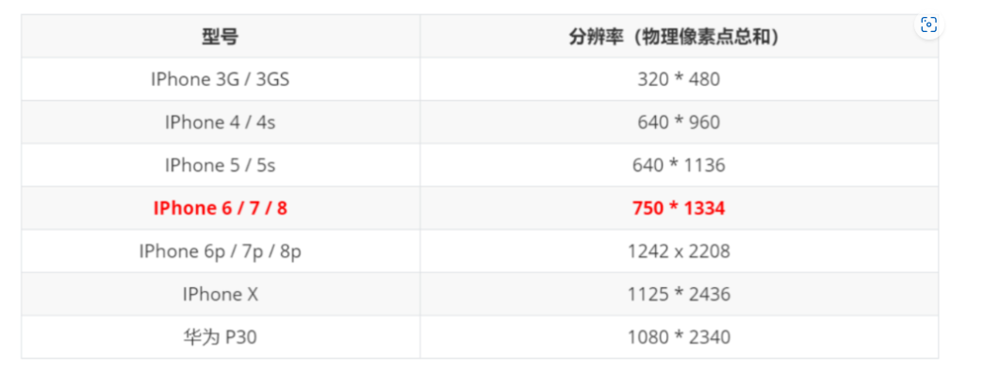

### 3，屏幕密度

又称：屏幕像素密度，是指屏幕上每英寸里包含的物理像素点个数，单位是 ppi （pixels per inch），其实这里还有另一个单位 dpi（dots per inch），两个值的计算方式都一样，只是使用的场景不同。 ppi主要用来衡量屏幕，dpi 用来衡量打印机等。计算如下：

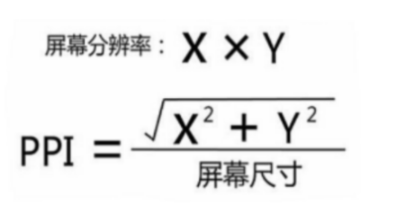

### 4，单位分类

 分两类：

* 绝对单位
  + 它们与其他任何东西都没有关系，通常被认为总是相同的大小。
  + 这些值中的大多数在用于打印时比用于屏幕输出时更有用，例如，我们通常不会在屏幕上使用cm。
* 相对单位
  + 相对单位肯定有参考点，如：1em   fs:12px   1em = 12px  2em = 24px
  + rem , r是root的意思，参考点是html标签的fs，html标签的fs是10px， 1rem = 10px  2rem = 20px。
  + vw  视窗宽度的1%    20vw = 视窗宽度的20%    60vw = 视窗宽度的60% 
  + vh   视窗高度的1%  70vh = 视窗高度的70%

常见的绝对单位：

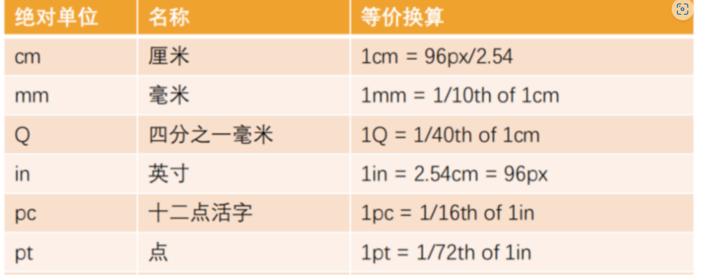

常见的相对单位：

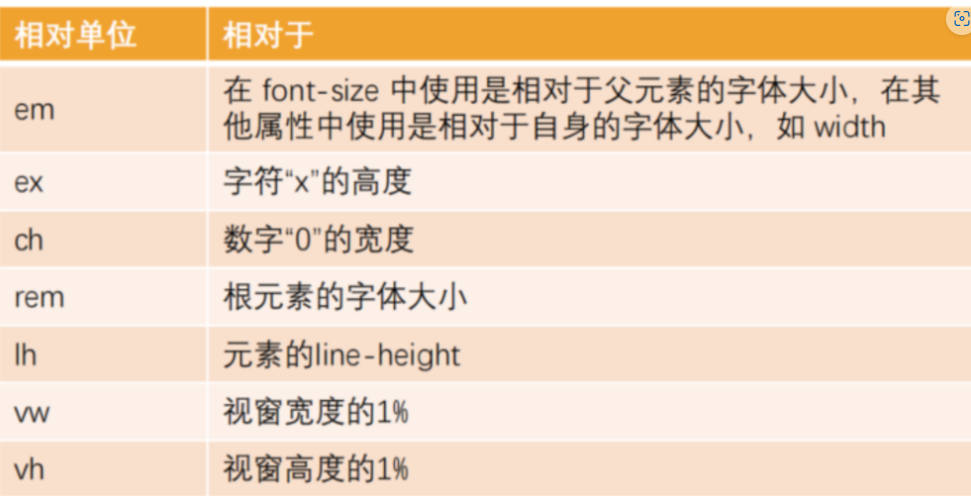

### 5，像素分类

分类：

* 物理像素：物理像素说白了，就是分辨率
* 设备独立像素
* CSS像素

**物理像素：**

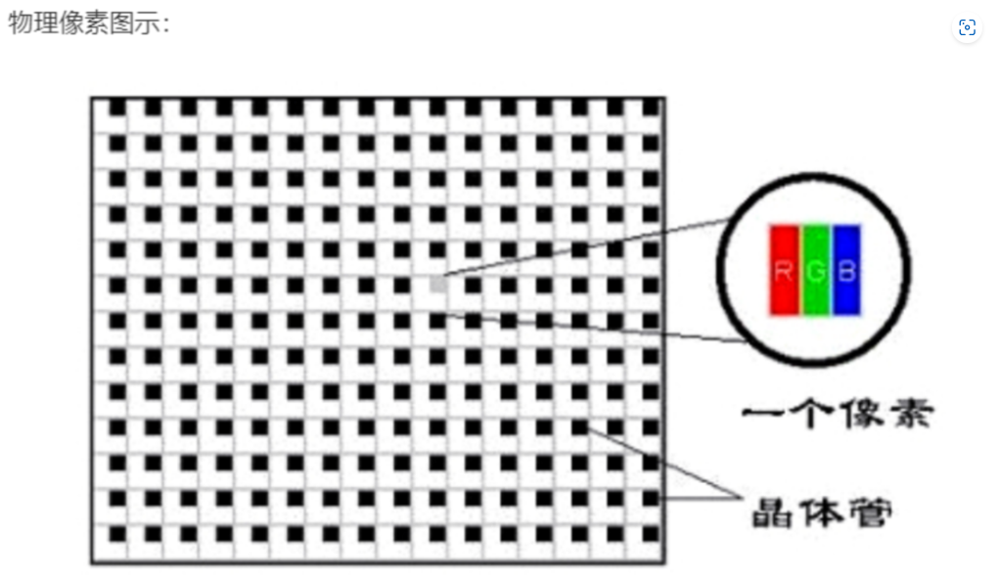

* 分辨率，和开发无关，开发时，面对的是设备独立像素
* 指的是显示器上的真实像素，每个像素的大小是屏幕固有的属性，屏幕出厂以后就不会改变了；
* 我们在购买显示器或者手机的时候，提到的设备分辨率就是物理像素的大小；
* 比如iPhone X的分辨率 1125x2436，指的就是设备像素；

**CSS像素：**

* 又称： 逻辑像素，css像素是一个抽象的长度单位，单位也是px，它是为 Web 开发者创造的，用来精确的度量Web 页面上的内容大小。我们在编写css、js、less中所使用的都是css像素（可以理解为：“程序员像素”）
* 我代码中所写的1px（css像素），到了屏幕上到底对应几个物理像素呢？要搞懂它到底映射成几个发光点，你需要知道设备独立像素。

**设备独立像素：**

* 程序员开发，面对的不是物理像素，不是分辨率，我们面对的是设备独立像素。
* 不同的手机有自己不同的设备独立像素，这个也是手机出厂定死的。
* 设备独立像素简称 DIP 或 DP（device-independent pixel），又称：屏幕密度无关像素。

看几款手机的设备独立像素：

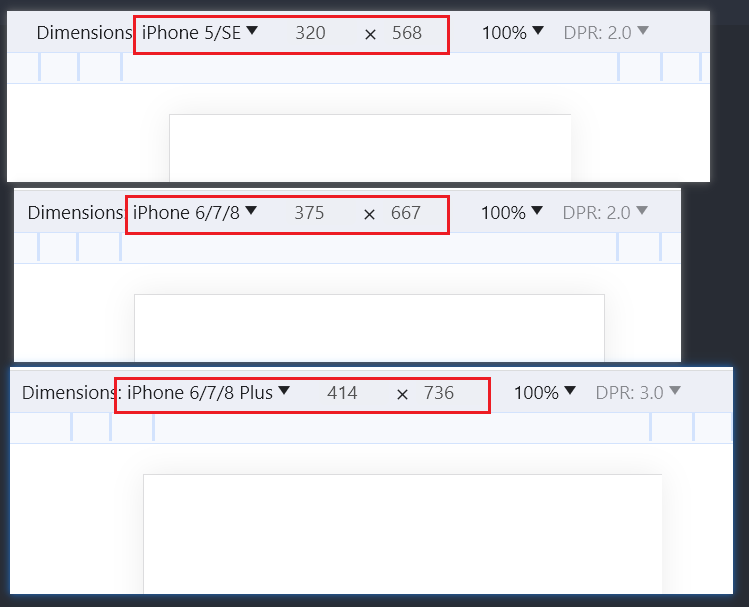

有了物理像素，为什么又出来一个设备独立像素呢？

> 引言： 在没出现【高清屏】的年代，1个css像素对应1个物理像素，但自从【高清屏】问世，二者就不再是1对1的关系了。苹果公司在2010年推出了一种新的显示标准：**在屏幕尺寸不变的前提下**，把更多的物理像素点**压缩**至一块屏幕里，这样分辨率就会更高，显示效果就会更佳细腻。苹果将这种屏幕称为：**Retina 屏幕（又名：视网膜屏幕）**，与此同时推出了配备这种屏幕的划时代数码产品——iPhone4。

非高清屏，以iPhone3G手机为例，如下：

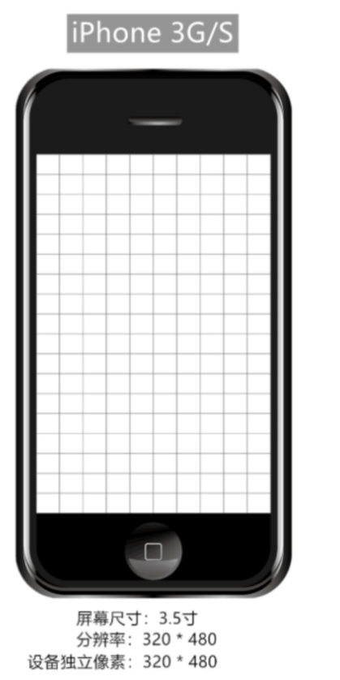

非高清屏，CSS像素和设备独立像素是1:1，设备独立像素和物理像素是1:1，如写一个div，宽高是320*480，会正好撑满整个手机屏。

以iPhone4为例，看一下高清屏，如下：

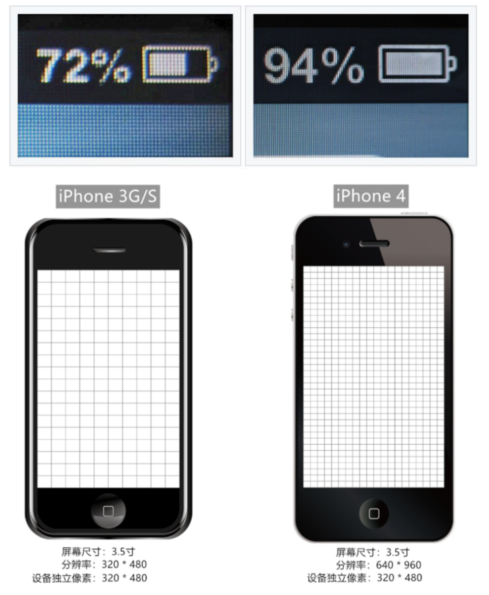

现在它们的比例关系是这样的：

* 写1px * 1px像素的CSS像素，CSS像素 和 设备独立像素是 1:1关系 
* 1px * 1px 设备独立像素  映射成发光点（物理像素）就成了 2px * 2px的发光点。

### 6，DPR

像素比（dpr）: 单一方向上设备【物理像素】和【设备独立像素】的比例。即：dpr = 物理像素  /  设备独立像素。

* 2010年，iPhone4问世，不仅仅带来了移动互联网，还带来了Retina屏幕
* Retina屏幕翻译为视网膜显示屏，可以为用户带来更好的显示
* 在Retina屏幕中，一个逻辑像素在长度上对应两个物理像素，这个比例称之为设备像素比（device pixel ratio）
* 我们可以通过window.devicePixelRatio获取到当前屏幕上的DPR值

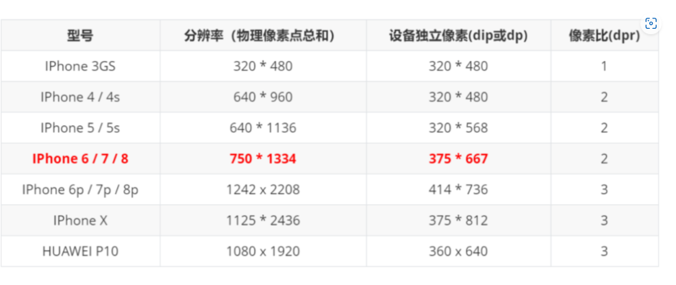

高清屏和非高清屏的对比：

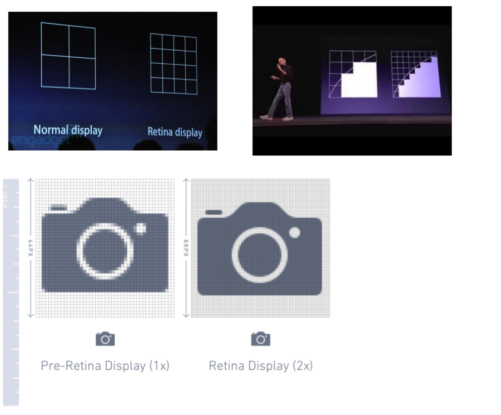

### 7，三种像素之间的关系

**在不考虑缩放的情况下（理想状态下）：**

* 普通屏(dpr = 1)：1css像素 = 1设备独立像素 = 1物理像素
* 高清屏(dpr = 2)：1css像素 = 1设备独立像素 =  2物理像素
* 高清屏(dpr = 3)：1css像素 = 1设备独立像素 =  3物理像素

**程序员写了一个width为100px的盒子，那么：**

* 代表100个css像素
* 若用户不进行缩放，则对应100个设备独立像素
* 在dpr为2的设备上，这100个css像素占据了100*2=200个物理像素（横向）

**现在以iPhone6为例，我们描述一下屏幕（横向上），描述一下你的屏幕**：

* 物理像素：750px
* 设备独立像素：375px
* css像素：375px

**设备独立像素 与 物理像素关系**：

* 普通屏幕下 1 个设备独立像素 对应 1 个物理像素
* 高清屏幕下 1 个设备独立像素 对应 N 个物理像素

**设备独立像素 与 css像素关系**：

* 在无缩放的情况下（标准情况）：1css像素 = 1设备独立像素

## 二，视口

### 1，把PC端的网页，放到手机端

**把PC端的网页，放到手机端，整体会缩小，分两步**：

* 第一步：把你的网页放到虚拟容器中，如果生成的网页，宽度是980px，虚拟容器如果也是980px，那么网页正好放到虚拟容器中，如果网页宽度大于980px，就会在虚拟容器中，产生水平的滚动条。如果生成的网页小于980px，网页也可以装进去，水平方向肯定装不满。这个虚拟容器是真实存在的，并且大部分的手机上这个虚拟容器的宽度就是980px。 这个980也是手机出厂时，就定死。
* 第二步：把上面的虚拟容器塞到手机中，你需要知道手机的宽度，这里说的宽度是指设备独立像素，不是指屏幕分辨率。也就是，以iphone6为例：你需要把980px的虚拟容器，塞到375的手机，此时，它需要把虚拟容器，缩小后，放到手机中，虚拟容器压缩了，就意味着，它把网页上的每一个盒子都压缩变小了。


**上面，所说的虚拟容器，就叫视口，全称叫布局视口。大部分手机上的布局视口都是980px。**

现在写一个盒子，如下：

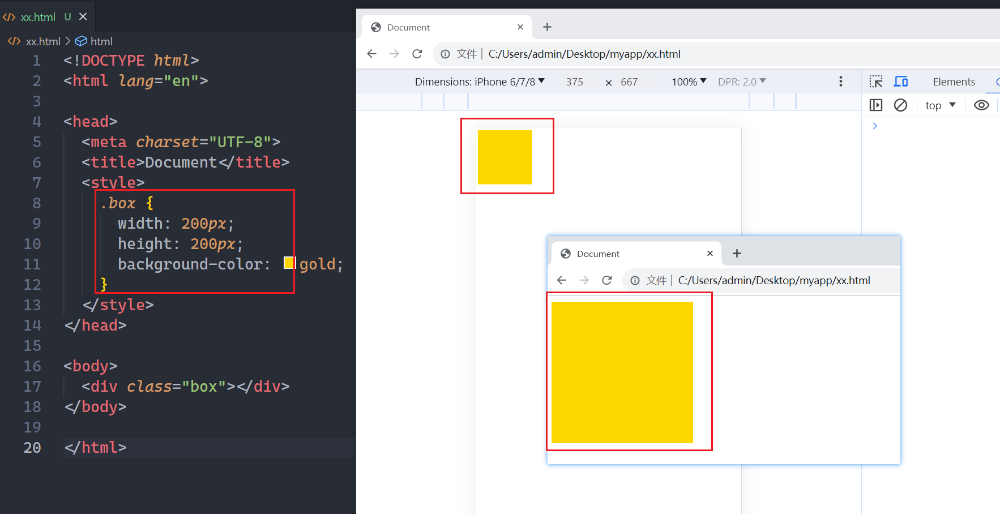

* 在PC端：1个css像素对应1个设备独立像素 1个设备独立像素对应1个物理像素
* 在iPhone5中：需要先放到虚拟容器中（980px）, 接着，压缩，放到320的手机中

* 在iPhone6中：需要先放到虚拟容器中（980px）, 接着，压缩，放到375的手机中
* 在iPhone6P中：需要先放到虚拟容器中（980px）, 接着，压缩，放到414的盒子

**结论：同一个盒子，在不同的手机中，看到的大小是不一样的，手机宽度（设备独立像素）越小，压缩越狠。所以，我说到手机的宽度，都是指设备独立像素，不是指分辨率。**：

上面的说的虚拟容器，就是视口，在移动端，视口分三类：

* 布局视口：就是980那个虚拟容器

  

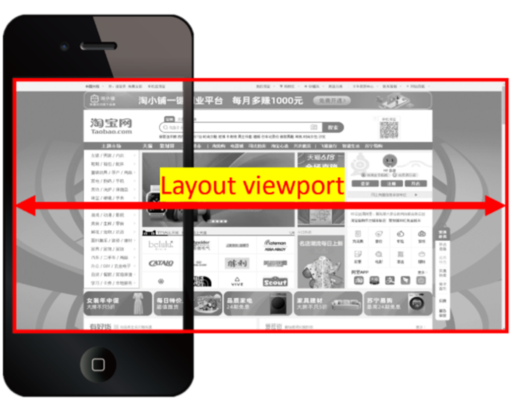

* 视觉视口：就是手机的宽度（设备独立像素）

  

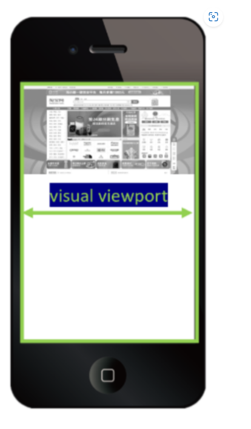

* 理想视口：把布局视口设置成和手机宽度一样，就成了理想视口，设置理想视口的目的不让盒子压缩。

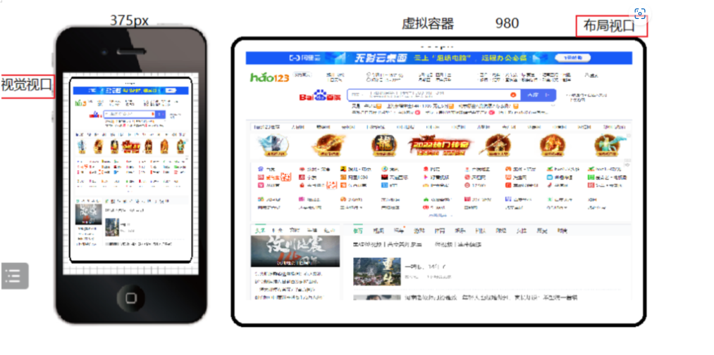

### 2，设置理想视口

直接上代码：

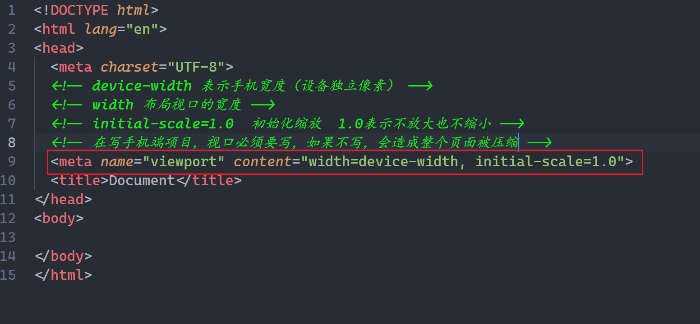

其它属性，如下：

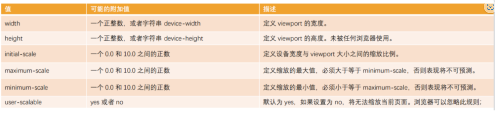

设置完视口后，再看那个200*200的盒子，如下：

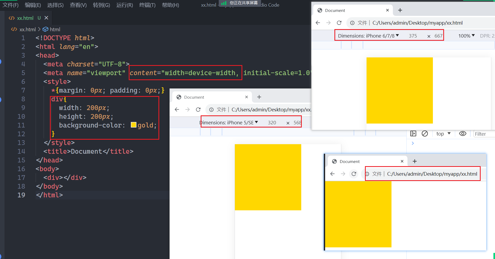

关于视口，还有很多复杂的知识点，今天先不说了。

## 三，移动端适配

前面设置视口的目的是防止盒子压缩，说白了，就是让一个盒子在所有的手机上显示的大小是一样的。那这样合理呢？

答：不合理，手机屏幕有大有小，我们想的效果是，屏幕大的手机，盒子显示的大一点，屏幕小的手机，盒子显示的小一点。这就需要我们进行适配。所谓的适配就是同一个盒子，在大屏上显示大一点，在小屏上显示小一点。

### 1，rem+媒体查询做适配

先说一下，rem这个单位，如下：

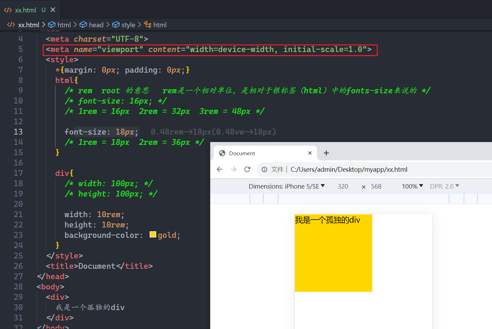

参考代码：

```html
<!DOCTYPE html>
<html lang="en">

<head>
    <meta charset="UTF-8">
    <meta name="viewport" content="width=device-width, initial-scale=1.0">
    <style>
        * {
            margin: 0px;
            padding: 0px;
        }

        html {
            /* rem  root 的意思   rem是一个相对单位，是相对于根标签（html）中的fonts-size来说的 */
            /* font-size: 16px; */
            /* 1rem = 16px  2rem = 32px  3rem = 48px */

            font-size: 18px;
            /* 1rem = 18px  2rem = 36px */
        }

        div {
            /* width: 100px; */
            /* height: 100px; */

            width: 10rem;
            height: 10rem;
            background-color: gold;
        }
    </style>
    <title>Document</title>
</head>

<body>
    <div>
        我是一个孤独的div
    </div>
</body>

</html>
```

然后，使用rem+媒体查询做适配，代码如下：

```html
<!DOCTYPE html>
<html lang="en">

<head>
    <meta charset="UTF-8">
    <meta name="viewport" content="width=device-width, initial-scale=1.0">
    <style>
        * {
            margin: 0px;
            padding: 0px;
        }

        @media only screen and (device-width: 750px) {
            html {
                /* 1rem = 100px  75px = 0.75rem   375px = xxrem */
                font-size: 100px;
            }
        }

        @media only screen and (device-width: 375px) {
            html {
                font-size: 50px;
            }
        }

        @media only screen and (device-width: 320px) {
            html {
                font-size: 42.666px;
            }
        }

        @media only screen and (device-width: 414px) {
            html {
                font-size: 55.2px;
            }
        }

        div {
            font-size: 0.75rem
        }

        img {
            width: 3.75rem;
        }
    </style>
    <title>Document</title>
</head>

<body>
    <div>牧童骑黄牛歌声振林樾</div>
    
</body>

</html>
```

上面通过媒体查询就适配了4块屏，如下：

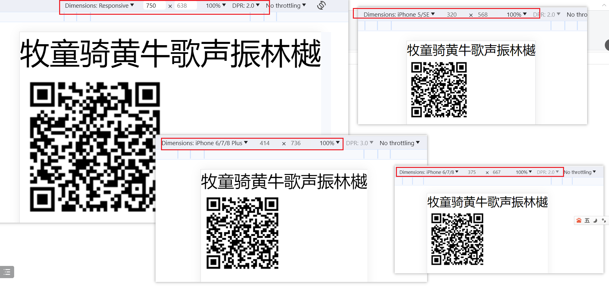

缺点：

* 需要适配市面上很多的屏幕，非常麻烦
* 需要计算不同屏的html的font-size

上面的代码是以750屏为主，把750的屏的html的fontsize定了100px，现在把375的屏的fontsize定成100，如下：

```html
<!DOCTYPE html>
<html lang="en">

<head>
    <meta charset="UTF-8">
    <meta name="viewport" content="width=device-width, initial-scale=1.0">
    <style>
        * {
            margin: 0px;
            padding: 0px;
        }

        @media only screen and (device-width: 375px) {
            html {
                /* 1rem = 100px */
                font-size: 100px;
            }
        }

        @media only screen and (device-width: 320px) {
            html {
                font-size: 85.33px;
            }
        }

        div {
            /* 1个字是37.5px */
            font-size: 0.375rem;
        }

        img {
            /* img是375/2 = 187.5 */
            width: 1.875rem;
        }

        img {}
    </style>
    <title>Document</title>
</head>

<body>
    <div>牧童骑黄牛歌声振林樾</div>
    
</body>

</html>
```

上面的代码适配了两个块屏，如下：

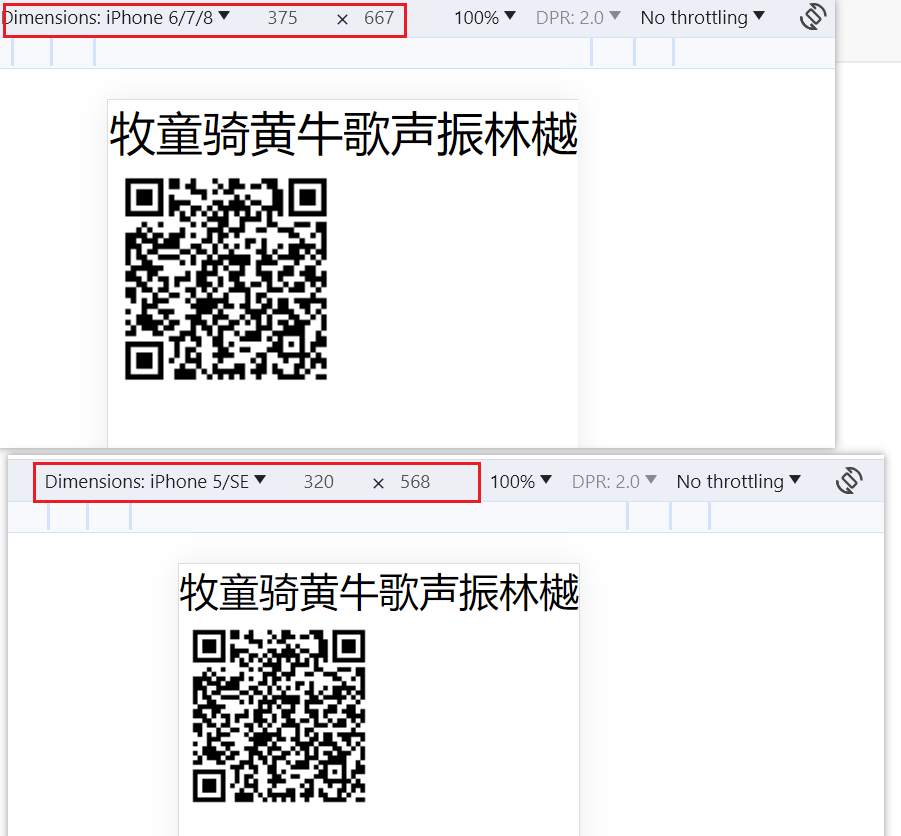

除了上面的算法之，还有一种算法，如下：

```html
<!DOCTYPE html>
<html lang="en">

<head>
    <meta charset="UTF-8">
    <meta name="viewport" content="width=device-width, initial-scale=1.0">
    <style>
        * {
            margin: 0px;
            padding: 0px;
        }

        @media only screen and (device-width: 750px) {
            html {
                font-size: 75px;
            }
        }

        @media only screen and (device-width: 375px) {
            html {
                font-size: 37.5px;
            }
        }

        @media only screen and (device-width: 320px) {
            html {
                font-size: 32px;
            }
        }

        @media only screen and (device-width: 414px) {
            html {
                font-size: 41.4px;
            }
        }

        div {
            font-size: 1rem;
        }

        img {
            width: 5rem;
        }
    </style>
    <title>Document</title>
</head>

<body>
    <div>牧童骑黄牛歌声振林樾</div>
    
</body>

</html>
```

浏览器效果：

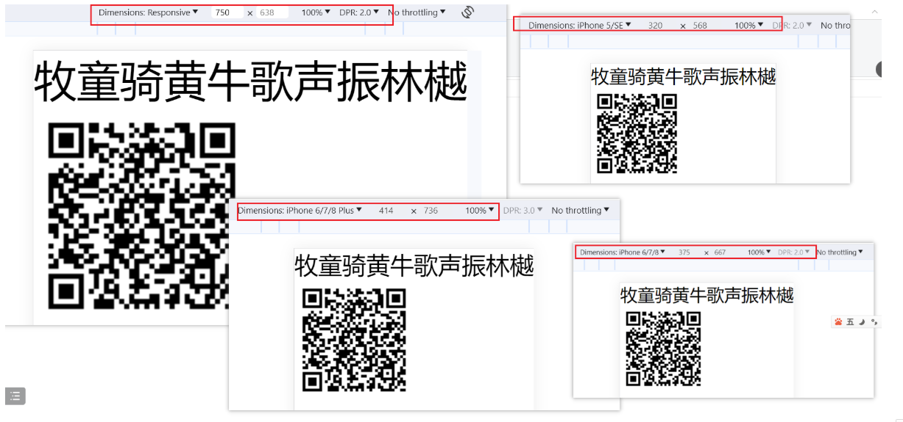

### 2，给你一张750的设计图

1. 得到设计图 一般情况下，大部分的设计图，宽度是750px。
2. 通常我会把浏览器的模拟器，也调整成750px。
3. 严格按照设计图，去还原设计图，需要适配的盒子，都使用rem做单位。
4. 开始写样式，对于750模拟器，我通常会调整它的html标签的font-size是100px。叫基准值。如：一个盒子，宽度是30px，高度是55px。换成rem，w=0.3rem   h=0.55rem。
5. 说白了，最设计图，量出尺寸，需要适配的盒子，换成rem，就是px / 100 就是rem的数值。
6. 到此，你不要去管其它屏，你就老才实实地，在750的屏上，把设计图还原。
7. 等你页面写完后，开始适配，你需要把你写的750的页面，迁移到其它屏，这个过程，适配。
8. 说白了，就是设置其它屏的html的font-size大小。

开始适配：

* iPhone6 手机宽度： 375px html标签的font-size:50px; 1rem = 50px
* iPhone5 手机宽度： 320px html标签的font-size:42.66666px; 1rem = 42.6666px
* iPhone6P 手机宽度： 414px html标签的font-size:55.2px; 1rem = 55.2px
* 一个安卓手机，宽度520，那它的html标签的font-size  750/520 = 100/x  求x。

通过媒体查询实现：

* @media only screen and (device-width: 750px){ html{ font-size: 100px; } }
* @media only screen and (device-width: 375px){ html{ font-size: 50px; } }
* @media only screen and (device-width: 320px){ html{ font-size: 42.6666px; } }
* @media only screen and (device-width: 414px){ html{ font-size: 55.2px; } }

### 3，rem + js做适配

再回顾一下上面的讲的两套算法：

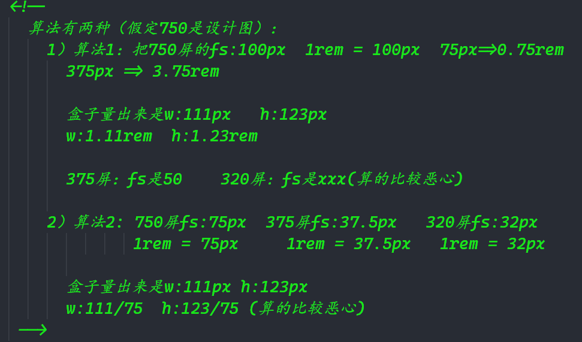

直接上代码：

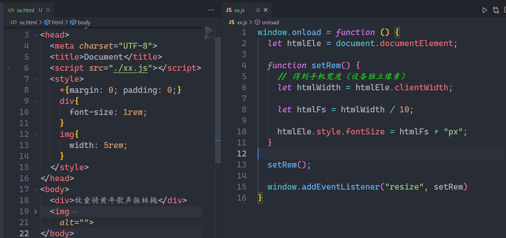

这样，所有屏都适配了，不截图，如果在750的设计图中量出一个盒子w:111px， h:123px，需要让你转成rem，如何呢？

答：w:111/75   h:123/75，代码如下：

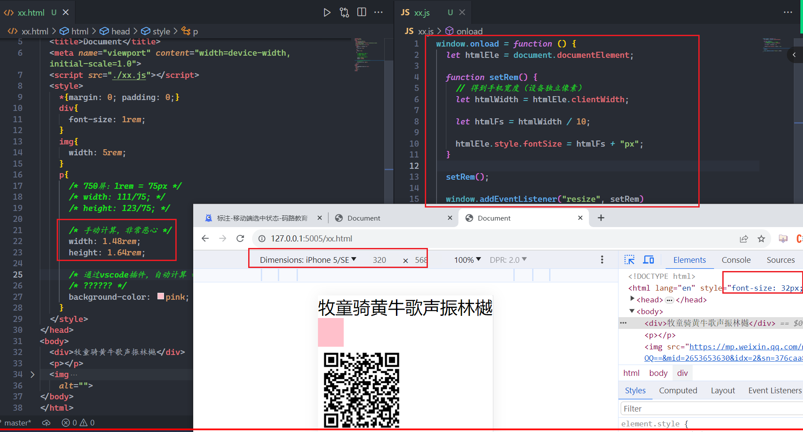

使用vscode做自动计算，如下：

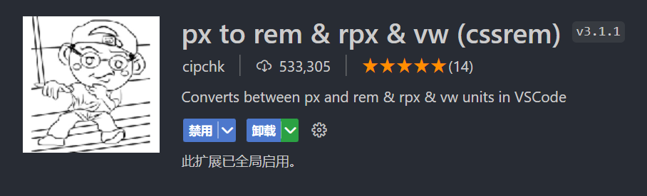

还需要设置，如下：

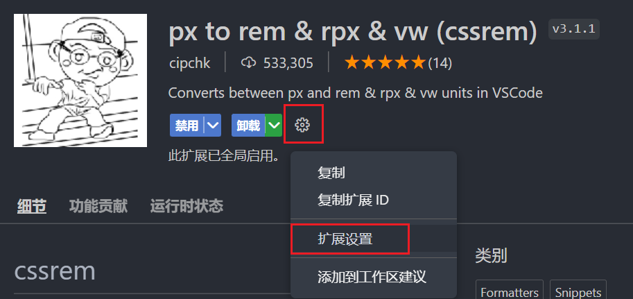

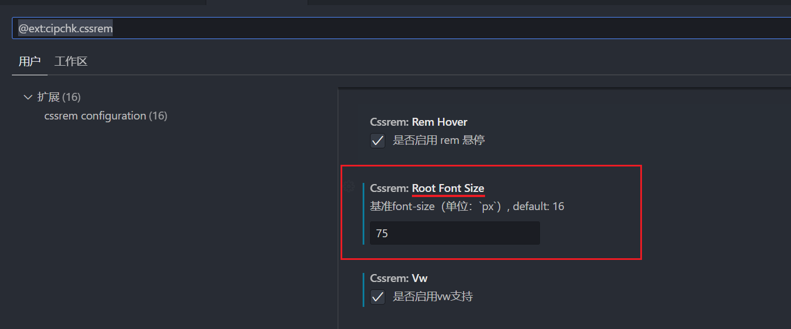

现在这个插件就可以自动计算了，如下：

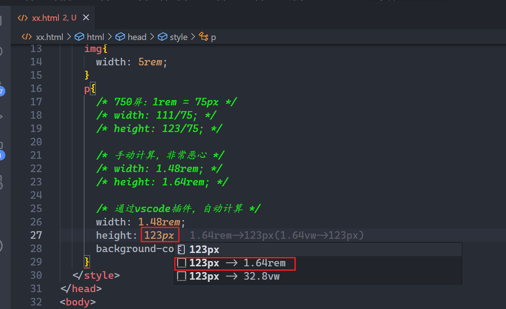

上面的JS是我们自己写的，淘宝开了一个适配的JS库，如下：

```js
(function flexible(window, document) {
    var docEl = document.documentElement
    var dpr = window.devicePixelRatio || 1

    // adjust body font size
    function setBodyFontSize() {
        if (document.body) {
            document.body.style.fontSize = (12 * dpr) + 'px'
        } else {
            document.addEventListener('DOMContentLoaded', setBodyFontSize)
        }
    }
    setBodyFontSize();

    // set 1rem = viewWidth / 10
    function setRemUnit() {
        var rem = docEl.clientWidth / 10
        docEl.style.fontSize = rem + 'px'
    }

    setRemUnit()

    // reset rem unit on page resize
    window.addEventListener('resize', setRemUnit)
    window.addEventListener('pageshow', function(e) {
        if (e.persisted) {
            setRemUnit()
        }
    })

    // detect 0.5px supports
    if (dpr >= 2) {
        var fakeBody = document.createElement('body')
        var testElement = document.createElement('div')
        testElement.style.border = '.5px solid transparent'
        fakeBody.appendChild(testElement)
        docEl.appendChild(fakeBody)
        if (testElement.offsetHeight === 1) {
            docEl.classList.add('hairlines')
        }
        docEl.removeChild(fakeBody)
    }
}(window, document))
```

使用上面的库，如下：

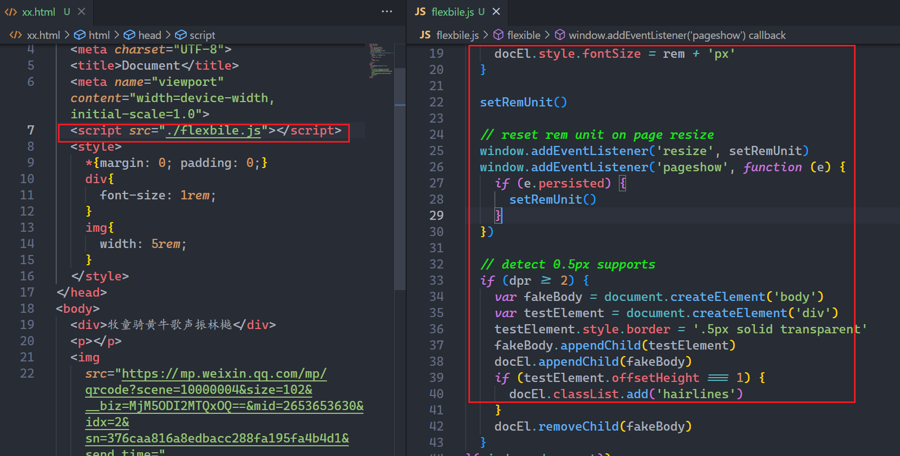

浏览器测试之，OK。

### 4，vw vh适配

**在flexible GitHub上已经有写过这样的一句话：**

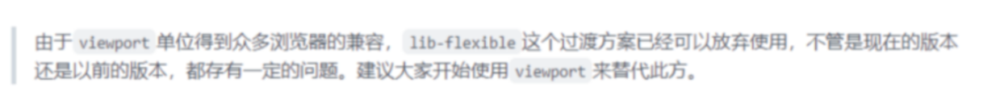

前面不管是我们自己编写的js，还是flexible的来适配，特点：

* 都是将1rem等同于屏的1/10     750屏 1rem = 75px   320屏 1rem = 32px

* 然后，再去计算你量出来的盒子的大小  w:111px  w:111/75   h:123px  h:123/75  这个计算是交给vscode的插件来做了。

* 总之：1rem等同于屏的1/10。正好有一个单位，叫vw，1vw正好是屏的1/100

* 不管在什么屏上，1vw始终是屏的1/100。

  

  

使用vw来适配，如下：

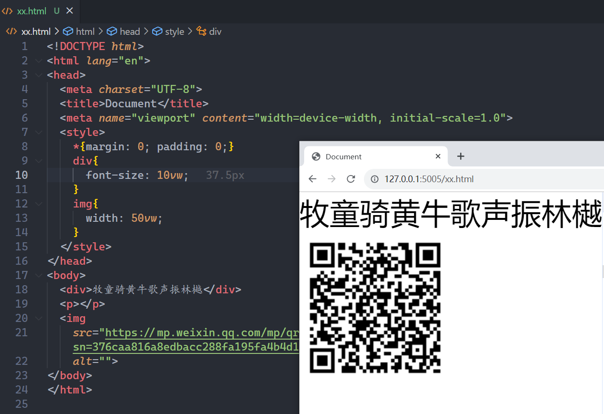

  **vw相比于rem的优势：**

1. 优势一：不需要去计算html的font-size大小，也不需要给html设置这样一个font-size；
2. 优势二：不会因为设置html的font-size大小，而必须给body再设置一个font-size，防止继承；
3. 优势三：因为不依赖font-size的尺寸，所以不用担心某些原因html的font-size尺寸被篡改，页面尺寸混乱；
4. 优势四：vw相比于rem更加语义化，1vw刚才是1/100的viewport的大小;
5. 优势五：可以具备rem之前所有的优点；

**vw我们只面临一个问题，将尺寸换算成vw的单位即可；** **所以，目前相比于rem，更加推荐大家使用vw（但是理解rem依然很重要）**

此时还有一个换算问题：

* 有一个盒子w:111px   h:123px; 设计图是375。    
* 100vw = 375px    111px = ???vw   111/3.75   29.6vw  
* h:123px   h:123/3.75  h:32.8vw

代码演示：

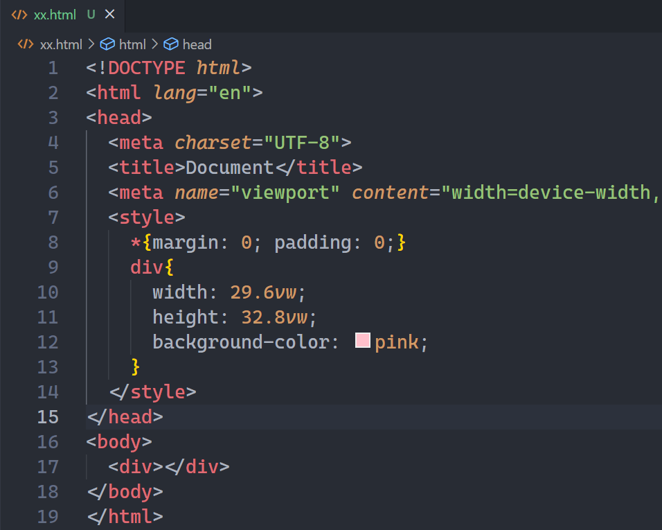

浏览器效果：

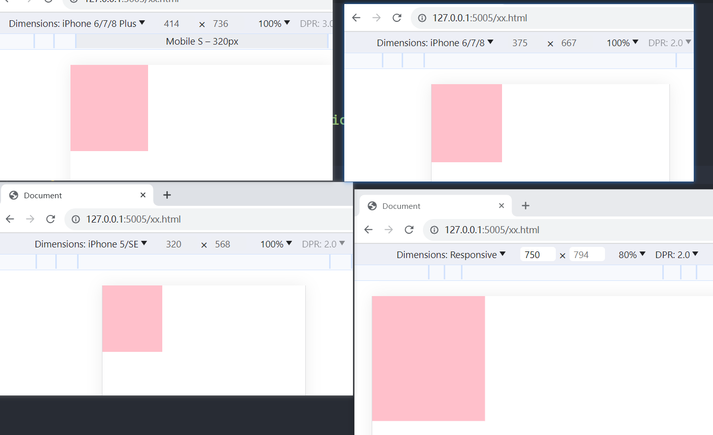

肯定也有一个插件，可以帮我们计算，如下：

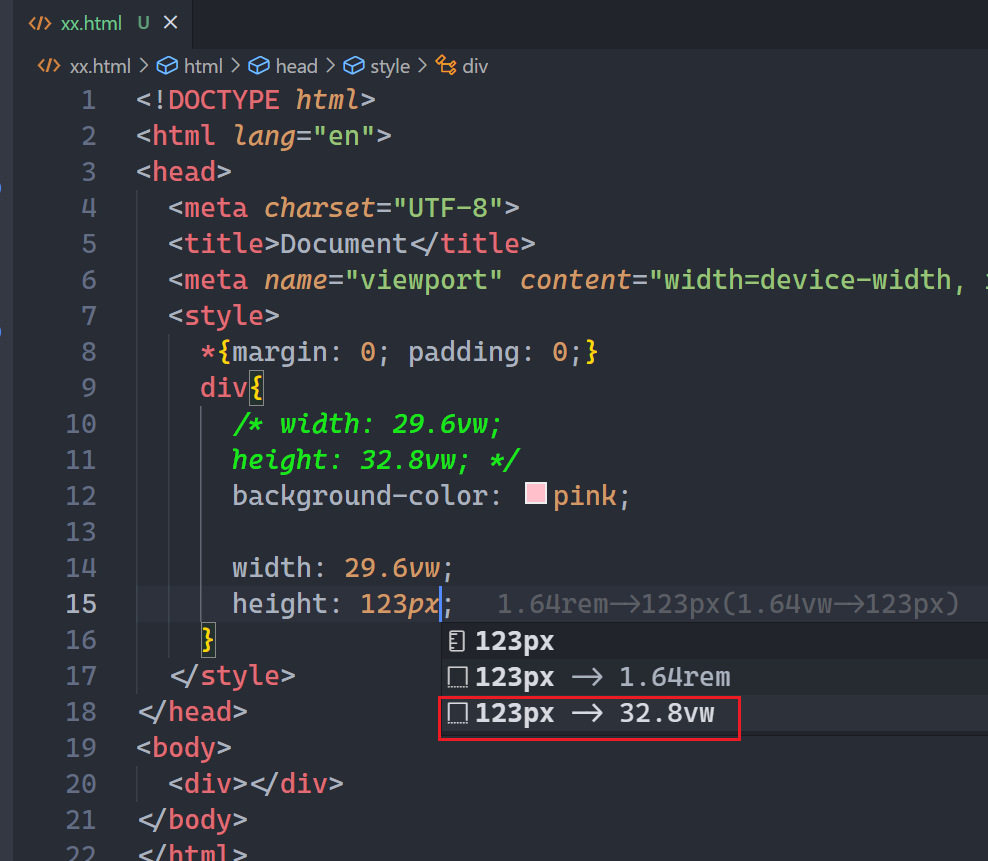
