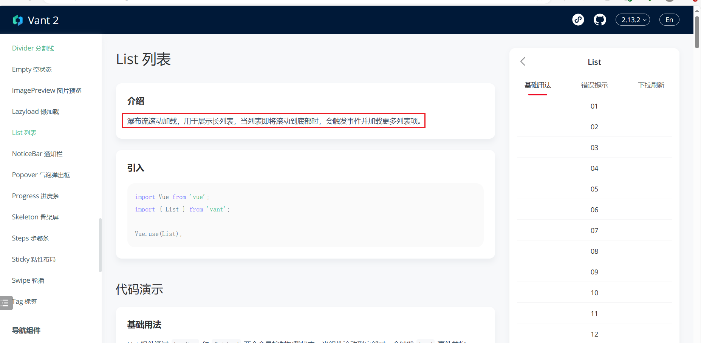
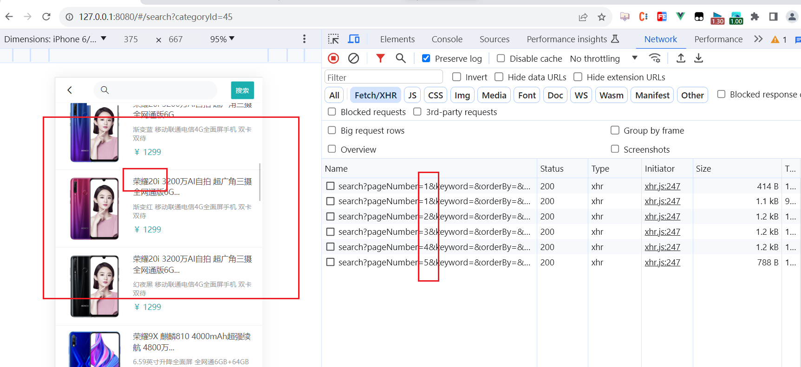
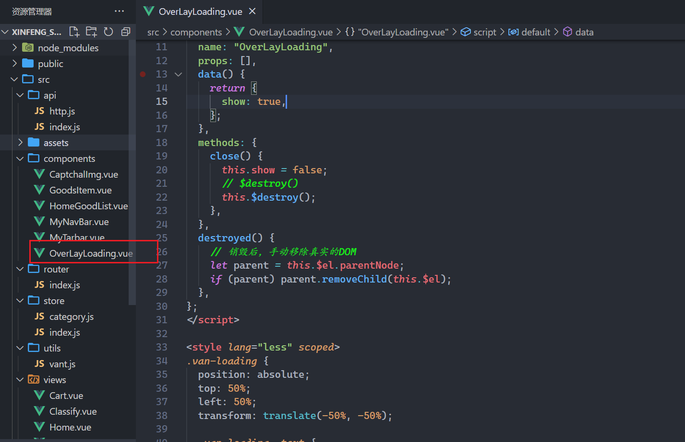
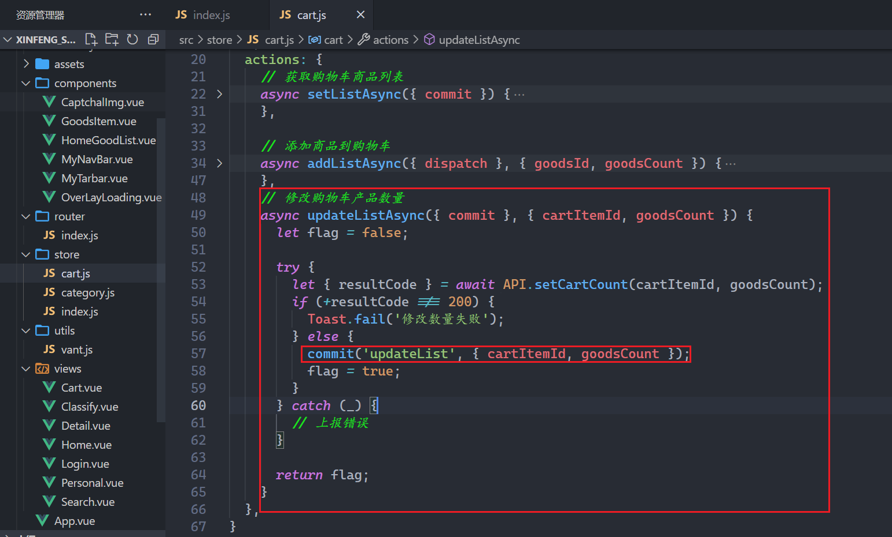
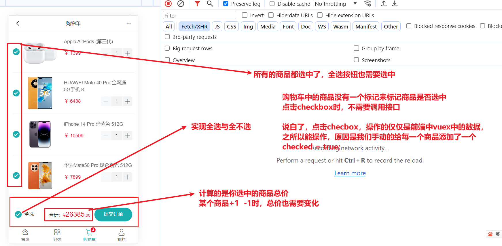
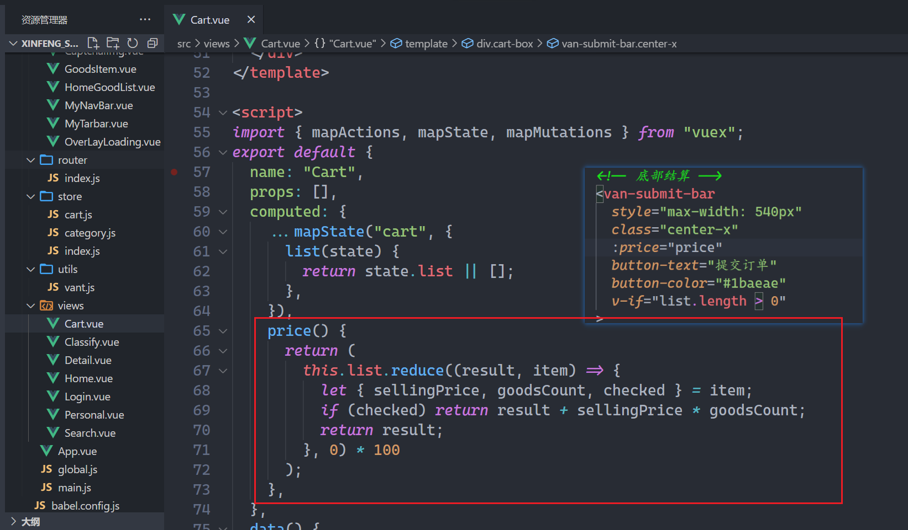

## 一，项目介绍

### 1，项目介绍

开源GitHub项目地址：https://github.com/newbee-ltd

项目访问地址：http://47.99.134.126:5000/

账号密码：

* 已注册账号：18333333334
* 密码：123456

### 2，项目分析

五大组件与路由分析：

* 首页面组件  Home.vue
* 分类组件  Classify.vue
* 购物车组件  Cart.vue
* 我的组件  Personal.vue
* 登录组件  Login.vue

network面板分析登录接口：


application面板分析：


### 3，项目的骨架

我把项目中使用到的依赖，都记录好，把骨架发给大家，大家基于这个骨架进行开发，如下：


大家，需要解压，安装依赖（跑环境）：

```shell
npm i 
```

运行项目（看package.json）：

```shell
npm run serve
```

## 二，搭建五大组件并配置路由

### 1，创建出五大组件

组件分两类：

* 页面级别的组件（路由级别的组件）
* 通用组件（小组件，多个页面中可能都会用到）

上面分析的5大组件，是路由级别的，一般情况下，会放到views文件夹中，或者是pages文件夹中，如下：


配置路由，如下：


参考代码如下：

```js
import Vue from 'vue'
import VueRouter from 'vue-router'

Vue.use(VueRouter)

let routes = [{
        path: '/',
        redirect: '/home'
    },
    {
        path: '/home',
        component: () => import('../views/Home.vue'),
    },
    {
        path: '/classify',
        component: () => import('../views/Classify.vue'),
    },
    {
        path: '/cart',
        component: () => import('../views/Cart.vue'),
    },
    {
        path: '/personal',
        component: () => import('../views/Personal.vue'),
    },
    {
        path: '/login',
        component: () => import('../views/Login.vue'),
    }
]

const router = new VueRouter({
    routes
})

export default router;
```

在main.js中引入，挂载到根组件上，如下：


在App.vue中，需要指定出口，如下：


浏览器测试之，如下：


### 2，Vant组件库的使用

vant组件库，提供了大量的组件，可以方便我们快速构建项目。<br/>

vant的官网：https://vant-contrib.gitee.io/vant/#/zh-CN/  <br/>

如果是vue2，参考文档：https://vant-contrib.gitee.io/vant/v2/#/zh-CN/   <br/>

如果是vue3，参考文档：https://vant-contrib.gitee.io/vant/#/zh-CN   <br/>

要使用vant中提供的组件，引入方式，分三种：

* 自动按需引入（推荐）
* 手动按需引入
* 全部引入

如何实现自动按需引入？看看文档(文档怎么说就怎么做)：

* 地址：https://vant-contrib.gitee.io/vant/v2/#/zh-CN/quickstart

操作步骤如下：


操作之，如下：


重启项目，然后引入一个Button组件，测试之，如下：


浏览器测试之，如下：


在src下面创建一个utils文件夹，里面创建一个vant.js，如下：


参考代码如下：

```js
import Vue from "vue"
import {
    Button,
    Overlay,
    Tabbar,
    TabbarItem,
    Skeleton,
    ShareSheet,
    DropdownMenu,
    DropdownItem,
    Image,
    Icon,
    Form,
    Field,
    NavBar,
    Swipe,
    SwipeItem,
    Grid,
    GridItem,
    GoodsAction,
    GoodsActionIcon,
    GoodsActionButton,
    Checkbox,
    Stepper,
    SubmitBar,
    AddressList,
    AddressEdit,
    Area,
    Tab,
    Tabs,
    List,
    Cell,
    SwipeCell,
    Card,
    Dialog,
    Toast,
    ContactCard,
    ActionSheet,
    Loading,
    divider,
    Search,
    Empty,
    sidebar,
    SidebarItem,
    grid
} from 'vant'

[
    Button,
    Overlay,
    Tabbar,
    TabbarItem,
    Skeleton,
    ShareSheet,
    DropdownMenu,
    DropdownItem,
    Image,
    Icon,
    Form,
    Field,
    NavBar,
    Swipe,
    SwipeItem,
    Grid,
    GridItem,
    GoodsAction,
    GoodsActionIcon,
    GoodsActionButton,
    Checkbox,
    Stepper,
    SubmitBar,
    AddressList,
    AddressEdit,
    Area,
    Tab,
    Tabs,
    List,
    Cell,
    SwipeCell,
    Card,
    Dialog,
    Toast,
    ContactCard,
    ActionSheet,
    Loading,
    divider,
    Search,
    Empty,
    sidebar,
    SidebarItem,
    grid
].forEach(item => {
    Vue.use(item)
})
```

在main.js中引入vant.js，如下：


再次测试之，如下：


昨天讲了移动端适配：

* rem + 媒体查询来适配
* rem + 自己写的JS来适配
* rem + 淘宝的flexible来适配
* vw + vh适配 

在脚本架中，要适配的话，上面的方式都可以不用，可以配置postcss，如下：


### 3，处理全局样式

引入重置样式，如下：


设置App.vue组件的样式，如下：


浏览器效果如下：


## 三，封装TabBar组件

### 1，封装TabBar组件

我们需要封装的Tabbar组件如下：


要去写一个组件，先去UI组件库中找一下，有没有对应的组件，如下：


把Tabbar再封装一下，封装的通用组件就放在components中，如下(首页的to的值应该是/home)：


参考代码如下：

```vue
<template>
  <van-tabbar route active-color="#1baeae">
    <van-tabbar-item to="/home" icon="home-o">首页</van-tabbar-item>
    <van-tabbar-item to="/classify" icon="apps-o">分类</van-tabbar-item>
    <van-tabbar-item to="/cart" icon="shopping-cart-o" badge="5">购物车</van-tabbar-item>
    <van-tabbar-item to="/personal" icon="manager-o">我的</van-tabbar-item>
  </van-tabbar>
</template>

<script>
export default {
  name: "MyTarbar",
  props: [],
  data() {
    return {};
  },
  methods: {},
};
</script>

<style lang="less" scoped>
</style>
```

在App.vue中使用之，如下：


浏览器效果如下：


调整一下TabBar最大宽度，如下：


在main.js，引入flexble，引入vant的样式，如下：


浏览器效果如下：


### 2，控制Tabbar的显示与隐藏

当访问login组件时，不需要显示Tabbar，如下：


肯定要控制Tabbar的显示与隐藏，代码如下：


浏览器测试之，如下：


### 3，防止Tabar盖住页面内容

在首页面组件中写如下内容：


给#app的那个div添加一个padding-bottom，还不能直接添加，Login组件中没有Tabbar，也就是说有Tabbar时，需要添加，没有Tabbar时，不需要添加，代码如下：


绑定自定义事件，如下：


书写bottom这个类名，如下：


浏览器测试之，如下：


换成login组件，如下：


## 四，注册登录模块实现

### 1，绘制登录页面

目标：


找到vant中的导航组件，如下：


使用之，如下：


logo区域，如下:


实现样式，如下：


实现表单区域，如下：

```vue
<template>
  <div class="login-box">
    <!-- 导航 -->
    <van-nav-bar
      :title="isLogin ? '登录' : '注册'"
      left-text="返回"
      left-arrow
    />
    <!-- Logo -->
    

    <!-- 表单 -->
    <van-form validate-first @submit="submit" ref="formRef">
      <van-field
        v-model.trim="ruleForm.loginName"
        name="loginName"
        placeholder="请输入用户名"
        label="手机号"
        :rules="[
          { pattern: /^(?:(?:\+|00)86)?1\d{10}$/, message: '手机号格式有误' },
        ]"
      />
      <van-field
        v-model.trim="ruleForm.password"
        name="password"
        placeholder="请输入密码"
        label="密码"
        :rules="[{ required: true, message: '密码是必填项' }]"
      />
      <van-field
        v-model.trim="ruleForm.captcha"
        name="captcha"
        label="验证码"
        :rules="[{ validator: validatorCaptcha, message: '验证码输入有误' }]"
      >
        <template #button> 验证码（一会再说） </template>
      </van-field>

      <a href="javascript:;" class="text" @click="changeLogin">
        {{ isLogin ? "还没账号,请点此注册" : "已有账号,请点此登录" }}
      </a>
      <div style="margin: 16px">
        <van-button round block color="#1baeae" native-type="submit">
          确认提交
        </van-button>
      </div>
    </van-form>
  </div>
</template>

<script>
import logo from "@/assets/images/newbee-mall-vue3-app-logo.png";
export default {
  name: "Login",
  props: [],
  data() {
    return {
      logo,
      isLogin: true,
      ruleForm: {
        loginName: "", // 用户名
        password: "", // 密码
        captcha: "", // 验证码
      },
    };
  },
  methods: {
    changeLogin() {
      this.isLogin = !this.isLogin;
    },
    validatorCaptcha() {},
    async submit() {},
  },
};
</script>

<style lang="less" scoped>
.login-box {
  padding: 0 20px;
  .logo {
    width: 140px;
    height: 140%;
    display: block;
    margin: 40px auto 20px;
  }
  .text{
    display: block;
    margin-top: 20px;
    margin-bottom: 20px;
    padding: 0 15px;
    color: #1989fa;
    font-size: 14px;
  }
}
</style>
```

浏览器效果如下：


如果就想修改vant组件的样式，可以这样做，如下：


### 2，封装NavBar

在很多页面中都会使用到NavBar，封装一下，全局注册，封装如下：


全局注册之，如下：


在Login.vue中使用之，如下：


处理一下MyNavBar的样式，直接上代码，MyNavBar.vue如下：

```vue
<template>
  <div>
    <!-- 导航 -->
    <van-nav-bar
      fixed
      style="max-width: 540px"
      left-arrow
      @click-left="handleBack"
      safe-area-inset-top
      class="center-x"
    >
      <template #title>
        <span class="text">
          {{ title }}
        </span>
      </template>
      <template #right>
        <van-icon name="ellipsis" />
      </template>
    </van-nav-bar>
  </div>
</template>

<script>
export default {
  name: "MyNavBar",
  props: ["title"],
  data() {
    return {};
  },
  methods: {
    handleBack() {
      // 从哪来回哪去即可
      this.$router.back();
    },
  },
};
</script>
<style lang="less" scoped>
.text {
  font-weight: normal;
  font-size: 14px;
}
:deep(.van-nav-bar__title) {
  width: 70%;
  max-width: 70%;
}

.van-nav-bar{
  :deep(.van-icon){
    color: #000;
    font-size: 18px;
  } 
}
</style>
```

浏览器效果如下：


添加padding-top，如下：


点击右边的三个点，实现分享面板的显示，直接上代码：

```vue
<template>
  <div>
    <!-- 导航 -->
    <van-nav-bar
      fixed
      style="max-width: 540px"
      left-arrow
      @click-left="handleBack"
      safe-area-inset-top
      class="center-x"
    >
      <template #title>
        <span class="text">
          {{ title }}
        </span>
      </template>
      <template #right>
        <van-icon name="ellipsis" @click="isShare = true" />
      </template>
    </van-nav-bar>

    <!-- 分享 -->
    <van-share-sheet
      v-model="isShare"
      :options="options"
      title="立即分享给好友"
    />
  </div>
</template>

<script>
export default {
  name: "MyNavBar",
  props: ["title"],
  data() {
    return {
      isShare: false,
      options: [
        [
          { name: "微信", icon: "wechat" },
          { name: "朋友圈", icon: "wechat-moments" },
          { name: "微博", icon: "weibo" },
          { name: "QQ", icon: "qq" },
        ],
        [
          { name: "复制链接", icon: "link" },
          { name: "分享海报", icon: "poster" },
          { name: "二维码", icon: "qrcode" },
          { name: "小程序码", icon: "weapp-qrcode" },
        ],
      ],
    };
  },
  methods: {
    handleBack() {
      // 从哪来回哪去即可
      this.$router.back();
    },
  },
};
</script>
<style lang="less" scoped>
.text {
  font-weight: normal;
  font-size: 14px;
}
:deep(.van-nav-bar__title) {
  width: 70%;
  max-width: 70%;
}

.van-nav-bar {
  :deep(.van-icon) {
    color: #000;
    font-size: 18px;
  }
}
</style>
```

浏览器效果如下：


现在，在main.js中写了很多代码，把全局相关的代码放到一个单独的JS文件中，如下：


### 3，验证码

验证可以在后端实现，也可以在前端实现，这里我们就在前端实现，前端要实现验证码，方法也有很多，介绍一个：


本次课，提前在网上找到一个验证码组件，是使用canvas绘制的，如下：


参考代码：

```vue
<template>
  <div class="captcha-box" ref="captchaBox">
    <canvas
      :width="width"
      :height="height"
      ref="canvasBox"
      @click="createCaptcha"
    ></canvas>
  </div>
</template>

<script>
const createRandom = (min, max) => {
  return Math.round(Math.random() * (max - min) + min);
};
const createRandomCaptcha = (num = 4) => {
  const chars =
    "0123456789abcdefghijklmnopqrstuvwxyzABCDEFGHIJKLMNOPQRSTUVWXYZ";
  let captcha = "",
    i = 0;
  while (i < num) {
    let random = createRandom(0, 61),
      char = chars[random];
    if (captcha.includes(char)) continue;
    captcha += char;
    i++;
  }
  return captcha;
};
const createRandomColor = (min, max) => {
  const r = createRandom(min, max),
    g = createRandom(min, max),
    b = createRandom(min, max);
  return `rgb(${r},${g},${b})`;
};

export default {
  name: "CaptchaImg",
  inheritAttrs: false,
  data() {
    return {
      width: 120,
      height: 40,
    };
  },
  methods: {
    createCaptcha() {
      // 创建画布&随机验证码
      let canvas = this.$refs.canvasBox,
        ctx = canvas.getContext("2d"),
        captcha = createRandomCaptcha();
      // 填充画布颜色&位置
      ctx.fillStyle = createRandomColor(180, 230);
      ctx.fillRect(0, 0, canvas.width, canvas.height);
      // 验证码随机旋转
      [].forEach.call(captcha, (item, index) => {
        // 随机的字体大小&旋转角度
        const fontSize = createRandom(18, 36),
          deg = createRandom(-30, 30),
          x = canvas.width / (120 / 15),
          y = canvas.height / (40 / 15);
        ctx.font = `bold ${fontSize}px sans-serif`;
        ctx.textBaseline = "top";
        ctx.fillStyle = createRandomColor(80, 150);
        ctx.save();
        ctx.translate(x * 2 * index + x, y);
        ctx.rotate((deg * Math.PI) / 180);
        ctx.fillText(item, -x + 5, -y);
        ctx.restore();
      });
      // 随机产生5条干扰线,干扰线的颜色要浅一点
      for (let i = 0; i < 5; i++) {
        ctx.beginPath();
        ctx.moveTo(
          createRandom(0, canvas.width),
          createRandom(0, canvas.height)
        );
        ctx.lineTo(
          createRandom(0, canvas.width),
          createRandom(0, canvas.height)
        );
        ctx.strokeStyle = createRandomColor(180, 230);
        ctx.closePath();
        ctx.stroke();
      }
      // 随机产生40个干扰的小点
      for (let i = 0; i < 40; i++) {
        ctx.beginPath();
        ctx.arc(
          createRandom(0, canvas.width),
          createRandom(0, canvas.height),
          1,
          0,
          2 * Math.PI
        );
        ctx.closePath();
        ctx.fillStyle = createRandomColor(150, 200);
        ctx.fill();
      }
      // 最后修改父组件的状态值
      if (this.$listeners.input) {
        this.$emit("input", captcha);
      }
    },
  },
  mounted() {
    this.reset = () => {
      // 动态计算canvas的大小
      let captchaBox = this.$refs.captchaBox,
        sty = getComputedStyle(captchaBox);
      this.width = Math.floor(parseFloat(sty.width));
      this.height = Math.floor(parseFloat(sty.height));
      this.$nextTick(() => {
        // 开始绘图
        this.createCaptcha();
      });
    };
    this.reset();
    window.addEventListener("resize", this.reset);
  },
  destroyed() {
    if (this.reset) window.removeEventListener("resize", this.reset);
  },
};
</script>

<style lang="less" scoped>
.captcha-box {
  width: 120px;
  height: 40px;
  overflow: hidden;

  canvas {
    display: block;
    width: 100%;
    height: 100%;
  }
}
</style>
```

在Login.vue中引入验证码组件，如下：


对于验证码的校验，定义了一个自定义校验函数，如下：


实现校验函数，如下：


浏览器效果如下：


### 4，axios二次封装

在真实项目中，都会对axios进行二次封装，一般在项目根目录下创建一个api文件，里面http.js文件，此文件就是对axios进行二次封装，如下：


参考代码：

```js
import axios from "axios";
import _ from '@/assets/utils';
import {
    Notify
} from 'vant';

let http = axios.create({
    // 没有写协议，域名，端口，默认是向本服务器发请求
    // 本服务器：http://127.0.0.1:8080/
    baseURL: "/api",
    // 超时处理，如果超时了，会自动的取消请求
    timeout: 60000
});

// 请求拦截器  ngprogress
// /home  /classify   /login
// /cart
const safeArr = ["/home", "/classify", "/login"];
http.interceptors.request.use(config => {

    // 有的接口，需要带token去访问，token是用来身份认证的，登录了，服务器就返回一个token
    // 我们把token存储到localstorage中，后面要用token，直接从localStorage中获取
    // 有些接口，你需要带个token去访问，如果不带，身份认证失败，接口调用不成功
    // token一般情况下，是放在请求头中

    // 有些接口，不需要登录就以访问，有些接口，必须登录后，有了token才能访问

    let TK = _.storage.get('TK'); // 如果拿不到token，得到null
    if (TK && !safeArr.includes(config.url)) {
        config.headers['token'] = TK;
    }

    return config;
})

// 响应拦截器
http.interceptors.response.use(response => {
    return response.data;
}, reason => {
    Notify({
        type: 'danger',
        message: '网络繁忙，稍后再试~'
    });
    return Promise.reject(reason);
})

export default http;
```

写项目：promise + ajax + vue基础 + vuex + vue-router

### 5，API封装

一个项目，可能有几十个，上百个，或几百个接口，如果项目，把接口地址直接写在组件中，就乱，如果后端改了接口地址，你还需要从组件中找哪个地方，调用了接口，不方便。通常我们会把接口地址统一放在一个地方进行管理，如下：


然后，我们可以在组件中调用上面的方法，当然也可以在vuex中调用，先在组件中调用之，如下：


把API对象，放到Vue原型上，如下：


再次测试之，如下：


### 6，代理解决跨域

上面调接口，确实成功了，但是前后端是不同域的，如下：


看一下我们刚才请求的url，如下：


如果出现跨域问题了，浏览器会提示如下：


虽然本项目中后端配置了解决跨域问题，我们依然配置一个代理，主要是演示一下代理如何使用，如下：


动了配置文件，需要重启服务，如下：


浏览器测试之，如下：


打开代理，重启服务器，如下：


再次测试之，如下：


再去封装两个接口，一个是登录接口，一个是注册接口，先分析登录接口，如下：


代码实现如下：


### 7，登录和注册实现

点击注册和登录时，需要清空表单，如下：


然后，实现登录和注册，如下：


浏览器测试之，如下：


### 8，获取用户信息并存储到Vuex中

登录成功后，先调用一个获取用户信息的接口，如下：


把token放在请求头中，传给服务器，如下：


封装一个API接口，如下：


如果登录成功了，判断出在哪里登录成功了，就可以在这里发ajax请求，获取用户信息。后面有很多组件，都会使用到用户信息，直接把用户信息存储到vuex中，创建仓库，如下：


在main.js中把store挂载到根上，如下：


在登录成功后，要派发上面的action，如下：


浏览器测试之，如下：


然后，需要commit一个mutation，把用户信息存储到vuex中，如下：


浏览器再次测试之，如下：


vuex，还有一个插件，通过这个插件，可以在console面板中查看仓库中的状态变化，使用插件，如下：


为了测试方法，直接把用户名和密码写死在代码中，测试之，如下：


vuex中的数据是存储在内存中的：


## 五，首页面渲染

### 1，首页面的头部渲染

需求 ：


组件结构实现如下：


实现组件的样式如下：

```vue
<template>
  <div class="home-box">
    <!-- 头部导航 -->
    <nav class="nav-box">
      <div class="menu" @click="$router.push('/category')">
        <van-icon name="wap-nav" />
      </div>
      <div class="content" @click="$router.push('/search')">
        <h1 class="title">新蜂商城</h1>
        <span class="text">山河无恙，人间皆安</span>
      </div>
      <div class="login">
        <router-link to="/login" v-if="!$store.state.profile">登录</router-link>
        <router-link to="/personal" v-else>
          <van-icon name="manager" />
        </router-link>
      </div>
    </nav>
  </div>
</template>

<script>
export default {
  name: "Home",
  mounted() {
    this.$API.queryIndexInfo();
    this.$toast.success("成功啦...");
  },
  props: [],
  data() {
    return {};
  },
  methods: {},
};
</script>

<style lang="less" scoped>
.nav-box {
  display: flex;
  justify-content: space-between;
  align-items: center;

  padding: 0 15px;
  box-sizing: border-box;
  width: 100%;
  height: 50px;
  overflow: hidden;
  position: fixed;
  top: 0;
  left: 50%;
  transform: translateX(-50%);
  background: transparent;

  .menu {
    font-size: 20px;
    color: #1baeae;
  }

  .content {
    display: flex;
    align-items: center;
    box-sizing: border-box;
    width: 256px;
    height: 30px;
    border-radius: 15px;
    background: rgba(255, 255, 255, 0.5);

    .title {
      padding: 0 10px;
      color: #1baeae;
      font-size: 18px;
      border-right: 1px solid #ddd;
    }

    .text {
      padding: 0 10px;
      font-size: 12px;
      color: #999;
    }
  }
  .login {
    a {
      color: #1baeae;
      font-size: 15px;
      i {
        font-size: 20px;
      }
    }
  }

  &.active {
    background-color: #1baeae;
    .menu,
    .login a {
      color: #fff;
    }
    .content {
      .title {
        border-right-color: #999;
      }
    }
  }
}
</style>
```

### 2，实例轮播图

需求：


找到vant中的轮播图，如下：


定义轮播图状态，发请求，获取数据，给请求赋值，这里的请求，我们就不放在vuex中的action中，直接在组件中发请求，如下：


浏览器测试之，如下：


渲染数据，如下：


### 3，渲染宫格

需求：


数据直接写死，没有对应的接口，如下：


参考代码：

```js
  {
      text: "新蜂超市",
      icon: require("@/assets/images/supermarket.png"),
  }, {
      text: "新蜂服饰",
      icon: require("@/assets/images/dress.png"),
  }, {
      text: "全球购",
      icon: require("@/assets/images/purchasing.png"),
  }, {
      text: "新蜂生鲜",
      icon: require("@/assets/images/fresh.png"),
  }, {
      text: "新蜂到家",
      icon: require("@/assets/images/complete.png"),
  }, {
      text: "充值缴费",
      icon: require("@/assets/images/pay.png"),
  }, {
      text: "9.9元拼",
      icon: require("@/assets/images/together.png"),
  }, {
      text: "领劵",
      icon: require("@/assets/images/collect_coupons.png"),
  }, {
      text: "省钱",
      icon: require("@/assets/images/save_money.png"),
  }, {
      text: "全部",
      icon: require("@/assets/images/whole.png"),
  }
```

定义状态，如下：


渲染之，如下：


### 4，商品列表

商品列表如下：


创建一个组件，叫HomeGoodList.vue，如下：


在首页面中，引入，注册，使用之如下：


浏览器测试之，如下：


看vue调试工具，如下：


把商品数据遍历出来，如下：


样式如下：


参考代码：

```less
<style lang="less" scoped>
.good-box {
  & > .title {
    color: @theme;
    font-size: 16px;
    line-height: 50px;
    text-align: center;
    background: #f9f9f9;
  }

  :deep(.van-grid-item__content) {
    padding: 10px;
  }

  .van-image {
    width: 120px;
    height: 120px;
  }

  .desc {
    padding: 10px 0;

    .title,
    .price {
      font-weight: normal;
      font-size: 14px;
      line-height: 22px;
      // 超出两行文字后，实现自动截取
      display: -webkit-box;
      -webkit-box-orient: vertical;
      -webkit-line-clamp: 2;
      overflow: hidden;
    }

    .title {
      max-height: 44px;
    }

    .price {
      text-align: center;
      color: @theme;
    }
  }
}
</style>
```

现在有个问题，有的图片没有显示，如下：


大概率就是路径问题，分析一下：


前端拼接好路径，使用混入解决，给所有的组件中都混入一个方法，如下：


在使用到图片的位置，都可以使用上面的方法了，如下：


再次测试之，如下：


再去优化一下，当数据还没有回来，显示骨架屏，如下：


在global.js中配置赖加载，如下：


使用之，如下：


### 5，头部样式处理

需求：


类名如下：


在里面绑定scroll事件呢？答：在mounted中绑定，在destoryed中绑定。如下：


在nav中使用状态，如下：


浏览器测试之，如下：


使用节流函数，如下：


浏览器测试之，如下：


## 六，渲染分类页

### 1，分析分类页面的接口

第一次点击分类时，需要调用接口，后面再去点击，不需要调用接口，因为我们需要把分类页面缓存起来。第一次调用接口，如下：


再去分析响应的数据，如下：

```json
{
    "categoryId": 15,
    "categoryLevel": 1,
    "categoryName": "家电 数码 手机",
    "secondLevelCategoryVOS": [
        {
            "categoryId": 17,
            "parentId": 15,
            "categoryLevel": 2,
            "categoryName": "家电",
            "thirdLevelCategoryVOS": [
                {
                    "categoryId": 20,
                    "categoryLevel": 3,
                    "categoryName": "生活电器"
                },
                {
                    "categoryId": 110,
                    "categoryLevel": 3,
                    "categoryName": "wer"
                },
            ]
        }
    ]
}
```

封装API接口，如下：


### 2，把分类数据存储到vuex

在vuex中的action中调用接口，获取到数据后，把数据存储到vuex中，并把vuex分模块，如下：


在store/index.js，使用modules中合并子store，如下：


在组件中，派发仓库中的action，如下：


测试之，如下：


上面的是在控制台中查看，你在vuex中也可以可看，如下：


现在就相当于把分类的数据存储到了Vuex中。然后，就需要渲染数据。

### 3，渲染分类数据

现在有数据了，数据在vuex中，开始绘制页面，先绘制头部，如下：


直接给插槽中插入内容：


现在就需要完善一下，my-nav-bar组件，如下：


浏览器效果如下：


写一点样式，把直角变成圆角，如下：


开始绘制内容区域(Classify.vue)：

```vue
<template>
  <div class="classify-box">
    <!-- 头部导航 -->
    <my-nav-bar>
      <template #title>
        <van-search
          placeholder="搜索需要的产品"
          @click.native="$router.push('/search')"
        />
      </template>
    </my-nav-bar>

    <!-- 内容区域 -->
    <van-skeleton title :row="5" v-if="categories.length === 0" />
    <div class="main-box" v-else>
      <van-sidebar v-model="activeKey">
        <van-sidebar-item
          v-for="item in categories"
          :key="item.categoryId"
          :title="item.categoryName"
        />
      </van-sidebar>
    </div>
  </div>
</template>

<script>
import { mapState, mapActions } from "vuex";
export default {
  name: "Classify",
  props: [],
  computed: {
    // ...mapState(["list"])

    ...mapState({
      // categories可以是
      categories: (state) => state.category.list || [],
    }),
  },
  data() {
    return {
      activeKey: 0,
    };
  },
  methods: {
    ...mapActions(["category/setListAsync"]),
  },
  created() {
    if (this.categories.length == 0 || !this.categories) {
      this["category/setListAsync"]();
    }
  },
};
</script>

<style lang="less" scoped>
.van-search {
  padding: 0;
  width: 100%;
  .van-search__content {
    border-radius: 19px;
  }
}

.van-skeleton {
  margin-top: 66px;
}

.classify-box {
  padding-top: 46px;
  box-sizing: border-box;
  height: calc(100vh - 50px);
  overflow: hidden;
}

.main-box {
  height: 100%;
  display: flex;
  .van-sidebar {
    width: 120px;
    height: 100%;
    background-color: #f7f8fa;
    .van-sidebar-item {
      padding: 15px 10px;
    }
    .van-sidebar-item--select:before {
      background-color: @theme;
    }
  }
}
</style>
```

浏览器效果如下：


还需要把右侧的数据渲染出来，如下：

```vue
<template>
  <div class="classify-box">
    <!-- 头部导航 -->
    <my-nav-bar>
      <template #title>
        <van-search
          placeholder="搜索需要的产品"
          @click.native="$router.push('/search')"
        />
      </template>
    </my-nav-bar>

    <!-- 内容区域 -->
    <van-skeleton title :row="5" v-if="categories.length === 0" />
    <div class="main-box" v-else>
      <!-- 左边 -->
      <van-sidebar v-model="activeKey">
        <van-sidebar-item
          v-for="item in categories"
          :key="item.categoryId"
          :title="item.categoryName"
        />
      </van-sidebar>
      <!-- 右边 -->
      <div class="content">
        <div class="classify" v-for="item in contentArr" :key="item.categoryId">
          <h3 class="title">{{ item.categoryName }}</h3>
          <div class="list">
            <router-link
              v-for="cur in item.thirdLevelCategoryVOS"
              :key="cur.categoryId"
              to="/"
            >
              <van-image :src="classify" lazy-load />
              <span>{{ cur.categoryName }}</span>
            </router-link>
          </div>
        </div>
      </div>
    </div>
  </div>
</template>

<script>
import classify from "@/assets/images/classify.png";
import { mapState, mapActions } from "vuex";
export default {
  name: "Classify",
  props: [],
  computed: {
    // ...mapState(["list"])

    ...mapState({
      // categories可以是
      categories: (state) => state.category.list || [],
    }),

    contentArr() {
      let { activeKey, categories } = this;
      let item = categories[activeKey];
      if (!item) return [];
      return item.secondLevelCategoryVOS || [];
    },
  },
  data() {
    return {
      classify,
      activeKey: 0,
    };
  },
  methods: {
    ...mapActions(["category/setListAsync"]),
  },
  created() {
    if (this.categories.length == 0 || !this.categories) {
      this["category/setListAsync"]();
    }
  },
};
</script>

<style lang="less" scoped>
.van-search {
  padding: 0;
  width: 100%;
  .van-search__content {
    border-radius: 19px;
  }
}

.van-skeleton {
  margin-top: 66px;
}

.classify-box {
  padding-top: 46px;
  box-sizing: border-box;
  height: calc(100vh - 50px);
  overflow: hidden;
}

.main-box {
  height: 100%;
  display: flex;

  .van-sidebar {
    width: 120px;
    height: 100%;
    background-color: #f7f8fa;
    .van-sidebar-item {
      padding: 15px 10px;
    }
    .van-sidebar-item--select:before {
      background-color: @theme;
    }
  }

  .content {
    width: 255px;
    height: 100%;
    overflow-x: hidden;
    overflow-y: auto;

    .classify {
      margin-bottom: 10px;

      .title {
        padding-left: 15px;
        font-size: 16px;
        line-height: 40px;
        margin-bottom: 15px;
      }

      .list {
        display: flex;
        flex-wrap: wrap;
        padding: 0 10px;

        a {
          margin-right: 2%;
          margin-bottom: 10px;
          width: 32%;

          .van-image {
            display: block;
            margin: 0 auto;
            width: 30px;
            height: 30px;
          }

          span {
            display: block;
            text-align: center;
            line-height: 30px;
            color: #555;
          }

          &:nth-child(3n) {
            margin-right: 0;
          }
        }
      }
    }
  }
}
</style>
```

浏览器效果如下 ：


## 七，搜索页面实现

### 1，创建搜索页面并配置路由

点击首页面的搜索按钮和 点击分类页面中的搜索按钮，会去到/search路由，如下：


从首页面中进入搜索，效果如下：


从分类页面有两个地方可以跳到搜索，如下：


但是还有一些按钮，点击也能跳到搜索，如下：


创建搜索页面组件，如下：


配置路由，如下：


浏览器测试之，如下：


### 2，绘制Search页面

看一下官网实现的Search页面，如下：


我们要实现的效果如下：


先绘制头部，如下：


先完善一下MyNavBar组件，如下：


代码如下 ：


添加样式，如下：


绘制操作栏，如下：


也是vant中现在的组件，如下：


代码如下：


内容区域：


### 3，过滤出三级分类数据

所有的分类数据如下：


我们要写一个算法，获取所有的三级分类，如下：


参考代码：

```js
categoryOptions() {
    let list = this.$store.state.category.list || [];
    let options = [{
        text: "全部商品",
        value: 0
    }];
    // 写一个算法，计算出所有的三级分类，push到options
    // 基于递归获取第三级别的分类信息
    const next = (arr) => {
        if (!Array.isArray(arr) || arr.length === 0) return;
        arr.forEach((item) => {
            let {
                categoryLevel,
                secondLevelCategoryVOS,
                thirdLevelCategoryVOS,
                categoryId,
                categoryName,
            } = item;
            if (+categoryLevel === 1) {
                next(secondLevelCategoryVOS)
                return;
            }
            if (+categoryLevel === 2) {
                next(thirdLevelCategoryVOS)
                return;
            }
            if (+categoryLevel === 3) {
                options.push({
                    text: categoryName,
                    value: String(categoryId),
                });
            }
        });
    };
    next(list);
    return options;
},
```

浏览器效果如下：


### 4，点击三级分类，传递分类ID过去

分析如下：


之前我们的三级分类都是a标签，写to属性，如下：


浏览器测试之，如下：


在搜索页面，就可以获取传递过来的三级分类ID，如下：


给goodsCategoryId赋值，如下：


经过测试有问题，解决如下：


### 5，分析搜索接口

在分类页面中，点击了三级分类，跳到了搜索页面，它会调用接口，如下：


封装API，如下：


有如下的情况，需要调用上面的接口，如下：


很明显，我们需要调用搜索接口，封装成一个方法，哪里需要，哪里调用方法。

### 6，点击三级分类到搜索页面，调用搜索接口

分析：


先定义一些状态：


在搜索页面，你去刷新一个，发现vuex中的分类数据没有了，如下：


到达搜索页面时，当刷新时，还需要调用接口，获取分类数据，如下：


浏览器测试之，如下：


在created中，不只要获取分类数据，还需要获取分类下面的商品，说白了，就是需要调用搜索接口，如下：


### 7，实现init方法

实现init方法，说白了，就是在init方法中，调用搜索接口，如下 ：


浏览器测试结果如下：


得到结果后，需要给searchList状态赋值，如下：


浏览器测试之，如下：


有数据了，需要把数据渲染出来，先不着急渲染，先学习Vant中的一个组件，学完后，再去渲染。

### 8，封装GoodsItem组件

组件如下 ：


封装如下：


参考代码如下：

```vue
<template>
  <div :class="{ 'goods-item-box': true, 'goods-cart': cart }" v-if="info">
    <router-link :to="`/detail/${info.goodsId}`">
      <van-image :src="suffix(info.goodsCoverImg)" lazy-load />
      <div class="desc" v-if="!cart">
        <h3 class="title">{{ info.goodsName }}</h3>
        <p class="info">{{ info.goodsIntro }}</p>
        <p class="price">￥ {{ info.sellingPrice }}</p>
      </div>
      <div class="cart-desc" v-else>
        <h3 class="title">{{ info.goodsName }}</h3>
        <p class="info">
          <span>￥ {{ info.sellingPrice }}</span>
          <van-stepper
            max="5"
            :value="info.goodsCount"
            @plus="handle('plus')"
            @minus="handle('minus')"
          />
        </p>
      </div>
    </router-link>
  </div>
</template>

<script>
export default {
  name: "GoodsItem",
  props: {
    cart: Boolean,
    info: {
      type: Object,
      default: null,
    },
  },
  methods: {
    handle(type) {
      let count = +this.info.goodsCount;
      type === "plus" ? count++ : count--;
      this.$store.dispatch("cart/updateListAsync", {
        cartItemId: this.info.cartItemId,
        goodsCount: count,
      });
    },
  },
};
</script>

<style lang="less" scoped>
.clip {
  display: -webkit-box;
  -webkit-box-orient: vertical;
  -webkit-line-clamp: 2;
  overflow: hidden;
}

.goods-item-box {
  padding: 10px;
  border-bottom: 1px solid #eee;

  a {
    display: flex;

    .van-image {
      margin-right: 10px;
      width: 120px;
      height: 120px;
      flex: 0 0 auto;
    }

    .desc {
      color: #555;
      flex: 1 0;

      .title {
        .clip;
        font-size: 14px;
        font-weight: normal;
        line-height: 20px;
        max-height: 40px;
      }

      .info {
        .clip;
        padding: 8px 0;
        color: #999;
        font-size: 12px;
        line-height: 16px;
        max-height: 32px;
      }

      .price {
        color: @theme;
        font-size: 14px;
      }
    }
  }

  /* 购物车独有 */
  &.goods-cart {
    border-bottom: none;

    a {
      .van-image {
        width: 100px;
        height: 100px;
      }

      .cart-desc {
        box-sizing: border-box;
        padding: 10px;
        min-width: 220px;
        color: #555;
        flex: 1 0;

        .title {
          .clip;
          font-size: 14px;
          font-weight: normal;
          line-height: 20px;
          max-height: 40px;
        }

        .info {
          display: flex;
          justify-content: space-between;
          align-items: center;
          margin-top: 10px;
          line-height: 28px;

          span {
            font-size: 14px;
            color: #ee0a24;
          }
        }
      }
    }
  }
}
</style>
```

上面的组件，很多地方，都要用到，直接全局注册了，如下：


### 9，van-list组件学习

上面已经获取到了搜索出来的商品数据了，先不去渲染，先去学习一下vant-list组件，如下：




大家，可以把官方的代码，运行测试一下。在搜索页面中，使用一个此组件，先定义出两个状态，如下：


对于搜索页面的内容区域，根据不同的条件显示不同的组件，如下：


使用van-list组件，如下：


浏览器测试之，如下：


修改init方法，如下:


浏览器测试如下：




### 10，切换三级分类重新调接口

需求：


给操作栏绑定change方法，如下：


实现对应的方法，如下：


在调用接口之前，还需要把finished变成false，如下：


浏览器测试之，如下：


### 11，搜索框中输入内容点击搜索

需求：


目前，搜索框已经和keyword进行了绑定，如下：


给搜索按钮绑定点击事件，如下：


实现方法，如下：


在init方法中，判断输入框中是否有内容，如果没有内容，要给出提示，如下：


浏览器测试之，如下：


### 12，重置搜索条件

需求：


给按钮绑定点击事件，如下：


实现对应的方法，如下：


测试之，如下：


### 13，加载第一页时，封装loading组件

需求：


封装loading组件，如下：



参考代码：

```vue
<template>
  <van-overlay :show="show" z-index="9999">
    <van-loading color="#1baeae" text-color="#1baeae" vertical>
      努力加载中...
    </van-loading>
  </van-overlay>
</template>

<script>
export default {
  name: "OverLayLoading",
  props: [],
  data() {
    return {
      show: true,
    };
  },
  methods: {
    close() {
      this.show = false;
      // $destroy()
      this.$destroy();
    },
  },
  destroyed() {
    // 销毁后，手动移除真实的DOM
    let parent = this.$el.parentNode;
    if (parent) parent.removeChild(this.$el);
  },
};
</script>

<style lang="less" scoped>
.van-loading {
  position: absolute;
  top: 50%;
  left: 50%;
  transform: translate(-50%, -50%);

  .van-loading__text {
    font-size: 14px;
    margin-top: 10px;
    letter-spacing: 2px;
  }

  .van-loading__spinner {
    width: 45px;
    height: 45px;
  }
}
</style>
```

如果在很多地方，都用到这个遮罩层，就可以全局注册，现在说另一个全局注册的方式，如下：


在搜索组件中使用之，如下：


loading组件就会挂载到body上，如下：


在加载第1页面数据时，需要调用此方法，如下：


看一下close方法，如下：


浏览器测试之，如下：


点击搜索补充两行代码：


参考代码如下：

```vue
<template>
  <div class="search-box">
    <!-- 头部导航 -->
    <my-nav-bar>
      <van-search slot="title" v-model.trim="keyword" />
      <van-button
        size="small"
        color="#1baeae"
        slot="right"
        @click="buttonSearchHandle"
      >
        搜索
      </van-button>
    </my-nav-bar>

    <!-- 操作栏 -->
    <van-dropdown-menu active-color="#1baeae">
      <van-dropdown-item
        v-model="goodsCategoryId"
        :options="categoryOptions"
        @change="dropDownChange"
      ></van-dropdown-item>
      <van-dropdown-item
        v-model="orderBy"
        :options="[
          { text: '综合排序', value: '' },
          { text: '时间排序', value: 'new' },
          { text: '价格排序', value: 'price' },
        ]"
        @change="dropDownChange"
      ></van-dropdown-item>
    </van-dropdown-menu>

    <!-- 内容区域 -->
    <div class="content" ref="content">
      <!-- searchList: null, // null:还未搜索  空数组:搜索无匹配结果   有数据的数组:搜索出的内容 -->
      <van-empty
        :image="require('@/assets/images/kesrtd.png')"
        description="赶快搜索你想要的产品吧"
        v-if="!searchList"
      />

      <!-- 搜索了，但是搜索出来的是空 -->
      <van-empty
        description="非常抱歉，没有搜索到相关数据"
        v-if="searchList && searchList.length === 0"
      >
        <van-button plain color="#1baeae" @click="reset">
          重置搜索条件
        </van-button>
      </van-empty>

      <!-- 搜索了，也搜索出结果了 -->
      <van-list
        v-if="searchList && searchList.length > 0"
        v-model="listLoading"
        :finished="finished"
        finished-text="数据已经加载完毕"
        loading-text="正要努力加载中..."
        @load="loadMore"
      >
        <goods-item
          v-for="item in searchList"
          :key="item.goodsId"
          :info="item"
        ></goods-item>
      </van-list>
    </div>
  </div>
</template>

<script>
export default {
  name: "Search",
  props: [],
  async created() {
    // 验证vuex中是否有分类信息，没有则进行派发
    if (!this.$store.state.category.list) {
      await this.$store.dispatch("category/setListAsync");
    }

    // 如果传递了类别ID，则一加载组件，默认按照类别进行搜索一次
    // 当点击了分类页面中的三级分类按钮，跳到搜索页面时，goodsCategoryId才有值，否则它的值是0
    if (this.goodsCategoryId) {
      this.init();
    }
  },
  data() {
    let { categoryId } = this.$route.query;
    return {
      keyword: "", // 搜索框中的关键字
      goodsCategoryId: categoryId ? String(categoryId) : 0,
      orderBy: "", // 排序
      pageNumber: 1,
      searchList: null, // null:还未搜索  空数组:搜索无匹配结果   有数据的数组:搜索出的内容
      // 关于van-list的状态
      listLoading: false,
      finished: false,
    };
  },
  computed: {
    categoryOptions() {
      let list = this.$store.state.category.list || [];
      let options = [{ text: "全部商品", value: 0 }];
      // 写一个算法，计算出所有的三级分类，push到options
      // 基于递归获取第三级别的分类信息
      const next = (arr) => {
        if (!Array.isArray(arr) || arr.length === 0) return;
        arr.forEach((item) => {
          let {
            categoryLevel,
            secondLevelCategoryVOS,
            thirdLevelCategoryVOS,
            categoryId,
            categoryName,
          } = item;
          if (+categoryLevel === 1) {
            next(secondLevelCategoryVOS);
            return;
          }
          if (+categoryLevel === 2) {
            next(thirdLevelCategoryVOS);
            return;
          }
          if (+categoryLevel === 3) {
            options.push({
              text: categoryName,
              value: String(categoryId),
            });
          }
        });
      };
      next(list);
      return options;
    },
  },
  methods: {
    reset() {
      this.pageNumber = 1;
      this.searchList = null;
      this.keyword = "";
      this.$refs["content"].scrollTop = 0;
      this.goodsCategoryId = 0;
      this.orderBy = "";
    },
    buttonSearchHandle() {
      this.goodsCategoryId = 0; 
      this.orderBy = "";
      this.pageNumber = 1; // 页码重置为1
      this.init(); // 重新调接口
      this.$refs["content"].scrollTop = 0;
    },
    dropDownChange() {
      this.pageNumber = 1; // 页码重置为1
      this.init(); // 重新调接口
      this.$refs["content"].scrollTop = 0;
    },
    loadMore() {
      console.log("加载更多...");
      this.pageNumber++; //
      this.init();
    },
    async init() {
      let { pageNumber, keyword, orderBy, goodsCategoryId, searchList } = this;
      let overlayVc;
      this.finished = false;

      if (keyword === "" && goodsCategoryId === 0) {
        // 说明输入框中没有内容，并且也不是点击三级分类进来的
        this.$toast.fail("请您先输入搜索关键词");
        this.pageNumber = 1;
        this.searchList = null;
        return;
      }

      try {
        if (+pageNumber === 1) {
          overlayVc = this.$overlay();
        }

        let { resultCode, data } = await this.$API.querySearchList(
          pageNumber,
          keyword,
          orderBy,
          goodsCategoryId
        );

        if (+resultCode === 200) {
          console.log("data->", data);
          let { list, totalPage } = data;
          if (+pageNumber === 1) {
            this.searchList = list; // 1: 2    2: 1
            if (overlayVc) overlayVc.close();
          } else {
            this.searchList = this.searchList.concat(list);
            this.listLoading = false;
            if (this.pageNumber >= totalPage) {
              this.finished = true;
            }
          }
          return;
        }

        this.$toast.fail("网络繁忙或用户认证失败,请稍后再试");
      } catch (_) {}

      if (overlayVc) overlayVc.close();
    },
  },
};
</script>

<style lang="less" scoped>
.van-search {
  padding-right: 26px;
  width: 100%;
  .van-search__content {
    border-radius: 19px;
  }
}

.van-dropdown-menu {
  :deep(.van-dropdown-menu__bar) {
    box-shadow: none;
  }
}

.search-box {
  padding-top: 46px;
}
</style>
```

## 八，商品详情页面

### 1，分析商品详情接口

点击首页面中的某个商品 和 点击搜索页面中的某个商品 都是要跳到商品详情的，如下：


创建详情页面组件，并配置路由，如下：


浏览器测试之，如下：


先分析一下商品详情页面的接口，如下：


封装API接口，如下：


### 2，跳到详情页面获取数据

代码如下：


浏览器测试之，如下：


### 3，绘制商品详情页面

需求：


先绘制头部，如下：


绘制商品详情，如下：


样式如下：


参考代码如下：

```html
<style lang="less" scoped>
    .van-skeleton {
        margin-top: 20px;
    }

    .detail-box {
        padding-top: 46px;
        padding-bottom: 50px;

        .info {
            padding: 0 10px;

            .content {
                :deep(img) {
                    max-width: 100%;
                }
            }

            .van-image {
                width: 100%;
                min-height: 240px;
            }

            .desc {
                .title {
                    font-size: 18px;
                    color: #555;
                    font-weight: normal;
                }

                .tag {
                    padding: 10px 0;
                    font-size: 14px;
                    color: #999;
                }

                .price {
                    font-size: 18px;
                    color: #f63515;
                }
            }

            .tab {
                display: flex;
                justify-content: space-between;
                align-items: center;
                padding: 15px 0;

                a,
                span {
                    font-size: 15px;
                    color: #555;
                }

                a {
                    padding: 0 10px;
                }
            }
        }
    }
</style>
```

绘制相关的操作，如下：


参考代码：

```vue
<template>
  <div class="detail-box">
    <!-- 导航 -->
    <my-nav-bar title="商品详情"></my-nav-bar>

    <!-- 商品详情 -->
    <van-skeleton v-if="!goodsInfo" :row="5" title />
    <div class="info" v-if="goodsInfo">
      <van-image lazy-load :src="suffix(goodsInfo.goodsCoverImg)" />
      <div class="desc">
        <h3 class="title">{{ goodsInfo.goodsName }}</h3>
        <p class="tag">{{ goodsInfo.goodsIntro }}</p>
        <p class="price">¥ {{ goodsInfo.sellingPrice }}</p>
      </div>
      <div class="tab">
        <a href="javascript:;">概述</a>
        <span>|</span>
        <a href="javascript:;">参数</a>
        <span>|</span>
        <a href="javascript:;">安装服务</a>
        <span>|</span>
        <a href="javascript:;">常见问题</a>
      </div>
      <div class="content" v-html="goodsInfo.goodsDetailContent"></div>
    </div>

    <!-- 相关操作 -->
    <van-goods-action
      style="max-width: 540px"
      class="center-x"
      v-if="goodsInfo"
    >
      <van-goods-action-icon icon="chat-o" text="客服" />
      <van-goods-action-icon icon="cart-o" text="购物车" />
      <van-goods-action-button
        color="linear-gradient(90deg,#6bd8d8,#1baeae)"
        text="加入购物车"
      />
      <van-goods-action-button
        color="linear-gradient(90deg,#0dc3c3,#098888)"
        text="立即购买"
      />
    </van-goods-action>
  </div>
</template>

<script>
export default {
  name: "Detail",
  props: [],
  async created() {
    try {
      let { resultCode, data } = await this.$API.queryGoodsInfo(this.goodsId);
      if (+resultCode === 200) {
        this.goodsInfo = data;
        return;
      }
      this.$toast.fail("当前网络繁忙，请您稍后再试");
    } catch (_) {}
  },
  data() {
    return {
      goodsId: this.$route.params.id,
      goodsInfo: null,
    };
  },
  methods: {},
};
</script>

<style lang="less" scoped>
.van-skeleton {
  margin-top: 20px;
}

.detail-box {
  padding-top: 46px;
  padding-bottom: 50px;

  .info {
    padding: 0 10px;

    .content {
      :deep(img) {
        max-width: 100%;
      }
    }

    .van-image {
      width: 100%;
      min-height: 240px;
    }

    .desc {
      .title {
        font-size: 18px;
        color: #555;
        font-weight: normal;
      }

      .tag {
        padding: 10px 0;
        font-size: 14px;
        color: #999;
      }

      .price {
        font-size: 18px;
        color: #f63515;
      }
    }

    .tab {
      display: flex;
      justify-content: space-between;
      align-items: center;
      padding: 15px 0;

      a,
      span {
        font-size: 15px;
        color: #555;
      }

      a {
        padding: 0 10px;
      }
    }
  }
}
</style>
```

### 4，分析添加购物车接口

点击商品详情页中的添加购物车，如下：


看一下接口，如下：


先分析第1个接口，第1个接口，是添加商品到购物车，如下：


看第2个接口，如下 ：


封装上面两个接口，如下：


### 5，购物车数据存储到vuex中

定义一个子store，如下：


参考代码：

```js
import API from "@/api";
import {
    Toast
} from "vant";

const cart = {
    namespaced: true,
    state: {
        list: null
    },
    mutations: {
        setList(state, {
            list
        }) {
            state.list = list;
        }
    },
    actions: {
        // 获取购物车商品列表
        async setListAsync({
            commit
        }) {
            let list = [];
            try {
                let {
                    resultCode,
                    data
                } = await API.queryShopCart();
                if (+resultCode === 200) {
                    list = data;
                }
                commit("setList", {
                    list
                })
            } catch (_) {}
        },

        // 添加商品到购物车
        async addListAsync({
            dispatch
        }, {
            goodsId,
            goodsCount
        }) {
            let flag = false;
            try {
                let {
                    resultCode
                } = await API.addNewCart(goodsId, goodsCount);
                if (+resultCode !== 200) {
                    Toast.fail('新增失败');
                } else {
                    Toast.success('新增成功');
                    await dispatch('setListAsync');
                    flag = true;
                }
            } catch (_) {}
            return flag;
        }
    },
}

export default cart;
```

在商品详情页面中，点击添加购物车，需要派发上面的action，如下：


实现handle方法，如下：


浏览器测试之，如下：


看vuex中，有没有购物车的商品，如下：


先不点，因为你把goodsCount从1变成2，需要修改购物车数据。在购物车的小图标上显示数据，我再去添加一个商品到购物车，如下：


定义计算属性，如下：


使用之，如下：


浏览器测试之，如下：


参考代码：

```vue
<template>
  <div class="detail-box">
    <!-- 导航 -->
    <my-nav-bar title="商品详情"></my-nav-bar>

    <!-- 商品详情 -->
    <van-skeleton v-if="!goodsInfo" :row="5" title />
    <div class="info" v-if="goodsInfo">
      <van-image lazy-load :src="suffix(goodsInfo.goodsCoverImg)" />
      <div class="desc">
        <h3 class="title">{{ goodsInfo.goodsName }}</h3>
        <p class="tag">{{ goodsInfo.goodsIntro }}</p>
        <p class="price">¥ {{ goodsInfo.sellingPrice }}</p>
      </div>
      <div class="tab">
        <a href="javascript:;">概述</a>
        <span>|</span>
        <a href="javascript:;">参数</a>
        <span>|</span>
        <a href="javascript:;">安装服务</a>
        <span>|</span>
        <a href="javascript:;">常见问题</a>
      </div>
      <div class="content" v-html="goodsInfo.goodsDetailContent"></div>
    </div>

    <!-- 相关操作 -->
    <van-goods-action
      style="max-width: 540px"
      class="center-x"
      v-if="goodsInfo"
    >
      <van-goods-action-icon icon="chat-o" text="客服" />
      <van-goods-action-icon
        icon="cart-o"
        text="购物车"
        v-if="badge === 0"
        @click="$router.push('/cart')"
      />
      <van-goods-action-icon
        v-else
        icon="cart-o"
        text="购物车"
        :badge="badge"
      />
      <van-goods-action-button
        color="linear-gradient(90deg,#6bd8d8,#1baeae)"
        text="加入购物车"
        @click="handle('add')"
      />
      <van-goods-action-button
        color="linear-gradient(90deg,#0dc3c3,#098888)"
        text="立即购买"
        @click="handle('buy')"
      />
    </van-goods-action>
  </div>
</template>

<script>
import { mapActions, mapState } from "vuex";
export default {
  name: "Detail",
  props: [],
  computed: {
    ...mapState("cart", ["list"]), // 把购物车中的数据映射成组件的计算属性
    badge() {
      let list = this.list;
      if (!list) return 0;
      return list.reduce((result, item) => {
        return result + +item.goodsCount;
      }, 0);
    },
  },
  async created() {
    try {
      let { resultCode, data } = await this.$API.queryGoodsInfo(this.goodsId);
      if (+resultCode === 200) {
        this.goodsInfo = data;
        return;
      }
      this.$toast.fail("当前网络繁忙，请您稍后再试");
    } catch (_) {}
  },
  data() {
    return {
      goodsId: this.$route.params.id,
      goodsInfo: null,
    };
  },
  methods: {
    ...mapActions(["cart/addListAsync"]),
    async handle(type) {
      let flag = false;
      // 正常逻辑下，我们判断你是否登录了，只有登录了，才能添加商品到购物车
      // 这里，我们先不判断
      // 还需要判断你的商品在购物车中是否已存在，这里也先放一下
      if (type == "buy") {
        console.log("点击立即购买~");
      } else {
        flag = await this["cart/addListAsync"]({
          goodsId: this.goodsId,
          goodsCount: 1,
        });
      }

      if (!flag) return;
      // todo...
    },
  },
};
</script>

<style lang="less" scoped>
.van-skeleton {
  margin-top: 20px;
}

.detail-box {
  padding-top: 46px;
  padding-bottom: 50px;

  .info {
    padding: 0 10px;

    .content {
      :deep(img) {
        max-width: 100%;
      }
    }

    .van-image {
      width: 100%;
      min-height: 240px;
    }

    .desc {
      .title {
        font-size: 18px;
        color: #555;
        font-weight: normal;
      }

      .tag {
        padding: 10px 0;
        font-size: 14px;
        color: #999;
      }

      .price {
        font-size: 18px;
        color: #f63515;
      }
    }

    .tab {
      display: flex;
      justify-content: space-between;
      align-items: center;
      padding: 15px 0;

      a,
      span {
        font-size: 15px;
        color: #555;
      }

      a {
        padding: 0 10px;
      }
    }
  }
}
</style>
```

## 九，购物车模块


### 1，购物车数据显示

我们把购物车的数据存储到了vuex中，如下：


默认情况下，list中没有数据，如下：


点击加入购物车，测试是否有数据，如下：


在加载项目首页面时，就想让购物车中有数据，处理之，如下：


在App.vue中，直接去派发上面的action，如下：


浏览器测试之，如下：


现在有数据了，需要在Cart.vue组件中，把数据渲染出来，Cart.vue组件如下：


先把头部绘制出来，如下：


开始绘制商品列表，先把仓库中的数据，映射成组件的计算属性，如下：


要把数据遍历出不，vant中有现成的组件，代码如下：


参考代码：

```vue
<template>
  <div class="cart-box">
    <!-- 头部 -->
    <my-nav-bar title="购物车"></my-nav-bar>

    <!-- 中间的商品列表 -->
    <div class="cart-list" v-if="list.length > 0">
      <van-swipe-cell v-for="item in list" :key="item.cartItemId">
        <div class="item">
          <goods-item cart :info="item"></goods-item>
        </div>
        <template #right>
          <van-button
            square
            text="删除"
            type="danger"
            class="delete-button"
            @click="handleRemove(item.cartItemId)"
          />
        </template>
      </van-swipe-cell>
    </div>
    <van-empty
      v-else
      description="购物车空空如也"
      :image="require('@/assets/images/empty-car.png')"
    />
  </div>
</template>

<script>
import { mapActions, mapState, mapMutations } from "vuex";
export default {
  name: "Cart",
  props: [],
  computed: {
    ...mapState("cart", {
      list(state) {
        return state.list || [];
      },
    }),
  },
  data() {
    return {};
  },
  methods: {},
};
</script>

<style lang="less" scoped>
.van-submit-bar {
  bottom: 60px;
}

.cart-box {
  padding: 0 10px;
  padding-top: 46px;

  .cart-list {
    height: calc(100vh - 46px - 110px);
    overflow-y: auto;

    .item {
      display: flex;
      align-items: center;
      border-bottom: 1px solid #eee;

      .van-checkbox {
        flex: 0 0 auto;
        width: 20px;
      }
    }
  }
}

.van-button--square {
  height: 100%;
}

:deep(.van-swipe-cell__right) {
  right: -1px;
}
</style>
```


对比我们想要的效果，如下：


需要在每一个商品前面添加一个checkbox，再分析一个服务器返回的数据如下：


在vuex中，需要手动给每一个数据添加一个标识，如下：


测试之，如下：


使用checkbox组件，如下：


### 2，购物车中商品数量修改

先分析接口，如下：


封装接口，如下：


在vuex中的action中，调用之，如下：




实现mutaion，如下：


在点击+或-时，需要派发上面的action，如下：


浏览器测试之，如下：


### 3，购物车数据删除

也是先分析接口，如下：


封装接口，如下：


在vuex中的action中，调用之，如下：


实现对应的mutation，如下：


当点击删除按钮时，需要派发上面的action，如下：


浏览器测试之，如下：


看vuex，如下：


### 4，详情页面中购物车数据修改

把一个商品添加到购物车，如下：


此时，需要回到商品详情页面，处理之，如下：

```js
 methods: {
    ...mapActions(["cart/addListAsync","cart/updateListAsync"]]),
    async handle(type) {
      let flag = false;
      // 正常逻辑下，我们判断你是否登录了，只有登录了，才能添加商品到购物车
      // 这里，我们先不判断
      // 还需要判断你的商品在购物车中是否已存在，这里也先放一下
      let isExit = false; // 商品是否在购物车中
      isExit = this.list.find((item) => +item.goodsId === +this.goodsId);
      if (!isExit) {
        // 商品没有在购物车中
        flag = await this["cart/addListAsync"]({
          goodsId: this.goodsId,
          goodsCount: 1,
        });
      } else {
        if (type == "buy") {
          flag = true;
        } else {
          if (isExit.goodsCount >= 5) {
            this.$toast.fail("最多只能购买5件");
            return;
          }
          flag = await this["cart/updateListAsync"]({
            cartItemId: isExit.cartItemId,
            goodsCount: +isExit.goodsCount + 1,
          });
        }
      }

      if (!flag) return;
      if (type === "buy") {
        this.$router.push("/cart");
      }
    },
  },
```


浏览器测试之，只点击添加购物车，如下：


现在去点击立即购买，如下：


### 5，底部结算实现


部底结果如下：




底部结算如下：


购物车中的数据存储在vuex中的，改变vuex中的数据的唯一途径是mutations，定义mution，如下：


当点击某个商品的checkbox 和 点击全选按钮时，就需要commit上面的mutaion，如下：


测试如下：


控制全选是否选中，可以和我们之前一样，使用getters，也可以使用监听器，如下：


浏览器测试之，如下：


计算总价，总价就是所有选中的商品单价x数量：




浏览器测试之，如下：


## 十，前九章内容优化


### 1，解决刷新首页面用户数据丢失问题


### 2，解决刷新购物车数据丢失问题


### 3，页面缓存


### 4，前端路由守卫中判断是否登录


### 5，添加搜索页面缓存


### 6，后端路由守卫中设置每个页面的标题


## 十一，地址管理模块