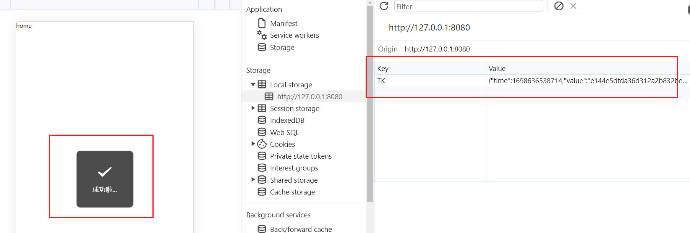
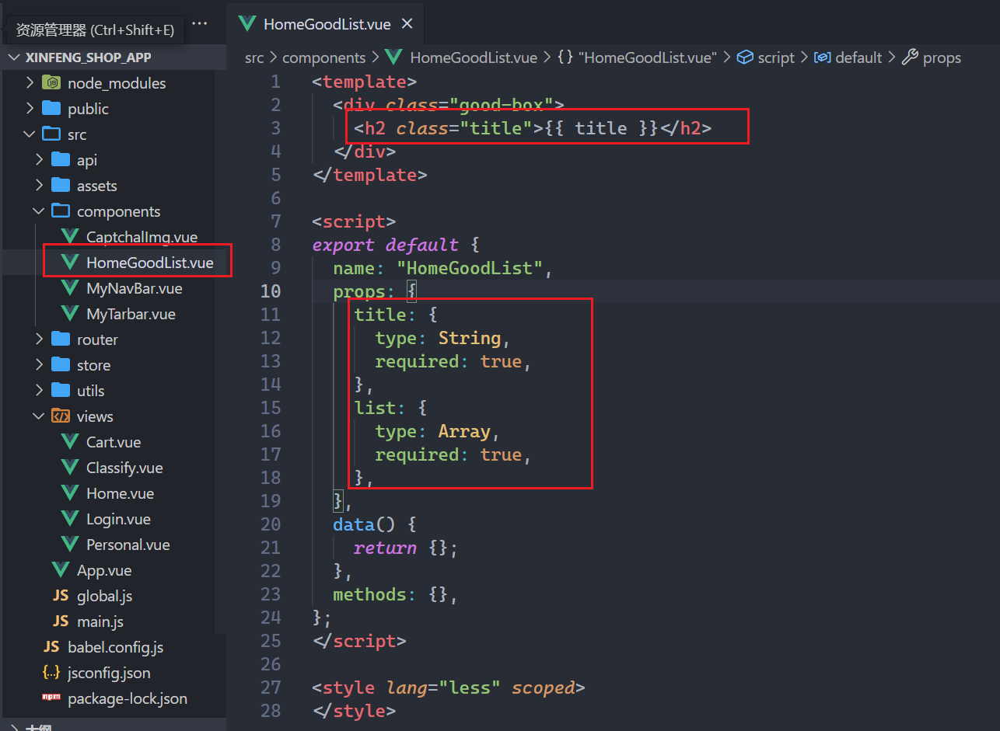

## 一，项目介绍

### 1，项目介绍

开源GitHub项目地址：https://github.com/newbee-ltd

项目访问地址：http://47.99.134.126:5000/

账号密码：

* 已注册账号：18333333334
* 密码：123456

### 2，项目分析

五大组件与路由分析：

* 首页面组件  Home.vue
* 分类组件  Classify.vue
* 购物车组件  Cart.vue
* 我的组件  Personal.vue
* 登录组件  Login.vue

network面板分析登录接口：


application面板分析：


### 3，项目的骨架

我把项目中使用到的依赖，都记录好，把骨架发给大家，大家基于这个骨架进行开发，如下：


大家，需要解压，安装依赖（跑环境）：

```shell
npm i 
```

运行项目（看package.json）：

```shell
npm run serve
```

## 二，搭建五大组件并配置路由

### 1，创建出五大组件

组件分两类：

* 页面级别的组件（路由级别的组件）
* 通用组件（小组件，多个页面中可能都会用到）

上面分析的5大组件，是路由级别的，一般情况下，会放到views文件夹中，或者是pages文件夹中，如下：


配置路由，如下：


参考代码如下：

```js
import Vue from 'vue'
import VueRouter from 'vue-router'

Vue.use(VueRouter)

let routes = [{
        path: '/',
        redirect: '/home'
    },
    {
        path: '/home',
        component: () => import('../views/Home.vue'),
    },
    {
        path: '/classify',
        component: () => import('../views/Classify.vue'),
    },
    {
        path: '/cart',
        component: () => import('../views/Cart.vue'),
    },
    {
        path: '/personal',
        component: () => import('../views/Personal.vue'),
    },
    {
        path: '/login',
        component: () => import('../views/Login.vue'),
    }
]

const router = new VueRouter({
    routes
})

export default router;
```

在main.js中引入，挂载到根组件上，如下：


在App.vue中，需要指定出口，如下：


浏览器测试之，如下：


### 2，Vant组件库的使用

vant组件库，提供了大量的组件，可以方便我们快速构建项目。<br/>

vant的官网：https://vant-contrib.gitee.io/vant/#/zh-CN/  <br/>

如果是vue2，参考文档：https://vant-contrib.gitee.io/vant/v2/#/zh-CN/   <br/>

如果是vue3，参考文档：https://vant-contrib.gitee.io/vant/#/zh-CN   <br/>

要使用vant中提供的组件，引入方式，分三种：

* 自动按需引入（推荐）
* 手动按需引入
* 全部引入

如何实现自动按需引入？看看文档(文档怎么说就怎么做)：

* 地址：https://vant-contrib.gitee.io/vant/v2/#/zh-CN/quickstart

操作步骤如下：


操作之，如下：


重启项目，然后引入一个Button组件，测试之，如下：


浏览器测试之，如下：


在src下面创建一个utils文件夹，里面创建一个vant.js，如下：


参考代码如下：

```js
import Vue from "vue"
import {
    Button,
    Tabbar,
    TabbarItem,
    ShareSheet,
    Icon,
    Form,
    Field,
    NavBar,
    Swipe,
    SwipeItem,
    Grid,
    GridItem,
    GoodsAction,
    GoodsActionIcon,
    GoodsActionButton,
    Checkbox,
    Stepper,
    SubmitBar,
    AddressList,
    AddressEdit,
    Area,
    Tab,
    Tabs,
    List,
    Cell,
    SwipeCell,
    Card,
    Dialog,
    Toast,
    ContactCard,
    ActionSheet,
    Loading,
    divider,
    Search,
    sidebar,
    SidebarItem,
    grid
} from 'vant'

[
    Button,
    Tabbar,
    TabbarItem,
    ShareSheet,
    Icon,
    Form,
    Field,
    NavBar,
    Swipe,
    SwipeItem,
    Grid,
    GridItem,
    GoodsAction,
    GoodsActionIcon,
    GoodsActionButton,
    Checkbox,
    SubmitBar,
    AddressList,
    AddressEdit,
    Area,
    Stepper,
    Tab,
    Tabs,
    List,
    Cell,
    SwipeCell,
    Card,
    Dialog,
    Toast,
    ContactCard,
    ActionSheet,
    Loading,
    divider,
    Search,
    sidebar,
    SidebarItem,
    grid

].forEach(item => {
    Vue.use(item)
})
```

在main.js中引入vant.js，如下：


再次测试之，如下：


昨天讲了移动端适配：

* rem + 媒体查询来适配
* rem + 自己写的JS来适配
* rem + 淘宝的flexible来适配
* vw + vh适配 

在脚本架中，要适配的话，上面的方式都可以不用，可以配置postcss，如下：


### 3，处理全局样式

引入重置样式，如下：


设置App.vue组件的样式，如下：


浏览器效果如下：


## 三，封装TabBar组件

### 1，封装TabBar组件

我们需要封装的Tabbar组件如下：


要去写一个组件，先去UI组件库中找一下，有没有对应的组件，如下：


把Tabbar再封装一下，封装的通用组件就放在components中，如下(首页的to的值应该是/home)：


参考代码如下：

```vue
<template>
  <van-tabbar route active-color="#1baeae">
    <van-tabbar-item to="/home" icon="home-o">首页</van-tabbar-item>
    <van-tabbar-item to="/classify" icon="apps-o">分类</van-tabbar-item>
    <van-tabbar-item to="/cart" icon="shopping-cart-o" badge="5">购物车</van-tabbar-item>
    <van-tabbar-item to="/personal" icon="manager-o">我的</van-tabbar-item>
  </van-tabbar>
</template>

<script>
export default {
  name: "MyTarbar",
  props: [],
  data() {
    return {};
  },
  methods: {},
};
</script>

<style lang="less" scoped>
</style>
```

在App.vue中使用之，如下：


浏览器效果如下：


调整一下TabBar最大宽度，如下：


在main.js，引入flexble，引入vant的样式，如下：


浏览器效果如下：


### 2，控制Tabbar的显示与隐藏

当访问login组件时，不需要显示Tabbar，如下：


肯定要控制Tabbar的显示与隐藏，代码如下：


浏览器测试之，如下：


### 3，防止Tabar盖住页面内容

在首页面组件中写如下内容：


给#app的那个div添加一个padding-bottom，还不能直接添加，Login组件中没有Tabbar，也就是说有Tabbar时，需要添加，没有Tabbar时，不需要添加，代码如下：


绑定自定义事件，如下：


书写bottom这个类名，如下：


浏览器测试之，如下：


换成login组件，如下：


## 四，注册登录模块实现

### 1，绘制登录页面

目标：


找到vant中的导航组件，如下：


使用之，如下：


logo区域，如下:


实现样式，如下：


实现表单区域，如下：

```vue
<template>
  <div class="login-box">
    <!-- 导航 -->
    <van-nav-bar
      :title="isLogin ? '登录' : '注册'"
      left-text="返回"
      left-arrow
    />
    <!-- Logo -->
    

    <!-- 表单 -->
    <van-form validate-first @submit="submit" ref="formRef">
      <van-field
        v-model.trim="ruleForm.loginName"
        name="loginName"
        placeholder="请输入用户名"
        label="手机号"
        :rules="[
          { pattern: /^(?:(?:\+|00)86)?1\d{10}$/, message: '手机号格式有误' },
        ]"
      />
      <van-field
        v-model.trim="ruleForm.password"
        name="password"
        placeholder="请输入密码"
        label="密码"
        :rules="[{ required: true, message: '密码是必填项' }]"
      />
      <van-field
        v-model.trim="ruleForm.captcha"
        name="captcha"
        label="验证码"
        :rules="[{ validator: validatorCaptcha, message: '验证码输入有误' }]"
      >
        <template #button> 验证码（一会再说） </template>
      </van-field>

      <a href="javascript:;" class="text" @click="changeLogin">
        {{ isLogin ? "还没账号,请点此注册" : "已有账号,请点此登录" }}
      </a>
      <div style="margin: 16px">
        <van-button round block color="#1baeae" native-type="submit">
          确认提交
        </van-button>
      </div>
    </van-form>
  </div>
</template>

<script>
import logo from "@/assets/images/newbee-mall-vue3-app-logo.png";
export default {
  name: "Login",
  props: [],
  data() {
    return {
      logo,
      isLogin: true,
      ruleForm: {
        loginName: "", // 用户名
        password: "", // 密码
        captcha: "", // 验证码
      },
    };
  },
  methods: {
    changeLogin() {
      this.isLogin = !this.isLogin;
    },
    validatorCaptcha() {},
    async submit() {},
  },
};
</script>

<style lang="less" scoped>
.login-box {
  padding: 0 20px;
  .logo {
    width: 140px;
    height: 140%;
    display: block;
    margin: 40px auto 20px;
  }
  .text{
    display: block;
    margin-top: 20px;
    margin-bottom: 20px;
    padding: 0 15px;
    color: #1989fa;
    font-size: 14px;
  }
}
</style>
```

浏览器效果如下：


如果就想修改vant组件的样式，可以这样做，如下：


### 2，封装NavBar

在很多页面中都会使用到NavBar，封装一下，全局注册，封装如下：


全局注册之，如下：


在Login.vue中使用之，如下：


处理一下MyNavBar的样式，直接上代码，MyNavBar.vue如下：

```vue
<template>
  <div>
    <!-- 导航 -->
    <van-nav-bar
      fixed
      style="max-width: 540px"
      left-arrow
      @click-left="handleBack"
      safe-area-inset-top
      class="center-x"
    >
      <template #title>
        <span class="text">
          {{ title }}
        </span>
      </template>
      <template #right>
        <van-icon name="ellipsis" />
      </template>
    </van-nav-bar>
  </div>
</template>

<script>
export default {
  name: "MyNavBar",
  props: ["title"],
  data() {
    return {};
  },
  methods: {
    handleBack() {
      // 从哪来回哪去即可
      this.$router.back();
    },
  },
};
</script>
<style lang="less" scoped>
.text {
  font-weight: normal;
  font-size: 14px;
}
:deep(.van-nav-bar__title) {
  width: 70%;
  max-width: 70%;
}

.van-nav-bar{
  :deep(.van-icon){
    color: #000;
    font-size: 18px;
  } 
}
</style>
```

浏览器效果如下：


添加padding-top，如下：


点击右边的三个点，实现分享面板的显示，直接上代码：

```vue
<template>
  <div>
    <!-- 导航 -->
    <van-nav-bar
      fixed
      style="max-width: 540px"
      left-arrow
      @click-left="handleBack"
      safe-area-inset-top
      class="center-x"
    >
      <template #title>
        <span class="text">
          {{ title }}
        </span>
      </template>
      <template #right>
        <van-icon name="ellipsis" @click="isShare = true" />
      </template>
    </van-nav-bar>

    <!-- 分享 -->
    <van-share-sheet
      v-model="isShare"
      :options="options"
      title="立即分享给好友"
    />
  </div>
</template>

<script>
export default {
  name: "MyNavBar",
  props: ["title"],
  data() {
    return {
      isShare: false,
      options: [
        [
          { name: "微信", icon: "wechat" },
          { name: "朋友圈", icon: "wechat-moments" },
          { name: "微博", icon: "weibo" },
          { name: "QQ", icon: "qq" },
        ],
        [
          { name: "复制链接", icon: "link" },
          { name: "分享海报", icon: "poster" },
          { name: "二维码", icon: "qrcode" },
          { name: "小程序码", icon: "weapp-qrcode" },
        ],
      ],
    };
  },
  methods: {
    handleBack() {
      // 从哪来回哪去即可
      this.$router.back();
    },
  },
};
</script>
<style lang="less" scoped>
.text {
  font-weight: normal;
  font-size: 14px;
}
:deep(.van-nav-bar__title) {
  width: 70%;
  max-width: 70%;
}

.van-nav-bar {
  :deep(.van-icon) {
    color: #000;
    font-size: 18px;
  }
}
</style>
```

浏览器效果如下：


现在，在main.js中写了很多代码，把全局相关的代码放到一个单独的JS文件中，如下：


### 3，验证码

验证可以在后端实现，也可以在前端实现，这里我们就在前端实现，前端要实现验证码，方法也有很多，介绍一个：


本次课，提前在网上找到一个验证码组件，是使用canvas绘制的，如下：


参考代码：

```vue
<template>
  <div class="captcha-box" ref="captchaBox">
    <canvas
      :width="width"
      :height="height"
      ref="canvasBox"
      @click="createCaptcha"
    ></canvas>
  </div>
</template>

<script>
const createRandom = (min, max) => {
  return Math.round(Math.random() * (max - min) + min);
};
const createRandomCaptcha = (num = 4) => {
  const chars =
    "0123456789abcdefghijklmnopqrstuvwxyzABCDEFGHIJKLMNOPQRSTUVWXYZ";
  let captcha = "",
    i = 0;
  while (i < num) {
    let random = createRandom(0, 61),
      char = chars[random];
    if (captcha.includes(char)) continue;
    captcha += char;
    i++;
  }
  return captcha;
};
const createRandomColor = (min, max) => {
  const r = createRandom(min, max),
    g = createRandom(min, max),
    b = createRandom(min, max);
  return `rgb(${r},${g},${b})`;
};

export default {
  name: "CaptchaImg",
  inheritAttrs: false,
  data() {
    return {
      width: 120,
      height: 40,
    };
  },
  methods: {
    createCaptcha() {
      // 创建画布&随机验证码
      let canvas = this.$refs.canvasBox,
        ctx = canvas.getContext("2d"),
        captcha = createRandomCaptcha();
      // 填充画布颜色&位置
      ctx.fillStyle = createRandomColor(180, 230);
      ctx.fillRect(0, 0, canvas.width, canvas.height);
      // 验证码随机旋转
      [].forEach.call(captcha, (item, index) => {
        // 随机的字体大小&旋转角度
        const fontSize = createRandom(18, 36),
          deg = createRandom(-30, 30),
          x = canvas.width / (120 / 15),
          y = canvas.height / (40 / 15);
        ctx.font = `bold ${fontSize}px sans-serif`;
        ctx.textBaseline = "top";
        ctx.fillStyle = createRandomColor(80, 150);
        ctx.save();
        ctx.translate(x * 2 * index + x, y);
        ctx.rotate((deg * Math.PI) / 180);
        ctx.fillText(item, -x + 5, -y);
        ctx.restore();
      });
      // 随机产生5条干扰线,干扰线的颜色要浅一点
      for (let i = 0; i < 5; i++) {
        ctx.beginPath();
        ctx.moveTo(
          createRandom(0, canvas.width),
          createRandom(0, canvas.height)
        );
        ctx.lineTo(
          createRandom(0, canvas.width),
          createRandom(0, canvas.height)
        );
        ctx.strokeStyle = createRandomColor(180, 230);
        ctx.closePath();
        ctx.stroke();
      }
      // 随机产生40个干扰的小点
      for (let i = 0; i < 40; i++) {
        ctx.beginPath();
        ctx.arc(
          createRandom(0, canvas.width),
          createRandom(0, canvas.height),
          1,
          0,
          2 * Math.PI
        );
        ctx.closePath();
        ctx.fillStyle = createRandomColor(150, 200);
        ctx.fill();
      }
      // 最后修改父组件的状态值
      if (this.$listeners.input) {
        this.$emit("input", captcha);
      }
    },
  },
  mounted() {
    this.reset = () => {
      // 动态计算canvas的大小
      let captchaBox = this.$refs.captchaBox,
        sty = getComputedStyle(captchaBox);
      this.width = Math.floor(parseFloat(sty.width));
      this.height = Math.floor(parseFloat(sty.height));
      this.$nextTick(() => {
        // 开始绘图
        this.createCaptcha();
      });
    };
    this.reset();
    window.addEventListener("resize", this.reset);
  },
  destroyed() {
    if (this.reset) window.removeEventListener("resize", this.reset);
  },
};
</script>

<style lang="less" scoped>
.captcha-box {
  width: 120px;
  height: 40px;
  overflow: hidden;

  canvas {
    display: block;
    width: 100%;
    height: 100%;
  }
}
</style>
```

在Login.vue中引入验证码组件，如下：


对于验证码的校验，定义了一个自定义校验函数，如下：


实现校验函数，如下：


浏览器效果如下：


### 4，axios二次封装

在真实项目中，都会对axios进行二次封装，一般在项目根目录下创建一个api文件，里面http.js文件，此文件就是对axios进行二次封装，如下：


参考代码：

```js
import axios from "axios";
import _ from '@/assets/utils';
import {
    Notify
} from 'vant';

let http = axios.create({
    // 没有写协议，域名，端口，默认是向本服务器发请求
    // 本服务器：http://127.0.0.1:8080/
    baseURL: "/api",
    // 超时处理，如果超时了，会自动的取消请求
    timeout: 60000
});

// 请求拦截器  ngprogress
// /home  /classify   /login
// /cart
const safeArr = ["/home", "/classify", "/login"];
http.interceptors.request.use(config => {

    // 有的接口，需要带token去访问，token是用来身份认证的，登录了，服务器就返回一个token
    // 我们把token存储到localstorage中，后面要用token，直接从localStorage中获取
    // 有些接口，你需要带个token去访问，如果不带，身份认证失败，接口调用不成功
    // token一般情况下，是放在请求头中

    // 有些接口，不需要登录就以访问，有些接口，必须登录后，有了token才能访问

    let TK = _.storage.get('TK'); // 如果拿不到token，得到null
    if (TK && !safeArr.includes(config.url)) {
        config.headers['token'] = TK;
    }

    return config;
})

// 响应拦截器
http.interceptors.response.use(response => {
    return response.data;
}, reason => {
    Notify({
        type: 'danger',
        message: '网络繁忙，稍后再试~'
    });
    return Promise.reject(reason);
})

export default http;
```

写项目：promise + ajax + vue基础 + vuex + vue-router

### 5，API封装

一个项目，可能有几十个，上百个，或几百个接口，如果项目，把接口地址直接写在组件中，就乱，如果后端改了接口地址，你还需要从组件中找哪个地方，调用了接口，不方便。通常我们会把接口地址统一放在一个地方进行管理，如下：


然后，我们可以在组件中调用上面的方法，当然也可以在vuex中调用，先在组件中调用之，如下：


把API对象，放到Vue原型上，如下：


再次测试之，如下：


### 6，代理解决跨域

上面调接口，确实成功了，但是前后端是不同域的，如下：


看一下我们刚才请求的url，如下：


如果出现跨域问题了，浏览器会提示如下：


虽然本项目中后端配置了解决跨域问题，我们依然配置一个代理，主要是演示一下代理如何使用，如下：


动了配置文件，需要重启服务，如下：


浏览器测试之，如下：


打开代理，重启服务器，如下：


再次测试之，如下：


再去封装两个接口，一个是登录接口，一个是注册接口，先分析登录接口，如下：


代码实现如下：


### 7，登录和注册实现

点击注册和登录时，需要清空表单，如下：


然后，实现登录和注册，如下：


浏览器测试之，如下：



### 8，获取用户信息并存储到Vuex中

登录成功后，先调用一个获取用户信息的接口，如下：


把token放在请求头中，传给服务器，如下：


封装一个API接口，如下：


如果登录成功了，判断出在哪里登录成功了，就可以在这里发ajax请求，获取用户信息。后面有很多组件，都会使用到用户信息，直接把用户信息存储到vuex中，创建仓库，如下：


在main.js中把store挂载到根上，如下：


在登录成功后，要派发上面的action，如下：


浏览器测试之，如下：


然后，需要commit一个mutation，把用户信息存储到vuex中，如下：


浏览器再次测试之，如下：


vuex，还有一个插件，通过这个插件，可以在console面板中查看仓库中的状态变化，使用插件，如下：


为了测试方法，直接把用户名和密码写死在代码中，测试之，如下：


vuex中的数据是存储在内存中的：


## 五，首页面渲染

### 1，首页面的头部渲染

需求 ：


组件结构实现如下：


实现组件的样式如下：

```vue
<template>
  <div class="home-box">
    <!-- 头部导航 -->
    <nav class="nav-box">
      <div class="menu" @click="$router.push('/category')">
        <van-icon name="wap-nav" />
      </div>
      <div class="content" @click="$router.push('/search')">
        <h1 class="title">新蜂商城</h1>
        <span class="text">山河无恙，人间皆安</span>
      </div>
      <div class="login">
        <router-link to="/login" v-if="!$store.state.profile">登录</router-link>
        <router-link to="/personal" v-else>
          <van-icon name="manager" />
        </router-link>
      </div>
    </nav>
  </div>
</template>

<script>
export default {
  name: "Home",
  mounted() {
    this.$API.queryIndexInfo();
    this.$toast.success("成功啦...");
  },
  props: [],
  data() {
    return {};
  },
  methods: {},
};
</script>

<style lang="less" scoped>
.nav-box {
  display: flex;
  justify-content: space-between;
  align-items: center;

  padding: 0 15px;
  box-sizing: border-box;
  width: 100%;
  height: 50px;
  overflow: hidden;
  position: fixed;
  top: 0;
  left: 50%;
  transform: translateX(-50%);
  background: transparent;

  .menu {
    font-size: 20px;
    color: #1baeae;
  }

  .content {
    display: flex;
    align-items: center;
    box-sizing: border-box;
    width: 256px;
    height: 30px;
    border-radius: 15px;
    background: rgba(255, 255, 255, 0.5);

    .title {
      padding: 0 10px;
      color: #1baeae;
      font-size: 18px;
      border-right: 1px solid #ddd;
    }

    .text {
      padding: 0 10px;
      font-size: 12px;
      color: #999;
    }
  }
  .login {
    a {
      color: #1baeae;
      font-size: 15px;
      i {
        font-size: 20px;
      }
    }
  }

  &.active {
    background-color: #1baeae;
    .menu,
    .login a {
      color: #fff;
    }
    .content {
      .title {
        border-right-color: #999;
      }
    }
  }
}
</style>
```

### 2，实例轮播图

需求：


找到vant中的轮播图，如下：


定义轮播图状态，发请求，获取数据，给请求赋值，这里的请求，我们就不放在vuex中的action中，直接在组件中发请求，如下：


浏览器测试之，如下：


渲染数据，如下：


### 3，渲染宫格

需求：


数据直接写死，没有对应的接口，如下：


参考代码：

```js
  {
      text: "新蜂超市",
      icon: require("@/assets/images/supermarket.png"),
  }, {
      text: "新蜂服饰",
      icon: require("@/assets/images/dress.png"),
  }, {
      text: "全球购",
      icon: require("@/assets/images/purchasing.png"),
  }, {
      text: "新蜂生鲜",
      icon: require("@/assets/images/fresh.png"),
  }, {
      text: "新蜂到家",
      icon: require("@/assets/images/complete.png"),
  }, {
      text: "充值缴费",
      icon: require("@/assets/images/pay.png"),
  }, {
      text: "9.9元拼",
      icon: require("@/assets/images/together.png"),
  }, {
      text: "领劵",
      icon: require("@/assets/images/collect_coupons.png"),
  }, {
      text: "省钱",
      icon: require("@/assets/images/save_money.png"),
  }, {
      text: "全部",
      icon: require("@/assets/images/whole.png"),
  }
```

定义状态，如下：


渲染之，如下：


### 4，商品列表

商品列表如下：


创建一个组件，叫HomeGoodList.vue，如下：



在首页面中，引入，注册，使用之如下：


浏览器测试之，如下：


看vue调试工具，如下：


把商品数据遍历出来，如下：


样式如下：


参考代码：

```less
<style lang="less" scoped>
.good-box {
  & > .title {
    color: @theme;
    font-size: 16px;
    line-height: 50px;
    text-align: center;
    background: #f9f9f9;
  }

  :deep(.van-grid-item__content) {
    padding: 10px;
  }

  .van-image {
    width: 120px;
    height: 120px;
  }

  .desc {
    padding: 10px 0;

    .title,
    .price {
      font-weight: normal;
      font-size: 14px;
      line-height: 22px;
      // 超出两行文字后，实现自动截取
      display: -webkit-box;
      -webkit-box-orient: vertical;
      -webkit-line-clamp: 2;
      overflow: hidden;
    }

    .title {
      max-height: 44px;
    }

    .price {
      text-align: center;
      color: @theme;
    }
  }
}
</style>
```

现在有个问题，有的图片没有显示，如下：


大概率就是路径问题，分析一下：


前端拼接好路径，使用混入解决，给所有的组件中都混入一个方法，如下：


在使用到图片的位置，都可以使用上面的方法了，如下：


再次测试之，如下：


再去优化一下，当数据还没有回来，显示骨架屏，如下：


在global.js中配置赖加载，如下：


使用之，如下：


### 5，头部样式处理

需求：


类名如下：


在里面绑定scroll事件呢？答：在mounted中绑定，在destoryed中绑定。如下：


在nav中使用状态，如下：


浏览器测试之，如下：


使用节流函数，如下：


浏览器测试之，如下：


## 六，渲染分类页

### 1，分析分类页面的接口

第一次点击分类时，需要调用接口，后面再去点击，不需要调用接口，因为我们需要把分类页面缓存起来。第一次调用接口，如下：


再去分析响应的数据，如下：

```json
{
    "categoryId": 15,
    "categoryLevel": 1,
    "categoryName": "家电 数码 手机",
    "secondLevelCategoryVOS": [
        {
            "categoryId": 17,
            "parentId": 15,
            "categoryLevel": 2,
            "categoryName": "家电",
            "thirdLevelCategoryVOS": [
                {
                    "categoryId": 20,
                    "categoryLevel": 3,
                    "categoryName": "生活电器"
                },
                {
                    "categoryId": 110,
                    "categoryLevel": 3,
                    "categoryName": "wer"
                },
            ]
        }
    ]
}
```

封装API接口，如下：


### 2，把分类数据存储到vuex

在vuex中的action中调用接口，获取到数据后，把数据存储到vuex中，并把vuex分模块，如下：


在store/index.js，使用modules中合并子store，如下：


在组件中，派发仓库中的action，如下：


测试之，如下：


上面的是在控制台中查看，你在vuex中也可以可看，如下：


现在就相当于把分类的数据存储到了Vuex中。然后，就需要渲染数据。

### 3，渲染分类数据

现在有数据了，数据在vuex中，开始绘制页面，先绘制头部，如下：


直接给插槽中插入内容：


现在就需要完善一下，my-nav-bar组件，如下：


浏览器效果如下：


写一点样式，把直角变成圆角，如下：


开始绘制内容区域(Classify.vue)：

```vue
<template>
  <div class="classify-box">
    <!-- 头部导航 -->
    <my-nav-bar>
      <template #title>
        <van-search
          placeholder="搜索需要的产品"
          @click.native="$router.push('/search')"
        />
      </template>
    </my-nav-bar>

    <!-- 内容区域 -->
    <van-skeleton title :row="5" v-if="categories.length === 0" />
    <div class="main-box" v-else>
      <van-sidebar v-model="activeKey">
        <van-sidebar-item
          v-for="item in categories"
          :key="item.categoryId"
          :title="item.categoryName"
        />
      </van-sidebar>
    </div>
  </div>
</template>

<script>
import { mapState, mapActions } from "vuex";
export default {
  name: "Classify",
  props: [],
  computed: {
    // ...mapState(["list"])

    ...mapState({
      // categories可以是
      categories: (state) => state.category.list || [],
    }),
  },
  data() {
    return {
      activeKey: 0,
    };
  },
  methods: {
    ...mapActions(["category/setListAsync"]),
  },
  created() {
    if (this.categories.length == 0 || !this.categories) {
      this["category/setListAsync"]();
    }
  },
};
</script>

<style lang="less" scoped>
.van-search {
  padding: 0;
  width: 100%;
  .van-search__content {
    border-radius: 19px;
  }
}

.van-skeleton {
  margin-top: 66px;
}

.classify-box {
  padding-top: 46px;
  box-sizing: border-box;
  height: calc(100vh - 50px);
  overflow: hidden;
}

.main-box {
  height: 100%;
  display: flex;
  .van-sidebar {
    width: 120px;
    height: 100%;
    background-color: #f7f8fa;
    .van-sidebar-item {
      padding: 15px 10px;
    }
    .van-sidebar-item--select:before {
      background-color: @theme;
    }
  }
}
</style>
```

浏览器效果如下：


还需要把右侧的数据渲染出来，如下：

```vue
<template>
  <div class="classify-box">
    <!-- 头部导航 -->
    <my-nav-bar>
      <template #title>
        <van-search
          placeholder="搜索需要的产品"
          @click.native="$router.push('/search')"
        />
      </template>
    </my-nav-bar>

    <!-- 内容区域 -->
    <van-skeleton title :row="5" v-if="categories.length === 0" />
    <div class="main-box" v-else>
      <!-- 左边 -->
      <van-sidebar v-model="activeKey">
        <van-sidebar-item
          v-for="item in categories"
          :key="item.categoryId"
          :title="item.categoryName"
        />
      </van-sidebar>
      <!-- 右边 -->
      <div class="content">
        <div class="classify" v-for="item in contentArr" :key="item.categoryId">
          <h3 class="title">{{ item.categoryName }}</h3>
          <div class="list">
            <router-link
              v-for="cur in item.thirdLevelCategoryVOS"
              :key="cur.categoryId"
              to="/"
            >
              <van-image :src="classify" lazy-load />
              <span>{{ cur.categoryName }}</span>
            </router-link>
          </div>
        </div>
      </div>
    </div>
  </div>
</template>

<script>
import classify from "@/assets/images/classify.png";
import { mapState, mapActions } from "vuex";
export default {
  name: "Classify",
  props: [],
  computed: {
    // ...mapState(["list"])

    ...mapState({
      // categories可以是
      categories: (state) => state.category.list || [],
    }),

    contentArr() {
      let { activeKey, categories } = this;
      let item = categories[activeKey];
      if (!item) return [];
      return item.secondLevelCategoryVOS || [];
    },
  },
  data() {
    return {
      classify,
      activeKey: 0,
    };
  },
  methods: {
    ...mapActions(["category/setListAsync"]),
  },
  created() {
    if (this.categories.length == 0 || !this.categories) {
      this["category/setListAsync"]();
    }
  },
};
</script>

<style lang="less" scoped>
.van-search {
  padding: 0;
  width: 100%;
  .van-search__content {
    border-radius: 19px;
  }
}

.van-skeleton {
  margin-top: 66px;
}

.classify-box {
  padding-top: 46px;
  box-sizing: border-box;
  height: calc(100vh - 50px);
  overflow: hidden;
}

.main-box {
  height: 100%;
  display: flex;

  .van-sidebar {
    width: 120px;
    height: 100%;
    background-color: #f7f8fa;
    .van-sidebar-item {
      padding: 15px 10px;
    }
    .van-sidebar-item--select:before {
      background-color: @theme;
    }
  }

  .content {
    width: 255px;
    height: 100%;
    overflow-x: hidden;
    overflow-y: auto;

    .classify {
      margin-bottom: 10px;

      .title {
        padding-left: 15px;
        font-size: 16px;
        line-height: 40px;
        margin-bottom: 15px;
      }

      .list {
        display: flex;
        flex-wrap: wrap;
        padding: 0 10px;

        a {
          margin-right: 2%;
          margin-bottom: 10px;
          width: 32%;

          .van-image {
            display: block;
            margin: 0 auto;
            width: 30px;
            height: 30px;
          }

          span {
            display: block;
            text-align: center;
            line-height: 30px;
            color: #555;
          }

          &:nth-child(3n) {
            margin-right: 0;
          }
        }
      }
    }
  }
}
</style>
```

浏览器效果如下 ：


## 七，搜索页面实现

### 1，创建搜索页面并配置路由

点击首页面的搜索按钮和 点击分类页面中的搜索按钮，会去到/search路由，如下：


创建搜索页面组件，如下：


配置路由，如下：


浏览器测试之，如下：


### 2，绘制Search页面

看一下官网实现的Search页面，如下：


我们要实现的效果如下：


先绘制头部，如下：


先完善一下MyNavBar组件，如下：


代码如下 ：


添加样式，如下：


绘制操作栏，如下：


也是vant中现在的组件，如下：


代码如下：


内容区域：


