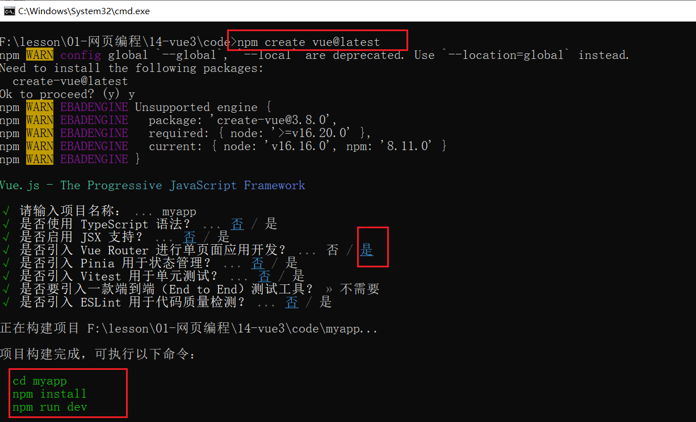

## 一，Vue3互动教程

### 1，Vue3介绍

Vue3文档地址：https://cn.vuejs.org/


Vue特点：


易学易用

* API设计简单，好上手，也是Vue很火的原因

性能出色

* proxy，精准更新，diff算法....

灵活多变

* 渐进式，可大可小的项目都可以做，可以逐步集成很多第三方的依赖

**你是如何理解vue2？**

* vue是数据驱动视图（响应式原理）
* vue2是选项式API（一堆的选项）
* 组件化开发（自定义属性，自定义事件，自定义插槽，选项式API，组件通信）
* 十几个指令（内置指令），指令的本质是对DOM操作的封装......
* 五大内置组件（slot, transition, component, keep-alive, transition-group）
* 复用技巧（组件，混入，过滤器，自定义指令，插件，原型链....）
* 图：组件的生命周期图，MVVM图，Vuex图，响应式原理图...

**技术栈官网**

* 技术栈：Vue3+VueRouter4+Pinia2+Vant3/ElementPlus
* 1、Vue3官网：https://vuejs.org/
* 2、VueRouter(V4)：https://router.vuejs.org/
* 3、Pinia(V2)：https://pinia.vuejs.org/
* 4、Vite构建工具：https://vitejs.dev/
* 5、ElementPlus：https://element-plus.gitee.io/zh-CN/
* 6、Vant(v3)：https://vant-contrib.gitee.io/vant/#/zh-CN

### 2，创建Vue3项目

命令：

```shell
 npm create vue@latest
```

演示一下：



进入项目，安装依赖，运行项目，如下：


运行起来后如下：


浏览器测试之，如下：


使用vscode打开项目，如下：


目录分析：

* vite.config.js 是Vite官方配置文件，各种配置参考Vite官网。
* index.html 是SPA挂载的根页面
* main.js 是入口文件
* App.vue 是根组件（SFC单文件组织）
* src 文件夹 是源码目录
  + views 放路由级别的组件
  + compoents 放通用组件
  + router 放路由相关的
  + store 放仓库相关的
  + api  封装API接口相关的
  + utils 放工具函数

在开发Vue3，在VSCode中还需要安装插件，如下：


项目创建完毕了，然后就要学习知识点了，看文档，如下：


互动教程，如下：


### 3，声明式渲染

**四种语法范式：**

* 选项式写法：完成支持Vue2写法，我们之前学习的Vue2的写法就是选项式写法
* 组合式写法：只使用setup()，把组合式API写在setup中就是组合式写法
* 选项式+组合式写法：可以使用setup()+选项式写法
* 组合式语法糖写法：在script标签上添加setup，只支持组合式写法，规避选项式写法。

**选项式写法：**


参考代码：

```vue
<template>
  <h1>选项式API写法</h1>
  <h1 v-text="num"></h1>
  <button @click="add">+1</button>
</template>

<script>
export default {
  data() {
    return {
      num: 0,
    };
  },
  methods: {
    add() {
      this.num++;
    },
  },
};
</script>

<style scoped>
</style>
```

**组合式写法:(了解)**


参考代码：

```vue
<template>
  <h1>选项式API写法</h1>
  <h1 v-text="num"></h1>
  <button @click="add">+1</button>
</template>

<script>
// ref是组合式API
import { ref } from "vue";

export default {
  // Vue3的选项写法：对Vue2范式完全兼容，可以同时使用setup和选项，也可只使用setup。
  // 官方已经不推荐使用这种选项写法了。选项写法，都有对应的组合API来实现。
  // 解读setup这个选项：相当于Vue2中的created()，可以理解成是组件生命周期的第一阶段；setup(props,context)，context表示上下文，为什么在setup中要有一个上下文对象，因为在setup选项中没有this。
  setup(props, context) {
    // setup是组合式API的入口
    const num = ref(1);

    //num是调用ref函数之后的结果，它是一个对象
    // 不能直接num++  num.value才是响应式数据的值
    // 在模板中，它会自动的.value
    const add = () => {
      num.value++;
    };

    return {
      num,
      add,
    };
  },
};
</script>

<style scoped>
</style>
```

**选项式和组合式混写：（了解）**


参考代码：

```vue
<template>
  <h1>选项式+组合式API写法</h1>
  <h1 v-text="num"></h1>
  <button @click="add">+1</button>
</template>

<script>
import { ref } from "vue";
// 非常不推荐这种写法
export default {
  // 组合选项
  setup(props, context) {
    const num = ref(1);
    return {
      num,
    };
  },
  methods: {
    add() {
      this.num++;
    },
  },
};
</script>
```

**组合式语法糖写法(推荐):**


参考代码：

```vue
<template>
  <h1>组合式语法糖写法</h1>
  <h1 v-text="num"></h1>
  <button @click="add">+1</button>
</template>

<script setup>
import { ref } from "vue";

const num = ref(10);

const add = () => {
  num.value++;
};
</script>
```

官方文档教程，如下：


### 3，Atribute绑定

试着把一个动态的 `class` 绑定添加到这个 `<h1>` 上，并使用 `titleClass` 的 ref 作为它的值。如果绑定正确，文字将会变为红色。代码如下：


### 5，表单绑定与双向绑定

直接上代码：


什么是双向绑定？什么是单向绑定？

* 单向绑定：数据驱动视图，通过ref或reactive定义的响应式数据，数据发生变化时，模板会自动刷新。
* 双向绑定：数据驱动视图，视图驱动数据。    v-model=@input + :value

### 6，条件渲染

直接看文档，如下：


### 7，列表渲染

直接写todo案例，如下：


参考代码：

```vue

<template>
  <form @submit.prevent="addTodo">
    <input type="text" v-model="newTodo" />
    <!-- <button @click="addTodo">Add Todo</button> -->
    <button>Add Todo</button>
  </form>
  <ul>
    <li v-for="todo in todos" :key="todo.id">
      {{ todo.text }}
      <button @click="removeTodo(todo)">X</button>
    </li>
  </ul>
</template>

<script setup>
import { ref, reactive } from "vue";

let id = 0; // 给每个 todo 对象一个唯一的 id

const newTodo = ref("");
const todos = ref([
  { id: id++, text: "Learn HTML" },
  { id: id++, text: "Learn JavaScript" },
  { id: id++, text: "Learn Vue" },
]);

const removeTodo = (todo) => {
  // console.log("todo:",todo.id);
  let idx = todos.value.findIndex(item=>item.id === todo.id);
  todos.value.splice(idx,1)
};

const addTodo = () => {
  if (!newTodo.value.trim().length) return alert("输入框不能为空~"); 
  todos.value.push({ id: id++, text: newTodo.value });
  newTodo.value = "";
};
</script>
```

为什么 key的值不能为索引？

### 8，计算属性

计算属性就是根据已有的状态，计算出一个新的状态。我们可以把模板中的复杂计算抽离到计算属性中，让模板看上去更优雅。计算属性有缓存，当计算属性依赖的状态发生了变化，才会重新计算。

官方写的：

* 计算属性会自动跟踪其计算中所使用的到的其他响应式状态，并将它们收集为自己的依赖。计算结果会被缓存，并只有在其依赖发生改变时才会被自动更新。

总结：

* 计算属性有缓存的特性。
* 只有它依赖的状态，变化的空间不大，计算属性的收益更高

直接上官方的案例：


参考代码：

```vue

<template>
  <form @submit.prevent="addTodo">
    <input type="text" v-model="newTodo" />
    <button>Add Todo</button>
  </form>
  <ul>
    <li v-for="todo in filterTodos" :key="todo.id">
      <input type="checkbox" v-model="todo.done" />
      <span :class="{ done: todo.done }"> {{ todo.text }}</span>
      <button @click="removeTodo(todo)">X</button>
    </li>
  </ul>
  <button @click="hideCompleted = !hideCompleted">
    {{ hideCompleted ? "Show all" : "Hide completed" }}
  </button>
</template>

<script setup>
import { ref, reactive, computed } from "vue";

let id = 0; // 给每个 todo 对象一个唯一的 id

const hideCompleted = ref(false);
const newTodo = ref("");
const todos = ref([
  { id: id++, done: true, text: "Learn HTML" },
  { id: id++, done: true, text: "Learn JavaScript" },
  { id: id++, done: false, text: "Learn Vue" },
]);

const filterTodos = computed(() => {
  if (!hideCompleted.value) {
    return todos.value;
  }
  if (hideCompleted.value) {
    return todos.value.filter((todo) => {
      return !todo.done;
    });
  }
});

const removeTodo = (todo) => {
  // console.log("todo:",todo.id);
  let idx = todos.value.findIndex((item) => item.id === todo.id);
  todos.value.splice(idx, 1);
};

const addTodo = () => {
  if (!newTodo.value.trim().length) return alert("输入框不能为空~");
  todos.value.push({ id: id++, text: newTodo.value });
  newTodo.value = "";
};
</script>

<style>
.done {
  text-decoration: line-through;
}
</style>
```

### 9，生命周期与模板引用

目前为止，Vue 为我们处理了所有的 DOM 更新，这要归功于响应性和声明式渲染。然而，有时我们也会不可避免地需要手动操作 DOM。

这时我们需要使用**模板引用**——也就是指向模板中一个 DOM 元素的 ref。直接上代码：


参考代码：

```vue
<template>
  <!-- 此处的ref和我们讲面讲的ref含义是不一样的 -->
  <p ref="p">hello</p>
</template>

<script setup>
// 在vue3中生命周期函数都是组合式API
// 都是以on打头
import { ref, onMounted } from "vue";

const p = ref(null);

onMounted(()=>{
  // 此时组件已经挂载。
  console.log(p.value);
  p.value.textContent = 'mounted!'
});
</script>
```

### 10，侦听器

直接上代码：


直接官方的案例：


参考代码：

```vue
<template>
  <p>Todo id: {{ todoId }}</p>
  <button @click="todoId++">Fetch next todo</button>
  <p v-if="!todoData">Loading...</p>
  <pre v-else>{{ todoData }}</pre>
</template>

<script setup>
import { ref, watch } from "vue";

const todoId = ref(1);
const todoData = ref(null);

async function fetchData() {
  todoData.value = null;
  const res = await fetch(
    `https://jsonplaceholder.typicode.com/todos/${todoId.value}`
  );
  todoData.value = await res.json();
}

fetchData();

watch(todoId, fetchData);
</script>
```

### 11，组件

组件的使用，如下：


### 12，Props

子组件可以通过 props 从父组件接受动态数据。

直接上代码：


### 13，Emits

vue是单向数据流，什么叫单向数据流？props只能从上到下流。如果想把数据从子流到父，方式有：

* 给子传递一个方法，子去调用方法
* 通过自定义事件

在vue2中，自定义事件不需要接收，在vue3中自定义事件也需要接收，如下：


### 14，Slot

参考文档：https://cn.vuejs.org/tutorial/#step-14

## 二，Vue3深入指南

### 1，创建一个应用

### 2，模板表达式

### 3，响应式基础

### 4，计算属性

### 5，类与样式绑定

### 6，条件渲染

### 7，列表渲染

### 8，事件处理

### 9，表单输入绑定

### 10，生命周期

### 11，侦听器

### 12，模板引用

### 13，组件基础
