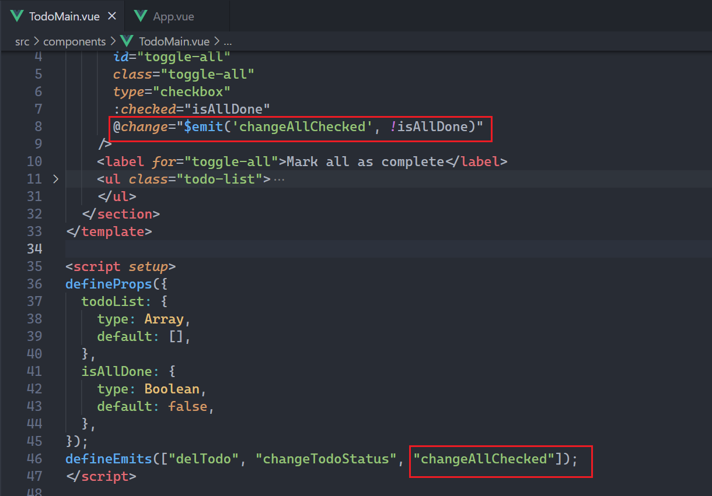
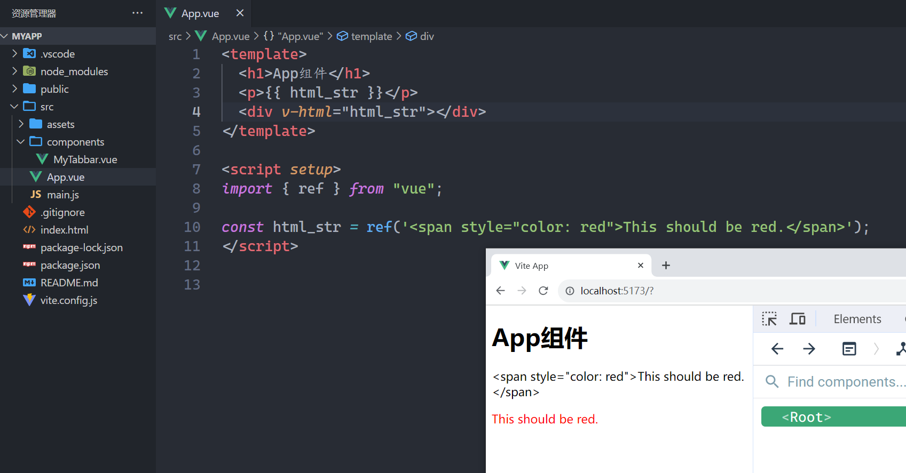
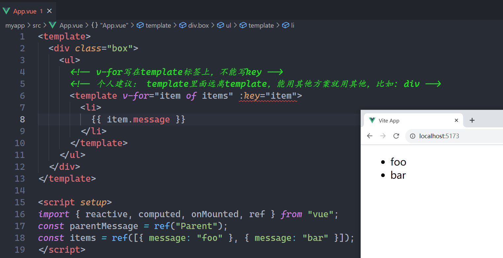
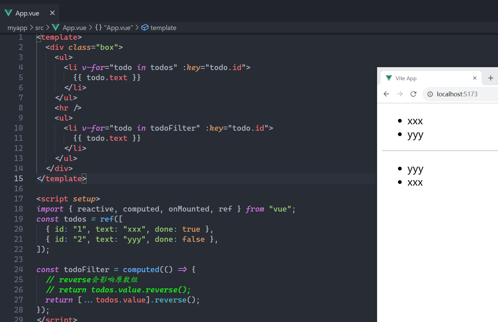
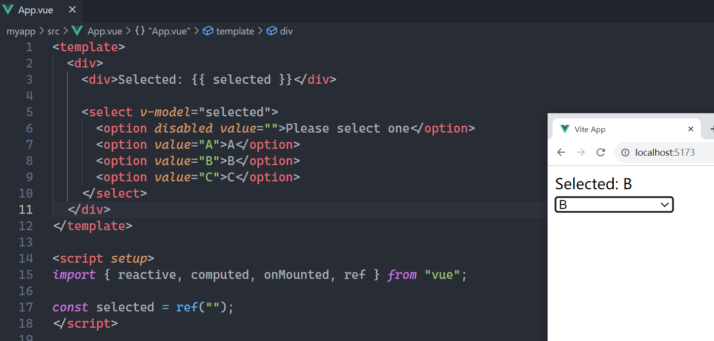
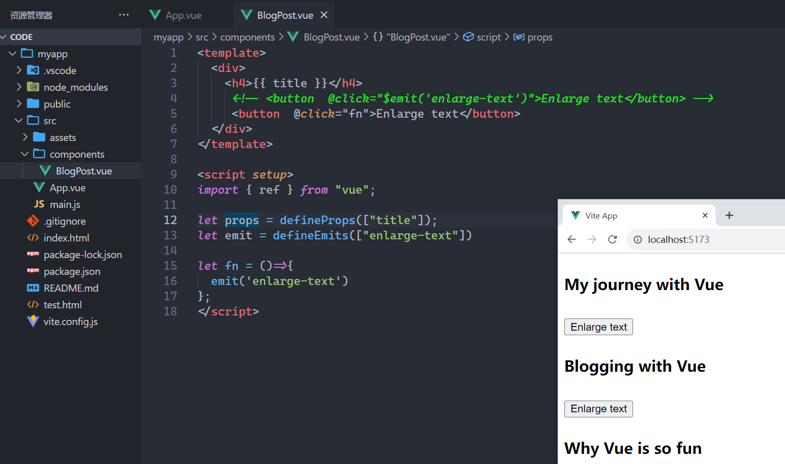
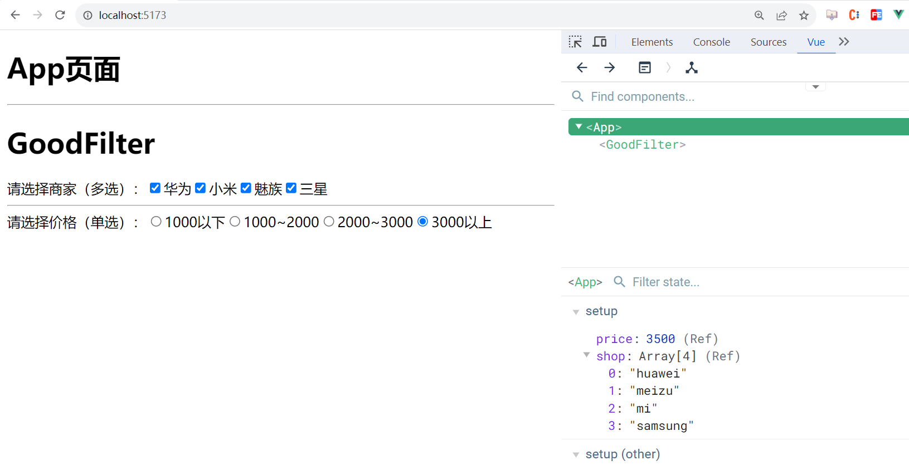
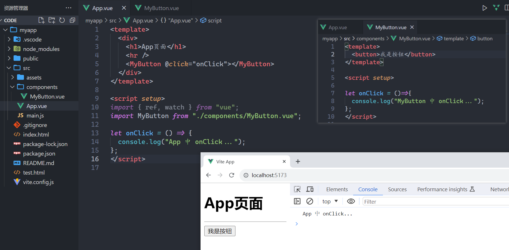

## 一，Vue3互动教程

### 1，Vue3介绍

Vue3文档地址：https://cn.vuejs.org/


Vue特点：


易学易用

* API设计简单，好上手，也是Vue很火的原因

性能出色

* proxy，精准更新，diff算法....

灵活多变

* 渐进式，可大可小的项目都可以做，可以逐步集成很多第三方的依赖

**你是如何理解vue2？**

* vue是数据驱动视图（响应式原理）
* vue2是选项式API（一堆的选项）
* 组件化开发（自定义属性，自定义事件，自定义插槽，选项式API，组件通信）
* 十几个指令（内置指令），指令的本质是对DOM操作的封装......
* 五大内置组件（slot, transition, component, keep-alive, transition-group）
* 复用技巧（组件，混入，过滤器，自定义指令，插件，原型链....）
* 图：组件的生命周期图，MVVM图，Vuex图，响应式原理图...

**技术栈官网**

* 技术栈：Vue3+VueRouter4+Pinia2+Vant3/ElementPlus
* 1、Vue3官网：https://vuejs.org/
* 2、VueRouter(V4)：https://router.vuejs.org/
* 3、Pinia(V2)：https://pinia.vuejs.org/
* 4、Vite构建工具：https://vitejs.dev/
* 5、ElementPlus：https://element-plus.gitee.io/zh-CN/
* 6、Vant(v3)：https://vant-contrib.gitee.io/vant/#/zh-CN

### 2，创建Vue3项目

命令：

```shell
 npm create vue@latest
```

演示一下：


进入项目，安装依赖，运行项目，如下：


运行起来后如下：


浏览器测试之，如下：


使用vscode打开项目，如下：


目录分析：

* vite.config.js 是Vite官方配置文件，各种配置参考Vite官网。
* index.html 是SPA挂载的根页面
* main.js 是入口文件
* App.vue 是根组件（SFC单文件组织）
* src 文件夹 是源码目录
  + views 放路由级别的组件
  + compoents 放通用组件
  + router 放路由相关的
  + store 放仓库相关的
  + api  封装API接口相关的
  + utils 放工具函数

在开发Vue3，在VSCode中还需要安装插件，如下：


项目创建完毕了，然后就要学习知识点了，看文档，如下：


互动教程，如下：


### 3，声明式渲染

**四种语法范式：**

* 选项式写法：完成支持Vue2写法，我们之前学习的Vue2的写法就是选项式写法
* 组合式写法：只使用setup()，把组合式API写在setup中就是组合式写法
* 选项式+组合式写法：可以使用setup()+选项式写法
* 组合式语法糖写法：在script标签上添加setup，只支持组合式写法，规避选项式写法。

**选项式写法：**


参考代码：

```vue
<template>
  <h1>选项式API写法</h1>
  <h1 v-text="num"></h1>
  <button @click="add">+1</button>
</template>

<script>
export default {
  data() {
    return {
      num: 0,
    };
  },
  methods: {
    add() {
      this.num++;
    },
  },
};
</script>

<style scoped>
</style>
```

**组合式写法:(了解)**


参考代码：

```vue
<template>
  <h1>选项式API写法</h1>
  <h1 v-text="num"></h1>
  <button @click="add">+1</button>
</template>

<script>
// ref是组合式API
import { ref } from "vue";

export default {
  // Vue3的选项写法：对Vue2范式完全兼容，可以同时使用setup和选项，也可只使用setup。
  // 官方已经不推荐使用这种选项写法了。选项写法，都有对应的组合API来实现。
  // 解读setup这个选项：相当于Vue2中的created()，可以理解成是组件生命周期的第一阶段；setup(props,context)，context表示上下文，为什么在setup中要有一个上下文对象，因为在setup选项中没有this。
  setup(props, context) {
    // setup是组合式API的入口
    const num = ref(1);

    //num是调用ref函数之后的结果，它是一个对象
    // 不能直接num++  num.value才是响应式数据的值
    // 在模板中，它会自动的.value
    const add = () => {
      num.value++;
    };

    return {
      num,
      add,
    };
  },
};
</script>

<style scoped>
</style>
```

**选项式和组合式混写：（了解）**


参考代码：

```vue
<template>
  <h1>选项式+组合式API写法</h1>
  <h1 v-text="num"></h1>
  <button @click="add">+1</button>
</template>

<script>
import { ref } from "vue";
// 非常不推荐这种写法
export default {
  // 组合选项
  setup(props, context) {
    const num = ref(1);
    return {
      num,
    };
  },
  methods: {
    add() {
      this.num++;
    },
  },
};
</script>
```

**组合式语法糖写法(推荐):**


参考代码：

```vue
<template>
  <h1>组合式语法糖写法</h1>
  <h1 v-text="num"></h1>
  <button @click="add">+1</button>
</template>

<script setup>
import { ref } from "vue";

const num = ref(10);

const add = () => {
  num.value++;
};
</script>
```

官方文档教程，如下：


### 3，Atribute绑定

试着把一个动态的 `class` 绑定添加到这个 `<h1>` 上，并使用 `titleClass` 的 ref 作为它的值。如果绑定正确，文字将会变为红色。代码如下：


### 5，表单绑定与双向绑定

直接上代码：


什么是双向绑定？什么是单向绑定？

* 单向绑定：数据驱动视图，通过ref或reactive定义的响应式数据，数据发生变化时，模板会自动刷新。
* 双向绑定：数据驱动视图，视图驱动数据。    v-model=@input + :value

### 6，条件渲染

直接看文档，如下：


### 7，列表渲染

直接写todo案例，如下：


参考代码：

```vue

<template>
  <form @submit.prevent="addTodo">
    <input type="text" v-model="newTodo" />
    <!-- <button @click="addTodo">Add Todo</button> -->
    <button>Add Todo</button>
  </form>
  <ul>
    <li v-for="todo in todos" :key="todo.id">
      {{ todo.text }}
      <button @click="removeTodo(todo)">X</button>
    </li>
  </ul>
</template>

<script setup>
import { ref, reactive } from "vue";

let id = 0; // 给每个 todo 对象一个唯一的 id

const newTodo = ref("");
const todos = ref([
  { id: id++, text: "Learn HTML" },
  { id: id++, text: "Learn JavaScript" },
  { id: id++, text: "Learn Vue" },
]);

const removeTodo = (todo) => {
  // console.log("todo:",todo.id);
  let idx = todos.value.findIndex(item=>item.id === todo.id);
  todos.value.splice(idx,1)
};

const addTodo = () => {
  if (!newTodo.value.trim().length) return alert("输入框不能为空~"); 
  todos.value.push({ id: id++, text: newTodo.value });
  newTodo.value = "";
};
</script>
```

为什么 key的值不能为索引？

### 8，计算属性

计算属性就是根据已有的状态，计算出一个新的状态。我们可以把模板中的复杂计算抽离到计算属性中，让模板看上去更优雅。计算属性有缓存，当计算属性依赖的状态发生了变化，才会重新计算。

官方写的：

* 计算属性会自动跟踪其计算中所使用的到的其他响应式状态，并将它们收集为自己的依赖。计算结果会被缓存，并只有在其依赖发生改变时才会被自动更新。

总结：

* 计算属性有缓存的特性。
* 只有它依赖的状态，变化的空间不大，计算属性的收益更高

直接上官方的案例：


参考代码：

```vue

<template>
  <form @submit.prevent="addTodo">
    <input type="text" v-model="newTodo" />
    <button>Add Todo</button>
  </form>
  <ul>
    <li v-for="todo in filterTodos" :key="todo.id">
      <input type="checkbox" v-model="todo.done" />
      <span :class="{ done: todo.done }"> {{ todo.text }}</span>
      <button @click="removeTodo(todo)">X</button>
    </li>
  </ul>
  <button @click="hideCompleted = !hideCompleted">
    {{ hideCompleted ? "Show all" : "Hide completed" }}
  </button>
</template>

<script setup>
import { ref, reactive, computed } from "vue";

let id = 0; // 给每个 todo 对象一个唯一的 id

const hideCompleted = ref(false);
const newTodo = ref("");
const todos = ref([
  { id: id++, done: true, text: "Learn HTML" },
  { id: id++, done: true, text: "Learn JavaScript" },
  { id: id++, done: false, text: "Learn Vue" },
]);

const filterTodos = computed(() => {
  if (!hideCompleted.value) {
    return todos.value;
  }
  if (hideCompleted.value) {
    return todos.value.filter((todo) => {
      return !todo.done;
    });
  }
});

const removeTodo = (todo) => {
  // console.log("todo:",todo.id);
  let idx = todos.value.findIndex((item) => item.id === todo.id);
  todos.value.splice(idx, 1);
};

const addTodo = () => {
  if (!newTodo.value.trim().length) return alert("输入框不能为空~");
  todos.value.push({ id: id++, text: newTodo.value });
  newTodo.value = "";
};
</script>

<style>
.done {
  text-decoration: line-through;
}
</style>
```

### 9，生命周期与模板引用

目前为止，Vue 为我们处理了所有的 DOM 更新，这要归功于响应性和声明式渲染。然而，有时我们也会不可避免地需要手动操作 DOM。

这时我们需要使用**模板引用**——也就是指向模板中一个 DOM 元素的 ref。直接上代码：


参考代码：

```vue
<template>
  <!-- 此处的ref和我们讲面讲的ref含义是不一样的 -->
  <p ref="p">hello</p>
</template>

<script setup>
// 在vue3中生命周期函数都是组合式API
// 都是以on打头
import { ref, onMounted } from "vue";

const p = ref(null);

onMounted(()=>{
  // 此时组件已经挂载。
  console.log(p.value);
  p.value.textContent = 'mounted!'
});
</script>
```

### 10，侦听器

直接上代码：


直接官方的案例：


参考代码：

```vue
<template>
  <p>Todo id: {{ todoId }}</p>
  <button @click="todoId++">Fetch next todo</button>
  <p v-if="!todoData">Loading...</p>
  <pre v-else>{{ todoData }}</pre>
</template>

<script setup>
import { ref, watch } from "vue";

const todoId = ref(1);
const todoData = ref(null);

async function fetchData() {
  todoData.value = null;
  const res = await fetch(
    `https://jsonplaceholder.typicode.com/todos/${todoId.value}`
  );
  todoData.value = await res.json();
}

fetchData();

watch(todoId, fetchData);
</script>
```

### 11，组件

组件的使用，如下：


### 12，Props

子组件可以通过 props 从父组件接受动态数据。

直接上代码：


### 13，Emits

vue是单向数据流，什么叫单向数据流？props只能从上到下流。如果想把数据从子流到父，方式有：

* 给子传递一个方法，子去调用方法
* 通过自定义事件

在vue2中，自定义事件不需要接收，在vue3中自定义事件也需要接收，如下：


### 14，Slot

参考文档：https://cn.vuejs.org/tutorial/#step-14

## 二，实现TodoMVC

### 1，静态页面

todo.html，如下：

```html
<!DOCTYPE html>
<html lang="en">

<head>
    <meta charset="UTF-8">
    <meta http-equiv="X-UA-Compatible" content="IE=edge">
    <meta name="viewport" content="width=device-width, initial-scale=1.0">
    <link rel="stylesheet" href="./index.css">
    <title>Document</title>
</head>

<body>
    <section class="todoapp">
        <header class="header">
            <h1>todos</h1>
            <input class="new-todo" autofocus autocomplete="off" placeholder="What needs to be done?" />
        </header>
        <section class="main">
            <input id="toggle-all" class="toggle-all" type="checkbox" />
            <label for="toggle-all">Mark all as complete</label>
            <ul class="todo-list">
                <!-- :class="{ completed: item.done }" -->
                <li class="todo">
                    <div>
                        <input class="toggle" type="checkbox" />
                        <label>学习vue</label>
                        <button class="destroy"></button>
                    </div>
                    <input class="edit" type="text" style="display: none;" />
                </li>
            </ul>
        </section>
        <footer class="footer">
            <span class="todo-count"> <strong></strong> 1 item left </span>
            <ul class="filters">
                <li><a href="">All</a>
                </li>
                <li><a href="">Active</a>
                </li>
                <li>
                    <!-- :class="{ selected: visibility == 'Completed'} -->
                    <a href="">Completed</a>
                </li>
            </ul>
            <button class="clear-completed">
                Clear completed
            </button>
        </footer>

    </section>
</body>

</html>
```

todo.css 代码如下：

```css
html,
body {
    margin: 0;
    padding: 0;
}

button {
    margin: 0;
    padding: 0;
    border: 0;
    background: none;
    font-size: 100%;
    vertical-align: baseline;
    font-family: inherit;
    font-weight: inherit;
    color: inherit;
    -webkit-appearance: none;
    appearance: none;
    -webkit-font-smoothing: antialiased;
    -moz-osx-font-smoothing: grayscale;
}

body {
    font: 14px 'Helvetica Neue', Helvetica, Arial, sans-serif;
    line-height: 1.4em;
    background: #f5f5f5;
    color: #4d4d4d;
    min-width: 230px;
    max-width: 550px;
    margin: 0 auto;
    -webkit-font-smoothing: antialiased;
    -moz-osx-font-smoothing: grayscale;
    font-weight: 300;
}

:focus {
    outline: 0;
}

.hidden {
    display: none;
}

.todoapp {
    background: #fff;
    margin: 130px 0 40px 0;
    position: relative;
    box-shadow: 0 2px 4px 0 rgba(0, 0, 0, 0.2),
        0 25px 50px 0 rgba(0, 0, 0, 0.1);
}

.todoapp input::-webkit-input-placeholder {
    font-style: italic;
    font-weight: 300;
    color: #e6e6e6;
}

.todoapp input::-moz-placeholder {
    font-style: italic;
    font-weight: 300;
    color: #e6e6e6;
}

.todoapp input::input-placeholder {
    font-style: italic;
    font-weight: 300;
    color: #e6e6e6;
}

.todoapp h1 {
    position: absolute;
    top: -155px;
    width: 100%;
    font-size: 100px;
    font-weight: 100;
    text-align: center;
    color: rgba(175, 47, 47, 0.15);
    -webkit-text-rendering: optimizeLegibility;
    -moz-text-rendering: optimizeLegibility;
    text-rendering: optimizeLegibility;
}

.new-todo,
.edit {
    position: relative;
    margin: 0;
    width: 100%;
    font-size: 24px;
    font-family: inherit;
    font-weight: inherit;
    line-height: 1.4em;
    border: 0;
    color: inherit;
    padding: 6px;
    border: 1px solid #999;
    box-shadow: inset 0 -1px 5px 0 rgba(0, 0, 0, 0.2);
    box-sizing: border-box;
    -webkit-font-smoothing: antialiased;
    -moz-osx-font-smoothing: grayscale;
}

.new-todo {
    padding: 16px 16px 16px 60px;
    border: none;
    background: rgba(0, 0, 0, 0.003);
    box-shadow: inset 0 -2px 1px rgba(0, 0, 0, 0.03);
}

.main {
    position: relative;
    z-index: 2;
    border-top: 1px solid #e6e6e6;
}

.toggle-all {
    text-align: center;
    border: none;
    /* Mobile Safari */
    opacity: 0;
    position: absolute;
}

.toggle-all+label {
    width: 60px;
    height: 34px;
    font-size: 0;
    position: absolute;
    top: -52px;
    left: -13px;
    -webkit-transform: rotate(90deg);
    transform: rotate(90deg);
}

.toggle-all+label:before {
    content: '❯';
    font-size: 22px;
    color: #e6e6e6;
    padding: 10px 27px 10px 27px;
}

.toggle-all:checked+label:before {
    color: #737373;
}

.todo-list {
    margin: 0;
    padding: 0;
    list-style: none;
}

.todo-list li {
    position: relative;
    font-size: 24px;
    border-bottom: 1px solid #ededed;
}

.todo-list li:last-child {
    border-bottom: none;
}

.todo-list li.editing {
    border-bottom: none;
    padding: 0;
}

.todo-list li .edit {
    display: block;
    width: 506px;
    padding: 12px 16px;
    margin: 0 0 0 43px;
}

.todo-list li.editing .view {
    /* display: none; */
}

.todo-list li .toggle {
    text-align: center;
    width: 40px;
    /* auto, since non-WebKit browsers doesn't support input styling */
    height: auto;
    position: absolute;
    top: 0;
    bottom: 0;
    margin: auto 0;
    border: none;
    /* Mobile Safari */
    -webkit-appearance: none;
    appearance: none;
}

.todo-list li .toggle {
    opacity: 0;
}

.todo-list li .toggle+label {
    /*
		Firefox requires `#` to be escaped - https://bugzilla.mozilla.org/show_bug.cgi?id=922433
		IE and Edge requires *everything* to be escaped to render, so we do that instead of just the `#` - https://developer.microsoft.com/en-us/microsoft-edge/platform/issues/7157459/
	*/
    background-image: url('data:image/svg+xml;utf8,%3Csvg%20xmlns%3D%22http%3A//www.w3.org/2000/svg%22%20width%3D%2240%22%20height%3D%2240%22%20viewBox%3D%22-10%20-18%20100%20135%22%3E%3Ccircle%20cx%3D%2250%22%20cy%3D%2250%22%20r%3D%2250%22%20fill%3D%22none%22%20stroke%3D%22%23ededed%22%20stroke-width%3D%223%22/%3E%3C/svg%3E');
    background-repeat: no-repeat;
    background-position: center left;
}

.todo-list li .toggle:checked+label {
    background-image: url('data:image/svg+xml;utf8,%3Csvg%20xmlns%3D%22http%3A//www.w3.org/2000/svg%22%20width%3D%2240%22%20height%3D%2240%22%20viewBox%3D%22-10%20-18%20100%20135%22%3E%3Ccircle%20cx%3D%2250%22%20cy%3D%2250%22%20r%3D%2250%22%20fill%3D%22none%22%20stroke%3D%22%23bddad5%22%20stroke-width%3D%223%22/%3E%3Cpath%20fill%3D%22%235dc2af%22%20d%3D%22M72%2025L42%2071%2027%2056l-4%204%2020%2020%2034-52z%22/%3E%3C/svg%3E');
}

.todo-list li label {
    word-break: break-all;
    padding: 15px 15px 15px 60px;
    display: block;
    line-height: 1.2;
    transition: color 0.4s;
}

.todo-list li.completed label {
    color: #d9d9d9;
    text-decoration: line-through;
}

.todo-list li .destroy {
    display: none;
    position: absolute;
    top: 0;
    right: 10px;
    bottom: 0;
    width: 40px;
    height: 40px;
    margin: auto 0;
    font-size: 30px;
    color: #cc9a9a;
    margin-bottom: 11px;
    transition: color 0.2s ease-out;
}

.todo-list li .destroy:hover {
    color: #af5b5e;
}

.todo-list li .destroy:after {
    content: '×';
}

.todo-list li:hover .destroy {
    display: block;
}

/* .todo-list li .edit {
	display: none;
} */

.todo-list li.editing:last-child {
    margin-bottom: -1px;
}

.footer {
    color: #777;
    padding: 10px 15px;
    height: 20px;
    text-align: center;
    border-top: 1px solid #e6e6e6;
}

.footer:before {
    content: '';
    position: absolute;
    right: 0;
    bottom: 0;
    left: 0;
    height: 50px;
    overflow: hidden;
    box-shadow: 0 1px 1px rgba(0, 0, 0, 0.2), filters 0 8px 0 -3px #f6f6f6,
        0 9px 1px -3px rgba(0, 0, 0, 0.2),
        0 16px 0 -6px #f6f6f6,
        0 17px 2px -6px rgba(0, 0, 0, 0.2);
}

.todo-count {
    float: left;
    text-align: left;
}

.todo-count strong {
    font-weight: 300;
}

.filters {
    margin: 0;
    padding: 0;
    list-style: none;
    position: absolute;
    right: 0;
    left: 0;
}

.filters li {
    display: inline;
}

.filters li a {
    color: inherit;
    margin: 3px;
    padding: 3px 7px;
    text-decoration: none;
    border: 1px solid transparent;
    border-radius: 3px;
}

.filters li a:hover {
    border-color: rgba(175, 47, 47, 0.1);
}

.filters li a.selected {
    border-color: rgba(175, 47, 47, 0.2);
}

.clear-completed,
html .clear-completed:active {
    float: right;
    position: relative;
    line-height: 20px;
    text-decoration: none;
    cursor: pointer;
}

.clear-completed:hover {
    text-decoration: underline;
}

.info {
    margin: 65px auto 0;
    color: #bfbfbf;
    font-size: 10px;
    text-shadow: 0 1px 0 rgba(255, 255, 255, 0.5);
    text-align: center;
}

.info p {
    line-height: 1;
}

.info a {
    color: inherit;
    text-decoration: none;
    font-weight: 400;
}

.info a:hover {
    text-decoration: underline;
}

/*
	Hack to remove background from Mobile Safari.
	Can't use it globally since it destroys checkboxes in Firefox
*/
@media screen and (-webkit-min-device-pixel-ratio:0) {

    .toggle-all,
    .todo-list li .toggle {
        background: none;
    }

    .todo-list li .toggle {
        height: 40px;
    }
}

@media (max-width: 430px) {
    .footer {
        height: 50px;
    }

    .filters {
        bottom: 10px;
    }
}
```

在项目，使用上面的静态页，如下：


浏览器效果：


### 2，拆组件

拆分如下：


TodoHeader.vue：

```vue
<template>
    <header class="header">
        <h1>todos</h1>
        <input class="new-todo" autofocus autocomplete="off" placeholder="What needs to be done?" />
    </header>
</template>
```

TodoMain.vue：

```vue
<template>
  <section class="main">
    <input id="toggle-all" class="toggle-all" type="checkbox" />
    <label for="toggle-all">Mark all as complete</label>
    <ul class="todo-list">
      <!-- :class="{ completed: item.done }" -->
      <li class="todo">
        <div>
          <input class="toggle" type="checkbox" />
          <label>学习vue</label>
          <button class="destroy"></button>
        </div>
        <input class="edit" type="text" style="display: none" />
      </li>
    </ul>
  </section>
</template>
```

TodoFooter.vue：

```vue
<template>
   <footer class="footer">
      <span class="todo-count"> <strong></strong> 1 item left </span>
      <ul class="filters">
        <li><a href="">All</a></li>
        <li><a href="">Active</a></li>
        <li>
          <!-- :class="{ selected: visibility == 'Completed'} -->
          <a href="">Completed</a>
        </li>
      </ul>
      <button class="clear-completed">Clear completed</button>
    </footer>
</template>
```

在App.vue中引用之，如下：


### 3，显示todo

在App.vue中定义状态，如下：

```vue
<template>
  <section class="todoapp">
    <todo-header></todo-header>
    <todo-main :todoList="todoList"></todo-main>
    <todo-footer></todo-footer>
  </section>
</template>

<script setup>
import { ref, reactive } from "vue";
import TodoHeader from "./components/TodoHeader.vue";
import TodoMain from "./components/TodoMain.vue";
import TodoFooter from "./components/TodoFooter.vue";

let todoList = reactive([
  { id: "01", text: "学习vue3", done: true, isEdit: false },
  { id: "02", text: "学习java", done: false, isEdit: false },
]);
</script>
```

子中接收数据，渲染数据，如下：


### 4，删除todo

绑定自定义事件，如下：


在子中触发自定义事件，并传参，如下：


父接收之，如下：


实现删除，如下：


### 5，改变单个todo的状态

绑定自定义事件，如下：


子中给checkbox绑定change方法，触发父中的自定义事件，如下：


### 6，全选和全不选

如果所有的todo都完成了，全选按钮就是需要选中，需要定义一个计算属性，如下：


子需要接收之，如下：


可以点击上面的全选按钮，实现全选与全不选，给全选按钮绑定点击事件，如下：



绑定自定义事件，如下：


测试之，如下：


剩下的不写了，不会写的参考：https://yujingbo1023.github.io/feblog/Framework/vue3/08.html

## 三，Vue3深入指南之基础

### 1，创建一个应用

创建应用代码：

```js
import {
    createApp
} from 'vue'

import App from './App.vue'

const app = createApp(App)

// #app是哪里来的？
app.mount('#app')
```

应用实例会暴露一个 `.config` 对象允许我们配置一些应用级的选项，例如定义一个应用级的错误处理器，用来捕获所有子组件上的错误：


应用实例还提供了一些方法来注册应用范围内可用的资源，例如注册一个组件：


应用实例并不只限于一个。 `createApp` API 允许你在同一个页面中创建多个共存的 Vue 应用，而且每个应用都拥有自己的用于配置和全局资源的作用域。


### 2，模板表达式

渲染原始html字符串，如下：



什么是表达式？

* 任何有值的内容都是表达式
* 只要可以写在return后面的都是表达式

胡子中可以放什么？


**受限的全局访问**

模板中的表达式将被沙盒化，仅能够访问到[有限的全局对象列表](https://github.com/vuejs/core/blob/main/packages/shared/src/globalsAllowList.ts#L3)。该列表中会暴露常用的内置全局对象，比如 `Math` 和 `Date` 。

没有显式包含在列表中的全局对象将不能在模板内表达式中访问，例如用户附加在 `window` 上的属性。然而，你也可以自行在 [ `app.config.globalProperties` ](https://cn.vuejs.org/api/application.html#app-config-globalproperties) 上显式地添加它们，供所有的 Vue 表达式使用。


动态绑定多个值，如下：


### 3，响应式基础

vue的响应式，书写如下的代码：

```vue
<script setup>
import { ref } from "vue";

const count = ref(0); // count实际上是对象

function inc() {
  count.value++;
}
</script>

<template>
  <h1>
    {{ count }}
  </h1>
  <h1 @click="inc">点我+1</h1>
</template>
```

看文章：

https://cn.vuejs.org/guide/extras/reactivity-in-depth.html

写代码：


手动update模型，如下：


自动update模型，如下：


参考代码：

```html
<script>
    // 只有对应才能被代理  data是原始对象，不具备响应式的
    let data = {
        A0: 1,
        A1: 2
    };

    function update(receiver) {
        A2 = receiver.A0 + receiver.A1;
        console.log("A2:", A2);
    }

    function whenDepsChange(callback) {
        let proxy_data = new Proxy(data, {
            set(target, propKey, value, receiver) {
                // 每次A0 A1发生变化会执行
                target[propKey] = value;
                callback(receiver);
            }, // target表示原始对象  propKey就是代理的key
            get(target, propKey, receiver) { // receiver是proxy对象本身
                console.log("get...");
                return target[propKey]
            }
        })
        return proxy_data;
    }

    // 代理对象  具备响应了
    let proxy_data = whenDepsChange(update);
    // console.log(proxy_data.A0);
    // console.log(proxy_data.A1);
    proxy_data.A0 = 100;

    proxy_data.A1 = 100;
</script>
```

深层响应式，如下：


有深层响应式，就有浅层响应式，如下：

https://cn.vuejs.org/api/reactivity-advanced.html#shallowreactive

DOM的更新时机，如下：


什么是代理对象？


reactive是代理对象，如下：


reactive也是深层响应式，如下：


有深层响应式，就有浅层响应式，如下：


参考代码：

```vue
<template>
  <div>
    <h1 v-text="info1.a.b.c"></h1>
    <button @click="add1">自增</button>
    <hr />
    <h1 v-text="info2.a.b.c"></h1>
    <button @click="add2">自增</button>
  </div>
</template>

<script setup>
import { ref, reactive, shallowRef, triggerRef } from "vue";

// ref是定义基本数据数据的响应式
// reactive是定义引用数据类型的响应式
// 其实ref也可以定义，如果ref中写了一人引用数据类型，它的内部还是会调用reactive
let info1 = ref({ a: { b: { c: 3 } } });
let add1 = () => {
  info1.value.a.b.c++;
};

// {a:{b:{c:3}}} 整体替换的话是响应式的，对a,b,c修改并不是响应式的
let info2 = shallowRef({ a: { b: { c: 3 } } });
let add2 = () => {
  info2.value.a.b.c++;
  // info2.value.a.b = { c: 888 };
  // info2.value.a = { b: { c: 888 } };
  // info2.value = { a: { b: { c: 888 } } };

  triggerRef(info2); // 强制刷新
};
</script>
```

我们也可以利用shallowReactive定义浅层响应式，如下：


参考代码：

```vue
<template>
  <div>
    <h1>shallowReactive的使用</h1>
    <h2>{{ aa }}</h2>
    <button @click="change">change</button>
  </div>
</template>

<script setup>
import { ref, reactive, shallowRef, shallowReactive } from "vue";

// 浅层响应式
// 只能对第1层代理
// aa 是调用shallowReactive的返回值  它是一个proxy
let aa = shallowReactive({ a: { b: { c: 1 } } });

const change = () => {
  // aa.a.b.c = 888;
  // aa.a.b = { c: 888 };
  aa.a = { b: { c: 888 } }; // 是响应式的

  // 你是把一个普通对象赋值给了aa，aa此时就是一个普通对象了，不再是响应式
  // aa = { a: { b: { c: 888 } } };
};
</script>
```

**响应式代理 VS 原始对象**

值得注意的是， `reactive()` 返回的是一个原始对象的 [Proxy](https://developer.mozilla.org/en-US/docs/Web/JavaScript/Reference/Global_Objects/Proxy)，它和原始对象是不相等的：


为保证访问代理的一致性，对同一个原始对象调用 `reactive()` 会总是返回同样的代理对象，而对一个已存在的代理对象调用 `reactive()` 会返回其本身：


这个规则对嵌套对象也适用。依靠深层响应性，响应式对象内的嵌套对象依然是代理：


**reactive的局限性：**

1. **有限的值类型**：它只能用于对象类型 (对象、数组和如 `Map`、`Set` 这样的[集合类型](https://developer.mozilla.org/en-US/docs/Web/JavaScript/Reference/Global_Objects#keyed_collections))。它不能持有如 `string`、`number` 或 `boolean` 这样的[原始类型](https://developer.mozilla.org/en-US/docs/Glossary/Primitive)。
2. **不能替换整个对象**：由于 Vue 的响应式跟踪是通过属性访问实现的，因此我们必须始终保持对响应式对象的相同引用。这意味着我们不能轻易地“替换”响应式对象，因为这样的话与第一个引用的响应性连接将丢失：


3. **对解构操作不友好**：当我们将响应式对象的原始类型属性解构为本地变量时，或者将该属性传递给函数时，我们将丢失响应性连接：


ref作为reactive对象的属性，会自动解包：


如果将一个新的 ref 赋值给一个关联了已有 ref 的属性，那么它会替换掉旧的 ref：


与 reactive 对象不同的是，当 ref 作为响应式数组或原生集合类型(如 `Map` ) 中的元素被访问时，它**不会**被解包：


### 4，计算属性

官方的代码：

```vue
<template>
  <div>
    <p>Has published books:</p>
    <span>{{ publishedBooksMessage }}</span>
  </div>
</template>

<script setup>
import { reactive, computed, onMounted } from "vue";

const author = reactive({
  name: "John Doe",
  books: [
    "Vue 2 - Advanced Guide",
    "Vue 3 - Basic Guide",
    "Vue 4 - The Mystery",
  ],
});

// 一个计算属性 ref
const publishedBooksMessage = computed(() => {
  return author.books.length > 0 ? "Yes" : "No";
});

onMounted(()=>{
  console.log(publishedBooksMessage.value);
});
</script>
```

可写计算属性，计算属性默认是只读的。当你尝试修改一个计算属性时，你会收到一个运行时警告。只在某些特殊场景中你可能才需要用到“可写”的属性，你可以通过同时提供 getter 和 setter 来创建，如下：


### 5，类与样式绑定

绑定class，常见的写法：


:class后面也可以跟一上reactive，如下：


:class后面也可以跟一个计算属性，如下：


:class后面也可以跟一个数组，如下：


class可以写在组件上，如下：


也可以在组件上写:class，如下：


$attrs可以接收自定义属性，在vue3中是可以接收到class，如下：


### 6，条件渲染

v-if可以写在template标签上，如下：


v-show不能写在template标签上，如下：


**v-if 和 v-show的区别？**

`v-if` 是“真实的”按条件渲染，因为它确保了在切换时，条件区块内的事件监听器和子组件都会被销毁与重建。

`v-if` 也是**惰性**的：如果在初次渲染时条件值为 false，则不会做任何事。条件区块只有当条件首次变为 true 时才被渲染。

相比之下， `v-show` 简单许多，元素无论初始条件如何，始终会被渲染，只有 CSS `display` 属性会被切换。

总的来说， `v-if` 有更高的切换开销，而 `v-show` 有更高的初始渲染开销。因此，如果需要频繁切换，则使用 `v-show` 较好；如果在运行时绑定条件很少改变，则 `v-if` 会更合适。

### 7，列表渲染

v-for的基本使用，如下：


v-for可以解构，如下：


v-for嵌套v-for，如下：


v-for of的用法，如下：


大tempalte标签上，使用v-for，如下：



不建议v-if和v-for连用，如下：


解决：


在计算属性中使用 `reverse()` 和 `sort()` 的时候务必小心！这两个方法将变更原始数组，计算函数中不应该这么做。请在调用这些方法之前创建一个原数组的副本：



### 8，事件处理

事件绑定：


事件修饰符，如下：


### 9，表单输入绑定

v-mode的使用：


复选框：


多个复选框：


单选按钮：


选择器：



多选：


复选框：


### 10，生命周期

生命周期钩子

* [onMounted()](https://cn.vuejs.org/api/composition-api-lifecycle.html#onmounted)
* [onUpdated()](https://cn.vuejs.org/api/composition-api-lifecycle.html#onupdated)
* [onUnmounted()](https://cn.vuejs.org/api/composition-api-lifecycle.html#onunmounted)
* [onBeforeMount()](https://cn.vuejs.org/api/composition-api-lifecycle.html#onbeforemount)
* [onBeforeUpdate()](https://cn.vuejs.org/api/composition-api-lifecycle.html#onbeforeupdate)
* [onBeforeUnmount()](https://cn.vuejs.org/api/composition-api-lifecycle.html#onbeforeunmount)
* [onErrorCaptured()](https://cn.vuejs.org/api/composition-api-lifecycle.html#onerrorcaptured)
* [onRenderTracked()](https://cn.vuejs.org/api/composition-api-lifecycle.html#onrendertracked)
* [onRenderTriggered()](https://cn.vuejs.org/api/composition-api-lifecycle.html#onrendertriggered)
* [onActivated()](https://cn.vuejs.org/api/composition-api-lifecycle.html#onactivated)
* [onDeactivated()](https://cn.vuejs.org/api/composition-api-lifecycle.html#ondeactivated)
* [onServerPrefetch()](https://cn.vuejs.org/api/composition-api-lifecycle.html#onserverprefetch)

onMounted，组件挂载完成后执行：


onUpdated，响应式状态变化后，更新其DOM，DOM更新完后调用：


onUnMounted，在组件实例被卸载后调用：


### 11，侦听器

先看官方的案例：


监听器的多种写法：


不能直接侦听响应式对象的属性值，例如:


深层侦听：


watchEffect的使用，就把它当成另一种侦听器，比watch更加优雅。如下：


参考代码：

```vue
<template>
  <div>
    <h1>watchEffect的使用</h1>
    <h1 v-text="num"></h1>
    <button @click="num++">自增</button>
    <hr />
    <h1 v-text="foo"></h1>
    <button @click="foo--">自减</button>
    <hr />
    <h1 v-text="bar.a"></h1>
    <button @click="bar.a++">改变</button>
  </div>
</template>

<script setup>
import { ref, computed, watchEffect, watchPostEffect, reactive } from "vue";
let num = ref(1);
let foo = ref(200);
let bar = reactive({ a: 1, b: 2 });

// 下面的代码，一开始只会执行一次，后面不管哪个状态发生变化都不会执行
watchEffect(() => {
  console.log("watchEffect01...");
});

// 在回调函数中，用到了num，当num变化了，回调函数就会执行
// num叫watchEffect的依赖
watchEffect(() => {
  console.log("watchEffect02...", num.value);
});

watchEffect(() => {
  console.log("watchEffect03...", foo.value);
});

watchEffect(() => {
  console.log("watchEffect04...", foo.value, num.value);
});
</script>
```

回调的执行时机：


参考代码：

```vue
<template>
  <div>
    <h1>watchEffect的使用</h1>
    <h1 v-text="num" id="h1box"></h1>
    <button @click="num++">自增</button>
    <hr />
    <h1 v-text="foo"></h1>
    <button @click="foo--">自减</button>
    <hr />
    <h1 v-text="bar.a"></h1>
    <button @click="bar.a++">改变</button>
  </div>
</template>

<script setup>
import { ref, computed, watchEffect, watchPostEffect, reactive } from "vue";
let num = ref(1);
let foo = ref(200);
let bar = reactive({ a: 1, b: 2 });

// watchEffect(
//   () => {
//     console.log("watchEffect01...", foo.value, num.value);
//     console.log(document.getElementById("h1box").innerHTML);
//   },
//   { flush: "pre" }
// );
// watchEffect(
//   () => {
//     console.log("watchEffect01...", foo.value, num.value);
//     console.log(document.getElementById("h1box").innerHTML);
//   },
//   { flush: "post" }
// );
watchPostEffect(() => {
  console.log("watchEffect01...", foo.value, num.value);
  console.log(document.getElementById("h1box").innerHTML);
});
</script>
```

停止侦听：


### 12，模板引用

它允许我们在一个特定的 DOM 元素或子组件实例被挂载后，获得对它的直接引用。这可能很有用，比如说在组件挂载时将焦点设置到一个 input 元素上，或在一个元素上初始化一个第三方库。

代码如下：


注意，你只可以在组件挂载后才能访问模板引用。如果你想在模板中的表达式上访问 `input` ，在初次渲染时会是 `null` 。这是因为在初次渲染前这个元素还不存在呢！

如果你需要侦听一个模板引用 ref 的变化，确保考虑到其值为 `null` 的情况：


当在 `v-for` 中使用模板引用时，对应的 ref 中包含的值是一个数组，它将在元素被挂载后包含对应整个列表的所有元素：


除了使用字符串值作名字， `ref` attribute 还可以绑定为一个函数，会在每次组件更新时都被调用。该函数会收到元素引用作为其第一个参数：


把ref写在组件上，如下：


### 13，组件基础

组件另一种写法，写成js文件，如下：


关于命名：


自定义事件官方案例，如下：



App.vue参考代码：

```vue
<template>
  <div :style="{fontSize:postFontSize+'em'}">
    <BlogPost
      v-for="post in posts"
      :key="post.id"
      :title="post.title"
      @enlarge-text="postFontSize += 0.1"
    ></BlogPost>
  </div>
</template>

<script setup>
import { ref, computed, watchEffect, onMounted, reactive } from "vue";
import BlogPost from "./components/BlogPost.vue";

const posts = ref([
  { id: 1, title: "My journey with Vue" },
  { id: 2, title: "Blogging with Vue" },
  { id: 3, title: "Why Vue is so fun" },
]);
const postFontSize = ref(1);

</script>
```

BlogPost.vue参考代码：

```vue
<template>
  <div>
    <h4>{{ title }}</h4>
     <!-- <button  @click="$emit('enlarge-text')">Enlarge text</button> -->
     <button  @click="fn">Enlarge text</button>
  </div>
</template>

<script setup>
import { ref } from "vue";

let props = defineProps(["title"]);
let emit = defineEmits(["enlarge-text"])

let fn = ()=>{
  emit('enlarge-text')
};
</script>
```

动态组件案例：


参考代码：

https://play.vuejs.org/#eNqNVdFu2jAU/RUrfaCVCLRj2kMG1bqp0raHrdr61kxTcBxwSezIdhgI8e87thMT1FIBErLvPT4+5+bmsovu6nq0bliURFNNFa8N0cw09W0qeFVLZchXWTFSKFmRwWhsNxY+COkHqY0Oebc7BtwpuuTrA0W7PwbtiGIF2bcgnyKpoFJoQ2ijFBPmMZuTmcVdDqyMwVUqOoTJ5hq5HQ45vUO7cFrcqr0yFftUTMfeJgxiY1hVl5lh2BEyzfma0DLTepZGOatkGrk4MvPGGIkDdoPPOi6kAujy79DefUW4cBrSKECSFdsCgWg/2LE/DZCIPetgCPsZNVCYHHmdzSwp2f/pMXyiJacrMBwVpX9LK5mQ3c4fh2nnYeyvs8YNtlSi9AIUJOFWktX/dGDFpaEWjv52Og5HfLnGqBdW03Gvithqsy3tcmRL6J9JIYWJi6zi5TYhOhM61kzx4qPNzaXKmUrITb0hWpY8JxeMsV4qVlnOG52Qd/XGhessz7lYIHCNMxP8uHCVqQUXsZE1yFjVj80lnFcJed9hG9wPDSWjJiECnlxUrpkqSvkv3iQka4xEEMWDk8PD8n6Cgg8QcNORtnIhIC5ZYYLuycu84ovlKcBRKSilLoUHoyVSteTCMOXhGV0tlGxEnpCL4tp+XzMdg64fd3eHMAz27CVLWwNv8oieXdvvC/zI9+0ZB1rIaYehpm09/bvqeikaRt3gsXPq9EvrG9X3u5tboWNPNCyYw8g6n9rPvDO4e7PufPZuYJ7BbzTmX8EXo2ctBW5wNcZswEleMvWzNhzzMY0SX32by0o0+HcXM6rxk9KdWTK6eiX+rDc2lkYPiuGlwRSNQs6goZjx6fvfP9gG65CsZN6UQL+R/MXQA43V6GGf0TqQ3cM5td/cfwR641HfbwwTujNlhVrk3uHTCGX+8ob1g9zJaOLOocui/X90F1hu

组件中的样式是相互隔离的，如下：


## 四，Vue3深入指南之深入组件

### 1，组件的v-model

在Vue2中，v-model 写在组件上，等价于 :value + @input ；在Vue3中，v-model 等价于 :modelValue + @update:modelValue 。上代码：


在一个组件上，可以写多个v-model，如下：

App.vue:

```vue
<template>
  <div>
    <h1>App页面</h1>
    <hr />

    <!-- update:modelValue 叫自定义事件   $event是子触发自定义事件传递过来的数据-->
    <!-- <Demo :modelValue="lang" @update:modelValue="lang = $event"></Demo> -->

    <!-- v-model = :modelValue + @update:modelValue -->
    <!-- v-model:gender  = :gender + @update:gender -->
    <!-- v-model:xxx    =  :xxx  +  @update:xxx -->

    <Demo v-model="lang" v-model:gender="gender" v-model:xxx="ok"></Demo>

    <!-- <Demo
      :modelValue="lang"
      @update:modelValue="lang = $event"
      :gender="gender"
      @update:gender="gender = $event"
    ></Demo> -->
  </div>
</template>

<script setup>
import { ref } from "vue";
import Demo from "./components/Demo.vue";

const lang = ref("en");
const gender = ref("unknow");
</script>

```

Demo.vue:

```vue
<template>
  <div>
    <div class="lang">
      <span
        @click="langChange(item)"
        :class="{ on: item.value === modelValue }"
        v-for="item in langs"
        :key="item.id"
      >
        {{ item.label }}
      </span>
    </div>
    <hr />
    <div>
      <!-- <input type="radio" value="man" :checked="gender==='man'" @change="$emit('update:gender',$event.target.value)"> 男
      <input type="radio" value="woman" :checked="gender==='woman'" @change="$emit('update:gender',$event.target.value)"> 女
      <input type="radio" value="unknow" :checked="gender==='unknow'" @change="$emit('update:gender',$event.target.value)"> 保密 -->
      <input type="radio" value="man" v-model="g" /> 男
      <input type="radio" value="woman" v-model="g" /> 女
      <input type="radio" value="unknow" v-model="g" /> 保密

      <input type="text" v-model="userName" />
    </div>
  </div>
</template>

<script setup>
import { reactive, ref, computed } from "vue";
const langs = reactive([
  { id: 1, value: "zh", label: "中文" },
  { id: 2, value: "en", label: "英文" },
  { id: 3, value: "fr", label: "法语" },
]);
const userName = ref("xx666");

const props = defineProps({
  modelValue: { type: String, default: "zh" },
  gender: { type: String, default: "man" },
});

const emit = defineEmits(["update:modelValue", "update:gender"]);

let g = computed({
  get() {
    return props.gender;
  },
  set(val) {
    console.log("val:", val);
    emit("update:gender", val);
  },
});

let langChange = (item) => {
  emit("update:modelValue", item.value);
};
</script>

<style>
.lang span {
  cursor: pointer;
  padding: 20px;
}
.lang span.on {
  color: red;
}
</style>
```

效果如下：


v-model的修饰符，如下：


App.vue:

```vue
<template>
  <div>
    <h1>App页面</h1>
    <hr />
    <Demo v-model.trim.sort="lang"></Demo>
  </div>
</template>

<script setup>
import { ref } from "vue";
import Demo from "./components/Demo.vue";

const lang = ref("en");
</script>
```

Demo.vue:

```vue
<template>
  <div>
    <div class="lang">
      <span
        @click="langChange(item)"
        :class="{ on: item.value === modelValue }"
        v-for="item in langs"
        :key="item.id"
      >
        {{ item.label }}
      </span>
    </div>
  </div>
</template>

<script setup>
import { reactive, ref, computed } from "vue";
const langs = reactive([
  { id: 1, value: "zh", label: "中文" },
  { id: 2, value: "en", label: "英文" },
  { id: 3, value: "fr", label: "法语" },
]);
const userName = ref("xx666");

const props = defineProps({
  modelValue: { type: String, default: "zh" },
  modelModifiers: { default: () => ({}) },
});

const emit = defineEmits(["update:modelValue"]);

let langChange = (item) => {
  const { sort, trim, aaa } = props.modelModifiers;
  //  console.log(sort,trim,aaa);
  // 如果sort为真，先处理排序，再回传给父组件
  //  // 如果trim为真，把字符串首尾空字符删除，再回传父组件
  emit("update:modelValue", item.value);
};
</script>

<style>
.lang span {
  cursor: pointer;
  padding: 20px;
}
.lang span.on {
  color: red;
}
</style>
```

来上一个案例，如下：



GoodFilter.vue:

```vue
<template>
  <div>
    <h1>GoodFilter</h1>
    <span>请选择商家（多选）：</span>
    <span v-for="s in shopArr" :key="s.id">
      <input
        @change="shopChange"
        :checked="shop.includes(s.value)"
        type="checkbox"
        :value="s.value"
      />
      <span>{{ s.label }}</span>
    </span>
    <hr />
    <span>请选择价格（单选）：</span>
    <span v-for="p in priceArr" :key="p.id">
      <input
        @change="priceChange"
        :checked="p.value === price"
        type="radio"
        :value="p.value"
      />
      <span>{{ p.label }}</span>
    </span>
  </div>
</template>

<script setup>
import { reactive, ref, computed, toRefs } from "vue";

const props = defineProps({
  shop: { type: Array, default: [] },
  // 接收v-model:shop的自定义修饰符
  shopModifiers: { default: () => ({}) },
  price: { type: Number, default: 500 },
  // 接收v-model:price的自定义修饰符
  priceModifiers: { default: () => ({}) },
});
// toRefs 把一个对象中的属性变成ref
const { shop, price } = toRefs(props);

// 接收v-model的自定义事件
const emit = defineEmits(["update:shop", "update:price"]);

const shopArr = reactive([
  { id: 1, label: "华为", value: "huawei" },
  { id: 2, label: "小米", value: "mi" },
  { id: 3, label: "魅族", value: "meizu" },
  { id: 4, label: "三星", value: "samsung" },
]);

const priceArr = reactive([
  { id: 1, label: "1000以下", value: 500 },
  { id: 2, label: "1000~2000", value: 1500 },
  { id: 3, label: "2000~3000", value: 2500 },
  { id: 4, label: "3000以上", value: 3500 },
]);

const shopChange = (ev) => {
  const { checked, value } = ev.target;
  const { sort } = props.shopModifiers;

  let newShop = checked
    ? [...shop.value, value]
    : shop.value.filter((e) => e !== value);

  if (sort) newShop = newShop.sort();
  emit("update:shop", newShop);
};

let priceChange = (ev) => {
  emit("update:price", Number(ev.target.value));
};
</script>
```

App.vue:

```vue
<template>
  <div>
    <h1>App页面</h1>
    <hr />
    <!--  v-model:shop  =   :shop + shopModifiers + @update:shop-->
    <!-- v-model:price  =   :price + @update:price -->
    <GoodFilter v-model:shop.sort="shop" v-model:price="price"></GoodFilter>
  </div>
</template>

<script setup>
import { ref, watch } from "vue";
import GoodFilter from "./components/GoodFilter.vue";

const shop = ref(["mi","huawei"]);
const price = ref(500);
watch([shop, price], () => {
  console.log("changed", shop.value, price.value);
});
</script>
```

### 2，透传 Attributes

class透传：


透传的class不会覆盖原有的，如下：


事件也可以透传，如下：



深层透传，如下：


禁止透传：


$attrs，如下：


这个 `$attrs` 对象包含了除组件所声明的 `props` 和 `emits` 之外的所有其他 attribute，例如 `class` ， `style` ， `v-on` 监听器等等。


透传到非根组件上，如下：


在 JavaScript 中访问透传 Attributes，如下：


### 3，插槽

大家自行学习。

### 4，依赖注入

看写代码如下：


一个组件可以多次调用 `provide()` ：


### 5，整理vue3组合式API和vue3的变化

参考：https://yujingbo1023.github.io/feblog/Framework/vue3/01.html#%E4%B8%80%E3%80%81vue3%E5%85%A8%E5%AE%B6%E6%A1%B6%E4%BB%8B%E7%BB%8D

## 五，路由

## 六，pinia状态管理

## 七，vue3项目
