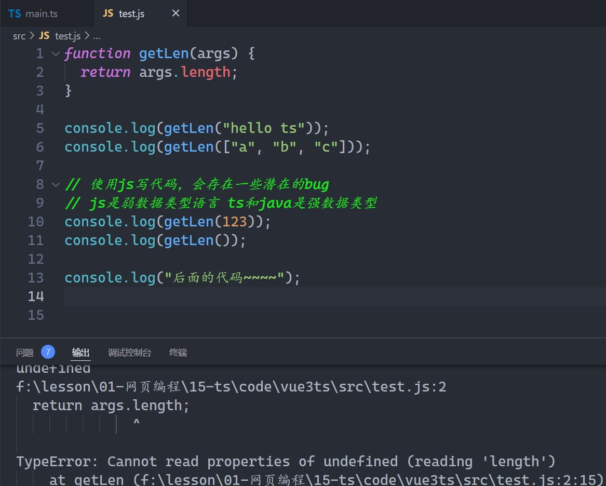
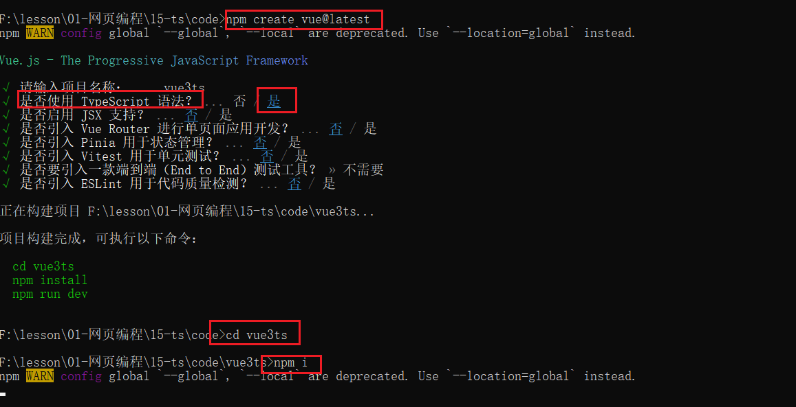
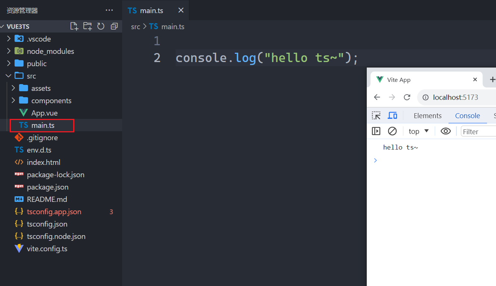
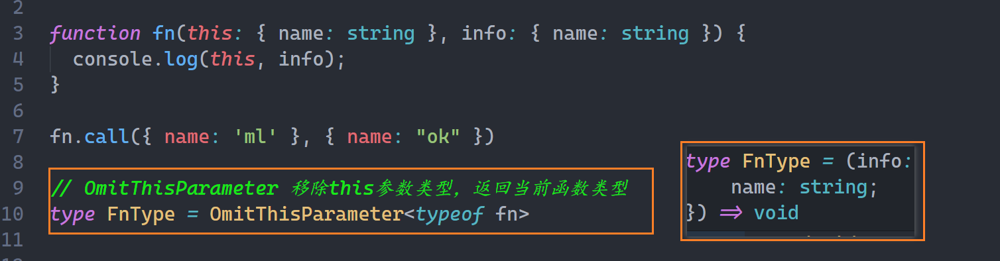
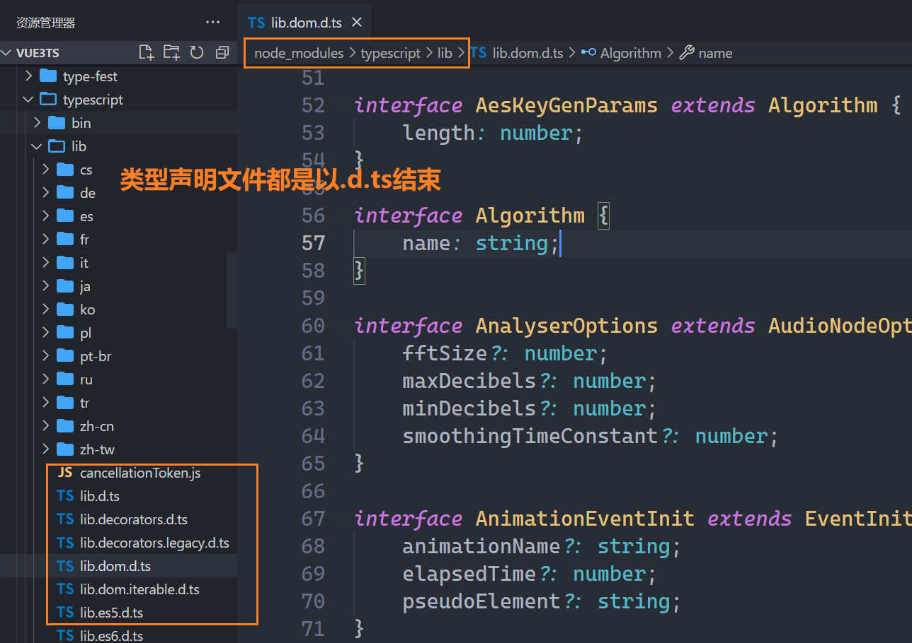
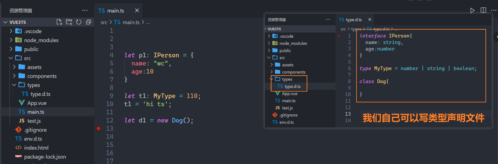
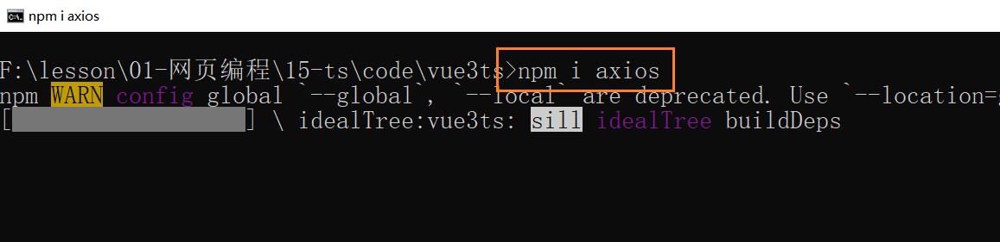
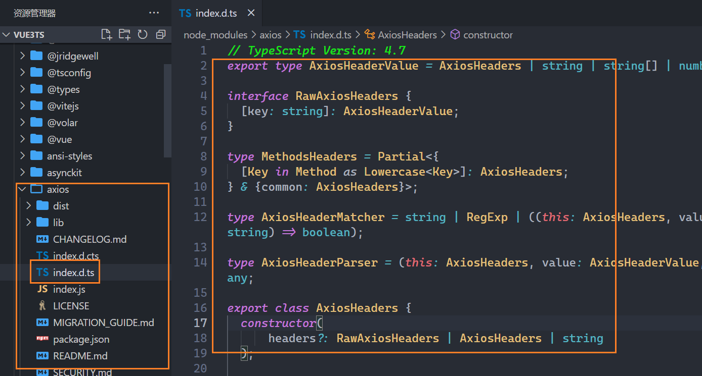

## 一，TS介绍

### 1，没有TS带来的问题

看如下代码：



如果使用ts来写，如下：

```ts

// args:数据类型  string是一个数据类型  
// string[]  是数组类型  这个数组中只能放字符串
function getLen(args:string | string[]) {
  return args.length;
}

console.log(getLen("hello ts"));
console.log(getLen(["a", "b", "c"]));

// 在你写代码过程中就报错了
// console.log(getLen([1,2,3]));  // 不ok

// console.log(getLen(123));  // 不ok
// console.log(getLen()); // 不ok

console.log("后面的代码~~~~");
```

### 2，TS介绍

TypeScript是拥有类型的JavaScript超集，它可以编译成普通、干净、完整的JavaScript代码。我们可以将TypeScript理解成加强版的JavaScript。可以说它非常重要，因为现在很多框架源码或公司的业务代码都使用TS来写。也可以说它不重要，因为现在大部分项目还是使用JS来写的。我们可以把TypeScript理解成更加强大的JavaScript，不仅让JavaScript更加安全，而且给它带来了诸多好用的好用特性；

很多项目都采用TS：
* Angular源码在很早就使用TypeScript来进行了重写，并且开发Angular也需要掌握TypeScript； 
* Vue3源码也采用了TypeScript进行重写，在阅读源码时你会看到大量TypeScript的语法； 
* 包括目前已经变成最流行的编辑器VSCode也是使用TypeScript来完成的； 
* 包括在React中已经使用的ant-design的UI库，也大量使用TypeScript来编写； 
* 目前公司非常流行Vue3+TypeScript、React+TypeScript的开发模式； 
* 包括小程序开发，也是支持TypeScript的；

网站：

* 官方网站：https://www.typescriptlang.org/
* 中文官网： https://www.tslang.cn/

### 3，环境搭建

创建一个vue3+ts的项目：



运行项目：



## 二，TS中的数据类型

### 1，TS变量的声明

格式：var/let/const 标识符: 数据类型 = 赋值; 

```ts
// 没有写类型，ts会自动推导出来
let a = 110;
// a = "hello"; // 不ok  不能把string类型的数据赋值给number类型

// var/let/const 变量名:数据类型 = 赋值
// java中：   int a = 110;
let b: number = 666;
b = 888;

let c: string = "hello ts";
c = 'hi ts'

console.log(a,b,c);
```

自动类型推导：

```ts
let a = 110;   // a的类型就已经确定了，是number类型
let b = "hi";   // b的类型就已经确定了，是string类型

a = 'ok';  // 不ok
b = 888;    // 不ok
```

### 2，number类型

```ts
// ts和js一样，不分小数和整数，都是number
// 在java中，分小数和整数，小数是float和double，整数是int
let num = 100;  // 10进制
num = 200;
num = 300;

num = 0b110; // 2进制
num = 0o567; // 8进制
num = 0xf123; // 16进制
```

### 3，boolean类型

```ts
// boolean类型只有两个值：true,false
let b: boolean = true;
b = false;

// 1 > 2 结果是boolean类型
let flag = 1 > 2; // flag的类型会自动推导
```

### 4，string类型

```ts
// string要小写
let str: string = 'hi ts';
str = "hello ts";

let userName = "malu";
let userAge = 18;
let height = 1.88;

// ts中写代码，提示给js中给力的多
let info = `my name is ${userName}，age is ${userAge}，height is ${height}`;

console.log(info);
```

### 5，Array类型

```ts
// names是一个数组，里面只能放string类型
// 也就是说在ts或java中，说到数组，它里面一般都是放同一种类型
// let names:string[] = ["a",1,true];  // 不ok

// 在真实开发中，一般情况下，数组中都是放同一种数据类型
// 不要放不同的类型的数据
let names: string[] = ["a", "b", "c"];
console.log(names); 
names.push("d")
// names.push(666);  //不ok
console.log(names);

// 定义数组的另一种方式：需要我们讲到泛型后你才能理解
let nums: Array<number> = [1, 2, 3];
nums.push(666);
console.log(nums);
```

### 6，Object类型

```ts
// 你感觉可能是这样写的，其实这样写不对
let obj1: object = {
  a: 1,
  b: 2,
  c: 3
}

console.log(obj1.a);  // 报红  获取数据时，报错了
obj1.d = 4;
console.log(obj1.d);  // 报红

// { x: number, y: number } 整体是一个类型
let obj2: { x: number, y: number } = {
  x: 1,
  y: 2
}
console.log(obj2.x);
obj2.y = 22;
console.log(obj2.y);

// 可以给一个类型起别名  type
type MyType = { m: string, n: number };
let obj3: MyType = {
  m: 'hi',
  n: 123
}
```

### 7，Symbol类型

JS中的Symbol可以创建一个唯一值：

```js
// 在js中，如果键同名了，后面的会覆盖掉前面
// const person = {
//   identity: 'coding',
//   identity: 'teacher',
// }
// console.log(person);  // { identity: 'teacher' }

const person = {
    [Symbol()]: 'coding',
    [Symbol()]: "teacher"
}
console.log(person); // { [Symbol()]: 'coding', [Symbol()]: 'teacher' }
```

TS中使用之：

```ts
let s1:symbol = Symbol('id')
let s2:symbol = Symbol('id')

const person = {
  [s1]: 'coding',
  [s2]: "teacher"
}
console.log(person);  
```

### 8，null和undefined类型

```ts
// null类型只有一个值是null
// undefined类型只有一个值是undefined
let x: null = null;
let y: undefined = undefined;
```

### 9，函数的参数类型

```ts
function sum(x:number,y:number,z:number) {
  return x + y + z;
}

let res = sum(1, 2, 3);  // res的类型会自动推导
console.log(res);  // 6

// let res2 = sum("1", "2", "3"); // 报红
```

### 10，函数的返回值类型

```ts
// 指定函数的返回值类型
function sum(x: number, y: number, z: number): number {
  // return x + y + z;

  // return "hello";// 报红
}

let res = sum(1, 2, 3);  // res的类型会自动推导
console.log(res);  // 6

// let res2 = sum("1", "2", "3"); // 报红
```

看一个小案例：

```ts
// type是给一个类型起别名
// 别名是TodoType
type TodoType = {
  text: string,
  done: boolean
}

function getTodos(txt:string): TodoType[] {
  let todos: TodoType[] = [];
  todos.push({ text: txt, done: false })
  return todos;
}

console.log(getTodos('学习ts'));  // [ { text: '学习ts', done: false } ]
```

### 11，匿名函数参数

```ts
let names: string[] = ["malu", "wc", "xq"];

// forEach中写的函数是匿名函数
// 匿名函数中形参的类型会根据上下文推导出它的类型
names.forEach(function (item,index,arr) {
  console.log(item,index,arr);
})

// 匿名函数的形参类型，最好不要加类型，就靠它自动推导就OK
names.forEach(function (item:string, index:number, arr:string[]) {
  console.log(item, index, arr);
})

names.forEach(item=>console.log(item))
```

### 12，对象类型

```ts
// let malu: { name: string, age: number, height: number } = { name: "ml", age: 18, height: 1.88 };

type MaluType = { name: string, age: number, height: number };
let malu: MaluType = { name: "ml", age: 18, height: 1.88 };
console.log(malu);

// ?表示属性可以有可以没有
type PointType = {
  x: number,
  y: number,
  z?: number,
}

function print(point: PointType) {
  console.log("x坐标是：", point.x);
  console.log("y坐标是：", point.y);
  console.log("z坐标是：", point.z);
}

print({ x: 1, y: 2, z: 3 })
```

### 13，可选类型

```ts
type PointType = {
  x: number,
  y: number,
  z?: number,  // 可选属性
}

function print(point: PointType) {
  console.log("x坐标是：", point.x);
  console.log("y坐标是：", point.y);
  // 由于z是可选的，使用z时，作一个判断
  if (point.z) {
    console.log("z坐标是：", point.z);
  }
}

print({ x: 1, y: 2, z: 3 })
print({ x: 1, y: 2 })
```

### 14，any类型

一个数据如果是any类型，它可以赋值任何类型的数据，和JS就一样了，所以一般不会使用any。当我们无法确定一个变量的类型时，并且它的类型可能会发生变化，此时也是可以使用any类型。

```ts
// 如果一个变量是any类型，可以赋值任何值，和JS一样。
let a: any = 1;
a = "hi";
a = true;

a = { x: 1, y: 2 }
console.log(a.x);
console.log(a.y);

// 数组names中可以放任意类型的数据，和JS一样了
let names: any[] = [1, true, "hi", undefined]
console.log(names);
```

### 15，unknown类型

unknown类型是TS中的一种特殊的数据类型，用于描述一个不确定的变量。和any有点类似，但是在unknown类型上做任何事情都是不合法的。

```ts
function foo(): string {
  return "hi ts"
}

function bar(): number {
  return 123;
}

let flag = true;
// res的数据类型是unknown类型
let res: unknown;
if (flag) {
  res = foo();
} else {
  res = bar();
}
// 类型缩小
if (typeof res === 'string') {
  console.log(res.length);
}

console.log(res);

console.log("---------------");

let xx: unknown;
xx = 123;
xx = "hi vue";
xx = { a: 1, b: 2 }
xx.c = 456;  // 报红了
console.log(xx);
```

### 16，void类型

void是用来指定函数返回值类型的，如果函数没有返回值，返回值类型就是void，和java一样。

```ts
// void用于指定函数没有返回值
function sum(x: number, y: number): void {
  console.log(x + y);

  // return 123; // 报错
}
let res = sum(1, 2);
console.log(res);

let names: string[] = ["malu", "wc", "xq"];

// 匿名函数的形参item会自动推导
// 匿名函数的返回值类型是什么？ 鼠标摸一下，发现是void
names.forEach(function (item) {
  console.log(item);
  return 123; // 没有报红  它会根据上下文推导出你到底返回值是什么类型
})

// fn是一个函数，函数也有类型
let fn: () => void = () => { }

// () => void 是一个类型  要求没有形参 没有返回值
type FnType = () => void;
// let fn2: FnType = (a)=>{}  // 报红
let fn2: FnType = () => { return 123; }  // 没报红
console.log(fn2());
```

### 17，never类型

never表示永远不会发生类型，如一个函数是死循环，这个函数永远不可能有返回值。或者函数中抛出了一个错误，也是永远不可能有返回值。

```ts
// 写项目中，never基本上用不到
// 在封装一些框架或工具库时，可能会用到

function fn(): never {
  throw new Error();

  // while(true){}  // 死循环
}

console.log(fn());
```

### 18，tuple类型

在JS中没有元组类型，但是在Python，Swift等语言中有元组类型，在JAVA中也是没有元组类型。

```ts
// [number, string, boolean] 整体是一个元组类型
// 每一个元素的数据类型都定死了
let info1: [number, string, boolean] = [1, 'hi', true]

type MyTupleType = [number, number, number];
let info2: MyTupleType = [1, 2, 3];

// 要保存一个人的信息：wc, 18, 1.88
let person = {  // 通过对象来保存，用的最多
  name: "wc",
  age: 18,
  height: 1.88
}

// person2是一个数组
let person2: any[] = ["wc", 18, 1.88];

let person3: [string, number, number] = ["wc", 18, 1.88];
console.log(person3[0]);  // wc
console.log(person3[1]);  // 18
```

元组和数组的区别？

* 数组中放相同类型的元素，不同类型的元素不建议放在数组中，当然也可以放在对象中。
* 元素中每一个元素可以有自己特有类型，根据索引就可以获取对应的值。

元组的应用：

```ts
//  [number, (newValue: number) => void] 整体是元组类型
function useState(initialState: number): [number, (newValue: number) => void] {
  let stateVlaue = initialState;
  function setValue(newValue: number) {
    stateVlaue = newValue;
  }
  return [stateVlaue, setValue];
}

// 期望函数返回值的类型是元组
// counter 是状态   setCounter 是修改状态的方法
let [counter, setCounter] = useState(10);
setCounter(20)
```

### 19，联合类型

把两个或多个其它类型组合成一种新的类型，就是联合类型。

```ts
// number | string 联合类型
let a: number | string = 110;
a = 'hi';

if (typeof a === 'string') {
  console.log(a.length);
}

// 如果一个数据是联合类型，赋值时可以赋值给其中的一种类型
function fn(msg: number | string) {
  // 类型缩小
  if (typeof msg === 'string') {
    console.log(msg.length);
  } else {
    console.log(msg);
  }
}

fn(110)
fn('hi ts')

```

### 20，类型别名

通过type可以给一个类型起别名，通常是给一个对象类型起别名。

```ts
// type就是给某个类型起别名
type MyNumber = number;
let age: MyNumber = 110;

// 给一个联合头型起别名
type MsgType = number | string;

// 给一个对象类型起别名
type PointType = {
  x: number,
  y: number
}

// 后面这个别名就可以是一种类型了
function printPoint(point: PointType) {
  console.log(point.x,point.y);
}

printPoint({x:1,y:2})
```

### 21，接口声明（难）

接口和类型别名比较像，在定义对象类型时，使用类型别名实现的，使用接口也可以使用。我是这样记的：

* type 是给某个类型起别名
* interface是发明一种新的类型

```ts
// 声明一个接口
// interface相当于发明了一种数据类型，也是用于约束对象的
// type是用来起别名
interface PointType {
  x: number,
  y: number,
  z?: number
}

function printPoint(point: PointType) {
  console.log(point.x, point.y);
  if (point.z) {
    console.log(point.z);
  }
}

printPoint({ x: 1, y: 2, z: 3 })
```

interface和type的区别？

* interface是发明一种新的类型，只能约束对象类型，type除了约束对象类型之外，还可以约束其它类型。说白了就是type的使用范围更广，接口只能约束对象类型。
* interface可以重复对某个接口定义属性和方法，type不能重复。
* interface可以继承。interface可以被类实现（和java一样）。

写代码演示他们之间的区别：

```ts
// type的使用范围更广，接口只能约束对象类型
type MyNumber = number;
type Xxx = number | string | boolean;

// -------------------------

// type 别名不能重名
// type PointType1 = {
//   x: number,
//   y: number,
// }
// type PointType1 = {
//   z?: number
// }

// -------------------------

// interface发明的类型是可以重名的
// interface只能约束对象类型
interface PointType1 {
  x: number,
  y: number,
}
interface PointType1 {
  z?: number
}

function printPoint(point: PointType1) {
  console.log(point.x, point.y);
  if (point.z) {
    console.log(point.z);
  }
}

printPoint({ x: 1, y: 2, z: 3 })

// -------------------------

// interface是可以继承的
interface IPerson {
  name: string,
  age: number
}
interface IMalu extends IPerson {
  height?: number
}
let ml: IMalu = {
  name: "ml",
  age: 18,
  height: 1.88
}

// 什么时候使用interface，什么时候使用type类型别名？
//    只约束一个对象中有什么属性时，推荐使用interface
//    如果不是约束一个对象，仅仅是给一个类型起别名，使用type
```

### 22，交叉类型 

前面说过联合类型，如下：

```ts
// 'malu' 是一个字面量类型
let ml: 'malu' = 'malu';

// 'left'  就是一个类型，叫字面量类型
// 'left' | 'right' | 'top' | 'botton'  整体是一个联合类型
type MyType = 'left' | 'right' | 'top' | 'botton';

let a:MyType = 'right'
```

还有一种类型，叫交叉类型，交叉类型是所的条件都要满足：

```ts
interface ITeach {
  name: string,
  age: number
}

interface ICode {
  name: string,
  coding: () => void;
}

// ITeach & ICode 整体是一个交叉类型
type InfoType = ITeach & ICode;

let info: InfoType = {
  name: "ml",
  age: 18,
  coding() {
    console.log("coding...");
  }
}
```

### 23，类型断言

有时候ts并不能获取一个数据的具体类型，此时我们就可以使用类型断言，类似于强制类型转化。

```ts
// document.getElementById("logo")  得到这个dom元素，ts也不知道它是什么类型，那才可以断言
// HTMLImageElement 这是一种数据类型
let ele = document.getElementById("logo") as HTMLImageElement

if (ele !== null) {
  ele.src = "xxx";

  console.log(ele);
}

let age = 110;
// age 断言成 string类型
// let age2 = age as string;  // 报红

// let age3 = age as any;
```

### 24，非空类型断言

```ts
interface IPerson {
  name: string
  age: number
  friend?: {
    name: string
  }
}

let info: IPerson = {
  name: "ml",
  age: 18,
  friend: {
    name:"xq"
  }
}
// ?. 是一个新的运算符
console.log(info.friend?.name);

// 类型缩小
if (info.friend) {
  console.log(info.friend);
}

// 非空类型断言（有点危险，一定要确保有friend时再使用）
// ! 表示非空断言
console.log(info.friend!.name);
```

### 25，字面量类型

```ts
// malu就是一种数据类型
let myname: 'malu' = 'malu';
// 18也是一种数据类型，都是字面量类型
let age: 18 = 18;

// "left" | "right" | "up" | "down"  整体是一个联合类型
type Direction = "left" | "right" | "up" | "down"
const d1: Direction = "left"

type MethodType = "get" | "post"
function request(url: string, method: MethodType) { }
request("http:xxx", 'get')

let obj = { url: "xxx", method: "post" }
// obj.method 得到的是字符串类型
// request(obj.url,obj.method) // 报红
request(obj.url, obj.method as 'post') // 报红
```

### 26，类型缩小

前面说过联合类型，所谓的联合类型就是把N个其它类型联合成一个大的类型，如下：

```ts
// number | string 就是一个联合类型
type MyType1 = number | string;

type MyType2 = "left" | "right" | "up" | "down";
```

类型缩小的实现方式：

* typeof 用的最多的
* ===  !== 
* instanceof
* in
* ...

上代码：

```ts
type MyType1 = number | string;

// 使用typeof实现类型缩小
function fn(msg: MyType1) {
  if (typeof msg === 'string') {
    console.log(msg.length,msg.split(" "));
  } else {
    console.log(msg.toFixed(2));
  }
}
fn(110)
fn('hi ts')

// -------------------------------

type Direction = "left" | "right" | "up" | "down";

// 使用 === 实现类型缩小
function switchDirection(dir: Direction) {
  if (dir === 'left') {
    console.log("向左移动");
  } else if (dir === 'right') {
    console.log("向右移动");
  } else if (dir === 'up') {
    console.log("向上移动");
  } else if (dir === 'down') {
    console.log("向下移动");
  }
}

switchDirection("left")
switchDirection("right")
switchDirection("up")

// -------------------------------

// instanceof 用来判断是否是某个类的实例
function fn(date: string | Date) {
  if (date instanceof Date) {
    console.log(date.getFullYear());
  } else {
    console.log(date);
  }
}
fn('2024,01,01')

let d = new Date();
fn(d)

// -------------------------------

// in 实现类型缩小
// 发明了一个类型，主要是用来约束对象
interface ISwim {
  swim: () => void;
}

interface IRun {
  run: () => void;
}

// in是一个运算符，是用来判断一个对象中是否有某个属性
function fn(animal: ISwim | IRun) {
  if ("swim" in animal) {
    animal.swim();
  } else if ('run' in animal) {
    animal.run();
  }
}

let fish: ISwim = { swim() { } }
let dog: IRun = { run() { } }

fn(fish)
fn(dog)
```

### 27，函数类型

函数也是一种特殊的数据，不管是在JS中，还是在TS中，只要是数据，都有类型。所以函数也是有类型。

```ts
// 函数声明
function f(msg: string): number {
  return 666
}
console.log(f("hi ts"));

// (msg: string) => number; 整体就是函数类型
// 函数类型格式：(参数列表)=>返回值类型
type GType = (msg: string) => number;

// 函数表达式
let g: GType = (msg: string): number => {
  return 123
}

console.log(g("hi ts"));
```

对于函数类型，如果要求两个参数，传递了一个，不会报红，如果传递了三个，就不行，看如下代码：

```ts
// 定义函数类型
type FnType = (num1: number, num2: number) => number

function calc(fn: FnType) {
  let num1 = 1;
  let num2 = 2;
  let res = fn(num1, num2);
  return res;
}

function add(num1: number, num2: number) {
  return num1 + num2
}

function mul(num1: number, num2: number) {
  return num1 * num2
}

console.log(calc(add));
console.log(calc(mul));

function k(num1: number) {
  return num1 * 10
}

console.log(calc(k));  // ok

function q(num1: number,num2:number,num3:number) {
  return num1 + num2 + num3
}
console.log(calc(q));  // 报红
```

再看一次forEach，如下：

```ts
let names = ["ml","wc","xq"];

// forEach中的匿名函数，它的形参可以是1个，也可以是2个，也可以是3个
names.forEach(function (item,index,arr) {
  console.log(item,index,arr);
})
```

再去说一个概念，叫调用签名。在JS中，一个切都是对象，函数也是对象，先写一点JS代码：

```js
// fn自动推导出它是函数类型
let fn = () => {
    console.log("fn..");
}

fn(); // 函数类型去调用没有问题

// 去给函数类型加属性，就会报红
fn.a = 1;
fn.b = 2;
console.log(fn.a); // 报红
console.log(fn.b); // 报红
```

去定义一个类型，去约束上面的fn函数，fn又是对象，又是函数，如何约束呢？

```ts
type FnType = () => void;

interface FnType2 {
  a: number
  b: number
  c: string
  // 函数调用签名  写： 不能写=>
  (num: number): number
}

// fn自动推导出它是函数类型
// let fn:FnType = () => {  // 不行  fn就是函数类型
const fn: FnType2 = (num: number): number => {
  return 123;
}

fn.a = 1;
fn.b = 2;
fn.c = 'hi'
console.log(fn.a);
console.log(fn.b);

fn(123);  // 函数类型去调用没有问题
```

除了函数的调用签名之外，还有一个叫构造签名，如下：

```ts
class Person { }

// let p1 = new Person(); // new一个类，得到一个对象

// 定义一个接口，约束形参
interface IFacory {
  // 构造签名
  // 要求形参，是可以new对象，并且返回类型是Person
  new(): Person
}

// 把一个类传递给工厂，工厂就可以返回对象
function factory(cls: IFacory) {
  let p1 = new cls();
  return p1
}

factory(Person)
```

函数参数的可选参数：

```ts
// b ?: number  表示b参数可传可不传
function fn(a: number, b?: number) {
  // 类型缩小
  if (b !== undefined) {
    console.log(a, b);
  }
}

fn(1)
fn(1, 2)
```

函数参数的默认值：

```ts
// c=110  表示参数的默认值  不需要指定类型
function fn(a: number, b: number, c = 110) {
  console.log(a + b + c);
}

fn(1, 2)    // 113
fn(1, 2, 3)  // 6
```

剩余参数：

```ts
// ...nums:number[]  剩余参数  需要写在最后  类型是数组
function fn(a: number,...nums:number[]) {
  console.log(a,nums);
}

fn(1, 2)    
fn(1, 2, 3)  
fn(1, 2, 3, 4)  
fn(1, 2, 3, 4, 5)  
fn(1, 2, 3, 4, 5, 6)  
```

### 28，函数重载

定义一个函数，可以实现数字相加，也可以实现字符串拼接，你可能会写出如下的代码：

```ts
// function sum(a: number | string, b: number | string) {
//   return a + b; // 报红
// }

// 解决办法：类型缩小
function sum(a: number | string, b: number | string) {
  if (typeof a == 'number' && typeof b == 'number') {
    return a + b;
  } else if (typeof a == 'string' && typeof b == 'string') {
    return a + b;
  }

}

console.log(sum(1, 2));
console.log(sum("hi", " ts"));
```

除了使用上面的解决办法之外，还可以使用函数重载如下：

```ts
// 下面的写法，叫函数的重载
function sum(a: number, b: number): number;
function sum(a: string, b: string): string;
// 下面的是固定死法，不会调用
function sum(a: any, b: any): any {
  return a + b;
}

console.log(sum(1, 2));
console.log(sum("hi", " ts"));
// console.log(sum(1,'hi'));  // 报红
```

对于同一个需求来说，可以使用函数重载，也可以使用联合类型都可以实现如下：

```ts
// arg报红
// function getLen(arg) {
//   return arg.length
// }

// 函数重载  ok
// function getLen(arg: string): number
// function getLen(arg:any[]):number 
// function getLen(arg:any) {
//   return arg.length
// }

// 使用联合类型也是OK    联合类型是最简单的
// function getLen(arg: string | any[]) {
//   return arg.length
// }

// { length: number } 整体是一个类型
// 对象类型也可以解决
function getLen(arg: { length: number }) {
  return arg.length
}

console.log(getLen(["a", "b", "c"]));
console.log(getLen("hello ts"));
console.log(getLen({ length: 110 }));
```

### 29，This

在vue2中会大量使用到this，在vue3中很少使用this了。在ts中对this的处理，也需要研究一下，看如下代码：

```ts
// 默认this是any类型，需要手动指定this的类型
// function fn() {
//   console.log(this);  // 报红了
// }

// fn();

// ----------------------------

// 需要明确this的类型，在函数的第1个参数位置指定this的类型
function fn(this: {name:string},a:number) {
  console.log(this);  // 报红了
  console.log(a);
}

fn.call({name:"wc"},110)
```

再看下面的代码：

```ts
let obj = {
  name: "wc",
  // (this: {})   手动明确this的类型
  sayHello(this: {}) {
    // 这里的this会根据上下文推导出，是obj
    console.log(this);
  }
}
// obj.sayHello();
obj.sayHello.call({})
```

对于this，ts提供了一些内置工具，如下：

* ThisParameterType
* OmitThisParameter
* ThisType

然后说一下ThisParameterType这个工具的使用：

```ts
// this: { name: string } 手动指定this的类型
function fn(this: { name: string }, info: { name: string }) {
  console.log(this, info);
}

fn.call({ name: 'ml' }, { name: "ok" })

// ThisParameterType 可以获取到函数类型中this的类型
type FnThisType = ThisParameterType<typeof fn>

let a: FnThisType = { name: "xx" };
```

如果this没有类型，如下：

```ts
// this没有手动指定类型
function fn( info: { name: string }) {
  console.log(this, info); // this报红了
}

fn.call({ name: 'ml' }, { name: "ok" })

// ThisParameterType工具获取this对应的类型，得到unknow
type FnThisType = ThisParameterType<typeof fn>
```

然后说一下OmitThisParameter这个工具的使用：



最后说一下ThisType工具的使用：

```ts
interface IState {
  name: string,
  age: number
}
interface IStore {
  state: IState,
  fn: () => void,
  gn: () => void
}
// ThisType  用于绑定一个上下文中的this
let store: IStore & ThisType<IState> = {
  state: {
    name: "ml",
    age: 18
  },
  fn() {
    console.log(this.name);
  },
  gn() {
    console.log(this.age);
  }
}

store.fn.call(store.state)
store.gn.call(store.state)
```

## 三，OOP

### 1，类的定义

定义一个类，通过new这个类，就可以得到一个对象，和JS中是一样的，如下：

```ts
// 封装：把数据和操作数据的方法封装到一个类中
class Animal {
  // 数据
  name: string
  age: number
  constructor(name: string, age: number) {
    this.name = name;
    this.age = age;
  }
  run() {
    console.log(this.name + " run...");
  }
  jump() {
    console.log(this.name + " jump...");
  }
}

let a1 = new Animal('wc', 1);
console.log(a1.name);
console.log(a1.age);
a1.run();
a1.jump();
```

### 2，类的继承

一个子类，可以继承一个父类，如下：

```ts
// 父类
class Animal {
  name: string
  age: number
  constructor(name: string, age: number) {
    this.name = name;
    this.age = age;
  }
  run() {
    console.log(this.name + " run...");
  }
}

// 子类  子可以继承父中的数据和方法
class Cat extends Animal{

}

let cat = new Cat('xq', 10);
console.log(cat.name); // xq
console.log(cat.age);  // 10
cat.run();  // xq run...
```

子可以有自己的数据和方法，如下：

```ts
// 父类
class Animal {
  name: string
  age: number
  constructor(name: string, age: number) {
    this.name = name;
    this.age = age;
  }
  run() {
    console.log(this.name + " run...");
  }
}

// 子类  子可以继承父中的数据和方法
class Cat extends Animal {
  weight: number  // weight是子独有的数据
  constructor(name: string, age: number, weight: number) {
    super(name, age); // 表示调用父中的constructor
    this.weight = weight;
  }
  eat() {
    console.log(this.name + " eat....");
  }
}

let cat = new Cat('xq', 10, 5);
console.log(cat.name); // xq
console.log(cat.age);  // 10
console.log(cat.weight);
cat.run();  // xq run...
cat.eat();
```

### 3，成员的修饰符

类中的数据和方法，都叫类的成员，可以通过三个修饰符来修饰成员：

* public  公开的，在任何地方都可以访问成员，默认创建的都是public
* private   私有的，只能在类中访问成员
* protected  受保护，只能在类中或子类中访问成员

public演示：

```ts
class Animal {
  name: string
  age: number
  constructor(name: string, age: number) {
    this.name = name;
    this.age = age;
  }
  run() {
    console.log(this.name + " run...");
  }
}

let a = new Animal("wc", 10);
// 在类外是可以直接访问成员的，因为默认这些成员是公开的
console.log(a.name);
console.log(a.age);
a.run();
```

private演示：

```ts
class Animal {
  // name和age就是私有的，只能在类中访问，不能在类外访问
  private name: string
  private age: number
  constructor(name: string, age: number) {
    this.name = name;
    this.age = age;
  }
  run() {
    //this.name 表示在类中访问
    console.log(this.name + " run...");
  }
}

let a = new Animal("wc", 10);
console.log(a.name); // 报红
console.log(a.age);  // 报红
a.run();  // run是公开的
```

protected演示：

```ts
// 父类
class Animal {
  protected name: string  // protected修饰成员，表示这个成员是受保护的，只能在本类中 或 子类中访问
  protected age: number
  constructor(name: string, age: number) {
    this.name = name;
    this.age = age;
  }
  run() {
    console.log(this.name + " run...");
  }
}

class Cat extends Animal {
  weight: number 
  constructor(name: string, age: number, weight: number) {
    super(name, age); 
    this.weight = weight;
  }
  eat() {
    // this.name 为什么能访问？ 因为name是protected的，在子类中可以访问的
    console.log(this.name + " eat....");
  }
}

let cat = new Cat('xq', 10, 5);
console.log(cat.name); // 报红了
console.log(cat.age);  // 报红了
console.log(cat.weight);
cat.run();  // xq run...
cat.eat();
```

### 4，只读属性

通过readonly表示一个数据是只读的。

```ts
class A{
  // readonly 表示只读
  readonly name: string
  age: number
  
  constructor(name: string, age: number) {
    this.name = name;
    this.age = age;
  }
}

let a = new A('wc', 10);
console.log(a.name);  // 读
console.log(a.age);  // 读

a.name = "ml";  // 写  修改  报红
console.log(a.name);
```

### 5，getter和setter

类中可以有私有成员，私有成员类外是不能访问的，可以提供getter和setter来进行读写，如下：

```ts
class A {
  // 数据私有了，类外不能读写
  // 私有数据，建议以_打头
  private _name: string
  private _age: number

  constructor(name: string, age: number) {
    this._name = name;
    this._age = age;
  }

  // a.name 就会走getter  访问器
  get name() {
    return this._name
  }
  set name(newVal: string) {
    this._name = newVal;
  }
}

let a = new A('wc', 10);
console.log(a.name);  // 读    报红
a.name = "xq";
console.log(a.name);
```

使用getter和setter好处是，可以驿数据访问进行拦截操作，如下：

```ts
class A {
  private _name: string
  private _age: number

  constructor(name: string, age: number) {
    this._name = name;
    this._age = age;
  }
  get age() {
    return this._age
  }
  set age(newVal: number) {
    if (newVal >= 0 && newVal < 150) {
      this._age = newVal;
    }
  }
}

let a = new A('wc', 10);
console.log(a.age);  // 10

a.age = 200
console.log(a.age);  // 10
```

### 6，参数属性

说白了，就是对成员数据可以省略，如下：

```ts
// class A {
//   name: string
//   age: number
//   constructor(name: string, age: number) {
//     this.name = name;
//     this.age = age;
//   }
// }

// let a = new A('wc', 10);
// console.log(a.name);
// console.log(a.age);

// ---------  上面的代码是可以简化的

class A {
  constructor(public name: string, public age: number) { }
}

let a = new A('wc', 10);
console.log(a.name);  // wc
console.log(a.age);  // 10

```

### 7，抽象类

使用abstract定义的类就是抽象类，在抽象类中可以声明抽象方法，所谓的抽象方法就是没有函数体的方法。为什么要有抽象类，抽象类可以定义出一套规则，如下面的三个类，都有所谓计算面积的方法，可以把计算面积的规则放到抽象类，让其它子类去继承这个抽象类。

```ts
class Rectangle {
  width: number
  height: number
  constructor(width: number, height: number) {
    this.width = width;
    this.height = height;
  }
  getArea() {
    return this.width * this.height;
  }
}
class Circular {
  radius: number
  constructor(radius: number) {
    this.radius = radius;
  }
  getArea() {
    return this.radius ** 2 * Math.PI
  }
}
class Triangle {
  getArea() {
    return 100;
  }
}
```

定义一个抽象类，让面的三个类去继承抽象类，如下：

```ts
// 就是抽象类  规则
abstract class Shape {
  // 在抽象类中可以定义抽象方法
  // 抽象方法就是为了让子类去实现
  abstract getArea(): number // 抽象方法必须出现在抽象类中, 类前面也需要加abstract
}

// let s1 = new Shape(); // 抽象类是不能new，只能让子类去继承

class Rectangle extends Shape {
  width: number
  height: number
  constructor(width: number, height: number) {
    super();
    this.width = width;
    this.height = height;
  }
  getArea() {
    return this.width * this.height;
  }
}
class Circular extends Shape {
  radius: number
  constructor(radius: number) {
    super();
    this.radius = radius;
  }
  getArea() {
    return this.radius ** 2 * Math.PI
  }
}
class Triangle extends Shape {
  getArea() {
    return 100;
  }
}

let r1 = new Rectangle(2, 2)
console.log(r1.getArea());

let c1 = new Circular(2);
console.log(c1.getArea());

let t1 = new Triangle();
console.log(t1.getArea());

// shape: Shape 父类引用  它的值是子类对象
// 在java中，叫多态    js天生就是多态
function calcArea(shape: Shape) {
  return shape.getArea();
}
console.log(calcArea(r1));
console.log(calcArea(c1));
console.log(calcArea(t1));
```

鸭子类型：

```ts
// 鸭子类型：如果一只鸟, 走起来像鸭子, 游起来像鸭子, 看起来像鸭子, 那么你可以认为它就是一只鸭子
//   只关心数据（属性）和方法（行为），不关心你到底是什么样的类型
class Person {
  constructor(public name: string, public age: number) { }
  running() { }
}

class Dog {
  constructor(public name: string, public age: number) { }
  running() { }
}

function printPerson(p: Person) {
  console.log(p.name, p.age)
}

let p1 = new Person("wc", 19);
printPerson(p1)

printPerson(new Person("xq", 18))

printPerson(new Dog("xx", 20))

printPerson({ name: "yy", age: 20, running() { } })

let p2: Person = new Dog("mm", 10);

```

### 8，对象类型

之前都说过了，可以使用接口或类型别名约束一个对象：

```ts
interface IPerson{
  name: string,
  age?: number,
  readonly score:number
}

let p1: IPerson = {
  name: "wc",
  age: 18,
  score:88
}
console.log(p1.name);
console.log(p1.age);
console.log(p1.score);
p1.name = "xq";
console.log(p1.name);
// p1.score = 88; // 报红

// ------------------------------

type TPerson = {
  name: string,
  age:number
}

let p2: TPerson = {
  name: "xq",
  age:18
}

// ------------------------------

class Person{
  constructor(public name: string, public age: number) { }
}

let p3:Person = new Person("xx",11)

// ------------------------------

function printPerson(p: Person) { }
printPerson(p3)
```

### 9，接口继承与实现

一个接口是可以继承另一个接口的，如下：

```ts
interface IPerson {
  name: string
  age: number
}

interface IXxx extends IPerson {
  score: number
}

let p1: IXxx = {
  name: "wc",
  age: 19,
  score: 88
}

console.log(p1);
```

一个类可以实现多个接口，此时接口也是一套规则，如下：

```ts
// 一个接口中也可以定义函数，函数不能有函数体
interface IAaa {
  name: string,
  eat: () => void  // 更加抽象的方法
}

interface IBbb {
  age: number,
  run: () => void  // 更加抽象的方法
}

// 一个类可以实现多个接口，此时接口就是规则
class Person implements IAaa, IBbb {
  name: string
  age: number

  constructor(name: string, age: number) {
    this.name = name;
    this.age = age;
  }

  eat() { console.log("eat..."); }
  run() { console.log("run..."); }
}

let p1 = new Person("wc", 18);
console.log(p1.name);
console.log(p1.age);
p1.run();
p1.eat();
```

### 10，一个特殊现象

把一个字面量对象赋值给一个变量时，第1次检测严格一些，后面再赋值就会松一些。

```ts
interface IPerson {
  name: string
  age: number
}

// 第一次把一个字面量对象，赋值给p1，会进行检测
// let p1: IPerson = {
//   name: "wc",
//   age: 18,
//   score:88  // 报红
// }
// console.log(p1);

// 第1次赋值给了xx
let xx = {
  name: "wc",
  age: 18,
  score: 88  // 不报红了
};

// 第2次才赋值给了p1，检测就比较松了
let p1: IPerson = xx
console.log(p1);

```

### 11，枚举类型

枚举就是把一组可能出现的值，一个个列出来，定义在一个类型中，这个类型就是枚举类型。

```ts
enum Direction{
  LEFT,   // 0 
  RIGHT    // 1
}

let a: Direction = Direction.LEFT;
console.log(a);  // 0

let b: Direction = Direction.RIGHT;
console.log(b);   // 1

enum Aaa{
  TOP = 100,
  LEFT,
  BOTTOM,
  RIGHT
}
let x: Aaa = Aaa.BOTTOM;
console.log(x);  // 102
```

## 四，泛型

### 1，泛型基本使用

所谓的泛型就是把类型参数化，看如下代码：

```ts
// function fn(arg: number | string | {name:string}) {
function fn<T>(arg:T):T {
  // T不指一个具体的类型，只能在调用函数时才能确定，这个T就是泛型
  return arg
}

// 在调用函数时，可以把实参赋值给形参。
// 我们也可以把一个类型传递给函数，说白了类型也可以传递
let res1 = fn<number>(123);
let res2 = fn<string>('hi ts');
let res3 = fn<{ name: string }>({ name: "wc" });

// 类型参数化   不传递类型，ts会自动推导
let res4 = fn(123);
let res5 = fn('hi ts');
let res6 = fn({ name: "wc" });
```

泛型可以有多个：

```ts
// 一般情况下，泛型会使用如下字母表示：
//   T: Type  类型
//   K, V    key  value  键值对
//   E:  Element 元素
//   O:  Object 对象
function fn<T, E>(arg: T, arg1: E): void {
  console.log(arg, arg1);
}

let res1 = fn<number, string>(123, 'hi ts');
let res2 = fn(123, 'hi ts');
```

### 2，泛型接口与泛型类

泛型接口：

```ts
// 使用接口，就是给T赋值
// T的类型不确定，传递了什么类型，它就是什么类型
interface IPerson<T> {
  name: T,
  age: T,
  score: T
}

let p1: IPerson<string> = {
  name: "xx",
  age: "11",
  score: "99"
}

let p2: IPerson = {  // 报红了
  name: "xx",
  age: "11",
  score: "99"
}
```

泛型类:

```ts
class Point<T>{
  x: T
  y: T

  constructor(x: T, y: T) {
    this.x = x;
    this.y = y;
  }
}

let p1 = new Point<number>(1, 2);
console.log(p1.x);
console.log(p1.y);

let p2 = new Point("1", "2");
console.log(p2.x);
console.log(p2.y);
```

### 3，泛型的约束

可以对泛型做一些约束，如下：

```ts
interface ILength {
  length: number
}

function getLength(arg: ILength) {
  return arg.length
}

let length1 = getLength("aaaa")
let length2 = getLength(["a","b","c"])
let length3 = getLength({length:100})

// 泛型约束　　<T extends ILength>
function getInfo<T extends ILength>(arg:T):T {
  return arg;
}
let info1 = getInfo<string>("aaaa")
let info2 = getInfo(["a","b","c"])
let info3 = getInfo({length:100})
console.log(info1);
console.log(info2);
console.log(info3);

getInfo(123) // 报红
getInfo({})  // 报红
```

keyof的使用：

```ts
interface IPerson {
  name: string,
  age:number
}
// keyof IPerson;  得到  name | age
type Xxx =  keyof IPerson;  
let a:Xxx = 'age'

// O object K key
// ,K extends keyof O  也是泛型约束
// K = 'name' | 'age' | 'height'
function fn<O,K extends keyof O>(obj:O,key:K) {
   return obj[key]
}
let info = {
  name: "wc",
  age: 18,
  height:1.88
}

console.log(fn(info, "name"));
console.log(fn(info, "age"));
console.log(fn(info, "height"));
console.log(fn(info, "score")); // 报红了
```

## 四，类型声明

### 1，类型的分类

类型主要分三种：

* 内置类型声明
* 外部定义的类型声明
* 自定义的类型声明

内置类型声明：

```ts
// 下面的都是ts内置好的类型
let d: Document;
let p = new Promise(() => { })
```

在创建项目时，脚手架就把这些类型声明好了：



我们也可以写类型声明文件，如下：



我们在写ts代码时，它的类型声明查询顺序是这样的：

* 先在人家内置的类型声明中找
* 再去外部定义的类型声明中找（第三方的）
* 最后去自定义的类型声明中找

### 2，内置的类型声明

TS内置了JS运行时一些标准化API的声明文件 ，如：Date, Math, String, Function....。在创建vue3项目时，如果选择了ts，它会把这些ts的类型声明全部下载下来。

### 3，第三方库对应的类型声明文件

在下载一些第三方库时，一些库自带类型声明文件，如下：axios，如下：



看一个axios这个包：



使用axios，如下：

有些第三方包没有类型声明文件，需要你自己去下载，如：react

## 五，Vue3中使用TS

## 六，vue3+ts版本的todolist
