## 一，前置知识

### 1，产品分类

* web开发：
  + 特点：运行在浏览器上的应用
  + 常见：官网，管理系统，webapp，H5
* App开发：
  + 原生App，指的是Android 和 iOS   12年~16年
  + 跨平台App，指的是写一套，可以在多端运行，Uniapp，RN
  + Flutter，使用dart语言
  + 混合App（Hybrid），指：原生App + Web开发   在原生App中嵌套网页
  + 小程序

### 2，前端就业方向

* React开发（核心）
* Vue3 / Vue2（核心）
* Uniapp (开发小程序，使用vue语法+微信小程序语法)（核心）
* Node 
* Angular
* 小程序（微信小程序<微信用户基数大>，支付宝小程序，360小程序....）
* RN
* 前后端不分离的项目
* 低代码开发
* flutter
* web3
* .... 

## 二，搭建小程序开发环境

### 1，小程序介绍

小程序：运行在App中的小应用。是一个随用随开的程序，也是属于前端技术之一。开发小程序非常简单，你只要会前端就会开发小程序。

特点：

* 无须安装，只能运行在指定的App中，小而美。
* 工具类，营销类（转发，拼团...）

为什么要做小程序？

* 用户角度：使用方便，相信只要用过小程序的同学，都能感受到它的方便，不用安装、随用随开、还能通过分享链接打开，这点完胜 APP。但是小程序的用户体验一般是不如 APP 的，毕竟受到了宿主（比如微信 APP）的限制。
* 开发角度：开发成本低，只要你会前端，就会开发小程序。此外，目前小程序的开发工具和生态都比较完善，也可以降低开发难度。
* 产品角度：上线成本低，小程序不需要在各个应用商店提交审核，就可以快速上线。虽然也要在小程序平台审核，但个人感觉比在应用商店过审方便一些。
* 老板角度：省钱，小程序前端运行在宿主 APP 里，不用单独购买一个服务器来部署前端（当然，后端还是需要服务器的）。
* 运维角度：更安全性，因为小程序是运行在宿主 APP 里（比如微信或支付宝），所以运行时会受到严格的安全限制，前端几乎不用担心被攻击。
* ....

开发小程序有几种方式：

* 原生开发
* 跨端开发  uniapp  主流开发模式  
* 低代码开发，如腾讯的 WeDa、钉钉的宜搭等等
* 找别人开发，微信服务市场....
* ChatGPT

学习小程序：

1. 网站：https://mp.weixin.qq.com/，注册一个小程序账号，登录上去，得到一个管理系统。在这个管理系统中就可以做很多事情。
2. 小程序文档（https://developers.weixin.qq.com/miniprogram/dev/framework/），只需要关注一级目录中的开发模块。其它模块都是了解。
3. 内容：项目环境搭建，组件，路由，状态管理，功能API....

### 2，小程序管理后台

1. 成员管理（开发）：添加开发者，添加体验者 
2. 版本管理（上线）：使用开发者工具，直接提交代码，提交上去就是开发版本，提交审核就有审核版本，审核通过就有线上版本。
3. 开发管理（开发）：开发相关配置，有appid。
4. 开发工具，写代码，就需要利用开发工具来写代码。

### 3，微信开发者工具

下载：https://developers.weixin.qq.com/miniprogram/dev/devtools/download.html

下载稳定版本的64位。下载微信开发者工具，安装之。安装是傻瓜式安装。打开微信开发者工具，创建原生小程序项目。创建时，需要有appid。安装完后，桌面上就多了如下的图标：

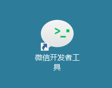

双击创建项目，流程如下：


使用微信扫一下，如下 ：

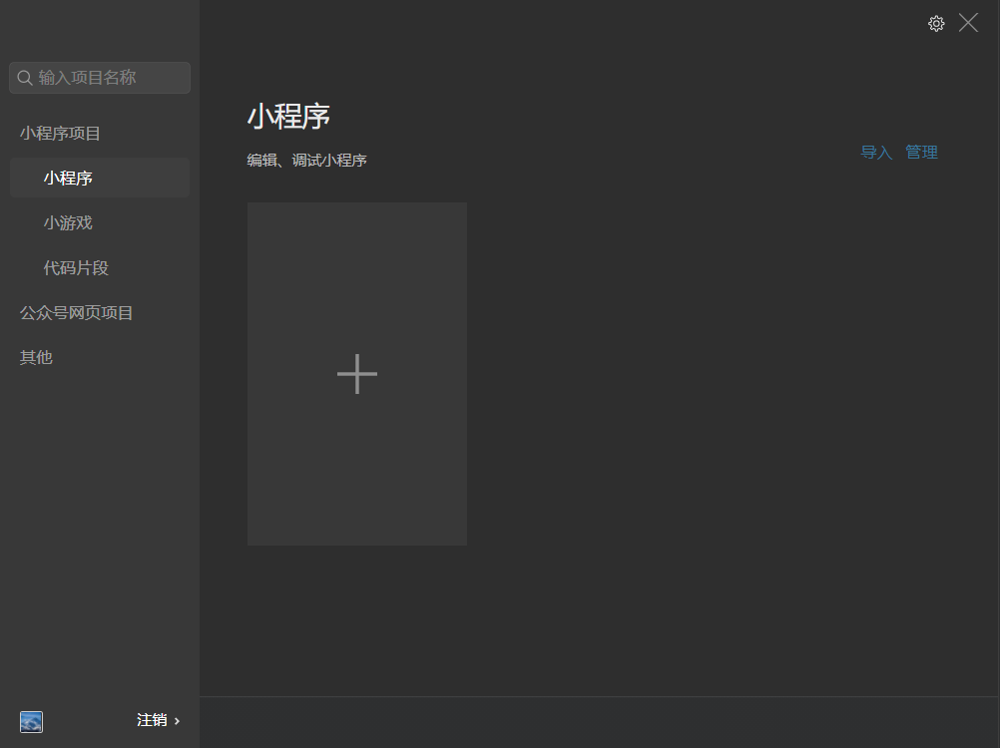

点击+号，创建小程序项目，先创建一个空的文件夹，如下：

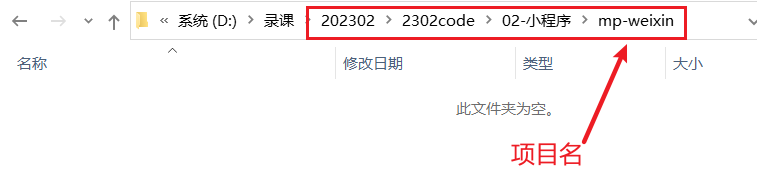

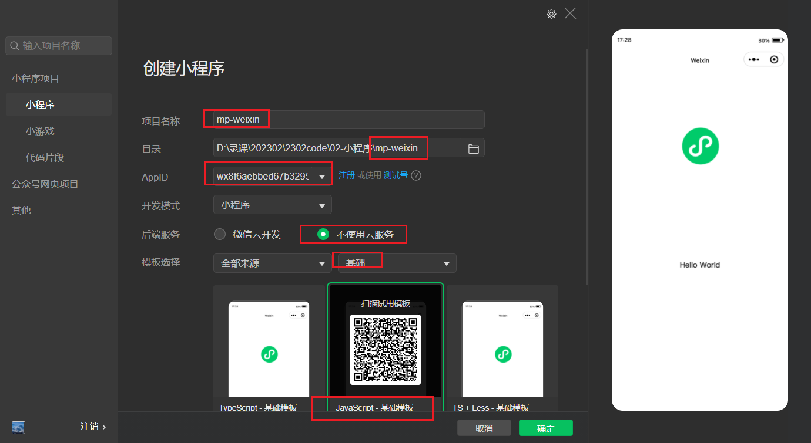

创建项目后，如下：

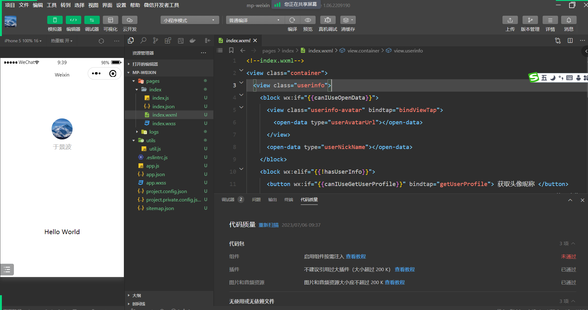

编辑器的设置：

* 工作区划分 （模拟器、编辑器、调试器）
* 切换机型：机型=> 显示比例 => 自适应
* 切换主题：设置=> 外观设置=> 浅色
* 文件保存：设置=> 编辑器设置 => 修改文件保存
* 允许非HTTPS请求：设置 => 项目设置 =>  本地开发采用非HTTPS

### 4，小程序的目录结构

* 一个小程序是由N张页面组成的，一个页面就是一个文件夹
* 一个页面是一个文件夹，一个文件夹中有4个文件
  + xxx.js  页面的逻辑
  + xxx.json  页面的配置
  + xxx.wxml  写结构
  + xxx.wxss  写样式
* .eslitrc.js  约束写代码的规范  后面讲webpack时，讲到eslint时再说
* app.js   小程序的入口文件  
* app.json    小程序的全局配置文件   在小程序中，只要是json文件，都是配置文件
* app.wxss   小程序的全局样式   是针对所有的页面的
* project.config.json   项目的配置文件 
* sitemap.json   做SEO优化

## 三，小程序配置

### 1，小程序配置

* 配置分全局配置 和 页面独有的配置
* 全局配置，不需要我们去记，只需要学会查文档，地址：https://developers.weixin.qq.com/miniprogram/dev/framework/config.html#%E5%85%A8%E5%B1%80%E9%85%8D%E7%BD%AE
* 页面配置，如果全局配置和页面配置冲突了，肯定是页面配置的优先级高 。地址：https://developers.weixin.qq.com/miniprogram/dev/framework/config.html#%E9%A1%B5%E9%9D%A2%E9%85%8D%E7%BD%AE

### 2，在app.json中配置pages

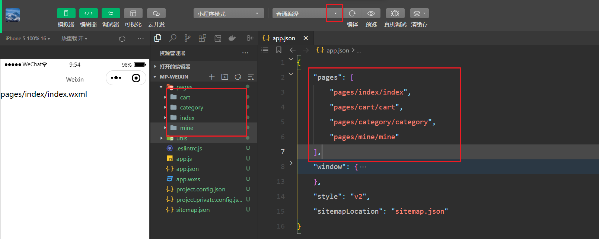

### 3，在app.json中配置window


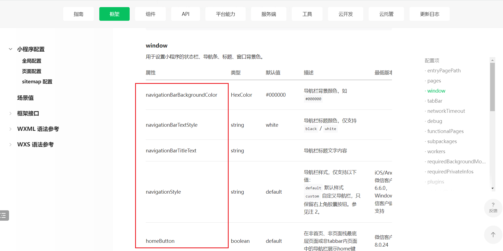

代码如下：

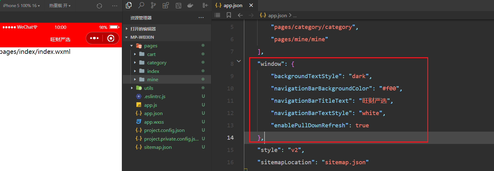

### 4，在app.json中配置tarbbar

```json
{
    "pages": [
        "pages/index/index",
        "pages/cart/cart",
        "pages/category/category",
        "pages/mine/mine"
    ],
    "window": {
        "backgroundTextStyle": "dark",
        "navigationBarBackgroundColor": "#f00",
        "navigationBarTitleText": "旺财严选",
        "navigationBarTextStyle": "white",
        "enablePullDownRefresh": true
    },
    "style": "v2",
    "sitemapLocation": "sitemap.json",
    "tabBar": {
        "color": "#333",
        "selectedColor": "#ff0000",
        "backgroundColor": "#ffffff",
        "borderStyle": "black",
        "list": [{
                "pagePath": "pages/index/index",
                "text": "首页",
                "iconPath": "/assets/tabbar/home.png",
                "selectedIconPath": "/assets/tabbar/home_active.png"
            },
            {
                "pagePath": "pages/category/category",
                "text": "分类",
                "iconPath": "/assets/tabbar/category.png",
                "selectedIconPath": "/assets/tabbar/category_active.png"
            },
            {
                "pagePath": "pages/cart/cart",
                "text": "购物车",
                "iconPath": "/assets/tabbar/cart.png",
                "selectedIconPath": "/assets/tabbar/cart_active.png"
            },
            {
                "pagePath": "pages/mine/mine",
                "text": "我的",
                "iconPath": "/assets/tabbar/profile.png",
                "selectedIconPath": "/assets/tabbar/profile_active.png"
            }
        ]
    }
}
```

目录结构如下：

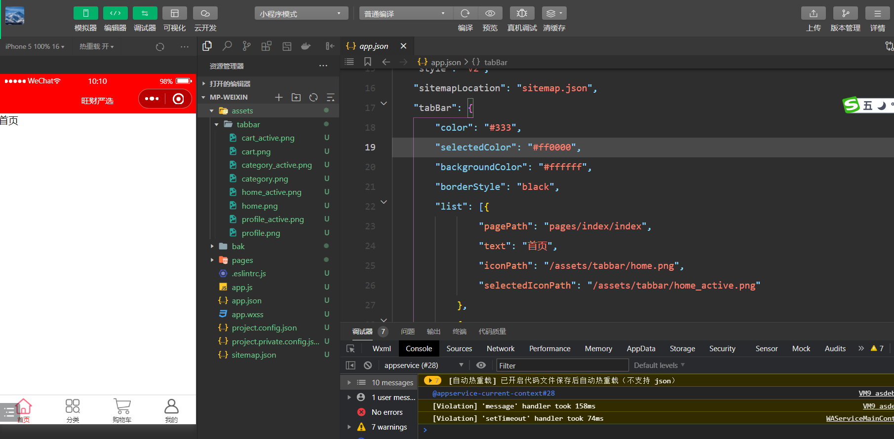

## 四，小程序内置组件

### 1，数据绑定

结构：

```html
<view>------------ 1）数据绑定</view>
<view class="page">
    <view>{{msg}}</view>
    <view>网站：{{site}}, 年龄：{{age}}</view>
    <!-- {{}} 可以放任何表达式 -->
    <view>{{age>18 ? "成年人":"未成年"}}</view>
    <view>{{age*10}}</view>
    <view class="box1 {{showColor ? 'on':''}}">来点颜色</view>
    <button type="primary" size="mini" bindtap="onToggle">改变颜色</button>
</view>
```

样式：

```css
.page {
    border: 1px solid red;
    margin: 10px 10px;
}

.box1 {
    width: 200px;
    height: 200px;
    background-color: red;
}

.on {
    color: white;
}
```

逻辑：

```js
Page({
    // 数据驱动视图
    data: {
        msg: "hello 小程序",
        site: "http://wwww.baidu.com",
        age: 100,
        showColor: true,
    },
    onToggle() {
        // this.showColor = !this.showColor;  数据是响应式的
        // 小程序不是这样，小程序如果想改变数据，又想刷新页面，专属API：setData
        this.setData({
            showColor: !this.data.showColor
        })
    }
})
```

效果：

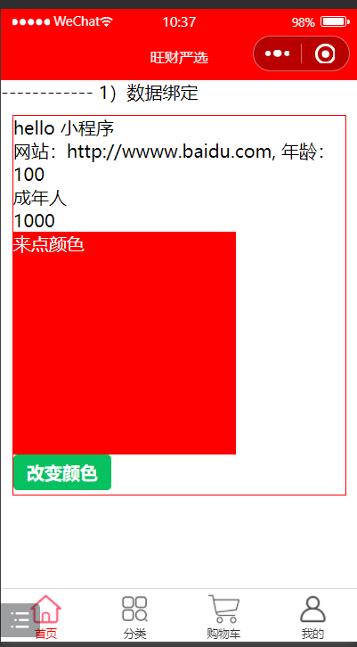

### 2，条件渲染

结构：

```html
<view>------------ 2）条件渲染</view>
<view class="page">
    <view wx:if="{{true}}">我是一个孤独的div wx:if="{{true}}"</view>
    <view wx:if="{{false}}">我是一个孤独的div wx:if="{{false}}"</view>

    <view>-----------------</view>

    <button type="primary" size="mini" bindtap="onToggle">切换div显示与隐藏</button>
    <view wx:if="{{isShow}}" style="color: black; background-color: gold;">我是一个孤独的div</view>

    <view>-----------------</view>

    <view wx:if="{{score>=90}}">优秀</view>
    <view wx:elif="{{score>=80}}">良好</view>
    <view wx:elif="{{score>=60}}">及格</view>
    <view wx:else>不及格</view>
</view>
```

样式：

```css
.page {
    border: 1px solid red;
    margin: 10px 10px;
}
```

逻辑：

```js
Page({
    // 数据驱动视图
    data: {
        isShow: true,
        score: 88,
    },
    onToggle() {
        this.setData({
            isShow: !this.data.isShow
        })
    }
})
```

效果：

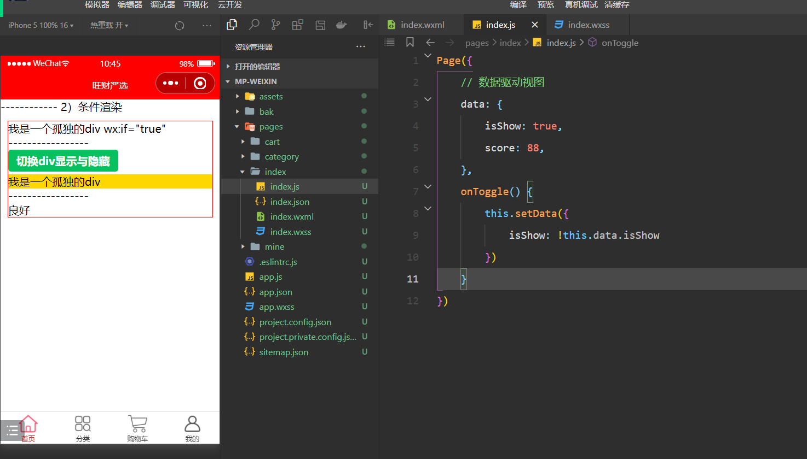

### 3，列表渲染

结构：

```html
<view>------------ 3）列表渲染</view>
<view class="page">

    <!-- 循环字符串 -->
    <view wx:for="malu" wx:key="*this">
        {{item}} --- {{index}}
    </view>

    <view>--------------------</view>

    <!-- 循环一个数字 -->
    <view wx:for="{{5}}" wx:key="*this">
        {{item}} --- {{index}}
    </view>

    <view>--------------------</view>

    <!-- 循环一个对象,item表示值，index表示键 -->
    <view wx:for="{{ obj }}" wx:key="*this">
        {{item}} --- {{index}}
    </view>

    <view>--------------------</view>

    <!-- 循环一个数组 -->
    <view wx:for="{{ singers }}">
        {{item}} -- {{index}}
    </view>
    <view>--------------------</view>
    <view wx:for="{{ singers }}" wx:for-item="singer" wx:for-index="i">
        {{singer}} -- {{i}}
    </view>
</view>
```

样式：

```css
.page {
    border: 1px solid red;
    margin: 10px 10px;
}
```

逻辑：

```js
Page({
    // 数据驱动视图
    data: {
        singers: ["林忆莲", "谭晶", "迪玛希", "杜丽莎", "狮子合唱团", "袁娅维"],
        obj: {
            name: 'ml',
            age: 18
        }
    }
})
```

效果：

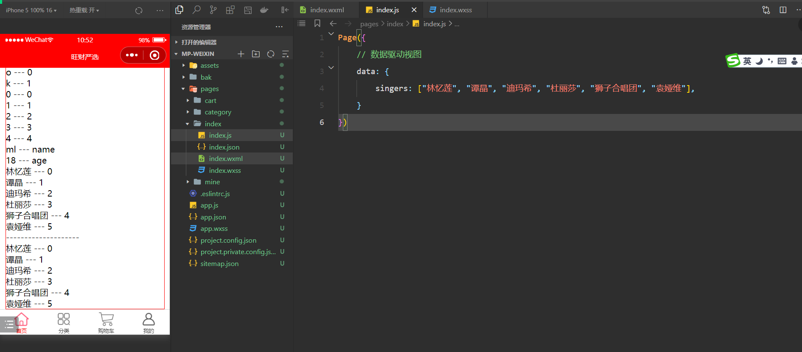

###  4，样式

结构：

```html
<view>------------ 4）样式</view>
<view style="width: 200rpx; height: 200rpx; background-color: gold;">行内样式</view>

<!-- 
     rem的目的是适配：大屏上盒子大一点，小屏上盒子小一点。
     rpx: 也是为了适配   在iphone6: 2rpx = 1px
 -->
<view class="page item ml">样式学习</view>

<!-- 
    全局样式：定义在app.wxss中的样式，针对所有的页面。
 -->
```

样式：

```css
.page {
    border: 1px solid red;
    margin: 10px 10px;
}

.item {
    width: 300rpx;
    height: 300rpx;
    background-color: gold;
}

.ml {
    color: red;
}
```

逻辑：

```js
Page({
    data: {}
})
```

全局样式：

```css
view {
    font-size: 24px;
}
```

效果：

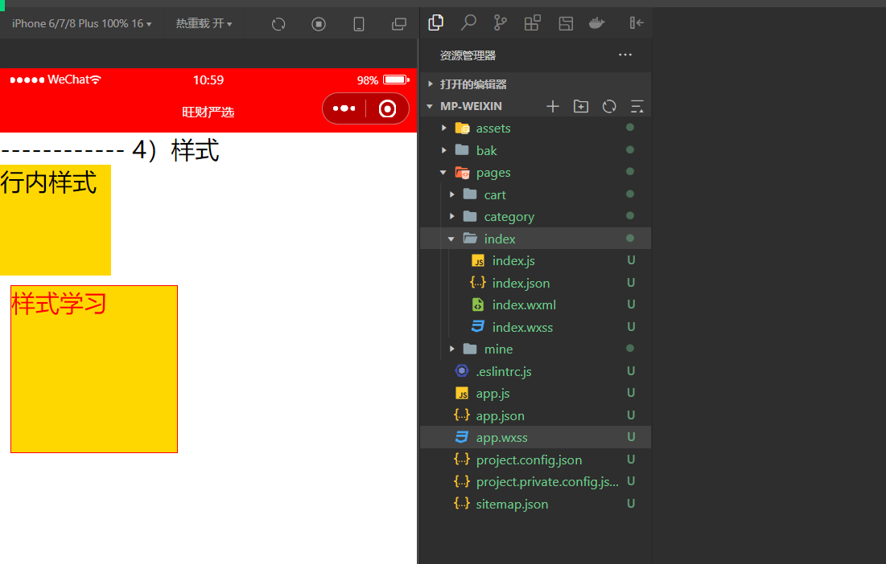

### 5，block标签

结构：

```html
<view>------------ 5）block标签</view>
<!-- block标签等价与vue中的template，等价与react中的React.Fragment或<> -->
<view class="page">
    <block wx:if="{{false}}">
        <view>姓名：malu</view>
        <view>年龄：18</view>
    </block>
    <block wx:else>
        <view>姓名：wc</view>
        <view>年龄：28</view>
    </block>
</view>
```

样式：

```css
.page {
    border: 1px solid red;
    margin: 10px 10px;
}
```

逻辑：

```js
Page({
    data: {}
})
```

效果：

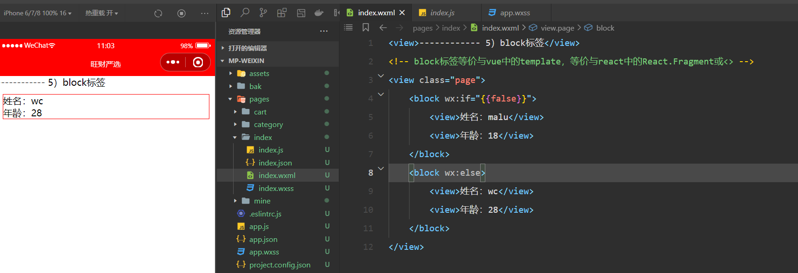

### 6，text

结构：

```html
<view>------------ 6）text标签</view>
<view class="page">
    <!-- span标签怎么用，text就怎么用 -->
    <text>码路 \n</text>
    <text>码路 \n</text>
    <text>码路 \n</text>
    <text selectable="{{true}}">码路教育 \n</text>
    <text selectable="{{false}}">码路教育 \n</text>
    <text user-select="{{true}}">码路教育 \n</text>
    <view></view>
    <text space="emsp">码路 教育 \n</text>
    <text space="ensp">码路 教育 \n</text>
    <text space="nbsp">码路 教育 \n</text>
    <text>2>1 \n</text>
    <text decode>2&gt;1 \n</text>
</view>
```

效果：

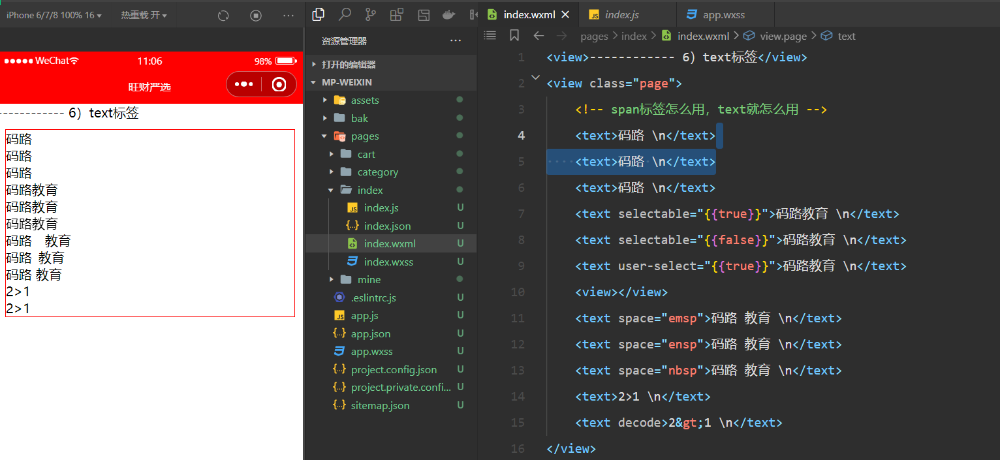

### 7，button

结构：

```html
<view>------------ 7）button标签</view>
<view class="page">
    <button>默认按钮</button>
    <!-- size -->
    <button size="mini">按钮</button>
    <button size="mini">按钮</button>
    <!-- type -->
    <button size="mini" type="primary">按钮</button>
    <button size="mini" type="warn">按钮</button>
    <!-- plain 镂空-->
    <button size="mini" type="primary" plain="{{true}}">按钮</button>
    <!-- disabled -->
    <button size="mini" type="primary" disabled="{{true}}">按钮</button>
    <!-- loading -->
    <button size="mini" type="primary" loading="{{true}}">按钮</button>
    <!-- hover-class -->
    <button size="mini" hover-class="pressed">按钮</button>
    <!-- open-type 微信提供的一些能力-->
    <button size="mini" hover-class="pressed" open-type="contact">客服</button>
    <button size="mini" hover-class="pressed" open-type="share">分享</button>
    <button size="mini" hover-class="pressed" open-type="getPhoneNumber">获取电话</button>
    <button size="mini" hover-class="pressed" open-type="getUserInfo">获取用户信息</button>
</view>
```

样式：

```css
.page {
    border: 1px solid red;
    margin: 10px 10px;
}

.pressed {
    background: red;
    color: white;
}
```

效果：

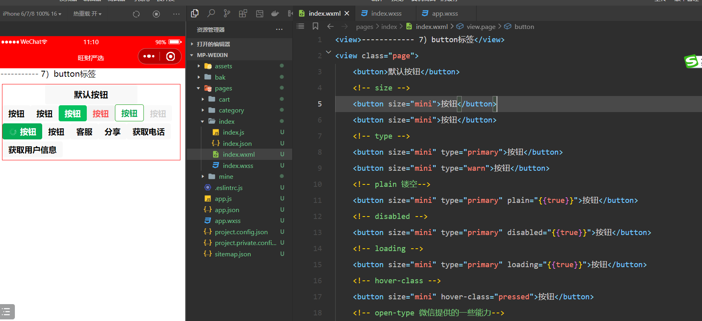

### 8，image

结构：

```html
<view>------------ 8）image</view>
<view class="page">
    <!-- 一个image组件，默认大小是320*240 -->
    <image show-menu-by-longpress src="../../static/images/icon/home_essays_icon_show.png"></image>
    <!-- 由于小程序上线，对小程序的体积是有要求，所以图片通常使用线上的图片 -->
    <image src="https://img0.baidu.com/it/u=1645014943,3294260658&fm=253&fmt=auto&app=138&f=JPEG" />
    <button bindtap="handleChooseAlbum">拍照/相册</button>
    <image src="{{imgPath}}"></image>
    <view>-------------------</view>
    <view bindtap="uploadImage">请上传图片+</view>
    <view class="container">
        <image wx:for="{{imageList}}" src="{{item}}"></image>
    </view>
</view>
```

样式：

```css
.page {
    border: 1px solid red;
    margin: 10px 10px;
}

.container image {
    width: 200rpx;
    height: 200rpx;
    padding: 5rpx;
}
```

逻辑：

```js
Page({
    data: {
        imgPath: "",
        imageList: ['/static/images/icon/balancepay_icon_show.png', '/static/images/icon/balancepay_icon_show.png']
    },
    uploadImage() {
        let that = this;
        wx.chooseImage({
            count: 9,
            sizeType: ['original', 'compressed'],
            sourceType: ['album', 'camera'],
            success(res) {
                // 覆盖原本的图片
                // that.setData({
                //     imageList: res.tempFilePaths
                // })

                // 默认图片 + 选择的图片；
                console.log("--res.tempFilePaths", res.tempFilePaths);
                that.setData({
                    imageList: that.data.imageList.concat(res.tempFilePaths)
                });
                // 图片目前是上传到了内存
                // 后期需要把图上上传到远程服务器（腾讯云中的对象存储）
            }
        })
    },
    handleChooseAlbum() {
        wx.chooseImage({
            count: 1,
            sizeType: ['original', 'compressed'],
            sourceType: ['album', 'camera'],
            success: res => {
                // tempFilePath可以作为img标签的src属性显示图片
                const tempFilePaths = res.tempFilePaths
                this.setData({
                    imgPath: tempFilePaths
                })
            }
        })
    }
})
```

效果：

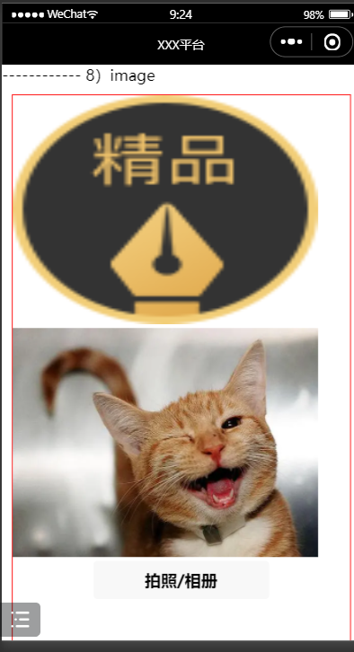

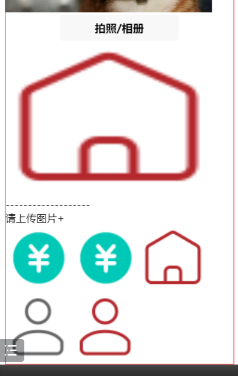

### 9，progress

结构：

```html
<view>------------ 9）progress</view>
<view class="page">
    <progress percent="20" show-info stroke-width="20" />
    <progress percent="20" show-info border-radius="10" stroke-width="30" />
    <!-- 动态的进度条 -->
    <progress percent="60" color="#10AEFF" active stroke-width="30" />

    <view>------------------------------</view>

    <view wx:for="{{imageList}}">
        <view>{{item.title}}</view>
        <progress percent="{{item.percent}}" show-info></progress>
    </view>

    <button bindtap="changePercent">点击</button>
</view>
```

样式：

```css
.page {
    border: 1px solid red;
    margin: 10px 10px;
}
```

逻辑：

```js
Page({
    data: {
        imageList: [{
                id: 1,
                title: "图片1",
                percent: 20
            },
            {
                id: 1,
                title: "图片2",
                percent: 30
            },
            {
                id: 1,
                title: "图片3",
                percent: 60
            },
        ]
    },
    changePercent() {
        // 方式1：不行
        // this.setData({
        //     this.imageList[0].percent : 80
        // })

        // 方式2： 不行
        // 由于需要全部修改， 所以性能差。
        // let dataList = this.data.imageList;
        // dataList[0].percent = 80;
        // this.setData({
        //     imageList: dataList
        // })

        // 方式3:推荐
        // 如何修改data中的局部数据
        let count = 2;
        this.setData({
            ["imageList[0].percent"]: 80,
            ["imageList[1].title"]: '上传成功',
            ["imageList[" + count + "].title"]: '上传失败',
        })
    }
})
```

效果：

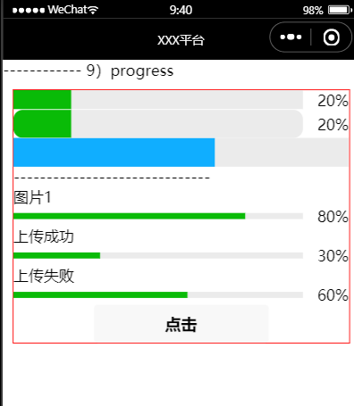

### 10，icon

结构：

```html
<view>------------ 10）icon</view>
<view class="page">
    <view class="icon-box">
        <icon class="icon-box-img" type="success"></icon>
        <icon class="icon-box-img" type="info"></icon>
        <icon class="icon-box-img" type="warn"></icon>
        <icon class="icon-box-img" type="waiting"></icon>
        <icon class="icon-box-img" type="cancel" size="30"></icon>
    </view>
</view>
```

样式：

```css
.page {
    border: 1px solid red;
    margin: 10px 10px;
}
```

逻辑：

```js
无
```

效果：

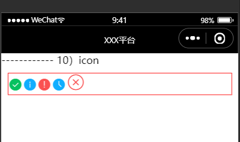

### 11，input

结构：

```html
<view>------------ 11）input</view>
<view class="page">
    <!-- vant也有对应的小程序版本，在真实开发中，一般情况下，都会使用一些第三方的UI组件库，如：vant -->
    <input type="text" auto-focus placeholder="请输入用户名" />
    <!-- type=number，在真机上，只会拉起数字键盘，  但是不限制你输入其它字母-->
    <input type="number" auto-focus placeholder="请输入手机" />
    <view>-----------------------</view>
    <!-- vue: v-model -->
    <input bindinput="changeUname" value="{{uname}}" type="text" auto-focus placeholder="请输入用户名" />
    <input bindinput="changePwd" value="{{pwd}}" type="text" auto-focus placeholder="请输入密码" />
</view>
```

样式：

```css
.page {
    border: 1px solid red;
    margin: 10px 10px;
}
```

逻辑：

```js
Page({
    data: {
        uname: "wc",
        pwd: "123"
    },
    changeUname(e) {
        // console.log("--e:", e.detail.value);
        this.setData({
            uname: e.detail.value
        })
    },
    changePwd(e) {
        this.setData({
            pwd: e.detail.value
        })
    }
})
```

效果：

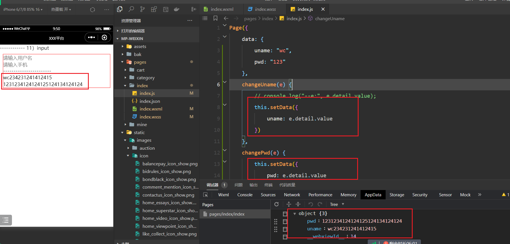

### 12，滚动视图

结构：

```html
<view>------------ 12）滚动视图</view>
<scroll-view class="tab" scroll-x>
    <text class="item1">新闻1</text>
    <text class="item1">新闻2</text>
    <text class="item1">新闻3</text>
    <text class="item1">新闻4</text>
    <text class="item1">新闻5</text>
    <text class="item1">新闻6</text>
    <text class="item1">新闻7</text>
    <text class="item1">新闻8</text>
    <text class="item1">新闻9</text>
    <text class="item1">新闻10</text>
</scroll-view>

<scroll-view scroll-y class="container-y">
    <view wx:for="{{10}}" class="item02"></view>
</scroll-view>

<scroll-view scroll-x class="container-x">
    <view wx:for="{{10}}" class="item01"></view>
</scroll-view>
```

样式：

```css
.tab {
    width: 100%;
    height: 80rpx;
    white-space: nowrap;
    border: 1px solid red;
    overflow: hidden;
}

.tab .item1 {
    display: inline-block;
    width: 140rpx;
    height: 80rpx;
    line-height: 80rpx;
}

.container-y {
    height: 250px;
    border: 1px solid red;
}

.item02 {
    height: 100px;
    background-color: red;
    margin: 10px;
}

.container-x {
    /* 里面的子元素不换行 */
    white-space: nowrap;
    border: 1px solid red;
}

.item01 {
    width: 100px;
    height: 100px;
    background-color: red;
    margin: 10px;
    display: inline-block;
}
```

逻辑：

```js
无
```

效果：

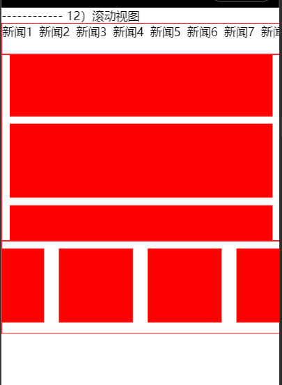

### 13，轮播图组件

结构：

```html
<view>------------ 13）轮播图组件</view>
<view class="page">
    <swiper indicator-dots="true" indicator-color="yellow" interval="3000" autoplay="true">
        <swiper-item>
            <image style="width: 100%;" src="https://img0.baidu.com/it/u=1645014943,3294260658&fm=253&fmt=auto&app=138&f=JPEG" alt=""></image>
        </swiper-item>
        <swiper-item>
            <image style="width: 100%;" src="https://img1.baidu.com/it/u=2599614845,484438007&fm=253&fmt=auto&app=138&f=JPEG?w=500&h=500" alt=""></image>
        </swiper-item>
    </swiper>
</view>
```

样式：

```css
无
```

逻辑：

```js
无
```

效果：

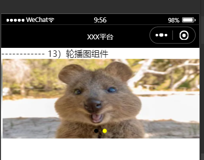

## 五，绘制页面

### 1，练习页面一

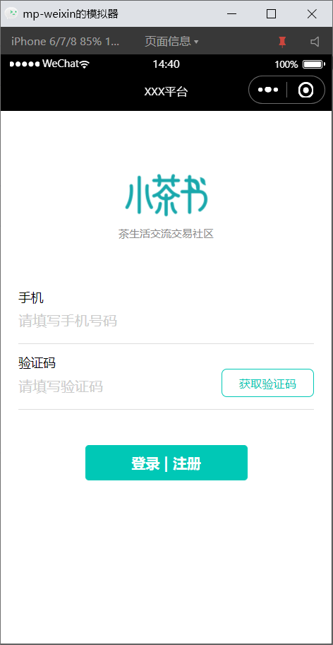

结构：

```html
<view class="logo">
    <image src="/static/images/icon/logo_icon_show.png"></image>
    <text>茶生活交流交易社区</text>
</view>

<view class="form">
    <view class="row-group">
        <text>手机</text>
        <input maxlength="11" placeholder="请输入手机号码" placeholder-class="txt" />
    </view>
    <view class="row-group">
        <text>验证码</text>
        <input maxlength="4" placeholder="请输写验证骊" placeholder-class="txt" />
        <view class="code" bindtap="onClickCheckCode">获取验证码</view>
    </view>
    <view>
        <button class="submit">登录 | 注册</button>
    </view>
</view>
```

样式：

```css
.logo {
    display: flex;
    flex-direction: column;
    align-items: center;
}

.logo image {
    margin-top: 140rpx;
    width: 216rpx;
    height: 100rpx;
}

.logo text {
    font-size: 24rpx;
    color: #8c8c8c;
    margin-top: 26rpx;
    margin-bottom: 50rpx;
    font-weight: 400;
    line-height: 24rpx;
}

.form {
    padding: 40rpx;
}

.form .row-group {
    border-bottom: 1rpx solid #ddd;
    position: relative;
    padding: 20rpx 0;
}

.form .row-group text {
    font-size: 28rpx;
}

.form .row-group input {
    padding: 10rpx 0;
}

.form .row-group .txt {
    color: #ccc;
}

.form .row-group .code {
    position: absolute;
    right: 0;
    bottom: 26rpx;

    width: 206rpx;
    height: 60rpx;
    border: 2rpx solid #00c8b6;
    border-radius: 12rpx;
    font-size: 26rpx;
    font-weight: 400;
    color: #00c8b6;
    display: flex;
    align-items: center;
    justify-content: center;
}

.form .submit {
    margin-top: 80rpx;
    color: #fff;
    border: 2rpx solid #00c8b6;
    background-color: #00c8b6;
    font-size: 32rpx;
    font-weight: bold;
}
```

### 2，练习页面二

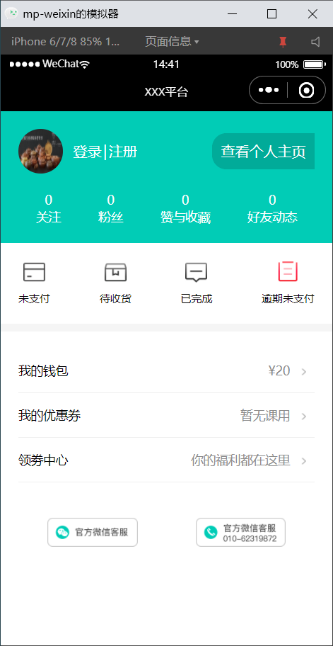

结构：

```html
<view class="container">
    <view class="top-view">
        <view class="user">
            <view class="row">
                <image class="avatar" src="/static/images/auction/hh.png"></image>
                <view class="name">
                    <navigator url="/pages/login/login">登录</navigator>
                    |
                    <navigator url="/pages/login/login">注册</navigator>
                </view>
            </view>
            <view class="site">查看个人主页</view>
        </view>
        <view class="numbers">
            <view class="row">
                <text>0</text>
                <text>关注</text>
            </view>
            <view class="row">
                <text>0</text>
                <text>粉丝</text>
            </view>
            <view class="row">
                <text>0</text>
                <text>赞与收藏</text>
            </view>
            <view class="row">
                <text>0</text>
                <text>好友动态</text>
            </view>
        </view>
    </view>

    <view class="middle-view">
        <navigator class="item" url="/pages/order/order">
            <image src="/static/images/icon/transaction_order1_icon_show.png"></image>
            <text>未支付</text>
        </navigator>
        <navigator class="item" url="/pages/order/order">
            <image src="/static/images/icon/transaction_order2_icon_show.png"></image>
            <text>待收货</text>
        </navigator>
        <navigator class="item" url="/pages/order/order">
            <image src="/static/images/icon/transaction_order3_icon_show.png"></image>
            <text>已完成</text>
        </navigator>
        <navigator class="item" url="/pages/order/order">
            <image src="/static/images/icon/transaction_order5_icon_show.png"></image>
            <text>逾期未支付</text>
        </navigator>
    </view>

    <view class="function-view">
        <view class="row">
            <view class="left">我的钱包</view>
            <view class="right">
                <text>¥20</text>
                <image class="go-icon" src='/static/images/icon/to_icon_show_small.png'></image>
            </view>
        </view>
        <navigator class="row" url="/pages/myCoupon/myCoupon">
            <view class="left">我的优惠券</view>
            <view class="right">
                <text>暂无课用</text>
                <image class="go-icon" src='/static/images/icon/to_icon_show_small.png'></image>
            </view>
        </navigator>
        <navigator class="row" url="/pages/coupon/coupon">
            <view class="left">领劵中心</view>
            <view class="right">
                <text>你的福利都在这里</text>
                <image class="go-icon" src='/static/images/icon/to_icon_show_small.png'></image>
            </view>
        </navigator>
    </view>

    <view class="contact-view">
        <button open-type="contact">
            <image src="/static/images/icon/wechat_contact_icon_show.png"></image>
        </button>
        <button bindtap="onClickCall">
            <image src="/static/images/icon/phone_contact_icon_show.png"></image>
        </button>
    </view>
</view>
```

样式：

```css
.top-view {
    background-color: #01ccb6;
    color: white;
    padding: 40rpx;
}

.top-view .user {
    display: flex;
    justify-content: space-between;
    flex-direction: row;
    align-items: center;
}

.top-view .user .row {
    display: flex;
    flex-direction: row;
    justify-content: flex-start;
    align-items: center;
}

.top-view .user .avatar {
    width: 100rpx;
    height: 100rpx;
    border-radius: 50%;
}

.top-view .user .name {
    display: flex;
    flex-direction: row;
    justify-content: flex-start;
    padding-left: 20rpx;
}

.top-view .user .name navigator {
    padding: 0 5rpx;
}

.top-view .site {
    background-color: rgba(0, 0, 0, 0.16);
    padding: 20rpx;
    border-top-left-radius: 32rpx;
    border-bottom-left-radius: 32rpx;
}

.top-view .numbers {
    display: flex;
    justify-content: space-between;
    font-size: 28rpx;
    padding: 40rpx;
    padding-bottom: 0rpx;
}

.top-view .numbers .row {
    display: flex;
    flex-direction: column;
    align-items: center;
}

.middle-view {
    padding: 40rpx;
    display: flex;
    flex-direction: row;
    justify-content: space-between;
    font-size: 25rpx;
    border-bottom: 16rpx solid #f5f5f5;
}

.middle-view .item {
    display: flex;
    flex-direction: column;
    align-items: center;
}

.middle-view .item image {
    width: 50rpx;
    height: 50rpx;
    margin-bottom: 20rpx;
}

.function-view {
    padding: 40rpx;
    font-size: 28rpx;
}

.function-view .row {
    display: flex;
    flex-direction: row;
    justify-content: space-between;

    border-bottom: 1px solid #efefef;
    padding: 30rpx 0;
}

.function-view .row .right {
    color: #8c8c8c;
}

.function-view .row .go-icon {
    margin: 0 20rpx;
    width: 16rpx;
    height: 16rpx;
}

.contact-view {
    padding: 40rpx;
    display: flex;
    flex-direction: row;
    justify-content: space-around;
}

.contact-view button {
    background-color: transparent;
    border: 0;
    padding: 0;
}

.contact-view button::after {
    border: 0;
}

.contact-view image {
    width: 204rpx;
    height: 66rpx;
}
```

## 六，事件绑定

### 1，简单事件绑定

结构：

```html
<view>---------------- 1）事件绑定</view>
<view class="page">
    <button type="primary" bindtap="onBtnTap">点我</button>
</view>
```

样式：

```css
.page {
    border: 1px solid red;
    margin: 10px 10px;
}
```

逻辑：

```js
Page({
    onBtnTap(e) {
        console.log("点我干啥~");
    }
})
```

效果：

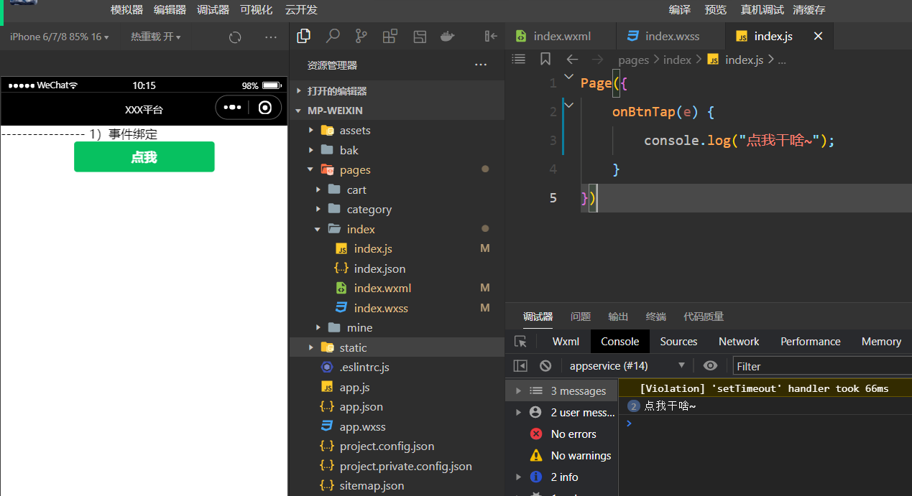

### 2，target和currentTarget

结构：

```html
<view>---------------- 2）target和currentTarget</view>
<view class="page">
    <!-- html5中的自定义属性必须以data-打头 -->
    <view data-name='ml' class="outer" bindtap="onOuterTap" id="outer">
        <view data-age='18' class="inner" id="inner"></view>
    </view>
</view>
```

样式：

```css
.page {
    border: 1px solid red;
    margin: 10px 10px;
}

.outer {
    display: flex;
    justify-content: center;
    align-items: center;
    width: 400rpx;
    height: 400rpx;
    background-color: skyblue;
}

.inner {
    width: 200rpx;
    height: 200rpx;
    background-color: gold;
}
```

逻辑：

```js
Page({
    onOuterTap(e) {
        console.log(e);
        // target表示你事件发生的那个元素，就是你实打实点击的那个元素
        // currentTarget 处理事件的那个元素
        console.log(e.target);
        console.log(e.currentTarget);
    }
})
```

效果：

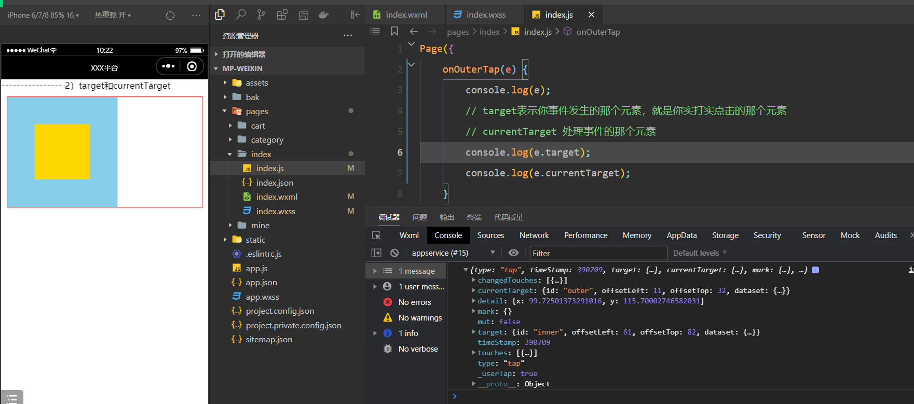

### 3，如何传参

结构：

```html
<view>---------------- 3）如何传参</view>
<view class="page">
    <!-- 绑定事件又想传参，必须通过自定义属性 -->
    <view data-name="wc" data-age="18" data-address="bj" bindtap="onArgumentsTap" style="width:200rpx;height:200rpx;background-color:red;">
    </view>
</view>
```

样式：

```css
.page {
    border: 1px solid red;
    margin: 10px 10px;
}
```

逻辑：

```js
Page({
    onArgumentsTap(e) {
        console.log(e.currentTarget.dataset);
    },
})
```

效果：

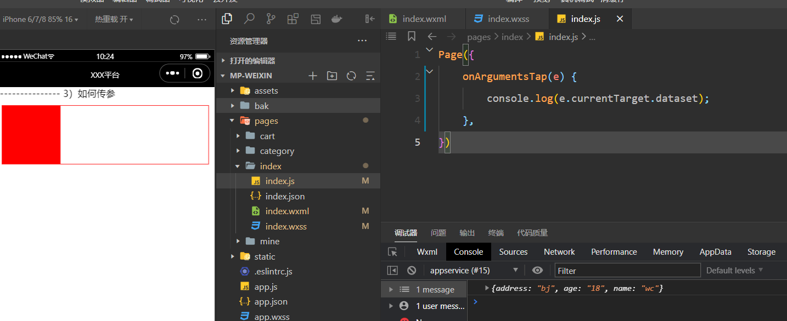

### 4，Tabbar案例

结构：

```html
<view>---------------- 4）tabbar案例</view>
<view class="page">
    <view class="tab-control">
        <block wx:for="{{titles}}" wx:key="*this">
            <view bindtap="onItemTap" data-index="{{index}}" class=" item {{index===currentIndex ?'active':''}}">
                <text class="title">{{item }}</text>
            </view>
        </block>
    </view>
</view>
```

样式：

```css
.page {
    border: 1px solid red;
    margin: 10px 10px;
}

.tab-control {
    display: flex;
    height: 60rpx;
    line-height: 40rpx;
    text-align: center;
}

.tab-control .item {
    flex: 1;
}

.tab-control .item.active {
    color: red;
}
```

逻辑：

```js
Page({
    data: {
        titles: ["电影", "音乐", "娱乐", "体育"],
        currentIndex: 0
    },
    onItemTap(e) {
        this.setData({
            currentIndex: e.currentTarget.dataset.index
        })
    },
})
```

效果：

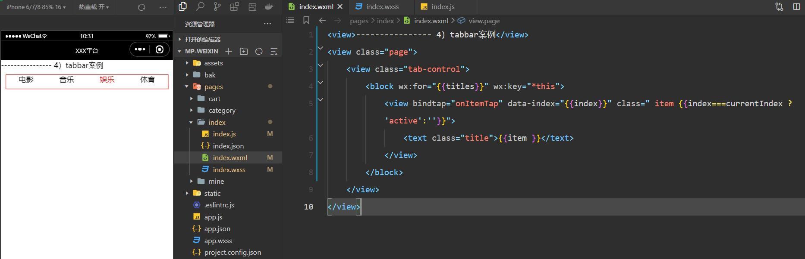

### 5，事件冒泡和捕获

结构：

```html
<view>---------------- 5）事件冒泡和捕获（默认是冒泡）</view>
<view class="page">
    <view class="view01" bindtap="onView01Tap">
        <view class="view02" bindtap="onView02Tap">
            <view class="view03" bindtap="onView03Tap"></view>
        </view>
    </view>
</view>

或

<view>---------------- 5）事件冒泡和捕获（默认是冒泡）</view>
<view class="page">
    <view class="view01" bind:tap="onView01Tap">
        <view class="view02" bind:tap="onView02Tap">
            <view class="view03" bind:tap="onView03Tap"></view>
        </view>
    </view>
</view>

或

<view>---------------- 5）事件冒泡和捕获（捕获）</view>
<view class="page">
    <view class="view01" capture-bind:tap="onView01CaptureTap" bind:tap="onView01Tap">
        <view class="view02" capture-bind:tap="onView02CaptureTap" bind:tap="onView02Tap">
            <view class="view03" capture-bind:tap="onView03CaptureTap" bind:tap="onView03Tap"></view>
        </view>
    </view>
</view>
```

样式：

```css
.page {
    border: 1px solid red;
    margin: 10px 10px;
}

.view01 {
    display: flex;
    justify-content: center;
    align-items: center;
    width: 600rpx;
    height: 600rpx;
    background-color: gold;
}

.view02 {
    display: flex;
    justify-content: center;
    align-items: center;
    width: 400rpx;
    height: 400rpx;
    background-color: skyblue;
}

.view03 {
    width: 200rpx;
    height: 200rpx;
    background-color: pink;
}
```

逻辑：

```js
Page({
    onView01Tap(e) {
        console.log("View01");
    },
    onView02Tap(e) {
        console.log("View02");
    },
    onView03Tap(e) {
        console.log("View03");
    },
    onView01CaptureTap() {
        console.log("View01 CaptureBind");
    },
    onView02CaptureTap() {
        console.log("View02 CaptureBind");
    },
    onView03CaptureTap() {
        console.log("View03 CaptureBind");
    },
})
```

效果：

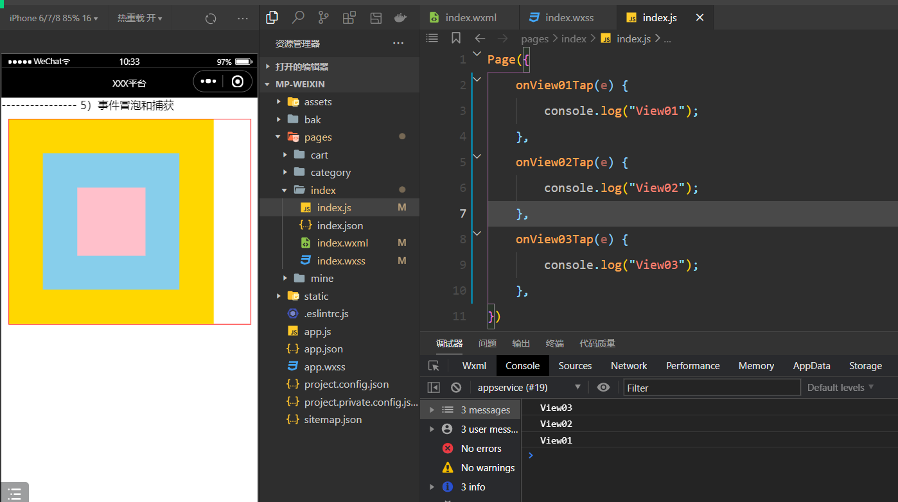

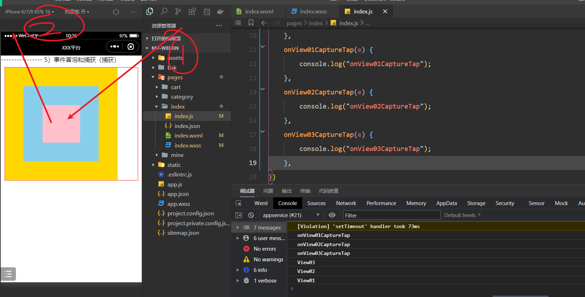

### 6，阻止冒泡

结构：

```html
<view>---------------- 6）阻止冒泡</view>
<view class="page">
    <!-- 把bind换成catch就可以阻止事件冒泡 -->
    <view class="view01" catch:tap="onView01Tap">
        <view class="view02" catch:tap="onView02Tap">
            <view class="view03" catch:tap="onView03Tap"></view>
        </view>
    </view>
</view>
```

样式：

```css
.page {
    border: 1px solid red;
    margin: 10px 10px;
}

.view01 {
    display: flex;
    justify-content: center;
    align-items: center;
    width: 600rpx;
    height: 600rpx;
    background-color: gold;
}

.view02 {
    display: flex;
    justify-content: center;
    align-items: center;
    width: 400rpx;
    height: 400rpx;
    background-color: skyblue;
}

.view03 {
    width: 200rpx;
    height: 200rpx;
    background-color: pink;
}
```

逻辑：

```js
Page({
    onView01Tap(e) {
        console.log("View01");
    },
    onView02Tap(e) {
        console.log("View02");
    },
    onView03Tap(e) {
        console.log("View03");
    },
})
```

效果：

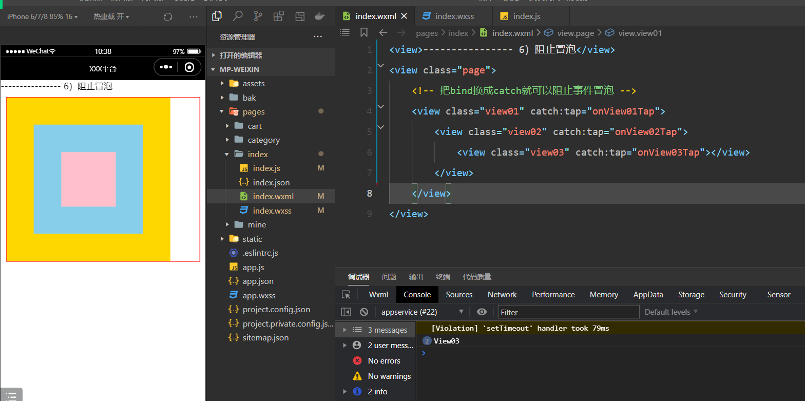

### 7，传递多个参数（mark）

结构：

```html
<view>---------------- 7）传递多个参数</view>
<view class="page">
    <view mark:name="malu" mark:age="18" bindtap="onArgumentsTap2">
        <text mark:address="bj">传递多个参数</text>
    </view>
</view>
```

样式：

```css
无
```

逻辑：

```js
Page({
    onArgumentsTap2(e) {
        console.log(e.mark);
    },
})
```

效果：

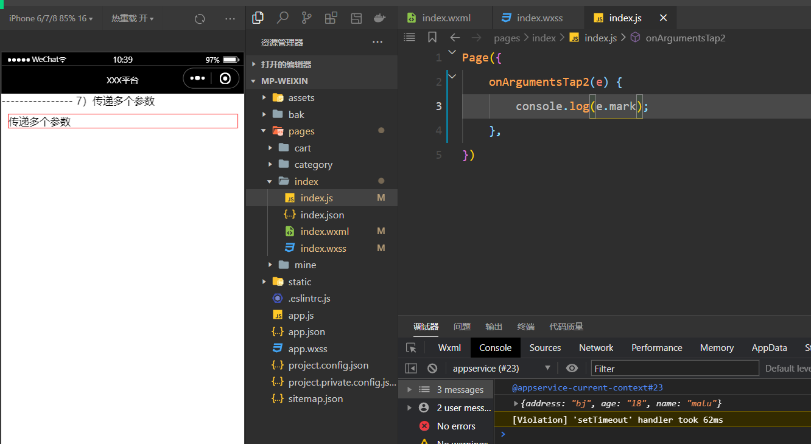

## 七，组件通信 

### 1，父传子

定义组件如下：

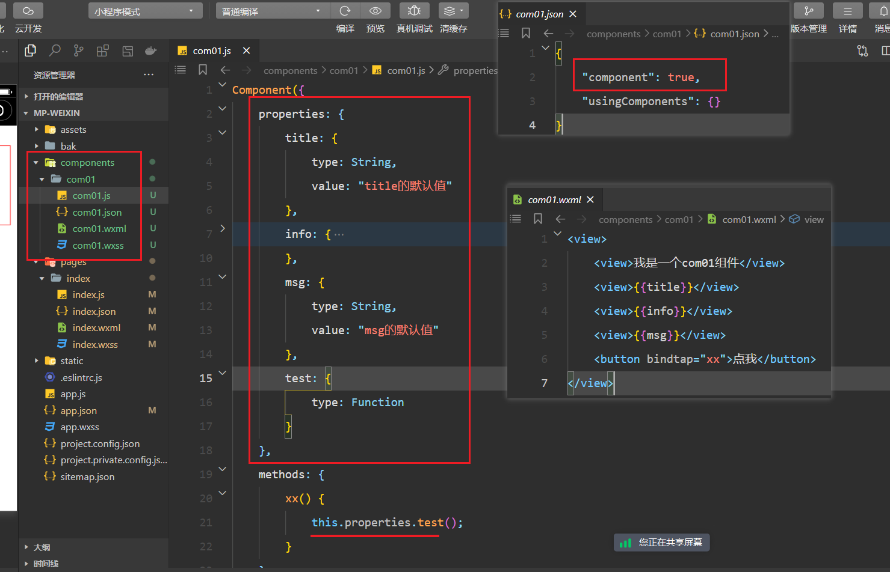

在页面中注册组件：

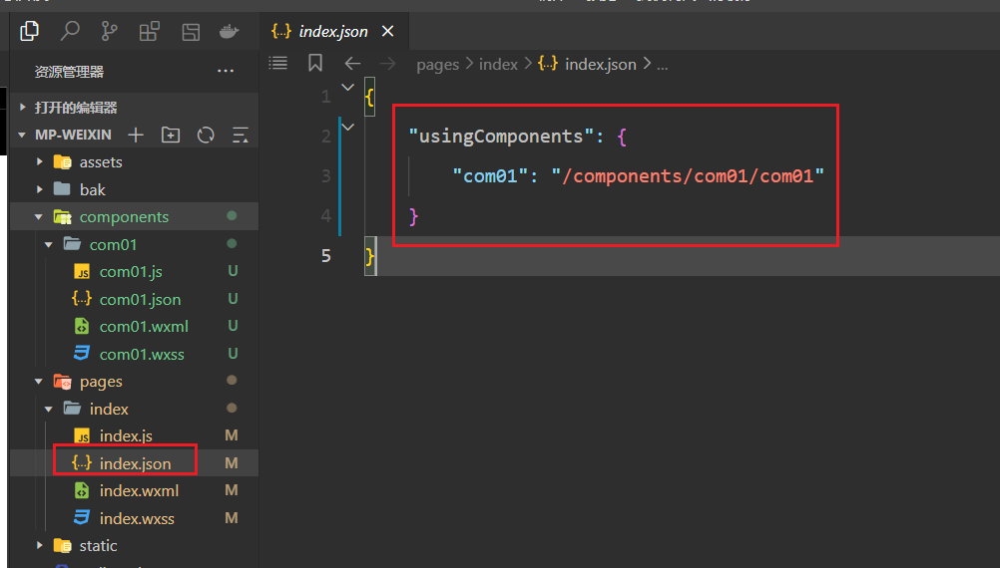

使用组件，如下：

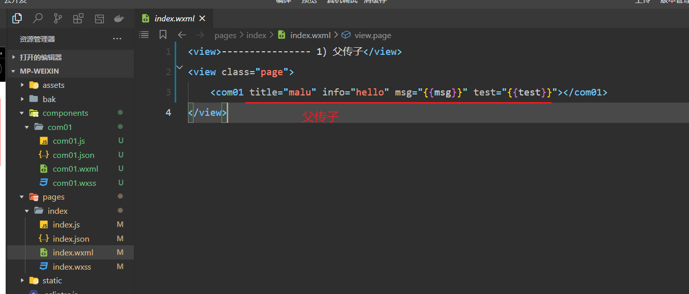

数据如下：

```js
Page({
    data: {
        msg: "hello 小程序",
        test(data) {
            console.log("页面中的test方法~", data);
        }
    },
})
```

效果如下 ：

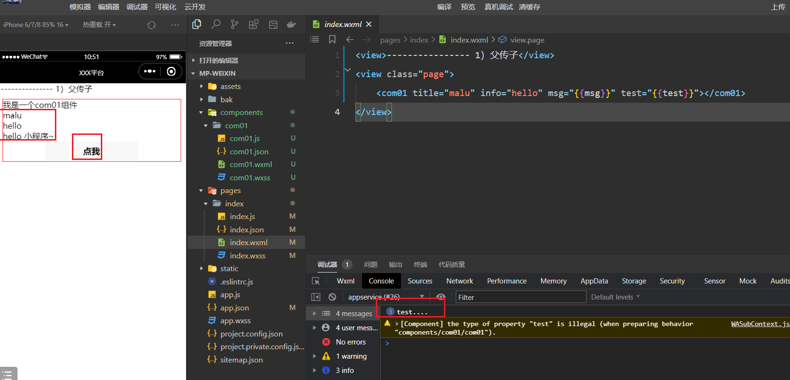

### 2，子传父

页面中使用子组件，在子组件上绑定自定义事件，如下：

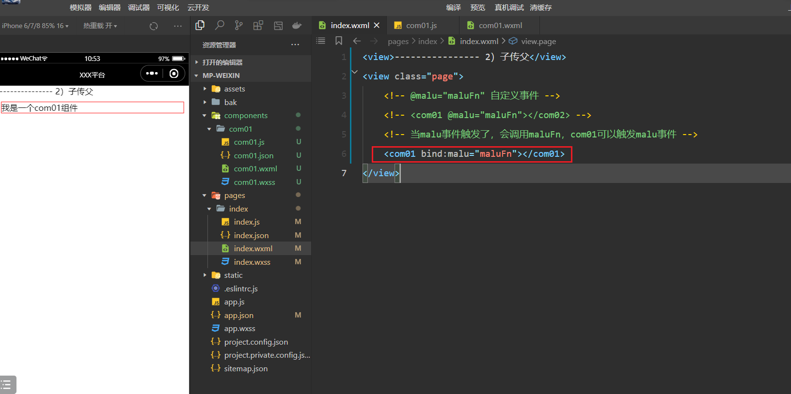

不要忘了注册：

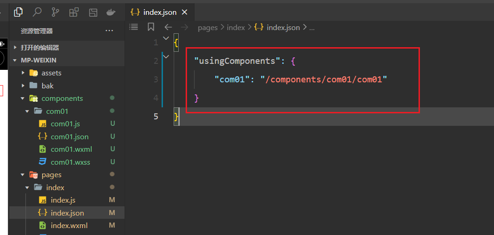

开始写com01组件，如下：

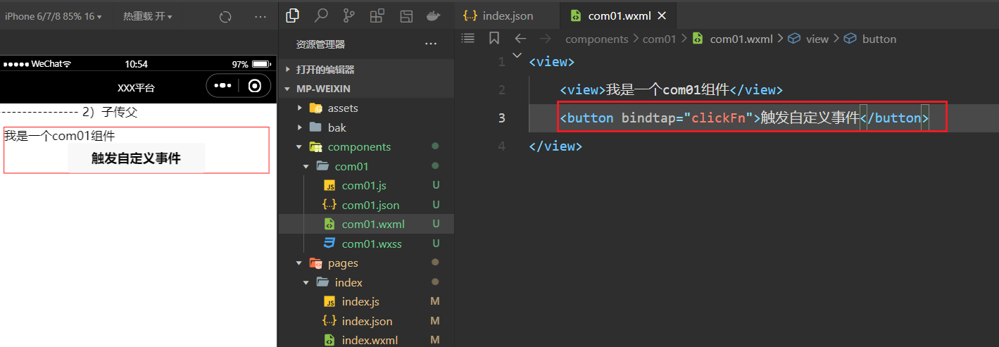

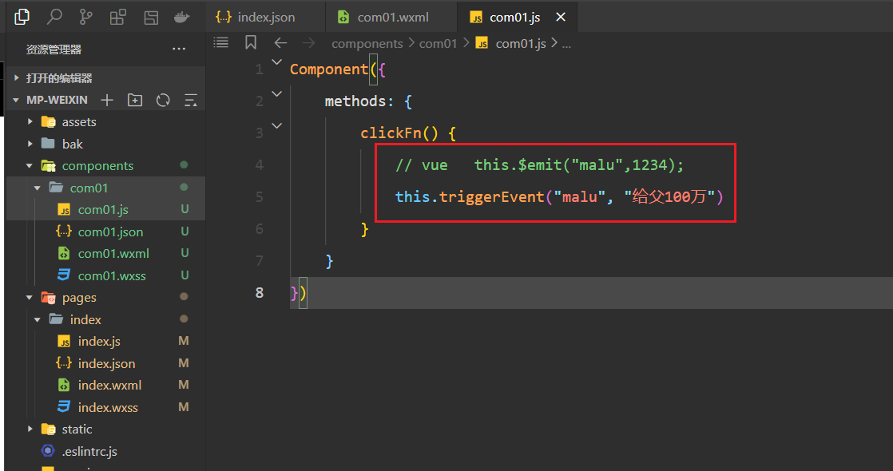

子触发了malu事件，接收数据了，如下：

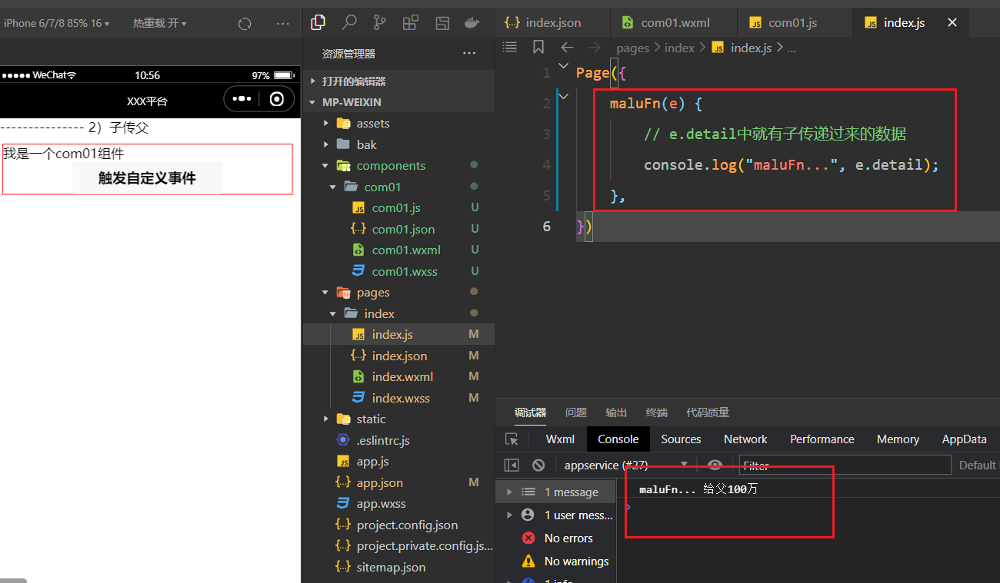

### 3，Tabbar案例

在父中定义数据，如下：

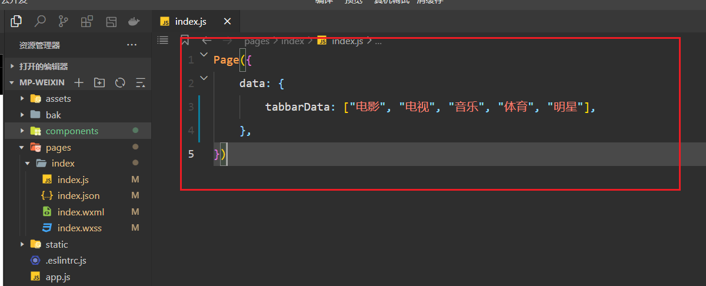

把tabbar封装成一个组件，如下：

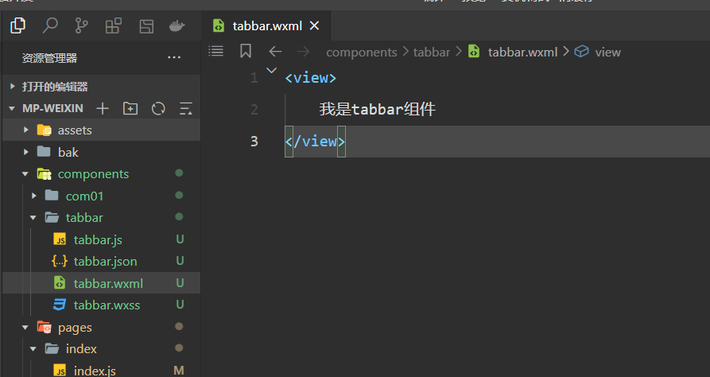

 在index.json中注册，如下：

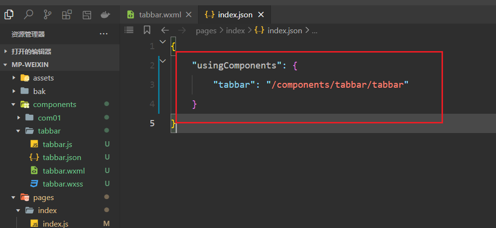

在index.wxml中使用之，并传递参数，如下：

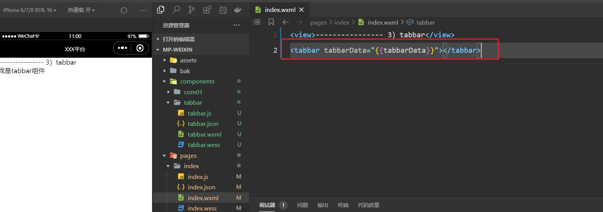

在tabbar组件中，接收之，如下：

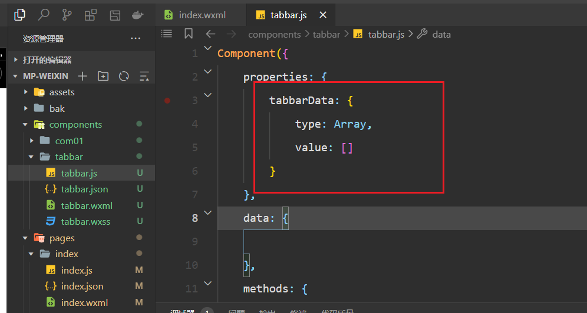

在tabbar.wxml中使用之，如下：

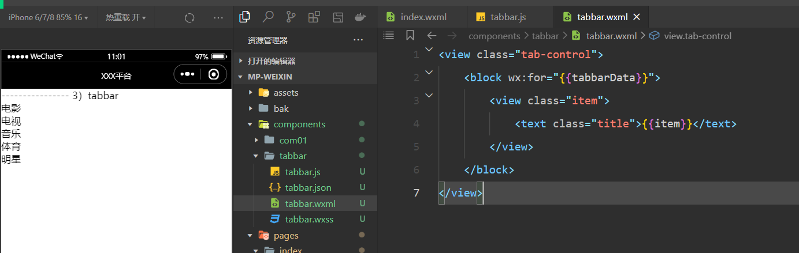

书写样式，如下：

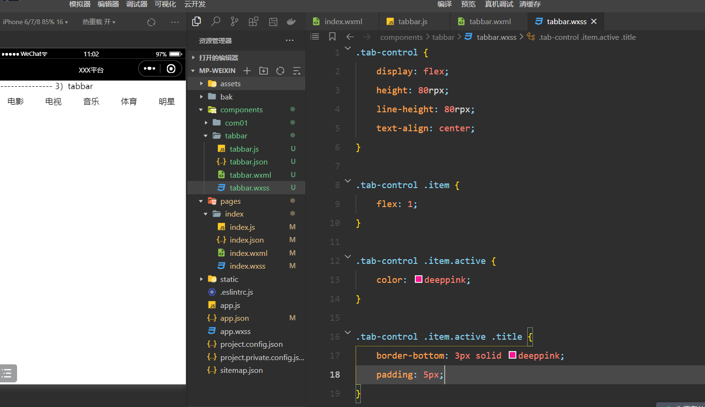

在子中定义让哪个元素选中，如下：

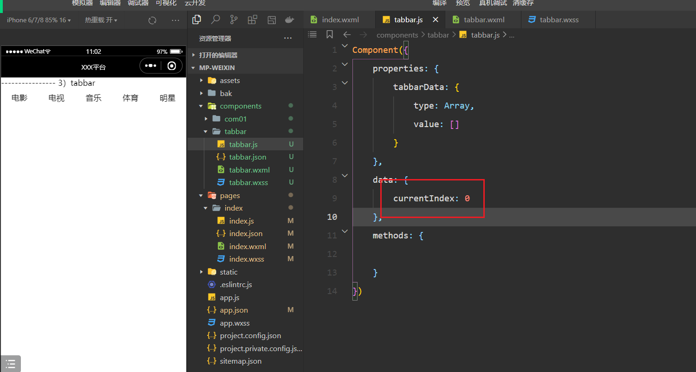

在子中就可以使用此状态，如下：


绑定点击事件，如下：


实现方法，如下：


如果传递给父，如下：


## 八，ajax请求

### 1，wx.request发送ajax请求

在load事件中，发ajax请求，如下：


报错了，如下 ：


需要去配置，如下 ：


目前我们是配置不了，在公司中都是后端配置的。在开发时可以设置不校验，如下：


再次测试之，如下：


给状态赋值，如下：


发post请求，并传递参数，如下：


分析网络，如下：


### 2，二次封装

对wx.request进行二次封装，如下：


使用之，如下：


也可以使用async+await，如下：


分析如下的代码：

```js
export function getToken() {
    return wx.getStorageSync("token");
}
export function setToken(token) {
    return wx.setStorageSync("token", token);
}
export function removeToken() {
    // wx.clearStorage()
    return wx.removeStorage("token");
}

function request(url, options = {}) {
    const token = getToken();
    if (token) {
        options.header = Object.assign(options.header || {}, {
            authorization: `Bearer ${token}`,
        });
    }
    return new Promise((resolve, reject) => {
        wx.request({
            url: `${getApp().globalData.baseURL}${url}`,
            ...options,
            success(res) {
                if (res.statusCode == 401) {
                    // 这里先放在这...
                } else if (res.statusCode === 403) {
                    // ....
                }
                resolve(res.data);
            },
            fail(err) {
                reject(err);
            },
        });
    });
}
export function get(url, options) {
    return request(url, options);
}
export function post(url, options) {
    return request(url, {
        ...options,
        method: "POST"
    });
}
```

在app.js中可以封装一些全局数据：

```js
// app.js
App({
    globalData: {
        // 全局配置
        baseURL: "http://fdsafsa/fasdfasdfd"
    }
})
```

## 九，一些API的使用

在微信小程序中，提供了一些api，调用这些api就可以实现某个功能，有些api，是可以直接调用的，有些api需要用户授权，在微信小程序中，它的api都是以wx. 开头。在uniapp中，它的api都是以uni. 开头。

### 1，获取用户头像和昵称信息

绘制页面：


先html结构：

```wxml
<view>
  <view class="content">
    <view class="row">
      <view class="text1">头像：</view>
      <!-- open-type="chooseAvatar"  小程序提供的开放能力 -->
      <!--  点击头像时，调用onChooseAvatar方法，在这个方法，可以得到头像（来源可以是微信头像，也可以是手机中的图片，也可以是相机刚拍的图片） -->
      <button class="avatar-wrapper" open-type="chooseAvatar" bindchooseavatar="onChooseAvatar">
        <image class="avatar" src="{{userInfo.avatar || ''}}"></image>
      </button>
    </view>
    <view class="row">
      <view class="text1">昵称：</view>
      <!-- type="nickname" 不是普通的输入框，此输入框就可以获取用户昵称 -->
      <input type="nickname" class="name-input" name="nickname" value="{{userInfo.nickName||''}}" bindchange="onInput" placeholder="请输入昵称" />
    </view>
  </view>
</view>
```

样式：

```wxss
.content {
  padding: 20rpx;
}

.info__footer {
  display: flex;
  justify-content: center;
  align-items: flex-start;
  height: 80rpx;
  padding-top: 20rpx;
  background: #fff;
}

.info__footer .footer-btn {
  width: 398rpx;
}

.footer-btn {
  background: linear-gradient(90deg, #34AAFF 0%, #0A73EE 100%) !important;
  border: none !important;
}

.footer-btn::after {
  border: none !important;
}

.content .row {
  display: flex;
  align-items: center;
  height: 110rpx;
  padding-left: 20rpx;
}

.content .text1 {
  flex: 2;
}

.content .name-input,
.content .avatar-wrapper {
  flex: 6;
  text-align: right;
}

.content .avatar-wrapper::after {
  border: none !important;
}

.content .avatar-wrapper {
  display: flex;
  justify-content: flex-end;
  background-color: #fff;
}

.content .avatar-wrapper .avatar {
  display: block;
  width: 100rpx;
  height: 100rpx;
  border-radius: 50%;
  background-color: #ccc;
}
```

功能：

```js
Page({
    data: {
        userInfo: {
            avatar: "",
            nickName: ""
        }
    },
    onChooseAvatar(e) {
        const {
            avatarUrl
        } = e.detail
        this.setData({
            ['userInfo.avatar']: avatarUrl
        })
    },
    onInput(e) {
        const {
            value
        } = e.detail
        this.setData({
            ['userInfo.nickName']: value
        })
    },
})
```

效果：


### 2，获取位置信息

代码：


效果：


### 2，其它弹窗相关API

结构：

```html
<view>---------------- 1）小程序中的一些api</view>
<view class="page">
    <button type="primary" size="mini" bindtap="toastFn">Toast</button>
    <button type="primary" size="mini" bindtap="modalFn">Modal</button>
    <button type="primary" size="mini" bindtap="actionSheetFn">ActionSheet</button>
    <button type="primary" size="mini" bindtap="getLocationFn">getLocation</button>
    <button type="primary" size="mini" bindtap="getSystemInfoFn">getSystemInfo</button>
</view>
```

样式：

```css
.page {
    border: 1px solid red;
    margin: 10px 10px;
}
```

逻辑：

```js
Page({
    data: {

    },
    toastFn() {
        // wx.showToast({
        //     title: '成功',
        //     icon: "loading",
        //     duration: 2000,
        //     // 防止触摸穿透
        //     mask: true
        // })
        wx.showLoading({
            title: "加载中..."
        })
        setTimeout(() => {
            wx.hideLoading()
        }, 2000)
    },
    modalFn() {
        wx.showModal({
            title: "提示",
            content: "这是一个弹窗内容",
            success(res) {
                if (res.confirm) {
                    console.log("用户点击了确定");
                } else {
                    console.log("用户点击了取消");
                }
            }
        })
    },
    actionSheetFn() {
        wx.showActionSheet({
            itemList: ["A", "B", "C", "D", "E", "F"],
            success(res) {
                // console.log(res);
            },
            fail(res) {
                console.log("res:", res);
            }
        })
    },
    getLocationFn() {
        wx.getLocation({
            success(res) {
                console.log(res);
            }
        })
    },
    getSystemInfoFn() {
        wx.getSystemInfo({
            success: (res) => {
                console.log(res);
            },
        })
    }
})
```

## 十，小程序中的路由

### 1，小程序路由

小程序中的路由跳转也是分两类的:

* 声明式路由 router-link    navigator
* 编程式路由 $router.push .go .back .forword .replace 利用一些api实现跳转

准备几张页面，如下：


index.wxml中的参考代码：

```html
<view>------------------ 1)声明式路由</view>
<view class="page">
    <!-- url指定去哪一张页面 -->
    <!-- 到了详情页面,小程序中内置了返回功能,不需要我们实现了 -->
    <navigator url="/pages/detail/detail">去详情页</navigator>

    <!-- 一个小程序项目是有N个页面组成的，可以跳到某个页面， -->
    <!-- open-type="navigate"  保留当前页面, 跳到应用中某个页面, 不能跳到tabbar页面-->
    <navigator url="/pages/detail/detail" open-type="navigate">去详情页</navigator>
    <navigator url="/pages/cart/cart" open-type="navigate">去购物车</navigator>

    <!-- open-type="redirect"  关闭当前页面,跳到应用中某个页面, 能跳到tabbar页面 -->
    <navigator url="/pages/detail/detail" open-type="redirect">去详情页</navigator>
    <navigator url="/pages/cart/cart" open-type="redirect">去购物车</navigator>

    <!-- open-type="switchTab"  专门用来跳转到tabbar页面的 -->
    <navigator url="/pages/cart/cart" open-type="switchTab">去购物车</navigator>
    <navigator url="/pages/detail/detail" open-type="switchTab">去详情页</navigator>

    <!-- open-type="reLaunch" 关闭所有的页面,打开应用中的某个页面 -->
    <navigator url="/pages/cart/cart" open-type="reLaunch">去购物车</navigator>

    <!-- 跳转并传参 -->
    <navigator url="/pages/detail/detail?username=malu&age=18" open-type="navigate">去详情页</navigator>
</view>
```

detail.wxml中的参考代码：

```html
<view>详情页面</view>

<view>
    <view>{{username}}</view>
    <view>{{age}}</view>
</view>

<navigator url="/pages/comment/comment" open-type="navigate">去评论页</navigator>

<!-- open-type="navigateBack"  关闭当前页面,返回上一个页面 -->
<navigator open-type="navigateBack">返回一上页</navigator>
```

detail.js中的参考代码：

```js
  data: {
          username: "",
          age: 0
      },

      /**
       * 生命周期函数--监听页面加载
       */
      onLoad(options) {
          let {
              username,
              age
          } = options;
          console.log("username:", username);
          console.log("age:", age);
          this.setData({
              username,
              age
          })
      },
```

comment.wxml中的参考代码：

```html
<view>评论页面</view>

<button type="primary" bindtap="backFn">返回到首页面</button>
```

comment.js中的参考代码：

```js
  backFn() {
      // $router.go(-2)
      // $router.go(-1)
      wx.navigateBack({
          delta: 2,
      })
  },
```


## 十一，小程序云开发

### 1，云开发介绍

传统开发项目模型：


云开发模式：


**云开发核心技术**

* 云数据库（小程序端直接对数据库进行增删改查，类似于MongoDB数据库）
* 云存储（在小程序端直接上传，下载，删除文件，获取临时连接，在小程序中访问）
* 云函数（写的逻辑代码）

### 2，开通云开发

第一步，登录开发者工具：


第二步：点击+，创建一个项目，如下：


第三步，点开云开发


**什么是环境**

* 一个环境对应一整套独立的云开发资源，包括数据库、存储空间、云函数等资源。
* 各个环境是相互独立的，用户开通云开发后即创建了一个环境，默认可拥有最多两个环境。

第四步：分析目录结构


**项目初始化**

* 在小程序端开始使用云能力前，需先调用 wx.cloud.init 方法完成云能力初始化

* env: 必填，默认选择的环境

* traceUser：非必填，是否在将用户访问记录到用户管理中，在控制台中可见

  

### 3，云数据库

**云开发提供了一个文档型数据库，类似于MongoDB，里面存放的是一条条JSON格式的对象**

* 数据库 database
* 集合 collection
* 文档document

**操作数据库：**

* 控制台操作（了解）
* 代码操作
* 云函数中操作

演示一下，在控制台中操作数据库，如下：


通过代码操作云数据库，先删除上面的两条记录：


参考代码：

```html
<view>
    <view style="text-align: center;">-----------云数据库操作-----------</view>
    <button type="primary" bindtap="addData">添加数据</button>
    <button type="primary" bindtap="deleteData">删除数据</button>
    <button type="primary" bindtap="updateData">更新数据</button>
    <button type="primary" bindtap="queryData">查询数据</button>
    <view style="text-align: center;">------------------</view>
    <button type="primary" bindtap="getSongs">发ajax请求</button>
    <view style="text-align: center;">------------------</view>
    <button type="primary" bindtap="saveSongs">数据存到云数据库</button>
</view>
```

实现方法：


参考代码：

```js
addData() {
    stus.add({
        data: {
            name: "malu",
            age: 18,
            address: "bj",
        },
        success: function(res) {
            console.log(res);
        }
    })
}

// 还有一种写法：
addData() {
    stus.add({
        data: {
            name: "wc",
            age: 18,
            address: "bj",
        }
    }).then(res => {
        console.log("res:", res);
    })
}
```


演示一下删除数据：


也可以根据某个条件实现删除，先插入一些数据：


我要删除年龄大于20岁的人：


参考代码：

```js
let db = wx.cloud.database(); // 得到云数据库
let stus = db.collection('stus')

Page({
    deleteData() {
        // 根据条件去删除
        // 删除大于20岁的人
        let cmd = db.command;
        stus.where({
            age: cmd.gt(20)
        }).remove().then(res => {
            console.log("res:", res);
        })
    },
})
```

更新数据：


还可以使用set更新：


根据某个条件批量更新：


查询某个数据：


根据条件查询多个数据：


查询所有的数据：


分页：


发ajax请求：


想把数据存储到数据库中，如下：


### 4，云函数

**云函数即在云端（服务器端）运行的函数**

* 开发者无需购买、搭建服务器，只需编写函数代码并部署到云端即可在小程序端调用
* 云函数之间也可互相调用
* 一个云函数可由多个文件组成，占用一定量的CPU 内存等计算资源
* 云函数完全独立，可分别部署在不同的地区

**注意点**

* 一个云函数的写法与我们之前写的的 JS函数一样，代码运行在云端 Node.js 中
* 当云函数被小程序端调用时，写的代码会被放在Node.js 运行环境中执行
* 云函数中，我们可以：进行网络请求，操作云数据库，操作云存储等
* 云函数的独特优势在于与微信登录鉴权的无缝整合

**使用步骤**

* 1. 创建一个云函数
* 1. 编写云函数的代码逻辑
* 1. 将云函数上传到云端
* 1. 小程序中对云函数调用

创建一个页面：


创建一个云函数（一个云函数相当于一个小的node项目），如下：


安装依赖：


开始写代码：


把云函数上传，如下：


上传成功后，在云开发面板中，就可以看到云函数了：


调试一下，先合适本地调试：


再使用一下云端测试：


在小程序中调用云函数：


我们再这个流程再来一遍，创建一个minus云函数：


安装依赖：


上传云函数：


在小程序端调用之，如下：


在云函数中调用后端api接口，创建一个云函数：


安装依赖，并把axios安装之，如下：


开始在云函数中调用后端接口：


上传代码，并在小程序中调用之，如下：


想看到云函数中的调试结果，需要云端调试：


### 5，云存储

**云存储用于将文件存储到云端**

* 云存储提供高可用、高稳定、强安全的云端存储服务
* 持任意数量和形式的非结构化数据存储，如视频和图片
* 并在控制台进行可视化管理

**云存储对应的操作：**

* 上传文件
  + 本地文上传到云存储中
* 获取文件的临时链接，在外网可以访问
  + 在小程序以外的地方访问（比如浏览器、手机端），可以通过获取临时链接，该链接可以在小程序以外访问，文件链接有效期为两个小时
* 下载文件
  + 把云存储中的文件下载到本地
* 文件删除
  + 将文件从云存储中删除掉，这样可以省略空间

创建一个页面：


参考代码：

```html
<view>
    <view style="text-align: center;">-----------云存储操作-----------</view>
    <button type="primary" bindtap="upload">上传</button>
    <button type="primary" bindtap="download">下载</button>
    <button type="primary" bindtap="delete">删除</button>
    <button type="primary" bindtap="tempFile">临时连接</button>
    <!-- <image src="cloud://cloud1-0g8kxjro0b15315a.636c-cloud1-0g8kxjro0b15315a-1311519632/01.jpg"></image> -->
    <image src="{{tempFilePath}}"></image>
</view>
```

先看一下存储管理的面板：


重点通过代码操作操作：

```js
Page({
    data: {
        tempFilePath: ""
    },
    async upload() {
        let imageRes = await wx.chooseMedia({
            mediaType: "image"
        })
        // 获取图片
        let imagePath = imageRes.tempFiles[0].tempFilePath;
        // console.log(imagePath);

        let timeStamp = new Date().getTime();
        // console.log(timeStamp);
        // ["http:cfsdsafsad","png"]
        let extension = imagePath.split(".").pop()
        let imgName = `${timeStamp}.${extension}`
        // console.log(imgName);

        let res = await wx.cloud.uploadFile({
            filePath: imagePath,
            cloudPath: "malu/" + imgName
        })
        console.log("res:", res);
    },
    async download() {
        let res = await wx.cloud.downloadFile({
            fileID: "cloud://test-3g0sal0ncbc01a0f.7465-test-3g0sal0ncbc01a0f-1322552960/malu/1700465612714.png"
        })
        console.log(res.tempFilePath);
        this.setData({
            tempFilePath: res.tempFilePath
        })
    },
    async delete() {
        let res = await wx.cloud.deleteFile({
            fileList: [
                "cloud://test-3g0sal0ncbc01a0f.7465-test-3g0sal0ncbc01a0f-1322552960/malu/1700465612714.png"
            ]
        })
        console.log(res);
    },
    async tempFile() {
        let res = await wx.cloud.getTempFileURL({
            fileList: [
                "cloud://test-3g0sal0ncbc01a0f.7465-test-3g0sal0ncbc01a0f-1322552960/malu/1700465803592.png"
            ]
        })
        console.log(res);
    },
})
```

云开发相关的资料：

* 码路音乐：https://www.bilibili.com/video/BV1B24y1G7Xp/?spm_id_from=333.999.0.0&vd_source=4334f535ef234183c9ec759419e6828c
* 云开发官网相关资料
* B站上直接搜索云开发实战

## 十二，总结

### 1，什么是小程序

小程序是运行在 APP 中的一种随用随开的程序，是前端开发领域的应用形态之一，就像 PC 网站、H5 网站和 APP 一样。小程序开发其实非常简单，一句话：只要你会前端，就会开发小程序！

**小程序的优势：**

1）用户角度：使用方便

相信只要用过小程序的同学，都能感受到它的方便，不用安装、随用随开、还能通过分享链接打开，这点完胜 APP。但是小程序的用户体验一般是不如 APP 的，毕竟受到了宿主（比如微信 APP）的限制。 <br/>

2）开发角度：开发成本低

开发小程序和开发一个网页的语法、流程和方法几乎完全一致，所以上面也说了，只要你会前端，就会开发小程序。此外，目前小程序的开发工具和生态都比较完善，也可以降低开发难度。  <br/>

3）产品角度：上线成本低

小程序不需要在各个应用商店提交审核，就可以快速上线。虽然也要在小程序平台审核，但个人感觉比在应用商店过审方便一些。 <br/>

4）老板角度：省钱

小程序前端运行在宿主 APP 里，不用单独购买一个服务器来部署前端（当然，后端还是需要服务器的）。 <br/>

5）运维角度：更安全性

因为小程序是运行在宿主 APP 里（比如微信或支付宝），所以运行时会受到严格的安全限制，前端几乎不用担心被攻击。 <br/>

6）运营角度：流量大，容易裂变

这可能是越来越多开发者选择小程序最重要的原因，小程序可以利用宿主 APP 本身的流量，打开率高、易被搜索发现、也容易被传播分享。

如果你要快速上线一个自己的产品，不止有能用、还要考虑运营、数据分析、推广裂变、运维，那么小程序无疑是最合适的，没有之一！火爆的 “羊了个羊” 就是最好的例子，但凡要下 APP 或者只是个网站，传播速度都不会有朋友圈那么快。 <br/>

7）求职角度（面向薪资编程）：对前端同学来说是加分项

大多数公司是没有 “小程序开发” 这一岗位的，一般都统称为前端开发。如果你是一名前端开发同学，已经做过了 PC、H5 网站，不妨尝试做一个自己的小程序，拓宽一下自己的实践边界。 <br/>

  

**小程序生态：**

小程序依赖 APP 环境作为宿主，国内互联网大厂基本都有自己的小程序，可谓是百家争鸣。比如微信小程序、支付宝小程序、百度小程序、抖音小程序、爱奇艺小程序等等。但毫无疑问，微信作为国内早期的小程序入局产品，流量最大、小程序最多，所以如果你要学习小程序开发的话，强烈推荐从微信小程序开始学起。

### 2，开发小程序的几种方式

#### 1）原生开发

所谓 “原生”，就是不加任何封装和修饰的，官方提供的语法，基本等同于前端三件套 HTML + CSS + JS。

**优点：**

1最直接、上手相对容易，开发用到的语法和 API 都能在文档中查到。
2因为不存在封装，所以出了问题更容易定位和解决。

**缺点：**

1可用组件少、语法不灵活、很多东西都要自己手写，会导致代码量大、开发效率低。
2不同小程序宿主 APP 的语法会有一些区别，开发跨 APP 小程序成本更高。

  

#### 2）跨端开发

跨端开发是指：只编写一套代码，通过框架或工具自动帮你生成支持多个平台的小程序，甚至是其他产品形态，比如 H5 页面、APP 等。比较有代表性的跨端开发框架就是 Uniapp。

**优点：**

只用编写和维护同一套代码，大幅节约开发成本

**缺点：**

跨端开发框架并不能完美适配所有平台，还是要针对不同的平台编写一些补丁代码，而且和框架开发一样，一旦后期才发现某个功能不支持你需要的那个平台，可能已经无力回天了（更换跨端开发框架成本太大），所以前期的技术选型真的很重要。  

#### 3）低代码开发

所谓低代码（或者零代码），就是写最少的代码（甚至是不写代码），通过在一个可视化页面上进行拖拉拽、编写一些配置，就能开发出一个小程序。

如腾讯的 WeDa、钉钉的宜搭等等。

**优点：**

开发成本极低，甚至连复制粘贴都不用！

**缺点：**

别人给你封装的工具如果太好用，不仅你学习不到什么开发经验，而且和跨端开发一样，出了 Bug 你可能根本无从下手。  

#### 4）找别人开发

最省事的开发方式就是找别人做！早在几年前，就有各种小程序定制的服务商了。而近几年，微信也推出了自己官方的小程序服务市场。如果你不是为了学习、只是希望有一个小程序，那么去 [微信服务市场](https://fuwu.weixin.qq.com/search?tab=1&category=1-10001-7-8-9-10-11&serviceType=1-10&industry=&scene=&type=) 、或者找 [云服务商官方的小程序解决方案](https://cloud.tencent.com/solution/la) ，花钱就能搞定了~  

### 3，一些资源

* 网易云音乐项目视频教程：<https://www.bilibili.com/video/BV1H34y1p7Fd/>

* 微信官方小程序开发实战（2022）：<https://developers.weixin.qq.com/community/business/course/000c2a3a070c385dc59e58ec15700d>

* 微信官方小程序课程（里面有各行业的小程序开发经验、小程序高校大赛作品分享）：https://developers.weixin.qq.com/community/business/CategorySearch?query=小程序&page=1&cid=2

* 小程序项目实战（2022）：<https://www.bilibili.com/video/BV1sK411y7bg>

* 各种培训班，在B站上传的各种教程

  
