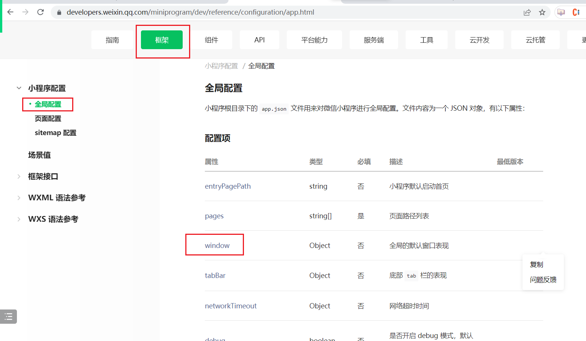
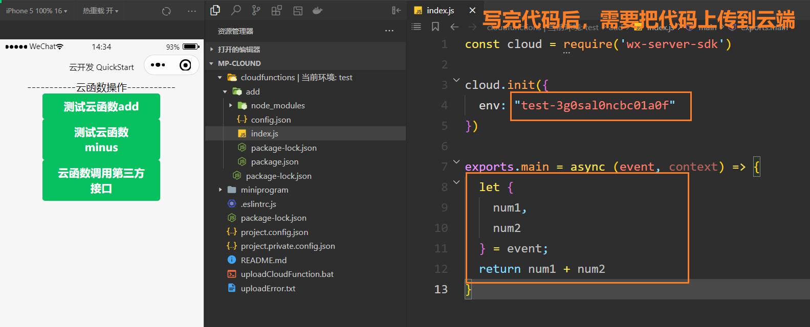

## 一，前置知识

### 1，产品分类

* web开发：
  + 特点：运行在浏览器上的应用
  + 常见：官网，管理系统，webapp，H5
* App开发：
  + 原生App，指的是Android 和 iOS   12年~16年
  + 跨平台App，指的是写一套，可以在多端运行，Uniapp，RN
  + Flutter，使用dart语言
  + 混合App（Hybrid），指：原生App + Web开发   在原生App中嵌套网页
  + 小程序

### 2，前端就业方向

* React开发（核心）
* Vue3 / Vue2（核心）
* Uniapp (开发小程序，使用vue语法+微信小程序语法)（核心）
* Node 
* Angular
* 小程序（微信小程序<微信用户基数大>，支付宝小程序，360小程序....）
* RN
* 前后端不分离的项目
* 低代码开发
* flutter
* web3
* .... 

## 二，搭建小程序开发环境

### 1，小程序介绍

小程序：运行在App中的小应用。是一个随用随开的程序，也是属于前端技术之一。开发小程序非常简单，你只要会前端就会开发小程序。

特点：

* 无须安装，只能运行在指定的App中，小而美。
* 工具类，营销类（转发，拼团...）

为什么要做小程序？

* 用户角度：使用方便，相信只要用过小程序的同学，都能感受到它的方便，不用安装、随用随开、还能通过分享链接打开，这点完胜 APP。但是小程序的用户体验一般是不如 APP 的，毕竟受到了宿主（比如微信 APP）的限制。
* 开发角度：开发成本低，只要你会前端，就会开发小程序。此外，目前小程序的开发工具和生态都比较完善，也可以降低开发难度。
* 产品角度：上线成本低，小程序不需要在各个应用商店提交审核，就可以快速上线。虽然也要在小程序平台审核，但个人感觉比在应用商店过审方便一些。
* 老板角度：省钱，小程序前端运行在宿主 APP 里，不用单独购买一个服务器来部署前端（当然，后端还是需要服务器的）。
* 运维角度：更安全性，因为小程序是运行在宿主 APP 里（比如微信或支付宝），所以运行时会受到严格的安全限制，前端几乎不用担心被攻击。
* ....


小程序开发和网页开发的区别:

- 由原来的 html 文件修改为 wxml 文件
- 由原来的 css 文件修改为 wxss 文件
- 新增了属于小程序的特别配置
- .... 


开发小程序有几种方式：

* 原生开发
* 跨端开发  uniapp  主流开发模式  
* 低代码开发，如腾讯的 WeDa、钉钉的宜搭等等
* 找别人开发，微信服务市场....
* ChatGPT


学习小程序：

1. 网站：https://mp.weixin.qq.com/，注册一个小程序账号，通过这个账号，可以管理我们的小程序。登录上去，得到一个管理系统。在这个管理系统中就可以做很多事情。
2. 小程序文档（https://developers.weixin.qq.com/miniprogram/dev/framework/），只需要关注一级目录中的开发模块。其它模块都是了解。
3. 内容：项目环境搭建，组件，路由，状态管理，功能API....

### 2，小程序管理后台

1. 成员管理（开发）：添加开发者，添加体验者 
2. 版本管理（上线）：使用开发者工具，直接提交代码，提交上去就是开发版本，提交审核就有审核版本，审核通过就有线上版本。
3. 开发管理（开发）：开发相关配置，有appid。
4. 开发工具，写代码，就需要利用开发工具来写代码。

### 3，微信开发者工具

下载：https://developers.weixin.qq.com/miniprogram/dev/devtools/download.html

下载稳定版本的64位。下载微信开发者工具，安装之。安装是傻瓜式安装。打开微信开发者工具，创建原生小程序项目。创建时，需要有appid。安装完后，桌面上就多了如下的图标：


双击创建项目，流程如下：


使用微信扫一下，如下 ：


点击+号，创建小程序项目，先创建一个空的文件夹，如下：


创建项目后，如下：


编辑器的设置：

* 工作区划分 （模拟器、编辑器、调试器）
* 切换机型：机型=> 显示比例 => 自适应
* 切换主题：设置=> 外观设置=> 浅色
* 文件保存：设置=> 编辑器设置 => 修改文件保存
* 允许非HTTPS请求：设置 => 项目设置 =>  本地开发采用非HTTPS

### 4，小程序的目录结构

* 一个小程序是由N张页面组成的，一个页面就是一个文件夹
* 一个页面是一个文件夹，一个文件夹中有4个文件
  + xxx.js  页面的逻辑（必须的）
  + xxx.json  页面的配置
  + xxx.wxml  写结构（必须的）
  + xxx.wxss  写样式
* .eslitrc.js  约束写代码的规范  后面讲webpack时，讲到eslint时再说
* app.js   小程序的入口文件  
* app.json    小程序的全局配置文件   在小程序中，只要是json文件，都是配置文件
* app.wxss   小程序的全局样式   是针对所有的页面的
* project.config.json   项目的配置文件 
* sitemap.json   做SEO优化

## 三，小程序配置 

### 1，小程序配置

* 配置分全局配置 和 页面独有的配置
* 全局配置，不需要我们去记，只需要学会查文档，地址：https://developers.weixin.qq.com/miniprogram/dev/framework/config.html#%E5%85%A8%E5%B1%80%E9%85%8D%E7%BD%AE
* 页面配置，如果全局配置和页面配置冲突了，肯定是页面配置的优先级高 。地址：https://developers.weixin.qq.com/miniprogram/dev/framework/config.html#%E9%A1%B5%E9%9D%A2%E9%85%8D%E7%BD%AE

### 2，在app.json中配置pages


```html
<view>
  <view style="margin-top: 30px; color: red;">
    首页面
  </view>
</view>
```


用于指定小程序由哪些页面组成，每一项都对应一个页面的路径 （含文件名） 信息。文件名不需要写文件后缀，框架会自动去寻找对应位置的 .json , .js , .wxml , .wxss 四个文件进行处理 。未指定 entryPagePath 时，数组的第一项代表小程序的初始页面 。


指定小程序的默认启动路径（首页），在 app.json 配置文件中增加 entryPagePath 。


```json
"entryPagePath":"pages/mine/mine",
"pages": [
    "pages/index/index",
    "pages/category/category",
    "pages/mine/mine",
    "pages/cart/cart"
],
```


### 3，在app.json中配置window

window 用于设置小程序的状态栏、导航条、标题、窗口背景色等等




代码如下：


```json
"window": {
    "navigationBarBackgroundColor":"#ffffff",
    "navigationBarTextStyle":"black",
    "navigationBarTitleText":"第一个小程序",
    "backgroundColor":"#ffffff",
    "enablePullDownRefresh":true,
    "onReachBottomDistance":50,
    "backgroundTextStyle":"dark"
},
```


### 4，在app.json中配置tarbbar

如果小程序是一个多 tab 应用（客户端窗口的底部或顶部有 tab 栏 可以切换页面），可以通过 tabBar 配置 tab 切换时显示的对应页面。 

```json
{
    "pages": [
        "pages/index/index",
        "pages/cart/cart",
        "pages/category/category",
        "pages/mine/mine"
    ],
    "window": {
        "backgroundTextStyle": "dark",
        "navigationBarBackgroundColor": "#f00",
        "navigationBarTitleText": "旺财严选",
        "navigationBarTextStyle": "white",
        "enablePullDownRefresh": true
    },
    "style": "v2",
    "sitemapLocation": "sitemap.json",
    "tabBar": {
        "color": "#333",
        "selectedColor": "#ff0000",
        "backgroundColor": "#ffffff",
        "borderStyle": "black",
        "list": [{
                "pagePath": "pages/index/index",
                "text": "首页",
                "iconPath": "/assets/tabbar/home.png",
                "selectedIconPath": "/assets/tabbar/home_active.png"
            },
            {
                "pagePath": "pages/category/category",
                "text": "分类",
                "iconPath": "/assets/tabbar/category.png",
                "selectedIconPath": "/assets/tabbar/category_active.png"
            },
            {
                "pagePath": "pages/cart/cart",
                "text": "购物车",
                "iconPath": "/assets/tabbar/cart.png",
                "selectedIconPath": "/assets/tabbar/cart_active.png"
            },
            {
                "pagePath": "pages/mine/mine",
                "text": "我的",
                "iconPath": "/assets/tabbar/profile.png",
                "selectedIconPath": "/assets/tabbar/profile_active.png"
            }
        ]
    }
}
```

目录结构如下：


### 5，小程序的其它配置

小程序根目录下的 app.json 文件用来对微信小程序进行其他全局配置。文件内容为一个 JSON 对象 


**style** 

- 微信客户端 7.0 开始，UI 界面进行了大改版。小程序也进行了基础组件的样式升级。app.json 中配置 "style": "v2" 可表明启用新版的组件样式


**sitemapLocation** 

- 指明 sitemap.json的位置；默认为 'sitemap.json' 即在 app.json 同级目录下名字的 sitemap.json 文件 


**networkTimeout** 

- 各类网络请求的超时时间，单位均为毫秒

  


**debug** 

- 可以在开发者工具中开启 debug 模式，在开发者工具的控制台面板，调试信息以 info 的形式给出，其信息有 Page 的注册，页面路由，数据更新，事件触发等。可以帮助开发者快速定位一些常见的问题


**debugOptions**

- 为了便于开发者调试渲染层的交互性能，小程序基础库提供了选项开启 FPS 面板，开发者可以实时查看渲染层帧率，必须在真机上才能看到。

  ```json
  "debugOptions": {
      "enableFPSPanel": true
  }
  ```

  

**permission** 

- 小程序接口权限相关设置 

  ```json
  "permission": {
      "scope.userLocation": {
          "desc": "你的位置信息将用于小程序位置接口的效果展示"
     }
  }
  ```

  


### 6，小程序页面的配置

app.json 中的部分配置，也支持对单个页面进行配置，可以在页面对应的 文件.json 文件来对本页面的表现进行配置 。


```json
{
  "usingComponents": {},
  "navigationBarBackgroundColor": "#ffffff",
  "navigationBarTextStyle": "black",
  "navigationBarTitleText": "第二个页面",
  "backgroundColor": "#ffffff",
  "backgroundTextStyle": "dark",
  "enablePullDownRefresh": true,
  "onReachBottomDistance": 50,
  "style": "v2"
}
```


### 7，全局的公共样式

在项目根目录的 app.wxss 文件为小程序公的共样式表。WXSS (WeiXin Style Sheets)是一套样式语言，用于描述 WXML 的组件样式。为了适应广大的前端开发者，WXSS 具有 CSS 大部分特性。同时为了更适合开发微信小程序，WXSS 对 CSS 进行了扩充以及修改。与 CSS 相比，WXSS 扩展的特性有

- 尺寸单位 （rem）
- 样式导入


全局样式是写在app.wxss中，如下：


在其它页面中，都可以使用了，如下：


移动端适配视频：https://www.bilibili.com/video/BV1yC4y137Sz/?spm_id_from=333.999.0.0&vd_source=de29feab70bf3ba9f8d71d2b7985b84c


rpx（responsive pixel）: 可以根据屏幕宽度进行自适应。规定屏幕宽为750rpx。如在 iPhone6 上，屏幕宽度为375px，共有750个物理像素，则750rpx = 375px = 750物理像素，1rpx = 0.5px = 1物理像素 。


建议：开发微信小程序时设计师可以用 iPhone6 作为视觉稿的标准。 


使用 @import 语句可以导入外联样式表， @import 后跟需要导入的外联样式表的相对路径，用 ; 表示语句结束。在项目根目录下创建 common 文件夹，并创建 style.wxss 文件，增加box 的样式。


在 app.wxss 文件中引入 common.wxss 文件


此时，刚刚所创建的 box 也加载了引入文件的样式


### 8，注册小程序

每个小程序都需要在 app.js 中调用 App 方法注册小程序实例，绑定生命周期回调函数、错误监听和页面不存在监听函数等。


修改初始 app.js 文件，代码如下：


```js
App({
  // 生命周期函数（所谓的生命周期函数，就是不需要我们调用，系统会在合适的时机自动帮我们调用）

  // 监听小程序初始化(启动)
  // ctrl + shift + +号
  onLaunch(options){
    // scene: 1001 
    console.log("onLaunch....",options)
  },
  // 监听小程序启动或切前台。
  onShow(){
    console.log("onShow...")
  },
  // 监听小程序切后台。
  onHide(){
    console.log("onHide...")
  },
  // 错误监听函数
  onError(){
    console.log("onError...")
  },
  // 页面不存在监听函数
  onPageNotFound(){
    console.log("onPageNotFound...")
  }
})
```


### 9，全局数据

整个小程序只有一个 App 实例，是全部页面共享的。开发者可以通过 getApp 方法获取到全局唯一的 App 实例，获取 App 上的数据或调用开发者注册在 App 上的函数。 


```js
globalData:{
    userInfo:{username:"malu",age:18,score:88}
},
```


在页面中，就可以得到的App，有了App，就可以获取全局数据，如下：


```js
Page({
  // 当页面加载完毕，会触发onLoad
  onLoad(){
    const app = getApp();  // app表示整体小程序
    console.log(app.globalData.userInfo)
  }
})
```


### 10，页面的生命周期


```js
Page({
  // 当页面加载时，会触发onLoad
  onLoad(){
    const app = getApp();  // app表示整体小程序
    console.log(app.globalData.userInfo)
    console.log("onLoad...")
  },
  // data表示定义一些数据，数据以后我都叫状态
  // 在html中使用数据
  data:{
    msg:"hello 小程序",
    age:18,
    user:{
      name:"wc",
      age:18
    },
    names:['wc','xq','ml']
  },
  onShow(){
    console.log("onShow...")
    // setData可以修改状态，状态变了，页面会刷新
    this.setData({
      msg:"hi 小程序"
    })
  },
  onReady(){
    console.log("onReady...")
  },
  onHide(){
    console.log("onHide...")
  },
})
```


```html
<!-- {{ 数据 }} 胡子语法-->
<view>{{ msg }}</view>
<view>{{ age }}</view>
<view>{{ user }}</view>
<view>{{ user.name }}</view>
<view>{{ names }}</view>
```


## 四，小程序内置组件


### 1，view

视图容器，用来承载视图块，类似 div 的功能。view 是块级元素。

```html
<view>视图1</view>
<view>视图2</view>
<text>这是一个span标签</text>
```


### 2，text

文本，承载页面文本信息，类似 span 的功能。

- text 是行内元素。
- text 组件内只支持 text 嵌套。
- 除了文本节点以外的其他节点都无法长按选中

```html
<view class="page">
    <!-- span标签怎么用，text就怎么用 -->
    <text>码路 \n</text>
    <text>码路 \n</text>
    <text>码路 \n</text>
    <!-- {{ true }} true是boolean类型  {{}}中放数据 -->
    <text selectable="{{true}}">码路教育 \n</text>
    <text selectable="{{false}}">码路教育 \n</text>
    <text user-select="{{true}}">码路教育 \n</text>
    <view></view>
    <text space="emsp">码路 教育 \n</text>
    <text space="ensp">码路 教育 \n</text>
    <text space="nbsp">码路 教育 \n</text>
    <text>2>1 \n</text>
    <text decode>2&gt;1 \n</text>
</view>
```

```css
.page {
  border: 1px solid red;
  margin: 10px 10px;
}
```


### 3，image

图片。支持 JPG、PNG、SVG、WEBP、GIF 等格式


```html
<view class="page">
   <!-- 一个image组件，默认大小是320*240 -->
  <image show-menu-by-longpress src="../../assets/tabbar/cart_active.png"></image>
  <!-- 由于小程序上线，对小程序的体积是有要求，所以图片通常使用线上的图片 -->
  <image src="https://img0.baidu.com/it/u=1645014943,3294260658&fm=253&fmt=auto&app=138&f=JPEG" />
  <button type="primary" bindtap="handleChooseAlbum">拍照/相册</button>
  <image src="{{imgPath}}"></image>
</view>
```


细节：

- image组件默认宽度320px、高度240px
- image组件中二维码/小程序码图片不支持长按识别


mode属性：


```html
<view class="page">
  <!-- image标签 默认是320 * 240 -->
  <image mode="aspectFit" style="width: 300px; height:100px;border: 2px solid blue;" src="../../assets/tabbar/cart_active.png"></image>

  <image mode="aspectFit" style="width: 200px; height:200px;border: 2px solid blue;" src="../../images/1.png"></image>
  
  <image mode="aspectFill" style="width: 200px; height:200px;border: 2px solid blue;" src="../../images/1.png"></image>
  
  <image mode="widthFix" style="width: 200px; height:200px;border: 2px solid blue;" src="../../images/1.png"></image>
  
  <image mode="heightFix" style="width: 200px; height:200px;border: 2px solid blue;" src="../../images/1.png"></image>

</view>
```


### 4，Swiper


为了更美观，可以让图片宽度充满全屏,并保持图片不变形

```html
<view class="page">
    <swiper>
        <swiper-item>
            <image style="width: 100%;" src="https://img0.baidu.com/it/u=1645014943,3294260658&fm=253&fmt=auto&app=138&f=JPEG" alt=""></image>
        </swiper-item>
        <swiper-item>
            <image style="width: 100%;" src="https://img1.baidu.com/it/u=2599614845,484438007&fm=253&fmt=auto&app=138&f=JPEG?w=500&h=500" alt=""></image>
        </swiper-item>
    </swiper>
</view>
```


同时设置图片样式充满全屏，因为图片默认大小：宽度320px、高度240px


Swiper常用属性说明


可以在逻辑文件 swiper.js 中动态配置属性值


```html
<view class="page">
    <swiper vertical circular indicator-dots indicator-color="#fff" indicator-active-color="#f00" autoplay interval="3000" duration="500">
        <swiper-item>
            <image style="width: 100%;" src="https://img0.baidu.com/it/u=1645014943,3294260658&fm=253&fmt=auto&app=138&f=JPEG" alt=""></image>
        </swiper-item>
        <swiper-item>
            <image style="width: 100%;" src="https://img1.baidu.com/it/u=2599614845,484438007&fm=253&fmt=auto&app=138&f=JPEG?w=500&h=500" alt=""></image>
        </swiper-item>
    </swiper>
</view>
```


可以把swiper中的属性配置到的data中，如下：


```js
Page({
  data: {
    swiperOptions: {
      indicatorDots: true,
      indicatorColor: "#fff",
      indicatorActiveColor: "#f00",
      autoplay: true,
      interval: 5000,
      duration: 500,
      circular: true,
      vertical: true
    }
  },
})
```


在html中使用之：


```html
<view class="page">
    <swiper 
      vertical="{{swiperOptions.vertical}}" 
      circular="{{swiperOptions.circular}}" 
      indicator-dots="{{swiperOptions.indicatorDots}}" 
      indicator-color="{{swiperOptions.indicatorColor}}"
      indicator-active-color="{{swiperOptions.indicatorActiveColor}}"
      autoplay="{{swiperOptions.autoplay}}" 
      interval="{{swiperOptions.interval}}"
      duration="{{swiperOptions.duration}}">
        <swiper-item>
            <image 
              style="width: 100%;" 
              src="https://img0.baidu.com/it/u=1645014943,3294260658&fm=253&fmt=auto&app=138&f=JPEG" 
              alt=""></image>
        </swiper-item>
        <swiper-item>
            <image 
              style="width: 100%;" 
              src="https://img1.baidu.com/it/u=2599614845,484438007&fm=253&fmt=auto&app=138&f=JPEG?w=500&h=500" 
              alt=""></image>
        </swiper-item>
    </swiper>
</view>
```


### 5，滚动视图

可滚动视图区域。可实现容器内元素水平和垂直方向滚动。给容器设置 scroll-x ，可实现水平滚动。给容器设置 scroll-y ，可实现垂直滚动。


常用属性：


实现水平滚动：


```html
<scroll-view class="tab" scroll-x>
    <text class="item1">新闻1</text>
    <text class="item1">新闻2</text>
    <text class="item1">新闻3</text>
    <text class="item1">新闻4</text>
    <text class="item1">新闻5</text>
    <text class="item1">新闻6</text>
    <text class="item1">新闻7</text>
    <text class="item1">新闻8</text>
    <text class="item1">新闻9</text>
    <text class="item1">新闻10</text>
</scroll-view>
```

```css
.tab {
  width: 100%;
  height: 80rpx;
  white-space: nowrap;
  border: 1px solid red;
  overflow: hidden;
}

.tab .item1 {
  display: inline-block;
  width: 140rpx;
  height: 80rpx;
  line-height: 80rpx;
}
```


让div滚动，如下：


```html
<scroll-view scroll-x class="container-x">
    <view wx:for="{{10}}" class="item01"></view>
</scroll-view>
```

```css
.container-x {
  /* 里面的子元素不换行 */
  white-space: nowrap;
  border: 1px solid red;
}

.item01 {
  width: 100px;
  height: 100px;
  background-color: red;
  margin: 10px;
  display: inline-block;
}
```


让div垂直滚动，如下：


```html
<scroll-view scroll-y class="container-y">
    <view wx:for="{{10}}" class="item02"></view>
</scroll-view>
```

```css
.container-y {
  height: 250px;
  border: 1px solid red;
}

.item02 {
  height: 100px;
  background-color: red;
  margin: 10px;
}
```


### 6，icon

图标组件,其实就是字体图标效果，但是这里所提供的只有最常用的几个


**字体图标属性**


直接上代码：


```html
<icon type="success" size="50" color="red"></icon>
<icon type="success_no_circle" size="50"></icon>
<icon type="info" size="50"></icon>
<icon type="warn" size="50"></icon>
<icon type="waiting" size="50"></icon>
<icon type="cancel" size="50"></icon>
<icon type="download" size="50"></icon>
<icon type="search" size="50"></icon>
<icon type="clear" size="50"></icon>

<view></view>

<icon class="icon-box-img" type="success"></icon>
<icon class="icon-box-img" type="info"></icon>
<icon class="icon-box-img" type="warn"></icon>
<icon class="icon-box-img" type="waiting"></icon>
<icon class="icon-box-img" type="cancel" size="30"></icon>
```


### 7，progress


**属性说明**


直接上代码：


```html
<progress percent="20"/>
<progress percent="20" show-info/>
<progress percent="20" show-info font-size="30"/>
<progress percent="20" show-info font-size="30" stroke-width="20"/>
<progress percent="20" show-info border-radius="5"/>
<progress percent="20" border-radius="5" activeColor="#f00"/>
<view></view>
<progress percent="20" border-radius="5" activeColor="#f00" backgroundColor="#00f"/> 
<view></view>
<progress percent="30" border-radius="5" activeColor="#f00" backgroundColor="#00f" active/> 
<view></view>
<progress percent="40" border-radius="5" activeColor="#f00" backgroundColor="#00f" active duration="90"/> 
```


### 8，表单

表单，将用户输入的信息提交到服务器，小程序的表单与 html 的表单基本一致。实现一个基础的登录页面，要用到以下组件

- form表单
- input输入框
- button按钮


实现登录页面，如下：


```html
<view class="login">
  <form>
     <input placeholder="请输入用户名" />
     <input placeholder="请输入密码" />
     <button type="primary">登录</button>
  </form>
</view>
```

为了美观，我们需要在 login.wxss 文件中添加样式


```css
.login {
  margin-top: 100rpx;
}

input {
  border: 1px solid #999;
  border-radius: 5px;
  margin: 10px;
  padding-left: 10px;
  height: 70rpx;
}
```

### 9，button

小程序的 button 按钮与 html 的非常类似，但是小程序的功能要更强大一些。

按钮属性：


type 属性说明：


size属性说明：


直接上代码：


```html
<view class="page">
    <button>默认按钮</button>
    <!-- size -->
    <button size="mini">按钮</button>
    <button size="mini">按钮</button>
    <!-- type -->
    <button size="mini" type="primary">按钮</button>
    <button size="mini" type="warn">按钮</button>
    <!-- plain 镂空-->
    <button size="mini" type="primary" plain="{{true}}">按钮</button>
    <!-- disabled -->
    <button size="mini" type="primary" disabled="{{true}}">按钮</button>
    <!-- loading -->
    <button size="mini" type="primary" loading="{{true}}">按钮</button>
    <!-- hover-class -->
    <button size="mini" hover-class="pressed">按钮</button>
    <!-- open-type 微信提供的一些能力-->
    <button size="mini" hover-class="pressed" open-type="contact">客服</button>
    <button size="mini" hover-class="pressed" open-type="share">分享</button>
    <button size="mini" hover-class="pressed" open-type="getPhoneNumber">获取电话</button>
    <button size="mini" hover-class="pressed" open-type="getUserInfo">获取用户信息</button>
</view>
```

```css
.pressed {
  background: red;
  color: white;
}
```


### 10，输入框

输入框是 input , 与 html 的输入框类似，但是增加了很多新的功能。

直接上代码：


属性：


type 属性：


confirm-type 属性详解


直接上代码：


```html
<view class="page">
    <input/>
    <input value="测试信息"/>
    <input placeholder="请输入用户名"/>
    <input placeholder="请输入密码" password/>
    <input placeholder="请输入密码" disabled/>
    <input placeholder="文本" maxlength="10"/>
    <input placeholder="文本" focus/>
    <input placeholder="文本" type="text"/>
    <input placeholder="文本" type="number"/>
    <input placeholder="文本" type="idcard"/>
    <input placeholder="文本" type="digit"/>
    <input placeholder="文本" type="nickname"/>
    <input placeholder="send" type="text" confirm-type="send"/>
    <input placeholder="search" type="text" confirm-type="search"/>
    <input placeholder="文本" type="text" confirm-type="next"/>
    <input placeholder="文本" type="text" confirm-type="go"/>
    <input placeholder="文本" type="text" confirm-type="done"/>
</view>
```

### 11，picker

从底部弹起的滚动选择器，选择器有很多种类，分别是

- 普通选择器 
- 多列选择器 
- 时间选择器 
- 日期选择器 
- 省市区选择器


指定 mode 属性为 selector ,或者默认不指定 mode，则为普通选择器。


```html
<view>普通选择器</view>
<picker bindchange="bindPickerChange" value="{{index}}" range="{{array}}">
    <view class="picker">
        当前选择：{{array[index]}}
    </view>
</picker>
```

```js
Page({
  data: {
    array: ['美国', '中国', '巴西', '日本'],
    index:0,
  },
  bindPickerChange(e) {
    console.log(e)
    this.setData({
      index:e.detail.value
    })
  }
})
```


指定 mode 属性为 multiSelector，则为多列选择器。


```html
<view>多列选择器</view>
<picker mode="multiSelector" bindchange="bindMultiPickerChange" value="{{multiIndex}}" range="{{multiArray}}">
    <view class="picker">
        当前选择：{{multiArray[0][multiIndex[0]]}}，{{multiArray[1][multiIndex[1]]}}，{{multiArray[2][multiIndex[2]]}}
    </view>
</picker>
```

```js
Page({
  data: {
    multiArray: [
      ['无脊柱动物', '脊柱动物'],
      ['扁性动物', '线形动物', '环节动物', '软体动物', '节肢动物'],
      ['猪肉绦虫', '吸血虫']
    ],
    multiIndex: [0, 0, 0],
  },
  bindMultiPickerChange(e) {
    this.setData({
      multiIndex: e.detail.value
    })
  }
})
```


指定 mode 属性为 time，则为时间选择器。


```html
<view>时间选择器</view>
<picker bindchange="bindTimeChange" mode="time" value="{{time}}" start="09:01" end="21:01" >
    <view class="picker">
        当前选择: {{time}}
    </view>
</picker>
```

```js
Page({
  data: {
    time: '12:01',
  },
  bindTimeChange(e) {
    this.setData({
      time:e.detail.value
  })
  }
})
```


指定 mode 属性为 date，则为日期选择器。


```html
<view>日期选择器</view>
<picker bindchange="bindDateChange" mode="date" value="{{ date }}" start="2000-09-01" end="2030-09-01" >
    <view class="picker">
        当前选择: {{date}}
    </view>
</picker>
```

```js
Page({
  data: {
    date:"2024-09-01",
  },
  bindDateChange(e) {
    this.setData({
      date:e.detail.value
  })
  }
})
```


指定 mode 属性为 region，则为省市区选择器。


```html
<view>省市区选择器</view>
<picker mode="region" bindchange="bindRegionChange" value="{{region}}">
    <view class="picker">
        当前选择：{{region[0]}}，{{region[1]}}，{{region[2]}}
    </view>
</picker>
```

```js
Page({
  data: {
    region:['广东省', '广州市', '海珠区']
  },
  bindRegionChange(e) {
    this.setData({
      region:e.detail.value
  })
  }
})
```


### 12，slider

滑动选择器，常用属性：


直接上代码：


```html
<slider />
<slider step="20"/>
<slider show-value/>
<slider min="50" max="200" show-value/>
<slider min="50" max="200" show-value disabled/>
<slider show-value value="30"/>
<slider show-value value="30" backgroundColor="red"/>
<slider show-value value="30" backgroundColor="red" activeColor="blue"/>
<slider block-color="red"/>
```


### 13，表单其它常用组件

表单是常用的组件，同样，在表单中，也有很多配套的组件

- checkbox
- radio
- label
- switch
- textarea


**复选框** **checkbox** ，多选项目，与 html 复选框基本一致。checked 表示初始状态为选中(true) 或 未选中(false)


```html
<checkbox checked="true"/>选中
```


配合 checkbox-group 形成一组


```html
<checkbox-group>
    <checkbox checked="true" />读书
    <checkbox checked="true" />打游戏
    <checkbox />听音乐
</checkbox-group>
```


**radio** ，单选项目,与 html 单选框基本一致，checked 表示初始状态为选中(true) 或 未选中(false)。配合 radio-group 形成一组


```html
<radio-group>
    <radio checked="true"/>选项1
    <radio checked="false"/>选项2
    <radio checked="false"/>选项3
    <radio checked="false"/>选项4
</radio-group>
```


**label** ，用来改进表单组件的可用性,与 html 的 label 基本一致


```html
<label for="menu">
    <checkbox id="menu" checked="true"/>选中
</label>
```


**switch** ，开关选择器,有着比较美观的展示效果。属性列表：


```html
<switch />
<switch checked="true"/>
<switch checked="true" disabled/>
<switch checked="true" type="checkbox"/>
<switch checked="true" color="red"/>
```


**textarea** ，多行输入框,与 html 多行输入框基本一致，为了可见性，我们需要增加样式。


属性：


```html
<textarea value="文本内容" />
<textarea placeholder="占位符" />
<textarea maxlength="10" />
<textarea disabled />
<textarea focus />
<textarea auto-height/>
```


### 14，navigator

navigator 实现页面之间的跳转，常见属性：


onUnload 在之前的讲解中无法测试，现在有了 navigator ，我们可以进行测试了 。在 navigator 的属性 open-type 设置为 redirect 时，我们可以观察输入结果


先创建页面：


跳到log页面，如下：


### 15，audio

音频组件：


属性：


通过修改 audio 的属性，切换音乐


```html
<audio 
  id="xxx"
  name="malu"
  author="wc"
  controls="{{true}}"
  loop
  poster="https://www.baidu.com/img/PCtm_d9c8750bed0b3c7d089fa7d55720d6cf.png"
  src="https://sharefs.ali.kugou.com/202404231653/bfcf1f23863260eda5d861c19171ef73/v3/5c035cbf390fef6b536020a57749ef70/yp/full/a1000_u0_p409_s3779613493.mp3" controls></audio>
```


### 16，video


视频组件：


为了美观，我们将视频宽度充满全屏

```css
video{
  width: 100%;
}
```


属性：


```html
<video 
  src="https://timmy.eu.org/wp-content/uploads/2022/05/%E8%83%B0%E5%B2%9B%E7%B4%A0.mp4"
  id="abc"
  duration="600"
  controls
  autoplay
  loop
  muted
  show-mute-btn
  danmu-btn
  danmu-list="{{ danmuList }}"
  enable-danmu
></video>
```

```css
video{
  width: 100%;
}
```

```js
Page({
  data: {
     danmuList: [{
           text: '第 1s 出现的弹幕',
           color: '#ff0000',
           time: 2
      }]
  },
  onUnload(){
    console.log("首页面卸载啦~")
  }
})
```


### 17,  camera

系统相机。扫码二维码功能。


真机调试：


属性：


```html
<camera 
  style="width: 100%; height: 300px;"
  mode="normal"
  device-position="back"
  flash="on"
></camera>

<button type="primary" bindtap="takePhotoHandle">拍照</button>

<image mode="widthFix" src="{{ src }}"></image>
```


```js
Page({
  data: {
     src:""
  },
  takePhotoHandle(){
    const ctx = wx.createCameraContext();
    ctx.takePhoto({
        quality:"high",
        success:res =>{
            this.setData({
                src:res.tempImagePath
            })
        }
    })
  }
})
```


### 18，map

地图，小程序地图实现功能相对比基础一些，如果要实现完整的地图能力，请参考腾讯地图


```html
<map 
    latitude="{{ latitude }}" 
    longitude="{{ longitude }}"
    scale="15"
    min-scale="10"
    max-scale="17"
></map>
```

```css
map{
  width: 100%;
  height: 500px;
}
```

```js
Page({
  data: {
    latitude: 34.818321779267116,
    longitude: 113.56477114022825,
  },
})
```


属性：


### 19，实战页面


结构：

```html
<view class="logo">
    <image src="/static/images/icon/logo_icon_show.png"></image>
    <text>茶生活交流交易社区</text>
</view>

<view class="form">
    <view class="row-group">
        <text>手机</text>
        <input maxlength="11" placeholder="请输入手机号码" placeholder-class="txt" />
    </view>
    <view class="row-group">
        <text>验证码</text>
        <input maxlength="4" placeholder="请输写验证骊" placeholder-class="txt" />
        <view class="code" bindtap="onClickCheckCode">获取验证码</view>
    </view>
    <view>
        <button class="submit">登录 | 注册</button>
    </view>
</view>
```

样式：

```css
.logo {
    display: flex;
    flex-direction: column;
    align-items: center;
}

.logo image {
    margin-top: 140rpx;
    width: 216rpx;
    height: 100rpx;
}

.logo text {
    font-size: 24rpx;
    color: #8c8c8c;
    margin-top: 26rpx;
    margin-bottom: 50rpx;
    font-weight: 400;
    line-height: 24rpx;
}

.form {
    padding: 40rpx;
}

.form .row-group {
    border-bottom: 1rpx solid #ddd;
    position: relative;
    padding: 20rpx 0;
}

.form .row-group text {
    font-size: 28rpx;
}

.form .row-group input {
    padding: 10rpx 0;
}

.form .row-group .txt {
    color: #ccc;
}

.form .row-group .code {
    position: absolute;
    right: 0;
    bottom: 26rpx;

    width: 206rpx;
    height: 60rpx;
    border: 2rpx solid #00c8b6;
    border-radius: 12rpx;
    font-size: 26rpx;
    font-weight: 400;
    color: #00c8b6;
    display: flex;
    align-items: center;
    justify-content: center;
}

.form .submit {
    margin-top: 80rpx;
    color: #fff;
    border: 2rpx solid #00c8b6;
    background-color: #00c8b6;
    font-size: 32rpx;
    font-weight: bold;
}
```


结构：

```html
<view class="container">
    <view class="top-view">
        <view class="user">
            <view class="row">
                <image class="avatar" src="/static/images/auction/hh.png"></image>
                <view class="name">
                    <navigator url="/pages/login/login">登录</navigator>
                    |
                    <navigator url="/pages/login/login">注册</navigator>
                </view>
            </view>
            <view class="site">查看个人主页</view>
        </view>
        <view class="numbers">
            <view class="row">
                <text>0</text>
                <text>关注</text>
            </view>
            <view class="row">
                <text>0</text>
                <text>粉丝</text>
            </view>
            <view class="row">
                <text>0</text>
                <text>赞与收藏</text>
            </view>
            <view class="row">
                <text>0</text>
                <text>好友动态</text>
            </view>
        </view>
    </view>

    <view class="middle-view">
        <navigator class="item" url="/pages/order/order">
            <image src="/static/images/icon/transaction_order1_icon_show.png"></image>
            <text>未支付</text>
        </navigator>
        <navigator class="item" url="/pages/order/order">
            <image src="/static/images/icon/transaction_order2_icon_show.png"></image>
            <text>待收货</text>
        </navigator>
        <navigator class="item" url="/pages/order/order">
            <image src="/static/images/icon/transaction_order3_icon_show.png"></image>
            <text>已完成</text>
        </navigator>
        <navigator class="item" url="/pages/order/order">
            <image src="/static/images/icon/transaction_order5_icon_show.png"></image>
            <text>逾期未支付</text>
        </navigator>
    </view>

    <view class="function-view">
        <view class="row">
            <view class="left">我的钱包</view>
            <view class="right">
                <text>¥20</text>
                <image class="go-icon" src='/static/images/icon/to_icon_show_small.png'></image>
            </view>
        </view>
        <navigator class="row" url="/pages/myCoupon/myCoupon">
            <view class="left">我的优惠券</view>
            <view class="right">
                <text>暂无课用</text>
                <image class="go-icon" src='/static/images/icon/to_icon_show_small.png'></image>
            </view>
        </navigator>
        <navigator class="row" url="/pages/coupon/coupon">
            <view class="left">领劵中心</view>
            <view class="right">
                <text>你的福利都在这里</text>
                <image class="go-icon" src='/static/images/icon/to_icon_show_small.png'></image>
            </view>
        </navigator>
    </view>

    <view class="contact-view">
        <button open-type="contact">
            <image src="/static/images/icon/wechat_contact_icon_show.png"></image>
        </button>
        <button bindtap="onClickCall">
            <image src="/static/images/icon/phone_contact_icon_show.png"></image>
        </button>
    </view>
</view>
```

样式：

```css
.top-view {
    background-color: #01ccb6;
    color: white;
    padding: 40rpx;
}

.top-view .user {
    display: flex;
    justify-content: space-between;
    flex-direction: row;
    align-items: center;
}

.top-view .user .row {
    display: flex;
    flex-direction: row;
    justify-content: flex-start;
    align-items: center;
}

.top-view .user .avatar {
    width: 100rpx;
    height: 100rpx;
    border-radius: 50%;
}

.top-view .user .name {
    display: flex;
    flex-direction: row;
    justify-content: flex-start;
    padding-left: 20rpx;
}

.top-view .user .name navigator {
    padding: 0 5rpx;
}

.top-view .site {
    background-color: rgba(0, 0, 0, 0.16);
    padding: 20rpx;
    border-top-left-radius: 32rpx;
    border-bottom-left-radius: 32rpx;
}

.top-view .numbers {
    display: flex;
    justify-content: space-between;
    font-size: 28rpx;
    padding: 40rpx;
    padding-bottom: 0rpx;
}

.top-view .numbers .row {
    display: flex;
    flex-direction: column;
    align-items: center;
}

.middle-view {
    padding: 40rpx;
    display: flex;
    flex-direction: row;
    justify-content: space-between;
    font-size: 25rpx;
    border-bottom: 16rpx solid #f5f5f5;
}

.middle-view .item {
    display: flex;
    flex-direction: column;
    align-items: center;
}

.middle-view .item image {
    width: 50rpx;
    height: 50rpx;
    margin-bottom: 20rpx;
}

.function-view {
    padding: 40rpx;
    font-size: 28rpx;
}

.function-view .row {
    display: flex;
    flex-direction: row;
    justify-content: space-between;

    border-bottom: 1px solid #efefef;
    padding: 30rpx 0;
}

.function-view .row .right {
    color: #8c8c8c;
}

.function-view .row .go-icon {
    margin: 0 20rpx;
    width: 16rpx;
    height: 16rpx;
}

.contact-view {
    padding: 40rpx;
    display: flex;
    flex-direction: row;
    justify-content: space-around;
}

.contact-view button {
    background-color: transparent;
    border: 0;
    padding: 0;
}

.contact-view button::after {
    border: 0;
}

.contact-view image {
    width: 204rpx;
    height: 66rpx;
}
```


## 五，WXML语法

### 1，数据绑定


结构：

```html
<view class="page">
  <view>{{msg}}</view>
  <view>网站：{{site}}, 年龄：{{age}}</view>
  <!-- {{}} 可以放任何表达式 -->
  <view>{{age>18 ? "成年人":"未成年"}}</view>
  <view>{{age*10}}</view>
  <view class="box1 {{showColor?'on':''}}">color</view>
  <!-- bindtap="onToggle" 绑定点击事件 -->
  <button type="primary" size="mini" bindtap="onToggle">改变color单词的颜色和大小</button>
</view>
```

样式：

```css
.box1 {
  width: 200px;
  height: 200px;
  background-color: red;
}

.on {
  color: white;
  font-size: 30px;
}
```

逻辑：

```js
Page({
  data: {
    msg: "hello 小程序",
    site: "http://wwww.baidu.com",
    age: 100,
    showColor: false,
  },
  onToggle(){
    // this.data.showColor 获取上面的data中的状态
    this.setData({
      showColor: !this.data.showColor
  })
  }
})
```


### 2，条件渲染

小程序提供了在 wxml 模板中，使用条件渲染

- wx:if
- wx:else
- ex:elif
- hidden


结构：

```html
<view class="page">
  <!-- 使用 wx:if="" 来判断是否需要渲染该代码块 -->
  <view wx:if="{{ flag }}">我是孙悟空</view>

  <view style="width: 100%; height:1px; border:1rpx solid red;"></view>

  <!-- wx:if  wx:else -->
  <view wx:if="{{ flag }}">我是孙悟空</view>
  <view wx:else="{{ flag }}">我是六耳猕猴</view>

  <view style="width: 100%; height:1px; border:1rpx solid red;"></view>

  <view wx:if="{{length === 1}}"> 11 </view>
  <view wx:elif="{{length === 2}}"> 22 </view>
  <view wx:else>未知</view>
  
  <view style="width: 100%; height:1px; border:1rpx solid red;"></view>

  <!-- hidden="{{ true }}" 表示隐藏   -->
  <!-- hidden="{{ false }}" 表示显示   -->
  <view hidden="{{ hidden }}">malu</view>

  <view style="width: 100%; height:1px; border:1rpx solid red;"></view>

  <view wx:if="{{true}}">我是一个孤独的div wx:if="{{true}}"</view>
  <view wx:if="{{false}}">我是一个孤独的div wx:if="{{false}}"</view>

  <view style="width: 100%; height:1px; border:1rpx solid red;"></view>

  <button type="primary" size="mini" bindtap="onToggle">切换div显示与隐藏</button>
  <view wx:if="{{isShow}}" style="color: black; background-color: gold;">我是一个孤独的div</view>

  <view wx:if="{{score>=90}}">优秀</view>
  <view wx:elif="{{score>=80}}">良好</view>
  <view wx:elif="{{score>=60}}">及格</view>
  <view wx:else>不及格</view>
</view>
```

样式：

```css
无
```

逻辑：

```js
Page({
  // 数据驱动视图
  data: {
      flag:true,
      length:3,
      hidden:false,
      isShow: true,
      score: 88,
  },
  onToggle() {
      this.setData({
          isShow: !this.data.isShow
      })
  }
})
```


wx:if 和 hidden的区别：

- wx:if是控制标签的创建或销毁，如果条件为true，就创建，如果条件为false，就销毁。
- hidden是不管条件是true还是false，都创建了。只是通过控制css样式来实现显示与隐藏。
- 一般来说，如果一个标签频繁的显示或隐藏，建议使用hidden。


### 3，列表渲染

在组件上使用 wx:for 控制属性绑定一个数组，即可使用数组中各项的数据重复渲染该组件


结构：

```html

<view>
    <!-- 渲染复杂的数据 -->
    <view wx:for="{{result}}">
      <view>{{item.name}}</view>
      <image src="{{ item.pic }}"></image>
      <view>{{ item.description }}</view>
      <view>{{ item.price }}</view>
      <view>{{ item.city }}</view>
    </view>

    <view>--------------------</view>


    <!-- 循环字符串 -->
    <view wx:for="malu" wx:key="*this">
      {{item}} --- {{index}}
    </view>

    <view>--------------------</view>

    <!-- 循环一个数字 -->
    <view wx:for="{{5}}" wx:key="*this">
        {{item}} --- {{index}}
    </view>

    <view>--------------------</view>

    <!-- 循环一个对象,item表示值，index表示键 -->
    <view wx:for="{{ obj }}" wx:key="*this">
        <!-- item是值   index是键 -->
        {{item}} --- {{index}}
    </view>

    <view>--------------------</view>

    <!-- 循环一个数组 -->
    <!-- wx:for写在谁身上，就表示循环出多少个谁 -->
    <!-- item 表示数组中的每一项， index数组中每一项的索引-->
    <view wx:for="{{ singers }}" wx:key="index">
        {{item}} -- {{index}}
    </view>
    <view>--------------------</view>
    <view 
      wx:for="{{ singers }}" 
      wx:for-item="singer" 
      wx:for-index="i"
      wx:key="i">
        {{singer}} -- {{i}}
    </view>
</view>
```

样式：

```css
无
```

逻辑：

```js
Page({
  // 数据驱动视图
  data: {
    singers: ["林忆莲", "谭晶", "迪玛希", "杜丽莎", "狮子合唱团", "袁娅维"],
    obj: {
      name: 'ml',
      age: 18
    },
    result: [{
        "id": 1,
        "name": "美食-甜豆干",
        "pic": "https://img0.baidu.com/it/u=1677251704,938516698&fm=253&fmt=auto&app=138&f=JPEG?w=500&h=375",
        "description": "津津卤汁豆腐干苏州特产豆干零食素食老字号食品豆制品小吃90g*10",
        "price": "39.90",
        "type": 0,
        "buynum": "435",
        "city": "北京"
      },
      {
        "id": 2,
        "name": "好欢螺螺蛳粉300g*6袋",
        "pic": "https://img1.baidu.com/it/u=1358661723,3237579099&fm=253&fmt=auto&app=138&f=JPEG?w=430&h=430",
        "description": "好欢螺螺蛳粉300g*6袋柳州特产螺狮粉美食螺丝粉煮水方便面酸辣粉",
        "price": "69.99",
        "type": 0,
        "buynum": "3333",
        "city": "北京"
      }
    ]
  }
})
```

效果：


###  4，样式


结构：

```html
<view style="width: 200rpx; height: 200rpx; background-color: gold;">行内样式</view>

<!-- 
     rem的目的是适配：大屏上盒子大一点，小屏上盒子小一点。
     rpx: 也是为了适配   在iphone6: 2rpx = 1px
 -->
<view class="page item ml">样式学习</view>

<!-- 
    全局样式：定义在app.wxss中的样式，针对所有的页面。
 -->
```

样式：

```css
.page {
    border: 1px solid red;
    margin: 10px 10px;
}

.item {
    width: 300rpx;
    height: 300rpx;
    background-color: gold;
}

.ml {
    color: red;
}
```

逻辑：

```js
Page({
    data: {}
})
```

全局样式：

```css
view {
    font-size: 24px;
}
```


### 5，block标签


结构：

```html
<view>------------ 5）block标签</view>
<!-- block标签等价与vue中的template，等价与react中的React.Fragment或<> -->
<view class="page">
    <block wx:if="{{false}}">
        <view>姓名：malu</view>
        <view>年龄：18</view>
    </block>
    <block wx:else>
        <view>姓名：wc</view>
        <view>年龄：28</view>
    </block>
</view>
```

样式：

```css
.page {
    border: 1px solid red;
    margin: 10px 10px;
}
```

逻辑：

```js
Page({
    data: {}
})
```

效果：


渲染一个轮播图：


结构：

```html
<swiper
  indicator-dots
  indicator-color="#fff"
  indicator-active-color="#f00"
  autoplay
>
  <block wx:for="{{ swiperData }}" wx:key="index">
     <swiper-item>
      <image style="width: 100%;" mode="widthFix" src="{{item}}"></image>
     </swiper-item>
  </block>
</swiper>
```

逻辑：

```js
Page({
  data: {
    swiperData: [
      "../../images/1.png",
      "../../images/2.jpg",
      "../../images/3.jpg"
    ]
  }
})
```


再看一个案例：


结构：

```html
<view class="page">
    <view bindtap="uploadImage">请上传图片+</view>
    <view class="container">
        <image wx:for="{{imageList}}" src="{{item}}"></image>
    </view>
</view>
```

样式：

```css
.page {
    border: 1px solid red;
    margin: 10px 10px;
}

.container image {
    width: 200rpx;
    height: 200rpx;
    padding: 5rpx;
}
```

逻辑：

```js
Page({
    data: {
        imageList: ['/static/images/icon/balancepay_icon_show.png', '/static/images/icon/balancepay_icon_show.png']
    },
    uploadImage() {
        let that = this;
        wx.chooseImage({
            count: 9,
            sizeType: ['original', 'compressed'],
            sourceType: ['album', 'camera'],
            success(res) {
                // 覆盖原本的图片
                // that.setData({
                //     imageList: res.tempFilePaths
                // })

                // 默认图片 + 选择的图片；
                console.log("--res.tempFilePaths", res.tempFilePaths);
                that.setData({
                    imageList: that.data.imageList.concat(res.tempFilePaths)
                });
                // 图片目前是上传到了内存
                // 后期需要把图上上传到远程服务器（腾讯云中的对象存储）
            }
        })
    }
})
```


### 6，小程序模板

定义一个模板，如下：


在页面中使用上面定义的模板，如下：


模板得到数据后，使用数据了，如下：


样式：


这样写的好处，如果其它页面也有类似的结构，直接使用模板就OK了。


模板html:

```html
<template name="listTemplate">
  <view class="list">
    <block wx:for="{{ foods }}" wx:key="id">
      <view class="item">
          <image mode="widthFix" src="{{ item.pic }}"></image>
          <text>{{ item.name }}</text>
      </view>
    </block>
  </view>
</template>
```

模板样式：

```css
.list{
  width: 100%;
}

.item{
  margin: 10px;
}

.list image{
  width: 100px;
}
```


页面的html:

```html

<import src="../../templates/lists/lists" />

<!-- is表示使用哪个模块 -->
<!-- 把数据传递给模板 data="{{foods}}"-->
<template 
  is="listTemplate" 
  data="{{foods}}">
</template>
```


页面样式：

```css
@import "../../templates/lists/lists.wxss"
```


页面的逻辑：

```js
Page({
  data: {
      foods: [{
              "id": 1,
              "name": "美食-甜豆干",
              "pic": "https://img0.baidu.com/it/u=2757474617,1146113054&fm=253&fmt=auto&app=138&f=JPEG?w=396&h=500"
          },
          {
              "id": 2,
              "name": "好欢螺螺蛳粉300g*6袋",
              "pic": "http://t14.baidu.com/it/u=3706666404,1409465712&fm=224&app=112&f=JPEG?w=500&h=500"
          },
          {
              "id": 3,
              "name": "良品铺子-肉松饼380gx2袋",
              "pic": "http://t13.baidu.com/it/u=3248781925,3032590355&fm=224&app=112&f=JPEG?w=500&h=500"
          }
      ]
  }
})
```


## 六，事件绑定

**什么是事件** 

- 事件是视图层到逻辑层的通讯方式 

- 事件可以将用户的行为反馈到逻辑层进行处理 

- 事件可以绑定在组件上，当达到触发事件，就会执行逻辑层中对应的事件处理函数 

- 事件对象可以携带额外信息，如 id, dataset, touches 


### 1，简单事件绑定


事件类型：


结构：

```html
<view>---------------- 1）事件绑定</view>
<view class="page">
    <button type="primary" bindtap="onBtnTap">点我</button>
</view>
```

样式：

```css
.page {
    border: 1px solid red;
    margin: 10px 10px;
}
```

逻辑：

```js
Page({
    onBtnTap(e) {  // e表示事件对象
        console.log("点我干啥~");
    }
})
```

效果：


事件对象：


事件对象中参数：

- type:   事件类型
- timeStamp：事件生成时的时间戳
- target： 触发事件的标签的一些属性值集合
- currentTarget: 当前组件的一些属性值集合
- mark：事件标记数据，后面可以通过mark传参
- detail:  额外的信息
- touches: 触摸点的信息数组
- changedTouches: 当前变化的触摸点信息的数组


### 2，target和currentTarget

结构：

```html
<view>---------------- 2）target和currentTarget</view>
<view class="page">
    <!-- html5中的自定义属性必须以data-打头 -->
    <view data-name='ml' class="outer" bindtap="onOuterTap" id="outer">
        <view data-age='18' class="inner" id="inner"></view>
    </view>
</view>
```

样式：

```css
.page {
    border: 1px solid red;
    margin: 10px 10px;
}

.outer {
    display: flex;
    justify-content: center;
    align-items: center;
    width: 400rpx;
    height: 400rpx;
    background-color: skyblue;
}

.inner {
    width: 200rpx;
    height: 200rpx;
    background-color: gold;
}
```

逻辑：

```js
Page({
    onOuterTap(e) {
        console.log(e);
        // target表示你事件发生的那个元素，就是你实打实点击的那个元素
        // currentTarget 处理事件的那个元素
        console.log(e.target);
        console.log(e.currentTarget);
    }
})
```

效果：


### 3，如何传参

结构：

```html
<view>---------------- 3）如何传参</view>
<view class="page">
    <!-- 绑定事件又想传参，必须通过自定义属性 -->
    <view data-name="wc" data-age="18" data-address="bj" bindtap="onArgumentsTap" style="width:200rpx;height:200rpx;background-color:red;">
    </view>
</view>
```

样式：

```css
.page {
    border: 1px solid red;
    margin: 10px 10px;
}
```

逻辑：

```js
Page({
    onArgumentsTap(e) {
        console.log(e.currentTarget.dataset);
    },
})
```

效果：


### 4，Tabbar案例

结构：

```html
<view>---------------- 4）tabbar案例</view>
<view class="page">
    <view class="tab-control">
        <block wx:for="{{titles}}" wx:key="*this">
            <view bindtap="onItemTap" data-index="{{index}}" class=" item {{index===currentIndex ?'active':''}}">
                <text class="title">{{item }}</text>
            </view>
        </block>
    </view>
</view>
```

样式：

```css
.page {
    border: 1px solid red;
    margin: 10px 10px;
}

.tab-control {
    display: flex;
    height: 60rpx;
    line-height: 40rpx;
    text-align: center;
}

.tab-control .item {
    flex: 1;
}

.tab-control .item.active {
    color: red;
}
```

逻辑：

```js
Page({
    data: {
        titles: ["电影", "音乐", "娱乐", "体育"],
        currentIndex: 0
    },
    onItemTap(e) {
        this.setData({
            currentIndex: e.currentTarget.dataset.index
        })
    },
})
```

效果：


### 5，事件冒泡和捕获

结构：

```html
<view>---------------- 5）事件冒泡和捕获（默认是冒泡）</view>
<view class="page">
    <view class="view01" bindtap="onView01Tap">
        <view class="view02" bindtap="onView02Tap">
            <view class="view03" bindtap="onView03Tap"></view>
        </view>
    </view>
</view>

或

<view>---------------- 5）事件冒泡和捕获（默认是冒泡）</view>
<view class="page">
    <view class="view01" bind:tap="onView01Tap">
        <view class="view02" bind:tap="onView02Tap">
            <view class="view03" bind:tap="onView03Tap"></view>
        </view>
    </view>
</view>

或

<view>---------------- 5）事件冒泡和捕获（捕获）</view>
<view class="page">
    <view class="view01" capture-bind:tap="onView01CaptureTap" bind:tap="onView01Tap">
        <view class="view02" capture-bind:tap="onView02CaptureTap" bind:tap="onView02Tap">
            <view class="view03" capture-bind:tap="onView03CaptureTap" bind:tap="onView03Tap"></view>
        </view>
    </view>
</view>
```

样式：

```css
.page {
    border: 1px solid red;
    margin: 10px 10px;
}

.view01 {
    display: flex;
    justify-content: center;
    align-items: center;
    width: 600rpx;
    height: 600rpx;
    background-color: gold;
}

.view02 {
    display: flex;
    justify-content: center;
    align-items: center;
    width: 400rpx;
    height: 400rpx;
    background-color: skyblue;
}

.view03 {
    width: 200rpx;
    height: 200rpx;
    background-color: pink;
}
```

逻辑：

```js
Page({
    onView01Tap(e) {
        console.log("View01");
    },
    onView02Tap(e) {
        console.log("View02");
    },
    onView03Tap(e) {
        console.log("View03");
    },
    onView01CaptureTap() {
        console.log("View01 CaptureBind");
    },
    onView02CaptureTap() {
        console.log("View02 CaptureBind");
    },
    onView03CaptureTap() {
        console.log("View03 CaptureBind");
    },
})
```

效果：


### 6，阻止冒泡

结构：

```html
<view>---------------- 6）阻止冒泡</view>
<view class="page">
    <!-- 把bind换成catch就可以阻止事件冒泡 -->
    <view class="view01" catch:tap="onView01Tap">
        <view class="view02" catch:tap="onView02Tap">
            <view class="view03" catch:tap="onView03Tap"></view>
        </view>
    </view>
</view>
```

样式：

```css
.page {
    border: 1px solid red;
    margin: 10px 10px;
}

.view01 {
    display: flex;
    justify-content: center;
    align-items: center;
    width: 600rpx;
    height: 600rpx;
    background-color: gold;
}

.view02 {
    display: flex;
    justify-content: center;
    align-items: center;
    width: 400rpx;
    height: 400rpx;
    background-color: skyblue;
}

.view03 {
    width: 200rpx;
    height: 200rpx;
    background-color: pink;
}
```

逻辑：

```js
Page({
    onView01Tap(e) {
        console.log("View01");
    },
    onView02Tap(e) {
        console.log("View02");
    },
    onView03Tap(e) {
        console.log("View03");
    },
})
```

效果：


### 7，传递多个参数（mark）

结构：

```html
<view>---------------- 7）传递多个参数</view>
<view class="page">
    <view mark:name="malu" mark:age="18" bindtap="onArgumentsTap2">
        <text mark:address="bj">传递多个参数</text>
    </view>
</view>
```

样式：

```css
无
```

逻辑：

```js
Page({
    onArgumentsTap2(e) {
        console.log(e.mark);
    },
})
```

效果：


## 七，小程序的API


### 1，navigateTo

保留当前页面，跳转到应用内的某个页面。但是不能跳到 tabbar 页面。程序中页面栈最多十层。


可以从 pageA 页面通过点击事件跳转到 pageB 页面：


```html

```

```js

```


携带参数：

```html

```

```js

```


pageB页面接收参数：


```js

```


在pageB页面中返回上一页面（关闭当前页面，返回上一页面）


```js

```


### 2，redirectTo

关闭当前页面，跳转到应用内的某个页面。但是不允许跳转到tabbar 页面。redirectTo 和 navigateTo 最大的区别就是前者无法在返回之前的页面，也就是在页面栈中不存在之前的页面了 。


可以从 pageA 页面通过点击事件跳转到 pageB 页面，并携带参数：

```html

```

```js

```


### 3，reLaunch

关闭所有页面，打开到应用内的某个页面。


可以从 pageA 页面通过点击事件跳转到 pageB 页面：
```html

```

```js

```

在pageB页面中返回时，使用reLaunch：


```js

```


### 4，switchTab

跳转到 tabBar 页面，并关闭其他所有非 tabBar 页面


首页面跳到购物车页面：

```html

```

```js

```


### 5，消息提示框

显示消息提示框，给出用户提示，注意该提示框是无焦点的。


基本弹出框:


```html

```


```js

```


常用属性：


### 6，loading提示框


```html

```


```js

```


```html

```


```js

```


```html

```


```js

```


```html

```


```js

```


```html

```


```js

```


```html

```


```js

```


### 7，模态对话框


```html

```


```js

```


```html

```


```js

```


```html

```


```js

```


```html

```


```js

```


```html

```


```js

```


### 8，操作菜单


```html

```


```js

```


```html

```


```js

```


```html

```


```js

```


```html

```


```js

```


```html

```


```js

```


### 9，动态设置导航栏


```html

```


```js

```


```html

```


```js

```


```html

```


```js

```


```html

```


```js

```


```html

```


```js

```


### 10，网络请求


```html

```


```js

```


```html

```


```js

```


```html

```


```js

```


```html

```


```js

```


```html

```


```js

```


### 11，下拉刷新


```html

```


```js

```


```html

```


```js

```


```html

```


```js

```


```html

```


```js

```


```html

```


```js

```


### 12，上拉加载


```html

```


```js

```


```html

```


```js

```


```html

```


```js

```


```html

```


```js

```


### 13，模块化


```html

```


```js

```


```html

```


```js

```


```html

```


```js

```


```html

```


```js

```


### 14，文件上传


```html

```


```js

```


```html

```


```js

```


```html

```


```js

```


```html

```


```js

```


```html

```


```js

```


### 15，数据缓存


```html

```


```js

```


```html

```


```js

```


```html

```


```js

```


```html

```


```js

```


```html

```


```js

```


```html

```


```js

```


### 16，微信分享


```html

```


```js

```


```html

```


```js

```


```html

```


```js

```


```html

```


```js

```


```html

```


```js

```


```html

```


```js

```


### 17，获取用户信息


```html

```


```js

```


```html

```


```js

```


```html

```


```js

```


```html

```


```js

```


```html

```


```js

```


```html

```


```js

```


### 18，小程序登录


```html

```


```js

```


```html

```


```js

```


```html

```


```js

```


```html

```


```js

```


```html

```


```js

```


```html

```


```js

```


### 19，自定义组件


```html

```


```js

```


```html

```


```js

```


```html

```


```js

```


```html

```


```js

```


```html

```


```js

```


## 七，组件通信 

### 1，父传子

定义组件如下：


在页面中注册组件：


使用组件，如下：


数据如下：

```js
Page({
    data: {
        msg: "hello 小程序",
        test(data) {
            console.log("页面中的test方法~", data);
        }
    },
})
```

效果如下 ：


### 2，子传父

页面中使用子组件，在子组件上绑定自定义事件，如下：


不要忘了注册：


开始写com01组件，如下：


子触发了malu事件，接收数据了，如下：


### 3，Tabbar案例

在父中定义数据，如下：


把tabbar封装成一个组件，如下：


 在index.json中注册，如下：


在index.wxml中使用之，并传递参数，如下：


在tabbar组件中，接收之，如下：


在tabbar.wxml中使用之，如下：


书写样式，如下：


在子中定义让哪个元素选中，如下：


在子中就可以使用此状态，如下：


绑定点击事件，如下：


实现方法，如下：


如果传递给父，如下：


## 八，ajax请求

### 1，wx.request发送ajax请求

在load事件中，发ajax请求，如下：


报错了，如下 ：


需要去配置，如下 ：


目前我们是配置不了，在公司中都是后端配置的。在开发时可以设置不校验，如下：


再次测试之，如下：


给状态赋值，如下：


发post请求，并传递参数，如下：


分析网络，如下：


### 2，二次封装

对wx.request进行二次封装，如下：


使用之，如下：


也可以使用async+await，如下：


分析如下的代码：

```js
export function getToken() {
    return wx.getStorageSync("token");
}
export function setToken(token) {
    return wx.setStorageSync("token", token);
}
export function removeToken() {
    // wx.clearStorage()
    return wx.removeStorage("token");
}

function request(url, options = {}) {
    const token = getToken();
    if (token) {
        options.header = Object.assign(options.header || {}, {
            authorization: `Bearer ${token}`,
        });
    }
    return new Promise((resolve, reject) => {
        wx.request({
            url: `${getApp().globalData.baseURL}${url}`,
            ...options,
            success(res) {
                if (res.statusCode == 401) {
                    // 这里先放在这...
                } else if (res.statusCode === 403) {
                    // ....
                }
                resolve(res.data);
            },
            fail(err) {
                reject(err);
            },
        });
    });
}
export function get(url, options) {
    return request(url, options);
}
export function post(url, options) {
    return request(url, {
        ...options,
        method: "POST"
    });
}
```

在app.js中可以封装一些全局数据：

```js
// app.js
App({
    globalData: {
        // 全局配置
        baseURL: "http://fdsafsa/fasdfasdfd"
    }
})
```

## 九，一些API的使用

在微信小程序中，提供了一些api，调用这些api就可以实现某个功能，有些api，是可以直接调用的，有些api需要用户授权，在微信小程序中，它的api都是以wx. 开头。在uniapp中，它的api都是以uni. 开头。

### 1，获取用户头像和昵称信息

绘制页面：


先html结构：

```wxml
<view>
  <view class="content">
    <view class="row">
      <view class="text1">头像：</view>
      <!-- open-type="chooseAvatar"  小程序提供的开放能力 -->
      <!--  点击头像时，调用onChooseAvatar方法，在这个方法，可以得到头像（来源可以是微信头像，也可以是手机中的图片，也可以是相机刚拍的图片） -->
      <button class="avatar-wrapper" open-type="chooseAvatar" bindchooseavatar="onChooseAvatar">
        <image class="avatar" src="{{userInfo.avatar || ''}}"></image>
      </button>
    </view>
    <view class="row">
      <view class="text1">昵称：</view>
      <!-- type="nickname" 不是普通的输入框，此输入框就可以获取用户昵称 -->
      <input type="nickname" class="name-input" name="nickname" value="{{userInfo.nickName||''}}" bindchange="onInput" placeholder="请输入昵称" />
    </view>
  </view>
</view>
```

样式：

```wxss
.content {
  padding: 20rpx;
}

.info__footer {
  display: flex;
  justify-content: center;
  align-items: flex-start;
  height: 80rpx;
  padding-top: 20rpx;
  background: #fff;
}

.info__footer .footer-btn {
  width: 398rpx;
}

.footer-btn {
  background: linear-gradient(90deg, #34AAFF 0%, #0A73EE 100%) !important;
  border: none !important;
}

.footer-btn::after {
  border: none !important;
}

.content .row {
  display: flex;
  align-items: center;
  height: 110rpx;
  padding-left: 20rpx;
}

.content .text1 {
  flex: 2;
}

.content .name-input,
.content .avatar-wrapper {
  flex: 6;
  text-align: right;
}

.content .avatar-wrapper::after {
  border: none !important;
}

.content .avatar-wrapper {
  display: flex;
  justify-content: flex-end;
  background-color: #fff;
}

.content .avatar-wrapper .avatar {
  display: block;
  width: 100rpx;
  height: 100rpx;
  border-radius: 50%;
  background-color: #ccc;
}
```

功能：

```js
Page({
    data: {
        userInfo: {
            avatar: "",
            nickName: ""
        }
    },
    onChooseAvatar(e) {
        const {
            avatarUrl
        } = e.detail
        this.setData({
            ['userInfo.avatar']: avatarUrl
        })
    },
    onInput(e) {
        const {
            value
        } = e.detail
        this.setData({
            ['userInfo.nickName']: value
        })
    },
})
```

效果：


### 2，获取位置信息

代码：


效果：


### 2，其它弹窗相关API

结构：

```html
<view>---------------- 1）小程序中的一些api</view>
<view class="page">
    <button type="primary" size="mini" bindtap="toastFn">Toast</button>
    <button type="primary" size="mini" bindtap="modalFn">Modal</button>
    <button type="primary" size="mini" bindtap="actionSheetFn">ActionSheet</button>
    <button type="primary" size="mini" bindtap="getLocationFn">getLocation</button>
    <button type="primary" size="mini" bindtap="getSystemInfoFn">getSystemInfo</button>
</view>
```

样式：

```css
.page {
    border: 1px solid red;
    margin: 10px 10px;
}
```

逻辑：

```js
Page({
    data: {

    },
    toastFn() {
        // wx.showToast({
        //     title: '成功',
        //     icon: "loading",
        //     duration: 2000,
        //     // 防止触摸穿透
        //     mask: true
        // })
        wx.showLoading({
            title: "加载中..."
        })
        setTimeout(() => {
            wx.hideLoading()
        }, 2000)
    },
    modalFn() {
        wx.showModal({
            title: "提示",
            content: "这是一个弹窗内容",
            success(res) {
                if (res.confirm) {
                    console.log("用户点击了确定");
                } else {
                    console.log("用户点击了取消");
                }
            }
        })
    },
    actionSheetFn() {
        wx.showActionSheet({
            itemList: ["A", "B", "C", "D", "E", "F"],
            success(res) {
                // console.log(res);
            },
            fail(res) {
                console.log("res:", res);
            }
        })
    },
    getLocationFn() {
        wx.getLocation({
            success(res) {
                console.log(res);
            }
        })
    },
    getSystemInfoFn() {
        wx.getSystemInfo({
            success: (res) => {
                console.log(res);
            },
        })
    }
})
```

## 十，小程序中的路由

### 1，小程序路由

小程序中的路由跳转也是分两类的:

* 声明式路由 router-link    navigator
* 编程式路由 $router.push .go .back .forword .replace 利用一些api实现跳转

准备几张页面，如下：


index.wxml中的参考代码：

```html
<view>------------------ 1)声明式路由</view>
<view class="page">
    <!-- url指定去哪一张页面 -->
    <!-- 到了详情页面,小程序中内置了返回功能,不需要我们实现了 -->
    <navigator url="/pages/detail/detail">去详情页</navigator>

    <!-- 一个小程序项目是有N个页面组成的，可以跳到某个页面， -->
    <!-- open-type="navigate"  保留当前页面, 跳到应用中某个页面, 不能跳到tabbar页面-->
    <navigator url="/pages/detail/detail" open-type="navigate">去详情页</navigator>
    <navigator url="/pages/cart/cart" open-type="navigate">去购物车</navigator>

    <!-- open-type="redirect"  关闭当前页面,跳到应用中某个页面, 能跳到tabbar页面 -->
    <navigator url="/pages/detail/detail" open-type="redirect">去详情页</navigator>
    <navigator url="/pages/cart/cart" open-type="redirect">去购物车</navigator>

    <!-- open-type="switchTab"  专门用来跳转到tabbar页面的 -->
    <navigator url="/pages/cart/cart" open-type="switchTab">去购物车</navigator>
    <navigator url="/pages/detail/detail" open-type="switchTab">去详情页</navigator>

    <!-- open-type="reLaunch" 关闭所有的页面,打开应用中的某个页面 -->
    <navigator url="/pages/cart/cart" open-type="reLaunch">去购物车</navigator>

    <!-- 跳转并传参 -->
    <navigator url="/pages/detail/detail?username=malu&age=18" open-type="navigate">去详情页</navigator>
</view>
```

detail.wxml中的参考代码：

```html
<view>详情页面</view>

<view>
    <view>{{username}}</view>
    <view>{{age}}</view>
</view>

<navigator url="/pages/comment/comment" open-type="navigate">去评论页</navigator>

<!-- open-type="navigateBack"  关闭当前页面,返回上一个页面 -->
<navigator open-type="navigateBack">返回一上页</navigator>
```

detail.js中的参考代码：

```js
  data: {
          username: "",
          age: 0
      },

      /**
       * 生命周期函数--监听页面加载
       */
      onLoad(options) {
          let {
              username,
              age
          } = options;
          console.log("username:", username);
          console.log("age:", age);
          this.setData({
              username,
              age
          })
      },
```

comment.wxml中的参考代码：

```html
<view>评论页面</view>

<button type="primary" bindtap="backFn">返回到首页面</button>
```

comment.js中的参考代码：

```js
  backFn() {
      // $router.go(-2)
      // $router.go(-1)
      wx.navigateBack({
          delta: 2,
      })
  },
```


## 十一，小程序云开发

### 1，云开发介绍

传统开发项目模型：


云开发模式：


**云开发核心技术**

* 云数据库（小程序端直接对数据库进行增删改查，类似于MongoDB数据库）
* 云存储（在小程序端直接上传，下载，删除文件，获取临时连接，在小程序中访问）
* 云函数（写的逻辑代码）

### 2，开通云开发

第一步，登录开发者工具：


第二步：点击+，创建一个项目，如下：


第三步，点开云开发


**什么是环境**

* 一个环境对应一整套独立的云开发资源，包括数据库、存储空间、云函数等资源。
* 各个环境是相互独立的，用户开通云开发后即创建了一个环境，默认可拥有最多两个环境。

第四步：分析目录结构


**项目初始化**

* 在小程序端开始使用云能力前，需先调用 wx.cloud.init 方法完成云能力初始化

* env: 必填，默认选择的环境

* traceUser：非必填，是否在将用户访问记录到用户管理中，在控制台中可见

  

### 3，云数据库

**云开发提供了一个文档型数据库，类似于MongoDB，里面存放的是一条条JSON格式的对象**

* 数据库 database
* 集合 collection
* 文档document

**操作数据库：**

* 控制台操作（了解）
* 代码操作
* 云函数中操作

演示一下，在控制台中操作数据库，如下：


通过代码操作云数据库，先删除上面的两条记录：


参考代码：

```html
<view>
    <view style="text-align: center;">-----------云数据库操作-----------</view>
    <button type="primary" bindtap="addData">添加数据</button>
    <button type="primary" bindtap="deleteData">删除数据</button>
    <button type="primary" bindtap="updateData">更新数据</button>
    <button type="primary" bindtap="queryData">查询数据</button>
    <view style="text-align: center;">------------------</view>
    <button type="primary" bindtap="getSongs">发ajax请求</button>
    <view style="text-align: center;">------------------</view>
    <button type="primary" bindtap="saveSongs">数据存到云数据库</button>
</view>
```

实现方法：


参考代码：

```js
addData() {
    stus.add({
        data: {
            name: "malu",
            age: 18,
            address: "bj",
        },
        success: function(res) {
            console.log(res);
        }
    })
}

// 还有一种写法：
addData() {
    stus.add({
        data: {
            name: "wc",
            age: 18,
            address: "bj",
        }
    }).then(res => {
        console.log("res:", res);
    })
}
```


演示一下删除数据：


也可以根据某个条件实现删除，先插入一些数据：


我要删除年龄大于20岁的人：


参考代码：

```js
let db = wx.cloud.database(); // 得到云数据库
let stus = db.collection('stus')

Page({
    deleteData() {
        // 根据条件去删除
        // 删除大于20岁的人
        let cmd = db.command;
        stus.where({
            age: cmd.gt(20)
        }).remove().then(res => {
            console.log("res:", res);
        })
    },
})
```

更新数据：


还可以使用set更新：


根据某个条件批量更新：


查询某个数据：


根据条件查询多个数据：


查询所有的数据：


分页：


发ajax请求：


想把数据存储到数据库中，如下：


### 4，云函数

**云函数即在云端（服务器端）运行的函数**

* 开发者无需购买、搭建服务器，只需编写函数代码并部署到云端即可在小程序端调用
* 云函数之间也可互相调用
* 一个云函数可由多个文件组成，占用一定量的CPU 内存等计算资源
* 云函数完全独立，可分别部署在不同的地区

**注意点**

* 一个云函数的写法与我们之前写的的 JS函数一样，代码运行在云端 Node.js 中
* 当云函数被小程序端调用时，写的代码会被放在Node.js 运行环境中执行
* 云函数中，我们可以：进行网络请求，操作云数据库，操作云存储等
* 云函数的独特优势在于与微信登录鉴权的无缝整合

**使用步骤**

* 1. 创建一个云函数
* 1. 编写云函数的代码逻辑
* 1. 将云函数上传到云端
* 1. 小程序中对云函数调用

创建一个页面：


创建一个云函数（一个云函数相当于一个小的node项目），如下：


安装依赖：


开始写代码：



把云函数上传，如下：


上传成功后，在云开发面板中，就可以看到云函数了：


调试一下，先合适本地调试：


再使用一下云端测试：


在小程序中调用云函数：


我们再这个流程再来一遍，创建一个minus云函数：


安装依赖：


上传云函数：


在小程序端调用之，如下：


在云函数中调用后端api接口，创建一个云函数：


安装依赖，并把axios安装之，如下：


开始在云函数中调用后端接口：


上传代码，并在小程序中调用之，如下：


想看到云函数中的调试结果，需要云端调试：


### 5，云存储

**云存储用于将文件存储到云端**

* 云存储提供高可用、高稳定、强安全的云端存储服务
* 持任意数量和形式的非结构化数据存储，如视频和图片
* 并在控制台进行可视化管理

**云存储对应的操作：**

* 上传文件
  + 本地文上传到云存储中
* 获取文件的临时链接，在外网可以访问
  + 在小程序以外的地方访问（比如浏览器、手机端），可以通过获取临时链接，该链接可以在小程序以外访问，文件链接有效期为两个小时
* 下载文件
  + 把云存储中的文件下载到本地
* 文件删除
  + 将文件从云存储中删除掉，这样可以省略空间

创建一个页面：


参考代码：

```html
<view>
    <view style="text-align: center;">-----------云存储操作-----------</view>
    <button type="primary" bindtap="upload">上传</button>
    <button type="primary" bindtap="download">下载</button>
    <button type="primary" bindtap="delete">删除</button>
    <button type="primary" bindtap="tempFile">临时连接</button>
    <!-- <image src="cloud://cloud1-0g8kxjro0b15315a.636c-cloud1-0g8kxjro0b15315a-1311519632/01.jpg"></image> -->
    <image src="{{tempFilePath}}"></image>
</view>
```

先看一下存储管理的面板：


重点通过代码操作操作：

```js
Page({
    data: {
        tempFilePath: ""
    },
    async upload() {
        let imageRes = await wx.chooseMedia({
            mediaType: "image"
        })
        // 获取图片
        let imagePath = imageRes.tempFiles[0].tempFilePath;
        // console.log(imagePath);

        let timeStamp = new Date().getTime();
        // console.log(timeStamp);
        // ["http:cfsdsafsad","png"]
        let extension = imagePath.split(".").pop()
        let imgName = `${timeStamp}.${extension}`
        // console.log(imgName);

        let res = await wx.cloud.uploadFile({
            filePath: imagePath,
            cloudPath: "malu/" + imgName
        })
        console.log("res:", res);
    },
    async download() {
        let res = await wx.cloud.downloadFile({
            fileID: "cloud://test-3g0sal0ncbc01a0f.7465-test-3g0sal0ncbc01a0f-1322552960/malu/1700465612714.png"
        })
        console.log(res.tempFilePath);
        this.setData({
            tempFilePath: res.tempFilePath
        })
    },
    async delete() {
        let res = await wx.cloud.deleteFile({
            fileList: [
                "cloud://test-3g0sal0ncbc01a0f.7465-test-3g0sal0ncbc01a0f-1322552960/malu/1700465612714.png"
            ]
        })
        console.log(res);
    },
    async tempFile() {
        let res = await wx.cloud.getTempFileURL({
            fileList: [
                "cloud://test-3g0sal0ncbc01a0f.7465-test-3g0sal0ncbc01a0f-1322552960/malu/1700465803592.png"
            ]
        })
        console.log(res);
    },
})
```

云开发相关的资料：

* 码路音乐：https://www.bilibili.com/video/BV1B24y1G7Xp/?spm_id_from=333.999.0.0&vd_source=4334f535ef234183c9ec759419e6828c
* 云开发官网相关资料
* B站上直接搜索云开发实战

## 十二，总结

### 1，什么是小程序

小程序是运行在 APP 中的一种随用随开的程序，是前端开发领域的应用形态之一，就像 PC 网站、H5 网站和 APP 一样。小程序开发其实非常简单，一句话：只要你会前端，就会开发小程序！

**小程序的优势：**

1）用户角度：使用方便

相信只要用过小程序的同学，都能感受到它的方便，不用安装、随用随开、还能通过分享链接打开，这点完胜 APP。但是小程序的用户体验一般是不如 APP 的，毕竟受到了宿主（比如微信 APP）的限制。 <br/>

2）开发角度：开发成本低

开发小程序和开发一个网页的语法、流程和方法几乎完全一致，所以上面也说了，只要你会前端，就会开发小程序。此外，目前小程序的开发工具和生态都比较完善，也可以降低开发难度。  <br/>

3）产品角度：上线成本低

小程序不需要在各个应用商店提交审核，就可以快速上线。虽然也要在小程序平台审核，但个人感觉比在应用商店过审方便一些。 <br/>

4）老板角度：省钱

小程序前端运行在宿主 APP 里，不用单独购买一个服务器来部署前端（当然，后端还是需要服务器的）。 <br/>

5）运维角度：更安全性

因为小程序是运行在宿主 APP 里（比如微信或支付宝），所以运行时会受到严格的安全限制，前端几乎不用担心被攻击。 <br/>

6）运营角度：流量大，容易裂变

这可能是越来越多开发者选择小程序最重要的原因，小程序可以利用宿主 APP 本身的流量，打开率高、易被搜索发现、也容易被传播分享。

如果你要快速上线一个自己的产品，不止有能用、还要考虑运营、数据分析、推广裂变、运维，那么小程序无疑是最合适的，没有之一！火爆的 “羊了个羊” 就是最好的例子，但凡要下 APP 或者只是个网站，传播速度都不会有朋友圈那么快。 <br/>

7）求职角度（面向薪资编程）：对前端同学来说是加分项

大多数公司是没有 “小程序开发” 这一岗位的，一般都统称为前端开发。如果你是一名前端开发同学，已经做过了 PC、H5 网站，不妨尝试做一个自己的小程序，拓宽一下自己的实践边界。 <br/>

  

**小程序生态：**

小程序依赖 APP 环境作为宿主，国内互联网大厂基本都有自己的小程序，可谓是百家争鸣。比如微信小程序、支付宝小程序、百度小程序、抖音小程序、爱奇艺小程序等等。但毫无疑问，微信作为国内早期的小程序入局产品，流量最大、小程序最多，所以如果你要学习小程序开发的话，强烈推荐从微信小程序开始学起。

### 2，开发小程序的几种方式

#### 1）原生开发

所谓 “原生”，就是不加任何封装和修饰的，官方提供的语法，基本等同于前端三件套 HTML + CSS + JS。

**优点：**

1最直接、上手相对容易，开发用到的语法和 API 都能在文档中查到。
2因为不存在封装，所以出了问题更容易定位和解决。

**缺点：**

1可用组件少、语法不灵活、很多东西都要自己手写，会导致代码量大、开发效率低。
2不同小程序宿主 APP 的语法会有一些区别，开发跨 APP 小程序成本更高。

  

#### 2）跨端开发

跨端开发是指：只编写一套代码，通过框架或工具自动帮你生成支持多个平台的小程序，甚至是其他产品形态，比如 H5 页面、APP 等。比较有代表性的跨端开发框架就是 Uniapp。

**优点：**

只用编写和维护同一套代码，大幅节约开发成本

**缺点：**

跨端开发框架并不能完美适配所有平台，还是要针对不同的平台编写一些补丁代码，而且和框架开发一样，一旦后期才发现某个功能不支持你需要的那个平台，可能已经无力回天了（更换跨端开发框架成本太大），所以前期的技术选型真的很重要。  

#### 3）低代码开发

所谓低代码（或者零代码），就是写最少的代码（甚至是不写代码），通过在一个可视化页面上进行拖拉拽、编写一些配置，就能开发出一个小程序。

如腾讯的 WeDa、钉钉的宜搭等等。

**优点：**

开发成本极低，甚至连复制粘贴都不用！

**缺点：**

别人给你封装的工具如果太好用，不仅你学习不到什么开发经验，而且和跨端开发一样，出了 Bug 你可能根本无从下手。  

#### 4）找别人开发

最省事的开发方式就是找别人做！早在几年前，就有各种小程序定制的服务商了。而近几年，微信也推出了自己官方的小程序服务市场。如果你不是为了学习、只是希望有一个小程序，那么去 [微信服务市场](https://fuwu.weixin.qq.com/search?tab=1&category=1-10001-7-8-9-10-11&serviceType=1-10&industry=&scene=&type=) 、或者找 [云服务商官方的小程序解决方案](https://cloud.tencent.com/solution/la) ，花钱就能搞定了~  

### 3，一些资源

* 网易云音乐项目视频教程：<https://www.bilibili.com/video/BV1H34y1p7Fd/>

* 微信官方小程序开发实战（2022）：<https://developers.weixin.qq.com/community/business/course/000c2a3a070c385dc59e58ec15700d>

* 微信官方小程序课程（里面有各行业的小程序开发经验、小程序高校大赛作品分享）：https://developers.weixin.qq.com/community/business/CategorySearch?query=小程序&page=1&cid=2

* 小程序项目实战（2022）：<https://www.bilibili.com/video/BV1sK411y7bg>

* 各种培训班，在B站上传的各种教程

  
