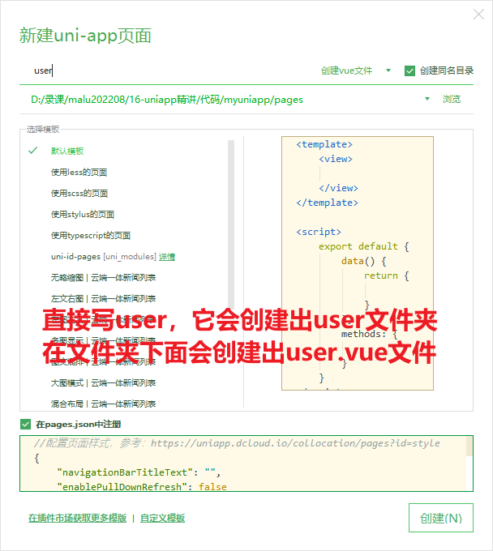
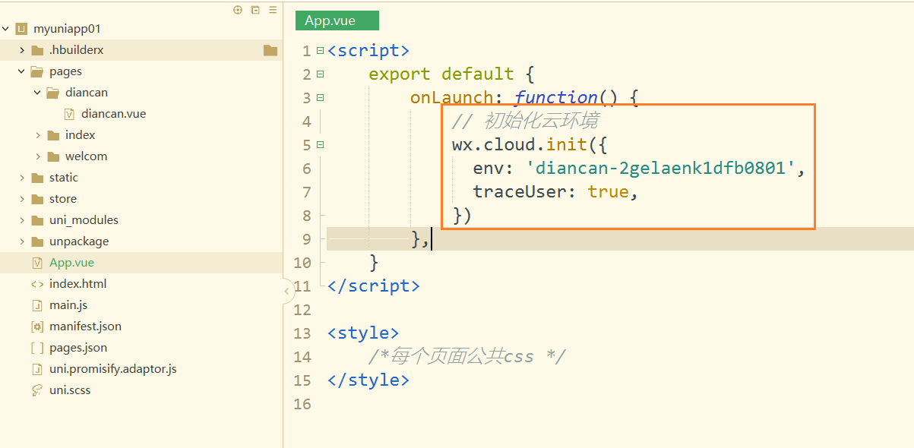

## 一，uniapp介绍

### 1，产品分类

**web开发：**

* 特点：运行在浏览器中的应用
* 官网，管理系统，webapp，H5

**App开发：**

* 原生App，指Anrdoid和iOS
* 跨平台App，特点：写一套代码可以在多端运行，uniapp，RN，Flutter，桌面应用，小程序
* 混合App（Hybrid），特点：原生App+Web开发    在原生App中嵌套Web页面


**Native APP**

* Native APP又称原生APP，就是我们平时说的手机/桌面应用软件。

* 原生APP 是针对IOS、Android、Windows、鸿蒙等不同的手机操作系统要采用不同的语言和框架进行开发出来的，通常是由“服务器数据+APP应用客户端”两部份构成。

* 实现技术：

  

```
  iOS: swift（雨燕）/ Object-C
  Android: java / kotlin
  HarmonyOS: JS, Java和C++
```

* 优缺点：
  

```
    优点：
      1)体验好，用户无法上网也可访问APP应用中以前下载的数据
      2)性能稳定，可调用手机的硬件设备（语音、摄像头、短信、GPS、重力感应等）和本地资源（通讯录，相册等）
      3)操作速度快，能够实现出色的动效，转场动画完美

    缺点：
      1)开发周期长，开发人员工资起点高。
      2)用户要使用原生APP，必须通过安装到手机里面才行，而且APP软件体积大，占用较多手机内存容量
      3)更新缓慢，根据不同平台，提交–审核–上线流程较复杂。
      4)要获取最新功能，需要升级应用，所以会容易出现有些用户不升级，导致多个不同功能版本出现，维护成本大
      5)跨平台差，每种平台都需要独立的开发语言。Java(安卓),swift(iOS), HarmonyOS(java、C++、js)等等
```

**Web APP**

* Web APP本质上是为移动浏览器设计的网站，可以在各种智能设备的浏览器上运行。

* 实现技术：

  

```
    HTML5+Javascript+CSS3
    react.js
    vue.js
```

* 优缺点：
  

```
优点：
	    1)一套代码到处运行，可以同时在 PC、Android、iPhone、鸿蒙系统上的浏览器上访问
	    2)开发者不需要发布到应用市场审核，用户不需要下载、安装和更新
	    3)开发周期短，维护成本低
	    4)用户不需用户手动更新，可以自动更新，直接使用最新版本
缺点：
	    1)转场表现略差，要求联网
	    2)用户体验没那么炫。图片和动画支持性不高
	    3)没法在应用市场中下载、无法通过应用下载获得盈利机会
	    4)对手机功能应用缺乏，有限制（蓝牙、网络、本地文件等）
```

​    

**Hybrid APP**

* Hybrid App就是混合APP，就是Native结合Web的混合开发，就是内部本质是Web网页，使用外壳打包软件给它套一层原生APP的外壳。

* 实现技术：

  

```
  APICloud -> apicloud template ---> APICloud编辑器 ---> 混合APP
  DCloud的uni-app ->Hbuilder编辑器 -> 混合APP
  RN -> 利用React技术开发App
  Flutter -> 使用Dart语言也可以开发安卓和iOS
  ...
```

* 优缺点：
  

```
    优点：
        1)集众家之长，既可以调用丰富的手机设备API，也能拥有WebAPP的跨平台能力
        2)可以在应用商店发布，实现收费下载
        3)内部是网页结构，可以自主更新，做到开发一次，所有平台生效
    4)降低开发成本和技术成本，降低维护和开发周期
    缺点：
        1)本质上就是一个Web APP使用了原生APP的壳，所以体验比不上原生APP，但是比webAPP强
        2)开发难度比Web APP高，有一定的学习成本，开发周期比Web APP长，但是比原生APP肯定要短。
        3)混合APP发布有可能无法通过审核，需要多次调整，才能发布
        4)依赖开发框架本身提供的手机设备API，少部分设备功能还是只能借助原生语言进行调用才可以
        5)对团队技术栈要求相对高，既要懂web开发的，也要懂原生APP开发的
```

### 2，uniapp介绍

**介绍：**

* 在2018年9月份才诞生的。官网：https://uniapp.dcloud.net.cn/
* 是一个跨平台技术，一套代码，通过不同的打包方法，可以将期编译运行到多个平台上。
* 通常在公司中，我们使用uniapp来做微信小程序和安卓。
* 跨平台技术，听上去非常高大上，只要是跨平台，就意味着有很多的坑，不要滥用。


### 3，搭建uniapp的开发环境并【运行】到浏览器

开发uniapp，最好使用人家提供的编译器，叫hbuildX，如下：


下载这个工具，如下：


下载完后，得到一个压缩包，解压，如下：


在桌面上就有开发工具了，如下：


然后，就可以双击打开，做一些设置，如下：


创建一个项目，学习时，就创建一个默认模板，学会后，可以创建其它的模板，如下：


可以把项目运行在不同的平台，先运行到浏览器中，第1次运行比较慢一点，如下：


你需要告诉hbuildx，你的谷歌浏览器在什么地方，如下：


我们的课程，就以微信小程序开发， 和安卓开发为例去演示。

### 4，uniapp后台系统

看一下微信小程序的后台系统，如下：


如果使用uniapp开发微信小程序，也需要appid，如下：


同现，uniapp也对应了一个管理系统，也有一个appid。

地址：https://dev.dcloud.net.cn/pages/common/login?uniIdRedirectUrl=%252Fpages%252Fapp%252Flist

如果没有账号，需要注册一个账号。我已经注册过了，直接登录了。


创建一个项目，需要创建一个应用，如下：


填写appid，如下：


后台系统，用的时候，可以去看一看，如下：


如果改了appid，需要重启服务，如下：


### 5，目录结构

uniapp代码风格 = vue代码风格 + 微信小程序代码风格。在写uniapp代码时，就感觉是在写vue和原生小程序。

**目录结构：**


说明：

```txt
├─pages            业务页面文件存放的目录
│  └─index
│     └─index.vue  index页面
├─static           存放应用引用的本地静态资源的目录(注意：静态资源只能存放于此)
├─unpackage        非工程代码，一般存放运行或发行的编译结果
├─index.html       H5端页面
├─main.js          Vue初始化入口文件
├─App.vue          配置App全局样式、监听应用生命周期
├─pages.json       **配置页面路由、导航栏、tabBar等页面类信息**
├─manifest.json    **配置appid**、应用名称、logo、版本等打包信息
└─uni.scss         uni-app内置的常用样式变量
```

### 6，【运行】到微信小程序

HBuildeX和微信小程序工具的关系：


需要先打开微信开发者工具，开放端口，如下：


在hbuildx中配置微信开发者工具的路径，如下：


现在就可以把项目运行到微信开发者工具了，如下：


打开微信开发者工具，如下：


### 7，【运行】到安卓（真机）

在安卓手机上调试，也就是把代码打包成安卓代码。步骤有点繁琐，在公司中都会给测试机。今天演示一下，想操作的话，操作一下，不想操作就算了。

**步骤：**

华为手机鸿蒙系统直接用数据线连接电脑和手机，在真机模式列表是找不到设备的，需要手动配置一下，步骤如下：<br/>
1、使用数据线将电脑和手机连接；选择传输文件; <br/>
2、在手机的设置项，拉倒底部，找到并点击“关于手机”；<br/>
3、连续点击《版本号》次，然后再返回设置，拉倒底部，找到并点击“系统和更新”；<br/>
4、在当前页面就可以看到《开发人员选项》了，点击进入；<br/>
5、在当前页面的调试栏开启《USB调试》；<br/>
6、在网络栏目，《选择USB配置》换成《音频来源》；<br/>
7、这个时候会有一个点击确认的弹窗，点击确定即可；<br/>
8、然后回到uniapp，点击菜单栏的《运行》->《运行到手机或模拟器》->《运行到Android APP基座》；<br/>
9、这个时候就可以在列表里找到你的手机设备了；<br/>
10、完。<br/>

### 8，选择vue2 or vue3

安装uni-app vue3编译器插件：


开发uniapp:  vue2/vue3风格 + 原生微信小程序风格。vue3的写法是从2021年下半年才开始支持，也就1年半的时候。现在开发uniapp是有两种选择。

选择如下：


我们选择vue3，看一下入口文件，如下：


看一下首页面，如下：


在微信开发者工具中，测试如下：


### 9，UI组件库的选择

一般情况下，我们会使用uView，地址：https://www.uviewui.com/


总结使用uniapp开发小程序的选择：

* vue2语法 + 小程序语法 + uView
* vue3语法 + 小程序语法  + 目前还没找到合适的ui组件库

## 二，uniapp的开发范式

### 1，uni-app和原生小程序开发区别

uni-app 项目每个页面是一个 `.vue` 文件，数据绑定及事件处理同 `Vue.js` 规范：

1. 属性绑定 `src="{ { url }}"` 升级成 `:src="url"`
2. 事件绑定 `bindtap="eventName"` 升级成 `@tap="eventName"`，**支持（）传参**
3. 支持 Vue 常用**指令** `v-for`、`v-if`、`v-show`、`v-model` 等

其他区别补充

1. 调用接口能力，**建议前缀** `wx` 替换为 `uni` ，养成好习惯，**支持多端开发**。
2. `style` 页面样式不需要写 `scoped`，小程序是多页面应用，**页面样式自动隔离**。
3. **生命周期分三部分**：应用生命周期(小程序)，页面生命周期(小程序)，组件生命周期(Vue)

案例：

* 滑动轮播图
* 点击大图预览

参考代码：

```vue
<template>
  <swiper class="banner" indicator-dots circular :autoplay="false">
    <swiper-item v-for="item in pictures" :key="item.id">
      <image @tap="onPreviewImage(item.url)" :src="item.url"></image>
    </swiper-item>
  </swiper>
</template>

<script>
export default {
  data() {
    return {
      // 轮播图数据
      pictures: [
        {
          id: '1',
          url: 'https://pcapi-xiaotuxian-front-devtest.itheima.net/miniapp/uploads/goods_preview_1.jpg',
        },
        {
          id: '2',
          url: 'https://pcapi-xiaotuxian-front-devtest.itheima.net/miniapp/uploads/goods_preview_2.jpg',
        },
        {
          id: '3',
          url: 'https://pcapi-xiaotuxian-front-devtest.itheima.net/miniapp/uploads/goods_preview_3.jpg',
        },
        {
          id: '4',
          url: 'https://pcapi-xiaotuxian-front-devtest.itheima.net/miniapp/uploads/goods_preview_4.jpg',
        },
        {
          id: '5',
          url: 'https://pcapi-xiaotuxian-front-devtest.itheima.net/miniapp/uploads/goods_preview_5.jpg',
        },
      ],
    }
  },
  methods: {
    onPreviewImage(url) {
      // 大图预览
      uni.previewImage({
        urls: this.pictures.map((v) => v.url),
        current: url,
      })
    },
  },
}
</script>

<style>
.banner,
.banner image {
  width: 750rpx;
  height: 750rpx;
}
</style>
```

### 2，路由

在uniapp中路由是内置的，不需要使用vue-router，和微信小程序中路由风格是一样的。创建一个页面，如下：





找到配置文件，如下：


尝试去配置一些内容，如下：


测试如下：


把哪一个页面放前面，默认就启动哪一个页面，如下：


在user页面中，我要跳到首页面，如下：


测试是否可以跳过去，如下：


在首页面中，接收人家的参数，如下：

测试如下：


### 3，Vuex3和Vuex4

在uniapp中内置了vuex，没有使用pinia。使用的vuex版本是4。vuex版本：

* vue2，使用的是vuex3
* vue3，使用的是vuex4，但是官方推荐使用pinia

按理说，uniapp中如果使用vue3，应用使用pinia，但是人家还是内置了vuex4。

创建一个store文件夹，如下：


书写app模块，如下：


在入口文件中，就需要使用仓库，如下：


在组件中，就可以使用仓库中的状态，更新状态，如下：


测试如下：


总结使用vuex4：

* 在uniapp中内置了vuex，不需要下载安装，直接使用。
* 在vuex4版本中，是使用createStore来创建仓库的。一般情况下，仓库中也是分模块的。
* 在main.js中对store进行注册并挂载。
* 在组合式组件中，通过useStore来使用仓库。
* 通过store.commit来触发一个mutation。
* 通过store.dispatch来触发一个action。

上面的vuex4的写法，下面演示在vue2中使用vuex3，如下：


在mian.js中使用之，如下：


在点餐页面中使用之如下：


参考代码：

```vue
<template>
	<view>
		点餐页面
		<view>{{num}}</view>
		<view>-------------------</view>
		<view>{{doubleNum}}</view>
		<!-- <button @click="add">+1</button>
		<button @click="addAsync">异步+1</button> -->
		
		<button @click="addNum(1)">+1</button>
		<button @click="addNumAsync(2)">异步+2</button>
		
	</view>
</template>

<script>
	import {mapState,mapGetters,mapMutations,mapActions} from "vuex"
	export default {
		onLoad(){
			console.log(this.$store.state.num)
		},
		data() {
			return {
				
			}
		},
		computed:{
			...mapState(["num"]),
			...mapGetters(['doubleNum'])
		},
		methods: {
			...mapMutations(["addNum"]),
			...mapActions(["addNumAsync"]),
			
			// add(){
			// 	this.$store.commit("addNum",1)
			// },
			// addAsync(){
			// 	this.$store.dispatch("addNumAsync",2)
			// }
		}
	}
</script>

<style>

</style>
```

### 4，组件库

使用组件库有如下的选择：

* uniapp使用的是vue2的风格，组件库可以使用内置组件或uView。
* uniapp使用的是vue3的风格，只能使用uniapp内置组件。

演示uView的使用。重新创建一个vue2的项目，如下：


把项目跑起来，如下：


之前，我们安装一个模块，都是通过npm i xxx的形式进行的。在uniapp中都是以插件的形式提供的，现在我们就需要安装插件了。大家需要注册账号：https://account.dcloud.net.cn/uni_modules/uni-id-pages/pages/register/register-by-email?loginUrl=https%3A%2F%2Fdev.dcloud.net.cn%2Fpages%2Fcommon%2Flogin%3FuniIdRedirectUrl%3D%25252Fpages%25252Fapp%25252Flist

步骤如下：

第一步：两个地方，都需要登录，如下：


第二步：搜索对应的插件，如下：


第三步：导入使用，如下：


看一下项目的目录结构，如下：


使用之，参考文档：https://www.uviewui.com/components/downloadSetting.html


测试之，如下：


### 5，文档（很重要）

之前学习过的vue语法和微信小程序语法，并不100%适合uniapp。当我们按我们的之前的技术积累去写uniapp时，如果效果不是我们需要的，可能就是这个语法，uniapp不认识。 <br/>

uniapp的文档是第1手资料，花1天时间，可以熟读。地址：https://uniapp.dcloud.net.cn/


在文档中，需要注意并读的文章：

* 介绍下面的跨端注意，讲了使用uniapp会遇到哪些坑（面试题）
* vue2语法，vue3语法，条件编译，性能优化（面试题）

### 6，使用云开发

在hbuilder中，需要填写小程序的appid，如下：


首使用使用你的微信小程序的appid，你的appid需要开通云开发，如下：


然后，你需要在两个地方，进行修改，第1个地方：



第2个地方，如下：


查看小程序的编译的效果：


创建出此文件夹，如下：


上传云函数：


本地调试之：


## 三，发行（打包）

当项目写完了，开始发行了。

### 1，【发行】安卓

打包之前，需要进行配置，如下：


然后开始打包，如下：


生成证书，地址：https://ask.dcloud.net.cn/article/35777

生成证书时，需要你电脑上有java开发环境，说白了，就是安装了jdk。参考连接：

https://yujingbo1023.github.io/javablog/public/blogs/base/01.html


安装完成后，还需要配置环境变量，也可以参考文档去配置，如果不会配置可以去找一些视频或博客去看一下。证明java已安装OK，如下：


有了java环境，才能去执行命令，生成安卓的证书，如下：


输入命令生成证书，如下：


### 2，【发行】微信小程序

需要准备好小程序的appid，在微信开发者工具中，上传代码，进行上线操作就OK。和大家之前上线的todomvc一样的。

步骤如下：


生成小程序代码，如下：


使用微信开发者工具，把代码上传到小程序后台，如下：


点完上传，进入小程序的后台，如下：


点击提交审核，如下：


需要填写小程序的资料，如下：


填写完资料后，需要提交审核，审核通过后，大家就可以搜索到你的小程序了。

### 3，【发行】H5

先发行H5，如下：


开始部署，把项目推荐到远程仓库，如下：


当我们去访问连接，如下：


分析路径，如下：


测试路径，如下：


也就是说在发行时，路径配置不对，如下：


修改之，如下：


重新发行，如下：


打开发代码，看路径，如下：


重新把代码扔到的远程仓库，如下：


重新部署，如下：


访问之，如下：


### 4，找uniapp项目

* 黑马实战项目：https://gitee.com/Megasu/uniapp-shop-vue3-ts?_from=gitee_search

* 一个 uni-app 实战视频教程：https://www.bilibili.com/video/BV1eT411L7yj/

* 自行去网上找一套uniapp项目，它里面的代码基本上都能看懂。
  + gitee
  + github
  + 淘宝
  + 咸鱼
  + 其它

## 四，使用VS Code开发uniapp项目

### 1，为什么选择vscode

* VS Code 对 **TS 类型支持友好**，前端开发者**主流的编辑器**
* HbuilderX 对 TS 类型支持暂不完善，期待官方完善 

### 2，开发配置

项目采用 Vue3 + TS 开发 uni-app 项目，所以需要分别安装 Vue3 + TS 插件 和 uni-app 插件

插件安装：

* 安装 [Vue Language Features (Volar)](https://marketplace.visualstudio.com/items?itemName=Vue.volar) ：Vue3 语法提示插件
* 安装 [TypeScript Vue Plugin (Volar)](https://marketplace.visualstudio.com/items?itemName=Vue.vscode-typescript-vue-plugin) ：Vue3 的 TS 插件
* 工作区禁用 Vetur 插件(Vue2 插件和 Vue3 插件冲突)
* 工作区禁用 @builtin typescript 插件（禁用后自动开启 Vue3 的 TS 托管模式）

禁用插件：


安装uni-app插件：

* [uni-create-view](https://marketplace.visualstudio.com/items?itemName=mrmaoddxxaa.create-uniapp-view) ：快速创建 uni-app 页面
* [uni-helper](https://marketplace.visualstudio.com/items?itemName=uni-helper.uni-helper-vscode) ：uni-app 代码提示
* [uniapp 小程序扩展](https://marketplace.visualstudio.com/items?itemName=evils.uniapp-vscode) ：鼠标悬停查文档

## 五，uniapp项目

### 1，项目准备

一般情况下，一个项目都是有原型图，大家可以上这个网站：https://www.axureshop.com/

* 大家参考的原型图：https://www.axureshop.com/ys/1281049

给大家资料如下：


大家解压myuniapp01.rar压缩包，如下：


使用hbuilder打开项目，如下：


运行项目到微信小程序中：


把环境ID复制到App.vue中，如下：


在云环境中，大家需要创建一些集合，只有先把集合（表）创建出来：

```txt
business-acc：商家账号  
shop-infor:商家信息
dishes-category:菜品类目
dishes-data:菜品
dishunit:菜品单位
order-data:订单
seven_day_sales:每一天的销售额
table_qr_code:桌号
```

还需要设置权限：


在家解压后端代码：


安装依赖：


修改后端代码：


把后端跑起来：


把管理系统解压：


安装依赖：


运行项目：


浏览器查看效果：


你就先注册一个账号：


登录上去，第1次需要你设置一些店铺信息：


最后通过管理系统，给数据库中的集合添加一些菜品类目，再添加一些菜品。大家至少要添加3个类目，一个类目下面添加10个菜品。

### 2，绘制点餐页面
