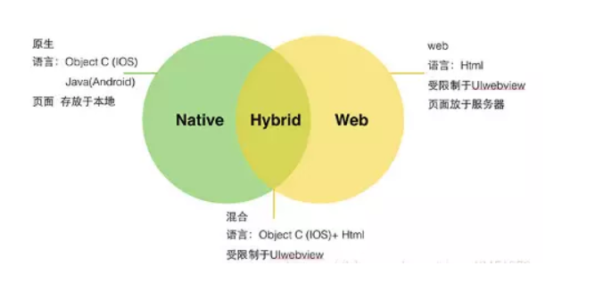
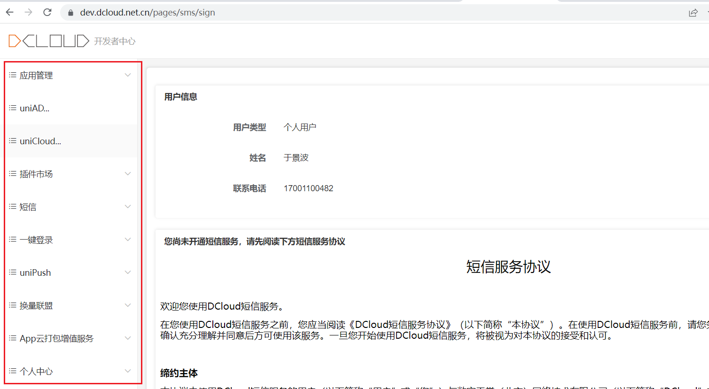
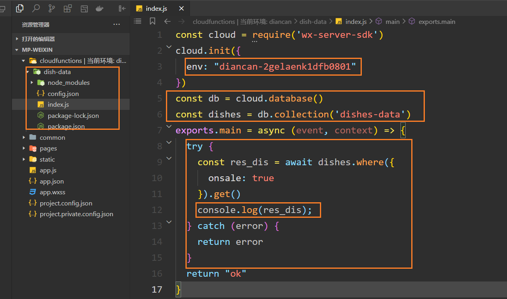
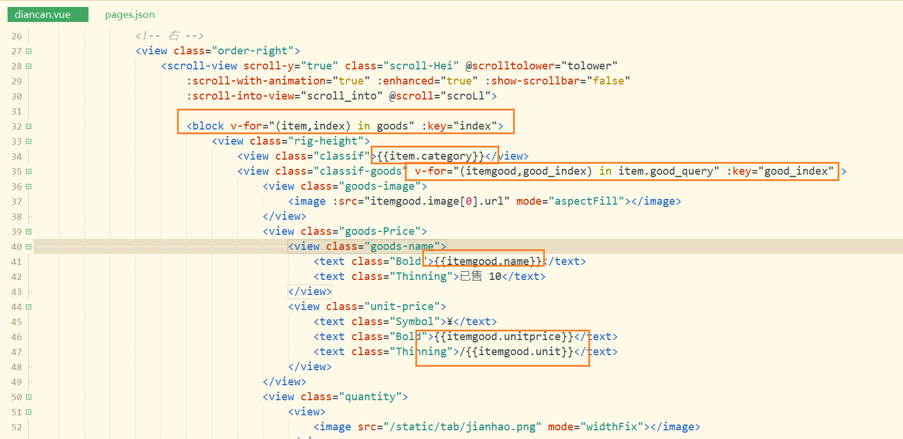
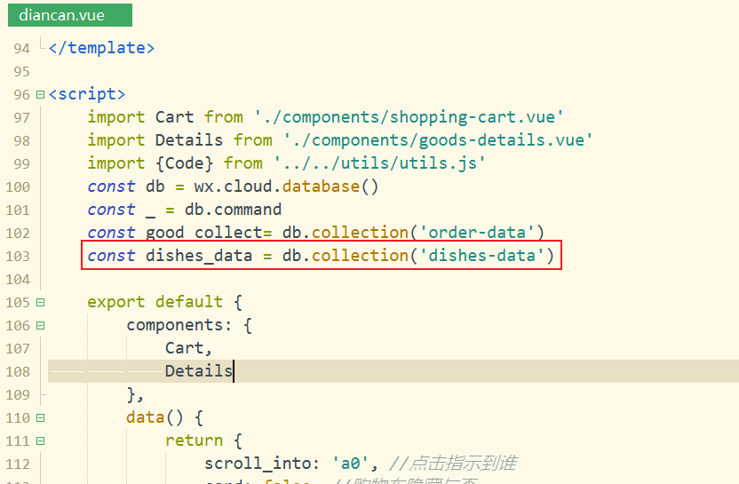
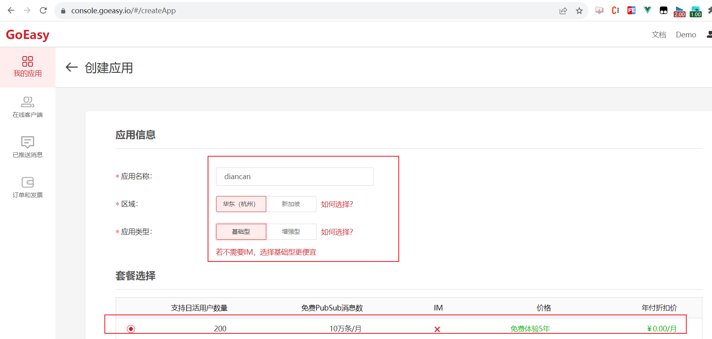
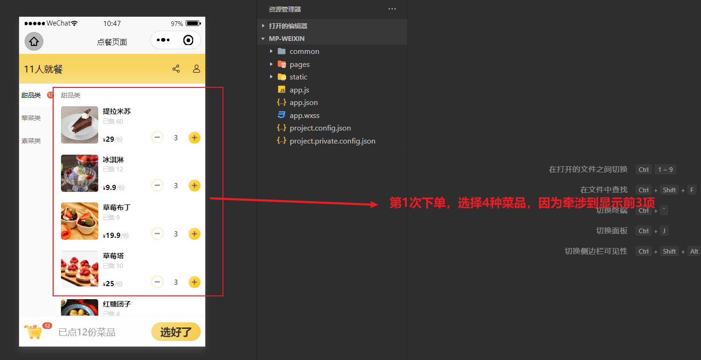

## 一，uniapp介绍

### 1，产品分类

**web开发：**

* 特点：运行在浏览器中的应用
* 官网，管理系统，webapp，H5

**App开发：**

* 原生App，指Anrdoid和iOS
* 跨平台App，特点：写一套代码可以在多端运行，uniapp，RN，Flutter，桌面应用，小程序
* 混合App（Hybrid），特点：原生App+Web开发    在原生App中嵌套Web页面




**Native APP**

* Native APP又称原生APP，就是我们平时说的手机/桌面应用软件。

* 原生APP 是针对IOS、Android、Windows、鸿蒙等不同的手机操作系统要采用不同的语言和框架进行开发出来的，通常是由“服务器数据+APP应用客户端”两部份构成。

* 实现技术：

  

```
  iOS: swift（雨燕）/ Object-C
  Android: java / kotlin
  HarmonyOS: JS, Java和C++
```

* 优缺点：
  

```
    优点：
      1)体验好，用户无法上网也可访问APP应用中以前下载的数据
      2)性能稳定，可调用手机的硬件设备（语音、摄像头、短信、GPS、重力感应等）和本地资源（通讯录，相册等）
      3)操作速度快，能够实现出色的动效，转场动画完美

    缺点：
      1)开发周期长，开发人员工资起点高。
      2)用户要使用原生APP，必须通过安装到手机里面才行，而且APP软件体积大，占用较多手机内存容量
      3)更新缓慢，根据不同平台，提交–审核–上线流程较复杂。
      4)要获取最新功能，需要升级应用，所以会容易出现有些用户不升级，导致多个不同功能版本出现，维护成本大
      5)跨平台差，每种平台都需要独立的开发语言。Java(安卓),swift(iOS), HarmonyOS(java、C++、js)等等
```

**Web APP**

* Web APP本质上是为移动浏览器设计的网站，可以在各种智能设备的浏览器上运行。

* 实现技术：

  

```
    HTML5+Javascript+CSS3
    react.js
    vue.js
```

* 优缺点：
  

```
优点：
	    1)一套代码到处运行，可以同时在 PC、Android、iPhone、鸿蒙系统上的浏览器上访问
	    2)开发者不需要发布到应用市场审核，用户不需要下载、安装和更新
	    3)开发周期短，维护成本低
	    4)用户不需用户手动更新，可以自动更新，直接使用最新版本
缺点：
	    1)转场表现略差，要求联网
	    2)用户体验没那么炫。图片和动画支持性不高
	    3)没法在应用市场中下载、无法通过应用下载获得盈利机会
	    4)对手机功能应用缺乏，有限制（蓝牙、网络、本地文件等）
```

​    

**Hybrid APP**

* Hybrid App就是混合APP，就是Native结合Web的混合开发，就是内部本质是Web网页，使用外壳打包软件给它套一层原生APP的外壳。

* 实现技术：

  

```
  APICloud -> apicloud template ---> APICloud编辑器 ---> 混合APP
  DCloud的uni-app ->Hbuilder编辑器 -> 混合APP
  RN -> 利用React技术开发App
  Flutter -> 使用Dart语言也可以开发安卓和iOS
  ...
```

* 优缺点：
  

```
    优点：
        1)集众家之长，既可以调用丰富的手机设备API，也能拥有WebAPP的跨平台能力
        2)可以在应用商店发布，实现收费下载
        3)内部是网页结构，可以自主更新，做到开发一次，所有平台生效
    4)降低开发成本和技术成本，降低维护和开发周期
    缺点：
        1)本质上就是一个Web APP使用了原生APP的壳，所以体验比不上原生APP，但是比webAPP强
        2)开发难度比Web APP高，有一定的学习成本，开发周期比Web APP长，但是比原生APP肯定要短。
        3)混合APP发布有可能无法通过审核，需要多次调整，才能发布
        4)依赖开发框架本身提供的手机设备API，少部分设备功能还是只能借助原生语言进行调用才可以
        5)对团队技术栈要求相对高，既要懂web开发的，也要懂原生APP开发的
```

### 2，uniapp介绍

**介绍：**

* 在2018年9月份才诞生的。官网：https://uniapp.dcloud.net.cn/
* 是一个跨平台技术，一套代码，通过不同的打包方法，可以将期编译运行到多个平台上。
* 通常在公司中，我们使用uniapp来做微信小程序和安卓。
* 跨平台技术，听上去非常高大上，只要是跨平台，就意味着有很多的坑，不要滥用。


### 3，搭建uniapp的开发环境并【运行】到浏览器

开发uniapp，最好使用人家提供的编译器，叫hbuildX，如下：


下载这个工具，如下：


下载完后，得到一个压缩包，解压，如下：


在桌面上就有开发工具了，如下：


然后，就可以双击打开，做一些设置，如下：


创建一个项目，学习时，就创建一个默认模板，学会后，可以创建其它的模板，如下：


可以把项目运行在不同的平台，先运行到浏览器中，第1次运行比较慢一点，如下：


你需要告诉hbuildx，你的谷歌浏览器在什么地方，如下：


我们的课程，就以微信小程序开发， 和安卓开发为例去演示。

### 4，uniapp后台系统

看一下微信小程序的后台系统，如下：


如果使用uniapp开发微信小程序，也需要appid，如下：


同现，uniapp也对应了一个管理系统，也有一个appid。

地址：https://dev.dcloud.net.cn/pages/common/login?uniIdRedirectUrl=%252Fpages%252Fapp%252Flist

如果没有账号，需要注册一个账号。我已经注册过了，直接登录了。


创建一个项目，需要创建一个应用，如下：


填写appid，如下：


后台系统，用的时候，可以去看一看，如下：



如果改了appid，需要重启服务，如下：


### 5，目录结构

uniapp代码风格 = vue代码风格 + 微信小程序代码风格。在写uniapp代码时，就感觉是在写vue和原生小程序。

**目录结构：**


说明：

```txt
├─pages            业务页面文件存放的目录
│  └─index
│     └─index.vue  index页面
├─static           存放应用引用的本地静态资源的目录(注意：静态资源只能存放于此)
├─unpackage        非工程代码，一般存放运行或发行的编译结果
├─index.html       H5端页面
├─main.js          Vue初始化入口文件
├─App.vue          配置App全局样式、监听应用生命周期
├─pages.json       **配置页面路由、导航栏、tabBar等页面类信息**
├─manifest.json    **配置appid**、应用名称、logo、版本等打包信息
└─uni.scss         uni-app内置的常用样式变量
```

### 6，【运行】到微信小程序

HBuildeX和微信小程序工具的关系：


需要先打开微信开发者工具，开放端口，如下：


在hbuildx中配置微信开发者工具的路径，如下：


现在就可以把项目运行到微信开发者工具了，如下：


打开微信开发者工具，如下：


### 7，【运行】到安卓（真机）

在安卓手机上调试，也就是把代码打包成安卓代码。步骤有点繁琐，在公司中都会给测试机。今天演示一下，想操作的话，操作一下，不想操作就算了。

**步骤：**

华为手机鸿蒙系统直接用数据线连接电脑和手机，在真机模式列表是找不到设备的，需要手动配置一下，步骤如下：<br/>
1、使用数据线将电脑和手机连接；选择传输文件; <br/>
2、在手机的设置项，拉倒底部，找到并点击“关于手机”；<br/>
3、连续点击《版本号》次，然后再返回设置，拉倒底部，找到并点击“系统和更新”；<br/>
4、在当前页面就可以看到《开发人员选项》了，点击进入；<br/>
5、在当前页面的调试栏开启《USB调试》；<br/>
6、在网络栏目，《选择USB配置》换成《音频来源》；<br/>
7、这个时候会有一个点击确认的弹窗，点击确定即可；<br/>
8、然后回到uniapp，点击菜单栏的《运行》->《运行到手机或模拟器》->《运行到Android APP基座》；<br/>
9、这个时候就可以在列表里找到你的手机设备了；<br/>
10、完。<br/>

### 8，选择vue2 or vue3

安装uni-app vue3编译器插件：


开发uniapp:  vue2/vue3风格 + 原生微信小程序风格。vue3的写法是从2021年下半年才开始支持，也就1年半的时候。现在开发uniapp是有两种选择。

选择如下：


我们选择vue3，看一下入口文件，如下：


看一下首页面，如下：


在微信开发者工具中，测试如下：


### 9，UI组件库的选择

一般情况下，我们会使用uView，地址：https://www.uviewui.com/


总结使用uniapp开发小程序的选择：

* vue2语法 + 小程序语法 + uView
* vue3语法 + 小程序语法  + 目前还没找到合适的ui组件库

## 二，uniapp的开发范式

### 1，uni-app和原生小程序开发区别

uni-app 项目每个页面是一个 `.vue` 文件，数据绑定及事件处理同 `Vue.js` 规范：

1. 属性绑定 `src="{ { url }}"` 升级成 `:src="url"`
2. 事件绑定 `bindtap="eventName"` 升级成 `@tap="eventName"`，**支持（）传参**
3. 支持 Vue 常用**指令** `v-for`、`v-if`、`v-show`、`v-model` 等

其他区别补充

1. 调用接口能力，**建议前缀** `wx` 替换为 `uni` ，养成好习惯，**支持多端开发**。
2. `style` 页面样式不需要写 `scoped`，小程序是多页面应用，**页面样式自动隔离**。
3. **生命周期分三部分**：应用生命周期(小程序)，页面生命周期(小程序)，组件生命周期(Vue)

案例：

* 滑动轮播图
* 点击大图预览

参考代码：

```vue
<template>
  <swiper class="banner" indicator-dots circular :autoplay="false">
    <swiper-item v-for="item in pictures" :key="item.id">
      <image @tap="onPreviewImage(item.url)" :src="item.url"></image>
    </swiper-item>
  </swiper>
</template>

<script>
export default {
  data() {
    return {
      // 轮播图数据
      pictures: [
        {
          id: '1',
          url: 'https://pcapi-xiaotuxian-front-devtest.itheima.net/miniapp/uploads/goods_preview_1.jpg',
        },
        {
          id: '2',
          url: 'https://pcapi-xiaotuxian-front-devtest.itheima.net/miniapp/uploads/goods_preview_2.jpg',
        },
        {
          id: '3',
          url: 'https://pcapi-xiaotuxian-front-devtest.itheima.net/miniapp/uploads/goods_preview_3.jpg',
        },
        {
          id: '4',
          url: 'https://pcapi-xiaotuxian-front-devtest.itheima.net/miniapp/uploads/goods_preview_4.jpg',
        },
        {
          id: '5',
          url: 'https://pcapi-xiaotuxian-front-devtest.itheima.net/miniapp/uploads/goods_preview_5.jpg',
        },
      ],
    }
  },
  methods: {
    onPreviewImage(url) {
      // 大图预览
      uni.previewImage({
        urls: this.pictures.map((v) => v.url),
        current: url,
      })
    },
  },
}
</script>

<style>
.banner,
.banner image {
  width: 750rpx;
  height: 750rpx;
}
</style>
```

### 2，路由

在uniapp中路由是内置的，不需要使用vue-router，和微信小程序中路由风格是一样的。创建一个页面，如下：


找到配置文件，如下：


尝试去配置一些内容，如下：


测试如下：


把哪一个页面放前面，默认就启动哪一个页面，如下：


在user页面中，我要跳到首页面，如下：


测试是否可以跳过去，如下：


在首页面中，接收人家的参数，如下：

测试如下：


### 3，Vuex3和Vuex4

在uniapp中内置了vuex，没有使用pinia。使用的vuex版本是4。vuex版本：

* vue2，使用的是vuex3
* vue3，使用的是vuex4，但是官方推荐使用pinia

按理说，uniapp中如果使用vue3，应用使用pinia，但是人家还是内置了vuex4。

创建一个store文件夹，如下：


书写app模块，如下：


在入口文件中，就需要使用仓库，如下：


在组件中，就可以使用仓库中的状态，更新状态，如下：


测试如下：


总结使用vuex4：

* 在uniapp中内置了vuex，不需要下载安装，直接使用。
* 在vuex4版本中，是使用createStore来创建仓库的。一般情况下，仓库中也是分模块的。
* 在main.js中对store进行注册并挂载。
* 在组合式组件中，通过useStore来使用仓库。
* 通过store.commit来触发一个mutation。
* 通过store.dispatch来触发一个action。

上面的vuex4的写法，下面演示在vue2中使用vuex3，如下：


在mian.js中使用之，如下：


在点餐页面中使用之如下：


参考代码：

```vue
<template>
	<view>
		点餐页面
		<view>{{num}}</view>
		<view>-------------------</view>
		<view>{{doubleNum}}</view>
		<!-- <button @click="add">+1</button>
		<button @click="addAsync">异步+1</button> -->
		
		<button @click="addNum(1)">+1</button>
		<button @click="addNumAsync(2)">异步+2</button>
		
	</view>
</template>

<script>
	import {mapState,mapGetters,mapMutations,mapActions} from "vuex"
	export default {
		onLoad(){
			console.log(this.$store.state.num)
		},
		data() {
			return {
				
			}
		},
		computed:{
			...mapState(["num"]),
			...mapGetters(['doubleNum'])
		},
		methods: {
			...mapMutations(["addNum"]),
			...mapActions(["addNumAsync"]),
			
			// add(){
			// 	this.$store.commit("addNum",1)
			// },
			// addAsync(){
			// 	this.$store.dispatch("addNumAsync",2)
			// }
		}
	}
</script>

<style>

</style>
```

### 4，组件库

使用组件库有如下的选择：

* uniapp使用的是vue2的风格，组件库可以使用内置组件或uView。
* uniapp使用的是vue3的风格，只能使用uniapp内置组件。

演示uView的使用。重新创建一个vue2的项目，如下：


把项目跑起来，如下：


之前，我们安装一个模块，都是通过npm i xxx的形式进行的。在uniapp中都是以插件的形式提供的，现在我们就需要安装插件了。大家需要注册账号：https://account.dcloud.net.cn/uni_modules/uni-id-pages/pages/register/register-by-email?loginUrl=https%3A%2F%2Fdev.dcloud.net.cn%2Fpages%2Fcommon%2Flogin%3FuniIdRedirectUrl%3D%25252Fpages%25252Fapp%25252Flist

步骤如下：

第一步：两个地方，都需要登录，如下：


第二步：搜索对应的插件，如下：


第三步：导入使用，如下：


看一下项目的目录结构，如下：


使用之，参考文档：https://www.uviewui.com/components/downloadSetting.html


测试之，如下：


### 5，文档（很重要）

之前学习过的vue语法和微信小程序语法，并不100%适合uniapp。当我们按我们的之前的技术积累去写uniapp时，如果效果不是我们需要的，可能就是这个语法，uniapp不认识。 <br/>

uniapp的文档是第1手资料，花1天时间，可以熟读。地址：https://uniapp.dcloud.net.cn/


在文档中，需要注意并读的文章：

* 介绍下面的跨端注意，讲了使用uniapp会遇到哪些坑（面试题）
* vue2语法，vue3语法，条件编译，性能优化（面试题）

### 6，使用云开发

在hbuilder中，需要填写小程序的appid，如下：


首使用使用你的微信小程序的appid，你的appid需要开通云开发，如下：


然后，你需要在两个地方，进行修改，第1个地方：


第2个地方，如下：


查看小程序的编译的效果：


创建出此文件夹，如下：


上传云函数：


本地调试之：


## 三，发行（打包）

当项目写完了，开始发行了。

### 1，【发行】安卓

打包之前，需要进行配置，如下：


然后开始打包，如下：


生成证书，地址：https://ask.dcloud.net.cn/article/35777

生成证书时，需要你电脑上有java开发环境，说白了，就是安装了jdk。参考连接：

https://yujingbo1023.github.io/javablog/public/blogs/base/01.html


安装完成后，还需要配置环境变量，也可以参考文档去配置，如果不会配置可以去找一些视频或博客去看一下。证明java已安装OK，如下：


有了java环境，才能去执行命令，生成安卓的证书，如下：


输入命令生成证书，如下：


### 2，【发行】微信小程序

需要准备好小程序的appid，在微信开发者工具中，上传代码，进行上线操作就OK。和大家之前上线的todomvc一样的。

步骤如下：


生成小程序代码，如下：


使用微信开发者工具，把代码上传到小程序后台，如下：


点完上传，进入小程序的后台，如下：


点击提交审核，如下：


需要填写小程序的资料，如下：


填写完资料后，需要提交审核，审核通过后，大家就可以搜索到你的小程序了。

### 3，【发行】H5

先发行H5，如下：


开始部署，把项目推荐到远程仓库，如下：


当我们去访问连接，如下：


分析路径，如下：


测试路径，如下：


也就是说在发行时，路径配置不对，如下：


修改之，如下：


重新发行，如下：


打开发代码，看路径，如下：


重新把代码扔到的远程仓库，如下：


重新部署，如下：


访问之，如下：


### 4，找uniapp项目

* 黑马实战项目：https://gitee.com/Megasu/uniapp-shop-vue3-ts?_from=gitee_search

* 一个 uni-app 实战视频教程：https://www.bilibili.com/video/BV1eT411L7yj/

* 自行去网上找一套uniapp项目，它里面的代码基本上都能看懂。
  + gitee
  + github
  + 淘宝
  + 咸鱼
  + 其它

## 四，使用VS Code开发uniapp项目

### 1，为什么选择vscode

* VS Code 对 **TS 类型支持友好**，前端开发者**主流的编辑器**
* HbuilderX 对 TS 类型支持暂不完善，期待官方完善 

### 2，开发配置

项目采用 Vue3 + TS 开发 uni-app 项目，所以需要分别安装 Vue3 + TS 插件 和 uni-app 插件

插件安装：

* 安装 [Vue Language Features (Volar)](https://marketplace.visualstudio.com/items?itemName=Vue.volar) ：Vue3 语法提示插件
* 安装 [TypeScript Vue Plugin (Volar)](https://marketplace.visualstudio.com/items?itemName=Vue.vscode-typescript-vue-plugin) ：Vue3 的 TS 插件
* 工作区禁用 Vetur 插件(Vue2 插件和 Vue3 插件冲突)
* 工作区禁用 @builtin typescript 插件（禁用后自动开启 Vue3 的 TS 托管模式）

禁用插件：


安装uni-app插件：

* [uni-create-view](https://marketplace.visualstudio.com/items?itemName=mrmaoddxxaa.create-uniapp-view) ：快速创建 uni-app 页面
* [uni-helper](https://marketplace.visualstudio.com/items?itemName=uni-helper.uni-helper-vscode) ：uni-app 代码提示
* [uniapp 小程序扩展](https://marketplace.visualstudio.com/items?itemName=evils.uniapp-vscode) ：鼠标悬停查文档

## 五，uniapp项目

### 1，项目准备

一般情况下，一个项目都是有原型图，大家可以上这个网站：https://www.axureshop.com/

* 大家参考的原型图：https://www.axureshop.com/ys/1281049

给大家资料如下：


大家解压myuniapp01.rar压缩包，如下：


使用hbuilder打开项目，如下：


运行项目到微信小程序中：


把环境ID复制到App.vue中，如下：


在云环境中，大家需要创建一些集合，只有先把集合（表）创建出来，集合名字必须和下面一样：

```txt
business-acc：商家账号  
shop-infor:商家信息
dishes-category:菜品类目
dishes-data:菜品
dishunit:菜品单位
order-data:订单
seven_day_sales:每一天的销售额
table_qr_code:桌号
```

还需要设置权限：


在家解压后端代码：


安装依赖：


修改后端代码，必须要和下面的一样，注意空格：


把后端跑起来：


把管理系统解压：


安装依赖：


运行项目：


浏览器查看效果：


你就先注册一个账号：


登录上去，第1次需要你设置一些店铺信息：


最后通过管理系统，给数据库中的集合添加一些菜品类目，再添加一些菜品。大家至少要添加3个类目，一个类目下面添加10个菜品。

演示数据库中，导入数据，我在数据库添加了如下的数据：


可以把上面的数据导出去：


在桌面上就会有一个json文件：


在家把json文件下载，进行导入就OK了。


我也导入一些数据，如下：


在后台管理系统中查看：


到此，数据就准备完了。

### 2，绘制点餐页面

绘制点餐页面，静态的HTML和CSS大家直接可以copy，自行分析一下它的CSS，如下：

```vue
<template>
	<view>
		<!-- 顶部 -->
		<view class="top-view">
			<view>10人就餐</view>
			<view class="top-view-flex">
				<image src="/static/tab/fenxiang.svg" mode="widthFix" class="top-search"></image>
				<image src="/static/tab/dingdan.svg" mode="widthFix"></image>
			</view> 
		</view>
		<!-- 点餐界面 -->
		<view class="order-view">
			<view class="commodity">
				<!-- 左 -->
				<view class="order-left">
					<scroll-view scroll-y="true" class="scroll-Hei" :scroll-with-animation="true" :enhanced="true"
						:show-scrollbar="false">

						<view class="itemize-text">
							<text>素菜类</text>
							<text>10</text>
						</view>

					</scroll-view>
				</view>
				<!-- 右 -->
				<view class="order-right">
					<scroll-view scroll-y="true" class="scroll-Hei" @scrolltolower="tolower"
						:scroll-with-animation="true" :enhanced="true" :show-scrollbar="false"
						:scroll-into-view="scroll_into" @scroll="scroLl">

						<view class="rig-height">
							<view class="classif">素菜类</view>
							<view class="classif-goods">
								<view class="goods-image">
									<image src="/static/tab/guanbi.png" mode="aspectFill"></image>
								</view>
								<view class="goods-Price">
									<view class="goods-name">
										<text class="Bold">土豆丝</text>
										<text class="Thinning">已售 10</text>
									</view>
									<view class="unit-price">
										<text class="Symbol">¥</text>
										<text class="Bold">12</text>
										<text class="Thinning">/份</text>
									</view>
								</view>
								<view class="quantity">
									<view>
										<image src="/static/tab/jianhao.png" mode="widthFix"></image>
									</view>
									<view><text>10</text></view>
									<view>
										<image src="/static/tab/jia.png" mode="widthFix"></image>
									</view>
								</view>
							</view>
						</view>

						<view style="height: 400rpx;"></view>
					</scroll-view>
				</view>
			</view>
			<!-- 底部 -->
			<view class="order-bottom">
				<view class="Shopping" style="width: 115rpx;">
					<view class="Shopping-left">
						<image src="/static/tab/gouwuche.png" mode="widthFix"></image>
					</view>
					<view class="Shopping-number">12</view>
				</view>
				<view class="Shopping-title">已点10份菜品</view>
				<view class="place-order">
					<button plain="true" open-type="getUserInfo">选好了</button>
				</view>
			</view>
		</view>
		<!-- 单个商品详情 -->
		<!-- <Details v-if="popupitem"></Details> -->
		<!-- 购物车 -->
		<!-- <Cart v-if="card"></Cart> -->
	</view>
</template>

<script>
	export default {
		data() {
			return {
				scroll_into: 'a0', //点击指示到谁
				card: false, //购物车隐藏与否
				popupitem: false, //单个商品隐藏与否
			}
		},
	}
</script>

<style scoped>
.top-view{
	background:linear-gradient(to bottom, #f7d45f,#f7d562,#f8d561,#f9db76, #f9de80);
	height: 120rpx;
	display: flex;
	justify-content: space-between;
	align-items: center;
	padding: 0 20rpx;
	position: fixed;
	top: 0;
	right: 0;
	left: 0;
}
.top-view image{
	display: block;
	width: 35rpx;
	height: 35rpx;
}
.top-view-flex{
	display: flex;
	align-items: center;
}
.top-search{padding-right: 50rpx;}
/* 点餐界面 */
.order-view{margin-top: 120rpx;}
.commodity{
	display: flex;
	position: fixed;
	top: 120rpx;
	left: 0;
	right: 0;
	}
.order-left{
	background-color: #fafafa;
	width: 150rpx;
	overflow-y: auto;
}
.itemize-text{
	font-size: 27rpx;
	padding: 30rpx 10rpx;
	display: flex;
	align-items: center;
	color: #797979;
}
.itemize-text text:nth-child(1){flex: 1;}
.itemize-text text:nth-child(2){
	background-color: #eb5941;
	border-radius: 50%;
	font-size: 20rpx;
	color: #FFFFFF;
	width: 30rpx;
	height: 30rpx;
	display: flex;
	justify-content: center;
	align-items: center;
	margin-left: 2rpx;
}
.scroll-Hei{
	height: 100vh;
	/* white-space: nowrap; */
}
.order-right{
	background-color: #FFFFFF;
	flex: 1;
	overflow-y: auto;
	
}
.classif{
	font-size: 27rpx;
	padding: 30rpx 20rpx;
	color: #797979;
}
/* 分类商品 */
.classif-goods{
	display: flex;
	justify-content: space-between;
	padding: 0 20rpx;
	height: 150rpx;
	font-size: 30rpx;
	margin-bottom: 45rpx;
}

.goods-image image{
	display: block;
	width: 150rpx;
	height: 150rpx;
	border-radius: 10rpx;
}
.goods-Price{
	flex: 1;
	position: relative;
	padding: 0 20rpx;
}
.goods-Price text{display: block;}
.goods-name{
	display: flex;
	flex-direction: column;
	position: relative;
	top: 0;
}
.goods-name text:nth-child(1){padding-bottom: 9rpx;}
.unit-price{
	position: absolute;
	bottom: 0;
	display: flex;
	align-items: baseline;
}
.Bold{font-weight: bold;}
.Symbol{font-size: 20rpx;}
.Thinning{font-size: 25rpx;
color: #cccccc;
}
.quantity image{width: 50rpx; height: 50rpx;}
.quantity view{
	width: 50rpx;
	height: 50rpx;
	text-align: center;
    line-height: 50rpx;
}
.quantity{
	display: flex;
	align-items: center;
	align-self: flex-end;
	width: 200rpx;
	justify-content: space-between;
}
.order-bottom{
	background-color: #fefefe;
	height: 120rpx;
	position: fixed;
	bottom: 0;
	left: 0;
	right: 0;
	box-shadow: 0rpx -1.9rpx 1rpx 1rpx #f9f9f9;
	display: flex;
	align-items: center;
	justify-content: space-between;
	padding: 0 20rpx;
	z-index: 9;
}
.Shopping image{width: 75rpx; height: 75rpx; display: block;}
.Shopping-left{width: 75rpx; height: 75rpx;}
.Shopping{
	display: flex;
	align-items: center;
	/* height: 120rpx; */
}
.Shopping-number{
	align-self: flex-start;
	background: #eb5941;
	color: #ffff;
	width: 40rpx;
	border-radius: 50rpx;
	text-align: center;
	font-size: 20rpx;
	/* margin-top: 15rpx; */
}
.Shopping-title{
	flex: 1;
	padding: 0 25rpx;
	color: #999999;
	/* height: 120rpx;
	line-height: 120rpx; */
}
.place-order button{
	border: none;
	background:linear-gradient(to right,#f8da81,#f8d771,#f7d362,#f6cb4a);
	width: 200rpx;
	height: 75rpx;
	line-height: 75rpx;
	border-radius: 50rpx;
	font-weight: bold;
	z-index: 9;
}
/* 点击分类列表加上背景色 */
.active{
	background-color: #FFFFFF;
	color: #000000 !important;
}
</style>
```

效果如下：


要想办法渲染数据了，数据都在云开发数据库，之前说过，在小程序中，可以直接获取数据库中的数据，小程序端一次性只返回20条数据。20条肯定不够用，在云函数中获取数据库中的数据可以获取100条，如果100条也不够的话，你可以在云函数中处理一下，获取所有的数据。在外部服务器获取数据库中的数据，一次性只能获取10条。我们采取在云函数中获取数据库中的数据，在小程序中，调用云函数。再去分析一下数据格式：


看一下菜品数据：


不能直接渲染上面的数据，需要把不同分类的数据整合在一起，创建一个云函数，在云函数中处理，如下：


在云函数中获取所有的菜品数据，如下：



调试之如下：


数据如下：


写如下的代码，下面的代码就是使用云函数处理数据：


参考代码：

```js
const cloud = require('wx-server-sdk')
cloud.init({
    env: "diancan-2gelaenk1dfb0801"
})
const db = cloud.database()
const dishes = db.collection('dishes-data')
exports.main = async (event, context) => {
    // 最终的目的是调用此云函数，需要返回所有类目，还需要返回这个类目下面的所有的菜品
    try {
        const res_dis = await dishes.where({
            onsale: true
        }).get()

        let cate_data = []; // {}
        let newdata = {} // {"23534125":{category：'甜品类'，cid："23534125",good_query:[]}}
        res_dis.data.forEach((item, index) => {
            let {
                category,
                cid,
                ...data
            } = item
            if (!newdata[cid]) {
                newdata[cid] = {
                    category,
                    cid,
                    good_query: []
                }
                cate_data.push({
                    cid,
                    count: 0,
                    sele_quantity: 0,
                    value: category,
                    label: category,
                    _id: item._id
                })
            }
            newdata[cid].good_query.push(data)
        })

        let list = Object.values(newdata)

        console.log(cate_data);
        console.log(list);

        return {
            res_cate: cate_data,
            res_dis: list
        }
    } catch (error) {
        return error
    }
}
```

得到的结果如下：


相当于数据处理就OK，然后在小程序端调用上面的云函数：


结果如下：


一个菜品类目它下面对应有所有菜品信息，参考结构如下：

```json
[
	{
		'category':'素菜类',//所属分类
		'cid':'a001',//分类id
		'good_query':[
			{
				image:[
					{
						status:'success',
						uid:'0000',
						url:'http'
					}
				],
				'name':'土豆丝',//商品名称
				'monthlysale':0,商品销售量
				'good_specs':'',//用于提交订单的规格
				'unitprice':20,//商品单价
				"in_stock":29,库存
				'att_hide':false,//是否有规格
				'att_name':'口味',//属性名
				'specs':[
					{
						'attribute':'微辣',
						'unitprice':10,
						"in_stock":29,库存
						'unit':'份',//商品单位
						'specs_id':'该规格id'
					},
					{
						'attribute':'中辣',
						'unitprice':20,
						"in_stock":29,库存
						'unit':'份',//商品单位
						'specs_id':'该规格id'
					},
					{
						'attribute':'中辣',
						'unitprice':特辣,
						"in_stock":29,库存
						'unit':'份',//商品单位
						'specs_id':'该规格id'
					}
				],
				'unit':'份',//商品单位
				'quantity':3，//商品数量
				'time':'20221-10-10 00:00:00',//上架时间
				'onsale':true,//true：上架；false：下架
				'_id':'998877767'
			}
		]
	}
]
```

把数据渲染出来，如下：




效果如下：


### 3，左右联动

先先甜品类选中：


定义一个状态控制：


在类目中使用之，如下：


然后就要实现左右联动，先实现滑动右边，左边进行联动，思考？先定义一个状态，存储右边每一块的高度，如下：


要开始计算高度了，什么时候计算呢？需要等到页面渲染完毕后再计算：


实现方法：


给右边绑定scroll事件，如下：


实现方法：


测试OK。

点击左边的类目，要实现右边联动，如下：


所谓联动，就是让右边自动的滚动，有一个属性，如下：


定义出状态：


测试之，有bug，解决：


测试OK。

### 4，实现+1和-1

给加号和减号绑定事件，如下：


实现对应方法：


### 5，添加菜品到购物车

创建购物车组件：


参考代码：

```vue
<template>
	<!-- 购物车 -->
	<view>
		<view class="details-back"></view>
		<view class="goods-details coup-anim">
			<view class="empty">
				<image src="/static/tab/qingkong.svg" mode="widthFix"></image>
				<text>清空已点</text>
			</view>
			<!-- 商品列表 -->
			
			<view class="goods-list">
				<view class="goods-list-image"><image src="/static/tab/gouwuche.png" mode="aspectFill"></image></view>
				<view class="goods-list-name">
					<view>土豆丝</view>
					<view class="list-text">
						<text>¥</text>
						<text>10</text>
					</view>
				</view>
				<view class="goods-quantity">
					<view><image src="/static/tab/jianhao.png" mode="widthFix"></image></view>
					<view>20</view>
					<view><image src="/static/tab/jia.png" mode="widthFix"></image></view>
				</view>
			</view>
			<view style="height: 100rpx;"></view>
		</view>
	</view>
</template>

<script>
export default{
	data() {
		return {
		}
	},
	methods:{
	}
}
</script>

<style scoped>
@import '../../../style/shadow.css';
.empty image{
	width: 25rpx;
	height: 25rpx;
	display: block;
	padding-right: 10rpx;
}
.empty{
	font-size: 25rpx;
	color: #aaaaaa;
	height: 90rpx;
	border-bottom: 1rpx solid #f2f2f2;
	display: flex;
	align-items: center;
	justify-content: flex-end;
	margin: 0 20rpx;
}
.goods-list-image image{
	display: block;
	width: 130rpx;
	height: 130rpx;
	border-radius: 10rpx;
}
.goods-quantity image{
	display: block;
	width: 50rpx;
	height: 50rpx;
}
.goods-quantity{
	display: flex;
	align-items: center;
	align-self: flex-end;
	width: 200rpx;
	justify-content: space-between;
}
.goods-list{
	display: flex;
	justify-content: space-between;
	padding: 0 20rpx;
	height: 130rpx;
	font-size: 30rpx;
	margin: 25rpx 0 45rpx 0;
}
.goods-list-name{
	flex: 1;
	position: relative;
	padding: 0 20rpx;
}
.list-text text{
	display: block;
}
.list-text{
	display: flex;
	align-items: center;
	position: absolute;
	bottom: 0;
}
.list-text text:nth-child(1){
	font-size: 25rpx;
	padding-right: 5rpx;
}
</style>
```

引入购物车组件：


定义状态，控制购物车显示或隐藏：


点击阴影隐藏购物车：


测试OK，添加动画效果：


测试确实有动画效果。然后我们就要添加商品到购物车了，定义一个状态，是一个数组，保存购物车数据，如下：


当点击加号或减号时，就需要组装商品，把商品添加到购物车数组了，如下：


子接收数据，渲染数据：


测试：


但是现在有问题，对同一个商品点击两次，再看购物车：


相同的商品，需要去重，只对数量相加，处理之，如下：


测试之：


补充：购物车中的数据20是写死的，修改之


测试如下：


### 6，统计某个分类下添加了多少商品

我们根据购物车中的商品，来计算每个分类下面有多少菜品。定义一个方法如下：


购物车中的状态：


实现方法：


测试：


给修改左右类目状态：


模板中使用：


测试之，如下：


现在还有一个bug，先把一个菜品添加到购物车，然后再点击减号，看去看购物车：


解决之：


### 7，购物车中的加号和减号

绑定事件：


实现方法：


测试：


### 8，清空购物车和计算所有已点菜品的数量

需求：


给清空购物车绑定事件，如下：


实现方法：


测试：


计算所有已点菜品的数量，遍历购物车，计算之，如下：


测试之：


### 9，点击单个菜品看详情

定义单个商品组件：


参考代码：

```vue
<template>
	<!-- 单个商品详情 -->
	<view class="details-back">
		<view class="goods-details coup-anim">
			<view class="goods-image">
				<image src="/static/tab/gouwuche.png" mode="aspectFill"></image>
				<image src="/static/tab/guanbi.png" mode="widthFix"></image>
			</view>
			<view class="details-padd">
				<view class="details-name">土豆丝</view>
				<view class="details-Thinning">已售 10</view>
				<view class="describe">
					<view class="details-unit-price">
						<text>¥</text>
						<text>10</text>
						<text>/份</text>
					</view>
					<view class="details-quantity">
						<view><image src="/static/tab/jianhao.png"></image></view>
						<view><text >10</text></view>
						<view><image src="/static/tab/jia.png"></image></view>
					</view>
				</view>
			</view>
		</view>
	</view>
</template>

<script>
export default{
	methods:{
		
	}
}
</script>

<style scoped>
@import '../../../style/shadow.css';
.goods-image{
	width: 100%;
	height: 500rpx;
	position: relative;
}
.goods-image image:nth-child(1){
	display: block;
	width: 100%;
	height: 500rpx;
	border-top-left-radius: 20rpx;
	border-top-right-radius: 20rpx;
}
.goods-image image:nth-child(2){
	display: block;
	width: 50rpx;
	height: 50rpx;
	position: absolute;
	top: 20rpx;
	right: 20rpx;
	border-radius: 50%;
}
.details-padd{
	padding: 20rpx 20rpx 0 20rpx;
}
.describe{
	display: flex;
	align-items: center;
	justify-content: space-between;
}
.details-quantity image{
	width: 50rpx;
	height: 50rpx;
	display: block;
}
.details-quantity{
	display: flex;
	align-items: center;
	width: 200rpx;
	justify-content: space-between;
}
.details-name{
	font-size: 35rpx;
	font-weight: bold;
}
.details-Thinning{
	font-size: 30rpx;
	color: #a4a4a4;
	padding: 20rpx 0;
}
.details-unit-price{
	font-size: 30rpx;
	color: #ec702d;
	display: flex;
	align-items: baseline;
}
.details-unit-price text:nth-child(2){
	font-size: 35rpx;
}
.details-unit-price text:nth-child(3){
	color: #999999 !important;
}
</style>
```

在父组件中引入之，如下：


测试：


把状态改成false，当点击某个商品时，再把状态变成true，如下：


实现对应方法：


测试之：


父传子，如下：


子接收渲染之：


测试之：


实现加减：


测试如下：


### 10，提交订单准备工作

设计数据库，如下：

```json
[
	{
		table_number:桌号
		number_of_diners:用餐人数
		order_time下单时间
		sett_amount:交易金额
		order_no:订单编号
		transac_status:结账状态:未结账:'unsettled'；已结账:'success'
		order_receiving:接单状态：未接单:'mis_orders';已接单:'rec_order'
		menu:[
			{
				goods_list:[购物车里的菜单]
			}//第一次下单
			{
				goods_list:[购物车里的菜单]
			}//第二次下单
			{}{}n次
		]下单的菜品：第一次下单；{二次；三次；n次}=》加菜
	}
]
```

需要考虑加餐的情况：


什么时候，需要提交订单？当点击选好了，就要提交订单，但如果购物车中没有菜品，点击是没用的，如下：


实现对应方法：


提交订单时，还需要有当前下单的时间，获取交易时间，使用moment模块，安装模块如下：


在mian.js中使用之，如下：


准备数据，如下 ：


测试之：


还需要有一个订单编号，创建一个工具函数如下：


在diancan页面中引入：


接着准备其它数据，如下：


### 11，提交订单到数据库

上面我们把数据准备好了，现在开始提交订单到数据库，数据库中有如下集合：


在小程序中得到集合：


提交订单：


测试：


现在就可以把订单插入到数据库了。但是现在还要考虑加菜的情况，如果按上的逻辑，现在再去选择一些菜品，点击选好了，它又是生成一个新的订单，而此时此刻，我们只想加菜。

### 12，加菜逻辑

提交订单考虑如下情况：

1. 客户在该号桌下单已经结账吃完

2. 客户在该号桌下单后两次或多次加菜

加菜逻辑代码如下：


测试，现在数据库中没有数据：


下单，如下：


看数据库：


再次下单时，就属于加菜了，如下：


看数据库：


如果手动把unsettld，修改成success，表示结账完毕，如下：


下单：


到此加菜逻辑就OK了。

### 13，处理已售菜品数量

生成一个订单，菜品售出的数量肯定要变化的，数据库中有一个字段表示售出数量：


得到菜品集合：



订单生成时，需要对菜品的售出数量自增，确认菜品表的权限：


实现代码：


测试，先删除所有订单，如下：


下单，如下：


看对应菜品数据的售出有没有变化：


在模板中使用上面的数量：


测试：


### 14，计算每一天的销售额

创建对应的集合，注意它的权限：


封装计算每天销售额的方法：


参考代码：

```js
// // 计算当天的销售额
const db = wx.cloud.database()
const _ = db.command
const seven = db.collection('seven_day_sales')
// seven_day_sales:[{time:'2029-09-15',sales_valume:200}]

class analysis {
    constructor() {}
    // time:当天时间，sales_valume：提交的菜品总价
    async sameday(time, sales_valume) {
        try {
            let query = await seven.where({
                time
            }).get()
            if (query.data.length == 0) {
                await seven.add({
                    data: {
                        time,
                        sales_valume
                    }
                })
            } else {
                let total_amount = Number(query.data[0].sales_valume) + sales_valume
                // let a = 0.1 + 0.2
                // console.log(a)//0.30000000000000004:js自带的浮点数精度丢失
                let final_data = parseFloat((total_amount).toFixed(10))
                await seven.doc(query.data[0]._id).update({
                    data: {
                        sales_valume: final_data
                    }
                })
            }
        } catch (e) {
            throw '错误'
        }
    }
}

export {
    analysis
}
```

在diancan页面中引用，使用：


测试：


### 15，小程序端调用订阅消息接口

当商品点击了待结账，用户手机上会收到一个通知，如下：


但是要想让用户收以通知，必须经过用户的同意，如果用户不同意，是接收不到通知的，用户是否同意弹窗：


对应的接口：


但是调用上面的接口，需要准备一个模板，添加模板流程，如下：


在提交订单时，需要弹窗了，如下：


模拟器测试如下（真机上测试效果并不是这样的）：


注意：不管是点击取消，还是点击允许，都是需要提交订单了。

在后端接口（nodejs）调用订阅消息接口，修改后端代码中的template_id为你的template_id，如下：


有一个地方，还需要设置一下：


设置后，重启后端代码。测试之，如下：


看手机微信：


### 16，即时通信

通信分类：

* ajax    特点：先有请求，后有响应式
* 反向ajax   特点：服务器可以主要推送消息给
* 即时通信   小程序和管理系统就可以即时通信    一端发消息  一端收消息

监听到数据库变化，要推送消息给后台管理系统。说一个goeasy的使用，

- 官网：https://console.goeasy.io/#/application
- 案例的地址：https://gitee.com/goeasy-io


注册一个账号，登录上去，如下：


创建一个应用：




在小程序端，安装模块：


在main.js中使用之，如下：


在App.vue中使用即时通信模块，如下：


后台管理系统，也需要改，如下：


测试之，如下：


在小程序端推送消息：


大家需要把管理系统的goeasy版本也修改一下：


测试：


### 17，加餐界面绘制

加餐界面如下：


什么时候跳到加餐页面？

答：在点餐界面点击选好了，就需要跳到加餐页面，在加餐页面点击加菜，还需要跳到点餐页面。

创建页面：


点击选好了，需要进行跳转，不需要传参，数据直接从数据库中取：


测试：


提交订单时，添加loading，如下：


测试：


copy加餐的结构和样式：


参考代码：

```vue
<template>
	<view class="details-view">
		<view class="order-top">
			<view class="order-remind">
				<view>下单成功，坐等开吃</view>
				<view>菜品已在制作中</view>
			</view>
		</view>
		<view class="food-list">
		<view class="foot-back">
			
				<view class="foot-til">
					<text>第1次下单</text>
					<text>下单成功，坐等开吃</text>
				</view>
				
					<view class="foot-deta">
						<view>
							<image src="/static/tab/gouwuche.png" mode="aspectFill"></image>
						</view>
						<view class="foot-name">
							<text>土豆丝</text>
							<text>10份</text>
						</view>
						<view class="foot-total">¥20</view>
					</view>
				
				<!-- 展示更多 -->
				<view class="expand-more">
					<text>展开全部</text>
					<image src="/static/tab/zhankai.svg"></image>
				</view>
			
			<!-- 总计 -->
			<view class="total-view">
				<view>共 10 份</view>
				<view class="total-price">
					<text>总计</text>
					<text>¥200</text>
				</view>
			</view>
		</view>
		<!-- 订单号 -->
		<view class="foot-back order-number">
			<text>订单编号：123456</text>
			<text>下单时间：2021-10-21</text>
			<text>桌台名称：001</text>
		</view>
		<view style="height: 300rpx;"></view>
		</view>
		<!-- 加菜 -->
		<view class="add-a-dish">
			<view>加菜</view>
		</view>

	</view>
</template>

<script>
export default{
	methods:{
		
	}
}
</script>

<style>
page{background-color: #f4f4f4;}
.details-view{position: relative;}
.order-top{
	background:linear-gradient(to bottom, #f7d45f,#f7d562,#f8d561,#f9db76, #f9de80);
	height: 300rpx;
}
.order-remind view:nth-child(1){
	font-size: 35rpx;
	font-weight: bold;
	padding-bottom: 20rpx;
}
.order-remind{
	height: 200rpx;
	padding: 50rpx 0 0 50rpx;
}
.food-list{
	position: absolute;
	top: 200rpx;
	left: 20rpx;
	right: 20rpx;
}
.foot-back{
	background-color: #fefefe;
	border-radius: 10rpx;
	padding: 0 20rpx;
	margin-bottom: 30rpx;
}
.foot-til{
	height: 100rpx;
	color: #999999;
	display: flex;
	align-items: center;
	justify-content: space-between;
}
.foot-deta image{
	display: block;
	width: 130rpx;
	height: 130rpx;
	border-radius: 10rpx;
}
.foot-deta{
	display: flex;
	justify-content: space-between;
	height: 130rpx;
	margin: 40rpx 0;
}
.foot-name{
	flex: 1;
	display: flex;
	flex-direction: column;
	justify-content: space-between;
	padding: 0 20rpx;
	font-size: 30rpx;
}
.foot-name text:nth-child(1){font-size: 31rpx !important;font-weight: bold;}
.foot-name text:nth-child(2){color: #666666;}
.foot-total{font-weight: bold;}
/* 展开更多 */
.expand-more image{
	width: 25rpx;
	height: 25rpx;
	display: block;
	padding-left: 10rpx;
}
.expand-more{
	display: flex;
	align-items: center;
	justify-content: center;
	color: #999999;
	font-size: 25rpx;
	padding: 30rpx 0;
	border-bottom: 1rpx solid #f1f1f2;
}
/* 总计 */
.total-price{
	display: flex;
	align-items: center;
	color: #333333;
	padding-left: 40rpx;
}
.total-price text:nth-child(2){
	font-size: 35rpx;
	font-weight: bold;
	padding-left: 30rpx;
	}
.total-view{
	display: flex;
	justify-content: flex-end;
	align-items: center;
	padding: 30rpx 0;
}
.total-view view:nth-child(1){
	color: #999999;
}
/* 订单号 */
.order-number text{
	display: block;
	padding: 15rpx 0;
	font-size: 28rpx;
	color: #999999;
}
/* 加菜 */
.add-a-dish{
	background-color: #fefefe;
	height: 120rpx;
	position: fixed;
	bottom: 0;
	left: 0;
	right: 0;
	box-shadow: 0rpx -1.9rpx 1rpx 1rpx #f9f9f9;
	padding: 0 20rpx;
	z-index: 9;
	display: flex;
	justify-content: flex-end;
	align-items: center;
}
.add-a-dish view{
	background:linear-gradient(to right,#f8da81,#f8d771,#f7d362,#f6cb4a);
	width: 200rpx;
	height: 75rpx;
	line-height: 75rpx;
	text-align: center;
	border-radius: 50rpx;
	font-weight: bold;
}
</style>

```

把加餐页面，排到前面：


测试：


### 18，加餐逻辑完善

准备数据：




数据库如下：


看后台管理系统：


到此数据就准备好了。接下来，开始请求订单数据：


测试如下：


再算一共多少份，总价和其它数据：


代码：


测试：


渲染数据：

```vue
<template>
<view class="details-view">
	<view class="order-top">
		<view class="order-remind">
			<view>下单成功，坐等开吃</view>
			<view>菜品已在制作中</view>
		</view>
	</view>
	<view class="food-list">
	<view class="foot-back">
		<block v-for="(item,index) in goods_data" :key="index">
			<view class="foot-til">
				<text>第{{goods_data.length - index}}次下单</text>
				<text>下单成功，坐等开吃</text>
			</view>
			<block v-for="(item_goods,index_goods) in item.goods_list" :key="index_goods">
				<view class="foot-deta">
					<view>
						<image :src="item_goods.image[0].url" mode="aspectFill"></image>
					</view>
					<view class="foot-name">
						<text>{{item_goods.name}}</text>
						<text v-show="item_goods.good_specs != ''">{{item_goods.good_specs}}</text>
						<text>{{item_goods.quantity}}{{item_goods.unit}}</text>
					</view>
					<view class="foot-total">¥{{item_goods.total_price}}</view>
				</view>
			</block>
			<!-- 展示更多:大于三条数据才显示展开 -->
			<view class="expand-more" v-show="item.max > 3">
				<text>展开全部</text>
				<image src="/static/tab/zhankai.svg"></image>
			</view>
		</block>
		<!-- 总计 -->
		<view class="total-view">
			<view>共 {{overall}} 份</view>
			<view class="total-price">
				<text>总计</text>
				<text>¥{{Price(Number(other_data.sett_amount))}}</text>
			</view>
		</view>
	</view>
	<!-- 订单号 -->
	<view class="foot-back order-number">
		<text>订单编号：{{other_data.order_no}}</text>
		<text>下单时间：{{other_data.order_time}}</text>
		<text>桌台名称：{{other_data.table_number}}</text>
	</view>
	<view style="height: 300rpx;"></view>
	</view>
	<!-- 加菜 -->
	<view class="add-a-dish">
		<view @click="add_Dish()">加菜</view>
	</view>
</view> 
</template>

<script>
const db = wx.cloud.database()
const _ = db.command
const good_collect= db.collection('order-data')
const Price = require('e-commerce_price')// 价格补零
export default{
	data() {
		return {
			comp_data:[],//完整数据
			goods_data:[],//前三项数据
			overall:0, //总的多少份
			other_data:{}, // 其它数据（总价，订单编号，下单时间，桌台名称）
			Price,
		}
	},
	methods:{
		async get_menu(){
			try{
				let field_obj = {number_of_diners:false,transac_status:false,order_receiving:false,_openid:false}
				let res = await good_collect.where({table_number:"002",transac_status:'unsettled'}).field(field_obj).get()
				let res_data = res.data[0].menu
				// 总共多少份
				res_data.forEach(item=>{this.overall += item.goods_list.length})
				// 总计，订单编号。，下单时间，桌台号
				this.other_data = res.data[0]
				// 完整数据
				this.comp_data = res_data
				// 取前三项数据
				this.goods_data = res_data.map((item)=>{
					return{
						backup_data:item.backup_data,
						goods_list:item.goods_list.slice(0,3),
						max:item.goods_list.length
					}
				})
				console.log(goods_data)
			}catch(e){
			}
		},
	},
	onLoad() {
		this.get_menu()
	}
}
</script>
```

测试：


展开全部和点击加菜：


测试：


### 19，我的历史订单

需求：


创建我的订单页面：


由于此页面比较简单，直接上代码：

```vue
<template>
	<!-- 我的订单 -->
	<view>
		<block v-for="(item,index) in res_data" :key="index">
		<view class="my-order-view">
			<view class="my-order-name">
				<text>XXX餐饮店</text>
				<text>{{item.transac_status == 'success' ? '已完成' : '待结账'}}</text>
			</view>
			<view class="my-order-number">
				<view>
					<view>
						<text>桌台名称 ：</text>
						<text>{{item.table_number}}</text>
					</view>
					<view class="my-order-time">
						<text>下单时间 ：</text>
						<text>{{item.order_time}}</text>
					</view>
				</view>
				<view class="my-order-price">¥{{Price(item.sett_amount)}}</view>
			</view>
		</view>
		</block>
		<view style="height: 100rpx;"></view>
	</view>
</template>

<script>
const db = wx.cloud.database()
const _ = db.command
const good_collect= db.collection('order-data')
// 价格补零
const Price = require('e-commerce_price')
export default{
	data() {
		return {
			Price,
			res_data:[]
		}
	},
	methods:{
		async get_menu(){
			try{
				let field_obj = {transac_status:true,table_number:true,order_time:true,sett_amount:true}
				let res = await good_collect.where({}).orderBy('order_time','desc').field(field_obj).get()
				// console.log(res)
				this.res_data = res.data
			}catch(e){
				//TODO handle the exception
			}
		},
		// 点击订单跳转加菜界面，如何做，大家思考一下
	},
	onLoad() {
		this.get_menu()
	}
}
</script>

<style>
page{background-color: #f4f4f4;}
.my-order-view{
	background-color: #FFFFFF;
	border-radius: 10rpx;
	margin: 20rpx;
	padding: 20rpx;
}
.my-order-name{
	display: flex;
	align-items: center;
	justify-content: space-between;
	padding-bottom: 20rpx;
	border-bottom: 1rpx solid #e5e5e5;
}
.my-order-name text:nth-child(1){
	font-weight: bold;
}
.my-order-number{
	padding-top: 20rpx;
	display: flex;
	align-items: center;
	justify-content: space-between;
	color: #999999;
}
.my-order-time{
	padding-top: 20rpx;
}
.my-order-price{
	color: #000000 !important;
	font-weight: bold;
}
</style>

```

测试：


点击上面某个订单分析如下，自行实现：


什么时候跳到我的订单页面呢？

答：如下


### 20，桌号和就餐人数设置成动态

添加桌号，后端接口和管理系统都已实现：


看对应的数据库：


回到小程序端，在小程序端，就可以扫描二维码，当我们扫面了二维码，需要进入到选择人数界面，如下：


这个界面，之前我们都绘制过了，参考代码：

```vue
<template>
	<view>
		<view class="welcome">
			<text>欢迎来到</text>
			<text>{{bus_name}}</text>
		</view>
		<!-- 选择就餐人数 -->
		<view class="people-view">
			<view class="hello">您好，请选择就餐人数</view>
			<view class="table-num">桌号：{{table_number}}</view>
			<view class="table-num table-scroll">
				<scroll-view scroll-x="true" class="scroll-view_H">
					<view class="table-block">
						<block v-for="(item,index) in people" :key="index">
							<view @click="chooseNum(index,item)" :class="{active: index == num}">{{item}}</view>
						</block>
					</view>
				</scroll-view>
			</view>
			<!-- 开始点餐按钮 -->
			<view class="start-diancan" :class="num>-1 ? 'start-activ':''" @click="start">开始点餐</view>
		</view>
		
	</view>
</template>

<script>
	export default {
		data() {
			return {
				bus_name:"wc餐厅",
				table_number:"1号桌",
				people: [1,2,3,4,5,6,7,8,9,10],
				num:-1
			}
		},
		methods: {
			chooseNum(idx,item){
				this.num = idx;
				// api有两个版本：同步和异步
				uni.setStorageSync("num_of_diners",item);  // 同步
				// uni.setStorage()
			},
			start(){
				if(this.num == -1) return false;
				// wx.navigateTo({
				// 	url:"/pages/diancan/diancan"
				// });
				// wx.reLaunch({
				// 	url:"/pages/diancan/diancan"
				// })
				uni.reLaunch({
					url:"/pages/diancan/diancan"
				})
			}
		}
	}
</script>

<style>
page{
	background-image: url('https://diancan-1252107261.cos.accelerate.myqcloud.com/kecheng-diancan/beijing-a.jpg');
	background-attachment: fixed;
	background-repeat: no-repeat;
	background-size: cover;
}
.welcome{
	display: flex;
	flex-direction: column;
	color: #fff;
	align-items: center;
	/* ihpone6: 1px = 2rpx */
	padding-top: 270rpx;
}
.welcome text{
	display: block;
	font-size: 50rpx;
}
.welcome text:nth-child(1){
	font-family: monospace;
	padding-bottom: 20rpx;
}
.people-view{
	background-color: #fff;
	position: fixed;
	left: 30rpx;
	right: 30rpx;
	bottom: 100rpx;
	height: 550rpx;
	border-radius: 15rpx;
}
.hello{
	height: 80rpx;
	font-size: 35rpx;
	font-weight: bold;
	line-height: 80rpx;
	padding-left: 20rpx;
}
.table-num{
	font-size: 30rpx;
	padding-left: 20rpx;
}
.table-scroll{
	margin-top: 100rpx;
}
.scroll-view_H{
	white-space: nowrap;
	width: 100%;
	height: 75rpx;
	/* background-color:red; */
}
.table-block{
	display: flex;
	align-items: center;
}
.table-block view{
	height: 75rpx;
	line-height: 75rpx;
	background-color: #f7f8f9;
	margin-right: 25rpx;
	padding: 0 70rpx;
	border-radius: 15rpx;
}
.active{
	background-color: #f9dd89 !important;
}

.start-diancan{
	height: 90rpx;
	line-height: 90rpx;
	background-color: #fdf4d7;
	color: #c2c2c2;
	text-align: center;
	margin: 130rpx 20rpx 0 20rpx;
	border-radius: 15rpx;
}
.start-activ{
	/* background-color: #f6c947 !important; */
	color: #000000 !important;
	background:linear-gradient(to right,#f8da81,#f8d771,#f7d362,#f6cb4a) !important;
}
</style>

```

测试如下：


进入选择人数页面时，可以得到桌号，把桌号存储到本地，选择人数时，把选择的人数也存储到本地，如下：


测试之：


但是有一个情况，需要注意，就是你如果没有结账，也就是需要加餐的情况下，你去扫描二维码，此时，就不能到选择人数的界面，可以到订单详页面，所以查询数据库，看看数据库中，看看当前桌号是否已结账，如果没有结账，就要去订单详情页面，代码如下：


渲染模板：


然后把代码中用到桌号和人数的地方，全部修改了，如下：


测试之：


点击我的，跳到我的订单页面，如下：


测试：


直接访问小程序时，访问的页面：


测试：


### 21，骨架屏

创建文件夹，在此文件夹下，创建两个文件，如下 ：


参考代码：

```vue
// home.vue

<template>
	<!-- 点餐界面 -->
	<view class="skeleton-index">
		<view class="skeleton-home-top">
			<view></view>
			<view></view>
		</view>
		<!-- 左右布局 -->
		<view class="skeleton-home-cont">
			<view class="skeleton-home-left">
				<view v-for="(item,index) in home_left" :key="index">{{item}}</view>
			</view>
			<view class="skeleton-home-right">
				<view class="skeleton-home-root" v-for="(item,index) in home_right" :key="index">
					<view class="skeleton-home-img">{{item}}</view>
					<view class="skeleton-home-position">
						<view>{{item}}</view>
						<view>{{item}}</view>
						<view>{{item}}</view>
					</view>
					<view class="skeleton-home-number">{{item}}</view>
				</view>
			</view>
		</view>
	</view>
</template>

<script>
export default{
	data() {
		return {
			home_left: ['','','','','','','','','','','','','','','',''],
			home_right:['','','','','']
		}
	},
}
</script>

<style scoped>
.skeleton-home-top{
	display: flex;
	align-items: center;
	justify-content: space-between;
}
.skeleton-home-top view{
	background-color: #f3f3f3;
	height: 50rpx;
	border-radius: 7rpx;
	margin: 20rpx;
}
.skeleton-home-top view:nth-child(1){
	width: 65%;
}
.skeleton-home-top view:nth-child(2){
	width: 200rpx;
}
.skeleton-home-cont{
	display: flex;
	margin: 20rpx;
}
/* .skeleton-home-left{
	height: 80rpx;
} */
.skeleton-home-left view{
	height: 50rpx;
	width: 200rpx;
	border-radius: 7rpx;
	background-color: #f3f3f3;
	margin-bottom: 20rpx;
}
.skeleton-home-right{
	flex: 1;
}
.skeleton-home-root{
	display: flex;
	height: 150rpx;
	justify-content: space-between;
	margin-bottom: 45rpx;
}
.skeleton-home-img{
	width: 150rpx;
	height: 150rpx;
	border-radius: 7rpx;
	background-color: #f3f3f3;
	margin: 0 20rpx;
}
.skeleton-home-position view{
	width: 100rpx;
	height: 40rpx;
	border-radius: 7rpx;
	background-color: #f3f3f3;
}
.skeleton-home-position{
	position: relative;
	flex: 1;
}
.skeleton-home-position view:nth-child(1){
	margin-bottom: 10rpx;
}
.skeleton-home-position view:nth-child(3){
	position: absolute;
	bottom: 0;
}
.skeleton-home-number{
	border-radius: 7rpx;
	background-color: #f3f3f3;
	height: 40rpx;
	width: 200rpx;
	align-self: flex-end;
}
</style>

```

```vue
// order.vue

<template>
	<!-- 订单详情 -->
	<view  class="skeleton-index">
		<view class="skeleton-order-cont">
			<view class="skeleton-order-title"></view>
			<view class="skeleton-order-label"></view>
		<view style="margin: 40rpx 0;" v-for="(item,index) in order_data" :key="index">
			<view class="skeleton-order-frew">
				<text>{{item}}</text>
				<text>{{item}}</text>
			</view>
			<view class="skeleton-order-flex">
				<view class="skeleton-order-left">{{item}}</view>
				<view class="skeleton-order-zho">
					<text>{{item}}</text>
					<text>{{item}}</text>
				</view>
				<view class="skeleton-order-right">{{item}}</view>
			</view>
		</view>
		<!-- 2 -->
		<view class="skeleton-order-but">
			<text></text>
			<text></text>
			<text></text>
		</view>
		</view>
	</view>
</template>

<script>
export default{
	data() {
		return {
			order_data: ['','','']
		}
	},
}
</script>

<style scoped>
.skeleton-order-cont{
	margin: 20rpx;
}
.skeleton-order-title{
	height: 60rpx;
	background-color: #f3f3f3;
	width: 50%;
	border-radius: 7rpx;
	margin-bottom: 20rpx;
}
.skeleton-order-label{
	height: 50rpx;
	background-color: #f3f3f3;
	width: 30%;
	border-radius: 7rpx;
}
.skeleton-order-frew{
	display: flex;
	justify-content: space-between;
	margin-bottom: 20rpx;
}
.skeleton-order-frew text{
	height: 40rpx;
	border-radius: 7rpx;
	background-color: #f3f3f3;
}
.skeleton-order-frew text:nth-child(1){
	width: 200rpx;
}
.skeleton-order-frew text:nth-child(2){
	width: 50%;
}
.skeleton-order-flex{
	display: flex;
	justify-content: space-between;
	height: 110rpx;
}
.skeleton-order-left{
	height: 110rpx;
	width: 110rpx;
	border-radius: 7rpx;
	background-color: #f3f3f3;
}
.skeleton-order-zho{
	flex: 1;
	display: flex;
	flex-direction: column;
	justify-content: space-between;
	margin: 0 20rpx;
}
.skeleton-order-zho text{
	height: 40rpx;
	border-radius: 7rpx;
	background-color: #f3f3f3;
	width: 100rpx;
}
.skeleton-order-right{
	align-self: baseline;
	width: 100rpx;
	height: 40rpx;
	border-radius: 7rpx;
	background-color: #f3f3f3;
}
.skeleton-order-but text{
	display: flex;
	flex-direction: column;
	height: 60rpx;
	width: 100%;
	border-radius: 7rpx;
	background-color: #f3f3f3;
	margin: 20rpx 0;
}
</style>
```

在点餐页面和加菜页面中使用之，如下：


测试：


小程序工具，可以帮我们自动生成骨架屏，说白了，就是生成html和css，操作如下：


加餐页面的骨架屏，如下：


测试OK。

### 22，小票打印机

开发文档：https://admin.xpyun.net/register-user

注册一个账号，登录上去。


下载SDK，所谓的SDK就是别人给你封装好的代码，直接使用。下载小程序版本的：


接入指引：


接口列表：


有兴趣的同学，可以买个打印机，自己摸索一下。
