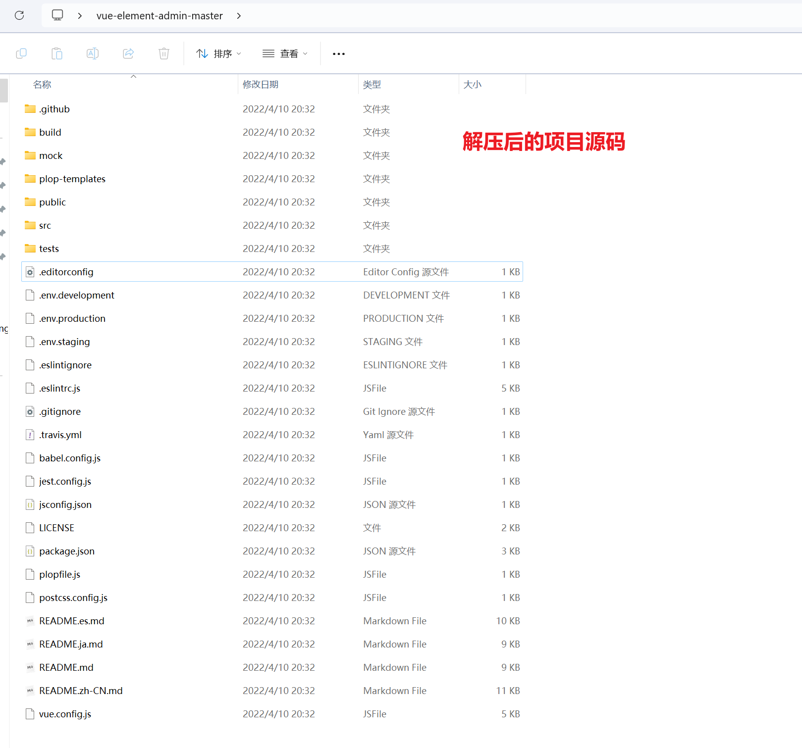
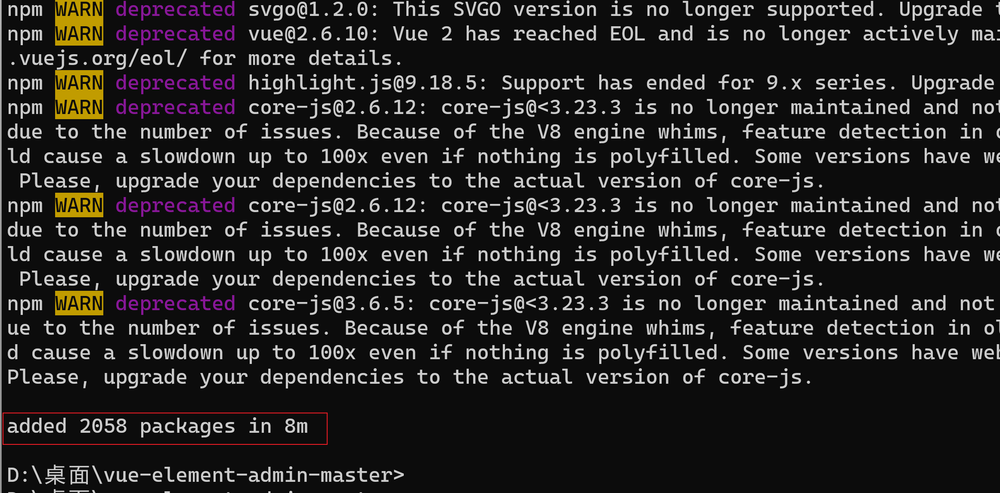
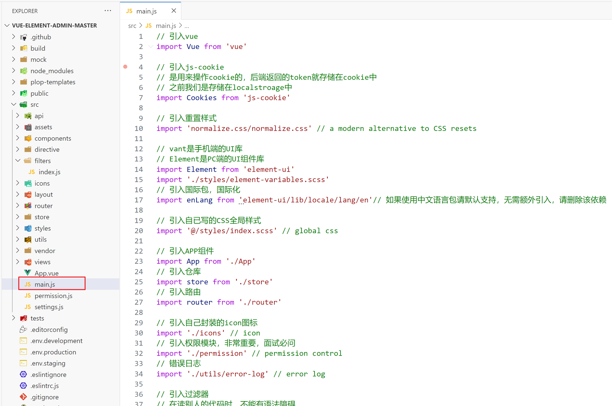
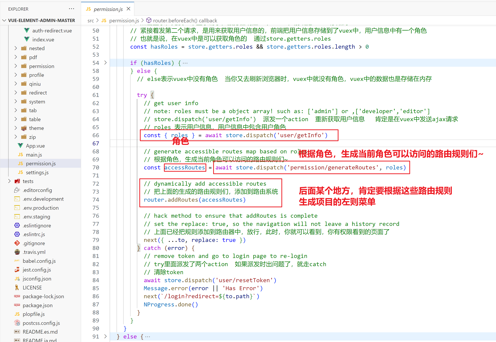
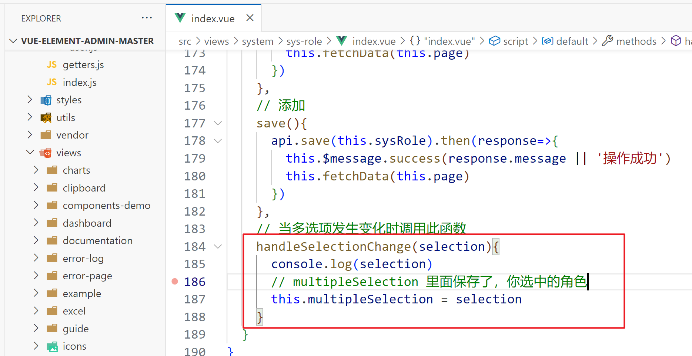
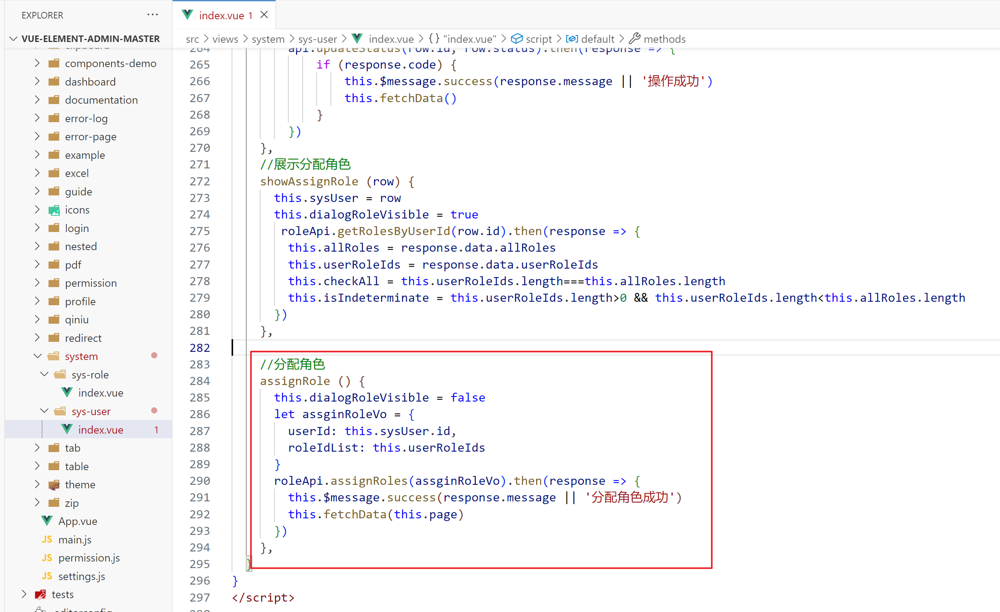
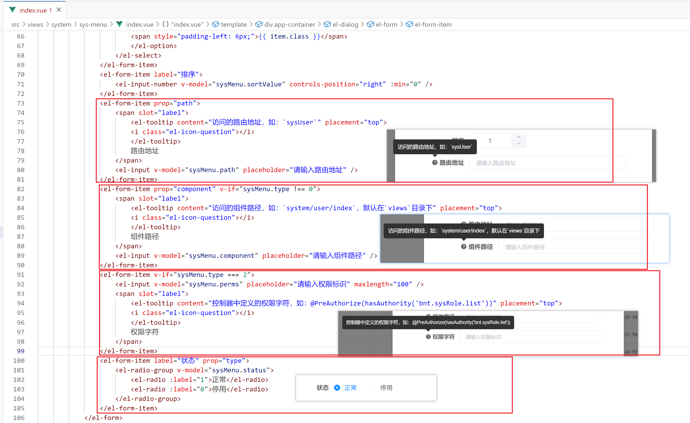
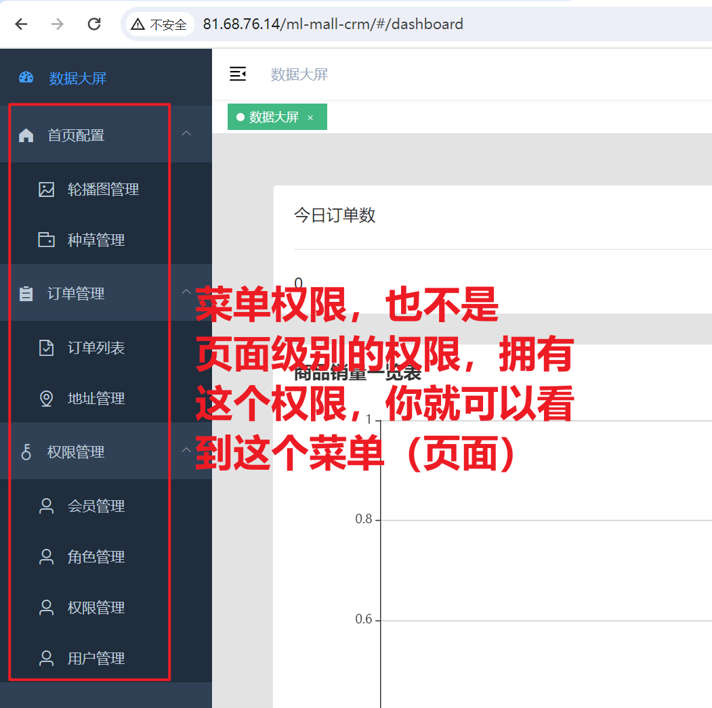
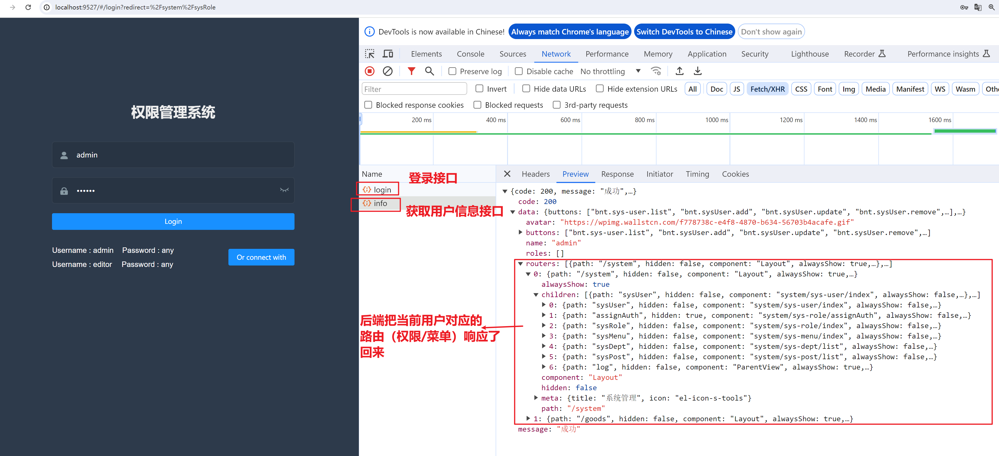
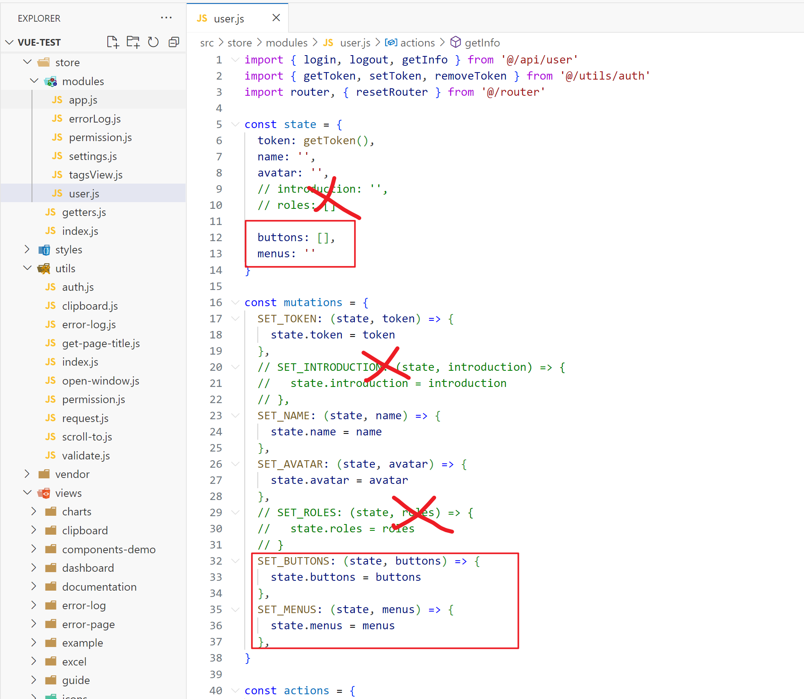

## 一，vue-element-admin开源项目介绍


### 1，开源项目介绍


开源项目的排行榜，大家在github上，搜索：GitHub-Chinese-Top-Charts，如下：


### 2，项目介绍


今天我们讲的是vue-element-admin，如下：


资料：
* 开源仓库地址：https://github.com/PanJiaChen/vue-element-admin

* 预览地址：https://panjiachen.github.io/vue-element-admin/#/login?redirect=%2Fdashboard

* 文档地址：https://panjiachen.github.io/vue-element-admin-site/zh/guide/#%E5%8A%9F%E8%83%BD

这个项目，非常优秀，是vue2中相当优秀的项目，它里面的目录结构和框架设计非常好，所以我们先学习这个开源项目，后面写管理系统基于这个开源项目。如果把这个项目搞定了，vue2理解更深入。

我讲一遍，你仔细研究一下，然后，你尝试给别人讲一遍。

**亮点**：

* 权限设计

* 全局功能 （Layout）

  + 菜单如何渲染
  + 设置功能实现
  + 全屏操作实现
  + 切换组件大小实现
  + 国际化实现
  + TabView
  + 面包屑
  + ....
  
  
  

**再次提示Vue的重要性(四选一)**：

  + Vue2 / Vue3 / React / Uniapp 
  + ElementUI组件库必须熟练掌握，比Vant还重要。

  

**vue3的开源模板：**

*  vue-vben-admin

  

### 3，拉取项目，安装依赖


拉取项目：


命令：

```shell
 git clone https://github.com/PanJiaChen/vue-element-admin.git
```


也可以下载压缩包：


我们需要启动别人的项目，你到公司中，你肯定也需要启动别人项目，如果这个项目你启动不起来，意味着公司的项目，你也跑不起来。需要对代码进行解压：




使用vscode打开代码：


node版本：


安装nrm，如下：


查看源：


换源，如下：


安装依赖，如下：


安装成功了：




### 4，大家可以安装依赖失败（也可以不失败）

失败的原因是有两个依赖可以下载不了：

- tui-editor 
- core-js


大家在安装的过程中，是可能报错的，如下：


尝试使用cnpm，如下：


上面报错的原因是tui-editor包安装不上，我们就不让它安装，打开package.json，依赖删除掉，如下：


删除完后，把node_module也删除了，如下：


重新使用cnpm i安装，如下：


通过npm run dev把项目运行起来，运行起来后，又后错了，如下：


把删除package.json中core.js依赖，如下：


把node_modules，删除掉，如下：


再一次重新安装，通过cnpm i ，如下：


安装OK。

还需要我们还需要单独去安装core-js，如下：


运行项目：


报错了，如下：


上面的报错的原因是没有这个依赖，找到对应的组件，把对应的代码删除了，如下：


项目就可以运行起来了，如下：


浏览器效果如下：


### 5，可以科学上网安装依赖

你电脑上，需要有工具，打开代理工具，直接通过npm 去安装所有的依赖，项目就直接通过npm run dev运行直来，需要注意你的node版本是16.16.0。


### 6，运行项目


运行起来后，如下：


浏览器打开：


### 7，使用工具删除node_module

先安装一个工具：

```js
npm install rimraf - g
```

删除node_module：

```js
rimraf node_modules
```

### 8，研究项目

得到一个新的项目，如何研究，研究的流程是怎么样的？

* README.md  项目的说明文件（今天大家从上到下过一遍）
* package.json 看一下，项目中运行了什么依赖，启动项目，打包项目
* 项目都有哪些配置文件，不能有语法障碍，如果配置文件没有见过，直接把配置文件名放到百度
* src是项目的源码，重点就是src
* 先看入口文件，main.js
* 看APP.vue
* 路由，Layout组件，路由对应的哪些组件
* Vuex，状态管理，存储哪些公共的状态
* axios是如何封装的，api接口是如何封装，跨域是是如何配置的
* 看别人写的组件，是如何写的，如何命名，你如果在基于人家的项目去开发，你的习惯最好和人家的习惯一样
* 把项目跑起来，边去看效果，边看代码

边研究，边记录，把遇到的问题都记录下来。不会的问题列表。

## 二，项目

### 1，从入口开始

main.js中的代码如下：



```js
// 引入vue
import Vue from 'vue'

// 引入js-cookie
// 是用来操作cookie的，后端返回的token就存储在cookie中
// 之前我们是存储在loccalstroage中
import Cookies from 'js-cookie'

// 引入重置样式
import 'normalize.css/normalize.css'

// vant是手机端的UI库
// Element是PC端的UI组件库
import Element from 'element-ui'
import './styles/element-variables.scss'
// 引入国际包  国际化
import enLang from 'element-ui/lib/locale/lang/en' // 如果使用中文语言包请默认支持，无需额外引入，请删除该依赖

// 引入自已写的CSS全局样式
import '@/styles/index.scss'

// 引入APP组件
import App from './App'
// 引入仓库
import store from './store'
// 引入路由
import router from './router'

// 引入自己封装的icon图标
import './icons' // icon
// 引入权限模块，非常重要，面试必问
import './permission' // permission control
import './utils/error-log' // error log

// 引入过滤器
// 在读别人的代码时，不能有语法障碍
import * as filters from './filters' // global filters

/**
 * If you don't want to use mock-server
 * you want to use MockJs for mock api
 * you can execute: mockXHR()
 *
 * Currently MockJs will be used in the production environment,
 * please remove it before going online ! ! !
 */
// process是node中的全局变量
// 当通过npm run build时，node_env就是production
// 当通过npm run dev时，node_env就是development
// process.env.NODE_ENV === 'production' 表示是生成环境
if (process.env.NODE_ENV === 'production') {
    // 导入mock模块，模拟接口中的，本项目中的接口，都是模拟的，都是假的
    const {
        mockXHR
    } = require('../mock')
    mockXHR()
}

// Vue.use(Element) 
// 之前：Vue.use(vant)
Vue.use(Element, {
    // Button  可以设置  如果不设置默认是medium
    size: Cookies.get('size') || 'medium', // set element-ui default size
    // locale: enLang 表示组件使用英文
    locale: enLang // 如果使用中文，无需设置，请删除
})

// 注册全局过滤器
// register global utility filters
Object.keys(filters).forEach(key => {
    Vue.filter(key, filters[key])
})

// 关闭生成环境下，vue提示
Vue.config.productionTip = false

// new一个Vue  
new Vue({
    el: '#app',
    router,
    store,
    render: h => h(App)
})
```

### 2，App.vue


代码如下：

```vue
<template>
  <div id="app">
    <!-- 这是一级路由出品 -->
    <!-- 一会看路由，需要知道，哪些路由匹配的组件会放到一级路由出口 -->
    <router-view />
  </div>
</template>

<script>
export default {
  name: "App",
};
</script>
```

测试：


### 3，路由模块（有难度）

本项目中，路由模块+权限管理模块，最难的。

打开路由文件夹，如下：


路由模块中的代码：

```js
// 引入vue
import Vue from 'vue'
// 引入vue-router
import Router from 'vue-router'

// 路由就是一个插件，需要use
Vue.use(Router)

// 引入layout组件
// layout组件非常重要  
// 一级路由出口中，匹配layout组件
import Layout from '@/layout'

// 引入其它四个路由模块
import componentsRouter from './modules/components'
import chartsRouter from './modules/charts'
import tableRouter from './modules/table'
import nestedRouter from './modules/nested'

/**
 * Note: sub-menu only appear when route children.length >= 1
 * Detail see: https://panjiachen.github.io/vue-element-admin-site/guide/essentials/router-and-nav.html
 *
 * hidden: true                   if set true, item will not show in the sidebar(default is false)
 * alwaysShow: true               if set true, will always show the root menu
 *                                if not set alwaysShow, when item has more than one children route,
 *                                it will becomes nested mode, otherwise not show the root menu
 * redirect: noRedirect           if set noRedirect will no redirect in the breadcrumb
 * name:'router-name'             the name is used by <keep-alive> (must set!!!)
 * meta : {
    roles: ['admin','editor']    control the page roles (you can set multiple roles)
    title: 'title'               the name show in sidebar and breadcrumb (recommend set)
    icon: 'svg-name'/'el-icon-x' the icon show in the sidebar
    noCache: true                if set true, the page will no be cached(default is false)
    affix: true                  if set true, the tag will affix in the tags-view
    breadcrumb: false            if set false, the item will hidden in breadcrumb(default is true)
    activeMenu: '/example/list'  if set path, the sidebar will highlight the path you set
  }
 */

/**
 * constantRoutes
 * a base page that does not have permission requirements
 * all roles can be accessed
 */
// constantRoutes是静态路由
// 本项目，路由分成了两大模块：静态路由 和 动态路由
// 静态路由：所有的用户可以访问，不需要权限
// 动态路由：需要权限，如果有权限，就可以访问，如果没有权限，就不能访问
// 路则规则：就是一个对象
//     path: '/redirect',  访问的url
//     component: Layout,  访问出口中放什么组件  在一级中币出口中放 Layout 组件
//     hidden: true,  隐藏   把侧边栏中不能看到声明式导航
//     children: [  配置二级路由
export const constantRoutes = [{
        path: '/redirect',
        component: Layout,
        hidden: true,
        children: [{
            path: '/redirect/:path(.*)',
            // 在二级路由出口中放@/views/redirect/index组件 
            component: () => import('@/views/redirect/index')
        }]
    },
    {
        // 当访问 /login时，  在一级路由出口放登录页面  一级路由出口是在APP组件中
        path: '/login',
        component: () => import('@/views/login/index'),
        //  把侧边栏中不能看到声明式导航
        hidden: true
    },
    {
        path: '/auth-redirect',
        component: () => import('@/views/login/auth-redirect'),
        hidden: true
    },
    {
        path: '/404',
        component: () => import('@/views/error-page/404'),
        hidden: true
    },
    {
        path: '/401',
        component: () => import('@/views/error-page/401'),
        hidden: true
    },
    {
        path: '/',
        component: Layout,
        redirect: '/dashboard',
        children: [{
            path: 'dashboard',
            component: () => import('@/views/dashboard/index'),
            name: 'Dashboard',
            meta: {
                title: 'Dashboard',
                icon: 'dashboard',
                affix: true
            }
        }]
    },
    {
        path: '/documentation',
        component: Layout,
        children: [{
            path: 'index',
            component: () => import('@/views/documentation/index'),
            name: 'Documentation',
            meta: {
                title: 'Documentation',
                icon: 'documentation',
                affix: true
            }
        }]
    },
    {
        path: '/guide',
        component: Layout,
        redirect: '/guide/index',
        children: [{
            path: 'index',
            component: () => import('@/views/guide/index'),
            name: 'Guide',
            meta: {
                title: 'Guide',
                icon: 'guide',
                noCache: true
            }
        }]
    },
    {
        path: '/profile',
        component: Layout,
        redirect: '/profile/index',
        hidden: true,
        children: [{
            path: 'index',
            component: () => import('@/views/profile/index'),
            name: 'Profile',
            meta: {
                title: 'Profile',
                icon: 'user',
                noCache: true
            }
        }]
    }
]

/**
 * asyncRoutes
 * the routes that need to be dynamically loaded based on user roles
 */
// asyncRoutes是动态路由
// 页面级（路由级）权限：
//     不同用户，登录到系统，看到的侧边栏是不一样，也就是有不同的页面
//     同一个页面，有的用户可以访问，有的用户不能访问
//  并不是说，你在下面配置完就OK，背后还有很多代码
export const asyncRoutes = [{
        path: '/permission',
        component: Layout,
        redirect: '/permission/page',
        alwaysShow: true, // will always show the root menu
        name: 'Permission',
        meta: {
            title: 'Permission',
            icon: 'lock',
            // roles表示什么样的用户可以访问permission
            // 不同的用户有不同的角色
            // 本项目就两个角色：admin   editor
            // roles: ['admin', 'editor']  表示amdin可以访问persmisson  editor也可以访问persmisson
            roles: ['admin', 'editor'] // you can set roles in root nav

            // roles: ['admin']  表示只能admin用户可以访问persmisson
            // roles: ['admin'] // you can set roles in root nav
        },
        children: [{
                path: 'page',
                component: () => import('@/views/permission/page'),
                name: 'PagePermission',
                meta: {
                    title: 'Page Permission',
                    roles: ['admin'] // or you can only set roles in sub nav
                }
            },
            {
                path: 'directive',
                component: () => import('@/views/permission/directive'),
                name: 'DirectivePermission',
                meta: {
                    title: 'Directive Permission',
                    // 没有roles，表示此路由规则，不需要校验
                    // if do not set roles, means: this page does not require permission
                }
            },
            {
                path: 'role',
                component: () => import('@/views/permission/role'),
                name: 'RolePermission',
                meta: {
                    title: 'Role Permission',
                    roles: ['admin']
                }
            }
        ]
    },

    {
        path: '/icon',
        component: Layout,
        children: [{
            path: 'index',
            component: () => import('@/views/icons/index'),
            name: 'Icons',
            meta: {
                title: 'Icons',
                icon: 'icon',
                noCache: true
            }
        }]
    },

    /** when your routing map is too long, you can split it into small modules **/
    componentsRouter,
    chartsRouter,
    nestedRouter,
    tableRouter,

    {
        path: '/example',
        component: Layout,
        redirect: '/example/list',
        name: 'Example',
        meta: {
            title: 'Example',
            icon: 'el-icon-s-help'
        },
        children: [{
                path: 'create',
                component: () => import('@/views/example/create'),
                name: 'CreateArticle',
                meta: {
                    title: 'Create Article',
                    icon: 'edit'
                }
            },
            {
                path: 'edit/:id(\\d+)',
                component: () => import('@/views/example/edit'),
                name: 'EditArticle',
                meta: {
                    title: 'Edit Article',
                    noCache: true,
                    activeMenu: '/example/list'
                },
                hidden: true
            },
            {
                path: 'list',
                component: () => import('@/views/example/list'),
                name: 'ArticleList',
                meta: {
                    title: 'Article List',
                    icon: 'list'
                }
            }
        ]
    },

    {
        path: '/tab',
        component: Layout,
        children: [{
            path: 'index',
            component: () => import('@/views/tab/index'),
            name: 'Tab',
            meta: {
                title: 'Tab',
                icon: 'tab'
            }
        }]
    },

    {
        path: '/error',
        component: Layout,
        redirect: 'noRedirect',
        name: 'ErrorPages',
        meta: {
            title: 'Error Pages',
            icon: '404'
        },
        children: [{
                path: '401',
                component: () => import('@/views/error-page/401'),
                name: 'Page401',
                meta: {
                    title: '401',
                    noCache: true
                }
            },
            {
                path: '404',
                component: () => import('@/views/error-page/404'),
                name: 'Page404',
                meta: {
                    title: '404',
                    noCache: true
                }
            }
        ]
    },

    {
        path: '/error-log',
        component: Layout,
        children: [{
            path: 'log',
            component: () => import('@/views/error-log/index'),
            name: 'ErrorLog',
            meta: {
                title: 'Error Log',
                icon: 'bug'
            }
        }]
    },

    {
        path: '/excel',
        component: Layout,
        redirect: '/excel/export-excel',
        name: 'Excel',
        meta: {
            title: 'Excel',
            icon: 'excel'
        },
        children: [{
                path: 'export-excel',
                component: () => import('@/views/excel/export-excel'),
                name: 'ExportExcel',
                meta: {
                    title: 'Export Excel'
                }
            },
            {
                path: 'export-selected-excel',
                component: () => import('@/views/excel/select-excel'),
                name: 'SelectExcel',
                meta: {
                    title: 'Export Selected'
                }
            },
            {
                path: 'export-merge-header',
                component: () => import('@/views/excel/merge-header'),
                name: 'MergeHeader',
                meta: {
                    title: 'Merge Header'
                }
            },
            {
                path: 'upload-excel',
                component: () => import('@/views/excel/upload-excel'),
                name: 'UploadExcel',
                meta: {
                    title: 'Upload Excel'
                }
            }
        ]
    },

    {
        path: '/zip',
        component: Layout,
        redirect: '/zip/download',
        alwaysShow: true,
        name: 'Zip',
        meta: {
            title: 'Zip',
            icon: 'zip'
        },
        children: [{
            path: 'download',
            component: () => import('@/views/zip/index'),
            name: 'ExportZip',
            meta: {
                title: 'Export Zip'
            }
        }]
    },

    {
        path: '/pdf',
        component: Layout,
        redirect: '/pdf/index',
        children: [{
            path: 'index',
            component: () => import('@/views/pdf/index'),
            name: 'PDF',
            meta: {
                title: 'PDF',
                icon: 'pdf'
            }
        }]
    },
    {
        path: '/pdf/download',
        component: () => import('@/views/pdf/download'),
        hidden: true
    },

    {
        path: '/theme',
        component: Layout,
        children: [{
            path: 'index',
            component: () => import('@/views/theme/index'),
            name: 'Theme',
            meta: {
                title: 'Theme',
                icon: 'theme'
            }
        }]
    },

    {
        path: '/clipboard',
        component: Layout,
        children: [{
            path: 'index',
            component: () => import('@/views/clipboard/index'),
            name: 'ClipboardDemo',
            meta: {
                title: 'Clipboard',
                icon: 'clipboard'
            }
        }]
    },

    {
        path: 'external-link',
        component: Layout,
        children: [{
            path: 'https://github.com/PanJiaChen/vue-element-admin',
            meta: {
                title: 'External Link',
                icon: 'link'
            }
        }]
    },

    // 404 page must be placed at the end !!!
    {
        path: '*',
        redirect: '/404',
        hidden: true
    }
]

// 创建一个路由对象  router
const createRouter = () => new Router({
    // mode: 'history', // require service support
    scrollBehavior: () => ({
        y: 0
    }),
    routes: constantRoutes
})

const router = createRouter()

// Detail see: https://github.com/vuejs/vue-router/issues/1234#issuecomment-357941465
export function resetRouter() {
    const newRouter = createRouter()
    router.matcher = newRouter.matcher // reset router
}

export default router
```


上面我们说了两块路由规则，一个叫 constantRoutes，一个叫 asyncRoutes。constantRoutes它里面定义的路由规则，不管你是什么样的角色，都可以访问。asyncRoutes它里面定义的规则，是需要根据角色计算出来的。路由规则有了，还需要根据这些规则生成侧边栏菜单。说白了，就是不同的用户登录后，它的角色是不一样的，角色不一样，计算出来的路由规则不一样，路由规则不一样，生成的侧边栏菜单就不一样。左则的菜单是动态的计算出来的，如下：


它是在permission模块中动态计算出来的，这个模块是最最难的模块。

### 4，permission模块

在src根目录下，如下：


在main.js中，去执行permisson.js文件，如下：


如果把这个模块注释掉，菜单都没有了，如下：


效果如下：


然后我们就需要看permission.js中的代码了，大体代码如下：


```js
// 引入路由器
import router from './router'
// 引入仓库
import store from './store'
// 引入elementui中的提示性组件
import {
    Message
} from 'element-ui'
// 引入nprogress  进度条
import NProgress from 'nprogress' // progress bar
import 'nprogress/nprogress.css' // progress bar style

// getToken就是从cookie中获取token
// 如果登录了，是有token，如果没有登录，就没有token
import {
    getToken
} from '@/utils/auth' // get token from cookie
// 得到页面中的title
import getPageTitle from '@/utils/get-page-title'

// 配置NProgress
NProgress.configure({
    showSpinner: false
}) // NProgress Configuration

// whiteList是白名单   不需要登录，就可以直接访问
const whiteList = ['/login', '/auth-redirect'] // no redirect whitelist

// 全局前置路由守卫
// 核心代码都是在守卫中
router.beforeEach(async (to, from, next) => {
    ....
})

// 全局后置路由守卫
router.afterEach(() => {
    // 关闭进度条
    NProgress.done()
})
```

核心就在前置路由守卫中，如下：


如果登录了，是调用了两个api接口，如下：


继续分析代码：


```js
// 全局前置路由守卫
// 核心代码都是在守卫中
router.beforeEach(async (to, from, next) => {
    // 开启进度条
    NProgress.start()

    // 给页面的title赋值
    document.title = getPageTitle(to.meta.title)

    // 从cookie中获取token 如果有token表示登录了
    const hasToken = getToken()

    if (hasToken) {
        // 有token，说明已经登录了
        if (to.path === '/login') {
            // 已经登录了，你又去登录，放行到后面首页面
            next({
                path: '/'
            })
            // 关闭进度条
            NProgress.done()
        } else {
            // 已经登录了，去其它页面
            // store.getters.roles得到vuex中的角色
            // 如果登录了，我们会调用一个接口，去拿用户信息，在用户信息中，有当前用户的角色
            // 点击登录，先发一个登录请求，服务器响应一个token，前端把token存储到cookie
            // 紧接着发第二个请求，是用来获取用户信息的，前端把用户信息存储到了vuex中，用户信息中有一个角色
            // 也就是说，在vuex中是可以获取角色的  通过store.getters.roles
            // store.getters.roles.length > 0 表示vuex是有角色
            const hasRoles = store.getters.roles && store.getters.roles.length > 0
            if (hasRoles) {
                // 从vuex中获取角色，直接放行
                next()
            } else {
                // else表示vuex中没有角色  当你又去刷新浏览器时，vuex中就没有角色，vuex中的数据也是存储在内存
                try {
                    // get user info
                    // note: roles must be a object array! such as: ['admin'] or ,['developer','editor']
                    // store.dispatch('user/getInfo')  重新获取用户信息   肯定是在vuex中发送ajax请求
                    // roles 表示用户信息，用户信息中包含用户角色
                    const {
                        roles
                    } = await store.dispatch('user/getInfo')

                    // generate accessible routes map based on roles
                    // dispatch('permission/generateRoutes', roles)  根据用户角色，生成路由规则
                    // 至于怎么生成，不要管，明天才会看如何生成路由规则的代码
                    const accessRoutes = await store.dispatch('permission/generateRoutes', roles)

                    // console.log("accessRoutes", accessRoutes);

                    // dynamically add accessible routes
                    // 一个路由器中，可以有很多的规则，计算了当前用户角色有18个规则
                    // 利用addRoutes，把这18个规则，添加到路由器
                    router.addRoutes(accessRoutes)

                    // hack method to ensure that addRoutes is complete
                    // set the replace: true, so the navigation will not leave a history record
                    // 上面已经把规则添加到路由器中，放行，此时，你就可以看到，你有权限看到的页面了
                    next({
                        ...to,
                        replace: true
                    })
                } catch (error) {
                    // remove token and go to login page to re-login
                    // 如果在生成规则时，出问题了
                    // store.dispatch('user/resetToken')  清除token
                    await store.dispatch('user/resetToken')
                    Message.error(error || 'Has Error')
                    // 重新回到登录页面
                    next(`/login?redirect=${to.path}`)
                    NProgress.done()
                }
            }
        }
    } else {
        // 没有token
        // 没有token看一下，你访问的路径有没有在白名单中
        if (whiteList.indexOf(to.path) !== -1) {
            // 如果在白名单中，就放行
            next()
        } else {
            // 如果没有在白名单中，表示你访问的路由规则，需要登录 
            // 需要登录，放行到登录页面
            next(`/login?redirect=${to.path}`)
            // 关闭进度条
            NProgress.done()
        }
    }
})
```

分析图如下：


### 5，从网络请求角度分析

登录成功后，从network面板中，看到了发出了三个请求：


看登录接口，如下：


登录成功，后token，本项目是存储在cookie中，如下：


带着token，获取用户信息，如下：


服务器响应如下：


根据roles成有权访问的菜单和路由。需要计算出来，这个前端实现的。需要用户信息（角色）存储到vuex中，如下：


### 6，从vuex角度分析路由规则是如何计算出来的


入口文件，如下：


```js
import Vue from 'vue'
import Vuex from 'vuex'

// 导入getters
import getters from './getters'

// 由于vuex是一个插件， 你需要use
Vue.use(Vuex)

// 加载modules文件夹下面所有以.js结尾的模块
const modulesFiles = require.context('./modules', true, /\.js$/)

// you do not need `import app from './modules/app'`
// it will auto require all vuex module from modules file

// 注册模块
const modules = modulesFiles.keys().reduce((modules, modulePath) => {
    // set './app.js' => 'app'
    const moduleName = modulePath.replace(/^\.\/(.*)\.\w+$/, '$1')
    const value = modulesFiles(modulePath)
    modules[moduleName] = value.default
    return modules
}, {})

const store = new Vuex.Store({
    modules,
    getters
})

export default store
```

我们只需要关注，user.js和permission.js这两个模块，看user.js，如下：


vuex中的用户模块：


```js
import {
    login,
    logout,
    getInfo
} from '@/api/user'
import {
    getToken,
    setToken,
    removeToken
} from '@/utils/auth'
import router, {
    resetRouter
} from '@/router'

const state = {
    token: getToken(), // token  
    name: '', // 用户名
    avatar: '', // 用户头像
    introduction: '', // 用户简介
    roles: [] // 当前用户所具有的角色
}

const mutations = {
    SET_TOKEN: (state, token) => {
        state.token = token
    },
    SET_INTRODUCTION: (state, introduction) => {
        state.introduction = introduction
    },
    SET_NAME: (state, name) => {
        state.name = name
    },
    SET_AVATAR: (state, avatar) => {
        state.avatar = avatar
    },
    SET_ROLES: (state, roles) => {
        state.roles = roles
    }
}

const actions = {
    // 用户登录 
    login({
        commit
    }, userInfo) {
        // 组件中派发action
        const {
            username,
            password
        } = userInfo
        return new Promise((resolve, reject) => {
            // login是接口
            login({
                username: username.trim(),
                password: password
            }).then(response => {
                const {
                    data
                } = response
                // commit('SET_TOKEN', data.token) commit一个mutaion，给token赋值
                commit('SET_TOKEN', data.token)
                setToken(data.token)
                resolve()
            }).catch(error => {
                reject(error)
            })
        })
    },

    // 获取用户信息
    getInfo({
        commit,
        state
    }) {
        return new Promise((resolve, reject) => {
            // getInfo 也是接口
            getInfo(state.token).then(response => {
                const {
                    data
                } = response

                if (!data) {
                    reject('Verification failed, please Login again.')
                }

                const {
                    roles,
                    name,
                    avatar,
                    introduction
                } = data

                // roles must be a non-empty array
                if (!roles || roles.length <= 0) {
                    reject('getInfo: roles must be a non-null array!')
                }

                // 把用户信息存储到vuex
                commit('SET_ROLES', roles)
                commit('SET_NAME', name)
                commit('SET_AVATAR', avatar)
                commit('SET_INTRODUCTION', introduction)
                resolve(data)
            }).catch(error => {
                reject(error)
            })
        })
    },

    // 用户退出登录
    logout({
        commit,
        state,
        dispatch
    }) {
        return new Promise((resolve, reject) => {
            logout(state.token).then(() => {
                commit('SET_TOKEN', '')
                commit('SET_ROLES', [])
                removeToken()
                resetRouter()

                // reset visited views and cached views
                // to fixed https://github.com/PanJiaChen/vue-element-admin/issues/2485
                dispatch('tagsView/delAllViews', null, {
                    root: true
                })

                resolve()
            }).catch(error => {
                reject(error)
            })
        })
    },

    // 清除token
    resetToken({
        commit
    }) {
        return new Promise(resolve => {
            commit('SET_TOKEN', '')
            commit('SET_ROLES', [])
            removeToken()
            resolve()
        })
    },

    // 动态修改角色
    async changeRoles({
        commit,
        dispatch
    }, role) {
        const token = role + '-token'

        commit('SET_TOKEN', token)
        setToken(token)

        const {
            roles
        } = await dispatch('getInfo')

        resetRouter()

        // generate accessible routes map based on roles
        const accessRoutes = await dispatch('permission/generateRoutes', roles, {
            root: true
        })
        // dynamically add accessible routes
        router.addRoutes(accessRoutes)

        // reset visited views and cached views
        dispatch('tagsView/delAllViews', null, {
            root: true
        })
    }
}

export default {
    namespaced: true,
    state,
    mutations,
    actions
}
```

重点看permission.js，如下：


```js
import { asyncRoutes, constantRoutes } from '@/router'

// roles是角色  [admin]  [admin baoan]
// route 某一条规则
function hasPermission(roles, route) {
  // route.meta.roles  不仅需要meta，还需要你meta中有roles
  if (route.meta && route.meta.roles) {
    // some的返回值，要么是true，要么是false
    return roles.some(role => route.meta.roles.includes(role))
  } else {
    // 如果这个规则中没有meta，那么返回true
    // 就意味着，当前角色可以访问此规则的
    return true
  }
}

// routes 所有的asyncRoutes规则
// roles 角色  
export function filterAsyncRoutes(routes, roles) {
  // res是就是计算出来的可以访问的路由规则们~
  const res = []

  // 遍历所有的asyncRoutes
  routes.forEach(route => {
    // route 表示每一个规则
    // 把规则copy一份，给tmp
    const tmp = { ...route }

    // hasPermission是一个函数  
    // 判断当前这个角色是否可以访问此规则
    if (hasPermission(roles, tmp)) {
      // 当前角色可以访问此规则
      // 如果此规则有children
      if (tmp.children) {
        // 递归计算当前角色可以访问的二级路由规则们~
        tmp.children = filterAsyncRoutes(tmp.children, roles)
      }
      // 当规则放到res中
      res.push(tmp)
    }
  })

  // 把计算出来的路由规则们返回 
  return res
}

const state = {
  routes: [],  // 当前角色可以访问的所有路由规则们（静态路由规则：constantRoutes，计算出来的动态路由规则：addRoutes）
  addRoutes: []  // 计算出来的路由规则们~
}

const mutations = {
  // routes 计算出来的路由规则们~
  SET_ROUTES: (state, routes) => {
    state.addRoutes = routes
    // constantRoutes静态路由规则 拼接上 计算出来的路由规则们
    state.routes = constantRoutes.concat(routes)
  }
}

const actions = {
  // roles 传递过来的角色
  generateRoutes({ commit }, roles) {
    return new Promise(resolve => {
      // accessedRoutes 表示可以访问的路由规则们
      let accessedRoutes

      // // 判断当前角色中是否包含admin
      // if (roles.includes('admin')) {
      //   // 把所有的asyncRoutes规则赋值给 accessedRoutes 
      //   // 说白了，如果你的角色中包含admin,那么asyncRoutes中的规则，你都可以访问
      //   accessedRoutes = asyncRoutes || []
      // } else {
      //   // 你的角色中没有admin  那么就根据角色计算出，这个角色可以访问的路由规则们~
      //   accessedRoutes = filterAsyncRoutes(asyncRoutes, roles)
      // }

      // 让admin角色也参与路由规则的计算
      accessedRoutes = filterAsyncRoutes(asyncRoutes, roles)

      // accessedRoutes 计算出来的路由规则们~
      commit('SET_ROUTES', accessedRoutes)
      resolve(accessedRoutes)
    })
  }
}

export default {
  namespaced: true,
  state,
  mutations,
  actions
}
```

### 7，实践一下

我要开发一个角色管理模块，第一步，创建1个组件，如下：


把人家默认的规则可以抽离到一个备份文件中，如下：


在index.js中用的时候，打开，如下：


问：你自己配置的规则，配置在哪里呢？

答：两个地方，都可以。如下


第二步，配置路由


```js
{
    path: '/system',
    component: Layout,
    // hidden: true,
    meta: { title: '系统管理', icon: 'el-icon-s-tools'},
    alwaysShow: true,
    children:[
      {
        path: '/sysRole',
        component:() => import('@/views/system/sys-role/index'),
        meta: { title: '角色管理', icon: 'el-icon-s-help'},
      }
    ]
  },
```

测试如下：


### 8，前端权限设计总结

不同的公司，权限设计是不一样的，从前后端协作的角度说，权限设计大体上有两种思路，第一种是单纯由前端来实现，第二种由后端来实现。后端实现，我们后面会讲一个案例。由前端来设计管理系统的权限，开发成本相对较低。

中小型公司：前端做权限设计，本开源项目主要前端做的权限设计。

大公司：后端做权限设计，后面再讲一下后端的权限设计。

**前端实现思路**：前端用token调接口换取当前用户信息，再使用用户的角色信息动态生成有权访问的菜单和路由。核心知识：

* vue-router 中的全局守卫、路由元信息

* router.addRoutes() 动态添加路由匹配规则

* 使用 vuex 管理用户信息、路由菜单信息等

  

**核心逻辑**：

* 全局路由守卫，用于拦截用户对系统内部页面的访问
* 当权限路由动态生成后，才能进入系统内部渲染 Menu 菜单
* 在登录流程中，先用 token 调接口获取用户信息，再根据用户信息生成权限路由，并保存在状态管理工具中去，后面就可以正常访问权限路由了。
* 当用户在系统内部刷新页面时，这就是刷新流程。当我们刷新时，Vuex中的用户信息和权限菜单信息会丢失。所以，在刷新流程中，会重新使用 token 换取用户信息，再使用用户角色来生成权限路由。


Vuex中的user模块中核心逻辑：

* 主要是登录逻辑、获取用户信息、退出登录的逻辑，把token、用户信息都放在状态管理中存储。

* token不仅在保存在Vuex中，还要保存在了 cookie 中。

  

Vuex中的pemission模块中核心逻辑：

* 根据用户信息生成当前用户有权访问的路由，权限路由数据也保存在Vuex中，用于Layout布局中 Menu 菜单的渲染。
* 动态生成路由菜单的大体逻辑是：用后端返回的用户角色信息，与路由规则中的 meta 元信息进行比照，符合权限配置的就是有权访问的路由。


**面试题：你做的管理系统，你是如何处理权限的问题的？**

答：我们之前的公司中小公司，做的项目，大概有30个左右的模块，所以权限这一块，就前端去处理的。我们处理的流程大致是这样的：前端登录换取token，在导航守卫中，实现权限设计，首先判断有没有token，没有token，直接跳到登录页面。有token会进一步判断vuex中有没有用户信息。如果没有用户信息，拿着token，调用接口获取用户信息，用户信息中保存了最重要的字段，就是角色，有了角色后，通过算法生成当前用户可访问的动态路由规则（算法大至是使用后端返回的角色和路由元信息中的角色进行对比，得到可以访问的动态路由规则），有了动态访问的路由规则，再通过addRoutes方法，把得到的动态访问的路由规则添加到路由系统。


**面试题：前端做权限这一块，你感觉有什么不足？**

答：如果要修改权限，必须要去修改前端代码，重新打包，重新上线。前端处理权限，只适合中小项目（模块少，角色少），一般中小公司权限处理都是前端实现。


**面试题：管理系统左侧的菜单是什么时候生成的？**

答：在登录流程中，登录成功后，得到的token，根据token获取用户信息，用户信息中包含角色，根据角色生成可访问的动态路由规则（accessRoutes），把路由规则，也保存到了Vuex中，跳到系统内部页面，渲染Layout组件，在渲染Layout组件时，会渲染菜单。在刷新流程中，使用token换取用户信息，生成可访问的动态路由规则，保存到Vuex中，再次渲染Layout时，生成左侧菜单。

### 9，后端权限设计总结

后端处理权限，一般在管理系统中，都有两个模块，用户管理，角色管理。

**后端实现思路**：前端用token换取用户信息，用户信息中就已经包含了与路由渲染相关的菜单字段。后端可以在数据库中手动配置菜单数据，还可以开发专门的权限管理模块来动态管理菜单数据。如果要动态地通过增删改查来管理菜单数据，常常得有角色管理、用户管理和菜单管理等功能。

 

### 10，联调登录接口

接口文档：http://123.249.16.147:8800/doc.html#/home


本项目，默认使用的是模拟的接口，如下：


我们需要联调我们自己服务器的接口，你需要关闭mock接口，如下：


在vue.config.js中，也需要关闭，动了vue.config.js，需要重启服务器。如下：


重启项目，测试登录就失效了，如下：


在登录流程中，没有发现弹窗，你再想，在响应拦截器，查看之，如下：


把后端接口项目运行起来了，IP地址是123.249.16.147，端口是8800。


还需要配置request url，如下：


再次测试之，如下：


产生跨域问题。解决问题：

* 后端解决
* 前端配置代理解决跨域


在开发过程中，解决跨域使用，代理解决，如下：


测试之，如下：


### 11，总结

复习vue-element-admin的权限设计：

* 是基于前端的权限设计，处理流程大致是这样的：前端登录成功，得到token，把token存储到了cookie中，登录成功，就会跳转，跳转的话，就会走到前置守卫中，在前置守卫中，实现权限设计，首先判断有没有token，没有token，判断你访问的路由是否大白名单中，如果在的话，可以访问，如果不在的话，直接跳到登录页面。有token的话，会进一步判断vuex中有没有用户信息（角色），如果没有用户信息（角色），就带着token，调用接口获取用户信息，用户信息中最重要的字段就是角色，就把用户信息存储到vuex中。有了角色，通过算法生成当前角色可以访问的路由规则们，把这些计算后的路由规则添加到路由系统中。 后面你又去访问别的路由，此时vuex中就有用户信息（角色），有这个角色你就可以访问了。

前端做权限设计，有什么不足？

* 如果要修改权限，必须要去修改前端代码，重新打包，重新上线。前端处理权限，只适合中小项目（模块少，角色少），一般中小公司权限处理都是前端实现。

管理系统的左侧的菜单是什么时候生成的？

* 在登录流程中，登录成功后，得到的token，根据token获取用户信息，用户信息中包含角色，根据角色生成可访问的动态路由规则（accessRoutes），把路由规则，也保存到了Vuex中，跳到系统内部页面，渲染Layout组件，在渲染Layout组件时，会渲染菜单。在刷新流程中，使用token换取用户信息，生成可访问的动态路由规则，保存到Vuex中，再次渲染Layout时，生成左侧菜单。

本项目的技术点：

* 使用前端router.addRoutes实现动态路由权限处理。用到守卫，路由的元信息，Vuex...。
* 封装了v-permission实现元素级别的权限管理。
* 封装了

* 使用vue-i18n实现国际化，使用fullscreen实现全屏切换，使用elementui+vuex设置全局主题色，组件size切换。
* 使用echarts封装图表组件，如：折线图.....
* 使用clipboard封装剪切板功能，使用driver.js实现引导页，提升用户体验，使用dropzone实现元素的拖拽，使用Export2Excel实现excel导出...
* 封装ThemePicker拾色器，UploadImg图片上传组件，UploadExcel上传组件
* 对于ElementUI中的Table，Upload，Pagination等组件进行二次封装
* 实现中后台系统的换肤效果
* ..... 

关于项目的一些常见面试：

* 介绍一下，你做的项目？
* 你写的系统，权限是如何设计？
* 你说一下，你项目的难点，亮点？  业务的难点。 亮点就是使用了什么的技术解决了什么样的问题？
* 你这个项目的国际化是怎么做？
* 你封装过哪些组件？除了使用ElementUI中提供的组件，你自己封装过哪些组件？
* 你使用哪些图表？echarts。不使用echarts，有没有自己绘制过一些图表？ canvas/svg
* 你的项目中有没有使用过websocket。双向通信。
* ....


## 三，登录和角色管理模块


### 1，接口文档


文档地址：http://123.249.16.147:8800/doc.html#/home


### 2，登录（不完善）

一般项目中，用户认证模块，都是最后再做。现在简单模拟一个登录。查看登录接口：


调试之：


修改axios二次封装代码，如下：


```js
import axios from 'axios'
import { MessageBox, Message } from 'element-ui'
import store from '@/store'

// let baseURL = "http://123.249.16.147:8800";
let baseURL = "/api";

// create an axios instance
const service = axios.create({
  // baseURL: process.env.VUE_APP_BASE_API, // url = base url + request url
  baseURL: baseURL, // url = base url + request url
  // withCredentials: true, // send cookies when cross-domain requests
  timeout: 5000 // request timeout
})

// request interceptor
service.interceptors.request.use(
  config => {
    // do something before request is sent
    // store.getters.token  从仓库获取token,你登录成功后，仓库中就有token
    // 调用登录接口，不需要带token
    if (store.getters.token) {
      // let each request carry token
      // ['X-Token'] is a custom headers key
      // please modify it according to the actual situation
      // config.headers['X-Token'] = getToken()  // 修改前的代码
      config.headers['token'] = store.getters.token  // 修改后的代码
    }
    return config
  },
  error => {
    // do something with request error
    console.log(error) // for debug
    return Promise.reject(error)
  }
)

// response interceptor
service.interceptors.response.use(
  response => {
    const res = response.data

    // if the custom code is not 20000, it is judged as an error.
    if (res.code !== 200) {
      Message({
        message: res.message || 'Error',
        type: 'error',
        duration: 5 * 1000
      })
      return Promise.reject(new Error(res.message || 'Error'))
    } else {
      return res
    }
  },
  error => {
    console.log('err' + error) // for debug
    Message({
      message: error.message,
      type: 'error',
      duration: 5 * 1000
    })
    return Promise.reject(error)
  }
)

export default service
```


封装API，如下：


```js
import request from '@/utils/request'

export function login(data) {
  return request({
    url: '/admin/system/index/login',
    method: 'post',
    data
  })
}

export function getInfo(token) {
  return request({
    url: '/admin/system/index/info',
    method: 'get',
    params: { token }
  })
}

export function logout() {
  return request({
    url: '/admin/system/index/logout',
    method: 'post'
  })
}
```


测试获取用户信息接口（接口不完善）：


测试退出登录接口（接口不完善）：


分析登录流程：

1. 点击登录按钮，调用方法

   

2. 代码走到了仓库中user模块中的login这个action

   

3. 再回到处理登录那个方法

   

4. 打开permission.js模块

   

   

   

5. 代码走到了，user模块下面的getInfo这个action

   

6. 再回到守卫中

   

7. 浏览器测试如下

   

   

   


仓库中user模块中的getInfo这个acton代码如下：

```js
// get user info
// 调用获取用户信息接口后，把name，avatar，introduction，roles存储到vuex中
getInfo({ commit, state }) {
    return new Promise((resolve, reject) => {
        // getInfo(state.token).then(response => {
        // 不指定token，现在登录就是简单模拟
        getInfo().then(response => {
            const { data } = response

            if (!data) {
                reject('Verification failed, please Login again.')
            }

            const { roles, name, avatar } = data

            // roles must be a non-empty array
            if (!roles || roles.length <= 0) {
                reject('getInfo: roles must be a non-null array!')
            }

            // 把roles，name，avatar存储到仓库中
            commit('SET_ROLES', roles)
            commit('SET_NAME', name)
            commit('SET_AVATAR', avatar)
            resolve(data)
        }).catch(error => {
            reject(error)
        })
    })
},
```


修改登录页：


测试登录：


### 3，角色表格显示


配置路由：


```js
{
    path: '/system',
    component: Layout,
    // hidden: true,
    meta: { title: '系统管理', icon: 'el-icon-s-tools'},
    alwaysShow: true,
    children:[
      {
        path: '/sysRole',
        component:() => import('@/views/system/sys-role/index'),
        meta: { title: '角色管理', icon: 'el-icon-s-help'},
      }
    ]
},
      
{ path: '*', redirect: '/404', hidden: true }
```


测试接口：


封装API：


```js
import request from '@/utils/request'

const api_name = '/admin/system/sysRole'

export default {
  /*
  获取角色分页列表(带搜索)
  */
  getPageList(page, limit, searchObj) {
    return request({
      url: `${api_name}/${page}/${limit}`,
      method: 'get',
      params: searchObj
    })
  }
}
```


在组件中发ajax请求获取数据：


```vue
<template>
  <div class="app-container">
     角色模块
  </div>
</template>
<script>
import api from '@/api/role'
export default {
  // 定义数据模型
  data() {
    return {
      listLoading:true, // 数据是否正在加载
      list: [], // 角色列表
      total: 0, // 总记录数
      page: 1, // 页码
      limit: 2, // 每页记录数
      searchObj: {}, // 查询条件
    }
  },
  //页面渲染之前获取数据
  created() {
    this.fetchData()
  },
  // 定义方法
  methods: {
    fetchData(pageNum=1) {
        this.page = pageNum
        // 调用api
        api.getPageList(this.page, this.limit, this.searchObj).then(response => {
            this.listLoading = false
            this.list = response.data.records
            this.total = response.data.total
        })
    }
  }
}
</script>
```


查看数据是否获取：


使用表示渲染数据：


```html
<template>
  <div class="app-container">
    <!-- 表格 -->
    <el-table
      v-loading="listLoading"
      :data="list"
      stripe
      border
      style="width: 100%;margin-top: 10px;">

      <el-table-column
        label="序号"
        width="70"
        align="center">
        <template slot-scope="scope">
          {{ (page - 1) * limit + scope.$index + 1 }}
        </template>
      </el-table-column>

      <el-table-column prop="roleName" label="角色名称" />
      <el-table-column prop="roleCode" label="角色编码" />
      <el-table-column prop="createTime" label="创建时间" width="160"/>
      <el-table-column label="操作" width="200" align="center">
        <template slot-scope="scope">
          <el-button type="primary" icon="el-icon-edit" size="mini" @click="edit(scope.row.id)" title="修改"/>
          <el-button type="danger" icon="el-icon-delete" size="mini" @click="removeDataById(scope.row.id)" title="删除"/>
        </template>
      </el-table-column>
    </el-table>
  </div>
</template>
```


效果如下：


分页组件：


```html
<!-- 分页组件 -->
<el-pagination
    :current-page="page"
    :total="total"
    :page-size="limit"
    style="padding: 30px 0; text-align: center;"
    layout="total, prev, pager, next, jumper"
    @current-change="fetchData"
/>
```


效果如下：


顶部查询表单：


```html
<!--查询表单-->
<div class="search-div">
    <el-form label-width="70px" size="small">
        <el-row>
            <el-col :span="24">
                <el-form-item label="角色名称">
                    <el-input style="width: 100%" v-model="searchObj.roleName" placeholder="角色名称"></el-input>
                </el-form-item>
            </el-col>
        </el-row>
        <el-row style="display:flex">
            <el-button type="primary" icon="el-icon-search" size="mini"  @click="fetchData()">搜索</el-button>
            <el-button icon="el-icon-refresh" size="mini" @click="resetData">重置</el-button>
        </el-row>
    </el-form>
</div>
```


效果如下：


### 4，删除角色

删除按钮：


封装API：


```js
// 根据id实现删除
removeById(id) {
    return request({
        url: `${api_name}/remove/${id}`,
        method: 'delete'
    })
}
```


定义删除方法：


```js
// 根据id删除数据
removeDataById(id){
    this.$confirm('此操作将永久删除该记录, 是否继续?', '提示', {
        confirmButtonText: '确定',
        cancelButtonText: '取消',
        type: 'warning'
    }).then(() => { 
        // 点击确定，远程调用ajax
        return api.removeById(id)
    }).then((response) => {
        this.fetchData(this.page)
        this.$message.success(response.message || '删除成功')
    }).catch(() => {
        this.$message.info('取消删除')
    })
}
```


测试之，OK。


### 5，角色添加


定义一个添加按钮，如下：


```vue
<!-- 工具条 -->
<div class="tools-div">
    <el-button type="success" icon="el-icon-plus" size="mini" @click="add">添 加</el-button>
</div>

<style scoped>
    .search-div {
        padding:10px;border: 1px solid #EBEEF5;border-radius:3px;
    }
    .tools-div {
        margin-top: 10px;padding:10px;border: 1px solid #EBEEF5;border-radius:3px;
    }
</style>
```


效果如下：


定义表单的数据模型：


```js
const defaultForm = {
  id: '',
  roleName: '',
  roleCode: ''
}

// 定义数据模型
data() {
    return {
        listLoading:true, // 数据是否正在加载
        list: [], // 角色列表
        total: 0, // 总记录数
        page: 1, // 页码
        limit: 2, // 每页记录数
        searchObj: {}, // 查询条件
        // 表单是放在弹窗中的
        sysRole:defaultForm, // 表单的数据模型
        dialogVisible:false,  // 控制弹窗是否显示
    }
},
```


定义弹窗：


```html
<!-- 添加或修改的表单 -->
<el-dialog title="添加/修改" :visible.sync="dialogVisible" width="40%" >
    <el-form ref="dataForm" :model="sysRole" label-width="150px" size="small" style="padding-right: 40px;">
        <el-form-item label="角色名称">
            <el-input v-model="sysRole.roleName"/>
        </el-form-item>
        <el-form-item label="角色编码">
            <el-input v-model="sysRole.roleCode"/>
        </el-form-item>
    </el-form>
    <span slot="footer" class="dialog-footer">
        <el-button @click="dialogVisible = false" size="small" icon="el-icon-refresh-right">取 消</el-button>
        <el-button type="primary" icon="el-icon-check" @click="saveOrUpdate()" size="small">确 定</el-button>
    </span>
</el-dialog>
```


当点击添加时，调用add方法，在add方法中，让弹窗显示，还需要把弹窗中表单的内容清空：


```js
 // 添加角色
add(){
    this.dialogVisible = true;
    // obj1 = {a:1,b:2,d:4}  obj2 = {a:11,b:22,c:33}
    // Object.assign(obj1,obj2) {a:11,b:22,c:33,d:4}
    this.sysRole = Object.assign({}, defaultForm)
}
```


测试：


在表单中输入内容后，点击确定，实现添加角色，如下：


封装添加角色的API接口：


```js
// 添加角色
save(role) {
    return request({
        url: `${api_name}/save`,
        method: 'post',
        data: role
    })
}
```


调用之，如下：


````js
// 实现添加 或 后面还要实现更新
saveOrUpdate(){
    this.dialogVisible = false;
    // 直接调用接口实现添加
    this.save();
},
// 添加
save(){
   api.save(this.sysRole).then(response=>{
      this.$message.success(response.message || '操作成功')
      this.fetchData(this.page)
   })
}
````


测试之：


### 6，数据回显和角色修改

分析：


封装API接口：


```js
  // 根据id获取某一个角色，实现数据回显
  getById(id) {
    return request({
      url: `${api_name}/get/${id}`,
      method: 'get'
    })
  },

  //更新
  updateById(role) {
    return request({
      url: `${api_name}/update`,
      method: 'put',
      data: role
    })
  }
```


点击编辑时，调用接口，如下：


```js
// 点击编辑按钮
edit(id){
    this.dialogVisible = true;
    api.getById(id).then(response => {
        this.sysRole = response.data; // 实现数据回显
    })
},
```


测试之：


此时，如果点击了确定，就变成更新，代码如下：


```js
    // 实现添加 或 后面还要实现更新
    saveOrUpdate(){
      this.dialogVisible = false;
      // 直接调用接口实现添加
      // this.save();

      if(!this.sysRole.id){
        // 添加
        this.save();
      }else{
        this.update();
      }
    },
    // 更新
    update(){  // 相比添加 sysRole里面多了一个id
      api.updateById(this.sysRole).then(response => {
        this.$message.success(response.message || '操作成功')
        this.fetchData(this.page)
      })
    },
    // 添加
    save(){
      api.save(this.sysRole).then(response=>{
        this.$message.success(response.message || '操作成功')
        this.fetchData(this.page)
      })
    }
```


测试之：


### 7，批量删除


封装API接口：


```js
// 批量删除
batchRemove(ids) {
    return request({
        url: `${api_name}/batchRemove`,
        method: `delete`,
        data: ids
    })
},
```


改一下结构：


```vue
<el-button class="btn-add" size="mini" @click="batchRemove()" >批量删除</el-button>
<el-table
          v-loading="listLoading"
          :data="list"
          stripe
          border
          style="width: 100%;margin-top: 10px;"
          @selection-change="handleSelectionChange"
          >

	<el-table-column type="selection"/>
```


定义一个状态，用于收集，你点击了哪些角色，如下：


实现handleSelectionChange方法：





实现batchRemove这个方法：


```js
    // 点击了批量删除
    batchRemove(){
       if (this.multipleSelection.length === 0) {
        this.$message.warning('请选择要删除的记录！')
        return
      }
       this.$confirm('此操作将永久删除该记录, 是否继续?', '提示', {
        confirmButtonText: '确定',
        cancelButtonText: '取消',
        type: 'warning'
      }).then(() => {
        // 点击确定，远程调用ajax
        // 遍历selection，将id取出放入id列表
        var ids = []
        this.multipleSelection.forEach(item => {
          ids.push(item.id)
        })
        // 调用api
        return api.batchRemove(ids)
      }).then((response) => {
        this.fetchData()
        this.$message.success(response.message)
      }).catch(error => {
        if (error === 'cancel') {
          this.$message.info('取消删除')
        }
      })
    }
```


测试之：


## 四，用户管理模块


### 1，用户管理模块接口

接口文档地址：http://123.249.16.147:8800/doc.html


设计图：


### 2，添加路由


添加路由如下：


```js
 {
    path: '/system',
    component: Layout,
    // hidden: true,
    meta: { title: '系统管理', icon: 'el-icon-s-tools'},
    alwaysShow: true,
    children:[
      {
        name: 'sysUser',
        path: 'sysUser',
        component: () => import('@/views/system/sys-user/index'),
        meta: {
          title: '用户管理',
          icon: 'el-icon-s-custom'
        },
      },
      {
        path: '/sysRole',
        component:() => import('@/views/system/sys-role/index'),
        meta: { title: '角色管理', icon: 'el-icon-s-help'},
      }
    ]
  },
```


创建对应的页面：


### 3，封装API

把用户管理模块的API全部封装了，如下：


```js
import request from '@/utils/request'

const api_name = '/admin/system/sysUser'

export default {

  getPageList(page, limit, searchObj) {
    return request({
      url: `${api_name}/${page}/${limit}`,
      method: 'get',
      params: searchObj // url查询字符串或表单键值对
    })
  },
  getById(id) {
    return request({
      url: `${api_name}/get/${id}`,
      method: 'get'
    })
  },

  save(role) {
    return request({
      url: `${api_name}/save`,
      method: 'post',
      data: role
    })
  },

  updateById(role) {
    return request({
      url: `${api_name}/update`,
      method: 'put',
      data: role
    })
  },
  removeById(id) {
    return request({
      url: `${api_name}/remove/${id}`,
      method: 'delete'
    })
  }
}
```


### 4，用户管理的CRUD

直接上代码：


```vue
<template>
  <div class="app-container">
    <div class="search-div">
      <el-form label-width="70px" size="small">
        <el-row>
          <el-col :span="8">
            <el-form-item label="关 键 字">
              <el-input style="width: 95%" v-model="searchObj.keyword" placeholder="用户名/姓名/手机号码"></el-input>
            </el-form-item>
          </el-col>
          <el-col :span="8">
            <el-form-item label="操作时间">
              <el-date-picker
                v-model="createTimes"
                type="datetimerange"
                range-separator="至"
                start-placeholder="开始时间"
                end-placeholder="结束时间"
                value-format="yyyy-MM-dd HH:mm:ss"
                style="margin-right: 10px;width: 100%;"
              />
            </el-form-item>
          </el-col>
        </el-row>
        <el-row style="display:flex">
          <el-button type="primary" icon="el-icon-search" size="mini"  @click="fetchData()">搜索</el-button>
          <el-button icon="el-icon-refresh" size="mini" @click="resetData">重置</el-button>
        </el-row>
      </el-form>
    </div>

    <!-- 工具条 -->
    <div class="tools-div">
      <el-button type="success" icon="el-icon-plus" size="mini" @click="add">添 加</el-button>
    </div>

	<!-- 列表 -->
    <el-table
      v-loading="listLoading"
      :data="list"
      stripe
      border
      style="width: 100%;margin-top: 10px;">

      <el-table-column
        label="序号"
        width="70"
        align="center">
        <template slot-scope="scope">
          {{ (page - 1) * limit + scope.$index + 1 }}
        </template>
      </el-table-column>

      <el-table-column prop="username" label="用户名" width="180"/>
      <el-table-column prop="name" label="姓名" width="110"/>
      <el-table-column prop="phone" label="手机" />
      <el-table-column label="状态" width="80">
        <template slot-scope="scope">
          <el-switch
            v-model="scope.row.status === 1"
            @change="switchStatus(scope.row)">
          </el-switch>
        </template>
      </el-table-column>
      <el-table-column prop="createTime" label="创建时间" />

      <el-table-column label="操作"  align="center" fixed="right">
        <template slot-scope="scope">
          <el-button type="primary" icon="el-icon-edit" size="mini" @click="edit(scope.row.id)" title="修改"/>
          <el-button type="danger" icon="el-icon-delete" size="mini" @click="removeDataById(scope.row.id)" title="删除" />
        </template>
      </el-table-column>
    </el-table>

    <!-- 分页组件 -->
    <el-pagination
      :current-page="page"
      :total="total"
      :page-size="limit"
      style="padding: 30px 0; text-align: center;"
      layout="total, prev, pager, next, jumper"
      @current-change="fetchData"
    />

    <el-dialog title="添加/修改" :visible.sync="dialogVisible" width="40%" >
      <el-form ref="dataForm" :model="sysUser"  label-width="100px" size="small" style="padding-right: 40px;">
        <el-form-item label="用户名" prop="username">
          <el-input v-model="sysUser.username"/>
        </el-form-item>
        <el-form-item v-if="!sysUser.id" label="密码" prop="password">
          <el-input v-model="sysUser.password" type="password"/>
        </el-form-item>
        <el-form-item label="姓名" prop="name">
          <el-input v-model="sysUser.name"/>
        </el-form-item>
        <el-form-item label="手机" prop="phone">
          <el-input v-model="sysUser.phone"/>
        </el-form-item>
      </el-form>
      <span slot="footer" class="dialog-footer">
        <el-button @click="dialogVisible = false" size="small" icon="el-icon-refresh-right">取 消</el-button>
        <el-button type="primary" icon="el-icon-check" @click="saveOrUpdate()" size="small">确 定</el-button>
      </span>
    </el-dialog>
  </div>
</template>

<script>
import api from '@/api/sysUser.js'
const defaultForm = {
  id: '',
  username: '',
  password: '',
  name: '',
  phone: '',
  status: 1
}
export default {
  data() {
    return {
      listLoading: true, // 数据是否正在加载
      list: null, // banner列表
      total: 0, // 数据库中的总记录数
      page: 1, // 默认页码
      limit: 10, // 每页记录数
      searchObj: {}, // 查询表单对象

      createTimes: [],

      dialogVisible: false,
      sysUser: defaultForm,
      saveBtnDisabled: false,
    }
  },

  // 生命周期函数：内存准备完毕，页面尚未渲染
  created() {
    console.log('list created......')
    this.fetchData()
  },

  // 生命周期函数：内存准备完毕，页面渲染成功
  mounted() {
    console.log('list mounted......')
  },

  methods: {
    // 加载banner列表数据
    fetchData(page = 1) {
      debugger
      this.page = page
      if(this.createTimes && this.createTimes.length ==2) {
        this.searchObj.createTimeBegin = this.createTimes[0]
        this.searchObj.createTimeEnd = this.createTimes[1]
      }

      api.getPageList(this.page, this.limit, this.searchObj).then(
        response => {
          //this.list = response.data.list
          this.list = response.data.records
          this.total = response.data.total

          // 数据加载并绑定成功
          this.listLoading = false
        }
      )
    },

    // 重置查询表单
    resetData() {
      console.log('重置查询表单')
      this.searchObj = {}
      this.createTimes = []
      this.fetchData()
    },

    // 根据id删除数据
    removeDataById(id) {
      // debugger
      this.$confirm('此操作将永久删除该记录, 是否继续?', '提示', {
        confirmButtonText: '确定',
        cancelButtonText: '取消',
        type: 'warning'
      }).then(() => { // promise
        // 点击确定，远程调用ajax
        return api.removeById(id)
      }).then((response) => {
        this.fetchData(this.page)
        this.$message.success(response.message || '删除成功')
      }).catch(() => {
         this.$message.info('取消删除')
      })
    },

    //弹出添加表单
    add(){
      this.dialogVisible = true
      this.sysUser = Object.assign({}, defaultForm)
    },
	//编辑
    edit(id) {
      this.dialogVisible = true
      api.getById(id).then(response => {
        this.sysUser = response.data
      })
    },
    
    //添加或更新
    saveOrUpdate() {
        this.saveBtnDisabled = true // 防止表单重复提交
        this.dialogVisible = false //隐藏表单
        if (!this.sysUser.id) {
            this.save()
        } else {
            this.update()
        }
    },

    //添加
    save() {
      api.save(this.sysUser).then(response => {
        this.$message.success('操作成功')
        this.fetchData(this.page)
      })
    },

    //更新
    update() {
      api.updateById(this.sysUser).then(response => {
        this.$message.success(response.message || '操作成功')
        this.fetchData(this.page)
      })
    }
  }
}
</script>

<style scoped>
    .search-div {
        padding:10px;border: 1px solid #EBEEF5;border-radius:3px;
    }
    .tools-div {
        margin-top: 10px;padding:10px;border: 1px solid #EBEEF5;border-radius:3px;
    }
</style>
```


效果如下：


### 5，更新用户状态


分析：


封装API：


```js
  //更新用户状态
  updateStatus(id, status) {
    return request({
      url: `${api_name}/updateStatus/${id}/${status}`,
      method: 'get'
    })
  },
```


点击更改状态时：


实现上面的方法：


```js
switchStatus(row) {
    row.status = row.status === 1 ? 0 : 1
    api.updateStatus(row.id, row.status).then(response => {
        if (response.code) {
            this.$message.success(response.message || '操作成功')
            this.fetchData()
        }
    })
}
```


测试：


### 6，给用户分配角色

设计图：


关于给用户分配角色，涉及到3个接口：


封装API接口：


```js
  //根据用户id查询用户已分配的角色
  getRolesByUserId(userId) {
    return request({
      url: `${api_name}/toAssign/${userId}`,
      method: 'get'
    })
  },

  //分配角色
  assignRoles(assginRoleVo) {
    return request({
      url: `${api_name}/doAssign`,
      method: 'post',
      data: assginRoleVo
    })
  },
```


添加分配角色按钮：


```html
<el-button type="warning" icon="el-icon-baseball" size="mini" @click="showAssignRole(scope.row)" title="分配角色"/>
```


浏览器测试：


准备数据模型：


```js
dialogRoleVisible: false,  // 控制分配角色的弹窗是否显示
allRoles: [], // 所有角色列表，显示所有的角色列表，供用户选择
userRoleIds: [], // 用户的角色ID的列表，用户已经拥有的角色ID列表
isIndeterminate: false, // 是否是不确定的
checkAll: false // 是否全选
```


当点击分配角色时，调用如下方法：


```js
 //展示分配角色
showAssignRole (row) {
    this.sysUser = row
    this.dialogRoleVisible = true
    roleApi.getRolesByUserId(row.id).then(response => {
        this.allRoles = response.data.allRoles
        this.userRoleIds = response.data.userRoleIds
        this.checkAll = this.userRoleIds.length===this.allRoles.length
        this.isIndeterminate = this.userRoleIds.length>0 && this.userRoleIds.length<this.allRoles.length
    })
},
```


制作分析角色的dialog，如下：


```vue
<!-- 分配角色的dialog -->
<el-dialog title="分配角色" :visible.sync="dialogRoleVisible">
    <el-form label-width="80px">
        <el-form-item label="用户名">
            <el-input disabled :value="sysUser.username"></el-input>
        </el-form-item>

        <el-form-item label="角色列表">
            <el-checkbox :indeterminate="isIndeterminate" v-model="checkAll" @change="handleCheckAllChange">全选</el-checkbox>
            <div style="margin: 15px 0;"></div>
            <el-checkbox-group v-model="userRoleIds" @change="handleCheckedChange">
                <el-checkbox v-for="role in allRoles" :key="role.id" :label="role.id">{{role.roleName}}</el-checkbox>
            </el-checkbox-group>
        </el-form-item>
    </el-form>
    <div slot="footer">
        <el-button type="primary" @click="assignRole" size="small">保存</el-button>
        <el-button @click="dialogRoleVisible = false" size="small">取消</el-button>
    </div>
</el-dialog>
```


浏览器测试如下：


看状态：


重新选角色后，就需要给用户分配新的角色了，如下：




```js
//分配角色
assignRole () {
    this.dialogRoleVisible = false
    let assginRoleVo = {
        userId: this.sysUser.id,
        roleIdList: this.userRoleIds
    }
    roleApi.assignRoles(assginRoleVo).then(response => {
        this.$message.success(response.message || '分配角色成功')
        this.fetchData(this.page)
    })
},
```


测试：


## 五，菜单管理


### 1，分析

页面效果：


不同角色的用户登录后台管理系统拥有不同的菜单权限与功能权限，我们前端是基于：vue-element-admin这个模板开发的，因此我们菜单表设计也必须基于前端模板进行设计。

前端框架vue-element-admin菜单其实就是我们配置的路由：


暂时先不配置，后面配置时，直接在这里copy：

```js
  {
    path: '/system',
    component: Layout,
    // hidden: true,
    meta: { title: '系统管理', icon: 'el-icon-s-tools'},
    alwaysShow: true,
    children:[
      {
        name: 'sysUser',
        path: 'sysUser',
        component: () => import('@/views/system/sys-user/index'),
        meta: {
          title: '用户管理',
          icon: 'el-icon-s-custom'
        },
      },
      {
        path: '/sysRole',
        component:() => import('@/views/system/sys-role/index'),
        meta: { title: '角色管理', icon: 'el-icon-s-help'},
      },
      {
        name: 'sysMenu',
        path: 'sysMenu',
        component: () => import('@/views/system/sys-menu/index'),
        meta: {
          title: '菜单管理',
          icon: 'el-icon-s-unfold'
        },
      },
      {
        path: 'assignAuth',
        component: () => import('@/views/system/sys-role/assignAuth'),
        meta: {
          activeMenu: '/system/sysRole',
          title: '角色授权'
        },
        hidden: true,
      }
    ]
  },
```


因此，菜单表的设计必须满足路由配置的必要信息，菜单表设计如下：


重点字段说明：

- type：菜单类型，分为：目录、菜单与按钮
  - 目录：一个分类（可理解为一级菜单）、目录下级节点可以为目录与菜单
  - 菜单：一个具体页面，菜单的下级节点只能是按钮
  - 按钮：页面上的功能

- path：对应路由里面的路由地址path
- component：对应路由里面的组件component
- perms：对应菜单的功能权限标识
- icon：对应路由的菜单图标


### 2，菜单管理的CRUD


添加路由：


创建对应的组件：


测试如下：


封装API，如下：


```js
import request from '@/utils/request'
/*
菜单管理相关的API请求函数
*/
const api_name = '/admin/system/sysMenu'
export default {
  /*
  获取权限(菜单/功能)列表
  */
  findNodes() {
    return request({
      url: `${api_name}/findNodes`,
      method: 'get'
    })
  },
  /*
  删除一个权限项
  */
  removeById(id) {
    return request({
      url: `${api_name}/remove/${id}`,
      method: "delete"
    })
  },
  /*
  保存一个权限项
  */
  save(sysMenu) {
    return request({
      url: `${api_name}/save`,
      method: "post",
      data: sysMenu
    })
  },
  /*
  更新一个权限项
  */
  updateById(sysMenu) {
    return request({
      url: `${api_name}/update`,
      method: "put",
      data: sysMenu
    })
  }
}
```


获取所有的菜单数据，如下：


```vue
<template>
  <div class="app-container">
    <h1>菜单管理</h1>
  </div>
</template>


<script>
import api from '@/api/sysMenu'

export default {
  // 定义数据
  data() {
    return {
      sysMenuList: [],
    }
  },

  //当页面加载时获取数据
  created() {
    this.fetchData()
  },

  methods: {
    //调用api层获取数据库中的数据
    fetchData() {
      console.log('加载列表')
      api.findNodes().then(response => {
        this.sysMenuList = response.data
        console.log(this.sysMenuList)
      })
    },
  }
}
</script>
```


测试之：


使用表格把上面的数据显示出来：


```vue
<template>
    <div class="app-container">
         <!-- 工具条 -->
        <div class="tools-div">
            <el-button type="success" icon="el-icon-plus" size="mini" @click="add()">添 加</el-button>
        </div>
        <el-table
            :data="sysMenuList"
            style="width: 100%;margin-bottom: 20px;margin-top: 10px;"
            row-key="id"
            border
            :default-expand-all="false"
            :tree-props="{children: 'children'}">

            <el-table-column prop="name" label="菜单名称" width="160"/>
            <el-table-column label="图标" width="160">
                <template slot-scope="scope">
                <i :class="scope.row.icon"></i>
                </template>
            </el-table-column>
            <el-table-column prop="perms" label="权限标识" width="160"/>
            <el-table-column prop="path" label="路由地址" width="120"/>
            <el-table-column prop="component" label="组件路径" width="160"/>
            <el-table-column prop="sortValue" label="排序" width="60"/>
            <el-table-column label="状态" width="80">
                <template slot-scope="scope">
                <el-switch
                    v-model="scope.row.status === 1" disabled="true">
                </el-switch>
                </template>
            </el-table-column>
            <el-table-column prop="createTime" label="创建时间" width="160"/>
            <el-table-column label="操作" width="180" align="center" fixed="right">
                <template slot-scope="scope">
                <el-button type="success" v-if="scope.row.type !== 2" icon="el-icon-plus" size="mini" @click="add(scope.row)" title="添加下级节点"/>
                <el-button type="primary" icon="el-icon-edit" size="mini" @click="edit(scope.row)" title="修改"/>
                <el-button type="danger" icon="el-icon-delete" size="mini" @click="removeDataById(scope.row.id)" title="删除" :disabled="scope.row.children.length > 0"/>
                </template>
            </el-table-column>
        </el-table>
    </div>
</template>
```


效果如下：


点击添加按钮：


分析：


也就是说我们有目录，有菜单，有按钮，制作一个弹窗，如下：


```vue
<el-dialog :title="dialogTitle" :visible.sync="dialogVisible" width="40%" >
    <el-form ref="dataForm" label-width="150px" size="small" style="padding-right: 40px;">
        <el-form-item label="菜单类型">
            <el-radio-group :disabled="typeDisabled">
                <el-radio :label="0" :disabled="type0Disabled">目录</el-radio>
                <el-radio :label="1" :disabled="type1Disabled">菜单</el-radio>
                <el-radio :label="2" :disabled="type2Disabled">按钮</el-radio>
            </el-radio-group>
        </el-form-item>
    </el-form>
    <span slot="footer" class="dialog-footer">
        <el-button @click="dialogVisible = false" size="small" icon="el-icon-refresh-right">取 消</el-button>
        <el-button type="primary" icon="el-icon-check" @click="saveOrUpdate()" size="small">确 定</el-button>
    </span>
</el-dialog>
```

```js
    // 点击添加按钮
    add(row) {
      this.dialogVisible = true;
      this.typeDisabled = false;
      if (row) {
        if (row.type === 0) {
          this.typeDisabled = false;
          this.type0Disabled = false;
          this.type1Disabled = false;
          this.type2Disabled = true;
        } else if (row.type === 1) {
          this.typeDisabled = true;
        }
      } else {
        this.typeDisabled = true;
      }
    },
```


测试如下：


定义dialogTitle状态：


添加不同的加号，修改此状态：


测试之：


看数据库：


我们需要在弹窗中定义一个表单，先准备表单的数据模型：


```js
const defaultForm = {
  id: "",
  parentId: "",
  name: "",
  type: 0,
  path: "",
  component: "",
  perms: "",
  icon: "",
  sortValue: 1,
  status: 1,
};
```


表单中还需要去选择一些图标，图标的状态写死，如下：


```js
 data() {
    return {
      sysMenuList: [],  // 所有的菜单数据
      dialogVisible: false,  // 控制弹窗是否显示
      typeDisabled: false,   // 整个radio-group 是否禁用
      type0Disabled: false,  // 目录的radio 是否禁用
      type1Disabled: false,  // 菜单的radio 是否禁用
      type2Disabled: false,  // 按钮的radio 是否禁用
      dialogTitle: '',  // 弹窗的标题
      sysMenu: defaultForm,  // 表单的数据模型

      iconList: [  // 表单中需要用到的图标
        {
          class: "el-icon-s-tools",
        },
        {
          class: "el-icon-s-custom",
        },
        {
          class: "el-icon-setting",
        },
        {
          class: "el-icon-user-solid",
        },
        {
          class: "el-icon-s-help",
        },
        {
          class: "el-icon-phone",
        },
        {
          class: "el-icon-s-unfold",
        },
        {
          class: "el-icon-s-operation",
        },
        {
          class: "el-icon-more-outline",
        },
        {
          class: "el-icon-s-check",
        },
        {
          class: "el-icon-tickets",
        },
        {
          class: "el-icon-s-goods",
        },
        {
          class: "el-icon-document-remove",
        },
        {
          class: "el-icon-warning",
        },
        {
          class: "el-icon-warning-outline",
        },
        {
          class: "el-icon-question",
        },
        {
          class: "el-icon-info",
        }
      ]
    }
  },
```


接下来，开始制作表单(部分)：


```vue
<el-dialog :title="dialogTitle" :visible.sync="dialogVisible" width="40%" >
    <!-- :model="sysMenu" 是用来收集表单中的数据 -->
    <el-form ref="dataForm" :model="sysMenu" label-width="150px" size="small" style="padding-right: 40px;">
        <!-- sysMenu.id === '' 默认它就是空，显示下面的input -->
        <!-- sysMenu.parentName 默认sysMenu中没有parentName -->
        <el-form-item label="上级部门" v-if="sysMenu.id === ''">
            <el-input v-model="sysMenu.parentName" disabled="true"/>
        </el-form-item>
        <el-form-item label="菜单类型">
            <el-radio-group :disabled="typeDisabled">
                <el-radio :label="0" :disabled="type0Disabled">目录</el-radio>
                <el-radio :label="1" :disabled="type1Disabled">菜单</el-radio>
                <el-radio :label="2" :disabled="type2Disabled">按钮</el-radio>
            </el-radio-group>
        </el-form-item>
    </el-form>
    <span slot="footer" class="dialog-footer">
        <el-button @click="dialogVisible = false" size="small" icon="el-icon-refresh-right">取 消</el-button>
        <el-button type="primary" icon="el-icon-check" @click="saveOrUpdate()" size="small">确 定</el-button>
    </span>
</el-dialog>
```


```js
// 点击添加按钮
add(row){
    this.dialogVisible = true
    this.typeDisabled = false
    this.dialogTitle = '添加下级节点'

    // 每次点击加号时，sysMenu都清空  id也清空
    this.sysMenu = Object.assign({}, defaultForm)
    this.sysMenu.id = ''

    if(row) {
        this.sysMenu.parentId = row.id
        this.sysMenu.parentName = row.name
        if(row.type === 0) {
            this.sysMenu.type = 1
            this.typeDisabled = false
            this.type0Disabled = false
            this.type1Disabled = false
            this.type2Disabled = true
        }else if(row.type === 1) {
            this.sysMenu.type = 2
            this.typeDisabled = true
        }
    }else {
        this.dialogTitle = '添加目录节点'
        this.typeDisabled = true
        this.sysMenu.type = 0
        this.sysMenu.component = 'Layout'
        this.sysMenu.parentId = 0
    }
}
```


测试：


继制作表单（中）：


```vue
<el-dialog :title="dialogTitle" :visible.sync="dialogVisible" width="40%" >
    <!-- :model="sysMenu" 是用来收集表单中的数据 -->
    <el-form ref="dataForm" :model="sysMenu" label-width="150px" size="small" style="padding-right: 40px;">
        <!-- sysMenu.id === '' 默认它就是空，显示下面的input -->
        <!-- sysMenu.parentName 默认sysMenu中没有parentName -->
        <el-form-item label="上级部门" v-if="sysMenu.id === ''">
            <el-input v-model="sysMenu.parentName" disabled="true"/>
        </el-form-item>
        <el-form-item label="菜单类型" prop="type">
            <el-radio-group v-model="sysMenu.type" :disabled="typeDisabled">
                <el-radio :label="0" :disabled="type0Disabled">目录</el-radio>
                <el-radio :label="1" :disabled="type1Disabled">菜单</el-radio>
                <el-radio :label="2" :disabled="type2Disabled">按钮</el-radio>
            </el-radio-group>
        </el-form-item>
        <el-form-item label="菜单名称" prop="name">
            <el-input v-model="sysMenu.name"/>
        </el-form-item>
        <el-form-item label="图标" prop="icon" v-if="sysMenu.type !== 2">
            <el-select v-model="sysMenu.icon" clearable>
                <el-option v-for="item in iconList" :key="item.class" :label="item.class" :value="item.class">
                    <span style="float: left;">
                        <i :class="item.class"></i>  <!-- 如果动态显示图标，这里添加判断 -->
                    </span>
                    <span style="padding-left: 6px;">{{ item.class }}</span>
                </el-option>
            </el-select>
        </el-form-item>
        <el-form-item label="排序">
            <el-input-number v-model="sysMenu.sortValue" controls-position="right" :min="0" />
        </el-form-item>
    </el-form>
    <span slot="footer" class="dialog-footer">
        <el-button @click="dialogVisible = false" size="small" icon="el-icon-refresh-right">取 消</el-button>
        <el-button type="primary" icon="el-icon-check" @click="saveOrUpdate()" size="small">确 定</el-button>
    </span>
</el-dialog>
```


测试：


继续制作表单（下）：




```vue
<el-dialog :title="dialogTitle" :visible.sync="dialogVisible" width="40%" >
    <!-- :model="sysMenu" 是用来收集表单中的数据 -->
    <el-form ref="dataForm" :model="sysMenu" label-width="150px" size="small" style="padding-right: 40px;">
        <!-- sysMenu.id === '' 默认它就是空，显示下面的input -->
        <!-- sysMenu.parentName 默认sysMenu中没有parentName -->
        <el-form-item label="上级部门" v-if="sysMenu.id === ''">
            <el-input v-model="sysMenu.parentName" disabled="true"/>
        </el-form-item>
        <el-form-item label="菜单类型" prop="type">
            <el-radio-group v-model="sysMenu.type" :disabled="typeDisabled">
                <el-radio :label="0" :disabled="type0Disabled">目录</el-radio>
                <el-radio :label="1" :disabled="type1Disabled">菜单</el-radio>
                <el-radio :label="2" :disabled="type2Disabled">按钮</el-radio>
            </el-radio-group>
        </el-form-item>
        <el-form-item label="菜单名称" prop="name">
            <el-input v-model="sysMenu.name"/>
        </el-form-item>
        <el-form-item label="图标" prop="icon" v-if="sysMenu.type !== 2">
            <el-select v-model="sysMenu.icon" clearable>
                <el-option v-for="item in iconList" :key="item.class" :label="item.class" :value="item.class">
                    <span style="float: left;">
                        <i :class="item.class"></i>  <!-- 如果动态显示图标，这里添加判断 -->
                    </span>
                    <span style="padding-left: 6px;">{{ item.class }}</span>
                </el-option>
            </el-select>
        </el-form-item>
        <el-form-item label="排序">
            <el-input-number v-model="sysMenu.sortValue" controls-position="right" :min="0" />
        </el-form-item>
        <el-form-item prop="path">
            <span slot="label">
                <el-tooltip content="访问的路由地址，如：`sysUser`" placement="top">
                    <i class="el-icon-question"></i>
                </el-tooltip>
                路由地址
            </span>
            <el-input v-model="sysMenu.path" placeholder="请输入路由地址" />
        </el-form-item>
        <el-form-item prop="component" v-if="sysMenu.type !== 0">
            <span slot="label">
                <el-tooltip content="访问的组件路径，如：`system/user/index`，默认在`views`目录下" placement="top">
                    <i class="el-icon-question"></i>
                </el-tooltip>
                组件路径
            </span>
            <el-input v-model="sysMenu.component" placeholder="请输入组件路径" />
        </el-form-item>
        <el-form-item v-if="sysMenu.type === 2">
            <el-input v-model="sysMenu.perms" placeholder="请输入权限标识" maxlength="100" />
            <span slot="label">
                <el-tooltip content="控制器中定义的权限字符，如：@PreAuthorize(hasAuthority('bnt.sysRole.list'))" placement="top">
                    <i class="el-icon-question"></i>
                </el-tooltip>
                权限字符
            </span>
        </el-form-item>
        <el-form-item label="状态" prop="type">
            <el-radio-group v-model="sysMenu.status">
                <el-radio :label="1">正常</el-radio>
                <el-radio :label="0">停用</el-radio>
            </el-radio-group>
        </el-form-item>
    </el-form>
    <span slot="footer" class="dialog-footer">
        <el-button @click="dialogVisible = false" size="small" icon="el-icon-refresh-right">取 消</el-button>
        <el-button type="primary" icon="el-icon-check" @click="saveOrUpdate()" size="small">确 定</el-button>
    </span>
</el-dialog>
```


测试如下：


目前，对应的add方法如下：


当点击确定时，会实现添加菜单，如下：


当点击编辑菜单时，也需要弹窗，如下：


测试：


所以我们点击确定按钮时，它有可能是新增菜单，也可能是编辑菜单，定义确定，调如下方法：


实现上面的方法：


```js
    //编辑
    edit(row) {
      this.dialogTitle = '修改菜单'
      this.dialogVisible = true

      this.sysMenu = Object.assign({}, row)
      this.typeDisabled = true
    },
    saveOrUpdate(){
      this.dialogVisible = false
      if(this.sysMenu.type === 0 && this.sysMenu.parentId !== 0) {
        this.sysMenu.component = 'ParentView'
      }
      this.saveBtnDisabled = true // 防止表单重复提交
      if (!this.sysMenu.id) {
        this.save()
      } else {
        this.update()
      }
    },
     //添加
    save() {
      api.save(this.sysMenu).then(response => {
        this.$message.success(response.message || '操作成功')
        this.fetchData(this.page)
      })
    },

    //更新
    update() {
      api.updateById(this.sysMenu).then(response => {
        this.$message.success(response.message || '操作成功')
        this.fetchData()
      })
    }
```


测试之：


最后一个就是根据id删除某个菜单：


实现上面的方法：


测试：


完整代码如下：

```vue
<template>
    <div class="app-container">
         <!-- 工具条 -->
        <div class="tools-div">
            <el-button type="success" icon="el-icon-plus" size="mini" @click="add()">添 加</el-button>
        </div>
        <el-table
            :data="sysMenuList"
            style="width: 100%;margin-bottom: 20px;margin-top: 10px;"
            row-key="id"
            border
            :default-expand-all="false"
            :tree-props="{children: 'children'}">

            <el-table-column prop="name" label="菜单名称" width="160"/>
            <el-table-column label="图标" width="160">
                <template slot-scope="scope">
                <i :class="scope.row.icon"></i>
                </template>
            </el-table-column>
            <el-table-column prop="perms" label="权限标识" width="160"/>
            <el-table-column prop="path" label="路由地址" width="120"/>
            <el-table-column prop="component" label="组件路径" width="160"/>
            <el-table-column prop="sortValue" label="排序" width="60"/>
            <el-table-column label="状态" width="80">
                <template slot-scope="scope">
                <el-switch
                    v-model="scope.row.status === 1" disabled="true">
                </el-switch>
                </template>
            </el-table-column>
            <el-table-column prop="createTime" label="创建时间" width="160"/>
            <el-table-column label="操作" width="180" align="center" fixed="right">
                <template slot-scope="scope">
                <el-button type="success" v-if="scope.row.type !== 2" icon="el-icon-plus" size="mini" @click="add(scope.row)" title="添加下级节点"/>
                <el-button type="primary" icon="el-icon-edit" size="mini" @click="edit(scope.row)" title="修改"/>
                <el-button type="danger" icon="el-icon-delete" size="mini" @click="removeDataById(scope.row.id)" title="删除" :disabled="scope.row.children.length > 0"/>
                </template>
            </el-table-column>
        </el-table>

        <el-dialog :title="dialogTitle" :visible.sync="dialogVisible" width="40%" >
            <!-- :model="sysMenu" 是用来收集表单中的数据 -->
            <el-form ref="dataForm" :model="sysMenu" label-width="150px" size="small" style="padding-right: 40px;">
                <!-- sysMenu.id === '' 默认它就是空，显示下面的input -->
                <!-- sysMenu.parentName 默认sysMenu中没有parentName -->
                <el-form-item label="上级部门" v-if="sysMenu.id === ''">
                    <el-input v-model="sysMenu.parentName" disabled="true"/>
                </el-form-item>
                <el-form-item label="菜单类型" prop="type">
                    <el-radio-group v-model="sysMenu.type" :disabled="typeDisabled">
                        <el-radio :label="0" :disabled="type0Disabled">目录</el-radio>
                        <el-radio :label="1" :disabled="type1Disabled">菜单</el-radio>
                        <el-radio :label="2" :disabled="type2Disabled">按钮</el-radio>
                    </el-radio-group>
                </el-form-item>
                <el-form-item label="菜单名称" prop="name">
                    <el-input v-model="sysMenu.name"/>
                </el-form-item>
                <el-form-item label="图标" prop="icon" v-if="sysMenu.type !== 2">
                    <el-select v-model="sysMenu.icon" clearable>
                        <el-option v-for="item in iconList" :key="item.class" :label="item.class" :value="item.class">
                        <span style="float: left;">
                        <i :class="item.class"></i>  <!-- 如果动态显示图标，这里添加判断 -->
                        </span>
                        <span style="padding-left: 6px;">{{ item.class }}</span>
                        </el-option>
                    </el-select>
                </el-form-item>
                <el-form-item label="排序">
                    <el-input-number v-model="sysMenu.sortValue" controls-position="right" :min="0" />
                </el-form-item>
                <el-form-item prop="path">
                    <span slot="label">
                        <el-tooltip content="访问的路由地址，如：`sysUser`" placement="top">
                        <i class="el-icon-question"></i>
                        </el-tooltip>
                        路由地址
                    </span>
                    <el-input v-model="sysMenu.path" placeholder="请输入路由地址" />
                </el-form-item>
                <el-form-item prop="component" v-if="sysMenu.type !== 0">
                    <span slot="label">
                        <el-tooltip content="访问的组件路径，如：`system/user/index`，默认在`views`目录下" placement="top">
                        <i class="el-icon-question"></i>
                        </el-tooltip>
                        组件路径
                    </span>
                    <el-input v-model="sysMenu.component" placeholder="请输入组件路径" />
                </el-form-item>
                <el-form-item v-if="sysMenu.type === 2">
                    <el-input v-model="sysMenu.perms" placeholder="请输入权限标识" maxlength="100" />
                    <span slot="label">
                        <el-tooltip content="控制器中定义的权限字符，如：@PreAuthorize(hasAuthority('bnt.sysRole.list'))" placement="top">
                        <i class="el-icon-question"></i>
                        </el-tooltip>
                        权限字符
                    </span>
                </el-form-item>
                <el-form-item label="状态" prop="type">
                    <el-radio-group v-model="sysMenu.status">
                        <el-radio :label="1">正常</el-radio>
                        <el-radio :label="0">停用</el-radio>
                    </el-radio-group>
                </el-form-item>
            </el-form>
            <span slot="footer" class="dialog-footer">
                <el-button @click="dialogVisible = false" size="small" icon="el-icon-refresh-right">取 消</el-button>
                <el-button type="primary" icon="el-icon-check" @click="saveOrUpdate()" size="small">确 定</el-button>
            </span>
        </el-dialog>
  </div>
</template>


<script>
import api from '@/api/sysMenu'

const defaultForm = {
  id: '',
  parentId: '',
  name: '',
  type: 0,
  path: '',
  component: '',
  perms: '',
  icon: '',
  sortValue: 1,
  status: 1
}

export default {
  // 定义数据
  data() {
    return {
      sysMenuList: [],  // 所有的菜单数据
      dialogVisible: false,  // 控制弹窗是否显示
      typeDisabled: false,   // 整个radio-group 是否禁用
      type0Disabled: false,  // 目录的radio 是否禁用
      type1Disabled: false,  // 菜单的radio 是否禁用
      type2Disabled: false,  // 按钮的radio 是否禁用
      dialogTitle: '',  // 弹窗的标题
      sysMenu: defaultForm,  // 表单的数据模型

      iconList: [  // 表单中需要用到的图标
        {
          class: "el-icon-s-tools",
        },
        {
          class: "el-icon-s-custom",
        },
        {
          class: "el-icon-setting",
        },
        {
          class: "el-icon-user-solid",
        },
        {
          class: "el-icon-s-help",
        },
        {
          class: "el-icon-phone",
        },
        {
          class: "el-icon-s-unfold",
        },
        {
          class: "el-icon-s-operation",
        },
        {
          class: "el-icon-more-outline",
        },
        {
          class: "el-icon-s-check",
        },
        {
          class: "el-icon-tickets",
        },
        {
          class: "el-icon-s-goods",
        },
        {
          class: "el-icon-document-remove",
        },
        {
          class: "el-icon-warning",
        },
        {
          class: "el-icon-warning-outline",
        },
        {
          class: "el-icon-question",
        },
        {
          class: "el-icon-info",
        }
      ]
    }
  },

  //当页面加载时获取数据
  created() {
    this.fetchData()
  },

  methods: {
    //调用api层获取数据库中的数据
    fetchData() {
      console.log('加载列表')
      api.findNodes().then(response => {
        this.sysMenuList = response.data
        console.log(this.sysMenuList)
      })
    },
    // 点击添加按钮
    add(row){
        this.dialogVisible = true
        this.typeDisabled = false
        this.dialogTitle = '添加下级节点'

        // 每次点击加号时，sysMenu都清空  id也清空
        this.sysMenu = Object.assign({}, defaultForm)
        this.sysMenu.id = ''

        if(row) {
            this.sysMenu.parentId = row.id
            this.sysMenu.parentName = row.name
            if(row.type === 0) {
                this.sysMenu.type = 1
                this.typeDisabled = false
                this.type0Disabled = false
                this.type1Disabled = false
                this.type2Disabled = true
            }else if(row.type === 1) {
                this.sysMenu.type = 2
                this.typeDisabled = true
            }
        }else {
            this.dialogTitle = '添加目录节点'
            this.typeDisabled = true
            this.sysMenu.type = 0
            this.sysMenu.component = 'Layout'
            this.sysMenu.parentId = 0
        }
    },
    //编辑
    edit(row) {
      this.dialogTitle = '修改菜单'
      this.dialogVisible = true

      this.sysMenu = Object.assign({}, row)
      this.typeDisabled = true
    },
    saveOrUpdate(){
      this.dialogVisible = false
      if(this.sysMenu.type === 0 && this.sysMenu.parentId !== 0) {
        this.sysMenu.component = 'ParentView'
      }
      this.saveBtnDisabled = true // 防止表单重复提交
      if (!this.sysMenu.id) {
        this.save()
      } else {
        this.update()
      }
    },
     //添加
    save() {
      api.save(this.sysMenu).then(response => {
        this.$message.success(response.message || '操作成功')
        this.fetchData(this.page)
      })
    },

    //更新
    update() {
      api.updateById(this.sysMenu).then(response => {
        this.$message.success(response.message || '操作成功')
        this.fetchData()
      })
    },
    //根据id删除数据
    removeDataById(id) {
      // debugger
      this.$confirm('此操作将永久删除该记录, 是否继续?', '提示', {
        confirmButtonText: '确定',
        cancelButtonText: '取消',
        type: 'warning'
      }).then(() => { // promise
        // 点击确定，远程调用ajax
        return api.removeById(id)
      }).then((response) => {
        this.fetchData()
        this.$message({
          type: 'success',
          message: response.message
        })
      }).catch(() => {
         this.$message.info('取消删除')
      })
    },

  }
}
</script>
```


### 3，给角色分析权限（菜单）

涉及到的接口如下：


添加路由：


```js
 	{
        path: 'assignAuth',
        component: () => import('@/views/system/sys-role/assignAuth'),
        meta: {
          activeMenu: '/system/sysRole',
          title: '角色授权'
        },
        hidden: true,
      }
```


配置对应的页面：


给角色列表添加按钮：


```html
<el-button type="warning" icon="el-icon-baseball" size="mini" @click="showAssignAuth(scope.row)" title="分配权限"/>
```


效果如下：


点击上面的按钮，实现方法：


```js
// 点击分配权限按钮，进行跳转
showAssignAuth(row) {
    this.$router.push('/system/assignAuth?id='+row.id+'&roleName='+row.roleName);
}
```

封装API：


```js
 /*
  查看某个角色的权限列表
  */
  toAssign(roleId) {
    return request({
      url: `${api_name}/toAssign/${roleId}`,
      method: 'get'
    })
  },

  /*
  给某个角色授权
  */
  doAssign(assginMenuVo) {
    return request({
      url: `${api_name}/doAssign`,
      method: "post",
      data: assginMenuVo
    })
  }
```


页面功能实现：


```vue
<template>
  <div class="app-container">
    <div style="padding: 20px 20px 0 20px;">
      授权角色：{{ $route.query.roleName }}
    </div>
    <el-tree
      style="margin: 20px 0"
      ref="tree"
      :data="sysMenuList"
      node-key="id"
      show-checkbox
      default-expand-all
      :props="defaultProps"
    />
    <div style="padding: 20px 20px;">
      <el-button :loading="loading" type="primary" icon="el-icon-check" size="mini" @click="save">保存</el-button>
      <el-button @click="$router.push('/system/sysRole')" size="mini" icon="el-icon-refresh-right">返回</el-button>
    </div>
  </div>
</template>
<script>
  import api from '@/api/sysMenu'
  export default {
    name: 'roleAuth',

    data() {
      return {
        loading: false, // 用来标识是否正在保存请求中的标识, 防止重复提交
        sysMenuList: [], // 所有
        defaultProps: {
          children: 'children',
          label: 'name'
        },
      };
    },

    created() {
      this.fetchData()
    },

    methods: {
      /*
      初始化
      */
      fetchData() {
        const roleId = this.$route.query.id
        api.toAssign(roleId).then(result => {
          const sysMenuList = result.data
          this.sysMenuList = sysMenuList
          const checkedIds = this.getCheckedIds(sysMenuList)
          console.log('getPermissions() checkedIds', checkedIds)
          this.$refs.tree.setCheckedKeys(checkedIds)
        })
      },

      /*
      得到所有选中的id列表
      */
      getCheckedIds (auths, initArr = []) {
        return auths.reduce((pre, item) => {
          if (item.select && item.children.length === 0) {
            pre.push(item.id)
          } else if (item.children) {
            this.getCheckedIds(item.children, initArr)
          }
          return pre
        }, initArr)
      },

      /*
      保存权限列表
      */  
      save() {
        debugger
        //获取到当前子节点
        //const checkedNodes = this.$refs.tree.getCheckedNodes()
        //获取到当前子节点及父节点
        const allCheckedNodes = this.$refs.tree.getCheckedNodes(false, true);
        let idList = allCheckedNodes.map(node => node.id);
        console.log(idList)
        let assginMenuVo = {
          roleId: this.$route.query.id,
          menuIdList: idList
        }
        this.loading = true
        api.doAssign(assginMenuVo).then(result => {
          this.loading = false
          this.$message.success(result.message || '分配权限成功')
          this.$router.push('/system/sysRole');
        })
      }
    }
  };
</script>
```


测试OK。


## 六，权限管理

### 1，权限管理介绍

每个系统的权限功能都不尽相同，各有其自身的业务特点，对权限管理的设计也都各有特色。不过不管是怎样的权限设计，大致可归为三种：**页面权限(菜单级)、操作权限（按钮级）、数据权限**。当前系统只是讲解：菜单权限与按钮权限的控制。

#### 1.1 菜单权限

菜单权限就是对页面的控制，就是有这个权限的用户才能访问这个页面，没这个权限的用户就无法访问，它是以整个页面为维度，对权限的控制并没有那么细，所以是一种**粗颗粒权限**。




#### 1.2 按钮权限

按钮权限就是将页面的**操作**视为资源，比如删除操作，有些人可以操作有些人不能操作。对于后端来说，操作就是一个接口。于前端来说，操作往往是一个按钮，是一种**细颗粒权限**。


#### 1.3 权限管理设计思路

前面我们讲解了用户管理、角色管理及菜单管理，我们把菜单权限分配给角色，把角色分配给用户，那么用户就拥有了角色的所有权限（权限包含：菜单权限与按钮权限）。

接下来需要实现这两个接口：

1、用户登录

2、登录成功根据token获取用户相关信息（菜单权限及按钮权限数据等）


### 2，后端登录接口说明

接口文档：


后端接口的IP地址没有改变，端口改一下，如下：


测试之：




### 3，修改仓库


修改state和mutation，如下：




修改action，如下：


修改后的代码如下：

```js
import { login, logout, getInfo } from '@/api/user'
import { getToken, setToken, removeToken } from '@/utils/auth'
import router, { resetRouter } from '@/router'

const state = {
  token: getToken(),
  name: '',
  avatar: '',

  buttons: [], 
  menus: ''
}

const mutations = {
  SET_TOKEN: (state, token) => {
    state.token = token
  },
  SET_NAME: (state, name) => {
    state.name = name
  },
  SET_AVATAR: (state, avatar) => {
    state.avatar = avatar
  },
  SET_BUTTONS: (state, buttons) => {
    state.buttons = buttons
  },
  SET_MENUS: (state, menus) => {
    state.menus = menus
  },
}

const actions = {
  login({ commit }, userInfo) {
    const { username, password } = userInfo
    return new Promise((resolve, reject) => {
      login({ username: username.trim(), password: password }).then(response => {
        const { data } = response
        commit('SET_TOKEN', data.token)  
        setToken(data.token)  
        resolve()
      }).catch(error => {
        reject(error)
      })
    })
  },
  getInfo({ commit, state }) {
    return new Promise((resolve, reject) => {
      getInfo().then(response => {
        const { data } = response

        if (!data) {
          reject('Verification failed, please Login again.')
        }

        const { name, avatar, routers,buttons } = data

        commit('SET_NAME', name)  
        commit('SET_AVATAR', avatar)  
        commit('SET_BUTTONS', buttons)  
        commit('SET_MENUS', routers)  
        resolve(data)
      }).catch(error => {
        reject(error)
      })
    })
  },

  // user logout
  logout({ commit, state, dispatch }) {
    return new Promise((resolve, reject) => {
      logout(state.token).then(() => {
        commit('SET_TOKEN', ''); 
        commit('SET_NAME', ''); 
        commit('SET_AVATAR', ''); 
        commit('SET_BUTTONS', []); 
        commit('SET_MENUS', '');
        removeToken()  

        resetRouter()

        dispatch('tagsView/delAllViews', null, { root: true })

        resolve()
      }).catch(error => {
        reject(error)
      })
    })
  },

  resetToken({ commit }) {
    return new Promise(resolve => {
      commit('SET_TOKEN', '')
      removeToken()
      resolve()
    })
  },

  async changeRoles({ commit, dispatch }, role) {
    const token = role + '-token'

    commit('SET_TOKEN', token)
    setToken(token)

    const { roles } = await dispatch('getInfo')

    resetRouter()

    const accessRoutes = await dispatch('permission/generateRoutes', roles, { root: true })
    router.addRoutes(accessRoutes)

    dispatch('tagsView/delAllViews', null, { root: true })
  }
}
export default {
  namespaced: true,
  state,
  mutations,
  actions
}
```


修改getter如下：


### 4，修改路由


最终的路由规则如下：

```js
import Vue from 'vue'
import Router from 'vue-router'

Vue.use(Router)

import Layout from '@/layout'

export const constantRoutes = [
  {
    path: '/login',
    component: () => import('@/views/login/index'),
    hidden: true
  },
  {
    path: '/404',
    component: () => import('@/views/error-page/404'),
    hidden: true
  },
  {
    path: '/',
    component: Layout,
    redirect: '/dashboard',
    children: [
      {
        path: 'dashboard',
        component: () => import('@/views/dashboard/index'),
        name: 'Dashboard',
        meta: { title: 'Dashboard', icon: 'dashboard', affix: true }
      }
    ]
  },
]

export const asyncRoutes = [
];

const createRouter = () => new Router({
  scrollBehavior: () => ({ y: 0 }),
  routes: constantRoutes
})

const router = createRouter()

export function resetRouter() {
  const newRouter = createRouter()
  router.matcher = newRouter.matcher // reset router
}

export default router
```


实现开发阶段路由不懒加载，生产阶段路由懒加载。

参考文章：https://www.cnblogs.com/boji/p/15989344.html


在router文件夹下，创建两个文件：


```js
// _import_production.js
module.exports = file => require('@/views/' + file + '.vue').default // vue-loader at least v13.0.0+


// _import_development.js
module.exports = file => () => import('@/views/' + file + '.vue')
```


### 4，修改src下面的permission.js


我们之前在permission.js中动态生成了我们可以访问的路由规则们，现在这个路由规则是由后端帮我们生成的，所以我们要修改permission.js，如下：

```js
import router from './router'
import store from './store'
import { getToken } from '@/utils/auth'
import { Message } from 'element-ui'
import NProgress from 'nprogress' // 水平进度条提示: 在跳转路由时使用
import 'nprogress/nprogress.css' // 水平进度条样式
import getPageTitle from '@/utils/get-page-title' // 获取应用头部标题的函数
import Layout from '@/layout'
import ParentView from '@/components/ParentView'
const _import = require('./router/_import_'+process.env.NODE_ENV) // 获取组件的方法

NProgress.configure({ showSpinner: false }) // NProgress Configuration
const whiteList = ['/login'] // no redirect whitelist

router.beforeEach(async(to, from, next) => {
  NProgress.start()
  document.title = getPageTitle(to.meta.title)

  // 获取tookie
  const hasToken = getToken()

  if (hasToken) {
    if (to.path === '/login') {
      next({ path: '/' })
      NProgress.done()
    } else {
      // 从仓库中获取用户名
      const hasGetUserInfo = store.getters.name
      // 如果有用户名
      if (hasGetUserInfo) {
        next()
      } else {
        try {
          // 请求获取用户信息
          await store.dispatch('user/getInfo')
          // 用户信息中包含的内容： name  avatar  menus  buttons
          // menu就是后端返回的当前用户所对应的路由表
          if (store.getters.menus.length < 1) {
            // global是全局对象，类似于浏览器中的window   window.a = 110;  
            global.antRouter = []
            next()
          }
          // menus 里面有路由信息  filterAsyncRouter 
          // // 过滤路由
          const menus = filterAsyncRouter(store.getters.menus)
          menus.push({ path: '*', redirect: '/404', hidden: true })
          // 动态添加路由
          router.addRoutes(menus) 
          // 将路由数据传递给全局变量，做侧边栏菜单渲染工作
          global.antRouter = menus 
          next({
            ...to,
            replace: true
          })
          // next()
        } catch (error) {
          await store.dispatch('user/resetToken')
          Message.error(error || 'Has Error')
          next(`/login?redirect=${to.path}`)
          NProgress.done()
        }
      }
    }
  } else { 
    if (whiteList.indexOf(to.path) !== -1) {
      next()
    } else {
      next(`/login?redirect=${to.path}`)
      NProgress.done()
    }
  }
})

router.afterEach(() => { // finish progress bar
  NProgress.done()
}) 
function filterAsyncRouter(asyncRouterMap) {
  const accessedRouters = asyncRouterMap.filter(route => {
    if (route.component) {
      if (route.component === 'Layout') {
        route.component = Layout
      } else if (route.component === 'ParentView') {
        route.component = ParentView
      } else {
        try {
          route.component = _import(route.component)// 导入组件
        } catch (error) {
          console.log(error)
          route.component = _import('dashboard/index')// 导入组件
        }
      }
    }
    if (route.children && route.children.length > 0) {
      route.children = filterAsyncRouter(route.children)
    } else {
      delete route.children
    }
    return true
  })
  return accessedRouters
}
```


删除掉之前permission.js中的代码，copy上面的代码如下：


### 5，创建一个组件

在scr/components目录下新建ParentView文件夹，添加index.vue


### 6，渲染菜单


### 7，创建按钮级别的permission


```js
import store from '@/store'

/**
 * 判断当前用户是否有此按钮权限
 * @param {按钮权限字符串} permission 
 */
export default function hasBtnPermission(permission) {
  // 得到当前用户的所有按钮权限
  const myBtns = store.getters.buttons
  // 如果指定的功能权限在myBtns中, 返回true ==> 这个按钮就会显示, 否则隐藏
  return myBtns.indexOf(permission) !== -1
}
```


在main.js中引入，并挂载到vue的原型上：


### 7，测试


### 8，解决项目中其它问题


解决：


解决：


解决：


测试：


## 七，统一测试


