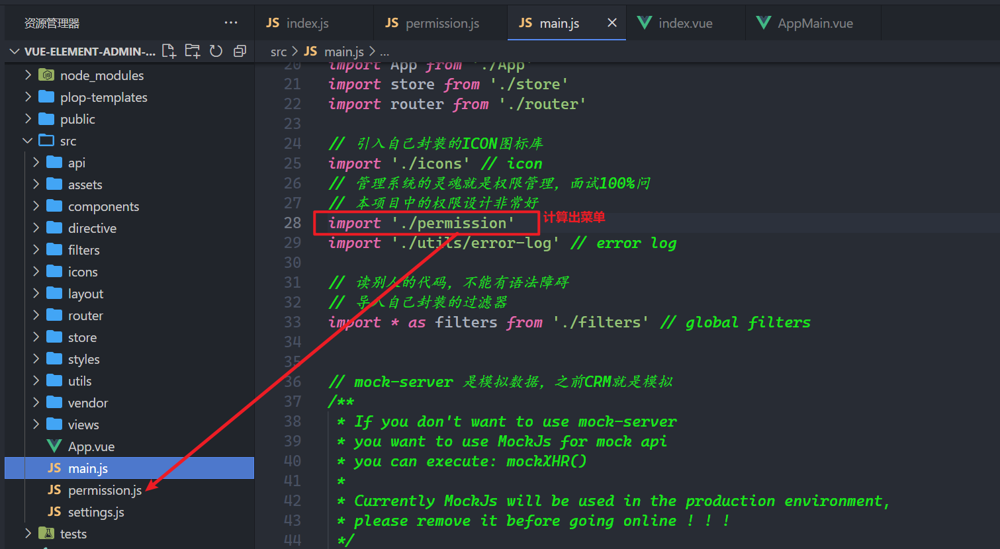
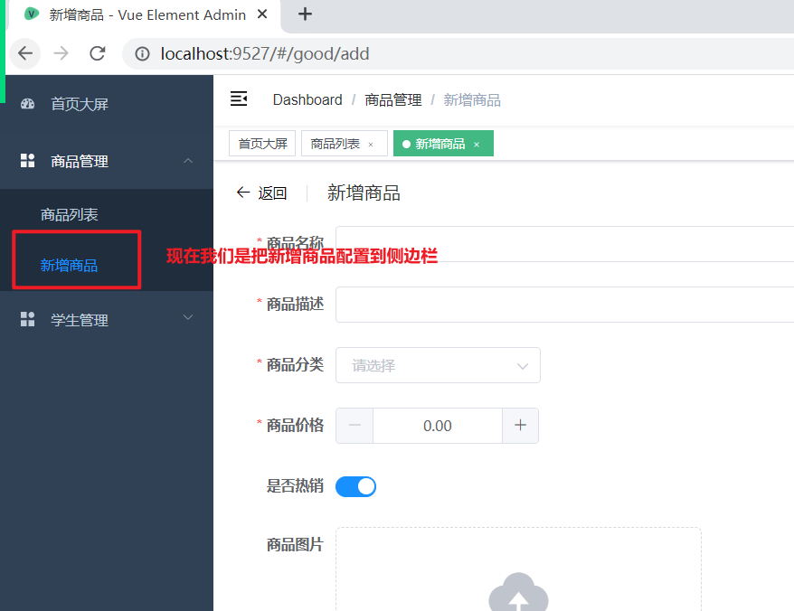
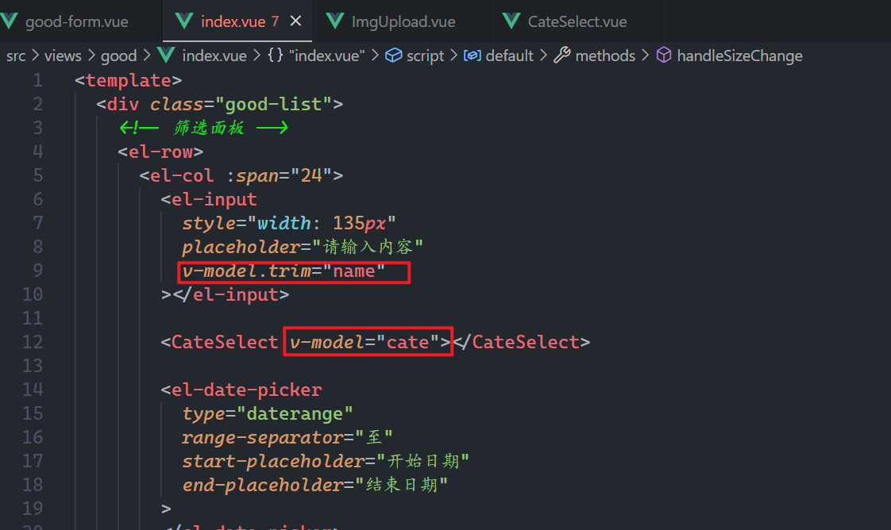
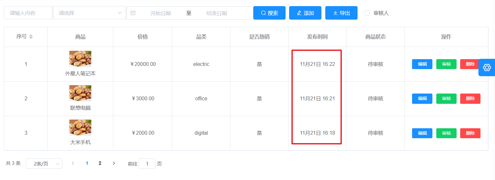
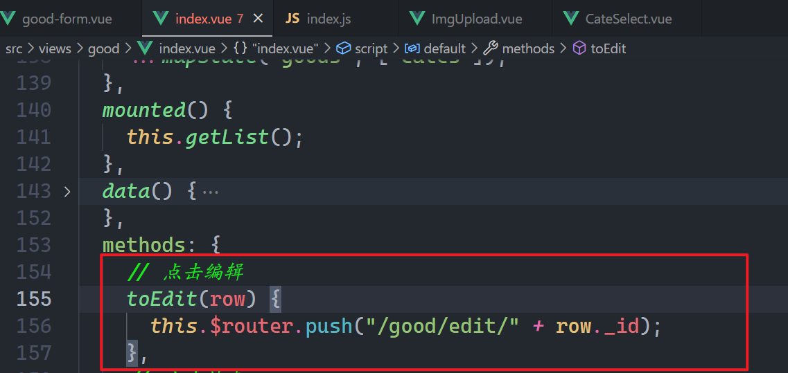

## 一，vue-element-admin开源项目介绍

### 1，项目介绍

资料：
- 开源地址：https://github.com/PanJiaChen/vue-element-admin

- 预览地址：https://panjiachen.github.io/vue-element-admin/#/login?redirect=%2Fdashboard

- 文档地址：https://panjiachen.github.io/vue-element-admin-site/zh/guide/#%E5%8A%9F%E8%83%BD

这个项目，非常优秀，是vue2中相当优秀的项目，它里面的目录结构和框架设计非常好，所以我们先学习这个开源项目，后面写管理系统基于这个开源项目。如果把这个项目搞定了，vue2理解更深入。

我讲一遍，你仔细研究一下，然后，你尝试给别人讲一遍。

**亮点**：

* 权限设计

* 全局功能 （Layout）

  + 菜单如何渲染
  + 设置功能实现
  + 全局操作实现
  + 切换组件实现
  + 国际化实现
  + TabView
  + 面包屑
  + ....
  
  
  

**再次提示Vue的重要性(四选一)**：

  + Vue2 / Vue3 / React / Uniapp 
  + ElementUI组件库必须熟练掌握，比Vant还重要。

  

**vue3的开源模板：**

-  vue-vben-admin

  

### 2，启动项目

我们需要启动别人的项目，你到公司中，你肯定也需要启动别人项目，如果这个项目你启动不起来，意味着公司的项目，你也跑不起来。需要对代码进行解压：


使用vscode打开代码：


你拿到一个项目，先看一下项目的说明文件，是README. MD文件，如下：


换源，如下：


安装依赖，如下：


报错了，如下：


尝试使用cnpm，如下：


上面报错的原因是tui-editor包安装不上，我们就不让它安装，打开package.json，依赖删除掉，如下：


删除完后，把node_module也删除了，如下：


重新使用cnpm i安装，如下：


通过npm run dev把项目运行起来，运行起来后，又后错了，如下：


把删除package.json中core.js依赖，如下：


把node_modules，删除掉，如下：


再一次重新安装，通过cnpm i ，如下：


安装OK。

还需要我们还需要单独去安装core-js，如下：


运行项目：


报错了，如下：


上面的报错的原因是没有这个依赖，找到对应的组件，把对应的代码删除了，如下：


项目就可以运行起来了，如下：


浏览器效果如下：


### 3，可以科学上网安装依赖

你电脑上，需要有工具，打开代理工具，直接通过npm 去安装所有的依赖，项目就直接通过npm run dev运行直来，需要注意你的node版本是16.16.0。

### 4，使用工具删除node_module

先安装一个工具：

```js
npm install rimraf - g
```

删除node_module：

```js
rimraf node_modules
```

### 5，研究项目

得到一个新的项目，如何研究，研究的流程是怎么样的？

* README.md  项目的说明文件（今天大家从上到下过一遍）
* package.json 看一下，项目中运行了什么依赖，启动项目，打包项目
* 项目都有哪些配置文件，不能有语法障碍，如果配置文件没有见过，直接把配置文件名放到百度
* src是项目的源码，重点就是src
* 先看入口文件，main.js
* 看APP.vue
* 路由，Layout组件，路由对应的哪些组件
* Vuex，状态管理，存储哪些公共的状态
* axios是如何封装的，api接口是如何封装，跨域是是如何配置的
* 看别人写的组件，是如何写的，如何命名，你如果在基于人家的项目去开发，你的习惯最好和人家的习惯一样
* 把项目跑起来，边去看效果，边看代码

边研究，边记录，把遇到的问题都记录下来。不会的问题列表。

## 二，项目

### 1，从入口开始

main.js中的代码如下：

```js
// 引入vue
import Vue from 'vue'

// 引入js-cookie
// 是用来操作cookie的，后端返回的token就存储在cookie中
// 之前我们是存储在loccalstroage中
import Cookies from 'js-cookie'

// 引入重置样式
import 'normalize.css/normalize.css'

// vant是手机端的UI库
// Element是PC端的UI组件库
import Element from 'element-ui'
import './styles/element-variables.scss'
// 引入国际包  国际化
import enLang from 'element-ui/lib/locale/lang/en'// 如果使用中文语言包请默认支持，无需额外引入，请删除该依赖

// 引入自已写的CSS全局样式
import '@/styles/index.scss'

// 引入APP组件
import App from './App'
// 引入仓库
import store from './store'
// 引入路由
import router from './router'

// 引入自己封装的icon图标
import './icons' // icon
// 引入权限模块，非常重要，面试必问
import './permission' // permission control
import './utils/error-log' // error log

// 引入过滤器
// 在读别人的代码时，不能有语法障碍
import * as filters from './filters' // global filters

/**
 * If you don't want to use mock-server
 * you want to use MockJs for mock api
 * you can execute: mockXHR()
 *
 * Currently MockJs will be used in the production environment,
 * please remove it before going online ! ! !
 */
// process是node中的全局变量
// 当通过npm run build时，node_env就是production
// 当通过npm run dev时，node_env就是development
// process.env.NODE_ENV === 'production' 表示是生成环境
if (process.env.NODE_ENV === 'production') {
  // 导入mock模块，模拟接口中的，本项目中的接口，都是模拟的，都是假的
  const { mockXHR } = require('../mock')
  mockXHR()
}

// Vue.use(Element) 
// 之前：Vue.use(vant)
Vue.use(Element, {
  // Button  可以设置  如果不设置默认是medium
  size: Cookies.get('size') || 'medium', // set element-ui default size
  // locale: enLang 表示组件使用英文
  locale: enLang // 如果使用中文，无需设置，请删除
})


// 注册全局过滤器
// register global utility filters
Object.keys(filters).forEach(key => {
  Vue.filter(key, filters[key])
})

// 关闭生成环境下，vue提示
Vue.config.productionTip = false

// new一个Vue  
new Vue({
  el: '#app',
  router,
  store,
  render: h => h(App)
})
```

### 2，App.vue

代码如下：

```vue
<template>
  <div id="app">
    <!-- 这是一级路由出品 -->
    <!-- 一会看路由，需要知道，哪些路由匹配的组件会放到一级路由出口 -->
    <router-view />
  </div>
</template>

<script>
export default {
  name: "App",
};
</script>
```

### 3，路由模块（有难度）

本项目中，路由模块+权限管理模块，最难的。

打开路由文件夹，如下：


路由模块中的代码：

```js
// 引入vue
import Vue from 'vue'
// 引入vue-router
import Router from 'vue-router'

// 路由就是一个插件，需要use
Vue.use(Router)

// 引入layout组件
// layout组件非常重要  
// 一级路由出口中，匹配layout组件
import Layout from '@/layout'

// 引入其它四个路由模块
import componentsRouter from './modules/components'
import chartsRouter from './modules/charts'
import tableRouter from './modules/table'
import nestedRouter from './modules/nested'

/**
 * Note: sub-menu only appear when route children.length >= 1
 * Detail see: https://panjiachen.github.io/vue-element-admin-site/guide/essentials/router-and-nav.html
 *
 * hidden: true                   if set true, item will not show in the sidebar(default is false)
 * alwaysShow: true               if set true, will always show the root menu
 *                                if not set alwaysShow, when item has more than one children route,
 *                                it will becomes nested mode, otherwise not show the root menu
 * redirect: noRedirect           if set noRedirect will no redirect in the breadcrumb
 * name:'router-name'             the name is used by <keep-alive> (must set!!!)
 * meta : {
    roles: ['admin','editor']    control the page roles (you can set multiple roles)
    title: 'title'               the name show in sidebar and breadcrumb (recommend set)
    icon: 'svg-name'/'el-icon-x' the icon show in the sidebar
    noCache: true                if set true, the page will no be cached(default is false)
    affix: true                  if set true, the tag will affix in the tags-view
    breadcrumb: false            if set false, the item will hidden in breadcrumb(default is true)
    activeMenu: '/example/list'  if set path, the sidebar will highlight the path you set
  }
 */

/**
 * constantRoutes
 * a base page that does not have permission requirements
 * all roles can be accessed
 */
// constantRoutes是静态路由
// 本项目，路由分成了两大模块：静态路由 和 动态路由
// 静态路由：所有的用户可以访问，不需要权限
// 动态路由：需要权限，如果有权限，就可以访问，如果没有权限，就不能访问
// 路则规则：就是一个对象
//     path: '/redirect',  访问的url
//     component: Layout,  访问出口中放什么组件  在一级中币出口中放 Layout 组件
//     hidden: true,  隐藏   把侧边栏中不能看到声明式导航
//     children: [  配置二级路由
export const constantRoutes = [
  {
    path: '/redirect',
    component: Layout,
    hidden: true,
    children: [
      {
        path: '/redirect/:path(.*)',
        // 在二级路由出口中放@/views/redirect/index组件 
        component: () => import('@/views/redirect/index')
      }
    ]
  },
  {
    // 当访问 /login时，  在一级路由出口放登录页面  一级路由出口是在APP组件中
    path: '/login',
    component: () => import('@/views/login/index'),
    //  把侧边栏中不能看到声明式导航
    hidden: true
  },
  {
    path: '/auth-redirect',
    component: () => import('@/views/login/auth-redirect'),
    hidden: true
  },
  {
    path: '/404',
    component: () => import('@/views/error-page/404'),
    hidden: true
  },
  {
    path: '/401',
    component: () => import('@/views/error-page/401'),
    hidden: true
  },
  {
    path: '/',
    component: Layout,
    redirect: '/dashboard',
    children: [
      {
        path: 'dashboard',
        component: () => import('@/views/dashboard/index'),
        name: 'Dashboard',
        meta: { title: 'Dashboard', icon: 'dashboard', affix: true }
      }
    ]
  },
  {
    path: '/documentation',
    component: Layout,
    children: [
      {
        path: 'index',
        component: () => import('@/views/documentation/index'),
        name: 'Documentation',
        meta: { title: 'Documentation', icon: 'documentation', affix: true }
      }
    ]
  },
  {
    path: '/guide',
    component: Layout,
    redirect: '/guide/index',
    children: [
      {
        path: 'index',
        component: () => import('@/views/guide/index'),
        name: 'Guide',
        meta: { title: 'Guide', icon: 'guide', noCache: true }
      }
    ]
  },
  {
    path: '/profile',
    component: Layout,
    redirect: '/profile/index',
    hidden: true,
    children: [
      {
        path: 'index',
        component: () => import('@/views/profile/index'),
        name: 'Profile',
        meta: { title: 'Profile', icon: 'user', noCache: true }
      }
    ]
  }
]

/**
 * asyncRoutes
 * the routes that need to be dynamically loaded based on user roles
 */
// asyncRoutes是动态路由
// 页面级（路由级）权限：
//     不同用户，登录到系统，看到的侧边栏是不一样，也就是有不同的页面
//     同一个页面，有的用户可以访问，有的用户不能访问
//  并不是说，你在下面配置完就OK，背后还有很多代码
export const asyncRoutes = [
  {
    path: '/permission',
    component: Layout,
    redirect: '/permission/page',
    alwaysShow: true, // will always show the root menu
    name: 'Permission',
    meta: {
      title: 'Permission',
      icon: 'lock',
      // roles表示什么样的用户可以访问permission
      // 不同的用户有不同的角色
      // 本项目就两个角色：admin   editor
      // roles: ['admin', 'editor']  表示amdin可以访问persmisson  editor也可以访问persmisson
      roles: ['admin', 'editor'] // you can set roles in root nav

      // roles: ['admin']  表示只能admin用户可以访问persmisson
      // roles: ['admin'] // you can set roles in root nav
    },
    children: [
      {
        path: 'page',
        component: () => import('@/views/permission/page'),
        name: 'PagePermission',
        meta: {
          title: 'Page Permission',
          roles: ['admin'] // or you can only set roles in sub nav
        }
      },
      {
        path: 'directive',
        component: () => import('@/views/permission/directive'),
        name: 'DirectivePermission',
        meta: {
          title: 'Directive Permission',
          // 没有roles，表示此路由规则，不需要校验
          // if do not set roles, means: this page does not require permission
        }
      },
      {
        path: 'role',
        component: () => import('@/views/permission/role'),
        name: 'RolePermission',
        meta: {
          title: 'Role Permission',
          roles: ['admin']
        }
      }
    ]
  },

  {
    path: '/icon',
    component: Layout,
    children: [
      {
        path: 'index',
        component: () => import('@/views/icons/index'),
        name: 'Icons',
        meta: { title: 'Icons', icon: 'icon', noCache: true }
      }
    ]
  },

  /** when your routing map is too long, you can split it into small modules **/
  componentsRouter,
  chartsRouter,
  nestedRouter,
  tableRouter,

  {
    path: '/example',
    component: Layout,
    redirect: '/example/list',
    name: 'Example',
    meta: {
      title: 'Example',
      icon: 'el-icon-s-help'
    },
    children: [
      {
        path: 'create',
        component: () => import('@/views/example/create'),
        name: 'CreateArticle',
        meta: { title: 'Create Article', icon: 'edit' }
      },
      {
        path: 'edit/:id(\\d+)',
        component: () => import('@/views/example/edit'),
        name: 'EditArticle',
        meta: { title: 'Edit Article', noCache: true, activeMenu: '/example/list' },
        hidden: true
      },
      {
        path: 'list',
        component: () => import('@/views/example/list'),
        name: 'ArticleList',
        meta: { title: 'Article List', icon: 'list' }
      }
    ]
  },

  {
    path: '/tab',
    component: Layout,
    children: [
      {
        path: 'index',
        component: () => import('@/views/tab/index'),
        name: 'Tab',
        meta: { title: 'Tab', icon: 'tab' }
      }
    ]
  },

  {
    path: '/error',
    component: Layout,
    redirect: 'noRedirect',
    name: 'ErrorPages',
    meta: {
      title: 'Error Pages',
      icon: '404'
    },
    children: [
      {
        path: '401',
        component: () => import('@/views/error-page/401'),
        name: 'Page401',
        meta: { title: '401', noCache: true }
      },
      {
        path: '404',
        component: () => import('@/views/error-page/404'),
        name: 'Page404',
        meta: { title: '404', noCache: true }
      }
    ]
  },

  {
    path: '/error-log',
    component: Layout,
    children: [
      {
        path: 'log',
        component: () => import('@/views/error-log/index'),
        name: 'ErrorLog',
        meta: { title: 'Error Log', icon: 'bug' }
      }
    ]
  },

  {
    path: '/excel',
    component: Layout,
    redirect: '/excel/export-excel',
    name: 'Excel',
    meta: {
      title: 'Excel',
      icon: 'excel'
    },
    children: [
      {
        path: 'export-excel',
        component: () => import('@/views/excel/export-excel'),
        name: 'ExportExcel',
        meta: { title: 'Export Excel' }
      },
      {
        path: 'export-selected-excel',
        component: () => import('@/views/excel/select-excel'),
        name: 'SelectExcel',
        meta: { title: 'Export Selected' }
      },
      {
        path: 'export-merge-header',
        component: () => import('@/views/excel/merge-header'),
        name: 'MergeHeader',
        meta: { title: 'Merge Header' }
      },
      {
        path: 'upload-excel',
        component: () => import('@/views/excel/upload-excel'),
        name: 'UploadExcel',
        meta: { title: 'Upload Excel' }
      }
    ]
  },

  {
    path: '/zip',
    component: Layout,
    redirect: '/zip/download',
    alwaysShow: true,
    name: 'Zip',
    meta: { title: 'Zip', icon: 'zip' },
    children: [
      {
        path: 'download',
        component: () => import('@/views/zip/index'),
        name: 'ExportZip',
        meta: { title: 'Export Zip' }
      }
    ]
  },

  {
    path: '/pdf',
    component: Layout,
    redirect: '/pdf/index',
    children: [
      {
        path: 'index',
        component: () => import('@/views/pdf/index'),
        name: 'PDF',
        meta: { title: 'PDF', icon: 'pdf' }
      }
    ]
  },
  {
    path: '/pdf/download',
    component: () => import('@/views/pdf/download'),
    hidden: true
  },

  {
    path: '/theme',
    component: Layout,
    children: [
      {
        path: 'index',
        component: () => import('@/views/theme/index'),
        name: 'Theme',
        meta: { title: 'Theme', icon: 'theme' }
      }
    ]
  },

  {
    path: '/clipboard',
    component: Layout,
    children: [
      {
        path: 'index',
        component: () => import('@/views/clipboard/index'),
        name: 'ClipboardDemo',
        meta: { title: 'Clipboard', icon: 'clipboard' }
      }
    ]
  },

  {
    path: 'external-link',
    component: Layout,
    children: [
      {
        path: 'https://github.com/PanJiaChen/vue-element-admin',
        meta: { title: 'External Link', icon: 'link' }
      }
    ]
  },

  // 404 page must be placed at the end !!!
  { path: '*', redirect: '/404', hidden: true }
]

// 创建一个路由对象  router
const createRouter = () => new Router({
  // mode: 'history', // require service support
  scrollBehavior: () => ({ y: 0 }),
  routes: constantRoutes
})

const router = createRouter()

// Detail see: https://github.com/vuejs/vue-router/issues/1234#issuecomment-357941465
export function resetRouter() {
  const newRouter = createRouter()
  router.matcher = newRouter.matcher // reset router
}

export default router
```

左则的菜单是动态的计算出来的，如下：


它是在permission模块中动态计算出来的，这个模块是最最难的模块。

### 4，permission模块

在src根目录下，如下：


在main.js中，去执行permisson.js文件，如下：



如果把这个模块注释掉，菜单都没有了，如下：


效果如下：


然后我们就需要看这个模块中的代码了，大体代码如下：

```js
// 引入路由器
import router from './router'
// 引入仓库
import store from './store'
// 引入elementui中的提示性组件
import { Message } from 'element-ui'
// 引入nprogress  进度条
import NProgress from 'nprogress' // progress bar
import 'nprogress/nprogress.css' // progress bar style

// getToken就是从cookie中获取token
// 如果登录了，是有token，如果没有登录，就没有token
import { getToken } from '@/utils/auth' // get token from cookie
// 得到页面中的title
import getPageTitle from '@/utils/get-page-title'

// 配置NProgress
NProgress.configure({ showSpinner: false }) // NProgress Configuration

// whiteList是白名单   不需要登录，就可以直接访问
const whiteList = ['/login', '/auth-redirect'] // no redirect whitelist

// 全局前置路由守卫
// 核心代码都是在守卫中
router.beforeEach(async (to, from, next) => {
	....
})


// 全局后置路由守卫
router.afterEach(() => {
  // 关闭进度条
  NProgress.done()
})

```

核心就在前置路由守卫中，如下：

```js
// 全局前置路由守卫
// 核心代码都是在守卫中
router.beforeEach(async (to, from, next) => {
  // 开启进度条
  NProgress.start()

  // 给页面的title赋值
  document.title = getPageTitle(to.meta.title)

  // 从cookie中获取token 如果有token表示登录了
  const hasToken = getToken()

  if (hasToken) {
    // 有token，说明已经登录了
    if (to.path === '/login') {
      // 已经登录了，你又去登录，放行到后面首页面
      next({ path: '/' })
      // 关闭进度条
      NProgress.done()
    } else {
      // 已经登录了，去其它页面
      // store.getters.roles得到vuex中的角色
      // 如果登录了，我们会调用一个接口，去拿用户信息，在用户信息中，有当前用户的角色
      // 点击登录，先发一个登录请求，服务器响应一个token，前端把token存储到cookie
      // 紧接着发第二个请求，是用来获取用户信息的，前端把用户信息存储到了vuex中，用户信息中有一个角色
      // 也就是说，在vuex中是可以获取角色的  通过store.getters.roles
      // store.getters.roles.length > 0 表示vuex是有角色
      const hasRoles = store.getters.roles && store.getters.roles.length > 0
      if (hasRoles) {
        // 从vuex中获取角色，直接放行
        next()
      } else {
        // else表示vuex中没有角色  当你又去刷新浏览器时，vuex中就没有角色，vuex中的数据也是存储在内存
        try {
          // get user info
          // note: roles must be a object array! such as: ['admin'] or ,['developer','editor']
          // store.dispatch('user/getInfo')  重新获取用户信息   肯定是在vuex中发送ajax请求
          // roles 表示用户信息，用户信息中包含用户角色
          const { roles } = await store.dispatch('user/getInfo')

          // generate accessible routes map based on roles
          // dispatch('permission/generateRoutes', roles)  根据用户角色，生成路由规则
          // 至于怎么生成，不要管，明天才会看如何生成路由规则的代码
          const accessRoutes = await store.dispatch('permission/generateRoutes', roles)

          // console.log("accessRoutes", accessRoutes);

          // dynamically add accessible routes
          // 一个路由器中，可以有很多的规则，计算了当前用户角色有18个规则
          // 利用addRoutes，把这18个规则，添加到路由器
          router.addRoutes(accessRoutes)

          // hack method to ensure that addRoutes is complete
          // set the replace: true, so the navigation will not leave a history record
          // 上面已经把规则添加到路由器中，放行，此时，你就可以看到，你有权限看到的页面了
          next({ ...to, replace: true })
        } catch (error) {
          // remove token and go to login page to re-login
          // 如果在生成规则时，出问题了
          // store.dispatch('user/resetToken')  清除token
          await store.dispatch('user/resetToken')
          Message.error(error || 'Has Error')
          // 重新回到登录页面
          next(`/login?redirect=${to.path}`)
          NProgress.done()
        }
      }
    }
  } else {
    // 没有token
    // 没有token看一下，你访问的路径有没有在白名单中
    if (whiteList.indexOf(to.path) !== -1) {
      // 如果在白名单中，就放行
      next()
    } else {
      // 如果没有在白名单中，表示你访问的路由规则，需要登录 
      // 需要登录，放行到登录页面
      next(`/login?redirect=${to.path}`)
      // 关闭进度条
      NProgress.done()
    }
  }
})
```

分析图如下：


### 5，看网络请求

登录成功后，从network面板中，看到了发出了三个请求：


看登录接口，如下：


登录成功，后token，本项目是存储在cookie中，如下：


带着token，获取用户信息，如下：


服务器响应如下：


根据roles成有权访问的菜单和路由。需要计算出来，这个前端实现的。需要用户信息（角色）存储到vuex中，如下：


### 6，看Vuex

入口文件，如下：

```js
import Vue from 'vue'
import Vuex from 'vuex'

// 导入getters
import getters from './getters'

// 由于vuex是一个插件， 你需要use
Vue.use(Vuex)

// 加载modules文件夹下面所有以.js结尾的模块
const modulesFiles = require.context('./modules', true, /\.js$/)

// you do not need `import app from './modules/app'`
// it will auto require all vuex module from modules file

// 注册模块
const modules = modulesFiles.keys().reduce((modules, modulePath) => {
    // set './app.js' => 'app'
    const moduleName = modulePath.replace(/^\.\/(.*)\.\w+$/, '$1')
    const value = modulesFiles(modulePath)
    modules[moduleName] = value.default
    return modules
}, {})

const store = new Vuex.Store({
    modules,
    getters
})

export default store
```

我们只需要关注，user.js和permission.js这两个模块，看user.js，如下：


代码如下：

```js
import {
    login,
    logout,
    getInfo
} from '@/api/user'
import {
    getToken,
    setToken,
    removeToken
} from '@/utils/auth'
import router, {
    resetRouter
} from '@/router'

const state = {
    token: getToken(), // token  
    name: '', // 用户名
    avatar: '', // 用户头像
    introduction: '', // 用户简介
    roles: [] // 当前用户所具有的角色
}

const mutations = {
    SET_TOKEN: (state, token) => {
        state.token = token
    },
    SET_INTRODUCTION: (state, introduction) => {
        state.introduction = introduction
    },
    SET_NAME: (state, name) => {
        state.name = name
    },
    SET_AVATAR: (state, avatar) => {
        state.avatar = avatar
    },
    SET_ROLES: (state, roles) => {
        state.roles = roles
    }
}

const actions = {
    // 用户登录 
    login({
        commit
    }, userInfo) {
        // 组件中派发action
        const {
            username,
            password
        } = userInfo
        return new Promise((resolve, reject) => {
            // login是接口
            login({
                username: username.trim(),
                password: password
            }).then(response => {
                const {
                    data
                } = response
                // commit('SET_TOKEN', data.token) commit一个mutaion，给token赋值
                commit('SET_TOKEN', data.token)
                setToken(data.token)
                resolve()
            }).catch(error => {
                reject(error)
            })
        })
    },

    // 获取用户信息
    getInfo({
        commit,
        state
    }) {
        return new Promise((resolve, reject) => {
            // getInfo 也是接口
            getInfo(state.token).then(response => {
                const {
                    data
                } = response

                if (!data) {
                    reject('Verification failed, please Login again.')
                }

                const {
                    roles,
                    name,
                    avatar,
                    introduction
                } = data

                // roles must be a non-empty array
                if (!roles || roles.length <= 0) {
                    reject('getInfo: roles must be a non-null array!')
                }

                // 把用户信息存储到vuex
                commit('SET_ROLES', roles)
                commit('SET_NAME', name)
                commit('SET_AVATAR', avatar)
                commit('SET_INTRODUCTION', introduction)
                resolve(data)
            }).catch(error => {
                reject(error)
            })
        })
    },

    // 用户退出登录
    logout({
        commit,
        state,
        dispatch
    }) {
        return new Promise((resolve, reject) => {
            logout(state.token).then(() => {
                commit('SET_TOKEN', '')
                commit('SET_ROLES', [])
                removeToken()
                resetRouter()

                // reset visited views and cached views
                // to fixed https://github.com/PanJiaChen/vue-element-admin/issues/2485
                dispatch('tagsView/delAllViews', null, {
                    root: true
                })

                resolve()
            }).catch(error => {
                reject(error)
            })
        })
    },

    // 清除token
    resetToken({
        commit
    }) {
        return new Promise(resolve => {
            commit('SET_TOKEN', '')
            commit('SET_ROLES', [])
            removeToken()
            resolve()
        })
    },

    // 动态修改角色
    async changeRoles({
        commit,
        dispatch
    }, role) {
        const token = role + '-token'

        commit('SET_TOKEN', token)
        setToken(token)

        const {
            roles
        } = await dispatch('getInfo')

        resetRouter()

        // generate accessible routes map based on roles
        const accessRoutes = await dispatch('permission/generateRoutes', roles, {
            root: true
        })
        // dynamically add accessible routes
        router.addRoutes(accessRoutes)

        // reset visited views and cached views
        dispatch('tagsView/delAllViews', null, {
            root: true
        })
    }
}

export default {
    namespaced: true,
    state,
    mutations,
    actions
}
```

重点看permission.js，如下：

```js
import {
    asyncRoutes,
    constantRoutes
} from '@/router'

// 使用roles:Array<string> 和 route:{path,component,meta:{roles:[]}}
// 判断当前用户能不能访问当前路由规则，返回布尔值。
function hasPermission(roles, route) {
    if (route.meta && route.meta.roles) {
        // 如果路由规则上有meta，并且meta上有roles这个自定义字段，说明这条路由是有权限的，要进行过滤权限。
        return roles.some(role => route.meta.roles.includes(role))
    } else {
        // 如果路由规则上没有meta这个属性，或者meta上没有roles这个自定义字段，任何用户都可以访问。
        return true
    }
}

// 使用roles:Array<string>, 和 routes:Array<route> 
// 生成当前用户可访问的路由规则。
export function filterAsyncRoutes(routes, roles) {
    const res = []
    routes.forEach(route => {
        // 深复制（深拷贝）仅对那些比较简单对象进行深拷贝
        const tmp = {
            ...route
        }
        // hasPermission(['admin', 'editor'], {path,component,meta:{roles:['editor']}}): boolean
        if (hasPermission(roles, tmp)) {
            // 有没有嵌套视图，如果进行递归
            if (tmp.children) {
                tmp.children = filterAsyncRoutes(tmp.children, roles)
            }
            res.push(tmp)
        }
    })
    return res
}

const state = {
    routes: [], // 静态路由规则 + 当前用户可访问的动态路由规则
    addRoutes: [] // 只是当前用户可访问的动态路由规则
}

const mutations = {
    SET_ROUTES: (state, routes) => {
        state.addRoutes = routes
        state.routes = constantRoutes.concat(routes)
    }
}

const actions = {
    // 用于生成当前用户可访问的路由规则
    // roles = ['admin', 'editor']
    generateRoutes({
        commit
    }, roles) {
        return new Promise(resolve => {
            let accessedRoutes
            if (roles.includes('admin')) {
                // admin用户
                // 工作经验：工作中的管理系统，admin一般只用看到功能性页面，不需要看那些业务性页面。
                // accessedRoutes = asyncRoutes || []
                accessedRoutes = filterAsyncRoutes(asyncRoutes, roles)
            } else {
                // 非admin用户
                accessedRoutes = filterAsyncRoutes(asyncRoutes, roles)
            }
            // 把当前用户可访问的路由规则放在vuex中
            commit('SET_ROUTES', accessedRoutes)
            // 把当前用户可访问的路由规则给到.then()
            resolve(accessedRoutes)
        })
    }
}

export default {
    namespaced: true,
    state,
    mutations,
    actions
}
```

### 7，实践一下

我要开发一个商品管理模块，第一步，创建两个组件，如下：


第二步，配置路由，如下：

```js
  {
    path: '/good',
    component: Layout,
    redirect: '/good/list',
    alwaysShow: true,
    name: 'GoodManage',
    meta: {
      title: '商品管理',
      icon: 'shopping',
      roles: ['admin', 'editor']
    },
    children: [
      {
        path: 'list',
        component: () => import('@/views/good/good-list'),
        name: 'GoodList',
        meta: {
          title: '商品列表',
          roles: ['admin', 'editor']
        }
      },
      {
        path: 'add',
        component: () => import('@/views/good/good-form'),
        name: 'GoodForm',
        meta: {
          title: '添加商品',
          roles: ['admin', 'editor']
        }
      },
    ]
  },
  {
    path: '/student',
    component: Layout,
    redirect: '/student/list',
    alwaysShow: true,
    name: 'StudentManage',
    meta: {
      title: '学生管理',
      icon: 'component',
      roles: ['admin', 'editor']
    },
    children: [
      {
        path: 'list',
        component: () => import('@/views/student/student-list'),
        name: 'GoodList',
        meta: {
          title: '学生列表',
          roles: ['admin', 'editor']
        }
      },
      {
        path: 'add',
        component: () => import('@/views/student/student-form'),
        name: 'GoodForm',
        meta: {
          title: '添加学生',
          roles: ['admin', 'editor']
        }
      },
    ]
  },
```

测试如下：


把人家默认的规则可以抽离到一个备份文件中，如下：


在index.js中用的时候，打开，如下：


### 6，前端权限设计总结

不同的公司，权限设计是不一样的，从前后端协作的角度说，权限设计大体上有两种思路，第一种是单纯由前端来实现，第二种由后端来实现。后端实现，我们后面会讲一个案例。由前端来设计管理系统的权限，开发成本相对较低。

中小型公司：前端做权限设计，本开源项目主要前端做的权限设计。

大公司：后端做权限设计，后面再讲一下后端的权限设计。

**前端实现思路**：前端用token调接口换取当前用户信息，再使用用户的角色信息动态生成有权访问的菜单和路由。核心知识：

* vue-router 中的全局守卫、路由元信息
* router.addRoutes() 动态添加路由匹配规则
* 使用 vuex 管理用户信息、路由菜单信息等

**核心逻辑**：

* 全局路由守卫，用于拦截用户对系统内部页面的访问
* 当权限路由动态生成后，才能进入系统内部渲染 Menu 菜单
* 在登录流程中，先用 token 调接口获取用户信息，再根据用户信息生成权限路由，并保存在状态管理工具中去，后面就可以正常访问权限路由了。
* 当用户在系统内部刷新页面时，这就是刷新流程。当我们刷新时，Vuex中的用户信息和权限菜单信息会丢失。所以，在刷新流程中，会重新使用 token 换取用户信息，再使用用户角色来生成权限路由。

路由核心代码：

```js
import router from './router' // 导入路由实例
import store from './store' // 导入store实例

import {
    Message
} from 'element-ui' // 引入消息提示组件
import NProgress from 'nprogress' // 进度条
import 'nprogress/nprogress.css' // 进度条样式文件
NProgress.configure({
    showSpinner: false
}) // 进度条配置（参见官方仓库）

import {
    getToken
} from '@/utils/auth' // 工具方法，用于从cookie中取出token
import getPageTitle from '@/utils/get-page-title' // 根据页面动态改变document.title

const whiteList = ['/login', '/auth-redirect'] // 无须登录就可以访问的页面列表

// 添加全局导航守卫的钩子 router.beforeEach(function(to,from,next))
// 这里的async是什么意思？在这个函数中，要使用await把Promise变成同步代码
// 知识点：async/await 是Promise同步语法的语法糖
// 这个路由钩子，每次访问路由或切换路由时，都会执行，相当于一个“保安”
router.beforeEach(async (to, from, next) => {
    NProgress.start() // 打开进度条
    document.title = getPageTitle(to.meta.title) // 使用元信息中title字段设置标题
    // 判断当前用户是否登录了，Y-有token，N-没有token
    const hasToken = getToken()
    // Y-有token的时候
    if (hasToken) {
        // 访问登录页
        if (to.path === '/login') {
            // 如果用户已登录，如果你访问/login，直接重定向到系统内部的首页
            // 也就是说，如果已登录，是不能再访问 /login页面了
            next({
                path: '/'
            })
            NProgress.done()
        } else { // 访问非登录页面
            // 判断当前用户是否有“角色”信息（这个角色信息是后端返回的）
            // 用户信息（包括角色信息）放在Vuex中的
            const hasRoles = store.getters.roles && store.getters.roles.length > 0
            // 当Vuex中有用户角色信息时
            if (hasRoles) {
                next() // Vuex中有用户信息，不拦截
            } else { // Vuex中没有用户角色信息时
                try {
                    // 如果Vuex中没有用户角色信息，触发user/getInfo调接口获取用户信息
                    // 下面这行代码是同步代码，这个roles是后端接口返回的用户角色字段（数组）
                    // 强调一下数据类型：roles是后端返回的，必须是个数组，比如 ['admin',...]
                    const {
                        roles
                    } = await store.dispatch('user/getInfo')

                    // 根据roles这个后端返回的角色信息，动态生成当前用户有权访问的路由规则
                    // 下面这行代码也是同步代码，返回的是当前用户可以访问的路由规则
                    const accessRoutes = await store.dispatch('permission/generateRoutes', roles)

                    // 手动向路由实例的 routes选项 中添加路由规则
                    router.addRoutes(accessRoutes)
                    // accessRoutes.forEach(route=>router.addRoute(route))
                    // 一个重要问题：那些有权限的路由规则是如何添加到routes中呢？
                    // 到这里，我们就已经有了答案。

                    // 权限路由规则已经加入到了 routes选项中，你通过了，去访问吧
                    next({
                        ...to,
                        replace: true
                    })
                } catch (error) {
                    // 向后端获取用户信息，要使用token换取。token有可能是假的、或者是过期的？
                    // 如果获取用户信息、生成路由规则报错，就重置token，让用户重新登录
                    await store.dispatch('user/resetToken')
                    Message.error(error || 'Has Error')
                    next(`/login?redirect=${to.path}`)
                    NProgress.done()
                }
            }
        }
    } else {
        // N-没有token时
        if (whiteList.indexOf(to.path) !== -1) {
            // 没有登录，并且访问的是白名单中的页面，不拦截
            next()
        } else {
            // 没有登录？访问非白名单，拦截，去登录吧
            next(`/login?redirect=${to.path}`)
            NProgress.done()
        }
    }
})
// router.beforeResolve((to,from,next))
router.afterEach(() => {
    NProgress.done() // 关闭加载页面的进度条
})
```

Vuex中的user模块中核心逻辑：

* 主要是登录逻辑、获取用户信息、退出登录的逻辑，把token、用户信息都放在状态管理中存储。

* token不仅在保存在Vuex中，还要保存在了 cookie 中。

  

Vuex核心代码：

```js
// 引入调接口的方法
import {
    login,
    logout,
    getInfo
} from '@/api/user'
import {
    getToken,
    setToken,
    removeToken
} from '@/utils/auth'
import router, {
    resetRouter
} from '@/router'

const state = {
    token: getToken(),
    name: '',
    avatar: '',
    introduction: '',
    roles: [],
    messageList: [],
    userinfo: {}
}

const mutations = {
    SET_TOKEN: (state, token) => {
        state.token = token
    },
    SET_INTRODUCTION: (state, introduction) => {
        state.introduction = introduction
    },
    SET_NAME: (state, name) => {
        state.name = name
    },
    SET_AVATAR: (state, avatar) => {
        state.avatar = avatar
    },
    SET_ROLES: (state, roles) => {
        state.roles = roles
    },
    SET_MESSAGE: (state, list) => {
        state.messageList = list
    },
    SET_USERINFO: (state, userinfo) => {
        state.userinfo = userinfo
    }
}

const actions = {
    // 登录 await store.dispatch('user/login')
    // 调登录接口：接收上游传递过来的表单数据，调login接口
    login({
        commit
    }, payload) {
        // const { username, password } = payload
        return new Promise((resolve, reject) => {
            // 开始真正调接口
            login(payload).then(data => {
                const {
                    token
                } = data
                // 把login登录成功返回的token放进vuex中
                commit('SET_TOKEN', token)
                // 把login登录成功返回的token放进Cookie中
                setToken(token)
                // 给.then()使用
                resolve()
            }).catch(error => {
                reject(error)
            })
        })
    },

    // 获取用户信息（roles）
    // 这个接口在什么时候调用？当有token但没有用户信息时调用。
    // 路由守卫：在登录流程中，在刷新流程中。
    getInfo({
        commit,
        state
    }) {
        return new Promise((resolve, reject) => {
            // 真正调接口获取用户信息
            // 注意：这个作者是用query参数的方式向后端传递token的
            getInfo({}).then(data => {
                const {
                    userinfo,
                    message_list
                } = data
                // 如果data不存在，这说明token要么是假的，要么过期了。
                // 注意：为了配合这个异常，当拿不到用户信息时，希望data是null/undefined
                if (!userinfo) {
                    reject('Verification failed, please Login again.')
                }
                // 在这里肯定拿到了用户信息
                const {
                    roles,
                    name,
                    avatar,
                    introduction
                } = userinfo
                // 注意：roles必须是一个“非空数组”，像这样 ['admin']
                if (!roles || roles.length <= 0) {
                    reject('getInfo: roles must be a non-null array!')
                }
                // 把用户信息都放进vuex中（用户不要放进Cookie或localStoraget）
                commit('SET_ROLES', roles)
                commit('SET_NAME', name)
                commit('SET_AVATAR', avatar)
                commit('SET_INTRODUCTION', introduction)
                commit('SET_MESSAGE', message_list)
                commit('SET_USERINFO', userinfo)
                // 给.then()使用
                resolve(userinfo)
            }).catch(error => {
                reject(error)
            })
        })
    },

    // 退出登录：清除token、清除角色信息、重置路由、清除各种缓存
    logout({
        commit,
        state,
        dispatch
    }) {
        return new Promise((resolve, reject) => {

            // 把vuex中的token和角色信息清除
            commit('SET_TOKEN', '')
            commit('SET_ROLES', [])
            // 把Cookie中的token清除
            removeToken()
            // 重置路由（*）
            resetRouter()
            // reset visited views and cached views
            // 把vuex中tagViews、缓存的视图都清除。
            dispatch('tagsView/delAllViews', null, {
                root: true
            })
            resolve()
        })
    }
}

export default {
    namespaced: true,
    state,
    mutations,
    actions
}
```

Vuex中的pemission模块中核心逻辑：

* 根据用户信息生成当前用户有权访问的路由，权限路由数据也保存在Vuex中，用于Layout布局中 Menu 菜单的渲染。
* 动态生成路由菜单的大体逻辑是：用后端返回的用户角色信息，与路由规则中的 meta 元信息进行比照，符合权限配置的就是有权访问的路由。

```js
import {
    asyncRoutes,
    constantRoutes
} from '@/router'

// 使用roles:Array<string> 和 route:{path,component,meta:{roles:[]}}
// 判断当前用户能不能访问当前路由规则，返回布尔值。
function hasPermission(roles, route) {
    if (route.meta && route.meta.roles) {
        // 如果路由规则上有meta，并且meta上有roles这个自定义字段，说明这条路由是有权限的，要进行过滤权限。
        return roles.some(role => route.meta.roles.includes(role))
    } else {
        // 如果路由规则上没有meta这个属性，或者meta上没有roles这个自定义字段，任何用户都可以访问。
        return true
    }
}

// 使用roles:Array<string>, 和 routes:Array<route> 
// 生成当前用户可访问的路由规则。
export function filterAsyncRoutes(routes, roles) {
    const res = []
    routes.forEach(route => {
        // 深复制（深拷贝）仅对那些比较简单对象进行深拷贝
        const tmp = {
            ...route
        }
        // hasPermission(['admin', 'editor'], {path,component,meta:{roles:['editor']}}): boolean
        if (hasPermission(roles, tmp)) {
            // 有没有嵌套视图，如果进行递归
            if (tmp.children) {
                tmp.children = filterAsyncRoutes(tmp.children, roles)
            }
            res.push(tmp)
        }
    })
    return res
}

const state = {
    routes: [], // 静态路由规则 + 当前用户可访问的动态路由规则
    addRoutes: [] // 只是当前用户可访问的动态路由规则
}

const mutations = {
    SET_ROUTES: (state, routes) => {
        state.addRoutes = routes
        state.routes = constantRoutes.concat(routes)
    }
}

const actions = {
    // 用于生成当前用户可访问的路由规则
    // roles = ['admin', 'editor']
    generateRoutes({
        commit
    }, roles) {
        return new Promise(resolve => {
            let accessedRoutes
            if (roles.includes('admin')) {
                // admin用户
                // 工作经验：工作中的管理系统，admin一般只用看到功能性页面，不需要看那些业务性页面。
                // accessedRoutes = asyncRoutes || []
                accessedRoutes = filterAsyncRoutes(asyncRoutes, roles)
            } else {
                // 非admin用户
                accessedRoutes = filterAsyncRoutes(asyncRoutes, roles)
            }
            // 把当前用户可访问的路由规则放在vuex中
            commit('SET_ROUTES', accessedRoutes)
            // 把当前用户可访问的路由规则给到.then()
            resolve(accessedRoutes)
        })
    }
}

export default {
    namespaced: true,
    state,
    mutations,
    actions
}
```

路由规则的数据结构

* 路由配置比较常规，重点是 asyncRoutes 中的 meta 元信息，你配置怎样的 roles ，就会得到怎样的动态路由菜单。

```js
import Vue from 'vue'
import Router from 'vue-router'
Vue.use(Router)

import Layout from '@/layout' /* 引入布局组件 */
/* 静态路由规则，所有用户都能访问的页面（没有权限的页面） */
export const constantRoutes = [{
        path: '/redirect',
        component: Layout,
        hidden: true,
        children: [{
            path: '/redirect/:path(.*)',
            component: () => import('@/views/redirect/index')
        }]
    },
    {
        path: '/login',
        component: () => import('@/views/login/index'),
        hidden: true
    },
    {
        path: '/auth-redirect',
        component: () => import('@/views/login/auth-redirect'),
        hidden: true
    },
    {
        path: '/',
        component: Layout,
        redirect: '/dashboard',
        children: [{
            path: 'dashboard',
            component: () => import('@/views/dashboard/index'),
            name: 'Dashboard',
            meta: {
                title: '首页大屏',
                icon: 'dashboard',
                affix: true
            }
        }]
    }
]

/* 动态路由规则，要根据当前登录的用户角色进行配置（有权限的页面）*/
export const asyncRoutes = [
    // 商品管理模块
    {
        path: '/good',
        component: Layout,
        meta: {
            title: '商品管理',
            icon: 'el-icon-goods',
            roles: ['admin', 'editor', 'shop']
        },
        children: [{
                path: 'list',
                component: () => import('@/views/good/good-list'),
                name: 'GoodList',
                meta: {
                    title: '商品列表',
                    icon: 'el-icon-sugar',
                    noCache: false,
                    roles: ['admin', 'editor', 'shop']
                }
            },
            {
                path: 'add',
                component: () => import('@/views/good/good-form'),
                hidden: true,
                name: 'GoodAdd',
                meta: {
                    icon: 'el-icon-sugar',
                    noCache: false,
                    roles: ['editor', 'shop']
                }
            },
            {
                path: 'edit/:id',
                component: () => import('@/views/good/good-form'),
                hidden: true,
                name: 'GoodEdit',
                meta: {
                    title: '商品编辑',
                    icon: 'el-icon-sugar',
                    noCache: false,
                    roles: ['editor', 'shop']
                }
            }
        ]
    },
    // 系统管理模块
    {
        path: '/system',
        component: Layout,
        meta: {
            title: '系统管理',
            icon: 'el-icon-goods',
            roles: ['admin']
        },
        children: [{
                path: 'user',
                component: () => import('@/views/system/user-manage'),
                name: 'UserManage',
                meta: {
                    title: '用户管理',
                    icon: 'el-icon-sugar',
                    noCache: false
                }
            },
            {
                path: 'user2',
                component: () => import('@/views/system/user-manage'),
                name: 'GoodAdd',
                meta: {
                    title: '占位页面',
                    icon: 'el-icon-sugar',
                    noCache: false
                }
            },
        ]
    },
    // 重定向规则
    {
        path: '*',
        redirect: '/404',
        hidden: true
    }
]

// 封装“创建router”的方法
function createRouter() {
    return new Router({
        mode: 'hash',
        // 路由规则，在这里只考虑了静态路由规则
        // 思考：那么那些动态路由规则是如何起作用的？（路由守卫）
        routes: constantRoutes,
        scrollBehavior: () => ({
            y: 0
        })
    })
}

const router = createRouter()

// Detail see: https://github.com/vuejs/vue-router/issues/1234#issuecomment-357941465
// 在什么情况下需要重置所有的路由规则？当用户角色发生变化时。
export function resetRouter() {
    // 创建一个新的router，进行路由规则重置
    const newRouter = createRouter()
    router.matcher = newRouter.matcher
}

// 为什么路由守卫的代码没有写在这里？
// 因为它太重要，所以封装到src根目录里 permission.js。

export default router
```

**面试题：你做的管理系统，你是如何处理权限的问题的？**

答：我们之前的公司中小公司，做的项目，大概有30个左右的模块，所以权限这一块，就前端去处理的。我们处理的流程大致是这样的：前端登录换取token，在导航守卫中，实现权限设计，首先判断有没有token，没有token，直接跳到登录页面。有token会进一步判断vuex中有没有用户信息。如果没有用户信息，拿着token，调用接口获取用户信息，用户信息中保存了最重要的字段，就是角色，有了角色后，通过算法生成当前用户可访问的动态路由规则（算法大至是使用后端返回的角色和路由元信息中的角色进行对比，得到可以访问的动态路由规则），有了动态访问的路由规则，再通过addRoutes方法，把得到的动态访问的路由规则添加到路由系统。

**面试题：前端做权限这一块，你感觉有什么不足？**

答：如果要修改权限，必须要去修改前端代码，重新打包，重新上线。前端处理权限，只适合中小项目（模块少，角色少），一般中小公司权限处理都是前端实现。

**面试题：管理系统左侧的菜单是什么时候生成的？**

答：在登录流程中，登录成功后，得到的token，根据token获取用户信息，用户信息中包含角色，根据角色生成可访问的动态路由规则（accessRoutes），把路由规则，也保存到了Vuex中，跳到系统内部页面，渲染Layout组件，在渲染Layout组件时，会渲染菜单。在刷新流程中，使用token换取用户信息，生成可访问的动态路由规则，保存到Vuex中，再次渲染Layout时，生成左侧菜单。

### 7，后端权限设计总结

后端处理权限，一般在管理系统中，都有两个模块，用户管理，角色管理。

**后端实现思路**：前端用token换取用户信息，用户信息中就已经包含了与路由渲染相关的菜单字段。后端可以在数据库中手动配置菜单数据，还可以开发专门的权限管理模块来动态管理菜单数据。如果要动态地通过增删改查来管理菜单数据，常常得有角色管理、用户管理和菜单管理等功能。

### 8，绘制商品列表页面（表格）

以本项目的综合表格为例，绘制一个商品列表，地址：

https://panjiachen.github.io/vue-element-admin/#/table/complex-table


打开ElementUI库，自己绘制，地址：https://element.eleme.io/#/zh-CN/component/installation

代码如下：


效果如下：


参考代码如下：

```vue
<template>
  <div class="good-list">
    <!-- 筛选面板 -->
    <el-row>
      <el-col :span="24">
        <el-input style="width: 135px" placeholder="请输入内容"></el-input>
        <el-select v-model="value" placeholder="请选择">
          <el-option
            v-for="item in cates"
            :key="item.id"
            :label="item.cate_zh"
            :value="item.cate"
          >
          </el-option>
        </el-select>
        <el-date-picker
          type="daterange"
          range-separator="至"
          start-placeholder="开始日期"
          end-placeholder="结束日期"
        >
        </el-date-picker>
        <el-button type="primary" icon="el-icon-search">搜索</el-button>
        <el-button type="primary" icon="el-icon-edit">添加</el-button>
        <el-button type="primary" icon="el-icon-download">导出</el-button>
        <el-checkbox style="margin-left: 20px">审核人</el-checkbox>
      </el-col>
    </el-row>
  </div>
</template>

<script>
export default {
  name: "good",
  props: [],
  data() {
    return {
      cates: [
        { id: 1, cate_zh: "电器", cate: "dianqi" },
        { id: 2, cate_zh: "生活", cate: "shenghuo" },
      ],
    };
  },
  methods: {},
};
</script>

<!-- scss -->
<style lang="scss" scoped>
.good-list {
  padding: 20px;
  box-sizing: border-box;
}
</style>
```

然后，绘制表格和分页组件，如下：

```vue
<template>
  <div class="good-list">
    <!-- 筛选面板 -->
    <el-row>
      <el-col :span="24">
        <el-input style="width: 135px" placeholder="请输入内容"></el-input>
        <el-select v-model="value" placeholder="请选择">
          <el-option
            v-for="item in cates"
            :key="item.id"
            :label="item.cate_zh"
            :value="item.cate"
          >
          </el-option>
        </el-select>
        <el-date-picker
          type="daterange"
          range-separator="至"
          start-placeholder="开始日期"
          end-placeholder="结束日期"
        >
        </el-date-picker>
        <el-button type="primary" icon="el-icon-search">搜索</el-button>
        <el-button type="primary" icon="el-icon-edit">添加</el-button>
        <el-button type="primary" icon="el-icon-download">导出</el-button>
        <el-checkbox style="margin-left: 20px">审核人</el-checkbox>
      </el-col>
    </el-row>

    <!-- 表格 -->
    <el-table :data="list" border style="width: 100%; margin-top: 20px">
      <el-table-column
        prop="id"
        label="序号"
        align="center"
        sortable
        width="180"
      >
        <template slot-scope="{ row, $index }">
          <div>{{ $index + 1 }}</div>
        </template>
      </el-table-column>
      <el-table-column prop="name" label="商品" align="center" width="180">
        <!-- slot-scope="scope"  scope.row  scope.$index -->
        <!-- 作用域插槽：重很重 -->
        <template slot-scope="{ row, $index }">
          
          <div>{{ row.name }}</div>
        </template>
      </el-table-column>

      <el-table-column prop="price" label="价格" align="center">
        <template slot-scope="{ row, $index }">
          <div>{{ `￥${row.price.toFixed(2)}` }}</div>
        </template>
      </el-table-column>

      <el-table-column prop="cate" label="品类" align="center">
        <template slot-scope="{ row, $index }">
          <div>{{ row.cate }}</div>
        </template>
      </el-table-column>

      <el-table-column prop="hot" label="是否热销" align="center">
        <template slot-scope="{ row, $index }">
          <div>{{ row.hot ? "是" : "否" }}</div>
        </template>
      </el-table-column>

      <el-table-column prop="create_time" label="发布时间" align="center">
        <template slot-scope="{ row, $index }">
          <div>{{ row.create_time }}</div>
        </template>
      </el-table-column>

      <el-table-column prop="check_status" label="商品状态" align="center">
        <template slot-scope="{ row, $index }">
          <div>{{ row.check_status ? "已上架" : "待审核" }}</div>
        </template>
      </el-table-column>

      <el-table-column label="操作" width="230" align="center">
        <template slot-scope="{ row }">
          <el-button type="primary" size="mini">编辑</el-button>
          <el-button v-if="row.published" type="primary" size="mini"
            >详情</el-button
          >
          <el-button v-else type="success" size="mini">审核</el-button>
          <el-button size="mini" type="danger">删除</el-button>
        </template>
      </el-table-column>
    </el-table>

    <!-- 分页 -->
    <el-pagination
      style="margin-top: 20px"
      @size-change="handleSizeChange"
      @current-change="handleCurrentChange"
      :current-page="page"
      :page-sizes="[2, 5, 10, 20]"
      :page-size="size"
      layout="total, sizes, prev, pager, next, jumper"
      :total="400"
    >
    </el-pagination>
  </div>
</template>

<script>
export default {
  name: "good",
  props: [],
  data() {
    return {
      cates: [
        { id: 1, cate_zh: "电器", cate: "dianqi" },
        { id: 2, cate_zh: "生活", cate: "shenghuo" },
      ],
      list: [
        {
          id: 1,
          create_time: "2016-05-02",
          name: "小米手机",
          address: "上海市普陀区金沙江路 1518 弄",
          img: "https://img10.360buyimg.com/mobilecms/s360x360_jfs/t1/132363/40/2790/109217/5ef04734E44252d8a/c9f28f327259059e.jpg!q70.dpg.webp",
          price: 199,
          cate: "phone",
          hot: true,
          published: false,
          check_status: false,
        },
        {
          id: 2,
          create_time: "2016-05-02",
          name: "小米手机",
          address: "上海市普陀区金沙江路 1518 弄",
          img: "https://img10.360buyimg.com/mobilecms/s360x360_jfs/t1/132363/40/2790/109217/5ef04734E44252d8a/c9f28f327259059e.jpg!q70.dpg.webp",
          price: 199,
          cate: "phone",
          hot: false,
          published: true,
          check_status: true,
        },
      ],
      page: 1,
      size: 2,
    };
  },
  methods: {
    // 改变一页显示多少条数据触发
    handleSizeChange() {},
    // 点击页码触发
    handleCurrentChange() {},
  },
};
</script>

<!-- scss -->
<style lang="scss" scoped>
.good-list {
  padding: 20px;
  box-sizing: border-box;
}
</style>
```

效果如下：


ElementUI中有些组件是英文的，如下：


设置使用中文，如下：


效果如下：


### 9，绘制添加商品页面（表单）

参考代码如下：

```vue
<template>
  <div class="good-form">
    <el-page-header @back="$router.back()" content="新增商品"></el-page-header>

    <!-- 表单 -->
    <!-- 只要是收集用户填写的数据100%需要校验 -->
    <!-- 前端需要校验，后端更需要校验，困为后面需要把数据入库 -->
    <!-- 通过前后端校验，能不能保证数据就是合法，就是安全？ -->
    <!-- 有些数据，是不能通过前后端写代码校验的，可以使用AI -->
    <!-- AI在有时候也不行，最最最敏感的数据，需要人工校验 -->
    <!-- ref="ruleForm" ref写在组件上，肯定是为了获取组件vc -->
    <!-- 
      前端校验：
          1）必填与非必填
          2）数据类型
          3）数据格式，是否满足业务需要
      什么时候校验：
          1）失集时校验
          2）边输入边校验
          3）提交时校验

    -->
    <el-form
      style="width: 600px; margin-top: 20px"
      :model="ruleForm"
      :rules="rules"
      ref="ruleForm"
      label-width="100px"
      class="demo-ruleForm"
    >
      <!-- 商品名称 -->
      <!-- prop="name" 前端进行数据校验 -->
      <el-form-item label="商品名称" prop="name">
        <el-input v-model="ruleForm.name"></el-input>
      </el-form-item>

      <!-- 商品描述 -->
      <el-form-item label="商品描述" prop="desc">
        <el-input type="texterea" rows="3" v-model="ruleForm.desc"></el-input>
      </el-form-item>

      <!-- 商品分类 -->
      <el-form-item label="商品分类" prop="cate">
        <CateSelect></CateSelect>
      </el-form-item>

      <!-- 商品价格 -->
      <el-form-item label="商品价格" prop="price">
        <el-input-number
          :min="0"
          :step="0.1"
          :precision="2"
          v-model="ruleForm.price"
        ></el-input-number>
      </el-form-item>

      <!-- 是否热销 -->
      <el-form-item label="是否热销" prop="hot">
        <el-switch v-model="ruleForm.hot"></el-switch>
      </el-form-item>

      <!-- 商品图片 -->
      <el-form-item label="商品图片" prop="type">
        <!-- action 就是图片上传的接口 -->
        <ImgUpload></ImgUpload>
      </el-form-item>

      <el-form-item>
        <el-button type="primary" @click="submitForm('ruleForm')"
          >提交</el-button
        >
        <el-button @click="resetForm('ruleForm')">重置</el-button>
      </el-form-item>
    </el-form>
  </div>
</template>

<script>
import CateSelect from "./components/CateSelect.vue";
import ImgUpload from "./components/ImgUpload.vue";

export default {
  name: "goodForm",
  props: [],
  components: {
    CateSelect,
    ImgUpload,
  },
  data() {
    return {
      ruleForm: {
        name: "",
        desc: "",
        cate: "",
        price: 0,
        hot: true,
        img: "",
      },
      rules: {
        // 对name这个字段进行校验
        name: [
          { required: true, message: "请输入商品名称", trigger: "blur" },
          {
            pattern: /[\u4e00-\u9fa5]{4,8}/,
            message: "商品名称要求4~8个中文汉字",
            trigger: "blur",
          },
        ],
        desc: [
          { required: true, message: "请填写商品介绍", trigger: "blur" },
          {
            min: 20,
            max: 30,
            message: "商品名称要求20~30个字符",
            trigger: "blur",
          },
        ],
        cate: [
          { required: true, message: "请选择商品品类", trigger: "change" },
        ],
        price: [
          { required: true, message: "请填写商品价格", trigger: "change" },
        ],
        img: [{ required: true, message: "请上传商品图片", trigger: "change" }],
      },
    };
  },
  methods: {
    submitForm(formName) {
      this.$refs[formName].validate((valid) => {
        if (valid) {
          alert("submit!");
        } else {
          console.log("error submit!!");
          return false;
        }
      });
    },
    resetForm(formName) {
      this.$refs[formName].resetFields();
    },
  },
};
</script>

<style lang="scss" scoped>
.good-form {
  box-sizing: border-box;
  padding: 20px;
}
</style>
```

效果如下：


### 10，联调登录接口

本项目，默认使用的是模拟的接口，如下：


我们需要联调我们自己服务器的接口，你需要关闭mock接口，如下：


在vue.config.js中，也需要关闭，动了vue.config.js，需要重启服务器。如下：


重启项目，测试登录就失效了，如下：


在登录流程中，没有发现弹窗，你再想，在响应拦截器，查看之，如下：


改变baseURL，如下：


再次测试之，如下：


不报404，报跨域问题，如下：


在开发过程中，解决跨域使用，代理解决，如下：


只要动了vue.config.js，需要重启服务器，修改baseURL，如下：


测试之，如下：


找到登录接口，以API打头，如下：


测试之，数据通了，如下：


把 /api/v1/element放到baseURL中，如下：


后面发请求，不需要写/api/v1/element，如下 ：


再次测试之，如下：


修改响应拦截器的代码，如下：


测试之，如下：


在响应拦截器中，再修改如下代码：


原始项目是把token放到了url中的查询字符串中，我们需要把token放到请求头中，修改代码如下：


现在要去登录了，由于没有注册，直接给集合中添加一个用户，如下：


点击登录，测试之，如下：


但是token存储到cookie中了，一瞬间又删除了，修改获取用户信息的接口，如下：


再次测试时，发现表单中密码框中有11111，如下：


找到输入框，如下：


删除之，如下：


效果如下：


关闭自动获取焦点，如下：


现在就不会自动获取焦点了。

再次测试之，登录成功，两个接口都可以调用了，如下：


roles数据有问题，没有权限，菜单不能渲染，重新修改之，如下：


再次测试之OK，如下：


### 11，实现退出登录

找到退出登录的按钮，如下：


实现退出登录方法，如下：


看仓库中的代码如下：


改修一下，登录页面的一些文字，如下：


### 12，其它用户也显示首页大屏

数据库中有两个用户，如下：


使用editor登录，是没有首页大屏的，如下：


使用admin登录，有首页大屏，使用editor登录没有首页大屏，为什么，以及我怎么做，也可以让eidtor用户也能看到首页大屏。操作如下：


现在，也想让editor用户也显示首页大屏的图表，如下：


效果如下：


### 13，商品的添加

一个管理系统，有由N个模块组件的，一个模块落实到技术上，都是CURD，不管是前端还是后端，都是CURD。

我们必须认真完成一套用CURD，今天我们完成商品的CURD，必须认真地完成一套。其它的都是类似的。

先写商品的添加，商品类相关接口封装，如下：


参考代码如下：

```js
import request from '@/utils/request'

export function getGoodList(params) {
    return request({
        url: '/good/list',
        method: 'get',
        params
    })
}

export function getAllCates(params = {}) {
    return request({
        url: '/cate/all',
        method: 'get',
        params
    })
}

export function submitGood(data) {
    return request({
        url: '/good/update',
        method: 'POST',
        data
    })
}

export function getGoodInfo(id) {
    return request({
        url: '/good/info',
        method: 'GET',
        params: {
            id
        }
    })
}

export function getCheckGoodList(params) {
    return request({
        url: '/check/good/list',
        method: 'get',
        params
    })
}

export function checkGood(good_id) {
    return request({
        url: '/check/good',
        method: 'POST',
        data: {
            good_id,
            check: 1
        }
    })
}

export function goodDel(ids) {
    return request({
        url: '/good/del',
        method: 'POST',
        data: {
            ids
        }
    })
}
```

找到添加商品的页面，如下：



可以控制新增商品是否显示，如下：


效果如下：


#### 13.1，分类数据渲染

在实现添加商品之前，先处理两件事，如下：


先获取分类数据，渲染出来，我们可以尝试把分类的数据放到vuex，如果放到vuex中，其它地方，可以直接使用之，别外放到vuex，主要是为了我们复习一个vuex，开始vuex啦，如下：


在组件中派发上面的action，如下：


看一下，服务器返回的数据，如下：


把数据存储到Vuex，如下：


查看仓库中有没有状态，如下：


到此，我们就分类的数据，存储到vuex中，在组件中使用vuex中的数据，如下：


效果如下：


#### 13.2，商品图片的上传

第二件事，还需要完成图片的上传，图片上传，也是单独的一个接口，处理之，如下：


得到上传成功后的图片路径，把路么给父，父接收之，如下：


测试看一下父有没有得到图片的路径，如下：


由于我们在组件上，写了一个v-model，这样写，直接把value传递给子组件，如下：


使用之，如下：


样式如下：


效果如下：


#### 13.3，实现商品的添加

要是调用接口，添加数据，第1件事，就是收集，必须是把数据收集好，再添加，收集数据，如下：


我们发现，商品分类数据并没有收集到，写如下代码：


在子组件中，就可以接收之，如下：


此时，我们就可以收集所有数据，如下：


然后，调用接口，实现商品的添加，如下：


服务器就的内容如下：


判断一下，如果添加成功了，就可以回到商品列表页面了，如下：


测试，添加商品成功后，就回到商品列表页面。如下：


### 14，商品显示

准备对应的状态，如下：


在页面上，使用上面的状态，如下：




看一下，是否能收集到筛选面板中的数据，如下：


此时，有一个问题，在商品列表页中，如果选择了某个分类，后面就不能选择所有的商品，给分类选择组件传递一个状态，如下：


子组件接收之，如下：


测试之，如下：


然后，我们发送ajax请求，获取商品列表数据，如下：


测试之，如下：


图片没有显示，处理之，如下：


效果如下：


把发布时间也处理一下，安装moment，如下：


引入，处理时间如下：


效果如下：



在处理一下品类，根据英文的品类，处理成中文的品类，你要知道，你之前把品类数据放到vuex中，需要从vuex中取出品类，如下：


品类数据如下：


定义一个方法，处理之，如下：


调用上面的方法，如下：


给搜索按钮，绑定点击事件，当点击时，重新发送ajax请求，如下:


实现对应的方法，如下：


测试之，如下：


到此，显示数据就完毕了。

### 15，编辑商品

编辑商品你可以重新建一个组件，实现编辑，你也可以和新增表单使用同一个页面，我们就和新增表单使用同一个页页，配置如下路由：


测试之如一：


在编辑页（新增页）获取ID，根据ID拿商品详情，如下：


在列表页，给编辑按钮绑定点击事件，如下：


实现对应的方法，如下：



点击编辑，看一下，能否实现数据回显，如下：


处理头部，如下：


效果如下：


把输入框中的数据改变了，点击提交，就要实现编辑，如下：


测试之，如下：


### 16，删除商品

给删除按钮绑定点击事件，如下：


实现对应的方法，如下：


测试之，如下：


### 17，分页实现

实现分页，直接上代码，如下：


测试之，如下：


现在分页有问题，如下：


为什么会有这样的问题？


解决如下：


### 18，按钮权限

之前我们说的权限的是路由级别的权限，你有这个权限，就可以访问这个规则，没有权限，不能访问这个规则，除了路由级别的权限之外，还有一种叫按钮权限，也就是说，你有这个权限，就可以看到某个按钮，没有权限，看不到。

创建如下的用户：


使用wangcai登录系统，在你登录时，把用户名校验规则的代码注释掉，如下：


wangcai用户没有任何商品，如下：


wangcai就是添加商品，如下：


如何控制审核按钮，wangcai用户看不见呢？按钮级别的权限，颗粒度就更细了。之前我们说过权限，叫路由级别的权限或页面级别的权限。页面级别的权限，解决方案有两种：1）前端解决  2）后端解决。

在本项目，人家封装了自定义指令，来解决按钮级别的权限，如下：


创建审核页面，配置审核路由，如下：


在管理员对应的审核组件中，需要改一下接口，获取所有商家的数据，如下：


参考代码如下：

```vue
<template>
  <div class="good-list">
    <!-- 表格 -->
    <el-table :data="list" border style="width: 100%; margin-top: 20px">
      <el-table-column
        prop="id"
        label="序号"
        align="center"
        sortable
        width="120"
      >
        <template slot-scope="{ row, $index }">
          <div>{{ $index + 1 }}</div>
        </template>
      </el-table-column>
      <el-table-column prop="name" label="商品" align="center" width="180">
        <!-- slot-scope="scope"  scope.row  scope.$index -->
        <!-- 作用域插槽：重很重 -->
        <template slot-scope="{ row, $index }">
          
          <div>{{ row.name }}</div>
        </template>
      </el-table-column>

      <el-table-column prop="price" label="价格" align="center">
        <template slot-scope="{ row, $index }">
          <div>{{ `￥${row.price.toFixed(2)}` }}</div>
        </template>
      </el-table-column>

      <el-table-column prop="cate" label="品类" align="center">
        <template slot-scope="{ row, $index }">
          <div>{{ cate2ZH(row.cate) }}</div>
        </template>
      </el-table-column>

      <el-table-column prop="hot" label="是否热销" align="center">
        <template slot-scope="{ row, $index }">
          <div>{{ row.hot ? "是" : "否" }}</div>
        </template>
      </el-table-column>

      <el-table-column prop="create_time" label="发布时间" align="center">
        <template slot-scope="{ row, $index }">
          <div>{{ row.create_time | time }}</div>
        </template>
      </el-table-column>

      <el-table-column prop="check_status" label="商品状态" align="center">
        <template slot-scope="{ row, $index }">
          <div>{{ row.check_status ? "已上架" : "待审核" }}</div>
        </template>
      </el-table-column>

      <el-table-column label="操作" width="230" align="center">
        <template slot-scope="{ row }">
          <el-button type="primary" size="mini">详情</el-button>
          <el-button type="success" size="mini">审核</el-button>
        </template>
      </el-table-column>
    </el-table>

    <!-- 分页 -->
    <el-pagination
      style="margin-top: 20px"
      @size-change="handleSizeChange"
      @current-change="handleCurrentChange"
      :current-page="page"
      :page-sizes="[2, 5, 10, 20]"
      :page-size="size"
      layout="total, sizes, prev, pager, next, jumper"
      :total="total"
    >
    </el-pagination>
  </div>
</template>

<script>
import { getGoodList, getCheckGoodList, goodDel } from "@/api/goods";
import { mapState } from "vuex";
import moment from "moment";
export default {
  name: "good",
  props: [],
  filters: {
    time(value) {
      // return moment(value).format("YYYY年MM月DD日 HH:mm");
      return moment(value).format("MM月DD日 HH:mm");
    },
  },
  computed: {
    ...mapState("goods", ["cates"]),
  },
  mounted() {
    this.getList();
  },
  data() {
    return {
      list: [], // 表格的数据源
      page: 1, // 第几页
      size: 2, // 每页几条数据
      total: 0, // 要实现前端分页，必须有total
      name: "", // 模糊查询
      cate: "", // 商品分类
      count: 0, // 计数器，为了解决重复请求的
    };
  },
  watch: {
    count() {
      this.getList();
    },
  },
  methods: {
    // 点击删除
    deleteGood(row) {
      this.$confirm(`你确定要删除 ${row.name} 这条商品吗？`, "警告", {})
        .then(() => {
          const ids = row._id;
          goodDel(ids).then((res) => {
            if (res.data) {
              this.count++;
            }
          });
          this.getList(); // 重新获取数据
        })
        .catch(() => console.log("取消"));
    },
    // 点击编辑
    toEdit(row) {
      this.$router.push("/good/edit/" + row._id);
    },
    // 点击搜索
    searchClick() {
      this.getList();
    },
    // 根据英文的品类，得到中文的品类
    cate2ZH(cate) {
      // filters是返回一个满足条件的数组
      let res = this.cates.filter((item) => item.cate === cate);
      if (res.length === 1) {
        return res[0].cate_zh;
      } else {
        return "";
      }
    },
    // 获取商品列表数据
    getList() {
      console.log("page:", this.page);
      let params = {
        page: this.page,
        size: this.size,
        cate: this.cate,
        name: this.name,
      };
      getCheckGoodList(params).then((res) => {
        if (res.data && res.data.list) {
          this.list = res.data.list;
          this.total = res.data.total;
        }
      });
    },
    // 改变一页显示多少条数据触发
    handleSizeChange(size) {
      // 选择一页显示5条数据
      // size就变成5
      // 去拿第2页的5条数据，没有数据的
      this.size = size;
      // 就发送一个ajax请求
      // this.getList();

      if (this.page === 1) {
        this.count++;
      }
    },
    // 点击页码触发
    handleCurrentChange(page) {
      this.page = page;
      // this.getList();
      this.count++;
    },
  },
};
</script>

<!-- scss -->
<style lang="scss" scoped>
.good-list {
  padding: 20px;
  box-sizing: border-box;
}
</style>
```

使用管理员登录之，如下：


对于审核按钮，需要做权限处理，使用本项目中人家封装好的指令，如下：


在main.js中使用之，如下：


对于审核按钮，就可以使用指令了，如下：


给审核按钮，绑定点击事件，如下：


实现上面的方法，如下：


测试之，如下：


### 19，总结

本项目的技术点：

* 使用前端router.addRoutes实现动态路由权限处理。用到守卫，路由的元信息，Vuex...。
* 封装了v-permission实现元素级别的权限管理。
* 封装了

* 使用vue-i18n实现国际化，使用fullscreen实现全屏切换，使用elementui+vuex设置全局主题色，组件size切换。
* 使用echarts封装图表组件，如：折线图.....
* 使用clipboard封装剪切板功能，使用driver.js实现引导页，提升用户体验，使用dropzone实现元素的拖拽，使用Export2Excel实现excel导出...
* 封装ThemePicker拾色器，UploadImg图片上传组件，UploadExcel上传组件
* 对于ElementUI中的Table，Upload，Pagination等组件进行二次封装
* 实现中后台系统的换肤效果
* ..... 

关于项目的一些常见面试：

* 介绍一下，你做的项目？
* 你写的系统，权限是如何设计？
* 你说一下，你项目的难点，亮点？  业务的难点。 亮点就是使用了什么的技术解决了什么样的问题？
* 你这个项目的国际化是怎么做？
* 你封装过哪些组件？除了使用ElementUI中提供的组件，你自己封装过哪些组件？
* 你使用哪些图表？echarts。不使用echarts，有没有自己绘制过一些图表？ canvas/svg
* 你的项目中有没有使用过websocket。双向通信。
* ....

### 20，接口文档 

baseUrl = 'http://47.94.210.129:9999'

上传成功后图片的路径：/cdn/1669016454049_1.jpg

访问：http://47.94.210.129:9999/cdn/1669016454049_1.jpg

* POST /api/v1/element/login
  描述：用户登录，返回Token

* GET /api/v1/element/userinfo
  描述：获取用户信息

* GET /api/v1/element/good/list
  描述：商品列表
  参数：{ name, page, size, cate }

* GET /api/v1/element/cate/all
  描述：获取所有商品品类

* POST /api/v1/element/upload/img
  描述：图片上传接口
  参数：{ good }

* GET /api/v1/element/good/info
  描述：获取商品详情
  参数：{ id }

* POST /api/v1/element/good/update
  描述：商品新增或编辑
  参数：{ id, name, cate, desc, hot, price, img }

* POST /api/v1/element/good/del
  描述：商品删除
  参数：{ ids }   // ids 将要删除的商品的_id们，用; 拼接
