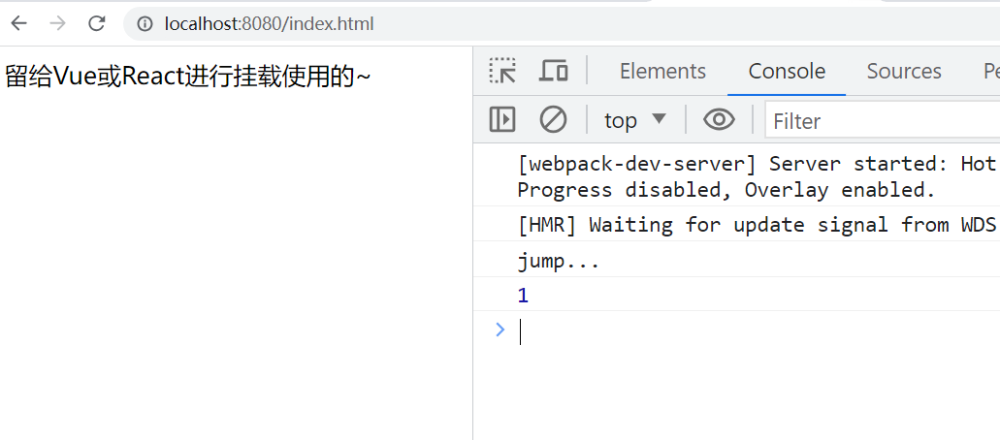
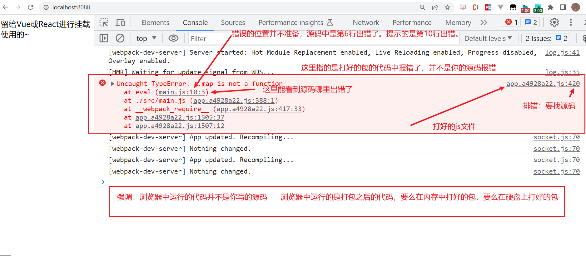
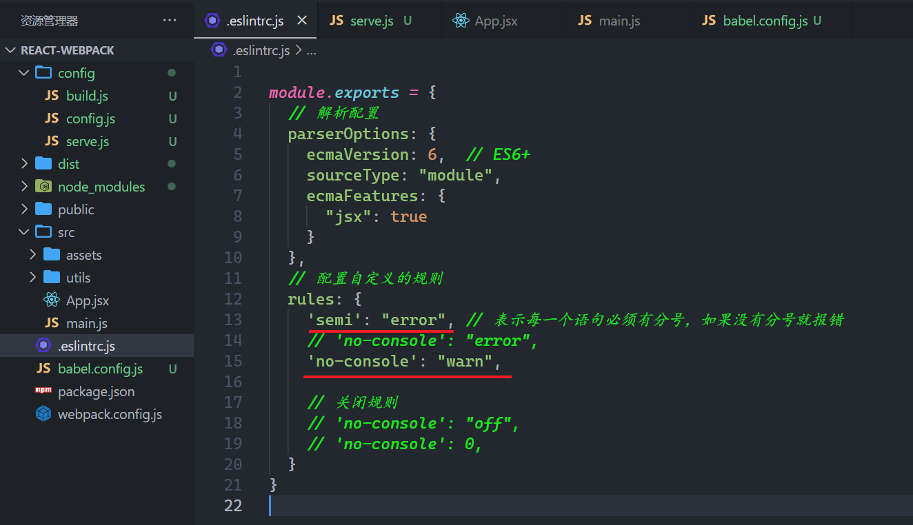

## 一. webpack5串讲


前面我们基于脚手架创建的项目，都是基于webpack。vue-element-admin也是基于webpack。学习webpack就是学习一堆的配置。


### 1，认识webpack

官网：https://webpack.js.org/

介绍：


我们之前写项目，使用的vue-element-admin也是基于webpack的，之前我们通过vue-cli创建的项目也是基于webpack的。今天我们需要自己去搭建开发环境，不使用官方提供的脚手架。

**总结：**

* webapck是一个构建工具，是基于node的，电脑上必须安装node，node版本需要大于16
* 打包器，是从入口开始，按照模块依赖进行打包，最终得到浏览器的可以识别的静态资源。
* 从某种程度来说，webpack代表的是一种架构能力。

### 2，搭建环境

创建一个文件夹，如下：


初始化一个配置文件，如下：


安装本次课程所需要的依赖，如下：


依赖如下：

```json
{
  "name": "react-webpack",
  "version": "1.0.0",
  "description": "",
  "main": "index.js",
  "scripts": {
    "test": "echo \"Error: no test specified\" && exit 1"
  },
  "keywords": [],
  "author": "",
  "license": "ISC",
  "devDependencies": {
    "@babel/core": "^7.22.1",
    "@babel/plugin-proposal-class-properties": "^7.18.6",
    "@babel/plugin-proposal-decorators": "^7.22.3",
    "@babel/preset-env": "^7.22.4",
    "@babel/preset-react": "^7.22.3",
    "babel-loader": "^9.1.2",
    "css-loader": "^6.8.1",
    "eslint": "^8.41.0",
    "eslint-config-airbnb": "^19.0.4",
    "eslint-plugin-import": "^2.27.5",
    "eslint-plugin-jsx-a11y": "^6.7.1",
    "eslint-plugin-react": "^7.32.2",
    "eslint-plugin-react-hooks": "^4.6.0",
    "eslint-webpack-plugin": "^4.0.1",
    "file-loader": "^6.2.0",
    "html-webpack-plugin": "^5.5.1",
    "mini-css-extract-plugin": "^2.7.6",
    "sass": "^1.62.1",
    "sass-loader": "^13.3.1",
    "style-loader": "^3.3.3",
    "url-loader": "^4.1.1",
    "vue-loader": "^15.8.0",
    "vue-style-loader": "^4.1.3",
    "vue-template-compiler": "^2.7.14",
    "webpack": "^5.84.1",
    "webpack-cli": "^5.1.1",
    "webpack-dev-server": "^4.15.0"
  },
  "dependencies": {
    "react": "^18.2.0",
    "react-dom": "^18.2.0",
    "vue": "^2.7.14",
    "vue-loader-plugin": "^1.3.0",
    "webpack-merge": "^5.9.0"
  }
}
```

安装之，如下：


现在，就安装webpack，webpack-cli。webpack是核心包，提供了很多的API，插件。后面我们要用到这些API和插件。webpack-cli提供了很多命令。

我们有两种安装方式，第一种，全局安装, (不推荐)，全局安装相当它把当成一个工具进行安装了。如下：

* cnpm i webpack -g   （不需要操作）
* cnpm i webpack-cli -g   （不需要操作）

第二种，就是在项目中安装（推荐，刚开始全局安装过了），如下：

* cnpm i webpack -D     // -D表示开发依赖  
* cnpm i webpack-cli -D

测试你的webpack是否安装成功，如下：


学习webpack，就是学习一堆的配置，这些配置你也不需要记，官方说，你要配置，需要在项目的根目录下面创建一个webpack.config.js文件，如下：


代码如下：

```js
module.exports = {
  // 入口
  entry: "./src/main.js",
  // 出口
  output: {}
}

```


开始打包，如下：


看一下，打包后文件，如下：


现在指定mode，如下：


再次打包，如下：


再次看一下打包后的文件，如下：


需要webpack.config.js文件名变了，打包时，需要手动指定，如下：


还可以配置一个脚本，如下：


运行脚本，如下：

```js
cnpm run build
npm run build
```

需要通过yarn，是不需要run，直接yarn build就OK。

### 3，入口和出口

入口有三种写法，上面的是第一种写法，使用的是相对路径，也可以使用绝对路径，如下：


入口还可以写成对象的形式，如下：


配置代码如下：

```js
const path = require("path")

module.exports = {
  mode: "development", // 开发打包
  // 入口
  // entry: "./src/main.js",
  // entry: path.resolve(__dirname, "src/main.js"),  // 绝对路径
  entry: {
    // app表示你打包后的资源名字就是app
    app1: path.resolve(__dirname, "src/main.js"),  // 绝对路径
  },
  // 出口
  output: {}
}

```


看一上vue打包后资源如下：


然后指定出口，如下：


测试如下：


出口必须指定绝地路径，如下：


最好还是叫dist，有的地方，叫build，我们就叫dist。也可以在出口中指定打包后的文件叫什么，如下：


说一下单词，如下：


filename可以指定一个格式化字符串，可以指定hash值，如下：


说白了，输入的JS模块所依赖的源码发生了变化，打包时，hash值也会发生变化，用于解决浏览器缓存导致页面不刷新的问题。

能不能把打后的js文件，放到js文件夹下面的，可以的，如下：


配置代码：

```js
const path = require("path")

module.exports = {
  mode: "development", // 开发打包
  // 入口
  // entry: "./src/main.js",
  // entry: path.resolve(__dirname, "src/main.js"),  // 绝对路径
  entry: {
    // app表示你打包后的资源名字就是app
    app: path.resolve(__dirname, "src/main.js"),  // 绝对路径
  },
  // 出口
  output: {
    path: path.resolve(__dirname, "dist"),  // 绝对路径
    // filename:"bundle.js"  // 一捆  一束
    filename: "js/[name].[chunkhash:8].js"  // 一捆  一束
  }
}
```


### 4，配置开发服务器

前面打包是把包打包到硬盘上的。在开发时，需要配置一个开发服务器，这个开发服务器可以直接让我们在内存中打包，速度是远远高于硬盘的。我们之前用的脚手架，都是在内存中打开。

安装一个开发服务器，叫webpack-dev-server，如下：


安装之，如下：


配置之，如下：


之前打包是使用webpack进行打包的，直接是在硬盘上的打包，现在我们需要使用内存打，如下：


访问之，如下：


可以配置一个脚本，如下 ：


执行脚本，如下：


### 5，创建页面，把打包后的js插入页面

创建一个页面，如下：


我们在内存中打包，如下：


访问之，如下：


你要知道，你刚才是内存打包，在内存是有打包后的js文件的，能不能把打包的的js插入到上面的页面中呢？看一下，如下 ：


结论，并没有把打包后的js文件，插入到页面中，那个我们就使用一个插件，叫html-webpack-plugin，如下：


之前已经安装完了。

使用之，如下：


再次在内存中打包，如下：


测试之，如下：


在硬盘上打包试一下，如下：


配置代码：

```js
const path = require("path")
const HtmlWebpackPlugin = require("html-webpack-plugin")

module.exports = {
  mode: "development", // 开发打包
  // 入口
  // entry: "./src/main.js",
  // entry: path.resolve(__dirname, "src/main.js"),  // 绝对路径
  entry: {
    // app表示你打包后的资源名字就是app
    app: path.resolve(__dirname, "src/main.js"),  // 绝对路径
  },
  // 出口
  output: {
    path: path.resolve(__dirname, "dist"),  // 绝对路径
    // filename:"bundle.js"  // 一捆  一束
    filename: "js/[name].[chunkhash:8].js"  // 一捆  一束
  },
  // 配置开发服务器
  devServer: {
    port: 8080
  },
  plugins: [
    new HtmlWebpackPlugin({
      template: "./public/index.html"
    })
  ]
}
```


再一下vue脚手架，如下：


### 6，区分硬盘打包和内存打包

打包分两种，一种是开发时的打包，一种是生产时的打包。不同的打包方式，是有不同的配置的，现在有两种打包方式，也就是说有两种配置，但是这两种配置中有一些公共的配置，把这些配置区分出来，创建如下的文件，如下：


先写公共的配置，如下：


开发配置，如下：


生产配置，如下：


在webpack.config.js中使用之，如下：


配置脚本，如下：


在webpack.config.js中就可以得到env，如下：


简写如下：


不能使用原生js合并，需要使用来合并，如下：


使用之，如下：


测试之，如下：


### 7，html-webpack-plugin

之前，在硬盘上打包，都会生成dist，下一次打包还会生成dist，但是之前dist下面的文件并不会自动删除，如果你想每一次打包都删除上次dist下面的文件，配置如下：


注意一点：如果源码没有变，打包后的app.xxxxxx.js也不会变，只有源码变了，才会生成新的文件。

接下来，讲webpack-html-plugin这个插件。看官网：


上午我们已经安装这了，并使用了。如下：


上面配置了template，是用来指定页面的位置，可以使用绝对路径，如下：


默认它把打包后js插入到了head标签中，打包查看如下：


配置把js文件插入到body结束标签之前，如下：


测试如下：


还可以做一些基本的配置，如下：


还需要在页面中title标签位置写如下代码：


重新打包，测试如下：


还可以配置一个小icon，制作一个icon，如下：


重新打包，测试之，如下：


### 8，ProgressPlugin

是webpack内置的插件，如下：


使用之，如下：


再次打包，如下：


配置hander，如下：


### 9，babel

在入口中写一点ES6+的代码如下：


打包，测试浏览器能不能识别，如下：


发现，谷歌浏览器可以识别。但是有的浏览器是不认识的。再一个更新的语法，如下：


在内存中打包，如果源码变了，会自动重新打包，如下：


也就是说，webapck对于ES6+中的一些语法，它也不能直接转化成ES5，不能转化成ES5，浏览器对ES5的兼容性是最好，我们需要使用loader，loader就是把webpack不能识别的模块，转化成webpack可以识别的模块。如下：


JS模块中有高级语法，高级语法，如何转化成低级语法，让webpack识别呢？

答：最最最最最厉害的就是babel。

要使用babel，就需要安装babel，如下：


安装之，如下：


配置配置，如下：


再次打包，如下：


ES6中的语法，非常多，你要转化语法，需要安装对应插件，如你要把箭头函数转化成普通函数，那你就需要安装一个箭头函数转普通函数的插件，如你要把let转化成var，你需要安装一把let转成var的插件。也就说如果项目中用到了非常多的ES6语法，都需要转化，那就可以安装500个插件，babel给我们封装了很多预设，预设是插件集合，也就是集合中包含了很多的插件，如有一个预设，它可以把ES6中的大部分语法，转化成ES5，这个预设叫@babel/preset-env。预设并不是转化所有语法，仅仅是大部分的，个别语法转化不了，需要单独安装插件。我们先去安装 预设，如下：


然后需要配置，如下：


再次打包，如下：


说明，你上面使用的预设不能打包装饰器，需要单独去安装对应的插件（打补丁），如下：


安装如下：


配置如下：


安装完后，打包如下：




后面我们需要学习一堆的loader，去转化不同的模块(使用loader来处理)。

* .js    
* .vue    vue-loader
* .jsx
* .ts
* .png
* .less
* .sass
* .css
* .json
* .....

后面我们也需要学习一堆的插件，插件是用来增强webpack。

### 10，打包JSX模块

react也是一个模块，如下：


看一下版本，如下 ：


安装之，还需要安装一个react-dom模块，如下：


创建一个App.jsx组件，如下：


在main.js中引入，并渲染，如下：


打包main.js，你要知道，main.js中引入了一个jsx模块，如下：


说明，webpack，默认情况下是不能处理jsx文件的，此时，就需要使用babel进行编译，说到babel就要想到预设和插件，此时，jsx就需要一个预设来处理，如下：


安装预设，如下：


进行配置，如下：


再进行打包，如下：


还需要配置一个loder，如下：


再次打包，如下：


重新查看访问之，如下：


到此，打包jsx（react中的组件）就OK了，你可以尝试打包一下vue文件，你就创建一个App.vue，尝试打包，100%打包不成功。因为webpack压根不认识.vue文件，你需要安装对应的loader和预设，使用loader加载你的.vue文件，使用预设去翻译你的vue代码。

### 11，配置source-map

先看一个问题，代码如下：


看一下控制台，如下：



如果想让代码的报错位置正确，需要配置一个devtool，如下：


不同的配置代表的含义是不一样的。配置如下：


此时报错的位置和控制台中就保持一样的了，如下：


在生产中，可以不去配置source-map，上线的也是打包后的代码，可以不配置，也可以配置 ：


在硬盘上打包，如下：


### 12，ProvidePlugin

分析：


如何把某些包放到全局中，此时需要使用ProvidePlugin，如下：


配置之，如下：


动了配置文件，需要重新打包，再去访问之，如下：


打包时，我们不希望webpack去打包node_module，配置如下：


### 13，把第三方包抽离出来

现在尝试去打包，如下：


分析之，如下：


你可以看一下，你之前，打包vue，生成的js文件，如下：


现在就需要把第三方包抽离出来，如下：


再次打包如下：


### 14，打包css和sass

写一点样式，如下：


在入口文件中，引入css文件，如下：


 不用想，webpack肯定不能加载css文件，肯定是需要一个loader进行加载的，测试如下：


此时，就需要安装对应的loader，如下：


对css模块处理，需要安装两个laoder，如下：


开始配置，如下：


看浏览器控制台：


在生产打包时，需要把css抽离出来，此时我们需要用到一个插件，这个插件中带了一个loader，安装一下：


之前安装过了，如下：


配置如下：


打包如下：


在内存中打包如下：


测试如下：


现在希望把打包后的样式放到css文件夹，并且加上hash值，解决缓存问题，如下：


打包如下：


测试如下 ：


也就是说，在开发时，样式，采用的是内部样式，在上线时，样式采用的是外部样式。

然后打包scss，创建scss文件，如下 ：


在入口文件中，引入，如下：


尝试打包，如下：


此时，就需要使用sass-loader来加载编译scss代码，安装如下：


配置如下：


看一下，是否可以处理scss代码，浏览器测试之，如下：


同理，如果是less也是一样的，需要使用less-loader来处理。

### 15，打包图片   

在webpack眼中，一切都是模块，图片当然也是模块。准备一张图片，如下：


在App组件中，使用图片，如下：


测试如下：


在webpack4中，有两个laoder可以处理，在wabpack5中这两个laoder就淘汰了，这两个laoder如下：

* url-loader
* file-loader

我们还是简单去演示一下，如何使用，安装之如下：


配置如下：


测试如下 ：


在硬盘上打包如下：


生成的文件如下：


使用url-loader再测试一下，url-loader比file-loader更强大，如下 ：


打包如下：


在内存上测试如下：


当时，url-loader也可以配置，配置成是事要打包成字符串。这个自行学习。参考代码如下：

```js
 {
     test: /\.(png|jpg|svg|gif|jpeg|webp)$/,
     use: [{
         loader: 'url-loader',
         options: {
             // limit单位是字节    1个字节 = 8位
             //                  1KB = 1024个字节
             //                  1MB = 1024KB
             limit: 1024 * 50, // 如果图片小于50kb，打包字符串，如果图片大于50kb，打包成图片
             name: 'img/[name].[hash:8].[ext]'
         }
     }]
 },
```

在webpack5中上面的两个laoder就淘汰了，对于图片的处理，webpack都内置好了，处理如下：


打包如下 ：


可以进一步优化如下：


打包完，测试后，如下：


### 16，ESLint

eslint是用来进行代码检测。也非常重要，在很多公司，都是要求使用eslint的，如果代码写的不符合要求，有可能代码就提交到不到仓库。在很早之前，有一个laoder，叫eslint-loader来校验代码，现在这个laoder已经淘汰了。现在使用的是一个插件，如下：


安装之，如下:


还需要安装eslint，eslint里面包含了很多的校验规则，安装如下：


这个插件不能进行校验，这个插件是把eslint集成到webpack中的。代码校验是在开发时进行校验的，配置就需要配置到开发环境中，如下：


尝试打包一下，如下 ：


在浏览器中看效果如下：


上面的插件仅仅是把eslint集成到webpack中，对于eslint的配置文件，还需要单独配置，打开eslint的官网，如下：


创建eslint的配置文件，有多种方式，创建一个eslint的配置文件, 如下：


只要动了配置文件，都需要重启开发服务器，如下：


测试如下：


尝试添加一些规则，如下：


看浏览器，如下：


修改之如下：


再次测试之，如下：


注释掉刚才的规则，如下：


现在尝试不加分号，如下：


动了配置文件，需要重启服务器，测试如下 ：


eslint中都有哪些规则呢？如下：

https://blog.csdn.net/qq_51657072/article/details/124427270

再尝试使用一个，如下：


现在在代码中就写一个console，如下：


重启服务器，测试如下：


修改之，如下：


测试如下：


还需要知道，在控制台中也会给出提示，如下：


可以关闭规则，如下：


如果是警告提示，不弹出模态框，如下：


配置如下：


规则如下 ：



重启，测试如下：


对于react代码中的jsx的校验，eslint规则并不完善，有一个公司，推出一个校验包，叫eslint-config-arbnb，如下：


直接下载eslint-config-airbnb不好下载，需要把它内置的其它都下载下来，如下：


之前都下载完了，如下：


集成airbnb对react代码的检测，如下：


使用React写一个计数器，如下：


此时，再打包，会报大量的错误，如下：


如果不想让eslint检测我们的src下面所有的代码，可以创建一个.eslintignore的配置文件，如下：


在eslint中提供了一些注释，可以忽略对某一行或某一片代码的查检，如下：


遇到了错误，怎么办？


总结解决eslint报错的方式：

1. 创建一个eslint的配置文件，修改rules，rules是自定义规则。
2. 使用eslint注释，非常多，临时地忽略检测
3. 在项目的根目录下面创建一个.eslintignore的文件，里面写src/*，可以忽略对src下面的所有的文件的检测
4. 老老实实找到错误的位置，把代码写规范了，前提是需要熟悉公司中使用了哪些规则

最后说一下，对于ES6中新的语法检测，还有一个包，叫@babel/eslint-parser。需要安装：


配置如下：


### 17，使用vue脚手架中的eslint

创建vue脚手架创建项目，如下：


弹出vue脚手架中webpack的配置，如下：


### 18，配置路径相关

配置如下：


使用之，如下：


效果如下：


### 19，搭建Vue的开发环境

参考地址：https://blog.csdn.net/qq_40412456/article/details/122334286

创建App.vue组件，如下：


在main.js中引入Vue，渲染Vue组件，如下：


尝试打包，如下：


安装依赖：


这些依赖之前都安装好，如下：


配置如下：


尝试打包，如下：


### 20，打包less

自行研究

### 21，打包字体图标

自行研究

### 22，打包主流程


Webpack **首先**需要根据输入配置(`entry/context`) 找到项目入口文件；**之后**根据按模块处理(`module/resolve/externals` 等) 所配置的规则逐一处理模块文件，处理过程包括转译、依赖分析等；模块处理完毕后，最后**再根据**后处理相关配置项(`optimization/target` 等)合并模块资源、注入运行时依赖、优化产物结构等。


输入：

- 从文件系统读入代码文件；

模块递归处理：

- 调用 Loader 转译 Module 内容，并将结果转换为 AST，从中分析出模块依赖关系，进一步递归调用模块处理过程，直到所有依赖文件都处理完毕；

后处理：

- 所有模块递归处理完毕后开始执行后处理，包括模块合并、注入运行时、产物优化等，最终输出 Chunk 集合；

输出：

- 将 Chunk 写出到外部文件系统；


### 23，配置分类


从上述打包流程角度，Webpack 配置项大体上可分为两类：

- 流程类：作用于打包流程某个或若干个环节，直接影响编译打包效果的配置项
- 工具类：打包主流程之外，提供更多工程化工具的配置项


### 24，主流程类配置


流程类的配置：

- 输入输出
  - `entry`：用于定义项目入口文件，Webpack 会从这些入口文件开始按图索骥找出所有项目文件；
  - `output`：配置产物输出路径、名称等；
  - `context`：项目执行上下文路径；
- 模块处理：
  - `resolve`：用于配置模块路径解析规则，可用于帮助 Webpack 更精确、高效地找到指定模块
  - `module`：用于配置模块加载规则，例如针对什么类型的资源需要使用哪些 Loader 进行处理
  - `externals`：用于声明外部资源，Webpack 会直接忽略这部分资源，跳过这些资源的解析、打包操作
- 后处理
  - `mode`：编译模式短语，支持 `development`、`production` 等值，可以理解为一种声明环境的短语
  - `target`：用于配置编译产物的目标运行环境，支持 web、node、electron 等值，不同值最终产物会有所差异
  - `optimization`：用于控制如何优化产物包体积，内置 Dead Code Elimination、Scope Hoisting、代码混淆、代码压缩等功能


### 25，工具类配置


工具类的配置（除了核心的打包功能之外，Webpack 还提供了一系列用于提升研发效率的工具）。提升开发效率的配置：

- `devServer`：用于配置与 HMR 强相关的开发服务器功能
- `devtool`：用于配置产物 Sourcemap 生成规则
- `watch`：用于配置持续监听文件变化，持续构建


性能优化化的配置：

- `cache`：Webpack 5 之后，该项用于控制如何缓存编译过程信息与编译结果
- `performance`：用于配置当产物大小超过阈值时，如何通知开发者


日志类的配置：

- `stats`：用于精确地控制编译过程的日志内容，在做比较细致的性能调试时非常有用
- `infrastructureLogging`：用于控制日志输出方式，例如可以通过该配置将日志输出到磁盘文件


Webpack 提供了上百项复杂配置，但大体上都可以归类为流程类配置或工具类配置，对于流程类配置应该多关注它们对编译主流程的影响；而工具类则更加内聚，基本上一种配置项解决一种工程化问题。


