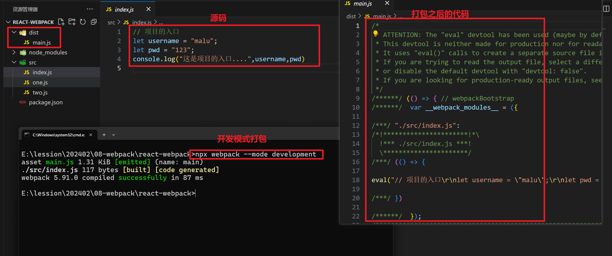
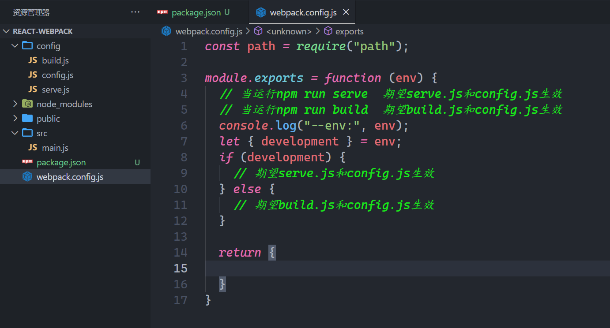
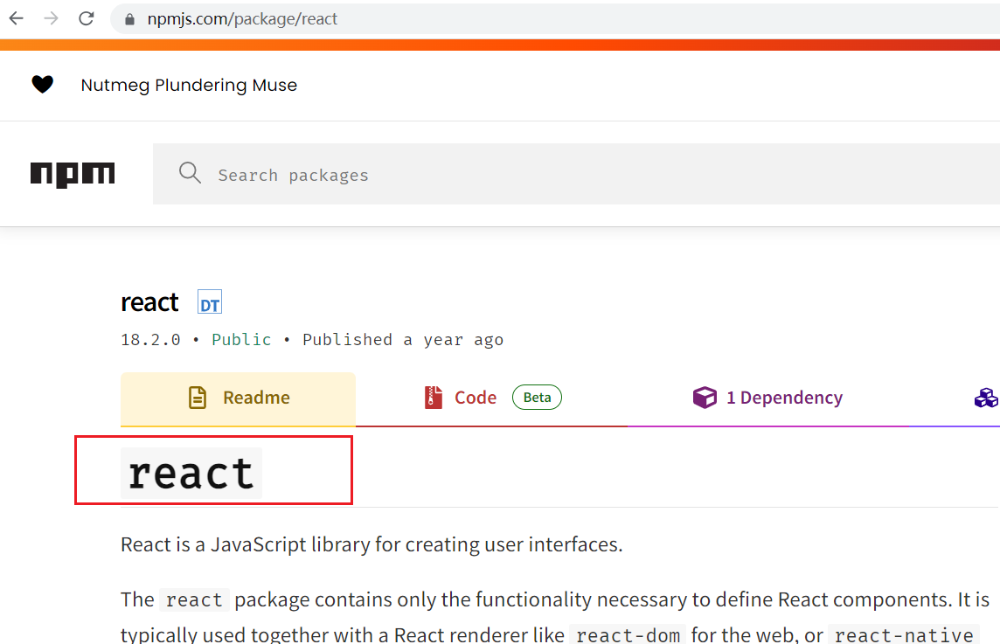
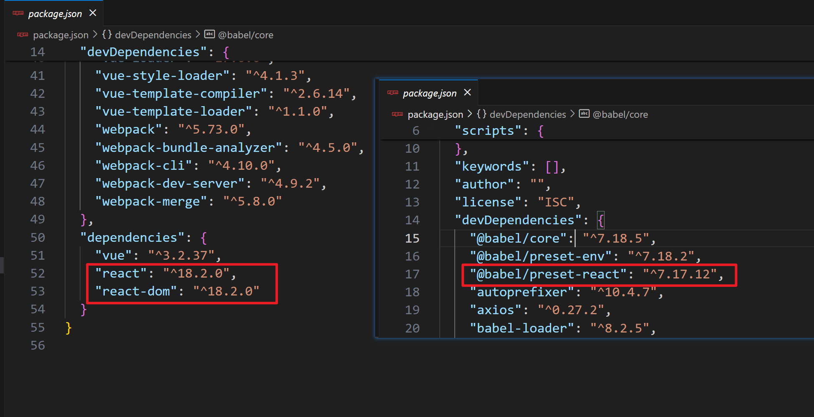
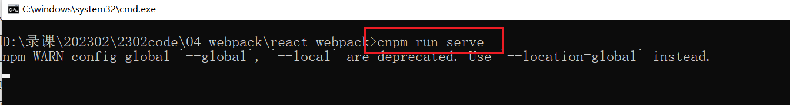

## 一. webpack5串讲


### 1，认识webpack

- 官网：https://webpack.js.org/

- 中文网站：https://www.webpackjs.com/ 或者 https://webpack.docschina.org/guides/


​	**webpack** 是一个用于现代 JavaScript 应用程序的 **打包工具**。当 webpack 处理应用程序时，它会在内部从一个或多个入口点构建一个依赖图，然后将项目中所需的每一个模块组合成一个或多个 bundles，它们均为静态资源，可以在浏览器上直接运行。在 webpack 看来, 前端的所有资源文件（js、json、css、img 、html...）都会作为模块处理。


​	我们思考一个问题：当前端项目越来越大的时候，我们还能按照以往的思维方式继续开发么问题症结所在：文件管理、ES6代码的转换、项目的打包...

- 解决方案：前端工程化(Webpack)，在企业级的前端项目开发中，把前端开发所需的工具、技术、
  流程、经验等进行规范化、标准化


例如砌一堵墙：怎么简单怎么来，只要材料准备齐全，一个人直接干就行。盖一栋楼：需要很多大型机器，也需要更多的人，重要的必须要规范化干活，避免发生危险


​	本质上，webpack 是一个用于现代 JavaScript 应用程序的 静态模块打包工具。当 webpack 处理应用程序时，它会在内部从一个或多个入口点构建一个依赖图，然后将你项目中所需的每一个模块组合成一个或多个 bundles，它们均为静态资源，用于展示你的内容

介绍：


我们之前写项目，使用的vue-element-admin也是基于webpack的，之前我们通过vue-cli创建的项目也是基于webpack的。今天我们需要自己去搭建开发环境，不使用官方提供的脚手架。

**总结：**

* webapck是一个构建工具，是基于node的，电脑上必须安装node，node版本需要大于16
* 打包器，是从入口开始，按照模块依赖进行打包，最终得到浏览器的可以识别的静态资源。
* 从某种程度来说，webpack代表的是一种架构能力。

### 2，搭建环境

创建一个文件夹，如下：


初始化一个配置文件，如下：


安装本次课程所需要的依赖，如下：


依赖如下：

```json
{
  "name": "react-webpack",
  "version": "1.0.0",
  "description": "",
  "main": "index.js",
  "scripts": {
    "test": "echo \"Error: no test specified\" && exit 1"
  },
  "keywords": [],
  "author": "",
  "license": "ISC",
  "devDependencies": {
    "@babel/core": "^7.18.5",
    "@babel/preset-env": "^7.18.2",
    "@babel/preset-react": "^7.17.12",
    "autoprefixer": "^10.4.7",
    "axios": "^0.27.2",
    "babel-loader": "^8.2.5",
    "clean-webpack-plugin": "^3.0.0",
    "css-loader": "^6.7.1",
    "eslint": "^8.18.0",
    "eslint-config-airbnb-base": "^15.0.0",
    "eslint-plugin-import": "^2.26.0",
    "eslint-webpack-plugin": "^3.1.1",
    "file-loader": "^6.2.0",
    "html-webpack-plugin": "^5.5.0",
    "less": "^4.1.3",
    "less-loader": "^11.0.0",
    "mini-css-extract-plugin": "^2.6.1",
    "optimize-css-assets-webpack-plugin": "^6.0.1",
    "postcss": "^8.4.14",
    "postcss-loader": "^7.0.0",
    "postcss-preset-env": "^7.7.1",
    "sass": "^1.52.3",
    "sass-loader": "^13.0.0",
    "style-loader": "^3.3.1",
    "url-loader": "^4.1.1",
    "vue-loader": "^17.0.0",
    "vue-style-loader": "^4.1.3",
    "vue-template-compiler": "^2.6.14",
    "vue-template-loader": "^1.1.0",
    "webpack": "^5.73.0",
    "webpack-bundle-analyzer": "^4.5.0",
    "webpack-cli": "^4.10.0",
    "webpack-dev-server": "^4.9.2",
    "webpack-merge": "^5.8.0"
  },
  "dependencies": {
    "vue": "^3.2.37",
    "react": "^18.2.0",
    "react-dom": "^18.2.0"
  }
}
```

安装之，如下：


现在，就安装webpack，webpack-cli。webpack是核心包，提供了很多的API，插件。后面我们要用到这些API和插件。webpack-cli提供了很多命令。

-  webpack 是核心内容，webpack-cli 是在运行 webpack命令时，所依赖的一个工具。
- webpack版本是5.x版本
- 本地安装的话，使用 npx 可以执行安装在本地的命令行可执行命令。


我们有两种安装方式，第一种，全局安装, (不推荐)，全局安装相当它把当成一个工具进行安装了。如下：

* cnpm i webpack -g   （不需要操作）  

* cnpm i webpack-cli -g   （不需要操作）

  

第二种，就是在项目中安装（推荐），如下：

* cnpm i webpack -D      // -D表示开发依赖  
* cnpm i webpack-cli -D

测试你的webpack是否安装成功，如下：


零配置打包，命令如下：

```
# 将 src/index.js 打包至 dist/main.js  模式默认值：production
npx webpack

# 将 src/index.js 打包至 dist/main.js  模式指定为：development
npx webpack --mode development

# 将 src/one.js 打包至 dist/main.js
npx webpack ./src/one.js --mode development

# 将 src/one.js、two.js 打包至 dist/main.js
npx webpack ./src/one.js ./src/two.js --mode development

# 将 src/one.js 打包至 build/main.js
npx webpack ./src/one.js --output-path build --mode development

# 将 src/two.js 打包至 dist/index.js 
npx webpack ./src/two.js --output-filename index.js --mode development

# 将 src/one.js 和 src/two.js 打包至 build/index.js 
npx webpack ./src/one.js ./src/two.js --output-path build --output-filename index.js --mode development
```


打包模式：

- 开发模式  development
  - 开发模式顾名思义就是我们开发代码时使用的模式。这个模式下我们主要做两件事：
    - 编译代码，使浏览器能识别运行，开发时我们有样式资源、字体图标、图片资源、html 资源等，webpack 默认都不能处理这些资源，所以我们要加载配置来编译这些资源。
    - 代码质量检查，树立代码规范，提前检查代码的一些隐患，让代码运行时能更加健壮。提前检查代码规范和格式，统一团队编码风格，让代码更优雅美观。
- 生产模式  production
  - 生产模式是开发完成代码后，我们需要得到代码将来部署上线。这个模式下我们主要对代码进行优化，让其运行性能更好。优化主要从两个角度出发:
    - 优化代码运行性能
    - 优化代码打包速度


创建src目录，在src目录下面创建index.js文件，这个文件表示项目的入口，再创建一些其它模块，如下：


开始打包：


指定模式打包，如下：




指定入口文件：


webpack的五大核心概念：

- Entry： 指示 webpack 从哪个文件开始打包 。
- Output： 指示 webpack 打包完的文件输出到哪里去，如何命名等 。
- Loader： webpack 本身只能处理 js、json 等资源，其他资源需要借助 loader，Webpack 才能解析 。
- Plugins： 扩展 webpack 的功能 ，如打包优化、压缩等。
- Mode：模式，有生产模式 production 和开发模式 development 两种。


学习webpack，就是学习一堆的配置，这些配置你也不需要记，官方说，你要配置，需要在项目的根目录下面创建一个webpack.config.js文件，如下：


代码如下：

```js
module.exports = {
  // 入口
  entry: "./src/main.js",
  // 出口
  output: {}
}

```


开始打包，如下：


看一下，打包后文件，如下：


现在指定mode，如下：


再次打包，如下：


再次看一下打包后的文件，如下：


需要webpack.config.js文件名变了，打包时，需要手动指定，如下：


还可以配置一个脚本，如下：


运行脚本，如下：

```js
cnpm run dev
npm run dev
```

需要通过yarn，是不需要run，直接yarn build就OK。


目前在我们的配置如下：


### 3，入口和出口

补充一个知识点，如下：


入口有三种写法，上面的是第一种写法，使用的是相对路径，也可以使用绝对路径，如下：


入口还可以写成对象的形式，如下：


配置代码如下：

```js
const path = require("path")

module.exports = {
  mode: "development", // 开发打包
  // 入口
  // entry: "./src/main.js",
  // entry: path.resolve(__dirname, "src/main.js"),  // 绝对路径
  entry: {
    // app表示你打包后的资源名字就是app
    app1: path.resolve(__dirname, "src/main.js"),  // 绝对路径
  },
  // 出口
  output: {}
}

```


看一上vue打包后资源如下：


然后指定出口，如下：


测试如下：


出口必须指定绝地路径，如下：


最好还是叫dist，有的地方，叫build，我们就叫dist。也可以在出口中指定打包后的文件叫什么，如下：


说一下单词，如下：


filename可以指定一个格式化字符串，可以指定hash值，如下：


说白了，输入的JS模块所依赖的源码发生了变化，打包时，hash值也会发生变化，用于解决浏览器缓存导致页面不刷新的问题。

能不能把打后的js文件，放到js文件夹下面的，可以的，如下：


配置代码：

```js
const path = require("path")

module.exports = {
  mode: "development", // 开发打包
  // 入口
  // entry: "./src/main.js",
  // entry: path.resolve(__dirname, "src/main.js"),  // 绝对路径
  entry: {
    // app表示你打包后的资源名字就是app
    app: path.resolve(__dirname, "src/main.js"),  // 绝对路径
  },
  // 出口
  output: {
    path: path.resolve(__dirname, "dist"),  // 绝对路径
    // filename:"bundle.js"  // 一捆  一束
    filename: "js/[name].[chunkhash:8].js"  // 一捆  一束
  }
}
```


### 4，配置开发服务器

到目前为止 webpack 基本上可以正常使用了，但在实际开发中你可能会需要：

- 提供 HTTP 服务而不是使用本地文件预览；
- 监听文件的变化并自动刷新网页，做到实时预览；
- 支持 Source Map，以方便调试。


前面打包是把包打包到硬盘上的。在开发时，需要配置一个开发服务器，这个开发服务器可以直接让我们在内存中打包，速度是远远高于硬盘的。我们之前用的脚手架，都是在内存中打开。

安装一个开发服务器，叫webpack-dev-server，如下：


安装之，如下：


配置之，如下：


之前打包是使用webpack进行打包的，直接是在硬盘上的打包，现在我们需要使用内存打，如下：


访问之，如下：


可以配置一个脚本，如下 ：


执行脚本，如下：


### 5，创建页面，把打包后的js插入页面

创建一个页面，如下：


我们在内存中打包，如下：


访问之，如下：


你要知道，你刚才是内存打包，在内存是有打包后的js文件的，能不能把打包的的js插入到上面的页面中呢？看一下，如下 ：


结论，并没有把打包后的js文件，插入到页面中，那个我们就使用一个插件，叫html-webpack-plugin，如下：


之前已经安装完了。

使用之，如下：


再次在内存中打包，如下：


测试之，如下：


在硬盘上打包试一下，如下：


配置代码：

```js
const path = require("path")
const HtmlWebpackPlugin = require("html-webpack-plugin")

module.exports = {
  mode: "development", // 开发打包
  // 入口
  // entry: "./src/main.js",
  // entry: path.resolve(__dirname, "src/main.js"),  // 绝对路径
  entry: {
    // app表示你打包后的资源名字就是app
    app: path.resolve(__dirname, "src/main.js"),  // 绝对路径
  },
  // 出口
  output: {
    path: path.resolve(__dirname, "dist"),  // 绝对路径
    // filename:"bundle.js"  // 一捆  一束
    filename: "js/[name].[chunkhash:8].js"  // 一捆  一束
  },
  // 配置开发服务器
  devServer: {
    port: 8080
  },
  plugins: [
    new HtmlWebpackPlugin({
      template: "./public/index.html"
    })
  ]
}
```


再一下vue脚手架，如下：


回顾一下，上午用到的依赖：

```
"webpack": "^5.73.0",
"webpack-cli": "^4.10.0",

"webpack-dev-server": "^4.9.2",

"html-webpack-plugin": "^5.5.0",
```


### 6，区分硬盘打包和内存打包


在开发的过程中，我们一般会将开发环境进行区分：

- 开发环境
- 测试环境
- 生产环境
- .....


开发模式和生产模式：

- 开发模式是为开发者更方便开发而存在的，在开发模式下，一般是为了更方便的调试，所以错误信息会提示很全面，并且存在热更新状态等
- 生产模式是为了项目打包上线而存在的，在生产模式下，会去掉更多的错误提示，让想打包尽可能变小等


在 webpack 中，我们可以区分开发模式和生产模式，例如 mode 就有development 和 production 的区别


打包分两种，一种是开发时的打包，一种是生产时的打包。不同的打包方式，是有不同的配置的，现在有两种打包方式，也就是说有两种配置，但是这两种配置中有一些公共的配置，把这些配置区分出来，创建如下的文件，如下：


先写公共的配置，如下：


开发配置，如下：


生产配置，如下：


在webpack.config.js中使用之，如下：


配置脚本，如下：


在webpack.config.js中就可以得到env，如下：




简写如下：


不能使用原生js合并，需要使用来合并，如下：


使用之，如下：


测试之，如下：


### 7，html-webpack-plugin

之前，在硬盘上打包，都会生成dist，下一次打包还会生成dist，但是之前dist下面的文件并不会自动删除，如果你想每一次打包都删除上次dist下面的文件，配置如下：


注意一点：如果源码没有变，打包后的app.xxxxxx.js也不会变，只有源码变了，才会生成新的文件。

接下来，讲webpack-html-plugin这个插件。看官网：


上午我们已经安装这了，并使用了。如下：


上面配置了template，是用来指定页面的位置，可以使用绝对路径，如下：


默认它把打包后js插入到了head标签中，打包查看如下：


配置把js文件插入到body结束标签之前，如下：


测试如下：


还可以做一些基本的配置，如下：


还需要在页面中title标签位置写如下代码：


重新打包，测试如下：


还可以配置一个小icon，制作一个icon，如下：


重新打包，测试之，如下：


### 8，ProgressPlugin

是webpack内置的插件，如下：


使用之，如下：


再次打包，如下：


配置hander，如下：


### 9，babel

在入口中写一点ES6+的代码如下：


打包，测试浏览器能不能识别，如下：


webpack眼中一切都是模块，默认情况下，只能理解js文件和json文件，这是webpack自带的能力，其它模块，webpack默认就不能处理了。loader 能让 webpack 能够去处理其他类型的文件（比如css类型文件，图片类型等），并将它们转换为有效模块。所以说要学习很多loader

- less-loader   把less翻译成css  
- css-loader  把css代码转换为有效模块，让webpack处理
- sass-loader 把sass翻译成css 
- babel-loader  可以把js模块进行加载，加载后，让一些插件来翻译语法。如：箭头函数==>普通函数，let==>var。只有babel-loader还不行，还需要学习很多插件。ES6+它里面的语法非常多，意味着翻译语法的插件非常多。有一个概念，叫预设，预设是插件的集合。


发现，谷歌浏览器可以识别。但是有的浏览器是不认识的。也就是说，webapck对于ES6+中的一些语法，它也不能直接转化成ES5，不能转化成ES5，浏览器对ES5的兼容性是最好，我们需要使用loader，loader就是把webpack不能识别的模块，转化成webpack可以识别的模块。如下：


JS模块中有高级语法，高级语法，如何转化成低级语法，让webpack识别呢？

答：最最最最最厉害的就是babel。

要使用babel，就需要安装babel，如下：


安装之，如下：


配置配置，如下：


再次打包，如下：


ES6中的语法，非常多，你要转化语法，需要安装对应插件，如你要把箭头函数转化成普通函数，那你就需要安装一个箭头函数转普通函数的插件，如你要把let转化成var，你需要安装一把let转成var的插件。也就说如果项目中用到了非常多的ES6语法，都需要转化，那就可以安装500个插件，babel给我们封装了很多预设，预设是插件集合，也就是集合中包含了很多的插件，如有一个预设，它可以把ES6中的大部分语法，转化成ES5，这个预设叫@babel/preset-env。预设并不是转化所有语法，仅仅是大部分的，个别语法转化不了，需要单独安装插件。我们先去安装 预设，如下：


然后需要配置，如下：


```js
module.exports = {
    presets:[
        ['@babel/preset-env']
    ],
    plugins:[

    ]
}
```

再次打包，如下：


说明，你上面使用的预设不能打包装饰器，需要单独去安装对应的插件（打补丁），如下：


后面我们需要学习一堆的loader，去转化不同的模块(使用loader来处理)。

* .js    
* .vue    vue-loader
* .jsx
* .ts
* .png
* .less
* .sass
* .css
* .json
* .....

后面我们也需要学习一堆的插件，插件是用来增强webpack。

### 10，打包JSX模块

目前React和Vue两个最常用的前端框架都是使用Webpack进行构建项目。接下来，我们用 webpack 构架一个React项目的环境。需要安装的依赖： 

```
"@babel/preset-react": "^7.17.12",
"react": "^18.2.0",
"react-dom": "^18.2.0"
```


react也是一个模块，如下：



看一下版本，如下 ：


安装之，还需要安装一个react-dom模块和react预设，如下：




创建一个App.jsx组件，如下：


```jsx
import React from "react";

class App extends React.Component{
    render() {
        return (
            <div>
                <h1>Hello React~</h1>
            </div>
        );
    }
}

export default App;
```


在main.js中引入，并渲染，如下：


```js
import ReactDOM from "react-dom/client"
import React from "react"
import App from "./App.jsx"

const root = ReactDOM.createRoot(document.getElementById("app"))
root.render(<App/>)
```


打包main.js，你要知道，main.js中引入了一个jsx模块，如下：


说明，webpack，默认情况下是不能处理jsx文件的，此时，就需要使用babel进行编译，说到babel就要想到预设和插件，此时，jsx就需要一个预设来处理，如下：


安装预设，如下：


进行配置，如下：


```js
module.exports = {
    presets:[
        ['@babel/preset-env'],
        ['@babel/preset-react'],
    ],
    plugins:[

    ]
}
```


再进行打包，如下：


还需要配置一个loder，如下：


再次打包，如下：


重新查看访问之，如下：


到此，打包jsx（react中的组件）就OK了，你可以尝试打包一下vue文件，你就创建一个App.vue，尝试打包，100%打包不成功。因为webpack压根不认识.vue文件，你需要安装对应的loader和预设，使用loader加载你的.vue文件，使用预设去翻译你的vue代码。

### 11，配置source-map

我们可以通过 devtool 来设置增强调试过程，通过设置 devtool 生成source map。

- source map 是一个信息文件，里面存储着代码压缩前后的位置信息。
- 即可以在Debug时直接显示原始代码的位置信息，而不是压缩后的，极大方便后期调试


开发环境下默认生成的Source Map ，记录的是生成后的代码的位置。会导致运行时报错的行数与源代码的行数不一致的问题。解决方案：在webpack.dev.config.js中添加如下配置，即可保证运行时报错的行数与源代码的行数保持一致。


先看一个问题，代码如下：


```js

```


看一下控制台，如下：


如果想让代码的报错位置正确，需要配置一个devtool，如下：


不同的配置代表的含义是不一样的。配置如下：


此时报错的位置和控制台中就保持一样的了，如下：


Source Map 的最佳实践

- 开发模式下，建议直接把devtool 的值设置为 source-map ,可以直接定位到具体的错误行
- 生产环境下，建议关闭Source Map 或者 将devtool 设置为 hidden-nosources-source-map ,防止源码泄漏，提高网站的安全性


在生产中，可以不去配置source-map，上线的也是打包后的代码，可以不配置，也可以配置 ：


或者不配置：

```js
module.exports = {
    mode:"development",
    // devtool:"hidden-nosources-source-map"
}
```


在硬盘上打包，如下：


### 12，ProvidePlugin

分析：


如何把某些包放到全局中，此时需要使用ProvidePlugin，如下：


配置之，如下：


动了配置文件，需要重新打包，再去访问之，如下：




打包时，我们不希望webpack去打包node_module，配置如下：


### 13，把第三方包抽离出来

现在尝试去打包，如下：


分析之，如下：


你可以看一下，你之前，打包vue，生成的js文件，如下：


现在就需要把第三方包抽离出来，如下：


再次打包如下：


### 14，打包css和sass


Webpack 只能理解 JavaScript 和 JSON 文件，这是 webpack 开箱可用的自带能力。loader 能让 webpack 能够去处理其他类型的文件（比如css类型文件，图片类型等），并将它们转换为有效模块，以供使用。Webpack 把一切文件看作模块，CSS 文件也不例外，所以想打包CSS需要安装 css-loader。


写一点样式，如下：


在入口文件中，引入css文件，如下：


 不用想，webpack肯定不能加载css文件，肯定是需要一个loader进行加载的，测试如下：


此时，就需要安装对应的loader，如下：


对css模块处理，需要安装两个laoder，如下：


开始配置，如下：


看浏览器控制台：


在生产打包时，需要把css抽离出来，此时我们需要用到一个插件，这个插件中带了一个loader，安装一下：


之前安装过了，如下：


配置如下：


打包如下：


在内存中打包如下：


测试如下：


现在希望把打包后的样式放到css文件夹，并且加上hash值，解决缓存问题，如下：


```js
const MiniCssExtractPlugin = require("mini-css-extract-plugin")
const path = require("path")
module.exports = {
    mode:"development",
    // devtool:"hidden-nosources-source-map",
    plugins:[
        new MiniCssExtractPlugin({
            filename:'css/[name].[contenthash:8].css'
        })
    ],
    module:{
        rules:[
            {test:/\.css$/,use:[MiniCssExtractPlugin.loader,"css-loader"]},
        ]
    }
}
```


打包如下：


测试如下 ：


也就是说，在开发时，样式，采用的是内部样式，在上线时，样式采用的是外部样式。

然后打包scss，创建scss文件，如下 ：


在入口文件中，引入，如下：


尝试打包，如下：


此时，就需要使用sass-loader来加载编译scss代码，安装如下：


配置如下：


看一下，是否可以处理scss代码，浏览器测试之，如下：


同理，如果是less也是一样的，需要使用less-loader来处理。

### 15，打包图片   

在webpack眼中，一切都是模块，图片当然也是模块。准备一张图片，如下：


在App组件中，使用图片，如下：


```jsx
import React from "react";
import logo from "./assets/logo.jpg"

class App extends React.Component{
    render() {
        return (
            <div>
                <h1>Hello React~</h1>
                
            </div>
        );
    }
}

export default App;
```


测试如下：


在webpack4中，有两个laoder可以处理，在wabpack5中这两个laoder就淘汰了，这两个laoder如下：

* url-loader
* file-loader

我们还是简单去演示一下，如何使用，安装之如下：


配置如下：


测试如下 ：


在硬盘上打包如下：


生成的文件如下：


使用url-loader再测试一下，url-loader比file-loader更强大，如下 ：


打包如下：


在内存上测试如下：


当时，url-loader也可以配置，配置成是事要打包成字符串。这个自行学习。参考代码如下：

```js
 {
     test: /\.(png|jpg|svg|gif|jpeg|webp)$/,
     use: [{
         loader: 'url-loader',
         options: {
             // limit单位是字节    1个字节 = 8位
             //                  1KB = 1024个字节
             //                  1MB = 1024KB
             limit: 1024 * 50, // 如果图片小于50kb，打包字符串，如果图片大于50kb，打包成图片
             name: 'imgs/[name].[hash:8].[ext]'
         }
     }]
 },
```

在webpack5中上面的两个laoder就淘汰了，对于图片的处理，webpack都内置好了，处理如下：


到目前为止的配置(config.js中的配置)，如下：

```js
const path = require("path")
const HtmlWebpackPlugin = require("html-webpack-plugin")
const {ProgressPlugin, ProvidePlugin} = require("webpack")

module.exports = {
    entry:{
        chunk:['react','react-dom/client'],
        app:{
            import:path.resolve(__dirname, "../", "src/main.js"),
            dependOn:"chunk"
        }
    },
    output:{
        path:path.resolve(__dirname, "../", "dist"),
        filename:"js/[name].[chunkhash:8].js",
        clean:true
    },
    module:{
        rules:[
            {test:/\.(js|jsx|ts|tsx)$/,use:"babel-loader",exclude:/node_modules/},
            {test:/\.css$/,use:["style-loader","css-loader"]},
            {test:/\.scss$/,use:["style-loader","css-loader","sass-loader"]},
            // {test:/\.(png|jpg|svg|gif|jpeg|webp)$/,use:'file-loader'},
            // {test:/\.(png|jpg|svg|gif|jpeg|webp)$/,use:'url-loader'},
            // {test:/\.(png|jpg|svg|gif|jpeg|webp)$/,use:[{
            //     loader: 'url-loader',
            //     options: {
            //         limit: 1024 * 5,
            //         name: 'imgs/[name].[hash:8].[ext]'
            //     }
            // }]},
            // {test:/\.(png|jpg|svg|gif|jpeg|webp)$/,type:"asset/resource"},
            {test:/\.(png|jpg|svg|gif|jpeg|webp)$/,type:"asset/resource",generator:{
                filename: 'imgs/[name].[hash:8].[ext]'
            }},
        ]
    },
    plugins:[
        new ProvidePlugin({
            React:path.resolve(__dirname,"../","node_modules/react/index.js")
        }),
        new HtmlWebpackPlugin({
            template:"./public/index.html",
            inject:"body",
            filename:"index.html",
            title:"码路888",
            favicon:path.resolve(__dirname, "../", "public/favicon.ico")
        }),
        new ProgressPlugin({
            handler(percentage, message, ...args){
                // console.log(percentage)
                if(percentage === 1){
                    console.log("100% 打包成功（启动成功！）")
                }else{
                    console.log(`${(Math.floor(percentage*100))}% 正在打包...`)
                }
            }
        }),
    ]
}
```


打包如下 ：


可以进一步优化如下：


打包完，测试后，如下：


### 16，ESLint

为了统一规范团队代码习惯，降低代码出错风险，eslint已经成为前端项目必备法器。简单来说，写代码必须遵循一定的规范，至于是什么规范，我们可以自己定义。


eslint是用来进行代码检测。也非常重要，在很多公司，都是要求使用eslint的，如果代码写的不符合要求，有可能代码就提交到不到仓库。在很早之前，有一个laoder，叫eslint-loader来校验代码，现在这个laoder已经淘汰了。现在使用的是一个插件，如下：


安装之，如下:


还需要安装eslint，eslint里面包含了很多的校验规则，安装如下：


这个插件不能进行校验，这个插件是把eslint集成到webpack中的。代码校验是在开发时进行校验的，配置就需要配置到开发环境中，如下：


```js
const ESLintPlugin = require("eslint-webpack-plugin")

module.exports = {
    mode:"development",
    devtool:"source-map",
    devServer:{
        port:8080
    },
    plugins:[
        new ESLintPlugin({
            eslintPath:'eslint',
            extensions:['js','jsx','ts','tsx','vue'],
            exclude:['node_modules']
        })
    ]
}
```


尝试打包一下，如下 ：


在浏览器中看效果如下：


上面的插件仅仅是把eslint集成到webpack中，对于eslint的配置文件，还需要单独配置，打开eslint的官网，如下：


创建eslint的配置文件，有多种方式，创建一个eslint的配置文件, 如下：


```js
module.exports = {
    env: {
        node: true,
        browser: true,
        es6: true,
   },
    // 支持ES6并不代表支持所有ES6新语法， 设置为"module" 支持 ECMAScript 模块
    parserOptions: {
        sourceType: 'module',
        ecmaFeatures:{
            'jsx':true
        }
   },
    rules: {
        // JS文件中不支持console.log()
        'no-console':2
   },
};
```


只要动了配置文件，都需要重启开发服务器，如下：


测试如下：


尝试添加一些规则，如下：


看浏览器，如下：


修改之如下：


再次测试之，如下：


注释掉刚才的规则，如下：


现在尝试不加分号，如下：


动了配置文件，需要重启服务器，测试如下 ：


eslint中都有哪些规则呢？如下：https://www.cnblogs.com/zhenfeng25/p/15567427.html


```
"no-alert": 0,//禁止使用alert confirm prompt
"no-array-constructor": 2,//禁止使用数组构造器
"no-bitwise": 0,//禁止使用按位运算符
"no-caller": 1,//禁止使用arguments.caller或arguments.callee
"no-catch-shadow": 2,//禁止catch子句参数与外部作用域变量同名
"no-class-assign": 2,//禁止给类赋值
"no-cond-assign": 2,//禁止在条件表达式中使用赋值语句
"no-console": 2,//禁止使用console
"no-const-assign": 2,//禁止修改const声明的变量
"no-constant-condition": 2,//禁止在条件中使用常量表达式 if(true) if(1)
"no-continue": 0,//禁止使用continue
"no-control-regex": 2,//禁止在正则表达式中使用控制字符
"no-debugger": 2,//禁止使用debugger
"no-delete-var": 2,//不能对var声明的变量使用delete操作符
"no-div-regex": 1,//不能使用看起来像除法的正则表达式/=foo/
"no-dupe-keys": 2,//在创建对象字面量时不允许键重复 {a:1,a:1}
"no-dupe-args": 2,//函数参数不能重复
"no-duplicate-case": 2,//switch中的case标签不能重复
"no-else-return": 2,//如果if语句里面有return,后面不能跟else语句
"no-empty": 2,//块语句中的内容不能为空
"no-empty-character-class": 2,//正则表达式中的[]内容不能为空
"no-empty-label": 2,//禁止使用空label
"no-eq-null": 2,//禁止对null使用==或!=运算符
"no-eval": 1,//禁止使用eval
"no-ex-assign": 2,//禁止给catch语句中的异常参数赋值
"no-extend-native": 2,//禁止扩展native对象
"no-extra-bind": 2,//禁止不必要的函数绑定
"no-extra-boolean-cast": 2,//禁止不必要的bool转换
"no-extra-parens": 2,//禁止非必要的括号
"no-extra-semi": 2,//禁止多余的冒号
"no-fallthrough": 1,//禁止switch穿透
"no-floating-decimal": 2,//禁止省略浮点数中的0 .5 3.
"no-func-assign": 2,//禁止重复的函数声明
"no-implicit-coercion": 1,//禁止隐式转换
"no-implied-eval": 2,//禁止使用隐式eval
"no-inline-comments": 0,//禁止行内备注
"no-inner-declarations": [2, "functions"],//禁止在块语句中使用声明（变量或函数）
"no-invalid-regexp": 2,//禁止无效的正则表达式
"no-invalid-this": 2,//禁止无效的this，只能用在构造器，类，对象字面量
"no-irregular-whitespace": 2,//不能有不规则的空格
"no-iterator": 2,//禁止使用__iterator__ 属性
"no-label-var": 2,//label名不能与var声明的变量名相同
"no-labels": 2,//禁止标签声明
"no-lone-blocks": 2,//禁止不必要的嵌套块
"no-lonely-if": 2,//禁止else语句内只有if语句
"no-loop-func": 1,//禁止在循环中使用函数（如果没有引用外部变量不形成闭包就可以）
"no-mixed-requires": [0, false],//声明时不能混用声明类型
"no-mixed-spaces-and-tabs": [2, false],//禁止混用tab和空格
"linebreak-style": [0, "windows"],//换行风格
"no-multi-spaces": 1,//不能用多余的空格
"no-multi-str": 2,//字符串不能用\换行
"no-multiple-empty-lines": [1, {"max": 2}],//空行最多不能超过2行
"no-native-reassign": 2,//不能重写native对象
"no-negated-in-lhs": 2,//in 操作符的左边不能有!
"no-nested-ternary": 0,//禁止使用嵌套的三目运算
"no-new": 1,//禁止在使用new构造一个实例后不赋值
"no-new-func": 1,//禁止使用new Function
"no-new-object": 2,//禁止使用new Object()
"no-new-require": 2,//禁止使用new require
"no-new-wrappers": 2,//禁止使用new创建包装实例，new String new Boolean new Number
"no-obj-calls": 2,//不能调用内置的全局对象，比如Math() JSON()
"no-octal": 2,//禁止使用八进制数字
"no-octal-escape": 2,//禁止使用八进制转义序列
"no-param-reassign": 2,//禁止给参数重新赋值
"no-path-concat": 0,//node中不能使用__dirname或__filename做路径拼接
"no-plusplus": 0,//禁止使用++，--
"no-process-env": 0,//禁止使用process.env
"no-process-exit": 0,//禁止使用process.exit()
"no-proto": 2,//禁止使用__proto__属性
"no-redeclare": 2,//禁止重复声明变量
"no-regex-spaces": 2,//禁止在正则表达式字面量中使用多个空格 /foo bar/
"no-restricted-modules": 0,//如果禁用了指定模块，使用就会报错
"no-return-assign": 1,//return 语句中不能有赋值表达式
"no-script-url": 0,//禁止使用javascript:void(0)
"no-self-compare": 2,//不能比较自身
"no-sequences": 0,//禁止使用逗号运算符
"no-shadow": 2,//外部作用域中的变量不能与它所包含的作用域中的变量或参数同名
"no-shadow-restricted-names": 2,//严格模式中规定的限制标识符不能作为声明时的变量名使用
"no-spaced-func": 2,//函数调用时 函数名与()之间不能有空格
"no-sparse-arrays": 2,//禁止稀疏数组， [1,,2]
"no-sync": 0,//nodejs 禁止同步方法
"no-ternary": 0,//禁止使用三目运算符
"no-trailing-spaces": 1,//一行结束后面不要有空格
"no-this-before-super": 0,//在调用super()之前不能使用this或super
"no-throw-literal": 2,//禁止抛出字面量错误 throw "error";
"no-undef": 1,//不能有未定义的变量
"no-undef-init": 2,//变量初始化时不能直接给它赋值为undefined
"no-undefined": 2,//不能使用undefined
"no-unexpected-multiline": 2,//避免多行表达式
"no-underscore-dangle": 1,//标识符不能以_开头或结尾
"no-unneeded-ternary": 2,//禁止不必要的嵌套 var isYes = answer === 1 ? true : false;
"no-unreachable": 2,//不能有无法执行的代码
"no-unused-expressions": 2,//禁止无用的表达式
"no-unused-vars": [2, {"vars": "all", "args": "after-used"}],//不能有声明后未被使用的变量或参数
"no-use-before-define": 2,//未定义前不能使用
"no-useless-call": 2,//禁止不必要的call和apply
"no-void": 2,//禁用void操作符
"no-var": 0,//禁用var，用let和const代替
"no-warning-comments": [1, { "terms": ["todo", "fixme", "xxx"], "location": "start" }],//不能有警告备注
"no-with": 2,//禁用with
"array-bracket-spacing": [2, "never"],//是否允许非空数组里面有多余的空格
"arrow-parens": 0,//箭头函数用小括号括起来
"arrow-spacing": 0,//=>的前/后括号
"accessor-pairs": 0,//在对象中使用getter/setter
"block-scoped-var": 0,//块语句中使用var
"brace-style": [1, "1tbs"],//大括号风格
"callback-return": 1,//避免多次调用回调什么的
"camelcase": 2,//强制驼峰法命名
"comma-dangle": [2, "never"],//对象字面量项尾不能有逗号
"comma-spacing": 0,//逗号前后的空格
"comma-style": [2, "last"],//逗号风格，换行时在行首还是行尾
"complexity": [0, 11],//循环复杂度
"computed-property-spacing": [0, "never"],//是否允许计算后的键名什么的
"consistent-return": 0,//return 后面是否允许省略
"consistent-this": [2, "that"],//this别名
"constructor-super": 0,//非派生类不能调用super，派生类必须调用super
"curly": [2, "all"],//必须使用 if(){} 中的{}
"default-case": 2,//switch语句最后必须有default
"dot-location": 0,//对象访问符的位置，换行的时候在行首还是行尾
"dot-notation": [0, { "allowKeywords": true }],//避免不必要的方括号
"eol-last": 0,//文件以单一的换行符结束
"eqeqeq": 2,//必须使用全等
"func-names": 0,//函数表达式必须有名字
"func-style": [0, "declaration"],//函数风格，规定只能使用函数声明/函数表达式
"generator-star-spacing": 0,//生成器函数*的前后空格
"guard-for-in": 0,//for in循环要用if语句过滤
"handle-callback-err": 0,//nodejs 处理错误
"id-length": 0,//变量名长度
"indent": [2, 4],//缩进风格
"init-declarations": 0,//声明时必须赋初值
"key-spacing": [0, { "beforeColon": false, "afterColon": true }],//对象字面量中冒号的前后空格
"lines-around-comment": 0,//行前/行后备注
"max-depth": [0, 4],//嵌套块深度
"max-len": [0, 80, 4],//字符串最大长度
"max-nested-callbacks": [0, 2],//回调嵌套深度
"max-params": [0, 3],//函数最多只能有3个参数
"max-statements": [0, 10],//函数内最多有几个声明
"new-cap": 2,//函数名首行大写必须使用new方式调用，首行小写必须用不带new方式调用
"new-parens": 2,//new时必须加小括号
"newline-after-var": 2,//变量声明后是否需要空一行
"object-curly-spacing": [0, "never"],//大括号内是否允许不必要的空格
"object-shorthand": 0,//强制对象字面量缩写语法
"one-var": 1,//连续声明
"operator-assignment": [0, "always"],//赋值运算符 += -=什么的
"operator-linebreak": [2, "after"],//换行时运算符在行尾还是行首
"padded-blocks": 0,//块语句内行首行尾是否要空行
"prefer-const": 0,//首选const
"prefer-spread": 0,//首选展开运算
"prefer-reflect": 0,//首选Reflect的方法
"quotes": [1, "single"],//引号类型 `` "" ''
"quote-props":[2, "always"],//对象字面量中的属性名是否强制双引号
"radix": 2,//parseInt必须指定第二个参数
"id-match": 0,//命名检测
"require-yield": 0,//生成器函数必须有yield
"semi": [2, "always"],//语句强制分号结尾
"semi-spacing": [0, {"before": false, "after": true}],//分号前后空格
"sort-vars": 0,//变量声明时排序
"space-after-keywords": [0, "always"],//关键字后面是否要空一格
"space-before-blocks": [0, "always"],//不以新行开始的块{前面要不要有空格
"space-before-function-paren": [0, "always"],//函数定义时括号前面要不要有空格
"space-in-parens": [0, "never"],//小括号里面要不要有空格
"space-infix-ops": 0,//中缀操作符周围要不要有空格
"space-return-throw-case": 2,//return throw case后面要不要加空格
"space-unary-ops": [0, { "words": true, "nonwords": false }],//一元运算符的前/后要不要加空格
"spaced-comment": 0,//注释风格要不要有空格什么的
"strict": 2,//使用严格模式
"use-isnan": 2,//禁止比较时使用NaN，只能用isNaN()
"valid-jsdoc": 0,//jsdoc规则
"valid-typeof": 2,//必须使用合法的typeof的值
"vars-on-top": 2,//var必须放在作用域顶部
"wrap-iife": [2, "inside"],//立即执行函数表达式的小括号风格
"wrap-regex": 0,//正则表达式字面量用小括号包起来
```


再尝试使用一个，如下：


现在在代码中就写一个console，如下：


重启服务器，测试如下：


修改之，如下：


测试如下：


还需要知道，在控制台中也会给出提示，如下：


可以关闭规则，如下：


如果是警告提示，不弹出模态框，如下：


配置如下：


规则如下 ：


重启，测试如下：


个人难以制定大而全的规范，此时我们可以借用大公司已成熟方案，再根据项目情况稍加修改，这里我们引用Airbnb


集成airbnb对代码的检测，如下：


```js
module.exports = {
    env: {
        node: true,
        browser: true,
        es6: true,
    },
    // 支持ES6并不代表支持所有ES6新语法， 设置为"module" 支持 ECMAScript 模块
    parserOptions: {
        sourceType: 'module',
        ecmaFeatures: {
            'jsx': true
        }
    },
    extends: "airbnb-base",
    rules: {
        // JS文件中不支持console.log()
        // 'no-console': 'warn',
        // "semi": "error",
    },
};
```


现在的源码如下：


此时，再打包，会报大量的错误，如下：


如果不想让eslint检测我们的src下面所有的代码，可以创建一个.eslintignore的配置文件，如下：


在eslint中提供了一些注释，可以忽略对某一行或某一片代码的查检，如下：


遇到了错误，怎么办？


总结解决eslint报错的方式：

1. 创建一个eslint的配置文件，修改rules，rules是自定义规则。
2. 使用eslint注释，非常多，临时地忽略检测
3. 在项目的根目录下面创建一个.eslintignore的文件，里面写src/*，可以忽略对src下面的所有的文件的检测
4. 老老实实找到错误的位置，把代码写规范了，前提是需要熟悉公司中使用了哪些规则


### 17，使用vue脚手架中的eslint

创建vue脚手架创建项目，如下：


弹出vue脚手架中webpack的配置，如下：


### 18，配置路径相关

配置如下：


使用之，如下：


效果如下：


### 19，搭建Vue的开发环境

参考地址：https://blog.csdn.net/qq_40412456/article/details/122334286

创建App.vue组件，如下：


在main.js中引入Vue，渲染Vue组件，如下：


尝试打包，如下：


安装依赖：


这些依赖之前都安装好，如下：


配置如下：


尝试打包，如下：


### 20，broserslistrc

browserslistrc文件是为了表示当前项目的浏览器兼容情况，使用方式有三种：

- 在package.json中设置
- 设置成独立的配置文件
- 某些插件需要重新设置browserslist

我们参考Vue项目的环境配置，选择第二种方式，设置成独立的配置文件

```
> 1%   // 兼容市场上占有率超过1%的浏览器(世界级)
last 2 versions  // 兼容浏览器最近的两个版本
not dead // 不支持24个月内没有官方支持或者更新的浏览器
not ie 11  // 不支持ie 11
```


### 21，postcss-loader处理css兼容

postcss是JavaScript转换样式的工具，这个工具能处理css兼容问题。就是这个工具能给我们写的css代码添加一些兼容的前缀

```
"autoprefixer": "^10.4.7",
"postcss": "^8.4.14",
"postcss-loader": "^7.0.0",
"postcss-preset-env": "^7.7.1",
```


在项目根目录下创建 postcss.config.js 文件

```js
module.exports = {
    plugins: {
        "autoprefixer":{
            "overrideBrowserslist":[
                // 兼容IE7以上浏览器
                "ie >= 8",
                // 兼容火狐版本号大于3.5浏览器
                "Firefox >= 3.5",
                // 兼容谷歌版本号大于35浏览器,
                "chrome >= 35"
           ]
       }
   }
}
```


修改webpack配置，如下：


### 22，配置代理

在做网络请求的时候，前端最常见的问题就是跨域，分别可以在前端和后端处理

- 前端处理
  - JSONP(需要服务器端支持)
  - proxy代理(开发模式)
- 后端处理
  - cors


在增加webpack配置

```js

```


### 23，压缩CSS（补充）


### 24，打包less

自行研究

### 25，打包字体图标

自行研究

### 26，打包主流程


Webpack **首先**需要根据输入配置(`entry/context`) 找到项目入口文件；**之后**根据按模块处理(`module/resolve/externals` 等) 所配置的规则逐一处理模块文件，处理过程包括转译、依赖分析等；模块处理完毕后，最后**再根据**后处理相关配置项(`optimization/target` 等)合并模块资源、注入运行时依赖、优化产物结构等。


输入：

- 从文件系统读入代码文件；

模块递归处理：

- 调用 Loader 转译 Module 内容，并将结果转换为 AST，从中分析出模块依赖关系，进一步递归调用模块处理过程，直到所有依赖文件都处理完毕；

后处理：

- 所有模块递归处理完毕后开始执行后处理，包括模块合并、注入运行时、产物优化等，最终输出 Chunk 集合；

输出：

- 将 Chunk 写出到外部文件系统；


### 27，配置分类


从上述打包流程角度，Webpack 配置项大体上可分为两类：

- 流程类：作用于打包流程某个或若干个环节，直接影响编译打包效果的配置项
- 工具类：打包主流程之外，提供更多工程化工具的配置项


### 28，主流程类配置


流程类的配置：

- 输入输出
  - `entry`：用于定义项目入口文件，Webpack 会从这些入口文件开始按图索骥找出所有项目文件；
  - `output`：配置产物输出路径、名称等；
  - `context`：项目执行上下文路径；
- 模块处理：
  - `resolve`：用于配置模块路径解析规则，可用于帮助 Webpack 更精确、高效地找到指定模块
  - `module`：用于配置模块加载规则，例如针对什么类型的资源需要使用哪些 Loader 进行处理
  - `externals`：用于声明外部资源，Webpack 会直接忽略这部分资源，跳过这些资源的解析、打包操作
- 后处理
  - `mode`：编译模式短语，支持 `development`、`production` 等值，可以理解为一种声明环境的短语
  - `target`：用于配置编译产物的目标运行环境，支持 web、node、electron 等值，不同值最终产物会有所差异
  - `optimization`：用于控制如何优化产物包体积，内置 Dead Code Elimination、Scope Hoisting、代码混淆、代码压缩等功能


### 29，工具类配置


工具类的配置（除了核心的打包功能之外，Webpack 还提供了一系列用于提升研发效率的工具）。提升开发效率的配置：

- `devServer`：用于配置与 HMR 强相关的开发服务器功能
- `devtool`：用于配置产物 Sourcemap 生成规则
- `watch`：用于配置持续监听文件变化，持续构建


性能优化化的配置：

- `cache`：Webpack 5 之后，该项用于控制如何缓存编译过程信息与编译结果
- `performance`：用于配置当产物大小超过阈值时，如何通知开发者


日志类的配置：

- `stats`：用于精确地控制编译过程的日志内容，在做比较细致的性能调试时非常有用
- `infrastructureLogging`：用于控制日志输出方式，例如可以通过该配置将日志输出到磁盘文件


Webpack 提供了上百项复杂配置，但大体上都可以归类为流程类配置或工具类配置，对于流程类配置应该多关注它们对编译主流程的影响；而工具类则更加内聚，基本上一种配置项解决一种工程化问题。


