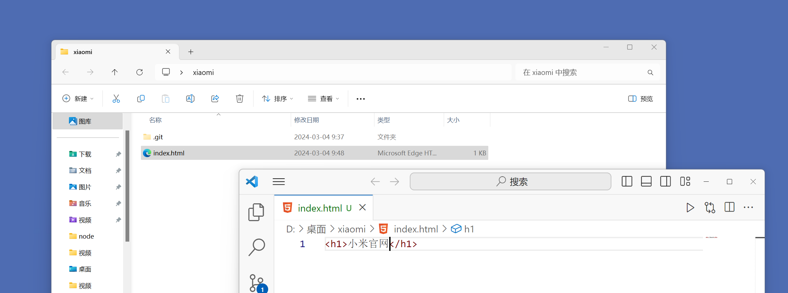
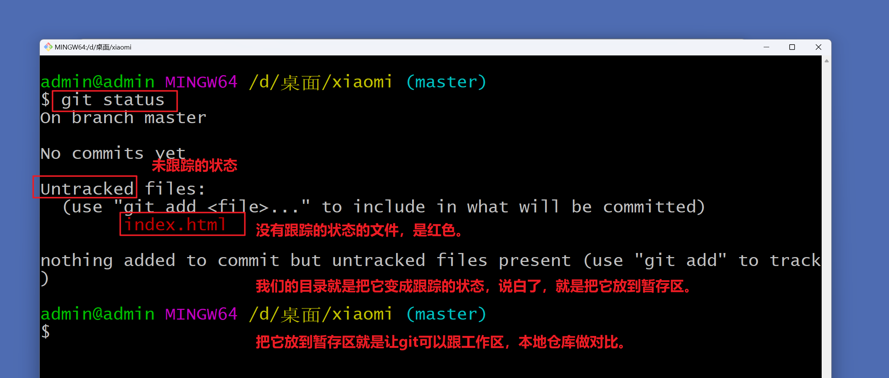
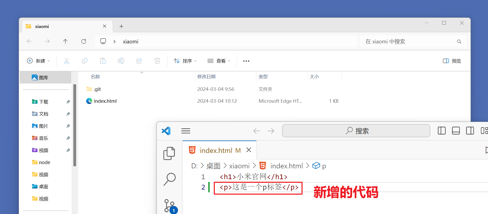
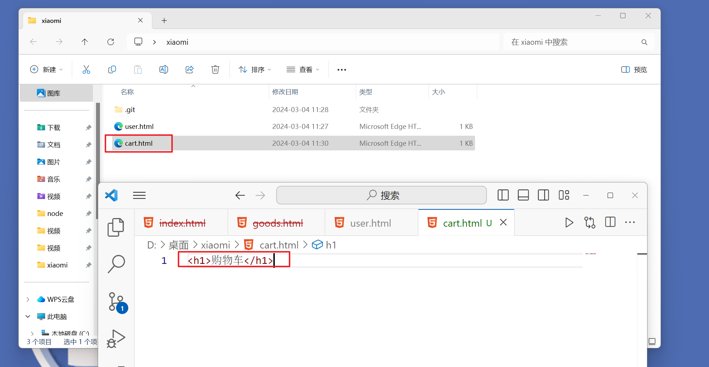
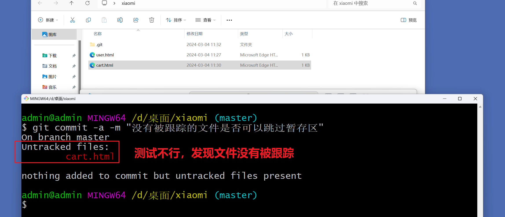
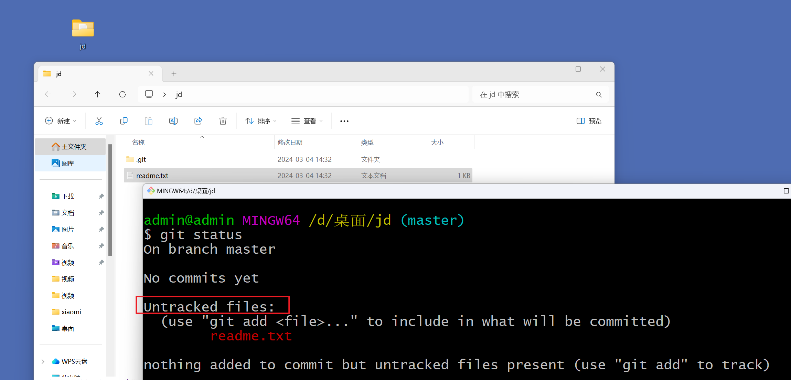
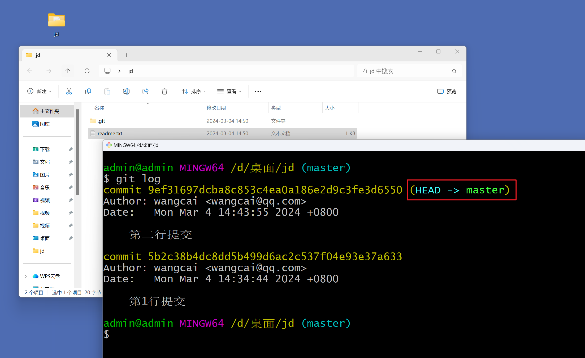
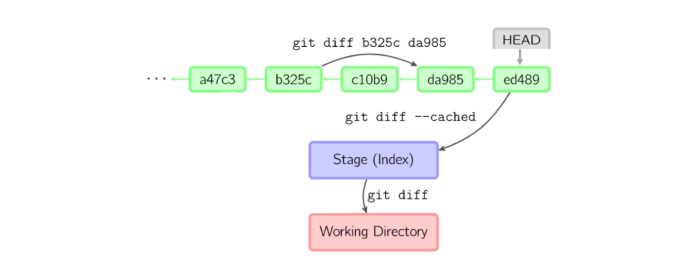
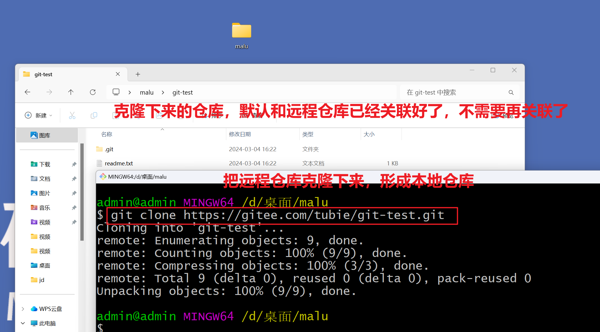
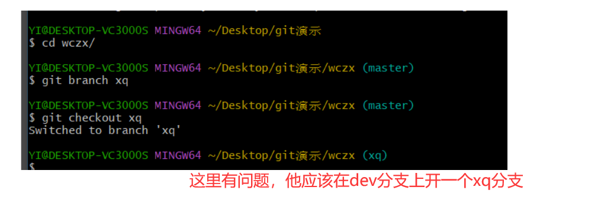

## 一，什么是Git

### 1, 什么是Git

Git就是一个分布式版本控制软件。考虑在开发中的几个问题。如下：

* **第一个问题**：wc负责的模块就要完成了，就在即将提交发布之前的一瞬间，电脑突然蓝屏，硬盘光荣下岗！就意味着wc写的代码就丢失了。

* **第二个问题**：wc需要在项目中加入一个很复杂的功能，一边尝试，一边修改代码，就这样摸索了一个星期。 可是这被改得面目全非的代码已经回不到从前了。

* **第三个问题**：如果项目中的bug过多，需要追溯责任。

  

总结在开发项目中，面临的问题：

* 代码备份

  

* 版本控制

* 协同开发

* 责任追溯


此时，就需要使用到git软件了。**Git** **是目前最流行的分布式版本控制软件**

### 2，版本控制分类

#### 1）本地版本控制

记录文件每次的更新，可以对每个版本做一个快照，或是记录补丁文件，适合个人用，如 RCS


#### 2）集中版本控制

* 所有的版本数据都保存在服务器上，协同开发者从服务器上同步更新或上传自己的修改
* 用户的本地只有自己以前所同步的版本，如果不连网的话，用户就看不到历史版本，也无法切换版本
* 所有数据都保存在单一的服务器上，如果这个服务器会损坏(有很大的风险), 这样就会丢失所有的数据，需要定期备份
* 代表产品：SVN、CVS、VSS


#### 3）分布式版本控制

* 所有版本信息仓库全部同步到本地的每个用户
* 可以在本地查看所有版本历史，可以离线在本地提交，只需在连网时push 到相应的服 务器或其他用户那里。
* 每个用户那里保存的都是所有的版本数据，只要有一个用户的设备没有问题就可以恢复所有的数据
* 更加安全不会因为服务器损坏或者网络问题，造成不能工作的情况
* 代表软件: Git


### 3，Git的下载和安装

官网下载git软件：https://git-scm.com/downloads  <br/>

下载慢，可以到镜像下载 : http://npm.taobao.org/mirrors/git-for-windows/  <br/>


安装是傻瓜式安装：

* 第一步：双击安装包，进入安装界面


* 第二步：指定安装目录

  


* 第三步：一路next下去

  ​	


  ​	


* 第四步：安装完成

  ​	


安装完成后，在电脑桌面上，右键，可以看到两个菜单，如下：


上面的Git GUI Here表示Git提供的图形界面工具，Git Bash是Git提供的命令行工具（我们使用的）。

打开Git Bah Here，输入git --version命令，可以查看git软件的版本，如下：


### 4，Git资料

命令地址: https://gitee.com/all-about-git

Git 互动学习：https://oschina.gitee.io/learn-git-branching/


## 二，Git知识点串讲


### 1，Git配置用户信息

当安装完 Git 应该做的第一件事就是配置用户名称与邮件地址。说白了，就是告诉git你是谁？

```
git config --global user.name xxx
git config --global user.email xxxx.com
```


配置如下：


检查配置的用户信息：

```
git config --list
```


### 2，初始化本地仓库

创建一个文件夹，这个文件夹表示一个项目，如下：


在工作区所在目录执行以下命令：

```git
git init
```


显示隐藏目录：


### 3，工作区，暂存区和版本库

工作区（WorkSpace）：

- 放项目代码的地方，就是项目代码对应的一些文件。

暂存区（Index/Stage）：

- 也叫索引，是一个文件，保存了下次提交的文件列表信息。

本地仓库/版本库（Repository）:

- 就是安全存储数据（代码）的位置，这里就存储了很多的版本。


工作流程：

1. 在工作区中添加、修改文件；
2. 添加工作区的更改到暂存区
3. 将暂存区域的文件列表信息提交到本地仓库。

如下图：


### 4，Git跟踪文件

工作区代码如下：




查看工作区文件的状态：




实现对文件的跟踪：


再查看状态：


实现提交：


再查看状态：


此时版本库中，就会形成一个版本：


### 5，修改文件


修改文件如下：




查看状态：


添加到暂存区：


提交到本地仓库，如下：


查看提交记录：


使用git log --oneline 可以把每次提交信息显示在一行，如下：


### 6，删除文件

删除文件，如下：


查看状态：


添加到暂存区：


提交到本地仓库，形成版本：


查看提交记录（版本）：


还有一个命令，是git rm 文件。不仅从工作区删除文件，并且暂存区也被删除。先创建一个新的文件，如下：


查看状态：


提交到暂存区：


删除工作区和暂存区的文件：


### 7，撤销本地文件的修改

现在工作区的代码如下：


查看状态：


提交到暂存区：


修改工作区中的代码：


查看状态：


撤销本地文件的修改，命令如下：


查看代码：


除了上面的git restore命令之外，还有一个命令，也可以达到这个效果，这个命令是git checkout --file。查看状态：


再修改代码：


查看状态：


通过git checkout -- file，撤销本地文件的修改，如下：


查看代码：


注意：

- 从暂存区恢复工作区数据的前提是，暂存区有对应数据。
- checkout的功能很多，从 Git 2.23 版本开始引入了两个新的命令： git switch 用来切换分支。 git restore用来还原工作区的文件。


### 8，取消暂存

看如下的图：


再在工作的代码如下：


查看状态：


提交到暂存区：


在工作区修改之后且还修改了暂存区，即已进行add，但未进行commit，撤销暂存区修改


上面恢复暂存区的操作不会影响到工作区。除了上面的方式之外，还有一种方式，修改代码：


查看状态：


提交到暂存区：


取消暂存：


注意：

- 以上恢复暂存区的操作不会影响工作区。


### 9，跳过暂存区


-a 选项，Git 会自动把 所有已经跟踪过的文件 暂存起来一并提交，从而跳过 git add 步骤。现在工作区代码如下：


修改文件，如下：


查看状态：


跳过暂存区，如下：


如果一个文件没有被跟踪，-a 参数不会自动将没有跟踪的文件变为已跟踪，创建一个文件：




查看状态：


cart.html没有被跟踪，测试是否可以跳过暂存区，如下：




使用git checkout HEAD -- file。使用最后一次提交，覆盖暂存区跟工作区。当前状态：


提交到暂存区：


提交到本地仓库：


再去书写几行代码：


添加到暂存区：


现在工作区和暂存区中有3个h1，本地仓库中有1个h1，把最后一次提交的，覆盖暂存区和工作区，如下：


看工作区的代码：


### 10，版本回退（两个命令）

上午讲的内容：


创建一个空的文件夹，表示项目：


初始化一个本地仓库：


在工作区，创建文件，开发项目：


查看状态：




git跟踪：


提交版本：


继续开发：


git跟踪：


查看版本：


看如下的命令：


执行git reset命令，如下：


再执行git checkout命令，如下：


我们先生成几个版本：


在git reset后面可以直接跟上版本号，表示直接回退到某一个版本，如下：


执行git checkout，把暂存区的代码覆盖掉工作区：


如果不使用版本号，还可以使用HEAD指针，HEAD 指向当前分支，当前分支指向最新的提交。




HEAD说明：

```
HEAD  表示当前版本
HEAD^  上一个版本
HEAD^^  上上一个版本
HEAD^^^   上上上一个版本
以此类推...

HEAD~0 表示当前版本
HEAD~1 上一个版本
HEAD~2  上上一个版本
HEAD~3   上上上一个版本
以此类推...
```


### 11，版本回退（一个命令）


--hard 参数撤销工作区中所有未提交的修改内容，将暂存区与工作区都回到上一次版本，并删除之前的所有信息提交。 

```
git reset --hard HEAD^
git reset --hard HEAD^^
```


查看当前工作区的版本：


通过一个命令，回到第1个版本，如下：


### 12，回退到未来版本

查看当前版本：


你要知道，本身我们有三个版本，我们是回退到了第1个版本，现在后悔，又想回到第3个版本，先执行如下命令：


回到第3个版本：


### 13，设置git忽略文件

一般我们总会有些文件无需纳入 Git 的管理，也不希望它们总出现在未跟踪文件列表。 通常都是些自动生成的文件，比如日志文件，或者编译过程中创建的临时文件等。在这种情况下，我们可以创建一个名为 .gitignore 的文件，列出要忽略的文件模式。创建此文件：


在忽略文件中写内容，格式规范：

- 所有空行或者以注释符号 ＃ 开头的行都会被 Git 忽略
- 可以使用标准的 glob 模式匹配
- 匹配模式最后跟斜杠(/)说明要忽略的是目录
- 要忽略指定模式以外的文件或目录，可以在模式前加上感叹号(!)进行取反


glob模式，所谓的 glob 模式是指 shell 所使用的简化了的正则表达式，匹配规则如下：

- "*" ：星号匹配零个或多个任意字符。
- [] ：匹配任何一个列在方括号中的字符，如[ab]匹配a或者匹配b
- "?" ：问号匹配一个任意字符。
- [n-m] ：匹配所有在这两个字符范围内的字符，如[0-9]表示匹配所有0到9的数字。


匹配示例：


说明：

- logs/ ：忽略当前路径下的logs目录或多级路径下的logs目录，包含logs下的所有子目录和文件。
- /logs.txt：忽略根目录下的logs.txt文件。
- *.html： 忽略所有后缀为.html的文件。
- /html/a.html  忽略根目录下面的html文件夹下面的a.html文件
- !/html/a.html  不忽略根目录下面的html文件夹下面的a.html文件
- tmp/*.txt：只忽略tmp目录下的.txt文件。
- **/data/： 忽略 /data/   a/data/  b/data/


测试之：


### 14，比较文件差异




先生成一个版本：


再生成两个版本：


通过git diff命令，对比工作区跟暂存区的变化，显示未暂存的改动。


对比本地仓库最新版本跟暂存区的变化，显示未提交的改动。


git diff commit1 commit2对比本地仓库中俩个提交版本之间的差异,显示commit2在commit1基础上的改动。


### 15，创建远程仓库


目前我们使用到的 Git 命令都是在本地执行，如果你想通过 Git 分享你的代码或者与其他开发人员合作， 你就需要将数据放到一台其他开发人员能够连接的服务器上，托管在这台服务器上的数据的就是我们的远程仓库。


在使用远程仓库之前，我们首先需要创建仓库，创建仓库有很多种，这里常见的有如下几种：

- 自己搭建个 *Git* 服务器，安装如 *GitLab* 的Git版本管理系统
- 使用第三方托管平台，如国内的 和国外的


常用的托管服务平台

- GitHub (地址: https://github.com/)是一个面向开源及私有软件项目的托管平台，因为只支持Git作 为唯的版本库格式进行托管，故名GitHub。
- 码云 （地址: https://gitee.com/）是国内的一个代码托管平台，由于服务器在国内，所以相比于 GitHub，码云速度会更快。
- GitLab (地址: https://about.gitlab.com/) 是一个用于仓库管理系统的开源项目，使用Git作为代 码管理工具，并在此基础上搭建起来的web服务。 


以gitee为例，注册码云账号，创建远程仓库，流程如下：


创建远程仓库：


### 16，本地仓库和远程仓库关联

为本地仓库添加远程仓库，如下：


.git/config 文件中可以查看远程仓库的信息


上面的操作是本地仓库和远程仓库关联好了，删除远程仓库如下：


### 17，本地仓库的版本推送到远程仓库


git push <远程主机名> <本地分支名>:<远程分支名> 推送本地仓库代码到远程仓库。如果本地分支名与远程分支名相同，则可以省略冒号：git push <远程主机名> <本地分支名>


第一次推送时，需要输入用户名和密码：


查看远程仓库：


### 18，克隆远程仓库

创建一个文件夹，表示malu同学的电脑：


如果远程是开源的，表示别人是可以克隆的如下：




### 19，拉取代码（一个命令）

假如刚开始的用户是wc，wc又生成一个版本：


wc把第4个版本推送到远程仓库：


查看远程仓库：


现在远程仓库也是4个版本的，但是malu同学电脑上只有3个版本，malu想得到第4个版本：


问：现在malu能向仓库中推送代码吗？

- 答：不行


### 20，抓取代码（两个命令）

git fetch命令将远程仓库的数据拉取到本地，但不会自动合并。让wc用户生成第5个版本，如下：


把这个版本推送到远程仓库：


看远程仓库：


看malu:


malu同学，除了git pull之外，还可以git fetch，如下：


手动合并，如下：


### 21，合并冲突

分析：


修改wc的代码，形成一个版本，推送到远程仓库：


现在malu电脑上的版本落后远程仓库一个版本，如下：


现在让malu也去修改第5行代码：


malu开始推送，如下：


上面的测试，由于malu没有保存，重新修改wc的代码：


修改malu代码：


malu同学去推代码：


malu需要先去拉取代码，在拉取时，会冲突，如下：


打开冲突的文件：


解决冲突，重新提交更改后的代码：


把解决后的代码推送到远程仓库：


看远程仓库：


wc第2天上班，需要获取最新的代码，需要git pull，如下：


重点：

- 我们要养成推送之前，先拉取代码的习惯，防止覆盖同事的代码。


## 三，Git本地仓库的管理

### 1，生成本地仓库并简单操作

wc要开始创业做一个项目，项目叫wcyx。如：


此时我们想让git管理此项目，需要把这个文件夹，初始化成本地仓库(**进入要管理的文件夹**），如下：


初始化本地管理，要使用git管理项目，一定要先初始化，如下：


然后wc就开始项目开发了，如下：


此时就需要让git管理代码，形成一个版本，在形成版本之前，可以使用git status查看代码文件的状态，如下：


先补充一个git本地仓库中有三个区域，如下：


四个区域与之对应关系：

* 本地仓库 之 工作目录（Working Directory）
  + 工作区，就是你平时存放项目代码的地方
* 本地仓库 之 暂存区（Stage/Index）
  + 暂存区，用于临时存放你的改动，事实上它只是一个文件，保存即将提交到文件列表信息
* 本地仓库 之 资源库/版本库（Repository或Git Directory）
  + 版本库，就是安全存放数据的位置，这里面有你提交到所有版本的数据。其中HEAD指向最新放入仓库的版本
* 远程仓库（Remote Directory）
  + 远程仓库，托管代码的服务器(比如Github/Gitee)，可以简单的认为是你项目组中的一台电脑用于远程数据交换


把工作的代码扔到暂存区，如下 ：


然后，把暂存区的内容扔到版本库中，形成版本，在形成版本之前，需要告诉git，你是谁，如果不告诉，会报错，配置如下：


指令成功执行，会生成C:\Users\Administrator\.gitconfig, 信息如下：

通过命令（查看所有配置（git config -l / --list））查看之，如下：


然后才能生成版本，如下：


再次强调区域关系：


* Directory：使用Git管理的一个目录，也就是一个仓库，包含我们的工作空间和Git的管理空间
* WorkSpace：需要通过Git进行版本控制的目录和文件，这些目录和文件组成了工作空间。
* .git：存放Git管理信息的目录，初始化仓库的时候自动创建。
* Index/Stage：暂存区，或者叫待提交更新区，在提交进入repo之前，我们可以把所有的更新放在暂存区。
* Local Repo：本地仓库，一个存放在本地的版本库；HEAD只是当前的开发分支(branch)
* Stash：隐藏，是一个工作状态保存栈，用于保存/恢复WorkSpace中的临时状态。

查看版本，如下：


补充相关命令：

* 查看所有配置  git config -l   或 git config --list
* 查看系统配置  git config --system -l  或 git config --system --list   配置文件在Git\etc\gitconfig
* 查看当前用记配置   git config --global -l  或 git config --global --list  配置文件在C:\User\admin\\.gitconfig

### 2，拓展新功能并回退到某个版本

假定wc想在项目中新增直播的功能，如下：


然后还是进行本地仓库的操作，形成版本，如下：


项目上线，如下:


现在由于某个原因，直接功能需要下架，需要回到之前版本，现在版本如下：


看图，如下：


现在要回退到V1版本，如下：


现在又由于某个原因，又想上线直播，现在工作区的代码中没有直播功能，可能通过git reflog查看所有的版本。如下：


**总结一下：**

* git init   初始化一个本地仓库，要想让git管理代码，必须初始化成一个本地仓库
* git add .     把工作区的代码扔到暂存区，此时并没有形成版本  
* git commit -m 'xx'   把暂存区的代码扔到的版本库，形成版本
* git log     查看当前版本
* git reflog   查看所有的版本
* git reset --hard '版本号'  回退到某个版本

完善一下刚才那个图，如下：


### 3，分支和冲突解决

现在wc想在项目中集成ddz的功能，这个ddz模块是一个尝试性模块。之前开的版本，都是在主分支上开的，这个主分支，叫master分析，如下：


在vscode中也可以查看，如下：


现在wc想单独创建一个新的环境去开发ddz，此时，wc就可以去创业一个子分支，多个分支就相当于多个环境，彼此是互不影响的，现在去查看分支，如下：


创建一个新分支，如下：


vscode中也能查看，如下：


现在我们写代码都是在dev分支上写的，dev分支上是有之前master分支上的版本的，如下：


现在我们写代码都是在dev分支上写的，是不会影响master分支上的代码的，如下：


开发完成后，形成版本，如下：


你要知道，我们上线的代码是master分支上的代码，如下：


现在突然遇到线上bug了，直播模块有bug，需要再开一个bug修复的分支，现在切到master分支，在master分支基本上开一个bug修复分支，如下：


在master分支基本上开一个bug修复分支，如下：


画图如下：


开始修改bug，如下：


形成一个版本，如下：


画图如下：


需要注意，线上的bug是没有修复的，此时，我们需要把bug分支上的版本合并到master分支，如下：


此时，线上的master分支代码的bug就被修复了，如下：


画图，如下：


bug分支修复了，就可以把bug分支删除了，如下：


画图，如下：


现在wc还需要回去开发它的ddz模块，如下：


开发代码，如下：


当前的操作都是在dev分支上进行的，形成版本，如下：


画图，如下：


测试完ddz模块后，发现没有问题，需要合并 到master分支，上线，此时就需要把dev分支合并到master分支了，此时会遇到问题。答：冲突。分析如下：

在dev分支上，如下：


在master分支上，如下：


现在把dev分支上的版本合并到master分支上，会产生冲突，因为同一个文件的同一行代码不一样，尝试合并如下：


查看代码如下：


需要手动的去修改冲突，如下：


修改完后，还需要形成版本，如下：


画图，如下：


总结：最简单的git工作流，如下：


## 四，远程仓库的管理（个人开发）

前面说的一系列操作都是在wc在家中开发的，wc现在有钱了，想租一个办公室办公司，现在对于wc来说，有两个场地。wc就可以借助远程仓库对项目进行管理，如下：


### 1，把家中的代码传送到云端

需要仓库一个远程仓库，如下：


创建的仓库，如下：


现在远程仓库和本地仓库没有关系，需要让它们关联起来，如下：


让本地仓库和远程仓库关联起来，如下：


然后，wc在家中需要把代码推送到远程仓库，如下：


查看远程仓库，如下：


### 2，第一次到公司在新电脑上下载代码

wc到公司后，在新电脑上，拉远程仓库的代码，如下：


wc需要把代码克隆下来，如下：


克隆下后，查看分支，如下：


wc在公司中要开发了，操作如下：


wc就在dev分支上开发项目了，如下：


一天过去了，下班了，提交代码到远程仓库，如下：


查看远程仓库，如下：


### 3，下班回家继续写代码

回家，家的电脑上没有炸金花的代码，如下：


在家也是在dev分支上开发，他还需要把远程仓库的炸金化的代码拉下来，如下：


查看家中电脑上的代码，如下：


继续开发代码，如下：


提交代码，如下：


### 4，第二天到公司继续开发并上线（公司）

到公司，需要把昨天晚上在家中的写的代码拉下来，如下：


继续开发，如下：


提交代码，如下：


看远程仓库，如下：


今天晚上，在公司，项目要上线了，要加班了，需要把dev分支合并到master分支，上线，如下：


看远程仓库，如下：


部署上线，如下：


访问之，如下：


### 5，第二天夜里开发一个模块忘记提交代码（公司）

项目上线了，wc又打算开发了一个新功能，切换分支如下：


拉代码，如下：


在公司编写代码如下：


提交代码，如下：


然后就回家了。

### 6，到家后，睡不着，想继续写代码

到家后，睡不着，想继续写代码，要知道，在公司写的最后一个版本的代码并没有推送到远程仓库。此时他应该怎么办？

答：此时，可以做一些其它功能的开发。

到家了，打开家里的电脑，先pull一下，然后切到dev分支，如下：


代码如下：


此时，可以做一些其它模块的开发，如下：


开始提交代码，准备睡觉，如下：


看远程仓库，如下：


睡了。

### 7，第三天，到公司还要写代码

先看远程仓库，如下：


再看公司的本地仓库，如下：


开始拉代码，把昨天夜里写的代码拉到本地，合并，合并时，就可能产生冲突。如下：


通过vscode手动解决冲突，如下：


解决如下：


解决完后，形成一个版本，如下：


看远程仓库，如下：


第三天，wc，摸鱼了一天。就回家了。

### 8，第三天晚上要继续写代码

到家后，要继续写代码，先pull一下，如下：


然后....

* 补充一个命令

  

```
  git pull origin dev 
  等价于
  git fetch origin dev
  git merge origin/dev
```

画图总结：


再去补充一个命令，如下：


## 五，团队协作开发（多人开发）

### 1，git的工作流

同于项目比较好，也赚到钱了，wc需要招人继续开发其它项目（新项目），此时就进入到多人协作开发的模式。git工作流，如下：


### 2，创建项目并邀请成员

创建组织如下：


在组件下面，可以创建N个仓库，如下：


现此，我们需要邀请xq加入组织，如下：


现在有两个开发者，如下：


### 3，组长初始化项目和dev分支

组长先去克隆远程仓库，如下：


开始初始化项目，配置项目，如下：


提交代码如下：


当前在master分支上就有一个版本了，如下 ：


看远程仓库，如下：


看图，如下：


开一个dev分支，写一个基础模块，如下：


开始开发项目，如下：


提交代码如下：


看图，如下：


### 4，小强加入开发

小强先需要克隆代码，如下：


小强需要开一个xq的分支，在xq的分支上，如下：


开始开发，如下：


需要把代码提交到远程仓库，如下：


看一下远程仓库，如下：


看图，如下：


### 5，小强申请合并xq分支到dev分支

xq分支的代码如下：


dev分支如下：


在小强提出申请之前，配置如下，配置的目的是，防止小强恶意合并，如下：


小强需要提出code review申请，如下：


合并时就有冲突，需要解决冲突。原因，如下：



小强解决：

答：在xq分支上marge一个dev分支，有冲突，需要解决冲突。再提交代码。远程仓库代码如下：


还需要把xq分支合并到dev分支，wc查看pr如下：


查看dev分支，如下：


### 7，wc拉代码，检查代码


得到了xq的写功能模块，代码如下：


继续看图，如下：


### 8，把dev分支上的代码合并到master分支


查看代码如下：


提交代码，如下：


看远程仓库，如下：


部署上线，如下：


### 9，给master分支打tag

什么是tag：


开始打tag，如下：


查看远程仓库，如下：


公司的运维人员，就可以去下载代码上线了。如下：

```
git clone -b v1.0 地址
```

### 10，总结提测预发布

功能都是在dev分支上开发，如下：


**公司的团队leader可以执行如下的步骤：**

第一步：基于dev分支创建一个release分支

```
git checkout dev
git checkout -b release  #  创建分支并切换
```

第二步：测试

第三步：合并到master分支

```
使用pull request
或
本地将release合并到master分支
```

第四步：在master分支上打tag

```
git tag -a v1 -m '第一版：直播功能'
git push origin --tags
```

第五步：运维人员就可以下载代码上线了

```
git clone  -b v1 地址
```

## 六，其它

### 1，给开源软件贡献代码

第一步：fork源码，将别人的源代码拷贝到自己的仓库


第二步：在自己仓库进行代码修改

第三步：给源代码的作者提交（pull request） 

### 2，免密登录

方式一：

```
之前：https://gitee.com/tubie/layui-vue.git
之前：git remote add origin https://gitee.com/tubie/layui-vue.git

要想免密登录，修改url,如下：
https://用户名:密码@gitee.com/tubie/layui-vue.git
现在关联：git remote add origin https://用户名:密码@gitee.com/tubie/layui-vue.git
```

方式二：


方式三：使用ssh实现（推荐）

参考：https://blog.csdn.net/weixin_51080921/article/details/123550636

如果要使用ssh免密登录，需要走git协议，如下：


### 3，git忽略文件

有些文件，不想让git进行管理，创建一个.gitignore，如下：


这个文件也很重要。更多参考：https://github.com/github/gitignore


### 4，issues

文档以及任务管理。如下：


### 5，wiki

项目的文档。
