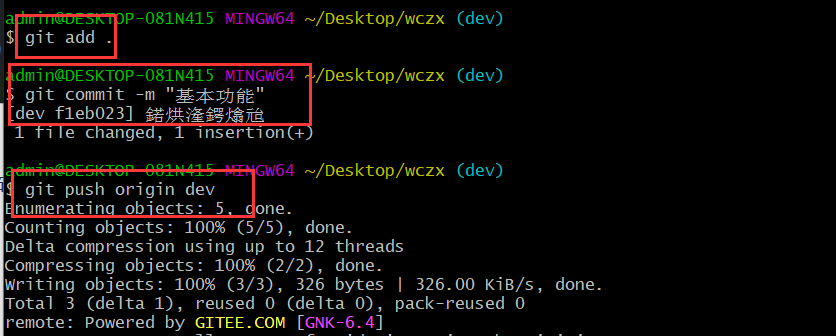
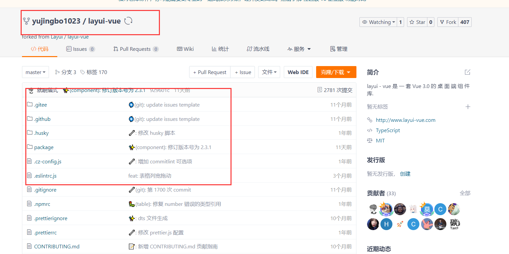

## 一，什么是Git

### 1, 什么是Git

Git就是一个分布式版本控制软件。考虑在开发中的几个问题。如下：

* **第一个问题**：wc负责的模块就要完成了，就在即将提交发布之前的一瞬间，电脑突然蓝屏，硬盘光荣下岗！就意味着wc写的代码就丢失了。

* **第二个问题**：wc需要在项目中加入一个很复杂的功能，一边尝试，一边修改代码，就这样摸索了一个星期。 可是这被改得面目全非的代码已经回不到从前了。

什么是版本控制？你去写论文，可能会出现如何的状态：


**第三个问题**：wc和xq从文件服务器下载同一个文件

**第四个问题**：如果项目中的bug过多，需要追溯责任。

总结在开发项目中，面临的问题：

* 代码备份
* 版本控制
* 协同开发
* 责任追溯

此时，就需要使用到git软件了。**Git** **是目前最流行的分布式版本控制软件**

### 2，版本控制分类

#### 1）本地版本控制

记录文件每次的更新，可以对每个版本做一个快照，或是记录补丁文件，适合个人用，如 RCS


#### 2）集中版本控制

* 所有的版本数据都保存在服务器上，协同开发者从服务器上同步更新或上传自己的修改
* 用户的本地只有自己以前所同步的版本，如果不连网的话，用户就看不到历史版本，也无法切换版本
* 所有数据都保存在单一的服务器上，如果这个服务器会损坏(有很大的风险), 这样就会丢失所有的数据，需要定期备份
* 代表产品：SVN、CVS、VSS


#### 3）分布式版本控制

* 所有版本信息仓库全部同步到本地的每个用户
* 可以在本地查看所有版本历史，可以离线在本地提交，只需在连网时push 到相应的服 务器或其他用户那里。
* 每个用户那里保存的都是所有的版本数据，只要有一个用户的设备没有问题就可以恢复所有的数据
* 更加安全不会因为服务器损坏或者网络问题，造成不能工作的情况
* 代表软件: Git


### 3，Git的下载和安装

官网下载git软件：https://git-scm.com/downloads  <br/>

下载慢，可以到镜像下载 : http://npm.taobao.org/mirrors/git-for-windows/  <br/>


安装是傻瓜式安装：

* 第一步：双击安装包，进入安装界面


* 第二步：指定安装目录

  


* 第三步：一路next下去

  ​	


  ​	


* 第四步：安装完成

  ​	


安装完成后，在电脑桌面上，右键，可以看到两个菜单，如下：


上面的Git GUI Here表示Git提供的图形界面工具，Git Bash是Git提供的命令行工具（我们使用的）。

打开Git Bah Here，输入git --version命令，可以查看git软件的版本，如下：


### 4，Git资料

命令地址: https://gitee.com/all-about-git

Git 互动学习：https://oschina.gitee.io/learn-git-branching/

## 二，Git本地仓库的管理

### 1，生成本地仓库并简单操作

wc要开始创业做一个项目，项目叫wcyx。如：


此时我们想让git管理此项目，需要把这个文件夹，初始化成本地仓库(**进入要管理的文件夹**），如下：


初始化本地管理，要使用git管理项目，一定要先初始化，如下：


然后wc就开始项目开发了，如下：


此时就需要让git管理代码，形成一个版本，在形成版本之前，可以使用git status查看代码文件的状态，如下：


先补充一个git本地仓库中有三个区域，如下：


四个区域与之对应关系：

* 本地仓库 之 工作目录（Working Directory）
  + 工作区，就是你平时存放项目代码的地方
* 本地仓库 之 暂存区（Stage/Index）
  + 暂存区，用于临时存放你的改动，事实上它只是一个文件，保存即将提交到文件列表信息
* 本地仓库 之 资源库/版本库（Repository或Git Directory）
  + 版本库，就是安全存放数据的位置，这里面有你提交到所有版本的数据。其中HEAD指向最新放入仓库的版本
* 远程仓库（Remote Directory）
  + 远程仓库，托管代码的服务器(比如Github/Gitee)，可以简单的认为是你项目组中的一台电脑用于远程数据交换


把工作的代码扔到暂存区，如下 ：


然后，把暂存区的内容扔到版本库中，形成版本，在形成版本之前，需要告诉git，你是谁，如果不告诉，会报错，配置如下：


指令成功执行，会生成C:\Users\Administrator\.gitconfig, 信息如下：

通过命令（查看所有配置（git config -l / --list））查看之，如下：


然后才能生成版本，如下：


再次强调区域关系：


* Directory：使用Git管理的一个目录，也就是一个仓库，包含我们的工作空间和Git的管理空间
* WorkSpace：需要通过Git进行版本控制的目录和文件，这些目录和文件组成了工作空间。
* .git：存放Git管理信息的目录，初始化仓库的时候自动创建。
* Index/Stage：暂存区，或者叫待提交更新区，在提交进入repo之前，我们可以把所有的更新放在暂存区。
* Local Repo：本地仓库，一个存放在本地的版本库；HEAD只是当前的开发分支(branch)
* Stash：隐藏，是一个工作状态保存栈，用于保存/恢复WorkSpace中的临时状态。

查看版本，如下：


补充相关命令：

* 查看所有配置  git config -l   或 git config --list
* 查看系统配置  git config --system -l  或 git config --system --list   配置文件在Git\etc\gitconfig
* 查看当前用记配置   git config --global -l  或 git config --global --list  配置文件在C:\User\admin\\.gitconfig

### 2，拓展新功能并回退到某个版本

假定wc想在项目中新增直播的功能，如下：


然后还是进行本地仓库的操作，形成版本，如下：


项目上线，如下:


现在由于某个原因，直接功能需要下架，需要回到之前版本，现在版本如下：


看图，如下：


现在要回退到V1版本，如下：


现在又由于某个原因，又想上线直播，现在工作区的代码中没有直播功能，可能通过git reflog查看所有的版本。如下：


**总结一下：**

* git init   初始化一个本地仓库，要想让git管理代码，必须初始化成一个本地仓库
* git add .     把工作区的代码扔到暂存区，此时并没有形成版本  
* git commit -m 'xx'   把暂存区的代码扔到的版本库，形成版本
* git log     查看当前版本
* git reflog   查看所有的版本
* git reset --hard '版本号'  回退到某个版本

完善一下刚才那个图，如下：


### 3，分支和冲突解决

现在wc想在项目中集成ddz的功能，这个ddz模块是一个尝试性模块。之前开的版本，都是在主分支上开的，这个主分支，叫master分析，如下：


在vscode中也可以查看，如下：


现在wc想单独创建一个新的环境去开发ddz，此时，wc就可以去创业一个子分支，多个分支就相当于多个环境，彼此是互不影响的，现在去查看分支，如下：


创建一个新分支，如下：


vscode中也能查看，如下：


现在我们写代码都是在dev分支上写的，dev分支上是有之前master分支上的版本的，如下：


现在我们写代码都是在dev分支上写的，是不会影响master分支上的代码的，如下：


开发完成后，形成版本，如下：


你要知道，我们上线的代码是master分支上的代码，如下：


现在突然遇到线上bug了，直播模块有bug，需要再开一个bug修复的分支，现在切到master分支，在master分支基本上开一个bug修复分支，如下：


在master分支基本上开一个bug修复分支，如下：


画图如下：


开始修改bug，如下：


形成一个版本，如下：


画图如下：


需要注意，线上的bug是没有修复的，此时，我们需要把bug分支上的版本合并到master分支，如下：


此时，线上的master分支代码的bug就被修复了，如下：


画图，如下：


bug分支修复了，就可以把bug分支删除了，如下：


画图，如下：


现在wc还需要回去开发它的ddz模块，如下：


开发代码，如下：


当前的操作都是在dev分支上进行的，形成版本，如下：


画图，如下：


测试完ddz模块后，发现没有问题，需要合并 到master分支，上线，此时就需要把dev分支合并到master分支了，此时会遇到问题。答：冲突。分析如下：

在dev分支上，如下：


在master分支上，如下：


现在把dev分支上的版本合并到master分支上，会产生冲突，因为同一个文件的同一行代码不一样，尝试合并如下：


查看代码如下：


需要手动的去修改冲突，如下：


修改完后，还需要形成版本，如下：


画图，如下：


总结：最简单的git工作流，如下：


## 三，远程仓库的管理（个人开发）

前面说的一系列操作都是在wc在家中开发的，wc现在有钱了，想租一个办公室办公司，现在对于wc来说，有两个场地。wc就可以借助远程仓库对项目进行管理，如下：


### 1，把家中的代码传送到云端

需要仓库一个远程仓库，如下：


创建的仓库，如下：


现在远程仓库和本地仓库没有关系，需要让它们关联起来，如下：


让本地仓库和远程仓库关联起来，如下：


然后，wc在家中需要把代码推送到远程仓库，如下：


查看远程仓库，如下：


### 2，第一次到公司在新电脑上下载代码

wc到公司后，在新电脑上，拉远程仓库的代码，如下：


wc需要把代码克隆下来，如下：


克隆下后，查看分支，如下：


wc在公司中要开发了，操作如下：


wc就在dev分支上开发项目了，如下：


一天过去了，下班了，提交代码到远程仓库，如下：


查看远程仓库，如下：


### 3，下班回家继续写代码

回家，家的电脑上没有炸金花的代码，如下：


在家也是在dev分支上开发，他还需要把远程仓库的炸金化的代码拉下来，如下：


查看家中电脑上的代码，如下：


继续开发代码，如下：


提交代码，如下：


### 4，第二天到公司继续开发并上线（公司）

到公司，需要把昨天晚上在家中的写的代码拉下来，如下：


继续开发，如下：


提交代码，如下：


看远程仓库，如下：


今天晚上，在公司，项目要上线了，要加班了，需要把dev分支合并到master分支，上线，如下：


看远程仓库，如下：


部署上线，如下：


访问之，如下：


### 5，第二天夜里开发一个模块忘记提交代码（公司）

项目上线了，wc又打算开发了一个新功能，切换分支如下：


拉代码，如下：


在公司编写代码如下：


提交代码，如下：


然后就回家了。

### 6，到家后，睡不着，想继续写代码

到家后，睡不着，想继续写代码，要知道，在公司写的最后一个版本的代码并没有推送到远程仓库。此时他应该怎么办？

答：此时，可以做一些其它功能的开发。

到家了，打开家里的电脑，先pull一下，然后切到dev分支，如下：


代码如下：


此时，可以做一些其它模块的开发，如下：


开始提交代码，准备睡觉，如下：


看远程仓库，如下：


睡了。

### 7，第三天，到公司还要写代码

先看远程仓库，如下：


再看公司的本地仓库，如下：


开始拉代码，把昨天夜里写的代码拉到本地，合并，合并时，就可能产生冲突。如下：


通过vscode手动解决冲突，如下：


解决如下：


解决完后，形成一个版本，如下：


看远程仓库，如下：


第三天，wc，摸鱼了一天。就回家了。

### 8，第三天晚上要继续写代码

到家后，要继续写代码，先pull一下，如下：


然后....

* 补充一个命令

  

```
  git pull origin dev 
  等价于
  git fetch origin dev
  git merge origin/dev
  ```

画图总结：


再去补充一个命令，如下：


## 四，团队协作开发（多人开发）

### 1，git的工作流

同于项目比较好，也赚到钱了，wc需要招人继续开发其它项目（新项目），此时就进入到多人协作开发的模式。git工作流，如下：


### 2，创建项目并邀请成员

创建组织如下：


在组件下面，可以创建N个仓库，如下：


现此，我们需要邀请xq加入组织，如下：


现在有两个开发者，如下：


### 3，组长初始化项目和dev分支

组长先去克隆远程仓库，如下：


开始初始化项目，配置项目，如下：


提交代码如下：


当前在master分支上就有一个版本了，如下 ：


看远程仓库，如下：


看图，如下：


开一个dev分支，写一个基础模块，如下：


开始开发项目，如下：


提交代码如下：



看图，如下：


### 4，小强加入开发

小强先需要克隆代码，如下：


小强需要开一个xq的分支，在xq的分支上，如下：


开始开发，如下：


需要把代码提交到远程仓库，如下：


看一下远程仓库，如下：


看图，如下：


### 5，小强申请合并xq分支到dev分支

xq分支的代码如下：


dev分支如下：


在小强提出申请之前，配置如下，配置的目的是，防止小强恶意合并，如下：


小强需要提出code review申请，如下：


合并时就有冲突，需要解决冲突。原因，如下：


小强解决：

答：在xq分支上marge一个dev分支，有冲突，需要解决冲突。再提交代码。远程仓库代码如下：


还需要把xq分支合并到dev分支，wc查看pr如下：


查看dev分支，如下：


### 7，wc拉代码，检查代码


得到了xq的写功能模块，代码如下：


继续看图，如下：


### 8，把dev分支上的代码合并到master分支


查看代码如下：


提交代码，如下：


看远程仓库，如下：


部署上线，如下：


### 9，给master分支打tag

什么是tag：


开始打tag，如下：


查看远程仓库，如下：


公司的运维人员，就可以去下载代码上线了。如下：

```
git clone -b v1.0 地址
```

### 10，总结提测预发布

功能都是在dev分支上开发，如下：


**公司的团队leader可以执行如下的步骤：**

第一步：基于dev分支创建一个release分支

```
git checkout dev
git checkout -b release  #  创建分支并切换
```

第二步：测试

第三步：合并到master分支

```
使用pull request
或
本地将release合并到master分支
```

第四步：在master分支上打tag

```
git tag -a v1 -m '第一版：直播功能'
git push origin --tags
```

第五步：运维人员就可以下载代码上线了

```
git clone  -b v1 地址
```

## 五，其它

### 1，给开源软件贡献代码

第一步：fork源码，将别人的源代码拷贝到自己的仓库




第二步：在自己仓库进行代码修改

第三步：给源代码的作者提交（pull request） 

### 2，免密登录

方式一：

```
之前：https://gitee.com/tubie/layui-vue.git
之前：git remote add origin https://gitee.com/tubie/layui-vue.git

要想免密登录，修改url,如下：
https://用户名:密码@gitee.com/tubie/layui-vue.git
现在关联：git remote add origin https://用户名:密码@gitee.com/tubie/layui-vue.git
```

方式二：


方式三：使用ssh实现（推荐）

参考：https://blog.csdn.net/weixin_51080921/article/details/123550636

如果要使用ssh免密登录，需要走git协议，如下：


### 3，git忽略文件

有些文件，不想让git进行管理，创建一个.gitignore，如下：


这个文件也很重要。更多参考：https://github.com/github/gitignore


### 4，issues

文档以及任务管理。如下：


### 5，wiki

项目的文档。
