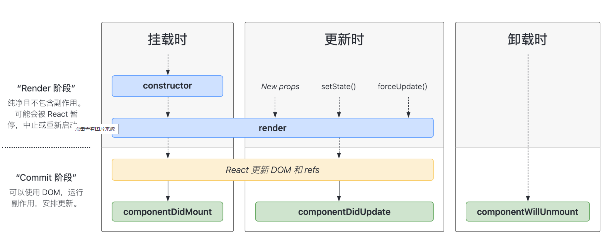
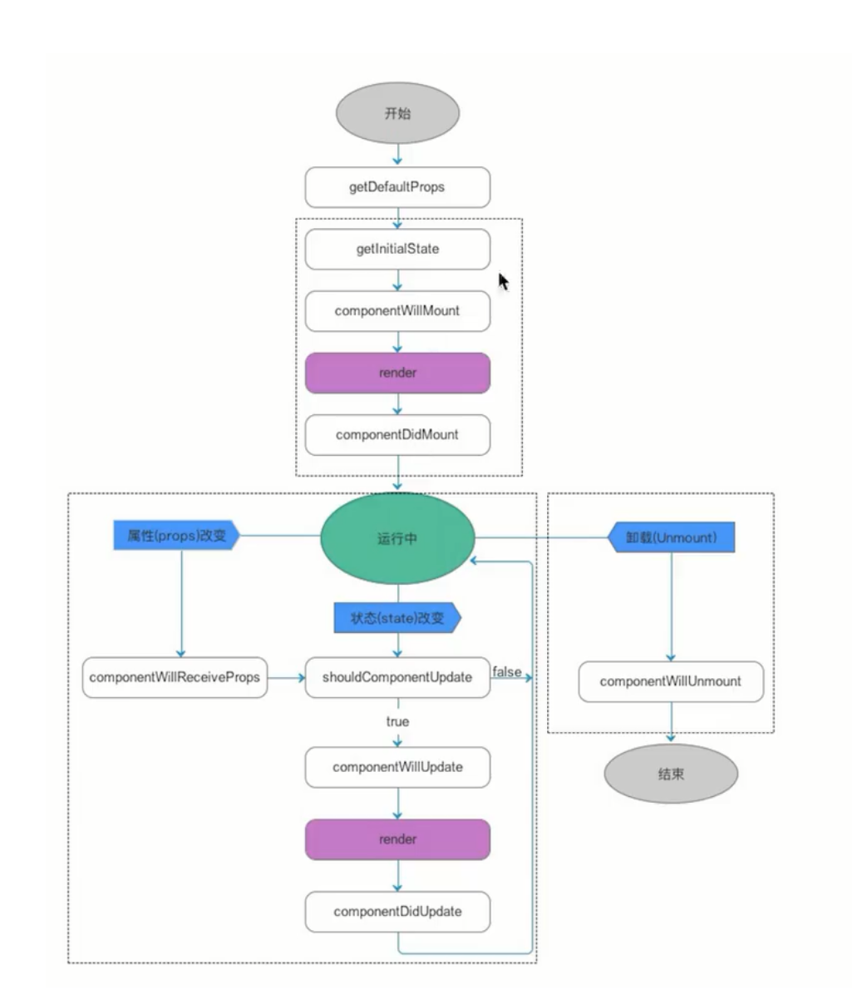

## 一，React介绍


### 1，React介绍

目前市面上主流的前端框架：

- Vue
- React
- Angular
- ....


主流思想：不需要去操作DOM，而是**数据驱动视图**。


**直接操作DOM：**

- 直接操作DOM，会导致性能消耗大一点，可能会导致DOM的重排和重绘。
- 操作DOM，相对来说，会麻烦一点


**数据驱动视图：**

- 不需要直接操作DOM
- 操作数据（状态），数据变了，框架会按相关的流程，让页面重新渲染
  - Vue：数据是响应式的，改变数据，模板重新渲染
  - 小程序：通过setData这个API，就可以达到改变数据，并重新渲染页面
  - React：通过setState这个API，达到更新页面的效果
- 框架底层在实现页面时，也是需要操作DOM的，只不过会尽可能少的操作DOM
  - 构建了一套 虚拟DOM=>真实DOM的渲染体系
  - 尽可能少的操作DOM，这样会尽可能减少重排和重绘。
- 提高开发效率，性能也会好很多


​	**React** 是一个用于构建用户界面的 JavaScript 库。React 从诞生之初就是可被逐步采用的，因而**你可以按需引入或多或少的 React 特性**。React特点：


**什么是声明式：**

- 前面学习的html标签就是声明式的。在vue中，要实现一个轮播图的功能，也是可以把轮播图封装成一个组件。声明式编程的对立面是命令式编程。

  ```html
  <!DOCTYPE html>
  <html lang="en">
  <head>
      <meta charset="UTF-8">
      <meta name="viewport" content="width=device-width, initial-scale=1.0">
      <title>Document</title>
  </head>
  <body>
      <h1>今天学习React~</h1>
      <p>我是一个孤独的P标签</p>
      
  
      <div class="carousel">
          <ul>
              <li></li>
              <li></li>
              <li></li>
          </ul>
      </div>
      <script>
          // 这种编程，叫命令式编程
          // 还有一堆的JS逻辑，还需要写很多样式
      </script>
  
  
      <hr>
  
      <!-- 声明式，组件化编译 -->
      <Carousel imgs="[1.png,2.png,3.png]"></Carousel>
  </body>
  </html>
  ```

  


官网：

- 老版 [已过时——React 中文文档 (reactjs.org)](https://zh-hans.legacy.reactjs.org/)

  

- 新版 [React 官方中文文档 (docschina.org)](https://react.docschina.org/)

  


**React版本：**

- 很早之前，是15版本，不用了。
- 16版本，项目用的还是比较多的。
- 17版本，语法和16相比，没有什么变化，只是在底层处理机制上，有所升级。
- 18版本，当前最新版本，不管是语法还是底层机制，都有变化。


### 2，React版本的HelloWorld


直接上代码：

```html
<!DOCTYPE html>
<html lang="en">
<head>
    <meta charset="UTF-8">
    <meta name="viewport" content="width=device-width, initial-scale=1.0">
    <title>Document</title>
    <!-- react.js  production 表示生产环境  会对代码进行压缩和混淆-->
    <!-- let userName = "malu"   let a = "malu" -->
    <script src="https://unpkg.com/react@^16/umd/react.production.min.js"></script>
    <!-- react-dom.js 和浏览器相关的，操作DOM -->
    <script src="https://unpkg.com/react-dom@16.13.0/umd/react-dom.production.min.js"></script>
    <!-- babel.js 是编译js代码 Babel 是一个 JavaScript 编译器。 -->
    <script src="https://unpkg.com/babel-standalone@6.26.0/babel.js"></script>
</head>
<body>
    <div id="root"></div>
    <!-- <script>
        console.log(React)
        console.log(ReactDOM)
    </script> -->

    <!-- script标签中的type的默认值是：text/javascript -->
    <script type="text/babel">
        // 定义了一个React组件
        class App extends React.Component{
            render(){
                return <h1>Hello React~</h1>
            }
        }

        ReactDOM.render(<App/>,document.getElementById("root"))
    </script>
</body>
</html>
```


效果如下：


为什么script标签中写的是text/babel？我们在组件中写的html标签，并不会直接渲染，会把你写的代码转化成js方法去执行。


我们是可以直接写方法的，不需要写标签：

```html
<!DOCTYPE html>
<html lang="en">
<head>
    <meta charset="UTF-8">
    <meta name="viewport" content="width=device-width, initial-scale=1.0">
    <title>Document</title>
    <script src="https://unpkg.com/react@^16/umd/react.production.min.js"></script>
    <script src="https://unpkg.com/react-dom@16.13.0/umd/react-dom.production.min.js"></script>
    <script src="https://unpkg.com/babel-standalone@6.26.0/babel.js"></script>
</head>
<body>
    <div id="root"></div>
    <script> 
        class App extends React.Component{
            render(){
                // 第一个参数是必填，传入的是似HTML标签名称，eg: ul, li 
                // 第二个参数是选填 对象，表示的是标签属性，
                // 第三个参数以后是选填, 子节点
                return React.createElement("h1",null,"Hello React~")
            }
        }
        ReactDOM.render(React.createElement(App,null),document.getElementById("root"))
    </script>
</body>
</html>
```


效果：


再次看一下babel官网：


书写的代码：

```jsx
class App extends React.Component{
     render(){
         return (
             <div className="app">
                 <h1>hello react!</h1>
                 <h1>hello react!</h1>
                 <h1>hello react!</h1>
                 <p>
                     <span>span</span>
                 </p>
             </div>
         )
     }
 }
```


通过babel编译后的代码：

```js
        class App extends React.Component {
            render() {
                return /*#__PURE__*/React.createElement("div", 
                {
                    className: "app"
                }, 
                /*#__PURE__*/React.createElement("h1", null, "hello react!"), 
                /*#__PURE__*/React.createElement("h1", null, "hello react!"), 
                /*#__PURE__*/React.createElement("h1", null, "hello react!"), 
                /*#__PURE__*/React.createElement("p", null, 
                                                /*#__PURE__*/React.createElement("span", null, "span")));
            }
        }
```


小小的作业：把下面标签的形式，转化成React.createElement的形式。

```html
<div className="App">
     <ul className='url_wrap'>
         <li className='item'>商城</li>
         <li className='item'>购物车</li>
         <li className='item'>订单</li>
         <li className='item'>
             <span>我的</span>
         </li>
     </ul>
</div>
```


### 3，脚手架

​	现在开发项目，都是组件化，工程化的。我们可以基于webpack自己去搭建一套工程化的架子，样这非常麻烦，复杂。React官方为我们提供了一个脚手架，叫create-react-app。默认情况下，就把webpack相关的配置就处理好了。只需要基于这个脚手架，去开发项目就OK。

 

安装脚手架：

```
npm i create-react-app -g 
```


验证是否安装成功：


安装后完，就可以创建一个项目：

```
create-react-app demo
```


安装完后，进入项目，启动项目，如下：


访问之：


默认会安装

- react，是React框架的核心，默认安装的是最新版本，学的话，就学习最新版本。
- react-dom，React视图渲染的核心。基于React构建WebApp。
- react-native，构建渲染原生App的。


使用vscode打开项目，如下：


打开package.json文件，如下：


去简化一下代码，如下：


目录结构：

```
demo 
  |- node_modules   项目的依赖
  |- src   我们写的代码基本上都是放在src下面。webpack打包时，只对src目录进行打包
      |- index.js  项目的入口
  |- public  入页面的模板
      |- index.html 
  |- package.json
  |- ....
```


## 二，JSX

​	

### 1，什么是JSX

​	jsx是用来给组件提供视图的，类似于vue中的模板。就是js和html标签混合在一起，并不是我们之前玩的字符串拼接。这种语法也会通过babel进编译，编译成js代码。JSX可以生成React元素。说白了，就是React.createElement函数调用后得到一个React元素。


### 2，JSX细节1

在jsx中，可以通过{}胡子语法，嵌入表达式。任何有值的内容都是表达式。代码如下：

```js
import React from "react"
import ReactDOM from "react-dom"

let str = "今天学习React so easy~"
let age = 100;

let element = <div>
    <p>我是一个P标签</p>
    <p>{str}</p>
    <p>{age}</p>
</div>

// 之前你渲染的是<App/>标签，现在我直接渲染React元素
// 你写的jsx，最终也会变成React元素
ReactDOM.render(element,document.getElementById("root"))
```


效果：


在ReactDOM.render时，不能直接把HTML或BODY作为根容器，必须指定一个额外的盒子，如下：


也就是说，不能把html或body当成根容器。


### 3，JSX细节2

在构建视图时，必须要有一个唯一的根节点，如果没有，就报错，如下：


也可以指定一个空标签：


我们要么使用一个div包起来，这样就会多一个div嵌套。也可以使用React中帮我们提供的组件（React.Fragment），包起来。这样的话，最外层就没有多余的div。


React给我们提供的一个特殊的组件，叫Reat.Fragment，是一个空标签。作用：

- 保证了视图只有一个根标签
- 也不新增一个HTML层级结构


### 4，JSX细节3

在{}胡子语法中，可以嵌入不同的值，下面的语法，需要大记一下。如下：

- number / string 值是啥，就渲染出来什么

  

- boolean / null / und / Symbol / BigInt 渲染出来的内容是空

  

- 渲染对象，直接报错了，但是有特殊情况

  

  - jsx元素（本质也是一个对象，这个对象就不会报错）

    

  - 给标签设置style行内样式时，也必须写成对象

    

- 渲染数组，会把数组中的每一项分别拿出来渲染，并不是变为字符串渲染，中间没有逗号

  - 数组中是number、 string，也是直接渲染

  - 数组中是boolean / null / und / Symbol / BigInt，渲染出来的内容是空

  - 数组中放jsx元素也是会被渲染的

    

- 渲染函数，不支持在{}中渲染函数的，但是函数也可以是组件，要渲染组件通过标签的形式渲染。

  

- ....


### 5，JSX细节4

给标签设置行内样式，如下：

```js
import React from "react"
import ReactDOM from "react-dom/client"

const root = ReactDOM.createRoot(document.getElementById("root"))

let element = 
    <>
        {/* 行内样式：不能直接写字符串，样式需要放到对象中，基于对象的格式处理的 */}
        {/* 样式是多个单词时，在css中，使用中划线命名，在jsx中，使用小驼峰命名 */}
        {/* 给标签添加clsss属性时，不能使用class，要使用className, class是一个关键字 */}
        <div className="box" style={ {color:"red",fontSize:"20px"} }>我是一个小小的div</div>
    </>

root.render(element)
```


效果：


有一个数据，如果是true，就显示button按钮，否则就隐藏buton按钮，代码如下：

```js
import React from "react"
import ReactDOM from "react-dom/client"

const root = ReactDOM.createRoot(document.getElementById("root"))

let flag = true;

let element = 
    <>
       {/* 通过样式控制是否显示，但是button已经创建了 */}
       <button style={ {display:flag ? 'block':'none'} }>登录</button>

       {/* 控制它创建或销毁 */}
       { flag ? <button>注册</button> : null }
    </>

root.render(element)
```


再进一步，通过一个数据，控制button中的文本，如下：


从服务器调用接口，获取到一片数据，渲染数据，如下：


你循环创建的元素一定要设置key，表示唯一值，用于优化DOM-DIFF的。


我要循环出5个button按钮，如下：

```js
import React from "react"
import ReactDOM from "react-dom/client"

const root = ReactDOM.createRoot(document.getElementById("root"))

let arr = [1,2,3,4,5]
let element = 
    <>
     <button>按钮1</button>
     <button>按钮2</button>
     <button>按钮3</button>
     <button>按钮4</button>
     <button>按钮5</button>
     <hr/> 
     {
        arr.map((item,index)=>{
            return <button key={index}>按钮{index+1}</button>
        })
     }
     <hr/> 
     {
        new Array(5).fill(null).map((_,index)=>{
            return <button key={index}>按钮{index+1}</button>
        })
     }
    </>

root.render(element)
```


### 6，JSX细节5

盘点jsx细节，盘点一下jsx的底层渲染机制，看如下代码：

```js
import React from "react"
import ReactDOM from "react-dom/client"

const root = ReactDOM.createRoot(document.getElementById("root"))

let a = 110;
let b = 120;
let styobj = {color:"red",background:"pink"}

let element = 
    <>
     <h2 style={ styobj }>我是一个孤独的h2标签</h2>
     <div>
        <p>{a}</p>
        <p>{b}</p>
     </div>
    </>
// 直接渲染一个jsx元素
root.render(element)
```


关于jsx的底层渲染机制：

- 第一步：把你编写的jsx语法，编译成虚拟DOM（VirtualDOM），虚拟DOM就是框架内部构建的一套对象体系，虚拟DOM本质就是一个对象，对象是属性的无序集合，这个对象中的属性都是React官方规定的，这个属性用于描述虚拟DOM。
- 第二步：把构建出来的虚拟DOM，渲染成为真实DOM，在浏览器中才能看到这些DOM元素。
- 补充：第一次渲染页面是直接把虚拟DOM转化成真实DOM。后期可能去更新状态，还会产生一个新的虚拟DOM。新旧的虚拟DOM会进行DOM-DIFF的对比，计算出差异，打PATC（两次虚拟DOM的差异），只去更新差异。


画图分析：


再次解释jsx元素的初始渲染机制：

- 我们编译的是jsx语法，编译成虚拟DOM对象，编译的过程如下：

  - 基于babel把jsx编译成React.createElement这种格式。只要是一个元素节点，都会经过createElement处理。有三个参数：
    - ele: 元素或标签名，也可以是组件。
    - props：元素的属性，如果没有设置属性就是null
    - children: 第三个是当前元素的子节点

- 再React.CreateElement方法执行，创建出虚拟DOM对象。虚拟DOM有的地方也叫jsx元素，可jsx对象，或者ReactChild对象....

  

  ```
  let virtualDom = {
      $$typeof:Symbol(react.element)
      ref:null,
      key:null,
      type：标签名或组件名,
      props: {  存储元素相关的属性
          children: 子节点信息，如果没有子节点，则没有这个属性，属性值可能是一个值，也可能是一个数组
      }
  }
  ```

  写上一点代码演示：

  

  

- 初次渲染时，会把虚拟DOM再次转化成真实DOM。在浏览器中就会看到渲染出来的效果。


## 三，函数式组件


### 1，无状态组件定义（函数式组件）

在React中，组件分两类：

- 函数式组件，也叫静态组件
- 类组件，也叫动态组件


写一个函数式组件：

```jsx
import React from "react"
import ReactDOM from "react-dom/client"

const root = ReactDOM.createRoot(document.getElementById("root"))

// 在React中，组件名首字母需要大写。如果是小写，就是一个普通的函数
// 光首字母大写还不行，还要求你这个函数需要返回一个jsx，jsx可以使用()包起来
function One(){
    return (
        <div className="one-box">
            我是One组件
        </div>
    )
}

root.render(<One/>)
```


也可以把一个组件放到一个文件中，如下：


然后，在index.js中就可以使用组件了，如下 ：


```js
import React from "react"
import ReactDOM from "react-dom/client"
import One from "./One"

const root = ReactDOM.createRoot(document.getElementById("root"))


root.render(<One/>)
```


组件名字，必须使用大写字母打头，否则就会报错，一般情况下，我们采用大驼峰命名法。在调用组件时，可以给组件传递各种各样的属性，如下：


```js
import React from "react"
import ReactDOM from "react-dom/client"
import One from "./One"

const root = ReactDOM.createRoot(document.getElementById("root"))


root.render(
    <One
        title="我是一个不标题"
        data={ [1,2] }
        x = "123"
        y = { 123 }
        className="box"
        style={ {color:"red"} }
    />)
```


使用babel编译上面的jsx，如下：


对于无状态的理解：


### 2，函数式组件的渲染机制

函数式组件是如何被渲染出来的，代码如下：


```js
import React from "react"
import ReactDOM from "react-dom/client"
import One from "./One"

const root = ReactDOM.createRoot(document.getElementById("root"))


root.render(
   <>
    <One
        title="我是一个不标题"
        data={ [1,2] }
        x = "123"
        y = { 123 }
        className="box"
        style={ {color:"red"} }
    />
   </>)
```


流程如下：

- 第一步：基于babel，把上面的代码编译成React.createElement形式。如下：

  

- 第二步： createElement方法执行，创建出一个虚拟DOM。type是一个函数。

  

- 第三步： 基于root.render把虚拟DOM转化成真实DOM。
  - type的值不再是一个字符串，而是一个函数
    - 把One函数执行，One()执行
    - 在执行时，会把One组件上写的属性，传递给One函数
    - One函数就会通过Props接收
    - 函数要接收，通过props接收。函数返回jsx元素（就是虚拟DOM）
    - 最后基于render把组件返回的虚拟DOM变为真实DOM，插入到#root容器中。

    

再去总结一下，在调用组件，我们可以给组件设置（传递）各种各样的属性。如果传递的不是字符串，需要使用{}包起来，在组件内部就可以通过props来接收传递过来的数据了。

 

在使用组件时，也可以在组件标签之间写东西，写的内容也是传递给了props，如下：


### 3，冻结，密封，扩展


默认情况下，一个对象是可以修改属性，添加属性，删除属性的，如下：


如果把对象给冻结了，如下：


**总结冻结**

- Object.freeze(obj)
- 检测是否被冻结：Object.isFrozen(obj)
- 特点：不能修改成员的值，不能新增成员的值，不能删除成本的，不能劫持。


前面我们说的props，默认就是被冻结的，也就意味着不能修改props的值，如下：

```js
import React from "react"
import ReactDOM from "react-dom/client"

const root = ReactDOM.createRoot(document.getElementById("root"))

function One(props){
    console.log("props:",props)
    console.log(Object.isFrozen(props))
    // props.title = "ly" // 不行的
    // props.xxx = "ok"  // 不行的
    return (
        <div className="one-box">
            我是One组件
        </div>
    )
}


root.render(<One title="malu" age={ 2 } />)
```


还有一个概念，叫密封，代码如下：


**总结密封**

- Object.seal(obj)
- 检测是否被冻结：Object.isSealed(obj)
- 特点：能修改成员的值，不能新增成员的值，不能删除成本的，不能劫持。


还有一个概念，叫扩展，代码如下：


**总结扩展**

- Object.preventExtensions(obj)
- 检测是否被冻结：Object.isExtensible(obj)
- 特点：除了不能新增，其它都可以。


如果对象被冻结了，也是不可以扩展的，也是密封的。如下：


结论：和vue一样，props中的属性，只能使用，不能修改，不能添加，不能删除。


### 4，props细节

可以基于属性，把不同的数据传递给子组件，子组件通过props接收，接收后，就可以在jsx中使用了，目的是为了提高组件的复用性。代码如下：

```js
import React from "react"
import ReactDOM from "react-dom/client"

const root = ReactDOM.createRoot(document.getElementById("root"))

function One(props){
    console.log("props:",props)
    let {title,age,data,className,children} = props;
    return (
        <div className="one-box">
            我是One组件
            <p>{ title }</p>
            <p>{ age }</p>
            <p>{ data }</p>
            <p>{ className }</p>
            <p>{ children[0] }</p>
            <p>{ children[1] }</p>
        </div>
    )
}


root.render(
<One title="malu" age={ 2 } data={ [1,2] } className="box" style={{color:'red'}} >
    <span>span</span>
    <em>em</em>
</One>)
```

效果：


props默认是被冻结的，但是我们是可以做一些校验的，安装一个包，如下：


然后就可以校验，也可以指定默认值了，如下：

```js
import React from "react"
import ReactDOM from "react-dom/client"
import PropTypes from "prop-types"

const root = ReactDOM.createRoot(document.getElementById("root"))

function One(props){
    console.log("props:",props)
    let {title,age,data,className,children,a} = props;
    return (
        <div className="one-box">
            我是One组件
            <p>{ a }</p>
            <p>{ title }</p>
            <p>{ age }</p>
            <p>{ data }</p>
            <p>{ className }</p>
            <p>{ children[0] }</p>
            <p>{ children[1] }</p>
        </div>
    )
}
// 设置默认值的
One.defaultProps = {
    a:6666
}
// 校验传递过的属性的类型
One.propTypes = {
    title:PropTypes.string, // 希望传递过来的title是sttring类型，如果不是，就报警告
    age:PropTypes.string.isRequired, // isRequired表示必传
}


root.render(
    <One a={ 8888 } title="malu" age={ 2 } data={ [1,2] } className="box" style={{color:'red'}} >
        <span>span</span>
        <em>em</em>
    </One>)
```


都能校验哪些规则，如下：


不管是校验成功，还是校验失败，都把把数据给props，如果校验失败了，会在控制台中发出警告。


### 5，插槽机制

在调用组件时，可以在标签之间写内容，如下:


在组件中打印出props，如下：


使用children，如下：


上面的案例，就相当于一个插槽，插槽可以让组件有更强的复用性。体现：

- 通过属性把数据传递给组件
- 通过标签之间写html结构（jsx对象）传递结构给组件


children有可能是一个对象，有可能是一个数组，使用children，如下：


如何解决传递一个jsx元素，也让它显示呢？如下：

```js
import React from "react"
import ReactDOM from "react-dom/client"
import PropTypes from "prop-types"

const root = ReactDOM.createRoot(document.getElementById("root"))

function One(props){
    let { children } = props;
    // 如果没有在标签之间写内容，那么children就是und
    console.log("--children:",children)
    if(!children){
        children = []
    }else if(!Array.isArray(children)){
        // 如果传递了一个jsx元素，也为成数组
        children = [children]
    }
    return (
        <div className="one-box">
            <div>
                { children[0] }
            </div>
            我是One组件
            <div>
                { children[1] }
            </div>
        </div>
    )
}

root.render(<>
    <One>
        <span>haha</span>
        <em>em</em>
    </One>
    <hr/>
    <One>
        <span>xixi</span>
    </One>
    <hr/>
    <One/>
</>)
```


上面的是我们手动的处理children，其实在React中，有一个React.Children.toArray，就可以自动把children变成数组，如下：


之前在vue中，还有一个具名插槽，在React如何实现具名插槽，如下：


解决之：

```js
import React from "react"
import ReactDOM from "react-dom/client"
import PropTypes from "prop-types"

const root = ReactDOM.createRoot(document.getElementById("root"))

function One(props){
    let { children } = props;
    children = React.Children.toArray(children)
    let headerSlot = [];
    let footerSlot = [];
    let defaultSlot = [];
    children.forEach(child=>{
        let {slot} = child.props;
        if(slot == 'header'){
            headerSlot.push(child)
        }else if(slot == 'footer'){
            footerSlot.push(child)
        }else{
            defaultSlot.push(child)
        }
    })
    return (
        <div className="one-box">
            <div>
                { headerSlot }
            </div>
            我是One组件
            <p>{ defaultSlot }</p>
            <div>
                { footerSlot }
            </div>
        </div>
    )
}

root.render(<>
    <One>
        <span slot="footer">尾部</span>
        <span slot="header">头部</span>
        <span>666666666666666</span>
    </One>
</>)
```


小作业：尝试把前面讲的内容封装成一个组件，叫Dialog


尝试封装Dialog组件：

```jsx
import React from "react"
import PropTypes from "prop-types"

function Dialog(props){
    let { title,content,children } = props;
    children = React.Children.toArray(children);
    return (
        <div className="dialog-box" style={{width:200,background:'gray'}}>
            <div className="header" style={{
                display:'flex',
                justifyContent:"space-between",
                alignItems:"center"
            }}>
                <h2 className="title">{ title }</h2>
                <span>X</span>
            </div>
            <div className="main">
                { content }
            </div>
            {
                children.length > 0 ? 
                <div>
                    { children }
                </div> : null
            }
        </div>
    )
}

Dialog.defaultProps = {
    title:"默认提示"
}
Dialog.propTypes = {
    title:PropTypes.string,
    content:PropTypes.string.isRequired
}

export default Dialog
```


在index.js中使用之：

```js
import React from "react"
import ReactDOM from "react-dom/client"
import Dialog from "./Dialog"

const root = ReactDOM.createRoot(document.getElementById("root"))

root.render(<>
    <Dialog title="温馨提示" content="你确定要删除吗？">
    </Dialog>
    <hr/>
    <Dialog title="友情提示" content="你确定要离开吗？">
        <button>确定</button>
        <button>取消</button>
    </Dialog>
</>)
```


效果：


总结函数式组件：

- 函数式组件是无状态的，也叫静态组件。
- props是用来接收数据和结构，并且props默认是被冻结
- props可以进行校验，也可以设置默认值
- 函数式组件返回jsx元素，进行渲染
- 除非在父组件中，重新调用这个函数式组件，才会重新渲染此组件
- 项目中，有这样需求：第一次渲染后就不会再有变化了，就可以使用函数式组件


## 四，类组件（有状态组件）


在使用vscode开发react时，大家可以去网上找一些插件，提高开发效率。我就安装了一个：


### 1，类组件的定义

可以基于类来构建动态组件。创建一个类，要求必须继承React.Component/PureComponent这个类。现在就创建一个组件，如下：

```jsx
import React, { Component } from 'react';

// 基于ES6中的class创建的
// 组件创建有两种方式：1）基于函数的  2）基于类的
// 这两种方式，我们都需要掌握，并且给你一种方式，你可以翻译成另一种
// 如给你一个函数式组件，你能翻译成类组件
// 给你一个类组件，你能翻译成函数组件
class One extends Component {
    // 类组件中有一个生命周期函数，叫render，函数式组件没有生命周期函数
    render() {
        // render函数需要返回一个jax
        return (
            <div className='vote-box'>
                <div className="header">
                    <h2 className="title">学习React难不难？ <span>10</span></h2>
                    
                </div>
                <div className="main">
                    <p>难：5人</p>
                    <p>不难：5人</p>
                </div>
                <div className="footer">
                    <button onClick={()=>{}}>难</button>
                    <button onClick={()=>{}}>不难</button>
                </div>
            </div>
        );
    }
}

export default One;
```


在index.js入口中使用之：

```js
import React from "react"
import ReactDOM from "react-dom/client"
import One from "./views/One"

const root = ReactDOM.createRoot(document.getElementById("root"))

root.render(<>
   <One/>
</>)
```


效果：


可以安装一个react的调试工具，如下：


在类组件中是可以定义状态，如下：

```jsx
import React, { Component } from 'react';

// 当去new One类时，会自动调用constructor
// 这个类组件，不需要我们去new，React底层会帮我们去new
// 在它帮我们new时，就会调用生命周期函数constructor，并且会传递props给constructor
class One extends Component {
    // 如果写了constructor，那么一定要调用super，然后传入props
    constructor(props){
        super(props)
        console.log("constructor...");
        this.state = {
            // 在这里定义状态
            hard:0,
            easy:0,
        }
    }
    render() {
        console.log("render...");
        return (
            <div className='vote-box'>
                <div className="header">
                    <h2 className="title">学习React难不难？ <span>{this.state.hard + this.state.easy}</span></h2>
                    
                </div>
                <div className="main">
                    <p>难：{this.state.hard}人</p>
                    <p>不难：{this.state.easy}人</p>
                </div>
                <div className="footer">
                    <button onClick={()=>{}}>难</button>
                    <button onClick={()=>{}}>不难</button>
                </div>
            </div>
        );
    }
}

export default One;
```

效果：


### 2，类组件的渲染机制

调用组件时，代码如下：


也就是转化成虚拟DOM时，那个type属性的值是类（class One），type的取值：

- 字符串： 创建一个普通html标签
- 普通函数： 函数式组件，执行函数，并且把props传递给函数
- 类：React底层会帮我们去new，new的时候，就会创建出一个实例（组件实例），并且也会解析出属性传递给组件的props。
  - 每调用一次类组件都会创建一个单独的实例（组件实例），并且组件中的this就表示这个实例。
  - 把类组件中的render方法执行，返回jsx对象（虚拟DOM），当做组件的视图进行渲染。


在调用类组件时，类组件内部做的第一件事情：

- 初始化属性，有了属性，就可以进行规则校验。默认这个props属性是通过constructor接收，如下：

  

  ```jsx
  import React, { Component } from 'react';
  
  class One extends Component {
      // 调用类组件时，第一件事情就是初始化属性，此时就可以对props进行校验
      // 默认这个props属性是通过constructor接收的。
      constructor(props){
          super(props)
          console.log("constructor...");
          console.log("--props:",props);
          this.state = {
              hard:0,
              easy:0,
          }
      }
      render() {
          console.log("render...");
          return (
              <div className='vote-box'>
                  <div className="header">
                      <h2 className="title">学习React难不难？ <span>{this.state.hard + this.state.easy}</span></h2>
                      
                  </div>
                  <div className="main">
                      <p>难：{this.state.hard}人</p>
                      <p>不难：{this.state.easy}人</p>
                  </div>
                  <div className="footer">
                      <button onClick={()=>{}}>难</button>
                      <button onClick={()=>{}}>不难</button>
                  </div>
              </div>
          );
      }
  }
  
  export default One;
  ```

  

- 如果没有写constructor属性，React内部也会把props挂载到当前组件实例上（this）

  

  ```jsx
  import React, { Component } from 'react';
  
  class One extends Component {
      render() {
          console.log("render...");
          console.log("--props",this.props);
          return (
              <div className='vote-box'>
                  <div className="header">
                      <h2 className="title">学习React难不难？ <span>0</span></h2>
                      
                  </div>
                  <div className="main">
                      <p>难：0人</p>
                      <p>不难：0人</p>
                  </div>
                  <div className="footer">
                      <button onClick={()=>{}}>难</button>
                      <button onClick={()=>{}}>不难</button>
                  </div>
              </div>
          );
      }
  }
  
  export default One;
  ```

  

- 这个props也是被冻结的，只能使用，不能修改，添加，劫持。可以对属性进行校验，设置默认值

  

  ```jsx
  import React, { Component } from 'react';
  import PropTypes from "prop-types"
  
  class One extends Component {
      static defaultProps = {
          title:"这是默认值"
      }
      static propTypes = {
          title:PropTypes.string,
          age:PropTypes.number.isRequired
      }
      render() {
          console.log("render...");
          console.log("--props",this.props);
          return (
              <div className='vote-box'>
                  <div className="header">
                      <h2 className="title">{this.props.title} <span>0</span></h2>
                      
                  </div>
                  <div className="main">
                      <p>难：0人</p>
                      <p>不难：0人</p>
                  </div>
                  <div className="footer">
                      <button onClick={()=>{}}>难</button>
                      <button onClick={()=>{}}>不难</button>
                  </div>
              </div>
          );
      }
  }
  
  export default One;
  ```

  


在调用类组件时，类组件内部做的第二件事情：

- 初始化状态，如果后期修改了状态，会重新render，叫re-render。

  

  

  ```jsx
  import React, { Component } from 'react';
  import PropTypes from "prop-types"
  
  class One extends Component {
      // 定义状态的方式一
      // constructor(props){
      //     super(props)
      //     this.state = {
      //         hard:1,
      //         easy:2
      //     }
      // }
      // 定义状态的方式二
      state = {
          hard:1,
          easy:2
      }
      render() {
          let {hard,easy} = this.state;
          return (
              <div className='vote-box'>
                  <div className="header">
                      <h2 className="title">{this.props.title} <span>{ hard+easy }</span></h2>
                      
                  </div>
                  <div className="main">
                      <p>难：{hard}人</p>
                      <p>不难：{easy}人</p>
                  </div>
                  <div className="footer">
                      <button onClick={()=>{}}>难</button>
                      <button onClick={()=>{}}>不难</button>
                  </div>
              </div>
          );
      }
  }
  
  export default One;
  ```

  

- 修改状态，更新视图，React提供了专属的API，叫setState，不光可以修改状态，还可以更新视图。

  

  

  ```jsx
  import React, { Component } from 'react';
  
  class One extends Component {
      state = {
          hard:1,
          easy:2
      }
      render() {
          let {hard,easy} = this.state;
          return (
              <div className='vote-box'>
                  <div className="header">
                      <h2 className="title">{this.props.title} <span>{ hard+easy }</span></h2>
                      
                  </div>
                  <div className="main">
                      <p>难：{hard}人</p>
                      <p>不难：{easy}人</p>
                  </div>
                  <div className="footer">
                      <button onClick={()=>{
                          // 修改状态(暴力修改状态，直接修改状态)
                          // 但样去修改状态，界面是没有刷新的
                          // this.state.hard++
                          // console.log(this.state.hard);
  
                          // setState这个API就是专门用于修改状态，通过它修改状态后，界面是会刷新的
                          this.setState({
                              // hard++ 不行   
                              // hard++ 整体的值是一个旧值
                              // hard:hard++, 
                              
                              // 也可以的
                              // ++hard 整体的值是一个新值
                              // 不推荐这样写，++hard也是暴力修改了状态
                              // hard:++hard
  
                              // 可以的  推荐这一种写法
                              hard:hard+1
                          })
                      }}>难</button>
                      <button onClick={()=>{
                          this.setState({
                              easy:easy+1
                          })
                      }}>不难</button>
                  </div>
              </div>
          );
      }
  }
  
  export default One;
  ```

  

- 也可以使用this.forceUpdate强制更新（不推荐）

  

  ```jsx
  import React, { Component } from 'react';
  
  class One extends Component {
      state = {
          hard:1,
          easy:2
      }
      render() {
          let {hard,easy} = this.state;
          return (
              <div className='vote-box'>
                  <div className="header">
                      <h2 className="title">{this.props.title} <span>{ hard+easy }</span></h2>
                      
                  </div>
                  <div className="main">
                      <p>难：{hard}人</p>
                      <p>不难：{easy}人</p>
                  </div>
                  <div className="footer">
                      <button onClick={()=>{
                         this.state.hard++  // 直接修改状态，状态值是变了，但是界面没有更新
                         console.log(hard);
                         this.forceUpdate();
                      }}>难</button>
                      <button onClick={()=>{
                          this.setState({
                              easy:easy+1
                          })
                      }}>不难</button>
                  </div>
              </div>
          );
      }
  }
  
  export default One;
  ```

  


### 3，props和state

如果说state是组件的内部状态，那么props就是外部状态。无状态组件其实是没有内部状态的。说白了，就是类组件才有state，才有状态。函数式组件是没有state的，没有状态。定义一个类组件，如下：


```jsx
import React, { Component } from 'react';

class One extends Component {
    constructor(props){
        super(props)
        this.state = {
            count:0
        }
        setInterval(() => {
            this.setState({
                count: this.state.count + 1
            })
        }, 1000);

    }
    render() {
        const { count } = this.state
        return (
            <div>
                {count}
            </div>
        );
    }
}

export default One;
```


无状态组件也可以通过props来响应数据的变化：


state和props的区别之组件更新的区别

- 只要写了setState，就会也调用组件的render方法，这样说不太准确，后面还会说其它的生命周期。
- 无状态组件是怎么更新的，Son组件的更新，是不是render引起的？无状态组件，只要props不会变化，组件不会进行更新的。

- render方法的执行，不一定可以影响无状态组件的更新。无状态组件只看自己的props有没有发生变化


使用场景：

- 在组件内部可以形成闭环的状态，不管是静态还是动态，使用state

- 组件外部的状态，经常需要发生变化，或者定制化的内容，可以考虑使用props

    ```jsx
    import React, { Component } from 'react';
    ```

// 汽车有不同的颜色
class Car extends Component {
    constructor(props){
        super(props)
        this.state = {
            engine:props.engine,
            Headlights:"LED",
            door:"open",
            color:props.color
        }
    }
    render() {
        return (
            <div>
                
            </div>
        );
    }
}

// <Car color="white" engine="1.5T" />
// <Car color="black" engine="2.0T" />
// <Car color="red" />

export default Car;
    ```


### 4，类组件的生命周期

#### a）单个组件的生命周期

​	React从v16.3的版本开始， 对生命周期的钩子进行了渐进式的调整，分别废弃和新增了一些生命周期的钩子函数。


前面我们讲了两个生命周期函数，一个是constructor，一个是render。如下：


老版常用生命周期：



​	然后还会触发一个钩子函数，叫componentWillMount，在组件第一次渲染之前触发。此勾子函数目前是不安全的，但是是可以使用的。只是在控制台中会有黄色的警告。为了不让它警告，可以使用UNSAFE_componentWillMount，代码如下：


然后学会触发一个钩子函数，叫componentDidMount，代码如下：


流程图：



组件的更新逻辑，当修改了状态，组件会更新，就会调用shouldComponentUpdate这个勾子函数，测试如下：


上面我们允许更新了，就会触发componentWillUpdate这个钩子函数，也是不安全的，在这个钩子中，状态还没有被修改，代码如下：


然后修改状态的值，修改完后，调用再次render函数，进行组件更新，流程：

- 按最新的状态/属性，把返回的jsx编译成新的虚拟DOM
- 和上一次渲染出来的旧的虚拟DOM进行对比，所谓的DIFF算法
- 找到差异，把差异进行渲染，渲染成真实DOM


然后还会调用compoentDidUpdate，表示组件更新完毕。如下：


当我们在shouldComponentUpdate中，返回了false，下的钩子函数就会再执行了，如下：


如果我们基于this.forceUpdate强制更新视图，会跳过shouldComponentUpdate函数的校验，直接从WillUpdate开始进行更新，说白了，视图一定会触发更新。


前面我们说了，当我们调用this.setState 或 this.forceUpdate时，会进入组件的更新逻辑。除了这种情况下之外，还有一种情况，也可以让组件进行更新逻辑。当组件的props发生变化了，也会进入更新逻辑，代码如下：


还有一个钩子函数，当属性发生变化了，就会调用，如下：


总结：通过哪些方式，可以让组件进入更新逻辑

- this.setState 改变状态
- this.forceUpdate 强制更新
- 调用组件时的属性发生变化了，在componentWillReceiveProps中可以接收最新的属性

 

```jsx
import React, { Component } from 'react';

class One extends Component {
    constructor(props){
        super(props)
        console.log("constructor...");
        this.state = {
            count:0
        }
    }
    UNSAFE_componentWillMount(){
        console.log("componentWillMount...");
    }
    componentDidMount(){
        console.log("componentDidMount...");
    }
    UNSAFE_componentWillReceiveProps(){
        console.log("componentWillReceiveProps...")
    }
    shouldComponentUpdate(){
        console.log("shouldComponentUpdate...")
        return true;
    }
    UNSAFE_componentWillUpdate(){
        console.log("componentWillUpdate...")
    }
    componentDidUpdate(){
        console.log("componentDidUpdate...");
    }
    render() {
        console.log("render...");
        const { count } = this.state
        return (
            <div>
                <h1>{count}</h1>
                {/* <button onClick={()=>{this.setState({count:count+1})}}>+1</button> */}
                <button onClick={()=>{
                    this.state.count++;
                    this.forceUpdate();
                }}>+1</button>
            </div>
        );
    }
}

export default One;
```


```js
import React from "react"
import ReactDOM from "react-dom/client"
import One from "./views/One"

const root = ReactDOM.createRoot(document.getElementById("root"))

root.render(<>
   <One title="学习React难不难？" age="100"/>
</>)

setTimeout(()=>{
   root.render(<>
      <One title="学习vue难不难？" age="100"/>
   </>)   
},3000)
```


#### b）父子组件的生命周期

生命周期：


**挂载**

- constructor
- componentWillMount
- render
- componentDidMount

**更新**

- componentWillReceiveProps
- shouldComponentUpdate
- componentWillUpdate
- render
- componentDidUpdate

**卸载**

- componentWillUnmount


父组件：


```jsx
import React, { Component } from 'react';

class Father extends Component {
    constructor(props){
        super(props)
        console.log("father constructor...");
    }
    UNSAFE_componentWillMount(){
        console.log("father componentWillMount...");
    }
    componentDidMount(){
        console.log("father componentDidMount...");
    }
    render() {
        console.log("father render...");
        return (
            <div>
                <h1>Hello World!</h1>
            </div>
        );
    }
}

export default Father;
```


创建子组件，如下：


```jsx
import React, { Component } from 'react';

class Child extends Component {
    constructor(props){
        super(props)
        console.log("child constructor...");
    }
    UNSAFE_componentWillMount(){
        console.log("child componentWillMount...");
    }
    componentDidMount(){
        console.log("child componentDidMount...");
    }
    render() {
        console.log("child render...")
        return (
            <div>
                
            </div>
        );
    }
}

export default Child;
```


然后研究子中的componentWillReceiveProps钩子函数：


```jsx
import React, { Component } from 'react';
import Child from './Child';

class Father extends Component {
    constructor(props){
        super(props)
        console.log("father constructor...");
        this.state = {
            a:1
        }
    }
    UNSAFE_componentWillMount(){
        console.log("father componentWillMount...");
    }
    componentDidMount(){
        console.log("father componentDidMount...");
    }
    render() {
        console.log("father render...");
        return (
            <div>
                <h1>Hello World! {this.state.a}</h1>
                <button onClick={()=>{
                    this.setState({
                        a:this.state.a+1
                    })
                }}>+1</button>
                <hr/>
                <Child a={this.state.a}/>
            </div>
        );
    }
}

export default Father;
```

```jsx
import React, { Component } from 'react';

class Child extends Component {
    constructor(props){
        super(props)
        console.log("child constructor...");
    }
    UNSAFE_componentWillMount(){
        console.log("child componentWillMount...");
    }
    componentDidMount(){
        console.log("child componentDidMount...");
    }
    // 组件将要接收新的props  说明新的props还没有到this上
    // new_props是新的参数（props）  this.props得到的是老的props
    UNSAFE_componentWillReceiveProps(new_props){
        console.log("child componentWillReceiveProps...",new_props,this.props);
    }
    render() {
        console.log("child render...")
        return (
            <div>
                <h2>子：{this.props.a}</h2>
            </div>
        );
    }
}

export default Child;
```


效果：


再去研究compoentWillUpdate和compoentDidUpdate，如下：


```jsx
import React, { Component } from 'react';

class Child extends Component {
    constructor(props){
        super(props)
        console.log("child constructor...");
    }
    UNSAFE_componentWillMount(){
        console.log("child componentWillMount...");
    }
    componentDidMount(){
        console.log("child componentDidMount...");
    }
    // 组件将要接收新的props  说明新的props还没有到this上
    // new_props是新的参数（props）  this.props得到的是老的props
    UNSAFE_componentWillReceiveProps(new_props){
        console.log("child componentWillReceiveProps...",new_props,this.props);
    }
    // 将要更新，还没有更新
    // 我都准备更新了，那么得到的props参数一定是新的
    // 但是还有机会去得到旧的props   this.props就表示旧的props。
    UNSAFE_componentWillUpdate(props, state){
        console.log("child componentWillUpdate...",props,state);
    }
    // 控制组件是否更新
    // shouldComponentUpdate(){}
    // 已经更新完成
    componentDidUpdate(){
        console.log("child componentDidUpdate",this.props);
    }
    render() {
        console.log("child render...")
        return (
            <div>
                <h2>子：{this.props.a}</h2>
            </div>
        );
    }
}

export default Child;
```


还有一个生命周期函数，叫shouldComponentUpdate，如下：


效果：


测试子组件的销毁：


```jsx
import React, { Component } from 'react';
import Child from './Child';

class Father extends Component {
    constructor(props){
        super(props)
        console.log("father constructor...");
        this.state = {
            a:1,
            flag:true
        }
    }
    UNSAFE_componentWillMount(){
        console.log("father componentWillMount...");
    }
    componentDidMount(){
        console.log("father componentDidMount...");
    }
    render() {
        console.log("father render...");
        return (
            <div>
                <h1>Hello World! {this.state.a}</h1>
                <button onClick={()=>{
                    this.setState({
                        a:this.state.a+1
                    })
                }}>+1</button>
                <button onClick={()=>{
                     this.setState({
                        flag:!this.state.flag
                    })
                }}>改变flag</button>
                <hr/>
                {this.state.flag ? <Child a={this.state.a}/>:null}
            </div>
        );
    }
}

export default Father;
```

```jsx
import React, { Component } from 'react';

class Child extends Component {
    constructor(props){
        super(props)
        console.log("child constructor...");
    }
    UNSAFE_componentWillMount(){
        console.log("child componentWillMount...");
    }
    componentDidMount(){
        console.log("child componentDidMount...");
    }
    // 组件将要接收新的props  说明新的props还没有到this上
    // new_props是新的参数（props）  this.props得到的是老的props
    UNSAFE_componentWillReceiveProps(new_props){
        console.log("child componentWillReceiveProps...",new_props,this.props);
    }
    // 将要更新，还没有更新
    UNSAFE_componentWillUpdate(props, state){
        console.log("child componentWillUpdate...",props,state,this.props);
    }
    // 控制组件是否更新
    // 在子中写shouldComponentUpdate 是控制子是否要更新
    // 必须返回true或false  false表示不更新，true表示更新
    // 第一个形参表示新的porps，第二个形参表示新的state
    shouldComponentUpdate(new_props,new_state){
        console.log("child shouldComponentUpdate...",new_props,new_state)
        return true;
    }
    // 已经更新完成
    componentDidUpdate(){
        console.log("child componentDidUpdate",this.props);
    }
    componentWillUnmount(){
        console.log("child componentWillUnmount...");
    }
    render() {
        console.log("child render...")
        return (
            <div>
                <h2>子：{this.props.a}</h2>
            </div>
        );
    }
}

export default Child;
```


效果：


如果有组件的嵌套，嵌套会形成父子组件，如果有父子组件了，在处理机制上遵循深度调优先的原则，也就是渲染父组件时，遇到了子组件，一定要先把子组件处理完，然后再处理父组件，它们的生命周期执行流程如下：

- 父组件第一次渲染
  - 父willMount => 父render【子willMount=>子render=>子didMount】=>父didMount
- 父组件更新
  - 父shouldUpdate =>父willUpdate=>父render【子willReceivProps=>子shouldUpdate=>子willUpdate=>子的render=>子didUpdate】=>父didUpdate
- 父组件销毁
  - 父willUnmount => 处理中【子willUnmount=>子销毁】=>父销毁


#### c）生命周期的两大阶段

​	在 React 中，对于每一次由状态改变导致页面视图的改变，都会经历两个阶段：`render 阶段`、`commit 阶段`。只有 class 组件才有生命周期，因为 class 组件会创建对应的实例，而函数组件不会。组件实例从被创建到被销毁的过程称为**组件的生命周期**。

​	由 class 组件创建的实例具有生命周期，它的 render 函数在 render 阶段执行，并在此阶段进行 DOM 节点的 diff（diff 算法就是在此阶段进行的），找出需要改变的 DOM 操作。然后在 commit 阶段将对应的 DOM 操作提交至视图中。

​	而 class 组件实例的所有生命周期函数，都会在 render 阶段和 commit 阶段执行。

​	关于生命周期的文档：https://zh-hans.legacy.reactjs.org/docs/react-component.html


#### d）Render阶段

**constructor**

​	该方法只会执行一次，调用该方法会返回一个组件实例。在初始化阶段执行，可直接对 `this.state` 赋值。其他生命周期函数中只能通过 `this.setState` 修改 state，不能直接为 `this.state` 赋值。一般在 constructor 中做一些组件的初始化工作，例如：初始化组件的 state。


**componentWillReceiveProps**

​	在已挂载组件接收到新的 props 之前调用。你可以在这个函数中比较新旧 props，并根据新旧 props 更改 state。但是它会**破坏 props 数据的单一数据源**。在首次渲染组件时，不会调用此生命周期钩子；使用 `this.setState` 触发组件更新时，也不会调用此生命周期钩子。

​	不过要**注意**：如果是父组件渲染导致了组件的重新渲染，即使传给该组件的 props 没变，该组件中的这个生命周期函数也会被调用。

​	我们一般不使用此生命周期函数，因为它通常会破坏数据源的单一性。


**getDerivedStateFromProps**

​	它是一个**静态方法**，接收 props 和 state 两个参数。它会在调用 render 方法之前被调用，不管是在初始挂载时还是在后续组件更新时都会被调用。

​	它的调用时机和 componentWillMount、componentWillUpdate、componentWillReceiveProps 一样都是在 render 方法被调用之前，它可以作为 componentWillMount、componentWillUpdate 和 componentWillReceiveProps 的替代方案。

​	当然，它的作用不止如此，它可以返回一个对象，用来更新 state，就像它的名字一样，从 props 中获取衍生的 state。如果不需要更新 state 则可以返回 null。

​	需要**注意**的是：这个生命周期函数是类的**静态方法**，并不是原型中的方法，所以在其内部使用 this 访问到的不是组件实例。

​	此生命周期钩子不常用，如果可以的话，我们也尽可能不会使用它。

​	关于为什么要废弃 componentWillMount、componentWillUpdate、componentWillReceiveProps 三个生命周期钩子而新增 getDerivedStateFromProps 生命周期钩子，后面会说明原因。


**shouldComponentUpdate**

​	在组件准备更新之前调用，但是首次渲染或者使用 forceUpdate 函数时不会被调用。跟它的名字一样，它用来判断一个组件是否应该更新。

​	默认情况下，当组件的 props 或者 state 变化时，都会导致组件更新。它在 render 方法之前执行，如果它的返回值为 false，则不会更新组件，也不会执行后面的 render 方法。

​	它接收两个参数，nextProps 和 nextState，即下一次更新的 props 和下一次更新的 state。我们可以将 `this.props` 和 nextProps 比较，以及将 `this.state` 与 nextState 比较，并返回 false，让组件跳过更新。不过**注意**：它并不会阻止子组件因为 state 改变而导致的更新。这个生命周期方法通常用来做性能优化。


**componentWillMount（UNSAFE）**

​	在组件挂载至 DOM 之前调用，并且只会调用一次。它在 render 方法之前调用，因此在 componentWillMount 中调用 `this.setState` 不会触发额外的渲染。

​	这个生命周期钩子使用频率较小，因为我们一般在 constructor 中**初始化 state**，在 componentDidMount 中**引入副作用**或者**订阅内容**。


**componentWillUpdate（UNSAFE）**

​	在组件即将更新之前执行，如果 shouldComponentUpdate 函数返回 false，则不会调用 componentWillUpdate 方法。

​	这个生命周期钩子和 componentWillMount 类似，执行的时机是相同的，只不过 componentWillMount 在组件首次渲染时执行，而 componentWillUpdate 在组件后续更新时执行。这两个生命周期函数都不经常使用。


**render**

​	render 方法是类组件中唯一必须实现的方法，它的返回值将作为页面渲染的视图。render 函数应该为纯函数，也就是对于相同的 state 和 props，它总是返回相同的渲染结果。render 函数被调用时，会返回以下四种类型之一：

- React 元素：通常为 JSX 语法。例如：`<div />`、`<MyComponent>` 等等。
- 数组或者 fragments：render 方法可以通过数组返回多个元素。
- Portals：渲染子节点至不同的子树中。
- 字符串或者数值：会作为文本节点被渲染。
- boolean 类型或者 null：什么都不渲染。

需要**注意**的是：如果 shouldComponentUpdate 生命周期钩子返回 false，则 render 方法（render 阶段后续生命周期钩子）不会执行。


#### e）Commit阶段

​	commit 阶段在首次渲染时会执行 componentDidMount，在组件更新时会执行 getSnapshotBeforeUpdate 和 componentDidUpdate。


**componentDidMount**

​	该生命周期方法会在组件挂载之后执行，也只会执行一次，也就是将组件对应的 DOM 插入 DOM 树中之后调用。它会在浏览器更新视图之前调用，如果在 componentDidMount 中**直接调用** `this.setState`，它会触发额外的渲染，会再一次调用 render 函数，但是浏览器中视图的更新只会执行一次。**使用场景：**依赖于 DOM 的初始化**操作应该放在这里，此外，我们一般在这个生命周期方法中**发送网络请求**、**添加订阅**等。


**getSnapshotBeforeUpdate**

​	此生命周期函数在最近一次渲染提交至 DOM 树之前执行，此时 DOM 树还未改变，我们可以在这里获取 DOM 改变前的信息，例如：更新前 DOM 的滚动位置。它接收两个参数，分别是：prevProps、prevState，上一个状态的 props 和上一个状态的 state。它的返回值将会传递给 componentDidUpdate 生命周期钩子的第三个参数。**使用场景：**需要**获取更新前 DOM 的信息**时。例如：需要以特殊方式处理滚动位置的聊天线程等。


**componentDidUpdate**

​	在组件更新后立即调用，首次渲染不会调用该方法。它的执行时机和 componentDidMount 一致，只是 componentDidMount 在首次渲染时调用，而 componentDidUpdate 在后续的组件更新时调用。可以在这个生命周期中直接调用 `this.setState`，但是必须包裹在一个条件语句中，否则会导致死循环。

​	componentDidUpdate 接收三个参数，分别是 prevProps、prevState、snapshot，即：前一个状态的 props，前一个状态的 state、getSnapshotBeforeUpdate 的返回值。

​	如果组件实现了 getSnapshotBeforeUpdate 生命周期函数，则 getSnapshotBeforeUpdate 的返回值将作为 componentDidUpdate 的第三个参数。**使用场景：**在这个生命周期方法中，可以**对 DOM 进行操作**或者进行**网络请求**。


**componentWillUnmount**

​	这个生命周期函数会在组件卸载以及销毁之前调用。**使用场景：**通常用来执行组件的**清理操作**，例如：清除 timer、取消网络请求、清除订阅等。


#### f）为什么废弃三个生命周期函数


React 在 16.3 版本中：

- 将 componentWillMount、componentWillReceiveProps、componentWillUpdate 三个生命周期钩子加上了 UNSAFE 前缀，变为 UNSAFE_componentWillMount、UNSAFE_componentWillReceiveProps 和 UNSAFE_componentWillUpdate。
- 并引入了一个新的生命周期钩子：getDerivedStateFromProps。


并在 17.0 以及之后的版本中：

- 删除了 componentWillMount、componentWillReceiveProps、componentWillUpdate 这三个生命周期钩子。
- 不过 UNSAFE_componentWillMount、UNSAFE_componentWillReceiveProps 和 UNSAFE_componentWillUpdate 还是可以用的。


**为什么**要废弃这三个生命周期钩子？它们有哪些问题呢？React 又是**如何解决**的呢？

​	我们知道 React 的更新流程分为：render 阶段和 commit 阶段。componentWillMount、componentWillReceiveProps、componentWillUpdate 这三个生命周期钩子都是在 render 阶段执行的。

​	在 fiber 架构被应用之前，render 阶段是不能被打断的。当页面逐渐复杂之后，就有可能会阻塞页面的渲染，于是 React 推出了 fiber 架构。在应用 fiber 架构之后，低优先级任务的 render 阶段可以被高优先级任务打断。

​	而这导致的**问题**就是：**在 render 阶段执行的生命周期函数可能被执行多次**。像 componentWillMount、componentWillReceiveProps、componentWillUpdate 这三个生命周期钩子，如果我们在其中执行一些具有副作用的操作，例如发送网络请求，就有可能导致一个同样的网络请求被执行多次，这显然不是我们想看到的。

​	而 React 又没法强迫开发者不去这样做，因为怎么样使用 React 是开发者的自由，所以 React 就新增了一个静态的生命周期 getDerivedStateFromProps，来解决这个问题。

​	用一个**静态函数** getDerivedStateFromProps 来取代被废弃的几个生命周期函数，这样开发者就无法通过 this 获取到组件的实例，也不能**发送网络请求**以及**调用** `this.setState`。它就是强制开发者在 render 之前只做无副作用的操作，间接强制我们无法进行这些不合理不规范的操作，从而避免对生命周期的滥用。


### 5，PureComponent

在React中创建一个类组件，要么继承React.Component，要么继承React.PureComponent。在讲继承PureComponent之前，先说一下浅比较，如下：

```js
let obj = {a:110}  // obj指向了{a:110}这个堆   obj是一个地址：0x123

let objA = {x:1,y:obj,arr:[1,2,3]}
let objB = {x:1,y:obj,arr:[1,2,3]}

浅比较objA和objB,只会比较第一层：
     objA          objB
      x             x             一样
      y:0x123       y:0x123       一样
      arr:0x456     arr:0x789     不一样
      
如果objA和objB中的成员个数都不一样，两个对象肯定是不一致的。
```


写一个小案例，通过案例说一下React.PureComponent。如下：

```jsx
import React, { Component, PureComponent } from 'react';

// 如果继承了Component ，那么是可以实现添加span
// 如果继承了PureComponent，那么是不能添加span
class One extends PureComponent {
    state = {
        arr:[1,2,3]
    }
    render() {
        let {arr} = this.state;
        return (
            <div>
                {
                    arr.map((item,index)=>{
                        return <span key={index} style={{
                            display:"inline-block",
                            width:100,
                            height:100,
                            background:"gold",
                            marginRight:10
                        }}>{item}</span>
                    })
                }
                <hr/>
                <button onClick={()=>{
                    arr.push(4);
                    this.setState({
                        arr
                    })
                }}>添加span</button>
            </div>
        );
    }
}

export default One;
```

效果如下：


PureComponent和Component的区别：

- PureComponent 会给类组件添加一个shouldComponentUpdate生命周期函数

- 在这个生命周期函数中，它对新老属性/状态会做一个浅比较

  

- 如果经过浅比较，发现属性或状态并没有改变，则返回false，也就意味着不更新组件了。


遇到到种情况，如何解决，如下：


```jsx
import React, { Component, PureComponent } from 'react';

// 如果继承了Component ，那么是可以实现添加span
// 如果继承了PureComponent，那么是不能添加span
class One extends PureComponent {
    state = {
        arr:[1,2,3]
    }
    render() {
        let {arr} = this.state;
        return (
            <div>
                {
                    arr.map((item,index)=>{
                        return <span key={index} style={{
                            display:"inline-block",
                            width:100,
                            height:100,
                            background:"gold",
                            marginRight:10
                        }}>{item}</span>
                    })
                }
                <hr/>
                <button onClick={()=>{
                    arr.push(4);
                    this.setState({
                        // arr  // arr的地址是没有变化的
                        arr:[...arr]  // 这一种写法，arr就是一个新的地址
                    })
                }}>添加span</button>
            </div>
        );
    }
}

export default One;
```


### 6，Ref


#### 1）Ref获取DOM

使用传统方式，获取Dom，如下：

```jsx
import React, { Component, PureComponent } from 'react';

// 如果继承了Component ，那么是可以实现添加span
// 如果继承了PureComponent，那么是不能添加span
class One extends PureComponent {
    // 虚拟DOM转化成真实DOM，并挂载完毕，此时，就可以获取DON，操作DOM
    componentDidMount(){
        console.log(document.querySelector(".title"));
    }
    render() {
        return (
            <div>
                <h1 className="title">温馨提示</h1>
            </div>
        );
    }
}

export default One;
```

效果：


上面的获取DOM的方式，是不推荐，推荐使用ref形式来获取DOM，如下：

```jsx
import React, { Component, PureComponent } from 'react';

class One extends PureComponent {
    // 虚拟DOM转化成真实DOM，并挂载完毕，此时，就可以获取DON，操作DOM
    componentDidMount(){
        // console.log(document.querySelector(".title"));
        // ref后面跟一个字符串，写法也废弃了
        console.log(this.refs.titleRef);
    }
    render() {
        return (
            <div>
                {/* ref后面跟了一个字符串 */}
                <h1 className="title" ref="titleRef">温馨提示</h1>
            </div>
        );
    }
}

export default One;
```


效果：


可以编译一下，上面的jsx，如下：


也就说，通过ref是可以获取DOM元素的，给需要获取的元素设置ref="xxx"，后期可以基于this.refs.xxx去获取相应的DOM元素，这种写法比较老了，不推荐使用。在ref后面也可以跟上一个函数，如下：

```jsx
import React, { Component, PureComponent } from 'react';

class One extends PureComponent {
    componentDidMount(){
        console.log(this.box1);
    }
    render() {
        return (
            <div>
                {/* ref后面跟了一个函数，形参x就表示dom元素，把这个x挂载到了this上面 */}
                {/* this表示组件实例，就是把dom元素挂载到了组件实例上 */}
                <h1 className="title" ref={ x=>this.box1 = x }>温馨提示</h1>
            </div>
        );
    }
}

export default One;
```


效果：


总结一下，第二种写法，ref后面跟一个函数，x是函数的形参，存储的就是DOM元素，把x挂载到当前组件的某个属性的。当编译jsx时，它内部肯定要把函数执行，函数执行时，就会把DOM元素传递给x形参。还有一个写法，是利用creaetRef先创建一个ref，如下：

```jsx
import React, { Component, PureComponent } from 'react';

class One extends PureComponent {
    // box1是当前组件实例的属性
    box1 = React.createRef();

    componentDidMount(){
        console.log(this.box1);
        console.log(this.box1.current);
    }
    render() {
        return (
            <div>
                <h1 className="title" ref={ this.box1 }>温馨提示</h1>
            </div>
        );
    }
}

export default One;
```


效果：


第三种写法，是基于React.createRef方法创建一个REF对象，通过ref={ref对象}。就可以通过ref对象.current就可以得到对应的DOM元素了。


#### 2）Ref获取组件实例

准备两个子组件，如下：


```jsx
import React, { Component, PureComponent } from 'react';

// 类组件  类组件才有实例
class Child1 extends Component {
    state = {
        x:1,y:2
    }
    render() {
        return (
            <div>
                子组件01
            </div>
        );
    }
}
// 函数式组件
const Child2 = function(){
    return (
        <div>
            子组件02
        </div>
    )
}
class One extends PureComponent {
    componentDidMount(){
    }
    render() {
        return (
            <div>
                {/* x表示Child1组件实例，挂载到this上 */}
                <Child1 ref={x=>this.child1 = x}></Child1>
                <Child2></Child2>
            </div>
        );
    }
}

export default One;
```


把ref写在标签上，目的是为了获取DOM元素。把ref写在类组件上，目的就是为了获取当前组件实例。有了实例就可以得到组件的状态，就可以调用组件上的方法。如下：

```jsx
import React, { Component, PureComponent } from 'react';

// 类组件  类组件才有实例
class Child1 extends Component {
    state = {
        x:1,y:2
    }
    render() {
        return (
            <div>
                子组件01
            </div>
        );
    }
}
// 函数式组件
const Child2 = function(){
    return (
        <div>
            子组件02
        </div>
    )
}
class One extends PureComponent {
    componentDidMount(){
        console.log(this.child1);
    }
    render() {
        return (
            <div>
                {/* x表示Child1组件实例，挂载到this上 */}
                <Child1 ref={x=>this.child1 = x}></Child1>
                <Child2></Child2>
            </div>
        );
    }
}

export default One;
```


效果：


尝试把ref写在函数式组件上，如下：


通过ref转发，就可以获取函数式组件内部的DOM元素，如下：

```jsx
import React, { Component, PureComponent } from 'react';

// 类组件  类组件才有实例
class Child1 extends Component {
    state = {
        x:1,y:2
    }
    render() {
        return (
            <div>
                子组件01
            </div>
        );
    }
}
// 函数式组件
const Child2 = React.forwardRef(function(props,ref){
    return (
        <div>
            子组件02
            {/* 通过ref转发，可以获取组件内部的DOM元素 */}
            <button ref={ref}>我是一个小小的button</button>
        </div>
    )
})
class One extends PureComponent {
    componentDidMount(){
        // console.log(this.child1);
        console.log(this.child2);
    }
    render() {
        return (
            <div>
                {/* x表示Child1组件实例，挂载到this上 */}
                <Child1 ref={x=>this.child1 = x}></Child1>
                {/* 尝试在函数式组件中写ref */}
                <Child2 ref={y=>this.child2 = y}></Child2>
            </div>
        );
    }
}

export default One;
```

效果：


现在就有一个问题了，能不能获取类组件中的DOM元素呢？如下：

```jsx
import React, { Component, PureComponent } from 'react';

// 类组件  类组件才有实例
class Child1 extends Component {
    state = {
        x:1,y:2
    }
    render() {
        return (
            <div>
                子组件01
                <p ref={z=>this.pBox = z}>我是一个p标签</p>
            </div>
        );
    }
}
// 函数式组件
const Child2 = React.forwardRef(function(props,ref){
    return (
        <div>
            子组件02
            {/* 通过ref转发，可以获取组件内部的DOM元素 */}
            <button ref={ref}>我是一个小小的button</button>
        </div>
    )
})
class One extends PureComponent {
    componentDidMount(){
        console.log(this.child1);
        console.log(this.child1.pBox);
        // console.log(this.child2);
    }
    render() {
        return (
            <div>
                {/* x表示Child1组件实例，挂载到this上 */}
                <Child1 ref={x=>this.child1 = x}></Child1>
                {/* 尝试在函数式组件中写ref */}
                <Child2 ref={y=>this.child2 = y}></Child2>
            </div>
        );
    }
}

export default One;
```


效果：


## 五，条件渲染与列表渲染

### 1，条件渲染

条件渲染，在vue中实现方案：

- v-if
- v-if v-else
- v-if v-else-if v-else
- v-show
- 动态组件


​	在 React 中，你可以创建不同的组件来封装各种你需要的行为。然后，依据应用的不同状态，你可以只渲染对应状态下的部分内容。


Props条件判断：

```jsx
function UserGreeting(props) {
    return <h1>Welcome back!</h1>;
}
function GuestGreeting(props) {
    return <h1>Please sign up.</h1>;
}
```

```jsx
function Greeting(props) {
    const isLoggedIn = props.isLoggedIn;
    if (isLoggedIn) {
        return <UserGreeting />;
    }
    return <GuestGreeting />;
}

const root = ReactDOM.createRoot(document.getElementById('root')); 
// Try changing to isLoggedIn={true}:
root.render(<Greeting isLoggedIn={false} />);
```


state条件判断：

```jsx
import React from "react"
import ReactDOM from "react-dom/client"


function LoginButton(props) {
   return (
      // props.onClick 是一个方法
       <button onClick={props.onClick}>
           Login
       </button>
   );
}

function LogoutButton(props) {
   return (
       <button onClick={props.onClick}>
           Logout
       </button>
   );
}

class LoginControl extends React.Component{
   constructor(props){
      super(props)
      // 处理this，后面讲到的事件绑定时，会讲
      this.handleLoginClick = this.handleLoginClick.bind(this);
      this.handleLogoutClick = this.handleLogoutClick.bind(this);
      this.state = {isLoggedIn: false};
   }
   handleLoginClick() {
      this.setState({isLoggedIn: true});
   }
   handleLogoutClick() {
      this.setState({isLoggedIn: false});
   }
   render() {
      const isLoggedIn = this.state.isLoggedIn;
      let button;
      if(isLoggedIn){
         // <button onClick={}></button>  给button绑定点击事件 React方式
         // <button onclick="alert()"></button>  给button绑定点击事件 DOM方式
         // <button @click="fn"></button>  给button绑定点击事件 Vue方式
         // <Button title="abc"></Button>  Button叫组件  title="abc" 叫属性
         // <Button onClick="abc"></Button>  Button叫组件  onClick="abc" 也叫属性
         // <LogoutButton onClick="abc"></LogoutButton>  LogoutButton叫组件  onClick="abc" 也叫属性
         button = <LogoutButton onClick={this.handleLogoutClick}/>
      }else{
         button = <LoginButton onClick={this.handleLoginClick}/>
      }
      return (
         <div>
            {/* 胡子中可以放一个组件 */}
            {button}
         </div>
      );
   }
}

const root = ReactDOM.createRoot(document.getElementById("root"))

root.render(<>
   <LoginControl />
</>)


```

效果：


与运算符 &&

```jsx
import React from "react"
import ReactDOM from "react-dom/client"

function Mailbox(props){
   const unreadMessages = props.unreadMessages;
   return(
      <div>
         <h1>Hello!</h1>
         {
            unreadMessages.length && <h2> You have {unreadMessages.length} unread messages. </h2>
         }
      </div>
   )
}

const root = ReactDOM.createRoot(document.getElementById("root"))

// const message = ['React', 'Re: React', 'Re:Re: React'];
const message = [];
root.render(<>
   <Mailbox unreadMessages={message} />
</>)
```

​	之所以能这样做，是因为在 JavaScript 中，`true && expression` 总是会返回 `expression`, 而 `false && expression` 总是会返回 `false`。因此，如果条件是 `true`，`&&` 右侧的元素就会被渲染，如果是 `false`，React 会忽略并跳过它。请注意，[falsy 表达式](https://developer.mozilla.org/en-US/docs/Glossary/Falsy) 会使 `&&` 后面的元素被跳过，但会返回 falsy 表达式的值。在下面示例中，render 方法的返回值是 `<div>0</div>`。

```jsx
render() {
    const count = 0;
    return (
        <div>
            {count && <h1>Messages: {count}</h1>}
        </div>
    );
}
```


三目运算符

```jsx
render() {
    const isLoggedIn = this.state.isLoggedIn;
    return (
        <div>
            The user is <b>{isLoggedIn ? 'currently' : 'not'}</b> logged in.
        </div>
    );
}
```

```jsx
render() {
    const isLoggedIn = this.state.isLoggedIn;
    return (
        <div>
            {isLoggedIn
                ? <LogoutButton onClick={this.handleLogoutClick} />
                : <LoginButton onClick={this.handleLoginClick} />
            }
        </div>
    );
}
```


阻止组件渲染：

​	在极少数情况下，你可能希望能隐藏组件，即使它已经被其他组件渲染。若要完成此操作，你可以让 `render` 方法直接返回 `null`，而不进行任何渲染。

​	下面的示例中，`<WarningBanner />` 会根据 prop 中 `warn` 的值来进行条件渲染。如果 `warn` 的值是 `false`，那么组件则不会渲染:

```jsx
function WarningBanner(props) {
    if (!props.warn) {
        return null;
    }

    return (
        <div className="warning">
            Warning!
        </div>
    );
}

class Page extends React.Component {
    constructor(props) {
        super(props);
        this.state = {showWarning: true};
        this.handleToggleClick = this.handleToggleClick.bind(this);
    }

    handleToggleClick() {
        this.setState(state => ({
            showWarning: !state.showWarning
        }));
    }

    render() {
        return (
            <div>
                <WarningBanner warn={this.state.showWarning} />
                <button onClick={this.handleToggleClick}>
                    {this.state.showWarning ? 'Hide' : 'Show'}
                </button>
            </div>
        );
    }
}

const root = ReactDOM.createRoot(document.getElementById('root')); 
root.render(<Page />);
```


### 2，列表渲染

你可以通过使用 `{}` 在 JSX 内构建一个[元素集合](https://zh-hans.reactjs.org/docs/introducing-jsx.html#embedding-expressions-in-jsx)。

下面，我们使用 Javascript 中的 `map()` 方法来遍历 `numbers` 数组。将数组中的每个元素变成 `<li>` 标签，最后我们将得到的数组赋值给 `listItems`：

```jsx
const numbers = [1, 2, 3, 4, 5];
const listItems = numbers.map((number) =>
  <li>{number}</li>
);
```


通常你需要在一个[组件](https://zh-hans.reactjs.org/docs/components-and-props.html)中渲染列表。

```jsx
import React from "react"
import ReactDOM from "react-dom/client"

function List(){
   const arr = [1,2,3,4,5]
   return(
      <div>
         <ul>
            {
               arr.map(item=>{
                  return <li>{item}</li>
               })
            }
         </ul>
      </div>
   )
}

const root = ReactDOM.createRoot(document.getElementById("root"))

root.render(<>
   <List  />
</>)

```

效果：


key的作用，就是对虚拟DOM进行一个标记，在render时，进行diff算法 ，key需要参与对比，如果key设置的合理，可以更加快速地找出差异，提升性能。


key 帮助 React 识别哪些元素改变了，比如被添加或删除。因此你应当给数组中的每一个元素赋予一个确定的标识。

```jsx
const numbers = [1, 2, 3, 4, 5];
const listItems = numbers.map((number) =>
  <li key={number.toString()}>    {number}
  </li>
);
```


一个元素的 key 最好是这个元素在列表中拥有的一个独一无二的字符串。通常，我们使用数据中的 id 来作为元素的 key：

```jsx
const todoItems = todos.map((todo) =>
  <li key={todo.id}>    {todo.text}
  </li>
);
```

当元素没有确定 id 的时候，万不得已你可以使用元素索引 index 作为 key：

```jsx
const todoItems = todos.map((todo, index) =>
  // Only do this if items have no stable IDs  <li key={index}>    {todo.text}
  </li>
);
```

如果列表项目的顺序可能会变化，我们不建议使用索引来用作 key 值，因为这样做会导致性能变差，还可能引起组件状态的问题。


元素的 key 只有放在就近的数组上下文中才有意义。

比方说，如果你[提取](https://zh-hans.reactjs.org/docs/components-and-props.html#extracting-components)出一个 `ListItem` 组件，你应该把 key 保留在数组中的这个 `<ListItem />` 元素上，而不是放在 `ListItem` 组件中的 `<li>` 元素上。

**例子：不正确的使用 key 的方式**

```jsx
function ListItem(props) {
    const value = props.value;
    return (
      // 错误！你不需要在这里指定 key：
      <li key={value.toString()}>
        {value}
      </li>
    );
  }
  
  function NumberList(props) {
    const numbers = props.numbers;
    const listItems = numbers.map((number) =>
      // 错误！元素的 key 应该在这里指定：
      <ListItem value={number} />
    );
    return (
      <ul>
        {listItems}
      </ul>
    );
  }
```


例子：正确的使用 key 的方式

```jsx
function ListItem(props) {
  // 正确！这里不需要指定 key：
  return <li>{props.value}</li>;
}

function NumberList(props) {
  const numbers = props.numbers;
  const listItems = numbers.map((number) =>
    // 正确！key 应该在数组的上下文中被指定
    <ListItem key={number.toString()} value={number} />
  );
  return (
    <ul>
      {listItems}
    </ul>
  );
}
```


key 值在兄弟节点之间必须唯一

数组元素中使用的 key 在其兄弟节点之间应该是独一无二的。然而，它们不需要是全局唯一的。当我们生成两个不同的数组时，我们可以使用相同的 key 值：

```jsx
function Blog(props) {
  const sidebar = (
    <ul>
      {props.posts.map((post) =>
        <li key={post.id}>
          {post.title}
        </li>
      )}
    </ul>
  );
  const content = props.posts.map((post) =>
    <div key={post.id}>
      <h3>{post.title}</h3>
      <p>{post.content}</p>
    </div>
  );
  return (
    <div>
      {sidebar}
      <hr />
      {content}
    </div>
  );
}

const posts = [
  {id: 1, title: 'Hello World', content: 'Welcome to learning React!'},
  {id: 2, title: 'Installation', content: 'You can install React from npm.'}
];

const root = ReactDOM.createRoot(document.getElementById('root'));
root.render(<Blog posts={posts} />);
```


总结key：

- key的作用，就是对虚拟DOM进行一个标记，在render时，进行diff算法 ，key需要参与对比，如果key设置的合理，可以更加快速地找出差异，提升性能。
- key必须是唯一的，否则渲染结果可能不准备。不是万不得已，不要使用索引当成key。使用随机数更不行。
- 你在哪里遍历，key就在哪里。即使是一个组件，key也需要写在组件上，但不能通过props.key去读取的。
- 当我们生成两个不同的数组时，我们可以使用相同的 key 值。


key 会传递信息给 React ，但不会传递给你的组件。如果你的组件中需要使用 key 属性的值，请用其他属性名显式传递这个值：

```jsx
const content = posts.map((post) =>
  <Post
    key={post.id}
    id={post.id}
    title={post.title} />
);
```

上面例子中，Post 组件可以读出 props.id，但是不能读出 props.key。

在 JSX 中嵌入 map()

在上面的例子中，我们声明了一个单独的 listItems 变量并将其包含在 JSX 中：

```jsx
function NumberList(props) {
  const numbers = props.numbers;
  const listItems = numbers.map((number) =>
    <ListItem key={number.toString()}
              value={number} />
  );
  return (
    <ul>
      {listItems}
    </ul>
  );
}
```

JSX 允许在大括号中嵌入任何表达式，所以我们可以内联 map() 返回的结果：

```jsx
function NumberList(props) {
  const numbers = props.numbers;
  return (
    <ul>
      {numbers.map((number) =>
        <ListItem key={number.toString()}
                  value={number} />
      )}
    </ul>
  );
}
```


### 3，todolist

先使用类组件来实现todolist，定义TodoList组件：

```jsx
import React from "react"
import ReactDOM from "react-dom/client"

class TodoList extends React.Component{
   constructor(props){
      super(props);
      this.state = {
         todo:"abc"
      }
   }
   getTodo(e){
      // e.target.value 得到输入框中的数据
      console.log(e.target.value);
      this.setState({
         todo:e.target.value
      })
   }
   render() {
      let {todo} = this.state;
      return (
         <div>
            <div>
               {/* 在vue中，使用v-model="todo" 收集到输入框中的数据 */}
               {/* react中没有指令，此时输入框中可以随便输入内容，这样的表单，叫非受控表单 */}
               {/* 受控表单：受状态的控制。在收集表单中的数据，通过会把表单变成受控表单 */}
               {/* onInput={e=>this.getTodo(e)}  绑定input事件  e表示事件源 */}
               <input value={todo} onInput={e=>this.getTodo(e)} />
               <button>添加</button>
            </div>
            <div>
               todo列表
            </div>
         </div>
      );
   }
}


const root = ReactDOM.createRoot(document.getElementById("root"))

root.render(<>
   <TodoList  />
</>)
```


收集表单中的数据：


建议，换成onChange，如下：


当点击添加按钮，就需要把收集到的todo存起来，如下：

```jsx
import React from "react"
import ReactDOM from "react-dom/client"

class TodoList extends React.Component{
   constructor(props){
      super(props);
      this.state = {
         todo:"",
         list:[]
      }
   }
   // 收集todo
   getTodo(e){
      this.setState({
         todo:e.target.value
      })
   }
   // 添加todo
   confirm(e){
      // this.state.todo  // 得到todo
      // setState可以跟一个函数  形参state表示之前的状态
      this.setState(state=>({
         list:[...state.list,{id:Date.now(),task:this.state.todo}]
      }))
   }
   render() {
      let {todo} = this.state;
      return (
         <div>
            <div>
               <input value={todo} onChange={e=>this.getTodo(e)} />
               <button onClick={e=>this.confirm(e)}>添加</button>
            </div>
            <div>
               todo列表
            </div>
         </div>
      );
   }
}


const root = ReactDOM.createRoot(document.getElementById("root"))

root.render(<>
   <TodoList  />
</>)
```


效果：


添加完数据，需要把数据清空，如下：

```jsx
// 添加todo
confirm(e){
    // this.state.todo  // 得到todo
    // setState可以跟一个函数  形参state表示之前的状态
    this.setState(state=>({
        list:[...state.list,{id:Date.now(),task:this.state.todo}]
    }))
    // 清空输入框中的数据
    this.setState({
        todo:""
    })
}
```


需要把list中的数据渲染出来：

```jsx
render() {
    let {todo,list} = this.state;
    return (
        <div>
            <div>
                <input value={todo} onChange={e=>this.getTodo(e)} />
                <button onClick={e=>this.confirm(e)}>添加</button>
            </div>
            <div>
                {
                    list.map((item,index,arr)=>(
                        <div key={item.id}><span>{item.id}</span> -- <span>{item.task}</span></div>
                    ))
                }
            </div>
        </div>
    );
}
```


效果：


刚才是点击按钮实现添加，现在想按回车键实现添加，如下 ：

```jsx
addByEnter(e){
    if(e.keyCode == 13){
        this.confirm()
    }
}
render() {
    let {todo,list} = this.state;
    return (
        <div>
            <div>
                <input value={todo} onChange={e=>this.getTodo(e)} onKeyUp={e=>this.addByEnter(e)} />
                <button onClick={e=>this.confirm(e)}>添加</button>
            </div>
            <div>
                {
                    list.map((item,index,arr)=>(
                        <div key={item.id}><span>{item.id}</span> -- <span>{item.task}</span></div>
                    ))
                }
            </div>
        </div>
    );
}
```


输入框中没有内容时，最好判断一下：

```jsx
// 添加todo
confirm(e){
    if(!this.state.todo.trim()){
        alert("输入框中的内容不能为空~")
        return; // 结束函数调用
    }
    // this.state.todo  // 得到todo
    // setState可以跟一个函数  形参state表示之前的状态
    this.setState(state=>({
        list:[...state.list,{id:Date.now(),task:this.state.todo}]
    }))
    // 清空输入框中的数据
    this.setState({
        todo:""
    })
}
```

测试：


我要实现删除功能，如下：

```jsx
render() {
    let {todo,list} = this.state;
    return (
        <div>
            <div>
                <input value={todo} onChange={e=>this.getTodo(e)} onKeyUp={e=>this.addByEnter(e)} />
                <button onClick={e=>this.confirm(e)}>添加</button>
            </div>
            <div>
                {
                    list.map((item,index,arr)=>(
                        <div key={item.id}>
                            <span>{item.id}</span> -- <span>{item.task}</span>
                            <button onClick={()=>this.delTodo(item.id)}>X</button>
                        </div>
                    ))
                }
            </div>
        </div>
    );
```


效果：


实现对应的删除方法，如下：

```jsx
// 删除
delTodo(id){
    // 删除某一个todo，相当于把其它todo过滤出来
    this.setState(state=>({
        list:state.list.filter(item=>item.id !== id)
    }))
}
```


测试：


完整代码：

```jsx
import React from "react"
import ReactDOM from "react-dom/client"

class TodoList extends React.Component{
   constructor(props){
      super(props);
      this.state = {
         todo:"",
         list:[]
      }
   }
   // 收集todo
   getTodo(e){
      this.setState({
         todo:e.target.value
      })
   }
   // 添加todo
   confirm(e){
      if(!this.state.todo.trim()){
         alert("输入框中的内容不能为空~")
         return; // 结束函数调用
      }
      // this.state.todo  // 得到todo
      // setState可以跟一个函数  形参state表示之前的状态
      this.setState(state=>({
         list:[...state.list,{id:Date.now(),task:this.state.todo}]
      }))
      // 清空输入框中的数据
      this.setState({
         todo:""
      })
   }
   // 按回车
   addByEnter(e){
      if(e.keyCode == 13){
         this.confirm()
      }
   }
   // 删除
   delTodo(id){
      // 删除某一个todo，相当于把其它todo过滤出来
      this.setState(state=>({
         list:state.list.filter(item=>item.id !== id)
      }))
   }
   render() {
      let {todo,list} = this.state;
      return (
         <div>
            <div>
               <input value={todo} onChange={e=>this.getTodo(e)} onKeyUp={e=>this.addByEnter(e)} />
               <button onClick={e=>this.confirm(e)}>添加</button>
            </div>
            <div>
               {
                  list.map((item,index,arr)=>(
                     <div key={item.id}>
                        <span>{item.id}</span> -- <span>{item.task}</span>
                        <button onClick={()=>this.delTodo(item.id)}>X</button>
                     </div>
                  ))
               }
            </div>
         </div>
      );
   }
}


const root = ReactDOM.createRoot(document.getElementById("root"))

root.render(<>
   <TodoList  />
</>)
```


上面的todolist，我们是通过类组件实现的，你需要具备一个能力，把上面的代码翻译成函数式组件，hook还没有讲，你还不具备这样的能力。后面我们讲完hook后，你再回头看这个代码。

```jsx
import { useState } from "react"

function DemoA() {
    let [todo, setTodo] = useState("")
    let [list, setList] = useState([])
    let confirm = () => {
        if (!todo.trim()) return;
        setList([...list, { id: Date.now(), task: todo }])
        setTodo("")
    }
    let delTodo = (id) => {
        setList(list.filter(ele => ele.id != id))
    }
    let addByEnter = e => {
        if (e.keyCode === 13) {
            confirm();
        }
    }
    return (
        <div>
            <div>
                <input type="text" value={todo}
                    onChange={e => setTodo(e.target.value)}
                    onKeyUp={e => addByEnter(e)}
                />
                <button onClick={confirm}>添加</button>
                <hr />
                <div>
                    {
                        list.map(item => (
                            <div key={item.id}>
                                <span>{item.id}</span>
                                <span>--</span>
                                <span>{item.task}</span>
                                <button onClick={() => delTodo(item.id)}>X</button>
                            </div>
                        ))
                    }
                </div>
            </div>
        </div>
    )
}

export default DemoA;
```


## 六，表单

### 1，受控表单

在 React 里，HTML 表单元素的工作方式和其他的 DOM 元素有些不同，这是因为表单元素通常会保持一些内部的 state。例如这个纯 HTML 表单只接受一个名称：

```html
<form>
  <label>
    名字:
    <input type="text" name="name" />
  </label>
  <input type="submit" value="提交" />
</form>
```


​	在 HTML 中，表单元素（如input、 textarea 和 select）通常自己维护 state，并根据用户输入进行更新。而在 React 中，可变状态（mutable state）通常保存在组件的 state 属性中，并且只能通过使用 setState()来更新。


​	我们可以把两者结合起来，使 React 的 state 成为“唯一数据源”。渲染表单的 React 组件还控制着用户输入过程中表单发生的操作。被 React 以这种方式控制取值的表单输入元素就叫做“受控组件”。


例如，如果我们想让前一个示例在提交时打印出名称，我们可以将表单写为受控组件：

```jsx
import React from "react"
import ReactDOM from "react-dom/client"

class NameForm extends React.Component {
   constructor(props) {
     super(props);
     // 定义状态
     this.state = {value: ''};
 
     this.handleChange = this.handleChange.bind(this);
     this.handleSubmit = this.handleSubmit.bind(this);
   }
 
   handleChange(event) {
     // event表示事件源    event.target.value得到输入框中的数据
     // this.setState({value  改变状态
     this.setState({value: event.target.value});
   }
 
   handleSubmit(event) {
     alert('提交的名字: ' + this.state.value);
     // 阻止默认事件   form和a标签是有默认事件
     event.preventDefault();
   }
 
   render() {
     return (
      // 给form表单上绑定submit事件
       <form onSubmit={this.handleSubmit}>
         <label>
           名字:
           {/* value={this.state.value} 把一个非受控的表单，就成受状态控制的表单 */}
           <input type="text" value={this.state.value} onChange={this.handleChange} />
         </label>
         {/* 当点击提交时，就会触发form上的submit事件 */}
         <input type="submit" value="提交" />
       </form>
     );
   }
 }


const root = ReactDOM.createRoot(document.getElementById("root"))

root.render(<>
   <NameForm  />
</>)
```

由于在表单元素上设置了 `value` 属性，因此显示的值将始终为 `this.state.value`，这使得 React 的 state 成为唯一数据源。由于 `handlechange` 在每次按键时都会执行并更新 React 的 state，因此显示的值将随着用户输入而更新。

对于受控组件来说，输入的值始终由 React 的 state 驱动。你也可以将 value 传递给其他 UI 元素，或者通过其他事件处理函数重置，但这意味着你需要编写更多的代码。


### 2，textarea

在 HTML 中, textarea元素通过其子元素定义其文本:

```html
<textarea>
  你好， 这是在 text area 里的文本
</textarea>
```


而在 React 中，textarea 使用 value 属性代替。这样，可以使得使用 textarea 的表单和使用单行 input 的表单非常类似：

```jsx
import React from "react"
import ReactDOM from "react-dom/client"

class EssayForm extends React.Component {
   constructor(props) {
     super(props);
     this.state = {
       value: '请撰写一篇关于你喜欢的 DOM 元素的文章.'
     };
 
     this.handleChange = this.handleChange.bind(this);
     this.handleSubmit = this.handleSubmit.bind(this);
   }
 
   handleChange(event) {
     this.setState({value: event.target.value});
   }
 
   handleSubmit(event) {
     alert('提交的文章: ' + this.state.value);
     event.preventDefault();
   }
 
   render() {
     return (
       <form onSubmit={this.handleSubmit}>
         <label>
           文章:
           <textarea value={this.state.value} onChange={this.handleChange} />
         </label>
         <input type="submit" value="提交" />
       </form>
     );
   }
 }

const root = ReactDOM.createRoot(document.getElementById("root"))

root.render(<>
   <EssayForm  />
</>)
```


效果：


### 3，select标签

 HTML 中，select 创建下拉列表标签。例如，如下 HTML 创建了水果相关的下拉列表：

```html
<select>
  <option value="grapefruit">葡萄柚</option>
  <option value="lime">酸橙</option>
  <option selected value="coconut">椰子</option>
  <option value="mango">芒果</option>
</select>
```

请注意，由于 selected 属性的缘故，椰子选项默认被选中。React 并不会使用 selected 属性，而是在根 select 标签上使用 value 属性。这在受控组件中更便捷，因为您只需要在根标签中更新它。例如：

```jsx
import React from "react"
import ReactDOM from "react-dom/client"

class FlavorForm extends React.Component {
   constructor(props) {
     super(props);
     this.state = {value: 'coconut'};
 
     this.handleChange = this.handleChange.bind(this);
     this.handleSubmit = this.handleSubmit.bind(this);
   }
 
   handleChange(event) {
     this.setState({value: event.target.value});
   }
 
   handleSubmit(event) {
     alert('你喜欢的风味是: ' + this.state.value);
     event.preventDefault();
   }
 
   render() {
     return (
       <form onSubmit={this.handleSubmit}>
         <label>
           选择你喜欢的风味:
           <select value={this.state.value} onChange={this.handleChange}>
             <option value="grapefruit">葡萄柚</option>
             <option value="lime">酸橙</option>
             <option value="coconut">椰子</option>
             <option value="mango">芒果</option>
           </select>
         </label>
         <input type="submit" value="提交" />
       </form>
     );
   }
 }

const root = ReactDOM.createRoot(document.getElementById("root"))

root.render(<>
   <FlavorForm  />
</>)
```


效果：


总的来说，这使得 input type="text", textarea和 select 之类的标签都非常相似—它们都接受一个 value 属性，你可以使用它来实现受控组件。


### 4，处理多个输入(面试题)

当需要处理多个 `input` 元素时，我们可以给每个元素添加 `name` 属性，并让处理函数根据 `event.target.name` 的值选择要执行的操作。

```jsx
import React from "react"
import ReactDOM from "react-dom/client"

class Reservation extends React.Component{
   constructor(props) {
      super(props);
      this.state = {
        isGoing: true,
        numberOfGuests:2
      };
      this.handleInputChange = this.handleInputChange.bind(this);
   }
   // 处理多个受控表单。按之前的套路：一个表单 对应 一个方法  十个表单  对应  十个方法
   // 官网推荐：多个表单，都对应同一个方法
   handleInputChange(event){
      const target = event.target;
      // console.log(target) // 事件源
      const value = target.type === 'checkbox' ? target.checked : target.value
      // console.log("--value:",value)
      // 得到表单的name  name是变量
      const name = target.name;

      // 修改状态  [name] []中的是一个变量
      this.setState({
         [name]:value
      })
   }
   render(){
      return(
         <div>
             <label>
               参与:
               {/* input type="text"  value+onChange */}
               {/* input type="checkbox"  checked+onChange */}
               {/* input type="number"  value+onChange */}
               <input
                  name="isGoing"
                  type="checkbox"
                  checked={this.state.isGoing}
                  onChange={this.handleInputChange} />
              </label>
            <br />
            <label>
               来宾人数:
               <input
                  name="numberOfGuests"
                  type="number"
                  value={this.state.numberOfGuests}
                  onChange={this.handleInputChange} />
            </label>
         </div>
      )
   }
}

const root = ReactDOM.createRoot(document.getElementById("root"))

root.render(<>
   <Reservation  />
</>)
```


效果：


## 七，事件处理


## 八，组合与继承


## 九，React哲学中的小案例


## 十，上下文


## ，深入setState


### 1，setState的语法

语法：

```
this.setState([部分状态]，[callback])   // 作用：1）修改状态  2）更新视图
[部分状态]: setState支持修改部分状态的
    this.setState({
       x:100      // 不管有多少个状态，只去修改x这个状态，其它的状态是不动的
    })
[callback]： 在状态修改后，视图更新后，会自动触发。发生在componentDidUpdate钩子之后
```


thisState中的第2个回调函数，就类似于vue中的$nextTick。如果我们在shouldComponentUpdate中阻止了视图更新，那个这个callback也是回执行，如下：


