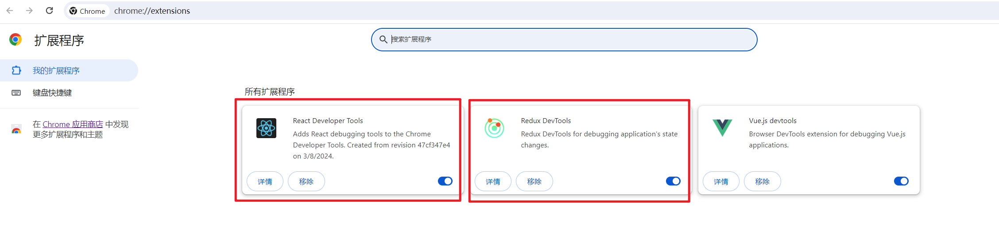
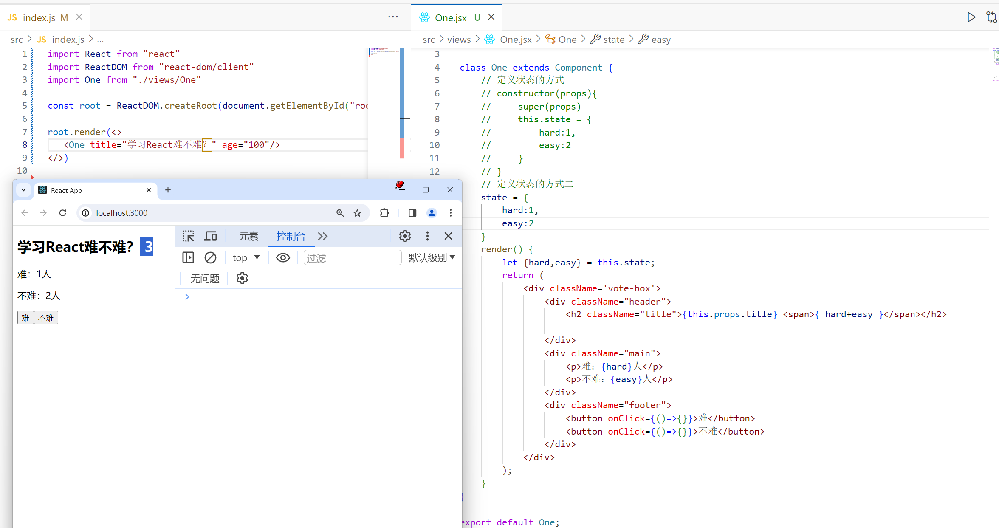
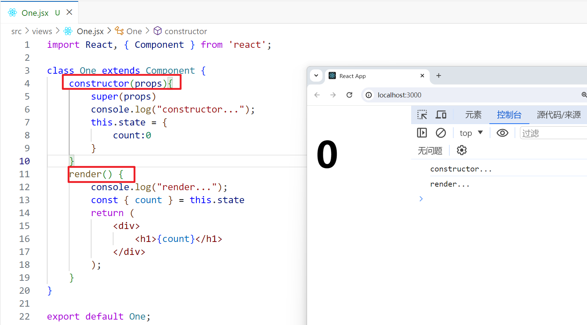
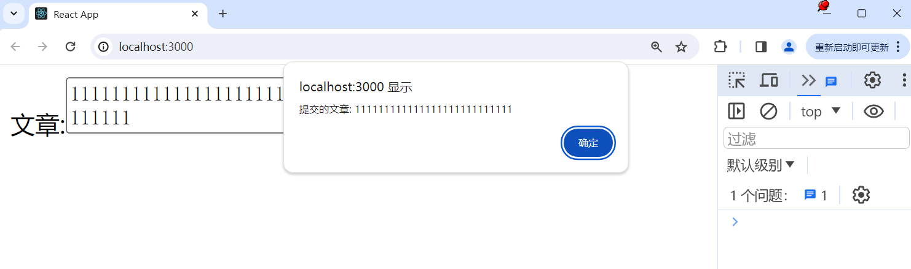
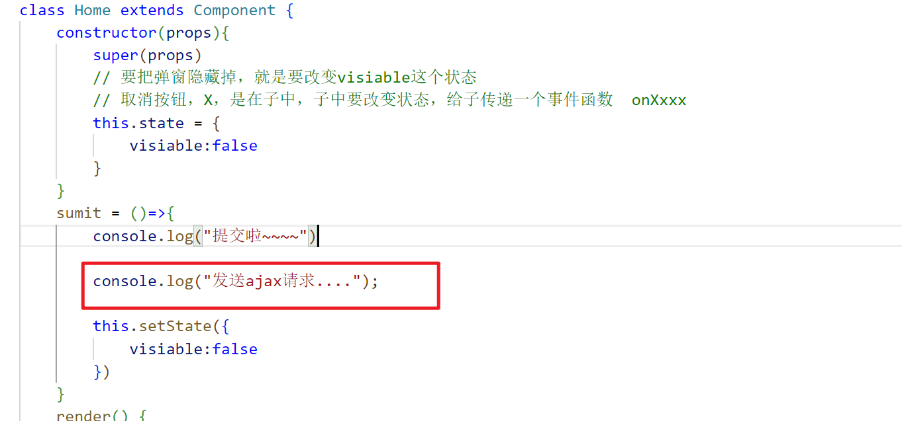
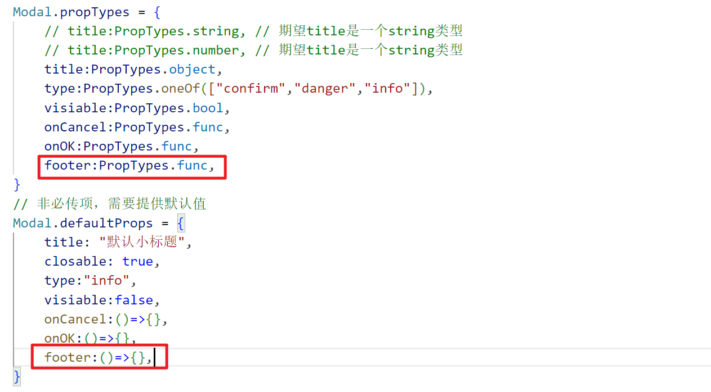
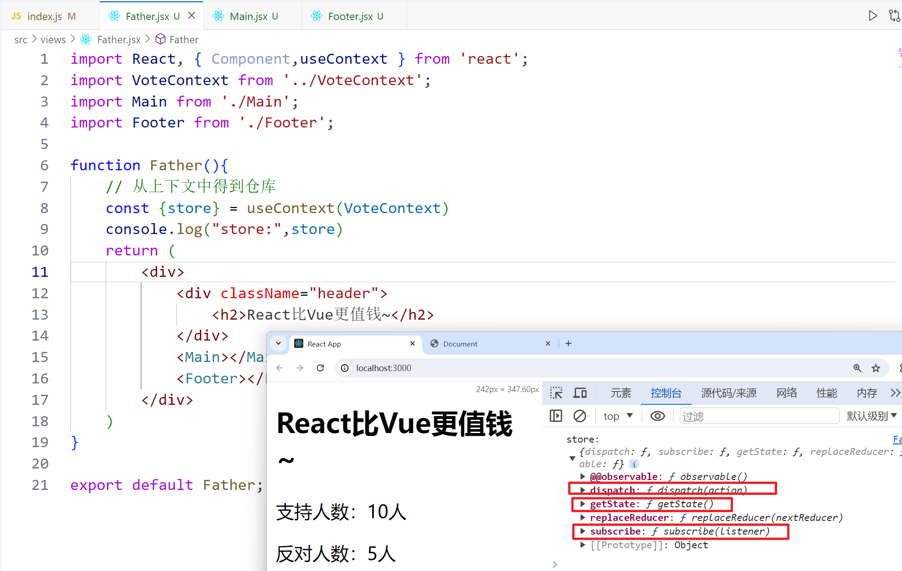
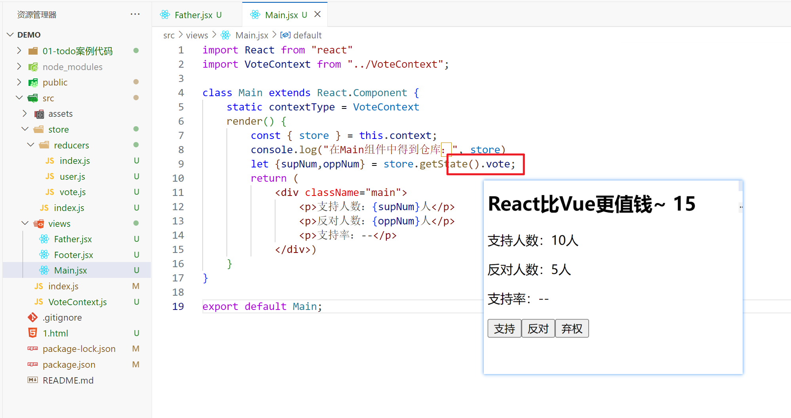
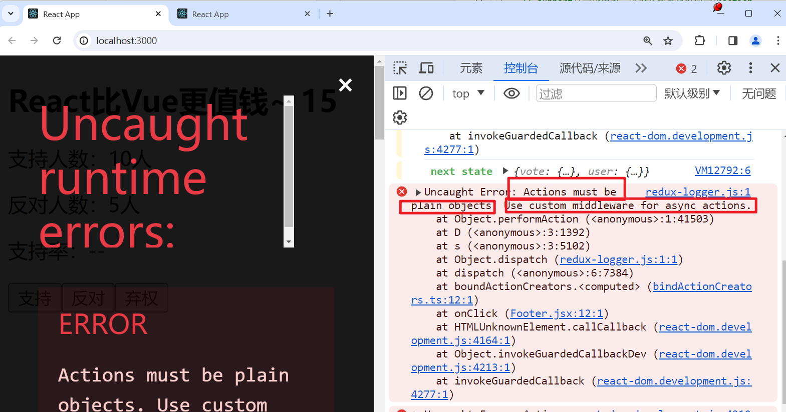
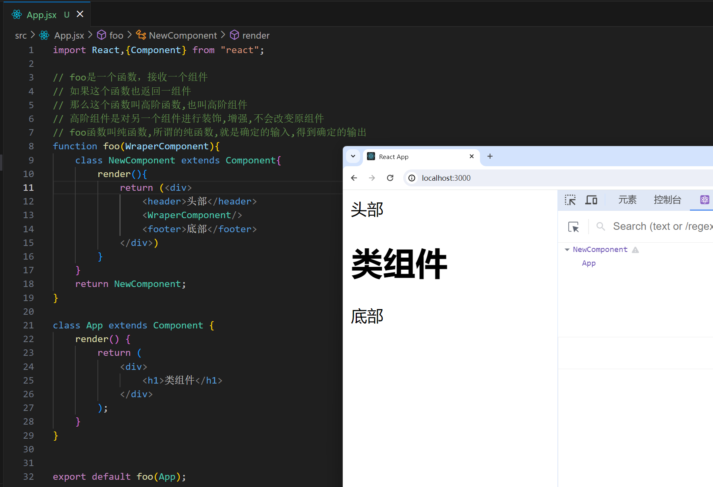

## 一，React介绍


### 1，React介绍

目前市面上主流的前端框架：

- Vue
- React
- Angular
- ....


主流思想：不需要去操作DOM，而是**数据驱动视图**。


**直接操作DOM：**

- 直接操作DOM，会导致性能消耗大一点，可能会导致DOM的重排和重绘。
- 操作DOM，相对来说，会麻烦一点


**数据驱动视图：**

- 不需要直接操作DOM
- 操作数据（状态），数据变了，框架会按相关的流程，让页面重新渲染
  - Vue：数据是响应式的，改变数据，模板重新渲染
  - 小程序：通过setData这个API，就可以达到改变数据，并重新渲染页面
  - React：通过setState这个API，达到更新页面的效果
- 框架底层在实现页面时，也是需要操作DOM的，只不过会尽可能少的操作DOM
  - 构建了一套 虚拟DOM=>真实DOM的渲染体系
  - 尽可能少的操作DOM，这样会尽可能减少重排和重绘。
- 提高开发效率，性能也会好很多


​	**React** 是一个用于构建用户界面的 JavaScript 库。React 从诞生之初就是可被逐步采用的，因而**你可以按需引入或多或少的 React 特性**。React特点：


**什么是声明式：**

- 前面学习的html标签就是声明式的。在vue中，要实现一个轮播图的功能，也是可以把轮播图封装成一个组件。声明式编程的对立面是命令式编程。

  ```html
  <!DOCTYPE html>
  <html lang="en">
  <head>
      <meta charset="UTF-8">
      <meta name="viewport" content="width=device-width, initial-scale=1.0">
      <title>Document</title>
  </head>
  <body>
      <h1>今天学习React~</h1>
      <p>我是一个孤独的P标签</p>
      
  
      <div class="carousel">
          <ul>
              <li></li>
              <li></li>
              <li></li>
          </ul>
      </div>
      <script>
          // 这种编程，叫命令式编程
          // 还有一堆的JS逻辑，还需要写很多样式
      </script>
  
  
      <hr>
  
      <!-- 声明式，组件化编译 -->
      <Carousel imgs="[1.png,2.png,3.png]"></Carousel>
  </body>
  </html>
  ```

  


官网：

- 老版 [已过时——React 中文文档 (reactjs.org)](https://zh-hans.legacy.reactjs.org/)

  

- 新版 [React 官方中文文档 (docschina.org)](https://react.docschina.org/)

  


**React版本：**

- 很早之前，是15版本，不用了。
- 16版本，项目用的还是比较多的。
- 17版本，语法和16相比，没有什么变化，只是在底层处理机制上，有所升级。
- 18版本，当前最新版本，不管是语法还是底层机制，都有变化。


### 2，React版本的HelloWorld


直接上代码：

```html
<!DOCTYPE html>
<html lang="en">
<head>
    <meta charset="UTF-8">
    <meta name="viewport" content="width=device-width, initial-scale=1.0">
    <title>Document</title>
    <!-- react.js  production 表示生产环境  会对代码进行压缩和混淆-->
    <!-- let userName = "malu"   let a = "malu" -->
    <script src="https://unpkg.com/react@^16/umd/react.production.min.js"></script>
    <!-- react-dom.js 和浏览器相关的，操作DOM -->
    <script src="https://unpkg.com/react-dom@16.13.0/umd/react-dom.production.min.js"></script>
    <!-- babel.js 是编译js代码 Babel 是一个 JavaScript 编译器。 -->
    <script src="https://unpkg.com/babel-standalone@6.26.0/babel.js"></script>
</head>
<body>
    <div id="root"></div>
    <!-- <script>
        console.log(React)
        console.log(ReactDOM)
    </script> -->

    <!-- script标签中的type的默认值是：text/javascript -->
    <script type="text/babel">
        // 定义了一个React组件
        class App extends React.Component{
            render(){
                return <h1>Hello React~</h1>
            }
        }

        ReactDOM.render(<App/>,document.getElementById("root"))
    </script>
</body>
</html>
```


效果如下：


为什么script标签中写的是text/babel？我们在组件中写的html标签，并不会直接渲染，会把你写的代码转化成js方法去执行。


我们是可以直接写方法的，不需要写标签：

```html
<!DOCTYPE html>
<html lang="en">
<head>
    <meta charset="UTF-8">
    <meta name="viewport" content="width=device-width, initial-scale=1.0">
    <title>Document</title>
    <script src="https://unpkg.com/react@^16/umd/react.production.min.js"></script>
    <script src="https://unpkg.com/react-dom@16.13.0/umd/react-dom.production.min.js"></script>
    <script src="https://unpkg.com/babel-standalone@6.26.0/babel.js"></script>
</head>
<body>
    <div id="root"></div>
    <script> 
        class App extends React.Component{
            render(){
                // 第一个参数是必填，传入的是似HTML标签名称，eg: ul, li 
                // 第二个参数是选填 对象，表示的是标签属性，
                // 第三个参数以后是选填, 子节点
                return React.createElement("h1",null,"Hello React~")
            }
        }
        ReactDOM.render(React.createElement(App,null),document.getElementById("root"))
    </script>
</body>
</html>
```


效果：


再次看一下babel官网：


书写的代码：

```jsx
class App extends React.Component{
     render(){
         return (
             <div className="app">
                 <h1>hello react!</h1>
                 <h1>hello react!</h1>
                 <h1>hello react!</h1>
                 <p>
                     <span>span</span>
                 </p>
             </div>
         )
     }
 }
```


通过babel编译后的代码：

```js
        class App extends React.Component {
            render() {
                return /*#__PURE__*/React.createElement("div", 
                {
                    className: "app"
                }, 
                /*#__PURE__*/React.createElement("h1", null, "hello react!"), 
                /*#__PURE__*/React.createElement("h1", null, "hello react!"), 
                /*#__PURE__*/React.createElement("h1", null, "hello react!"), 
                /*#__PURE__*/React.createElement("p", null, 
                                                /*#__PURE__*/React.createElement("span", null, "span")));
            }
        }
```


小小的作业：把下面标签的形式，转化成React.createElement的形式。

```html
<div className="App">
     <ul className='url_wrap'>
         <li className='item'>商城</li>
         <li className='item'>购物车</li>
         <li className='item'>订单</li>
         <li className='item'>
             <span>我的</span>
         </li>
     </ul>
</div>
```


### 3，脚手架

​	现在开发项目，都是组件化，工程化的。我们可以基于webpack自己去搭建一套工程化的架子，样这非常麻烦，复杂。React官方为我们提供了一个脚手架，叫create-react-app。默认情况下，就把webpack相关的配置就处理好了。只需要基于这个脚手架，去开发项目就OK。

 

安装脚手架：

```
npm i create-react-app -g 
```


验证是否安装成功：


安装后完，就可以创建一个项目：

```
create-react-app demo
```


安装完后，进入项目，启动项目，如下：


访问之：


默认会安装

- react，是React框架的核心，默认安装的是最新版本，学的话，就学习最新版本。
- react-dom，React视图渲染的核心。基于React构建WebApp。
- react-native，构建渲染原生App的。


使用vscode打开项目，如下：


打开package.json文件，如下：


去简化一下代码，如下：


目录结构：

```
demo 
  |- node_modules   项目的依赖
  |- src   我们写的代码基本上都是放在src下面。webpack打包时，只对src目录进行打包
      |- index.js  项目的入口
  |- public  入页面的模板
      |- index.html 
  |- package.json
  |- ....
```


## 二，JSX

​	

### 1，什么是JSX

​	jsx是用来给组件提供视图的，类似于vue中的模板。就是js和html标签混合在一起，并不是我们之前玩的字符串拼接。这种语法也会通过babel进编译，编译成js代码。JSX可以生成React元素。说白了，就是React.createElement函数调用后得到一个React元素。


### 2，JSX细节1

在jsx中，可以通过{}胡子语法，嵌入表达式。任何有值的内容都是表达式。代码如下：

```js
import React from "react"
import ReactDOM from "react-dom"

let str = "今天学习React so easy~"
let age = 100;

let element = <div>
    <p>我是一个P标签</p>
    <p>{str}</p>
    <p>{age}</p>
</div>

// 之前你渲染的是<App/>标签，现在我直接渲染React元素
// 你写的jsx，最终也会变成React元素
ReactDOM.render(element,document.getElementById("root"))
```


效果：


在ReactDOM.render时，不能直接把HTML或BODY作为根容器，必须指定一个额外的盒子，如下：


也就是说，不能把html或body当成根容器。


### 3，JSX细节2

在构建视图时，必须要有一个唯一的根节点，如果没有，就报错，如下：


也可以指定一个空标签：


我们要么使用一个div包起来，这样就会多一个div嵌套。也可以使用React中帮我们提供的组件（React.Fragment），包起来。这样的话，最外层就没有多余的div。


React给我们提供的一个特殊的组件，叫Reat.Fragment，是一个空标签。作用：

- 保证了视图只有一个根标签
- 也不新增一个HTML层级结构


### 4，JSX细节3

在{}胡子语法中，可以嵌入不同的值，下面的语法，需要大记一下。如下：

- number / string 值是啥，就渲染出来什么

  

- boolean / null / und / Symbol / BigInt 渲染出来的内容是空

  

- 渲染对象，直接报错了，但是有特殊情况

  

  - jsx元素（本质也是一个对象，这个对象就不会报错）

    

  - 给标签设置style行内样式时，也必须写成对象

    

- 渲染数组，会把数组中的每一项分别拿出来渲染，并不是变为字符串渲染，中间没有逗号

  - 数组中是number、 string，也是直接渲染

  - 数组中是boolean / null / und / Symbol / BigInt，渲染出来的内容是空

  - 数组中放jsx元素也是会被渲染的

    

- 渲染函数，不支持在{}中渲染函数的，但是函数也可以是组件，要渲染组件通过标签的形式渲染。

  

- ....


### 5，JSX细节4

给标签设置行内样式，如下：

```js
import React from "react"
import ReactDOM from "react-dom/client"

const root = ReactDOM.createRoot(document.getElementById("root"))

let element = 
    <>
        {/* 行内样式：不能直接写字符串，样式需要放到对象中，基于对象的格式处理的 */}
        {/* 样式是多个单词时，在css中，使用中划线命名，在jsx中，使用小驼峰命名 */}
        {/* 给标签添加clsss属性时，不能使用class，要使用className, class是一个关键字 */}
        <div className="box" style={ {color:"red",fontSize:"20px"} }>我是一个小小的div</div>
    </>

root.render(element)
```


效果：


有一个数据，如果是true，就显示button按钮，否则就隐藏buton按钮，代码如下：

```js
import React from "react"
import ReactDOM from "react-dom/client"

const root = ReactDOM.createRoot(document.getElementById("root"))

let flag = true;

let element = 
    <>
       {/* 通过样式控制是否显示，但是button已经创建了 */}
       <button style={ {display:flag ? 'block':'none'} }>登录</button>

       {/* 控制它创建或销毁 */}
       { flag ? <button>注册</button> : null }
    </>

root.render(element)
```


再进一步，通过一个数据，控制button中的文本，如下：


从服务器调用接口，获取到一片数据，渲染数据，如下：


你循环创建的元素一定要设置key，表示唯一值，用于优化DOM-DIFF的。


我要循环出5个button按钮，如下：

```js
import React from "react"
import ReactDOM from "react-dom/client"

const root = ReactDOM.createRoot(document.getElementById("root"))

let arr = [1,2,3,4,5]
let element = 
    <>
     <button>按钮1</button>
     <button>按钮2</button>
     <button>按钮3</button>
     <button>按钮4</button>
     <button>按钮5</button>
     <hr/> 
     {
        arr.map((item,index)=>{
            return <button key={index}>按钮{index+1}</button>
        })
     }
     <hr/> 
     {
        new Array(5).fill(null).map((_,index)=>{
            return <button key={index}>按钮{index+1}</button>
        })
     }
    </>

root.render(element)
```


### 6，JSX细节5

盘点jsx细节，盘点一下jsx的底层渲染机制，看如下代码：

```js
import React from "react"
import ReactDOM from "react-dom/client"

const root = ReactDOM.createRoot(document.getElementById("root"))

let a = 110;
let b = 120;
let styobj = {color:"red",background:"pink"}

let element = 
    <>
     <h2 style={ styobj }>我是一个孤独的h2标签</h2>
     <div>
        <p>{a}</p>
        <p>{b}</p>
     </div>
    </>
// 直接渲染一个jsx元素
root.render(element)
```


关于jsx的底层渲染机制：

- 第一步：把你编写的jsx语法，编译成虚拟DOM（VirtualDOM），虚拟DOM就是框架内部构建的一套对象体系，虚拟DOM本质就是一个对象，对象是属性的无序集合，这个对象中的属性都是React官方规定的，这个属性用于描述虚拟DOM。
- 第二步：把构建出来的虚拟DOM，渲染成为真实DOM，在浏览器中才能看到这些DOM元素。
- 补充：第一次渲染页面是直接把虚拟DOM转化成真实DOM。后期可能去更新状态，还会产生一个新的虚拟DOM。新旧的虚拟DOM会进行DOM-DIFF的对比，计算出差异，打PATC（两次虚拟DOM的差异），只去更新差异。


画图分析：


再次解释jsx元素的初始渲染机制：

- 我们编译的是jsx语法，编译成虚拟DOM对象，编译的过程如下：

  - 基于babel把jsx编译成React.createElement这种格式。只要是一个元素节点，都会经过createElement处理。有三个参数：
    - ele: 元素或标签名，也可以是组件。
    - props：元素的属性，如果没有设置属性就是null
    - children: 第三个是当前元素的子节点

- 再React.CreateElement方法执行，创建出虚拟DOM对象。虚拟DOM有的地方也叫jsx元素，可jsx对象，或者ReactChild对象....

  

  ```
  let virtualDom = {
      $$typeof:Symbol(react.element)
      ref:null,
      key:null,
      type：标签名或组件名,
      props: {  存储元素相关的属性
          children: 子节点信息，如果没有子节点，则没有这个属性，属性值可能是一个值，也可能是一个数组
      }
  }
  ```

  写上一点代码演示：

  

  

- 初次渲染时，会把虚拟DOM再次转化成真实DOM。在浏览器中就会看到渲染出来的效果。


## 三，函数式组件


### 1，无状态组件定义（函数式组件）

在React中，组件分两类：

- 函数式组件，也叫静态组件
- 类组件，也叫动态组件


写一个函数式组件：

```jsx
import React from "react"
import ReactDOM from "react-dom/client"

const root = ReactDOM.createRoot(document.getElementById("root"))

// 在React中，组件名首字母需要大写。如果是小写，就是一个普通的函数
// 光首字母大写还不行，还要求你这个函数需要返回一个jsx，jsx可以使用()包起来
function One(){
    return (
        <div className="one-box">
            我是One组件
        </div>
    )
}

root.render(<One/>)
```


也可以把一个组件放到一个文件中，如下：


然后，在index.js中就可以使用组件了，如下 ：


```js
import React from "react"
import ReactDOM from "react-dom/client"
import One from "./One"

const root = ReactDOM.createRoot(document.getElementById("root"))


root.render(<One/>)
```


组件名字，必须使用大写字母打头，否则就会报错，一般情况下，我们采用大驼峰命名法。在调用组件时，可以给组件传递各种各样的属性，如下：


```js
import React from "react"
import ReactDOM from "react-dom/client"
import One from "./One"

const root = ReactDOM.createRoot(document.getElementById("root"))


root.render(
    <One
        title="我是一个不标题"
        data={ [1,2] }
        x = "123"
        y = { 123 }
        className="box"
        style={ {color:"red"} }
    />)
```


使用babel编译上面的jsx，如下：


对于无状态的理解：


### 2，函数式组件的渲染机制

函数式组件是如何被渲染出来的，代码如下：


```js
import React from "react"
import ReactDOM from "react-dom/client"
import One from "./One"

const root = ReactDOM.createRoot(document.getElementById("root"))


root.render(
   <>
    <One
        title="我是一个不标题"
        data={ [1,2] }
        x = "123"
        y = { 123 }
        className="box"
        style={ {color:"red"} }
    />
   </>)
```


流程如下：

- 第一步：基于babel，把上面的代码编译成React.createElement形式。如下：

  

- 第二步： createElement方法执行，创建出一个虚拟DOM。type是一个函数。

  

- 第三步： 基于root.render把虚拟DOM转化成真实DOM。
  - type的值不再是一个字符串，而是一个函数
    - 把One函数执行，One()执行
    - 在执行时，会把One组件上写的属性，传递给One函数
    - One函数就会通过Props接收
    - 函数要接收，通过props接收。函数返回jsx元素（就是虚拟DOM）
    - 最后基于render把组件返回的虚拟DOM变为真实DOM，插入到#root容器中。

    

再去总结一下，在调用组件，我们可以给组件设置（传递）各种各样的属性。如果传递的不是字符串，需要使用{}包起来，在组件内部就可以通过props来接收传递过来的数据了。

 

在使用组件时，也可以在组件标签之间写东西，写的内容也是传递给了props，如下：


### 3，冻结，密封，扩展


默认情况下，一个对象是可以修改属性，添加属性，删除属性的，如下：


如果把对象给冻结了，如下：


**总结冻结**

- Object.freeze(obj)
- 检测是否被冻结：Object.isFrozen(obj)
- 特点：不能修改成员的值，不能新增成员的值，不能删除成本的，不能劫持。


前面我们说的props，默认就是被冻结的，也就意味着不能修改props的值，如下：

```js
import React from "react"
import ReactDOM from "react-dom/client"

const root = ReactDOM.createRoot(document.getElementById("root"))

function One(props){
    console.log("props:",props)
    console.log(Object.isFrozen(props))
    // props.title = "ly" // 不行的
    // props.xxx = "ok"  // 不行的
    return (
        <div className="one-box">
            我是One组件
        </div>
    )
}


root.render(<One title="malu" age={ 2 } />)
```


还有一个概念，叫密封，代码如下：


**总结密封**

- Object.seal(obj)
- 检测是否被冻结：Object.isSealed(obj)
- 特点：能修改成员的值，不能新增成员的值，不能删除成本的，不能劫持。


还有一个概念，叫扩展，代码如下：


**总结扩展**

- Object.preventExtensions(obj)
- 检测是否被冻结：Object.isExtensible(obj)
- 特点：除了不能新增，其它都可以。


如果对象被冻结了，也是不可以扩展的，也是密封的。如下：


结论：和vue一样，props中的属性，只能使用，不能修改，不能添加，不能删除。


### 4，props细节

可以基于属性，把不同的数据传递给子组件，子组件通过props接收，接收后，就可以在jsx中使用了，目的是为了提高组件的复用性。代码如下：

```js
import React from "react"
import ReactDOM from "react-dom/client"

const root = ReactDOM.createRoot(document.getElementById("root"))

function One(props){
    console.log("props:",props)
    let {title,age,data,className,children} = props;
    return (
        <div className="one-box">
            我是One组件
            <p>{ title }</p>
            <p>{ age }</p>
            <p>{ data }</p>
            <p>{ className }</p>
            <p>{ children[0] }</p>
            <p>{ children[1] }</p>
        </div>
    )
}


root.render(
<One title="malu" age={ 2 } data={ [1,2] } className="box" style={{color:'red'}} >
    <span>span</span>
    <em>em</em>
</One>)
```

效果：


props默认是被冻结的，但是我们是可以做一些校验的，安装一个包，如下：


然后就可以校验，也可以指定默认值了，如下：

```js
import React from "react"
import ReactDOM from "react-dom/client"
import PropTypes from "prop-types"

const root = ReactDOM.createRoot(document.getElementById("root"))

function One(props){
    console.log("props:",props)
    let {title,age,data,className,children,a} = props;
    return (
        <div className="one-box">
            我是One组件
            <p>{ a }</p>
            <p>{ title }</p>
            <p>{ age }</p>
            <p>{ data }</p>
            <p>{ className }</p>
            <p>{ children[0] }</p>
            <p>{ children[1] }</p>
        </div>
    )
}
// 设置默认值的
One.defaultProps = {
    a:6666
}
// 校验传递过的属性的类型
One.propTypes = {
    title:PropTypes.string, // 希望传递过来的title是sttring类型，如果不是，就报警告
    age:PropTypes.string.isRequired, // isRequired表示必传
}


root.render(
    <One a={ 8888 } title="malu" age={ 2 } data={ [1,2] } className="box" style={{color:'red'}} >
        <span>span</span>
        <em>em</em>
    </One>)
```


都能校验哪些规则，如下：


不管是校验成功，还是校验失败，都把把数据给props，如果校验失败了，会在控制台中发出警告。


### 5，插槽机制

在调用组件时，可以在标签之间写内容，如下:


在组件中打印出props，如下：


使用children，如下：


上面的案例，就相当于一个插槽，插槽可以让组件有更强的复用性。体现：

- 通过属性把数据传递给组件
- 通过标签之间写html结构（jsx对象）传递结构给组件


children有可能是一个对象，有可能是一个数组，使用children，如下：


如何解决传递一个jsx元素，也让它显示呢？如下：

```js
import React from "react"
import ReactDOM from "react-dom/client"
import PropTypes from "prop-types"

const root = ReactDOM.createRoot(document.getElementById("root"))

function One(props){
    let { children } = props;
    // 如果没有在标签之间写内容，那么children就是und
    console.log("--children:",children)
    if(!children){
        children = []
    }else if(!Array.isArray(children)){
        // 如果传递了一个jsx元素，也为成数组
        children = [children]
    }
    return (
        <div className="one-box">
            <div>
                { children[0] }
            </div>
            我是One组件
            <div>
                { children[1] }
            </div>
        </div>
    )
}

root.render(<>
    <One>
        <span>haha</span>
        <em>em</em>
    </One>
    <hr/>
    <One>
        <span>xixi</span>
    </One>
    <hr/>
    <One/>
</>)
```


上面的是我们手动的处理children，其实在React中，有一个React.Children.toArray，就可以自动把children变成数组，如下：


之前在vue中，还有一个具名插槽，在React如何实现具名插槽，如下：


解决之：

```js
import React from "react"
import ReactDOM from "react-dom/client"
import PropTypes from "prop-types"

const root = ReactDOM.createRoot(document.getElementById("root"))

function One(props){
    let { children } = props;
    children = React.Children.toArray(children)
    let headerSlot = [];
    let footerSlot = [];
    let defaultSlot = [];
    children.forEach(child=>{
        let {slot} = child.props;
        if(slot == 'header'){
            headerSlot.push(child)
        }else if(slot == 'footer'){
            footerSlot.push(child)
        }else{
            defaultSlot.push(child)
        }
    })
    return (
        <div className="one-box">
            <div>
                { headerSlot }
            </div>
            我是One组件
            <p>{ defaultSlot }</p>
            <div>
                { footerSlot }
            </div>
        </div>
    )
}

root.render(<>
    <One>
        <span slot="footer">尾部</span>
        <span slot="header">头部</span>
        <span>666666666666666</span>
    </One>
</>)
```


小作业：尝试把前面讲的内容封装成一个组件，叫Dialog


尝试封装Dialog组件：

```jsx
import React from "react"
import PropTypes from "prop-types"

function Dialog(props){
    let { title,content,children } = props;
    children = React.Children.toArray(children);
    return (
        <div className="dialog-box" style={{width:200,background:'gray'}}>
            <div className="header" style={{
                display:'flex',
                justifyContent:"space-between",
                alignItems:"center"
            }}>
                <h2 className="title">{ title }</h2>
                <span>X</span>
            </div>
            <div className="main">
                { content }
            </div>
            {
                children.length > 0 ? 
                <div>
                    { children }
                </div> : null
            }
        </div>
    )
}

Dialog.defaultProps = {
    title:"默认提示"
}
Dialog.propTypes = {
    title:PropTypes.string,
    content:PropTypes.string.isRequired
}

export default Dialog
```


在index.js中使用之：

```js
import React from "react"
import ReactDOM from "react-dom/client"
import Dialog from "./Dialog"

const root = ReactDOM.createRoot(document.getElementById("root"))

root.render(<>
    <Dialog title="温馨提示" content="你确定要删除吗？">
    </Dialog>
    <hr/>
    <Dialog title="友情提示" content="你确定要离开吗？">
        <button>确定</button>
        <button>取消</button>
    </Dialog>
</>)
```


效果：


总结函数式组件：

- 函数式组件是无状态的，也叫静态组件。
- props是用来接收数据和结构，并且props默认是被冻结
- props可以进行校验，也可以设置默认值
- 函数式组件返回jsx元素，进行渲染
- 除非在父组件中，重新调用这个函数式组件，才会重新渲染此组件
- 项目中，有这样需求：第一次渲染后就不会再有变化了，就可以使用函数式组件


## 四，类组件（有状态组件）


在使用vscode开发react时，大家可以去网上找一些插件，提高开发效率。我就安装了一个：


### 1，类组件的定义

可以基于类来构建动态组件。创建一个类，要求必须继承React.Component/PureComponent这个类。现在就创建一个组件，如下：

```jsx
import React, { Component } from 'react';

// 基于ES6中的class创建的
// 组件创建有两种方式：1）基于函数的  2）基于类的
// 这两种方式，我们都需要掌握，并且给你一种方式，你可以翻译成另一种
// 如给你一个函数式组件，你能翻译成类组件
// 给你一个类组件，你能翻译成函数组件
class One extends Component {
    // 类组件中有一个生命周期函数，叫render，函数式组件没有生命周期函数
    render() {
        // render函数需要返回一个jax
        return (
            <div className='vote-box'>
                <div className="header">
                    <h2 className="title">学习React难不难？ <span>10</span></h2>
                    
                </div>
                <div className="main">
                    <p>难：5人</p>
                    <p>不难：5人</p>
                </div>
                <div className="footer">
                    <button onClick={()=>{}}>难</button>
                    <button onClick={()=>{}}>不难</button>
                </div>
            </div>
        );
    }
}

export default One;
```


在index.js入口中使用之：

```js
import React from "react"
import ReactDOM from "react-dom/client"
import One from "./views/One"

const root = ReactDOM.createRoot(document.getElementById("root"))

root.render(<>
   <One/>
</>)
```


效果：


可以安装一个react的调试工具，如下：




在类组件中是可以定义状态，如下：

```jsx
import React, { Component } from 'react';

// 当去new One类时，会自动调用constructor
// 这个类组件，不需要我们去new，React底层会帮我们去new
// 在它帮我们new时，就会调用生命周期函数constructor，并且会传递props给constructor
class One extends Component {
    // 如果写了constructor，那么一定要调用super，然后传入props
    constructor(props){
        super(props)
        console.log("constructor...");
        this.state = {
            // 在这里定义状态
            hard:0,
            easy:0,
        }
    }
    render() {
        console.log("render...");
        return (
            <div className='vote-box'>
                <div className="header">
                    <h2 className="title">学习React难不难？ <span>{this.state.hard + this.state.easy}</span></h2>
                    
                </div>
                <div className="main">
                    <p>难：{this.state.hard}人</p>
                    <p>不难：{this.state.easy}人</p>
                </div>
                <div className="footer">
                    <button onClick={()=>{}}>难</button>
                    <button onClick={()=>{}}>不难</button>
                </div>
            </div>
        );
    }
}

export default One;
```

效果：


### 2，类组件的渲染机制

调用组件时，代码如下：


也就是转化成虚拟DOM时，那个type属性的值是类（class One），type的取值：

- 字符串： 创建一个普通html标签
- 普通函数： 函数式组件，执行函数，并且把props传递给函数
- 类：React底层会帮我们去new，new的时候，就会创建出一个实例（组件实例），并且也会解析出属性传递给组件的props。
  - 每调用一次类组件都会创建一个单独的实例（组件实例），并且组件中的this就表示这个实例。
  - 把类组件中的render方法执行，返回jsx对象（虚拟DOM），当做组件的视图进行渲染。


在调用类组件时，类组件内部做的第一件事情：

- 初始化属性，有了属性，就可以进行规则校验。默认这个props属性是通过constructor接收，如下：

  

  ```jsx
  import React, { Component } from 'react';
  
  class One extends Component {
      // 调用类组件时，第一件事情就是初始化属性，此时就可以对props进行校验
      // 默认这个props属性是通过constructor接收的。
      constructor(props){
          super(props)
          console.log("constructor...");
          console.log("--props:",props);
          this.state = {
              hard:0,
              easy:0,
          }
      }
      render() {
          console.log("render...");
          return (
              <div className='vote-box'>
                  <div className="header">
                      <h2 className="title">学习React难不难？ <span>{this.state.hard + this.state.easy}</span></h2>
                      
                  </div>
                  <div className="main">
                      <p>难：{this.state.hard}人</p>
                      <p>不难：{this.state.easy}人</p>
                  </div>
                  <div className="footer">
                      <button onClick={()=>{}}>难</button>
                      <button onClick={()=>{}}>不难</button>
                  </div>
              </div>
          );
      }
  }
  
  export default One;
  ```

  

- 如果没有写constructor属性，React内部也会把props挂载到当前组件实例上（this）

  

  ```jsx
  import React, { Component } from 'react';
  
  class One extends Component {
      render() {
          console.log("render...");
          console.log("--props",this.props);
          return (
              <div className='vote-box'>
                  <div className="header">
                      <h2 className="title">学习React难不难？ <span>0</span></h2>
                      
                  </div>
                  <div className="main">
                      <p>难：0人</p>
                      <p>不难：0人</p>
                  </div>
                  <div className="footer">
                      <button onClick={()=>{}}>难</button>
                      <button onClick={()=>{}}>不难</button>
                  </div>
              </div>
          );
      }
  }
  
  export default One;
  ```

  

- 这个props也是被冻结的，只能使用，不能修改，添加，劫持。可以对属性进行校验，设置默认值

  

  ```jsx
  import React, { Component } from 'react';
  import PropTypes from "prop-types"
  
  class One extends Component {
      static defaultProps = {
          title:"这是默认值"
      }
      static propTypes = {
          title:PropTypes.string,
          age:PropTypes.number.isRequired
      }
      render() {
          console.log("render...");
          console.log("--props",this.props);
          return (
              <div className='vote-box'>
                  <div className="header">
                      <h2 className="title">{this.props.title} <span>0</span></h2>
                      
                  </div>
                  <div className="main">
                      <p>难：0人</p>
                      <p>不难：0人</p>
                  </div>
                  <div className="footer">
                      <button onClick={()=>{}}>难</button>
                      <button onClick={()=>{}}>不难</button>
                  </div>
              </div>
          );
      }
  }
  
  export default One;
  ```

  


在调用类组件时，类组件内部做的第二件事情：

- 初始化状态，如果后期修改了状态，会重新render，叫re-render。

  

  

  ```jsx
  import React, { Component } from 'react';
  import PropTypes from "prop-types"
  
  class One extends Component {
      // 定义状态的方式一
      // constructor(props){
      //     super(props)
      //     this.state = {
      //         hard:1,
      //         easy:2
      //     }
      // }
      // 定义状态的方式二
      state = {
          hard:1,
          easy:2
      }
      render() {
          let {hard,easy} = this.state;
          return (
              <div className='vote-box'>
                  <div className="header">
                      <h2 className="title">{this.props.title} <span>{ hard+easy }</span></h2>
                      
                  </div>
                  <div className="main">
                      <p>难：{hard}人</p>
                      <p>不难：{easy}人</p>
                  </div>
                  <div className="footer">
                      <button onClick={()=>{}}>难</button>
                      <button onClick={()=>{}}>不难</button>
                  </div>
              </div>
          );
      }
  }
  
  export default One;
  ```

  

- 修改状态，更新视图，React提供了专属的API，叫setState，不光可以修改状态，还可以更新视图。

  

  

  ```jsx
  import React, { Component } from 'react';
  
  class One extends Component {
      state = {
          hard:1,
          easy:2
      }
      render() {
          let {hard,easy} = this.state;
          return (
              <div className='vote-box'>
                  <div className="header">
                      <h2 className="title">{this.props.title} <span>{ hard+easy }</span></h2>
                      
                  </div>
                  <div className="main">
                      <p>难：{hard}人</p>
                      <p>不难：{easy}人</p>
                  </div>
                  <div className="footer">
                      <button onClick={()=>{
                          // 修改状态(暴力修改状态，直接修改状态)
                          // 但样去修改状态，界面是没有刷新的
                          // this.state.hard++
                          // console.log(this.state.hard);
  
                          // setState这个API就是专门用于修改状态，通过它修改状态后，界面是会刷新的
                          this.setState({
                              // hard++ 不行   
                              // hard++ 整体的值是一个旧值
                              // hard:hard++, 
                              
                              // 也可以的
                              // ++hard 整体的值是一个新值
                              // 不推荐这样写，++hard也是暴力修改了状态
                              // hard:++hard
  
                              // 可以的  推荐这一种写法
                              hard:hard+1
                          })
                      }}>难</button>
                      <button onClick={()=>{
                          this.setState({
                              easy:easy+1
                          })
                      }}>不难</button>
                  </div>
              </div>
          );
      }
  }
  
  export default One;
  ```

  

- 也可以使用this.forceUpdate强制更新（不推荐）

  

  ```jsx
  import React, { Component } from 'react';
  
  class One extends Component {
      state = {
          hard:1,
          easy:2
      }
      render() {
          let {hard,easy} = this.state;
          return (
              <div className='vote-box'>
                  <div className="header">
                      <h2 className="title">{this.props.title} <span>{ hard+easy }</span></h2>
                      
                  </div>
                  <div className="main">
                      <p>难：{hard}人</p>
                      <p>不难：{easy}人</p>
                  </div>
                  <div className="footer">
                      <button onClick={()=>{
                         this.state.hard++  // 直接修改状态，状态值是变了，但是界面没有更新
                         console.log(hard);
                         this.forceUpdate();
                      }}>难</button>
                      <button onClick={()=>{
                          this.setState({
                              easy:easy+1
                          })
                      }}>不难</button>
                  </div>
              </div>
          );
      }
  }
  
  export default One;
  ```

  


### 3，props和state

如果说state是组件的内部状态，那么props就是外部状态。无状态组件其实是没有内部状态的。说白了，就是类组件才有state，才有状态。函数式组件是没有state的，没有状态。定义一个类组件，如下：


```jsx
import React, { Component } from 'react';

class One extends Component {
    constructor(props){
        super(props)
        this.state = {
            count:0
        }
        setInterval(() => {
            this.setState({
                count: this.state.count + 1
            })
        }, 1000);

    }
    render() {
        const { count } = this.state
        return (
            <div>
                {count}
            </div>
        );
    }
}

export default One;
```


无状态组件也可以通过props来响应数据的变化：


state和props的区别之组件更新的区别

- 只要写了setState，就会也调用组件的render方法，这样说不太准确，后面还会说其它的生命周期。
- 无状态组件是怎么更新的，Son组件的更新，是不是render引起的？无状态组件，只要props不会变化，组件不会进行更新的。

- render方法的执行，不一定可以影响无状态组件的更新。无状态组件只看自己的props有没有发生变化


使用场景：

- 在组件内部可以形成闭环的状态，不管是静态还是动态，使用state

- 组件外部的状态，经常需要发生变化，或者定制化的内容，可以考虑使用props

    ```jsx
    import React, { Component } from 'react';
    ```

// 汽车有不同的颜色
class Car extends Component {
    constructor(props){
        super(props)
        this.state = {
            engine:props.engine,
            Headlights:"LED",
            door:"open",
            color:props.color
        }
    }
    render() {
        return (
            <div>
                
            </div>
        );
    }
}

// <Car color="white" engine="1.5T" />
// <Car color="black" engine="2.0T" />
// <Car color="red" />

export default Car;
    ```


### 4，类组件的生命周期

#### a）单个组件的生命周期

​	React从v16.3的版本开始， 对生命周期的钩子进行了渐进式的调整，分别废弃和新增了一些生命周期的钩子函数。


前面我们讲了两个生命周期函数，一个是constructor，一个是render。如下：




老版常用生命周期：


​	然后还会触发一个钩子函数，叫componentWillMount，在组件第一次渲染之前触发。此勾子函数目前是不安全的，但是是可以使用的。只是在控制台中会有黄色的警告。为了不让它警告，可以使用UNSAFE_componentWillMount，代码如下：


然后学会触发一个钩子函数，叫componentDidMount，代码如下：


流程图：


组件的更新逻辑，当修改了状态，组件会更新，就会调用shouldComponentUpdate这个勾子函数，测试如下：


上面我们允许更新了，就会触发componentWillUpdate这个钩子函数，也是不安全的，在这个钩子中，状态还没有被修改，代码如下：


然后修改状态的值，修改完后，调用再次render函数，进行组件更新，流程：

- 按最新的状态/属性，把返回的jsx编译成新的虚拟DOM
- 和上一次渲染出来的旧的虚拟DOM进行对比，所谓的DIFF算法
- 找到差异，把差异进行渲染，渲染成真实DOM


然后还会调用compoentDidUpdate，表示组件更新完毕。如下：


当我们在shouldComponentUpdate中，返回了false，下的钩子函数就会再执行了，如下：


如果我们基于this.forceUpdate强制更新视图，会跳过shouldComponentUpdate函数的校验，直接从WillUpdate开始进行更新，说白了，视图一定会触发更新。


前面我们说了，当我们调用this.setState 或 this.forceUpdate时，会进入组件的更新逻辑。除了这种情况下之外，还有一种情况，也可以让组件进行更新逻辑。当组件的props发生变化了，也会进入更新逻辑，代码如下：


还有一个钩子函数，当属性发生变化了，就会调用，如下：


总结：通过哪些方式，可以让组件进入更新逻辑

- this.setState 改变状态
- this.forceUpdate 强制更新
- 调用组件时的属性发生变化了，在componentWillReceiveProps中可以接收最新的属性

 

```jsx
import React, { Component } from 'react';

class One extends Component {
    constructor(props){
        super(props)
        console.log("constructor...");
        this.state = {
            count:0
        }
    }
    UNSAFE_componentWillMount(){
        console.log("componentWillMount...");
    }
    componentDidMount(){
        console.log("componentDidMount...");
    }
    UNSAFE_componentWillReceiveProps(){
        console.log("componentWillReceiveProps...")
    }
    shouldComponentUpdate(){
        console.log("shouldComponentUpdate...")
        return true;
    }
    UNSAFE_componentWillUpdate(){
        console.log("componentWillUpdate...")
    }
    componentDidUpdate(){
        console.log("componentDidUpdate...");
    }
    render() {
        console.log("render...");
        const { count } = this.state
        return (
            <div>
                <h1>{count}</h1>
                {/* <button onClick={()=>{this.setState({count:count+1})}}>+1</button> */}
                <button onClick={()=>{
                    this.state.count++;
                    this.forceUpdate();
                }}>+1</button>
            </div>
        );
    }
}

export default One;
```


```js
import React from "react"
import ReactDOM from "react-dom/client"
import One from "./views/One"

const root = ReactDOM.createRoot(document.getElementById("root"))

root.render(<>
   <One title="学习React难不难？" age="100"/>
</>)

setTimeout(()=>{
   root.render(<>
      <One title="学习vue难不难？" age="100"/>
   </>)   
},3000)
```


#### b）父子组件的生命周期

生命周期：


**挂载**

- constructor
- componentWillMount
- render
- componentDidMount

**更新**

- componentWillReceiveProps
- shouldComponentUpdate
- componentWillUpdate
- render
- componentDidUpdate

**卸载**

- componentWillUnmount


父组件：


```jsx
import React, { Component } from 'react';

class Father extends Component {
    constructor(props){
        super(props)
        console.log("father constructor...");
    }
    UNSAFE_componentWillMount(){
        console.log("father componentWillMount...");
    }
    componentDidMount(){
        console.log("father componentDidMount...");
    }
    render() {
        console.log("father render...");
        return (
            <div>
                <h1>Hello World!</h1>
            </div>
        );
    }
}

export default Father;
```


创建子组件，如下：


```jsx
import React, { Component } from 'react';

class Child extends Component {
    constructor(props){
        super(props)
        console.log("child constructor...");
    }
    UNSAFE_componentWillMount(){
        console.log("child componentWillMount...");
    }
    componentDidMount(){
        console.log("child componentDidMount...");
    }
    render() {
        console.log("child render...")
        return (
            <div>
                
            </div>
        );
    }
}

export default Child;
```


然后研究子中的componentWillReceiveProps钩子函数：


```jsx
import React, { Component } from 'react';
import Child from './Child';

class Father extends Component {
    constructor(props){
        super(props)
        console.log("father constructor...");
        this.state = {
            a:1
        }
    }
    UNSAFE_componentWillMount(){
        console.log("father componentWillMount...");
    }
    componentDidMount(){
        console.log("father componentDidMount...");
    }
    render() {
        console.log("father render...");
        return (
            <div>
                <h1>Hello World! {this.state.a}</h1>
                <button onClick={()=>{
                    this.setState({
                        a:this.state.a+1
                    })
                }}>+1</button>
                <hr/>
                <Child a={this.state.a}/>
            </div>
        );
    }
}

export default Father;
```

```jsx
import React, { Component } from 'react';

class Child extends Component {
    constructor(props){
        super(props)
        console.log("child constructor...");
    }
    UNSAFE_componentWillMount(){
        console.log("child componentWillMount...");
    }
    componentDidMount(){
        console.log("child componentDidMount...");
    }
    // 组件将要接收新的props  说明新的props还没有到this上
    // new_props是新的参数（props）  this.props得到的是老的props
    UNSAFE_componentWillReceiveProps(new_props){
        console.log("child componentWillReceiveProps...",new_props,this.props);
    }
    render() {
        console.log("child render...")
        return (
            <div>
                <h2>子：{this.props.a}</h2>
            </div>
        );
    }
}

export default Child;
```


效果：


再去研究compoentWillUpdate和compoentDidUpdate，如下：


```jsx
import React, { Component } from 'react';

class Child extends Component {
    constructor(props){
        super(props)
        console.log("child constructor...");
    }
    UNSAFE_componentWillMount(){
        console.log("child componentWillMount...");
    }
    componentDidMount(){
        console.log("child componentDidMount...");
    }
    // 组件将要接收新的props  说明新的props还没有到this上
    // new_props是新的参数（props）  this.props得到的是老的props
    UNSAFE_componentWillReceiveProps(new_props){
        console.log("child componentWillReceiveProps...",new_props,this.props);
    }
    // 将要更新，还没有更新
    // 我都准备更新了，那么得到的props参数一定是新的
    // 但是还有机会去得到旧的props   this.props就表示旧的props。
    UNSAFE_componentWillUpdate(props, state){
        console.log("child componentWillUpdate...",props,state);
    }
    // 控制组件是否更新
    // shouldComponentUpdate(){}
    // 已经更新完成
    componentDidUpdate(){
        console.log("child componentDidUpdate",this.props);
    }
    render() {
        console.log("child render...")
        return (
            <div>
                <h2>子：{this.props.a}</h2>
            </div>
        );
    }
}

export default Child;
```


还有一个生命周期函数，叫shouldComponentUpdate，如下：


效果：


测试子组件的销毁：


```jsx
import React, { Component } from 'react';
import Child from './Child';

class Father extends Component {
    constructor(props){
        super(props)
        console.log("father constructor...");
        this.state = {
            a:1,
            flag:true
        }
    }
    UNSAFE_componentWillMount(){
        console.log("father componentWillMount...");
    }
    componentDidMount(){
        console.log("father componentDidMount...");
    }
    render() {
        console.log("father render...");
        return (
            <div>
                <h1>Hello World! {this.state.a}</h1>
                <button onClick={()=>{
                    this.setState({
                        a:this.state.a+1
                    })
                }}>+1</button>
                <button onClick={()=>{
                     this.setState({
                        flag:!this.state.flag
                    })
                }}>改变flag</button>
                <hr/>
                {this.state.flag ? <Child a={this.state.a}/>:null}
            </div>
        );
    }
}

export default Father;
```

```jsx
import React, { Component } from 'react';

class Child extends Component {
    constructor(props){
        super(props)
        console.log("child constructor...");
    }
    UNSAFE_componentWillMount(){
        console.log("child componentWillMount...");
    }
    componentDidMount(){
        console.log("child componentDidMount...");
    }
    // 组件将要接收新的props  说明新的props还没有到this上
    // new_props是新的参数（props）  this.props得到的是老的props
    UNSAFE_componentWillReceiveProps(new_props){
        console.log("child componentWillReceiveProps...",new_props,this.props);
    }
    // 将要更新，还没有更新
    UNSAFE_componentWillUpdate(props, state){
        console.log("child componentWillUpdate...",props,state,this.props);
    }
    // 控制组件是否更新
    // 在子中写shouldComponentUpdate 是控制子是否要更新
    // 必须返回true或false  false表示不更新，true表示更新
    // 第一个形参表示新的porps，第二个形参表示新的state
    shouldComponentUpdate(new_props,new_state){
        console.log("child shouldComponentUpdate...",new_props,new_state)
        return true;
    }
    // 已经更新完成
    componentDidUpdate(){
        console.log("child componentDidUpdate",this.props);
    }
    componentWillUnmount(){
        console.log("child componentWillUnmount...");
    }
    render() {
        console.log("child render...")
        return (
            <div>
                <h2>子：{this.props.a}</h2>
            </div>
        );
    }
}

export default Child;
```


效果：


如果有组件的嵌套，嵌套会形成父子组件，如果有父子组件了，在处理机制上遵循深度调优先的原则，也就是渲染父组件时，遇到了子组件，一定要先把子组件处理完，然后再处理父组件，它们的生命周期执行流程如下：

- 父组件第一次渲染
  - 父willMount => 父render【子willMount=>子render=>子didMount】=>父didMount
- 父组件更新
  - 父shouldUpdate =>父willUpdate=>父render【子willReceivProps=>子shouldUpdate=>子willUpdate=>子的render=>子didUpdate】=>父didUpdate
- 父组件销毁
  - 父willUnmount => 处理中【子willUnmount=>子销毁】=>父销毁


#### c）生命周期的两大阶段

​	在 React 中，对于每一次由状态改变导致页面视图的改变，都会经历两个阶段：`render 阶段`、`commit 阶段`。只有 class 组件才有生命周期，因为 class 组件会创建对应的实例，而函数组件不会。组件实例从被创建到被销毁的过程称为**组件的生命周期**。

​	由 class 组件创建的实例具有生命周期，它的 render 函数在 render 阶段执行，并在此阶段进行 DOM 节点的 diff（diff 算法就是在此阶段进行的），找出需要改变的 DOM 操作。然后在 commit 阶段将对应的 DOM 操作提交至视图中。

​	而 class 组件实例的所有生命周期函数，都会在 render 阶段和 commit 阶段执行。

​	关于生命周期的文档：https://zh-hans.legacy.reactjs.org/docs/react-component.html


#### d）Render阶段

**constructor**

​	该方法只会执行一次，调用该方法会返回一个组件实例。在初始化阶段执行，可直接对 `this.state` 赋值。其他生命周期函数中只能通过 `this.setState` 修改 state，不能直接为 `this.state` 赋值。一般在 constructor 中做一些组件的初始化工作，例如：初始化组件的 state。


**componentWillReceiveProps**

​	在已挂载组件接收到新的 props 之前调用。你可以在这个函数中比较新旧 props，并根据新旧 props 更改 state。但是它会**破坏 props 数据的单一数据源**。在首次渲染组件时，不会调用此生命周期钩子；使用 `this.setState` 触发组件更新时，也不会调用此生命周期钩子。

​	不过要**注意**：如果是父组件渲染导致了组件的重新渲染，即使传给该组件的 props 没变，该组件中的这个生命周期函数也会被调用。

​	我们一般不使用此生命周期函数，因为它通常会破坏数据源的单一性。


**getDerivedStateFromProps**

​	它是一个**静态方法**，接收 props 和 state 两个参数。它会在调用 render 方法之前被调用，不管是在初始挂载时还是在后续组件更新时都会被调用。

​	它的调用时机和 componentWillMount、componentWillUpdate、componentWillReceiveProps 一样都是在 render 方法被调用之前，它可以作为 componentWillMount、componentWillUpdate 和 componentWillReceiveProps 的替代方案。

​	当然，它的作用不止如此，它可以返回一个对象，用来更新 state，就像它的名字一样，从 props 中获取衍生的 state。如果不需要更新 state 则可以返回 null。

​	需要**注意**的是：这个生命周期函数是类的**静态方法**，并不是原型中的方法，所以在其内部使用 this 访问到的不是组件实例。

​	此生命周期钩子不常用，如果可以的话，我们也尽可能不会使用它。

​	关于为什么要废弃 componentWillMount、componentWillUpdate、componentWillReceiveProps 三个生命周期钩子而新增 getDerivedStateFromProps 生命周期钩子，后面会说明原因。


**shouldComponentUpdate**

​	在组件准备更新之前调用，但是首次渲染或者使用 forceUpdate 函数时不会被调用。跟它的名字一样，它用来判断一个组件是否应该更新。

​	默认情况下，当组件的 props 或者 state 变化时，都会导致组件更新。它在 render 方法之前执行，如果它的返回值为 false，则不会更新组件，也不会执行后面的 render 方法。

​	它接收两个参数，nextProps 和 nextState，即下一次更新的 props 和下一次更新的 state。我们可以将 `this.props` 和 nextProps 比较，以及将 `this.state` 与 nextState 比较，并返回 false，让组件跳过更新。不过**注意**：它并不会阻止子组件因为 state 改变而导致的更新。这个生命周期方法通常用来做性能优化。


**componentWillMount（UNSAFE）**

​	在组件挂载至 DOM 之前调用，并且只会调用一次。它在 render 方法之前调用，因此在 componentWillMount 中调用 `this.setState` 不会触发额外的渲染。

​	这个生命周期钩子使用频率较小，因为我们一般在 constructor 中**初始化 state**，在 componentDidMount 中**引入副作用**或者**订阅内容**。


**componentWillUpdate（UNSAFE）**

​	在组件即将更新之前执行，如果 shouldComponentUpdate 函数返回 false，则不会调用 componentWillUpdate 方法。

​	这个生命周期钩子和 componentWillMount 类似，执行的时机是相同的，只不过 componentWillMount 在组件首次渲染时执行，而 componentWillUpdate 在组件后续更新时执行。这两个生命周期函数都不经常使用。


**render**

​	render 方法是类组件中唯一必须实现的方法，它的返回值将作为页面渲染的视图。render 函数应该为纯函数，也就是对于相同的 state 和 props，它总是返回相同的渲染结果。render 函数被调用时，会返回以下四种类型之一：

- React 元素：通常为 JSX 语法。例如：`<div />`、`<MyComponent>` 等等。
- 数组或者 fragments：render 方法可以通过数组返回多个元素。
- Portals：渲染子节点至不同的子树中。
- 字符串或者数值：会作为文本节点被渲染。
- boolean 类型或者 null：什么都不渲染。

需要**注意**的是：如果 shouldComponentUpdate 生命周期钩子返回 false，则 render 方法（render 阶段后续生命周期钩子）不会执行。


#### e）Commit阶段

​	commit 阶段在首次渲染时会执行 componentDidMount，在组件更新时会执行 getSnapshotBeforeUpdate 和 componentDidUpdate。


**componentDidMount**

​	该生命周期方法会在组件挂载之后执行，也只会执行一次，也就是将组件对应的 DOM 插入 DOM 树中之后调用。它会在浏览器更新视图之前调用，如果在 componentDidMount 中**直接调用** `this.setState`，它会触发额外的渲染，会再一次调用 render 函数，但是浏览器中视图的更新只会执行一次。**使用场景：**依赖于 DOM 的初始化**操作应该放在这里，此外，我们一般在这个生命周期方法中**发送网络请求**、**添加订阅**等。


**getSnapshotBeforeUpdate**

​	此生命周期函数在最近一次渲染提交至 DOM 树之前执行，此时 DOM 树还未改变，我们可以在这里获取 DOM 改变前的信息，例如：更新前 DOM 的滚动位置。它接收两个参数，分别是：prevProps、prevState，上一个状态的 props 和上一个状态的 state。它的返回值将会传递给 componentDidUpdate 生命周期钩子的第三个参数。**使用场景：**需要**获取更新前 DOM 的信息**时。例如：需要以特殊方式处理滚动位置的聊天线程等。


**componentDidUpdate**

​	在组件更新后立即调用，首次渲染不会调用该方法。它的执行时机和 componentDidMount 一致，只是 componentDidMount 在首次渲染时调用，而 componentDidUpdate 在后续的组件更新时调用。可以在这个生命周期中直接调用 `this.setState`，但是必须包裹在一个条件语句中，否则会导致死循环。

​	componentDidUpdate 接收三个参数，分别是 prevProps、prevState、snapshot，即：前一个状态的 props，前一个状态的 state、getSnapshotBeforeUpdate 的返回值。

​	如果组件实现了 getSnapshotBeforeUpdate 生命周期函数，则 getSnapshotBeforeUpdate 的返回值将作为 componentDidUpdate 的第三个参数。**使用场景：**在这个生命周期方法中，可以**对 DOM 进行操作**或者进行**网络请求**。


**componentWillUnmount**

​	这个生命周期函数会在组件卸载以及销毁之前调用。**使用场景：**通常用来执行组件的**清理操作**，例如：清除 timer、取消网络请求、清除订阅等。


#### f）为什么废弃三个生命周期函数


React 在 16.3 版本中：

- 将 componentWillMount、componentWillReceiveProps、componentWillUpdate 三个生命周期钩子加上了 UNSAFE 前缀，变为 UNSAFE_componentWillMount、UNSAFE_componentWillReceiveProps 和 UNSAFE_componentWillUpdate。
- 并引入了一个新的生命周期钩子：getDerivedStateFromProps。


并在 17.0 以及之后的版本中：

- 删除了 componentWillMount、componentWillReceiveProps、componentWillUpdate 这三个生命周期钩子。
- 不过 UNSAFE_componentWillMount、UNSAFE_componentWillReceiveProps 和 UNSAFE_componentWillUpdate 还是可以用的。


**为什么**要废弃这三个生命周期钩子？它们有哪些问题呢？React 又是**如何解决**的呢？

​	我们知道 React 的更新流程分为：render 阶段和 commit 阶段。componentWillMount、componentWillReceiveProps、componentWillUpdate 这三个生命周期钩子都是在 render 阶段执行的。

​	在 fiber 架构被应用之前，render 阶段是不能被打断的。当页面逐渐复杂之后，就有可能会阻塞页面的渲染，于是 React 推出了 fiber 架构。在应用 fiber 架构之后，低优先级任务的 render 阶段可以被高优先级任务打断。

​	而这导致的**问题**就是：**在 render 阶段执行的生命周期函数可能被执行多次**。像 componentWillMount、componentWillReceiveProps、componentWillUpdate 这三个生命周期钩子，如果我们在其中执行一些具有副作用的操作，例如发送网络请求，就有可能导致一个同样的网络请求被执行多次，这显然不是我们想看到的。

​	而 React 又没法强迫开发者不去这样做，因为怎么样使用 React 是开发者的自由，所以 React 就新增了一个静态的生命周期 getDerivedStateFromProps，来解决这个问题。

​	用一个**静态函数** getDerivedStateFromProps 来取代被废弃的几个生命周期函数，这样开发者就无法通过 this 获取到组件的实例，也不能**发送网络请求**以及**调用** `this.setState`。它就是强制开发者在 render 之前只做无副作用的操作，间接强制我们无法进行这些不合理不规范的操作，从而避免对生命周期的滥用。


### 5，PureComponent

在React中创建一个类组件，要么继承React.Component，要么继承React.PureComponent。在讲继承PureComponent之前，先说一下浅比较，如下：

```js
let obj = {a:110}  // obj指向了{a:110}这个堆   obj是一个地址：0x123

let objA = {x:1,y:obj,arr:[1,2,3]}
let objB = {x:1,y:obj,arr:[1,2,3]}

浅比较objA和objB,只会比较第一层：
     objA          objB
      x             x             一样
      y:0x123       y:0x123       一样
      arr:0x456     arr:0x789     不一样
      
如果objA和objB中的成员个数都不一样，两个对象肯定是不一致的。
```


写一个小案例，通过案例说一下React.PureComponent。如下：

```jsx
import React, { Component, PureComponent } from 'react';

// 如果继承了Component ，那么是可以实现添加span
// 如果继承了PureComponent，那么是不能添加span
class One extends PureComponent {
    state = {
        arr:[1,2,3]
    }
    render() {
        let {arr} = this.state;
        return (
            <div>
                {
                    arr.map((item,index)=>{
                        return <span key={index} style={{
                            display:"inline-block",
                            width:100,
                            height:100,
                            background:"gold",
                            marginRight:10
                        }}>{item}</span>
                    })
                }
                <hr/>
                <button onClick={()=>{
                    arr.push(4);
                    this.setState({
                        arr
                    })
                }}>添加span</button>
            </div>
        );
    }
}

export default One;
```

效果如下：


PureComponent和Component的区别：

- PureComponent 会给类组件添加一个shouldComponentUpdate生命周期函数

- 在这个生命周期函数中，它对新老属性/状态会做一个浅比较

  

- 如果经过浅比较，发现属性或状态并没有改变，则返回false，也就意味着不更新组件了。


遇到到种情况，如何解决，如下：


```jsx
import React, { Component, PureComponent } from 'react';

// 如果继承了Component ，那么是可以实现添加span
// 如果继承了PureComponent，那么是不能添加span
class One extends PureComponent {
    state = {
        arr:[1,2,3]
    }
    render() {
        let {arr} = this.state;
        return (
            <div>
                {
                    arr.map((item,index)=>{
                        return <span key={index} style={{
                            display:"inline-block",
                            width:100,
                            height:100,
                            background:"gold",
                            marginRight:10
                        }}>{item}</span>
                    })
                }
                <hr/>
                <button onClick={()=>{
                    arr.push(4);
                    this.setState({
                        // arr  // arr的地址是没有变化的
                        arr:[...arr]  // 这一种写法，arr就是一个新的地址
                    })
                }}>添加span</button>
            </div>
        );
    }
}

export default One;
```


### 6，Ref


#### 1）Ref获取DOM

使用传统方式，获取Dom，如下：

```jsx
import React, { Component, PureComponent } from 'react';

// 如果继承了Component ，那么是可以实现添加span
// 如果继承了PureComponent，那么是不能添加span
class One extends PureComponent {
    // 虚拟DOM转化成真实DOM，并挂载完毕，此时，就可以获取DON，操作DOM
    componentDidMount(){
        console.log(document.querySelector(".title"));
    }
    render() {
        return (
            <div>
                <h1 className="title">温馨提示</h1>
            </div>
        );
    }
}

export default One;
```

效果：


上面的获取DOM的方式，是不推荐，推荐使用ref形式来获取DOM，如下：

```jsx
import React, { Component, PureComponent } from 'react';

class One extends PureComponent {
    // 虚拟DOM转化成真实DOM，并挂载完毕，此时，就可以获取DON，操作DOM
    componentDidMount(){
        // console.log(document.querySelector(".title"));
        // ref后面跟一个字符串，写法也废弃了
        console.log(this.refs.titleRef);
    }
    render() {
        return (
            <div>
                {/* ref后面跟了一个字符串 */}
                <h1 className="title" ref="titleRef">温馨提示</h1>
            </div>
        );
    }
}

export default One;
```


效果：


可以编译一下，上面的jsx，如下：


也就说，通过ref是可以获取DOM元素的，给需要获取的元素设置ref="xxx"，后期可以基于this.refs.xxx去获取相应的DOM元素，这种写法比较老了，不推荐使用。在ref后面也可以跟上一个函数，如下：

```jsx
import React, { Component, PureComponent } from 'react';

class One extends PureComponent {
    componentDidMount(){
        console.log(this.box1);
    }
    render() {
        return (
            <div>
                {/* ref后面跟了一个函数，形参x就表示dom元素，把这个x挂载到了this上面 */}
                {/* this表示组件实例，就是把dom元素挂载到了组件实例上 */}
                <h1 className="title" ref={ x=>this.box1 = x }>温馨提示</h1>
            </div>
        );
    }
}

export default One;
```


效果：


总结一下，第二种写法，ref后面跟一个函数，x是函数的形参，存储的就是DOM元素，把x挂载到当前组件的某个属性的。当编译jsx时，它内部肯定要把函数执行，函数执行时，就会把DOM元素传递给x形参。还有一个写法，是利用creaetRef先创建一个ref，如下：

```jsx
import React, { Component, PureComponent } from 'react';

class One extends PureComponent {
    // box1是当前组件实例的属性
    box1 = React.createRef();

    componentDidMount(){
        console.log(this.box1);
        console.log(this.box1.current);
    }
    render() {
        return (
            <div>
                <h1 className="title" ref={ this.box1 }>温馨提示</h1>
            </div>
        );
    }
}

export default One;
```


效果：


第三种写法，是基于React.createRef方法创建一个REF对象，通过ref={ref对象}。就可以通过ref对象.current就可以得到对应的DOM元素了。


#### 2）Ref获取组件实例

准备两个子组件，如下：


```jsx
import React, { Component, PureComponent } from 'react';

// 类组件  类组件才有实例
class Child1 extends Component {
    state = {
        x:1,y:2
    }
    render() {
        return (
            <div>
                子组件01
            </div>
        );
    }
}
// 函数式组件
const Child2 = function(){
    return (
        <div>
            子组件02
        </div>
    )
}
class One extends PureComponent {
    componentDidMount(){
    }
    render() {
        return (
            <div>
                {/* x表示Child1组件实例，挂载到this上 */}
                <Child1 ref={x=>this.child1 = x}></Child1>
                <Child2></Child2>
            </div>
        );
    }
}

export default One;
```


把ref写在标签上，目的是为了获取DOM元素。把ref写在类组件上，目的就是为了获取当前组件实例。有了实例就可以得到组件的状态，就可以调用组件上的方法。如下：

```jsx
import React, { Component, PureComponent } from 'react';

// 类组件  类组件才有实例
class Child1 extends Component {
    state = {
        x:1,y:2
    }
    render() {
        return (
            <div>
                子组件01
            </div>
        );
    }
}
// 函数式组件
const Child2 = function(){
    return (
        <div>
            子组件02
        </div>
    )
}
class One extends PureComponent {
    componentDidMount(){
        console.log(this.child1);
    }
    render() {
        return (
            <div>
                {/* x表示Child1组件实例，挂载到this上 */}
                <Child1 ref={x=>this.child1 = x}></Child1>
                <Child2></Child2>
            </div>
        );
    }
}

export default One;
```


效果：


尝试把ref写在函数式组件上，如下：


通过ref转发，就可以获取函数式组件内部的DOM元素，如下：

```jsx
import React, { Component, PureComponent } from 'react';

// 类组件  类组件才有实例
class Child1 extends Component {
    state = {
        x:1,y:2
    }
    render() {
        return (
            <div>
                子组件01
            </div>
        );
    }
}
// 函数式组件
const Child2 = React.forwardRef(function(props,ref){
    return (
        <div>
            子组件02
            {/* 通过ref转发，可以获取组件内部的DOM元素 */}
            <button ref={ref}>我是一个小小的button</button>
        </div>
    )
})
class One extends PureComponent {
    componentDidMount(){
        // console.log(this.child1);
        console.log(this.child2);
    }
    render() {
        return (
            <div>
                {/* x表示Child1组件实例，挂载到this上 */}
                <Child1 ref={x=>this.child1 = x}></Child1>
                {/* 尝试在函数式组件中写ref */}
                <Child2 ref={y=>this.child2 = y}></Child2>
            </div>
        );
    }
}

export default One;
```

效果：


现在就有一个问题了，能不能获取类组件中的DOM元素呢？如下：

```jsx
import React, { Component, PureComponent } from 'react';

// 类组件  类组件才有实例
class Child1 extends Component {
    state = {
        x:1,y:2
    }
    render() {
        return (
            <div>
                子组件01
                <p ref={z=>this.pBox = z}>我是一个p标签</p>
            </div>
        );
    }
}
// 函数式组件
const Child2 = React.forwardRef(function(props,ref){
    return (
        <div>
            子组件02
            {/* 通过ref转发，可以获取组件内部的DOM元素 */}
            <button ref={ref}>我是一个小小的button</button>
        </div>
    )
})
class One extends PureComponent {
    componentDidMount(){
        console.log(this.child1);
        console.log(this.child1.pBox);
        // console.log(this.child2);
    }
    render() {
        return (
            <div>
                {/* x表示Child1组件实例，挂载到this上 */}
                <Child1 ref={x=>this.child1 = x}></Child1>
                {/* 尝试在函数式组件中写ref */}
                <Child2 ref={y=>this.child2 = y}></Child2>
            </div>
        );
    }
}

export default One;
```


效果：


## 五，条件渲染与列表渲染

### 1，条件渲染

条件渲染，在vue中实现方案：

- v-if
- v-if v-else
- v-if v-else-if v-else
- v-show
- 动态组件


​	在 React 中，你可以创建不同的组件来封装各种你需要的行为。然后，依据应用的不同状态，你可以只渲染对应状态下的部分内容。


Props条件判断：

```jsx
function UserGreeting(props) {
    return <h1>Welcome back!</h1>;
}
function GuestGreeting(props) {
    return <h1>Please sign up.</h1>;
}
```

```jsx
function Greeting(props) {
    const isLoggedIn = props.isLoggedIn;
    if (isLoggedIn) {
        return <UserGreeting />;
    }
    return <GuestGreeting />;
}

const root = ReactDOM.createRoot(document.getElementById('root')); 
// Try changing to isLoggedIn={true}:
root.render(<Greeting isLoggedIn={false} />);
```


state条件判断：

```jsx
import React from "react"
import ReactDOM from "react-dom/client"


function LoginButton(props) {
   return (
      // props.onClick 是一个方法
       <button onClick={props.onClick}>
           Login
       </button>
   );
}

function LogoutButton(props) {
   return (
       <button onClick={props.onClick}>
           Logout
       </button>
   );
}

class LoginControl extends React.Component{
   constructor(props){
      super(props)
      // 处理this，后面讲到的事件绑定时，会讲
      this.handleLoginClick = this.handleLoginClick.bind(this);
      this.handleLogoutClick = this.handleLogoutClick.bind(this);
      this.state = {isLoggedIn: false};
   }
   handleLoginClick() {
      this.setState({isLoggedIn: true});
   }
   handleLogoutClick() {
      this.setState({isLoggedIn: false});
   }
   render() {
      const isLoggedIn = this.state.isLoggedIn;
      let button;
      if(isLoggedIn){
         // <button onClick={}></button>  给button绑定点击事件 React方式
         // <button onclick="alert()"></button>  给button绑定点击事件 DOM方式
         // <button @click="fn"></button>  给button绑定点击事件 Vue方式
         // <Button title="abc"></Button>  Button叫组件  title="abc" 叫属性
         // <Button onClick="abc"></Button>  Button叫组件  onClick="abc" 也叫属性
         // <LogoutButton onClick="abc"></LogoutButton>  LogoutButton叫组件  onClick="abc" 也叫属性
         button = <LogoutButton onClick={this.handleLogoutClick}/>
      }else{
         button = <LoginButton onClick={this.handleLoginClick}/>
      }
      return (
         <div>
            {/* 胡子中可以放一个组件 */}
            {button}
         </div>
      );
   }
}

const root = ReactDOM.createRoot(document.getElementById("root"))

root.render(<>
   <LoginControl />
</>)


```

效果：


与运算符 &&

```jsx
import React from "react"
import ReactDOM from "react-dom/client"

function Mailbox(props){
   const unreadMessages = props.unreadMessages;
   return(
      <div>
         <h1>Hello!</h1>
         {
            unreadMessages.length && <h2> You have {unreadMessages.length} unread messages. </h2>
         }
      </div>
   )
}

const root = ReactDOM.createRoot(document.getElementById("root"))

// const message = ['React', 'Re: React', 'Re:Re: React'];
const message = [];
root.render(<>
   <Mailbox unreadMessages={message} />
</>)
```

​	之所以能这样做，是因为在 JavaScript 中，`true && expression` 总是会返回 `expression`, 而 `false && expression` 总是会返回 `false`。因此，如果条件是 `true`，`&&` 右侧的元素就会被渲染，如果是 `false`，React 会忽略并跳过它。请注意，[falsy 表达式](https://developer.mozilla.org/en-US/docs/Glossary/Falsy) 会使 `&&` 后面的元素被跳过，但会返回 falsy 表达式的值。在下面示例中，render 方法的返回值是 `<div>0</div>`。

```jsx
render() {
    const count = 0;
    return (
        <div>
            {count && <h1>Messages: {count}</h1>}
        </div>
    );
}
```


三目运算符

```jsx
render() {
    const isLoggedIn = this.state.isLoggedIn;
    return (
        <div>
            The user is <b>{isLoggedIn ? 'currently' : 'not'}</b> logged in.
        </div>
    );
}
```

```jsx
render() {
    const isLoggedIn = this.state.isLoggedIn;
    return (
        <div>
            {isLoggedIn
                ? <LogoutButton onClick={this.handleLogoutClick} />
                : <LoginButton onClick={this.handleLoginClick} />
            }
        </div>
    );
}
```


阻止组件渲染：

​	在极少数情况下，你可能希望能隐藏组件，即使它已经被其他组件渲染。若要完成此操作，你可以让 `render` 方法直接返回 `null`，而不进行任何渲染。

​	下面的示例中，`<WarningBanner />` 会根据 prop 中 `warn` 的值来进行条件渲染。如果 `warn` 的值是 `false`，那么组件则不会渲染:

```jsx
function WarningBanner(props) {
    if (!props.warn) {
        return null;
    }

    return (
        <div className="warning">
            Warning!
        </div>
    );
}

class Page extends React.Component {
    constructor(props) {
        super(props);
        this.state = {showWarning: true};
        this.handleToggleClick = this.handleToggleClick.bind(this);
    }

    handleToggleClick() {
        this.setState(state => ({
            showWarning: !state.showWarning
        }));
    }

    render() {
        return (
            <div>
                <WarningBanner warn={this.state.showWarning} />
                <button onClick={this.handleToggleClick}>
                    {this.state.showWarning ? 'Hide' : 'Show'}
                </button>
            </div>
        );
    }
}

const root = ReactDOM.createRoot(document.getElementById('root')); 
root.render(<Page />);
```


### 2，列表渲染

你可以通过使用 `{}` 在 JSX 内构建一个[元素集合](https://zh-hans.reactjs.org/docs/introducing-jsx.html#embedding-expressions-in-jsx)。

下面，我们使用 Javascript 中的 `map()` 方法来遍历 `numbers` 数组。将数组中的每个元素变成 `<li>` 标签，最后我们将得到的数组赋值给 `listItems`：

```jsx
const numbers = [1, 2, 3, 4, 5];
const listItems = numbers.map((number) =>
  <li>{number}</li>
);
```


通常你需要在一个[组件](https://zh-hans.reactjs.org/docs/components-and-props.html)中渲染列表。

```jsx
import React from "react"
import ReactDOM from "react-dom/client"

function List(){
   const arr = [1,2,3,4,5]
   return(
      <div>
         <ul>
            {
               arr.map(item=>{
                  return <li>{item}</li>
               })
            }
         </ul>
      </div>
   )
}

const root = ReactDOM.createRoot(document.getElementById("root"))

root.render(<>
   <List  />
</>)

```

效果：


key的作用，就是对虚拟DOM进行一个标记，在render时，进行diff算法 ，key需要参与对比，如果key设置的合理，可以更加快速地找出差异，提升性能。


key 帮助 React 识别哪些元素改变了，比如被添加或删除。因此你应当给数组中的每一个元素赋予一个确定的标识。

```jsx
const numbers = [1, 2, 3, 4, 5];
const listItems = numbers.map((number) =>
  <li key={number.toString()}>    {number}
  </li>
);
```


一个元素的 key 最好是这个元素在列表中拥有的一个独一无二的字符串。通常，我们使用数据中的 id 来作为元素的 key：

```jsx
const todoItems = todos.map((todo) =>
  <li key={todo.id}>    {todo.text}
  </li>
);
```

当元素没有确定 id 的时候，万不得已你可以使用元素索引 index 作为 key：

```jsx
const todoItems = todos.map((todo, index) =>
  // Only do this if items have no stable IDs  <li key={index}>    {todo.text}
  </li>
);
```

如果列表项目的顺序可能会变化，我们不建议使用索引来用作 key 值，因为这样做会导致性能变差，还可能引起组件状态的问题。


元素的 key 只有放在就近的数组上下文中才有意义。

比方说，如果你[提取](https://zh-hans.reactjs.org/docs/components-and-props.html#extracting-components)出一个 `ListItem` 组件，你应该把 key 保留在数组中的这个 `<ListItem />` 元素上，而不是放在 `ListItem` 组件中的 `<li>` 元素上。

**例子：不正确的使用 key 的方式**

```jsx
function ListItem(props) {
    const value = props.value;
    return (
      // 错误！你不需要在这里指定 key：
      <li key={value.toString()}>
        {value}
      </li>
    );
  }
  
  function NumberList(props) {
    const numbers = props.numbers;
    const listItems = numbers.map((number) =>
      // 错误！元素的 key 应该在这里指定：
      <ListItem value={number} />
    );
    return (
      <ul>
        {listItems}
      </ul>
    );
  }
```


例子：正确的使用 key 的方式

```jsx
function ListItem(props) {
  // 正确！这里不需要指定 key：
  return <li>{props.value}</li>;
}

function NumberList(props) {
  const numbers = props.numbers;
  const listItems = numbers.map((number) =>
    // 正确！key 应该在数组的上下文中被指定
    <ListItem key={number.toString()} value={number} />
  );
  return (
    <ul>
      {listItems}
    </ul>
  );
}
```


key 值在兄弟节点之间必须唯一

数组元素中使用的 key 在其兄弟节点之间应该是独一无二的。然而，它们不需要是全局唯一的。当我们生成两个不同的数组时，我们可以使用相同的 key 值：

```jsx
function Blog(props) {
  const sidebar = (
    <ul>
      {props.posts.map((post) =>
        <li key={post.id}>
          {post.title}
        </li>
      )}
    </ul>
  );
  const content = props.posts.map((post) =>
    <div key={post.id}>
      <h3>{post.title}</h3>
      <p>{post.content}</p>
    </div>
  );
  return (
    <div>
      {sidebar}
      <hr />
      {content}
    </div>
  );
}

const posts = [
  {id: 1, title: 'Hello World', content: 'Welcome to learning React!'},
  {id: 2, title: 'Installation', content: 'You can install React from npm.'}
];

const root = ReactDOM.createRoot(document.getElementById('root'));
root.render(<Blog posts={posts} />);
```


总结key：

- key的作用，就是对虚拟DOM进行一个标记，在render时，进行diff算法 ，key需要参与对比，如果key设置的合理，可以更加快速地找出差异，提升性能。
- key必须是唯一的，否则渲染结果可能不准备。不是万不得已，不要使用索引当成key。使用随机数更不行。
- 你在哪里遍历，key就在哪里。即使是一个组件，key也需要写在组件上，但不能通过props.key去读取的。
- 当我们生成两个不同的数组时，我们可以使用相同的 key 值。


key 会传递信息给 React ，但不会传递给你的组件。如果你的组件中需要使用 key 属性的值，请用其他属性名显式传递这个值：

```jsx
const content = posts.map((post) =>
  <Post
    key={post.id}
    id={post.id}
    title={post.title} />
);
```

上面例子中，Post 组件可以读出 props.id，但是不能读出 props.key。

在 JSX 中嵌入 map()

在上面的例子中，我们声明了一个单独的 listItems 变量并将其包含在 JSX 中：

```jsx
function NumberList(props) {
  const numbers = props.numbers;
  const listItems = numbers.map((number) =>
    <ListItem key={number.toString()}
              value={number} />
  );
  return (
    <ul>
      {listItems}
    </ul>
  );
}
```

JSX 允许在大括号中嵌入任何表达式，所以我们可以内联 map() 返回的结果：

```jsx
function NumberList(props) {
  const numbers = props.numbers;
  return (
    <ul>
      {numbers.map((number) =>
        <ListItem key={number.toString()}
                  value={number} />
      )}
    </ul>
  );
}
```


### 3，todolist

先使用类组件来实现todolist，定义TodoList组件：

```jsx
import React from "react"
import ReactDOM from "react-dom/client"

class TodoList extends React.Component{
   constructor(props){
      super(props);
      this.state = {
         todo:"abc"
      }
   }
   getTodo(e){
      // e.target.value 得到输入框中的数据
      console.log(e.target.value);
      this.setState({
         todo:e.target.value
      })
   }
   render() {
      let {todo} = this.state;
      return (
         <div>
            <div>
               {/* 在vue中，使用v-model="todo" 收集到输入框中的数据 */}
               {/* react中没有指令，此时输入框中可以随便输入内容，这样的表单，叫非受控表单 */}
               {/* 受控表单：受状态的控制。在收集表单中的数据，通过会把表单变成受控表单 */}
               {/* onInput={e=>this.getTodo(e)}  绑定input事件  e表示事件源 */}
               <input value={todo} onInput={e=>this.getTodo(e)} />
               <button>添加</button>
            </div>
            <div>
               todo列表
            </div>
         </div>
      );
   }
}


const root = ReactDOM.createRoot(document.getElementById("root"))

root.render(<>
   <TodoList  />
</>)
```


收集表单中的数据：


建议，换成onChange，如下：


当点击添加按钮，就需要把收集到的todo存起来，如下：

```jsx
import React from "react"
import ReactDOM from "react-dom/client"

class TodoList extends React.Component{
   constructor(props){
      super(props);
      this.state = {
         todo:"",
         list:[]
      }
   }
   // 收集todo
   getTodo(e){
      this.setState({
         todo:e.target.value
      })
   }
   // 添加todo
   confirm(e){
      // this.state.todo  // 得到todo
      // setState可以跟一个函数  形参state表示之前的状态
      this.setState(state=>({
         list:[...state.list,{id:Date.now(),task:this.state.todo}]
      }))
   }
   render() {
      let {todo} = this.state;
      return (
         <div>
            <div>
               <input value={todo} onChange={e=>this.getTodo(e)} />
               <button onClick={e=>this.confirm(e)}>添加</button>
            </div>
            <div>
               todo列表
            </div>
         </div>
      );
   }
}


const root = ReactDOM.createRoot(document.getElementById("root"))

root.render(<>
   <TodoList  />
</>)
```


效果：


添加完数据，需要把数据清空，如下：

```jsx
// 添加todo
confirm(e){
    // this.state.todo  // 得到todo
    // setState可以跟一个函数  形参state表示之前的状态
    this.setState(state=>({
        list:[...state.list,{id:Date.now(),task:this.state.todo}]
    }))
    // 清空输入框中的数据
    this.setState({
        todo:""
    })
}
```


需要把list中的数据渲染出来：

```jsx
render() {
    let {todo,list} = this.state;
    return (
        <div>
            <div>
                <input value={todo} onChange={e=>this.getTodo(e)} />
                <button onClick={e=>this.confirm(e)}>添加</button>
            </div>
            <div>
                {
                    list.map((item,index,arr)=>(
                        <div key={item.id}><span>{item.id}</span> -- <span>{item.task}</span></div>
                    ))
                }
            </div>
        </div>
    );
}
```


效果：


刚才是点击按钮实现添加，现在想按回车键实现添加，如下 ：

```jsx
addByEnter(e){
    if(e.keyCode == 13){
        this.confirm()
    }
}
render() {
    let {todo,list} = this.state;
    return (
        <div>
            <div>
                <input value={todo} onChange={e=>this.getTodo(e)} onKeyUp={e=>this.addByEnter(e)} />
                <button onClick={e=>this.confirm(e)}>添加</button>
            </div>
            <div>
                {
                    list.map((item,index,arr)=>(
                        <div key={item.id}><span>{item.id}</span> -- <span>{item.task}</span></div>
                    ))
                }
            </div>
        </div>
    );
}
```


输入框中没有内容时，最好判断一下：

```jsx
// 添加todo
confirm(e){
    if(!this.state.todo.trim()){
        alert("输入框中的内容不能为空~")
        return; // 结束函数调用
    }
    // this.state.todo  // 得到todo
    // setState可以跟一个函数  形参state表示之前的状态
    this.setState(state=>({
        list:[...state.list,{id:Date.now(),task:this.state.todo}]
    }))
    // 清空输入框中的数据
    this.setState({
        todo:""
    })
}
```

测试：


我要实现删除功能，如下：

```jsx
render() {
    let {todo,list} = this.state;
    return (
        <div>
            <div>
                <input value={todo} onChange={e=>this.getTodo(e)} onKeyUp={e=>this.addByEnter(e)} />
                <button onClick={e=>this.confirm(e)}>添加</button>
            </div>
            <div>
                {
                    list.map((item,index,arr)=>(
                        <div key={item.id}>
                            <span>{item.id}</span> -- <span>{item.task}</span>
                            <button onClick={()=>this.delTodo(item.id)}>X</button>
                        </div>
                    ))
                }
            </div>
        </div>
    );
```


效果：


实现对应的删除方法，如下：

```jsx
// 删除
delTodo(id){
    // 删除某一个todo，相当于把其它todo过滤出来
    this.setState(state=>({
        list:state.list.filter(item=>item.id !== id)
    }))
}
```


测试：


完整代码：

```jsx
import React from "react"
import ReactDOM from "react-dom/client"

class TodoList extends React.Component{
   constructor(props){
      super(props);
      this.state = {
         todo:"",
         list:[]
      }
   }
   // 收集todo
   getTodo(e){
      this.setState({
         todo:e.target.value
      })
   }
   // 添加todo
   confirm(e){
      if(!this.state.todo.trim()){
         alert("输入框中的内容不能为空~")
         return; // 结束函数调用
      }
      // this.state.todo  // 得到todo
      // setState可以跟一个函数  形参state表示之前的状态
      this.setState(state=>({
         list:[...state.list,{id:Date.now(),task:this.state.todo}]
      }))
      // 清空输入框中的数据
      this.setState({
         todo:""
      })
   }
   // 按回车
   addByEnter(e){
      if(e.keyCode == 13){
         this.confirm()
      }
   }
   // 删除
   delTodo(id){
      // 删除某一个todo，相当于把其它todo过滤出来
      this.setState(state=>({
         list:state.list.filter(item=>item.id !== id)
      }))
   }
   render() {
      let {todo,list} = this.state;
      return (
         <div>
            <div>
               <input value={todo} onChange={e=>this.getTodo(e)} onKeyUp={e=>this.addByEnter(e)} />
               <button onClick={e=>this.confirm(e)}>添加</button>
            </div>
            <div>
               {
                  list.map((item,index,arr)=>(
                     <div key={item.id}>
                        <span>{item.id}</span> -- <span>{item.task}</span>
                        <button onClick={()=>this.delTodo(item.id)}>X</button>
                     </div>
                  ))
               }
            </div>
         </div>
      );
   }
}


const root = ReactDOM.createRoot(document.getElementById("root"))

root.render(<>
   <TodoList  />
</>)
```


上面的todolist，我们是通过类组件实现的，你需要具备一个能力，把上面的代码翻译成函数式组件，hook还没有讲，你还不具备这样的能力。后面我们讲完hook后，你再回头看这个代码。

```jsx
import { useState } from "react"

function DemoA() {
    let [todo, setTodo] = useState("")
    let [list, setList] = useState([])
    let confirm = () => {
        if (!todo.trim()) return;
        setList([...list, { id: Date.now(), task: todo }])
        setTodo("")
    }
    let delTodo = (id) => {
        setList(list.filter(ele => ele.id != id))
    }
    let addByEnter = e => {
        if (e.keyCode === 13) {
            confirm();
        }
    }
    return (
        <div>
            <div>
                <input type="text" value={todo}
                    onChange={e => setTodo(e.target.value)}
                    onKeyUp={e => addByEnter(e)}
                />
                <button onClick={confirm}>添加</button>
                <hr />
                <div>
                    {
                        list.map(item => (
                            <div key={item.id}>
                                <span>{item.id}</span>
                                <span>--</span>
                                <span>{item.task}</span>
                                <button onClick={() => delTodo(item.id)}>X</button>
                            </div>
                        ))
                    }
                </div>
            </div>
        </div>
    )
}

export default DemoA;
```


## 六，表单

### 1，受控表单

在 React 里，HTML 表单元素的工作方式和其他的 DOM 元素有些不同，这是因为表单元素通常会保持一些内部的 state。例如这个纯 HTML 表单只接受一个名称：

```html
<form>
  <label>
    名字:
    <input type="text" name="name" />
  </label>
  <input type="submit" value="提交" />
</form>
```


​	在 HTML 中，表单元素（如input、 textarea 和 select）通常自己维护 state，并根据用户输入进行更新。而在 React 中，可变状态（mutable state）通常保存在组件的 state 属性中，并且只能通过使用 setState()来更新。


​	我们可以把两者结合起来，使 React 的 state 成为“唯一数据源”。渲染表单的 React 组件还控制着用户输入过程中表单发生的操作。被 React 以这种方式控制取值的表单输入元素就叫做“受控组件”。


例如，如果我们想让前一个示例在提交时打印出名称，我们可以将表单写为受控组件：

```jsx
import React from "react"
import ReactDOM from "react-dom/client"

class NameForm extends React.Component {
   constructor(props) {
     super(props);
     // 定义状态
     this.state = {value: ''};
 
     this.handleChange = this.handleChange.bind(this);
     this.handleSubmit = this.handleSubmit.bind(this);
   }
 
   handleChange(event) {
     // event表示事件源    event.target.value得到输入框中的数据
     // this.setState({value  改变状态
     this.setState({value: event.target.value});
   }
 
   handleSubmit(event) {
     alert('提交的名字: ' + this.state.value);
     // 阻止默认事件   form和a标签是有默认事件
     event.preventDefault();
   }
 
   render() {
     return (
      // 给form表单上绑定submit事件
       <form onSubmit={this.handleSubmit}>
         <label>
           名字:
           {/* value={this.state.value} 把一个非受控的表单，就成受状态控制的表单 */}
           <input type="text" value={this.state.value} onChange={this.handleChange} />
         </label>
         {/* 当点击提交时，就会触发form上的submit事件 */}
         <input type="submit" value="提交" />
       </form>
     );
   }
 }


const root = ReactDOM.createRoot(document.getElementById("root"))

root.render(<>
   <NameForm  />
</>)
```

由于在表单元素上设置了 `value` 属性，因此显示的值将始终为 `this.state.value`，这使得 React 的 state 成为唯一数据源。由于 `handlechange` 在每次按键时都会执行并更新 React 的 state，因此显示的值将随着用户输入而更新。

对于受控组件来说，输入的值始终由 React 的 state 驱动。你也可以将 value 传递给其他 UI 元素，或者通过其他事件处理函数重置，但这意味着你需要编写更多的代码。


### 2，textarea

在 HTML 中, textarea元素通过其子元素定义其文本:

```html
<textarea>
  你好， 这是在 text area 里的文本
</textarea>
```


而在 React 中，textarea 使用 value 属性代替。这样，可以使得使用 textarea 的表单和使用单行 input 的表单非常类似：

```jsx
import React from "react"
import ReactDOM from "react-dom/client"

class EssayForm extends React.Component {
   constructor(props) {
     super(props);
     this.state = {
       value: '请撰写一篇关于你喜欢的 DOM 元素的文章.'
     };
 
     this.handleChange = this.handleChange.bind(this);
     this.handleSubmit = this.handleSubmit.bind(this);
   }
 
   handleChange(event) {
     this.setState({value: event.target.value});
   }
 
   handleSubmit(event) {
     alert('提交的文章: ' + this.state.value);
     event.preventDefault();
   }
 
   render() {
     return (
       <form onSubmit={this.handleSubmit}>
         <label>
           文章:
           <textarea value={this.state.value} onChange={this.handleChange} />
         </label>
         <input type="submit" value="提交" />
       </form>
     );
   }
 }

const root = ReactDOM.createRoot(document.getElementById("root"))

root.render(<>
   <EssayForm  />
</>)
```


效果：



### 3，select标签

 HTML 中，select 创建下拉列表标签。例如，如下 HTML 创建了水果相关的下拉列表：

```html
<select>
  <option value="grapefruit">葡萄柚</option>
  <option value="lime">酸橙</option>
  <option selected value="coconut">椰子</option>
  <option value="mango">芒果</option>
</select>
```

请注意，由于 selected 属性的缘故，椰子选项默认被选中。React 并不会使用 selected 属性，而是在根 select 标签上使用 value 属性。这在受控组件中更便捷，因为您只需要在根标签中更新它。例如：

```jsx
import React from "react"
import ReactDOM from "react-dom/client"

class FlavorForm extends React.Component {
   constructor(props) {
     super(props);
     this.state = {value: 'coconut'};
 
     this.handleChange = this.handleChange.bind(this);
     this.handleSubmit = this.handleSubmit.bind(this);
   }
 
   handleChange(event) {
     this.setState({value: event.target.value});
   }
 
   handleSubmit(event) {
     alert('你喜欢的风味是: ' + this.state.value);
     event.preventDefault();
   }
 
   render() {
     return (
       <form onSubmit={this.handleSubmit}>
         <label>
           选择你喜欢的风味:
           <select value={this.state.value} onChange={this.handleChange}>
             <option value="grapefruit">葡萄柚</option>
             <option value="lime">酸橙</option>
             <option value="coconut">椰子</option>
             <option value="mango">芒果</option>
           </select>
         </label>
         <input type="submit" value="提交" />
       </form>
     );
   }
 }

const root = ReactDOM.createRoot(document.getElementById("root"))

root.render(<>
   <FlavorForm  />
</>)
```


效果：


总的来说，这使得 input type="text", textarea和 select 之类的标签都非常相似—它们都接受一个 value 属性，你可以使用它来实现受控组件。


### 4，处理多个输入(面试题)

当需要处理多个 `input` 元素时，我们可以给每个元素添加 `name` 属性，并让处理函数根据 `event.target.name` 的值选择要执行的操作。

```jsx
import React from "react"
import ReactDOM from "react-dom/client"

class Reservation extends React.Component{
   constructor(props) {
      super(props);
      this.state = {
        isGoing: true,
        numberOfGuests:2
      };
      this.handleInputChange = this.handleInputChange.bind(this);
   }
   // 处理多个受控表单。按之前的套路：一个表单 对应 一个方法  十个表单  对应  十个方法
   // 官网推荐：多个表单，都对应同一个方法
   handleInputChange(event){
      const target = event.target;
      // console.log(target) // 事件源
      const value = target.type === 'checkbox' ? target.checked : target.value
      // console.log("--value:",value)
      // 得到表单的name  name是变量
      const name = target.name;

      // 修改状态  [name] []中的是一个变量
      this.setState({
         [name]:value
      })
   }
   render(){
      return(
         <div>
             <label>
               参与:
               {/* input type="text"  value+onChange */}
               {/* input type="checkbox"  checked+onChange */}
               {/* input type="number"  value+onChange */}
               <input
                  name="isGoing"
                  type="checkbox"
                  checked={this.state.isGoing}
                  onChange={this.handleInputChange} />
              </label>
            <br />
            <label>
               来宾人数:
               <input
                  name="numberOfGuests"
                  type="number"
                  value={this.state.numberOfGuests}
                  onChange={this.handleInputChange} />
            </label>
         </div>
      )
   }
}

const root = ReactDOM.createRoot(document.getElementById("root"))

root.render(<>
   <Reservation  />
</>)
```


效果：


## 七，事件处理

合成事件就是在JSX元素上，通过onXxx={函数}进行的事件绑定。 直接上代码：

```jsx
import React, { Component, PureComponent } from 'react';

class One extends React.Component {
    constructor(props) {
        super(props);
        this.state = {
        };
    }
    // handle方法是组件实例上的方法
    // this.handle就可以得到这个方法
    handle() {
        console.log("点我干啥~");
        // this是组件实例
        // 在方法内部打印出this,是und
        console.log(this);  // undefined

        // 在方法,可能需要用到this,如:this.setState()
    }
    render() {
        return (
            <div>
                {/* onClick={this.handle} 合成事件 */}
                <button onClick={this.handle}>点我</button>
            </div>
        )
    }
}

export default One;
```


### 1，事件绑定方式一

改变this指向的方式一：

```jsx
import React, { Component, PureComponent } from 'react';

class One extends React.Component {
    constructor(props) {
        super(props);
        this.state = {
        };
    }
    handle() {
        console.log("点我干啥~");
        console.log(this);  // 
    }
    render() {
        return (
            <div>
                {/* bind可以改变this指向, 可以向方法中的this指向bind中的第1个参数*/}
                {/* bind(this) this表示组件实例  就是让handle方法中的this，指向组件实例  */}
                <button onClick={this.handle.bind(this)}>点我</button>
            </div>
        )
    }
}

export default One;
```


也可以把bind写在constructor中，如下：

```jsx
import React, { Component, PureComponent } from 'react';

class One extends React.Component {
    constructor(props) {
        super(props);
        this.state = {
        };
        // 让handle中的this指向bind第1个参数（组件实例）
        // bind返回改变了this指向的新函数
        // this.abc = this.handle.bind(this)
        this.handle = this.handle.bind(this)
        this.malu = "666"
    }
    handle() {
        console.log("点我干啥~");
        console.log(this);  // 本来是und，通过bind变成组件实例
    }
    render() {
        return (
            <div>
                {/* <button onClick={this.abc}>点我</button> */}
                <button onClick={this.handle}>点我</button>
            </div>
        )
    }
}

export default One;
```


传参问题：

```jsx
import React, { Component, PureComponent } from 'react';

class One extends React.Component {
    constructor(props) {
        super(props);
        this.state = {
        };
        // this.handle = this.handle.bind(this)
    }
    handle(a,b,c,d) {
        console.log("点我干啥~");
        console.log(this,a,b,c,d); 
    }
    render() {
        return (
            <div>
                <button onClick={this.handle.bind(this,'malu','ly',1,2)}>点我</button>
            </div>
        )
    }
}

export default One;
```


事件对象：

```jsx
import React, { Component, PureComponent } from 'react';

class One extends React.Component {
    constructor(props) {
        super(props);
        this.state = {
        };
        // this.handle = this.handle.bind(this)
    }
    // 最后一个参数就表示事件对象，是合成事件对象
    handle(a,b,c,d,e) {
        console.log("点我干啥~");
        console.log(this,a,b,c,d); 
        // 和原生DOM中的事件对象不太一样，是合成事件事件对象
        console.log(e);
    }
    render() {
        return (
            <div>
                <button onClick={this.handle.bind(this,'malu','ly',1,2)}>点我</button>
            </div>
        )
    }
}

export default One;
```


### 2，事件绑定方式二

处理this，如下：

```jsx
import React, { Component, PureComponent } from 'react';

class One extends React.Component {
    constructor(props) {
        super(props);
        this.state = {
        };
    }
    // 方法写成 xx=()=>{}  {}中的this就会往外找一层
    // 外面这一层就是组件实例
    handle = ()=> {
        console.log("点我干啥~");
        console.log(this);
    }
    render() {
        return (
            <div>
                <button onClick={this.handle}>点我</button>
            </div>
        )
    }
}

export default One;
```


传参问题：

```jsx
import React, { Component, PureComponent } from 'react';

class One extends React.Component {
    constructor(props) {
        super(props);
        this.state = {
        };
    }
    // 方法写成 xx=()=>{}  {}中的this就会往外找一层
    // 外面这一层就是组件实例
    handle = ()=> {
        console.log("点我干啥~");
        console.log(this);
    }
    render() {
        return (
            <div>
                {/* onClick={this.handle}  没有加() this.handle表示是一个函数，还没有调用呢*/}
                {/* onClick={this.handle()}  加() this.handle()表示是一个值，返回值 und*/}
                {/* 无法传参 */}
                <button onClick={this.handle}>点我</button>
            </div>
        )
    }
}

export default One;
```


事件对象：

```jsx
import React, { Component, PureComponent } from 'react';

class One extends React.Component {
    constructor(props) {
        super(props);
        this.state = {
        };
    }
    // 第一个形参表示事件对象
    handle = (e)=> {
        console.log("点我干啥~");
        console.log(this);
        console.log(e);
    }
    render() {
        return (
            <div>
                <button onClick={this.handle}>点我</button>
            </div>
        )
    }
}

export default One;
```


​	事件对象不是原生的事件对象，是合成事件对象SyntheticBaseEvent：我们React合成事件触发时，可以获取到事件对象，只不过此对象是合成事件对象（经过React特殊处理，各个浏览器的事件对象统一处理后，构建的一个事件对象），包含了浏览器内置事件对象中的一些属性和方法。如：

- clientX/clientY
- pageX/pageY
- target
- type
- preventDefault
- stopPropagation
- nativeEvent   可以获取浏览器原生的事件对象
- ....


### 3，事件绑定方式三

直接上代码：

```jsx
import React, { Component, PureComponent } from 'react';

class One extends React.Component {
    constructor(props) {
        super(props);
        this.state = {
        };
    }
    handle(e,a,b,c) {
        console.log("点我干啥~");
        console.log(this);
        console.log(e);
        console.log(a,b,c);
    }
    render() {
        return (
            <div>
                {/* ()=>this.handle()   handle是在里面包着呢 */}
                {/* 只有把外面的函数调用了，里面的handle才会调用 */}
                {/* 当点击时，才会调用 外面的函数 ()=>this.handle() */}
                {/* 点击时，浏览器会把事件对象，传给外面的函数 (e)=>this.handle() */}
                {/* e表示事件对象，我们继续把e传递给handle */}
                <button onClick={(e)=>this.handle(e,'malu','ly',123)}>点我</button>
            </div>
        )
    }
}

export default One;
```


## 八，状态提升

### 1，什么是状态提升

一个父组件，下面有两个子组件，这两个子组件，需要通信，通常会把这个状态定义到父组件中，通过父传子，再通过子传父，实现兄弟之间的通信，状态提供到父上面，就是所谓的状态提升。

落地到代码上就是所谓的父传子，和子传父。在vue中：

- 父传子：自定义属性 + props
- 子传父：自定义事件 + emit()

在react中没有所谓的自定义属性或自定义事件，都是所谓props。也就是说研究状态提升就是研究所谓的父子通信。

### 2，状态提升案例


直接上代码：

```jsx
import React from "react"
import ReactDOM from "react-dom/client"

class Fahrenheit extends React.Component{
   render(){
      return(
         <div>
            <label>华氏温度：</label>
            <input type="text"></input>
         </div>
      )
   }
}
class Celsius extends React.Component{
   render(){
      return(
         <div>
            <label>摄氏温度：</label>
            <input type="text"></input>
         </div>
      )
   }
}
class One extends React.Component{
   render(){
      return(
         <div>
            <Fahrenheit></Fahrenheit>
            <hr/>
            <Celsius></Celsius>
         </div>
      )
   }
}

const root = ReactDOM.createRoot(document.getElementById("root"))

root.render(<>
   <One />
</>)
```

效果：


把状态提升到父组件中，传递给子组件，再实现子传父，在React中实现如下：

```jsx
import React from "react"
import ReactDOM from "react-dom/client"

class Fahrenheit extends React.Component{
   render(){
      return(
         <div>
            <label>华氏温度：</label>
            <input type="text"></input>
         </div>
      )
   }
}
class Celsius extends React.Component{
   constructor(props){
      super(props)
   }
   change(e){
      // e.target.value // 得到输入框中最新的数据
      console.log(e.target.value);  // 子中得到新的数据，还需要传递给父  子传父
      // 实现子传父，在vue中：1）传递函数  2）通过emit
      // 在React中，就是props  
      // this.props.onChange 调用父中定义的方法 并把子中输入框中的数据传递过去
      this.props.onChange(e.target.value)
   }
   render(){
      let {value} = this.props;
      return(
         <div>
            <label>摄氏温度：</label>
            {/* 输入框就从非受控的变成受控的 */}
            <input type="text" value={value} onChange={(e)=>this.change(e)}></input>
         </div>
      )
   }
}
class One extends React.Component{
   constructor(props){
      super(props)
      this.state = {
         temper:100  // 在父组件中定义temper温度状态
      }
   }
   change=(val)=>{
      this.setState({
         temper:val
      })
   }
   render(){
      let {temper} = this.state;
      return(
         <div>
            <Fahrenheit></Fahrenheit>
            <hr/>
            {/* 通过props传递 */}
            {/* 在组件上写一个onChange，可不是给组件绑定一个change事件，onChange={change}也是属性 */}
            <Celsius value={temper} onChange={this.change}></Celsius>
         </div>
      )
   }
}

const root = ReactDOM.createRoot(document.getElementById("root"))

root.render(<>
   <One />
</>)
```


效果：


父组件中的代码是可以简写的，如下：

```jsx
class One extends React.Component{
   constructor(props){
      super(props)
      this.state = {
         temper:100  // 在父组件中定义temper温度状态
      }
   }
   // change=(val)=>{
   //    this.setState({
   //       temper:val
   //    })
   // }
   render(){
      let {temper} = this.state;
      return(
         <div>
            <Fahrenheit></Fahrenheit>
            <hr/>
            {/* 通过props传递 */}
            {/* 在组件上写一个onChange，可不是给组件绑定一个change事件，onChange={change}也是属性 */}
            {/* <Celsius value={temper} onChange={this.change}></Celsius> */}
            <Celsius value={temper} onChange={(val)=>{ this.setState({temper:val}) }}></Celsius>
         </div>
      )
   }
}
```


把温度状态传递给华氏温度组件，如下：

```jsx
class One extends React.Component{
   constructor(props){
      super(props)
      this.state = {
         temper:100  // 在父组件中定义temper温度状态
      }
   }
   // change=(val)=>{
   //    this.setState({
   //       temper:val
   //    })
   // }
   render(){
      let {temper} = this.state;
      return(
         <div>
            {/*  value={temper} 父传子 */}
            <Fahrenheit value={temper}></Fahrenheit>
            <hr/>
            {/* 通过props传递 */}
            {/* 在组件上写一个onChange，可不是给组件绑定一个change事件，onChange={change}也是属性 */}
            {/* <Celsius value={temper} onChange={this.change}></Celsius> */}
            <Celsius value={temper} onChange={(val)=>{ this.setState({temper:val}) }}></Celsius>
         </div>
      )
   }
}
```


华氏温度组件接收，转化，使用，如下：

```jsx
class Fahrenheit extends React.Component{
   change = (e)=>{
      
   }
   render(){
      let {value} = this.props
      return(
         <div>
            <label>华氏温度：</label>
            <input type="text" value={ value*9 / 5 +32 } onChange={this.change}></input>
         </div>
      )
   }
}
```

效果：


现在改变华氏温度，如下：

```jsx
class Fahrenheit extends React.Component{
   change = (e)=>{
      // 把新的华氏温度转化成摄氏温度
      let res = (Number(e.target.value)-32)*5/9;
      this.props.onChange(Number(res))
   }
   render(){
      let {value} = this.props
      return(
         <div>
            <label>华氏温度：</label>
            <input type="text" value={ value*9 / 5 +32 } onChange={this.change}></input>
         </div>
      )
   }
}
```


效果如下：


完成代码如下 ：

```jsx
import React from "react"
import ReactDOM from "react-dom/client"

class Fahrenheit extends React.Component{
   change = (e)=>{
      // 把新的华氏温度转化成摄氏温度
      let res = (Number(e.target.value)-32)*5/9;
      this.props.onChange(Number(res))
   }
   render(){
      let {value} = this.props
      return(
         <div>
            <label>华氏温度：</label>
            <input type="text" value={ value*9 / 5 +32 } onChange={this.change}></input>
         </div>
      )
   }
}
class Celsius extends React.Component{
   constructor(props){
      super(props)
   }
   change(e){
      // e.target.value // 得到输入框中最新的数据
      console.log(e.target.value);  // 子中得到新的数据，还需要传递给父  子传父
      // 实现子传父，在vue中：1）传递函数  2）通过emit
      // 在React中，就是props  
      // this.props.onChange 调用父中定义的方法 并把子中输入框中的数据传递过去
      this.props.onChange(e.target.value)
   }
   render(){
      let {value} = this.props;
      return(
         <div>
            <label>摄氏温度：</label>
            {/* 输入框就从非受控的变成受控的 */}
            <input type="text" value={value} onChange={(e)=>this.change(e)}></input>
         </div>
      )
   }
}
class One extends React.Component{
   constructor(props){
      super(props)
      this.state = {
         temper:100  // 在父组件中定义temper温度状态
      }
   }
   // change=(val)=>{
   //    this.setState({
   //       temper:val
   //    })
   // }
   render(){
      let {temper} = this.state;
      return(
         <div>
            {/*  value={temper} 父传子 */}
            <Fahrenheit value={temper} onChange={(val)=>{ this.setState({temper:val}) }}></Fahrenheit>
            <hr/>
            {/* 通过props传递 */}
            {/* 在组件上写一个onChange，可不是给组件绑定一个change事件，onChange={change}也是属性 */}
            {/* <Celsius value={temper} onChange={this.change}></Celsius> */}
            <Celsius value={temper} onChange={(val)=>{ this.setState({temper:val}) }}></Celsius>
         </div>
      )
   }
}

const root = ReactDOM.createRoot(document.getElementById("root"))

root.render(<>
   <One />
</>)
```


总结：

- 在React中，一般不讨论自定义属性或自定义事件，写在组件上的都叫props。props的值可以是基本数据，也可以是对象，也可以是数组，当然也可以是函数，也可以是jsx。
- 如果是函数，函数分两类，一类叫事件函数，另一类叫渲染函数。如果是事件函数，建议以on打头，如果是渲染函数，建议不要使用on打头。
- 所谓的状态提升，就是把一个状态提升到父组件中，实现父传子，实现子传父。


渲染函数：

```jsx
<Model a="hello" b={110} onChange={()=>{}} footer={()=>(<footer />)}></Model>
onChange={()=>{}} 叫事件函数
footer={()=>(<footer />)}  叫渲染函数
```


## 九，组合 vs 继承


### 1，组合介绍

React 有十分强大的组合模式。我们推荐使用组合而非继承来实现组件间的代码重用。


#### a）包含关系

有些组件无法提前知晓它们子组件的具体内容。在 Sidebar（侧边栏）和 Dialog（对话框）等展现通用容器（box）的组件中特别容易遇到这种情况。

我们建议这些组件使用一个特殊的 children prop 来将他们的子组件传递到渲染结果中：

```jsx
import React from "react"
import ReactDOM from "react-dom/client"

function Parent(props){
   return (
      <div>
         Parent
         { props.children }
      </div>
   )
}

const root = ReactDOM.createRoot(document.getElementById("root"))

root.render(<>
   <Parent>
      <h1>学习React，So Easy~</h1>
   </Parent>
</>)


```

这使得别的组件可以通过 JSX 嵌套，将任意组件作为子组件传递给它们。


少数情况下，你可能需要在一个组件中预留出几个“洞”。这种情况下，我们可以不使用 children，而是自行约定：将所需内容传入 props，并使用相应的 prop。

```jsx
import React from "react"
import ReactDOM from "react-dom/client"

function SplitPane(props) {
   return (
     <div className="SplitPane">
       <div className="SplitPane-left">
         {props.left}
       </div>
       <div className="SplitPane-right">
         {props.right}
       </div>
     </div>
   );
 }
 function Contacts(){
   return (
      <div><h1>Contacts</h1></div>
   )
 }
 function Chat(){
   return (
      <div><h1>Chat</h1></div>
   )
 }
// 父传子，传的是组件
 function App() {
   return (
     <SplitPane
       left={
         <Contacts />
       }
       right={
         <Chat />
       } />
   );
 }

const root = ReactDOM.createRoot(document.getElementById("root"))

root.render(<>
   <App>
   </App>
</>)
```


效果：


#### b）特定关系

有些时候，我们会把一些组件看作是其他组件的特殊实例，比如 WelcomeDialog 可以说是 Dialog 的特殊实例。

在 React 中，我们也可以通过组合来实现这一点。“特殊”组件可以通过 props 定制并渲染“一般”组件：

```jsx
import React from "react"
import ReactDOM from "react-dom/client"

function FancyBorder(props){
   return (
      <div>
         <div className={"FancyBorder FancyBorder-"+ props.color}>
            { props.children }
         </div>
      </div>
   )
}

function Dialog(props) {
   return (
     <FancyBorder color="blue">
       <h1 className="Dialog-title">
         {props.title}
       </h1>
       <p className="Dialog-message">
         {props.message}
       </p>
     </FancyBorder>
   );
 }

 function WelcomeDialog() {
   return (
     <Dialog
       title="Welcome"
       message="Thank you for visiting our spacecraft!" />
   );
 }


const root = ReactDOM.createRoot(document.getElementById("root"))

root.render(<>
   <WelcomeDialog>
   </WelcomeDialog>
</>)
```


#### c）理解组合

在React中组合是优于继承。看一个UI组件库，官网：https://ant.design/index-cn/


​	看头部，头部可能有，也可能没有，头部可以带有关闭按钮，也可以没有关闭按钮，头部可以分左中右结构，也可以分左右结构... 总之个头部，可以当成一个独立的组件。假如有5种不同的头部。

​	看主体内容，主体内容中可以放普通的文本，也可以放表单，也可以放表格... 我们也可以把主体内容当成一个独立的组件。假如有4种不同的情况。

​	看按钮组，可能有取消按钮，也可能没有取消按钮，可能有确定按钮，也可能没有确定按钮，把按钮组也看成一个独立的组件。假如有4种不同的情况。

问：现在我去组合弹窗，能组合出多少种情况的弹窗？

答：5 * 4 * 4 = 80种。


### 2，封装一个弹窗组件

定义一个Modal组件，由三部分组成，header，main，footer三个部分组成。还有一个遮罩层。代码如下：

```jsx
import React, { Component } from 'react';
// 样式采用的是scss的写法
// 默认情况下，脚手架是不支持scss的
// 百度搜索：create-react-app 安装scss
import "./style.scss"

class Modal extends Component {
    render() {
        return (
            <div className='ml-layer'>
                <div className="ml-modal">
                    <header>顶部</header>
                    <main>主体</main>
                    <footer>按钮组</footer>
                </div>
            </div>
        );
    }
}

export default Modal;
```


上面的结构中使用到的scss，处理之：


```
npm install node-sass --save
npm install sass-loader --save-dev
```


样式已经写好了，大家直接copy，如下：

```scss
.ml-layer {
    position: fixed;
    top: 0;
    right: 0;
    bottom: 0;
    left: 0;
    background-color: rgba(0, 0, 0, 0.6);

    .ml-modal {
        width: 520px;
        background: white;
        border-radius: 3px;
        position: absolute;
        top: 120px;
        left: 50%;
        margin-left: -260px;
        box-sizing: border-box;

        header {
            line-height: 50px;
            padding: 0 20px;
            border-bottom: 1px solid #eee;
            font-size: 12px;

            &>div {
                width: 100%;
                height: 100%;
                overflow: hidden;

                &>div:first-child {
                    float: left;
                }

                &>div:last-child {
                    float: right;
                    cursor: pointer;
                }
            }
        }

        footer {
            line-height: 50px;
            padding: 0 20px;
            border-top: 1px solid #eee;
            font-size: 12px;
            height: 50px;
            overflow: hidden;

            &>.ml-button {
                float: right;
            }
        }

        main {
            box-sizing: border-box;
            padding: 20px;
            font-size: 14px;
        }
    }
}

.ml-button {
    display: inline-block;
    cursor: pointer;
    margin: 0 15px;

    span {
        display: inline-block;
        height: 30px;
        box-sizing: border-box;
        line-height: 28px;
        font-size: 12px;
        border-radius: 2px;
        padding: 0 15px;
        border: 1px solid transparent;
    }

    span.default {
        border-color: #ccc;
    }

    span.primary {
        color: white;
        background: blue;
        border-color: blue;
    }

    span.danger {
        color: white;
        background: red;
        border-color: red;
    }

    span.info {
        color: white;
        background: green;
        border-color: green;
    }
}
```


效果如下：


弹窗需要通过一个按钮控制显示隐藏，如下：


```jsx
import React, { Component } from 'react';
// 样式采用的是scss的写法
// 默认情况下，脚手架是不支持scss的
// 百度搜索：create-react-app 安装scss
import "./style.scss"

class Modal extends Component {
    render() {
        return (
            <div className='ml-layer'>
                <div className="ml-modal">
                    <header>顶部</header>
                    <main>主体</main>
                    <footer>按钮组</footer>
                </div>
            </div>
        );
    }
}

function Home(){
    return(
        <div>
            <button>open modal</button>
            <Modal></Modal>
        </div>
    )
}

export default Home;
```


效果如下：


传递title和closable如下：

```jsx
import React, { Component } from 'react';
// 样式采用的是scss的写法
// 默认情况下，脚手架是不支持scss的
// 百度搜索：create-react-app 安装scss
import "./style.scss"

class Modal extends Component {
    render() {
        let {title,closable} = this.props;
        return (
            <div className='ml-layer'>
                <div className="ml-modal">
                    <header>
                       <div>
                            <div>{title}</div>
                            <div>{ closable && "X" }</div>
                       </div>
                    </header>
                    <main>主体</main>
                    <footer>按钮组</footer>
                </div>
            </div>
        );
    }
}

function Home(){
    return(
        <div>
            <button>open modal</button>
            {/* closable 表示可关闭的，如果传递了closable，表示弹窗有X，如果没有传递，表示没有X */}
            {/* 直接写closable，表示的意思closable={true},如果一个props没有值，默认值是true */}
            <Modal title={ <span style={{color:'red'}}>删除用户</span> } closable></Modal>
        </div>
    )
}

export default Home;
```


效果：


在封装组件时，我们需要给组件传递非常多的数据，此时，需要对数据进行校验，需要使用一个第三方包，叫prop-types，安装好后，就可以使用这个包对react中的props进行校验，如下：

```js
// 对props进行校验 
Modal.propTypes = {
    // title:PropTypes.string, // 期望title是一个string类型
    // title:PropTypes.number, // 期望title是一个string类型
    title:PropTypes.object, // 期望title是一个object类型
}
// 非必传项，需要提供默认值
Modal.defaultProps = {
    title: "默认小标题",
    closable: true
}

```


都有哪些数据格式，如下：

```js
Modal.propTypes = {
    title: PropTypes.number, // 期待传递的title是一个number类型
    title: PropTypes.string, // 期待传递的title是一个string类型
    title: PropsTypes.bool, // 期待传递的title是一个bool类型
    title: PropsTypes.elementType, // React元素类型 = jsx, stirng, null, und
    title: PropsTypes.string.isRequired, // 期待传递的title是一个string类型,并且是必传项
    title: PropTypes.number.isRequired, // 期待传递的title是一个number类型,并且是必传项
    title: PropTypes.func, // 期待传递的title是一个函数类型
    title: PropTypes.array, // 期待传递的title是一个数组类型
    title: PropTypes.oneOf(['primary', 'danger', 'info']), // 期待传递的title是数组中其中一个
    // 期待传递的title是number或bool
    title: PropTypes.oneOfType([PropTypes.number, PropsTypes.bool]),
    title: PropTypes.node, // 期待传递的title是jsx, string, number, und, null, bool
}

// 非必传项，需要提供默认值
Modal.defaultProps = {
    title: "默认小标题",
    closable: true
}
```


对于弹窗的主体，在使用弹窗组件时，可以传递数据，组件通过props.children来接收，如下：

```jsx
import React, { Component } from 'react';
// 样式采用的是scss的写法
// 默认情况下，脚手架是不支持scss的
// 百度搜索：create-react-app 安装scss
import "./style.scss"
import PropTypes from "prop-types"

class Modal extends Component {
    render() {
        let {title,closable,children} = this.props;
        return (
            <div className='ml-layer'>
                <div className="ml-modal">
                    <header>
                       <div>
                            <div>{title}</div>
                            <div>{ closable && "X" }</div>
                       </div>
                    </header>
                    <main>
                        {
                            children
                        }
                    </main>
                    <footer>按钮组</footer>
                </div>
            </div>
        );
    }
}
Modal.propTypes = {
    // title:PropTypes.string, // 期望title是一个string类型
    // title:PropTypes.number, // 期望title是一个string类型
    title:PropTypes.object, // 期望title是一个string类型
}
// 非必传项，需要提供默认值
Modal.defaultProps = {
    title: "默认小标题",
    closable: true
}

function Home(){
    return(
        <div>
            <button>open modal</button>
            {/* closable 表示可关闭的，如果传递了closable，表示弹窗有X，如果没有传递，表示没有X */}
            {/* 直接写closable，表示的意思closable={true},如果一个props没有值，默认值是true */}
            {/* jsx本质是一个对象 */}
            <Modal title={ <span style={{color:'red'}}>删除用户</span> } closable>
                <div>
                    <input type="text" />
                    <div>你确定要添加此用户吗?</div>
                </div>
            </Modal>
        </div>
    )
}

export default Home;
```


效果：


然后，考虑一下按钮组，可以有不同的按钮，把按钮也封装成一个组件，如下：

```jsx
// <Button type="primary">确定</Button>
function Button(props){
    let {type, children} = props;
    return (
        <div className='ml-button'>
            <span className={type}>{children}</span>
        </div>
    )
}
Button.propTypes = {
    type:PropTypes.oneOf(["default","primary","danger","info"]), 
    children:PropTypes.node
}
// 非必传项，需要提供默认值
Button.defaultProps = {
    type: "defalut",
    children: '按钮'
}
```

在Modal组件中使用封装的按钮，如下：

```jsx
import React, { Component } from 'react';
// 样式采用的是scss的写法
// 默认情况下，脚手架是不支持scss的
// 百度搜索：create-react-app 安装scss
import "./style.scss"
import PropTypes from "prop-types"

// <Button type="primary">确定</Button>
function Button(props){
    let {type, children} = props;
    return (
        <div className='ml-button'>
            <span className={type}>{children}</span>
        </div>
    )
}
Button.propTypes = {
    type:PropTypes.oneOf(["default","primary","danger","info"]), 
    children:PropTypes.node
}
// 非必传项，需要提供默认值
Button.defaultProps = {
    type: "defalut",
    children: '按钮'
}


class Modal extends Component {
    render() {
        let {title,closable,children} = this.props;
        return (
            <div className='ml-layer'>
                <div className="ml-modal">
                    <header>
                       <div>
                            <div>{title}</div>
                            <div>{ closable && "X" }</div>
                       </div>
                    </header>
                    <main>
                        {
                            children
                        }
                    </main>
                    <footer>
                        <Button type="primary">确定</Button>
                        <Button type="danger">取消</Button>
                    </footer>
                </div>
            </div>
        );
    }
}
Modal.propTypes = {
    // title:PropTypes.string, // 期望title是一个string类型
    // title:PropTypes.number, // 期望title是一个string类型
    title:PropTypes.object, // 期望title是一个string类型
}
// 非必传项，需要提供默认值
Modal.defaultProps = {
    title: "默认小标题",
    closable: true
}

function Home(){
    return(
        <div>
            <button>open modal</button>
            {/* closable 表示可关闭的，如果传递了closable，表示弹窗有X，如果没有传递，表示没有X */}
            {/* 直接写closable，表示的意思closable={true},如果一个props没有值，默认值是true */}
            {/* jsx本质是一个对象 */}
            <Modal title={ <span style={{color:'red'}}>删除用户</span> } closable>
                <div>
                    <input type="text" />
                    <div>你确定要添加此用户吗?</div>
                </div>
            </Modal>
        </div>
    )
}

export default Home;
```


效果如下：


现在我们把弹出分成不同类别的弹窗，如confirm弹窗，danger弹窗，info弹窗。需要给弹窗组件指定type属性，如下：


校验type，并指定默认值，如下：


在Modal中接收type，根据不同的type，渲染出不同的按钮组，如下：


使用渲染函数，如下：


测试之如下：


到此，代码如下：

```jsx
import React, { Component } from 'react';
// 样式采用的是scss的写法
// 默认情况下，脚手架是不支持scss的
// 百度搜索：create-react-app 安装scss
import "./style.scss"
import PropTypes from "prop-types"

// <Button type="primary">确定</Button>
function Button(props){
    let {type, children} = props;
    return (
        <div className='ml-button'>
            <span className={type}>{children}</span>
        </div>
    )
}
Button.propTypes = {
    type:PropTypes.oneOf(["default","primary","danger","info"]), 
    children:PropTypes.node
}
// 非必传项，需要提供默认值
Button.defaultProps = {
    type: "defalut",
    children: '按钮'
}


class Modal extends Component {
    // 根据不同的type渲染出不同的按钮组
    // 渲染函数   调用此函数，函数返回数组，数组中包含有组件
    renderFooter = ()=>{
        let btns = [];
        switch(this.props.type){
            case "confirm":
                btns = [
                    <Button type="primary" key="1">确定</Button>,
                    <Button key="2">取消</Button>
                ];
                break;
            case "danger":
                btns = [
                    <Button type="danger" key="1">删除</Button>,
                    <Button key="2">取消</Button>
                ];
                break;
            case "info":
                btns = [
                    <Button type="info" key="1">我知道了</Button>
                ];
                break;
        }
        return btns;
    }
    render() {
        let {title,closable,children,type} = this.props;

        return (
            <div className='ml-layer'>
                <div className="ml-modal">
                    <header>
                       <div>
                            <div>{title}</div>
                            <div>{ closable && "X" }</div>
                       </div>
                    </header>
                    <main>
                        {
                            children
                        }
                    </main>
                    <footer>
                       {this.renderFooter()}
                    </footer>
                </div>
            </div>
        );
    }
}
Modal.propTypes = {
    // title:PropTypes.string, // 期望title是一个string类型
    // title:PropTypes.number, // 期望title是一个string类型
    title:PropTypes.object, 
    type:PropTypes.oneOf(["confirm","danger","info"]), 
}
// 非必传项，需要提供默认值
Modal.defaultProps = {
    title: "默认小标题",
    closable: true,
    type:"info"
}

function Home(){
    return(
        <div>
            <button>open modal</button>
            {/* closable 表示可关闭的，如果传递了closable，表示弹窗有X，如果没有传递，表示没有X */}
            {/* 直接写closable，表示的意思closable={true},如果一个props没有值，默认值是true */}
            {/* jsx本质是一个对象 */}
            <Modal title={ <span style={{color:'red'}}>删除用户</span> } closable type="info">
                <div>
                    <input type="text" />
                    <div>你确定要添加此用户吗?</div>
                </div>
            </Modal>
        </div>
    )
}

export default Home;
```

定义一个状态来控制弹窗的显示与否，如下：


Modal就需要校验和设置默认值，如下：


使用visiable，控制一个元素的显示与隐藏，就是所谓的条件渲染，分两类：

- 控制是否创建与销毁
- 控制样式


这里，我们控制样式，实现显式与隐藏，如下：


默认是隐藏掉的，点击按钮时，需要显示，如下：


测试：


当点击取消时，需要把弹窗隐藏了，说白了，也是改变状态，给Modal传递一个事件函数，如下：


Modal需要校验，设置默认值，如下：


使用onCancel，onCancel是一个函数，调用这个函数，就可以把弹窗隐藏掉，如下：


在Button组件中校验和设置默认值，如下：


在Button组件中，接收，使用之，如下：


测试OK。


给小X也需要关闭弹窗，也需要传递onCancel，如下：


点击遮罩层，也需要取消，需要考虑事件冒泡，如下：


处理点击确定，传递onOK事件函数，如下：


Modal组件，校验，设置默认值，如下：


接收使用之，如下：


Button组件，校验，设置默认值，之前已经写过了：


孙使用之，之前写过了：


测试之：


测试OK。此时，在sumbit中就可以写我们的业务逻辑了，如下：




把上面的代码保存一下：

```jsx
import React, { Component } from 'react';
// 样式采用的是scss的写法
// 默认情况下，脚手架是不支持scss的
// 百度搜索：create-react-app 安装scss
import "./style.scss"
import PropTypes from "prop-types"

// <Button type="primary">确定</Button>
function Button(props){
    let {type, children,onClick} = props;
    return (
        <div className='ml-button'>
            {/* 在span上面写一个onClick，可是正经的事件绑定 */}
            <span className={type} onClick={onClick}>{children}</span>
        </div>
    )
}
Button.propTypes = {
    type:PropTypes.oneOf(["default","primary","danger","info"]), 
    children:PropTypes.node,
    onClick:PropTypes.func
}
// 非必传项，需要提供默认值
Button.defaultProps = {
    type: "default",
    children: '按钮',
    onClick:()=>{}
}


class Modal extends Component {
    // 根据不同的type渲染出不同的按钮组
    // 渲染函数   调用此函数，函数返回数组，数组中包含有组件
    renderFooter = ()=>{
        let btns = [];
        switch(this.props.type){
            case "confirm":
                btns = [
                    <Button type="primary" key="1" onClick={this.props.onOK}>确定</Button>,
                    // Button 是一个组件  onClick={this.props.onCancel} 不是绑定的点击事件
                    // onClick={this.props.onCancel} 是给Button组件传递的事件函数
                    <Button key="2" onClick={this.props.onCancel}>取消</Button>
                ];
                break;
            case "danger":
                btns = [
                    <Button type="danger" key="1" onClick={this.props.onOK}>删除</Button>,
                    <Button key="2" onClick={this.props.onCancel}>取消</Button>
                ];
                break;
            case "info":
                btns = [
                    <Button type="info" key="1" onClick={this.props.onCancel}>我知道了</Button>
                ];
                break;
        }
        return btns;
    }
    handerLayer = (e)=>{
        // e.target 表示你实打实点击的那个元素
        // e.currentTarget 表示我们点击的那个元素所在的最外层的那个元素
        // e.target.dataset.self   弹窗身上没有self  只有遮罩层上才有self
        if(e.target.dataset.self){
            this.props.onCancel();
        }
    }
    render() {
        let {title,closable,children,type,visiable,onCancel} = this.props;

        return (
            // data-self="layer" 是html5中的自定义属性
            <div className='ml-layer' style={ {display:visiable?'block':'none'} } data-self="layer" onClick={this.handerLayer}>
                <div className="ml-modal">
                    <header>
                       <div>
                            <div>{title}</div>
                            {/* 点击小X，关闭弹窗 */}
                            <div onClick={onCancel}>{ closable && "X" }</div>
                       </div>
                    </header>
                    <main>
                        {
                            children
                        }
                    </main>
                    <footer>
                       {this.renderFooter()}
                    </footer>
                </div>
            </div>
        );
    }
}
Modal.propTypes = {
    // title:PropTypes.string, // 期望title是一个string类型
    // title:PropTypes.number, // 期望title是一个string类型
    title:PropTypes.object, 
    type:PropTypes.oneOf(["confirm","danger","info"]), 
    visiable:PropTypes.bool,
    onCancel:PropTypes.func,
    onOK:PropTypes.func
}
// 非必传项，需要提供默认值
Modal.defaultProps = {
    title: "默认小标题",
    closable: true,
    type:"info",
    visiable:false,
    onCancel:()=>{},
    onOK:()=>{}
}


class Home extends Component {
    constructor(props){
        super(props)
        // 要把弹窗隐藏掉，就是要改变visiable这个状态
        // 取消按钮，X，是在子中，子中要改变状态，给子传递一个事件函数  onXxxx
        this.state = {
            visiable:false
        }
    }
    sumit = ()=>{
        console.log("提交啦~~~~")

        console.log("发送ajax请求....");

        this.setState({
            visiable:false
        })
    }
    render() {
        return(
            <div>
                <button onClick={()=>{this.setState({visiable:true})}}>open modal</button>
                {/* closable 表示可关闭的，如果传递了closable，表示弹窗有X，如果没有传递，表示没有X */}
                {/* 直接写closable，表示的意思closable={true},如果一个props没有值，默认值是true */}
                {/* jsx本质是一个对象 */}
                <Modal 
                    title={ <span style={{color:'red'}}>删除用户</span> } 
                    closable 
                    type="danger" 
                    visiable={this.state.visiable}
                    onCancel={()=>{this.setState({visiable:false})}}
                    onOK={this.sumit}
                >
                    <div>
                        <input type="text" />
                        <div>你确定要添加此用户吗?</div>
                    </div>
                </Modal>
            </div>
        )
    }
}


export default Home;
```


对按钮组的结构进行定制化，现在的弹窗按钮组就只有三种，可以定制一下，给Modal组件传递footer，如下：


Modal组件校验，设置默认值，如下：




接收footer，使用之，如下：


测试：


上面我们写的footer，它的值是一个函数，返回jsx视图，这个一个特殊的props，叫 "render props"。就是可以参与组件的视图渲染的props。render props在封装组件时，用的非常多。


保存一下上面的代码：

```jsx
import React, { Component } from 'react';
// 样式采用的是scss的写法
// 默认情况下，脚手架是不支持scss的
// 百度搜索：create-react-app 安装scss
import "./style.scss"
import PropTypes from "prop-types"

// <Button type="primary">确定</Button>
function Button(props){
    let {type, children,onClick} = props;
    return (
        <div className='ml-button'>
            {/* 在span上面写一个onClick，可是正经的事件绑定 */}
            <span className={type} onClick={onClick}>{children}</span>
        </div>
    )
}
Button.propTypes = {
    type:PropTypes.oneOf(["default","primary","danger","info"]), 
    children:PropTypes.node,
    onClick:PropTypes.func
}
// 非必传项，需要提供默认值
Button.defaultProps = {
    type: "default",
    children: '按钮',
    onClick:()=>{}
}


class Modal extends Component {
    // 根据不同的type渲染出不同的按钮组
    // 渲染函数   调用此函数，函数返回数组，数组中包含有组件
    renderFooter = ()=>{
        let btns = [];
        switch(this.props.type){
            case "confirm":
                btns = [
                    <Button type="primary" key="1" onClick={this.props.onOK}>确定</Button>,
                    // Button 是一个组件  onClick={this.props.onCancel} 不是绑定的点击事件
                    // onClick={this.props.onCancel} 是给Button组件传递的事件函数
                    <Button key="2" onClick={this.props.onCancel}>取消</Button>
                ];
                break;
            case "danger":
                btns = [
                    <Button type="danger" key="1" onClick={this.props.onOK}>删除</Button>,
                    <Button key="2" onClick={this.props.onCancel}>取消</Button>
                ];
                break;
            case "info":
                btns = [
                    <Button type="info" key="1" onClick={this.props.onCancel}>我知道了</Button>
                ];
                break;
        }
        return btns;
    }
    handerLayer = (e)=>{
        // e.target 表示你实打实点击的那个元素
        // e.currentTarget 表示我们点击的那个元素所在的最外层的那个元素
        // e.target.dataset.self   弹窗身上没有self  只有遮罩层上才有self
        if(e.target.dataset.self){
            this.props.onCancel();
        }
    }
    render() {
        let {title,closable,children,type,visiable,onCancel,footer} = this.props;

        return (
            // data-self="layer" 是html5中的自定义属性
            <div className='ml-layer' style={ {display:visiable?'block':'none'} } data-self="layer" onClick={this.handerLayer}>
                <div className="ml-modal">
                    <header>
                       <div>
                            <div>{title}</div>
                            {/* 点击小X，关闭弹窗 */}
                            <div onClick={onCancel}>{ closable && "X" }</div>
                       </div>
                    </header>
                    <main>
                        {
                            children
                        }
                    </main>
                    <footer>
                       { footer ? footer() : this.renderFooter() }
                    </footer>
                </div>
            </div>
        );
    }
}
Modal.propTypes = {
    // title:PropTypes.string, // 期望title是一个string类型
    // title:PropTypes.number, // 期望title是一个string类型
    title:PropTypes.object, 
    type:PropTypes.oneOf(["confirm","danger","info"]), 
    visiable:PropTypes.bool,
    onCancel:PropTypes.func,
    onOK:PropTypes.func,
    footer:PropTypes.func,
}
// 非必传项，需要提供默认值
Modal.defaultProps = {
    title: "默认小标题",
    closable: true,
    type:"info",
    visiable:false,
    onCancel:()=>{},
    onOK:()=>{},
    footer:()=>{},
}


class Home extends Component {
    constructor(props){
        super(props)
        // 要把弹窗隐藏掉，就是要改变visiable这个状态
        // 取消按钮，X，是在子中，子中要改变状态，给子传递一个事件函数  onXxxx
        this.state = {
            visiable:false
        }
    }
    sumit = ()=>{
        console.log("提交啦~~~~")

        console.log("发送ajax请求....");

        this.setState({
            visiable:false
        })
    }
    render() {
        return(
            <div>
                <button onClick={()=>{this.setState({visiable:true})}}>open modal</button>
                {/* closable 表示可关闭的，如果传递了closable，表示弹窗有X，如果没有传递，表示没有X */}
                {/* 直接写closable，表示的意思closable={true},如果一个props没有值，默认值是true */}
                {/* jsx本质是一个对象 */}
                {/* React中props是一个非常核心的概念，在使用一个组件时，要写大量的props，通过组件习惯竖着写 */}
                <Modal 
                    // props的值是一个jsx
                    title={ <span style={{color:'red'}}>删除用户</span> } 
                    // props的值是一个bool
                    closable 
                    // props的值是一个string
                    type="danger" 
                    // props的值也是一个bool
                    visiable={this.state.visiable}
                    // props的值是一个函数
                    onCancel={()=>{this.setState({visiable:false})}}
                    // props的值是一个函数
                    onOK={this.sumit}
                    // 相当于对按钮组进行一个定制
                    // props的值是一个函数，返回一个数组，数组中放了组件（JSX）
                    // 这个props就比较特殊,它参与组件的视图渲染了.
                    // 也就是说这个props参与组件视图渲染了,这个props,叫render props
                    // render props,在封装组件时,用的还是比较多的,后面你去看别人的组件库时,也会大量使用到render props
                    footer={ 
                        ()=>{
                            return [
                                <Button type="danger" key="1">残忍离开</Button>,
                                <Button type="primary" key="2">确定</Button>
                            ]
                        }
                     }
                >
                    <div>
                        <input type="text" />
                        <div>你确定要添加此用户吗?</div>
                    </div>
                </Modal>
            </div>
        )
    }
}


export default Home;
```


然后开始拆分，把Modal的头部和Footer拆分出来，直接代码如下：

```jsx
import React, { Component } from 'react';
// 样式采用的是scss的写法
// 默认情况下，脚手架是不支持scss的
// 百度搜索：create-react-app 安装scss
import "./style.scss"
import PropTypes from "prop-types"

// <Button type="primary">确定</Button>
function Button(props){
    let {type, children,onClick} = props;
    return (
        <div className='ml-button'>
            {/* 在span上面写一个onClick，可是正经的事件绑定 */}
            <span className={type} onClick={onClick}>{children}</span>
        </div>
    )
}
Button.propTypes = {
    type:PropTypes.oneOf(["default","primary","danger","info"]), 
    children:PropTypes.node,
    onClick:PropTypes.func
}
// 非必传项，需要提供默认值
Button.defaultProps = {
    type: "default",
    children: '按钮',
    onClick:()=>{}
}


function ModalHeader(props){
    let {title,onCancel,closable} = props;
    return(
        <div>
            <div>{title}</div>
            {/* 点击小X，关闭弹窗 */}
            <div onClick={onCancel}>{ closable && "X" }</div>
        </div>
    )
}

function ModalFooter(props){
    let {type,onCancel,onOK,footer} = props;
    // 根据不同的type渲染出不同的按钮组
    // 渲染函数   调用此函数，函数返回数组，数组中包含有组件
    let renderFooter = ()=>{
        let btns = [];
        switch(type){
            case "confirm":
                btns = [
                    <Button type="primary" key="1" onClick={onOK}>确定</Button>,
                    <Button key="2" onClick={onCancel}>取消</Button>
                ];
                break;
            case "danger":
                btns = [
                    <Button type="danger" key="1" onClick={onOK}>删除</Button>,
                    <Button key="2" onClick={onCancel}>取消</Button>
                ];
                break;
            case "info":
                btns = [
                    <Button type="info" key="1" onClick={onCancel}>我知道了</Button>
                ];
                break;
        }
        return btns;
    }
    return (
        footer ? footer() : renderFooter()
    )
}

class Modal extends Component {
    
    handerLayer = (e)=>{
        // e.target 表示你实打实点击的那个元素
        // e.currentTarget 表示我们点击的那个元素所在的最外层的那个元素
        // e.target.dataset.self   弹窗身上没有self  只有遮罩层上才有self
        if(e.target.dataset.self){
            this.props.onCancel();
        }
    }
    render() {
        let {title,closable,children,type,visiable,onCancel,footer} = this.props;

        return (
            // data-self="layer" 是html5中的自定义属性
            <div className='ml-layer' style={ {display:visiable?'block':'none'} } data-self="layer" onClick={this.handerLayer}>
                <div className="ml-modal">
                    <header>
                       {/* ...props叫 props穿透，相当于把Modal接收到的数据，全部传递给ModalHeader */}
                       <ModalHeader {...this.props}></ModalHeader>
                       {/* <div>
                            <div>{title}</div>
                            <div onClick={onCancel}>{ closable && "X" }</div>
                       </div> */}
                    </header>
                    <main>
                        {
                            children
                        }
                    </main>
                    <footer>
                       <ModalFooter {...this.props}></ModalFooter>
                    </footer>
                </div>
            </div>
        );
    }
}
Modal.propTypes = {
    // title:PropTypes.string, // 期望title是一个string类型
    // title:PropTypes.number, // 期望title是一个string类型
    title:PropTypes.object, 
    type:PropTypes.oneOf(["confirm","danger","info"]), 
    visiable:PropTypes.bool,
    onCancel:PropTypes.func,
    onOK:PropTypes.func,
    footer:PropTypes.func,
}
// 非必传项，需要提供默认值
Modal.defaultProps = {
    title: "默认小标题",
    closable: true,
    type:"info",
    visiable:false,
    onCancel:()=>{},
    onOK:()=>{},
    footer:()=>{},
}


class Home extends Component {
    constructor(props){
        super(props)
        // 要把弹窗隐藏掉，就是要改变visiable这个状态
        // 取消按钮，X，是在子中，子中要改变状态，给子传递一个事件函数  onXxxx
        this.state = {
            visiable:false
        }
    }
    sumit = ()=>{
        console.log("提交啦~~~~")

        console.log("发送ajax请求....");

        this.setState({
            visiable:false
        })
    }
    render() {
        return(
            <div>
                <button onClick={()=>{this.setState({visiable:true})}}>open modal</button>
                {/* closable 表示可关闭的，如果传递了closable，表示弹窗有X，如果没有传递，表示没有X */}
                {/* 直接写closable，表示的意思closable={true},如果一个props没有值，默认值是true */}
                {/* jsx本质是一个对象 */}
                {/* React中props是一个非常核心的概念，在使用一个组件时，要写大量的props，通过组件习惯竖着写 */}
                <Modal 
                    // props的值是一个jsx
                    title={ <span style={{color:'red'}}>删除用户</span> } 
                    // props的值是一个bool
                    closable 
                    // props的值是一个string
                    type="danger" 
                    // props的值也是一个bool
                    visiable={this.state.visiable}
                    // props的值是一个函数
                    onCancel={()=>{this.setState({visiable:false})}}
                    // props的值是一个函数
                    onOK={this.sumit}
                    // 相当于对按钮组进行一个定制
                    // props的值是一个函数，返回一个数组，数组中放了组件（JSX）
                    // 这个props就比较特殊,它参与组件的视图渲染了.
                    // 也就是说这个props参与组件视图渲染了,这个props,叫render props
                    // render props,在封装组件时,用的还是比较多的,后面你去看别人的组件库时,也会大量使用到render props
                    footer={ 
                        ()=>{
                            return [
                                <Button type="danger" key="1">残忍离开</Button>,
                                <Button type="primary" key="2">确定</Button>
                            ]
                        }
                     }
                >
                    <div>
                  
                        <input type="text" />
                        <div>你确定要添加此用户吗?</div>
                    </div>
                </Modal>
            </div>
        )
    }
}


export default Home;
```


总结类组件：

- 很早之前，主流写法，就是类组件，也叫class组件，也叫有状态的组件
- 类组件特点就是使用ES6中的面向对象的语法，它里面有生命周期，有this，有state，有上下文，有Ref
- 类组件相比函数式组件来说，性能差一点，现在更加主流的写法是函数式组件。
- 我们需要具备一个能力，给你一个类组件，你能够给它转化成函数式组件，给你一个函数式组件，你能转化成类组件。


总结函数式组件：

- 现在开发React项目，主流写法是函数式组件+Hook
- 函数式组件使用的是函数式编程，它里面没有生命周期，没有this，没有state，没有上下文，没有Ref
- 也就是说，函数式组件配合上Hook，可以达到类组件的效果。
- 相比类组件来说，性能更高一点。
- 不是说你只需要掌握函数式组件就OK了，类组件的写法，也需要我们掌握。


## 十，React哲学中的小案例


### 1，React哲学

直接参考文档：https://zh-hans.legacy.reactjs.org/docs/thinking-in-react.html


官方小案例演示：https://codepen.io/gaearon/pen/LzWZvb


参考代码：

- https://blog.csdn.net/Chad97/article/details/96430685
- https://codepen.io/gaearon/pen/LzWZvb


## 十一，上下文


### 1，什么是上下文

在React中，利用上下文，进行组件间的通信。类似于Vue中的proveder/inject。

特点：

- 在组件树中，上下文中一种单向数据流通信，不能颠倒。
- 通信是可以跨级的，祖先提供数据，后代消费数据。
- 这个通过方法，不具有响应式。


创建对应的组件，如下：

```jsx
import React from "react"
import ReactDOM from "react-dom/client"

function Child(props){
   return(
      <div>
         <h3>父组件</h3>
      </div>
   )
}

function Parent(props){
   return(
      <div>
         <h3>父组件</h3>
         <Child/>
      </div>
   )
}

function Home(){
   return(
      <div>
         <h3>首页面</h3>
         <Parent/>
      </div>
   )
}

const root = ReactDOM.createRoot(document.getElementById("root"))

root.render(<>
   <Home>
   </Home>
</>)
```


在浏览器中效果：


上下文是为了实现通信，需要创建一个上下文，如下：


使用上下文，有两种方案，方案1如下：


先在祖先中提供数据，如下 ：


看Child能不能获取数据，如下：


上面是我们使用上下文的方式一，还有一种方式，是推荐的，如下：


总结使用上下文的步骤：

- 第一步：创建const ThemeContent = React.createContext()创建上下文
- 第二步：使用Provider提供数据，是给后代提供数据
- 第三步：消费上下文中的数据有两种方案。


参考代码：

```jsx
import React from "react"
import ReactDOM from "react-dom/client"

// 创建一个上下文  上下文只有类组件才能使用，函数式组件没有
const ThemeContext = React.createContext();
// Provider 提供者  在祖先中提供一些数据
// Consumer 消费者  在后代中消费一些数据
const { Provider, Consumer } = ThemeContext;

class Child extends React.Component {
   render() {
      console.log(this)
      return (
         <Consumer>
            {
               (ctx)=>{
                  console.log(ctx)
                  return (
                     <div>
                        <h3>父组件</h3>
                     </div>
                  )
               }
            }
         </Consumer>
      )
   }
}
// contextType不能随便写 关键字
// 使用ThemeContext上下文
// Child.contextType = ThemeContext;

// function Child(props){
//    return(
//       <div>
//          <h3>父组件</h3>
//       </div>
//    )
// }

function Parent(props) {
   return (
      <div>
         <h3>父组件</h3>
         <Child />
      </div>
   )
}

function Home() {
   return (
      // 使用Provider组件提供数据  
      // 把Provider组件写在最外面，就意味着它的子子孙孙都可以消费数据了
      <Provider value={"110"}>
         <div>
            <h3>首页面</h3>
            <Parent />
         </div>
      </Provider>
   )
}

const root = ReactDOM.createRoot(document.getElementById("root"))

root.render(<>
   <Home>
   </Home>
</>)
```


### 2，实现小案例


直接上代码：

```jsx
import React from "react"
import ReactDOM from "react-dom/client"

const ThemeContext = React.createContext();
const { Provider, Consumer } = ThemeContext;

class Child extends React.Component {
   render() {
      console.log(this)
      return (
         <Consumer>
            {
               (ctx)=>{
                  console.log(ctx)
                  return (
                     <div style={ ctx }>
                        <h3>我是子组件</h3>
                     </div>
                  )
               }
            }
         </Consumer>
      )
   }
}

function Parent(props) {
   return (
      <div>
         <h3>父组件</h3>
         <Child />
      </div>
   )
}

class Home extends React.Component{
   constructor(props){
      super(props)
      this.state = {
         theme:{
            color:"#000000",
            background:"#ffffff"
         }
      }
   }
   changeColor(e){
      this.setState({
         theme:{
            color:e.target.value
         }
      })
   }
   changeBackground(e){
      this.setState({
         theme:{
            background:e.target.value
         }
      })
   }
   change(key,e){
      this.setState({
         theme:{
            [key]:e.target.value
         }
      })
   }
   render() {
      let {theme} = this.state;
      return (
         <Provider value={theme}>
            <div>
               <h3>页面</h3>
               <Parent />
            </div>
            {/* <div>
               前景色：<input type="color" value={theme.color} onChange={e=>this.changeColor(e)} />
               前景色：<input type="color" value={theme.background} onChange={e=>this.changeBackground(e)} />
            </div> */}
             <div>
               前景色：<input type="color" value={theme.color} onChange={e=>this.change('color',e)} />
               前景色：<input type="color" value={theme.background} onChange={e=>this.change('background',e)} />
            </div>
         </Provider>
      );
   }
}

const root = ReactDOM.createRoot(document.getElementById("root"))

root.render(<>
   <Home>
   </Home>
</>)
```


效果：


## 十二，组件通信

### 1，父子通信（类组件）

拆组件：


准备静态页，Father.jsx，如下：

```jsx
import React from "react"
import Main from "./Main"
import Footer from "./Footer"

class Father extends React.Component {
  render() {
    return (<div>
      <div className="header">
        <h2 className="title">React比Vue值钱！</h2>
      </div>
      <Main></Main>
      <Footer></Footer>
    </div>)
  }
}

export default Father;
```


Main.jsx，如下：

```jsx
import React from "react"

class Main extends React.Component {
  render() {
    return (
      <div className="main">
        <p>支持人数：10人</p>
        <p>反对人数：5人</p>
        <p>支持率：--</p>
      </div>)
  }
}

export default Main;
```


Footer.jsx， 如下：

```jsx
import React from "react"

class Footer extends React.Component {
  render() {
    return (
      <div className="footer">
        <button onClick={() => { }}>支持</button>
        <button onClick={() => { }}>反对</button>
        <button onClick={() => { }}>弃权</button>
      </div>)
  }
}

export default Footer;
```


入口js：

```jsx
import React from "react"
import ReactDOM from "react-dom/client"
import Father from "./views/Father"

const root = ReactDOM.createRoot(document.getElementById("root"))

root.render(<>
   <Father>
   </Father>
</>)
```


效果如下：


组件通信，看图：


在父中定义状态，和更新状态的方法，并实现父传子，如下：

```jsx
import React from "react"
import Main from "./Main"
import Footer from "./Footer"

class Father extends React.Component {
  state = {
    supNum:0,
    oppNum:0 
  }
  change = (type)=>{
    let {supNum,oppNum} = this.state;
    if(type === 'sup'){
        this.setState({supNum:supNum+1})
        return;
    }
    this.setState({oppNum:oppNum+1})
  }
  render() {
    let {supNum,oppNum} = this.state;
    return (<div>
      <div className="header">
        <h2 className="title">React比Vue值钱！</h2>
      </div>
      <Main supNum={supNum} oppNum={oppNum}></Main>
      <Footer onChange={this.change}></Footer>
    </div>)
  }
}

export default Father;
```

子中接收，如下：

```jsx
import React from "react"
import PropTypes from "prop-types"

class Main extends React.Component {
  static defaultProps = {
    supNum:0,
    oppNum:0,
  }
  static propTypes = {
    supNum:PropTypes.number,
    oppNum:PropTypes.number,
  }
  render() {
    let { supNum, oppNum} = this.props;
    
    // 算一个支持率
    let total = supNum+oppNum;
    let ratio = "--"
    if(total>0) ratio = (supNum / total * 100).toFixed(2)+"%"

    return (
      <div className="main">
        <p>支持人数：{supNum}人</p>
        <p>反对人数：{oppNum}人</p>
        <p>支持率：{ratio}</p>
      </div>)
  }
}

export default Main;
```

```jsx
import React from "react"
import PropTypes from "prop-types"

class Footer extends React.Component {
    static defaultProps = {
        onChange: ()=>{},
    }
    static propTypes = {
        onChange: PropTypes.func.isRequired,
    }
    render() {
        let {onChange} = this.props;
        return (
            <div className="footer">
                <button onClick={() => { onChange('sup') }}>支持</button>
                <button onClick={() => { onChange('opp') }}>反对</button>
                <button onClick={() => { }}>弃权</button>
            </div>)
    }
}

export default Footer;
```


浏览器效果：


优化，当改变状态时，看子是否都渲染了，如下：


测试如下：


解决：


再次测试：


保存上面的代码：

```jsx
import React from "react"
import Main from "./Main"
import Footer from "./Footer"

class Father extends React.Component {
  state = {
    supNum:1,
    oppNum:1 
  }
  change = (type)=>{
    let {supNum,oppNum} = this.state;
    if(type === 'sup'){
        this.setState({supNum:supNum+1})
        return;
    }
    this.setState({oppNum:oppNum+1})
  }
  render() {
    let {supNum,oppNum} = this.state;
    return (<div>
      <div className="header">
        <h2 className="title">React比Vue值钱！</h2>
      </div>
      <Main supNum={supNum} oppNum={oppNum}></Main>
      <Footer onChange={this.change}></Footer>
    </div>)
  }
}

export default Father;
```

```jsx
import React from "react"
import PropTypes from "prop-types"

class Main extends React.Component {
  static defaultProps = {
    supNum:0,
    oppNum:0,
  }
  static propTypes = {
    supNum:PropTypes.number,
    oppNum:PropTypes.number,
  }
  render() {
    console.log("main render ....");
    let { supNum, oppNum} = this.props;
    
    // 算一个支持率
    let total = supNum+oppNum;
    let ratio = "--"
    if(total>0) ratio = (supNum / total * 100).toFixed(2)+"%"

    return (
      <div className="main">
        <p>支持人数：{supNum}人</p>
        <p>反对人数：{oppNum}人</p>
        <p>支持率：{ratio}</p>
      </div>)
  }
}

export default Main;
```

```jsx
import React from "react"
import PropTypes from "prop-types"

class Footer extends React.PureComponent {
    static defaultProps = {
        onChange: ()=>{},
    }
    static propTypes = {
        onChange: PropTypes.func.isRequired,
    }
    render() {
        console.log("footer render ....");
        let {onChange} = this.props;
        return (
            <div className="footer">
                <button onClick={() => { onChange('sup') }}>支持</button>
                <button onClick={() => { onChange('opp') }}>反对</button>
                <button onClick={() => { }}>弃权</button>
            </div>)
    }
}

export default Footer;
```


### 2，父子通信（函数式组件）

函数式组件是没有状态的，需要等到我们下午学完hooks后，你才能改造。


下午讲完hooks后，你需要把上面的案例重新改造一下，使用函数式组件+hooks实现。


定义Father.jsx，如下：

```jsx
import React, { useState, useEffect, useRef, useCallback } from "react"
import Main from "./Main"
import Footer from "./Footer"


function Father() {

  return (<div>
    <div className="header">
      <h2 className="title">React比Vue值钱！</h2>
    </div>
    <Main></Main>
    <Footer></Footer>
  </div>)
}
export default Father;
```

定义Main.jsx组件，如下：

```jsx
import React, { useState, useEffect, useRef, useCallback } from "react"


function Main() {
  return (
    <div className="main">
      <p>支持人数：10人</p>
      <p>反对人数：5人</p>
      <p>支持率：--</p>
    </div>)
}
export default Main;
```

定义Footer.jsx组件，如下：

```jsx
import React, { useState, useEffect, useRef, useCallback } from "react"


function Footer() {
  return (
    <div className="footer">
      <button onClick={() => { }}>支持</button>
      <button onClick={() => { }}>反对</button>
      <button onClick={() => { }}>弃权</button>
    </div>)
}
export default Footer;
```


效果如下：


在父组件中定义状态和方法，传递给子，如下：

```jsx
import React, { useState, useEffect, useRef, useCallback } from "react"
import Main from "./Main"
import Footer from "./Footer"


function Father() {
  const [supNum,setSupNum] = useState(10)
  const [oppNum,setOppNum] = useState(5)

  const change = (type)=>{
    if(type == 'sup'){
      setSupNum(supNum+1)
      return;
    }
    setOppNum(oppNum+1)
  }

  return (<div>
    <div className="header">
      <h2 className="title">React比Vue值钱！</h2>
    </div>
    <Main supNum={supNum} oppNum={oppNum}></Main>
    <Footer change={change}></Footer>
  </div>)
}
export default Father;
```


子接收之，如下：

```jsx
import React, { useState, useEffect, useRef, useCallback } from "react"
import PropTypes from "prop-types"

function Main(props) {
  let { supNum, oppNum } = props;
  let total = supNum + oppNum;
  let ratio = '--';
  if (total > 0) ratio = (supNum / total * 100).toFixed(2) + "%";

  return (
    <div className="main">
      <p>支持人数：{supNum}人</p>
      <p>反对人数：{oppNum}人</p>
      <p>支持率：{ratio}</p>
    </div>)
}
Main.defaultProps = {
  supNum: 0,
  oppNum: 0,
}
Main.propTypes = {
  supNum: PropTypes.number,
  oppNum: PropTypes.number,
}

export default Main;
```

```jsx
import React, { useState, useEffect, useRef, useCallback } from "react"
import PropTypes from "prop-types"

function Footer(props) {
  let { change } = props;
  return (
    <div className="footer">
      <button onClick={() => { change('sup') }}>支持</button>
      <button onClick={() => { change('opp') }}>反对</button>
      <button onClick={() => { }}>弃权</button>
    </div>)
}
Footer.defaultProps = {}
Footer.propTypes = {
  change: PropTypes.func.isRequired,
}
export default Footer;
```


优化一：

```jsx
import React, { useState, useEffect, useRef, useCallback,useMemo } from "react"
import PropTypes from "prop-types"

function Main(props) {
  let { supNum, oppNum } = props;

  // 下面的三行代码是计算支持率，也就意味着每次重新渲染时，都要重新计算
  // 当前应用中，只有支持人数或反对人数变化了，才需要重新计算
  // 有可能应用中，还有一些其它的状态，其它的状态变化，是不需要重新计算的
  // 能不能把计算逻辑缓存起来，假定下面的计算非常复杂
  // 如何缓冲一个复杂的计算：useMemo
  // useMemo(()=>{},[依赖数组])
  //    如果没有依赖数组：只要有一个状态发生变化，都会重新计算，相当于没有缓存起来
  //    有依赖数组，数组是一个空数组：只计算一次，后面不管哪个状态发生变化，都不会重新计算
  //    有依赖数组，数组不是一个空数组 [supNum]：刚开始要计算一次，后面只有supNum发生变化了，才会重新计算
  //    有依赖数组，数组不是一个空数组 [supNum,oppNum]：刚开始要计算一次，后面supNum或oppNum发生变化了，才会重新计算
  let ratio = useMemo(()=>{
    // 把你的复杂计算包起来
    let total = supNum + oppNum;
    let ratio = '--';
    if (total > 0) ratio = (supNum / total * 100).toFixed(2) + "%";
    return ratio;
  },[supNum,oppNum])
  

  return (
    <div className="main">
      <p>支持人数：{supNum}人</p>
      <p>反对人数：{oppNum}人</p>
      <p>支持率：{ratio}</p>
    </div>)
}
Main.defaultProps = {
  supNum: 0,
  oppNum: 0,
}
Main.propTypes = {
  supNum: PropTypes.number,
  oppNum: PropTypes.number,
}

export default Main;
```


还有如下的问题：


使用useCallback:

```jsx
import React, { useState, useEffect, useRef, useCallback } from "react"
import Main from "./Main"
import Footer from "./Footer"


function Father() {
  const [supNum,setSupNum] = useState(10)
  const [oppNum,setOppNum] = useState(5)

  // useCallback是用来缓冲一个函数定义的
  // 如果没有依赖数组, 每次Father渲染时,函数还是会重新定义的
  // 如果有依赖数组,并且依赖数组是空, 函数定义只会定义一次,后面状态发生变化了,就没有这个函数定义了
  // 如果有依赖数组, [supNum,oppNum], 当这两个依赖发生变化了,函数还会重新定义
  const change = useCallback((type)=>{
    if(type == 'sup'){
      setSupNum(supNum+1)
      return;
    }
    setOppNum(oppNum+1)
  },[supNum,oppNum])
  // const change = (type)=>{
  //   if(type == 'sup'){
  //     setSupNum(supNum+1)
  //     return;
  //   }
  //   setOppNum(oppNum+1)
  // }

  return (<div>
    <div className="header">
      <h2 className="title">React比Vue值钱！</h2>
    </div>
    <Main supNum={supNum} oppNum={oppNum}></Main>
    <Footer change={change}></Footer>
  </div>)
}
export default Father;
```


每一次状态发生变化，Father会重新渲染，意味着Main组件和Footer组件也会重新渲染：


测试之：


如果Footer是类组件，可以让Footer继承PureComponent。现在是一个函数式组件，此时，可以使用React.memo函数：


保存一下代码：

```jsx
import React, { useState, useEffect, useRef, useCallback } from "react"
import Main from "./Main"
import Footer from "./Footer"


function Father() {
  const [supNum,setSupNum] = useState(10)
  const [oppNum,setOppNum] = useState(5)

  // useCallback是用来缓冲一个函数定义的
  // 如果没有依赖数组, 每次Father渲染时,函数还是会重新定义的
  // 如果有依赖数组,并且依赖数组是空, 函数定义只会定义一次,后面状态发生变化了,就没有这个函数定义了
  // 如果有依赖数组, [supNum,oppNum], 当这两个依赖发生变化了,函数还会重新定义
  // const change = useCallback((type)=>{
  //   if(type == 'sup'){
  //     setSupNum(supNum+1)
  //     return;
  //   }
  //   setOppNum(oppNum+1)
  // },[supNum,oppNum])
  const change = (type)=>{
    if(type == 'sup'){
      setSupNum(supNum+1)
      return;
    }
    setOppNum(oppNum+1)
  }

  return (<div>
    <div className="header">
      <h2 className="title">React比Vue值钱！</h2>
    </div>
    <Main supNum={supNum} oppNum={oppNum}></Main>
    <Footer change={change}></Footer>
  </div>)
}
export default Father;
```

```jsx
import React, { useState, useEffect, useRef, useCallback,useMemo } from "react"
import PropTypes from "prop-types"

function Main(props) {
  console.log("main render...");
  let { supNum, oppNum } = props;

  // 下面的三行代码是计算支持率，也就意味着每次重新渲染时，都要重新计算
  // 当前应用中，只有支持人数或反对人数变化了，才需要重新计算
  // 有可能应用中，还有一些其它的状态，其它的状态变化，是不需要重新计算的
  // 能不能把计算逻辑缓存起来，假定下面的计算非常复杂
  // 如何缓冲一个复杂的计算：useMemo
  // useMemo(()=>{},[依赖数组])
  //    如果没有依赖数组：只要有一个状态发生变化，都会重新计算，相当于没有缓存起来
  //    有依赖数组，数组是一个空数组：只计算一次，后面不管哪个状态发生变化，都不会重新计算
  //    有依赖数组，数组不是一个空数组 [supNum]：刚开始要计算一次，后面只有supNum发生变化了，才会重新计算
  //    有依赖数组，数组不是一个空数组 [supNum,oppNum]：刚开始要计算一次，后面supNum或oppNum发生变化了，才会重新计算
  let ratio = useMemo(()=>{
    // 把你的复杂计算包起来
    let total = supNum + oppNum;
    let ratio = '--';
    if (total > 0) ratio = (supNum / total * 100).toFixed(2) + "%";
    return ratio;
  },[supNum,oppNum])
  

  return (
    <div className="main">
      <p>支持人数：{supNum}人</p>
      <p>反对人数：{oppNum}人</p>
      <p>支持率：{ratio}</p>
    </div>)
}
Main.defaultProps = {
  supNum: 0,
  oppNum: 0,
}
Main.propTypes = {
  supNum: PropTypes.number,
  oppNum: PropTypes.number,
}

export default Main;
```

```jsx
import React, { memo } from "react"
import PropTypes from "prop-types"

const Footer = function Footer(props) {
  console.log("footer render...");
  let { change } = props;
  return (
    <div className="footer">
      <button onClick={() => { change('sup') }}>支持</button>
      <button onClick={() => { change('opp') }}>反对</button>
      <button onClick={() => { }}>弃权</button>
    </div>)
}
Footer.defaultProps = {}
Footer.propTypes = {
  change: PropTypes.func.isRequired,
}
// 效果就等价于类组件中继承PureComponent
export default React.memo(Footer);
```


### 3，祖先后代通信（类组件）

如果组件嵌套比较深，一层一层传递比较麻烦，如下：


我们可以基于上下文对象，实现跨层传递，如下：


搭建静态组件，如下：

```jsx
// Father.jsx
import React from "react"
import Main from "./Main"
import Footer from "./Footer"

class Father extends React.Component {
  render() {
    return (<div>
      <div className="header">
        <h2 className="title">React比Vue值钱！</h2>
      </div>
      <Main></Main>
      <Footer></Footer>
    </div>)
  }
}

export default Father;
```

```jsx
// Main.jsx
import React from "react"

class Main extends React.Component {
  render() {
    return (
      <div className="main">
        <p>支持人数：10人</p>
        <p>反对人数：5人</p>
        <p>支持率：--</p>
      </div>)
  }
}

export default Main;
```

```jsx
// Footer.jsx
import React from "react"

class Footer extends React.Component {
  render() {
    return (
      <div className="footer">
        <button onClick={() => { }}>支持</button>
        <button onClick={() => { }}>反对</button>
        <button onClick={() => { }}>弃权</button>
      </div>)
  }
}

export default Footer;
```

效果：


第一步：创建 一个上下文对象，用来管理上下文中的信息，如下：


```js
import React from "react";
const VoteContext = React.createContext();

export default VoteContext;
```

第二步，让祖先组件，把状态和修改状态的方法，存储到的上下文中，如下：


```jsx
import React from "react"
import Main from "./Main"
import Footer from "./Footer"
import VoteContext from "../context/VoteContext"

class Father extends React.Component {
  state = {
    supNum:0,
    oppNum:0 
  }
  change = (type)=>{
    let {supNum,oppNum} = this.state;
    if(type === 'sup'){
        this.setState({supNum:supNum+1})
        return;
    }
    this.setState({oppNum:oppNum+1})
  }
  render() {
    let { supNum,oppNum } = this.state;
    return (
     <VoteContext.Provider value={ {supNum,oppNum,change:this.change} }>
       <div>
          <div className="header">
            <h2 className="title">React比Vue值钱！</h2>
          </div>
          <Main></Main>
          <Footer></Footer>
        </div>
     </VoteContext.Provider>
    )
  }
}

export default Father;
```


第三步：在后代组件中，获取上下文对象

- 在Main组件中，获取状态

  ```jsx
  import React from "react"
  import VoteContext from "../context/VoteContext"
  
  class Main extends React.Component {
  
    static contextType = VoteContext; // OK
  
    render() {
      let { supNum,oppNum } = this.context;
      return (
        <div className="main">
          <p>支持人数：{supNum}人</p>
          <p>反对人数：{oppNum}人</p>
          <p>支持率：--</p>
        </div>)
    }
  }
  // Main.contextType = VoteContext  // OK
  
  export default Main;
  ```
  ```jsx
  import React from "react"
  import VoteContext from "../context/VoteContext"
  
  class Main extends React.Component {
    render() {
      return <VoteContext.Consumer>
        {
          ctx => {
            let {supNum,oppNum} = ctx;
            return <div className="main">
              <p>支持人数：{supNum}人</p>
              <p>反对人数：{oppNum}人</p>
              <p>支持率：--</p>
            </div>
          }
        }
      </VoteContext.Consumer>
    }
  }
  
  export default Main;
  ```

- Footer组件中，获取修改状态的方法，当点击支持或反对时调用方法

  ```jsx
  import React from "react"
  import VoteContext from "../context/VoteContext";
  
  class Footer extends React.Component {
    render() {
      let {change} = this.context;
      return (
        <div className="footer">
          <button onClick={() => { change('sup') }}>支持</button>
          <button onClick={() => { change('opp') }}>反对</button>
          <button onClick={() => { }}>弃权</button>
        </div>)
    }
  }
  Footer.contextType = VoteContext
  
  export default Footer;
  ```

  

测试OK。


### 4，祖先后代通信（函数式组件）

准备静态资源：

Father.jsx

```jsx
import React, { useState, useEffect, useRef, useCallback } from "react"
import Main from "./Main"
import Footer from "./Footer"


function Father() {

  return (<div>
    <div className="header">
      <h2 className="title">React比Vue值钱！</h2>
    </div>
    <Main></Main>
    <Footer></Footer>
  </div>)
}
export default Father;
```

Main.jsx

```jsx
import React, { useState, useEffect, useRef, useCallback } from "react"

function Main() {
  return (
    <div className="main">
      <p>支持人数：10人</p>
      <p>反对人数：5人</p>
      <p>支持率：--</p>
    </div>)
}
export default Main;
```

Footer.jsx

```jsx
import React, { useState, useEffect, useRef, useCallback } from "react"

function Footer() {
  return (
    <div className="footer">
      <button onClick={() => { }}>支持</button>
      <button onClick={() => { }}>反对</button>
      <button onClick={() => { }}>弃权</button>
    </div>)
}
export default Footer;
```


效果：


准备上下文对象：


祖先提供数据，如下：


祖先提供数据：


子孙就可以消费数据了，如下：


在函数式组件中，要使用上下文，还有一个hook的写法，如下：

```jsx
import React, { useState, useEffect, useRef,useContext, useCallback } from "react"
import VoteContext from "../context/VoteContext";

// 还一个hook,叫useContext  专门用来使用上下文件
function Main() {
  let {supNum,oppNum} = useContext(VoteContext)
 
  return (
    <div className="main">
      <p>支持人数：{supNum}人</p>
      <p>反对人数：{oppNum}人</p>
      <p>支持率：--</p>
    </div>)
}
export default Main;
```


在Footer中，也使用useContext这种写法，如下：

```jsx
import React, { useState, useEffect, useRef, useContext,useCallback } from "react"
import VoteContext from "../context/VoteContext";

function Footer() {
  let {change} = useContext(VoteContext)
  return (
    <div className="footer">
      <button onClick={() => { change('sup') }}>支持</button>
      <button onClick={() => { change('opp') }}>反对</button>
      <button onClick={() => { }}>弃权</button>
    </div>)
}
export default Footer;
```


保存一下代码：

```jsx
import React, { useState, useEffect, useRef, useCallback } from "react"
import Main from "./Main"
import Footer from "./Footer"
import VoteContext from "../context/VoteContext"

function Father() {
  const [supNum,setSupNum] = useState(10)
  const [oppNum,setOppNum] = useState(5)

  const change = (type)=>{
    if(type == 'sup'){
      setSupNum(supNum+1)
      return;
    }
    setOppNum(oppNum+1)
  }

  return (
    <VoteContext.Provider value={ {supNum,oppNum,change} }>
        <div>
          <div className="header">
            <h2 className="title">React比Vue值钱！</h2>
          </div>
          <Main></Main>
          <Footer></Footer>
        </div>
    </VoteContext.Provider>
  )
}
export default Father;
```

```jsx
// import React, { useState, useEffect, useRef, useCallback } from "react"
// import VoteContext from "../context/VoteContext";

// function Main() {

//   return <VoteContext.Consumer>
//     {
//       ctx=>{
//         let {supNum,oppNum} = ctx;
//         return <div className="main">
//             <p>支持人数：{supNum}人</p>
//             <p>反对人数：{oppNum}人</p>
//             <p>支持率：--</p>
//           </div>
//       }
//     }
//   </VoteContext.Consumer>
// }
// export default Main;

import React, { useState, useEffect, useRef,useContext, useCallback } from "react"
import VoteContext from "../context/VoteContext";

// 还一个hook,叫useContext  专门用来使用上下文件
function Main() {
  let {supNum,oppNum} = useContext(VoteContext)
 
  return (
    <div className="main">
      <p>支持人数：{supNum}人</p>
      <p>反对人数：{oppNum}人</p>
      <p>支持率：--</p>
    </div>)
}
export default Main;
```

```jsx
import React, { useState, useEffect, useRef, useContext,useCallback } from "react"
import VoteContext from "../context/VoteContext";

function Footer() {
  let {change} = useContext(VoteContext)
  return (
    <div className="footer">
      <button onClick={() => { change('sup') }}>支持</button>
      <button onClick={() => { change('opp') }}>反对</button>
      <button onClick={() => { }}>弃权</button>
    </div>)
}
export default Footer;
```


## 十三，Hooks


### 1，什么是Hook


对Hook最权威的介绍：https://zh-hans.legacy.reactjs.org/docs/hooks-intro.html


hook是React官方提供的API，10多个。是V16.8中新增的。已经出来几年了。类似于Vue3中的组合式API。

- 作用：用于在函数式组件中模拟出类组件的功能。如：state，生命周期，ref，上下文...
- 价值：有了hook，我们就可以不再使用类组件。官方说了，并不是要淘汰类组件。hook不能出现在类组件。
- 哪些：useState, useEffect, useLayoutEffect，useContext, userReducer, useRef, useMemo, useCallback..
- 开源hook: react-use, ahooks...


### 2，useState

useState是用于在函数式组件中定义状态的。

使用之，如下：

```jsx
import React,{useState} from "react"
import ReactDOM from "react-dom/client"

function Example() {

   // 问：为什么这里最好写const，而不是let? （const [count, setCount] = useState(0); ）
   // 答：useState函数的返回值是一个数组  const [a,setA]  a表示状态  setA是修改状态的方法
   //     人家提供了一个修改状态的方法，如果使用const，表示定义一个常量，不能修改，也就是说
   //     a不能直接修改，如果你直接修改了a，在浏览器的控制台中就会报错。

   // 问：为什么是数组解构？而不是对象解析？
   // 答：  let obj = {name:"malu",age:18};  let {name,age} = obj;  对象结构
   //       let arr = ["malu",18];  let [my_name,my_age] = arr;  对象结构
   //       let [age,setAge] = useState(0)   let [num,setNum] = useState(0)

   // 问：调用了setCount修改了状态，组件要重新渲染（相当于把函数重新执行一次），肯定会重新执行一次useState(0);
   //     相当于又重新定义了一个状态，状态变是0了。
   // 答：当调用setCount时， 会触发整个函数的重新渲染，但是之前定义的状态并不会重新定义，会把这个状态维护到底层。
   //     从始致终，只有这一个状态。

   // setCount的写法：
   //    1）setCount(count+1)
   //    2）setCount(arg=>arg+1)   arg表示旧状态

   // 声明一个新的叫做 “count” 的 state 变量
   // useState就是一个hook，就是在函数式组件中定义状态的
   const [count, setCount] = useState(0);
   // count++ 的后果就会修改count的值
   // console.log(count++);
   
   return (
     <div>
       <p>You clicked {count} times</p>
       <button onClick={() => setCount(count + 1)}>
         Click me
       </button>
     </div>
   );
 }
 
const root = ReactDOM.createRoot(document.getElementById("root"))

root.render(<>
   <Example>
   </Example>
</>)

```


看如下的代码，说出它的结果：

```jsx
import React,{useState} from "react"
import ReactDOM from "react-dom/client"

function Example() {
   const [count, setCount] = useState(1);
   // a是一个局部变量，每一次重新执行函数，相当于重新定义
   // 一个a，a的值一直是1
   let a = 1;
   console.log("count:",count)
   console.log("a:",a)

   const add = ()=>{
      // setCount是用于修改状态，并更新视图（让函数重新执行）
      // useState(1)也会重新执行，按理说count还是1，但是
      // 使用useState定义的状态，本质都会存储到React底层。
      setCount(count+1);
      a += 1;
   }

   return (
     <div>
       <p>{count}</p>
       <button onClick={() => add()}>
         +1
       </button>
     </div>
   );
 }
 
const root = ReactDOM.createRoot(document.getElementById("root"))

root.render(<>
   <Example>
   </Example>
</>)
```


### 3，useEffect

effect是副作用的意思。作用：是用来模拟类组件中的生命周期的，不是模拟所有的生命周期，是模拟这三个componentDidMount/componentDidUpdate/componentWillUnmount生命周期。

类似于vue中的watchEffect，vue中的watchEffect会自动依赖依赖，React中的useEffect，需要手动指定依赖。


vue中的watchEffect语法：

```vue
watchEffect(() => {}, {
    flush: "sync"
})
```


语法：

```
useEffect(() => {
    // fn1中写副作用
    return ()=>{
        // fn2中清除副作用
    }
}, [依赖数组])
```


在fn1中写一些副作用，在fn2中清除副作用。

useEffect的工作流程（背会）：

- 当没有“依赖数组”这个参数时，初始化只执行fn1，当re-render时，先执行fn2，再执行fn1。当路由切换时，只执行fn2。
- 当有“依赖数组”这个参数时，但是是一个空数组，初始化只执行fn1，当re-render时，什么也不执行。当路由切换时，只执行fn2。
- 当有“依赖数组”这个参数时，但是不是一个空数组，初始化只执行fn1。有且仅有当“依赖数组"中的变量发生变化导致rerender时，先执行fn2，再执行fn1()。当路由切换时，只执行fn2。

没有依赖数组时，如下：

```jsx
import React,{useState,useEffect} from "react"
import ReactDOM from "react-dom/client"

function Example() {
   const [count, setCount] = useState(1);

   // 没有依赖数据时，初始化只执行fn1，当更新时，先执行fn2，再执行fn1。
   // fn1类似于类组件中的componentDidMount 
   // 当路由切换时，只执行fn2。
   useEffect(()=>{
      // 这里可以书写一些副作用（DOM操作，ajax请求，订阅等）
      console.log("fn1...")
      return ()=>{
         // 清除副作用  fn2函数可选
         // 取消订阅...
         console.log("fn2...");
      }
   })
   const add = ()=>{
      setCount(count+1);
   }
   return (
     <div>
       <p>{count}</p>
       <button onClick={() => add()}>+1</button>
     </div>
   );
 }
 
const root = ReactDOM.createRoot(document.getElementById("root"))

root.render(<>
   <Example>
   </Example>
</>)
```


fn1类似于类组件中的compoentDidMount，如下：

```jsx
import React,{useState,useEffect} from "react"
import ReactDOM from "react-dom/client"

function Example() {
   const [count, setCount] = useState(1);

   // 没有依赖数据时，初始化只执行fn1，当更新时，先执行fn2，再执行fn1。
   // 当路由切换时，只执行fn2。
   useEffect(()=>{
      // 这里可以书写一些副作用（DOM操作，ajax请求，订阅等）
      // 类似于compoentDidMount
      console.log(document.getElementById("box"))
      console.log("fn1...")
      return ()=>{
         // 清除副作用  fn2函数可选
         // 取消订阅...
         // 类似于类组件中的componentWillMount 这里就可以做一些清理收尾工作
         console.log("fn2...");
      }
   })
   const add = ()=>{
      setCount(count+1);
   }
   return (
     <div>
       <p>{count}</p>
       <div id="box">我是一个div</div>
       <button onClick={() => add()}>+1</button>
     </div>
   );
 }
 
const root = ReactDOM.createRoot(document.getElementById("root"))

root.render(<>
   <Example>
   </Example>
</>)
```


考虑有依赖数组，但是是一个空数组，如下：

```jsx
import React,{useState,useEffect} from "react"
import ReactDOM from "react-dom/client"

function Example() {
   const [count, setCount] = useState(1);

   // 当有“依赖数组”这个参数时，但是是一个空数组，初始化只执行fn1，当re-render时，什么也不执行。当路由切换时，只执行fn2。
   useEffect(()=>{
      console.log("fn1...")
      return ()=>{
         console.log("fn2...");
      }
   },[]); // 依赖是一个空数组 没有依赖
   const add = ()=>{
      setCount(count+1);
   }
   return (
     <div>
       <p>{count}</p>
       <button onClick={() => add()}>+1</button>
     </div>
   );
 }
 
const root = ReactDOM.createRoot(document.getElementById("root"))

root.render(<>
   <Example>
   </Example>
</>)
```


考虑依赖数组中有数据，如下：

```jsx
import React,{useState,useEffect} from "react"
import ReactDOM from "react-dom/client"

function Example() {
   const [count, setCount] = useState(1);
   const [number, setNumber] = useState(1);

   // 考虑依赖数组中有数据
   // 依赖数组：[count]  不是一个空数组，初始化只会执行fn1。只有依赖数组中的状态
   // 发生变化时，才会执行fn2.. fn1...
   // 如下：count变化时，才会执行fn2.. fn1...
   //      number变化时，不会执行fn2.. fn1...
   useEffect(()=>{
      console.log("fn1...")
      return ()=>{
         console.log("fn2...");
      }
   },[count]); 
   const add = ()=>{
      setCount(count+1);
   }
   return (
     <div>
       <p>count: {count}</p>
       <button onClick={() => add()}>+1</button>
       <p>number: {number}</p>
       <button onClick={() => setNumber(number+1)}>+1</button>
     </div>
   );
 }
 
const root = ReactDOM.createRoot(document.getElementById("root"))

root.render(<>
   <Example>
   </Example>
</>)
```


依赖可以有多个，如下：

```jsx
import React,{useState,useEffect} from "react"
import ReactDOM from "react-dom/client"

function Example() {
   const [count, setCount] = useState(1);
   const [number, setNumber] = useState(1);

   // 依赖数组中有多个依赖
   //   初始化：fn1...
   //   当count变化时：fn2.. fn1..
   //   当number变化时：fn2.. fn1..
   useEffect(()=>{
      console.log("fn1...")
      return ()=>{
         console.log("fn2...");
      }
   },[count,number]); 
   const add = ()=>{
      setCount(count+1);
   }
   return (
     <div>
       <p>count: {count}</p>
       <button onClick={() => add()}>+1</button>
       <p>number: {number}</p>
       <button onClick={() => setNumber(number+1)}>+1</button>
     </div>
   );
 }
 
const root = ReactDOM.createRoot(document.getElementById("root"))

root.render(<>
   <Example>
   </Example>
</>)
```


语法总结：

- 格式：useEffect(()=>{fn1, return fn2}, [依赖数组])
- 情况一：没有依赖数组，初始化时，执行fn1，rerender时，先fn2，再fn1。路由切换只执行fn2。
- 情况二：有依赖数组，是一个空数组。初始化时，执行fn1，rerender时，fn2和fn1都不执行。路由切换只执行fn2。
- 情况三：有依赖数组，依赖数组中有状态。初始化时，执行fn1，只有依赖数组中的状态变化了，rerender时，先fn2，再fn1。路由切换只执行fn2。
- fn1相当于类组件中的componentDidMount
- fn2相当于类组件中的componentWillUnMount
- 依赖数组，相当于类组件中的componentDidUpdate

在一个函数式组件中，可以书写多个useEffect，多个useEffect，它们是彼此不影响，如下：

```jsx
import React,{useState,useEffect} from "react"
import ReactDOM from "react-dom/client"

function Example() {
   const [count, setCount] = useState(1);
   const [number, setNumber] = useState(1);

   // 当count变化时，下面的两个useEffect都会执行
   // 第一个useEffect
   useEffect(()=>{
      console.log("fn1...")
      return ()=>{
         console.log("fn2...");
      }
   },[count,number]); 

   // 第二个useEffect
   useEffect(()=>{
      // fn1 
      console.log("发ajax请求...",count)
   },[count])

   const add = ()=>{
      setCount(count+1);
   }
   return (
     <div>
       <p>count: {count}</p>
       <button onClick={() => add()}>+1</button>
       <p>number: {number}</p>
       <button onClick={() => setNumber(number+1)}>+1</button>
     </div>
   );
 }
 
const root = ReactDOM.createRoot(document.getElementById("root"))

root.render(<>
   <Example>
   </Example>
</>)
```


注意细节：

- useEffect是用来执行副作用，建议一个useEffect只执行一个副作用。不要在同一个useEffect中同时执行多个副作用。

- 在函数式组件中，不要把副作用直接暴露在函数体内，一定要使用useEffect进行控制。如下：

  


实现计数器，每隔一s加1，如下：

```jsx
import React,{useState,useEffect} from "react"
import ReactDOM from "react-dom/client"

function Example() {
   const [count, setCount] = useState(1);

   useEffect(()=>{
      let t = setInterval(()=>{
         setCount(count+1)
      },1000)
      return ()=>{
         clearInterval(t)
      }
   },[count]); 

   return (
     <div>
       <p>count: {count}</p>
     </div>
   );
 }
 
const root = ReactDOM.createRoot(document.getElementById("root"))

root.render(<>
   <Example>
   </Example>
</>)
```


### 4，useEffect的复习

在函数式组件中没有生命周期的，使用useEffect可以模拟类组件中的生命周期。语法：

```
useEffect(() => {
    // fn1中写副作用
    return ()=>{
        // fn2中清除副作用
    }
}, [依赖数组])
```


useEffect的写法一：

```jsx
import React,{useState,useEffect} from "react"
import ReactDOM from "react-dom/client"

function One(){
   let [num,setNum] = useState(0)

   // useEffect(fn1)
   //   - 第一次渲染后，执行fn1，等价于componentDidMount
   //   - 后面每次更新时，也会执行fn2，等价于componentDidUpdate
   useEffect(()=>{
      console.log("fn1...")
      console.log(document.querySelector('.num'));
   })

   const handle=()=>{
      setNum(num+1)
   }
   return (<div>
      <span className="num">{num}</span>
      <button onClick={()=>handle()}>+1</button>
   </div>)
}

const root = ReactDOM.createRoot(document.getElementById("root"))
root.render(<One>
</One>)
```


useEffect的写法二：

```jsx
import React,{useState,useEffect} from "react"
import ReactDOM from "react-dom/client"

function One(){
   let [num,setNum] = useState(0)

   useEffect(()=>{
      console.log("1=>",num)
   })
   // useEffect可以写一个依赖数组，依赖数组是空
   //   - 第一次渲染后，执行fn1，等价于componentDidMount
   //   - 更新时，不会执行fn1
   //   - 下面的整体就等价于componentDidMount
   useEffect(()=>{
      console.log("2=>",num)
   },[])

   const handle=()=>{
      setNum(num+1)
   }
   return (<div>
      <span className="num">{num}</span>
      <button onClick={()=>handle()}>+1</button>
   </div>)
}

const root = ReactDOM.createRoot(document.getElementById("root"))
root.render(<One>
</One>)
```


useEffect的写法三：

```jsx
import React,{useState,useEffect} from "react"
import ReactDOM from "react-dom/client"

function One(){
   let [num,setNum] = useState(0)
   
   useEffect(()=>{
      console.log("1=>",num)
   })
   useEffect(()=>{
      console.log("2=>",num)
   },[])
   // 依赖数组并不是空  它里面可以有一个或多个状态
   //    - 初次渲染时，也会执行fn1
   //    - 当依赖的值（可以是1个也可以是多个）发生变化时，也会执行fn1
   //    - 当依赖的值（可以是1个也可以是多个）没有发生变化时，不会执行fn1
   useEffect(()=>{
      console.log("3=>",num)
   },[num])

   const handle=()=>{
      setNum(num+1)
   }
   return (<div>
      <span className="num">{num}</span>
      <button onClick={()=>handle()}>+1</button>
   </div>)
}

const root = ReactDOM.createRoot(document.getElementById("root"))
root.render(<One>
</One>)
```


useEffect的写法四：

```jsx
import React,{useState,useEffect} from "react"
import ReactDOM from "react-dom/client"

function One(){
   let [num,setNum] = useState(0)
   // 初次渲染，fn1执行，不管是哪个状态发生变化，fn1都会执行
   useEffect(()=>{
      console.log("1=>",num)
   })
   //  初次渲染，fn1执行，不管是哪个状态发生变化，fn1都不会执行
   useEffect(()=>{
      console.log("2=>",num)
   },[])
   //  初次渲染，fn1执行，依赖数组中的状态发生变化，fn1才会执行
   // 依赖数组并不是空  它里面可以有一个或多个状态
   //    - 初次渲染时，也会执行fn1
   //    - 当依赖的值（可以是1个也可以是多个）发生变化时，也会执行fn1
   //    - 当依赖的值（可以是1个也可以是多个）没有发生变化时，不会执行fn1
   useEffect(()=>{
      console.log("3=>",num)
   },[num])
   // 初次渲染时，也会执行fn1。里面的fn2函数是没有执行的。
   // 更新时，会先执行fn2，再执行fn1
   useEffect(()=>{
      console.log("4=>",num)
      return ()=>{
         // 它里面返回的函数叫fn2,等价于componentWillUnmount
         console.log("5=>",num)
      }
   },[num])

   const handle=()=>{
      setNum(num+1)
   }
   return (<div>
      <span className="num">{num}</span>
      <button onClick={()=>handle()}>+1</button>
   </div>)
}

const root = ReactDOM.createRoot(document.getElementById("root"))
root.render(<One>
</One>)
```


hook不能放在if、for等语句中，必须放在函数组件内部的最顶层，如下：


上面的代码修改之，如下：


写上一个函数，模拟发送ajax请求，如下：

```jsx
import React, { useState, useEffect } from "react"
import ReactDOM from "react-dom/client"

// 模拟ajax从服务器获取数据
const getData = ()=>{
   return new Promise((resolve)=>{
      setTimeout(()=>{
         resolve(['ml','ly','xq','wc'])
      },2000)
   })
}

function One() {
   let [num, setNum] = useState(0)

   useEffect(async () => {
      let res = await getData();
      console.log('--res:',res);
   },[])

   const handle = () => {
      setNum(num + 1)
   }
   return (<div>
      <span className="num">{num}</span>
      <button onClick={() => handle()}>+1</button>
   </div>)
}

const root = ReactDOM.createRoot(document.getElementById("root"))
root.render(<One>
</One>)
```


修改之，如下：


### 4，useLayoutEffect

实现如下的案例：

```jsx
import React, { useState, useEffect } from "react"
import ReactDOM from "react-dom/client"


function One() {
   let [num, setNum] = useState(0)

   useEffect(() => {
      if(num === 0){
         setNum(10)
      }
   },[num])

   const handle = () => {
      setNum(num + 1)
   }
   return (<div style={ {backgroundColor:num == 0 ?'red':'green'} }>
      <span className="num">{num}</span>
      <button onClick={() => setNum(0)}>+1</button>
   </div>)
}

const root = ReactDOM.createRoot(document.getElementById("root"))
root.render(<One>
</One>)
```


现在把上面的useEffect改成useLayoutEffect，如下：


useLayoutEffect总结

- useLayoutEffect语法和useEffect语法一样。
- useLayoutEffect会阻塞浏览器渲染真实DOM，优先执行useLayoutEffect中的callback。
- useEffect不会阻塞浏览器渲染真实DOM，在渲染真实DOM后，再去执行useEffect中的callback.
- useLayoutEffec设置的callback要优先于useEffect去执行。
- 两者的callback中依然可以获取DOM，因为真实DOM已经创建了，区别是浏览器是否渲染。
- 如果在callback中修改了状态值，视图要更新了
  - 对于useEffect来说，浏览器肯定是把第一次的真实DOM已经绘制了，再去渲染第二次真实DOM。
  - 对于useLayoutEffect来说，浏览器是把两次真实DOM的渲染，合并在一起渲染。
- useLayoutEffect在项目中用的并不是很多，了解就行。

 

视图更新步骤：

- 第一步：基于babel-preset-react-app把jsx编译成createElement形式
- 第二步：把createElement执行，创建出虚拟DOM
- 第三步：基于root.render方法把虚拟DOM变为真实DOM
  - 对于useLayoutEffect，阻塞第四步操作，先执行useLayoutEffect中的callback
  - 对于useEffect，第四步操作是先进行的，然后执行useEffect中的callback
- 第四步：浏览器渲染和绘制真实DOM


### 5，useContext

​	函数式组件中是没有上下文的，使用useContext，就可以在函数式组件中使用上下文，说白了，就是提供了一个访问上下文的入口。

语法：

```js
const ctx = useContext(上下文对象)
```


把官方的案例拿过来玩一下如下：

```jsx
import React, { useState, useEffect,useLayoutEffect,useContext } from "react"
import ReactDOM from "react-dom/client"

// themes是主题的意思
const themes = {
   light: {  // 明亮的意思
     foreground: "#000000",
     background: "#eeeeee"
   },
   dark: {  // 暗黑主题
     foreground: "#ffffff",
     background: "#222222"
   }
 };
 
//  React.createContext 表示创建一个上下文件
 const ThemeContext = React.createContext(themes.light);
 
 function App() {
   const [theme,setTheme] = useState(themes.dark)
   return (
     <ThemeContext.Provider value={theme}>
       <button onClick={()=>{setTheme(themes.light)}}>修改主题</button>
       <Toolbar />
     </ThemeContext.Provider>
   );
 }
 
 function Toolbar(props) {
   return (
     <div>
      {/* 有主题的按钮 */}
       <ThemedButton />
     </div>
   );
 }
 
 function ThemedButton() {
   // useContext表示在函数式组件中使用上下文
   const theme = useContext(ThemeContext);
   return (
     <button style={{ background: theme.background, color: theme.foreground }}>
       I am styled by theme context!
     </button>
   );
 }

const root = ReactDOM.createRoot(document.getElementById("root"))
root.render(<App>
</App>)
```


效果：


### 6，useCallback

直接上代码：

```jsx
import React, { useState, useEffect,useLayoutEffect,useContext, useCallback } from "react"
import ReactDOM from "react-dom/client"

// Button接收的Props是不一样的
// class Button extends React.Component {
//    // 控制Button是否需要更新
//    shouldComponentUpdate(nextProps,nextState){
//       // 更新前后，地址值是一样的
//       // 只比较一个属性
//       // 可以有多个属性
//       // shouldComponentUpdate  的控制精度理想加细腻一些。
//       // if(this.props.onClickButton === nextProps.onClickButton && this.props.a === nextProps.a.....){
//       if(this.props.onClickButton === nextProps.onClickButton){
//          return false
//       }else{
//          return true
//       }
//    }
//    render() {
//       const {children,onClickButton} = this.props;
//       return (
//          <div>
//             <button onClick={onClickButton}>{children}</button>
//             <span>{Math.random()}</span>
//          </div>
//       );
//    }
// }

// PureComponent的精度更粗一些
//   把props所有的属性都拿出来遍历
//   把state所有的属性都拿出来遍历
//   只要有属性的引用不一样， ===，就更新组件，否则不更新组件
class Button extends React.PureComponent {
   render() {
      const {children,onClickButton} = this.props;
      return (
         <div>
            <button onClick={onClickButton}>{children}</button>
            <span>{Math.random()}</span>
         </div>
      );
   }
}

function App(){
   // button1 和 button3 每次更新渲染时，绑定的都是新的函数，并没有缓存起来
   const [count1,setCount1] = useState(0)
   const [count2,setCount2] = useState(0)
   const [count3,setCount3] = useState(0)
   // 每次重新渲染时，handleClickButton01是重新定义的
   const handleClickButton01 = ()=>{
      setCount1(count1+1); // 修改状态，组件会重新渲染
   }
   // 每次重新渲染时，handleClickButton02是重新定义的
   // const handleClickButton02 = ()=>{
   //    setCount2(count2+1); // 修改状态，组件会重新渲染
   // }

   // useCallbac可以缓存一个函数声明，传递子组件的函数的地址值是同一个
   // useCallback的作用：缓存函数声明的，每次更新都是原来的函数，只要依赖不变化
   const handleClickButton02 = useCallback(()=>{
      setCount2(count2+1); // 修改状态，组件会重新渲染
   },[count2]); // 只有count2发生变化了，函数声明才会重新声明。
   return (<div>
      <div>
         {/* 也就意味着，每次重新渲染，传递给Button组件的函数的地址值是不一样的 */}
         <Button a="x" b="y" onClickButton={handleClickButton01}>Button01 {count1}</Button>
      </div>
      <div>
         <Button a="m" b="n" onClickButton={handleClickButton02}>Button02 {count2}</Button>
      </div>
      <div>
         {/* 下面的{}中写的函数也是重新定义 */}
         <Button onClickButton={()=>{
            setCount3(count3+1)
         }}>Button03 {count3}</Button>
      </div>
   </div>)
}


const root = ReactDOM.createRoot(document.getElementById("root"))
root.render(<App>
</App>)
```

 

如果上面的代码看不懂，直接再刷视频。


### 7，useMemo

准备一个静态组件，如下：


```jsx
import React, { useState, useEffect, useRef, useImperativeHandle } from "react"

function One() {
  let [supNum, setSupNum] = useState(10)
  let [oppNum, setOppNum] = useState(5)
  let [other, setOther] = useState(0)

  let total = supNum + oppNum;
  let ratio = '--';
  if (total > 0) ratio = (supNum / total * 100).toFixed(2) + "%";

  return (<div className="vote-box">
    <div className="main">
      <p>支持人数：{supNum}人</p>
      <p>反对人数：{oppNum}人</p>
      <p>支持率：{ratio}</p>
      <hr />
      <p>弃权：{other}</p>
    </div>
    <div className="footer">
      <button onClick={() => setSupNum(supNum + 1)}>支持</button>
      <button onClick={() => setOppNum(oppNum + 1)}>反对</button>
      <button onClick={() => setOther(other + 1)}>弃权</button>
    </div>
  </div>)
}
export default One;
```

当点击支持，或反对，或弃权，整个函数都会重新执行，如下：


假定这个计算支持率的算法，非常复杂，非常复杂的计算，是比较消耗资源。点击弃权，没有参与页面渲染，不需要让支持率重新计算的，可以使用useMemo把一个复杂的计算缓存起来，如下：


```jsx
import React, { useState, useEffect,useLayoutEffect,useContext, useCallback, useMemo } from "react"
import ReactDOM from "react-dom/client"

function One() {
   console.log("One组件 re-render")
   let [supNum, setSupNum] = useState(10)
   let [oppNum, setOppNum] = useState(5)
   let [other, setOther] = useState(0)
 
   let ratio = useMemo(()=>{
      console.log("重新计算支持率~")
      let total = supNum + oppNum;
      let ratio = '--';
      if (total > 0) ratio = (supNum / total * 100).toFixed(2) + "%";
      return ratio;
   },[supNum,oppNum])
 
   return (<div className="vote-box">
     <div className="main">
       <p>支持人数：{supNum}人</p>
       <p>反对人数：{oppNum}人</p>
       <p>支持率：{ratio}</p>
       <hr />
       {/* <p>弃权：{other}</p> */}
     </div>
     <div className="footer">
       <button onClick={() => setSupNum(supNum + 1)}>支持</button>
       <button onClick={() => setOppNum(oppNum + 1)}>反对</button>
       <button onClick={() => setOther(other + 1)}>弃权</button>
     </div>
   </div>)
 }


const root = ReactDOM.createRoot(document.getElementById("root"))
root.render(<One>
</One>)
```


总结：

- useMemo第一次渲染时，会执行callback。
- 后面只有依赖的状态发生变化了，callback才会重新执行。
- 每一次会把callback执行的结果返回
- useMemo具备缓存功能。就相当于把复杂的计算缓存起来了。如果依赖的状态没有变化，就会走缓存。类似于vue中的计算属性。
- 如果在函数式组件，有消耗性能的计算，尽可能使用useMemo缓存起来，提高组件的更新速度。


### 8，useRef

之前在类组件中，我们基于ref可以做什么：

- 在标签上写ref，目的是为了获取DOM元素
- 在类组件上写ref，目的是为了获取子组件实例，进而调用子组件中的属性和方法
- 在函数组件上写ref，报错，说你需要使用React.forwardRef实现ref转发，转发的目的是为了获取子组件中的DOM元素。


ref的使用方式：

- ref="box" 获取：this.refs.box 【不推荐】
- ref={x=>this.box =x} 获取：this.box
- this.box = React.createRef() 创建一个ref对象


使用函数式组件写一个计数器，在函数式组件中获取DOM元素，报错了，如下：


```jsx
import React, { useState, useEffect,useLayoutEffect,useContext, useCallback, useMemo } from "react"
import ReactDOM from "react-dom/client"

function One() {
   let [num, setNum] = useState(10)

   // 等价于componentDidMount
   useEffect(()=>{
      // 函数式组件中不没有this
      console.log(this.refs.numBox)
   },[])
 
   return (<div className="vote-box">
      {/* ref写在html标签上，是为了获取标签 */}
     <span ref="numBox">{num}</span>
     <button onClick={()=>setNum(num+1)}>+1</button>
   </div>)
 }


const root = ReactDOM.createRoot(document.getElementById("root"))
root.render(<One>
</One>)
```

使用第二种写法：


```jsx
import React, { useState, useEffect,useLayoutEffect,useContext, useCallback, useMemo } from "react"
import ReactDOM from "react-dom/client"

function One() {
   let [num, setNum] = useState(10)

   let box = num;
   useEffect(()=>{
      console.log(box)
   },[])
 
   return (<div className="vote-box">
      {/* ref写在html标签上，是为了获取标签 */}
     <span ref={x=>box=x}>{num}</span>
     <button onClick={()=>setNum(num+1)}>+1</button>
   </div>)
 }


const root = ReactDOM.createRoot(document.getElementById("root"))
root.render(<One>
</One>)
```

使用第三种写法：


```jsx
import React, { useState, useEffect,useLayoutEffect,useContext, useCallback, useMemo } from "react"
import ReactDOM from "react-dom/client"

function One() {
   let [num, setNum] = useState(10)
   let box = React.createRef();  // 创建一个ref对象
   useEffect(()=>{
      console.log(box.current)
   },[])
 
   return (<div className="vote-box">
      {/* ref写在html标签上，是为了获取标签 */}
     <span ref={box}>{num}</span>
     <button onClick={()=>setNum(num+1)}>+1</button>
   </div>)
 }


const root = ReactDOM.createRoot(document.getElementById("root"))
root.render(<One>
</One>)
```

在函数式组件中，还可以通过useRef这个hook，来获取DOM元素或子组件实例，如下：

```jsx
import React, { useState, useEffect,useLayoutEffect,useContext, useCallback, useMemo, useRef } from "react"
import ReactDOM from "react-dom/client"

function One() {
   let [num, setNum] = useState(10)
   // 在函数式组件中，有两种方案可以获取ref对象
   //   1）React.createRef 创建一个ref对象。不只可以在函数式组件中使用，在类组件中也可以使用。
   //   2）useRef(null) 是一个hook，hook只能在函数组件中使用，不能在类组件中使用。在类组件中使用hook会报错的
   // let box = React.createRef();  // 创建一个ref对象
   let box = useRef(null)
   useEffect(()=>{
      console.log(box.current)
   },[])
 
   return (<div className="vote-box">
      {/* ref写在html标签上，是为了获取标签 */}
     <span ref={box}>{num}</span>
     <button onClick={()=>setNum(num+1)}>+1</button>
   </div>)
 }


const root = ReactDOM.createRoot(document.getElementById("root"))
root.render(<One>
</One>)
```

通过React.creaetRef和通过useRef都是可以获取DOM元素或子组件实例，一起使用，如下：


总结：

- 在类组件中，创建ref对象，是基于React.createRef的。
- 在函数组件中，为了保证性能，我们建议使用useRef来创建ref对象。


### 9，useRuducer

等到讲到redux后，再去讲。


## 十四，antd

### 1，antd介绍

官网：<https://ant.design/index-cn>

 

 

 

安装antd:


如果要使用antd中的图标，还需要自己安装之，如下：


antd就是React中的组件库，常用组件库：

- Vue
  - PC端：element-ui, antd for vue, iView....
  - 移动端：vant, cube...
- React
  - PC端：Antd，AntdPro...
  - 移动端：AntdMobile...

 

**什么是组件库**：把项目中常用的功能封装成一个个的组件，组件集成结构，样式，功能。


安装完成：


antd组件库，自带按需引入，不需要配置。

 

测试一下，创建一个Todo组件，如下：


引入组件库，测试之，如下：


```jsx
import React, { Component } from 'react';
import { Button } from "antd"

class Todo extends Component {
    render() {
        return (
            <div>
                Todo
                <hr/>
                <Button type='primary'>登录</Button>
            </div>
        );
    }
}

export default Todo;
```


效果：


配置汉化，没有汉化之前，如下：


配置汉化，如下：


效果：


### 2，案例

分析：


当新增Todo时，就需要弹出一个框，如下：


技术造型：react + antd


样式分两种：

- todo的样式
- 全局样式（默认样式）

 

创建两个文件，分别表示上面的样式，如下：


绘制头部，结构如下：

```jsx
import PropTypes from "prop-types"
import React from "react"
import "./Todo.css"
import { DatePicker, Button, Tag } from "antd"

class Todo extends React.Component {
  render() {
    return (<div className="todo-box">
      {/* 头部 */}
      <div className="header">
        <h2 className="title">Todo List任务管理</h2>
        <Button type="primary">新增Todo</Button>
      </div>

      {/* 标签页 */}
      <div className="tag-box">
        <Tag color="#4096ff">全部</Tag>
        <Tag>未完成</Tag>
        <Tag>已完成</Tag>
      </div>
    </div>)
  }
}
export default Todo;
```


样式如下：

```css
.todo-box {
  box-sizing: border-box;
  margin: 0 auto;
  width: 800px;
}

.todo-box .header {
  display: flex;
  justify-content: space-between;
  align-items: center;
  padding-bottom: 10px;
  border-bottom: 1px solid #ddd;
}

.todo-box .header .title {
  font-size: 20px;
  line-height: 50px;
}

.tag-box{
  margin: 15px 0;
}
.tag-box .ant-tag{
  font-size: 14px;
  padding-inline: 15px;
  margin-inline-end: 15px;
  line-height: 30px;
  cursor: pointer;
}
```

效果如下：


绘制表格，对应的结构：

```jsx
import PropTypes from "prop-types"
import React from "react"
import "./Todo.css"
import { DatePicker, Button, Tag, Table, Popconfirm } from "antd"
import { formatTimeStr } from "antd/es/statistic/utils";

const zero = function zero(text) {
  text = String(text);
  return text.length < 2 ? '0' + text : text;
}
const formatTime = function formatTime(time) {
  let arr = time.match(/\d+/g);
  let [, month, day, hours = '00', minutes = '00'] = arr;
  return `${zero(month)}-${zero(day)} ${zero(hours)}:${zero(minutes)}`
}

class Todo extends React.Component {
  // 表格列数据
  columns = [
    {
      title: "编号",
      align: "center",
      dataIndex: 'id',
      width: '8%'
    },
    {
      title: "任务描述",
      align: "center",
      ellipsis: true,
      dataIndex: 'todo',
      width: '50%'
    },
    {
      title: "状态",
      dataIndex: 'state',
      align: "center",
      width: '10%',
      render: (text, record) => {
        return +text === 1 ? '未完成' : '已完成'
      }
    },
    {
      title: "完成时间",
      dataIndex: 'time',
      align: "center",
      width: '15%',
      render: (text, record) => {
        let { state, time, complete } = record;
        if (+state === 2) time = complete;
        return formatTime(time);
      }
    },
    {
      title: "操作",
      align: "center",
      render: (text, record) => {
        let { state } = record;
        return <>
          <Popconfirm title="你确定要删除此任务吗？" onConfirm={() => { }}>
            <Button type="link">删除</Button>
          </Popconfirm>

          {
            +state !== 2 ? <Popconfirm title="你确定要把此任务设置成完成吗？" onConfirm={() => { }}>
              <Button type="link">完成</Button>
            </Popconfirm> : null
          }
        </>
      }
    }
  ];

  // 状态
  state = {
    tableData: [
      {
        id: 1,
        todo: "学习react",
        state: 1,
        time: "2023-09-09 18:00:00",
        complete: "2023-09-09 18:00:00"
      },
      {
        id: 2,
        todo: "学习vue3",
        state: 2,
        time: "2023-09-09 18:00:00",
        complete: "2023-09-09 18:00:00"
      }
    ],
    tableLoading: false
  }
  render() {
    let { tableData, tableLoading } = this.state;
    return (<div className="todo-box">
      {/* 头部 */}
      <div className="header">
        <h2 className="title">Todo List任务管理</h2>
        <Button type="primary">新增Todo</Button>
      </div>

      {/* 标签页 */}
      <div className="tag-box">
        <Tag color="#4096ff">全部</Tag>
        <Tag>未完成</Tag>
        <Tag>已完成</Tag>
      </div>

      {/* 表格 */}
      <Table dataSource={tableData} columns={this.columns} loading={tableLoading} pagination={false} rowKey='id' />
    </div>)
  }
}
export default Todo;
```


样式：

```css
.todo-box .ant-table-cell .ant-btn-link {
  padding: 4px;
}
```


效果：


当点击新增todo时，就需要让弹窗显示，定义一个定义控制弹窗的显示与否，如下：

```jsx
import PropTypes from "prop-types"
import React from "react"
import "./Todo.css"
import { DatePicker, Button, Tag, Table, Popconfirm, Modal } from "antd"
import { formatTimeStr } from "antd/es/statistic/utils";

const zero = function zero(text) {
  text = String(text);
  return text.length < 2 ? '0' + text : text;
}
const formatTime = function formatTime(time) {
  let arr = time.match(/\d+/g);
  let [, month, day, hours = '00', minutes = '00'] = arr;
  return `${zero(month)}-${zero(day)} ${zero(hours)}:${zero(minutes)}`
}

class Todo extends React.Component {
  // 表格列数据
  columns = [
    {
      title: "编号",
      align: "center",
      dataIndex: 'id',
      width: '8%'
    },
    {
      title: "任务描述",
      align: "center",
      ellipsis: true,
      dataIndex: 'todo',
      width: '50%'
    },
    {
      title: "状态",
      dataIndex: 'state',
      align: "center",
      width: '10%',
      render: (text, record) => {
        return +text === 1 ? '未完成' : '已完成'
      }
    },
    {
      title: "完成时间",
      dataIndex: 'time',
      align: "center",
      width: '15%',
      render: (text, record) => {
        let { state, time, complete } = record;
        if (+state === 2) time = complete;
        return formatTime(time);
      }
    },
    {
      title: "操作",
      align: "center",
      render: (text, record) => {
        let { state } = record;
        return <>
          <Popconfirm title="你确定要删除此任务吗？" onConfirm={() => { }}>
            <Button type="link">删除</Button>
          </Popconfirm>

          {
            +state !== 2 ? <Popconfirm title="你确定要把此任务设置成完成吗？" onConfirm={() => { }}>
              <Button type="link">完成</Button>
            </Popconfirm> : null
          }
        </>
      }
    }
  ];

  // 状态
  state = {
    tableData: [
      {
        id: 1,
        todo: "学习react",
        state: 1,
        time: "2023-09-09 18:00:00",
        complete: "2023-09-09 18:00:00"
      },
      {
        id: 2,
        todo: "学习vue3",
        state: 2,
        time: "2023-09-09 18:00:00",
        complete: "2023-09-09 18:00:00"
      }
    ],
    tableLoading: false,
    modalVisible: false,
    confirmLoading: false  // confirmLoading 控制确定控制的loading状态：提交的防抖处理
  }
  // 关闭弹窗
  closeModal = () => {
    this.setState({
      modalVisible: false
    })
  }
  // 点击提交
  submit = () => {

  }
  render() {
    let { tableData, tableLoading, modalVisible, confirmLoading } = this.state;
    return (<div className="todo-box">
      {/* 头部 */}
      <div className="header">
        <h2 className="title">Todo List任务管理</h2>
        <Button type="primary" onClick={() => {
          this.setState({
            modalVisible: true,
          })
        }}>新增Todo</Button>
      </div>

      {/* 标签页 */}
      <div className="tag-box">
        <Tag color="#4096ff">全部</Tag>
        <Tag>未完成</Tag>
        <Tag>已完成</Tag>
      </div>

      {/* 表格 */}
      <Table dataSource={tableData} columns={this.columns} loading={tableLoading} pagination={false} rowKey='id' />

      {/* 弹窗 */}
      <Modal
        title="新增Todo"
        onCancel={this.closeModal}
        onOk={this.submit}
        maskClosable={false}
        keyboard={false}
        confirmLoading={confirmLoading}
        okText="确认提交"
        open={modalVisible}>

      </Modal>
    </div>)
  }
}
export default Todo;
```


效果：


绘制表单，结构如下：

```jsx
import PropTypes from "prop-types"
import React from "react"
import "./Todo.css"
import { DatePicker, Button, Tag, Table, Popconfirm, Modal, Form, Input } from "antd"
import { formatTimeStr } from "antd/es/statistic/utils";

const zero = function zero(text) {
  text = String(text);
  return text.length < 2 ? '0' + text : text;
}
const formatTime = function formatTime(time) {
  let arr = time.match(/\d+/g);
  let [, month, day, hours = '00', minutes = '00'] = arr;
  return `${zero(month)}-${zero(day)} ${zero(hours)}:${zero(minutes)}`
}

class Todo extends React.Component {
  // 表格列数据
  columns = [
    {
      title: "编号",
      align: "center",
      dataIndex: 'id',
      width: '8%'
    },
    {
      title: "任务描述",
      align: "center",
      ellipsis: true,
      dataIndex: 'todo',
      width: '50%'
    },
    {
      title: "状态",
      dataIndex: 'state',
      align: "center",
      width: '10%',
      render: (text, record) => {
        return +text === 1 ? '未完成' : '已完成'
      }
    },
    {
      title: "完成时间",
      dataIndex: 'time',
      align: "center",
      width: '15%',
      render: (text, record) => {
        let { state, time, complete } = record;
        if (+state === 2) time = complete;
        return formatTime(time);
      }
    },
    {
      title: "操作",
      align: "center",
      render: (text, record) => {
        let { state } = record;
        return <>
          <Popconfirm title="你确定要删除此任务吗？" onConfirm={() => { }}>
            <Button type="link">删除</Button>
          </Popconfirm>

          {
            +state !== 2 ? <Popconfirm title="你确定要把此任务设置成完成吗？" onConfirm={() => { }}>
              <Button type="link">完成</Button>
            </Popconfirm> : null
          }
        </>
      }
    }
  ];

  // 状态
  state = {
    tableData: [
      {
        id: 1,
        todo: "学习react",
        state: 1,
        time: "2023-09-09 18:00:00",
        complete: "2023-09-09 18:00:00"
      },
      {
        id: 2,
        todo: "学习vue3",
        state: 2,
        time: "2023-09-09 18:00:00",
        complete: "2023-09-09 18:00:00"
      }
    ],
    tableLoading: false,
    modalVisible: false,
    confirmLoading: false  // confirmLoading 控制确定控制的loading状态：提交的防抖处理
  }
  // 关闭弹窗
  closeModal = () => {
    this.setState({
      modalVisible: false,
      confirmLoading: false
    })
    this.formRef.resetFields(); // 清空表单数据
  }
  // 点击提交
  submit = async () => {
    try {
      // 需要对表单的数据进行校验
      await this.formRef.validateFields();
      // data表示表单中的数据   todo是任务描述   time是时间（Moment格式）
      let data = this.formRef.getFieldValue();
    } catch (_) { }
  }
  render() {
    let { tableData, tableLoading, modalVisible, confirmLoading } = this.state;
    return (<div className="todo-box">
      {/* 头部 */}
      <div className="header">
        <h2 className="title">Todo List任务管理</h2>
        <Button type="primary" onClick={() => {
          this.setState({
            modalVisible: true,
          })
        }}>新增Todo</Button>
      </div>

      {/* 标签页 */}
      <div className="tag-box">
        <Tag color="#4096ff">全部</Tag>
        <Tag>未完成</Tag>
        <Tag>已完成</Tag>
      </div>

      {/* 表格 */}
      <Table dataSource={tableData} columns={this.columns} loading={tableLoading} pagination={false} rowKey='id' />

      {/* 弹窗 */}
      <Modal
        title="新增Todo"
        onCancel={this.closeModal}
        onOk={this.submit}
        maskClosable={false}
        keyboard={false}
        confirmLoading={confirmLoading}
        okText="确认提交"
        open={modalVisible}>

        {/* initialValues 给表单设置初始值 */}
        {/* 第一次在表单中填写内容后，关闭了弹窗，再让弹窗弹出时，之前内容还有 */}
        {/* 当关闭弹窗时，需要把上一次的内容清空 */}
        <Form ref={x => this.formRef = x} layout="vertical" initialValues={{ todo: "", time: "" }}>
          {/* Form.Item中的name就是用来收集数据的 */}
          <Form.Item
            label="任务描述"
            name='todo'
            validateTrigger='onBlur'
            rules={[
              { required: true, message: "任务描述是必填项" },
              { min: 6, message: "输入的内容必须是6位以上" }
            ]}
          >
            <Input.TextArea rows={4}></Input.TextArea>
          </Form.Item>
          <Form.Item
            label="预期完成时间"
            name='time'
            validateTrigger='onBlur'
            rules={[
              { required: true, message: "预期完成时间是必填项" },
            ]}
          >
            <DatePicker showTime></DatePicker>
          </Form.Item>
        </Form>
      </Modal>
    </div>)
  }
}
export default Todo;
```


样式：

```css
  textarea{
    resize: none !important;
  }
```


效果：


需要注意的是得到的时候，不是字符中，是Moment格式。


对axios进行二次封装，如下：


```js
import axios from "axios"
import qs from 'qs'
import _ from '@/assets/utils'
import { message } from 'antd'

const http = axios.create({
    baseURL: '/api',
    timeout: 60000
})

http.defaults.transformRequest = data => {
    if (_.isPlainObject(data)) data = qs.stringify(data)
    return data
}

http.interceptors.response.use(response => {
    return response.data
}, reason => {
    message.error('当前网络繁忙，请您稍后再试~')
    return Promise.reject(reason)
})

export default http
```

对接口进行封装，如下：


```js
import http from "./http"

// 获取指定状态下的任务列表
const queryTaskList = (state = 0) => {
    return http.get('/getTaskList', {
        params: {
            state
        }
    })
}

// 新增任务
const insertTaskInfo = (task, time) => {
    return http.post('/addTask', {
        task,
        time
    })
}

// 删除任务
const removeTaskById = (id) => {
    return http.get('/removeTask', {
        params: {
            id
        }
    })
}

// 完成任务
const updateTaskById = (id) => {
    return http.get('/completeTask', {
        params: {
            id
        }
    })
}

/* 暴露API */
const API = {
    queryTaskList,
    insertTaskInfo,
    removeTaskById,
    updateTaskById
}
export default API
```


把后端服务器启动，如下：


完成的功能：


```jsx
import PropTypes from "prop-types"
import React from "react"
import "./Todo.css"
import { DatePicker, Button, Tag, Table, Popconfirm, Modal, Form, Input, message } from "antd"
import API from "../api/index.js"
import { flushSync } from "react-dom"

const zero = function zero(text) {
  text = String(text);
  return text.length < 2 ? '0' + text : text;
}
const formatTime = function formatTime(time) {
  let arr = time.match(/\d+/g);
  let [, month, day, hours = '00', minutes = '00'] = arr;
  return `${zero(month)}-${zero(day)} ${zero(hours)}:${zero(minutes)}`
}

class Todo extends React.Component {
  // 表格列数据
  columns = [
    {
      title: "编号",
      align: "center",
      dataIndex: 'id',
      width: '8%'
    },
    {
      title: "任务描述",
      align: "center",
      ellipsis: true,
      dataIndex: 'task',
      width: '50%'
    },
    {
      title: "状态",
      dataIndex: 'state',
      align: "center",
      width: '10%',
      render: (text, record) => {
        return +text === 1 ? '未完成' : '已完成'
      }
    },
    {
      title: "完成时间",
      dataIndex: 'time',
      align: "center",
      width: '15%',
      render: (text, record) => {
        let { state, time, complete } = record;
        if (+state === 2) time = complete;
        return formatTime(time);
      }
    },
    {
      title: "操作",
      align: "center",
      render: (text, record) => {
        let { state, id } = record;
        return <>
          <Popconfirm title="你确定要删除此任务吗？" onConfirm={() => { this.handleRemove(id) }}>
            <Button type="link">删除</Button>
          </Popconfirm>

          {
            +state !== 2 ? <Popconfirm title="你确定要把此任务设置成完成吗？" onConfirm={() => { this.handleUpdate(id) }}>
              <Button type="link">完成</Button>
            </Popconfirm> : null
          }
        </>
      }
    }
  ];

  // 状态
  state = {
    tableData: [],
    tableLoading: false,
    modalVisible: false,
    confirmLoading: false,  // confirmLoading 控制确定控制的loading状态：提交的防抖处理
    selectedIndex: 0, // 控制哪一个标签显示
  }
  // 关闭弹窗
  closeModal = () => {
    this.setState({
      modalVisible: false,
      confirmLoading: false
    })
    this.formRef.resetFields(); // 清空表单数据
  }
  // 点击提交
  submit = async () => {
    try {
      // 需要对表单的数据进行校验
      await this.formRef.validateFields();
      // data表示表单中的数据   todo是任务描述   time是时间（Moment格式）
      let { task, time } = this.formRef.getFieldValue();
      time = time.format("YYYY-MM-DD HH:mm:ss")
      // 向服务器发请求
      this.setState({ confirmLoading: true })
      let { code } = await API.insertTaskInfo(task, time);
      if (+code !== 0) {
        message.error("很遗憾，当前操作失败，稍后再试~")
      } else {
        this.closeModal();
        this.getData(); // 添加成功后，需要重新获取数据
        message.success("恭喜你，当前操作成功~")
      }
    } catch (_) { }
    this.setState({ confirmLoading: false })
  }
  // 点击切换标签页
  changeIndex = (idx) => {
    if (this.state.selectedIndex === idx) return;
    // this.setState({
    //   selectedIndex: idx
    // }, () => {
    //   this.getData();
    // })

    flushSync(() => {
      this.setState({
        selectedIndex: idx
      })
    })
    this.getData();
  }
  // 获取todo列表数据
  getData = async () => {
    let { selectedIndex } = this.state;
    try {
      this.setState({ tableLoading: true })
      // http://localhost:9000/getTaskList?state=0  接口 
      let { code, list } = await API.queryTaskList(selectedIndex);
      console.log("--list:", list);
      if (+code !== 0) list = [];
      this.setState({
        tableData: list
      })
    } catch (_) { }
    this.setState({ tableLoading: false })
  }
  // 在componentDidMount中发ajax请求
  componentDidMount() {
    this.getData();
  }
  // 删除todo
  async handleRemove(id) {
    try {
      let { code } = await API.removeTaskById(id);
      if (+code !== 0) {
        message.error("很遗憾，当前操作失败，稍后再试~")
      } else {
        this.getData();
        message.success("恭喜你，当前操作成功~")
      }
    } catch (_) { }
  }
  // 设置todo完成
  async handleUpdate(id) {
    try {
      let { code } = await API.updateTaskById(id);
      if (+code !== 0) {
        message.error("很遗憾，当前操作失败，稍后再试~")
      } else {
        this.getData();
        message.success("恭喜你，当前操作成功~")
      }
    } catch (_) { }
  }

  render() {
    let { tableData, tableLoading, modalVisible, confirmLoading, selectedIndex } = this.state;
    return (<div className="todo-box">
      {/* 头部 */}
      <div className="header">
        <h2 className="title">Todo List任务管理</h2>
        <Button type="primary" onClick={() => {
          this.setState({
            modalVisible: true,
          })
        }}>新增Todo</Button>
      </div>

      {/* 标签页 */}
      <div className="tag-box">
        <Tag onClick={() => this.changeIndex(0)} color={selectedIndex === 0 ? "#4096ff" : ''}>全部</Tag>
        <Tag onClick={() => this.changeIndex(1)} color={selectedIndex === 1 ? "#4096ff" : ''}>未完成</Tag>
        <Tag onClick={() => this.changeIndex(2)} color={selectedIndex === 2 ? "#4096ff" : ''}>已完成</Tag>
      </div>

      {/* 表格 */}
      <Table dataSource={tableData} columns={this.columns} loading={tableLoading} pagination={false} rowKey='id' />

      {/* 弹窗 */}
      <Modal
        title="新增Todo"
        onCancel={this.closeModal}
        onOk={this.submit}
        maskClosable={false}
        keyboard={false}
        confirmLoading={confirmLoading}
        okText="确认提交"
        open={modalVisible}>

        {/* initialValues 给表单设置初始值 */}
        {/* 第一次在表单中填写内容后，关闭了弹窗，再让弹窗弹出时，之前内容还有 */}
        {/* 当关闭弹窗时，需要把上一次的内容清空 */}
        <Form ref={x => this.formRef = x} layout="vertical" initialValues={{ todo: "", time: "" }}>
          {/* Form.Item中的name就是用来收集数据的 */}
          <Form.Item
            label="任务描述"
            name='task'
            validateTrigger='onBlur'
            rules={[
              { required: true, message: "任务描述是必填项" },
              { min: 6, message: "输入的内容必须是6位以上" }
            ]}
          >
            <Input.TextArea rows={4}></Input.TextArea>
          </Form.Item>
          <Form.Item
            label="预期完成时间"
            name='time'
            validateTrigger='onBlur'
            rules={[
              { required: true, message: "预期完成时间是必填项" },
            ]}
          >
            <DatePicker showTime></DatePicker>
          </Form.Item>
        </Form>
      </Modal>
    </div>)
  }
}
export default Todo;
```


## 十五，Redux

### 1，Redux介绍

官网地址：https://www.reduxjs.cn/tutorials/fundamentals/part-1-overview/


从概览开始读：


### 2，Redux入门案例

```html
<!DOCTYPE html>
<html lang="en">
<head>
    <meta charset="UTF-8">
    <meta name="viewport" content="width=device-width, initial-scale=1.0">
    <title>Document</title>
</head>
<body>
    <div>
        <p>
            Clicked: <span id="value">0</span> times
            <button id="increment">+</button>
            <button id="decrement">-</button>
            <button id="incrementIfOdd">Increment if odd</button>
            <button id="incrementAsync">Increment async</button>
        </p>
    </div>
    <script type="module">
        import { createStore } from "https://unpkg.com/redux@latest/dist/redux.browser.mjs";

        // 定义初始化状态  状态只有一个value
        const initialState = {
            // 仓库中有一个状态，是vlaue,值是0
            value: 100
        };


        // 创建一个仓库，通过createStore创建仓库，在仓库中放状态
        // console.log(createStore)

        // 要改变状态，必须通过reducer去改为
        // action是一个动作，一个指令  {type:"add"}  {type:"sub"}
        // reducer接收到一个action
        // state是一个老状态
        // 也就是说reducer接收一个老状态和一个action，返回一个新的状态
        // reducer一上来就会执行一次（对仓库中的状态进行初始化），后面每一次派发一个action，还会执行
        // reducer要么返回一个新的状态，要么返回一个现在的状态  {type:"xxxx"}
        function counterReducer(state = initialState,action){
            switch(action.type){
                case "counter/incremented":
                    // { ...state }  copy之前的状态
                    // { ...state, value: state.value + 1 };  覆盖掉之前的状态
                    // 在reducer中不要直接修改状态，都是先把状态copy一份，修改我们copy的那一份
                    return { ...state, value: state.value + 1 };
                case "counter/decremented":
                    return { ...state, value: state.value - 1 };
                default:
                    // 如果上面的两个action都没有匹配到，走default
                    return state;
            }
        }

        // 在创建仓库时，需要指定一个reducer, reducer是管理员的
        // @@observable
        // dispatch    用来派发一个aciton，要改变状态，必须dispatch一个action
        // getState     store.getState就可以从仓库中获取状态
        // replaceReducer
        // subscribe    store.subscribe 订阅  订阅好了，别人就可以发布
        const store = createStore(counterReducer);

        console.log(store)

        // 得到上面的span标签
        const valueEl = document.getElementById("value");

        // render是渲染的意思
        function render() {
            // store.getState表示从仓库中获取状态
            const state = store.getState();
            // 给span标签中赋值，<span>数据</span>  数据来自仓库
            valueEl.innerHTML = state.value.toString();
        }

        render();

        // 先订阅，当状态发生变化了，会重新走render
        // 每当状态发生变化，都要走render
        // reducer把状态改变了，会重新render
        store.subscribe(render)

      document
        .getElementById("increment")
        .addEventListener("click", function () {
            // 点击+ 通过store去派发一个action
            // { type: "counter/incremented" } 叫action  它里面需要有一个type属性
            // action派发给了reducer  
          store.dispatch({ type: "counter/incremented" });
        });

      document
        .getElementById("decrement")
        .addEventListener("click", function () {
          store.dispatch({ type: "counter/decremented" });
        });

      document
        .getElementById("incrementIfOdd")
        .addEventListener("click", function () {
          // We can write logic to decide what to do based on the state
          if (store.getState().value % 2 !== 0) {
            store.dispatch({ type: "counter/incremented" });
          }
        });

      document
        .getElementById("incrementAsync")
        .addEventListener("click", function () {
          // We can also write async logic that interacts with the store
          setTimeout(function () {
            store.dispatch({ type: "counter/incremented" });
          }, 1000);
        });
    </script>
</body>
</html>
```


### 3，在react中使用redux

组件通信：

- 父子通信： props / ref
- 祖先和后代通信：context上下文
- redux/react-redux 也是实现组件通信的方案，强大，不管任何类型的组件，都可以基于redux通信
- 在真实开发中，通信方案用的比较多的就是上面的说的几种


安装redux，如下：


创建一个仓库，需要给仓库配置一个reducer，如下：


```js

import {createStore, applyMiddleware, compose} from "redux"

let initial = {
    supNum:10,
    oppNum:5
}

const composeEnhancers = window.__REDUX_DEVTOOLS_EXTENSION_COMPOSE__ || compose;

function reducer(state = initial,action){
    state = {...state}  // 复制之前的状态
    switch(action.type){
        case "SUP":
            state.supNum++
            break;
        case "OPP":
            state.oppNum++
            break;
        default:
            break;
    }
    return state;
}

const store = createStore(reducer,composeEnhancers(applyMiddleware()))

export default store;
```


准备一个上下文，如下：


```js
import React from "react";
const VoteContext = React.createContext();
export default VoteContext;
```

给所有的后代提供仓库，如下：


```js
import React from "react"
import ReactDOM from "react-dom/client"
import VoteContext from "./VoteContext"
import store from "./store/index"
import Father from "./views/Father"


const root = ReactDOM.createRoot(document.getElementById("root"))
root.render(<VoteContext.Provider value={ {store} }>
   <Father></Father>
</VoteContext.Provider>)
```


在后代中就可以使用仓库了，Father.jsx，如下：

```jsx
import React, { Component,useContext } from 'react';
import VoteContext from '../VoteContext';
import Main from './Main';
import Footer from './Footer';

function Father(){
    // 从上下文中得到仓库
    const {store} = useContext(VoteContext)
    console.log("store:",store)
    return (
        <div>
            <div className="header">
                <h2>React比Vue更值钱~</h2>
            </div>
            <Main></Main>
            <Footer></Footer>
        </div>
    )
}

export default Father;
```

Main.jsx:

```jsx
import React from "react"

class Main extends React.Component {
  render() {
    return (
      <div className="main">
        <p>支持人数：10人</p>
        <p>反对人数：5人</p>
        <p>支持率：--</p>
      </div>)
  }
}

export default Main;
```

Footer.jsx:

```jsx
import React from "react"

class Footer extends React.Component {
  render() {
    return (
      <div className="footer">
        <button onClick={() => { }}>支持</button>
        <button onClick={() => { }}>反对</button>
        <button onClick={() => { }}>弃权</button>
      </div>)
  }
}

export default Footer;
```


得到仓库：




在Main组件中得到仓库：


在Footer组件中也可以得到上下文件：


现在有仓库了，就可以从仓库中获取状态，就可以通过仓库，派发action。先获取状态，如下：


在Footer组件中，点击支持或反对，还需要派发action，如下：


当点击支持或反对时，状态肯定是发生变化了，但是界面是没有更新的，状态发生变化了，肯定会把事件池中的方法执行了，处理之，如下：


测试：


总结一个redux的使用：

- 创建一个store，需要给store配置一个reducer，reducer中用来修改状态。
- 在入口中，基于上下文，把store放到上下文中，哪里需要用到store，就需要从store中获取。
- 在组件中，通过store.getState就可以获取状态。通过store.dispatch就可以派发action
- 当状态修改了，它会调用store.subscript中的回调函数，在这个回调函数中，想办法让组件更新
- 组件更新：类组件，使用this.forceUpdate。函数组件，多定义出一个状态，更新状态。

### 4，调试工具

redux调试工具，还需要写几条代码才能使用，后面在脚本架中使用时，再说。

调试代码：

```js

import {createStore, applyMiddleware, compose} from "redux"

let initial = {
    supNum:10,
    oppNum:5
}

const composeEnhancers = window.__REDUX_DEVTOOLS_EXTENSION_COMPOSE__ || compose;

function reducer(state = initial,action){
    switch(action.type){
        case "SUP":
            return {...state, supNum:state.supNum++}
        case "OPP":
            return {...state, oppNum:state.oppNum++}
        default:
            return state;
    }
}

const store = createStore(reducer,composeEnhancers(applyMiddleware()))

export default store;
```


使用之：


### 5，reducer的拆分与合并

一个项目是有N个模块组成，不同模块的需要共享的状态，可以给它放到不同的reduer中。也就是说在真正的项目中，会对状态和reducer进行模块化的拆分。把状态和reducer拆分后，最后还需要进行合并，合并成一个大的reducer。配置给store。假定有两个模块：vote，user。创建两上reducer文件，如下：


```js
// vote模块中的状态
let initial = {
    supNum:10,
    oppNum:5,
    num:110
}


export default function voteReducer(state = initial,action){
    state = {...state}  // 复制之前的状态
    switch(action.type){
        case "SUP":
            state.supNum++
            break;
        case "OPP":
            state.oppNum++
            break;
        default:
            break;
    }
    return state;
}
```

```js
// user模块中的状态
let initial = {
    info:null,
    token:"", 
    num:120
}

// action是一个对象，里面必须有一个type属性
// 不只可以有type，还可以有其它参数  payload   {type:"USER_INFO",payload:{name:"ml",age:18}}
export default function userReducer(state = initial,action){
    state = {...state}  // 复制之前的状态
    switch(action.type){
        case "USER_INFO":
            state.info = action.payload;
            break;
        default:
            break;
    }
    return state;
}

// store.dispatch({type:"USER_INFO",payload:{name:"ml",age:18}})
```


接下来，需要合并reducer，如下：


```js
// combineReducers就是用来合并reducer的
import { combineReducers } from "redux"
import userReducer from "./user"
import voteReducer from "./vote"

// 把多个reducer合并成一个reducer
// 此时仓库中的状态
// state = {
//     vote:{supNum:10,oppNum:5,num:110},
//     user:{info:10,token:5,num:120},
// }
const reducer = combineReducers({
    vote:voteReducer,
    user:userReducer
})

export default reducer;
```


在创建仓库时，就需要给仓库配置合并后的reducer，如下：


```js
import {createStore, applyMiddleware, compose} from "redux"
import reducer from "./reducers/index";

const composeEnhancers = window.__REDUX_DEVTOOLS_EXTENSION_COMPOSE__ || compose;
const store = createStore(reducer,composeEnhancers(applyMiddleware()))

export default store;
```


在使用状态的地方如下：




派发action，如下：


浏览器中测试之，如下：


派发的操作不需要指定是哪个模块的，每一次派发，都会去所有的reducer进行逐一的匹配，和谁匹配成功，就执行谁的逻辑。


### 6，把type作统一管理

action是一个对象，这个对象中有一个type，就是信号，reducer就根据type进行操作。每一次派发，都会去所有的reducer进行逐一的匹配，和谁匹配成功，就执行谁的逻辑。可能存在问题：团队协作开发时，人员比较多，在派发type时，可能有冲突。所以我们要保证，不管哪个模块，不管哪个组件，派发信号（type），type的值必须唯一。在store目录下面创建一个action-types.js，如下：

```js
// ------------------------------ 对type进行统一管理

// ----------- VOTE模块中要用到的TYPE
export const VOTE_SUP = "VOTE_SUP"
export const VOTE_OPP = "VOTE_OPP"
export const VOTE_NUM = "VOTE_NUM"


// ----------- USER模块中要用到的TYPE
export const USER_TOKEN = "USER_TOKEN"
export const USER_INFO = "USER_INFO"
export const USER_NUM = "USER_NUM"
```


统一管理这些信号，除了保证不冲突，还能避免程序员因为粗心大意，导致错误。在reducer中，就要使用定义的信号，如下：


在组件中，派发信号时，也需要改变，如下：


浏览器测试之，OK。


### 7，actionCreator的创建

前面把reducer作了拆分，拆分后还需要合并。之前我们是派发一个action，这个action中必须有一个type属性，表示信号，刚才我们把信号也做了统一管理。现在需要把派发的整个行为对象，按模块进行统一管理。在store的文件夹下，创建一个actoins，如下：


```js
import * as TYPES from "../action-types"

const voteAction = {
    // support是一个函数，这个函数需要返回一个action
    // 那么这个函数叫action creator
    support(){
        return { type:TYPES.VOTE_SUP }
    },
    oppose(){
        return { type:TYPES.VOTE_OPP }
    }
}

export default voteAction;
```


```js
import * as TYPES from "../action-types"

const userAction = {
   // ....
}

export default userAction;
```


合并之，如下：


我们目前的action creator如下：

```js
action = {
    vote:{
        support(){
            return {type:TYPES.VOTE_SUP}
        },
        oppose(){
            return {type:TYPES.VOTE_OPP}
        }
    }，
    user:{
       // ...
	}
}
```


现在派发时，就需要调用上面的函数了，只有调用上面的函数，才会返回action，如下：


测试OK。


### 8，react-redux的使用

react-redux可以让我们在react项目中，更加简单方便的使用redux。经过前面的讲解，发现使用redux，不方便。安装一下，如下：


react-redux中提供了一个组件，叫Provider，使用如下：


```js
import React from "react"
import ReactDOM from "react-dom/client"
// import VoteContext from "./VoteContext"
import store from "./store/index"
import Father from "./views/Father"
import { Provider } from "react-redux"


// const root = ReactDOM.createRoot(document.getElementById("root"))
// root.render(<VoteContext.Provider value={ {store} }>
//    <Father></Father>
// </VoteContext.Provider>)

const root = ReactDOM.createRoot(document.getElementById("root"))
// 这样写，就意味着，Father和Father的子子孙孙都可以使用仓库了
root.render(<Provider store={ store }>
   <Father></Father>
</Provider>)
```

在Father组件中，处理如下：


```js
import React, { Component,useContext,useEffect,useState } from 'react';
import VoteContext from '../VoteContext';
import Main from './Main';
import Footer from './Footer';
import { connect } from "react-redux"

function Father(props){
    console.log("--props:",props)
    let {supNum,oppNum} = props;
    return (
        <div>
            <div className="header">
                <h2>React比Vue更值钱~ { supNum+oppNum }</h2>
                {/* <h2>React比Vue更值钱~</h2> */}
            </div>
            <Main></Main>
            <Footer></Footer>
        </div>
    )
}

// connect函数：  mapStateToProps 把redux中的状态处理成组件的props
//    connext函数最终调用完之后，返回一个组件，也就说，你传入一个组件，人家又给返回了一个组件
//    connect(mapStateToProps,mapDispatchToProps)(Father)
// connect()()

export default connect(state=>{
    return {  // return后面的对象中的属性，最终会作为组件的属性
        supNum:state.vote.supNum,
        oppNum:state.vote.oppNum,
    }
})(Father);
```


效果：


简写，如下：


还可以继续简写，如下：


```js
import React, { Component,useContext,useEffect,useState } from 'react';
import VoteContext from '../VoteContext';
import Main from './Main';
import Footer from './Footer';
import { connect } from "react-redux"

function Father(props){
    console.log("--props:",props)
    let {supNum,oppNum} = props;
    return (
        <div>
            <div className="header">
                <h2>React比Vue更值钱~ { supNum+oppNum }</h2>
                {/* <h2>React比Vue更值钱~</h2> */}
            </div>
            <Main></Main>
            <Footer></Footer>
        </div>
    )
}

// connect函数：  mapStateToProps 把redux中的状态处理成组件的props
//    connext函数最终调用完之后，返回一个组件，也就说，你传入一个组件，人家又给返回了一个组件
//    connect(mapStateToProps,mapDispatchToProps)(Father)
// connect()()

// export default connect(state=>{
//     return {  // return后面的对象中的属性，最终会作为组件的属性
//         supNum:state.vote.supNum,
//         oppNum:state.vote.oppNum,
//     }
// },null)(Father);

// export default connect(state=>({  supNum:state.vote.supNum,oppNum:state.vote.oppNum, })
// ,null)(Father);

export default connect(state=>(state.vote)
,null)(Father);
```


在Main组件中，继续使用状态，如下：


在Footer组件，如何派发actoin呢？如下：


可以简化之，如下：


浏览器测试之，OK。


### 9，redux中间件

画一张图，如下：


安装redux-logger中间件，如下：


在仓库的入口中使用之，如下：


在浏览器中测试之，如下：


之前写的action creator都是同步的action creator，也就是说它时里面没有异步代码，可以尝试写一点异步代码：


在测试之前，先分析，上面的support函数是一个async函数，async函数返回的是promise。之前返回的是一个action，现在返回的是一个promise，这个promise中是没有type属性的，测试之，如下：



默认情况下，redux处理不了这种action creator。在不使用任何中间件的情况下，actionCreator对象中，是不支持异步操作的，我们要想让action creator执行，必须返回标准的action。在真实开发中，往往我们是需要异步操作的，如在派发时，我们需要先向服务器发送请求，得到数据后，再进行派发。此时必须使用中间件来处理，官方推荐redux-thunk中间件。安装之，如下：


使用之，如下：


此时action creator也需要变化一个语法，如下：

```js
import * as TYPES from "../action-types"

// 延迟函数  返回Promise
const delay = (interval=1000)=>{
    return new Promise(resolve=>{
        setTimeout(()=>{resolve()},interval)
    })
}

const voteAction = {
    // support是一个函数，这个函数需要返回一个action
    // 那么这个函数叫action creator
    // 叫它是异步的action creator  语法是这样的：
    support(){
        // 异步的action creator 返回的是一个函数
        return async (dispatch)=>{
            await delay();  // 写异步代码
            // 在异步的action creator中还需要派发一个同步的aciton
            dispatch({type:TYPES.VOTE_SUP})
        }
    },
    // async support(){
    //     await delay();   // 在action creator中写了异步代码
    //     // 也可以直接在这里写个定时器测试....
    //     return { type:TYPES.VOTE_SUP }
    // },
    // action creator 它里面写的是同步的代码
    // 同步的action creator
    oppose(){
        return { type:TYPES.VOTE_OPP }
    }
}

export default voteAction;
```

浏览器测试之，如下：


除了redux-thunk中间件之外，还有一个redux-promise中间件，使用之，如下：


```js
import {createStore, applyMiddleware, compose} from "redux"
import reducer from "./reducers/index";
import reduxLogger from "redux-logger"
import {thunk} from 'redux-thunk'
import reduxPromise from "redux-promise"

const composeEnhancers = window.__REDUX_DEVTOOLS_EXTENSION_COMPOSE__ || compose;
const store = createStore(reducer,composeEnhancers(applyMiddleware(reduxLogger,thunk,reduxPromise)))

export default store;
```


action creator代码也需要变：

```js
import * as TYPES from "../action-types"

// 延迟函数  返回Promise
const delay = (interval=1000)=>{
    return new Promise(resolve=>{
        setTimeout(()=>{resolve()},interval)
    })
}

const voteAction = {
    // support是一个函数，这个函数需要返回一个action
    // 那么这个函数叫action creator
    // 叫它是异步的action creator  语法是这样的：
    // redux-thunk中间件的写法
    // support(){
    //     // 异步的action creator 返回的是一个函数
    //     return async (dispatch)=>{
    //         await delay();  // 写异步代码
    //         // 在异步的action creator中还需要派发一个同步的aciton
    //         dispatch({type:TYPES.VOTE_SUP})
    //     }
    // },
    // redux-promise中间的写法
    async support(){
        await delay();   // 在action creator中写了异步代码
        // 也可以直接在这里写个定时器测试....
        return { type:TYPES.VOTE_SUP }
    },
    // action creator 它里面写的是同步的代码
    // 同步的action creator
    oppose(){
        return { type:TYPES.VOTE_OPP }
    }
}

export default voteAction;
```


测试：OK。


### 10，toolkit的使用

参考地址：https://redux-toolkit-cn.netlify.app/tutorials/basic-tutorial


toolkit的github地址：https://github.com/reduxjs/redux-toolkit?tab=readme-ov-file


要使用tookit。安装：


创建store文件夹，在仓库中可以创建一些modules，表示子store。在store文件夹下创建idnex.js，组合所有的子模块，并导出store，


redux中核心是仓库：


准备counterStore，如下：


```js
import { createSlice,configureStore } from "@reduxjs/toolkit"

// 创建一个切片
// 切片创建了，相当于reducer就有了，action creator也有了
const counterSlice = createSlice({
    name: "counter",  // 切片名称
    initialState: {  // 初始状态
        count:0
    },   
    // 这里定义的修改状态的方法
    reducers: {   // reducer对象  同步的  支持直接修改
        // 形参state 就是 {count:0}
        addFn(state){state.count++},
        subFn(state){state.count--},
    }
})
console.log("counterSlice:", counterSlice)

// 有了切片，就可以从切片中解构出action creator
// addFn, subFn就是去修改状态的
const { addFn,subFn } = counterSlice.actions;

// 获取reducer
const reducer = counterSlice.reducer;

// 导出方法
export {addFn,subFn}
// 导出reducer
export default reducer;
```


在store目录下面，合并counterStore，如下：


```js
import { configureStore } from "@reduxjs/toolkit"
import counterReducer from "./modules/counterStore"

// configureStore 创建仓库  组合子模块
const store = configureStore({ reducer: {
    counter:counterReducer
}});

export default store;
```


为React注入store：


在组件中可以使用并修改仓库中的数据：


```js
import React, { Component } from 'react';
import {useSelector,useDispatch} from "react-redux"
// addFn  subFn叫 action creator
import {addFn,subFn} from "../store/modules/counterStore"

function One(){

    // useSelector就是把仓库中的状态搞到的组件中  state.couter模块
    // 得到仓库中couter模块中的count状态
    const {count} = useSelector(state=>state.counter);
    // 得到dispath函数  目的是修改状态
    const dispatch = useDispatch();

    return (<div>
        <button onClick={()=>dispatch(subFn())}>-</button>
        {count}
        <button onClick={()=>dispatch(addFn())}>+</button>
    </div>)
}

export default One;
```


效果：


实现一次+10，如下：


实现addFn2 :


效果：


演示一下异步操作，在modules目录下，使用userStore，如下：


```js
import { createSlice,configureStore } from "@reduxjs/toolkit"

const userSlice = createSlice({
    name: "user",
    initialState: {  
        list:[]
    },   
    reducers: {   
        setList(state,action){
            state.list = action.payload;
        },
    }
})

const { setList } = userSlice.actions;

// 模拟ajax获取数据
const getList = ()=>{
    return async(dispatch)=>{
        setTimeout(()=>{
            dispatch(setList(["a","b","c"]))
        },3000)
    }
}

const reducer = userSlice.reducer;

export {getList}
export default reducer;
```

在入口中组合：


在页面中使用仓库中的数据，调用修改数据的方法：


```js
import React, { Component,useEffect } from 'react';
import {useSelector,useDispatch} from "react-redux"
// addFn  subFn叫 action creator
import {addFn,subFn,addFn2} from "../store/modules/counterStore"
import {getList} from "../store/modules/userStore"

function One(){

    // 得到dispath函数  目的是修改状态
    const dispatch = useDispatch();

    // 发送ajax
    useEffect(()=>{
        dispatch(getList())
    },[])

    // useSelector就是把仓库中的状态搞到的组件中  state.couter模块
    // 得到仓库中couter模块中的count状态
    const {count} = useSelector(state=>state.counter);
    

    // 得到仓库中的状态
    const {list} = useSelector(state=>state.user);

    return (<div>
        <button onClick={()=>dispatch(subFn())}>-</button>
        {count}
        <button onClick={()=>dispatch(addFn())}>+</button>
        <button onClick={()=>dispatch(addFn2(10))}>+10</button>
        <button onClick={()=>dispatch(addFn2(100))}>+100</button>
        <button onClick={()=>dispatch(addFn2(1000))}>+1000</button>
        <hr/>
        <ul>
            {list.map((item) => (
                <li key={item}>{item}</li>
            ))}
        </ul>
    </div>)
}

export default One;
```


## 十六，路由

### 1，自己实现一个Router

多项目：

- 项目与项目之间没有一点关系
- 通过a标签进行跳转


多页面：

- 一个项目有很多页面
- 每次点击页面都要刷新，用户体验不好


单页面：

- 从始至终只有一个html页面
- 页面地址发生变化时，浏览器是不会刷新的
- 资源加载不用每次都重新加载，只需要加载一部分，甚至不需要加载


不管是在vue中，还是在react中，路由的目的就是为了实现单页面应用程序（SPA）。


在讲路由之前，需要了解一个对象，叫History对象，`history`对象则提供了对浏览器会话历史的访问，总共6个Api：

- pushState: 创建一个新的url，并跳转至该url
  - 参数一：一个状态对象
  - 参数二：一个标题（目前不用管它）
  - 参数二：一个URL
- replaceState: 修改当前url
- popState(事件)：调用`history.pushState()`或者`history.replaceState()`不会触发popstate事件. `popstate`事件只会在浏览器某些行为下触发, 比如点击后退、前进按钮(或者在JavaScript中调用`history.back()、history.forward()、history.go()`方法)，此外，a 标签的锚点也会触发该事件.
- back： 后退一个url
- forward: 前进一个url
- go: 跳到指定的url


自己去实现一个Router，分析：


```jsx
import {BrowserRouter,Route,RouterContext} from "./router/index.js"

function Home(){
    return (<h2>
        Home
    </h2>)
}
function About(){
    return (<h2>
        About
    </h2>)
}
function Users(){
    return (<h2>
        Users
    </h2>)
}

// 重点实现两个组件：BrowserRouter，Route
function App(){
    // BrowserRouter是一个顶层的容器，职责：
    //   1）将react生命周期和history对象结合起来
    //   2）将path和Route进行关联
    //   3）对path进行管理
    return (<BrowserRouter>
    {/* Route组件职责：什么路径渲染什么组件，组件和路径一一对应起来 */}

        <RouterContext.Consumer>
            {
                (ctx)=>(
                    <>
                        <button onClick={()=>{ctx.goPath('/')}}>home</button>
                        <button onClick={()=>{ctx.goPath('/about')}}>about</button>
                        <button onClick={()=>{ctx.goPath('/users')}}>users</button>
                
                        <Route path="/" component={Home} />
                        <Route path="/about" component={About} />
                        <Route path="/users" component={Users} />
                    </>
                )
            }
        </RouterContext.Consumer>
      
    </BrowserRouter>)
}

export default App;
```


```js
import React, { useEffect, useState } from "react"
const RouterContext = React.createContext()

function BrowserRouter(props){
    // 定义path状态，值就是地址栏中的路径
    // 第一次渲染BrowserRouter组件时，就可以得到的路径
    const [path,setPath] = useState(()=>{
        // 状态初始化，页面刚渲染时，就得到了地址栏中的路径
        const {pathname} = window.location;
        return pathname || "/";
    })

    function handlePopstate(){
        const {pathname} = window.location;
        setPath(path); // 改变状态  
    }

    useEffect(function(){
        // 监听用户点击浏览器的前进，后退按钮跳转页面
        window.addEventListener("popstate",handlePopstate);

        return function(){
            window.addEventListener("popstate",handlePopstate)
        }
    },[])

    // 路由跳转时，需要改变状态
    const goPath = function(path){
        setPath(path); // 改变状态  
        // 地址栏地址发生变化时，实现跳转
        window.history.pushState({path},"",path)
    }

    const routerData = {
        path, // 页面的路径
        goPath, // 页面的跳转方法
    }
    return (
        <RouterContext.Provider value={routerData}>
            {props.children}
        </RouterContext.Provider>
    )
}

function Route(props){
    const { path, component: Component } = props;

    return (<RouterContext.Consumer>
        {
            (ctx)=>{
                return path === ctx.path ? <Component/> : null
            }
        }
    </RouterContext.Consumer>)
}

export {
    BrowserRouter,
    Route,
    RouterContext
}
```


### 2，react-router-dom的介绍

文档

- 中文文档：https://www.reactrouter.cn/docs/getting-started/concepts

- 英文文档：https://reactrouter.com/en/main/hooks/use-navigation


安装：npm install react-router-dom@6


看文档中的起步：


尝试配置一下：


```jsx
import {BrowserRouter,Routes,Route} from "react-router-dom"

function Home(){
    return (<h2>
        Home
    </h2>)
}
function About(){
    return (<h2>
        About
    </h2>)
}
function Users(){
    return (<h2>
        Users
    </h2>)
}

function App(){
    return (<BrowserRouter>
        <Routes>
            {/* 路由的配置 */}
            <Route path="/" element={<Home/>} />
            <Route path="/about" element={<About/>} />
            <Route path="/users" element={<Users/>} />
        </Routes>
    </BrowserRouter>)
}

export default App;
```


### 3，二级路由和三级路由

直接上代码：

```jsx
import {BrowserRouter,Routes,Route, Outlet} from "react-router-dom"

function Home(){
    return (<h2>
        Home
    </h2>)
}
function About(){
    return (<h2>
        About
    </h2>)
}
// 在User下面的有一个Order和Address
function Users(){
    return (<h2>
        Users
        <hr/>
        {/* Outlet也是一个组件，子组件渲染的占位符 */}
        <Outlet/>
    </h2>)
}
function Order(){
    return (<span>
        Order
        <hr/>
        <Outlet></Outlet>
    </span>)
}
function MyOrder(){
    return (<span>
        我的订单
    </span>)
}
function Address(){
    return (<span>
        Address
    </span>)
}

function App(){
    return (<BrowserRouter>
        <Routes>
            {/* 路由的配置 */}
            {/* Route中可以配置规则，本身也是一个占位符 */}
            <Route path="/" element={<Home/>} />
            <Route path="/about" element={<About/>} />
            <Route path="/users" element={<Users/>} >
                {/* index的作用：当访问/users/时，显示Order组件 */}
                <Route index element={<Order/>}></Route>
                {/* 配置二级路由 */}
                <Route path="order" element={<Order/>}>
                    <Route path="myorder" element={<MyOrder/>}></Route>
                </Route>
                <Route path="address" element={<Address/>}></Route>
            </Route>
        </Routes>
    </BrowserRouter>)
}

export default App;
```


### 4，动态路由

直接上代码：

```jsx
import {BrowserRouter,Routes,Route, Outlet} from "react-router-dom"

function Home(){
    return (<h2>
        Home
    </h2>)
}
function About(){
    return (<h2>
        About
    </h2>)
}
function Users(){
    return (<h2>
        Users
    </h2>)
}
function Goods(){
    return (<h2>
        Goods
    </h2>)
}
function Article(){
    return (<h2>
        Article
    </h2>)
}

function App(){
    return (<BrowserRouter>
        <Routes>
            <Route path="/" element={<Home/>} />
            <Route path="/about" element={<About/>} />
            <Route path="/users" element={<Users/>} ></Route>
            {/* 配置动态路由，在Goods组件中，就需要得到的动态路由参数 */}
            {/* 动态路由参数可以有多个 */}
            {/* 至少如何得到的参数，下午讲 */}
            <Route path="/goods/:gid/:uid" element={<Goods/>} ></Route>
            {/* 也可以先动态，再静态 */}
            <Route path="/article/:aid/edit" element={<Article/>} ></Route>
        </Routes>
    </BrowserRouter>)
}

export default App;
```


### 5，Wrap组件

直接上代码：

```jsx
import {BrowserRouter,Routes,Route, Outlet} from "react-router-dom"

// 把Wrap组件配置成一级路由
function Wrap(){
    return(<div>
        我是Wrap组件
        <hr/>
        <Outlet />
    </div>)
}

function Home(){
    return (<h2>
        Home
    </h2>)
}
function About(){
    return (<h2>
        About
    </h2>)
}
function Users(){
    return (<h2>
        Users
    </h2>)
}
function NotFount(){
    return (<h2>
        你的页面飞走了~
    </h2>)
}

function App(){
    return (<BrowserRouter>
        <Routes>
            <Route path="/" element={<Wrap/>} >
                <Route index element={<Home/>}></Route>
                <Route path="home" element={<Home/>}></Route>
                <Route path="about" element={<About/>}></Route>
                <Route path="users" element={<Users/>}></Route>
                <Route path="*" element={<NotFount/>}></Route>
            </Route>
        </Routes>
    </BrowserRouter>)
}

export default App;
```


### 6，Layout组件

直接上代码：


```jsx
import {BrowserRouter,Routes,Route, Outlet} from "react-router-dom"

// 把Wrap组件配置成一级路由
function PageLayout(){
    return(<div>
        <h1>我是头部</h1>
        <Outlet />
        <h1>我是底部</h1>
    </div>)
}

function Good(){
    return (<h2>
        Good
    </h2>)
}
function App(){
    return (<BrowserRouter>
        <Routes>
            <Route element={<PageLayout/>} >
                <Route path="/good" element={<Good/>}></Route>
            </Route>
        </Routes>
    </BrowserRouter>)
}

export default App;
```


什么时候会用到Layout组件：


### 7，useParams

获取动态路由参数：


```jsx
import {BrowserRouter,Routes,Route,Link,useParams} from "react-router-dom"

function Home(){
    return (<h2>
        Home
    </h2>)
}
function About(){
    let params = useParams();
    console.log(params)
    return (<h2>
        About
    </h2>)
}
function Users(){
    return (<h2>
        Users
    </h2>)
}

function App(){
    return (<BrowserRouter>
        <div>
            <Link to="/">首页</Link>
            <Link to="/about/1/malu/18">关于我们</Link>
            <Link to="/users">个人中心</Link>
        </div>
        <Routes>
            {/* 路由的配置 */}
            <Route path="/" element={<Home/>} />
            {/* 动态路由 */}
            <Route path="/about/:id/:name/:age" element={<About/>} />
            <Route path="/users" element={<Users/>} />
        </Routes>
    </BrowserRouter>)
}

export default App;
```


### 8，useSearchParams

可以获取查询参数，还可以设置地址栏中的查询参数。直接上代码：


```jsx
import {BrowserRouter,Routes,Route,Link,useParams,useSearchParams} from "react-router-dom"

function Home(){
    return (<h2>
        Home
    </h2>)
}

function About(){
    // 获取查询字符串的参数
    let [urlSearchParams,setUrlParams] = useSearchParams();
    console.log(urlSearchParams.get('name'))
    console.log(urlSearchParams.get('age'))
    console.log(urlSearchParams.get('score'))

    function fn(){
        setUrlParams({
            address:"bj",
            hobby:"coding"
        })
    }

    return (<h2>
        About
        <hr/>
        <button onClick={()=>{fn()}}>设置</button>
    </h2>)
}
function Users(){
    return (<h2>
        Users
    </h2>)
}

function App(){
    return (<BrowserRouter>
        <div>
            <Link to="/">首页</Link>
            <Link to="/about?name=malu&age=18&score=100">关于我们</Link>
            <Link to="/users">个人中心</Link>
        </div>
        <Routes>
            {/* 路由的配置 */}
            <Route path="/" element={<Home/>} />
            {/* 动态路由 */}
            <Route path="/about" element={<About/>} />
            <Route path="/users" element={<Users/>} />
        </Routes>
    </BrowserRouter>)
}

export default App;
```


### 9，useLocation

获取当前url相关的信息，直接上代码：


```jsx
import {BrowserRouter,Routes,Route,Link,useParams,useSearchParams,useLocation} from "react-router-dom"

function Home(){
    return (<h2>
        Home
    </h2>)
}
function About(){
    let location = useLocation();
    console.log("location:",location)
    return (<h2>
        About
    </h2>)
}
function Users(){
    return (<h2>
        Users
    </h2>)
}

function App(){
    return (<BrowserRouter>
        <div>
            <Link to="/">首页</Link>
            <Link to="/about">关于我们</Link>
            <Link to="/users">个人中心</Link>
        </div>
        <Routes>
            {/* 路由的配置 */}
            <Route path="/" element={<Home/>} />
            {/* 动态路由 */}
            <Route path="/about" element={<About/>} />
            <Route path="/users" element={<Users/>} />
        </Routes>
    </BrowserRouter>)
}

export default App;
```


### 10，useNavigate

路由跳转，并且可以通过state转递一些页面需要的参数。直接上代码：


```jsx
import {BrowserRouter,Routes,Route,Link,useParams,useSearchParams,useLocation,useNavigate} from "react-router-dom"

function Home(){
    return (<h2>
        Home
    </h2>)
}
function About(){
    const navigate = useNavigate();
    function fn(){
        // {state:{id:"haha"}} 当参数不想在地址栏中暴露的话
        // 可以这样传参
        navigate("/",{state:{id:"haha"}})
    }
    return (<h2>
        About
        <hr/>
        <button onClick={()=>fn()}>去home页</button>
    </h2>)
}
function Users(){
    return (<h2>
        Users
    </h2>)
}

function App(){
    return (<BrowserRouter>
        <div>
            <Link to="/">首页</Link>
            <Link to="/about">关于我们</Link>
            <Link to="/users">个人中心</Link>
        </div>
        <Routes>
            <Route path="/" element={<Home/>} />
            <Route path="/about" element={<About/>} />
            <Route path="/users" element={<Users/>} />
        </Routes>
    </BrowserRouter>)
}

export default App;
```


在Home页面中就可以接收参数：


### 11，权威的资料

文档

- 中文文档：https://www.reactrouter.cn/docs/getting-started/concepts
- 英文文档：https://reactrouter.com/en/main/hooks/use-navigation


看的时候，先看中文文档。


## 十七，高阶组件


### 1，什么是高阶组件

HOC = Higher Order Compoent。高阶组件是类组件编程中一种非常重要的代码逻辑复用技巧。随着Hook的流行，高阶组件用的越来越少了。

vue中的代码复用技巧：

- 组件
- minix
- 插件
- 自定义指令
- 过滤器
- Vue原型

在React中，如果是类组件，可能通过HOC实现代码的复用。

写代码看一下，高阶组件的使用，如下：



```jsx
import React,{Component} from "react";

// foo是一个函数，接收一个组件
// 如果这个函数也返回一组件
// 那么这个函数叫高阶函数,也叫高阶组件
// 高阶组件是对另一个组件进行装饰,增强,不会改变原组件
// foo函数叫纯函数,所谓的纯函数,就是确定的输入,得到确定的输出
function foo(WraperComponent){
    class NewComponent extends Component{
        render(){
            return (<div>
                <header>头部</header>
                <WraperComponent/>
                <footer>底部</footer>
            </div>)
        }
    }
    return NewComponent;
}

class App extends Component {
    render() {
        return (
            <div>
                <h1>类组件</h1>
            </div>
        );
    }
}


export default foo(App);
```


可以使用ES6中的装饰器语法，默认情况下，create-react-app不支持装饰器的，配置：

https://www.cnblogs.com/liea/p/11823723.html


把eslint也关闭掉：


测试如下：


```jsx
import React,{Component} from "react";

// foo是一个函数，接收一个组件
// 如果这个函数也返回一组件
// 那么这个函数叫高阶函数,也叫高阶组件
// 高阶组件是对另一个组件进行装饰,增强,不会改变原组件
// foo函数叫纯函数,所谓的纯函数,就是确定的输入,得到确定的输出
function foo(WraperComponent){
    class NewComponent extends Component{
        render(){
            return (<div>
                <header>头部</header>
                <WraperComponent/>
                <footer>底部</footer>
            </div>)
        }
    }
    return NewComponent;
}

@foo   // es6中的装饰器语法   等价于:  foo(App)
class App extends Component {
    render() {
        return (
            <div>
                <h1>类组件</h1>
            </div>
        );
    }
}


export default App;
```


高阶组件可以简写，如下：


```jsx
function foo(WraperComponent){
    return class extends Component{
        render(){
            return (<div>
                <header>头部</header>
                <WraperComponent/>
                <footer>底部</footer>
            </div>)
        }
    }
}
```


foo就可以叫高阶组件，也叫高阶函数，接收一个组件作为入参，经过一翻装饰（仅仅是装饰），最后返回一个新的组件。对入参组件是不能修改的。

前面返回的新组件是一个类组件，现在这让它返回函数组件，如下：


```jsx
function foo(WraperComponent){
    return props=>(
        (<div>
            <header>头部</header>
            <WraperComponent/>
            <footer>底部</footer>
        </div>)
    )
}
```


高阶组件还有一种定义方法，如下：


```jsx
import React,{Component} from "react";

function foo(arr){
    return function fn(WraperComponent){
        return props=>(
            (<div>
                <header>头部 {arr}</header>
                <WraperComponent/>
                <footer>底部</footer>
            </div>)
        )
    }
}
// foo([1,2])(App)

// @foo   // es6中的装饰器语法   等价于:  foo(App)
class App extends Component {
    render() {
        return (
            <div>
                <h1>类组件</h1>
            </div>
        );
    }
}

export default foo([1,2])(App);
```


上面的代码可以简写，如下：

```jsx
import React,{Component} from "react";

let foo = arr=>{
    return WraperComponent=>{
        // 如果高阶组件返回的是函数式组件，那么不能使用ES6的装饰器
        return props=>(
            (<div>
                <header>头部 {arr}</header>
                <WraperComponent/>
                <footer>底部</footer>
            </div>)
        )
    }
}
// foo([1,2])(App)

// @foo   // es6中的装饰器语法   等价于:  foo(App)
class App extends Component {
    render() {
        return (
            <div>
                <h1>类组件</h1>
            </div>
        );
    }
}

export default foo([1,2])(App);
```


还可以简写，如下：

```jsx
import React,{Component} from "react";

let foo = arr=>{
    return WraperComponent => props =>(
            <div>
                <header>头部 {arr}</header>
                <WraperComponent/>
                <footer>底部</footer>
            </div>
        )
}

class App extends Component {
    render() {
        return (
            <div>
                <h1>类组件</h1>
            </div>
        );
    }
}

export default foo([1,2])(App);
```


再去简化：

```jsx
import React,{Component} from "react";

let foo = arr => WraperComponent => props =>(
        <div>
            <header>头部 {arr}</header>
            <WraperComponent/>
            <footer>底部</footer>
        </div>
    )


class App extends Component {
    render() {
        return (
            <div>
                <h1>类组件</h1>
            </div>
        );
    }
}

export default foo([1,2])(App);
```


高阶组件的定义方式通常有两种：

```
第一种：const hoc = (WC) => props => (新组件)     使用： hoc(DemoA)
第二步：const hoc = (...arg) => WC => props => (&lt;jsx/>)   使用：hoc(1,2)(DemoA)
```


传参问题，如下：


```jsx
import React,{Component} from "react";

// let foo = arr => WraperComponent => props =>(
//         <div>
//             <header>头部 {arr}</header>
//             <WraperComponent/>
//             <footer>底部</footer>
//         </div>
//     )

function foo(WraperComponent){
    return props=>(
        <div>
            <header>头部</header>
            <WraperComponent name="malu"/>
            <footer>底部</footer>
        </div>
    )
}

@foo
class App extends Component {
    render() {
        console.log(this.props)
        return (
            <div>
                <h1>类组件</h1>
            </div>
        );
    }
}

export default App;
```


可以装饰多次，如下：


把上面装饰的写法，换成函数调用如下：

```jsx
import React,{Component} from "react";

function foo(WraperComponent){
    return props=>(
        <div>
            <header>头部</header>
            <WraperComponent name="malu"/>
            <footer>底部</footer>
        </div>
    )
}
function bar(WraperComponent){
    return props=>(
        <div>
            <nav>导航</nav>
            <WraperComponent age="18"/>
        </div>
    )
}

// @foo
// @bar   // foo(bar(App))
class App extends Component {
    render() {
        console.log(this.props)
        return (
            <div>
                <h1>类组件</h1>
            </div>
        );
    }
}

export default foo(bar(App));
```


App组件接收的props，如下：


在使用高阶组件时，有可能造成props丢失，如何解决props丢失问题？

答：需要使用props穿透来解决。

想获取所有的props，如下：


上面的foo和bar都可以叫高阶组件，使用：

- 在类组件上可以通过 hoc(DemoA) ， 还可以通过ES6中的装饰器
- 在函数组件上，只能通过 hoc(DemoA)

### 2，高阶组件的应用

高阶组件应用的也非常多，如下：

- 路由中的withRouter()
- Redux中的connect()
- Mobx中的inject和observer()
- 利用高阶组件，可以给每个项目添加公司的视图结构
- 实现后面管理系统中的水印
- 实现权限校验
- 把重复的业务功能封装到高阶组件，如：埋点，DOM操作，BOM操作...
- .....

封装一个高阶组件，可以给不同的页面添加不同的title，如下：


```jsx
import React,{Component, PureComponent} from "react";

const title = title => {
    return WC =>{
        return class extends PureComponent{
            componentDidMount(){
                document.title = title || '码路'
            }
            render(){
                return (
                    <WC {...this.props}></WC>
                )
            }
        }
    }
}

@title("Hi React")   // title('Hello React')(App)
class App extends Component {
    render() {
        console.log(this.props)
        return (
            <div>
                <h1>类组件</h1>
            </div>
        );
    }
}

export default App;
```


大家可以去搜索一些文章，看看高阶组件的应用场景：


## 十八，项目


- 视频的地址：<https://www.bilibili.com/video/BV15o4y1v7hm/?spm_id_from=333.999.0.0&vd_source=de29feab70bf3ba9f8d71d2b7985b84c>

 

- 项目的课件：<https://yujingbo1023.github.io/feblog/Framework/react/13.html>

 

- 从第26个视频开始看就OK。


