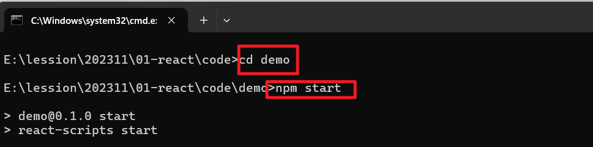
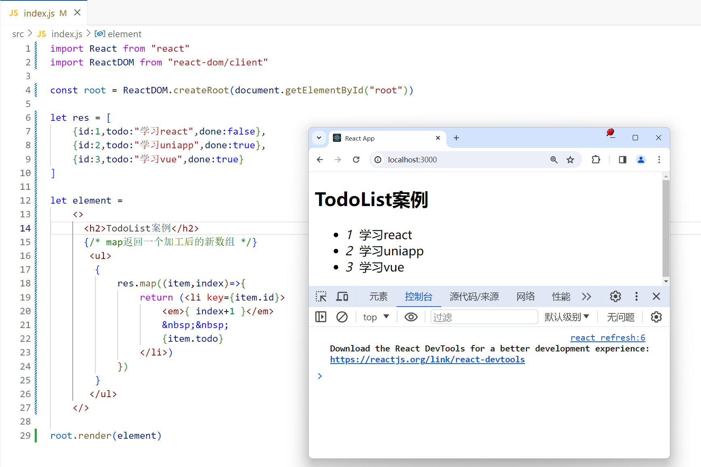

## 一，React介绍


### 1，React介绍

目前市面上主流的前端框架：

- Vue
- React
- Angular
- ....


主流思想：不需要去操作DOM，而是**数据驱动视图**。


**直接操作DOM：**

- 直接操作DOM，会导致性能消耗大一点，可能会导致DOM的重排和重绘。
- 操作DOM，相对来说，会麻烦一点


**数据驱动视图：**

- 不需要直接操作DOM
- 操作数据（状态），数据变了，框架会按相关的流程，让页面重新渲染
  - Vue：数据是响应式的，改变数据，模板重新渲染
  - 小程序：通过setData这个API，就可以达到改变数据，并重新渲染页面
  - React：通过setState这个API，达到更新页面的效果
- 框架底层在实现页面时，也是需要操作DOM的，只不过会尽可能少的操作DOM
  - 构建了一套 虚拟DOM=>真实DOM的渲染体系
  - 尽可能少的操作DOM，这样会尽可能减少重排和重绘。
- 提高开发效率，性能也会好很多


​	**React** 是一个用于构建用户界面的 JavaScript 库。React 从诞生之初就是可被逐步采用的，因而**你可以按需引入或多或少的 React 特性**。React特点：


**什么是声明式：**

- 前面学习的html标签就是声明式的。在vue中，要实现一个轮播图的功能，也是可以把轮播图封装成一个组件。声明式编程的对立面是命令式编程。

  ```html
  <!DOCTYPE html>
  <html lang="en">
  <head>
      <meta charset="UTF-8">
      <meta name="viewport" content="width=device-width, initial-scale=1.0">
      <title>Document</title>
  </head>
  <body>
      <h1>今天学习React~</h1>
      <p>我是一个孤独的P标签</p>
      
  
      <div class="carousel">
          <ul>
              <li></li>
              <li></li>
              <li></li>
          </ul>
      </div>
      <script>
          // 这种编程，叫命令式编程
          // 还有一堆的JS逻辑，还需要写很多样式
      </script>
  
  
      <hr>
  
      <!-- 声明式，组件化编译 -->
      <Carousel imgs="[1.png,2.png,3.png]"></Carousel>
  </body>
  </html>
  ```

  


官网：

- 老版 [已过时——React 中文文档 (reactjs.org)](https://zh-hans.legacy.reactjs.org/)

  

- 新版 [React 官方中文文档 (docschina.org)](https://react.docschina.org/)

  


**React版本：**

- 很早之前，是15版本，不用了。
- 16版本，项目用的还是比较多的。
- 17版本，语法和16相比，没有什么变化，只是在底层处理机制上，有所升级。
- 18版本，当前最新版本，不管是语法还是底层机制，都有变化。


### 2，React版本的HelloWorld


直接上代码：

```html
<!DOCTYPE html>
<html lang="en">
<head>
    <meta charset="UTF-8">
    <meta name="viewport" content="width=device-width, initial-scale=1.0">
    <title>Document</title>
    <!-- react.js  production 表示生产环境  会对代码进行压缩和混淆-->
    <!-- let userName = "malu"   let a = "malu" -->
    <script src="https://unpkg.com/react@^16/umd/react.production.min.js"></script>
    <!-- react-dom.js 和浏览器相关的，操作DOM -->
    <script src="https://unpkg.com/react-dom@16.13.0/umd/react-dom.production.min.js"></script>
    <!-- babel.js 是编译js代码 Babel 是一个 JavaScript 编译器。 -->
    <script src="https://unpkg.com/babel-standalone@6.26.0/babel.js"></script>
</head>
<body>
    <div id="root"></div>
    <!-- <script>
        console.log(React)
        console.log(ReactDOM)
    </script> -->

    <!-- script标签中的type的默认值是：text/javascript -->
    <script type="text/babel">
        // 定义了一个React组件
        class App extends React.Component{
            render(){
                return <h1>Hello React~</h1>
            }
        }

        ReactDOM.render(<App/>,document.getElementById("root"))
    </script>
</body>
</html>
```


效果如下：


为什么script标签中写的是text/babel？我们在组件中写的html标签，并不会直接渲染，会把你写的代码转化成js方法去执行。


我们是可以直接写方法的，不需要写标签：

```html
<!DOCTYPE html>
<html lang="en">
<head>
    <meta charset="UTF-8">
    <meta name="viewport" content="width=device-width, initial-scale=1.0">
    <title>Document</title>
    <script src="https://unpkg.com/react@^16/umd/react.production.min.js"></script>
    <script src="https://unpkg.com/react-dom@16.13.0/umd/react-dom.production.min.js"></script>
    <script src="https://unpkg.com/babel-standalone@6.26.0/babel.js"></script>
</head>
<body>
    <div id="root"></div>
    <script> 
        class App extends React.Component{
            render(){
                // 第一个参数是必填，传入的是似HTML标签名称，eg: ul, li 
                // 第二个参数是选填 对象，表示的是标签属性，
                // 第三个参数以后是选填, 子节点
                return React.createElement("h1",null,"Hello React~")
            }
        }
        ReactDOM.render(React.createElement(App,null),document.getElementById("root"))
    </script>
</body>
</html>
```


效果：


再次看一下babel官网：


书写的代码：

```jsx
class App extends React.Component{
     render(){
         return (
             <div className="app">
                 <h1>hello react!</h1>
                 <h1>hello react!</h1>
                 <h1>hello react!</h1>
                 <p>
                     <span>span</span>
                 </p>
             </div>
         )
     }
 }
```


通过babel编译后的代码：

```js
        class App extends React.Component {
            render() {
                return /*#__PURE__*/React.createElement("div", 
                {
                    className: "app"
                }, 
                /*#__PURE__*/React.createElement("h1", null, "hello react!"), 
                /*#__PURE__*/React.createElement("h1", null, "hello react!"), 
                /*#__PURE__*/React.createElement("h1", null, "hello react!"), 
                /*#__PURE__*/React.createElement("p", null, 
                                                /*#__PURE__*/React.createElement("span", null, "span")));
            }
        }
```


小小的作业：把下面标签的形式，转化成React.createElement的形式。

```html
<div className="App">
     <ul className='url_wrap'>
         <li className='item'>商城</li>
         <li className='item'>购物车</li>
         <li className='item'>订单</li>
         <li className='item'>
             <span>我的</span>
         </li>
     </ul>
</div>
```


### 3，脚手架

​	现在开发项目，都是组件化，工程化的。我们可以基于webpack自己去搭建一套工程化的架子，样这非常麻烦，复杂。React官方为我们提供了一个脚手架，叫create-react-app。默认情况下，就把webpack相关的配置就处理好了。只需要基于这个脚手架，去开发项目就OK。

 

安装脚手架：

```
npm i create-react-app -g 
```


验证是否安装成功：


安装后完，就可以创建一个项目：

```
create-react-app demo
```


安装完后，进入项目，启动项目，如下：





访问之：


默认会安装

- react，是React框架的核心，默认安装的是最新版本，学的话，就学习最新版本。
- react-dom，React视图渲染的核心。基于React构建WebApp。
- react-native，构建渲染原生App的。


使用vscode打开项目，如下：


打开package.json文件，如下：


去简化一下代码，如下：


目录结构：

```
demo 
  |- node_modules   项目的依赖
  |- src   我们写的代码基本上都是放在src下面。webpack打包时，只对src目录进行打包
      |- index.js  项目的入口
  |- public  入页面的模板
      |- index.html 
  |- package.json
  |- ....
```


## 二，JSX

​	

### 1，什么是JSX

​	jsx是用来给组件提供视图的，类似于vue中的模板。就是js和html标签混合在一起，并不是我们之前玩的字符串拼接。这种语法也会通过babel进编译，编译成js代码。JSX可以生成React元素。说白了，就是React.createElement函数调用后得到一个React元素。


### 2，JSX细节1

在jsx中，可以通过{}胡子语法，嵌入表达式。任何有值的内容都是表达式。代码如下：

```js
import React from "react"
import ReactDOM from "react-dom"

let str = "今天学习React so easy~"
let age = 100;

let element = <div>
    <p>我是一个P标签</p>
    <p>{str}</p>
    <p>{age}</p>
</div>

// 之前你渲染的是<App/>标签，现在我直接渲染React元素
// 你写的jsx，最终也会变成React元素
ReactDOM.render(element,document.getElementById("root"))
```


效果：


在ReactDOM.render时，不能直接把HTML或BODY作为根容器，必须指定一个额外的盒子，如下：


也就是说，不能把html或body当成根容器。


### 3，JSX细节2

在构建视图时，必须要有一个唯一的根节点，如果没有，就报错，如下：


也可以指定一个空标签：


我们要么使用一个div包起来，这样就会多一个div嵌套。也可以使用React中帮我们提供的组件（React.Fragment），包起来。这样的话，最外层就没有多余的div。


React给我们提供的一个特殊的组件，叫Reat.Fragment，是一个空标签。作用：

- 保证了视图只有一个根标签
- 也不新增一个HTML层级结构


### 4，JSX细节3

在{}胡子语法中，可以嵌入不同的值，下面的语法，需要大记一下。如下：

- number / string 值是啥，就渲染出来什么

  

- boolean / null / und / Symbol / BigInt 渲染出来的内容是空

  

- 渲染对象，直接报错了，但是有特殊情况

  

  - jsx元素（本质也是一个对象，这个对象就不会报错）

    

  - 给标签设置style行内样式时，也必须写成对象

    

- 渲染数组，会把数组中的每一项分别拿出来渲染，并不是变为字符串渲染，中间没有逗号

  - 数组中是number、 string，也是直接渲染

  - 数组中是boolean / null / und / Symbol / BigInt，渲染出来的内容是空

  - 数组中放jsx元素也是会被渲染的

    

- 渲染函数，不支持在{}中渲染函数的，但是函数也可以是组件，要渲染组件通过标签的形式渲染。

  

- ....


### 5，JSX细节4

给标签设置行内样式，如下：

```js
import React from "react"
import ReactDOM from "react-dom/client"

const root = ReactDOM.createRoot(document.getElementById("root"))

let element = 
    <>
        {/* 行内样式：不能直接写字符串，样式需要放到对象中，基于对象的格式处理的 */}
        {/* 样式是多个单词时，在css中，使用中划线命名，在jsx中，使用小驼峰命名 */}
        {/* 给标签添加clsss属性时，不能使用class，要使用className, class是一个关键字 */}
        <div className="box" style={ {color:"red",fontSize:"20px"} }>我是一个小小的div</div>
    </>

root.render(element)
```


效果：


有一个数据，如果是true，就显示button按钮，否则就隐藏buton按钮，代码如下：

```js
import React from "react"
import ReactDOM from "react-dom/client"

const root = ReactDOM.createRoot(document.getElementById("root"))

let flag = true;

let element = 
    <>
       {/* 通过样式控制是否显示，但是button已经创建了 */}
       <button style={ {display:flag ? 'block':'none'} }>登录</button>

       {/* 控制它创建或销毁 */}
       { flag ? <button>注册</button> : null }
    </>

root.render(element)
```


再进一步，通过一个数据，控制button中的文本，如下：


从服务器调用接口，获取到一片数据，渲染数据，如下：



你循环创建的元素一定要设置key，表示唯一值，用于优化DOM-DIFF的。


我要循环出5个button按钮，如下：

```js
import React from "react"
import ReactDOM from "react-dom/client"

const root = ReactDOM.createRoot(document.getElementById("root"))

let arr = [1,2,3,4,5]
let element = 
    <>
     <button>按钮1</button>
     <button>按钮2</button>
     <button>按钮3</button>
     <button>按钮4</button>
     <button>按钮5</button>
     <hr/> 
     {
        arr.map((item,index)=>{
            return <button key={index}>按钮{index+1}</button>
        })
     }
     <hr/> 
     {
        new Array(5).fill(null).map((_,index)=>{
            return <button key={index}>按钮{index+1}</button>
        })
     }
    </>

root.render(element)
```


### 6，JSX细节5

盘点jsx细节，盘点一下jsx的底层渲染机制，看如下代码：

```js
import React from "react"
import ReactDOM from "react-dom/client"

const root = ReactDOM.createRoot(document.getElementById("root"))

let a = 110;
let b = 120;
let styobj = {color:"red",background:"pink"}

let element = 
    <>
     <h2 style={ styobj }>我是一个孤独的h2标签</h2>
     <div>
        <p>{a}</p>
        <p>{b}</p>
     </div>
    </>
// 直接渲染一个jsx元素
root.render(element)
```


关于jsx的底层渲染机制：

- 第一步：把你编写的jsx语法，编译成虚拟DOM（VirtualDOM），虚拟DOM就是框架内部构建的一套对象体系，虚拟DOM本质就是一个对象，对象是属性的无序集合，这个对象中的属性都是React官方规定的，这个属性用于描述虚拟DOM。
- 第二步：把构建出来的虚拟DOM，渲染成为真实DOM，在浏览器中才能看到这些DOM元素。
- 补充：第一次渲染页面是直接把虚拟DOM转化成真实DOM。后期可能去更新状态，还会产生一个新的虚拟DOM。新旧的虚拟DOM会进行DOM-DIFF的对比，计算出差异，打PATC（两次虚拟DOM的差异），只去更新差异。


画图分析：


再次解释jsx元素的初始渲染机制：

- 我们编译的是jsx语法，编译成虚拟DOM对象，编译的过程如下：

  - 基于babel把jsx编译成React.createElement这种格式。只要是一个元素节点，都会经过createElement处理。有三个参数：
    - ele: 元素或标签名，也可以是组件。
    - props：元素的属性，如果没有设置属性就是null
    - children: 第三个是当前元素的子节点

- 再React.CreateElement方法执行，创建出虚拟DOM对象。虚拟DOM有的地方也叫jsx元素，可jsx对象，或者ReactChild对象....

  

  ```
  let virtualDom = {
      $$typeof:Symbol(react.element)
      ref:null,
      key:null,
      type：标签名或组件名,
      props: {  存储元素相关的属性
          children: 子节点信息，如果没有子节点，则没有这个属性，属性值可能是一个值，也可能是一个数组
      }
  }
  ```

  写上一点代码演示：

  

  

- 初次渲染时，会把虚拟DOM再次转化成真实DOM。在浏览器中就会看到渲染出来的效果。


## 三，函数式组件


### 1，无状态组件定义（函数式组件）

在React中，组件分两类：

- 函数式组件，也叫静态组件
- 类组件，也叫动态组件


写一个函数式组件：

```jsx
import React from "react"
import ReactDOM from "react-dom/client"

const root = ReactDOM.createRoot(document.getElementById("root"))

// 在React中，组件名首字母需要大写。如果是小写，就是一个普通的函数
// 光首字母大写还不行，还要求你这个函数需要返回一个jsx，jsx可以使用()包起来
function One(){
    return (
        <div className="one-box">
            我是One组件
        </div>
    )
}

root.render(<One/>)
```


也可以把一个组件放到一个文件中，如下：


然后，在index.js中就可以使用组件了，如下 ：


```js
import React from "react"
import ReactDOM from "react-dom/client"
import One from "./One"

const root = ReactDOM.createRoot(document.getElementById("root"))


root.render(<One/>)
```


组件名字，必须使用大写字母打头，否则就会报错，一般情况下，我们采用大驼峰命名法。在调用组件时，可以给组件传递各种各样的属性，如下：


```js
import React from "react"
import ReactDOM from "react-dom/client"
import One from "./One"

const root = ReactDOM.createRoot(document.getElementById("root"))


root.render(
    <One
        title="我是一个不标题"
        data={ [1,2] }
        x = "123"
        y = { 123 }
        className="box"
        style={ {color:"red"} }
    />)
```


使用babel编译上面的jsx，如下：


对于无状态的理解：


### 2，函数式组件的渲染机制

函数式组件是如何被渲染出来的，代码如下：


```js
import React from "react"
import ReactDOM from "react-dom/client"
import One from "./One"

const root = ReactDOM.createRoot(document.getElementById("root"))


root.render(
   <>
    <One
        title="我是一个不标题"
        data={ [1,2] }
        x = "123"
        y = { 123 }
        className="box"
        style={ {color:"red"} }
    />
   </>)
```


流程如下：

- 第一步：基于babel，把上面的代码编译成React.createElement形式。如下：

  

- 第二步： createElement方法执行，创建出一个虚拟DOM。type是一个函数。

  

- 第三步： 基于root.render把虚拟DOM转化成真实DOM。
  - type的值不再是一个字符串，而是一个函数
    - 把One函数执行，One()执行
    - 在执行时，会把One组件上写的属性，传递给One函数
    - One函数就会通过Props接收
    - 函数要接收，通过props接收。函数返回jsx元素（就是虚拟DOM）
    - 最后基于render把组件返回的虚拟DOM变为真实DOM，插入到#root容器中。

    

再去总结一下，在调用组件，我们可以给组件设置（传递）各种各样的属性。如果传递的不是字符串，需要使用{}包起来，在组件内部就可以通过props来接收传递过来的数据了。

 

在使用组件时，也可以在组件标签之间写东西，写的内容也是传递给了props，如下：


### 3，冻结，密封，扩展


默认情况下，一个对象是可以修改属性，添加属性，删除属性的，如下：


如果把对象给冻结了，如下：


**总结冻结**

- Object.freeze(obj)
- 检测是否被冻结：Object.isFrozen(obj)
- 特点：不能修改成员的值，不能新增成员的值，不能删除成本的，不能劫持。


前面我们说的props，默认就是被冻结的，也就意味着不能修改props的值，如下：

```js
import React from "react"
import ReactDOM from "react-dom/client"

const root = ReactDOM.createRoot(document.getElementById("root"))

function One(props){
    console.log("props:",props)
    console.log(Object.isFrozen(props))
    // props.title = "ly" // 不行的
    // props.xxx = "ok"  // 不行的
    return (
        <div className="one-box">
            我是One组件
        </div>
    )
}


root.render(<One title="malu" age={ 2 } />)
```


还有一个概念，叫密封，代码如下：


**总结密封**

- Object.seal(obj)
- 检测是否被冻结：Object.isSealed(obj)
- 特点：能修改成员的值，不能新增成员的值，不能删除成本的，不能劫持。


还有一个概念，叫扩展，代码如下：


**总结扩展**

- Object.preventExtensions(obj)
- 检测是否被冻结：Object.isExtensible(obj)
- 特点：除了不能新增，其它都可以。


如果对象被冻结了，也是不可以扩展的，也是密封的。如下：


结论：和vue一样，props中的属性，只能使用，不能修改，不能添加，不能删除。


### 4，props细节

可以基于属性，把不同的数据传递给子组件，子组件通过props接收，接收后，就可以在jsx中使用了，目的是为了提高组件的复用性。代码如下：

```js
import React from "react"
import ReactDOM from "react-dom/client"

const root = ReactDOM.createRoot(document.getElementById("root"))

function One(props){
    console.log("props:",props)
    let {title,age,data,className,children} = props;
    return (
        <div className="one-box">
            我是One组件
            <p>{ title }</p>
            <p>{ age }</p>
            <p>{ data }</p>
            <p>{ className }</p>
            <p>{ children[0] }</p>
            <p>{ children[1] }</p>
        </div>
    )
}


root.render(
<One title="malu" age={ 2 } data={ [1,2] } className="box" style={{color:'red'}} >
    <span>span</span>
    <em>em</em>
</One>)
```

效果：


props默认是被冻结的，但是我们是可以做一些校验的，安装一个包，如下：


然后就可以校验，也可以指定默认值了，如下：

```js
import React from "react"
import ReactDOM from "react-dom/client"
import PropTypes from "prop-types"

const root = ReactDOM.createRoot(document.getElementById("root"))

function One(props){
    console.log("props:",props)
    let {title,age,data,className,children,a} = props;
    return (
        <div className="one-box">
            我是One组件
            <p>{ a }</p>
            <p>{ title }</p>
            <p>{ age }</p>
            <p>{ data }</p>
            <p>{ className }</p>
            <p>{ children[0] }</p>
            <p>{ children[1] }</p>
        </div>
    )
}
// 设置默认值的
One.defaultProps = {
    a:6666
}
// 校验传递过的属性的类型
One.propTypes = {
    title:PropTypes.string, // 希望传递过来的title是sttring类型，如果不是，就报警告
    age:PropTypes.string.isRequired, // isRequired表示必传
}


root.render(
    <One a={ 8888 } title="malu" age={ 2 } data={ [1,2] } className="box" style={{color:'red'}} >
        <span>span</span>
        <em>em</em>
    </One>)
```


都能校验哪些规则，如下：


不管是校验成功，还是校验失败，都把把数据给props，如果校验失败了，会在控制台中发出警告。


### 5，插槽机制

在调用组件时，可以在标签之间写内容，如下:


在组件中打印出props，如下：


使用children，如下：


上面的案例，就相当于一个插槽，插槽可以让组件有更强的复用性。体现：

- 通过属性把数据传递给组件
- 通过标签之间写html结构（jsx对象）传递结构给组件


children有可能是一个对象，有可能是一个数组，使用children，如下：


如何解决传递一个jsx元素，也让它显示呢？如下：

```js
import React from "react"
import ReactDOM from "react-dom/client"
import PropTypes from "prop-types"

const root = ReactDOM.createRoot(document.getElementById("root"))

function One(props){
    let { children } = props;
    // 如果没有在标签之间写内容，那么children就是und
    console.log("--children:",children)
    if(!children){
        children = []
    }else if(!Array.isArray(children)){
        // 如果传递了一个jsx元素，也为成数组
        children = [children]
    }
    return (
        <div className="one-box">
            <div>
                { children[0] }
            </div>
            我是One组件
            <div>
                { children[1] }
            </div>
        </div>
    )
}

root.render(<>
    <One>
        <span>haha</span>
        <em>em</em>
    </One>
    <hr/>
    <One>
        <span>xixi</span>
    </One>
    <hr/>
    <One/>
</>)
```


上面的是我们手动的处理children，其实在React中，有一个React.Children.toArray，就可以自动把children变成数组，如下：


之前在vue中，还有一个具名插槽，在React如何实现具名插槽，如下：


解决之：

```js
import React from "react"
import ReactDOM from "react-dom/client"
import PropTypes from "prop-types"

const root = ReactDOM.createRoot(document.getElementById("root"))

function One(props){
    let { children } = props;
    children = React.Children.toArray(children)
    let headerSlot = [];
    let footerSlot = [];
    let defaultSlot = [];
    children.forEach(child=>{
        let {slot} = child.props;
        if(slot == 'header'){
            headerSlot.push(child)
        }else if(slot == 'footer'){
            footerSlot.push(child)
        }else{
            defaultSlot.push(child)
        }
    })
    return (
        <div className="one-box">
            <div>
                { headerSlot }
            </div>
            我是One组件
            <p>{ defaultSlot }</p>
            <div>
                { footerSlot }
            </div>
        </div>
    )
}

root.render(<>
    <One>
        <span slot="footer">尾部</span>
        <span slot="header">头部</span>
        <span>666666666666666</span>
    </One>
</>)
```


小作业：尝试把前面讲的内容封装成一个组件，叫Dialog


尝试封装Dialog组件：

```jsx
import React from "react"
import PropTypes from "prop-types"

function Dialog(props){
    let { title,content,children } = props;
    children = React.Children.toArray(children);
    return (
        <div className="dialog-box" style={{width:200,background:'gray'}}>
            <div className="header" style={{
                display:'flex',
                justifyContent:"space-between",
                alignItems:"center"
            }}>
                <h2 className="title">{ title }</h2>
                <span>X</span>
            </div>
            <div className="main">
                { content }
            </div>
            {
                children.length > 0 ? 
                <div>
                    { children }
                </div> : null
            }
        </div>
    )
}

Dialog.defaultProps = {
    title:"默认提示"
}
Dialog.propTypes = {
    title:PropTypes.string,
    content:PropTypes.string.isRequired
}

export default Dialog
```


在index.js中使用之：

```js
import React from "react"
import ReactDOM from "react-dom/client"
import Dialog from "./Dialog"

const root = ReactDOM.createRoot(document.getElementById("root"))

root.render(<>
    <Dialog title="温馨提示" content="你确定要删除吗？">
    </Dialog>
    <hr/>
    <Dialog title="友情提示" content="你确定要离开吗？">
        <button>确定</button>
        <button>取消</button>
    </Dialog>
</>)
```


效果：


总结函数式组件：

- 函数式组件是无状态的，也叫静态组件。
- props是用来接收数据和结构，并且props默认是被冻结
- props可以进行校验，也可以设置默认值
- 函数式组件返回jsx元素，进行渲染
- 除非在父组件中，重新调用这个函数式组件，才会重新渲染此组件
- 项目中，有这样需求：第一次渲染后就不会再有变化了，就可以使用函数式组件


## 四，类组件（有状态组件）


