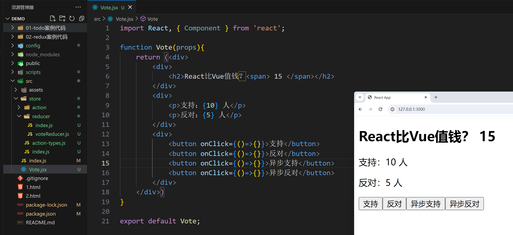

## 一，迭代器

### 1，什么是迭代器

迭代器就是一个对象，要求这个对象必须有一个next方法。Iterator是迭代器，就可以把一个容器中的元素迭代出来。写一个代码：

```js
<script>
    // 给names这个数组创建一个迭代器
    const names = ["码路", "漫漫", "前端"];

    let index = 0;

    // 迭代器就是一个对象，要求这个对象必须有一个next方法
    const namesIterator = {
        next(){
            if(index < names.length){
                return {done:false,value:names[index++]}
            }else{
                return {done:true,value:undefined}
            }
        }
    }
    // 调用next返回一个对象，done表示是否迭代完毕，value表示迭代出来的数据
    console.log(namesIterator.next()); // { done:false,value:"码路" }
    console.log(namesIterator.next()); // { done:false,value:"漫漫" }
    console.log(namesIterator.next()); // { done:false,value:"前端" }
    console.log(namesIterator.next()); // { done:true,value:undefined }
</script>
```


也可以创建一个nums这个数组对应的迭代器：

```html
<script>
    const nums = [100, 200, 300, 400, 500]
    let index = 0;
    let numsIterator = {
        next() {
            if (index < nums.length) {
                return {
                    done: false,
                    value: nums[index++]
                }
            } else {
                return {
                    done: true,
                    value: undefined
                }
            }
        }
    }
    console.log(numsIterator.next()); // { done: false, value: 100 }
    console.log(numsIterator.next()); // { done: false, value: 200 }
    console.log(numsIterator.next()); // { done: false, value: 300 }
    console.log(numsIterator.next()); // { done: false, value: 400 }
    console.log(numsIterator.next()); // { done: false, value: 500 }
    console.log(numsIterator.next()); // { done: true, value: undefined }
</script>
```


封装一个函数，返回一个数组迭代器(Iterator)

```html
<script>
    // 封装一个函数，返回一个数组迭代器(Iterator)
    function createArrayIterator(arr){
        let index = 0;
        return {
            next(){
                if(index < arr.length){
                    return {done:false,value:arr[index++]}
                }else{
                    return {done:true,value:undefined}
                }
            }
        }
    }

    const nums = [100, 200, 300, 400, 500]
    const names = ["码路", "漫漫", "前端"];

    let namesIterator = createArrayIterator(names);
    console.log(namesIterator.next());
    console.log(namesIterator.next());
    console.log(namesIterator.next());

    let numsIterator = createArrayIterator(nums);
    console.log(numsIterator.next());
    console.log(numsIterator.next());
    console.log(numsIterator.next());
</script>
```


自己可以创建一个Iterator类，实现迭代器规范。代码：

```html
<script>
    class Iterator {
        constructor(container) {
            this.container = container;
            this.index = -1;  // 记录迭代的次数
        }
        next(){
            this.index++;
            let {container,index} = this;
            if(index >= container.length){
                // 迭代完毕
                return {done:true,value:undefined}
            }
            return {done:false,value:container[index]}
        }
    }

    // itor是一个迭代器
    let itor = new Iterator([100, 200, 300, 400]);
    console.log(itor.next());  // {done:false,value:100}
    console.log(itor.next());  // {done:false,value:200}
    console.log(itor.next());  // {done:false,value:300}
    console.log(itor.next());  // {done:false,value:400}
    console.log(itor.next());  // {done:true,value:und} 
</script>
```


### 2，可迭代对象

把一个不是可迭代对象，变成可迭代对象，如下：

```html
<script>
    // 可迭代对象  
    // 满足条件1：必须实现一个特定的函数: [Symbol.iterator]
    // 满足条件2：这个函数需要返回一个迭代器(这个迭代器用于迭代当前的对象)

    // 默认情况下，这个对象不是可迭代对象
    // 如果满足了上面的条件，这个对象就变成可迭代对象
    let infos = {
        friends: ["码路", "漫漫", "前端"],
        [Symbol.iterator](){
            let index = 0;
            let infosIterator = {
                next() {
                    if (index < infos.friends.length) {
                        return {
                            done: false,
                            value: infos.friends[index++]
                        }
                    } else {
                        return {
                            done: true,
                            value: undefined
                        }
                    }
                }
            }
            return infosIterator;
        }
    }
    // 调用Symbol.iterator函数，得到一个迭代器
    // let iterator = infos[Symbol.iterator]();
    // console.log(iterator.next());
    // console.log(iterator.next());
    // console.log(iterator.next());
    // console.log(iterator.next());

    // 只要是一个可迭代对象，都可以使用for of进行遍历
    // infos is not iterable
    for (let item of infos) {
        console.log(item);
    }
</script>
```

​	在JS中，有很多数据结构，天生就具备迭代器规范。这个数据结构是否可以迭代，看这个数据结构中有没有Symbol.iterator这个属性，有这个属性，就是可以跌打对象，没有就不是可迭代对象。

```html
<script>
    // JS中哪些容器天生就是可迭代对象
    // 1）数组
    // const names = ["aaa", "bbb", "ccc"]
    // console.dir(names)
    // for (const name of names) {
    //     console.log(name)
    // }
    // let iterator = names[Symbol.iterator](); // 得到迭代器
    // console.log(iterator.next());
    // console.log(iterator.next());
    // console.log(iterator.next());
    // console.log(iterator.next());

    // console.log("---------------");

    // 2）Set
    // new Set时 ()中只要写可迭代对象都可以
    // ["aaa", "bbb", "ccc"] 就是一个迭代对象
    // const set = new Set(["aaa", "bbb", "ccc"])
    // for (const item of set) {
    //     console.log(item)
    // }
    // const setIterator = set[Symbol.iterator]()
    // console.log(setIterator.next())
    // console.log(setIterator.next())
    // console.log(setIterator.next())
    // console.log(setIterator.next())

    // console.log("---------------");

    // 3）arguments
    // function foo() {
    //     // arguments是一个伪数组
    //     // 伪数组就是长的像数据，本质是对象
    //     for (const arg of arguments) {
    //         console.log(arg)
    //     }
    // }
    // foo(111, 222, 333, 444)

    // console.log("---------------");

    // 4）字符串
    // let str = "hello";
    // for (let item of str) {
    //     console.log(item);
    // }

    // console.log("---------------");

    // 对象不是可迭代对象
    // let obj = {
    //     name: "wc",
    //     age: 18,
    //     sex: "man"
    // }
    // console.dir(obj)
    // TypeError: obj is not iterable
    // iterable 可迭代的
    // for (let item of obj) {
    //     console.log(item);
    // }

    let obj = {
        a: 1,
        b: 2,
        c: 3
    }
    // let res = {
    //     ...obj  // ... 是展开运算符
    // }
    // console.log(res);

    function fn(x, y, z) {
        console.log(x, y, z);
    }
    // fn(obj.a, obj.b, obj.c)

    // // requires ...iterable[Symbol.iterator] to be a function
    // obj就是一个纯粹的对象，不是可迭代对象，它里面没有[Symbol.iterator]
    fn(...obj)
</script>
```


总结一下，可迭代对象有：

- 数组
- 部分类数组（伪数组）
  - arguments 
  - HTMLCollection
  - ...
- 字符串
- Set/Map
- ...


对于纯粹的对象来说，默认是不具备Symbol.iterator属性的，所以它不是可迭代对象。只要是可迭代对象，都可以使用for of进行遍历。原理：

1. 迭代执行，先执行数组中的Symbol.iterator这个方法，得到一个迭代器，itorator。
2. 开始迭代，每一次迭代都是把itorator.next方法执行，{value:xx,done:false}。把获取到的对象中的value属性给for of中的形参变量。再看对象中的done的值，如果是false，就继续迭代，如果是true，就结束迭代。


可以重写Symbol.iterator这个方法：

```html
<script>
    // 要迭代一个数组，有如下的方式
    //   for, while, forEach/map, forin, forof...
    const names = ["aaa", "bbb", "ccc"]

    // names[Symbol.iterator] = "xxx";  // 不行的

    // 重写 Symbol.iterator 
    names[Symbol.iterator] = function(){
        console.log("开始迭代~",this);  // this是names数组
        let self = this;
        let index = -1;
        return {
            next(){
                index++;
                if(index >= self.length){
                    return {
                        done:true,
                        value:undefined
                    }
                }
                return {
                    done:false,
                    value:self[index]
                }
            }
        }
    };  

    for(let a of names){
        console.log(a)
    }
</script>
```


把一个非可迭代对象，转化成可跌打对象，如下：

```html
<script>
    // 把一个非可迭代对象 转化成 可迭代对象
    const info = {
        name: "码路",
        age: 18,
        height: 1.88,
        // 可以把Symbol.iterator写在这里
        // [Symbol.iterator](){
        //     // ...
        // }
    }

    Object.prototype[Symbol.iterator] = function () {
        // Object.values就可以把对象中的值放到一个数组中 
        let values = Object.values(this)
        console.log(values)  // ['码路', 18, 1.88]
        let index = 0;
        let iterator = {
            next() {
                if (index < values.length) {
                    return {
                        done: false,
                        value: values[index++]
                    }
                } else {
                    return {
                        done: true,
                        value: undefined
                    }
                }
            }
        }
        return iterator;
    }

    let iterator = info[Symbol.iterator]();
    console.log(iterator.next());
    console.log(iterator.next());
    console.log(iterator.next());
    console.log(iterator.next());
    console.log('----------------');
    for(let val of info){
        console.log(val);
    }
</script>
```


把一个类数组，转化成一个可迭代对象：

```html
<script>
    // info本质是一个对象，键是0，1，2，3...
    // 还有一个length属性，这个对象可以叫它伪数组，或类数组
    // 把一个类数组，转化成一个可迭代对象
    const info = {
       0:111,
       1:666,
       2:888,
       length:3
    }

    // 把一个非可迭代对象 转化成 可迭代对象
    Object.prototype[Symbol.iterator] = Array.prototype[Symbol.iterator]

    let iterator = info[Symbol.iterator]();
    console.log(iterator.next());
    console.log(iterator.next());
    console.log(iterator.next());
    console.log(iterator.next());
    console.log('----------------');
    for(let val of info){
        console.log(val);
    }
</script>
```


创建一个类，默认情况下，通过这个类，创建出来的对象不是可迭代对象，可以在这个类中写一个Symbol.iterator方法，如下：

```html
<script>
    class Person {
        constructor(name, age, height, friends) {
            this.name = name
            this.age = age
            this.height = height
            this.friends = friends
        }
        [Symbol.iterator]() {
            let index = 0;
            let iterator = {
                next: () => {
                    if (index < this.friends.length) {
                        return {
                            done: false,
                            value: this.friends[index++]
                        }
                    } else {
                        return {
                            done: true,
                            value: undefined
                        }
                    }
                }
            }
            return iterator;
        }
    }

    // p1和p2不是可迭代对象
    const p1 = new Person("码路", 18, 1.88, ["aaa", "bbb", "ccc"])
    const p2 = new Person("漫漫", 30, 1.98, ["111", "222", "333"])

    for (const item of p2) {
        console.log(item)
    }
</script>
```


## 二，生成器

### 1，什么是生成器

生成器函数（Generator），只需要在function后面会跟上符号: *。箭头函数是无法变成生成器函数的。写一个代码：

```html
<script>
    // function后面会跟上符号: *
    //    代码的执行可以被yield控制
    // 生成器函数默认在执行时, 返回一个生成器对象
    //    要想执行函数内部的代码, 需要生成器对象, 调用它的next操作
    //    当遇到yield时, 就会中断执行
    // function* fn() {
    //     console.log('代码执行中：', 111);
    //     return 666;
    // }
    // console.log('运行结束：', fn());

    // fn是一个生成器函数
    function* fn() {
        // 函数内部的代码并不会一次性执行完毕
        console.log("aaa");
        console.log("bbb");
        yield
        console.log("ccc");
        console.log("ddd");
        yield
        console.log("eee");
        console.log("fff");
    }
    // 调用生成器函数，得到生成器对象
    // generator 是生成器的意思
    let generator = fn();
    // 生成器也是特殊的迭代器，它也有next方法
    generator.next()
    generator.next()
    generator.next()
</script>
```


当生成器函数执行：

- 首先并不会立即让函数体中的代码执行，而是返回一个生成器对象（是一种特殊的迭代器）。它的原型上面有如下方法
  - next
  - return
  - throw
  - ....
- 当执行next方法时，函数体中的代码才开始执行，next执行返回也是一个对象，done记录代码是否执行完毕，value表示本次处理的结果。说白了，基于next方法，控制函数体中的代码，一步一步去执行


再次看一下生成器函数的执行流程：

```html
<script>
    function* fn() {
        console.log("A");
        // yield 本意是产出的意思
        yield 100
        console.log("B");
        yield 200
        console.log("C");
        yield 300
        console.log('D');
        return 400
        
    }
    let generator = fn();
    // 每一次执行next，控制函数体中的代码开始执行，直到遇到yield就结束了
    // done 表示生成器函数是否执行完毕，value 是yield后面的的值
    // 当遇到函数体中的reutrn 或者已经执行到函数的末尾了位置了
    // done: true, value: 要么是函数的返回值 或者 und
    console.log(generator.next())  // {value: 100, done: false}
    console.log(generator.next())  // {value: 200, done: false}
    console.log(generator.next())  // {value: 300, done: false}
    console.log(generator.next())  // {value: 400, done: true}
</script>
```


画图：


除了next方法，还有throw方法，演示如下：

```html
<script>
    function* fn() {
        console.log("A");
        // yield 本意是产出的意思
        yield 100
        console.log("B");
        yield 200
        console.log("C");
        yield 300
        console.log('D');
        return 400
        
    }
    let generator = fn();
    console.log(generator.next())  // {value: 100, done: false}
    console.log(generator.throw("haha"))  // 手动抛出异常，生成器函数中的代码都不会再执行了
    console.log(generator.next())  // 抛出异常后，它下面的代码也不会执行了
    console.log('我是外面的代码');  // 外面的代码也是不会执行的
</script>
```


还有一个return方法：

```html
<script>
    function* fn() {
        console.log("A");
        // yield 本意是产出的意思
        yield 100
        console.log("B");
        yield 200
        console.log("C");
        yield 300
        console.log('D');
        return 400
        
    }
    let generator = fn();
    console.log(generator.next())  // {value: 100, done: false}
    console.log(generator.return("haha"))  // {value: 'haha', done: true}  相当于函数体中的执行遇到了return，结束了整个函数的执行，done:true
    console.log(generator.next())  // {value: undefined, done: true}  
    console.log('我是外面的代码');  // 我是外面的代码
</script>
```


### 2，传参问题


调用生成器函数时，是可以传递一些参数的，如下：

```html
<script>
    function* fn(...params) {
        console.log("params:",params); // [1, 2, 3, 4]

        console.log("A");
        yield 100
        console.log("B");
        yield 200
        console.log("C");
        yield 300
        console.log('D');
        return 400
        
    }
    let generator = fn(1,2,3,4);
    // 不调用next，函数体中的代码是不会执行的
    console.log(generator.next())
</script>
```


在调用next时，也是可以传递参数的，如下：

```html
<script>
    function* fn(...params) {
        console.log("params:",params); // [1, 2, 3, 4]

        console.log("A");
        let x = yield 100
        console.log("B",x);  // x是two:222
        let y = yield 200
        console.log("C",y);
        yield 300
        console.log('D');
        return 400
        
    }
    let generator = fn(1,2,3,4);
    // 不调用next，函数体中的代码是不会执行的
    console.log(generator.next('one:111')); // 第一个next中传递的参数，在生成器函数中是没有办法获取的
    console.log(generator.next('two:222'));  // 第二次next中传递的参数，会在第一个yield前面接收
    console.log(generator.next('three:333'));  // 第二次next中传递的参数，会在第一个yield前面接收
</script>
```


画图：


### 3，嵌套问题

直接上代码：

```html
<script>
    // const sum = function* sum() {
    //     yield 100;
    //     yield 200;
    // }

    // const fn = function* fn() {
    //     yield 300
    //     yield sum
    //     yield 400
    // }
    // let gen = fn();
    // console.log(gen.next()); // {value: 300, done: false}
    // console.log(gen.next());  // {done: false, value: ƒ}
    // console.log(gen.next());  // {value: 400, done: false}

    const sum = function* sum() {
        yield 100;
        yield 200;
    }

    const fn = function* fn() {
        yield 300
        yield* sum()  // yield* 表示让我们进入另一个生成器函数中去一步步的执行的
        yield 400
    }
    let gen = fn();
    console.log(gen.next()); // {value: 300, done: false}
    console.log(gen.next());  // {value: 100, done: false}
    console.log(gen.next());  // {value: 200, done: false}
    console.log(gen.next());  // {value: 400, done: false}
    console.log(gen.next());  // {value: undefined, done: true}
</script>
```


使用生成器，替换之前讲的迭代器：


```html
<script>
    let names = ["码路", "漫漫", "前端"];

    function* createArrayGenerator(arr){
        for(let i=0; i<arr.length; i++){
            yield arr[i]
        }
    }
    let namesGen = createArrayGenerator(names)
    console.log(namesGen.next());
    console.log(namesGen.next());
    console.log(namesGen.next());
    console.log(namesGen.next());
</script>
```


上面的写法可以简写：


```html
<script>
    let names = ["码路", "漫漫", "前端"];

    function* createArrayGenerator(arr) {
        // yield arr[0]
        // yield arr[1]
        // yield arr[2]

        // for(let i=0; i<arr.length; i++){
        //     yield arr[i]
        // }

        yield* arr
    }
    let namesGen = createArrayGenerator(names)
    console.log(namesGen.next());
    console.log(namesGen.next());
    console.log(namesGen.next());
    console.log(namesGen.next());
</script>
```


利用生成器，生成某个范围的值：


```html
<script>
    function* createRangeGenerator(start,end) {
        for(let i=start; i<=end; i++){
            yield i
        }
    }
    let namesGen = createRangeGenerator(2,10)
    console.log(namesGen.next());
    console.log(namesGen.next());
    console.log(namesGen.next());
    console.log(namesGen.next());
    console.log(namesGen.next());
    console.log(namesGen.next());
    console.log(namesGen.next());
    console.log(namesGen.next());
    console.log(namesGen.next());
    console.log(namesGen.next());
</script>
```


### 4，串行请求

有三个请求，请求所需要的时间分别是1s，2s，3s。实现如下的代码：

```html
<script>
    function delay(interval = 1000){
        return new Promise(resolve=>{
            setTimeout(()=>{
                resolve(`${interval}`)
            },interval)
        })
    }
    // then链
    delay(1000).then(value=>{
        console.log('第一个请求成功:',value);
        return delay(2000)
    }).then(value=>{
        console.log('第二个请求成功:',value);
        return delay(3000)
    }).then(value=>{
        console.log('第三个请求成功:',value);
    }).catch(reason=>{
        console.log('失败都会走这里',reason);
    })
</script>
```


上面的代码，可以使用async和await，如下：

```html
<script>
    function delay(interval = 1000) {
        return new Promise(resolve => {
            setTimeout(() => {
                resolve(`${interval}`)
            }, interval)
        })
    }
    (async () => {
        try {
            let value = await delay(1000)
            console.log('第一个请求成功:', value);

            value = await delay(2000)
            console.log('第二个请求成功:', value);

            value = await delay(3000)
            console.log('第三个请求成功:', value);
        } catch (reason) {
            console.log('失败都会走这里', reason);
        }
    })();
</script>
```


基于生成器函数，模拟await语法，实现请求的串行，代码如下：

```html
<script>
    function delay(interval = 1000) {
        return new Promise(resolve => {
            setTimeout(() => {
                resolve(`##${interval}`)
            }, interval)
        })
    }
    // 生成器函数
    function* handle(){
        let value = yield delay(1000); // 产出的一个promise
        console.log("第一个请求成功：",value)
        value = yield delay(2000);
        console.log("第二个请求成功：",value)
        value = yield delay(3000);
        console.log("第三个请求成功：",value)
    }
    // gen是生成器对象
    let gen = handle();
    // done表示是否执行完毕  value获取的是每一次yield后面的值
    let {done,value} = gen.next();
    // console.log(done,value)
    value.then(x=>{
        // console.log('x:',x);
        let {done,value} = gen.next(x);
        value.then(x=>{
            let {done,value} = gen.next(x);
            value.then(x=>{
                let {done,value} = gen.next(x);
            })
        })
    })
</script>
```


编写一个方法，方法可以通知生成器中的代码逐一执行，如下：

```html
<script>
    function delay(interval = 1000) {
        return new Promise(resolve => {
            setTimeout(() => {
                resolve(`##${interval}`)
            }, interval)
        })
    }
    function* handle() {
        let value = yield delay(1000)
        console.log('第一个请求成功：', value);
        value = yield delay(2000)
        console.log('第二个请求成功：', value);
        value = yield delay(3000)
        console.log('第三个请求成功：', value);
    }

    // function asyncFunction() {
    //     let gen = handle();
    //     const next = x => {
    //         let {done,value} = gen.next(x)
    //         if(done) return;
    //         if(!(value instanceof Promise)) value = Promise.resolve(value)
    //         // value.then(x=>{next(x)})
    //         value.then(next)
    //     }
    //     next();
    // }
    // asyncFunction();

    // 之前我们学习的async和await就是Promise+Generator的语法糖，是为了简化Promise操作的
    // handle + asyncFunction 就是async+await的原理
    function asyncFunction(generator,...params) {
        let gen = generator(...params);
        // 基于递归，通知生成器函数中的代码逐一执行
        const next = x => {
            let {done,value} = gen.next(x)
            if(done) return;
            if(!(value instanceof Promise)) value = Promise.resolve(value)
            // value.then(x=>{next(x)})
            value.then(next)
        }
        next();
    }
    asyncFunction(handle);

    // let gen = handle();
    // let {done,value} = gen.next();
    // value.then(x=>{
    //     // console.log('x:',x);
    //     let {done,value} = gen.next(x);
    //     value.then(x=>{
    //         // console.log('x:',x);
    //         let {done,value} = gen.next(x);
    //         value.then(x=>{
    //             // console.log('x:',x);
    //             gen.next(x);
    //         })
    //     })
    // })
</script>
```


上面写了asyncFunction，后面有生成器，直接可以让生成器中的代码逐一执行了，如下：

```html
<script>
    function delay(interval = 1000) {
        return new Promise(resolve => {
            setTimeout(() => {
                resolve(`##${interval}`)
            }, interval)
        })
    }

    function asyncFunction(generator, ...params) {
        let gen = generator(...params);
        // 基于递归，通知生成器函数中的代码逐一执行
        const next = x => {
            let { done, value } = gen.next(x)
            if (done) return;
            if (!(value instanceof Promise)) value = Promise.resolve(value)
            // value.then(x=>{next(x)})
            value.then(next)
        }
        next();
    }
    asyncFunction(function* (x, y) {
        let total = x + y;
        let value = yield total;
        console.log("1=>", value)

        yield delay(2000)
        console.log("2=>", "haha")
    }, 10, 20);

</script>
```


## 三，redux-saga

### 1，redux中间件

redux中常用的中间件：

- redux-logger 输入派发的日志
- redux-thunk / redux-promsie 实现异步派发
- redux-presist  实现公共状态的持久化存储，就是redux中的状态，同步到了localStorage中，当刷新页面或重新打开页面时，会把localStorage中的状态放到redux中。
- redux-sage 也是实现异步派发的


也就是说，如果没有中间件，action是直接派发给reducer了，reducer去修改状态

- action1 ===> reducer  ===>  state

- action   是一个纯粹的对象   里面必须有一个type属性，还可以有其它的属性（payload）
- reducer  用于修改状态（纯函数，和外界没有任何关系）
- 没有中间件，只能处理同步操作

```js
let x = 110;
function fn(y){    // 不纯
    let total = x+y; 
}
function gn(x,y){  // 纯
    let total = x+y;
}
```


如果有中间件，处理流程

- action1 ===> middleware ===> action2 ===> reducer  ===>  state


准备一个小案例：


```js
export const VOTE_SUP = "VOTE_SUP"
export const VOTE_OPP = "VOTE_OPP"
```


```js
import * as TYPES from "../action-types"

let initial = {
    supNum:10,
    oppNum:5,
}

export default function voteReducer(state = initial,action){
    state = {...state}  
    switch(action.type){
        case TYPES.VOTE_SUP:
            state.supNum++
            break;
        case TYPES.VOTE_OPP:
            state.oppNum++
            break;
        default:
            break;
    }
    return state;
}
```


```js
import { combineReducers } from "redux"
import voteReducer from "./voteReducer"

const reducer = combineReducers({
    vote:voteReducer,
})

export default reducer;
```


```js
import {createStore, applyMiddleware, compose} from "redux"
import reducer from "./reducer/index";
import reduxLogger from "redux-logger"
import {thunk} from 'redux-thunk'
import reduxPromise from "redux-promise"

const composeEnhancers = window.__REDUX_DEVTOOLS_EXTENSION_COMPOSE__ || compose;
const store = createStore(reducer,composeEnhancers(applyMiddleware(reduxLogger,thunk,reduxPromise)))

export default store;
```


```js
import * as TYPES from "../action-types"

const delay = (interval=1000)=>{
    return new Promise(resolve=>{
        setTimeout(()=>{resolve()},interval)
    })
}
const voteAction = {
    supportAction(){
        return { type:TYPES.VOTE_SUP }
    },
    supportActionAsync(){
        return async (dispatch)=>{
            await delay(); 
            dispatch({type:TYPES.VOTE_SUP})
        }
    },
    opposeAction(){
        return { type:TYPES.VOTE_OPP }
    },
    async opposeActionAsync(){
        await delay(); 
        return {
            type:TYPES.VOTE_OPP
        }
    },
}
export default voteAction;
```


```js
import voteAction from "./voteAction";

const action = {
    vote:voteAction
}

export default action;
```


到此，仓库准备好，action也准备好了。现在就可以写react代码了，如下：


```js
import React from "react"
import ReactDOM from "react-dom/client"
import store from "./store/index"
import Vote from "./Vote"
import { Provider } from "react-redux"

const root = ReactDOM.createRoot(document.getElementById("root"))
root.render(<Provider store={ store }>
   <Vote></Vote>
</Provider>)
```


```jsx
import React, { Component } from 'react';

class Vote extends Component {
    render() {
        return (
            <div>
                Vote
            </div>
        );
    }
}

export default Vote;
```


看效果：


然后书写Vote组件中的内容：




使用connect高阶组件，让我们要组件中可以使用状态和dispatch了，如下：

```jsx
import React, { Component } from 'react';
import { connect } from "react-redux"
import action from "./store/action"

function Vote(props){
    const { supNum,oppNum,supportAction,supportActionAsync,opposeAction,opposeActionAsync } = props;
    return (<div>
        <div>
            <h2>React比Vue值钱？<span> {supNum+oppNum} </span></h2>
        </div>
        <div>
            <p>支持：{supNum} 人</p>
            <p>反对：{oppNum} 人</p>
        </div>
        <div>
            <button onClick={supportAction}>支持</button>
            <button onClick={opposeAction}>反对</button>
            <button onClick={supportActionAsync}>异步支持</button>
            <button onClick={opposeActionAsync}>异步反对</button>
        </div>
    </div>)
}

export default connect(
    state=>state.vote,
    action.vote
)(Vote);
```


效果如下：


再去做一个模块，叫计算器模块，流程如下：


```jsx

import React from "react";

function Count(props){
    return(<div>
        <span>0</span>
        <button>+1</button>
    </div>)
}

export default Count;
```


```js
import React from "react"
import ReactDOM from "react-dom/client"
import store from "./store/index"
import Vote from "./Vote"
import Count from "./Count"
import { Provider } from "react-redux"

const root = ReactDOM.createRoot(document.getElementById("root"))
root.render(<Provider store={ store }>
   <Vote></Vote>
   <hr/>
   <Count></Count>
</Provider>)
```


效果：


准备仓库和action，如下：


```js
export const VOTE_SUP = "VOTE_SUP"
export const VOTE_OPP = "VOTE_OPP"

export const COUNT_NUM = "COUNT_NUM"
```


```js
import * as TYPES from "../action-types"

let initial = {
   num:10
}

export default function countReducer(state = initial,action){
    let {payload = 1} = action;
    state = {...state}  
    switch(action.type){
        case TYPES.COUNT_NUM:
            state.num += payload;
            break;
        default:
            break;
    }
    return state;
}
```


```js
import { combineReducers } from "redux"
import voteReducer from "./voteReducer"
import countReducer from "./countReducer";

const reducer = combineReducers({
    vote:voteReducer,
    count:countReducer
})

export default reducer;
```


```jsx

import React from "react";
import { connect } from "react-redux"

function Count(props){
    let {num} = props;
    return(<div>
        <span>{num}</span>
        <button>+1</button>
    </div>)
}

export default connect(
    state=>state.count
)(Count);
```


```jsx

import React from "react";
import { useSelector, useDispatch } from "react-redux"

function Count(props){
    const dispatch = useDispatch();
    const {num} = useSelector(state=>state.count)

    // let {num} = props;

    return(<div>
        <span>{num}</span>
        <button onClick={()=>{
            dispatch({type:"COUNT_NUM"})
        }}>+1</button>
    </div>)
}

// export default connect(
//     state=>state.count
// )(Count);

export default Count;
```


### 2，redux-saga介绍

安装：

```
npm i redux-saga
```


画图：


