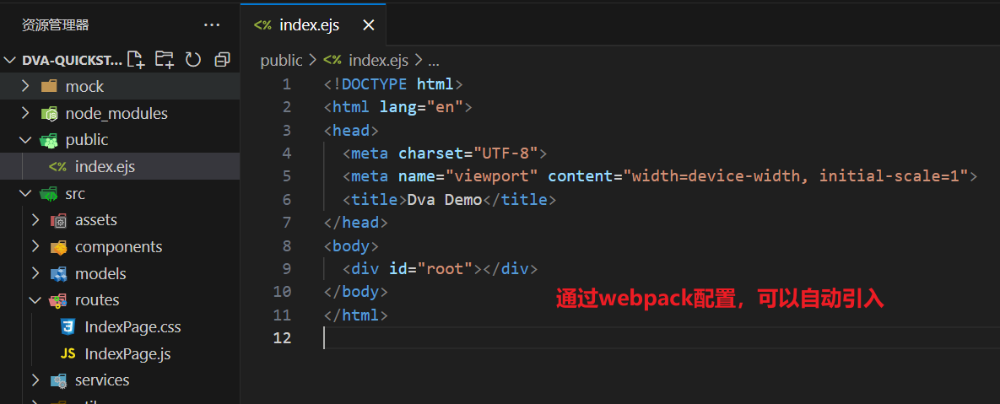

## 一，Dva介绍

### 1，Dva介绍

官网：https://dvajs.com/

‘

​	dva 首先是一个基于 redux 和 redux-saga 的数据流方案，然后为了简化开发体验，dva 还额外内置了 react-router 和 fetch，所以也可以理解为一个轻量级的应用框架!


**特点：**

- 易学易用，仅有 6 个 api，对 redux 用户尤其友好，配合 umi 使用后更是降低为 0 API
- elm 概念，通过 reducers, effects 和 subscriptions 组织 model
- 插件机制，比如 dva-loading 可以自动处理 loading 状态，不用一遍遍地写 showLoading 和 hideLoading
- 支持 HMR，基于 babel-plugin-dva-hmr 实现 components、routes 和 models 的 HMR


学习dva，主要学习三块内容：

- 一些配置
- dva中的路由
- 状态管理


### 2，Dva脚手架


参考文档：https://dvajs.com/guide/getting-started.html#%E5%AE%89%E8%A3%85-dva-cli


通过 npm 安装 dva-cli 并确保版本是 `0.9.1` 或以上。


通过 `dva new` 创建新应用（以管理员身份运行cmd）


`cd` 进入 `dva-quickstart` 目录，并启动开发服务器：


在浏览器里打开 http://localhost:8000 ，你会看到 dva 的欢迎界面。


创建好的目录结构如下：


对于models说明，先看vuex中的数据流：


vuex：


看package.json文件，如下：

```json
{
  "private": true,
  "scripts": {
    "start": "roadhog server",
    "build": "roadhog build",
    "lint": "eslint --ext .js src test",
    "precommit": "npm run lint"
  },
  "dependencies": {
    "dva": "^2.4.1",
    "react": "^16.2.0",
    "react-dom": "^16.2.0"
  },
  "devDependencies": {
    "babel-plugin-dva-hmr": "^0.3.2",
    "eslint": "^4.14.0",
    "eslint-config-umi": "^0.1.1",
    "eslint-plugin-flowtype": "^2.34.1",
    "eslint-plugin-import": "^2.6.0",
    "eslint-plugin-jsx-a11y": "^5.1.1",
    "eslint-plugin-react": "^7.1.0",
    "husky": "^0.12.0",
    "redbox-react": "^1.4.3",
    "roadhog": "^2.5.0-beta.4"
  }
}
```


说明：

- 无需安装：redux及redux-saga、react-redux、react-router-dom等，dva把这些东西都集成好了，安装一个dva就相当于安装了这些全部东西！！

- react-router-dom使用的是v4版本

- redux使用的是 v3.7.2「我们之前使用的都是v4.0」

- 集成的配套插件版本有点低

  


## 二，Dva配置

配置参考：https://github.com/sorrycc/roadhog/blob/master/README_zh-cn.md


### 1，配置支持antd

安装依赖：

```
"antd": "4.24.7", //注意版本用v4「不是最新的v5」
"antd-icons": "^0.1.0-alpha.1",
"babel-plugin-import": "^1.13.5", //antd按需导入，默认是不支持按需导入的，需要手动按需导入
```

```
cnpm i antd@4.24.7 antd-icons@^0.1.0-alpha.1 babel-plugin-import@^1.13.5  
// 如果npm不行，可以使用cnpm 
```


把.webpackrc修改成.webpackrc.js，在此文件中配置antd按需导入：


```js
export default {
    /* 配置BABEL的插件 */
    "extraBabelPlugins": [
        // antd按需导入
        [
            "import",
            {
                "libraryName": "antd",
                "libraryDirectory": "es",
                "style": "css"
            }
        ],
    ],
}
```


测试：


配置使用中文：


```js
import React from 'react';
import { Router, Route, Switch } from 'dva/router';
import IndexPage from './routes/IndexPage';

// antd
import { ConfigProvider } from "antd"
import zhCN from "antd/es/locale/zh_CN"

function RouterConfig({ history }) {
  return (
    <ConfigProvider locale={zhCN}>
      <Router history={history}>
        <Switch>
          <Route path="/" exact component={IndexPage} />
        </Switch>
      </Router>
    </ConfigProvider>
  );
}

export default RouterConfig;
```


测试：


### 2，配置less

安装：

```
"less": "4.1.3",
"less-loader": "8.1.1",
```

```
cnpm i less@4.1.3 less-loader@8.1.1
```


只需要安装预编译语言的模块和对应的loader，就可以直接生效，不需要单独做配置。测试如下：


浏览器效果：


dva里的roadhog 默认会开启cssModules，配置文件：

```
"disableCSSModules":false
```

index.css文件：

```css
.head {
    margin: 0 15px;
}
```

组件：

```jsx
...
import styles from './index.css';
function Index(){
  return(
    <div className={style.head}>局部样式<div>
    <div className={style['head']}>局部样式<div>
  )
}
export default Index;
```

style.head会变成类似于index_xxx_head的形式，保证类名不重复（相当于把head类变成了index_xxx_head类，保证只在局部作用）。


可以手动关闭roadhog的cssModules或者在css样式文件里面添加 :global() 来转成全局样式。如下：


浏览器测试：


禁用 CSS 的 SourceMap 生成。配置如下：


```js
export default {
    "disableCSSModules": true, // 关闭css模块化
    "disableCSSSourceMap":true, // 禁用 CSS 的 SourceMap 生成。
    /* 配置BABEL的插件 */
    "extraBabelPlugins": [
        // antd按需导入
        [
            "import",
            {
                "libraryName": "antd",
                "libraryDirectory": "es",
                "style": "css"
            }
        ],
    ],
}
```


### 3，配置代理


配置如下：


```js
export default {
    "disableCSSModules": true, // 关闭css模块化
    "disableCSSSourceMap": true, // 禁用 CSS 的 SourceMap 生成。
    /* 配置BABEL的插件 */
    "extraBabelPlugins": [
        // antd按需导入
        [
            "import",
            {
                "libraryName": "antd",
                "libraryDirectory": "es",
                "style": "css"
            }
        ],
    ],
    /* 配置跨域代理 */
    "proxy": {
        "/api": {
            "target": "https://news-at.zhihu.com/api/4",
            "changeOrigin": true,
            "ws": true,
            "pathRewrite": {
                "/api": ""
            }
        }
    },
}
```


测试：


```js
fetch("/api/news/latest").then(response=>response.json()).then(value=>{
    console.log(value)
})
```


### 4，配置移动端

安装插件：

```
"lib-flexible": "^0.3.2",
"postcss-pxtorem": "5.1.1",
"babel-plugin-styled-components-px2rem":"^1.5.5", 
"styled-components":"^5.3.6"
```

```
cnpm i lib-flexible@^0.3.2 postcss-pxtorem@5.1.1 babel-plugin-styled-components-px2rem@^1.5.5 styled-components@^5.3.6
```


配置：


```js
import px2rem from 'postcss-pxtorem';
export default {
    "disableCSSModules": true, // 关闭css模块化
    "disableCSSSourceMap": true, // 禁用 CSS 的 SourceMap 生成。
    /* 配置PX转REM */
    "extraPostCSSPlugins": [
        px2rem({
            "rootValue": 75,
            "propList": ['*']
        })
    ],
    /* 配置BABEL的插件 */
    "extraBabelPlugins": [
        // antd按需导入
        [
            "import",
            {
                "libraryName": "antd",
                "libraryDirectory": "es",
                "style": "css"
            }
        ],
        // 配置PX转REM
        [
            "styled-components-px2rem",
            {
                "rootValue": 75
            }
        ]
    ],
    /* 配置跨域代理 */
    "proxy": {
        "/api": {
            "target": "https://news-at.zhihu.com/api/4",
            "changeOrigin": true,
            "ws": true,
            "pathRewrite": {
                "/api": ""
            }
        }
    },
}
```


测试：


测试styled-components：


对于style-components，如下：


### 5，ES6和CSS3处理

默认情况下，roadhog脚手架中，已完成了对ES6常规语法和CSS3语法的兼容性处理。它处理时，依赖我们设置的浏览器兼容列表。但是有些语法如装饰器语法，还需要我们安装单独的babel插件来处理。

- ES6语法：babel-loader / babel-preset-react-app
- CSS3语法：postcss-loader / autoprefixer


配置浏览器兼容列表：


```js
import px2rem from 'postcss-pxtorem';
export default {
    "disableCSSModules": true, // 关闭css模块化
    "disableCSSSourceMap": true, // 禁用 CSS 的 SourceMap 生成。
    /* 配置PX转REM */
    "extraPostCSSPlugins": [
        px2rem({
            "rootValue": 75,
            "propList": ['*']
        })
    ],
    /* 配置BABEL的插件 */
    "extraBabelPlugins": [
        // antd按需导入
        [
            "import",
            {
                "libraryName": "antd",
                "libraryDirectory": "es",
                "style": "css"
            }
        ],
        // 配置PX转REM
        [
            "styled-components-px2rem",
            {
                "rootValue": 75
            }
        ]
    ],
    /* 配置跨域代理 */
    "proxy": {
        "/api": {
            "target": "https://news-at.zhihu.com/api/4",
            "changeOrigin": true,
            "ws": true,
            "pathRewrite": {
                "/api": ""
            }
        }
    },
    /* 不同环境下的不同配置 */
    "env": {
        "development": {
            "extraBabelPlugins": [
                "dva-hmr"
            ],
            "browserslist": [
                "last 1 chrome versions",
                "last 1 firefox versions",
                "last 1 safari versions"
            ]
        },
        "production": {
            "browserslist": [
                "> 0.2%",
                "not dead",
                "not ie <= 8"
            ]
        }
    }
}
```


有些ES6+中的语法，没有对应的老语法，需要polyfill，安装之：

```
cnpm i @babel/polyfill@^7.12.1
```


配置：


### 6，配置index.ejs

原本的index页面如下：


可以配置自动引入，把后缀.html变成后缀.ejs，如下：




配置：


效果：


### 7，配置打包生成hash

打包如下：


打包成功后如下：


配置添加hash，如下：


再次打包：


测试：


### 8，基于cross-env设置环境变量


安装cross-env模块：

```
cnpm i cross-env@^7.0.3
```


配置：


测试：


## 三，Dva中的路由


### 1，Dva中的路由介绍

看项目的入口：


路由文件：


默认的路由模式是hash路由，如下：


如果要使用history路由，先安装模块：

```
cnpm i history@^4.10.1
```


使用时，参考文档：


配置之：


```js
import dva from 'dva';
import './index.css';
import '@babel/polyfill'
import createHistory from "history/createBrowserHistory"

// 1. Initialize
const app = dva({
    // 指定路由模式，默认是hash路由
    // createBrowserHistory / createHashHistory
    history:createHistory()
});

// 2. Plugins
// app.use({});

// 3. Model
// app.model(require('./models/example').default);

// 4. Router   处理路由
app.router(require('./router').default);

// 5. Start   在start之前，需要先处理路由
app.start('#root');
```


hash路由使用的最多，history路由有一些问题，还需要后端处理一下。


通过 extraEnhancers 可以扩展其它中间件，如：redux-persist


在dva/router中包含了两大块内容：

- react-router-dom 提供了所有的路由相关的API，当然是V5版本。
- react-router-redux [routerRedux]中的方法，就是把路由和redux结合在一起的一个模块，可以让我们在redux操作中，实现路由的跳转与传参。


在配置一级路由和二路由之前，先创建如下组件：


```jsx
function Vote(props){
    return (<div>
        <div>
            <h2>React比Vue值钱？<span> {3} </span></h2>
        </div>
        <div>
            <p>支持：{1} 人</p>
            <p>反对：{2} 人</p>
        </div>
        <div>
            <button onClick={()=>{}}>支持</button>
            <button onClick={()=>{}}>反对</button>
        </div>
    </div>)
}

export default Vote;
```

```jsx
function Count(props){
    return(<div>
        <span>0</span>
        <button>+1</button>
    </div>)
}

export default Count;
```

```jsx
function User(props){
    return(<div>
        <h1>我的模块</h1>
    </div>)
}

export default User;
```

```jsx
function Order(props){
    return(<div>
        <h1>订单</h1>
    </div>)
}

export default Order;
```

```jsx
function Profile(props){
    return(<div>
        <h1>个人信息</h1>
    </div>)
}

export default Profile;
```


### 2，配置一级路由和二级路由


配置一级路由如下：


```js
import React from 'react';
import { Router, Route, Switch } from 'dva/router';
import Vote from "./routes/Vote"
import Count from "./routes/Count"
import User from "./routes/User"

// antd
import { ConfigProvider } from "antd"
import zhCN from "antd/es/locale/zh_CN"
import "./index.less"
import "lib-flexible"

function RouterConfig({ history,app }) {
  // history对象是包含路由跳转方法的history对象
  // app 是基于dva创建的应用
  return (
    <ConfigProvider locale={zhCN}>
      {/* history={history} 必须要写 */}
      <Router history={history}>
        {/* 路由配置：之前我们讲的是V6版本，下面的写法是V5版本 */}
        <Switch>
          <Route path="/" exact component={Vote} />
          <Route path="/count" component={Count} />
          <Route path="/user" component={User} />
        </Switch>
      </Router>
    </ConfigProvider>
  );
}

export default RouterConfig;
```


测试：


配置二级路由：


```jsx
import React from "react";
import styled from "styled-components";
import {NavLink,Switch,Route,Redirect} from "dva/router"
import Order from "./user/Order"
import Profile from "./user/Profile"

const UserBox = styled.div`
    display:flex;
    .box{
        width:100px;
        a{
            display:block;
            color:#000;
            line-height:35px;
            font-size:14px;
            &.active{
                color:red;
            }
        }
    }
`;

function User(props){
    return(<UserBox>
        <div className="box">
            <NavLink to="/user/order">我的订单</NavLink>
            <NavLink to="/user/profile">我的信息</NavLink>
        </div>
        <div className="content">
            <Switch>
                <Redirect from="/user" exact to="/user/order" />
                <Route path="/user/order" component={Order} />
                <Route path="/user/profile" component={Profile} />
            </Switch>
        </div>
    </UserBox>)
}


export default User;
```


测试如下：


### 3，路由懒加载


前面的在配置一级路由和二级路由时，组件是上一来就加载好了，如下：


在配置路由懒加载之前，先说一个东西，叫models。在dva中，一个模块，就一个models，我们可以创建vote对应的model和count对应的model，如下：


```js
// dva中三大核心：model数据模型（每个模块的状态管理） + 路由 + 配置
export default{
    namespace:"count", // 模块名
    state:{},  // 状态
    reducers:{}, // 同步修改状态的方法
    effects:{} // 基于saga的语法，存放异步修改状态的方法
}
```

```js
export default{
    namespace:"vote", // 模块名
    state:{},  // 状态
    reducers:{}, // 同步修改状态的方法
    effects:{} // 基于saga的语法，存放异步修改状态的方法
}
```


在我们懒加载一个组件时，我们也可以懒加载这个组件对应的models，配置如下：

```jsx
import React from 'react';
import { Router, Route, Switch } from 'dva/router';
import dynamic from "dva/dynamic"
import Vote from "./routes/Vote"
// import Count from "./routes/Count"
// import User from "./routes/User"

// antd
import { ConfigProvider } from "antd"
import zhCN from "antd/es/locale/zh_CN"
// import "./index.less"
// import "lib-flexible"

function RouterConfig({ history,app }) {
  // history对象是包含路由跳转方法的history对象
  // app 是基于dva创建的应用

  // 基于dva/dynamic实现路由的懒加载：组件的懒加载和对应Model的懒加载
  const LazyCount = dynamic({
    app,
    models:()=>[import('./models/count')],
    component:()=>import("./routes/Count")
  })
  const LazyUser = dynamic({
    app,
    component:()=>import("./routes/User")
  })

  return (
    <ConfigProvider locale={zhCN}>
      {/* history={history} 必须要写 */}
      <Router history={history}>
        {/* 路由配置：之前我们讲的是V6版本，下面的写法是V5版本 */}
        <Switch>
          <Route path="/" exact component={Vote} />
          <Route path="/count" component={LazyCount} />
          <Route path="/user"  component={LazyUser} />
        </Switch>
      </Router>
    </ConfigProvider>
  );
}

export default RouterConfig;
```


测试：


添加魔法注释：

```js
const LazyCount = dynamic({
    app,
    models:()=>[import(/* webpackChunkName:'count' */ './models/count')],
    component:()=>import(/* webpackChunkName:'count' */ "./routes/Count")
})
const LazyUser = dynamic({
    app,
    component:()=>import(/* webpackChunkName:'user' */ "./routes/User")
})
```


指定打包后文件名字以及相同名字的文件会打包在一起，再次测试：


配置二级路由模块，也实现懒加载：


```js
const LazyOrder = dynamic({
    app: window.app,
    models: () => [],
    component: () => import(/* webpackChunkName:'user' */ "./user/Order")
})

const LazyProfile = dynamic({
    app: window.app,
    models: () => [],
    component: () => import(/* webpackChunkName:'user' */ "./user/Profile")
})
```


配置404组件：


### 4，配置路由表动态生成路由

在进行权限设计时，往往后端会给我们生成路由表，我们需要根据路由表，动态生成路由规则。现在我们先定义出这个路由表，如下：


```jsx
import dynamic from "dva/dynamic"
import Vote from "./routes/Vote"

// 路由懒加载
function lazy(component, models){
    if(typeof models === 'undefined') models = ()=>[];
    return dynamic({
        app:window.app, 
        models, 
        component
    })
}


// 配置路由表
const routes = [
    {
        path:"/",
        exact:true,
        component:Vote, 
        mate:{title:"首页"}
    },
    {
        path:"/count",
        component:lazy(
            ()=>import( /* webpackChunkName:"count" */ './routes/Count'), 
            ()=>[import(/* webpackChunkName:"count" */ './models/count')]
        ),
        mate:{title:"计数器"}
    },
    {
        path:"/user",
        component:lazy(
            ()=>import( /* webpackChunkName:"user" */ './routes/User'), 
        ),
        mate:{title:"个人中心"},
        // 二级路由
        children:[
            {
                path:"/user",
                exact:true,
                redirect:"/user/order"
            },
            {
                path:"/user/order",
                component:lazy(
                    ()=>import( /* webpackChunkName:"user" */ './routes/user/Order'), 
                ),
                mate:{title:"我的订单"}
            },
            {
                path:"/user/profile",
                component:lazy(
                    ()=>import( /* webpackChunkName:"user" */ './routes/user/Profile'), 
                ),
                mate:{title:"我的信息"}
            },
        ]
    },
    {
        path:"*",
        redirect:"/"
    }
]

export default routes;
```


有了路由表，需要写一个算法，动态生成路由规则们，如下：


```js
import React from 'react';
import { Router, Route, Switch,Redirect } from 'dva/router';
import routes from "./routerRoutes"


import { ConfigProvider } from "antd"
import zhCN from "antd/es/locale/zh_CN"

const Element = function Element(props){
  let {component:Component, history,location, match} = props;
  let config = {history, location, match}
  return <Component {...config}/>
}

// vue-template-admin  vue2的开源项目
const createRoute = (routes)=>{
  return <Switch>
    {
      routes.map((item,index)=>{
        let {path,exact,component,meta,redirect} = item;
        let config = {};
        if(redirect){
          config = {from:path, to:redirect}
          if(exact) config.exact = exact;
          return <Redirect key={index} {...config}/>
        }
        config = { path }
        if(exact) config.exact = exact;
        return <Route key={index} {...config} render={props=>{
          let title = meta?.title || "dva学习"
          document.title = title;
          return <Element {...props} {...item}/>
        }}/>
      })
    }
  </Switch>
}


function RouterConfig({ history,app }) {
  return (
    <ConfigProvider locale={zhCN}>
      <Router history={history}>
        {
          createRoute(routes)
        }
      </Router>
    </ConfigProvider>
  );
}

export default RouterConfig;
```


测试之：


对于二级路由，我们也写一个小算法，生成二级路由规则，如下：


```js
// 二级路由规则
export const LevelTwoRouterConfig = function LevelTwoRouterConfig({path}){
  let item = routes.find(item=>item.path === path);
  let children = item?.children;
  if(!children) return null;
  return createRoute(children)
}
// <LevelTwoRouterConfig path="/user" />
```


在User.jsx中，使用之如下：


```jsx
import React from "react";
import styled from "styled-components";
import {NavLink} from "dva/router"
import { LevelTwoRouterConfig } from "../router.js"

const UserBox = styled.div`
    display:flex;
    .box{
        width:100px;
        a{
            display:block;
            color:#000;
            line-height:35px;
            font-size:14px;
            &.active{
                color:red;
            }
        }
    }
`;

function User(props){
    return(<UserBox>
        <div className="box">
            <NavLink to="/user/order">我的订单</NavLink>
            <NavLink to="/user/profile">我的信息</NavLink>
        </div>
        <div className="content">
            <LevelTwoRouterConfig path="/user" />
        </div>
    </UserBox>)
}

export default User;
```


测试：


### 5，路由跳转与传参

使用Link组件，可以进行路由跳转，如下：


```jsx

import {Button} from "antd"
import { Link } from "dva/router"

function Order(props){
    return(<div>
        <h1>订单</h1>
        {/* 还有一种导航,叫声明式导航,通过Link,NavLink */}
        <Link to="/user/profile">按钮</Link>

        {/* 点击按钮进行跳转,叫编程式导航 */}
        {/* <Button type="primary">按钮</Button> */}
    </div>)
}

export default Order;
```


跳转时，可以传递参数，传参分三种：

- 问号传参  ?name=malu&age=18
- 路径传参(动态路由)  /user/profile/malu/18  
- 隐式传参


问号传参：


```jsx
import {Button} from "antd"
import { Link } from "dva/router"

function Order(props){
    return(<div>
        <h1>订单</h1>
        <Link to={{
            pathname:"/user/profile",
            search:"?name=malu&age=18"
        }}>按钮</Link>
    </div>)
}

export default Order;
```


测试：


使用编程式导航，如下：


```jsx

import {Button} from "antd"
import { Link } from "dva/router"

function Order(props){
    // 当访问 /user/order时,渲染Order组件,Order组件叫路由级别的组件
    // 路由级别的组件,它的props中自然就有history,location,match
    // console.log(props)
    let {history} = props;
    // history中有一些API
    //   go
    //   push
    //   replace
    //   back
    //   foward
    //   ...
    return(<div>
        <h1>订单</h1>
        <Button type="primary" onClick={()=>{
            // 问号传参: 数据会放在地址栏中,反复刷新页面,数据还在,不会丢失
            // push 和 repalce 区别
            history.push({
                pathname:"/user/profile",
                search:"?name=malu&age=18"
            })
        }}>按钮</Button>
    </div>)
}

export default Order;
```


除了问号传参，还有隐式传参，如下：


```jsx

import {Button} from "antd"
import { Link } from "dva/router"

function Order(props){
   
    let {history} = props;
  
    return(<div>
        <h1>订单</h1>
        <Button type="primary" onClick={()=>{
            // 隐式传参,基于state把数据传递给目标组件,数据不会暴露在url中,url相对就好看一点,安全一点
            // 但是刷新页面时，数据就没有了，一般不用
            history.push({
                pathname:"/user/profile",
                state:{
                    name:"malu",
                    age:18
                }
            })
        }}>按钮</Button>
    </div>)
}

export default Order;
```

```jsx
function Profile(props){
    // Profile也是路由级别的组件，
    // 它的props中，也有history,location,match
    // 想获取参数，通过location来获取
    //   location
    //     search  获取问号传参过来的数据  '?name=malu&age=18'  QS模块/URLSearchParams
    //     state  获取隐式传递过来的数据
    //     pathname
    let {location} = props;
    console.log(location)
    return(<div>
        <h1>个人信息</h1>
    </div>)
}

export default Profile;
```


刷新时，隐式传递的参数就没有了，如下：


还有一种传参，就是路径传参，就是所谓的动态路由，配置如下：


进行参数传递，如下：


```jsx
import {Button} from "antd"
import { Link } from "dva/router"

function Order(props){
   
    let {history} = props;
  
    return(<div>
        <h1>订单</h1>
        <Button type="primary" onClick={()=>{
            // 路径传参
            //  path:"/user/profile/:name?/:age?",
            //  /user/profile
            history.push(`/user/profile/malu/18`)
        }}>按钮</Button>
    </div>)
}

export default Order;
```


在目标组件的props中有一些对象，如下：


```jsx
function Profile(props){
    // Profile也是路由级别的组件，
    // 它的props中，也有history,location,match
    // 想获取参数，通过location来获取
    //   location
    //     search  获取问号传参过来的数据  '?name=malu&age=18'  QS模块/URLSearchParams
    //     state  获取隐式传递过来的数据
    //     pathname
    //   match
    //     params  可以非常方便地获取路径传参过来的数据
    console.log("--props:",props)

    let {location} = props;
    console.log(location)
    return(<div>
        <h1>个人信息</h1>
    </div>)
}

export default Profile;
```


前面的Profile组件，是路由级别的组件，只有路由级别的组件，它的props中才有：

- history
- location
- match


如果一个组件不是路由级别的组件，这个组件并没有参与路由的配置，这个组件想获取history, location, match，需要使用withRouter这个高阶函数，如下：


```jsx

// withRouter是一个高阶组件
import { withRouter } from "dva/router"

// 这个Demo组件没有参与路由的配置
// 此时，它的props中没有history,location,match
function Demo(props){
    console.log("Demo中的props:",props)

    return(<div>
        <h1>Demo</h1>
    </div>)
}

export default withRouter(Demo);
// export default Demo;
```

```jsx
import { Link } from "dva/router"
import Demo from "./Demo";

function Profile(props){
    // Profile也是路由级别的组件，
    // 它的props中，也有history,location,match
    // 想获取参数，通过location来获取
    //   location
    //     search  获取问号传参过来的数据  '?name=malu&age=18'  QS模块/URLSearchParams
    //     state  获取隐式传递过来的数据
    //     pathname
    //   match
    //     params  可以非常方便地获取路径传参过来的数据
    // console.log("--props:",props)

    let {location} = props;
    // console.log(location)
    return(<div>
        <h1>个人信息</h1>
        <Demo></Demo>
    </div>)
}

export default Profile;
```


### 6，react-router-redux

routerRedux是react-router-redux中提供的对象，这个对象中包含路由跳转的方法：

- go
- goBack
- goFoward
- push
- replace


相比props.history来说，routerRedux不仅可以在组件中实现跳转，并且可以在redux操作中实现路由跳转。它本身就是redux和router的结合操作。在使用时，分你是在redux中使用，还是在组件中使用。

- 在redux中使用
  - yield put(routerRedux.push(....))
- 在组件中使用
  - dispatch(routerRedux.push(....))
  - 一定要基于dispatch进行派发才会跳转，执行routerRedux.push(....)，返回一个action对象


在组件中使用：


```jsx

import {Button} from "antd"
import { Link, routerRedux } from "dva/router"
import {connect} from "dva"

function Order({dispatch}){
    
    return(<div>
        <h1>订单</h1>
        <Button type="primary" onClick={()=>{
            dispatch(
                // 路径传参
                routerRedux.push("/user/profile/malu/18")
            )
        }}>按钮</Button>
    </div>)
}

export default connect()(Order);
```


routerRedux.push("/user/profile/malu/18") 得到的是一个action，如下：


同样，可以进行问号传参，如下：


```jsx

import {Button} from "antd"
import { Link, routerRedux } from "dva/router"
import {connect} from "dva"

function Order({dispatch}){
    console.log(routerRedux.push("/user/profile/malu/18"));
    return(<div>
        <h1>订单</h1>
        <Button type="primary" onClick={()=>{
            dispatch(
                // 路径传参
                routerRedux.push({
                    pathname:"/user/profile",
                    search:"?name=malu&age=18"
                })
            )
        }}>按钮</Button>
    </div>)
}

export default connect()(Order);
```


目标组件中，也是通过props中的location，match来获取数据，不演示了。也可以进行隐式传参，如下：


```jsx

import {Button} from "antd"
import { Link, routerRedux } from "dva/router"
import {connect} from "dva"

function Order({dispatch}){
    console.log(routerRedux.push("/user/profile/malu/18"));
    return(<div>
        <h1>订单</h1>
        <Button type="primary" onClick={()=>{
            dispatch(
                // 路径传参
                routerRedux.push({
                    pathname:"/user/profile",
                    state:{name:"malu",age:20}
                })
            )
        }}>按钮</Button>
    </div>)
}

export default connect()(Order);
```


## 四，Dva中的Models（Vuex）


### 1，Model层的处理流程

项目中所有的Model，一般都放在src/models目录下，如下：


可以在入口中，直接引入一个Model，然后进行注册，那么一加载页面，我们注册的Model就可以使用了，如下：


```js

```


不需要页面一加载就使用的Model，我们可以和组件一样，做懒加载。只有路由匹配成功了，进入这个组件，才会把相关的JS加载出来，此时，对应的Model中的内容才能使用，如下：


```js

```


如果所有的Model，全部打包到主JS中，页面一加载就把所有的Model都准备好了，我们想怎么用就怎么用。但是此时模块越多，对应的Model也很多，那么主JS就会比较大，第一次渲染速度就会降低。所以我们可以把不需要在第一次加载完就处理的Model，只有进入相关组件才需要处理的Model，可以通过dynamic配置成懒加载。


在每一个Model中都包含了5部分内容：

- namespace：模块名，这个名字是后期我们获取状态和进行派发的标识  
- state: 一个模块中存储的状态     state.count.num
- reducers:  存储一个个的方法，都是同步修改的方法，外部派发 dispatch('count/xxxx')
- 


