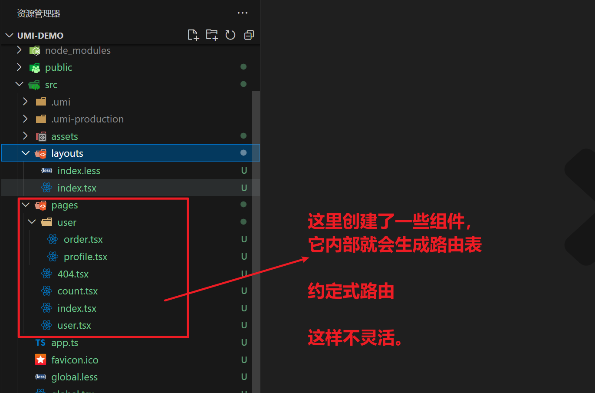
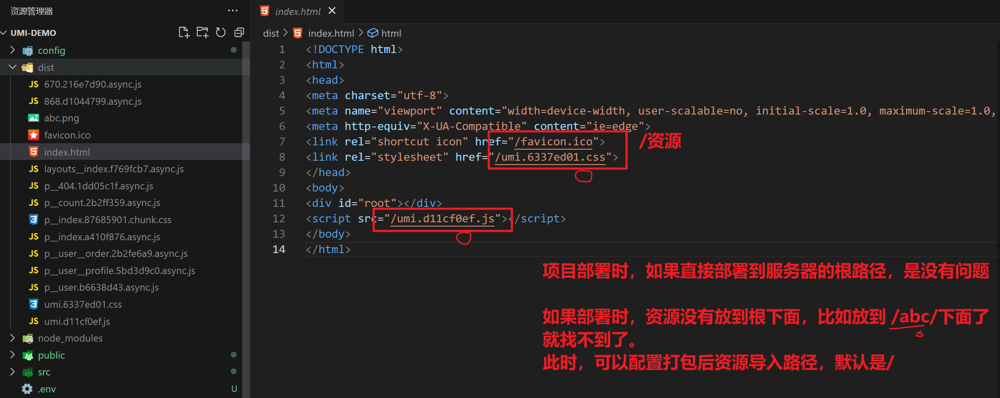

## 一，umi介绍


学习umi，分两块学习

- umi
- umi max(Ant Design Pro)


### 1，什么是umi

官网：https://umijs.org/


版本：

- v3  
- v4  直接学习v4版本


学习umi，直接看人家的文档。


### 2，项目创建 

创建项目，官方推荐使用pnpm，安装pnpm，如下：

```
npm i pnpm -g
```


创建文件夹，在cmd中进入到文件夹中：


创建项目：


使用vscode打开项目：


在后面小代码时，可能会使用到其它的依赖，先安装一下：

```
npm i antd@5.1.2 qs styled-components@5 @umijs/plugins
```


安装完毕后：


运行项目：


访问项目：


### 3，项目目录分析

人家推荐的目录结构如下：https://umijs.org/docs/guides/directory-structure


```
.
├── config
│   └── config.ts
├── dist
├── mock
│   └── app.ts｜tsx
├── src
│   ├── .umi
│   ├── .umi-production
│   ├── layouts
│   │   ├── BasicLayout.tsx
│   │   ├── index.less
│   ├── models
│   │   ├── global.ts
│   │   └── index.ts
│   ├── pages
│   │   ├── index.less
│   │   └── index.tsx
│   ├── utils // 推荐目录
│   │   └── index.ts
│   ├── services // 推荐目录
│   │   └── api.ts
│   ├── app.(ts|tsx)
│   ├── global.ts
│   ├── global.(css|less|sass|scss)
│   ├── overrides.(css|less|sass|scss)
│   ├── favicon.(ico|gif|png|jpg|jpeg|svg|avif|webp)
│   └── loading.(tsx|jsx)
├── node_modules
│   └── .cache
│       ├── bundler-webpack
│       ├── mfsu
│       └── mfsu-deps
├── .env
├── plugin.ts 
├── .umirc.ts // 与 config/config 文件 2 选一
├── package.json
├── tsconfig.json
└── typings.d.ts
```


.env文件：


除了.env文件中可以设置环境变量之外，还可以使用cross-env设置环境变量，如在package.json中：

```
"dev":cross-env PORT=3333 HOST=127.0.0.1 umi dev
```


.umirc.ts 这个文件是对webpack进行配置，*config/config.ts* 也可以对webpack进行配置，`.umirc.ts` 文件优先级较高。配置的都是非运行配置（webpack配置），运行配置一般都是放在app.ts中。


```ts
import { defineConfig } from "umi";

export default defineConfig({
  routes: [
    { path: "/", component: "index" },
    { path: "/docs", component: "docs" },
  ],
  npmClient: 'pnpm',
});
```


创建config.ts，配置都放在config.ts中，如下：


这样，就可以把umirc.ts删除了。运行配置都是放在app.ts中，如下：


public目录：


layout：


pages:


放在pages下面的组件，会自动生成路由，也就是说不需要配置路由，这种路由，叫约定式路由：


创建一个count组件，如下：


404组件：


global.tsx:


global.less, umi自动开启了 css modules以及它配置好了less，sass：


loading.tsx:


```tsx
// 当路由懒加载时，匹配到的组件，加载非常慢时，可以先显示一个loading效果

export default ()=>{
    return <div>
        加载中.... 
    </div>
}
```


favicon.ico :


## 二，umi路由


### 1，约定式路由

说白了，就是不需要写去路由表，直接创建组件，人家会根据创建的组件，在内部生成路由表。创建几个组件：


```tsx
const HomePage = () => {
  return (
      <div>
          <h1>Vote</h1>
      </div>
  );
};

export default HomePage;
```

```tsx
const CountPage = () => {
    return (
        <div>
            <h1>计数器</h1>
        </div>
    );
};

export default CountPage;
```

```tsx
const UserPage = () => {
    return (
        <div>
            <h1>个人中心</h1>
        </div>
    );
};

export default UserPage;
```

```tsx
const Order = () => {
    return (
        <div>
            <h1>我的订单</h1>
        </div>
    );
};

export default Order;
```

```tsx
const Profile = () => {
    return (
        <div>
            <h1>我的信息</h1>
        </div>
    );
};

export default Profile;
```

```tsx
const Error = () => {
    return (
        <div>
            <p>你的页面飞走了~</p>
        </div>
    );
};

export default Error;
```


测试：


在layout组件中配置导航：


```tsx
import { NavLink, Outlet } from 'umi';
import styled from 'styled-components';

let StyleLayoutBox = styled.div`
  .nav-box{
    height:50px;
    border-bottom:1px solid red;

    a{
      margin-right:20px;
      color:#000;
      text-decoration:none;
      font-size:20px;
      &.active{
        color:red;
      }
    }
  }
`;

export default function Layout() {
  return (
    <StyleLayoutBox>
      <div className="nav-box">
          <NavLink to="/">Vote</NavLink>
          <NavLink to="/count">计算器</NavLink>
          <NavLink to="/user">个人中心</NavLink>
      </div>
      <Outlet />
    </StyleLayoutBox>
  );
}
```


效果：


配置二级路由：


```tsx
import { NavLink, Outlet } from 'umi';
import styled from 'styled-components';

let StyleUserBox = styled.div`
  display:flex;
  .menu{
    display:flex;
    flex-direction:column;
    margin-right:20px;
    margin-top:20px;
    a{
        color:#000;
        &.active{
            color:blue;
        }
    }
  }
`;

const UserPage = () => {
    return (
        <StyleUserBox>
            <div className='menu'>
                <NavLink to="/user/order">订单管理</NavLink>
                <NavLink to="/user/profile">个人信息</NavLink>
            </div>
            <div className="content">
                <Outlet/>
            </div>
        </StyleUserBox>
    );
};

export default UserPage;
```


从始至终并没有配置路由表，叫约束式路由。




上面每一个组件默认都实现了懒加载的，不需要我们任何配置。


### 2，配置式路由

在config目录下面创建一个routes.ts文件，在这里配置路由，如下：


```ts
const routes = [
    {
        path: "/",
        // 自动会去pages目录下查找，也可以也指定目录
        // component:'@/a/b'
        component: 'index',
        title:"首页"
    },{
        path: "/count",
        component: 'count',
        title:"计数器"
    },{
        path: "/user",
        component: 'user',
        title:"个人中心",
        routes:[
            {
                path: "/user",
                redirect: '/user/order',
            },
            {
                path: "/user/order",
                component: 'user/order',
                title:"订单页"
            },
            {
                path: "/user/profile",
                component: 'user/profile',
                title:"个人信息"
            }
        ]
    },{
        path: "*",
        component: '404',
    }
];

export default routes;
```


在config.ts中启用：


前面写了一个loading.tsx。因为组件都是懒加载，如果网络比较慢，会先走laoding组件，如下：


看一下loading组件，如下：


要使用antd，需要开启一个配置：


可以美化一下loading组件：


```tsx
import { Spin } from "antd"
import styled from "styled-components"

const StyledLoadingBox = styled.div`
    position: fixed;
    top:0;
    left:0; 
    width: 100%;
    height: 100%;
    z-index: 999;
    background-color: rgba(0, 0, 0, .5);
    .ant-spin{
        position: absolute;
        left: 50%;
        top: 50%;
        transform: translate(-50%,-50%);
    }
`;


export default ()=>{
    return <StyledLoadingBox>
        <Spin size="large" tip="加载中..." />
    </StyledLoadingBox>
}
```


效果：


### 3，路由跳转传参

umi中的路由跳转也是分两类：

- 声明式导航  Link / NavLink / Navigate(V6) 
- 编程式导航   history对象 / useNavigate => navigate() 


传参：

- 问号传参  ?name=malu&age=18
- 路径传参    /profile/malu/18
- 隐式传参   state:{name:"malu", age:18}


#### 1）路径参数的获取

配置计数器的路由，如下：


访问时，需要带上参数：


获取路径参数方式一：


```tsx
import {useParams} from "umi"

const CountPage = () => {
    // 基于路由hook获取路径参数  V6
    let params = useParams();
    console.log(params);
    
    return (
        <div>
            <h1>计数器</h1>
        </div>
    );
};

export default CountPage;
```


获取路径参数方式二：


```tsx
import {useParams,withRouter} from "umi"

// 使用withRouter包一个Props
// 那么props中就有几个属性：history, location, match, navigate, params
const CountPage = (props) => {
    console.log(props);

    return (
        <div>
            <h1>计数器</h1>
        </div>
    );
};

export default withRouter(CountPage);
```


#### 2）navigate跳转并传参

useNavigate是V6版本中的hook，利用navigate就可以进行跳转

- navigate("/abc");    push
- navigate(-1)
- navigate(1)
- navigate('/abc', {replace:true, state:{....}})
- navigate({pathname:"/abc", search:"?a=1&b=2"})


代码演示：


```tsx
import {useNavigate, Navigate} from "umi";
import {Button} from "antd"
const Order = () => {

    // 创建navigate
    const navigate = useNavigate(); 

    const fn = ()=>{
        // console.log("fn....")
        // 普通跳转，不传参
        // navigate("/user/profile")

        // 跳转并通过问号传参
        navigate({
            pathname:"/user/profile",
            search: 'name=ml&age=100'
        })
    }

    return (
        <div>
            <h1>我的订单</h1>
            <Button type="primary" onClick={()=>{
                fn()
            }}>去Profile</Button>
        </div>
    );
};

export default Order;
```


在目标组件中要获取参数：


处理参数：


```tsx
import {withRouter} from "umi"

const Profile = ({location}) => {
    console.log(location.search)
    const usp = new URLSearchParams(location.search)
    console.log(usp.get('name'));
    console.log(usp.get('age'));
    
    return (
        <div>
            <h1>我的信息</h1>
        </div>
    );
};

export default withRouter(Profile);
```


还可以这样处理参数：


```tsx
import {withRouter,createSearchParams} from "umi"

const Profile = ({location}) => {
    console.log(location.search)
    const usp = createSearchParams(location.search)
    console.log(usp.get('name'));
    console.log(usp.get('age'));
    
    return (
        <div>
            <h1>我的信息</h1>
        </div>
    );
};

export default withRouter(Profile);
```


还有一种方式，如下：


```tsx
import {withRouter,createSearchParams, useSearchParams} from "umi"

const Profile = () => {
	// V6版本中自带的hook
    const [usp] = useSearchParams();
    console.log(usp.get('name'));
    console.log(usp.get('age'));
    
    return (
        <div>
            <h1>我的信息</h1>
        </div>
    );
};

export default withRouter(Profile);
```


隐式传参：

```tsx
import {useNavigate, Navigate} from "umi";
import {Button} from "antd"
const Order = () => {

    // 创建navigate
    const navigate = useNavigate(); 

    const fn = ()=>{
        navigate("/user/profile",{
            // 隐式传参
            state:{
                name:"wc",
                age:180
            }
        })
    }

    return (
        <div>
            <h1>我的订单</h1>
            <Button type="primary" onClick={()=>{
                fn()
            }}>去Profile</Button>
        </div>
    );
};

export default Order;
```


在目标组件中获取隐式传递过来的数据：


```tsx
import {withRouter,createSearchParams, useSearchParams} from "umi"

const Profile = ({location}) => {

    console.log(location);
    
    return (
        <div>
            <h1>我的信息</h1>
        </div>
    );
};

export default withRouter(Profile);
```


还有一种方式，也可以获取隐式参数：


```tsx
import {withRouter,useLocation} from "umi"

const Profile = () => {

    // useLocation也是V6版本中提供的hook
    const location = useLocation();
    console.log(location)

    return (
        <div>
            <h1>我的信息</h1>
        </div>
    );
};

export default withRouter(Profile);
```


#### 3）history跳转并传参

直接上代码：


```tsx
import {useNavigate, Navigate, history} from "umi";
import {Button} from "antd"
const Order = () => {


    const fn = ()=>{
        // history.push("/user/profile")

        // ?传参
        // history: push go goBack goFoward replace 
        // history.push({
        //     pathname:"/user/profile",
        //     search:"name=xq&age=111"
        // })

        // 通过一个配置，还可以这样传
        // 在config/config.ts中配置 
        // 需要在confit.ts中配置historyWithQuery选项之后，才能通过query传参
        history.push({
            pathname:"/user/profile",
            query: {
                name:"xx",
                age:222
            }
        })
    }

    return (
        <div>
            <h1>我的订单</h1>
            <Button type="primary" onClick={()=>{
                fn()
            }}>去Profile</Button>
        </div>
    );
};

export default Order;
```


隐式传参：

```tsx
import {useNavigate, Navigate, history} from "umi";
import {Button} from "antd"
const Order = () => {


    const fn = ()=>{
       
        // 隐式传参
        // V6中，隐式传参后，在目标组件刷新后，参数不会丢失。
        // V5中，隐式传参后，在目标组件刷新后，参数丢失了。
        history.push("/user/profile",{
            name:"xx",
            age:66
        })
    }

    return (
        <div>
            <h1>我的订单</h1>
            <Button type="primary" onClick={()=>{
                fn()
            }}>去Profile</Button>
        </div>
    );
};

export default Order;
```


## 三，umi配置


### 1，基础配置

#### 1）配置别名


#### 2）配置sourcemap


关闭sourceMap文件的生成：


在开发时，配置sourcemap，在生产时，不配置source，如下：


```ts
import { defineConfig } from "umi";
import routes from "./routes";

export default defineConfig({
  // 基本配置
  // 关闭sourcemap文件生成
  // devtool:false, 
  // process.env.NODE_ENV  NODE_ENV是一个环境变量
  // 当pnpm dev NODE_ENV的值是 development
  // 当pnpm build NODE_ENV的值是 production
  devtool: process.env.NODE_ENV === 'development' ? 'eval' : false,

  // 路由相关的
  routes, 
  historyWithQuery:{}, 

  externals:{}, 
});
```


#### 3）添加hash

配置hash，打包后，资源就会加上hash，如下：


在硬盘上打包：


#### 4）图片转base64

配置如下：

```ts
import { defineConfig } from "umi";
import routes from "./routes";

export default defineConfig({
  // 基本配置
  // 关闭sourcemap文件生成
  // devtool:false, 
  // process.env.NODE_ENV  NODE_ENV是一个环境变量
  // 当pnpm dev NODE_ENV的值是 development
  // 当pnpm build NODE_ENV的值是 production
  devtool: process.env.NODE_ENV === 'development' ? 'eval' : false,
  // 打包后的文件会带个hash,处理浏览器缓存问题
  hash:true, 
  // 配置图片的打包方式,大于10KB,单独打包成一个图片,如果小于10KB,打包Base64
  inlineLimit:10000,
  

  // 路由相关的
  routes, 
  historyWithQuery:{}, 

  externals:{}, 
});

```


#### 5）设置JS压缩方式

```ts
import { defineConfig } from "umi";
import routes from "./routes";

export default defineConfig({
  // 基本配置
  // 关闭sourcemap文件生成
  // devtool:false, 
  // process.env.NODE_ENV  NODE_ENV是一个环境变量
  // 当pnpm dev NODE_ENV的值是 development
  // 当pnpm build NODE_ENV的值是 production
  devtool: process.env.NODE_ENV === 'development' ? 'eval' : false,
  // 打包后的文件会带个hash,处理浏览器缓存问题
  hash:true, 
  // 配置图片的打包方式,大于10KB,单独打包成一个图片,如果小于10KB,打包Base64
  inlineLimit:10000,
  // 配置js的压缩方式
  jsMinifier:'terser',
  jsMinifierOptions:{},
  

  // 路由相关的
  routes, 
  historyWithQuery:{}, 

  externals:{}, 
});
```


#### 6）设置umi插件

```ts
import { defineConfig } from "umi";
import routes from "./routes";

export default defineConfig({
  // 基本配置
  // 关闭sourcemap文件生成
  // devtool:false, 
  // process.env.NODE_ENV  NODE_ENV是一个环境变量
  // 当pnpm dev NODE_ENV的值是 development
  // 当pnpm build NODE_ENV的值是 production
  devtool: process.env.NODE_ENV === 'development' ? 'eval' : false,
  // 打包后的文件会带个hash,处理浏览器缓存问题
  hash:true, 
  // 配置图片的打包方式,大于10KB,单独打包成一个图片,如果小于10KB,打包Base64
  inlineLimit:10000,
  // 配置js的压缩方式
  jsMinifier:'terser',
  jsMinifierOptions:{},
  // 配置umi插件
  plugins:[], 
  

  // 路由相关的
  routes, 
  historyWithQuery:{}, 

  externals:{}, 
});
```


#### 7）设置打包后资源导入的路径

默认打包后文件如下：




配置：

```ts
import { defineConfig } from "umi";
import routes from "./routes";

export default defineConfig({
  // 基本配置
  // 关闭sourcemap文件生成
  // devtool:false, 
  // process.env.NODE_ENV  NODE_ENV是一个环境变量
  // 当pnpm dev NODE_ENV的值是 development
  // 当pnpm build NODE_ENV的值是 production
  devtool: process.env.NODE_ENV === 'development' ? 'eval' : false,
  // 打包后的文件会带个hash,处理浏览器缓存问题
  hash:true, 
  // 配置图片的打包方式,大于10KB,单独打包成一个图片,如果小于10KB,打包Base64
  inlineLimit:10000,
  // 配置js的压缩方式
  jsMinifier:'terser',
  jsMinifierOptions:{},
  // 配置umi插件
  plugins:[], 
  // 配置打包后资源的导入路径 默认是/
  publicPath: process.env.NODE_ENV === 'development'? "/" : "/abc/",
  

  // 路由相关的
  routes, 
  historyWithQuery:{}, 

  externals:{}, 
});
```


生成打包，如下：


#### 8）配置title

```ts
import { defineConfig } from "umi";
import routes from "./routes";

export default defineConfig({
  // 基本配置
  // 关闭sourcemap文件生成
  // devtool:false, 
  // process.env.NODE_ENV  NODE_ENV是一个环境变量
  // 当pnpm dev NODE_ENV的值是 development
  // 当pnpm build NODE_ENV的值是 production
  devtool: process.env.NODE_ENV === 'development' ? 'eval' : false,
  // 打包后的文件会带个hash,处理浏览器缓存问题
  hash:true, 
  // 配置图片的打包方式,大于10KB,单独打包成一个图片,如果小于10KB,打包Base64
  inlineLimit:10000,
  // 配置js的压缩方式
  jsMinifier:'terser',
  jsMinifierOptions:{},
  // 配置umi插件
  plugins:[], 
  // 配置打包后资源的导入路径 默认是/
  publicPath: process.env.NODE_ENV === 'development'? "/" : "/abc/",
  // 配置网站标题
  title:"码路123",
  

  // 路由相关的
  routes, 
  historyWithQuery:{}, 

  externals:{}, 
});
```


测试：


### 2，浏览器兼容

#### 1）polyfill和targets

```ts
import { defineConfig } from "umi";
import routes from "./routes";

export default defineConfig({
  // =================== 基本配置
  // 关闭sourcemap文件生成
  // devtool:false, 
  // process.env.NODE_ENV  NODE_ENV是一个环境变量
  // 当pnpm dev NODE_ENV的值是 development
  // 当pnpm build NODE_ENV的值是 production
  devtool: process.env.NODE_ENV === 'development' ? 'eval' : false,
  // 打包后的文件会带个hash,处理浏览器缓存问题
  hash:true, 
  // 配置图片的打包方式,大于10KB,单独打包成一个图片,如果小于10KB,打包Base64
  inlineLimit:10000,
  // 配置js的压缩方式
  jsMinifier:'terser',
  jsMinifierOptions:{},
  // 配置umi插件
  plugins:[], 
  // 配置打包后资源的导入路径 默认是/
  publicPath: process.env.NODE_ENV === 'development'? "/" : "/abc/",
  // 配置网站标题
  title:"码路123",
  
  // =================== 浏览器兼容性
  // 默认全量引入polyfill来处理ES6+中的API兼容,也可以手动按需引入
  polyfill:{}, 
  // 设置需要兼容的最低版本的浏览器
  targets: {
    ie: 11,
  },

  // 路由相关的
  routes, 
  historyWithQuery:{}, 

  externals:{}, 
});
```


### 3，路由相关

#### 1）配置路由模式 和 query传参

```tsx
import { defineConfig } from "umi";
import routes from "./routes";

export default defineConfig({
  // =================== 基本配置
  // 关闭sourcemap文件生成
  // devtool:false, 
  // process.env.NODE_ENV  NODE_ENV是一个环境变量
  // 当pnpm dev NODE_ENV的值是 development
  // 当pnpm build NODE_ENV的值是 production
  devtool: process.env.NODE_ENV === 'development' ? 'eval' : false,
  // 打包后的文件会带个hash,处理浏览器缓存问题
  hash:true, 
  // 配置图片的打包方式,大于10KB,单独打包成一个图片,如果小于10KB,打包Base64
  inlineLimit:10000,
  // 配置js的压缩方式
  jsMinifier:'terser',
  jsMinifierOptions:{},
  // 配置umi插件
  plugins:[], 
  // 配置打包后资源的导入路径 默认是/
  publicPath: process.env.NODE_ENV === 'development'? "/" : "/abc/",
  // 配置网站标题
  title:"码路123",
  
  // =================== 浏览器兼容性
  // 默认全量引入polyfill来处理ES6+中的API兼容,也可以手动按需引入
  polyfill:{}, 
  // 设置需要兼容的最低版本的浏览器
  targets: {
    ie: 11,
  },

  // // =================== 路由相关的
  routes, 
  history:{
    type:"hash"  // 使用hash路由
  },
  historyWithQuery:{}, 

  externals:{}, 
});
```


### 4，配置代理

```ts
import { defineConfig } from "umi";
import routes from "./routes";

export default defineConfig({
  // =================== 基本配置
  // 关闭sourcemap文件生成
  // devtool:false, 
  // process.env.NODE_ENV  NODE_ENV是一个环境变量
  // 当pnpm dev NODE_ENV的值是 development
  // 当pnpm build NODE_ENV的值是 production
  devtool: process.env.NODE_ENV === 'development' ? 'eval' : false,
  // 打包后的文件会带个hash,处理浏览器缓存问题
  hash:true, 
  // 配置图片的打包方式,大于10KB,单独打包成一个图片,如果小于10KB,打包Base64
  inlineLimit:10000,
  // 配置js的压缩方式
  jsMinifier:'terser',
  jsMinifierOptions:{},
  // 配置umi插件
  plugins:[], 
  // 配置打包后资源的导入路径 默认是/
  publicPath: process.env.NODE_ENV === 'development'? "/" : "/abc/",
  // 配置网站标题
  title:"码路123",
  
  // =================== 浏览器兼容性
  // 默认全量引入polyfill来处理ES6+中的API兼容,也可以手动按需引入
  polyfill:{}, 
  // 设置需要兼容的最低版本的浏览器
  targets: {
    ie: 11,
  },

  // =================== 路由相关的
  routes, 
  history:{
    type:"hash"  // 使用hash路由
  },
  historyWithQuery:{}, 

  // =================== 代理
  proxy: {
    '/api': {
      'target': 'http://jsonplaceholder.typicode.com/',
      'changeOrigin': true,
      'pathRewrite': { '^/api' : '' },
    }
  },

  externals:{}, 
});

```


### 5，修改webpack配置

```ts
import { defineConfig } from "umi";
import routes from "./routes";

export default defineConfig({
  // =================== 基本配置
  // 关闭sourcemap文件生成
  // devtool:false, 
  // process.env.NODE_ENV  NODE_ENV是一个环境变量
  // 当pnpm dev NODE_ENV的值是 development
  // 当pnpm build NODE_ENV的值是 production
  devtool: process.env.NODE_ENV === 'development' ? 'eval' : false,
  // 打包后的文件会带个hash,处理浏览器缓存问题
  hash:true, 
  // 配置图片的打包方式,大于10KB,单独打包成一个图片,如果小于10KB,打包Base64
  inlineLimit:10000,
  // 配置js的压缩方式
  jsMinifier:'terser',
  jsMinifierOptions:{},
  // 配置umi插件
  plugins:[], 
  // 配置打包后资源的导入路径 默认是/
  publicPath: process.env.NODE_ENV === 'development'? "/" : "/abc/",
  // 配置网站标题
  title:"码路123",
  
  // =================== 浏览器兼容性
  // 默认全量引入polyfill来处理ES6+中的API兼容,也可以手动按需引入
  polyfill:{}, 
  // 设置需要兼容的最低版本的浏览器
  targets: {
    ie: 11,
  },

  // =================== 路由相关的
  routes, 
  history:{
    type:"hash"  // 使用hash路由
  },
  historyWithQuery:{}, 

  // =================== 代理
  proxy: {
    '/api': {
      'target': 'http://jsonplaceholder.typicode.com/',
      'changeOrigin': true,
      'pathRewrite': { '^/api' : '' },
    }
  },

  // =================== 修改webpack的配置
  chainWebpack(memo, { env, webpack }) {
    // memo表示现有的webpack配置   
    // env表示环境变量  webpack对象
    
    // 设置 alias
    // memo.resolve.alias.set('foo', '/tmp/to/foo');

    // 添加额外插件
    // memo.plugin('hello').use(Plugin, [...args]);

    // 删除 Umi 内置插件
    // memo.plugins.delete('hmr');
  },


  externals:{}, 
});
```


### 6，额外的扩展项

```ts
import { defineConfig } from "umi";
import routes from "./routes";

export default defineConfig({
  // =================== 基本配置
  // 关闭sourcemap文件生成
  // devtool:false, 
  // process.env.NODE_ENV  NODE_ENV是一个环境变量
  // 当pnpm dev NODE_ENV的值是 development
  // 当pnpm build NODE_ENV的值是 production
  devtool: process.env.NODE_ENV === 'development' ? 'eval' : false,
  // 打包后的文件会带个hash,处理浏览器缓存问题
  hash:true, 
  // 配置图片的打包方式,大于10KB,单独打包成一个图片,如果小于10KB,打包Base64
  inlineLimit:10000,
  // 配置js的压缩方式
  jsMinifier:'terser',
  jsMinifierOptions:{},
  // 配置umi插件
  plugins:[], 
  // 配置打包后资源的导入路径 默认是/
  publicPath: process.env.NODE_ENV === 'development'? "/" : "/abc/",
 
  
  // =================== 浏览器兼容性
  // 默认全量引入polyfill来处理ES6+中的API兼容,也可以手动按需引入
  polyfill:{}, 
  // 设置需要兼容的最低版本的浏览器
  targets: {
    ie: 11,
  },

  // =================== 路由相关的
  routes, 
  history:{
    type:"hash"  // 使用hash路由
  },
  historyWithQuery:{}, 

  // =================== 代理
  proxy: {
    '/api': {
      'target': 'http://jsonplaceholder.typicode.com/',
      'changeOrigin': true,
      'pathRewrite': { '^/api' : '' },
    }
  },

  // =================== 修改webpack的配置
  chainWebpack(memo, { env, webpack }) {
    // memo表示现有的webpack配置   
    // env表示环境变量  webpack对象

    // 设置 alias
    // memo.resolve.alias.set('foo', '/tmp/to/foo');

    // 添加额外插件
    // memo.plugin('hello').use(Plugin, [...args]);

    // 删除 Umi 内置插件
    // memo.plugins.delete('hmr');
  },

  // =================== 额外的扩展项
  extraBabelIncludes:[],  // 配置额外需要做 Babel 编译的 NPM 包或目录
  extraBabelPlugins:[], // 配置额外的 babel 插件
  extraBabelPresets:[], // 配置额外的 babel 插件集

  // 配合headScripts可以把项目中一些第三方模块,单独在html文件中导入,导入的也可以是一个cdn地址
  // 这样可以减小主JS的大小
  externals: {  },
  headScripts: [],
  links:[], // 配置额外的 link 标签。
  metas:[], // 配置额外的 meta 标签。
  title:"码路123",  // 配置网站标题
});
```


## 四，Models


在umi中，不说models，和dva中的model类似。 在umi max(Ant Design Pro)再去说Models。


