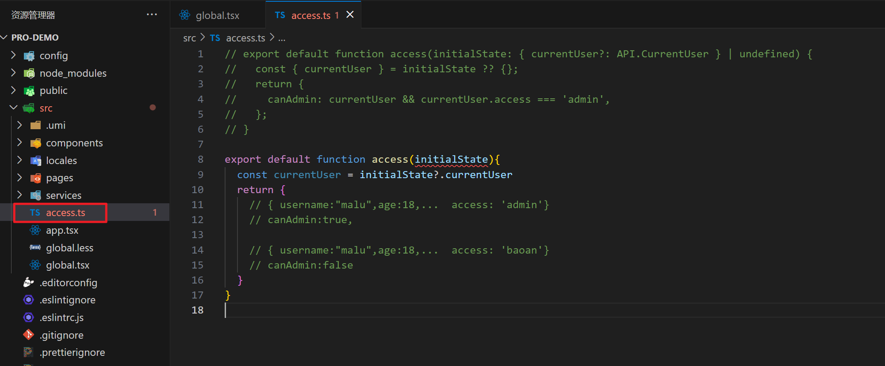

## 一，antd design pro介绍


### 1，相关链接

#### 1）学习antd pro相关的链接

umi Max : https://umijs.org/docs/max/introduce


antdesing pro : https://pro.ant.design/zh-CN/


点击预览：https://preview.pro.ant.design/dashboard/analysis


还可以参考：https://preview.pro.antdv.com/dashboard/workplace


点击开始试用： https://pro.ant.design/zh-CN/docs/overview


ProComponents : https://procomponents.ant.design/


antd : https://ant-design.antgroup.com/docs/react/introduce-cn?from=msidevs.net


#### 2）开源项目相关的链接

作者的github地址：https://github.com/newbee-ltd


APP： https://github.com/newbee-ltd/newbee-mall-vue3-app?tab=readme-ov-file

预览：http://47.99.134.126:5008/#/home


后台：https://github.com/newbee-ltd/vue3-admin

预览：http://vue3-admin.newbee.ltd/#/introduce    admin  123456


### 2，通过umi脚手架创建antd pro项目

创建项目：


启动项目：


使用vscode打开项目：


### 3，通过antd pro脚手架创建项目


安装脚手架：


创建项目：


安装依赖：


运行项目：


## 二，解读 antd pro源码


### 1，webpack配置

对于pro中的配置两块，一块是webpack的配置，一块是运行时配置


先研究webpack的配置：

```ts
import { defineConfig } from '@umijs/max';
import { join } from 'path';
import defaultSettings from './defaultSettings';
import routes from './routes';

const { REACT_APP_ENV = 'dev', NODE_ENV } = process.env;

export default defineConfig({
  //============== 在umi中作的一些配置  ===============
  // 打包后的文件会带个hash,处理浏览器缓存问题
  hash: true,
  // 配置浏览器的兼容性 
  targets: {
    ie: 11,
  },
  // 配置路由表 
  routes,
  // 问号传参时，可以通过query传参
  historyWithQuery: {},
  // 配置网站的标题
  title: 'XXX后台系统',
  // 配置路由模式
  history: {
    type: 'hash'
  },
  // 开发环境生成sourceMap，生成环境不生成sourceMap
  devtool: NODE_ENV === 'development' ? 'eval' : false,
  // 配置图片的打包方式,大于10KB,单独打包成一个图片,如果小于10KB,打包Base64
  inlineLimit: 10000,
  // 配置js的压缩方式
  jsMinifier: 'terser',
  jsMinifierOptions: {},
  // 配置打包后资源的导入路径 默认是/
  publicPath: NODE_ENV === 'development' ? "/" : "/abc/",
  // 配置代理解决跨域
  proxy: {
    '/api': {
      'target': 'http://jsonplaceholder.typicode.com/',
      'changeOrigin': true,
      'pathRewrite': { '^/api': '' },
    }
  },

  //============== 以下都是max的插件配置 ===============
  // {} 表示开始model
  model: {},
  initialState: {},
  layout: {
    locale: true,
    ...defaultSettings,
  },
  moment2dayjs: {
    preset: 'antd',
    plugins: ['duration'],
  },
  locale: {
    // default zh-CN
    default: 'zh-CN',
    antd: true,
    // default true, when it is true, will use `navigator.language` overwrite default
    baseNavigator: true,
  },
  antd: {},
  request: {},
  access: {},
  headScripts: [
    // 解决首次加载时白屏的问题
    { src: '/scripts/loading.js', async: true },
  ],

  //================ pro 插件配置 =================
  presets: ['umi-presets-pro'],
  openAPI: [
    {
      requestLibPath: "import { request } from '@umijs/max'",
      schemaPath: join(__dirname, 'oneapi.json'),
      mock: false,
    },
    {
      requestLibPath: "import { request } from '@umijs/max'",
      schemaPath: 'https://gw.alipayobjects.com/os/antfincdn/CA1dOm%2631B/openapi.json',
      projectName: 'swagger',
    },
  ],
  mfsu: {
    strategy: 'normal',
  },
  esbuildMinifyIIFE: true,
  requestRecord: {},


  //================ 其它配置 =================
  theme: {
    'root-entry-name': 'variable',
  },
  ignoreMomentLocale: true,
  fastRefresh: true,
});
```


defaultSettings.ts  默认的设置：


### 2，请求的二次封装

如果关闭mock，如下：


测试登录：


想把mock关闭，/weblcome就访问不了了。又想要访问后台首页面，操作：


测试之：


默认情况下，请求的二次封装，位置如下：


看一下，它里面封装的内容，我们不使用它的封装，我们自己写。

```ts
export const errorConfig: RequestConfig = {
  // 错误处理： umi@3 的错误处理方案。
  errorConfig: {
    // 错误抛出
    errorThrower: (res) => {
      const { success, data, errorCode, errorMessage, showType } =
        res as unknown as ResponseStructure;
      if (!success) {
        const error: any = new Error(errorMessage);
        error.name = 'BizError';
        error.info = { errorCode, errorMessage, showType, data };
        throw error; // 抛出自制的错误
      }
    },
    // 错误接收及处理
    errorHandler: (error: any, opts: any) => {
      if (opts?.skipErrorHandler) throw error;
      // 我们的 errorThrower 抛出的错误。
      if (error.name === 'BizError') {
        const errorInfo: ResponseStructure | undefined = error.info;
        if (errorInfo) {
          const { errorMessage, errorCode } = errorInfo;
          switch (errorInfo.showType) {
            case ErrorShowType.SILENT:
              // do nothing
              break;
            case ErrorShowType.WARN_MESSAGE:
              message.warning(errorMessage);
              break;
            case ErrorShowType.ERROR_MESSAGE:
              message.error(errorMessage);
              break;
            case ErrorShowType.NOTIFICATION:
              notification.open({
                description: errorMessage,
                message: errorCode,
              });
              break;
            case ErrorShowType.REDIRECT:
              // TODO: redirect
              break;
            default:
              message.error(errorMessage);
          }
        }
      } else if (error.response) {
        // Axios 的错误
        // 请求成功发出且服务器也响应了状态码，但状态代码超出了 2xx 的范围
        message.error(`Response status:${error.response.status}`);
      } else if (error.request) {
        // 请求已经成功发起，但没有收到响应
        // \`error.request\` 在浏览器中是 XMLHttpRequest 的实例，
        // 而在node.js中是 http.ClientRequest 的实例
        message.error('None response! Please retry.');
      } else {
        // 发送请求时出了点问题
        message.error('Request error, please retry.');
      }
    },
  },

  // 请求拦截器
  requestInterceptors: [
    (config: RequestOptions) => {
      // 拦截请求配置，进行个性化处理。
      const url = config?.url?.concat('?token = 123');
      return { ...config, url };
    },
  ],

  // 响应拦截器
  responseInterceptors: [
    (response) => {
      // 拦截响应数据，进行个性化处理
      const { data } = response as unknown as ResponseStructure;

      if (data?.success === false) {
        message.error('请求失败！');
      }
      return response;
    },
  ],
};
```


在app.tsx中使用到了上面的二次封装，如下：


直接在app.tsx中封装：


```tsx
export const request = {
  timeout:60000, // 超时处理，请求超过1分钟，就取消请求
  // 错误统一处理
  errorConfig:{
    // 错误接收及处理
    errorHandler(){
      message.error("网络繁忙，请稍后再试~")
    }
  },
  // 请求拦截器
  requestInterceptors:[
    (config) => {
      // 在请求拦截器中带个token(除了登录接口)
      const token = "xxx"
      if(token && config.url !== "/api/adminUser/login"){
        config.headers['token'] = token;
      }
      return config;
    },
  ],
  // 响应拦截器
  responseInterceptors:[
    // 不对响应的数据作数据
     (response) => {
        return response;
     }
  ]
};
```


可以把它的二次封装删除了：


### 3，分析运行时配置


运行时配置都在app.tsx中，如下：

```tsx
import { Footer, Question, SelectLang, AvatarDropdown, AvatarName } from '@/components';
import { LinkOutlined } from '@ant-design/icons';
import type { Settings as LayoutSettings } from '@ant-design/pro-components';
import { SettingDrawer } from '@ant-design/pro-components';
import type { RunTimeLayoutConfig } from '@umijs/max';
import { message, notification } from 'antd';
import { history, Link } from '@umijs/max';
import defaultSettings from '../config/defaultSettings';
import { currentUser as queryCurrentUser } from '@/services/ant-design-pro/api';
import React from 'react';
const isDev = process.env.NODE_ENV === 'development';
const loginPath = '/user/login';

// getInitialState 获取初始化状态
// 调用完getInitialState 得到一个对象
//   不是登录页面的路由:  { fetchUserInfo currentUser settings: defaultSettings, }
//   是登录页面的路由:  { fetchUserInfo settings: defaultSettings, }
// getInitialState这个方法,只有页面加载时(第一次访问)才会执行, 
// 如果你跳转的不是登录页面,就去调接口获取登录者的用户信息,存放到了initialState.currentUser
// 如果访问的是登录页,得到  { fetchUserInfo   settings: defaultSettings, }
export async function getInitialState() {
  console.log("66666666666666666666666666666666")
  // fetchUserInfo
  const fetchUserInfo = async () => {
    // 调用接口去获取用户信息（现在的接口是mock出来的，已经把mock关闭了）
    // try {
    //   const msg = await queryCurrentUser({
    //     skipErrorHandler: true,
    //   });
    //   return msg.data;  // msg.data 就是表示用户信息  {username:"malu",age:18,avatar:"xxxx",address:"xxx"}
    // } catch (error) {
    //   history.push(loginPath);
    // }
    // return undefined;
    return {
      username:"malu",age:18,avatar:"xxxx"
    }
  };
  // 如果不是登录页面，执行
  const { location } = history;
  // 访问的路径是 /welcome  /goods  /list   如果不是登录页面
  if (location.pathname !== loginPath) {
    // currentUser 用户信息  {username:"malu",age:18,avatar:"xxxx"}
    const currentUser = await fetchUserInfo();  // 调接口获取用户信息
    return {
      fetchUserInfo,  // 方法 
      currentUser,   //  {username:"malu",age:18,avatar:"xxxx"}
      settings: defaultSettings, 
    };
  }
  // 访问的是登录页面
  return {
    fetchUserInfo,
    settings: defaultSettings,
  };
}


// layout 
export const layout = ({ initialState, setInitialState }) => {
  return {
    // render是渲染的意思  Question问题的意思  SelectLang选择语言（国际化）
    // actionsRender 渲染的是顶部header 右边那一块的内容  先不要去看 Question 和 SelectLang
    actionsRender: () => [<Question key="doc" />, <SelectLang key="SelectLang" />],
    // avatar 头像的意思
    // initialState?.currentUser?.avatar  当前登录者的头像
    // <AvatarName /> 名字组件
    // AvatarDropdown  下拉菜单
    avatarProps: {
      src: initialState?.currentUser?.avatar,
      title: <AvatarName />,
      render: (_, avatarChildren) => {
        return <AvatarDropdown>{avatarChildren}</AvatarDropdown>;
      },
    },
    // 水印 把当前登录者的名字当成水印
    waterMarkProps: {
      content: initialState?.currentUser?.name,
    },
    // 渲染底部
    footerRender: () => <Footer />,
    // 路由变化时调用 onPageChange
    onPageChange: () => {
      const { location } = history;
      // 如果没有登录，重定向到 login
      // initialState 是初始化状态  currentUser是当前登录的用户信息
      // 当登录成功后，把当前登录者的用户信息存储到了initialState
      //  currentUser: {username:"malu",age:18,avatar:"xxxx",address:"xxx"}
      // 点击登录，调用了两个接口
      //     1）登录接口  
      //     2）获取用户信息  currentUser
      // const loginPath = '/user/login';
      // initialState里面没有用户信息 并且 你访问的不是/user/login(/welcome)
      if (!initialState?.currentUser && location.pathname !== loginPath) {
        // 跳转到 '/user/login'
        // history.push(loginPath);
      }
    },
    // 整个layout组件的背景图片
    bgLayoutImgList: [
      {
        src: 'https://mdn.alipayobjects.com/yuyan_qk0oxh/afts/img/D2LWSqNny4sAAAAAAAAAAAAAFl94AQBr',
        left: 85,
        bottom: 100,
        height: '303px',
      },
      {
        src: 'https://mdn.alipayobjects.com/yuyan_qk0oxh/afts/img/C2TWRpJpiC0AAAAAAAAAAAAAFl94AQBr',
        bottom: -68,
        right: -45,
        height: '303px',
      },
      {
        src: 'https://mdn.alipayobjects.com/yuyan_qk0oxh/afts/img/F6vSTbj8KpYAAAAAAAAAAAAAFl94AQBr',
        bottom: 0,
        left: 0,
        width: '331px',
      },
    ],
    // 如果是开发模式,就会在左下角显示一个连接
    links: isDev
      ? [
          <Link key="openapi" to="/umi/plugin/openapi" target="_blank">
            <LinkOutlined />
            <span>OpenAPI 文档</span>
          </Link>,
        ]
      : [],
    // 
    menuHeaderRender: undefined,
    // 自定义 403 页面
    // unAccessible   Accessible有权限的     unAccessible没有权限 
    // unAccessible: <div>unAccessible</div>,
    // 增加一个 loading 的状态   Drawer是抽屉的意思  SettingDrawer
    childrenRender: (children) => {
      // if (initialState?.loading) return <PageLoading />;
      return (
        <>
          {children}
          {isDev && (
            <SettingDrawer
              disableUrlParams
              enableDarkTheme
              settings={initialState?.settings}
              onSettingChange={(settings) => {
                setInitialState((preInitialState) => ({
                  ...preInitialState,
                  settings,
                }));
              }}
            />
          )}
        </>
      );
    },
    ...initialState?.settings,
  };
};


export const request = {
  timeout:60000, // 超时处理，请求超过1分钟，就取消请求
  // 错误统一处理
  errorConfig:{
    // 错误接收及处理
    errorHandler(){
      message.error("网络繁忙，请稍后再试~")
    }
  },
  // 请求拦截器
  requestInterceptors:[
    (config) => {
      // 在请求拦截器中带个token(除了登录接口)
      const token = "xxx"
      if(token && config.url !== "/api/adminUser/login"){
        config.headers['token'] = token;
      }
      return config;
    },
  ],
  // 响应拦截器
  responseInterceptors:[
    // 不对响应的数据作数据
     (response) => {
        return response;
     }
  ]
};
```


### 4，分析compoents中的组件

再删除一些内容：


分析access.ts，如下：



```ts
// export default function access(initialState: { currentUser?: API.CurrentUser } | undefined) {
//   const { currentUser } = initialState ?? {};
//   return {
//     canAdmin: currentUser && currentUser.access === 'admin',
//   };
// }

export default function access(initialState){
  const currentUser = initialState?.currentUser
  return {
    // { username:"malu",age:18,...  access: 'admin'}
    // canAdmin:true, 

    // { username:"malu",age:18,...  access: 'baoan'}
    // canAdmin:false
  }
}
```


components中封装了一些通用级别的组件：


components里面的组件，大家自行研究一下。


## 三，配置路由


### 1，分析路由

基于下面的模板进行配置：


把源码中的组件备份一下：


分析：


规划路由：

```
Dashboard   /dashboard
    /dashboard ===>  /dashboard/sysinfo
    系统介绍   /dashboard/sysinfo
    Dashboard   /dashboard/dashboard
    添加商品   /dashboard/addgoods
首页配置   /home
    /home ===>  /home/banner
    轮播图配置   /home/banner
    热销商品配置   /home/hotsale
    新品上线配置   /home/new
    为你推荐配置   /home/recommend
模块管理   /module
    /module ===>  /module/classify
    分类管理   /module/classify
    商品管理   /module/goods
    会员管理   /module/member
    订单管理   /module/order
系统管理   /sys
    /sys ===>  /sys/changepwd
    修改密码   /sys/changepwd
```


规划组件：

```
dashboard 
     SysInfo.jsx
     Dashboard.jsx
     AddGoods.jsx
home 
     Banner.jsx
     HotSale.jsx
     New.jsx
     Recommend.jsx
module 
     Classify.jsx
     Goods.jsx
     Member.jsx
     Order.jsx
sys
	 ChangePwd.jsx
```


组件的样子：

```jsx
import React from 'react';
import { PageContainer } from '@ant-design/pro-components';

const HotSale = () => {
  return (
    <PageContainer>
      <div>
        热销商品
      </div>
    </PageContainer>
  );
};

export default HotSale;
```


到此项目中的组件就创建完毕了：


### 2，配置路由


要使用图标，还需要安装图标：

```
pnpm install @ant-design/icons --save
```


就是配置路由表：


```ts
export default [
  {
    path: '/',
    redirect: '/dashboard/sysinfo'
  },
  {
    path: '/dashboard',
    name: 'Dashboard',
    icon: 'BorderOuter',
    routes: [
      {
        path: '/dashboard',
        redirect: '/dashboard/sysinfo'
      },
      {
        path: '/dashboard/sysinfo',
        name: '系统介绍',
        icon: '',
        component: './dashboard/SysInfo'
      },
      {
        path: '/dashboard/dashboard',
        name: 'Dashboard',
        icon: '',
        component: './dashboard/Dashboard'
      },
      {
        path: '/dashboard/addgoods',
        name: '添加商品',
        icon: '',
        component: './dashboard/AddGoods'
      }
    ]
  }, {
    path: '/home',
    name: '首页配置',
    icon: 'home',
    routes: [
      {
        path: '/home',
        redirect: '/home/banner'
      },
      {
        path: '/home/banner',
        name: '轮播图配置',
        icon: '',
        component: './home/Banner'
      },
      {
        path: '/home/hotsale',
        name: '热销商品配置',
        icon: '',
        component: './home/HotSale'
      },
      {
        path: '/home/new',
        name: '新品上线配置',
        icon: '',
        component: './home/New'
      },
      {
        path: '/home/recommend',
        name: '为你推荐配置',
        icon: '',
        component: './home/Recommend'
      }
    ]
  }, {
    path: '/module',
    name: '模块管理',
    icon: 'AppstoreAdd',
    routes: [
      {
        path: '/module',
        redirect: '/module/classify'
      },
      {
        path: '/module/classify',
        name: '分类管理',
        icon: '',
        component: './module/Classify'
      },
      {
        path: '/module/goods',
        name: '商品管理',
        icon: '',
        component: './module/Goods'
      },
      {
        path: '/module/member',
        name: '会员管理',
        icon: '',
        component: './module/Member'
      },
      {
        path: '/module/order',
        name: '订单管理',
        icon: '',
        component: './module/Order'
      }
    ]
  }, {
    path: '/sys',
    name: '系统管理',
    icon: 'setting',
    routes: [
      {
        path: '/sys',
        redirect: '/sys/changepwd'
      },
      {
        path: '/sys/changepwd',
        name: '修改密码',
        icon: '',
        component: './sys/ChangePwd'
      }
    ]
  },
  {
    path: '/login',
    layout: false,
    component: 'Login',
  },
  {
    path: '*',
    layout: false,
    component: './404',
  },
];
```


效果如下：


## 四，登录模块


### 1，绘制登录组件


基于proComponent中的登录表单组件进行绘制的，如下：

```jsx
import {
  LockOutlined,
  MobileOutlined,
  UserOutlined,
} from '@ant-design/icons';
import {
  LoginForm,
  ProConfigProvider,
  ProFormCaptcha,
  ProFormCheckbox,
  ProFormText,
} from '@ant-design/pro-components';
import { Helmet } from "@umijs/max"
import { Tabs, message } from 'antd';
import Footer from "@/components/Footer/index"

import { useState } from 'react';

export default () => {
  const [loginType, setLoginType] = useState('account');

  return (
    <>
      <Helmet>
        <title>用户登录-XXX中后台系统</title>
      </Helmet>
      <ProConfigProvider hashed={false}>
        <div style={{ backgroundColor: '#fff' }}>
          <LoginForm
            logo="https://gw.alipayobjects.com/zos/antfincdn/upvrAjAPQX/Logo_Tech%252520UI.svg"
            title="XXXX中后台系统"
            subTitle="全球最大的代码托管平台"
            initialValues={{
              autoLogin: true,
              username: "",
              password: "",
            }}
          >
            <Tabs
              centered
              activeKey={loginType}
              onChange={(activeKey) => setLoginType(activeKey)}
            >
              <Tabs.TabPane key={'account'} tab={'账号密码登录'} />
              <Tabs.TabPane key={'phone'} tab={'手机号登录'} />
            </Tabs>
            {loginType === 'account' && (
              <>
                <ProFormText
                  name="username"
                  fieldProps={{
                    size: 'large',
                    prefix: <UserOutlined className={'prefixIcon'} />,
                  }}
                  placeholder={'请输入用户名~'}
                  rules={[
                    {
                      required: true,
                      message: '账号不能为空~!',
                    },
                  ]}
                />
                <ProFormText.Password
                  name="password"
                  fieldProps={{
                    size: 'large',
                    prefix: <LockOutlined className={'prefixIcon'} />,
                    strengthText: '密码至少6位~',
                  }}
                  placeholder={'请输入密码~'}
                  rules={[
                    {
                      required: true,
                      message: '请输入密码！',
                    },
                  ]}
                />
              </>
            )}
            {loginType === 'phone' && (
              <>
                <ProFormText
                  fieldProps={{
                    size: 'large',
                    prefix: <MobileOutlined className={'prefixIcon'} />,
                  }}
                  name="mobile"
                  placeholder={'手机号'}
                  rules={[
                    {
                      required: true,
                      message: '请输入手机号！',
                    },
                    {
                      pattern: /^1\d{10}$/,
                      message: '手机号格式错误！',
                    },
                  ]}
                />
                <ProFormCaptcha
                  fieldProps={{
                    size: 'large',
                    prefix: <LockOutlined className={'prefixIcon'} />,
                  }}
                  captchaProps={{
                    size: 'large',
                  }}
                  placeholder={'请输入验证码'}
                  captchaTextRender={(timing, count) => {
                    if (timing) {
                      return `${count} ${'获取验证码'}`;
                    }
                    return '获取验证码';
                  }}
                  name="captcha"
                  rules={[
                    {
                      required: true,
                      message: '请输入验证码！',
                    },
                  ]}
                  onGetCaptcha={async () => {
                    message.success('获取验证码成功！验证码为：1234');
                  }}
                />
              </>
            )}
            <div
              style={{
                marginBlockEnd: 24,
              }}
            >
              <ProFormCheckbox noStyle name="autoLogin">
                自动登录
              </ProFormCheckbox>
              <a
                style={{
                  float: 'right',
                }}
              >
                忘记密码
              </a>
            </div>
          </LoginForm>
        </div>
      </ProConfigProvider>
      <Footer/>
    </>
  );
};
```


### 2，React中修改状态是异步的

写一个类组件，如下：


```jsx
import React, { useState } from 'react';
import { PageContainer } from '@ant-design/pro-components';

class ChangePwd extends React.Component {
  constructor(props) {
    super(props)
    this.state = {
      num: 100
    }
  }
  sub(){
    // React18版本中 setState是异步的
    // 在React18之前，还需要分情况讨论
    console.log("start....")
    this.setState({
      num:10
    },()=>{
      console.log("setState....")
    })
    console.log("end....")
  }
  render() {
    let { num } = this.state;
    return (
      <PageContainer>
        <div>
          <h1>{num}</h1>
          <button onClick={this.sub.bind(this)}>减</button>
        </div>
      </PageContainer>
    );
  }
}
```


可以把异步的修改同步的，如下：


上面是对于类组件来说的，函数式组件也是一样的：


```jsx
import React,{useState} from 'react';
import { PageContainer } from '@ant-design/pro-components';

const ChangePwd = () => {
  const [num, setNum] = useState(1)
  return (
    <PageContainer>
      <div>
        <h1>{num}</h1>
        <button onClick={()=>{
          setNum(num+1)
        }}>按钮</button>
        修改密码
      </div>
    </PageContainer>
  );
};

export default ChangePwd;
```


### 3，umi max中数据流


参考地址：https://umijs.org/docs/max/data-flow


创建一个model，放在models目录下面的model会自动注册，不需要我们注册，如下：


```ts
import { useState, useCallback, useEffect } from 'react';

export default function countModel(){
    // setCounter修改状态是异步的
    const [counter, setCounter] = useState(0);

    const increment = useCallback(() => setCounter((c) => c + 1), []);
    const decrement = useCallback(() => setCounter((c) => c - 1), []);

    const incrementAsync = ()=>{
        setTimeout(()=>{
            setCounter(counter+1)
        },1000)
    }

    useEffect(()=>{
        setTimeout(()=>{
            setCounter(100)
        },2000)
    },[])

    return {
        counter,
        increment, 
        decrement,
        setCounter,
        incrementAsync
    }
}
```


使用model，如下：


```jsx
import React from 'react';
import { flushSync } from "react-dom"
import {useModel} from "@umijs/max"
import { PageContainer } from '@ant-design/pro-components';

const ChangePwd = function () {

  let {counter,increment,decrement,setCounter,incrementAsync} = useModel('countModel')

  return (
    <PageContainer>
      <h1>{counter}</h1>

      <button onClick={()=>{
        increment()
      }}>+1</button>

      <button onClick={()=>{
        incrementAsync()
      }}>异步+1</button>

      <button onClick={()=>{
        decrement()
      }}>-1</button>

      <button onClick={()=>{
        flushSync(setCounter(counter+100))
        console.log("xxxx")
      }}>+100</button>

      <div>
        修改密码
      </div>
    </PageContainer>
  );
};

export default ChangePwd;
```


效果：


### 4，实现登录


前面对请求已经做了两次封装，如下：


分析人家的登录接口：


紧接着，它又调用一个接口，用来获取用户信息，如下：


对umimax中request进行二次封装，如下：


```ts
import { request } from "@umijs/max"

['GET','HEAD','DELETE','OPTIONS'].forEach(name=>{
    request[name.toLowerCase()] = function(url, options){
        if(!options) options = {}
        options.method = name;
        return request(url, options)
    }
});

['POST','PUT','PATCH'].forEach(name=>{
    request[name.toLowerCase()] = function(url, data, options){
        if(!options) options = {}
        options.method = name;
        options.data = data;
        return request(url, options)
    }
})

export default request;
```


通过上的分析，要封装api了，如下：


```ts
import request from "./request"


// 用户登录  axios.get()  axios.post()
const adminUserLogin = (userName,passwordMd5)=>{
    return request.post('/api/adminUser/login',{
        userName,
        passwordMd5
    })
}
// const adminUserLogin = (userName,passwordMd5)=>{
//     return request('/api/adminUser/login',{
//         method:'POST',
//         // 以json的形式传递数据
//         data:{
//             userName,
//             passwordMd5
//         }
//     })
// }

// 获取用户信息
const adminUserProfile = ()=>{
    return request.get('/api/adminUser/profile')
}

export default {
    adminUserLogin,
    adminUserProfile
}
```


在登录组件中给表单绑定onFished事件：


要对密码进行加密，需要安装模块：

```
pnpm i blueimp-md5
```


实现submit方法：

```ts
const submit = async (values)=>{
    // console.log("values:",values)
    let {autoLogin, username,password} = values;
    password = md5(password);
    try{
      let {resultCode,data,message} = await API.adminUserLogin(username,password)
      if(+resultCode !== 200){
        message.error(message);
        return;
      }
      // 登录成功 第一步：要存储token
      // 后面再去调用其它接口，需要从localStorage中获取token，放到请求头中
      localStorage.setItem("tk",data);

      // 第二步：带个token去获取用户信息
      //   分析得到的用户信息是这样的：{ adminUserId, loginUserName, loginPassword, nickName, locked }
      // 刚讲过 umimax中的数据流，创建一个countModel, 除了countModel，默认还有一个model，叫@@initialState
      //   从 @@initialState 中可以得到initialState
      //   const { initialState, setInitialState } = useModel('@@initialState');
      //   从 initialState 中得到的 currentUser   框架源码中  currentUser中有 {name, avatar}
      // 分析得到结论：调用API.adminUserProfile()这个接口，得到的数据中没有 name, avatar
      // 你需要对人家返回的数据结构做处理，去API封装中处理
      let profile = await API.adminUserProfile()
      console.log("--profile:",profile)

    }catch(_){

    }
  }
```


在请求拦截器中还带上了token：


默认情况下，获取用户信息时，少了一人name和avatar，在API封装时，带需要对返回的数据做处理：


```ts
// 获取用户信息
const adminUserProfile = ()=>{
    return request.get('/api/adminUser/profile').then(({resultCode,data})=>{
       if(data){
        data = {
            ...data,
            name:data.nickName, 
            avatar:'https://image.baidu.com/search/detail?ct=503316480&z=0&ipn=false&word=%E5%A4%B4%E5%83%8F&step_word=&hs=0&pn=16&spn=0&di=46137345&pi=0&rn=1&tn=baiduimagedetail&is=0%2C0&istype=0&ie=utf-8&oe=utf-8&in=&cl=2&lm=-1&st=undefined&cs=2866669652%2C1195979743&os=2242996098%2C262718363&simid=2866669652%2C1195979743&adpicid=0&lpn=0&ln=1703&fr=&fmq=1712721206058_R&fm=&ic=undefined&s=undefined&hd=undefined&latest=undefined&copyright=undefined&se=&sme=&tab=0&width=undefined&height=undefined&face=undefined&ist=&jit=&cg=head&bdtype=11&oriquery=&objurl=https%3A%2F%2Fk.sinaimg.cn%2Fn%2Fsinakd20116%2F600%2Fw700h700%2F20240214%2F0abc-9ebe2e087a93caf92004c16169f45469.jpg%2Fw700d1q75cms.jpg&fromurl=ippr_z2C%24qAzdH3FAzdH3Fh_z%26e3Bftgw_z%26e3BvgAzdH3Fw6ptvsj_d0l9nbnam8_rwmbjjm1cad0a8jyur_z%26e3Bip4s&gsm=1e&rpstart=0&rpnum=0&islist=&querylist=&nojc=undefined&dyTabStr=MCwzLDEsMiw1LDgsNyw2LDQsOQ%3D%3D&lid=8345194771476894283'
        }
       }
       return {resultCode, data}
    })
}
```


submit还没有写完，后面还有一些其它逻辑，下午讲。


