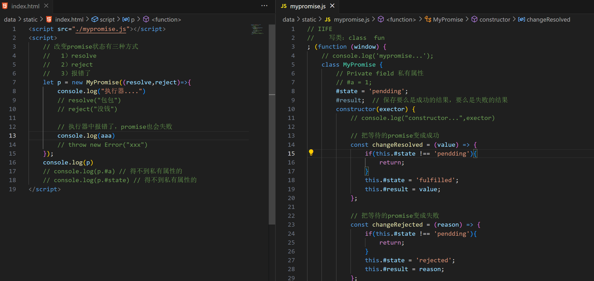
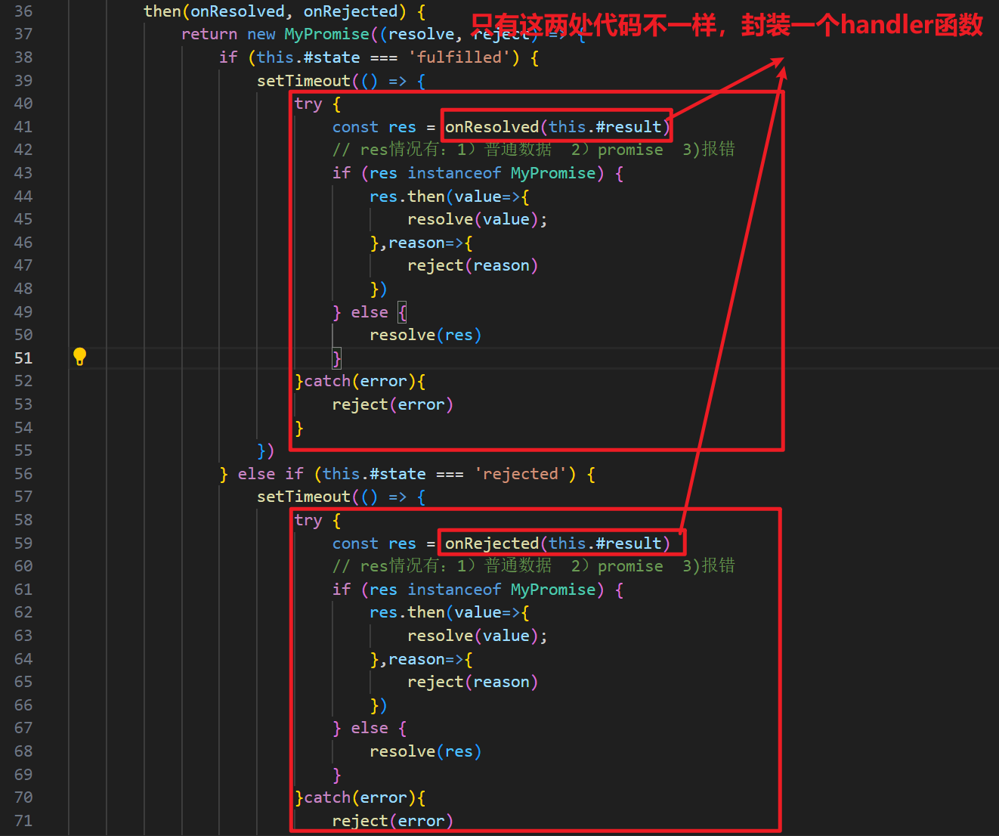
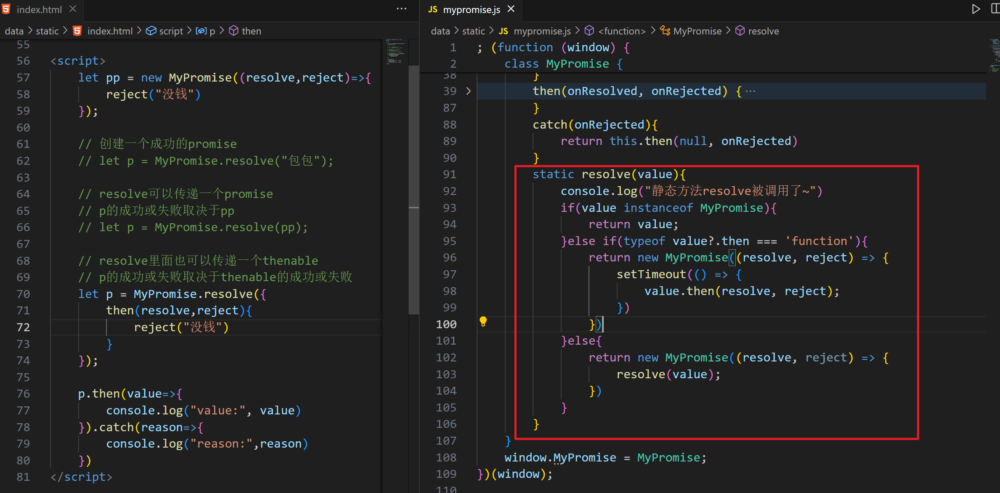
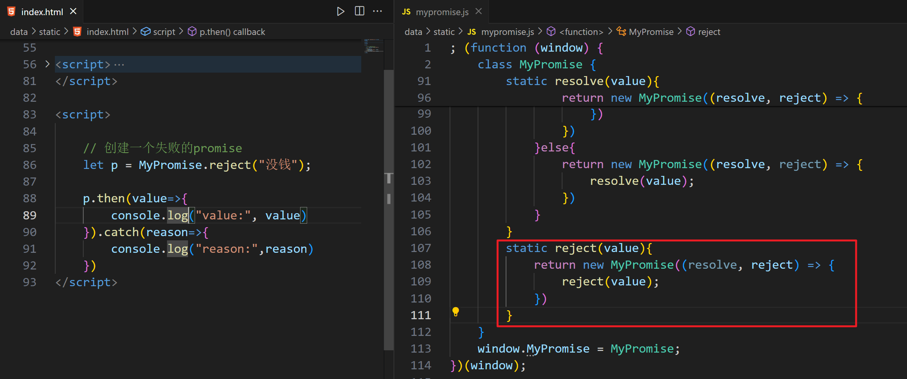
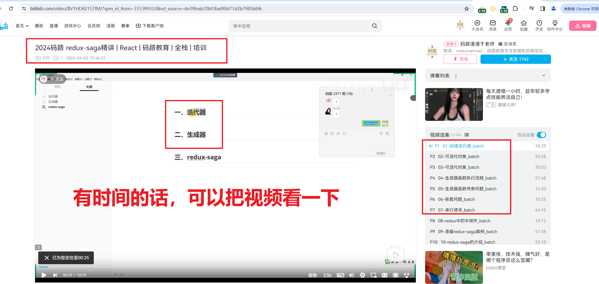

##  一，手写Promise


### 1，实现constructor

new Promise可以创建一个Promise对象，这个对象身上有很多方法（实例方法）：

- then
- catch
- finally


Promise本身也有一些方法，类方法(静态方法)：

- Promise.resolve
- Promise.reject
- Promise.all
- Promise.allSetteld
- Promise.race
- Promise.any


开始实现promise，如下：



```html
<script src="./mypromise.js"></script>
<script>
    // 改变promise状态有三种方式
    //   1）resolve  
    //   2）reject
    //   3）报错了
    let p = new MyPromise((resolve,reject)=>{
        console.log("执行器....")
        // resolve("包包")
        // reject("没钱")

        // 执行器中报错了，promise也会失败
        console.log(aaa)
        // throw new Error("xxx")
    });
    console.log(p)
    // console.log(p.#a) // 得不到私有属性的
    // console.log(p.#state) // 得不到私有属性的
</script>
```

```js
// IIFE
//    写类：class  fun
; (function (window) {
    // console.log('mypromise...');
    class MyPromise {
        // Private field 私有属性
        // #a = 1;
        #state = 'pendding';
        #result;  // 保存要么是成功的结果，要么是失败的结果
        constructor(exector) {
            // console.log("constructor...",exector)

            // 把等待的promise变成成功
            const changeResolved = (value) => {
                if(this.#state !== 'pendding'){
                    return;
                }
                this.#state = 'fulfilled';
                this.#result = value;
            };

            // 把等待的promise变成失败
            const changeRejected = (reason) => {
                if(this.#state !== 'pendding'){
                    return;
                }
                this.#state = 'rejected';
                this.#result = reason;
            };

            try{
                exector(changeResolved,changeRejected);
            }catch(error){
                // this.#state = 'rejected';
                // this.#result = error;
                changeRejected(error);
            }
        }
    }
    window.MyPromise = MyPromise;
})(window);
```


### 2，then方法传入回调函数

需要等到promise的状态发生变化了，再去调用then中两个回调函数中的其中一个。

```html
<script src="./mypromise.js"></script>
<script>
    let p = new MyPromise((resolve,reject)=>{
        console.log("执行器....")
        // resolve("包包")
        // reject("没钱")

        // 执行器中报错了，promise也会失败
        // console.log(aaa)
        // throw new Error("xxx")

        setTimeout(()=>{
            // resolve("包包")
            reject("没钱")
        },1000)
    });
    // console.log(p)

    // then方法中传递了两个函数
    p.then(value=>{
        console.log("value:",value)
    }, reason=>{
        console.log("reason:",reason)
    });

</script>
```

```js
; (function (window) {
    class MyPromise {
        #state = 'pendding';
        #result;  
        #callbackObj = {};

        constructor(exector) {
            const changeResolved = (value) => {
                if(this.#state !== 'pendding'){
                    return;
                }
                this.#state = 'fulfilled';
                this.#result = value;
                // if(this.#callbackObj.onResolved){
                //     this.#callbackObj.onResolved?.(value)
                // }
                // 等到状态发生变化了,再去调用then中的回调函数
                this.#callbackObj.onResolved?.(value)
            };

            const changeRejected = (reason) => {
                if(this.#state !== 'pendding'){
                    return;
                }
                this.#state = 'rejected';
                this.#result = reason;
                this.#callbackObj.onRejected?.(reason)
            };

            try{
                exector(changeResolved,changeRejected);
            }catch(error){
                changeRejected(error);
            }
        }
        then(onResolved, onRejected){
            if (this.#state === 'fulfilled') {
                onResolved(this.#result)
            }else if (this.#state === 'rejected') { 
                onRejected(this.#result)
            }else{
               this.#callbackObj = {
                onResolved,
                onRejected
               }
            }
        }
    }
    window.MyPromise = MyPromise;
})(window);
```


### 3，存储多个then中的回调

看如下代码：

```html
<script src="./mypromise.js"></script>
<script>
    let p = new MyPromise((resolve,reject)=>{
        console.log("执行器....")
        // resolve("包包")
        // reject("没钱")

        // 执行器中报错了，promise也会失败
        // console.log(aaa)
        // throw new Error("xxx")

        setTimeout(()=>{
            resolve("包包")
            // reject("没钱")
        },1000)
    });
    // console.log(p)

    // then方法中传递了两个函数
    p.then(value=>{
        console.log("value1:",value)
    }, reason=>{
        console.log("reason1:",reason)
    });
    p.then(value=>{
        console.log("value2:",value)
    }, reason=>{
        console.log("reason2:",reason)
    });
    p.then(value=>{
        console.log("value3:",value)
    }, reason=>{
        console.log("reason3:",reason)
    });

</script>
```


p.then了多次，把每一次中的回调都要存储起来。当状态发生变化时，需要把每一个回调函数取出来执行，如下：

```js
; (function (window) {
    class MyPromise {
        #state = 'pendding';
        #result;  
        #callbackList = [];

        constructor(exector) {
            const changeResolved = (value) => {
                if(this.#state !== 'pendding'){
                    return;
                }
                this.#state = 'fulfilled';
                this.#result = value;
                // if(this.#callbackObj.onResolved){
                //     this.#callbackObj.onResolved?.(value)
                // }
                // 等到状态发生变化了,再去调用then中的回调函数
                // this.#callbackObj.onResolved?.(value)
                this.#callbackList.forEach(callback => {
                    callback.onResolved(value);
                });
            };

            const changeRejected = (reason) => {
                if(this.#state !== 'pendding'){
                    return;
                }
                this.#state = 'rejected';
                this.#result = reason;
                // this.#callbackObj.onRejected?.(reason)
                this.#callbackList.forEach(callback => {
                    callback.onRejected(reason);
                });
            };

            try{
                exector(changeResolved,changeRejected);
            }catch(error){
                changeRejected(error);
            }
        }
        then(onResolved, onRejected){
            if (this.#state === 'fulfilled') {
                onResolved(this.#result)
            }else if (this.#state === 'rejected') { 
                onRejected(this.#result)
            }else{
               this.#callbackList.push({
                    onResolved,
                    onRejected
               })
            }
        }
    }
    window.MyPromise = MyPromise;
})(window);
```


还有一个小问题，如下：

```html
<script src="./mypromise.js"></script>
<script>
    let p = new MyPromise((resolve,reject)=>{
        resolve("包包")
        // reject("没钱")

        // 执行器中报错了，promise也会失败
        // console.log(aaa)
        // throw new Error("xxx")

        // setTimeout(()=>{
        //     resolve("包包")
        //     // reject("没钱")
        // },1000)
    });
    // console.log(p)

    // then方法中传递了两个函数
    // 同步代码和异步代码:
    //    异步代码:
    //       1)定时器中的回调
    //       2)发ajax请求
    //       3)then中的回调函数
    p.then(value=>{
        console.log("value1:",value)
    }, reason=>{
        console.log("reason1:",reason)
    });

    // 代码执行时是,先执行同步代码,再执行异步代码
    console.log("malu")

</script>
```


说白了，then中的两个回调函数是异步代码。完善MyPromise，如下：

```js
; (function (window) {
    class MyPromise {
        #state = 'pendding';
        #result;  
        #callbackList = [];

        constructor(exector) {
            const changeResolved = (value) => {
                if(this.#state !== 'pendding'){
                    return;
                }
                this.#state = 'fulfilled';
                this.#result = value;
                // if(this.#callbackObj.onResolved){
                //     this.#callbackObj.onResolved?.(value)
                // }
                // 等到状态发生变化了,再去调用then中的回调函数
                // this.#callbackObj.onResolved?.(value)
                this.#callbackList.forEach(callback => {
                    callback.onResolved(value);
                });
            };

            const changeRejected = (reason) => {
                if(this.#state !== 'pendding'){
                    return;
                }
                this.#state = 'rejected';
                this.#result = reason;
                // this.#callbackObj.onRejected?.(reason)
                this.#callbackList.forEach(callback => {
                    callback.onRejected(reason);
                });
            };

            try{
                exector(changeResolved,changeRejected);
            }catch(error){
                changeRejected(error);
            }
        }
        then(onResolved, onRejected){
            if (this.#state === 'fulfilled') {
                setTimeout(()=>{
                    onResolved(this.#result)
                })
            }else if (this.#state === 'rejected') { 
                setTimeout(()=>{
                    onRejected(this.#result)
                })
            }else{
               this.#callbackList.push({
                    onResolved,
                    onRejected
               })
            }
        }
    }
    window.MyPromise = MyPromise;
})(window);
```


### 5，then链


.then的返回值是一个新的promise，也就是说在then方法中，需要返回一个新的promise，直接实现如下：


```html
<script src="./mypromise.js"></script>
<script>
    let p = new MyPromise((resolve,reject)=>{
        resolve("包包")
        // reject("没钱")

        // 执行器中报错了，promise也会失败
        // console.log(aaa)
        // throw new Error("xxx")

        // setTimeout(()=>{
        //     resolve("包包")
        //     // reject("没钱")
        // },1000)
    });

    p.then(value1=>{
        console.log("value1:",value1)
        console.log(xxx)
        // return p1;
    }, reason1=>{
        console.log("reason1:",reason1)
        // return 123;
        // return p1
        // console.log(xxx)
    }).then(value2=>{
        console.log("value2:",value2)
    }, reason2=>{
        console.log("reason2:",reason2)
    });


</script>
```


```js
; (function (window) {
    class MyPromise {
        #state = 'pendding';
        #result;
        #callbackList = [];

        constructor(exector) {
            const changeResolved = (value) => {
                if (this.#state !== 'pendding') {
                    return;
                }
                this.#state = 'fulfilled';
                this.#result = value;
                this.#callbackList.forEach(callback => {
                    callback.onResolved(value);
                });
            };

            const changeRejected = (reason) => {
                if (this.#state !== 'pendding') {
                    return;
                }
                this.#state = 'rejected';
                this.#result = reason;
                this.#callbackList.forEach(callback => {
                    callback.onRejected(reason);
                });
            };

            try {
                exector(changeResolved, changeRejected);
            } catch (error) {
                changeRejected(error);
            }
        }
        then(onResolved, onRejected) {
            return new MyPromise((resolve, reject) => {
                if (this.#state === 'fulfilled') {
                    setTimeout(() => {
                        try {
                            const res = onResolved(this.#result)
                            // res情况有：1）普通数据  2）promise  3)报错
                            if (res instanceof MyPromise) {
                                res.then(value=>{
                                    resolve(value);
                                },reason=>{
                                    reject(reason)
                                })
                            } else {
                                resolve(res)
                            }
                        }catch(error){
                            reject(error)
                        }
                    })
                } else if (this.#state === 'rejected') {
                    setTimeout(() => {
                        try {
                            const res = onRejected(this.#result)
                            // res情况有：1）普通数据  2）promise  3)报错
                            if (res instanceof MyPromise) {
                                res.then(value=>{
                                    resolve(value);
                                },reason=>{
                                    reject(reason)
                                })
                            } else {
                                resolve(res)
                            }
                        }catch(error){
                            reject(error)
                        }

                        
                    })
                } else {
                    this.#callbackList.push({
                        onResolved,
                        onRejected
                    })
                }
            })
        }
    }
    window.MyPromise = MyPromise;
})(window);
```

问题：




封装一个handler函数，如下：

```js
; (function (window) {
    class MyPromise {
        #state = 'pendding';
        #result;
        #callbackList = [];

        constructor(exector) {
            const changeResolved = (value) => {
                if (this.#state !== 'pendding') {
                    return;
                }
                this.#state = 'fulfilled';
                this.#result = value;
                this.#callbackList.forEach(callback => {
                    callback.onResolved(value);
                });
            };

            const changeRejected = (reason) => {
                if (this.#state !== 'pendding') {
                    return;
                }
                this.#state = 'rejected';
                this.#result = reason;
                this.#callbackList.forEach(callback => {
                    callback.onRejected(reason);
                });
            };

            try {
                exector(changeResolved, changeRejected);
            } catch (error) {
                changeRejected(error);
            }
        }
        then(onResolved, onRejected) {
            return new MyPromise((resolve, reject) => {

                const handler = (cb) => {
                    try {
                        const res = cb(this.#result)
                        // res情况有：1）普通数据  2）promise  3)报错
                        if (res instanceof MyPromise) {
                            res.then(value => {
                                resolve(value);
                            }, reason => {
                                reject(reason)
                            })
                        } else {
                            resolve(res)
                        }
                    } catch (error) {
                        reject(error)
                    }
                }

                if (this.#state === 'fulfilled') {
                    setTimeout(() => {
                        handler(onResolved);
                    })
                } else if (this.#state === 'rejected') {
                    setTimeout(() => {
                        handler(onRejected);
                    })
                } else {
                    this.#callbackList.push({
                        onResolved:()=>{
                            handler(onResolved);
                        },
                        onRejected:()=>{
                            handler(onRejected);
                        },
                    })
                }
            })
        }
    }
    window.MyPromise = MyPromise;
})(window);
```


### 6，then方法参数的默认值


看如下的使用：

```html
<script src="./mypromise.js"></script>
<script>
    let p = new MyPromise((resolve,reject)=>{
        // resolve("包包")
        reject("没钱")

        // 执行器中报错了，promise也会失败
        // console.log(aaa)
        // throw new Error("xxx")

        // setTimeout(()=>{
        //     resolve("包包")
        //     // reject("没钱")
        // },1000)
    });

    p.then(value1=>{
        console.log("value1:",value1)
    }).then(null, reason2=>{
        console.log("reason2:",reason2)
    });
</script>
```


实现then的顺延，如下：

```js
; (function (window) {
    class MyPromise {
        #state = 'pendding';
        #result;
        #callbackList = [];

        constructor(exector) {
            const changeResolved = (value) => {
                if (this.#state !== 'pendding') {
                    return;
                }
                this.#state = 'fulfilled';
                this.#result = value;
                this.#callbackList.forEach(callback => {
                    callback.onResolved(value);
                });
            };

            const changeRejected = (reason) => {
                if (this.#state !== 'pendding') {
                    return;
                }
                this.#state = 'rejected';
                this.#result = reason;
                this.#callbackList.forEach(callback => {
                    callback.onRejected(reason);
                });
            };

            try {
                exector(changeResolved, changeRejected);
            } catch (error) {
                changeRejected(error);
            }
        }
        then(onResolved, onRejected) {
            // 实现then的顺延
            if (typeof onResolved !== 'function') {
                onResolved = value=>value;
            }
            if (typeof onRejected !== 'function') {
                onRejected = reason=>{
                    throw reason;
                }
            }
            return new MyPromise((resolve, reject) => {

                const handler = (cb) => {
                    try {
                        const res = cb(this.#result)
                        // res情况有：1）普通数据  2）promise  3)报错
                        if (res instanceof MyPromise) {
                            res.then(value => {
                                resolve(value);
                            }, reason => {
                                reject(reason)
                            })
                        } else {
                            resolve(res)
                        }
                    } catch (error) {
                        reject(error)
                    }
                }

                if (this.#state === 'fulfilled') {
                    setTimeout(() => {
                        handler(onResolved);
                    })
                } else if (this.#state === 'rejected') {
                    setTimeout(() => {
                        handler(onRejected);
                    })
                } else {
                    this.#callbackList.push({
                        onResolved:()=>{
                            handler(onResolved);
                        },
                        onRejected:()=>{
                            handler(onRejected);
                        },
                    })
                }
            })
        }
    }
    window.MyPromise = MyPromise;
})(window);
```


### 7，实现catch

catch本质还是then，实现如下：

```js
; (function (window) {
    class MyPromise {
        #state = 'pendding';
        #result;
        #callbackList = [];

        constructor(exector) {
			// ..... 
        }
        then(onResolved, onRejected) {
            // ..... 
        }
        catch(onRejected){
            return this.then(null, onRejected)
        }
    }
    window.MyPromise = MyPromise;
})(window);
```


使用之：

```html
<script src="./mypromise.js"></script>
<script>
    let p = new MyPromise((resolve,reject)=>{
        // resolve("包包")
        reject("没钱")

        // 执行器中报错了，promise也会失败
        // console.log(aaa)
        // throw new Error("xxx")

        // setTimeout(()=>{
        //     resolve("包包")
        //     // reject("没钱")
        // },1000)
    });

    p.then(value=>{
        console.log("value:",value)
    }).catch(reason=>{
        console.log("reason:",reason)
    });
</script>
```


### 8，复习

```html
<script src="./mypromise.js"></script>
<script>
    let p = new MyPromise((resolve,reject)=>{
        // resolve("包包")
        // reject("没钱")

        // 执行器中报错了，promise也会失败
        // console.log(aaa)
        // throw new Error("xxx")

        setTimeout(()=>{
            resolve("包包")
            // reject("没钱")
        },2000)
    });

    p.then(value=>{
        console.log("value:",value)
        return "ok"
    }).catch(reason=>{
        console.log("reason:",reason)
    })


    // p.then(null,reason1=>{
    //     console.log("reason1:",reason1)
    // }).then(value2=>{
    //     console.log("value2:",value2)
    // })

    // p.then(value1=>{
    //     console.log("value1:",value1)
    //     return "ok"
    // },reason1=>{
    //     console.log("reason1:",reason1)
    // }).then(value2=>{
    //     console.log("value2:",value2)
    // },reason2=>{
    //     console.log("reason2:",reason2)
    // })

    // p.then(value2=>{
    //     console.log("value2:",value2)
    // },reason2=>{
    //     console.log("reason2:",reason2)
    // })


    // p.then(value=>{
    //     console.log("value:",value)
    // }).catch(reason=>{
    //     console.log("reason:",reason)
    // });
</script>
```

```js
; (function (window) {
    class MyPromise {
        #state = 'pendding';
        #result;
        // #callbackObj = {};
        #callbackList = [];

        constructor(exector) {
            const changeResolved = value => {
                if (this.#state !== 'pendding') {
                    return;
                }
                this.#state = 'fulfilled';
                this.#result = value;
                // this.#callbackObj.onResolved?.(value);
                // console.log(this.#callbackList)
                this.#callbackList.forEach(callback => {
                    // console.log("callback",callback)
                    callback.onResolved(value);
                });
            }
            const changeRejected = reason => {
                if (this.#state !== 'pendding') {
                    return;
                }
                this.#state = 'rejected';
                this.#result = reason;
                // this.#callbackObj.onRejected?.(reason);
                this.#callbackList.forEach(callback => {
                    callback.onRejected(reason);
                });
            }
            try {
                exector(changeResolved, changeRejected)
            } catch (error) {
                changeRejected(error)
            }
        }
        then(onResolved, onRejected) {

            if (typeof onResolved !== 'function') {
                onResolved = value => value;
            }
            if (typeof onRejected !== 'function') {
                onRejected = reason => {
                    throw reason;
                }
            }

            return new MyPromise((resolve,reject)=>{

                const handler = (cb)=>{
                    try{
                        const res = cb(this.#result);
                        if(res instanceof MyPromise){
                            res.then(value=>{
                                resolve(value);
                            },reason=>{
                                reject(reason)
                            })
                        }else{
                            resolve(res);
                        }
                    }catch(error){
                        reject(error)
                    }
                }

                if (this.#state === 'fulfilled') {
                    setTimeout(() => {
                        handler(onResolved)
                    });
                } else if (this.#state === 'rejected') {
                    setTimeout(() => {
                        handler(onRejected)
                    })
                } else {
                    // {onResolved:函数1，onRejected:函数2}
                    // [{a:1},{a:2}]
                    // [{onResolved:函数1,onRejected:函数2},{onResolved:函数3,onRejected:函数4}]
                    this.#callbackList.push({
                        onResolved:()=>{handler(onResolved)},
                        onRejected:()=>{handler(onRejected)},
                    })
                }
            })
        }
        catch(onRejected){
            return this.then(null, onRejected)
        }
    }
    window.MyPromise = MyPromise;
})(window);

// 异步代码：
//    1）定时器中的回调
//    2）then中的回调
//    3）ajax发请求
//    4）事件绑定
```


### 8，静态方法resolve


在Promise类身上，有一个resolve方法，使用之，如下：

```html
<script>
    let pp = new Promise((resolve,reject)=>{
        reject("没钱")
    });

    // 创建一个成功的promise
    // let p = Promise.resolve("包包");

    // resolve可以传递一个promise
    // p的成功或失败取决于pp
    // let p = Promise.resolve(pp);

    // resolve里面也可以传递一个thenable
    // p的成功或失败取决于thenable的成功或失败
    let p = Promise.resolve({
        then(resolve,reject){
            reject("没钱")
        }
    });

    p.then(value=>{
        console.log("value:", value)
    }).catch(reason=>{
        console.log("reason:",reason)
    })
</script>
```


开始实现它的原理：




```js
        static resolve(value){
            console.log("静态方法resolve被调用了~")
            if(value instanceof MyPromise){
                return value;
            }else if(typeof value?.then === 'function'){
                return new MyPromise((resolve, reject) => {
                    setTimeout(() => {
                        value.then(resolve, reject);
                    })
                })
            }else{
                return new MyPromise((resolve, reject) => {
                    resolve(value);
                })
            }
        }
```


### 9，静态方法reject

reject表示直接创建一个失败的promise：



```html
        static reject(value){
            return new MyPromise((resolve, reject) => {
                reject(value);
            })
        }
```


### 10，静态方法all

要实现all，大家可以下去看如下的视频：



视频地址：https://www.bilibili.com/video/BV1HD42157fM/?spm_id_from=333.999.0.0&vd_source=de29feab70bf3ba9f8d71d2b7985b84c


```html
<script src="./mypromise.js"></script>

<script>
    const p1 = new Promise((resolve, reject) => {
        setTimeout(() => {
            resolve("p1 resolve")
            // reject("p1 reject")
        }, 3000)
    })

    const p2 = new Promise((resolve, reject) => {
        setTimeout(() => {
            // resolve("p2 resolve")
            reject("p2 reject")
        }, 2000)
    })

    const p3 = new Promise((resolve, reject) => {
        setTimeout(() => {
            resolve("p3 resolve")
            // reject("p3 reject")
        }, 5000)
    })

    // axios.all([p1,p2])
    // all里面传递的是可迭代对象
    //   数组是可迭代对象,字符串也是可迭代对象
    // MyPromise.all(110).then(value => {
    // MyPromise.all("malu").then(value => {
    MyPromise.all([p1,p2,p3]).then(value => {
        console.log("--value:", value)
    }).catch(reason => {
        console.log("--reason", reason)
    })
</script>
```


```js
        static all(items){
            return new MyPromise((resolve,reject)=>{
                // typeof item[Symbol.iterator] === 'function' 
                // 判断传递给all的参数是否是可迭代对象
                if(typeof items[Symbol.iterator] === 'function'){
                    // console.log("items:",items)
                    // 将参数 items 转为数组
                    const itemsArr = Array.from(items);
                    // 定义一人容器保存成功的结果
                    const resArr = Array(itemsArr.length);

                    console.log("itemsArr:",itemsArr); // ['m', 'a', 'l', 'u']
                    // "malu"   ['m','a','l','u']
                    // [p1,p2,p3]  [p1,p2,p3]
                    itemsArr.forEach((item, index) => {
                        const p = MyPromise.resolve(item);  
                        p.then(res=>{
                            resArr[index] = res;
                            // 所有的promise都成功了
                            if ((resArr.filter(()=>true)).length === itemsArr.length) {
                                resolve(resArr);
                            }
                        }).catch(reason=>{
                            reject(reason)
                        })
                    })
                }else{
                    reject('argument must is a iterable');
                }
            })
        }
```


### 11，静态方法rece


````html
<script>
    const p1 = new Promise((resolve, reject) => {
        setTimeout(() => {
            resolve("p1 resolve")
            // reject("p1 reject")
        }, 3000)
    })

    const p2 = new Promise((resolve, reject) => {
        setTimeout(() => {
            // resolve("p2 resolve")
            reject("p2 reject")
        }, 2000)
    })

    const p3 = new Promise((resolve, reject) => {
        setTimeout(() => {
            resolve("p3 resolve")
            // reject("p3 reject")
        }, 5000)
    })

    MyPromise.race([p1,p2,p3]).then(value => {
        console.log("--value:", value)
    }).catch(reason => {
        console.log("--reason", reason)
    })
</script>
````


```js
        static race(items){
            return new MyPromise((resolve,reject)=>{
                if(typeof items[Symbol.iterator] === 'function'){
                    // 只有可迭代对象，才可以使用for of进行遍历
                    for(let item of items){
                        const p = MyPromise.resolve(item);
                        // p.then(value=>{resolve(value)},reason=>{reject(reason)})
                        p.then(resolve,reject)
                    }
                }else{
                    reject('argument must is a iterable');
                }
            })
        }
```


