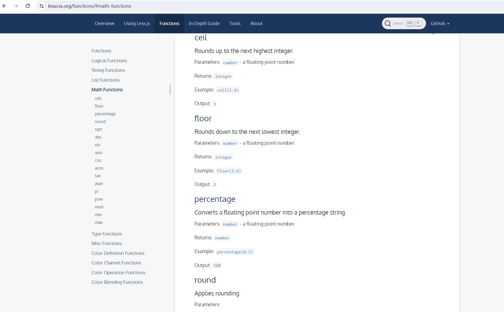
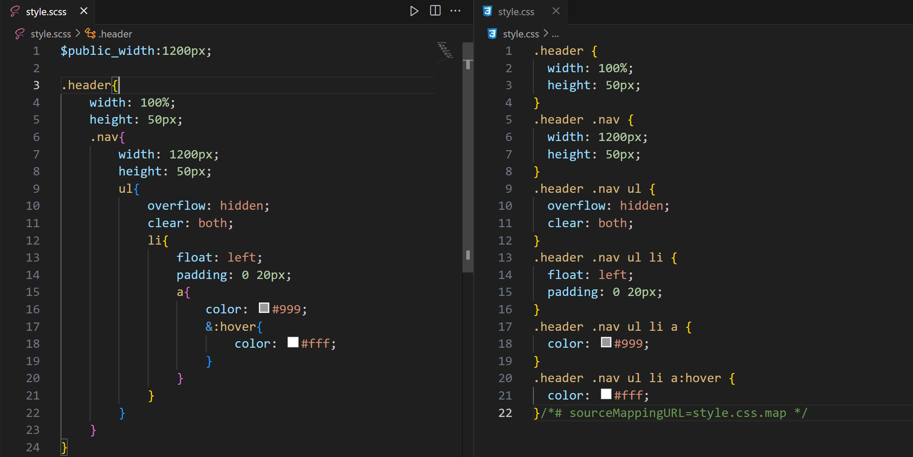

## 一，Less


### 1，什么是Less

​	我们写了这么久的代码，每次写页面都需要配合CSS，CSS里面重复代码其实很多，包含通配颜色值、容器大小等。那我们能否使用JavaScript声明变量的方式解决这些问题呢？原本的CSS当然是不支持的，但是有其他方案，他就是Less！！！


​	Less是一款比较流行的css预处理语言，支持变量、混合、函数、嵌套、循环等特点。它叫CSS预处理，就是CSS的超级，在CSS的基础上，多了更多东西，比CSS更丰满，为CSS增加了一些编程的特性，将CSS作为目标生成文件，然后开发者就只需要使用这种语言进行编码工作。通俗的说CSS预处理器用一种专门的编程语言，进行Web页面样式设计，然后再编译成正常的CSS文件，以供项目使用。


注意：

- 浏览器不认识Less，写的Less代码，需要编译成css让浏览器识别。
- 在项目，通常我们都是使用预处理语言，预处理语言，可以让我们更加优雅地写CSS。


中文网：https://lesscss.cn/


### 2，Less编译


编译方式一的步骤：

- 安装node  

- 安装less           npm i -g less 

  

- 编译less           lessc  style.less  style.css
  


写的less代码如下：

```less
@width:980px;
@height:@width+100px;
@color:skyblue;

#header{
    width: @width;
    height: @height;
    background-color: @color;
}
```


编译成的css如下：

```css
#header {
  width: 980px;
  height: 1080px;
  background-color: skyblue;
}
```


编译方式二的步骤：

- 页面中直接引入less.js

  

- 需要通知服务器运行  vscode  open with live server

  


编译方式三的步骤：


测试之：


编译方式四：

- 除上面的方式之外（不需要掌握），后面通过webpack对less进行编译。


### 3，变量

LESS允许使用 @ 符号定义变量。 变量分配使用冒号(:)完成。LESS中声明变量的格式为“@变量名：变量值”。


选择器的名字也可以使用变量声明，Url地址使用变量，如下：


变量可以先使用在声明


```less
.@{mybanner}{
    width: @width;
    height: @height;
    background-color: @color;
    background-image: url('@{imgurl}/0.png');
}

.@{mybanner} .box{
    width: 100px;
    height: 100px;
}

@width:980px;
@height:@width+100px;
@color:skyblue;
@mybanner:banner;
@imgurl:"../images/ad/01/";
```


### 4，混合

混合允许您将一个类的属性用于另一个类，并且包含类名作为其属性。如下：


如果你想创建一个混合，但是你不希望这个混合出现在你的CSS中，在混合定义后面加圆括号。如下：


在混合调用后使用!important关键字将它继承的所有属性标记为!important。


混合也可以接受参数，这些参数是混合时传递给选择器块的变量


```less
.box1(){
    color: red;
    margin: 10px;
    padding: 20px;
}
.box2{
    background-color: red;
    .box1() !important;
}
.box3{
    background-color: gold;
    .box1;
}
```


```less
.border-radius(@radius:1px, @color:blue){
    border-radius: @radius;
    color: @color;
}

.box1{
    .border-radius(10px,red);
}
.box2{
    .border-radius();
}
.box3{
    .border-radius(100px);
}
```


### 5，嵌套

Less 提供了使用嵌套（nesting）代替层叠或与层叠结合使用的能力。


```less
.header{
    width: 100%;
    height: 60px;
    background-color: #999;
    .nav{
        width: 1000px;
        margin: 0 auto;
        ul{
            overflow: hidden;
            clear: both;
            li{
                float: left;
                margin: 10px;
                a{
                    color: red;
                }
            }
        }
    }
}
```

```html
<!DOCTYPE html>
<html lang="en">
<head>
    <meta charset="UTF-8">
    <meta name="viewport" content="width=device-width, initial-scale=1.0">
    <title>Document</title>
    <link rel="stylesheet" href="./style.css">
    <!-- <style>
        .header{
            width: 100%;
            height: 60px;
            background-color: #999;
        }
        .header .nav{
            width: 1200px;
            margin: 0 auto;
        }
        .header .nav ul{
            
        }
        a:hover{
            
        }
    </style> -->
</head>
<body>
    <div id="header"></div>

    <div class="header">
        <div class="nav">
            <ul>
                <li><a href="#">导航1</a></li>
                <li><a href="#">导航2</a></li>
                <li><a href="#">导航3</a></li>
            </ul>
        </div>
    </div>

</body>
</html>
```


还可以使用此方法将伪选择器与混合一同使用。重写为一个混合( & 表示当前选择器的父级）


```less
.header{
    width: 100%;
    height: 60px;
    background-color: #999;
    .nav{
        width: 1000px;
        margin: 0 auto;
        ul{
            overflow: hidden;
            clear: both;
            li{
                float: left;
                margin: 10px;
                &:hover{
                    background-color: green;
                }
                a{
                    color: red;
                }
            }
        }
    }
}
```


### 6，运算

算术运算符 + 、 - 、 * 、 / 可以对任何数字、颜色或变量进行运算。如果可能的话，算术运算符在加、减或比较之前会进行单位换算。计算的结果以最左侧操作数的单位类型为准。如果单位换算无效或失去意义，则忽略单位


```less
@font-size:12px;
@width:1000px;
@color:#222222;
@height:500px;

.header{
    font-size: @font-size + 20px;
}
.container{
    width: @width - 120;
}
.box{
    background-color: @color * 3
}
.box1{
    height: (@height / 2);
}
```


### 7，函数

Less 内置了多种函数用于转换颜色、处理字符串、算术运算等。这些函数在Less 函数手册中有详细介绍。

函数手册地址：https://lesscss.org/functions/




测试如下：


```less
@width:0.5;

.box{
    width: percentage(@width);
}

.box1{
    width: ceil(99.5);
}

.box2{
    width: floor(99.5);
}
```


### 8，作用域


Less 中的作用域与 CSS 中的作用域非常类似。首先在本地查找变量和混合，如果找不到，则从“父”级作用域继承


与 CSS 自定义属性一样，混合（mixin）和变量的定义不必在引用之前事先定义


### 9，注释与导入


块注释和行注释都可以使用


你可以导入一个 .less 文件，此文件中的所有变量就可以全部使用了。如果导入的文件是 .less 扩展名，则可以将扩展名省略掉


## 二，Sass

Sass世界上最成熟、最稳定、最强大的专业级CSS扩展语言！


### 1，编译Sass

安装插件：


测试：


### 2，变量

sass 使用 $ 符号来标识变量。


### 3，嵌套

有如下的HTML：

```html
<!DOCTYPE html>
<html lang="en">
<head>
    <meta charset="UTF-8">
    <title>Document</title>
    <link rel="stylesheet" href="./style.css">
    <style>
        .header{
            width: 100%;
            height: 50px;
        }

        .header .nav{
            width: 1200px;
            height: 50px;
        }

        .header .nav ul{
            overflow: hidden;
            clear: both;
        }

        .header .nav ul li{
            float: left;
            padding: 0 20px;
        }

        .header .nav ul li a{
            color: #999;
        }

        .header .nav ul li a:hover{
            color: #fff;
        }

    </style>
</head>
<body>
    <div class="header">
        <div class="nav">
            <ul>
                <li><a href="#">导航1</a></li>
                <li><a href="#">导航1</a></li>
                <li><a href="#">导航1</a></li>
            </ul>
        </div>
    </div>
</body>
</html>
```


在scss中也可以使用嵌套：



```scss
$public_width:1200px;

.header{
    width: 100%;
    height: 50px;
    .nav{
        width: 1200px;
        height: 50px;
        ul{
            overflow: hidden;
            clear: both;
            li{
                float: left;
                padding: 0 20px;
                a{
                    color: #999;
                    &:hover{
                        color: #fff;
                    }
                }
            }
        }
    }
}
```


### 4，导入Sass文件


### 5，注释


```scss
/* 会出现在CSS文件中的注释 */

// 静默注释：不会出现在CSS中

body{
    background-color: red; // 设置背景颜色
    color /* 字体颜色 */: #fff; 
}
```


### 6，混合


```scss
@mixin box($width,$height,$color:red){
    width: $width;
    height: $height;
    background-color: $color;
    border: 1px solid green;
    margin: 10px;
}

.box1{
    @include box(100px,100px,blue);
}

.box2{
    @include box(200px,300px);
    padding: 30px;
}
```


### 7，选择器继承


```scss
.box1{
    width: 100px;
    height: 100px;
    background-color: red;
}

.box2{
    @extend .box1;
    border: 1px solid green;
}
```


### 8，运算


```scss
$size:1000px;

.box{
    width: ($size - 100) * 2;
    height: 100px;
}

$fontSize:50;

.box1{
    width: 400px / $fontSize;
}
```


### 9，控制指令


```scss
p {
    @if 1+1==2 {
        border: 1px solid;
    }
    @if 5 > 3 {
        border: 2px dotted;
    }
    @if null {
        border: 3px double;
    }
}

@for $i from 1 through 3 {
    .item-#{$i}{
        width: 2px * $i;
    }
}
```

