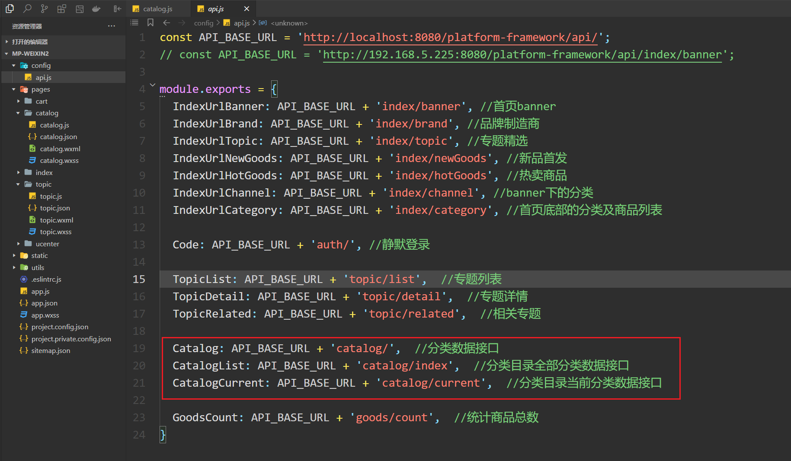
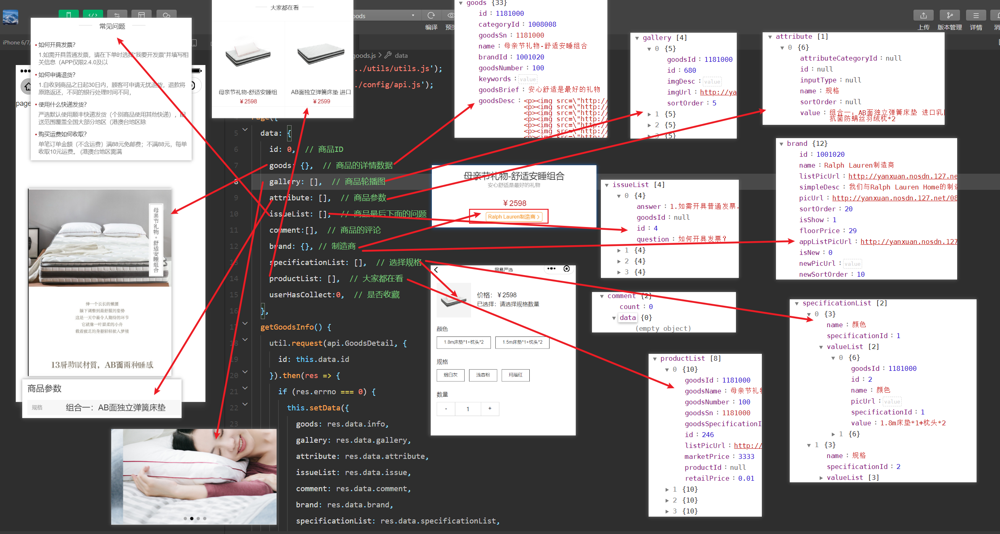
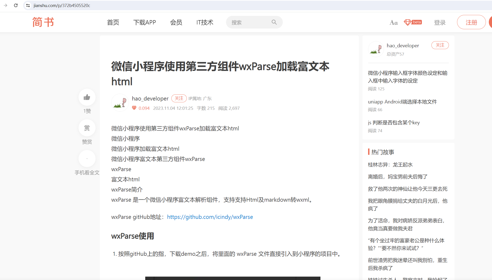
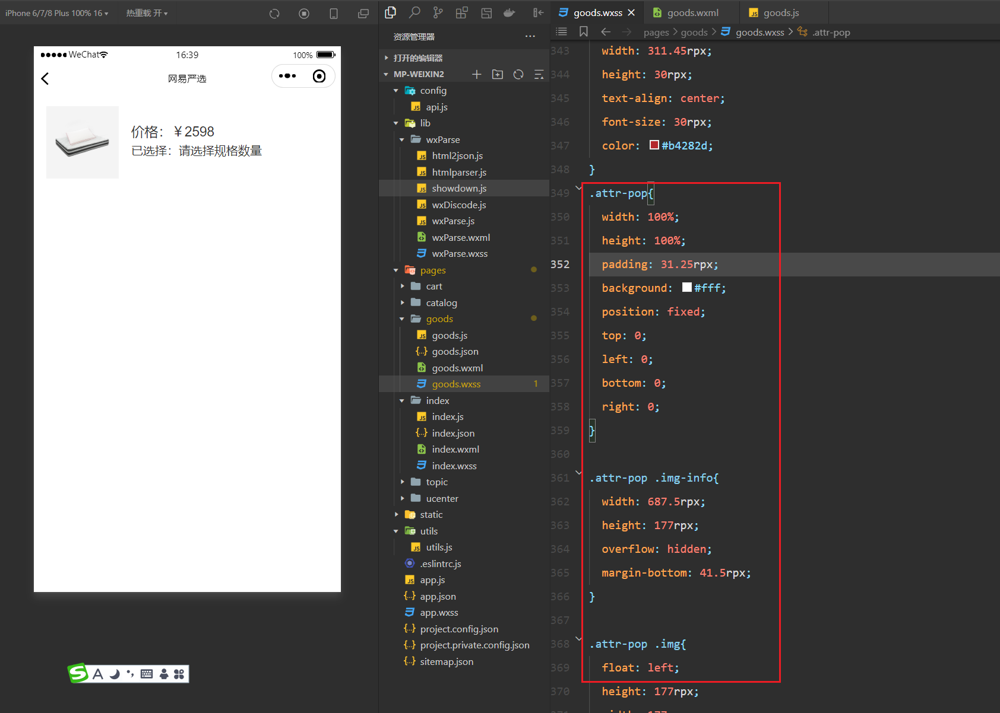
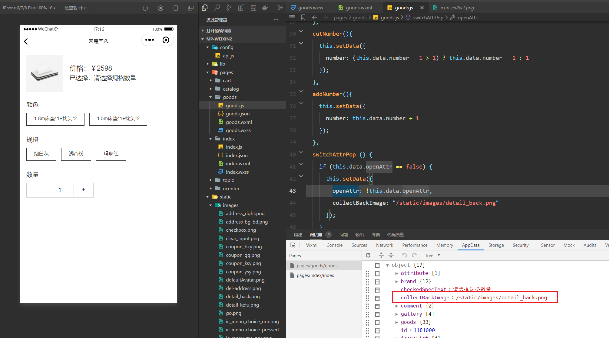
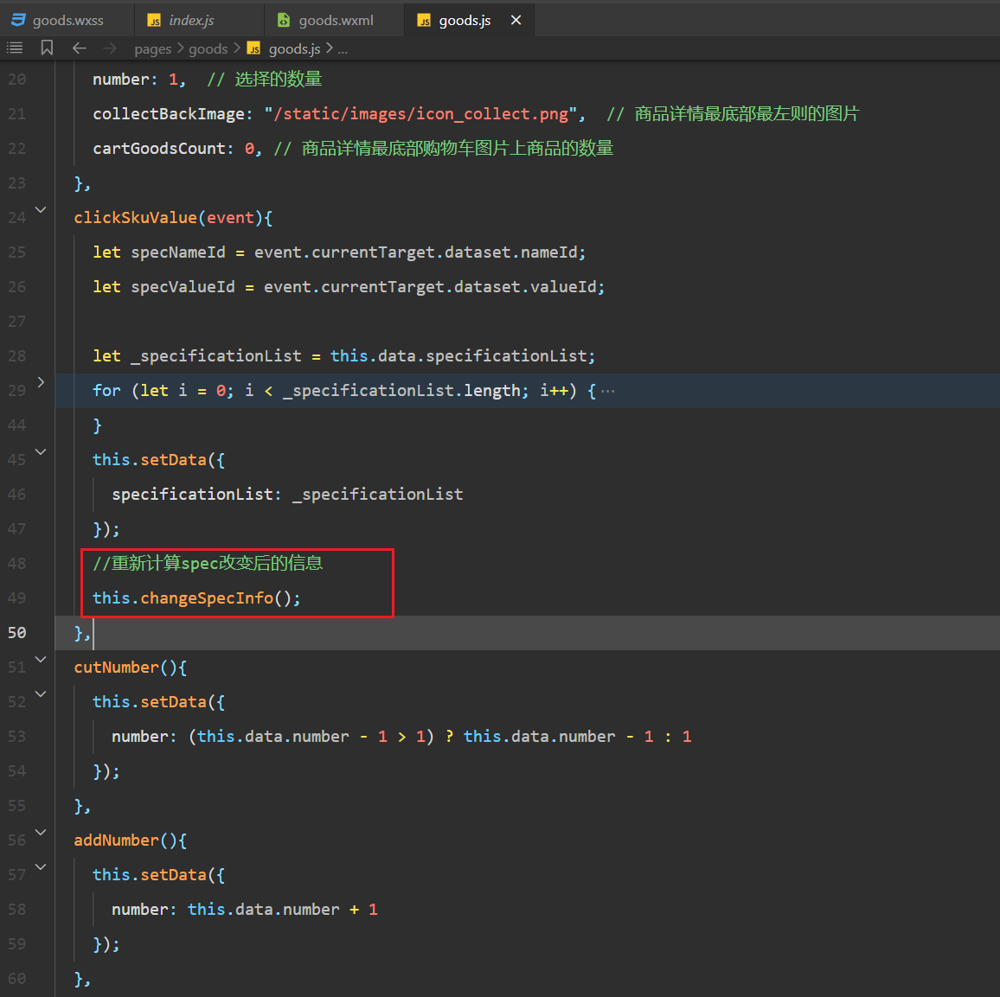

## 一，搭建项目环境


### 1，创建项目


### 2，配置window和tabbar

准备图片资源：


配置window:


```json
  "window": {
    "backgroundTextStyle": "dark",
    "navigationBarBackgroundColor": "#fff",
    "navigationBarTitleText": "网易严选",
    "navigationBarTextStyle": "black",
    "enablePullDownRefresh": true
  },
```


配置pages和tabbar：


pages：

```json
  "pages": [
    "pages/index/index",
    "pages/topic/topic",
    "pages/catalog/catalog",
    "pages/cart/cart",
    "pages/ucenter/index/index"
  ],
```

tabbar：

```json
 "tabBar": {
    "backgroundColor": "#fafafa",
    "borderStyle": "white",
    "selectedColor": "#b4282d",
    "color": "#666",
    "list": [
      {
        "pagePath": "pages/index/index",
        "iconPath": "static/images/ic_menu_choice_nor.png",
        "selectedIconPath": "static/images/ic_menu_choice_pressed.png",
        "text": "首页"
      },
      {
        "pagePath": "pages/topic/topic",
        "iconPath": "static/images/ic_menu_topic_nor.png",
        "selectedIconPath": "static/images/ic_menu_topic_pressed.png",
        "text": "专题"
      },
      {
        "pagePath": "pages/catalog/catalog",
        "iconPath": "static/images/ic_menu_sort_nor.png",
        "selectedIconPath": "static/images/ic_menu_sort_pressed.png",
        "text": "分类"
      },
      {
        "pagePath": "pages/cart/cart",
        "iconPath": "static/images/ic_menu_shoping_nor.png",
        "selectedIconPath": "static/images/ic_menu_shoping_pressed.png",
        "text": "购物车"
      },
      {
        "pagePath": "pages/ucenter/index/index",
        "iconPath": "static/images/ic_menu_me_nor.png",
        "selectedIconPath": "static/images/ic_menu_me_pressed.png",
        "text": "我的"
      }
    ]
  },
```


app.json的配置如下：

```json
{
  "pages": [
    "pages/index/index",
    "pages/topic/topic",
    "pages/catalog/catalog",
    "pages/cart/cart",
    "pages/ucenter/index/index"
  ],
  "window": {
    "backgroundTextStyle": "dark",
    "navigationBarBackgroundColor": "#fff",
    "navigationBarTitleText": "网易严选",
    "navigationBarTextStyle": "black",
    "enablePullDownRefresh": true
  },
  "tabBar": {
    "backgroundColor": "#fafafa",
    "borderStyle": "white",
    "selectedColor": "#b4282d",
    "color": "#666",
    "list": [
      {
        "pagePath": "pages/index/index",
        "iconPath": "static/images/ic_menu_choice_nor.png",
        "selectedIconPath": "static/images/ic_menu_choice_pressed.png",
        "text": "首页"
      },
      {
        "pagePath": "pages/topic/topic",
        "iconPath": "static/images/ic_menu_topic_nor.png",
        "selectedIconPath": "static/images/ic_menu_topic_pressed.png",
        "text": "专题"
      },
      {
        "pagePath": "pages/catalog/catalog",
        "iconPath": "static/images/ic_menu_sort_nor.png",
        "selectedIconPath": "static/images/ic_menu_sort_pressed.png",
        "text": "分类"
      },
      {
        "pagePath": "pages/cart/cart",
        "iconPath": "static/images/ic_menu_shoping_nor.png",
        "selectedIconPath": "static/images/ic_menu_shoping_pressed.png",
        "text": "购物车"
      },
      {
        "pagePath": "pages/ucenter/index/index",
        "iconPath": "static/images/ic_menu_me_nor.png",
        "selectedIconPath": "static/images/ic_menu_me_pressed.png",
        "text": "我的"
      }
    ]
  },
  "style": "v2",
  "sitemapLocation": "sitemap.json",
  "lazyCodeLoading": "requiredComponents"
}
```


### 3，封装ajax和API


参考代码：

```js
// 封装微信的的request
function request(url, data = {}, method = "POST", header = "application/x-www-form-urlencoded") {
  wx.showLoading({
      title: '加载中...',
  });
  return new Promise(function (resolve, reject) {
      wx.request({
          url: url,
          data: data,
          method: method,
          header: {
              'Content-Type': header,
              'token': wx.getStorageSync('token')
          },
          success: function (res) {
              wx.hideLoading();
              if (res.statusCode == 200) {
                  resolve(res.data);
              } else {
                  reject(res.errMsg);
              }

          },
          fail: function (err) {
              reject(err)
          }
      })
  });
}

module.exports = {
  request
}
```


封装API调用：


```js
const API_BASE_URL = 'http://localhost:8080/platform-framework/api/';

module.exports = {
  IndexUrlBanner: API_BASE_URL + 'index/banner', //首页banner
  IndexUrlBrand: API_BASE_URL + 'index/brand', //品牌制造商
  IndexUrlTopic: API_BASE_URL + 'index/topic', //专题精选
  IndexUrlNewGoods: API_BASE_URL + 'index/newGoods', //新品首发
  IndexUrlHotGoods: API_BASE_URL + 'index/hotGoods', //热卖商品
  IndexUrlChannel: API_BASE_URL + 'index/channel', //banner下的分类
  IndexUrlCategory: API_BASE_URL + 'index/category', //首页底部的分类及商品列表
}
```


### 4，渲染轮播图

说白了，开始写html+css+js+ajax。先渲染轮播图：


获取数据：


```js
const util = require('../../utils/utils.js');
const api = require('../../config/api.js');

Page({
  data:{
    banner: [],
  },
  onLoad(){
    this.getIndexData();
  },
  getIndexData(){
    util.request(api.IndexUrlBanner).then(res=>{
      console.log(res)
      if (res.errno === 0) {
        this.setData({
          banner:res.data.banner
        });
      }
    })
  }
})
```


查看数据：


渲染数据：


```html
<view class="container">
  <swiper class="banner" indicator-dots="true" autoplay="true" interval="3000" duration="1000">
    <swiper-item wx:for="{{banner}}" wx:key="id">
        <image src="{{item.imageUrl}}" background-size="cover"></image>
    </swiper-item>
  </swiper>
</view>
```


写样式：


```css
.banner {
  width: 750rpx;
  height: 417rpx;
}
.banner image {
  width: 100%;
  height: 417rpx;
}
```


设置全局样式：


```wxss
.container {
  box-sizing: border-box;
  background-color: #f4f4f4;
  font-family: PingFangSC-Light,helvetica,'Heiti SC';
} 

view,image,text,navigator{
  box-sizing: border-box;
  padding:0;
  margin:0;
}

view,text{
  font-family: PingFangSC-Light,helvetica,'Heiti SC';
  font-size: 29rpx;
  color: #333;
}

button::after {
  display: none;
}

.display-none {
  display: none !important;
}
::-webkit-scrollbar {
  width: 5px;
  background-color: #f5f5f5;
}

::-webkit-scrollbar-thumb {
  background-color: #999;
}
```


## 二，首页面

### 1，channel

目标：


定义数据和发ajax请求：


```js
util.request(api.IndexUrlChannel).then(res=> {
    if (res.errno === 0) {
        this.setData({
            channel: res.data.channel
        });
    }
});
```


查看数据：


渲染：


```html
 <view class="a-section a-topic" wx:if="{{channel.length > 0}}">
    <view class="m-menu">
      <navigator class="item" url="{{item.url}}" wx:for="{{channel}}" wx:key="id">
        <image src="{{item.iconUrl}}" background-size="cover"></image>
        <text>{{item.name}}</text>
      </navigator>
    </view>
  </view>
```


样式：


```css
.m-menu {
  display: flex;
  height: 181rpx;
  width: 750rpx;
  flex-flow: row nowrap;
  align-items: center;
  justify-content: space-between;
  background-color: #fff;
}

.m-menu .item {
  flex: 1;
  display: block;
  padding: 20rpx 0;
}

.m-menu image {
  display: block;
  width: 58rpx;
  height: 58rpx;
  margin: 0 auto;
  margin-bottom: 12rpx;
}

.m-menu text {
  display: block;
  font-size: 24rpx;
  text-align: center;
  margin: 0 auto;
  line-height: 1;
  color: #333;
}

.a-section {
  width: 750rpx;
  height: auto;
  overflow: hidden;
  background: #fff;
  color: #333;
  margin-top: 20rpx;
}
```


### 2，brand


目标：


定义数据和发ajax请求：


```js
    util.request(api.IndexUrlBrand).then(res=> {
      if (res.errno === 0) {
        this.setData({
          brand: res.data.brandList
        });
      }
    });
```


查看数据：


渲染：


```html
  <!-- brand -->
  <view class="a-section a-topic" wx:if="{{brand.length > 0}}">
    <view class="a-section a-brand">
      <view class="h">
        <navigator url="../brand/brand">
          <text class="txt">品牌制造商直供</text>
        </navigator>
      </view>
      <view class="b">
        <view class="item item-1" wx:for="{{brand}}" wx:key="id" wx:if="{{item.newPicUrl}}">
          <navigator url="/pages/brandDetail/brandDetail?id={{item.id}}">
            <view class="wrap">
              <image class="img" src="{{item.newPicUrl}}" mode="aspectFill"></image>
              <view class="mt">
                <text class="brand">{{item.name}}</text>
                <text class="price">{{item.floorPrice}}</text>
                <text class="unit">元起</text>
              </view>
            </view>
          </navigator>
        </view>
      </view>
    </view>
  </view>
```


样式：


```css
/* =========================== brand start =========================== */
.a-section .h {
  display: flex;
  flex-flow: row nowrap;
  align-items: center;
  justify-content: center;
  height: 130rpx;
}

.a-section .h .txt {
  padding-right: 30rpx;
  background-size: 16.656rpx 27rpx;
  display: inline-block;
  height: 36rpx;
  font-size: 33rpx;
  line-height: 36rpx;
}

.a-brand .b {
  width: 750rpx;
  height: auto;
  overflow: hidden;
  position: relative;
}

.a-brand .wrap {
  position: relative;
}

.a-brand .img {
  position: absolute;
  left: 0;
  top: 0;
}

.a-brand .mt {
  position: absolute;
  z-index: 2;
  padding: 27rpx 31rpx;
  left: 0;
  top: 0;
}

.a-brand .mt .brand {
  display: block;
  font-size: 33rpx;
  height: 43rpx;
  color: #333;
}

.a-brand .mt .price, .a-brand .mt .unit {
  font-size: 25rpx;
  color: #999;
}

.a-brand .item-1 {
  float: left;
  width: 375rpx;
  height: 252rpx;
  overflow: hidden;
  border-top: 1rpx solid #fff;
  margin-left: 1rpx;
}

.a-brand .item-1:nth-child(2n+1){
  margin-left: 0;
  width: 374rpx;
}

.a-brand .item-1 .img {
  width: 375rpx;
  height: 253rpx;
}

.a-topic .b {
  height: auto;
  width: 750rpx;
  padding: 0 0 48rpx 0;
}

.a-topic .b .list {
  height: 533rpx;
  width: 750rpx;
  white-space: nowrap;
}

.a-topic .b .item {
  display: inline-block;
  min-height: 400rpx;
  width: 680.5rpx;
  margin-left: 30rpx;
  overflow: hidden;
}

.a-topic .b .item:last-child {
  margin-right: 30rpx;
}

.a-topic .b .img {
  height: 400rpx;
  width: 680.5rpx;
}

.a-topic .b .np {
  height: 35rpx;
  margin-bottom: 13.5rpx;
  color: #333;
  font-size: 30rpx;
}

.a-topic .b .np .price {
  margin-left: 20.8rpx;
  color: #b4282d;
}

.a-topic .b .desc {
  display: block;
  height: 30rpx;
  color: #999;
  font-size: 24rpx;
  white-space: nowrap;
  overflow: hidden;
  text-overflow:ellipsis;
}

/* =========================== brand end =========================== */
```


### 3，topic


目标：


定义状态和发ajax请求：


```js
    util.request(api.IndexUrlTopic).then(res => {
      if (res.errno === 0) {
        this.setData({
          topics: res.data.topicList
        });
      }
    });
```


查看数据：


渲染数据：


```html
<!-- topic -->
  <view class="a-section a-topic" wx:if="{{topics.length > 0}}">
    <view class="h">
      <view>
        <navigator url="../topic/topic" open-type="switchTab">
          <text class="txt">专题精选</text>
        </navigator>
      </view>
    </view>
    <view class="b">
      <scroll-view scroll-x="true" class="list">
        <view class="item" wx:for="{{topics}}" wx:for-index="index" wx:for-item="item" wx:key="id">
          <navigator url="../topicDetail/topicDetail?id={{item.id}}">
            <image class="img" src="{{item.scenePicUrl}}" background-size="cover"></image>
            <view class="np">
              <text class="name">{{item.title}}</text>
              <text class="price">￥{{item.priceInfo}}元起</text>
            </view>
            <text class="desc">{{item.subtitle}}</text>
          </navigator>
        </view>
      </scroll-view>
    </view>
  </view>
```


样式：在brand模块已经把topic的样式写过了


### 4，new

目标：


定义状态和发ajax请求：


```js
    util.request(api.IndexUrlNewGoods).then(res => {
      if (res.errno === 0) {
        this.setData({
          newGoods: res.data.newGoodsList
        });
      }
    });
```


查看数据：


渲染数据：


```html
  <!-- new -->
  <view class="a-section a-new" wx:if="{{newGoods.length > 0}}">
    <view class="h">
      <view>
        <navigator url="../newGoods/newGoods">
          <text class="txt">周一周四 · 新品首发</text>
        </navigator>
      </view>
    </view>
    <view class="b">
      <view class="item" wx:for="{{newGoods}}" wx:for-index="index" wx:for-item="item" wx:key="id">
        <navigator url="../goods/goods?id={{item.id}}">
          <image class="img" src="{{item.listPicUrl}}" background-size="cover"></image>
          <text class="name">{{item.name}}</text>
          <text class="price">￥{{item.retailPrice}}</text>
        </navigator>
      </view>
    </view>
  </view>
```


样式：


```css
/* =========================== new start =========================== */

.a-new .b {
  width: 750rpx;
  height: auto;
  overflow: hidden;
  padding: 0 31rpx 45rpx 31rpx;
}

.a-new .b .item {
  float: left;
  width: 302rpx;
  margin-top: 10rpx;
  margin-left: 21rpx;
  margin-right: 21rpx;
}

.a-new .b .item-b {
  margin-left: 42rpx;
}

.a-new .b .img {
  width: 302rpx;
  height: 302rpx;
}

.a-new .b .name {
  text-align: center;
  display: block;
  width: 302rpx;
  height: 35rpx;
  margin-bottom: 14rpx;
  overflow: hidden;
  font-size: 30rpx;
  color: #333;
}

.a-new .b .price {
  display: block;
  text-align: center;
  line-height: 30rpx;
  font-size: 30rpx;
  color: #b4282d;
}

/* =========================== new end =========================== */
```

### 5，hotgoods

目标：


定义状态和发ajax请求：


```js
    util.request(api.IndexUrlHotGoods).then(res => {
      if (res.errno === 0) {
        this.setData({
          hotGoods: res.data.hotGoodsList
        });
      }
    });
```


查看数据：


渲染数据：


```html
  <!-- hotGoods -->
  <view class="a-section a-popular" wx:if="{{hotGoods.length > 0}}">
    <view class="h">
      <view>
        <navigator url="../hotGoods/hotGoods">
          <text class="txt">人气推荐</text>
        </navigator>
      </view>
    </view>
    <view class="b">
      <view class="item" wx:for="{{hotGoods}}" wx:for-index="index" wx:for-item="item" wx:key="id">
        <navigator url="/pages/goods/goods?id={{item.id}}">
          <image class="img" src="{{item.listPicUrl}}" background-size="cover"></image>
          <view class="right">
            <view class="text">
              <text class="name">{{item.name}}</text>
              <text class="desc">{{item.goodsBrief}}</text>
              <text class="price">￥{{item.retailPrice}}</text>
            </view>
          </view>
        </navigator>
      </view>
    </view>
  </view>
```


样式：


```css
/* =========================== hotgoods start =========================== */
.a-popular {
  width: 750rpx;
  height: auto;
  overflow: hidden;
}

.a-popular .b .item {
  border-top: 1px solid #d9d9d9;
  margin: 0 20rpx;
  height: 264rpx;
  width: 710rpx;
}

.a-popular .b .img {
  margin-top: 12rpx;
  margin-right: 12rpx;
  float: left;
  width: 240rpx;
  height: 240rpx;
}

.a-popular .b .right {
  float: left;
  height: 264rpx;
  width: 456rpx;
  display: flex;
  flex-flow: row nowrap;
}

.a-popular .b .text {
  display: flex;
  flex-wrap: nowrap;
  flex-direction: column;
  justify-content: center;
  overflow: hidden;
  height: 264rpx;
  width: 456rpx;
}

.a-popular .b .name {
  width: 456rpx;
  display: block;
  color: #333;
  line-height: 50rpx;
  font-size: 30rpx;
}

.a-popular .b .desc {
  width: 456rpx;
  display: block;
  color: #999;
  line-height: 50rpx;
  font-size: 25rpx;
}

.a-popular .b .price {
  width: 456rpx;
  display: block;
  color: #b4282d;
  line-height: 50rpx;
  font-size: 33rpx;
}
/* =========================== hotgoods end =========================== */
```

### 6， floorGoods

目标：


定义状态和发ajax请求：


```js
    util.request(api.IndexUrlCategory).then(res => {
      if (res.errno === 0) {
        this.setData({
          floorGoods: res.data.categoryList
        });
      }
    });
```


查看数据：


渲染数据：


```html
  <!-- good-grid -->
  <view class="good-grid" wx:for="{{floorGoods}}" wx:key="id">
    <view class="h">
      <view>
        <text>{{item.name}}</text>
      </view>
    </view>
    <view class="b">
      <block wx:for="{{item.goodsList}}" wx:for-index="iindex" wx:for-item="iitem" wx:key="id">
        <view class="item {{iindex % 2 == 0 ? '' : 'item-b'}}">
          <navigator url="../goods/goods?id={{iitem.id}}" class="a">
            <image class="img" src="{{iitem.listPicUrl}}" background-size="cover"></image>
            <text class="name">{{iitem.name}}</text>
            <text class="price">￥{{iitem.retailPrice}}</text>
          </navigator>
        </view>
      </block>
      <view class="item item-b item-more">
          <navigator url="/pages/category/category?id={{item.id}}" class="more-a">
            <view class="txt">{{'更多'+item.name+'好物'}}</view>
            <image class="icon" src="../../static/images/icon_go_more.png" background-size="cover"></image>
          </navigator>
      </view>
    </view>
  </view>
```


样式：


```css
/* =========================== good-grid start =========================== */
.good-grid {
  width: 750rpx;
  height: auto;
  overflow: hidden;
}

.good-grid .h {
  display: flex;
  flex-flow: row nowrap;
  align-items: center;
  justify-content: center;
  height: 130rpx;
  font-size: 33rpx;
  color: #333;
}

.good-grid .b {
  width: 750rpx;
  padding: 0 6.25rpx;
  height: auto;
  overflow: hidden;
}

.good-grid .b .item {
  float: left;
  background: #fff;
  width: 365rpx;
  margin-bottom: 6.25rpx;
  height: 452rpx;
  overflow: hidden;
  text-align: center;
}

.good-grid .b .item .a{
  height: 452rpx;
  width: 100%;
}

.good-grid .b .item-b {
  margin-left: 6.25rpx;
}

.good-grid .item .img {
  margin-top: 20rpx;
  width: 302rpx;
  height: 302rpx;
}

.good-grid .item .name {
  display: block;
  width: 365.625rpx;
  padding: 0 20rpx;
  overflow: hidden;
  height: 35rpx;
  margin: 11.5rpx 0 22rpx 0;
  text-align: center;
  font-size: 30rpx;
  color: #333;
}

.good-grid .item .price {
  display: block;
  width: 365.625rpx;
  height: 30rpx;
  text-align: center;
  font-size: 30rpx;
  color: #b4282d;
}

.good-grid .more-item{
  height: 100%;
  width: 100%;
}

.more-a{
  height: 100%;
  width: 100%;
  display: flex;
  flex-direction: column;
  align-items: center;
  justify-content: center;
}

.good-grid .more-a .txt{
  height: 33rpx;
  width: 100%;
  line-height: 33rpx;
  color: #333;
  font-size: 33rpx;
}

.good-grid .more-a .icon{
  margin: 60rpx auto 0 auto;
  width: 70rpx;
  height: 70rpx;
}
/* =========================== good-grid end =========================== */
```


### 7，实现静默登录


定义接口：


```js
Code: API_BASE_URL + 'auth/', //静默登录
```


在首页面中实现登录：


```js
    wx.login({
      success: (resp) => {
        util.request(api.Code + resp.code, {}, 'GET').then(function (res) {
          if (res.errno === 0) {
            //存储用户信息
            wx.setStorageSync('userInfo', res.data.userInfo);
            wx.setStorageSync('token', res.data.token);
            wx.setStorageSync('userId', res.data.userId);
          } else {
            // util.showErrorToast(res.errmsg)
            wx.showModal({
              title: '提示',
              content: res.errmsg,
              showCancel: false
            });
          }
        });
      },
    })
```


查看硬盘上的数据：


静默登录先说到这，后面还有其它的登录方式。


### 8，实现下拉刷新和分享


```js
  onShareAppMessage: function () {
    wx.showShareMenu({
      withShareTicket: true,
      menus: ['shareAppMessage', 'shareTimeline']
    })
    return {
      title: '第一个小程序项目666',
      desc: '网易严选微信小程序商城',
      path: '/pages/index/index'
    }
  },
  onShareTimeline: function () { //用户点击右上角分享朋友圈 
    return {
      title: '第一个小程序项目888',
      query: "id=110101&name=malu",
      imageUrl: '/static/images/logo.png'
    }
  },
  // 下拉刷新就是重新调用接口，获取新的数据
  onPullDownRefresh() {
    this.getIndexData();
  },
```


## 三，实现专题页（分页功能）

目标：


### 1，定义状态并获取数据

默认进入专题页面：


定义状态如下：


```js
    topicList: [],  // 专题页面数据
    page: 1,  // 默认获取第1页数据
    size: 10,  // 一页获取10条数据
    count: 0,    // 共有多少条数据（后端返回）
    scrollTop: 0,  // scroll-view中设置scroll-top滚动位置
    showPage: false  // 是否显示上一页和下一页按钮
```


封装API：


```js
  TopicList: API_BASE_URL + 'topic/list',  //专题列表
  TopicDetail: API_BASE_URL + 'topic/detail',  //专题详情    后面会用到
  TopicRelated: API_BASE_URL + 'topic/related',  //相关专题     后面会用到
```


获取数据：


```js
  getTopic() {
    this.setData({
      scrollTop: 0,
      showPage: false,
      topicList: []
    });
    // 页面渲染完成
    wx.showToast({
      title: '加载中...',
      icon: 'loading',
      duration: 2000
    });
    util.request(api.TopicList, { page: this.data.page, size: this.data.size }).then(res=>{
      if (res.errno === 0) {
        this.setData({
          scrollTop: 0,
          topicList: res.data.data,
          showPage: true,
          count: res.data.count
        });
      }
      wx.hideToast();
    });
  }
```


查看数据：


### 3，渲染数据


```html
<view class="container">
  <scroll-view class="topic-list" scroll-y="true" scroll-top="{{scrollTop}}">
    <navigator class="item" wx:for="{{topicList}}" wx:key="id" url="../topicDetail/topicDetail?id={{item.id}}">
      <image class="img" src="{{item.scenePicUrl}}"></image>
      <view class="info">
        <text class="title">{{item.title}}</text>
        <text class="desc">{{item.subtitle}}</text>
        <text class="price">{{item.priceInfo}}元起</text>
      </view>
    </navigator>
    <view class="page" wx:if="{{showPage}}">
      <view class="prev {{ page <= 1 ? 'disabled' : ''}}" bindtap="prevPage">上一页</view>
      <view class="next {{ (count / size) < page +1 ? 'disabled' : ''}}" bindtap="nextPage">下一页</view>
    </view>
  </scroll-view>
</view>
```


样式：


```css
page ,.container{
  width: 750rpx;
   height: 100%;
   overflow: hidden;
   background: #f4f4f4;
}
.topic-list{
   width: 750rpx;
   height: 100%;
   overflow: hidden;
   background: #f4f4f4;
}

.topic-list .item{
   width: 100%;
   height: 625rpx;
   overflow: hidden;
   background: #fff;
   margin-bottom: 20rpx;
}

.topic-list .img{
   width: 100%;
   height: 415rpx;
}

.topic-list .info{
   width: 100%;
   height: 210rpx;
   overflow: hidden;
}

.topic-list .title{
   display: block;
   text-align: center;
   width: 100%;
   height: 33rpx;
   line-height: 35rpx;
   color: #333;
   overflow: hidden;
   font-size: 35rpx;
   margin-top: 30rpx;
}

.topic-list .desc{
   display: block;
   text-align: center;
   position: relative;
   width: auto;
   height: 24rpx;
   line-height: 24rpx;
   overflow: hidden;
   color: #999;
   font-size: 24rpx;
   margin-top: 16rpx;
   margin-bottom: 30rpx;
}

.topic-list .price{
   display: block;
   text-align: center;
   width: 100%;
   height: 27rpx;
   line-height: 27rpx;
   overflow: hidden;
   color: #b4282d;
   font-size: 27rpx;
}


.page{
   width: 750rpx;
   height: 108rpx;
   background: #fff;
   margin-bottom: 20rpx;
}

.page view{
   height: 108rpx;
   width: 50%;
   float: left;
   font-size: 29rpx;
   color: #333;
   text-align: center;
   line-height: 108rpx;
}

.page .prev{
   border-right: 1px solid #D9D9D9;
}

.page .disabled{
   color: #ccc;
}
```


实现上一页和下一页：


```js
  nextPage() {
    if (this.data.page + 1 > this.data.count / this.data.size) {
      return true;
    }
    this.setData({
      page: parseInt(this.data.page) + 1
    });
    this.getTopic();
  },
  prevPage() {
    if (this.data.page <= 1) {
      return false;
    }
    this.setData({
      page: parseInt(this.data.page) - 1
    });
    this.getTopic();
  }
```


## 四，分类页面渲染

### 1，目标


### 2，定义状态并获取数据

封装API接口如下：



```js
Catalog: API_BASE_URL + 'catalog/',  //分类数据接口
CatalogList: API_BASE_URL + 'catalog/index',  //分类目录全部分类数据接口
CatalogCurrent: API_BASE_URL + 'catalog/current',  //分类目录当前分类数据接口

GoodsCount: API_BASE_URL + 'goods/count',  //统计商品总数
```


```js
var util = require('../../utils/utils.js');
var api = require('../../config/api.js');
Page({
  data: {
    navList: [],
    categoryList: [],
    currentCategory: {},
    goodsCount: 0,
  },
  onLoad(options) {
    this.getCatalog();
  },
  getCatalog(){
    wx.showLoading({
      title: '加载中...',
    });
    util.request(api.CatalogList).then(res=>{
      this.setData({
        navList: res.data.categoryList,
        currentCategory: res.data.currentCategory
      });
      wx.hideLoading();
    });
    util.request(api.GoodsCount).then(res=>{
      this.setData({
        goodsCount: res.data.goodsCount
      });
    });
  }
})
```


查看数据：


### 3，渲染数据

渲染数据：


```html
<view class="container">
  <view class="search">
    <navigator url="/pages/search/search" class="input">
      <image class="icon"></image>
      <text class="txt">商品搜索, 共{{goodsCount}}款好物</text>
    </navigator>
  </view>
  <view class="catalog">
    <scroll-view class="nav" scroll-y="true">
      <view class="item {{ currentCategory.id == item.id ? 'active' : ''}}" wx:for="{{navList}}" wx:key="id" data-id="{{item.id}}" data-index="{{index}}" bindtap="switchCate">{{item.name}}</view>
    </scroll-view>
    <scroll-view class="cate" scroll-y="true">
      <navigator url="url" class="banner">
        <image class="image" src="{{currentCategory.wapBannerUrl}}"></image>
        <view class="txt">{{currentCategory.frontName}}</view>
      </navigator>
      <view class="hd">
        <text class="line"></text>
        <text class="txt">{{currentCategory.name}}分类</text>
        <text class="line"></text>
      </view>
      <view class="bd">
        <navigator url="/pages/category/category?id={{item.id}}" class="item {{(index+1) % 3 == 0 ? 'last' : ''}}" wx:for="{{currentCategory.subCategoryList}}" wx:key="id">
          <image class="icon" src="{{item.wapBannerUrl}}"></image>
          <text class="txt">{{item.name}}</text>
        </navigator>
      </view>
    </scroll-view>
  </view>
</view>
```


样式：

```css
page {
  height: 100%;
}

.container {
  background: #f9f9f9;
  height: 100%;
  width: 100%;
  display: flex;
  flex-direction: column;
}

.search {
  height: 88rpx;
  width: 100%;
  padding: 0 30rpx;
  background: #fff;
  display: flex;
  align-items: center;
}

.search .input {
  width: 690rpx;
  height: 56rpx;
  background: #ededed;
  border-radius: 8rpx;
  display: flex;
  align-items: center;
  justify-content: center;
}

.search .icon {
  background: url(http://yanxuan.nosdn.127.net/hxm/yanxuan-wap/p/20161201/style/img/icon-normal/search2-2fb94833aa.png) center no-repeat;
  background-size: 100%;
  width: 28rpx;
  height: 28rpx;
}

.search .txt {
  height: 42rpx;
  line-height: 42rpx;
  color: #666;
  padding-left: 10rpx;
  font-size: 30rpx;
}

.catalog {
  flex: 1;
  width: 100%;
  background: #fff;
  display: flex;
  border-top: 1px solid #fafafa;
}

.catalog .nav {
  width: 162rpx;
  height: 100%;
}

.catalog .nav .item {
  text-align: center;
  line-height: 90rpx;
  width: 162rpx;
  height: 90rpx;
  color: #333;
  font-size: 28rpx;
  border-left: 6rpx solid #fff;
}

.catalog .nav .item.active {
  color: #ab2b2b;
  font-size: 36rpx;
  border-left: 6rpx solid #ab2b2b;
}

.catalog .cate {
  border-left: 1px solid #fafafa;
  flex: 1;
  height: 100%;
  padding: 0 30rpx 0 30rpx;
}

.banner {
  display: block;
  height: 222rpx;
  width: 100%;
  position: relative;
}

.banner .image {
  position: absolute;
  top: 30rpx;
  left: 0;
  border-radius: 4rpx;
  height: 192rpx;
  width: 100%;
}

.banner .txt {
  position: absolute;
  top: 30rpx;
  text-align: center;
  color: #fff;
  font-size: 28rpx;
  left: 0;
  height: 192rpx;
  line-height: 192rpx;
  width: 100%;
}

.catalog .hd {
  height: 108rpx;
  width: 100%;
  display: flex;
  justify-content: center;
  align-items: center;
}

.catalog .hd .txt {
  font-size: 24rpx;
  text-align: center;
  color: #333;
  padding: 0 10rpx;
  width: auto;
}

.catalog .hd .line {
  width: 40rpx;
  height: 1px;
  background: #d9d9d9;
}

.catalog .bd {
  height: auto;
  width: 100%;
  overflow: hidden;
}

.catalog .bd .item {
  display: block;
  float: left;
  height: 216rpx;
  width: 144rpx;
  margin-right: 34rpx;
}

.catalog .bd .item.last {
  margin-right: 0;
}

.catalog .bd .item .icon {
  height: 144rpx;
  width: 144rpx;
}

.catalog .bd .item .txt {
  display: block;
  text-align: center;
  font-size: 24rpx;
  color: #333;
  height: 72rpx;
  width: 144rpx;
}
```


实现如下：


### 4，点击切换分类

分析：


实现方法：


```js
  getCurrentCategory(id){
    util.request(api.CatalogCurrent, { id: id })
      .then(res=>{
        this.setData({
          currentCategory: res.data.currentCategory
        });
      });
  },
  switchCate(event){
    let currentTarget = event.currentTarget;
    if(this.data.currentCategory.id == event.currentTarget.dataset.id){
      return false;
    }
    // 根据分类ID获取分类数据
    this.getCurrentCategory(event.currentTarget.dataset.id);
  }
```


测试：


完整JS：

```js
var util = require('../../utils/utils.js');
var api = require('../../config/api.js');
Page({
  data: {
    navList: [],
    categoryList: [],
    currentCategory: {},
    goodsCount: 0,
  },
  onLoad(options) {
    this.getCatalog();
  },
  getCatalog(){
    wx.showLoading({
      title: '加载中...',
    });
    util.request(api.CatalogList).then(res=>{
      this.setData({
        navList: res.data.categoryList,
        currentCategory: res.data.currentCategory
      });
      wx.hideLoading();
    });
    util.request(api.GoodsCount).then(res=>{
      this.setData({
        goodsCount: res.data.goodsCount
      });
    });
  },
  getCurrentCategory(id){
    util.request(api.CatalogCurrent, { id: id })
      .then(res=>{
        this.setData({
          currentCategory: res.data.currentCategory
        });
      });
  },
  switchCate(event){
    let currentTarget = event.currentTarget;
    if(this.data.currentCategory.id == event.currentTarget.dataset.id){
      return false;
    }
    // 根据分类ID获取分类数据
    this.getCurrentCategory(event.currentTarget.dataset.id);
  }
})
```


## 五，商品详情

 目标：


### 1，商品轮播

在商品列表，点击某个商品，会进入到商品详情，创建商品详情页面，如下：


在商品详情页面，可以得到商品的ID，如下：


封装API接口：


```js
GoodsDetail: API_BASE_URL + 'goods/detail',  //获得商品的详情
```


有了ID，就可以获取数据了，如下：


```js
var util = require('../../utils/utils.js');
var api = require('../../config/api.js');

Page({
  data: {
    id: 0,  // 商品ID
    goods: {},  // 商品的详情数据
    gallery: [],  // 商品轮播图
    attribute: [],  // 商品参数
    issueList: [],  // 商品最后下面的问题
    comment:[],  // 商品的评论
    brand: {}, // 制造商
    specificationList: [],  // 选择规格
    productList: [],  // 大家都在看
    userHasCollect:0,  // 是否收藏
  },
  getGoodsInfo() {
    util.request(api.GoodsDetail, {
      id: this.data.id
    }).then(res => {
      if (res.errno === 0) {
        this.setData({
          goods: res.data.info,
          gallery: res.data.gallery,
          attribute: res.data.attribute,
          issueList: res.data.issue,
          comment: res.data.comment,
          brand: res.data.brand,
          specificationList: res.data.specificationList,
          productList: res.data.productList,
          userHasCollect: res.data.userHasCollect
        });
      }
    })
  },
  onLoad(options) {
    // 页面初始化 options为页面跳转所带来的参数
    this.setData({
      id: parseInt(options.id)
      // id: 1181000
    });
    this.getGoodsInfo();
  },
})
```


分析这些状态的含义(务必把每一个状态都分析清楚再往下写)：




开始渲染轮播图：


```html
<scroll-view class="container" scroll-y="true">
  <view>
    <swiper class="goodsimgs" indicator-dots="true" autoplay="true" interval="3000" duration="1000">
      <swiper-item wx:for="{{gallery}}" wx:key="id">
        <image src="{{item.imgUrl}}" background-size="cover"></image>
      </swiper-item>
    </swiper>
    <view class="service-policy">
      <view class="item">30天无忧退货</view>
      <view class="item">48小时快速退款</view>
      <view class="item">满88元免邮费</view>
    </view>
    <view class="goods-info">
      <view class="c">
        <text class="name">{{goods.name}}</text>
        <text class="desc">{{goods.goodsBrief}}</text>
        <text class="price">￥{{goods.retailPrice}}</text>
        <view class="brand" wx:if="{{brand.name}}">
          <navigator url="../brandDetail/brandDetail?id={{brand.id}}">
            <text>{{brand.name}}</text>
          </navigator>
        </view>
      </view>
    </view>
  </view>
</scroll-view>
```


样式如下：


```css
.container{
  /* margin-bottom: 100rpx; */
}
.goodsimgs{
width: 750rpx;
height: 750rpx;
}

.goodsimgs image{
width: 750rpx;
height: 750rpx;
}

.service-policy{
  width: 750rpx;
  height: 73rpx;
  background: #f4f4f4;
  padding: 0 31.25rpx;
  display: flex;
  flex-flow: row nowrap;
  align-items: center;
  justify-content: space-between;
}

.service-policy .item{
  background: url(http://nos.netease.com/mailpub/hxm/yanxuan-wap/p/20150730/style/img/icon-normal/servicePolicyRed-518d32d74b.png) 0 center no-repeat;
  background-size: 10rpx;
  padding-left: 15rpx;
  display: flex;
  align-items: center;
  font-size: 25rpx;
  color: #666;
}

.goods-info{
  width: 750rpx;
  height: 306rpx;
  overflow: hidden;
  background: #fff;
}

.goods-info .c{
  display: block;
  width: 718.75rpx;
  height: 100%;
  margin-left: 31.25rpx;
  padding: 38rpx 31.25rpx 38rpx 0;
  border-bottom: 1px solid #f4f4f4;
}

.goods-info .c text{
  display: block;
  width: 687.5rpx;
  text-align: center;
}

.goods-info .name{
  height: 41rpx;
  margin-bottom: 5.208rpx;
  font-size: 41rpx;
  line-height: 41rpx;
}

.goods-info .desc{
  height: 43rpx;
  margin-bottom: 41rpx;
  font-size: 24rpx;
  line-height: 36rpx;
  color: #999;
}


.goods-info .price{
  height: 35rpx;
  font-size: 35rpx;
  line-height: 35rpx;
  color: #b4282d;
}

.goods-info .brand{
  margin-top: 23rpx;
  min-height: 40rpx;
  text-align: center;
}

.goods-info .brand text{
  display: inline-block;
  width: auto;
  padding: 2px 30rpx 2px 10.5rpx;
  line-height: 35.5rpx;
  border: 1px solid #f48f18;
  font-size: 25rpx;
  color: #f48f18;
  border-radius: 4px;
  background: url(http://nos.netease.com/mailpub/hxm/yanxuan-wap/p/20150730/style/img/icon-normal/detailTagArrow-18bee52dab.png) 95% center no-repeat;
  background-size: 10.75rpx 18.75rpx;
}

.section-nav{
  width: 750rpx;
  height: 108rpx;
  background: #fff;
  margin-bottom: 20rpx;
}

.section-nav .t{
  float: left;
  width: 600rpx;
  height: 108rpx;
  line-height: 108rpx;
  font-size: 29rpx;
  color: #333;
  margin-left: 31.25rpx;
}

.section-nav .i{
  float: right;
  width: 52rpx;
  height: 52rpx;
  margin-right: 16rpx;
  margin-top: 28rpx;
}
```


效果如下：


### 2，数据渲染上

直接渲染数据：


```html
<scroll-view class="container" scroll-y="true">
  <view>
    <swiper class="goodsimgs" indicator-dots="true" autoplay="true" interval="3000" duration="1000">
      <swiper-item wx:for="{{gallery}}" wx:key="id">
        <image src="{{item.imgUrl}}" background-size="cover"></image>
      </swiper-item>
    </swiper>
    <view class="service-policy">
      <view class="item">30天无忧退货</view>
      <view class="item">48小时快速退款</view>
      <view class="item">满88元免邮费</view>
    </view>
    <view class="goods-info">
      <view class="c">
        <text class="name">{{goods.name}}</text>
        <text class="desc">{{goods.goodsBrief}}</text>
        <text class="price">￥{{goods.retailPrice}}</text>
        <view class="brand" wx:if="{{brand.name}}">
          <navigator url="../brandDetail/brandDetail?id={{brand.id}}">
            <text>{{brand.name}}</text>
          </navigator>
        </view>
      </view>
    </view>
    <!-- 请选择商品规格数量 -->
    <view class="section-nav section-attr" bindtap="switchAttrPop">
      <view class="t">请选择规格数量</view>
      <image class="i" src="../../static/images/address_right.png" background-size="cover"></image>
    </view>
    <!-- 商品的评论 -->
    <view class="comments" wx:if="{{comment.count > 0}}">
        <!-- 由于没有评论数据，先空着 -->
    </view>
    <!-- 商品参数 -->
    <view class="goods-attr">
      <view class="t">商品参数</view>
      <view class="l">
        <view class="item" wx:for="{{attribute}}" wx:key="name">
          <text class="left">{{item.name}}</text>
          <text class="right">{{item.value}}</text>
        </view>
      </view>
    </view>
  </view>
</scroll-view>
```


样式：


```css
.section-nav{
  width: 750rpx;
  height: 108rpx;
  background: #fff;
  margin-bottom: 20rpx;
}

.section-nav .t{
  float: left;
  width: 600rpx;
  height: 108rpx;
  line-height: 108rpx;
  font-size: 29rpx;
  color: #333;
  margin-left: 31.25rpx;
}

.section-nav .i{
  float: right;
  width: 52rpx;
  height: 52rpx;
  margin-right: 16rpx;
  margin-top: 28rpx;
}
.goods-attr{
  width: 750rpx;
  height: auto;
  overflow: hidden;
  padding: 0 31.25rpx 25rpx 31.25rpx;
  background: #fff;
}

.goods-attr .t{
  width: 687.5rpx;
  height: 104rpx;
  line-height: 104rpx;
  font-size: 38.5rpx;
}

.goods-attr .item{
  width: 687.5rpx;
  height: 68rpx;
  padding: 11rpx 20rpx;
  margin-bottom: 11rpx;
  background: #f7f7f7;
  font-size: 38.5rpx;
}

.goods-attr .left{
  float: left;
  font-size: 25rpx;
  width: 134rpx;
  height: 45rpx;
  line-height: 45rpx;
  overflow: hidden;
  color: #999;
}

.goods-attr .right{
  float: left;
  font-size: 36.5rpx;
  margin-left: 20rpx;
  width: 480rpx;
  height: 45rpx;
  line-height: 45rpx;
  overflow: hidden;
  color: #333;
}
```


继续渲染数据，接着需要渲染商品详情数据了，商品详情数据是一个富文本数据，如下：


商品详情数据就是一片HTML，也就是所谓的富文本数据，所以我们需要解决富文本数据，使用技术如下：




参考地址：

https://www.jianshu.com/p/372b4505520c


使用步骤1：


```js
var WxParse = require('../../lib/wxParse/wxParse.js');

WxParse.wxParse('goodsDetail', 'html', res.data.info.goodsDesc, this);
```


步骤2：


```html
    <!-- 商品详情的富文本数据 -->
    <view class="detail">
      <import src="../../lib/wxParse/wxParse.wxml" />
      <template is="wxParse" data="{{wxParseData:goodsDetail.nodes}}" />
    </view>
```


步骤3：


测试：


样式：


```css
.detail{
    width: 750rpx;
    height: auto;
    overflow: hidden;
}

.detail image{
    width: 750rpx;
    display: block;
}
```


再渲染常见问题：


```html
<view class="common-problem">
    <view class="h">
        <view class="line"></view>
        <text class="title">常见问题</text>
    </view>
    <view class="b">
        <view class="item" wx:for="{{issueList}}" wx:key="id">
            <view class="question-box">
                <text class="spot"></text>
                <text class="question">{{item.question}}</text>
            </view>
            <view class="answer">
                {{item.answer}}
            </view>
        </view>
    </view>
</view>
```


样式：


```css
.common-problem {
  width: 750rpx;
  height: auto;
  overflow: hidden;
}

.common-problem .h {
  position: relative;
  height: 145.5rpx;
  width: 750rpx;
  padding: 56.25rpx 0;
  background: #fff;
  text-align: center;
}

.common-problem .h .line {
  display: inline-block;
  position: absolute;
  top: 72rpx;
  left: 0;
  z-index: 2;
  height: 1px;
  margin-left: 225rpx;
  width: 300rpx;
  background: #ccc;
}

.common-problem .h .title {
  display: inline-block;
  position: absolute;
  top: 56.125rpx;
  left: 0;
  z-index: 3;
  height: 33rpx;
  margin-left: 285rpx;
  width: 180rpx;
  background: #fff;
}

.common-problem .b {
  width: 750rpx;
  height: auto;
  overflow: hidden;
  padding: 0rpx 30rpx;
  background: #fff;

}

.common-problem .item {
  height: auto;
  overflow: hidden;
  padding-bottom: 25rpx;
}

.common-problem .question-box .spot {
  float: left;
  display: block;
  height: 8rpx;
  width: 8rpx;
  background: #b4282d;
  border-radius: 50%;
  margin-top: 11rpx;
  margin-right: 10rpx;
}

.common-problem .question-box .question {
  /* float: left; */
  line-height: 30rpx;
  padding-left: 8rpx;
  display: block;
  font-size: 26rpx;
  padding-bottom: 15rpx;
  color: #303030;
}

.common-problem .answer {
  line-height: 36rpx;
  padding-left: 16rpx;
  font-size: 26rpx;
  color: #787878;
}
```


渲染大家都在看的商品时，需要获取数据：


```js
GoodsRelated: API_BASE_URL + 'goods/related',  //商品详情页的关联商品（大家都在看）
```


```js
  getGoodsRelated(){
    util.request(api.GoodsRelated, { id: this.data.id }).then(res=>{
      if (res.errno === 0) {
        this.setData({
          relatedGoods: res.data.goodsList,
        });
      }
    });
  },
```


查看数据：


渲染大家都在看的商品：


```html
    <view class="related-goods" wx:if="{{relatedGoods.length > 0}}">
      <view class="h">
        <view class="line"></view>
        <text class="title">大家都在看</text>
      </view>
      <view class="b">
        <view class="item" wx:for="{{relatedGoods}}" wx:key="id">
          <navigator url="/pages/goods/goods?id={{item.id}}">
            <image class="img" src="{{item.listPicUrl}}" background-size="cover"></image>
            <text class="name">{{item.name}}</text>
            <text class="price">￥{{item.retailPrice}}</text>
          </navigator>
        </view>
      </view>
    </view>
```


样式：


```css

.related-goods{
    width: 750rpx;
    height: auto;
    overflow: hidden;
}

.related-goods .h{
    position: relative;
    height: 145.5rpx;
    width: 750rpx;
    padding: 56.25rpx 0;
    background: #fff;
    text-align: center;
    border-bottom: 1px solid #f4f4f4;
}

.related-goods .h .line{
    display: inline-block;
    position: absolute;
    top: 72rpx;
    left: 0;
    z-index: 2;
    height: 1px;
    margin-left: 225rpx;
    width: 300rpx;
    background: #ccc;
}

.related-goods .h .title{
    display: inline-block;
    position: absolute;
    top: 56.125rpx;
    left: 0;
    z-index: 3;
    height: 33rpx;
    margin-left: 285rpx;
    width: 180rpx;
    background: #fff;
}

.related-goods .b{
  width: 750rpx;
  height: auto;
  overflow: hidden;
}

.related-goods .b .item{
  float: left;
  background: #fff;
  width: 375rpx;
  height: auto;
  overflow: hidden;
  text-align: center;
  padding: 15rpx 31.25rpx;
  border-right: 1px solid #f4f4f4;
  border-bottom: 1px solid #f4f4f4;
}

.related-goods .item .img{
  width: 311.45rpx;
  height: 311.45rpx;
}

.related-goods .item .name{
  display: block;
  width: 311.45rpx;
  height: 35rpx;
  margin: 11.5rpx 0 15rpx 0;
  text-align: center;
  overflow: hidden;
  font-size: 30rpx;
  color: #333;
}

.related-goods .item .price{
  display: block;
  width: 311.45rpx;
  height: 30rpx;
  text-align: center;
  font-size: 30rpx;
  color: #b4282d;
}
```


### 3，数据渲染下

控制弹窗是否展示：


定义一个状态，控制弹窗是否显示：


```js
  switchAttrPop () {
    if (this.data.openAttr == false) {
      this.setData({
        openAttr: !this.data.openAttr,
      });
    }
  },
```


有了这个状态，就可以控制弹窗是否弹出了，在弹窗中还需要定义一个状态：


```html
  <!-- 弹窗 -->
  <view wx:if="{{openAttr}}" class="attr-pop">
    <view class="img-info">
      <image class="img" src="{{goods.listPicUrl}}"></image>
      <view class="info">
        <view class="c">
          <view class="p">价格：￥{{goods.retailPrice}}</view>
          <view class="a" wx:if="{{productList.length>0}}">已选择：{{checkedSpecText}}</view>
        </view>
      </view>
    </view>
  </view>
```


样式：



```css
.attr-pop{
    width: 100%;
    height: 100%;
    padding: 31.25rpx;
    background: #fff;
    position: fixed;
    top: 0;
    left: 0;
    bottom: 0;
    right: 0;
}

.attr-pop .img-info{
    width: 687.5rpx;
    height: 177rpx;
    overflow: hidden;
    margin-bottom: 41.5rpx;
}

.attr-pop .img{
    float: left;
    height: 177rpx;
    width: 177rpx;
    background: #f4f4f4;
    margin-right: 31.25rpx;
}

.attr-pop .info{
    float: left;
    height: 177rpx;
    display: flex;
    align-items: center;
}

.attr-pop .p{
    font-size: 33rpx;
    color: #333;
    height: 33rpx;
    line-height: 33rpx;
    margin-bottom: 10rpx;
    overflow:hidden;
}

.attr-pop .a{
    font-size: 29rpx;
    color: #333;
    height: 40rpx;
    line-height: 40rpx;
}
```


继续绘制弹窗中的内容：


```html
  <!-- 弹窗 -->
  <view wx:if="{{openAttr}}" class="attr-pop">
    <view class="img-info">
      <image class="img" src="{{goods.listPicUrl}}"></image>
      <view class="info">
        <view class="c">
          <view class="p">价格：￥{{goods.retailPrice}}</view>
          <view class="a" wx:if="{{productList.length>0}}">已选择：{{checkedSpecText}}</view>
        </view>
      </view>
    </view>
    <view class="spec-con">
      <view class="spec-item" wx:for="{{specificationList}}" wx:key="specificationId">
        <view class="name">{{item.name}}</view>
        <view class="values">
          <view class="value {{vitem.checked ? 'selected' : ''}}" bindtap="clickSkuValue" wx:for="{{item.valueList}}" wx:for-item="vitem" wx:key="{{vitem.id}}" data-value-id="{{vitem.id}}" data-name-id="{{vitem.specificationId}}">{{vitem.value}}</view>
        </view>
      </view>
      <view class="number-item">
        <view class="name">数量</view>
        <view class="selnum">
          <view class="cut" bindtap="cutNumber">-</view>
          <input value="{{number}}" class="number" disabled="true" type="number" />
          <view class="add" bindtap="addNumber">+</view>
        </view>
      </view>
    </view>
  </view>
```


样式：


```css
.spec-con{
    width: 100%;
    height: auto;
    overflow: hidden;
}

.spec-con .name{
    margin-bottom: 22rpx;
    font-size: 29rpx;
    color: #333;
}

.spec-con .values{
    height: auto;
    margin-bottom: 31.25rpx;
    font-size: 0;
}

.spec-con .value{
    display: inline-block;
    height: 62rpx;
    padding: 0 35rpx;
    line-height: 56rpx;
    text-align: center;
    margin-right: 25rpx;
    margin-bottom: 16.5rpx;
    border: 1px solid #333;
    font-size: 25rpx;
    color: #333;
}

.spec-con .value.disable{
    border: 1px solid #ccc;
    color: #ccc;
}

.spec-con .value.selected{
    border: 1px solid #b4282d;
    color: #b4282d;
}

.number-item .selnum{
    width: 322rpx;
    height: 71rpx;
    border: 1px solid #ccc;
    display: flex;
}

.number-item .cut{
    width: 93.75rpx;
    height: 100%;
    text-align: center;
    line-height: 65rpx;
}

.number-item .number{
    flex: 1;
    height: 100%;
    text-align: center;
    line-height: 68.75rpx;
    border-left: 1px solid #ccc;
    border-right: 1px solid #ccc;
    float: left;
}

.number-item .add{
    width: 93.75rpx;
    height: 100%;
    text-align: center;
    line-height: 65rpx;
}
```


实现弹窗中的方法：


```js
  cutNumber(){
    this.setData({
      number: (this.data.number - 1 > 1) ? this.data.number - 1 : 1
    });
  },
  addNumber(){
    this.setData({
      number: this.data.number + 1
    });
  },
```


继续绘制最底部的模块：


分析：


定义这样一个状态，如下：


点击如下按钮时，需要改变上面的状态：


测试：




再定义一个状态，如下：


```html
<view class="bottom-btn">
  <view class="l l-collect {{ openAttr ? 'back' : ''}}" bindtap="closeAttrOrCollect">
    <image class="icon" src="{{ collectBackImage }}"></image>
  </view>
  <view class="l l-cart">
    <view class="box">
      <text class="cart-count">{{cartGoodsCount}}</text>
      <image bindtap="openCartPage" class="icon" src="/static/images/ic_menu_shoping_nor.png"></image>

    </view>
  </view>
  <view class="c" bindtap='buyGoods'>立即购买</view>
  <view class="r" bindtap="addToCart">加入购物车</view>
</view>
```


样式：


```css
.bottom-btn{
    position: fixed;
    left:0;
    bottom:0;
    z-index: 10;
    width: 750rpx;
    height: 100rpx;
    display: flex;
    background: #fff;
}

.bottom-btn .l{
    float: left;
    height: 100rpx;
    width: 162rpx;
    border: 1px solid #f4f4f4;
    display: flex;
    align-items: center;
    justify-content: center;
    
}

.bottom-btn .l.l-collect{
    border-right: none;
    border-left: none;
    text-align: center;
}


.bottom-btn .l.l-cart .box{
    position: relative;
    height: 60rpx;
    width: 60rpx;
}

.bottom-btn .l.l-cart .cart-count{
    height: 28rpx;
    width: 28rpx;
    z-index: 10;
    position: absolute;
    top: 0;
    right:0;
    background: #b4282d;
    text-align: center;
    font-size: 18rpx;
    color: #fff;
    line-height: 28rpx;
    border-radius: 50%;

}

.bottom-btn .l.l-cart .icon{
  
    position: absolute;
    top: 10rpx;
    left:0;
    
}


.bottom-btn .l .icon{
    display: block;
    height: 44rpx;
    width: 44rpx;
}


.bottom-btn .c{
    float: left;
    height: 100rpx;
    line-height: 96rpx;
    flex: 1;
    text-align: center;
    color: #333;
    border-top: 1px solid #f4f4f4;
    border-bottom: 1px solid #f4f4f4;
}

.bottom-btn .r{
    border:1px solid #b4282d;
    background: #b4282d;
    float: left;
    height: 100rpx;
    line-height: 96rpx;
    flex: 1;
    text-align: center;
    color: #fff;
}
```


### 4，功能实现上

先实现规格的选中，查看规则的状态如下：


点击调用的方法如下：


在方法中获取传递的参数如下：


哪个被选中，就给它身上添加一个checked属性，值为ture


```js
  clickSkuValue(event){
    let specNameId = event.currentTarget.dataset.nameId;
    let specValueId = event.currentTarget.dataset.valueId;

    let _specificationList = this.data.specificationList;
    for (let i = 0; i < _specificationList.length; i++) {
      if (_specificationList[i].specificationId == specNameId) {
        for (let j = 0; j < _specificationList[i].valueList.length; j++) {
          if (_specificationList[i].valueList[j].id == specValueId) {
            //如果已经选中，则反选
            if (_specificationList[i].valueList[j].checked) {
              _specificationList[i].valueList[j].checked = false;
            } else {
              _specificationList[i].valueList[j].checked = true;
            }
          } else {
            _specificationList[i].valueList[j].checked = false;
          }
        }
      }
    }
    this.setData({
      specificationList: _specificationList
    });
  },
```


测试如下：


重新计算spec改变后的信息，调用方法如下：




实现changeSpecInfo方法，如下：


获取选中的规格信息，如下：


再次看一下，规格状态：


实现getCheckedSpecValue方法：


选中规格的数据结构：


获取我们选中的颜色和规格：


```js
  changeSpecInfo(){
    // 获取选中的规格信息
    let checkedNameValue = this.getCheckedSpecValue();

    let checkedValue = checkedNameValue.filter(function (v) {
      if (v.valueId != 0) {
        return true;
      } else {
        return false;
      }
    })

    console.log("--checkedValue",checkedValue)

  },
```


得到的结果如下：


继续处理数据：


测试结果：


```js
  changeSpecInfo(){
    // 获取选中的规格信息
    let checkedNameValue = this.getCheckedSpecValue();
    let checkedValue = checkedNameValue.filter(function (v) {
      if (v.valueId != 0) {
        return true;
      } else {
        return false;
      }
    })
    checkedValue = checkedValue.map(function (v) {
      return v.valueText;
    });
    console.log("---checkedValue:",checkedValue)
    if (checkedValue.length > 0) {
      this.setData({
        checkedSpecText: checkedValue.join('　')
      });
    } else {
      this.setData({
        checkedSpecText: '请选择规格数量'
      });
    }
    console.log("--checkedSpecText:",JSON.stringify(this.data.checkedSpecText))
  },
  getCheckedSpecValue(){
    let checkedValues = [];
    let _specificationList = this.data.specificationList;
    for (let i = 0; i < _specificationList.length; i++) {
      let _checkedObj = {
        nameId: _specificationList[i].specificationId,
        valueId: 0,
        valueText: ''
      };
      for (let j = 0; j < _specificationList[i].valueList.length; j++) {
        if (_specificationList[i].valueList[j].checked) {
          _checkedObj.valueId = _specificationList[i].valueList[j].id;
          _checkedObj.valueText = _specificationList[i].valueList[j].value;
        }
      }
      checkedValues.push(_checkedObj);
    }
    // console.log("--checkedValues",checkedValues)
    return checkedValues;
  },
```


在HTML中使用之，如下：


### 5，功能实现下

接下来，实现隐藏弹窗，点击收藏和取消收藏，分析如下：


绑定点击事件：


定义两个状态，分别表示两个小图标：


实现方法，如下：


```js
  closeAttrOrCollect(){
    // 表示弹窗是显示的状态
    if (this.data.openAttr) {
      // 让弹窗隐藏掉
      this.setData({
        openAttr: false,
      });
      if (this.data.userHasCollect == 1) {
        this.setData({
          collectBackImage: this.data.hasCollectImage
        });
      } else {
        this.setData({
          collectBackImage: this.data.noCollectImage
        });
      }
    }
  },
```


关于userHasCollect说明：


```js
  closeAttrOrCollect(){
    // 表示弹窗是显示的状态
    if (this.data.openAttr) {
      // 让弹窗隐藏掉
      this.setData({
        openAttr: false,
      });
      if (this.data.userHasCollect == 1) {
        this.setData({
          collectBackImage: this.data.hasCollectImage
        });
      } else {
        this.setData({
          collectBackImage: this.data.noCollectImage
        });
      }
    }
  },
```


上面的情况，讨论的是弹窗显示的情况下，点击那个小箭头的情况，如果弹窗不显示，我们点击就是空心的星星或实心的星星，空心点击的时候，表示收藏，实心点击的时候表示不收藏，封装API接口如下：


```js
CollectAddOrDelete: API_BASE_URL + 'collect/addordelete',  //添加或取消收藏
```


实现方式：


```js
  closeAttrOrCollect() {
    // 表示弹窗是显示的状态
    if (this.data.openAttr) {
      // 让弹窗隐藏掉
      this.setData({
        openAttr: false,
      });
      if (this.data.userHasCollect == 1) {
        this.setData({
          collectBackImage: this.data.hasCollectImage
        });
      } else {
        this.setData({
          collectBackImage: this.data.noCollectImage
        });
      }
    } else {
      // 收藏或取消收藏
      util.request(api.CollectAddOrDelete, {
        typeId: 0,
        valueId: this.data.id
      }, "POST", "application/json").then(res => {
        let _res = res;
        if (_res.errno == 0) {
          if (_res.data.type == 'add') {
            this.setData({
              collectBackImage: this.data.hasCollectImage
            });
          } else {
            this.setData({
              collectBackImage: this.data.noCollectImage
            });
          }
        } else {
          wx.showToast({
            image: '/static/images/icon_error.png',
            title: _res.errmsg,
            mask: true
          });
        }
      })
    }
  },
```


继续实现功能，点击购物车按钮，直接去购物车页面，绑定事件如下：


实现方法：


```js
  // 点击购物车按钮
  openCartPage(){
    wx.switchTab({
      url: '/pages/cart/cart',
    });
  },
```


测试：

 


接下来实现立即购买，点击立即购买的逻辑，如下：


点击立即购买的方法如下：


实现buyGoods方法，如下：


```js
  // 是否选中了所有的规格
  isCheckedAllSpec(){
    this.getCheckedSpecValue()
  },
  buyGoods() {
    if (this.data.openAttr == false) {
      //打开规格选择窗口
      this.setData({
        openAttr: !this.data.openAttr,
        collectBackImage: "/static/images/detail_back.png"
      });
    } else {
      //提示选择完整规格
      if (!this.isCheckedAllSpec()) {
        wx.showToast({
          title: '规格不完整',
          image: '/static/images/icon_error.png'
        })
        return false;
      }
    }
  },
```


回顾之前的方法：


完善isCheckedAllSpec方法：


```js
  // 是否选中了所有的规格
  isCheckedAllSpec(){
    return !this.getCheckedSpecValue().some(function (v) {
      if (v.valueId == 0) {
        return true;
      }
    });
  },
```


测试如下：


获取你选中规格的ID，如下：


```js
  getCheckedSpecKey(){
    let checkedValue = this.getCheckedSpecValue().map(function (v) {
      return v.valueId;
    })
    return checkedValue.join('_');
  },
```


现在我们再去查看一个状态，如下：


前面我们已经根据规格得到了两个id，现在就从productList中筛选中对应的商品，如下：


```js
  getCheckedSpecKey(){
    let checkedValue = this.getCheckedSpecValue().map(function (v) {
      return v.valueId;
    })
    return checkedValue.join('_');
  },
  getCheckedProductItem(key){
    return this.data.productList.filter(function (v) {
      if (v.goodsSpecificationIds.indexOf(key) > -1) {
        return true;
      } else {
        return false;
      }
    });
  },
  buyGoods() {
    if (this.data.openAttr == false) {
      //打开规格选择窗口
      this.setData({
        openAttr: !this.data.openAttr,
        collectBackImage: "/static/images/detail_back.png"
      });
    } else {
      //提示选择完整规格
      if (!this.isCheckedAllSpec()) {
        wx.showToast({
          title: '规格不完整',
          image: '/static/images/icon_error.png'
        })
        return false;
      }
      // 代码走到这里，说明规格是全的，获取选中的规格id
      // console.log(this.getCheckedSpecKey())
      let checkedProduct = this.getCheckedProductItem(this.getCheckedSpecKey());
      if (!checkedProduct || checkedProduct.length <= 0) {
        //找不到对应的product信息，提示没有库存
        wx.showToast({
          title: '没有库存啦',
          image: '/static/images/icon_error.png'
        })
        return false;
      }
    }
  },
```


目前这个商品不同规格都有库存。先不测试。如果选择商品的数量非常多的话，可能库存就不够了，代码如下：


```js
  // 是否选中了所有的规格
  isCheckedAllSpec(){
    return !this.getCheckedSpecValue().some(function (v) {
      if (v.valueId == 0) {
        return true;
      }
    });
  },
  getCheckedSpecKey(){
    let checkedValue = this.getCheckedSpecValue().map(function (v) {
      return v.valueId;
    })
    return checkedValue.join('_');
  },
  getCheckedProductItem(key){
    console.log("--key:",key)
    return this.data.productList.filter(function (v) {
      if (v.goodsSpecificationIds.indexOf(key) > -1) {
        return true;
      } else {
        return false;
      }
    });
  },
  buyGoods() {
    if (this.data.openAttr == false) {
      //打开规格选择窗口
      this.setData({
        openAttr: !this.data.openAttr,
        collectBackImage: "/static/images/detail_back.png"
      });
    } else {
      //提示选择完整规格
      if (!this.isCheckedAllSpec()) {
        wx.showToast({
          title: '规格不完整',
          image: '/static/images/icon_error.png'
        })
        return false;
      }
      // 代码走到这里，说明规格是全的，获取选中的规格id
      // console.log(this.getCheckedSpecKey())
      let checkedProduct = this.getCheckedProductItem(this.getCheckedSpecKey());
      if (!checkedProduct || checkedProduct.length <= 0) {
        //找不到对应的product信息，提示没有库存
        wx.showToast({
          title: '没有库存啦',
          image: '/static/images/icon_error.png'
        })
        return false;
      }

      //验证库存
      if (checkedProduct[0].goodsNumber < this.data.number) {
        //找不到对应的product信息，提示没有库存
        wx.showToast({
          title: '库存数量不够啦~',
          image: '/static/images/icon_error.png'
        })
        return false;
      }
      
      wx.showToast({
        title: '开始走购买商品的逻辑~',
      })
    }
  },
```

到此，立即购买的逻辑我们先写到这。


接一来，我们实现加入购物车逻辑，当点击加入购物车时，绑定了如下事件：


实现addToCart方法，前几步的验证和立即购买的验证一样，如下：


```js
  addToCart(){
    if (this.data.openAttr == false) {
      this.setData({
        openAttr: !this.data.openAttr,
        collectBackImage: "/static/images/detail_back.png"
      });
    }else{
      if (!this.isCheckedAllSpec()) {
        wx.showToast({
          title: '规格不完整'
        })
        return false;
      }
      let checkedProduct = this.getCheckedProductItem(this.getCheckedSpecKey());
      if (!checkedProduct || checkedProduct.length <= 0) {
        wx.showToast({
          title: '没有库存啦',
        })
        return false;
      }
      if (checkedProduct[0].goodsNumber < this.data.number) {
        wx.showToast({
          title: '库存数量不够啦~',
        })
        return false;
      }
      // 开始调用接口，添加商品到购物车
    }
  },
```


封装购物车相关的API接口：


```js
  CartList: API_BASE_URL + 'cart/index', //获取购物车的数据
  CartAdd: API_BASE_URL + 'cart/add', // 添加商品到购物车
  CartUpdate: API_BASE_URL + 'cart/update', // 更新购物车的商品
  CartDelete: API_BASE_URL + 'cart/delete', // 删除购物车的商品
  CartChecked: API_BASE_URL + 'cart/checked', // 选择或取消选择商品
  CartGoodsCount: API_BASE_URL + 'cart/goodscount', // 获取购物车商品件数
  CartCheckout: API_BASE_URL + 'cart/checkout', // 下单前信息确认
```


开始调用添加商品到购物车的接口，如下：


```js
  addToCart() {
    if (this.data.openAttr == false) {
      this.setData({
        openAttr: !this.data.openAttr,
        collectBackImage: "/static/images/detail_back.png"
      });
    } else {
      if (!this.isCheckedAllSpec()) {
        wx.showToast({
          title: '规格不完整'
        })
        return false;
      }
      let checkedProduct = this.getCheckedProductItem(this.getCheckedSpecKey());
      if (!checkedProduct || checkedProduct.length <= 0) {
        wx.showToast({
          title: '没有库存啦',
        })
        return false;
      }
      if (checkedProduct[0].goodsNumber < this.data.number) {
        wx.showToast({
          title: '库存数量不够啦~',
        })
        return false;
      }
      // 开始调用接口，添加商品到购物车
      util.request(api.CartAdd, {
        goodsId: this.data.goods.id,
        number: this.data.number,
        productId: checkedProduct[0].id
      }, 'POST', 'application/json').then(res => {
        if (res.errno == 0) {
          wx.showToast({
            title: '添加成功'
          });
          this.setData({
            openAttr: !this.data.openAttr,
            cartGoodsCount: res.data.cartTotal.goodsCount
          });
          if (this.data.userHasCollect == 1) {
            this.setData({
              'collectBackImage': this.data.hasCollectImage
            });
          } else {
            this.setData({
              'collectBackImage': this.data.noCollectImage
            });
          }
        }else{
          wx.showToast({
            image: '/static/images/icon_error.png',
            title: res.errmsg,
            mask: true
          });
        }
      })
    }
  },
```


测试如下：


还有一个问题，就是当一进到商品详情页面时，就需要获取购物车的数量，如下：


```js
    util.request(api.CartGoodsCount).then(res=>{
      if (res.errno === 0) {
        this.setData({
          cartGoodsCount: res.data.cartTotal.goodsCount
        });
      }
    });
```


到此，我们的商品详情就完成差不多了。


## 六，购物车模块

### 1，数据渲染

效果图：


购物车相关的接口：


一进入到购物车页面，就需要获取购物车中的数据，如下：


```js
let util = require('../../utils/utils.js');
let api = require('../../config/api.js');

Page({
  data: {
    cartGoods: [],
    cartTotal: {
      "goodsCount": 0,
      "goodsAmount": 0.00,
      "checkedGoodsCount": 0,
      "checkedGoodsAmount": 0.00
    },
  },
  onShow() {
    this.getCartList();
  },
  getCartList(){
    util.request(api.CartList).then(res=>{
      if (res.errno === 0) {
        this.setData({
          cartGoods: res.data.cartList,
          cartTotal: res.data.cartTotal
        });
      }
    })
  }
})
```


分析状态：


测试如下：


渲染数据，如下：


```html
<view class="container">
  <view class="service-policy">
    <view class="item">30天无忧退货</view>
    <view class="item">48小时快速退款</view>
    <view class="item">满88元免邮费</view>
  </view>
  <view class="no-cart" wx:if="{{cartGoods.length <= 0}}">
    <view class="c">
      <view class="title-box">
        购物车空空如也～
      </view>
      <view class="to-index-btn" bindtap="toIndexPage">
        去逛逛
      </view>
    </view>
  </view>
  <view class="cart-view" wx:if="{{cartGoods.length > 0}}">
    
  </view>
</view>
```


继续渲染：


```html
<view class="container">
  <view class="service-policy">
    <view class="item">30天无忧退货</view>
    <view class="item">48小时快速退款</view>
    <view class="item">满88元免邮费</view>
  </view>
  <view class="no-cart" wx:if="{{cartGoods.length <= 0}}">
    <view class="c">
      <view class="title-box">
        购物车空空如也～
      </view>
      <view class="to-index-btn" bindtap="toIndexPage">
        去逛逛
      </view>
    </view>
  </view>
  <view class="cart-view" wx:if="{{cartGoods.length > 0}}">
    <view class="list">
      <view class="group-item">
        <view class="goods">
          <view class="item" wx:for="{{cartGoods}}" wx:key="id">
            <view class="checkbox {{item.checked ? 'checked' : ''}}" bindtap="checkedItem" data-item-index="{{index}}"></view>
            <view class="cart-goods">
              <image class="img" src="{{item.listPicUrl}}"></image>
              <view class="info">
                <view class="t">
                  <text class="name">{{item.goodsName}}</text>
                  <text class="num">x{{item.number}}</text>
                </view>
                <view class="b">
                  <text class="price">￥{{item.retailPrice}}</text>
                </view>
              </view>
            </view>
          </view>
        </view>
      </view>
    </view>
    <view class="cart-bottom">
      <view class="checkbox" bindtap="checkedAll">全选({{cartTotal.checkedGoodsCount}})</view>
      <view class="delete" bindtap="editCart">编辑</view>
      <view class="checkout" bindtap="checkoutOrder">下单</view>
    </view>
  </view>
</view>
```


大家直接copy我的样式，如下：


```css
page{
  height: 100%;
  min-height: 100%;
  background: #f4f4f4;
}
.container{
  background: #f4f4f4;
  width: 100%;
  height: auto;
  min-height: 100%;
  overflow: hidden;
}
.service-policy{
  width: 750rpx;
  height: 73rpx;
  background: #f4f4f4;
  padding: 0 31.25rpx;
  display: flex;
  flex-flow: row nowrap;
  align-items: center;
  justify-content: space-between;
}

.service-policy .item{
  background: url(http://nos.netease.com/mailpub/hxm/yanxuan-wap/p/20150730/style/img/icon-normal/servicePolicyRed-518d32d74b.png) 0 center no-repeat;
  background-size: 10rpx;
  padding-left: 15rpx;
  display: flex;
  align-items: center;
  font-size: 25rpx;
  color: #666;
}

.no-cart{
  width: 100%;
  height: auto;
  margin: 0 auto;
}

.no-cart .c{
  width: 100%;
  height: auto;
  margin-top: 200rpx;
}

.no-cart .c image{
  margin: 0 auto;
  display: block;
  text-align: center;
  width: 258rpx;
  height: 258rpx;
}

.no-cart .c text{
  margin: 0 auto;
  display: block;
  width: 258rpx;
  height: 29rpx;
  line-height: 29rpx;
  text-align: center;
  font-size: 29rpx;
  color: #999;
}
.title-box{
  width: 100%;
  padding-top: 330rpx;
  text-align: center;
  font-size:28rpx;
  color:#999;
  background: url(https://platform-wxmall.oss-cn-beijing.aliyuncs.com/upload/20180727/15015039793f4e.png) no-repeat center 205rpx;
  background-size: 100rpx auto;
  margin-bottom: 50rpx;
}
.to-index-btn{
  color:#fff;
  background:#e64340;
  border-radius:6px;
  width:300rpx;
  height: auto;
  line-height: 70rpx;
  text-align: center;
  font-size:28rpx;
  margin: 0 auto;
  display: block;
}

.cart-view{
  width: 100%;
  height: auto;
  overflow: hidden;
  
}

.cart-view .list{
  height: auto;
  width: 100%;
  overflow: hidden;
  margin-bottom: 120rpx;
}

.cart-view .group-item{
  height: auto;
  width: 100%;
  background: #fff;
  margin-bottom: 18rpx;
}

.cart-view .item{
  height: 164rpx;
  width: 100%;
  overflow: hidden;
}
.cart-view .item .checkbox{
  float: left;
  height: 34rpx;
  width: 34rpx;
  margin: 65rpx 18rpx 65rpx 26rpx;
  background: url(http://nos.netease.com/mailpub/hxm/yanxuan-wap/p/20150730/style/img/icon-normal/checkbox-0e09baa37e.png) no-repeat;
  background-size: 34rpx;
}

.cart-view .item .checkbox.checked{
  background: url(http://nos.netease.com/mailpub/hxm/yanxuan-wap/p/20150730/style/img/icon-normal/checkbox-checked-822e54472a.png) no-repeat;
  background-size: 34rpx;
}

.cart-view .item .cart-goods{
  float: left;
  height: 164rpx;
  width: 672rpx;
  border-bottom: 1px solid #f4f4f4;
}

.cart-view .item .img{
  float: left;
  height:125rpx;
  width: 125rpx;
  background: #f4f4f4;
  margin: 19.5rpx 18rpx 19.5rpx 0;
}

.cart-view .item .info{
  float: left;
  height:125rpx;
  width: 503rpx;
  margin: 19.5rpx 26rpx 19.5rpx 0;
}

.cart-view .item .t{
  margin: 8rpx 0;
  height: 28rpx;
  font-size: 25rpx;
  color: #333;
  overflow: hidden;
}


.cart-view .item .name{
  height: 28rpx;
  max-width: 310rpx;
  line-height: 28rpx;
  font-size: 25rpx;
  color: #333;
  overflow: hidden;
}

.cart-view .item .num{
  height: 28rpx;
  line-height: 28rpx;
  float: right;
}

.cart-view .item .attr{
  margin-bottom: 17rpx;
  height: 24rpx;
  line-height: 24rpx;
  font-size: 22rpx;
  color: #666;
  overflow: hidden;
}

.cart-view .item .b{
  height: 28rpx;
  line-height: 28rpx;
  font-size: 25rpx;
  color: #333;
  overflow: hidden;
}

.cart-view .item .price{
  float: left;
}

.cart-view .item .open{
  height: 28rpx;
  width: 150rpx;
  display: block;
  float: right;
  background: url(http://nos.netease.com/mailpub/hxm/yanxuan-wap/p/20150730/style/img/icon-normal/arrowDown-d48093db25.png) right center no-repeat;
  background-size: 25rpx;
  font-size: 25rpx;
  color: #333;
}

.cart-view .item.edit .t{
  display: none;
}

.cart-view .item.edit .attr{
  text-align: right;
  background: url(http://yanxuan.nosdn.127.net/hxm/yanxuan-wap/p/20161201/style/img/icon-normal/arrow-right1-e9828c5b35.png) right center no-repeat;
  padding-right: 25rpx;
  background-size: 12rpx 20rpx;
  margin-bottom: 24rpx;
  height: 39rpx;
  line-height: 39rpx;
  font-size: 24rpx;
  color: #999;
  overflow: hidden;
}

.cart-view .item.edit .b{
  display: flex;
  height: 52rpx;
  overflow: hidden;
}

.cart-view .item.edit .price{
  line-height: 52rpx;
  height: 52rpx;
  flex: 1;
}

.cart-view .item .selnum{
  display: none;
}

.cart-view .item.edit .selnum{
  width: 235rpx;
  height: 52rpx;
  border: 1rpx solid #ccc;
  display: flex;
}

.selnum .cut{
  width: 70rpx;
  height: 100%;
  text-align: center;
  line-height: 50rpx;
}

.selnum .number{
  flex: 1;
  height: 100%;
  text-align: center;
  line-height: 68.75rpx;
  border-left: 1px solid #ccc;
  border-right: 1px solid #ccc;
  float: left;
}

.selnum .add{
  width: 80rpx;
  height: 100%;
  text-align: center;
  line-height: 50rpx;
}


.cart-view .group-item .header{
  width: 100%;
  height: 94rpx;
  line-height: 94rpx;
  padding: 0 26rpx;
  border-bottom: 1px solid #f4f4f4;
}

.cart-view .promotion .icon{
  display: inline-block;
  height: 24rpx;
  width: 15rpx;
}

.cart-view .promotion{
  margin-top: 25.5rpx;
  float: left;
  height: 43rpx;
  width: 480rpx;
  /*margin-right: 84rpx;*/
  line-height: 43rpx;
  font-size: 0;
}

.cart-view .promotion .tag{
  border: 1px solid #f48f18;
  height: 37rpx;
  line-height: 31rpx;
  padding: 0 9rpx;
  margin-right: 10rpx;
  color: #f48f18;
  font-size: 24.5rpx;
}

.cart-view .promotion .txt{
  height: 43rpx;
  line-height: 43rpx;
  padding-right: 10rpx;
  color: #333;
  font-size: 29rpx;
  overflow: hidden;
}

.cart-view .get{
  margin-top: 18rpx;
  float: right;
  height: 58rpx;
  padding-left: 14rpx;
  border-left: 1px solid #d9d9d9;
  line-height: 58rpx;
  font-size: 29rpx;
  color: #333;
}

.cart-bottom{
  position: fixed;
  bottom:0;
  left:0;
  height: 100rpx;
  width: 100%;
  background: #fff;
  display: flex;
}

.cart-bottom .checkbox{
  height: 34rpx;

  padding-left: 60rpx;
  line-height: 34rpx;
  margin: 33rpx 18rpx 33rpx 26rpx;
  background: url(http://nos.netease.com/mailpub/hxm/yanxuan-wap/p/20150730/style/img/icon-normal/checkbox-0e09baa37e.png) no-repeat;
  background-size: 34rpx;
  font-size: 29rpx;
}

.cart-bottom .checkbox.checked{
  background: url(http://nos.netease.com/mailpub/hxm/yanxuan-wap/p/20150730/style/img/icon-normal/checkbox-checked-822e54472a.png) no-repeat;
  background-size: 34rpx;
}

.cart-bottom .total{
  height: 34rpx;
  flex: 1;
  margin: 33rpx 10rpx;
  font-size: 29rpx;
}


.cart-bottom .delete{
  height: 34rpx;
  width: auto;
  margin: 33rpx 18rpx;
  font-size: 29rpx;
}

.cart-bottom .checkout{
  height: 100rpx;
  width: 210rpx;
  text-align: center;
  line-height: 100rpx;
  font-size: 29rpx;
  background: #b4282d;
  color: #fff;
}
```


当前我们的购物车列表有两种模式，一种是正常显示购物车中的数据，一种是编辑模式，如下：


### 2，功能实现下


定义状态如下：


完善结构：


```html
<view class="container">
  <view class="service-policy">
    <view class="item">30天无忧退货</view>
    <view class="item">48小时快速退款</view>
    <view class="item">满88元免邮费</view>
  </view>
  <view class="no-cart" wx:if="{{cartGoods.length <= 0}}">
    <view class="c">
      <view class="title-box">
        购物车空空如也～
      </view>
      <view class="to-index-btn" bindtap="toIndexPage">
        去逛逛
      </view>
    </view>
  </view>
  <view class="cart-view" wx:if="{{cartGoods.length > 0}}">
    <view class="list">
      <view class="group-item">
        <view class="goods">
        <!-- 如果处于编辑模式，需要给整个item添加一个edit这个类 -->
          <view class="item {{isEditCart ? 'edit' : ''}}" wx:for="{{cartGoods}}" wx:key="id">
            <view class="checkbox {{item.checked ? 'checked' : ''}}" bindtap="checkedItem" data-item-index="{{index}}"></view>
            <view class="cart-goods">
              <image class="img" src="{{item.listPicUrl}}"></image>
              <view class="info">
                <view class="t">
                  <text class="name">{{item.goodsName}}</text>
                  <text class="num">x{{item.number}}</text>
                </view>
                <view class="attr">{{ isEditCart ? '已选择:' : ''}}{{item.goodsSpecifitionNameValue||''}}</view>
                <view class="b">
                  <text class="price">￥{{item.retailPrice}}</text>
                  <view class="selnum">
                    <view class="cut" bindtap="cutNumber" data-item-index="{{index}}">-</view>
                    <input value="{{item.number}}" class="number" disabled="true" type="number" />
                    <view class="add" bindtap="addNumber" data-item-index="{{index}}">+</view>
                  </view>
                </view>
              </view>
            </view>
          </view>
        </view>
      </view>
    </view>
    <view class="cart-bottom">
      <view class="checkbox {{checkedAllStatus ? 'checked' : ''}}" bindtap="checkedAll">全选({{cartTotal.checkedGoodsCount}})</view>
      <view class="total">{{!isEditCart ? '￥'+cartTotal.checkedGoodsAmount : ''}}</view>
      <view class="delete" bindtap="editCart">{{!isEditCart ? '编辑' : '完成'}}</view>
      <view class="checkout" bindtap="deleteCart" wx:if="{{isEditCart}}">删除所选</view>
      <view class="checkout" bindtap="checkoutOrder" wx:if="{{!isEditCart}}">下单</view>
    </view>
  </view>
</view>
```


点击编辑：


实现方法：


```js
  editCart(){
    if (this.data.isEditCart) {
      this.getCartList();
      this.setData({
        isEditCart: !this.data.isEditCart
      });
    }else{
      let tmpCartList = this.data.cartGoods.map(function (v) {
        v.checked = false;
        return v;
      });
      this.setData({
        isEditCart: !this.data.isEditCart,
        cartGoods: tmpCartList,
      })
    }
  }
```


