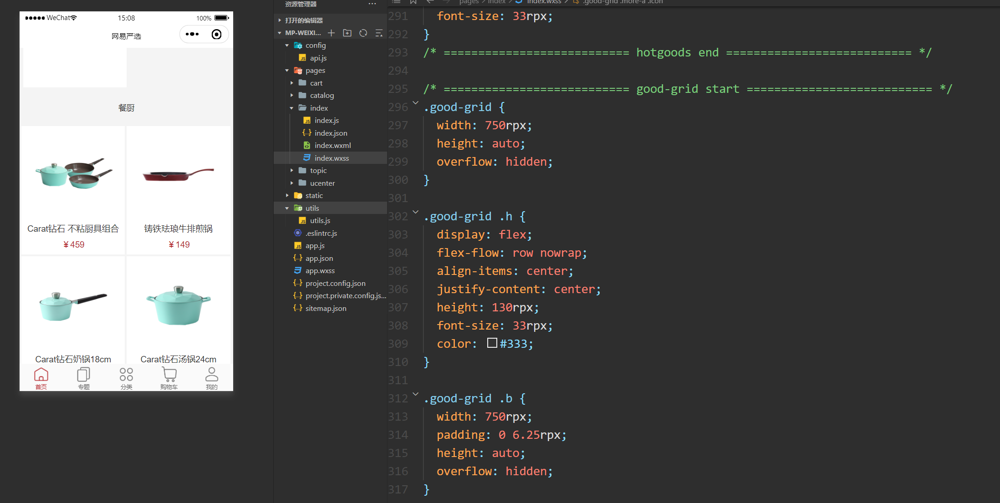

## 一，搭建项目环境


### 1，创建项目


### 2，配置window和tabbar

准备图片资源：


配置window:


```json
  "window": {
    "backgroundTextStyle": "dark",
    "navigationBarBackgroundColor": "#fff",
    "navigationBarTitleText": "网易严选",
    "navigationBarTextStyle": "black",
    "enablePullDownRefresh": true
  },
```


配置pages和tabbar：


pages：

```json
  "pages": [
    "pages/index/index",
    "pages/topic/topic",
    "pages/catalog/catalog",
    "pages/cart/cart",
    "pages/ucenter/index/index"
  ],
```

tabbar：

```json
 "tabBar": {
    "backgroundColor": "#fafafa",
    "borderStyle": "white",
    "selectedColor": "#b4282d",
    "color": "#666",
    "list": [
      {
        "pagePath": "pages/index/index",
        "iconPath": "static/images/ic_menu_choice_nor.png",
        "selectedIconPath": "static/images/ic_menu_choice_pressed.png",
        "text": "首页"
      },
      {
        "pagePath": "pages/topic/topic",
        "iconPath": "static/images/ic_menu_topic_nor.png",
        "selectedIconPath": "static/images/ic_menu_topic_pressed.png",
        "text": "专题"
      },
      {
        "pagePath": "pages/catalog/catalog",
        "iconPath": "static/images/ic_menu_sort_nor.png",
        "selectedIconPath": "static/images/ic_menu_sort_pressed.png",
        "text": "分类"
      },
      {
        "pagePath": "pages/cart/cart",
        "iconPath": "static/images/ic_menu_shoping_nor.png",
        "selectedIconPath": "static/images/ic_menu_shoping_pressed.png",
        "text": "购物车"
      },
      {
        "pagePath": "pages/ucenter/index/index",
        "iconPath": "static/images/ic_menu_me_nor.png",
        "selectedIconPath": "static/images/ic_menu_me_pressed.png",
        "text": "我的"
      }
    ]
  },
```


app.json的配置如下：

```json
{
  "pages": [
    "pages/index/index",
    "pages/topic/topic",
    "pages/catalog/catalog",
    "pages/cart/cart",
    "pages/ucenter/index/index"
  ],
  "window": {
    "backgroundTextStyle": "dark",
    "navigationBarBackgroundColor": "#fff",
    "navigationBarTitleText": "网易严选",
    "navigationBarTextStyle": "black",
    "enablePullDownRefresh": true
  },
  "tabBar": {
    "backgroundColor": "#fafafa",
    "borderStyle": "white",
    "selectedColor": "#b4282d",
    "color": "#666",
    "list": [
      {
        "pagePath": "pages/index/index",
        "iconPath": "static/images/ic_menu_choice_nor.png",
        "selectedIconPath": "static/images/ic_menu_choice_pressed.png",
        "text": "首页"
      },
      {
        "pagePath": "pages/topic/topic",
        "iconPath": "static/images/ic_menu_topic_nor.png",
        "selectedIconPath": "static/images/ic_menu_topic_pressed.png",
        "text": "专题"
      },
      {
        "pagePath": "pages/catalog/catalog",
        "iconPath": "static/images/ic_menu_sort_nor.png",
        "selectedIconPath": "static/images/ic_menu_sort_pressed.png",
        "text": "分类"
      },
      {
        "pagePath": "pages/cart/cart",
        "iconPath": "static/images/ic_menu_shoping_nor.png",
        "selectedIconPath": "static/images/ic_menu_shoping_pressed.png",
        "text": "购物车"
      },
      {
        "pagePath": "pages/ucenter/index/index",
        "iconPath": "static/images/ic_menu_me_nor.png",
        "selectedIconPath": "static/images/ic_menu_me_pressed.png",
        "text": "我的"
      }
    ]
  },
  "style": "v2",
  "sitemapLocation": "sitemap.json",
  "lazyCodeLoading": "requiredComponents"
}
```


### 3，封装ajax和API


参考代码：

```js
// 封装微信的的request
function request(url, data = {}, method = "POST", header = "application/x-www-form-urlencoded") {
  wx.showLoading({
      title: '加载中...',
  });
  return new Promise(function (resolve, reject) {
      wx.request({
          url: url,
          data: data,
          method: method,
          header: {
              'Content-Type': header,
              'token': wx.getStorageSync('token')
          },
          success: function (res) {
              wx.hideLoading();
              if (res.statusCode == 200) {
                  resolve(res.data);
              } else {
                  reject(res.errMsg);
              }

          },
          fail: function (err) {
              reject(err)
          }
      })
  });
}

module.exports = {
  request
}
```


封装API调用：


```js
const API_BASE_URL = 'http://localhost:8080/platform-framework/api/';

module.exports = {
  IndexUrlBanner: API_BASE_URL + 'index/banner', //首页banner
  IndexUrlBrand: API_BASE_URL + 'index/brand', //品牌制造商
  IndexUrlTopic: API_BASE_URL + 'index/topic', //专题精选
  IndexUrlNewGoods: API_BASE_URL + 'index/newGoods', //新品首发
  IndexUrlHotGoods: API_BASE_URL + 'index/hotGoods', //热卖商品
  IndexUrlChannel: API_BASE_URL + 'index/channel', //banner下的分类
  IndexUrlCategory: API_BASE_URL + 'index/category', //首页底部的分类及商品列表
}
```


### 4，渲染轮播图

说白了，开始写html+css+js+ajax。先渲染轮播图：


获取数据：


```js
const util = require('../../utils/utils.js');
const api = require('../../config/api.js');

Page({
  data:{
    banner: [],
  },
  onLoad(){
    this.getIndexData();
  },
  getIndexData(){
    util.request(api.IndexUrlBanner).then(res=>{
      console.log(res)
      if (res.errno === 0) {
        this.setData({
          banner:res.data.banner
        });
      }
    })
  }
})
```


查看数据：


渲染数据：


```html
<view class="container">
  <swiper class="banner" indicator-dots="true" autoplay="true" interval="3000" duration="1000">
    <swiper-item wx:for="{{banner}}" wx:key="id">
        <image src="{{item.imageUrl}}" background-size="cover"></image>
    </swiper-item>
  </swiper>
</view>
```


写样式：


```css
.banner {
  width: 750rpx;
  height: 417rpx;
}
.banner image {
  width: 100%;
  height: 417rpx;
}
```


设置全局样式：


```wxss
.container {
  box-sizing: border-box;
  background-color: #f4f4f4;
  font-family: PingFangSC-Light,helvetica,'Heiti SC';
} 

view,image,text,navigator{
  box-sizing: border-box;
  padding:0;
  margin:0;
}

view,text{
  font-family: PingFangSC-Light,helvetica,'Heiti SC';
  font-size: 29rpx;
  color: #333;
}

button::after {
  display: none;
}

.display-none {
  display: none !important;
}
::-webkit-scrollbar {
  width: 5px;
  background-color: #f5f5f5;
}

::-webkit-scrollbar-thumb {
  background-color: #999;
}
```


## 二，首页面

### 1，channel

目标：


定义数据和发ajax请求：


```js
util.request(api.IndexUrlChannel).then(res=> {
    if (res.errno === 0) {
        this.setData({
            channel: res.data.channel
        });
    }
});
```


查看数据：


渲染：


```html
 <view class="a-section a-topic" wx:if="{{channel.length > 0}}">
    <view class="m-menu">
      <navigator class="item" url="{{item.url}}" wx:for="{{channel}}" wx:key="id">
        <image src="{{item.iconUrl}}" background-size="cover"></image>
        <text>{{item.name}}</text>
      </navigator>
    </view>
  </view>
```


样式：


```css
.m-menu {
  display: flex;
  height: 181rpx;
  width: 750rpx;
  flex-flow: row nowrap;
  align-items: center;
  justify-content: space-between;
  background-color: #fff;
}

.m-menu .item {
  flex: 1;
  display: block;
  padding: 20rpx 0;
}

.m-menu image {
  display: block;
  width: 58rpx;
  height: 58rpx;
  margin: 0 auto;
  margin-bottom: 12rpx;
}

.m-menu text {
  display: block;
  font-size: 24rpx;
  text-align: center;
  margin: 0 auto;
  line-height: 1;
  color: #333;
}

.a-section {
  width: 750rpx;
  height: auto;
  overflow: hidden;
  background: #fff;
  color: #333;
  margin-top: 20rpx;
}
```


### 2，brand


目标：


定义数据和发ajax请求：


```js
    util.request(api.IndexUrlBrand).then(res=> {
      if (res.errno === 0) {
        this.setData({
          brand: res.data.brandList
        });
      }
    });
```


查看数据：


渲染：


```html
  <!-- brand -->
  <view class="a-section a-topic" wx:if="{{brand.length > 0}}">
    <view class="a-section a-brand">
      <view class="h">
        <navigator url="../brand/brand">
          <text class="txt">品牌制造商直供</text>
        </navigator>
      </view>
      <view class="b">
        <view class="item item-1" wx:for="{{brand}}" wx:key="id" wx:if="{{item.newPicUrl}}">
          <navigator url="/pages/brandDetail/brandDetail?id={{item.id}}">
            <view class="wrap">
              <image class="img" src="{{item.newPicUrl}}" mode="aspectFill"></image>
              <view class="mt">
                <text class="brand">{{item.name}}</text>
                <text class="price">{{item.floorPrice}}</text>
                <text class="unit">元起</text>
              </view>
            </view>
          </navigator>
        </view>
      </view>
    </view>
  </view>
```


样式：


```css
/* =========================== brand start =========================== */
.a-section .h {
  display: flex;
  flex-flow: row nowrap;
  align-items: center;
  justify-content: center;
  height: 130rpx;
}

.a-section .h .txt {
  padding-right: 30rpx;
  background-size: 16.656rpx 27rpx;
  display: inline-block;
  height: 36rpx;
  font-size: 33rpx;
  line-height: 36rpx;
}

.a-brand .b {
  width: 750rpx;
  height: auto;
  overflow: hidden;
  position: relative;
}

.a-brand .wrap {
  position: relative;
}

.a-brand .img {
  position: absolute;
  left: 0;
  top: 0;
}

.a-brand .mt {
  position: absolute;
  z-index: 2;
  padding: 27rpx 31rpx;
  left: 0;
  top: 0;
}

.a-brand .mt .brand {
  display: block;
  font-size: 33rpx;
  height: 43rpx;
  color: #333;
}

.a-brand .mt .price, .a-brand .mt .unit {
  font-size: 25rpx;
  color: #999;
}

.a-brand .item-1 {
  float: left;
  width: 375rpx;
  height: 252rpx;
  overflow: hidden;
  border-top: 1rpx solid #fff;
  margin-left: 1rpx;
}

.a-brand .item-1:nth-child(2n+1){
  margin-left: 0;
  width: 374rpx;
}

.a-brand .item-1 .img {
  width: 375rpx;
  height: 253rpx;
}

.a-topic .b {
  height: auto;
  width: 750rpx;
  padding: 0 0 48rpx 0;
}

.a-topic .b .list {
  height: 533rpx;
  width: 750rpx;
  white-space: nowrap;
}

.a-topic .b .item {
  display: inline-block;
  min-height: 400rpx;
  width: 680.5rpx;
  margin-left: 30rpx;
  overflow: hidden;
}

.a-topic .b .item:last-child {
  margin-right: 30rpx;
}

.a-topic .b .img {
  height: 400rpx;
  width: 680.5rpx;
}

.a-topic .b .np {
  height: 35rpx;
  margin-bottom: 13.5rpx;
  color: #333;
  font-size: 30rpx;
}

.a-topic .b .np .price {
  margin-left: 20.8rpx;
  color: #b4282d;
}

.a-topic .b .desc {
  display: block;
  height: 30rpx;
  color: #999;
  font-size: 24rpx;
  white-space: nowrap;
  overflow: hidden;
  text-overflow:ellipsis;
}

/* =========================== brand end =========================== */
```


### 3，topic


目标：


定义状态和发ajax请求：


```js
    util.request(api.IndexUrlTopic).then(res => {
      if (res.errno === 0) {
        this.setData({
          topics: res.data.topicList
        });
      }
    });
```


查看数据：


渲染数据：


```html
<!-- topic -->
  <view class="a-section a-topic" wx:if="{{topics.length > 0}}">
    <view class="h">
      <view>
        <navigator url="../topic/topic" open-type="switchTab">
          <text class="txt">专题精选</text>
        </navigator>
      </view>
    </view>
    <view class="b">
      <scroll-view scroll-x="true" class="list">
        <view class="item" wx:for="{{topics}}" wx:for-index="index" wx:for-item="item" wx:key="id">
          <navigator url="../topicDetail/topicDetail?id={{item.id}}">
            <image class="img" src="{{item.scenePicUrl}}" background-size="cover"></image>
            <view class="np">
              <text class="name">{{item.title}}</text>
              <text class="price">￥{{item.priceInfo}}元起</text>
            </view>
            <text class="desc">{{item.subtitle}}</text>
          </navigator>
        </view>
      </scroll-view>
    </view>
  </view>
```


样式：在brand模块已经把topic的样式写过了


### 4，new

目标：


定义状态和发ajax请求：


```js
    util.request(api.IndexUrlNewGoods).then(res => {
      if (res.errno === 0) {
        this.setData({
          newGoods: res.data.newGoodsList
        });
      }
    });
```


查看数据：


渲染数据：


```html
  <!-- new -->
  <view class="a-section a-new" wx:if="{{newGoods.length > 0}}">
    <view class="h">
      <view>
        <navigator url="../newGoods/newGoods">
          <text class="txt">周一周四 · 新品首发</text>
        </navigator>
      </view>
    </view>
    <view class="b">
      <view class="item" wx:for="{{newGoods}}" wx:for-index="index" wx:for-item="item" wx:key="id">
        <navigator url="../goods/goods?id={{item.id}}">
          <image class="img" src="{{item.listPicUrl}}" background-size="cover"></image>
          <text class="name">{{item.name}}</text>
          <text class="price">￥{{item.retailPrice}}</text>
        </navigator>
      </view>
    </view>
  </view>
```


样式：


```css
/* =========================== new start =========================== */

.a-new .b {
  width: 750rpx;
  height: auto;
  overflow: hidden;
  padding: 0 31rpx 45rpx 31rpx;
}

.a-new .b .item {
  float: left;
  width: 302rpx;
  margin-top: 10rpx;
  margin-left: 21rpx;
  margin-right: 21rpx;
}

.a-new .b .item-b {
  margin-left: 42rpx;
}

.a-new .b .img {
  width: 302rpx;
  height: 302rpx;
}

.a-new .b .name {
  text-align: center;
  display: block;
  width: 302rpx;
  height: 35rpx;
  margin-bottom: 14rpx;
  overflow: hidden;
  font-size: 30rpx;
  color: #333;
}

.a-new .b .price {
  display: block;
  text-align: center;
  line-height: 30rpx;
  font-size: 30rpx;
  color: #b4282d;
}

/* =========================== new end =========================== */
```

### 5，hotgoods

目标：


定义状态和发ajax请求：


```js
    util.request(api.IndexUrlHotGoods).then(res => {
      if (res.errno === 0) {
        this.setData({
          hotGoods: res.data.hotGoodsList
        });
      }
    });
```


查看数据：


渲染数据：


```html
  <!-- hotGoods -->
  <view class="a-section a-popular" wx:if="{{hotGoods.length > 0}}">
    <view class="h">
      <view>
        <navigator url="../hotGoods/hotGoods">
          <text class="txt">人气推荐</text>
        </navigator>
      </view>
    </view>
    <view class="b">
      <view class="item" wx:for="{{hotGoods}}" wx:for-index="index" wx:for-item="item" wx:key="id">
        <navigator url="/pages/goods/goods?id={{item.id}}">
          <image class="img" src="{{item.listPicUrl}}" background-size="cover"></image>
          <view class="right">
            <view class="text">
              <text class="name">{{item.name}}</text>
              <text class="desc">{{item.goodsBrief}}</text>
              <text class="price">￥{{item.retailPrice}}</text>
            </view>
          </view>
        </navigator>
      </view>
    </view>
  </view>
```


样式：


```css
/* =========================== hotgoods start =========================== */
.a-popular {
  width: 750rpx;
  height: auto;
  overflow: hidden;
}

.a-popular .b .item {
  border-top: 1px solid #d9d9d9;
  margin: 0 20rpx;
  height: 264rpx;
  width: 710rpx;
}

.a-popular .b .img {
  margin-top: 12rpx;
  margin-right: 12rpx;
  float: left;
  width: 240rpx;
  height: 240rpx;
}

.a-popular .b .right {
  float: left;
  height: 264rpx;
  width: 456rpx;
  display: flex;
  flex-flow: row nowrap;
}

.a-popular .b .text {
  display: flex;
  flex-wrap: nowrap;
  flex-direction: column;
  justify-content: center;
  overflow: hidden;
  height: 264rpx;
  width: 456rpx;
}

.a-popular .b .name {
  width: 456rpx;
  display: block;
  color: #333;
  line-height: 50rpx;
  font-size: 30rpx;
}

.a-popular .b .desc {
  width: 456rpx;
  display: block;
  color: #999;
  line-height: 50rpx;
  font-size: 25rpx;
}

.a-popular .b .price {
  width: 456rpx;
  display: block;
  color: #b4282d;
  line-height: 50rpx;
  font-size: 33rpx;
}
/* =========================== hotgoods end =========================== */
```

### 6， floorGoods

目标：


定义状态和发ajax请求：


```js
    util.request(api.IndexUrlCategory).then(res => {
      if (res.errno === 0) {
        this.setData({
          floorGoods: res.data.categoryList
        });
      }
    });
```


查看数据：


渲染数据：


```html
  <!-- good-grid -->
  <view class="good-grid" wx:for="{{floorGoods}}" wx:key="id">
    <view class="h">
      <view>
        <text>{{item.name}}</text>
      </view>
    </view>
    <view class="b">
      <block wx:for="{{item.goodsList}}" wx:for-index="iindex" wx:for-item="iitem" wx:key="id">
        <view class="item {{iindex % 2 == 0 ? '' : 'item-b'}}">
          <navigator url="../goods/goods?id={{iitem.id}}" class="a">
            <image class="img" src="{{iitem.listPicUrl}}" background-size="cover"></image>
            <text class="name">{{iitem.name}}</text>
            <text class="price">￥{{iitem.retailPrice}}</text>
          </navigator>
        </view>
      </block>
      <view class="item item-b item-more">
          <navigator url="/pages/category/category?id={{item.id}}" class="more-a">
            <view class="txt">{{'更多'+item.name+'好物'}}</view>
            <image class="icon" src="../../static/images/icon_go_more.png" background-size="cover"></image>
          </navigator>
      </view>
    </view>
  </view>
```


样式：



```css
/* =========================== good-grid start =========================== */
.good-grid {
  width: 750rpx;
  height: auto;
  overflow: hidden;
}

.good-grid .h {
  display: flex;
  flex-flow: row nowrap;
  align-items: center;
  justify-content: center;
  height: 130rpx;
  font-size: 33rpx;
  color: #333;
}

.good-grid .b {
  width: 750rpx;
  padding: 0 6.25rpx;
  height: auto;
  overflow: hidden;
}

.good-grid .b .item {
  float: left;
  background: #fff;
  width: 365rpx;
  margin-bottom: 6.25rpx;
  height: 452rpx;
  overflow: hidden;
  text-align: center;
}

.good-grid .b .item .a{
  height: 452rpx;
  width: 100%;
}

.good-grid .b .item-b {
  margin-left: 6.25rpx;
}

.good-grid .item .img {
  margin-top: 20rpx;
  width: 302rpx;
  height: 302rpx;
}

.good-grid .item .name {
  display: block;
  width: 365.625rpx;
  padding: 0 20rpx;
  overflow: hidden;
  height: 35rpx;
  margin: 11.5rpx 0 22rpx 0;
  text-align: center;
  font-size: 30rpx;
  color: #333;
}

.good-grid .item .price {
  display: block;
  width: 365.625rpx;
  height: 30rpx;
  text-align: center;
  font-size: 30rpx;
  color: #b4282d;
}

.good-grid .more-item{
  height: 100%;
  width: 100%;
}

.more-a{
  height: 100%;
  width: 100%;
  display: flex;
  flex-direction: column;
  align-items: center;
  justify-content: center;
}

.good-grid .more-a .txt{
  height: 33rpx;
  width: 100%;
  line-height: 33rpx;
  color: #333;
  font-size: 33rpx;
}

.good-grid .more-a .icon{
  margin: 60rpx auto 0 auto;
  width: 70rpx;
  height: 70rpx;
}
/* =========================== good-grid end =========================== */
```


### 7，实现静默登录


定义接口：


```js
Code: API_BASE_URL + 'auth/', //静默登录
```


在首页面中实现登录：


```js
    wx.login({
      success: (resp) => {
        util.request(api.Code + resp.code, {}, 'GET').then(function (res) {
          if (res.errno === 0) {
            //存储用户信息
            wx.setStorageSync('userInfo', res.data.userInfo);
            wx.setStorageSync('token', res.data.token);
            wx.setStorageSync('userId', res.data.userId);
          } else {
            // util.showErrorToast(res.errmsg)
            wx.showModal({
              title: '提示',
              content: res.errmsg,
              showCancel: false
            });
          }
        });
      },
    })
```


查看硬盘上的数据：


静默登录先说到这，后面还有其它的登录方式。


### 8，实现下拉刷新和分享


```js
  onShareAppMessage: function () {
    wx.showShareMenu({
      withShareTicket: true,
      menus: ['shareAppMessage', 'shareTimeline']
    })
    return {
      title: '第一个小程序项目666',
      desc: '网易严选微信小程序商城',
      path: '/pages/index/index'
    }
  },
  onShareTimeline: function () { //用户点击右上角分享朋友圈 
    return {
      title: '第一个小程序项目888',
      query: "id=110101&name=malu",
      imageUrl: '/static/images/logo.png'
    }
  },
  // 下拉刷新就是重新调用接口，获取新的数据
  onPullDownRefresh() {
    this.getIndexData();
  },
```


## 三，实现专题页（分页功能）


### 1，定义状态并获取数据

默认进入专题页面：


定义状态如下：


```js
    topicList: [],  // 专题页面数据
    page: 1,  // 默认获取第1页数据
    size: 10,  // 一页获取10条数据
    count: 0,    // 共有多少条数据（后端返回）
    scrollTop: 0,  // scroll-view中设置scroll-top滚动位置
    showPage: false  // 是否显示上一页和下一页按钮
```


封装API：


```js
  TopicList: API_BASE_URL + 'topic/list',  //专题列表
  TopicDetail: API_BASE_URL + 'topic/detail',  //专题详情    后面会用到
  TopicRelated: API_BASE_URL + 'topic/related',  //相关专题     后面会用到
```


获取数据：


```js
  getTopic() {
    this.setData({
      scrollTop: 0,
      showPage: false,
      topicList: []
    });
    // 页面渲染完成
    wx.showToast({
      title: '加载中...',
      icon: 'loading',
      duration: 2000
    });
    util.request(api.TopicList, { page: this.data.page, size: this.data.size }).then(res=>{
      if (res.errno === 0) {
        this.setData({
          scrollTop: 0,
          topicList: res.data.data,
          showPage: true,
          count: res.data.count
        });
      }
      wx.hideToast();
    });
  }
```


查看数据：


### 3，渲染数据


```html
<view class="container">
  <scroll-view class="topic-list" scroll-y="true" scroll-top="{{scrollTop}}">
    <navigator class="item" wx:for="{{topicList}}" wx:key="id" url="../topicDetail/topicDetail?id={{item.id}}">
      <image class="img" src="{{item.scenePicUrl}}"></image>
      <view class="info">
        <text class="title">{{item.title}}</text>
        <text class="desc">{{item.subtitle}}</text>
        <text class="price">{{item.priceInfo}}元起</text>
      </view>
    </navigator>
    <view class="page" wx:if="{{showPage}}">
      <view class="prev {{ page <= 1 ? 'disabled' : ''}}" bindtap="prevPage">上一页</view>
      <view class="next {{ (count / size) < page +1 ? 'disabled' : ''}}" bindtap="nextPage">下一页</view>
    </view>
  </scroll-view>
</view>
```


样式：


```css
page ,.container{
  width: 750rpx;
   height: 100%;
   overflow: hidden;
   background: #f4f4f4;
}
.topic-list{
   width: 750rpx;
   height: 100%;
   overflow: hidden;
   background: #f4f4f4;
}

.topic-list .item{
   width: 100%;
   height: 625rpx;
   overflow: hidden;
   background: #fff;
   margin-bottom: 20rpx;
}

.topic-list .img{
   width: 100%;
   height: 415rpx;
}

.topic-list .info{
   width: 100%;
   height: 210rpx;
   overflow: hidden;
}

.topic-list .title{
   display: block;
   text-align: center;
   width: 100%;
   height: 33rpx;
   line-height: 35rpx;
   color: #333;
   overflow: hidden;
   font-size: 35rpx;
   margin-top: 30rpx;
}

.topic-list .desc{
   display: block;
   text-align: center;
   position: relative;
   width: auto;
   height: 24rpx;
   line-height: 24rpx;
   overflow: hidden;
   color: #999;
   font-size: 24rpx;
   margin-top: 16rpx;
   margin-bottom: 30rpx;
}

.topic-list .price{
   display: block;
   text-align: center;
   width: 100%;
   height: 27rpx;
   line-height: 27rpx;
   overflow: hidden;
   color: #b4282d;
   font-size: 27rpx;
}


.page{
   width: 750rpx;
   height: 108rpx;
   background: #fff;
   margin-bottom: 20rpx;
}

.page view{
   height: 108rpx;
   width: 50%;
   float: left;
   font-size: 29rpx;
   color: #333;
   text-align: center;
   line-height: 108rpx;
}

.page .prev{
   border-right: 1px solid #D9D9D9;
}

.page .disabled{
   color: #ccc;
}
```


实现上一页和下一页：


```js
  nextPage() {
    if (this.data.page + 1 > this.data.count / this.data.size) {
      return true;
    }
    this.setData({
      page: parseInt(this.data.page) + 1
    });
    this.getTopic();
  },
  prevPage() {
    if (this.data.page <= 1) {
      return false;
    }
    this.setData({
      page: parseInt(this.data.page) - 1
    });
    this.getTopic();
  }
```


## 四，分类页面渲染

### 1，目标


### 2，定义状态并获取数据

封装API接口如下：


```js
Catalog: API_BASE_URL + 'catalog/',  //分类数据接口
CatalogList: API_BASE_URL + 'catalog/index',  //分类目录全部分类数据接口
CatalogCurrent: API_BASE_URL + 'catalog/current',  //分类目录当前分类数据接口

GoodsCount: API_BASE_URL + 'goods/count',  //统计商品总数
```


```js
var util = require('../../utils/utils.js');
var api = require('../../config/api.js');
Page({
  data: {
    navList: [],
    categoryList: [],
    currentCategory: {},
    goodsCount: 0,
  },
  onLoad(options) {
    this.getCatalog();
  },
  getCatalog(){
    wx.showLoading({
      title: '加载中...',
    });
    util.request(api.CatalogList).then(res=>{
      this.setData({
        navList: res.data.categoryList,
        currentCategory: res.data.currentCategory
      });
      wx.hideLoading();
    });
    util.request(api.GoodsCount).then(res=>{
      this.setData({
        goodsCount: res.data.goodsCount
      });
    });
  }
})
```


查看数据：


### 3，渲染数据

渲染数据：


```html
<view class="container">
  <view class="search">
    <navigator url="/pages/search/search" class="input">
      <image class="icon"></image>
      <text class="txt">商品搜索, 共{{goodsCount}}款好物</text>
    </navigator>
  </view>
  <view class="catalog">
    <scroll-view class="nav" scroll-y="true">
      <view class="item {{ currentCategory.id == item.id ? 'active' : ''}}" wx:for="{{navList}}" wx:key="id" data-id="{{item.id}}" data-index="{{index}}" bindtap="switchCate">{{item.name}}</view>
    </scroll-view>
    <scroll-view class="cate" scroll-y="true">
      <navigator url="url" class="banner">
        <image class="image" src="{{currentCategory.wapBannerUrl}}"></image>
        <view class="txt">{{currentCategory.frontName}}</view>
      </navigator>
      <view class="hd">
        <text class="line"></text>
        <text class="txt">{{currentCategory.name}}分类</text>
        <text class="line"></text>
      </view>
      <view class="bd">
        <navigator url="/pages/category/category?id={{item.id}}" class="item {{(index+1) % 3 == 0 ? 'last' : ''}}" wx:for="{{currentCategory.subCategoryList}}" wx:key="id">
          <image class="icon" src="{{item.wapBannerUrl}}"></image>
          <text class="txt">{{item.name}}</text>
        </navigator>
      </view>
    </scroll-view>
  </view>
</view>
```


样式：

```css
page {
  height: 100%;
}

.container {
  background: #f9f9f9;
  height: 100%;
  width: 100%;
  display: flex;
  flex-direction: column;
}

.search {
  height: 88rpx;
  width: 100%;
  padding: 0 30rpx;
  background: #fff;
  display: flex;
  align-items: center;
}

.search .input {
  width: 690rpx;
  height: 56rpx;
  background: #ededed;
  border-radius: 8rpx;
  display: flex;
  align-items: center;
  justify-content: center;
}

.search .icon {
  background: url(http://yanxuan.nosdn.127.net/hxm/yanxuan-wap/p/20161201/style/img/icon-normal/search2-2fb94833aa.png) center no-repeat;
  background-size: 100%;
  width: 28rpx;
  height: 28rpx;
}

.search .txt {
  height: 42rpx;
  line-height: 42rpx;
  color: #666;
  padding-left: 10rpx;
  font-size: 30rpx;
}

.catalog {
  flex: 1;
  width: 100%;
  background: #fff;
  display: flex;
  border-top: 1px solid #fafafa;
}

.catalog .nav {
  width: 162rpx;
  height: 100%;
}

.catalog .nav .item {
  text-align: center;
  line-height: 90rpx;
  width: 162rpx;
  height: 90rpx;
  color: #333;
  font-size: 28rpx;
  border-left: 6rpx solid #fff;
}

.catalog .nav .item.active {
  color: #ab2b2b;
  font-size: 36rpx;
  border-left: 6rpx solid #ab2b2b;
}

.catalog .cate {
  border-left: 1px solid #fafafa;
  flex: 1;
  height: 100%;
  padding: 0 30rpx 0 30rpx;
}

.banner {
  display: block;
  height: 222rpx;
  width: 100%;
  position: relative;
}

.banner .image {
  position: absolute;
  top: 30rpx;
  left: 0;
  border-radius: 4rpx;
  height: 192rpx;
  width: 100%;
}

.banner .txt {
  position: absolute;
  top: 30rpx;
  text-align: center;
  color: #fff;
  font-size: 28rpx;
  left: 0;
  height: 192rpx;
  line-height: 192rpx;
  width: 100%;
}

.catalog .hd {
  height: 108rpx;
  width: 100%;
  display: flex;
  justify-content: center;
  align-items: center;
}

.catalog .hd .txt {
  font-size: 24rpx;
  text-align: center;
  color: #333;
  padding: 0 10rpx;
  width: auto;
}

.catalog .hd .line {
  width: 40rpx;
  height: 1px;
  background: #d9d9d9;
}

.catalog .bd {
  height: auto;
  width: 100%;
  overflow: hidden;
}

.catalog .bd .item {
  display: block;
  float: left;
  height: 216rpx;
  width: 144rpx;
  margin-right: 34rpx;
}

.catalog .bd .item.last {
  margin-right: 0;
}

.catalog .bd .item .icon {
  height: 144rpx;
  width: 144rpx;
}

.catalog .bd .item .txt {
  display: block;
  text-align: center;
  font-size: 24rpx;
  color: #333;
  height: 72rpx;
  width: 144rpx;
}
```


实现如下：


