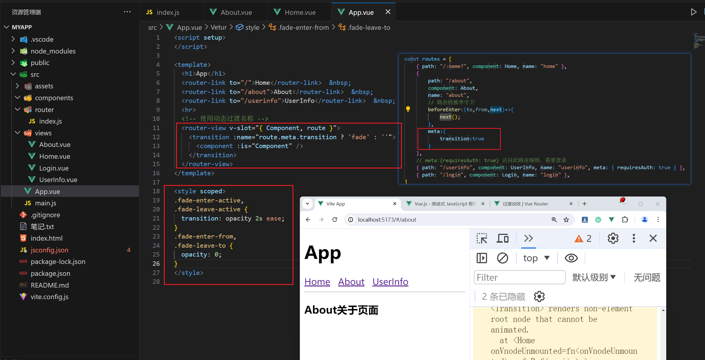

### 1，Vue路由


**路由相关概念：**

- Vue Router 是 Vue.js 的官方路由。它与 Vue.js 核心深度集成，让用 Vue.js 构建单页应用变得轻而易举。
- 单页面应用也称为SPA(Single Page Application)，它主要是网页的界面渲染在一个静态的页面上，当用户要从当前界面跳到另一个界面的时候，在这个过程中，不需要重新加载整个页面，所以页面之间的切换十分快速
- 多页面在进行页面切换时十分缓慢，在路由进行跳转的时候会加载所有的资源，而且页面重复代码多。
- 对比之下，单页面原理是JavaScript动态修改内容而已，资源只需要局部的刷新，因此SPA具有极高的流畅度，有利于提升用户体验。


单页面VS多页面：

|          | 单页面(SPA)                     | 多页面(MPA)                |
| -------- | ------------------------------- | -------------------------- |
| 组成     | 外壳页面和多个页面片段          | 多个完整页面构成           |
| 资源共用 | 共用、只需在外壳部分加载        | 不共用，每个页面都需要加载 |
| 刷新方式 | 页面局部刷新或更改              | 整页刷新                   |
| URL模式  | a.com/#/one 或者 a.com/one      | a.com/one.html             |
| 用户体验 | 页面切换快，体验好              | 页面切换慢，体验差         |
| 数据传递 | 容易(路由或者组件之间传递)      | 依赖URL传参、本地存储传参  |
| SEO      | 不利于SEO（后续有其他解决方案） | 利于SEO                    |
| 维护成本 | 相对容易                        | 相对复杂                   |


**路由作用**

- 页面与页面之前的切换，是通过不同的地址访问的，地址对应着要显示的组件。而实现这个页面切换显示的功能就是路由的作用


### 2，项目中引入路由

用 Vue + Vue Router 创建单页应用非常简单：通过 Vue.js，我们已经用组件组成了我们的应用。当加入 Vue Router 时，我们需要做的就是将我们的组件映射到路由上，让 Vue Router 知道在哪里渲染它们


安装：

```
npm install vue-router@4 --save
```


实现路由功能（main.js）：

```js
import { createApp } from 'vue'
import App from './App.vue'
import { createRouter,createWebHashHistory } from "vue-router"
import Home from "./pages/Home.vue"
import About from "./pages/About.vue"
const routes = [
   {
    path:"/",
    component:Home
   },
   {
    path:"/about",
    component:About
   }
]
const router = createRouter({
  // 路由地址访问方式 #  /
  // 内部提供了 history 模式的实现。为了简单起见，我们在这里使用 hash 模式
  history: createWebHashHistory(),
  routes
})
const app = createApp(App)
app.use(router)
app.mount('#app')
```


Home组件：

```vue
<template>
  <h3>Home首页</h3>
</template>
```


About组件：

```vue
<template>
  <h3>About关于页面</h3>
</template>
```


App组件：

```vue
<template>
  <!-- 路由匹配到的组件将渲染在这里 -->
  <router-link to="/">Home</router-link>
  <router-link to="/about">About</router-link>
  <router-view></router-view>
</template>
```


`router-view`

- `router-view` 将显示与 url 对应的组件。你可以把它放在任何地方，以适应你的布局


`router-link`

- 请注意，我们没有使用常规的 `a` 标签，而是使用一个自定义组件 `router-link` 来创建链接。这使得 Vue Router 可以在不重新加载页面的情况下更改 URL，处理 URL 的生成以及编码


操作：


### 3，编程式导航


除了使用 `<router-link>` 创建 a 标签来定义导航链接，我们还可以借助 router 的实例方法，通过编写代码来实现。在 Vue 实例中，你可以通过 `$router` 访问路由实例。因此你可以调用 `this.$router.push`。


选项式API：

```vue
<template>
  <h3>Home首页</h3>
  <button @click="clickHandler">跳转到About页面</button>
</template>
<script>
export default {
  methods:{
    clickHandler(){
      this.$router.push("/about")
     }
   }
}
</script>
```


组合式API：

```vue
<template>
  <h3>About关于页面</h3>
  <button @click="clickHandler">跳转到首页</button>
</template>
<script setup>
import { useRouter } from 'vue-router'
const router = useRouter()
function clickHandler(){
  router.push("/")
}
</script>
```


### 4，带参数的动态路由匹配

很多时候，我们需要将给定匹配模式的路由映射到同一个组件。例如，我们可能有一个 `User` 组件，它应该对所有用户进行渲染，但用户 ID 不同。在 Vue Router 中，我们可以在路径中使用一个动态字段来实现，我们称之为 *路径参数*


router/index.js


```js
import {createRouter,createWebHashHistory} from "vue-router"

import Home from "../views/Home.vue"
import About from "../views/About.vue"
import List from "../views/List.vue"
import Details from "../views/Details.vue"

const routes = [
    {path:"/",component:Home,name:"home"},
    {path:"/about",component:About,name:"about"},
    {path:"/list",component:List,name:"list"},
    // /details/325235  /details/653467
    {path:"/details/:name",component:Details,name:"details"},
]
const router = createRouter({
    // hash模式
    history:createWebHashHistory(),
    routes
})

export default router;
```


List.vue：


```vue
<template>
  <h3>列表</h3>
  <ul>
    <li v-for="(item,index) in user.names" :key="index">
      <router-link :to="'/details/' + item">{{ item }}</router-link>
    </li>
  </ul>
</template>
<script setup>
import { reactive } from "vue"
const user = reactive({
  names:["ityls","malu","wc"]
})
</script>
```


选项式API:


```vue
<template>
  <h3>详情</h3>
  <p>{{ name }}</p>
</template>
<script>
export default {
  data(){
    return{
      name:""
     }
   },
  mounted(){
    this.name = this.$route.params.name
   }
}
</script>
```


组合式API：


```vue
<template>
  <h3>详情</h3>
  <p>{{ name }}</p>
</template>
<script setup>
import { useRoute  } from "vue-router"
import { ref } from "vue"
const route = useRoute()
const name = ref("")
name.value = route.params.name;
</script>
```


可选参数：


```js
{
  path:"/details/:name?",
  component:Details
}
```


### 5，嵌套路由

一些应用程序的 UI 由多层嵌套的组件组成。在这种情况下，URL 的片段通常对应于特定的嵌套组件结构。


```vue
<template>
  <h3>新闻</h3>
  <router-link to="/news/sport">Sport</router-link> | 
  <router-link to="/news/yule">Yule</router-link>
  <router-view></router-view>
</template>
```


```vue
<template>
  <h3>体育新闻</h3>
</template>
```


```vue
<template>
  <h3>娱乐新闻</h3>
</template>
```


```js
import {createRouter,createWebHashHistory} from "vue-router"

import Home from "../views/Home.vue"
import About from "../views/About.vue"
import List from "../views/List.vue"
import Details from "../views/Details.vue"
import News from "../views/News.vue"
import SportNews from "../views/news-details/SportNews.vue"
import YuleNews from "../views/news-details/YuleNews.vue"

const routes = [
    {path:"/",component:Home,name:"home"},
    {path:"/about",component:About,name:"about"},
    {path:"/list",component:List,name:"list"},
    // /details/325235  /details/653467
    {path:"/details/:name?",component:Details,name:"details"},
    { 
        path:"/news",
        component:News,
        name:"news",
        children:[
            {path:"sport",component:SportNews}, 
            {path:"yule",component:YuleNews}, 
        ]
    },
]
const router = createRouter({
    // hash模式
    history:createWebHashHistory(),
    routes
})

export default router;
```


### 6，重定向和别名

重定向也是通过 `routes` 配置来完成

```js
{
  path:"/news",
    component:News,
      redirect:"/news/sport",
        children:[
           {
            path:"sport",
            component:SportNews
           },
           {
            path:"yule",
            component:YuleNews
           }
         ]
}
```


别名：重定向是指当用户访问 `/home` 时，URL 会被 `/` 替换，然后匹配成 `/`。那么什么是别名呢

```js
{
  alias:"yl",
  path:"yule",
  component:YuleNews
}
```


操作：


### 7，命名路由

除了 `path` 之外，你还可以为任何路由提供 `name`。这有以下优点

- 没有硬编码的 URL
- `params` 的自动编码/解码
- 防止你在 url 中出现打字错误


```js
{
  name:"About",
  path:"/about",
  component:About
}
```


```js
this.$router.push({
    name:"About"
})
```


```html
<router-link :to="{ name:'Details',params:{ name:item } }">{{ item }}</router-link>
```


### 8，命名视图

有时候想同时 (同级) 展示多个视图，而不是嵌套展示，例如创建一个布局，有 `sidebar` (侧导航) 和 `main` (主内容) 两个视图，这个时候命名视图就派上用场了。你可以在界面中拥有多个单独命名的视图，而不是只有一个单独的出口。如果 `router-view` 没有设置名字，那么默认为 `default`


```js
const routes = [
   {
     name:"Home",
     path:"/",
     components:{
       default:Home,
       // 它们与 `<router-view>` 上的 `name` 属性匹配
       AD
     }
   },
   {
     name:"About",
     path:"/about",
     components:{
       default:About,
       AD
     }
   }
]
```


```vue
<template>
  <router-link to="/">Home</router-link> | 
  <router-link to="/about">About</router-link>
  <router-view></router-view>
  <router-view name="AD"></router-view>
</template>
```


### 9，不同的路由模型

在创建路由器实例时，`history` 配置允许我们在不同的历史模式中进行选择


**Hash 模式:**

hash 模式是用 `createWebHashHistory()` 创建的

```js
import { createRouter, createWebHashHistory } from 'vue-router'

const router = createRouter({
 history: createWebHashHistory(),
 routes: [
  //...
  ],
})
```


**HTML5 模式:**

用 `createWebHistory()` 创建 HTML5 模式，推荐使用这个模式

```js
import { createRouter, createWebHistory } from 'vue-router'


const router = createRouter({
 history: createWebHistory(),
 routes: [
  //...
  ],
})
```


当使用这种历史模式时，URL 会看起来很 "正常"，例如 `https://example.com/user/id`。漂亮!

不过，问题来了。由于我们的应用是一个单页的客户端应用，如果没有适当的服务器配置，用户在浏览器中直接访问 `https://example.com/user/id`，就会得到一个 404 错误。这就丑了。

不用担心：要解决这个问题，你需要做的就是在你的服务器上添加一个简单的回退路由。如果 URL 不匹配任何静态资源，它应提供与你的应用程序中的 `index.html` 相同的页面。漂亮依旧!

解决方案：

<https://router.vuejs.org/zh/guide/essentials/history-mode.html#html5-%E6%A8%A1%E5%BC%8F>


### 10，导航守卫

正如其名，vue-router 提供的导航守卫主要用来通过跳转或取消的方式守卫导航。这里有很多方式植入路由导航中：全局的，单个路由独享的，或者组件级的


创建对应的组件：


**全局前置守卫：**

你可以使用 `router.beforeEach` 注册一个全局前置守卫,当一个导航触发时，就会触发全局前置守卫

```js
router.beforeEach((to, from, next) => {
  // 返回 false 以取消导航
  next()
})
```


**全局解析守卫:**

你可以用 `router.beforeResolve` 注册一个全局守卫。这和 `router.beforeEach` 类似

```
router.beforeResolve((to,from,next) => {
  next()
})
```


**全局后置钩子:**

你可以直接在路由配置上定义 `beforeEnter` 守卫,在导航结束之后触发

```js
router.afterEach((to,from) => {
  
})
```


**路由独享的守卫:**

你可以直接在路由配置上定义 `beforeEnter` 守卫,`beforeEnter` 守卫 **只在进入路由时触发**

```js
{
  name: "List",
  path: "/list",
  component: List,
    beforeEnter:(to,from) => {
      return true;
       }
}
```


**组件内的守卫:**

你可以在路由组件内直接定义路由导航守卫

- `beforeRouteEnter`
- `beforeRouteUpdate`
- `beforeRouteLeave`

```vue
<template>
  <h3>Home首页</h3>
</template>
<script>


export default {
  beforeRouteEnter(to, from){
    // 在渲染该组件的对应路由被验证前调用
    // 不能获取组件实例 `this` ！
    // 因为当守卫执行时，组件实例还没被创建！
    console.log(to,from)
   },
  beforeRouteUpdate(to,from){
    // 在当前路由改变，但是该组件被复用时调用
    // 举例来说，对于一个带有动态参数的路径 `/users/:id`，在 `/users/1` 和 `/users/2` 之间跳转的时候，
    // 由于会渲染同样的 `UserDetails` 组件，因此组件实例会被复用。而这个钩子就会在这个情况下被调用。
    // 因为在这种情况发生的时候，组件已经挂载好了，导航守卫可以访问组件实例 `this`
   },
  beforeRouteLeave(to,from){
    // 在导航离开渲染该组件的对应路由时调用
    // 与 `beforeRouteUpdate` 一样，它可以访问组件实例 `this`
   }
}
</script>

```


```vue
<template>
    <h3>About关于页面</h3>
</template>

<script setup>

// 在组合式API中，没有beforeRouterEnter
import { onBeforeRouteUpdate,onBeforeRouteLeave } from "vue-router"
onBeforeRouteUpdate(() =>{
  console.log("更新");
})
onBeforeRouteLeave(() =>{
  console.log("离开");
})

</script>
```

```vue
<template>
    <h3>Home首页</h3>
    <p>{{ name }}</p>
    <button @click="clickHandler">修改参数</button>
</template>
<script>
export default {
  data() {
    return {
      name: ""
    }
  },
  // 进入触发
  beforeRouteEnter(to, from) {
    console.log("进入页面");
  },
  // 页面URL发送变化的时候触发
  beforeRouteUpdate(to, from) {
    console.log("页面更新");
    this.name = to.params.name
  },
  // 离开触发
  beforeRouteLeave(to, from) {
    console.log("离开组件");
  },
  mounted(){
    this.name = this.$route.params.name
  },
  methods:{
    clickHandler(){
        this.$router.push({
            name:"home",
            params:{
                name:"ityls"
            }
        })
    }
  }
}
</script>
```


效果：


**完整的导航解析流程:**

1. 导航被触发。
2. 在失活的组件里调用 `beforeRouteLeave` 守卫。
3. 调用全局的 `beforeEach` 守卫。
4. 在重用的组件里调用 `beforeRouteUpdate` 守卫(2.2+)。
5. 在路由配置里调用 `beforeEnter`。
6. 解析异步路由组件。
7. 在被激活的组件里调用 `beforeRouteEnter`。
8. 调用全局的 `beforeResolve` 守卫(2.5+)。
9. 导航被确认。
10. 调用全局的 `afterEach` 钩子。
11. 触发 DOM 更新。
12. 调用 `beforeRouteEnter` 守卫中传给 `next` 的回调函数，创建好的组件实例会作为回调函数的参数传入


### 11，路由元信息


有时，你可能希望将任意信息附加到路由上，如过渡名称、谁可以访问路由等，这些事情可以通过接收属性对象的`meta`属性来实现。定义路由的时候你可以配置 `meta` 字段,这个`meta`就是路由元信息，**利用meta配合导航守卫完成判断用户是否登录在允许打开用户中心页面**

```js
import { createRouter, createWebHashHistory } from "vue-router"

import Home from "../views/Home.vue"
import About from "../views/About.vue"
import UserInfo from "../views/UserInfo.vue"
import Login from "../views/Login.vue"

const routes = [
    { path: "/:name?", component: Home, name: "home" },
    {
        path: "/about", 
        component: About, 
        name: "about",
        // 路由的独享守卫
        beforeEnter:(to,from,next)=>{
            next();
        }
    },
    // meta:{requiresAuth: true} 访问此路由规则，需要登录
    { path: "/userinfo", component: UserInfo, name: "userinfo", meta: { requiresAuth: true } },
    { path: "/login", component: Login, name: "login" },
]
const router = createRouter({
    history: createWebHashHistory(),
    routes
})

// 全局的前置守卫
router.beforeEach((to, from, next) => {
    // 返回 false 以取消导航
    // next()
    let token = false;
    // console.log('to:',to);
    if (to.meta.requiresAuth) {
        if (token) {
            // 验证用户是否已经登录
            next();
        } else {
            next({
                path: "/login"
            })
        }
    }else{
        next();
    }
})

// 全局的解析守卫
// router.beforeResolve((to,from,next) => {
//     // next()
// })

// 全局的后置守卫
// router.afterEach((to,from) => {
  
// })

export default router;
```


### 12，过渡动效

想要在你的路径组件上使用转场，并对导航进行动画处理，你需要使用 `v-slot` API 和 `Transition` API

```vue
<template>
 <RouterLink to="/">Home</RouterLink> | 
 <RouterLink to="/about">About</RouterLink> |
 <RouterLink to="/userinfo">用户中心</RouterLink>
 <router-view v-slot="{ Component }">
  <Transition name="fade" >
   <component :is="Component"></component>
  </Transition>
 </router-view>
</template>

<script setup>
import { RouterLink, RouterView} from 'vue-router'
</script>

<style scoped>
.fade-enter-active,
.fade-leave-active {
 transition: opacity 0.5s ease;
}

.fade-enter-from,
.fade-leave-to {
 opacity: 0;
}
</style>
```


```vue
<router-view v-slot="{ Component,route }">
  <Transition :name="route.meta.transition ? 'fade' : ''" >
    <component :is="Component"></component>
  </Transition>
</router-view>
```


```js
{
   path: '/about',
   name: 'about',
   component: () => import('../views/AboutView.vue'),
   meta:{
    transition:true
    }
}
```


操作：



### 13，滚动行为

使用前端路由，当切换到新路由时，想要页面滚到顶部，或者是保持原先的滚动位置，就像重新加载页面那样。 vue-router 能做到，而且更好，它让你可以自定义路由切换时页面如何滚动。


```js
const router = createRouter({
 history: createWebHistory(import.meta.env.BASE_URL),
 routes: [
   {
   path: '/',
   name: 'home',
   component: HomeView
   }
  ],
 scrollBehavior (to, from, savedPosition) {
  if (savedPosition) {
   return savedPosition
   } else {
   return { top: 0 }
   }
  }
})
```


延迟滚动：

```js
scrollBehavior (to, from, savedPosition) {
  return new Promise((resolve, reject) => {
    setTimeout(() => {
      resolve({ left: 0, top: 400 })
     }, 500)
   })
}
```


### 14，路由懒加载

当打包构建应用时，JavaScript 包会变得非常大，影响页面加载。如果我们能把不同路由对应的组件分割成不同的代码块，然后当路由被访问的时候才加载对应组件，这样就会更加高效

```js
// 将
// import LoginView from "../views/LoginView.vue"
// 替换成
const LoginView = () => import("../views/LoginView.vue")
```


或者：

```js
{
  path: '/login',
  name: 'login',
  component: () => import("../views/LoginView.vue")
}
```


### 15，动态路由

对路由的添加通常是通过 `routes` 选项来完成的，但是在某些情况下，你可能想在应用程序已经运行的时候添加或删除路由


**添加路由：**用 `router.addRoute()`新增加路由配置

```js
router.addRoute({
 path:"/news",
 name:"News",
 component:News
})
```


**添加多个路由：**

```js
const currentRouter = [
  {
  path:"/news",
  name:"News",
  component:News
  },
  {
  path: '/about',
  name: 'about',
  component:About
  }
]


for(let i = 0;i<currentRouter.length;i++){
 router.addRoute(currentRouter[i])
}
```


**删除路由：**通过路由名字进行删除

```js
router.removeRoute("about")
```


**添加嵌套路由:**

要将嵌套路由添加到现有的路由中，可以将路由的 *name* 作为第一个参数

```js
router.addRoute("News",{
 path:"yule",
 component:Yule
})
```


### 16，路由高亮


在实现导航的时候，我们需要给导航添加高亮


**active-class:**链接激活时，应用于渲染的 `<a>` 的 class

```html
<RouterLink active-class="active" to="/">Home</RouterLink> | 
<RouterLink active-class="active" to="/about">About</RouterLink>
```


**linkActiveClass:**全局配置

```js
const router = createRouter({
  linkActiveClass:"active"
})
```


**exact-active-class:**链接精准激活时，应用于渲染的 `<a>` 的 class

```js
<RouterLink exact-active-class="active" to="/">Home</RouterLink> | 
<RouterLink exact-active-class="active" to="/about">About</RouterLink>
```


**linkExactActiveClass:**全局配置

```
const router = createRouter({
  linkExactActiveClass:"active"
})
```

