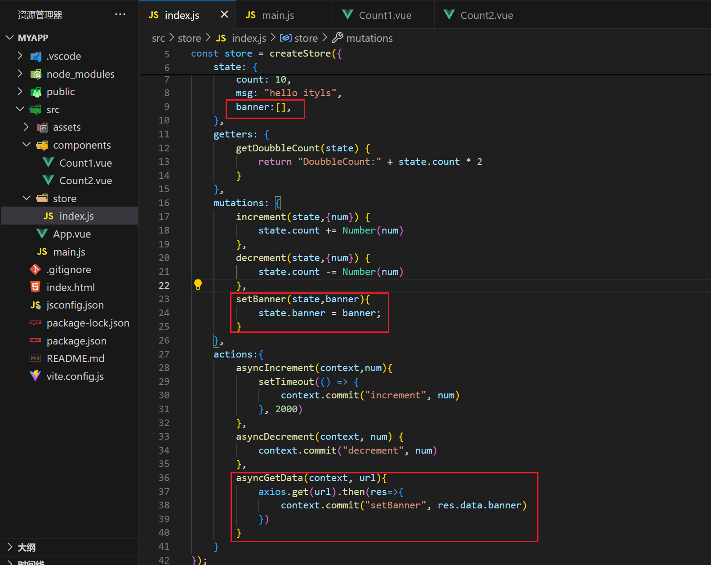
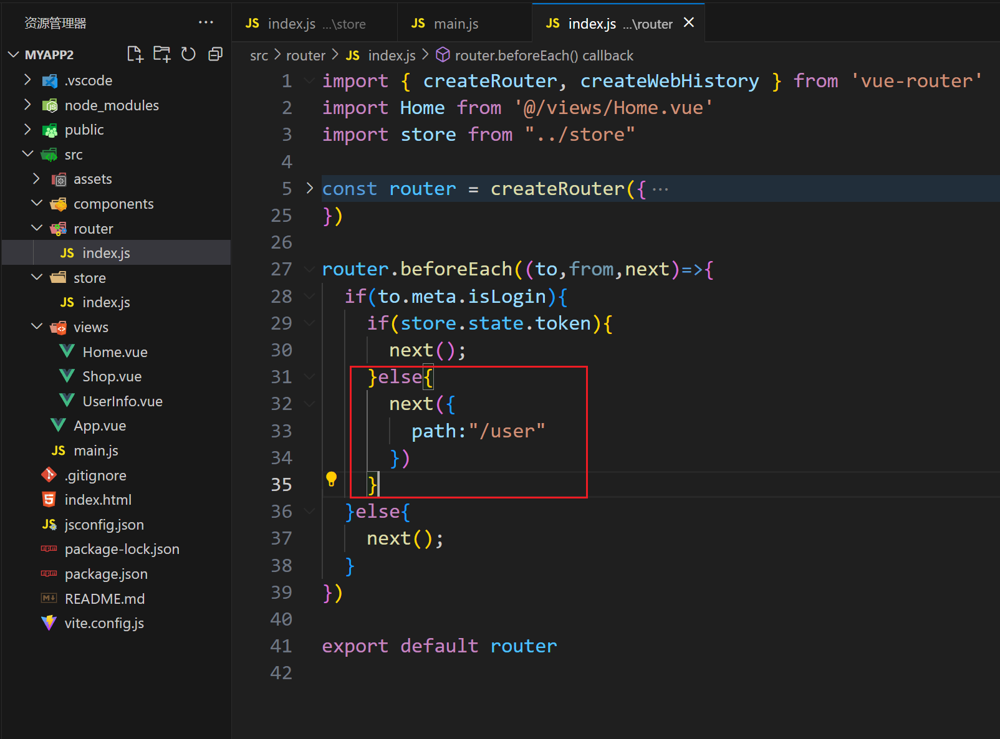
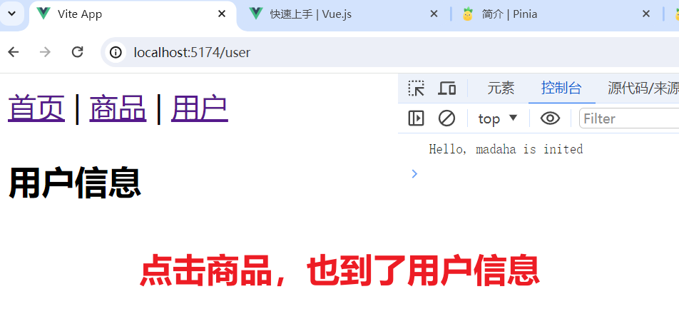

### 1，Vuex是什么


Vuex 是一个专为 Vue.js 应用程序开发的**状态管理模式 + 库**。它采用集中式存储管理应用的所有组件的状态，并以相应的规则保证状态以一种可预测的方式发生变化。


说白了：Vuex可以帮我们管理全局的属性，并且是是响应式的，状态的变化是可以跟踪的。


什么是“状态管理模式”？


```vue
<template>
    <h3>Count1:{{ count }}</h3>
    <button @click="clickHandler">增加</button>
</template>

<script>
export default {
    data() {
        return {
            count: 0,
        }
    },
    methods: {
        clickHandler() {
            this.count++
        }
    },
}
</script>
```


```vue
<template>
    <h3>Count2:{{ count }}</h3>
    <button @click="addHandler">增加</button>
  </template>
  <script setup>
  import { ref } from "vue"
  
  const count = ref(0)
  
  function addHandler(){
    count.value ++
      
  }
</script>
```


这个状态自管理应用包含以下几个部分

- **状态**，驱动应用的数据源；
- **视图**，以声明方式将**状态**映射到视图；
- **操作**，响应在**视图**上的用户输入导致的状态变化

以下是一个表示“单向数据流”理念的简单示意


但是，当我们的应用遇到**多个组件共享状态**时，单向数据流的简洁性很容易被破坏

- 多个视图依赖于同一状态。
- 来自不同视图的行为需要变更同一状态

问题一，传参的方法对于多层嵌套的组件将会非常繁琐，并且对于兄弟组件间的状态传递无能为力。<br/>

问题二，我们经常会采用父子组件直接引用或者通过事件来变更和同步状态的多份拷贝。以上的这些模式非常脆弱，通常会导致无法维护的代码 <br/>

因此，我们为什么不把组件的共享状态抽取出来，以一个全局单例模式管理呢？在这种模式下，我们的组件树构成了一个巨大的“视图”，不管在树的哪个位置，任何组件都能获取状态或者触发行为！


**什么情况下我应该使用 Vuex？**

- Vuex 可以帮助我们管理共享状态，并附带了更多的概念和框架。这需要对短期和长期效益进行权衡
- 如果您不打算开发大型单页应用，使用 Vuex 可能是繁琐冗余的。确实是如此——如果您的应用够简单，您最好不要使用 Vuex。一个简单的 store 模式就足够您所需了。但是，如果您需要构建一个中大型单页应用，您很可能会考虑如何更好地在组件外部管理状态，Vuex 将会成为自然而然的选择。引用 Redux 的作者 Dan Abramov 的话说就是：**您自会知道什么时候需要它**。


### 2，全局属性管理

一个用于注册能够被应用内所有组件实例访问到的全局属性的对象


```js
import { createApp } from 'vue'
import App from './App.vue'

const app = createApp(App)

// 全局属性，建议以$打头，所有组件共享
app.config.globalProperties.$ityls = 666;

app.mount('#app')
```


组件：


```vue
<template>
    <h3>Count2:{{ count }}</h3>
    <button @click="addHandler">增加</button>
    <hr>
    <h3>{{ proxy.$ityls }}</h3>
    <button @click="fn">修改Num</button>
  </template>
  <script setup>
  import { ref,getCurrentInstance } from "vue"
  
  const count = ref(0)
  
  const {proxy} = getCurrentInstance();

  function addHandler(){
    count.value ++
  }

  function fn(){
    proxy.$ityls++;  // 改变全局属性
    console.log('proxy.$ityls:',proxy.$ityls);
  }
</script>
```


在组合式API中使用全局属性：


```vue
<template>
    <h3>Count1:{{ count }}</h3>
    <button @click="clickHandler">增加</button>
    <hr>
    <p>Num:{{ num }}</p>
    <p>$ityls:{{ $ityls }}</p>
    <button @click="fn">修改num</button>
</template>

<script>
export default {
    data() {
        return {
            count: 0,
            num:0
        }
    },
    methods: {
        clickHandler() {
            this.count++
        },
        fn(){
            // this.num++;
            this.$ityls++
        }
    },
    mounted(){
        console.log('this.$ityls:',this.$ityls);
        this.num = this.$ityls;
    }
}
</script>
```


Vuex 和单纯的全局属性有以下不同:

- 全局对象可以更方便的在任意组件读取数据，但是无法达到响应式

- Vuex 的状态存储是响应式的。当 Vue 组件从 store 中读取状态的时候，若 store 中的状态发生变化，那么相应的组件也会相应地得到高效更新


修改全局属性：

```vue
<template>
  <p>{{ proxy.$num }}</p>
  <button @click="updateHandler">修改数据</button>
</template>
<script setup>
import { getCurrentInstance } from "vue"
const { proxy } = getCurrentInstance()
function updateHandler(){
  console.log(proxy.$num);
  proxy.$num++
}
</script>
```


### 3，项目中引入Vuex

安装：

```
npm install vuex@next --save
```


创建Vuex，可以直接在main.js中创建仓库，如下：

```js
import { createApp } from 'vue'
import App from './App.vue'
import { createStore } from 'vuex'
const app = createApp(App)
const store = createStore({
  state:{
    count:10
   }
})
app.use(store)
app.mount('#app')
```


创建一个store文件夹，在store文件夹下创建一个index.js文件：


```js
import { createStore } from 'vuex'

const store = createStore({
    state:{
        count:10
    }
});

export default store;
```


在main.js中引入之，挂载到应用上，如下：


```js
import { createApp } from 'vue'
import App from './App.vue'
import store from './store';

const app = createApp(App)

// 全局属性，建议以$打头，所有组件共享
app.config.globalProperties.$ityls = 666;

app.use(store);

app.mount('#app')
```


组件使用：


```vue
<template>
    <h3>Count1组件</h3>
    <p>{{ $store.state.count }}</p>
</template>

<script>
export default {
    data() {
        return {
        }
    },
    methods: {
    },
    mounted(){
        console.log(this.$store.state.count);
    }
}
</script>
```


```vue
<template>
  <h3>Count2组件</h3>
  <p>{{ $store.state.count }}</p>
</template>
<script setup>
import { ref, getCurrentInstance } from "vue"
import { useStore } from "vuex"
const store = useStore();

console.log(store.state.count);

</script>
```


### 4，核心概念State

Vuex 使用**单一状态树**，用一个对象就包含了全部的应用层级状态。至此它便作为一个“唯一数据源 ”而存在。这也意味着，每个应用将仅仅包含一个 store 实例


在组件中使用Vuex中的状态：

```js
import { createStore } from 'vuex'
const store = createStore({
  state:{
    count:10
   }
})
export default store
```


选项式API：

```vue
<template>
  <h3>Nums</h3>
  <p>{{ $store.state.count }}</p>
  <p>{{ count }}</p>
</template>
<script>
export default {
  computed:{
    count(){
      return this.$store.state.count
     }
   }
}
</script>
```


组合式API:

```vue
<template>
  <h3>Count</h3>
  <p>{{ $store.state.count }}</p>
  <p>{{ count }}</p>
</template>
<script setup>
import { computed } from 'vue'
import { useStore } from 'vuex'
const store = useStore()
const count = computed(() =>{
  return store.state.count
})
</script>
```


mapState辅助函数：


```vue
<template>
    <h3>Count1组件</h3>
    <p>{{ $store.state.count }}</p>
    <p>{{ count }} -- {{ msg }}</p>
</template>

<script>
import { mapState } from "vuex"
export default {
    data() {
        return {
        }
    },
    computed:{
        // 把仓库中的状态映射成组件的计算属性
        ...mapState(["count","msg"])
    },
    methods: {
    },
    mounted(){
        console.log(this.$store.state.count);
    }
}
</script>
```


### 5，核心概念Getter

Vuex 允许我们在 store 中定义“getter”（可以认为是 store 的计算属性）


添加Getters:


```js
import { createStore } from 'vuex'

const store = createStore({
    state:{
        count:10,
        msg:"hello ityls"
    },
    getters:{
        getDoubbleCount(state){
            return "DoubbleCount:"+state.count*2
        }
    }
});

export default store;
```


在Vue组件中获取Getters，选项式API：


```vue
<template>
    <h3>Count1组件</h3>
    <p>{{ $store.state.count }}</p>
    <p>{{ count }} -- {{ msg }}</p>
    <p>{{ $store.getters.getDoubbleCount }}</p>
    <p>{{ myDoubbleCount }}</p>
</template>

<script>
import { mapState } from "vuex"
export default {
    data() {
        return {
        }
    },
    computed:{
        // 把仓库中的状态映射成组件的计算属性
        ...mapState(["count","msg"]),
        // 手动把仓库中的计算属性映射成组件的计算属性
        myDoubbleCount(){
            return this.$store.getters.getDoubbleCount;
        }
    },
    methods: {
    },
    mounted(){
        // console.log(this.$store.state.count);
        console.log(this.$store.getters.getDoubbleCount);
        
    }
}
</script>
```


组合式API：


```vue
<template>
  <h3>Count2组件</h3>
  <p>{{ $store.state.count }}</p>
  <p>{{ $store.getters.getDoubbleCount }}</p>
</template>
<script setup>
import { ref, getCurrentInstance } from "vue"
import { useStore } from "vuex"
const store = useStore();

// console.log(store.state.count);
console.log(store.getters.getDoubbleCount)

</script>
```


把仓库中的计算属性映射成组件的计算属性：


```vue
<template>
  <h3>Count2组件</h3>
  <p>{{ $store.state.count }}</p>
  <p>{{ myCount }}</p>
</template>
<script setup>
import { ref, getCurrentInstance,computed } from "vue"
import { useStore } from "vuex"
const store = useStore();

const myCount = computed(()=>{
  return store.getters.getDoubbleCount
})

</script>
```


mapGetters辅助函数：`mapGetters` 辅助函数仅仅是将 store 中的 getter 映射到局部计算属性


```vue
<template>
    <h3>Count1组件</h3>
    <p>{{ $store.state.count }}</p>
    <p>{{ count }} -- {{ msg }}</p>
    <p>{{ $store.getters.getDoubbleCount }}</p>
    <p>{{ getDoubbleCount }}</p>
</template>

<script>
import { mapState,mapGetters } from "vuex"
export default {
    data() {
        return {
        }
    },
    computed:{
        // 把仓库中的状态映射成组件的计算属性
        ...mapState(["count","msg"]),
        // 手动把仓库中的计算属性映射成组件的计算属性
        // myDoubbleCount(){
        //     return this.$store.getters.getDoubbleCount;
        // }
        ...mapGetters(["getDoubbleCount"])
    },
    methods: {
    },
    mounted(){
        // console.log(this.$store.state.count);
        console.log(this.$store.getters.getDoubbleCount);
        
    }
}
</script>
```


### 6，核心概念Mutation

更改 Vuex 的 store 中的状态的唯一方法是提交 mutation。Vuex 中的 mutation 非常类似于事件：每个 mutation 都有一个字符串的**事件类型 (type)和一个回调函数 (handler)**。这个回调函数就是我们实际进行状态更改的地方


在仓库中添加mutation:


```js

import { createStore } from 'vuex'

const store = createStore({
    state: {
        count: 10,
        msg: "hello ityls"
    },
    getters: {
        getDoubbleCount(state) {
            return "DoubbleCount:" + state.count * 2
        }
    },
    mutations: {
        increment(state) {
            state.count++
        },
        decrement(state) {
            state.count--
        }
    }
});

export default store;
```


在Vue组件中使用mutation，选项式API：


```vue
<template>
    <h3>Count1组件</h3>
    <p>{{ count }}</p>
    <p>{{ getDoubbleCount }}</p>
    <button @click="addHandler">增加</button>
    <button @click="minHandler">减少</button>
</template>

<script>
import { mapState, mapGetters } from "vuex"
export default {
    data() {
        return {
        }
    },
    computed: {
        ...mapState(["count", "msg"]),
        ...mapGetters(["getDoubbleCount"])
    },
    methods: {
        addHandler() {
            this.$store.commit("increment")
        },
        minHandler() {
            this.$store.commit("decrement")
        }
    },
}
</script>
```


组合式API：


```vue
<template>
  <h3>Count2组件</h3>
  <p>{{ $store.state.count }}</p>
  <p>{{ $store.getters.getDoubbleCount }}</p>
  <button @click="addHandler">增加</button>
  <button @click="minHandler">减少</button>
</template>
<script setup>
import { ref, getCurrentInstance } from "vue"
import { useStore } from "vuex"
const store = useStore();

function addHandler(){
  store.commit("increment")
}
function minHandler(){
  store.commit("decrement")
}
</script>
```


### 7，核心概念Mutation-携带参数

你可以向 `store.commit` 传入额外的参数，即 mutation 的**载荷（payload）**


在mutation增加参数：


```js

import { createStore } from 'vuex'

const store = createStore({
    state: {
        count: 10,
        msg: "hello ityls"
    },
    getters: {
        getDoubbleCount(state) {
            return "DoubbleCount:" + state.count * 2
        }
    },
    mutations: {
        // payload 
        increment(state,num) {
            // state.count++
            state.count += Number(num)
        },
        decrement(state,num) {
            // state.count--
            state.count -= Number(num)
        }
    }
});

export default store;
```


在Vuex组件中使用，选项式API：


```
<template>
    <h3>Count1组件</h3>
    <p>{{ count }}</p>
    <p>{{ getDoubbleCount }}</p>
    <input type="text" v-model="num">
    <button @click="addHandler">增加</button>
    <button @click="minHandler">减少</button>
</template>

<script>
import { mapState, mapGetters } from "vuex"
export default {
    data() {
        return {
            num:""
        }
    },
    computed: {
        ...mapState(["count", "msg"]),
        ...mapGetters(["getDoubbleCount"])
    },
    methods: {
        addHandler() {
            this.$store.commit("increment",this.num)
        },
        minHandler() {
            this.$store.commit("decrement",this.num)
        }
    },
}
</script>
```


组合式API:


```vue
<template>
  <h3>Count2组件</h3>
  <p>{{ $store.state.count }}</p>
  <p>{{ $store.getters.getDoubbleCount }}</p>
  <input type="text" v-model="num">
  <button @click="addHandler">增加</button>
  <button @click="minHandler">减少</button>
</template>
<script setup>
import { ref, getCurrentInstance,computed } from "vue"
import { useStore } from "vuex"
const store = useStore();

const num = ref("")

function addHandler(){
  store.commit("increment",num.value)
}
function minHandler(){
  store.commit("decrement",num.value)
}

</script>
```


对象风格的提交方式：


```vue
<template>
    <h3>Count1组件</h3>
    <p>{{ count }}</p>
    <p>{{ getDoubbleCount }}</p>
    <input type="text" v-model="num">
    <button @click="addHandler">增加</button>
    <button @click="minHandler">减少</button>
</template>

<script>
import { mapState, mapGetters } from "vuex"
export default {
    data() {
        return {
            num:""
        }
    },
    computed: {
        ...mapState(["count", "msg"]),
        ...mapGetters(["getDoubbleCount"])
    },
    methods: {
        addHandler() {
            // this.$store.commit("increment",this.num)
            this.$store.commit({type:"increment",num:this.num})
        },
        minHandler() {
            // this.$store.commit("decrement",this.num)
            this.$store.commit({type:"decrement",num:this.num})
        }
    },
}
</script>
```

```vue
<template>
  <h3>Count2组件</h3>
  <p>{{ $store.state.count }}</p>
  <p>{{ $store.getters.getDoubbleCount }}</p>
  <input type="text" v-model="num">
  <button @click="addHandler">增加</button>
  <button @click="minHandler">减少</button>
</template>
<script setup>
import { ref, getCurrentInstance,computed } from "vue"
import { useStore } from "vuex"
const store = useStore();

const num = ref("")

function addHandler(){
  store.commit({type:"increment",num:num.value})
}
function minHandler(){
  store.commit({type:"decrement",num:num.value})
}
</script>
```


当使用对象风格的提交方式，整个对象都作为载荷传给 mutation 函数


```js
increment(state,{num}){
  state.count += Number(num)
}
```


一条重要的原则就是要记住 **mutation 必须是同步函数**。现在想象，我们正在 debug 一个 app 并且观察 devtool 中的 mutation 日志。每一条 mutation 被记录，devtools 都需要捕捉到前一状态和后一状态的快照。然而，在上面的例子中 mutation 中的异步函数中的回调让这不可能完成：因为当 mutation 触发的时候，回调函数还没有被调用，devtools 不知道什么时候回调函数实际上被调用——实质上任何在回调函数中进行的状态的改变都是不可追踪的。


### 8，核心概念Mutation-辅助函数

你可以在组件中使用 `this.$store.commit('xxx')` 提交 mutation，或者使用 `mapMutations` 辅助函数将组件中的 methods 映射为 `store.commit` 调用（需要在根节点注入 `store`）


组件中使用：


```vue
<template>
    <h3>Count1组件</h3>
    <p>{{ count }}</p>
    <p>{{ getDoubbleCount }}</p>
    <input type="text" v-model="num">
    <button @click="increment({num})">增加</button>
    <button @click="decrement({num})">减少</button>
</template>

<script>
import { mapState, mapGetters,mapMutations } from "vuex"
export default {
    data() {
        return {
            num:""
        }
    },
    computed: {
        ...mapState(["count", "msg"]),
        ...mapGetters(["getDoubbleCount"])
    },
    methods: {
        // 把仓库的mutation映射成组件的方法
        ...mapMutations(["increment","decrement"]),
        // addHandler() {
        //     // this.$store.commit("increment",this.num)
        //     this.$store.commit({type:"increment",num:this.num})
        // },
        // minHandler() {
        //     // this.$store.commit("decrement",this.num)
        //     this.$store.commit({type:"decrement",num:this.num})
        // }
    },
}
</script>
```


测试：


### 9，核心概念Action

Action 类似于 mutation，不同在于：

- Action 提交的是 mutation，而不是直接变更状态。
- Action 可以包含任意异步操作。


在Vuex中添加Action，如下：


```js

import { createStore } from 'vuex'

const store = createStore({
    state: {
        count: 10,
        msg: "hello ityls"
    },
    getters: {
        getDoubbleCount(state) {
            return "DoubbleCount:" + state.count * 2
        }
    },
    mutations: {
        increment(state,{num}) {
            state.count += Number(num)
        },
        decrement(state,{num}) {
            state.count -= Number(num)
        }
    },
    actions:{
        asyncIncrement(context,num){
            setTimeout(() => {
                context.commit("increment", num)
            }, 2000)
        },
        asyncDecrement(context, num) {
            context.commit("decrement", num)
        },
    }
});

export default store;
```


在Vuex组件中使用action，选项式API，如下：


```vue
<template>
    <h3>Count1组件</h3>
    <p>{{ count }}</p>
    <p>{{ getDoubbleCount }}</p>
    <input type="text" v-model="num">
    <button @click="increment({num})">增加</button>
    <button @click="decrement({num})">减少</button>
    <button @click="AsyncIncrementClick">异步增加</button>
    <button @click="AsyncDecrementClick">异步减少</button>
</template>

<script>
import { mapState, mapGetters,mapMutations } from "vuex"
export default {
    data() {
        return {
            num:""
        }
    },
    computed: {
        ...mapState(["count", "msg"]),
        ...mapGetters(["getDoubbleCount"])
    },
    methods: {
        ...mapMutations(["increment","decrement"]),
        AsyncIncrementClick(){
            this.$store.dispatch("asyncIncrement",{num:this.num})
        },
        AsyncDecrementClick(){
            this.$store.dispatch("asyncDecrement",{num:this.num})
        },
    },
}
</script>
```


效果：


组合式API，如下：


```vue
<template>
  <h3>Count2组件</h3>
  <p>{{ $store.state.count }}</p>
  <p>{{ $store.getters.getDoubbleCount }}</p>
  <input type="text" v-model="num">
  <button @click="addHandler">增加</button>
  <button @click="minHandler">减少</button>
  <button @click="AsyncIncrementClick">异步增加</button>
  <button @click="AsyncDecrementClick">异步减少</button>
</template>
<script setup>
import { ref, getCurrentInstance,computed } from "vue"
import { useStore } from "vuex"
const store = useStore();

const num = ref("")

function addHandler(){
  store.commit({type:"increment",num:num.value})
}
function minHandler(){
  store.commit({type:"decrement",num:num.value})
}
function AsyncIncrementClick(){
  store.dispatch("asyncIncrement",{num:num.value})
}
function AsyncDecrementClick(){
  store.dispatch("asyncDecrement",{num:num.value})
}
</script>
```


### 10，核心概念Action-异步操作

安装依赖：

```
npm install --save axios@0.27.2
```


实现异步：



```js

import { createStore } from 'vuex'
import axios from 'axios';

const store = createStore({
    state: {
        count: 10,
        msg: "hello ityls",
        banner:[],
    },
    getters: {
        getDoubbleCount(state) {
            return "DoubbleCount:" + state.count * 2
        }
    },
    mutations: {
        increment(state,{num}) {
            state.count += Number(num)
        },
        decrement(state,{num}) {
            state.count -= Number(num)
        },
        setBanner(state,banner){
            state.banner = banner;
        }
    },
    actions:{
        asyncIncrement(context,num){
            setTimeout(() => {
                context.commit("increment", num)
            }, 2000)
        },
        asyncDecrement(context, num) {
            context.commit("decrement", num)
        },
        asyncGetData(context, url){
            axios.get(url).then(res=>{
                context.commit("setBanner", res.data.banner)
            })
        }
    }
});

export default store;
```


在组件中使用：


```vue
<template>
  <button @click="getBannerHandler">获取数据</button>
  <ul>
    <li v-for="(item,index) in $store.state.banner" :key="index">
      <h3>{{ item.title }}</h3>
      <p>{{ item.content }}</p>
    </li>
  </ul>
</template>
<script>
export default {
  methods:{
    getBannerHandler(){
      this.$store.dispatch("asyncSetBanner","http://iwenwiki.com/api/blueberrypai/getIndexBanner.php")
     }
   }
}
</script><template>
    <h3>Banner1</h3>
    <button @click="clickHandler">获取数据</button>
    <ul>
        <li v-for="(item,index) in $store.state.banner" :key="index">
            <h3>{{ item.title }}</h3>
            <p>{{ item.content }}</p>
        </li>
    </ul>
</template>

<script>
export default{
    methods:{
        clickHandler(){
            this.$store.dispatch("asyncGetData","http://iwenwiki.com/api/blueberrypai/getIndexBanner.php")
        }
    }
}
</script>
```


测试：


action辅助函数：


```vue
<template>
    <h3>Banner1</h3>
    <!-- <button @click="clickHandler">获取数据</button> -->
    <button @click="asyncGetData('http://iwenwiki.com/api/blueberrypai/getIndexBanner.php')">获取数据</button>
    <ul>
        <li v-for="(item,index) in $store.state.banner" :key="index">
            <h3>{{ item.title }}</h3>
            <p>{{ item.content }}</p>
        </li>
    </ul>
</template>

<script>
import {mapActions} from "vuex"
export default{
    methods:{
        ...mapActions(["asyncGetData"]),

        clickHandler(){
            // this.$store.dispatch("asyncGetData","http://iwenwiki.com/api/blueberrypai/getIndexBanner.php")
            this.asyncGetData('http://iwenwiki.com/api/blueberrypai/getIndexBanner.php')
        }
    }
}
</script>
```


在组合式API中的玩法：


```vue
<template>
    <h3>Banner1</h3>
    <button @click="clickHandler">获取数据</button>
    <ul>
        <li v-for="(item,index) in $store.state.banner" :key="index">
            <h3>{{ item.title }}</h3>
            <p>{{ item.content }}</p>
        </li>
    </ul>
</template>

<script setup>
import { useStore } from "vuex"
import { onMounted } from "vue"

const store = useStore()

function clickHandler(){
    store.dispatch("asyncGetData","http://iwenwiki.com/api/blueberrypai/getIndexBanner.php")
}

onMounted(()=>{
    store.dispatch("asyncGetData","http://iwenwiki.com/api/blueberrypai/getIndexBanner.php")
})
</script>
```


### 11，核心概念Module

由于使用单一状态树，应用的所有状态会集中到一个比较大的对象。当应用变得非常复杂时，store 对象就有可能变得相当臃肿。


为了解决以上问题，Vuex 允许我们将 store 分割成**模块（module）**。每个模块拥有自己的 state、mutation、action、getter、甚至是嵌套子模块——从上至下进行同样方式的分割


login模块：


```js
export default {
  state:{
    token:"dfasdgasd523gdfsgt532532"
   }
}
```


order模块：


```js
export default {
  state:{
    orders:[
       {
        id:1001,
        name:"牙膏"
       },
       {
        id:1002,
        name:"牙刷"
       }
     ]
   }
}
```


入口：


```js
import { createStore } from "vuex"
import login from "./login"
import order from "./order"


const store = createStore({
  modules:{
    login,
    order
   }
})
export default store
```


在组件中使用状态：


```vue
<template>
    <h3>登录页面</h3>
    <p>token:{{ $store.state.login.token }}</p>
    <p>token:{{ token }}</p>
</template>

<script setup>

import { useStore } from "vuex"
import { computed } from "vue"

const store = useStore();
const token = computed(() =>{
    return store.state.login.token
})

</script>

```


```vue
<template>
    <h3>订单页面</h3>
    <ul>
        <li v-for="(item) in orders" :key="item.id">
            <p>{{ item.name }}</p>
        </li>
    </ul>
</template>

<script setup>

import { computed } from "vue"
import { useStore } from "vuex"

const store = useStore();
const orders = computed(() =>{
    return store.state.order.orders
})

</script>
```


### 12，核心概念Module-模块的局部状态

每个模块拥有自己的 state、mutation、action、getter


```js
export default{
    state:{
        token:"8yfsdafgasdg79sdgdsf322gvsd"
    },
    mutations:{
        setToken(state,token){
            state.token = token
        }
    },
    actions:{
        asyncSetToken({commit},token){
            commit("setToken",token)
        }
    },
    getters:{
        getToken(state){
            return "当前的token:"+state.token;
        }
    }
}
```


组件中使用：


```vue
<template>
    <h3>登录页面</h3>
    <p>token:{{ $store.state.login.token }}</p>
    <p>token:{{ token }}</p>
    <p>getters:{{ $store.getters.getToken }}</p>
    <button @click="updateHandler">修改token</button>
    <button @click="asyncUpdateHandler">异步修改token</button>
</template>

<script setup>

import { useStore } from "vuex"
import { computed } from "vue"

const store = useStore();
const token = computed(() =>{
    return store.state.login.token
})

function updateHandler(){
    store.commit("setToken","*&FDFG*DGSDGDSFHSDJKGH")
}
function asyncUpdateHandler(){
    store.dispatch("asyncSetToken","***********************")
}

</script>
```


上面的写法是有问题，如下：


### 13，核心概念Module-命名空间

默认情况下，模块内部的 action 和 mutation 仍然是注册在**全局命名空间**的——这样使得多个模块能够对同一个 action 或 mutation 作出响应。Getter 同样也默认注册在全局命名空间，但是目前这并非出于功能上的目的（仅仅是维持现状来避免非兼容性变更）。必须注意，不要在不同的、无命名空间的模块中定义两个相同的 getter 从而导致错误。


如果希望你的模块具有更高的封装度和复用性，你可以通过添加 `namespaced: true` 的方式使其成为带命名空间的模块。当模块被注册后，它的所有 getter、action 及 mutation 都会自动根据模块注册的路径调整命名


仓库：


```js
export default{
    namespaced:true,
    state:{
        token:"8yfsdafgasdg79sdgdsf322gvsd"
    },
    mutations:{
        setToken(state,token){
            state.token = token
        }
    },
    actions:{
        asyncSetToken({commit},token){
            commit("setToken",token)
        }
    },
    getters:{
        getToken(state){
            return "当前的token:"+state.token;
        }
    }
}
```


在组件中使用：


```vue
<template>
    <h3>登录页面</h3>
    <p>token:{{ $store.state.login.token }}</p>
    <p>token:{{ token }}</p>
    <p>gettersToken:{{ gettersToken }}</p>
    <button @click="updateHandler">修改token</button>
    <button @click="asyncUpdateHandler">异步修改token</button>
</template>

<script setup>

import { useStore } from "vuex"
import { computed } from "vue"

const store = useStore();
const token = computed(() =>{
    return store.state.login.token
})
const gettersToken = computed(() =>{
    return store.getters["login/getToken"]
})

function updateHandler(){
    store.commit("login/setToken","*&FDFG*DGSDGDSFHSDJKGH")
}
function asyncUpdateHandler(){
    store.dispatch("login/asyncSetToken","***********************")
}

</script>
```


### 14，核心概念Vuex项目结构

Vuex 并不限制你的代码结构。但是，它规定了一些需要遵守的规则：

1. 应用层级的状态应该集中到单个 store 对象中
2. 提交 **mutation** 是更改状态的唯一方法，并且这个过程是同步的
3. 异步逻辑都应该封装到 **action** 里面

只要你遵守以上规则，如何组织代码随你便。如果你的 store 文件太大，只需将 action、mutation 和 getter 分割到单独的文件

对于大型应用，我们会希望把 Vuex 相关代码分割到模块中。下面是项目结构示例

```
├── index.html
├── main.js
├── api
│  └── ... # 抽取出API请求
├── components
│  ├── App.vue
│  └── ...
└── store
  ├── index.js      # 我们组装模块并导出 store 的地方
  ├── actions.js     # 根级别的 action
  ├── mutations.js    # 根级别的 mutation
  └── modules
    ├── cart.js    # 购物车模块
    └── products.js  # 产品模块
```


操作：


创建一个计数器创建：


定义组件使用之：


### 15，Vuex插件

Vuex 的 store 接受 `plugins` 选项，这个选项暴露出每次 mutation 的钩子。Vuex 插件就是一个函数，它接收 store 作为唯一参数。

```js
const myPlugin = (store) => {
 // 当 store 初始化后调用
 store.subscribe((mutation, state) => {
  // 每次 mutation 之后调用
  // mutation 的格式为 { type, payload }
  })
}
```


使用插件：

```js
const store = createStore({
 plugins: [myPlugin]
})
```


开发模式和生产模式：

```js
const store = createStore({
 // ...
 plugins: process.env.NODE_ENV !== 'production'
  ? [myPlugin]
   : []
})
```


Vuex 自带一个日志插件用于一般的调试：

```js
import { createLogger } from 'vuex'

const store = createStore({
 plugins: [createLogger()]
})
```


### 16，Vuex严格模式

开启严格模式，仅需在创建 store 的时候传入 `strict: true`


```js
const store = createStore({
 strict: true
})
```


在严格模式下，无论何时发生了状态变更且不是由 mutation 函数引起的，将会抛出错误。这能保证所有的状态变更都能被调试工具跟踪到


```
<p>{{ $store.state.count = 10000 }}</p>
```


**不要在发布环境下启用严格模式**！严格模式会深度监测状态树来检测不合规的状态变更——请确保在发布环境下关闭严格模式，以避免性能损失

```js
const store = createStore({
 strict: process.env.NODE_ENV !== 'production'
})
```


### 17，Vuex表单处理

定义状态：


定义mutation，如下：


如果Vuex中处理的是表单输入框的数据，并且需要双向数据绑定效果该如何实现呢

```js
import { createStore } from "vuex"
const store = createStore({
  state: {
    search:"",
    message:""
   },
  mutations: {
    updateSearch(state,search){
      state.search = search
     },
    updateMessage(state,message){
      state.message = message
     }
   }
  
})
export default store
```


方案一：事件处理


```vue
<template>
    <h3>Form1</h3>
    <input type="text" :value="message" @input="updateMessage">
    <p>{{ message }}</p>
</template>

<script setup>
import { computed } from "vue"
import { useStore } from "vuex"
const store = useStore();
const message = computed(() =>{
    return store.state.message
})

function updateMessage(e){
    store.commit("setMessage",e.target.value)
}
</script>
```


方案二：双向绑定的计算属性


```vue
<template>
    <h3>Form2</h3>
    <input type="text" v-model="message">
    <p>{{ message }}</p>
</template>

<script setup>
import { computed } from "vue"
import { useStore } from "vuex"
const store = useStore();
const message = computed({
    get(){
        return store.state.message
    },
    set(value){
        store.commit("setMessage",value)
    }
})
</script>
```


### 18，Vuex实站-服务器端处理

创建一个配置文件，如下：


安装依赖：


```
  "dependencies": {
    "body-parser": "^1.20.0",
    "cors": "^2.8.5",
    "express": "^4.18.1"
  },
```


开始 写接口：


```js
const express = require("express");
const bodyParser = require("body-parser")
const app = express();
const router = require("./router.js")
const cors = require("cors")

app.use(bodyParser.urlencoded({
    extended:true
}))
app.use(cors())

app.use("/api",router)

app.listen(3000,()=>{
    console.log("服务器运行在3000端口上");
})
```


开始写router，如下：


```js
const express = require("express");
const router = express.Router();

router.post("/login",(req,res)=>{
    let username = req.body.username;
    let password = req.body.password;
    if(username && password){
        res.send({
            status:200,
            token:"FDSF24GSD4G767DS4DFD4GF245"
        })
    }else{
        res.send({
            status:400,
            msg:"登录失败"
        })
    }
})

module.exports = router;
```


启动服务器，如下：


测试：


### 19，Vuex实站-存储token信息

创建一个项目：


创建三个组件：


配置路由：


```js
import { createRouter, createWebHistory } from 'vue-router'
import Home from '@/views/Home.vue'

const router = createRouter({
  history: createWebHistory(import.meta.env.BASE_URL),
  routes: [
    {
      path: '/',
      name: 'home',
      component:Home
    },
    {
      path:"/shop",
      name:"shop",
      component:() => import("../views/Shop.vue"),
      meta:{ isLogin:true }
    },
    {
      path:"/user",
      name:"user",
      component:() => import("../views/UserInfo.vue")
    }
  ]
})

router.beforeEach((to,from,next)=>{
  if(to.meta.isLogin){
    // if(store.state.token){
      next();
    // }else{
    //   next({
    //     path:"/user"
    //   })
    // }
  }else{
    next();
  }
})

export default router
```


APP组件：


准备仓库:


```js
import { createStore } from "vuex"

const store = createStore({
    state:{
        token:""
    },
    mutations:{
        setToken(state,token){
            state.token = token
        }
    }
})

export default store
```


在入口中引入，挂载：


开始守卫：




测试：




在用户模块，中写表单，收集数据，进行登录，登录之前，对axios进行二次封装：


```js
import axios from "axios"
import qs from "querystring"

/**
 * 错误处理
 *  根据状态和和具体的错误信息给出开发者更明确的错误信息
 *  状态码: 2x  3x  4x  5x 
 */
const errorHandler = (status,info) =>{
    switch(status){
        case 400:
            console.log("语义错误");
            break;
        case 401:
            console.log("服务器认证失败");
            break;
        case 403:
            console.log("服务器请求拒绝执行");
            break;
        case 404:
            console.log("请检查网路请求地址");
            break;
        case 500:
            console.log("服务器发生意外");
            break;
        case 502:
            console.log("服务器无响应");
            break;
        default:
            console.log(info);
            break;
    }
}

/**
 * 创建axios对象
 */
const instance = axios.create({
    // 公共配置
    timeout:5000
})

/**
 * 拦截器
 *  发送请求和响应结果之前都可以拦截
 */
instance.interceptors.request.use(
    // 成功函数
    config =>{
        // config:请求信息
        // 所有的post请求都需要增加一个参数的格式化 querystring.stringify()
        if(config.method === "post"){
            config.data = qs.stringify(config.data)
        }
        return config;
    },
    // 失败函数
    error => Promise.reject(error)
)


instance.interceptors.response.use(
    response => response.status === 200 ? Promise.resolve(response) : Promise.reject(response),
    // 成功了就是你好我好大家好
    // 失败了，开始找背锅侠了,我们应该更多的精力是放在如何失败了应该怎么办
    error =>{
        const { response } = error;
        if(response){
            errorHandler(response.status,response.info)
        }else{
            console.log("断网了~~~");
        }
    }
)

export default instance
```


封装API，如下：


```js
import axios from "../utils/request.js"

const api = {
    login(params){
        return axios.post("http://localhost:3000/api/login",params)
    }
}

export default api
```


然后回到用户模块，写表单：


```vue
<template>
    <h3>用户信息</h3>
    <input type="text" v-model="username">
    <input type="text" v-model="password">
    <button @click="loginHandler">登录</button>
</template>

<script setup>

import { ref } from "vue"
import api from "../api"
import { useStore } from "vuex"

const store = useStore()
const username = ref("")
const password = ref("")

function loginHandler(){
    api.login({
        username:username.value,
        password:password.value
    }).then(res=>{
        store.commit("setToken",res.data.token)
    })
}
</script>
```


测试：


如果仓库中有token，就可以访问商品模块：


### 20，Vuex实站-存储token持久化

登录成功后，还需要把token存储到localStorage中，如下：


测试：


此时，一刷新，vuex中的数据没有了，但是localstorage中的数据还有，也就意味着，每次刷新，都需要从localstorage中取出token，给vuex中的token赋值。写一个方法：


```js
import store from "../store"

export function initUser(){
    if(localStorage.getItem("token")){
        store.commit("setToken",localStorage.getItem("token"))
    }
}
```


在main.js中调用：


测试：


