### 1，为什么要使用Pinia

Pinia 是 Vue 的存储库，它允许您跨组件/页面共享状态。Pinia 最初是为了探索 Vuex 的下一次迭代会是什么样子，结合了 Vuex 5 核心团队讨论中的许多想法。最终，我们意识到 Pinia 已经实现了我们在 Vuex 5 中想要的大部分内容，并决定实现它 取而代之的是新的建议


与 Vuex 相比，Pinia 提供了一个更简单的 API，具有更少的规范，文档：

- 官方文档：<https://pinia.vuejs.org/>

- 中文文档：https://pinia.web3doc.top/


创建一个项目：

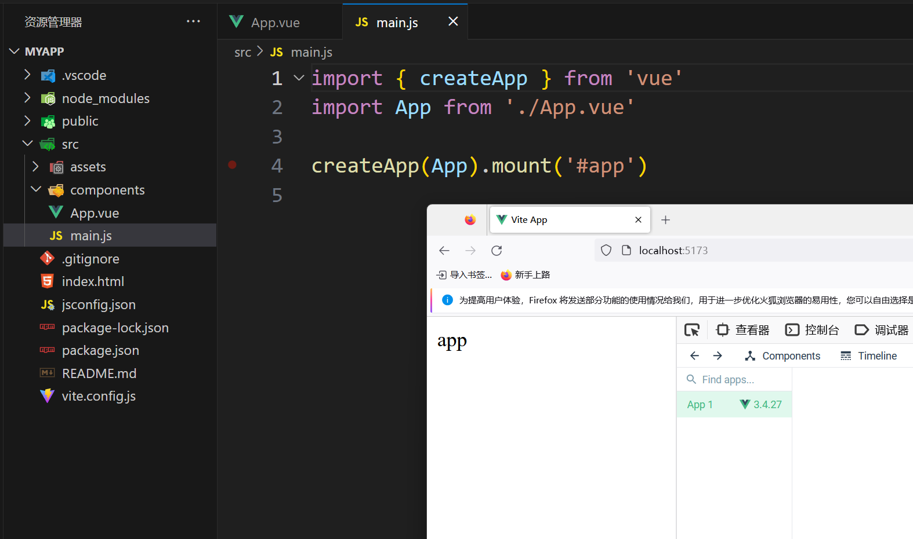


安装：

```
npm install pinia
```


创建仓库：

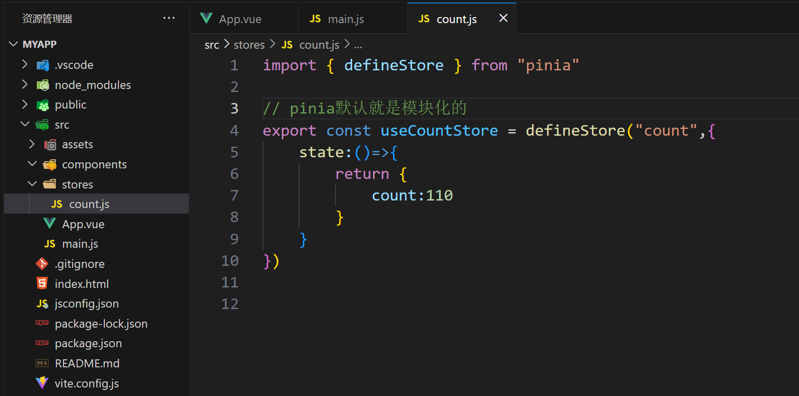

**基本示例：**

```js
import { defineStore  } from "pinia"
export const useCountStore = defineStore("count",{
  state:() =>{
    return{
      count:10
     }
   }
})
```


在main.js中使用：

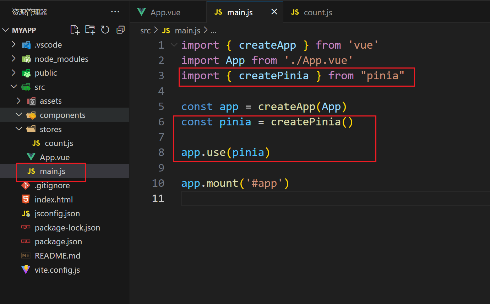


**在组件中使用:**

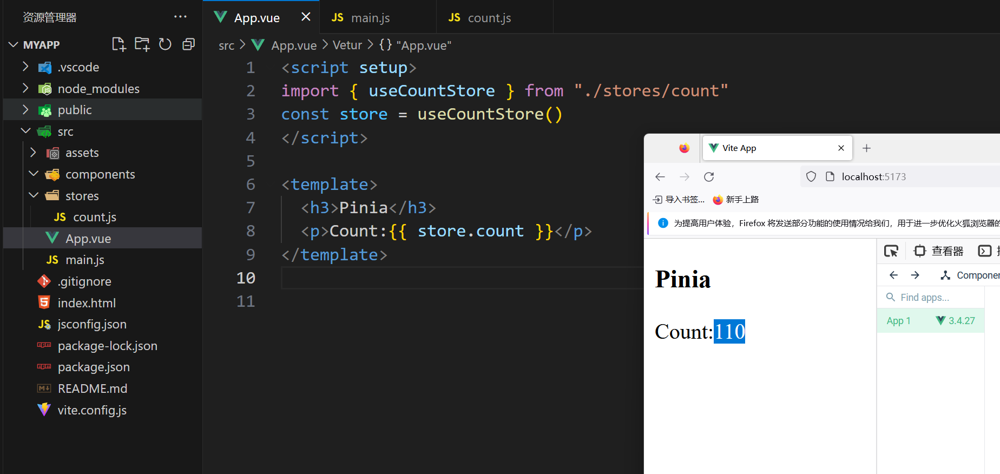

```vue
<template>
  <p>Count:{{ store.count }}</p>
</template>
<script setup>
import { useCountStore } from "../stores/count"
const store = useCountStore();
</script>
```


### 2，项目中引入Pinia

在项目引入 `pinia` 有两种方案

1. 在创建项目结构时选中`pinia`
2. 创建项目之后，手动下载安装


**创建store仓库：**

```js
import { defineStore } from "pinia"

export const useCountStore = defineStore("count",{
  state:() =>{
    return{
      count:10
     }
   }
})
```


**加载store:**

```js
import { createApp } from 'vue'
import App from './App.vue'
import { createPinia } from "pinia"

const app = createApp(App)
const pinia = createPinia()

app.use(pinia)

app.mount('#app')
```

```js
import { createApp } from 'vue'
import App from './App.vue'
import { createPinia } from "pinia"

createApp(App).use(createPinia()).mount('#app')
```


**在组件中使用：**

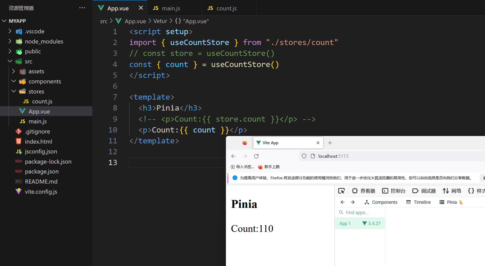

```vue
<template>
  <h3>Pinia</h3>
  <p>Count:{{ count }}</p>
</template>
<script setup>
import { useCountStore } from "../store/count"
const { count } = useCountStore();
</script>
```


### 3，组合式API风格

如果你很喜欢组合式API的代码风格，我们甚至可以在Store中采用组合式API来实现。这会让你上手 `pinia` 更迅速。

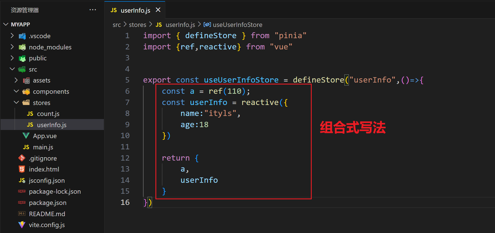

```js
import { defineStore } from "pinia"
import {ref,reactive} from "vue"

export const useUserInfoStore = defineStore("userInfo",()=>{
    const a = ref(110);
    const userInfo = reactive({
        name:"ityls",
        age:18
    })
    
    return {
        a,
        userInfo
    }
})
```


在组件中使用：

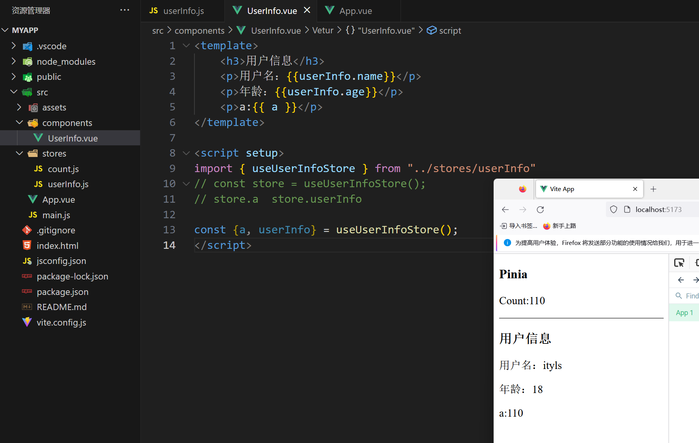

```vue
<template>
    <h3>用户信息</h3>
    <p>用户名：{{userInfo.name}}</p>
    <p>年龄：{{userInfo.age}}</p>
    <p>a:{{ a }}</p>
</template>

<script setup> 
import { useUserInfoStore } from "../stores/userInfo"
// const store = useUserInfoStore();
// store.a  store.userInfo

const {a, userInfo} = useUserInfoStore();
</script>
```


安装了vue，自带了pinia调试工具：

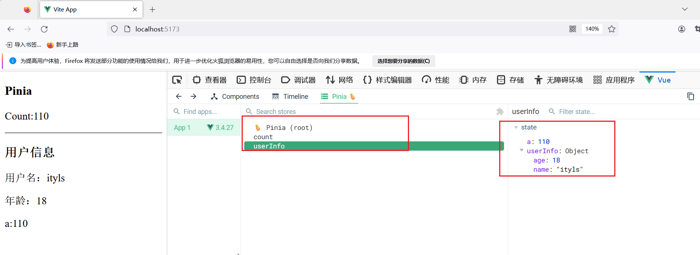


创建一个项目，直接安装pinia，如下：

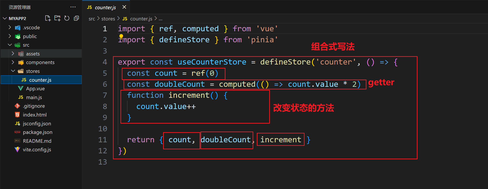


### 4，核心概念State

大多数时候，state 是 store 的核心部分。 我们通常从定义应用程序的状态开始。 在 Pinia 中，状态被定义为返回初始状态的函数。

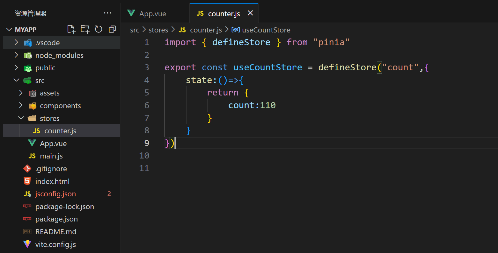

```js
import { defineStore } from "pinia"

export const useCountStore = defineStore("count",{
  state:() =>{
    return{
      count:10
     }
   }
})
```


**访问 “state”，使用组合式API：**

虽然 Composition API 并不适合所有人，但 `setup()` 钩子可以使在 Options API 中使用 Pinia 更容易。 不需要额外的 map helper！

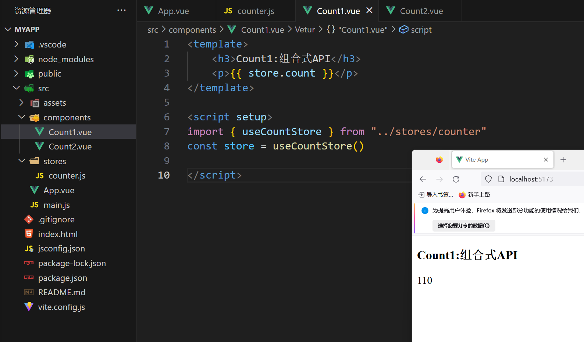

```vue
<template>
  <h3>Pinia</h3>
  <p>Count1:{{ count }}</p>
</template>
<script setup>
import { useCountStore } from "../store/count"
const { count } = useCountStore();
</script>
```


**选项式API:**

如果您不使用 Composition API，并且使用的是 `computed`、`methods`、...，则可以使用 `mapState()` 帮助器将状态属性映射为只读计算属性

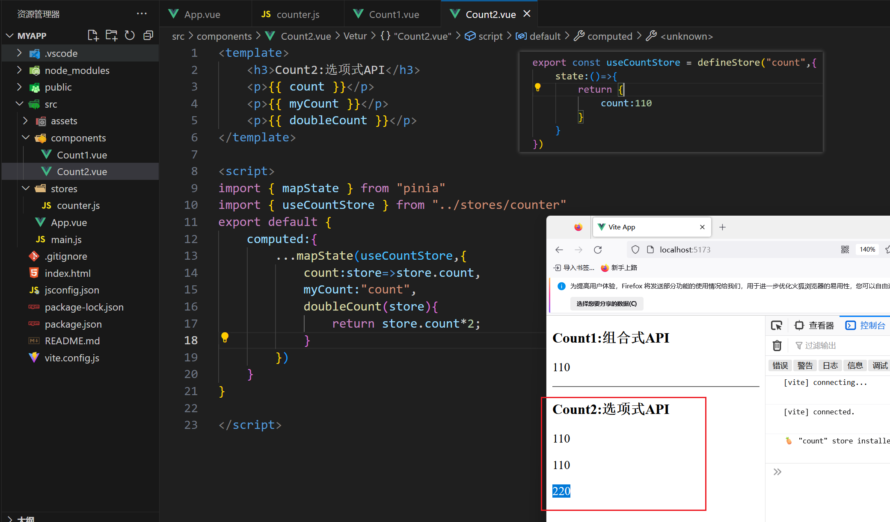

```vue
<template>
    <h3>Count2:选项式API</h3>
    <p>{{ count }}</p>
    <p>{{ myCount }}</p>
    <p>{{ doubleCount }}</p>
</template>

<script>
import { mapState } from "pinia"
import { useCountStore } from "../stores/counter"
export default {
    computed:{
        ...mapState(useCountStore,{
            count:store=>store.count,
            myCount:"count",
            doubleCount(store){
                return store.count*2;
            }
        })
    }
}

</script>
```


### 5，核心概念-修改状态

在 `pinia` 中修改状态要比在 `vuex` 中修改状态简单的多，因为不用引入额外的概念，直接用 `store.counter++` 修改 store。


仓库如下：

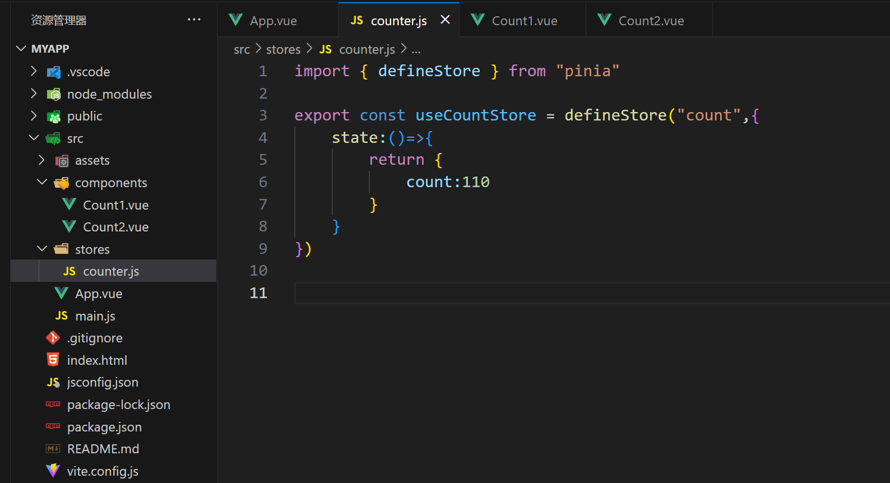


**组合式API：**

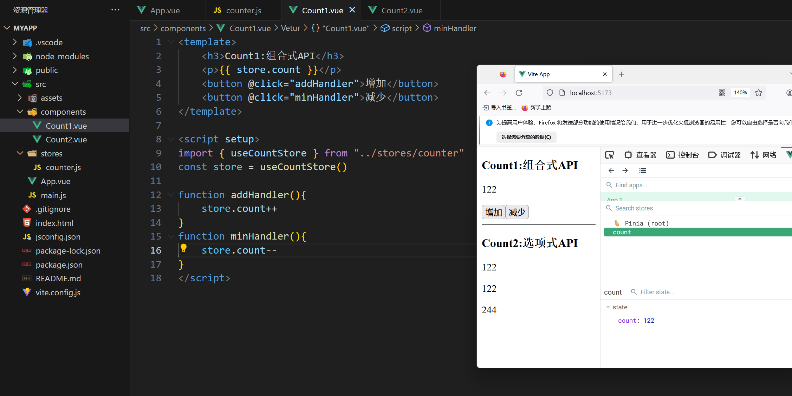

```vue
<template>
    <h3>Count1:组合式API</h3>
    <p>{{ store.count }}</p>
    <button @click="addHandler">增加</button>
    <button @click="minHandler">减少</button>
</template>

<script setup>
import { useCountStore } from "../stores/counter"
const store = useCountStore()  

function addHandler(){
    store.count++
}
function minHandler(){
    store.count--
}
</script>
```


**选项式API：**

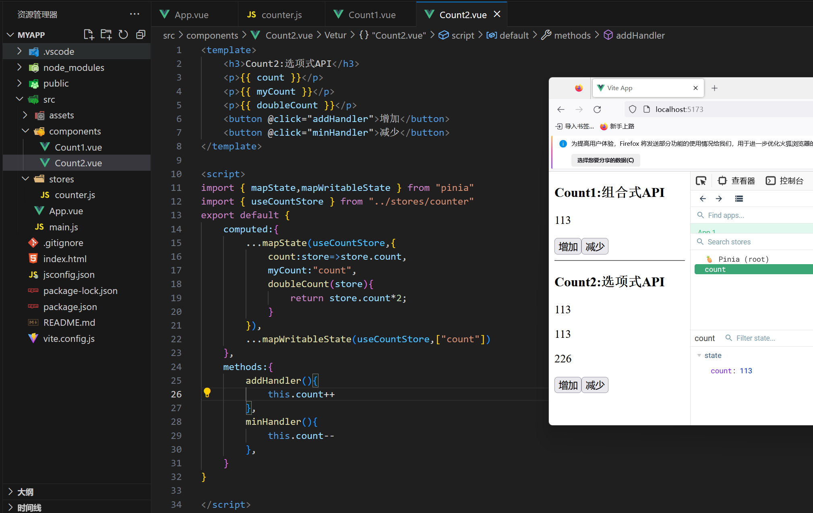

```vue
<template>
    <h3>Count2:选项式API</h3>
    <p>{{ count }}</p>
    <p>{{ myCount }}</p>
    <p>{{ doubleCount }}</p>
    <button @click="addHandler">增加</button>
    <button @click="minHandler">减少</button>
</template>

<script>
import { mapState,mapWritableState } from "pinia"
import { useCountStore } from "../stores/counter"
export default {
    computed:{
        ...mapState(useCountStore,{
            count:store=>store.count,
            myCount:"count",
            doubleCount(store){
                return store.count*2;
            }
        }),
        ...mapWritableState(useCountStore,["count"])
    },
    methods:{
        addHandler(){
            this.count++
        },
        minHandler(){
            this.count--
        },
    }
}
</script>
```


### 6，核心概念-Getters

Getter 完全等同于 Store 状态的计算值

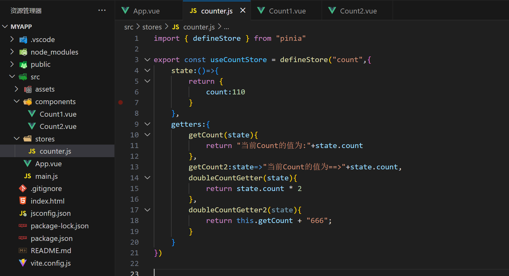

```js
import { defineStore } from "pinia"

export const useCountStore = defineStore("count",{
    state:()=>{
        return {
            count:110
        }
    },
    getters:{
        getCount(state){
            return "当前Count的值为:"+state.count
        },
        getCount2:state=>"当前Count的值为==>"+state.count,
        doubleCountGetter(state){
            return state.count * 2
        },
        doubleCountGetter2(state){
            return this.getCount + "666";
        }
    }
})
```


**组合式API中读取:**

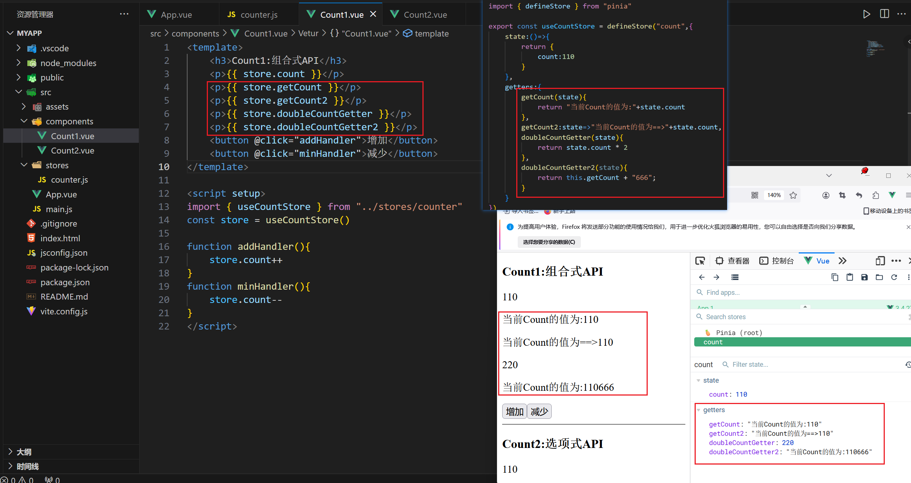

```vue
<template>
    <h3>Count1:组合式API</h3>
    <p>{{ store.count }}</p>
    <p>{{ store.getCount }}</p>
    <p>{{ store.getCount2 }}</p>
    <p>{{ store.doubleCountGetter }}</p>
    <p>{{ store.doubleCountGetter2 }}</p>
    <button @click="addHandler">增加</button>
    <button @click="minHandler">减少</button>
</template>

<script setup>
import { useCountStore } from "../stores/counter"
const store = useCountStore()  

function addHandler(){
    store.count++
}
function minHandler(){
    store.count--
}
</script>
```


**选项式API中读取:**

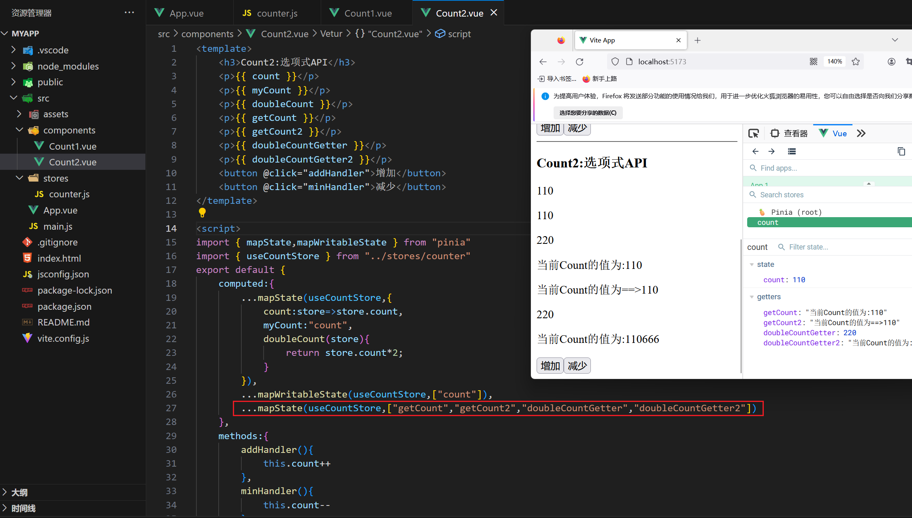

```vue
<template>
    <h3>Count2:选项式API</h3>
    <p>{{ count }}</p>
    <p>{{ myCount }}</p>
    <p>{{ doubleCount }}</p>
    <p>{{ getCount }}</p>
    <p>{{ getCount2 }}</p>
    <p>{{ doubleCountGetter }}</p>
    <p>{{ doubleCountGetter2 }}</p>
    <button @click="addHandler">增加</button>
    <button @click="minHandler">减少</button>
</template>

<script>
import { mapState,mapWritableState } from "pinia"
import { useCountStore } from "../stores/counter"
export default {
    computed:{
        ...mapState(useCountStore,{
            count:store=>store.count,
            myCount:"count",
            doubleCount(store){
                return store.count*2;
            }
        }),
        ...mapWritableState(useCountStore,["count"]),
        ...mapState(useCountStore,["getCount","getCount2","doubleCountGetter","doubleCountGetter2"])
    },
    methods:{
        addHandler(){
            this.count++
        },
        minHandler(){
            this.count--
        },
    }
}

</script>
```


**访问其他 getter:**

```js
    getters:{
        getCount(state){
            return "当前Count的值为:"+state.count
        },
        getCount2:state=>"当前Count的值为==>"+state.count,
        doubleCountGetter(state){
            return state.count * 2
        },
        doubleCountGetter2(state){
            return this.getCount + "666";
        }
    }
```


### 7，核心概念-Actions

Actions 相当于组件中的 methods。 它们可以使用 `defineStore()` 中的 `actions` 属性定义，并且**它们非常适合定义业务逻辑**

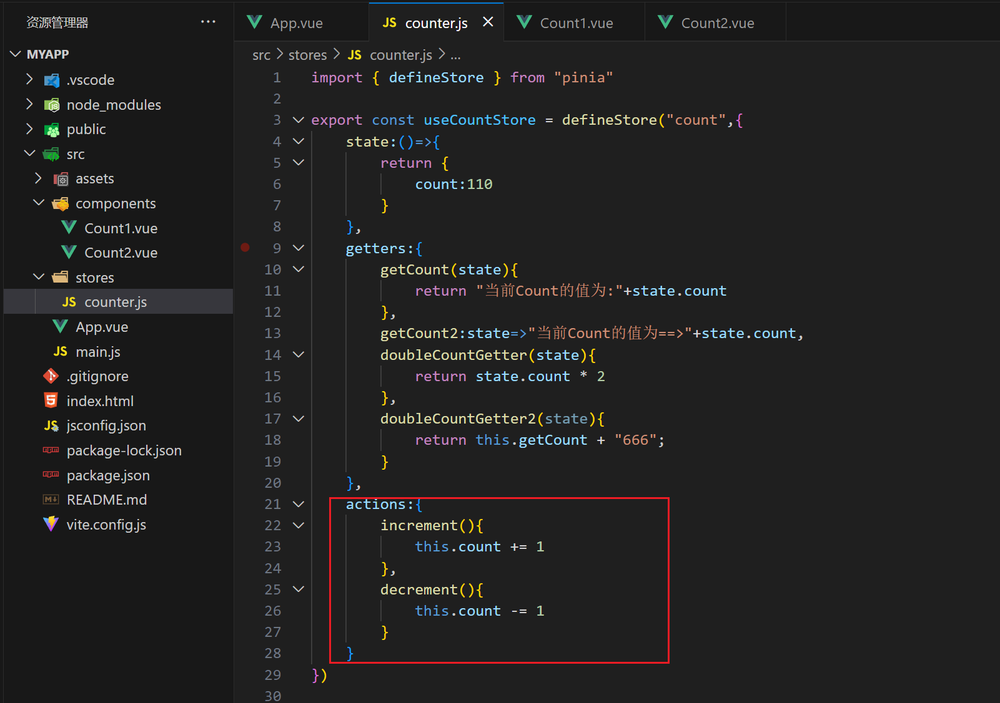

```js
import { defineStore } from "pinia"

export const useCountStore = defineStore("count",{
    state:()=>{
        return {
            count:110
        }
    },
    getters:{
        getCount(state){
            return "当前Count的值为:"+state.count
        },
        getCount2:state=>"当前Count的值为==>"+state.count,
        doubleCountGetter(state){
            return state.count * 2
        },
        doubleCountGetter2(state){
            return this.getCount + "666";
        }
    },
    actions:{
        increment(){
            this.count += 1
        },
        decrement(){
            this.count -= 1
        }
    }
})


```


**组合式API中读取:**

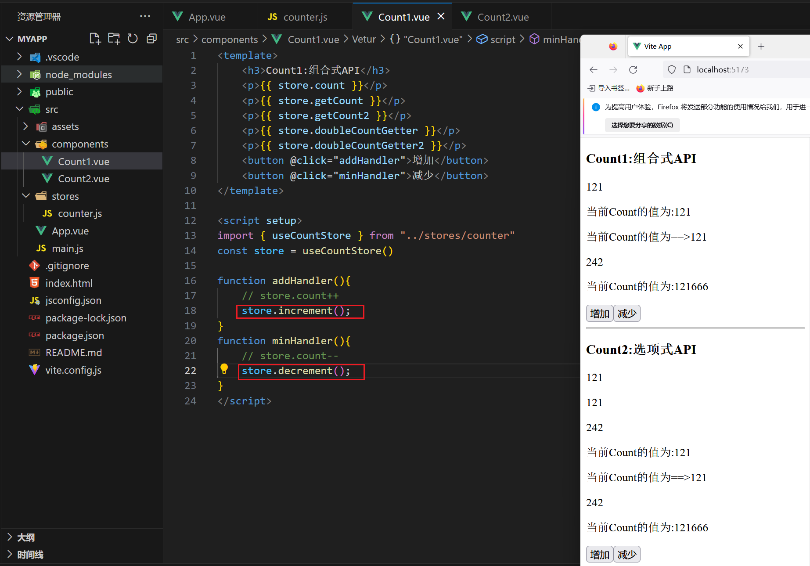

```vue
<template>
    <h3>Count1:组合式API</h3>
    <p>{{ store.count }}</p>
    <p>{{ store.getCount }}</p>
    <p>{{ store.getCount2 }}</p>
    <p>{{ store.doubleCountGetter }}</p>
    <p>{{ store.doubleCountGetter2 }}</p>
    <button @click="addHandler">增加</button>
    <button @click="minHandler">减少</button>
</template>

<script setup>
import { useCountStore } from "../stores/counter"
const store = useCountStore()  

function addHandler(){
    // store.count++
    store.increment();
}
function minHandler(){
    // store.count--
    store.decrement();
}
</script>
```


**选项式API中读取:**

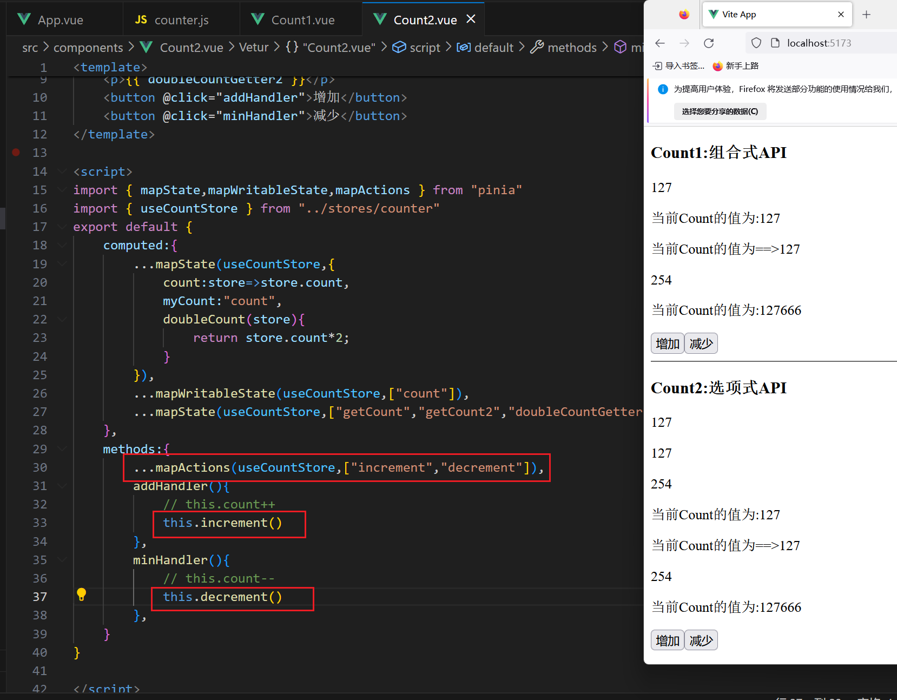

```vue
<template>
    <h3>Count2:选项式API</h3>
    <p>{{ count }}</p>
    <p>{{ myCount }}</p>
    <p>{{ doubleCount }}</p>
    <p>{{ getCount }}</p>
    <p>{{ getCount2 }}</p>
    <p>{{ doubleCountGetter }}</p>
    <p>{{ doubleCountGetter2 }}</p>
    <button @click="addHandler">增加</button>
    <button @click="minHandler">减少</button>
</template>

<script>
import { mapState,mapWritableState,mapActions } from "pinia"
import { useCountStore } from "../stores/counter"
export default {
    computed:{
        ...mapState(useCountStore,{
            count:store=>store.count,
            myCount:"count",
            doubleCount(store){
                return store.count*2;
            }
        }),
        ...mapWritableState(useCountStore,["count"]),
        ...mapState(useCountStore,["getCount","getCount2","doubleCountGetter","doubleCountGetter2"])
    },
    methods:{
        ...mapActions(useCountStore,["increment","decrement"]),
        addHandler(){
            // this.count++
            this.increment()
        },
        minHandler(){
            // this.count--
            this.decrement()
        },
    }
}

</script>
```


**actions 可以是异步的**，这也是使用 `actions` 最大的原因，传递参数：

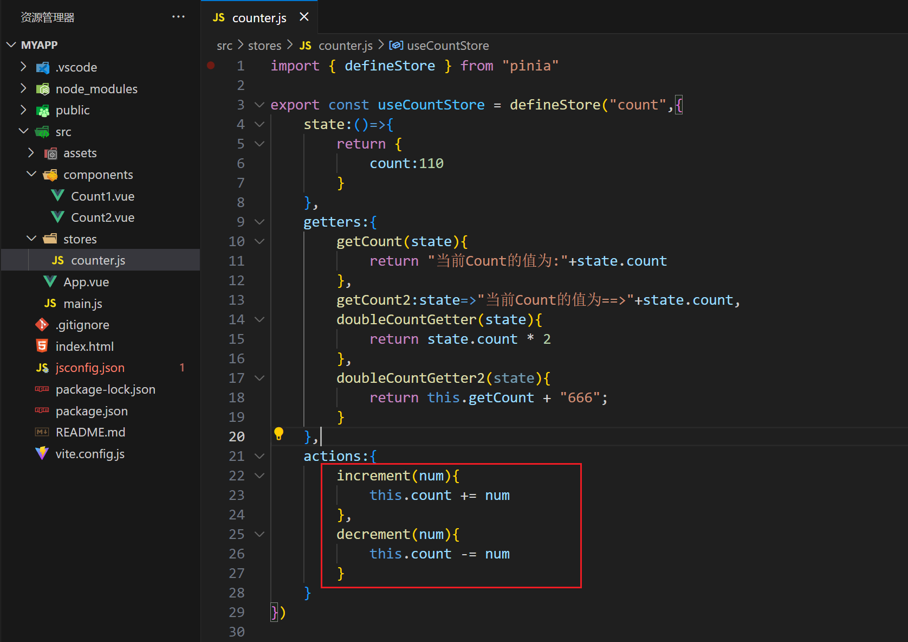

```js
import { defineStore } from "pinia"
export const useCountStore = defineStore("count", {
  state: () => {
    return {
      count: 10,
      banner:[]
     }
   },
  actions: {
    increment(num) {
      this.count += num
     },
    decrement(num) {
      this.count -= num
     }
   }
})
```


**组合式API:**

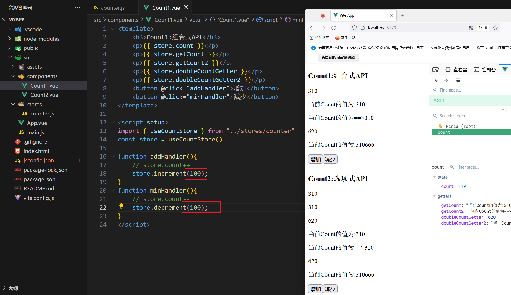

```vue
<template>
  <h3>Pinia</h3>
  <p>Count1:{{ store.count }}</p>
  <button @click="addCountHandler">增加</button>
  <button @click="minCountHandler">减少</button>
</template>
<script setup>


import { useCountStore } from "../store/count"
const store = useCountStore();
function addCountHandler(){
  store.increment(5)
}
function minCountHandler(){
  store.decrement(5)
}
</script><template>
    <h3>Count1:组合式API</h3>
    <p>{{ store.count }}</p>
    <p>{{ store.getCount }}</p>
    <p>{{ store.getCount2 }}</p>
    <p>{{ store.doubleCountGetter }}</p>
    <p>{{ store.doubleCountGetter2 }}</p>
    <button @click="addHandler">增加</button>
    <button @click="minHandler">减少</button>
</template>

<script setup>
import { useCountStore } from "../stores/counter"
const store = useCountStore()  

function addHandler(){
    // store.count++
    store.increment(100);
}
function minHandler(){
    // store.count--
    store.decrement(100);
}
</script>
```


**选项式API:**

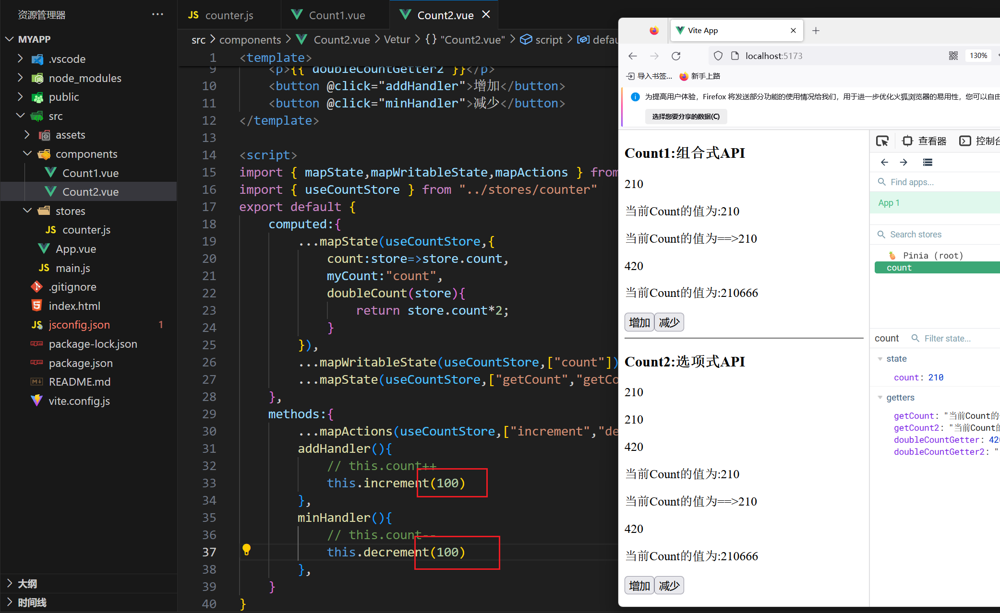

```vue
<template>
  <p>Count2:{{ count }}</p>
  <p>Count2:{{ doubleCount }}</p>
  <button @click="addCountHandler">增加</button>
  <button @click="minCountHandler">减少</button>
</template>
<script>

import { mapState,mapActions } from "pinia"
import { useCountStore } from "../store/count"

export default {
  computed:{
    ...mapState(useCountStore,{
      myOwnName:"count",
      count:store => store.count,
      doubleCount(store){
        return store.count * 2
       }
     })
   },
  methods:{
    ...mapActions(useCountStore,["increment","decrement"]),
    addCountHandler(){
      this.increment(10)
     },
    minCountHandler(){
      this.decrement(20)
     }
   }
}
</script><template>
    <h3>Count2:选项式API</h3>
    <p>{{ count }}</p>
    <p>{{ myCount }}</p>
    <p>{{ doubleCount }}</p>
    <p>{{ getCount }}</p>
    <p>{{ getCount2 }}</p>
    <p>{{ doubleCountGetter }}</p>
    <p>{{ doubleCountGetter2 }}</p>
    <button @click="addHandler">增加</button>
    <button @click="minHandler">减少</button>
</template>

<script>
import { mapState,mapWritableState,mapActions } from "pinia"
import { useCountStore } from "../stores/counter"
export default {
    computed:{
        ...mapState(useCountStore,{
            count:store=>store.count,
            myCount:"count",
            doubleCount(store){
                return store.count*2;
            }
        }),
        ...mapWritableState(useCountStore,["count"]),
        ...mapState(useCountStore,["getCount","getCount2","doubleCountGetter","doubleCountGetter2"])
    },
    methods:{
        ...mapActions(useCountStore,["increment","decrement"]),
        addHandler(){
            // this.count++
            this.increment(100)
        },
        minHandler(){
            // this.count--
            this.decrement(100)
        },
    }
}

</script>
```


**异步操作：**

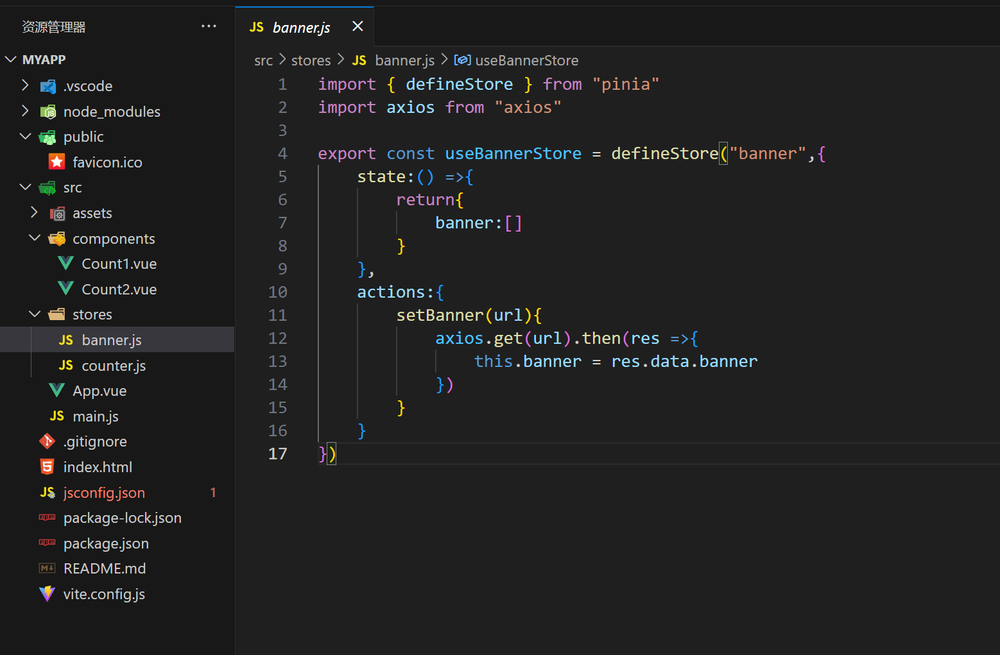

```js
import { defineStore } from "pinia"
import axios from "axios"

export const useBannerStore = defineStore("banner",{
    state:() =>{
        return{
            banner:[]
        }
    },
    actions:{
        setBanner(url){
            axios.get(url).then(res =>{
                this.banner = res.data.banner
            })
        }
    }
})
```


**组件使用：**

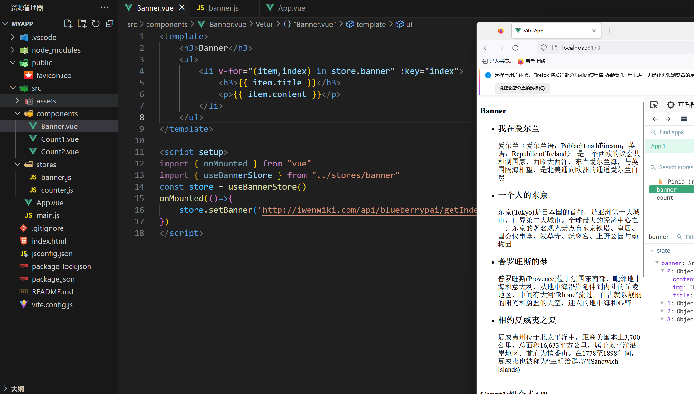

```vue
<template>
    <h3>Banner</h3>
    <ul>
        <li v-for="(item,index) in store.banner" :key="index">
            <h3>{{ item.title }}</h3>
            <p>{{ item.content }}</p>
        </li>
    </ul>
</template>

<script setup>
import { onMounted } from "vue"
import { useBannerStore } from "../stores/banner"
const store = useBannerStore()
onMounted(()=>{
    store.setBanner("http://iwenwiki.com/api/blueberrypai/getIndexBanner.php")
})
</script>
```


### 8，解构赋值响应式

如果直接从 `pinia` 中解构数据，会丢失响应式

```js
import { defineStore } from "pinia"

export const useCountStore = defineStore("count",{
    state:()=>{
        return {
            count:110
        }
    },
    actions:{
        increment(num){
            this.count += num
        },
        decrement(num){
            this.count -= num
        }
    }
})
```


组件中使用：

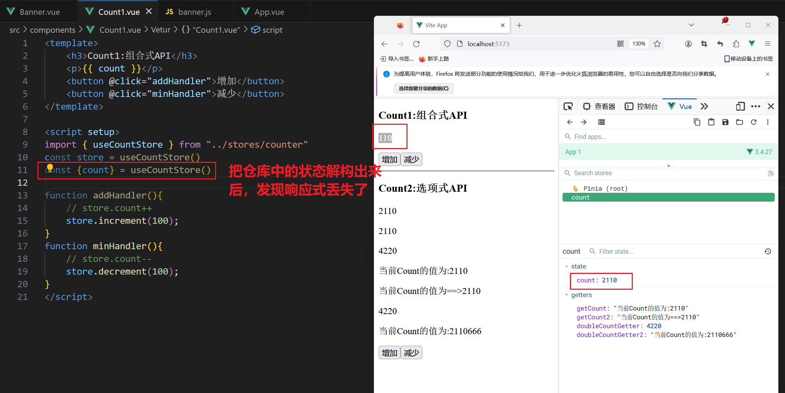

```vue
<template>
    <h3>Count1:组合式API</h3>
    <p>{{ count }}</p>
    <button @click="addHandler">增加</button>
    <button @click="minHandler">减少</button>
</template>

<script setup>
import { useCountStore } from "../stores/counter"
const store = useCountStore()  
const {count} = useCountStore()  

function addHandler(){
    // store.count++
    store.increment(100);
}
function minHandler(){
    // store.count--
    store.decrement(100);
}
</script>
```

上述代码，我们操作加减的时候会发现，内容根本不会发生变化，这就是我们使用解构赋值之后，失去了响应式,我们可以用 `storeToRefs` 来解决找个问题

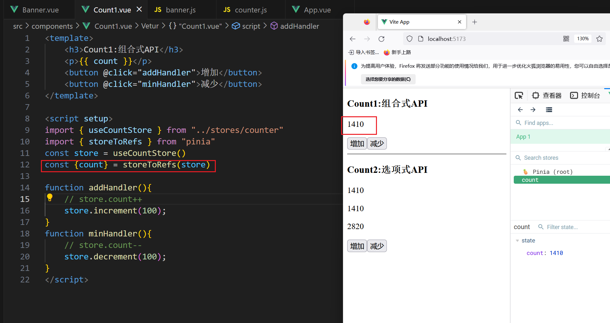

```vue
<template>
    <h3>Count1:组合式API</h3>
    <p>{{ count }}</p>
    <button @click="addHandler">增加</button>
    <button @click="minHandler">减少</button>
</template>

<script setup>
import { useCountStore } from "../stores/counter"
import { storeToRefs } from "pinia"
const store = useCountStore()  
const {count} = storeToRefs(store)  

function addHandler(){
    // store.count++
    store.increment(100);
}
function minHandler(){
    // store.count--
    store.decrement(100);
}
</script>
```


### 9，Pinia热更新

`pinia` 支持热模块替换，因此你可以编辑store，并直接在您的应用程序中与它们交互，而无需重新加载页面，允许您保持现有的状态，添加，甚至删除state，action和getter


```js
import { defineStore, acceptHMRUpdate } from "pinia"
import axios from "axios"

export const useCountStore = defineStore("count", {
  state: () => {
    return {
      count: 10
     }
   },
  getters: {
    getCount: (state) => "当前Count：" + state.count
   }
})

if (import.meta.hot) {
  import.meta.hot.accept(acceptHMRUpdate(useCountStore, import.meta.hot))
}
```


### 10，核心概念-插件

由于是底层 API，Pinia Store可以完全扩展，这一扩展就是插件

- 向 Store 添加新属性
- 定义 Store 时添加新选项
- 为 Store 添加新方法
- 包装现有方法
- 更改甚至取消操作
- 实现本地存储等副作用
- 仅适用于特定 Store


定义仓库：

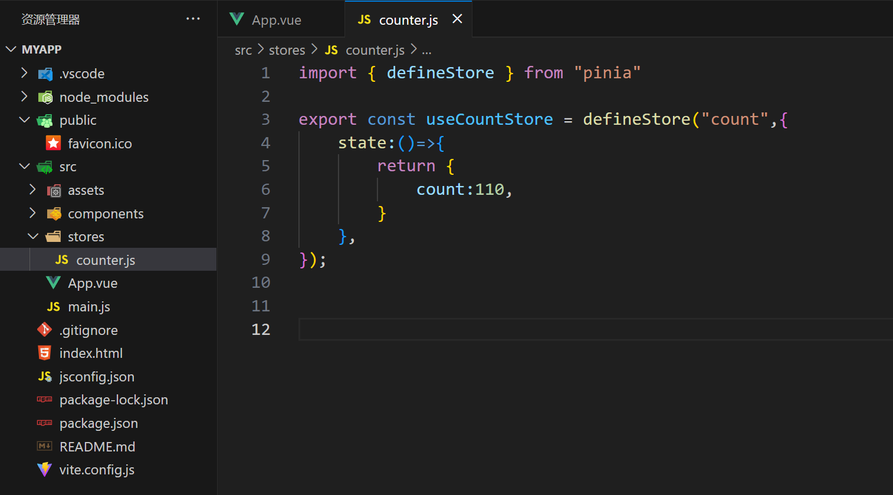

```js
import { defineStore } from "pinia"

export const useCountStore = defineStore("count",{
    state:()=>{
        return {
            count:110,
        }
    },
});
```


定义工具方法：

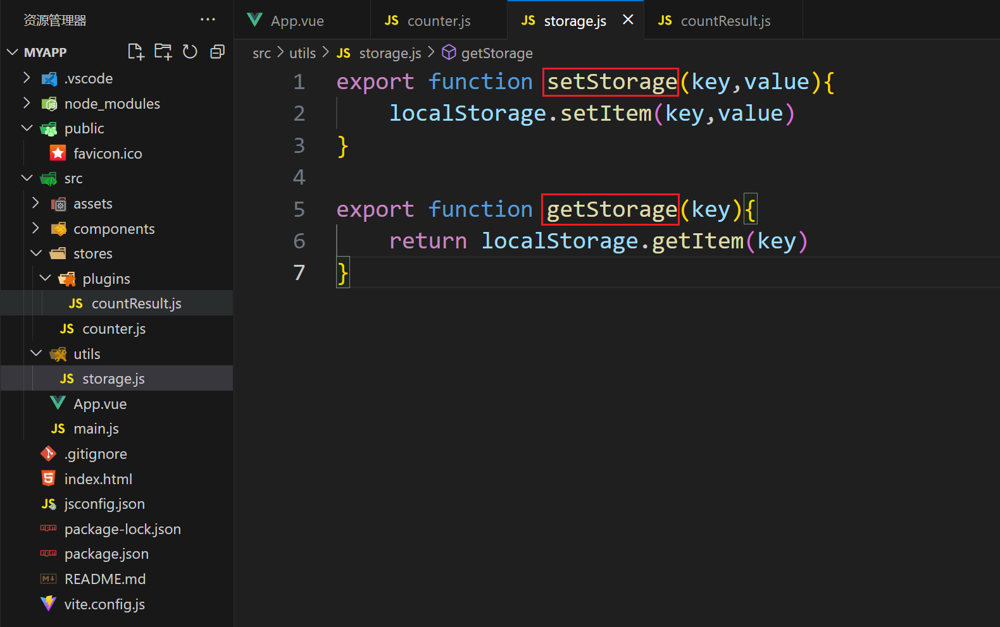

```js
export function setStorage(key,value){
    localStorage.setItem(key,value)
}

export function getStorage(key){
    return localStorage.getItem(key)
}
```


定义插件：

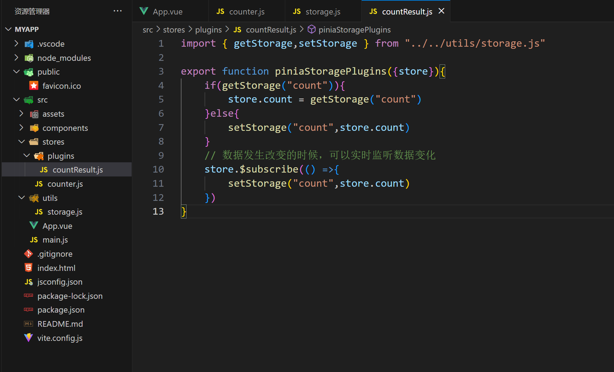

```js
import { getStorage,setStorage } from "../../utils/storage.js"

export function piniaStoragePlugins({store}){
    if(getStorage("count")){
        store.count = getStorage("count")
    }else{
        setStorage("count",store.count)
    }
    // 数据发生改变的时候，可以实时监听数据变化
    store.$subscribe(() =>{
        setStorage("count",store.count)
    })
}
```


使用插件：

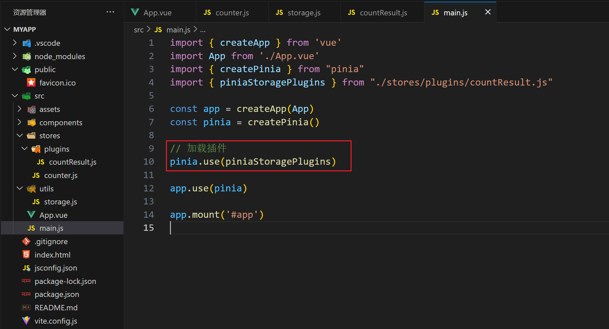

```js
import { createApp } from 'vue'
import App from './App.vue'
import { createPinia } from "pinia"
import { piniaStoragePlugins } from "./stores/plugins/countResult.js"

const app = createApp(App)
const pinia = createPinia()

// 加载插件
pinia.use(piniaStoragePlugins)

app.use(pinia)

app.mount('#app')
```


视图操作：
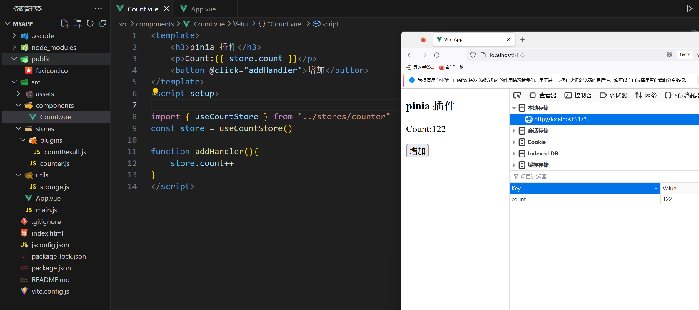

```js
<template>
    <h3>pinia 插件</h3>
    <p>Count:{{ store.count }}</p>
    <button @click="addHandler">增加</button>
</template>
<script setup>

import { useCountStore } from "../stores/counter"
const store = useCountStore()

function addHandler(){
    store.count++
}
</script>
```


### 11，核心概念-插件-本地存储

`pinia` 有个副作用，就是无法持久化，在浏览器刷新重置之后，会全部回复默认，这时候，我们可以利用插件实现本地持久化存储


创建仓库：

```js
// 仓库
import { defineStore } from "pinia"
export const useCountStore = defineStore("count",{
  state:() =>{
    return{
      count:10
     }
   }
})
```


引入仓库：

```js
// 引入仓库
import { createApp } from 'vue'
import App from './App.vue'
import { createPinia } from "pinia"
import { piniaStoragePlugins } from "./stores/plugins"
const pinia = createPinia()
pinia.use(piniaStoragePlugins)
createApp(App).use(pinia).mount('#app')
```


本地存储：

```js
// 本地存储
export function setStorage(key,value){
  localStorage.setItem(key,value)
}
export function getStorage(key){
  return localStorage.getItem(key)
}
```


实现插件，本地存储：

```js
// 实现插件，本地存储
import { setStorage, getStorage } from "../../utils/storage"
export function piniaStoragePlugins({ store }) {
  if (getStorage("count")) {
    store.count = getStorage("count")
   }else{
    setStorage("count", store.count)
   }
  store.$subscribe(() => {
    setStorage("count", store.count)
   })
}
```


视图操作：

```vue
<template>
  <h3>Pinia插件</h3>
  <p>{{ store.count }}</p>
  <button @click="addHandler">增加</button>
</template>
<script setup>
import { useCountStore } from "../stores/count"
const store = useCountStore()
function addHandler(){
  store.count++
}
</script>
```


### 12，Pinia的数据持久化插件

好用的Pinia缺少持久化插件？ `pinia-plugin-persist` 即可轻松解决!


安装：

```
npm install --save pinia-plugin-persist
```


引入持久化插件:

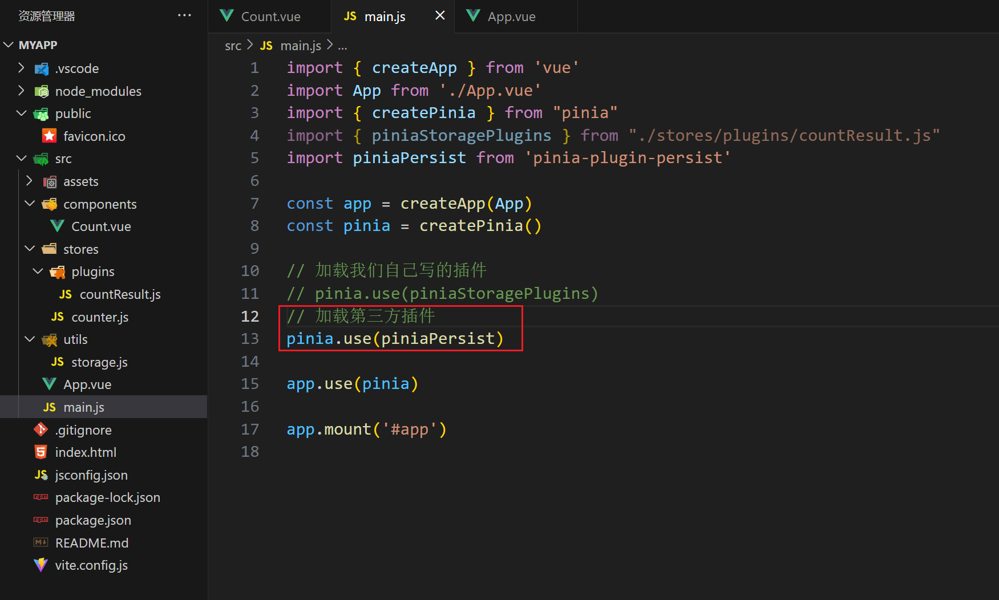

```js
import { createApp } from 'vue'
import App from './App.vue'
import { createPinia } from "pinia"
import piniaPersist from 'pinia-plugin-persist'
const pinia = createPinia()
pinia.use(piniaPersist)
createApp(App).use(pinia).mount('#app')
```


使用持久化插件：

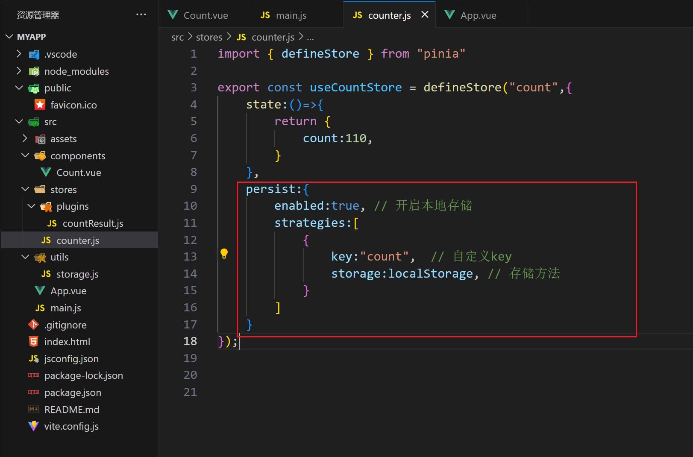

```js
import { defineStore } from "pinia"

export const useCountStore = defineStore("count",{
    state:()=>{
        return {
            count:110,
        }
    },
    persist:{
        enabled:true, // 开启本地存储
        strategies:[
            {
                key:"count",  // 自定义key
                storage:localStorage, // 存储方法
            }
        ]
    }
});

```


测试：

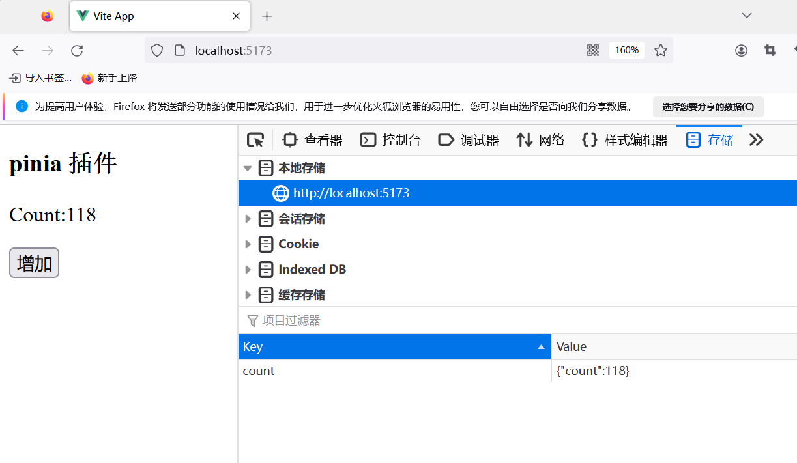