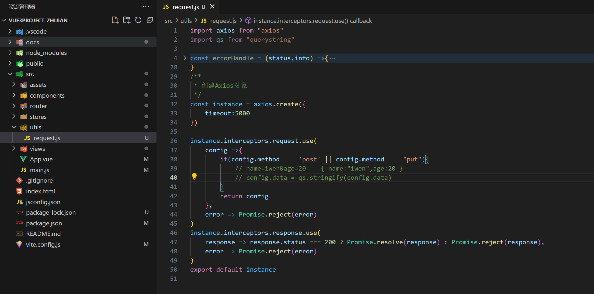
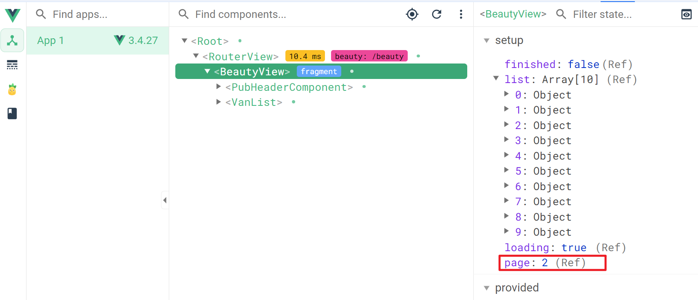
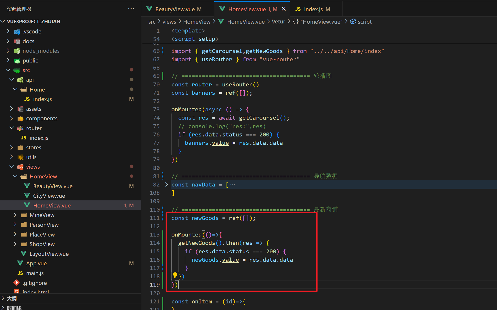
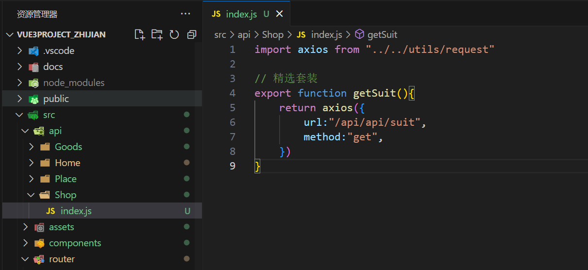

### 1，创建一个Vue3项目


创建项目：


初始化本地仓库：


进行本地仓库的管理：


让本地仓库和远程仓库进行关联：


把代码推送到远程仓库：


查看远程仓库：https://gitee.com/tubie/vue3project_zhijian


安装项目所需要的依赖(后面用到其它的模块，再去安装)：

```
"vant": "^4.8.10",
"pinia-plugin-persist": "^1.0.0",
"less": "^4.2.0",
"less-loader": "^12.2.0",
"axios": "^1.6.8",
"crypto-js": "^4.2.0",
"querystring": "^0.2.1",
"vue-baidu-map-3x": "^1.0.38",
```


运行项目：


查看效果：


项目的原型图：


网上也有一些开源的设计图：https://www.axureshop.com/


### 2，项目集成vant

vant官网：https://vant-ui.github.io/vant/#/zh-CN


如何使用vant:


第一步：


第二步：


第三步：


### 3，创建tabbar

目标：


创建tabbar所对应的几个组件：


创建Layout组件：


配置路由：


```js
import { createRouter, createWebHistory } from 'vue-router'

import LayoutView from "../views/LayoutView.vue"
import HomeView from '../views/HomeView/HomeView.vue'
import PlaceView from "../views/PlaceView/PlaceView.vue"
import ShopView from '../views/ShopView/ShopView.vue'
import PersonView from "../views/PersonView/PersonView.vue"
import MineView from "../views/MineView/MineView.vue"

const router = createRouter({
  history: createWebHistory(import.meta.env.BASE_URL),
  routes: [
    {
      path:"/",
      name: 'layout',
      component: LayoutView,
      children:[
        {
          path:"/",
          name:"home",
          component: HomeView
        },
        {
          path: "/place",
          name: "place",
          component: PlaceView
        },
        {
          path: "/shop",
          name: "shop",
          component: ShopView
        },
        {
          path: "/person",
          name: "person",
          component: PersonView
        },
        {
          path: "/mine",
          name: "mine",
          component: MineView
        }
      ]
    }
  ]
})

export default router
```


然后就需要实现tabbar组件，把tabbar组件封装好后，放到layout组件中，vant中已经实现了：


要使用tabbar，需要一些图片资源和一些其它资源：


在tabbar中需要使用到10张图片，实现tabbar组件：


```vue
<template>
    <van-tabbar v-model="active">
        <van-tabbar-item name="shouye" to="/">
            <span>首页</span>
            <template #icon="props">
                
            </template>
        </van-tabbar-item>
        <van-tabbar-item name="place" to="/place">
            <span>选址</span>
            <template #icon="props">
                
            </template>
        </van-tabbar-item>
        <van-tabbar-item name="shop" to="/shop">
            <span>商城</span>
            <template #icon="props">
                
            </template>
        </van-tabbar-item>
        <van-tabbar-item name="person" to="/person">
            <span>人才</span>
            <template #icon="props">
                
            </template>
        </van-tabbar-item>
        <van-tabbar-item name="mine" to="/mine">
            <span>我的</span>
            <template #icon="props">
                
            </template>
        </van-tabbar-item>
    </van-tabbar>
</template>
<script setup>

import { ref, reactive } from "vue"
import shouye from "../assets/images/shouye.png"
import shouye_select from "../assets/images/shouye_select.png"
import shop from "../assets/images/shop.png"
import shop_select from "../assets/images/shop_select.png"
import place from "../assets/images/place.png"
import place_select from "../assets/images/place_select.png"
import person from "../assets/images/person.png"
import person_select from "../assets/images/person_select.png"
import mine from "../assets/images/mine.png"
import mine_select from "../assets/images/mine_select.png"

const active = ref("shouye")

</script>
<style lang="less" scoped></style>
```


在layout组件中使用tabbar，如下：


```vue
<template>
    <router-view></router-view>
    <TabBarComponent />
</template>

<script setup>
import {ref,reactive} from "vue"
import TabBarComponent from "../components/TabbarComponent.vue";

</script>
<style lang="less" scoped>

</style>
```


修改选中的颜色：


在入口中引入重置样式和字体图标：


### 4，封装TopNav

目标：


vant已经封装好了：


使用之：


```vue
<template>
    <div class="header">
        <van-search shape="round" v-model="value" show-action placeholder="请输入搜索关键词">
            <template #left>
                <div class="city" @click="onCity">北京<span class="iconfont icon-jiantouxia"></span></div>
            </template>
            <template #action>
                <div @click="onClickButton">搜索</div>
            </template>
        </van-search>
    </div>
</template>
<script setup>
import { ref, reactive } from "vue"
import { useRouter } from "vue-router"

const router = useRouter()

const value = ref("");

const onCity = ()=>{
    router.push("/city")
}

const onClickButton = ()=>{
    console.log('点击了搜索...');
}

</script>
<style lang="less" scoped>
.city{
    margin-right: 5px;
    span{
        font-size: 10px;
        margin: 0 3px;
    }
}
</style>
```


### 5，城市选择组件

创建City组件：


配置路由：


开始实现地址选择，在vant中也封装了一个组件，如下：


使用之：


```vue
<template>
    <van-index-bar>
        <div v-for="(value, key, index) in CityJSON.city_list" :key="index">
            <van-index-anchor :index="key" />
            <van-cell v-for="(item,cityIndex) in CityJSON.city_list[key]" :key="cityIndex"  :title="item.city" @click="onChangeCity(item.city)"/>
        </div>
    </van-index-bar>
</template>
<script setup>
import { ref, reactive } from "vue"
import CityJSON from "../../assets/json/city_list.json"
import { useRouter } from "vue-router"

const router = useRouter()

const onChangeCity = (city)=>{
    // console.log("city:",city)
    router.back()
}
</script>
<style lang="less" scoped></style>
```


### 5，集成pinia

创建city仓库：


```js
import { defineStore } from "pinia"
export const useCityStore = defineStore("city", {
    state: () => ({
        city: "北京"
    }),
})
```


使用：


修改仓库中的数据：


测试：


持久化：


实现之：


```js
import { defineStore } from "pinia"
export const useCityStore = defineStore("city", {
    state: () => ({
        city: "北京"
    }),
    persist: {
        enabled: true,
        strategies: [{
            storage: localStorage,
            key: "city"
        }]
    }
})
```


在main.js中配置：


### 6，实现公共的返回组件

创建组件：


```vue
<template>
  <div class="pub-header">
    <van-nav-bar :title="props.title" left-text="返回" left-arrow @click-left="onClickLeft" />
  </div>
</template>
<script setup>
import {ref,reactive} from "vue"

const props = defineProps({
    title:String
})

const onClickLeft = ()=>{
    // window.history
    history.back();
}
</script>
<style lang="less" scoped>

</style>
```


在地址选择页面中使用：


```vue
<template>
    <CityHeader :title="title"/>
    <div class="current-city">
        <h3>当前定位城市</h3>
        <div>北京</div>
    </div>
    <div class="change-city">选择城市</div>
    <van-index-bar>
        <div v-for="(value, key, index) in CityJSON.city_list" :key="index">
            <van-index-anchor :index="key" />
            <van-cell v-for="(item,cityIndex) in CityJSON.city_list[key]" :key="cityIndex"  :title="item.city" @click="onChangeCity(item.city)"/>
        </div>
    </van-index-bar>
</template>
<script setup>
import { ref, reactive } from "vue"
import CityHeader from "../../components/PubHeaderComponent.vue"
import CityJSON from "../../assets/json/city_list.json"
import { useCityStore } from "../../stores/city"
import { useRouter } from "vue-router"

const cityStore = useCityStore()
const router = useRouter()

const title = "城市选择"

const onChangeCity = (city)=>{
    // console.log("city:",city)
    cityStore.city = city
    router.back()
}
</script>
<style lang="less" scoped>
.current-city {
    background: #fff;
    margin: 10px 0;
    padding: 10px;

    h3 {
        font-size: 14px;
        color: #999;
        font-weight: 400;
    }

    div {
        font-size: 14px;
        margin-top: 15px;
    }
}

.change-city {
    background: #fff;
    margin: 10px 0;
    padding: 10px;
}
</style>
```


修改组件的样式：


```html
<style lang="less">
// 公共导航返回按钮样式修改
.van-nav-bar  .van-nav-bar__text{
    color: #684886 !important;
}
.van-nav-bar .van-icon{
    color: #684886 !important;
}
</style>
```


### 7，轮播图

封装轮播图组件：


```vue
<template>
    <van-swipe :autoplay="3000" lazy-render>
        <van-swipe-item v-for="(item,index) in images" :key="index">
            
        </van-swipe-item>
    </van-swipe>
</template>
<script setup>
import {ref,reactive} from "vue"

const props = defineProps({
    images:Array
})

</script>
<style lang="less" scoped>
img{
    width: 100%;
}
</style>
```


封装axios，如下：



```js
import axios from "axios"
import qs from "querystring"

const errorHandle = (status,info) =>{
    switch(status){
        case 400:
            console.log("语义错误");
            break;
        case 401:
            console.log("服务器认证失败");
            break;
        case 403:
            console.log("服务器请求拒绝执行");
            break;
        case 404:
            console.log("请检查网路请求地址");
            break;
        case 500:
            console.log("服务器发生意外");
            break;
        case 502:
            console.log("服务器无响应");
            break;
        default:
            console.log(info);
            break;
    }
}
/**
 * 创建Axios对象
 */
const instance = axios.create({
    timeout:5000
})

instance.interceptors.request.use(
    config =>{
        if(config.method === 'post' || config.method === "put"){
            // name=iwen&age=20    { name:"iwen",age:20 }
            // config.data = qs.stringify(config.data)
        }
        return config
    },
    error => Promise.reject(error)
)
instance.interceptors.response.use(
    response => response.status === 200 ? Promise.resolve(response) : Promise.reject(response),
    error => Promise.reject(error)
)
export default instance
```


API接口：http://123.249.16.147:3000/api/banner


ajax发请求有跨域问题，前端配置代理解决跨域：


```js
  server:{
    proxy:{
      "^/api":{
        target:"http://123.249.16.147:3000/",
        changeOrigin:true,
        rewrite:(path) => path.replace(/^\/api/,"")
      }
    }
  }
```


封装API接口：


```js
import axios from "../../utils/request"

// banner轮播图
export function getCaroursel(){
    return axios({
        url:"/api/api/banner",
        method:"get"
    })
}
```


在Home组件中调用接口：


测试：


使用：


### 8，首页导航实现

准备数据：


书写HTML+CSS，如下：


```vue
<template> 
  <TopNavComponent/>
  <SwiperComponent :images="banners" />
  <div class="nav">
    <div class="item" @click="onItem(item.id)" v-for="(item, index) in navData" :key="item.id">
      
      <span>{{ item.text }}</span>
    </div>
  </div>
</template>
<script setup>
import {ref,reactive,onMounted} from "vue"
import TopNavComponent from "../../components/TopNavCompponent.vue"
import SwiperComponent from "@/components/SwiperComponent.vue";

import nav1 from "../../assets/images/nav1.png"
import nav2 from "../../assets/images/nav2.png"
import nav3 from "../../assets/images/nav3.png"
import nav4 from "../../assets/images/nav4.png"
import nav5 from "../../assets/images/nav5.png"


import { getCaroursel } from "../../api/Home/index"

const banners = ref([]);

onMounted(async () => {
  const res = await getCaroursel();
  // console.log("res:",res)
  if (res.data.status === 200) {
    banners.value = res.data.data
  }
})

// 首页导航数据
const navData = [
  {
    id: 1,
    text: "转让出租",
    image: nav1
  },
  {
    id: 2,
    text: "招聘求职",
    image: nav2
  },
  {
    id: 3,
    text: "流行产品",
    image: nav3
  },
  {
    id: 4,
    text: "培训课程",
    image: nav4
  },
  {
    id: 5,
    text: "批发进货",
    image: nav5
  }
]

const onItem = (id)=>{

}
</script>
<style lang="less" scoped>
.nav {
  background: #fff;
  width: 100%;
  padding: 10px;
  box-sizing: border-box;
  overflow: hidden;
  clear: both;

  .item {
    width: 20%;
    float: left;
    // text-align: center;
    display: flex;
    flex-direction: column;
    align-items: center;
    justify-content: center;

    img {
      width: 40px;
    }

    span {
      display: block;
      font-size: 12px;
      margin-top: 10px;
    }
  }
}
</style>
```


### 9，资讯和推荐

实现资讯：


```html
  <!-- 资讯 -->
  <div class="info" @click="onBeautyInfo">
    <h3>美甲咨询</h3>
    <p>年会不能错过的款，美呆了~</p>
    <span class="iconfont icon-jiantouyou"></span>
  </div>
```


```css
.info {
  background: #fff;
  display: flex;
  padding: 10px 0;
  align-items: center;
  border-top: 1px solid #f3f4f5;

  h3 {
    font-size: 14px;
    color: #999;
    font-weight: 400;
    padding: 0 20px;
    border-right: 1px solid #f3f4f5;
  }

  p {
    font-size: 14px;
    margin-left: 10px;
  }

  span {
    flex: 1;
    text-align: right;
    padding-right: 10px;
  }
}
```


```js
import { useRouter } from "vue-router"
const router = useRouter()
// 点击资讯
const onBeautyInfo = ()=>{
  router.push("/beauty")
}
```


推荐：


```html
  <!-- 推荐 -->
  <div class="recommend">
    <div class="hot">
      <h3>热门活动</h3>
    </div>
    <div class="opt">
      <h3>优选店铺</h3>
    </div>
  </div>
```


```css
.recommend {
  width: 100%;
  background-color: #fff;
  margin-top: 5px;
  display: flex;
  padding: 10px;
  box-sizing: border-box;

  div {
    flex: 1;
    height: 80px;
    border-radius: 10px;
    display: flex;
    justify-content: center;
    align-items: center;
  }

  .hot {
    background: url("../../assets/images/home-cb1.png");
    background-position: center;
    background-size: cover;
    margin-right: 5px;
  }

  .opt {
    background: url("../../assets/images/home-cb2.png");
    background-position: center;
    background-size: cover;
    margin-left: 5px;
  }
}
```


### 10，实现资讯


创建资讯页面：


配置路由：


测试：


资讯页面：


实现：


把首页面轮播图的小点变色：


在APP组件修改样式：


分析：


分析vant-list组件：


封装API接口：


```js
// 美业快讯
export function getBeauty(params){
    return axios({
        url:"/api/api/beauty",
        method:"get",
        params
    })
}
```


在组件中的load事件中调用之：


```js
const onLoad = ()=>{
  // console.log("load...")
  getBeauty({page:page.value}).then(res=>{
    // console.log("--res:",res)
    if (res.data.status === 200) {
      page.value++
      list.value = list.value.concat(res.data.data)
    }
    loading.value = false;
    // 数据全部加载完成
    if (res.data.status === 500) {
      finished.value = true;
    }
  })
}
```




渲染数据：

```vue
<template>
  <BeautyHeader title="美业快讯" />
  <div class="beauty-banner">
    
  </div>
  <!-- 列表数据 -->
  <van-list v-model:loading="loading"  :finished="finished" finished-text="没有更多了"  @load="onLoad">
    <div class="beauty-item" v-for="(item,index) in list" :key="index">
      
      <div class="beauty-item-desc">
        <p>{{ item.title }}</p>
        <span>{{ item.descs }}</span>
      </div>
    </div>
  </van-list>
</template>
<script setup>
import {ref,reactive} from "vue"
import { getBeauty } from "../../api/Home/index"
import BeautyHeader from "../../components/PubHeaderComponent.vue"

const loading = ref(false);
const finished = ref(false);
const page = ref(1);
const list = ref([])

const onLoad = ()=>{
  console.log("load...")
  getBeauty({page:page.value}).then(res=>{
    // console.log("--res:",res)
    if (res.data.status === 200) {
      page.value++
      list.value = list.value.concat(res.data.data)
    }
    // 手动把laoding变成false
    loading.value = false;

    // 数据全部加载完成
    if (res.data.status === 500) {
      finished.value = true;
    }
  })
}

</script>
<style lang="less" scoped>
.beauty-banner {
  img {
    width: 100%;
  }
}
.beauty-item{
  display: flex;
  background-color: #fff;
  padding: 10px;
  box-sizing: border-box;
  border-bottom: 1px solid #f3f4f5;
  img{
    width: 100px;
    height: 100px;
    border-radius: 5px;
  }
  .beauty-item-desc{
    display: flex;
    flex-direction: column;
    justify-content: center;
    padding: 10px;
    box-sizing: border-box;
    p{
      font-size: 15px;
      padding: 10px 0;
    }
    span{
      display: block;
      font-size: 14px;
      color: #999;
      padding: 10px 0;
    }
  }
}
</style>
```


测试：


### 11，最新商铺

目标：


实现最新商铺：


```html
  <!-- 最新商铺 -->
  <div class="roll">
    <div class="roll-header">
      <h3>最新商铺</h3>
      <span class="all">查看全部<span class="iconfont icon-jiantouyou"></span></span>
    </div>
    <div class="roll-main">
      <div class="new-shop-content">
      <div class="new-shop-item">
        
        <p class="new-shop-title">塔顶田在县城发大水个任务塔顶在人国慢焯在人有的和在经要经以在有</p>
        <span class="new-shop-price">1000元/月</span>
      </div>
      <div class="new-shop-item">
        
        <p class="new-shop-title">塔顶田在县城发大水个任务塔顶在人国慢焯在人有的和在经要经以在有</p>
        <span class="new-shop-price">1000元/月</span>
      </div>
      <div class="new-shop-item">
        
        <p class="new-shop-title">塔顶田在县城发大水个任务塔顶在人国慢焯在人有的和在经要经以在有</p>
        <span class="new-shop-price">1000元/月</span>
      </div>
    </div>
    </div>
  </div>
```


样式：

```css
.roll{
  background: #fff;
  .roll-header {
    height: 40px;
    line-height: 40px;
    display: flex;
    h3 {
        flex: 1;
        font-size: 16px;
        font-weight: 400;
        text-align: left;
        padding-left: 10px;
    }
    .all {
        flex: 1;
        text-align: right;
        font-size: 14px;
        color: #999;
        padding-right: 10px;

        span {
            font-size: 12px;
        }
    }
  }
  .roll-main{
    overflow-x: scroll;
    overflow-y: hidden;
    text-align: center;
    white-space: nowrap;
  }
}

// 最新商品样式
.new-shop-content {
  display: flex;

  .new-shop-item {
    margin-right: 15px;

    img {
      display: block;
      width: 230px;
      height: 130px;
    }

    .new-shop-title {
      white-space: normal;
      word-break: break-word;
      font-size: 14px;
      text-align: left;
      padding: 10px;
    }

    .new-shop-price {
      display: block;
      font-size: 14px;
      width: 100%;
      text-align: left;
      padding: 10px;
      padding-top: 0px;
      color: #820085;
    }
  }
}
```


效果：


ajax请求数据：


```js
// 最新商铺
export function getNewGoods(){
    return axios({
        url:"/api/api/newgoods",
        method:"get"
    })
}
```


在组件中使用：




```js
const newGoods = ref([]);

onMounted(()=>{
  getNewGoods().then(res => {
    if (res.data.status === 200) {
      newGoods.value = res.data.data
    }
  })
})
```


查看：


使用之：


测试：


把滚动视图抽离出去：


```vue
<template>
    <div class="roll">
        <div class="roll-header">
            <h3>{{ rollInfo.title }}</h3>
            <span class="all">{{ rollInfo.all }}<span class="iconfont icon-jiantouyou"></span></span>
        </div>
        <div class="roll-main">
            <slot>默认内容</slot>
        </div>
    </div>
</template>
<script setup>
import { ref, reactive } from "vue"

const props = defineProps({
    rollInfo:Object
})

</script>
<style lang="less" scoped>
.roll{
  background: #fff;
  .roll-header {
    height: 40px;
    line-height: 40px;
    display: flex;
    h3 {
        flex: 1;
        font-size: 16px;
        font-weight: 400;
        text-align: left;
        padding-left: 10px;
    }
    .all {
        flex: 1;
        text-align: right;
        font-size: 14px;
        color: #999;
        padding-right: 10px;

        span {
            font-size: 12px;
        }
    }
  }
  .roll-main{
    overflow-x: scroll;
    overflow-y: hidden;
    text-align: center;
    white-space: nowrap;
  }
}
</style>

```


使用组件：


代码如下：

```vue
  <!-- 最新商铺 -->
  <RollComponent :rollInfo="newShopInfo">
    <div class="new-shop-content">
      <div class="new-shop-item" v-for="(item, index) in newGoods" :key="index">
        
        <p class="new-shop-title">{{ item.title }}</p>
        <span class="new-shop-price">{{ item.price }}元/月</span>
      </div>
    </div>
  </RollComponent>
```


使用骨架屏：


测试：


完整代码：

```vue
<template>
  <TopNavComponent />
  <SwiperComponent :images="banners" />
  <div class="nav">
    <div class="item" @click="onItem(item.id)" v-for="(item, index) in navData" :key="item.id">
      
      <span>{{ item.text }}</span>
    </div>
  </div>
  <!-- 资讯 -->
  <div class="info" @click="onBeautyInfo">
    <h3>美甲咨询</h3>
    <p>年会不能错过的款，美呆了~</p>
    <span class="iconfont icon-jiantouyou"></span>
  </div>
  <!-- 推荐 -->
  <div class="recommend">
    <div class="hot">
      <h3>热门活动</h3>
    </div>
    <div class="opt">
      <h3>优选店铺</h3>
    </div>
  </div>

  <!-- 最新商铺 -->
  <RollComponent :rollInfo="newShopInfo">
    <div class="new-shop-content" v-if="newGoodsLoading">
      <div class="new-shop-item" v-for="(item, index) in newGoods" :key="index">
        
        <p class="new-shop-title">{{ item.title }}</p>
        <span class="new-shop-price">{{ item.price }}元/月</span>
      </div>
    </div>
    <div class="skeleton-newShop" v-else>
      <div class="skeleton-item">
        <van-skeleton-image class="image" />
        <van-skeleton-paragraph />
        <van-skeleton-paragraph />
      </div>
      <div class="skeleton-item">
        <van-skeleton-image class="image" />
        <van-skeleton-paragraph />
        <van-skeleton-paragraph />
      </div>
    </div>
  </RollComponent>

</template>
<script setup>
import { ref, reactive, onMounted } from "vue"
import TopNavComponent from "../../components/TopNavCompponent.vue"
import SwiperComponent from "@/components/SwiperComponent.vue";
import RollComponent from "@/components/RollComponent.vue"

import nav1 from "../../assets/images/nav1.png"
import nav2 from "../../assets/images/nav2.png"
import nav3 from "../../assets/images/nav3.png"
import nav4 from "../../assets/images/nav4.png"
import nav5 from "../../assets/images/nav5.png"


import { getCaroursel, getNewGoods } from "../../api/Home/index"
import { useRouter } from "vue-router"

// ====================================== 轮播图
const router = useRouter()
const banners = ref([]);

onMounted(async () => {
  const res = await getCaroursel();
  // console.log("res:",res)
  if (res.data.status === 200) {
    banners.value = res.data.data
  }
})

// ====================================== 导航数据
const navData = [
  {
    id: 1,
    text: "转让出租",
    image: nav1
  },
  {
    id: 2,
    text: "招聘求职",
    image: nav2
  },
  {
    id: 3,
    text: "流行产品",
    image: nav3
  },
  {
    id: 4,
    text: "培训课程",
    image: nav4
  },
  {
    id: 5,
    text: "批发进货",
    image: nav5
  }
]

// ====================================== 最新商铺
const newGoods = ref([]);
const newGoodsLoading = ref(false);

const newShopInfo = {
  title: "最新商铺",
  all: "查看全部"
}

onMounted(() => {
  getNewGoods().then(res => {
    if (res.data.status === 200) {
      newGoodsLoading.value = true
      newGoods.value = res.data.data
    }
  })
})

const onItem = (id) => {
}
// 点击资讯
const onBeautyInfo = () => {
  router.push("/beauty")
}


</script>
<style lang="less" scoped>
.nav {
  background: #fff;
  width: 100%;
  padding: 10px;
  box-sizing: border-box;
  overflow: hidden;
  clear: both;

  .item {
    width: 20%;
    float: left;
    // text-align: center;
    display: flex;
    flex-direction: column;
    align-items: center;
    justify-content: center;

    img {
      width: 40px;
    }

    span {
      display: block;
      font-size: 12px;
      margin-top: 10px;
    }
  }
}

.info {
  background: #fff;
  display: flex;
  padding: 10px 0;
  align-items: center;
  border-top: 1px solid #f3f4f5;

  h3 {
    font-size: 14px;
    color: #999;
    font-weight: 400;
    padding: 0 20px;
    border-right: 1px solid #f3f4f5;
  }

  p {
    font-size: 14px;
    margin-left: 10px;
  }

  span {
    flex: 1;
    text-align: right;
    padding-right: 10px;
  }
}

.recommend {
  width: 100%;
  background-color: #fff;
  margin-top: 5px;
  display: flex;
  padding: 10px;
  box-sizing: border-box;

  div {
    flex: 1;
    height: 80px;
    border-radius: 10px;
    display: flex;
    justify-content: center;
    align-items: center;
  }

  .hot {
    background: url("../../assets/images/home-cb1.png");
    background-position: center;
    background-size: cover;
    margin-right: 5px;
  }

  .opt {
    background: url("../../assets/images/home-cb2.png");
    background-position: center;
    background-size: cover;
    margin-left: 5px;
  }
}


// 最新商品样式
.new-shop-content {
  display: flex;

  .new-shop-item {
    margin-right: 15px;

    img {
      display: block;
      width: 230px;
      height: 130px;
    }

    .new-shop-title {
      white-space: normal;
      word-break: break-word;
      font-size: 14px;
      text-align: left;
      padding: 10px;
    }

    .new-shop-price {
      display: block;
      font-size: 14px;
      width: 100%;
      text-align: left;
      padding: 10px;
      padding-top: 0px;
      color: #820085;
    }
  }
}

// 骨架屏
.skeleton-newShop {
  height: 208px;
  width: 100%;
  display: flex;

  .skeleton-item {
    margin: 10px;
    width: 230px;

    image {
      width: 230px;
    }
  }
}
</style>
```


### 12，广告和人才

广告：


```html
  <!-- 广告 -->
  <div class="ad">
    
  </div>
```

```css
// 广告图
.ad {
  background: #fff;
  margin: 5px auto;

  img {
    width: 100%;
    padding: 5px;
    box-sizing: border-box;
  }
}
```


人才库，封装API接口：


```js
// 人才库
export function getPersonStore(){
    return axios({
        url:"/api/api/personstore",
        method:"get"
    })
}
```


在组件中调用：


查看：


渲染数据：


```html
  <!-- 人才库 -->
  <RollComponent :rollInfo="personInfo">
    <div class="person-content">
      <div class="person-item" v-for="(item, index) in personStore" :key="index">
        
        <p>{{ item.name }}</p>
        <span>{{ item.desc }}元/月</span>
      </div>
    </div>
  </RollComponent>
```


```css
// 人才库
.person-content {
  display: flex;

  .person-item {
    margin-left: 10px;

    img {
      width: 110px;
      height: 170px;
      border-radius: 5px;
    }

    p {
      font-size: 16px;
      margin: 5px 0;
    }

    span {
      display: block;
      font-size: 14px;
      color: #999;
      padding-bottom: 10px;
    }
  }
}
```


### 13，为你推荐


封装API接口：


```js
// 为你推荐
export function getRecommendgoods(){
    return axios({
        url:"/api/api/recommendgoods",
        method:"get"
    })
}
```


在组件中调用接口：


```js
const recommendGoods = ref([]);
const recommendGoodsLoading = ref(false);
const recommendTitle = "为你推荐";

onMounted(() => {
  getRecommendgoods().then(res => {
    if (res.data.status === 200) {
      recommendGoodsLoading.value = true;
      recommendGoods.value = res.data.data
    }
  })
})
```


把为你推荐封装成一个组件：


```vue
<template>
    <h3 class="title">{{ recommendTitle }}</h3>
    <div class="card">
        <div class="card-item" v-for="(item) in cardData" :key="item.id" @click="onGoodsItem(item.id)">
            
            <p class="item-name">{{ item.title }}</p>
            <div class="item-desc">
                <span class="price">￥{{ item.price }}.00</span>
                <span class="iconfont icon-gouwucheman"></span>
            </div>
        </div>
    </div>
</template>
<script setup>
import {ref,reactive} from "vue"
import { useRouter } from "vue-router"

const router = useRouter()

const props = defineProps({
    cardData:Array,
    recommendTitle:string
})

const onGoodsItem = (id)=>{
    router.push({
        name:"goodsDetails",
        params:{ id }
    })
}
</script>
<style lang="less" scoped>
.title {
    text-align: center;
    font-weight: 400;
    color: #999;
    font-size: 14px;
    margin: 10px auto;
    display: flex;
    flex-direction: row;

    &::before {
        content: "";
        width: 50px;
        border-bottom: 1px solid #999;
        margin: auto;
    }

    &::after {
        content: "";
        width: 50px;
        border-bottom: 1px solid #999;
        margin: auto;
    }
}

.card {
    background: #fff;
    padding: 20px 10px;
    overflow: hidden;
    clear: both;

    .card-item {
        width: 49%;
        float: left;
        margin: 10px 0;

        .item-goods {
            width: 100%;
            border-radius: 5px;
        }

        .item-name {
            font-size: 14px;
            margin: 5px 0;
            padding: 0 10px;
            box-sizing: border-box;
        }

        .item-desc {
            display: flex;
            padding: 5px 10px;
            box-sizing: border-box;

            .price {
                flex: 1;
                font-size: 12px;
                text-align: left;
            }

            .iconfont {
                flex: 1;
                font-size: 12px;
                text-align: right;
                color: #999;
            }
        }
    }

    .card-item:nth-child(even) {
        margin-left: 2%;
    }
}
</style>
```


使用组件：


```vue
<template>
  <TopNavComponent />
  <SwiperComponent :images="banners" />
  <div class="nav">
    <div class="item" @click="onItem(item.id)" v-for="(item, index) in navData" :key="item.id">
      
      <span>{{ item.text }}</span>
    </div>
  </div>
  <!-- 资讯 -->
  <div class="info" @click="onBeautyInfo">
    <h3>美甲咨询</h3>
    <p>年会不能错过的款，美呆了~</p>
    <span class="iconfont icon-jiantouyou"></span>
  </div>
  <!-- 推荐 -->
  <div class="recommend">
    <div class="hot">
      <h3>热门活动</h3>
    </div>
    <div class="opt">
      <h3>优选店铺</h3>
    </div>
  </div>

  <!-- 最新商铺 -->
  <RollComponent :rollInfo="newShopInfo">
    <div class="new-shop-content" v-if="newGoodsLoading">
      <div class="new-shop-item" v-for="(item, index) in newGoods" :key="index">
        
        <p class="new-shop-title">{{ item.title }}</p>
        <span class="new-shop-price">{{ item.price }}元/月</span>
      </div>
    </div>
    <div class="skeleton-newShop" v-else>
      <div class="skeleton-item">
        <van-skeleton-image class="image" />
        <van-skeleton-paragraph />
        <van-skeleton-paragraph />
      </div>
      <div class="skeleton-item">
        <van-skeleton-image class="image" />
        <van-skeleton-paragraph />
        <van-skeleton-paragraph />
      </div>
    </div>
  </RollComponent>

  <!-- 广告 -->
  <div class="ad">
    
  </div>
  
  <!-- 人才库 -->
  <RollComponent :rollInfo="personInfo">
    <div class="person-content">
      <div class="person-item" v-for="(item, index) in personStore" :key="index">
        
        <p>{{ item.name }}</p>
        <span>{{ item.desc }}元/月</span>
      </div>
    </div>
  </RollComponent>

  <!-- 广告 -->
  <div class="ad">
    
  </div>

  <!-- 为你推荐 -->
  <div class="recommend-main">
    <CardComponent :recommendTitle="recommendTitle" :cardData="recommendGoods" v-if="recommendGoodsLoading"/>
    <van-empty 
      v-else
      image="https://fastly.jsdelivr.net/npm/@vant/assets/custom-empty-image.png" 
      image-size="80"
      description="等待加载..." />
  </div>
</template>
<script setup>
import { ref, reactive, onMounted } from "vue"
import TopNavComponent from "../../components/TopNavCompponent.vue"
import SwiperComponent from "@/components/SwiperComponent.vue";
import RollComponent from "@/components/RollComponent.vue"
import CardComponent from "@/components/CardComponent.vue";

import nav1 from "../../assets/images/nav1.png"
import nav2 from "../../assets/images/nav2.png"
import nav3 from "../../assets/images/nav3.png"
import nav4 from "../../assets/images/nav4.png"
import nav5 from "../../assets/images/nav5.png"


import { getCaroursel, getNewGoods,getPersonStore,getRecommendgoods } from "../../api/Home/index"
import { useRouter } from "vue-router"

// ====================================== 轮播图
const router = useRouter()
const banners = ref([]);

onMounted(async () => {
  const res = await getCaroursel();
  // console.log("res:",res)
  if (res.data.status === 200) {
    banners.value = res.data.data
  }
})

// ====================================== 导航数据
const navData = [
  {
    id: 1,
    text: "转让出租",
    image: nav1
  },
  {
    id: 2,
    text: "招聘求职",
    image: nav2
  },
  {
    id: 3,
    text: "流行产品",
    image: nav3
  },
  {
    id: 4,
    text: "培训课程",
    image: nav4
  },
  {
    id: 5,
    text: "批发进货",
    image: nav5
  }
]

// ====================================== 最新商铺
const newGoods = ref([]);
const newGoodsLoading = ref(false);

const newShopInfo = {
  title: "最新商铺",
  all: "查看全部"
}

onMounted(() => {
  getNewGoods().then(res => {
    if (res.data.status === 200) {
      newGoodsLoading.value = true
      newGoods.value = res.data.data
    }
  })
})

// ====================================== 人才

const personStore = ref([]);

const personInfo = {
  title: "人才库",
  all: "查看全部"
}

onMounted(() => {
  getPersonStore().then(res => {
    if (res.data.status === 200) {
      personStore.value = res.data.data
    }
  })
})

// ====================================== 为你推荐
const recommendGoods = ref([]);
const recommendGoodsLoading = ref(false);
const recommendTitle = "为你推荐";

onMounted(() => {
  getRecommendgoods().then(res => {
    if (res.data.status === 200) {
      recommendGoodsLoading.value = true;
      recommendGoods.value = res.data.data
    }
  })
})


const onItem = (id) => {
}
// 点击资讯
const onBeautyInfo = () => {
  router.push("/beauty")
}


</script>
<style lang="less" scoped>
.nav {
  background: #fff;
  width: 100%;
  padding: 10px;
  box-sizing: border-box;
  overflow: hidden;
  clear: both;

  .item {
    width: 20%;
    float: left;
    // text-align: center;
    display: flex;
    flex-direction: column;
    align-items: center;
    justify-content: center;

    img {
      width: 40px;
    }

    span {
      display: block;
      font-size: 12px;
      margin-top: 10px;
    }
  }
}

.info {
  background: #fff;
  display: flex;
  padding: 10px 0;
  align-items: center;
  border-top: 1px solid #f3f4f5;

  h3 {
    font-size: 14px;
    color: #999;
    font-weight: 400;
    padding: 0 20px;
    border-right: 1px solid #f3f4f5;
  }

  p {
    font-size: 14px;
    margin-left: 10px;
  }

  span {
    flex: 1;
    text-align: right;
    padding-right: 10px;
  }
}

.recommend {
  width: 100%;
  background-color: #fff;
  margin-top: 5px;
  display: flex;
  padding: 10px;
  box-sizing: border-box;

  div {
    flex: 1;
    height: 80px;
    border-radius: 10px;
    display: flex;
    justify-content: center;
    align-items: center;
  }

  .hot {
    background: url("../../assets/images/home-cb1.png");
    background-position: center;
    background-size: cover;
    margin-right: 5px;
  }

  .opt {
    background: url("../../assets/images/home-cb2.png");
    background-position: center;
    background-size: cover;
    margin-left: 5px;
  }
}


// 最新商品样式
.new-shop-content {
  display: flex;

  .new-shop-item {
    margin-right: 15px;

    img {
      display: block;
      width: 230px;
      height: 130px;
    }

    .new-shop-title {
      white-space: normal;
      word-break: break-word;
      font-size: 14px;
      text-align: left;
      padding: 10px;
    }

    .new-shop-price {
      display: block;
      font-size: 14px;
      width: 100%;
      text-align: left;
      padding: 10px;
      padding-top: 0px;
      color: #820085;
    }
  }
}

// 骨架屏
.skeleton-newShop {
  height: 208px;
  width: 100%;
  display: flex;

  .skeleton-item {
    margin: 10px;
    width: 230px;

    image {
      width: 230px;
    }
  }
}

// 广告图
.ad {
  background: #fff;
  margin: 5px auto;

  img {
    width: 100%;
    padding: 5px;
    box-sizing: border-box;
  }
}

// 人才库
.person-content {
  display: flex;

  .person-item {
    margin-left: 10px;

    img {
      width: 110px;
      height: 170px;
      border-radius: 5px;
    }

    p {
      font-size: 16px;
      margin: 5px 0;
    }

    span {
      display: block;
      font-size: 14px;
      color: #999;
      padding-bottom: 10px;
    }
  }
}
</style>
```


### 14，商品详情


目标：


创建组件：


配置路由：


测试：


封装API接口：


```js
import axios from "../../utils/request"

/**
 * 商品详情
 */
export function getGoodsDetails(params) {
    return axios({
        url: "/api/api/goods/details",
        method: "get",
        params
    })
}
```


调用接口：


```vue
<template>
  <div class="">
    商品详情
  </div>
</template>
<script setup>
import {ref,reactive,onMounted} from "vue"
import { useRoute, useRouter } from "vue-router"

import { getGoodsDetails } from "../../api/Goods/index"

const route = useRoute()
const router = useRouter()

const title = "商品详情"
const goodsDetails = ref({})

onMounted(async () => {
  let res = await getGoodsDetails({id:route.params.id})
  if (res.status === 200) {
    goodsDetails.value = res.data.data
  }
})
</script>
<style lang="less" scoped>

</style>
```

测试数据是否获取到：


渲染数据：


```vue
<template>
  <GoodsDetailsHeader :title="title" />
  <div class="details-container">
    <div class="dc-goods">
      
      <p class="goods-title">{{ goodsDetails?.title }}</p>
      <p><span class="goods-price">￥{{ goodsDetails?.price }}.00</span><span class="goods-price-old">￥500</span></p>
    </div>
    <div class="other">
      <span class="s1">快递：免邮费</span>
      <span class="s2">好评率：99%</span>
      <span class="s3">销量：3000</span>
    </div>
  </div>
</template>
<script setup>
import { ref, reactive, onMounted } from "vue"
import { useRoute, useRouter } from "vue-router"

import GoodsDetailsHeader from "../../components/PubHeaderComponent.vue"

import { getGoodsDetails } from "../../api/Goods/index"

const route = useRoute()
const router = useRouter()

const title = "商品详情"
const goodsDetails = ref({})

onMounted(async () => {
  let res = await getGoodsDetails({ id: route.params.id })
  if (res.status === 200) {
    goodsDetails.value = res.data.data
  }
})
</script>
<style lang="less" scoped>
.details-container {
  .dc-goods {
    background: #fff;

    .goods-image {
      width: 100%;
    }

    .goods-title {
      padding: 10px;
      box-sizing: border-box;
      font-size: 14px;
    }

    p {
      padding-bottom: 10px;

      .goods-price {
        padding: 10px;
        box-sizing: border-box;
        font-size: 16px;
        color: #F23D52;
      }

      .goods-price-old {
        padding: 10px;
        box-sizing: border-box;
        font-size: 12px;
        color: #999;
        text-decoration: line-through;
      }
    }

  }

  .other {
    background: #fff;
    display: flex;
    padding: 10px;

    span {
      flex: 1;
      font-size: 12px;
      color: #999;
    }

    .s1 {
      text-align: left;
    }

    .s2 {
      text-align: center;
    }

    .s3 {
      text-align: right;
    }
  }
}
</style>
```


选择规格组件封装：


开始封装：


```vue
<template>
    <div class="item">
        <p class="title">{{ item.text }}</p>
        <div class="text" v-if="!image">
            <span class="text-desc">{{ item.desc }}</span>
            <span class="iconfont icon-jiantouyou"></span>
        </div>
        <div class="mixin" v-else>
            
            <span class="iconfont icon-jiantouyou"></span>
        </div>
    </div>
</template>
<script setup>
import { ref, reactive } from "vue"

const props = defineProps({
    item: Object,
    image: Boolean
})

</script>
<style lang="less" scoped>
.item {
    width: 100%;
    background: #fff;
    padding: 0 10px;
    border-bottom: 1px solid #f3f4f5;
    border-top: 1px solid #f3f4f5;
    box-sizing: border-box;
    display: flex;
    align-items: center;

    .title {
        flex: 1;
        font-size: 14px;
        padding-left: 10px;
        text-align: left;
        height: 50px;
        line-height: 50px;
    }

    .text {
        .text-desc {
            font-size: 14px;
            margin-right: 10px;
        }

        .iconfont {
            font-size: 15px;
        }
    }

    .mixin {
        flex: 1;
        display: flex;
        align-items: center;
        justify-content: flex-end;

        img {
            width: 50px;
            height: 50px;
            padding: 10px 0;
            margin-right: 10px;
        }

        .iconfont {
            font-size: 15px;
        }
    }
}
</style>

```


使用组件：


分析用户评价模块：


先实现用户评价部分UI：


```html
  <!-- 用户评价 -->
  <div class="comment-container">
    <div class="comment">
      <div class="comment-header">
        <div class="title">用户评价(999+)</div>
        <div class="percent">
          <span class="text-desc">98%好评</span>
          <span class="iconfont icon-jiantouyou"></span>
        </div>
      </div>
    </div>
    <!-- 用户评价需要封装成一组件 -->
    <div class="more" @click="onListMore">
      <div>查看更多</div>
    </div>
  </div>
```


```css
// 用户评价
.comment{
  background: #fff;
  border-bottom: 1px solid #f3f4f5;
  .comment-header{
    display: flex;
    padding: 10px;
    .title{
      flex: 1;
      font-size: 14px;
      text-align: left;
    }
    .percent{
      flex: 1;
      text-align: right;
      color: #999;
      .text-desc {
        font-size: 12px;
      }
      .iconfont {
        font-size: 12px;
      }
    }
  }
}

.more {
  background: #fff;
  padding: 10px;
  border-top: 1px solid #f3f4f5;

  div {
    text-align: center;
    font-size: 14px;
  }
}
```


把中间的用户评价封装成一个组件：


封装API接口：


```js
/**
 * 商品详情评价
 */
export function getGoodsComment(params){
    return axios({
        url:"/api/api/comment/goods",
        method:"get",
        params
    })
}
```


调用接口：


测试：


封装一个组件：


```vue
<template>
    <div class="comment-container">
        <div class="comment-header">
            <div class="header-image">
                
            </div>
            <div class="header-user">
                <span>{{ comment.name }}</span>
                <van-rate class="rate" v-model="comment.rate" :size="12" readonly />
            </div>
            <div class="time">
                <span>{{ comment.time }}</span>
            </div>
        </div>
        <div class="comment-body">
            <div class="body-text">
                <span>{{ comment.text }}</span>
            </div>
            <div class="body-image">
                
            </div>
        </div>
    </div>
</template>
<script setup>
import {ref,reactive} from "vue"
    const props = defineProps({
        comment:Object
    })
</script>
<style lang="less" scoped>

.comment-container{
    background: #fff;
    .comment-header{
        display: flex;
        padding: 10px;
        box-sizing: border-box;
        .header-image{
            img{
                width: 40px;
                height: 40px;
            }
        }
        .header-user{
            padding-left: 5px;
            display: flex;
            flex-direction: column;
            justify-content: space-around;
            span{
                font-size: 15px;
            }
        }
        .time{
            flex: 1;
            display: flex;
            justify-content: flex-end;
            span{
                font-size: 13px;
                color: #999;
                padding-top: 5px;
            }
        }
    }
    .comment-body{
        padding: 10px;
        padding-top: 0;
        padding-left: 50px;
        .body-text{
            span{
                font-size: 14px;
            }
        }
        .body-image{
            margin-top: 5px;
            img{
                width: 50px;
                margin-right: 10px;
            }
        }
    }
}

</style>

```


使用：


### 15，所有评论


点击查看更多，进行中路由跳转：


创建所有评价的组件：


配置路由：


测试：


封装API接口：


```js
/**
 * 商品全部评价
 */
export function getGoodsCommentAll(){
    return axios({
        url:"/api/api/comment/all",
        method:"get"
    })
}
```


调用之：


```vue
<template>
  <CommentListHeader title="全部评价"/>
  <CommentView :comment="item" v-for="(item,index) in comment" :key="index"/>
</template>
<script setup>
import {ref,reactive,onMounted} from "vue"
import CommentListHeader from "../../components/PubHeaderComponent.vue"
import { getGoodsCommentAll } from "../../api/Goods/index"
import CommentView from "./CommentView.vue";

const comment = ref([])

onMounted(async () =>{
    const res = await getGoodsCommentAll()
    if(res.data.status == 200){
        comment.value = res.data.data
    }
})

</script>
<style lang="less" scoped>

</style>
```


底部实现：


### 16，实现dropdown-menu

效果如下：


代码：


```vue
<template>
  <TopNavComponent/>
  <van-dropdown-menu>
    <van-dropdown-item title="位置"  ref="location" >
        <div class="list" @click="onLocation">
          <h3 value="area" :class="[active == 'area' ? 'active' : '']">区域</h3>
          <h3 value="subway" :class="[active == 'subway' ? 'active' : '']">地铁</h3>
        </div>
        <div class="item">
          <van-cell-group v-if="active == 'area'">
            <van-cell :class="[params.location === item ? 'activeBtn' : '']" :value="item" v-for="(item, index) in areas" :key="index" @click="onItem(item)" />
          </van-cell-group>
          <van-cell-group v-if="active == 'subway'">
            <van-cell :class="[params.location === item ? 'activeBtn' : '']" :value="item" v-for="(item, index) in subways" :key="index" @click="onItem(item)" />
          </van-cell-group>
        </div>
    </van-dropdown-item>
    <van-dropdown-item title="租金" ref="price">
      <van-cell-group>
        <van-cell value="不限" :class="[params.price === '不限' ? 'activeBtn' : '']" @click="onPrice('不限')"/>
        <van-cell value="2000元以下" :class="[params.price === '2000' ? 'activeBtn' : '']" @click="onPrice('2000')" />
        <van-cell value="2000-2500元" :class="[params.price === '2500' ? 'activeBtn' : '']" @click="onPrice('2500')" />
        <van-cell value="2500-3000元" :class="[params.price === '3000' ? 'activeBtn' : '']" @click="onPrice('3000')" />
      </van-cell-group>
    </van-dropdown-item>
    <van-dropdown-item title="类型" ref="type">
      <div class="container">
        <div class="title">商铺类型</div>
        <div class="btn" :class="[params.type === item ? 'activeBtn' : '']" v-for="(item, index) in types" :key="index" @click="onType(item)">{{ item }}</div>
      </div>
    </van-dropdown-item>
    <van-dropdown-item title="更多" ref="more">
      <div class="container">
        <div class="title">{{ mores1.title }}</div>
        <div class="btn" :class="[selectBtn1 === childItem ? 'activeBtn' : '']" v-for="(childItem, childIndex) in mores1.btns"
          :key="childIndex" @click="onMore1(childItem)">{{ childItem }}</div>
      </div>
      <div class="container">
        <div class="title">{{ mores2.title }}</div>
        <div class="btn" :class="[selectBtn2 === childItem ? 'activeBtn' : '']" v-for="(childItem, childIndex) in mores2.btns"
          :key="childIndex" @click="onMore2(childItem)">{{ childItem }}</div>
      </div>
      <div class="container btnL">
        <div class="clearBtn" @click="clearBtn">清空筛选</div>
        <div class="sureBtn" @click="sureBtn">确定</div>
      </div>
    </van-dropdown-item>
  </van-dropdown-menu>
</template>
<script setup>
import TopNavComponent from "../../components/TopNavCompponent.vue";

import {ref,reactive} from "vue"

const areas = ["不限", "东城区", "西城区", "朝阳区", "海淀区", "昌平区"]
const subways = ["不限", "一号线", "二号线", "五号线", "六号线", "昌平线"]
const types = ["不限", "商场/超市", "商业街", "社区底商","商场/超市2", "商业街2", "社区底商2",]
const mores1 = {
  title: "面积",
  btns: ["不限", "20m²以下", "20m²-50m²", "50m²-100m²", "100m²以上"]
}
const mores2 = {
  title: "楼层",
  btns: ["不限", "地下", "一层", "二层", "二层以上"]
}
const more = ref(null);
const type = ref(null);
const location = ref(null)
const price = ref(null)
const selectBtn1 = ref('不限')
const selectBtn2 = ref('不限')

const params = reactive({
  location: "不限",
  price: "不限",
  type: "不限"
})

const active = ref("area")

const onLocation = (e)=>{
  active.value = e.target.getAttribute("value")
}
const onItem = (item)=>{
  params.location = item;
  console.log(item)
  console.log("params:",params)
  location.value.toggle();
}
const onPrice = (value)=>{
  params.price = value;
  console.log(value)
  console.log("params:",params)
  price.value.toggle()
}
const onType = (item)=>{
  console.log(item)
  params.type = item;
  type.value.toggle();
  console.log("params:",params)
}
const onMore1 = (item)=>{
  console.log(item)
  selectBtn1.value = item;
}
const onMore2 = (item)=>{
  console.log(item)
  selectBtn2.value = item;
}
const clearBtn = ()=>{
  selectBtn1.value="不限"
  selectBtn2.value="不限"
}
const sureBtn = ()=>{
  more.value.toggle()
}
</script>
<style lang="less" scoped>
.list{
  width: 50%;
  float: left;
  background: #f3f4f5;
  h3 {
    width: 100%;
    font-size: 14px;
    font-weight: 700;
    height: 40px;
    line-height: 40px;
    padding-left: 20px;
    box-sizing: border-box;
  }
  h3.active {
    background: #fff;
  }
}
.item{
  width: 50%;
  float: left;
}
.item-cell{
  text-align: left;
}
.container {
  background: #fff;
  overflow: hidden;
  clear: both;
  .title {
    padding: 20px;
    box-sizing: border-box;
    font-size: 14px;
  }
  .btn {
    float: left;
    width: 80px;
    height: 30px;
    line-height: 30px;
    background-color: #f3f4f5;
    margin: 10px;
    text-align: center;
    font-size: 14px;
    margin-top: 0;
    border-radius: 5px;
  }
  .clearBtn {
    width: 30%;
    height: 40px;
    line-height: 40px;
    text-align: center;
    background: #f3f4f5;
    border-radius: 5px;
    margin: 10px;
  }

  .sureBtn {
    width: 50%;
    height: 40px;
    line-height: 40px;
    text-align: center;
    background: #684886;
    color: #fff;
    border-radius: 5px;
    margin: 10px;
  }
}
.btnL {
  display: flex;
  justify-content: center;
}
.activeBtn {
  background-color: #684886 !important;
  color: #fff;
}
</style>
```


App.vue:


```vue
// 筛选的下拉菜单
.van-dropdown-item__content {
  background-color: #f3f4f5 !important;
}

// cell去掉flex
.van-cell__value{
  flex:none !important;
}
```


### 17，选址的商铺列表

封装API接口：


```js
import axios from "../../utils/request"

// 商铺列表
export function getPlaceList(params){
    return axios({
        url:"/api/api/place",
        method:"get",
        params
    })
}

/**
 * 商铺详情
 */
export function getPlaceDetails(params){
    return axios({
        url:`/api/api/place/details?id=${params.id}`,
        method:"get"
    })
}
```


调用商铺列表接口：


```css
.content{
  padding: 10px;
  background-color: #fff;
  .place-item{
    border-bottom: 1px solid #f3f4f5;
    padding: 10px 0;
    display: flex;
    img{
      width: 150px;
      border-radius: 5px;
    }
    .place-item-desc{
      display: flex;
      flex-direction: column;
      justify-content: center;
      padding-left: 10px;
      p{
        font-size: 14px;
        margin: 5px 0;
      }
      .descs{
        display: block;
        font-size: 14px;
        color:#999;
        margin: 5px 0;
      }
      .price{
        display: block;
        font-size: 14px;
        color: #ff4444;
        margin: 5px 0;
      }
    }
  }
}
```


点击某个商铺就要去商铺的详情了：


实现方法：


测试：


然后，创建组件，配置路由：


再次测试：


### 18，商铺的详情

目标：


参考代码：


```vue
<template>
    <div class="place-details-container">
        <div class="pd-header">
            <span @click="onBack" class="iconfont icon-fanhui"></span>
            
            <h3 class="title">{{ placeDetails?.title }}</h3>
        </div>
        <div class="pd-body">
            <van-grid :column-num="3">
                <van-grid-item>
                    <span class="pad-grid-text">租金</span>
                    <span class="pad-grid-price">{{ placeDetails?.price }}元</span>
                </van-grid-item>
                <van-grid-item>
                    <span class="pad-grid-text">转让费</span>
                    <span class="pad-grid-price">{{ placeDetails?.afee }}</span>
                </van-grid-item>
                <van-grid-item>
                    <span class="pad-grid-text">面积</span>
                    <span class="pad-grid-price">{{ placeDetails?.size }}</span>
                </van-grid-item>
            </van-grid>
            <div class="pd-info">
                <div class="pd-info-header">
                    <div class="title">{{ placeDetails?.location }}</div>
                    <div class="map" @click="onMap">地图<span class="iconfont icon-jiantouyou"></span></div>
                </div>
                <div class="pd-info-body">
                    <div class="info-body-item">
                        <div class="item-left">租赁类型：商铺转让</div>
                        <div class="item-right">商铺类型：社区住宅底商</div>
                    </div>
                    <div class="info-body-item">
                        <div class="item-left">所在楼层：一层</div>
                        <div class="item-right">所在区县：石景山区</div>
                    </div>
                    <div class="info-body-item">
                        <div class="item-left">所在环线：4-5环</div>
                        <div class="item-right">所在商圈：鲁谷</div>
                    </div>
                </div>
                <div class="pd-info-footer">
                    <div class="btn">铺源详细信息</div>
                </div>
            </div>
            <div class="facility">
                <h3>配套设施</h3>
                <div class="facility-list">
                    <div class="facility-item">
                        <span class="iconfont icon-shangshui-"></span>
                        <span class="title">上水</span>
                    </div>
                    <div class="facility-item">
                        <span class="iconfont icon-xiashui"></span>
                        <span class="title">下水</span>
                    </div>
                    <div class="facility-item">
                        <span class="iconfont icon-bingxiang"></span>
                        <span class="title">冰箱</span>
                    </div>
                    <div class="facility-item">
                        <span class="iconfont icon-washer"></span>
                        <span class="title">洗衣机</span>
                    </div>
                    <div class="facility-item">
                        <span class="iconfont icon-wifiwuxianwang"></span>
                        <span class="title">WIFI</span>
                    </div>
                </div>
            </div>
            <div class="recommend">
                <h3>商铺推荐</h3>
                <div class="place-item" v-for="(item, index) in list" :key="index" @click="onPlaceItem(item.id)">
                    
                    <div class="place-item-desc">
                        <p>{{ item.title }}</p>
                        <span class="descs">{{ item.descs }}</span>
                        <span class="price">{{ item.price }}元/月</span>
                    </div>
                </div>
            </div>
        </div>
        <div class="pd-footer">
            <div class="collect">
                <span class="iconfont icon-shoucang"></span>
                <span class="collect-text">收藏</span>
            </div>
            <div class="call">
                <div class="btn">联系业主</div>
            </div>
        </div>
    </div>
</template>
<script setup>
import { ref, reactive, onMounted } from "vue"
import { useRoute, useRouter } from "vue-router"
import { getPlaceDetails, getPlaceList } from "../../api/Place/index"

const route = useRoute()
const router = useRouter()

const onBack = () => {
    window.history.back()
}

const placeDetails = ref({})

onMounted(async () => {
    const res = await getPlaceDetails({ id: route.params.id })
    if (res.data.status === 200) {
        placeDetails.value = res.data.data
    }
})
const onMap = () => {
    router.push("/placeMap")
}

onMounted(() => {
    getPlaceList({ page: 1 }).then(res => {
        if (res.data.status === 200) {
            list.value = res.data.data
        }
    })
})

</script>
<style lang="less" scoped>
.place-details-container {
    .pd-header {
        background: #fff;

        .iconfont {
            position: absolute;
            font-size: 18px;
            padding: 10px;
            font-weight: 700;
        }

        .img {
            width: 100%;
        }

        .title {
            padding: 10px;
            box-sizing: border-box;
            font-size: 16px;
            font-weight: 400;
        }
    }

    .pd-body {
        .pad-grid-text {
            font-size: 14px;
            color: #999;
        }

        .pad-grid-price {
            font-size: 14px;
            color: #ff4444;
            margin-top: 10px;
        }

        .pd-info {
            .pd-info-header {
                display: flex;
                margin: 20px 10px;

                .title {
                    flex: 1;
                    text-align: left;
                    font-size: 15px;
                }

                .map {
                    flex: 1;
                    display: flex;
                    justify-content: flex-end;
                    font-size: 14px;
                    color: #999;

                    span {
                        font-size: 12px;
                        padding-left: 5px;
                    }
                }
            }

            .pd-info-body {
                background: #fff;
                padding: 10px;

                .info-body-item {
                    display: flex;
                    margin: 10px 0;

                    .item-left {
                        flex: 1;
                        font-size: 14px;
                    }

                    .item-right {
                        flex: 1;
                        font-size: 14px;
                    }
                }
            }

            .pd-info-footer {
                background-color: #fff;
                padding: 10px 0;

                .btn {
                    width: 90%;
                    margin: 0 auto;
                    height: 40px;
                    line-height: 40px;
                    text-align: center;
                    border: 1px solid #684886;
                    color: #684886;
                }
            }
        }

        .facility {
            background: #fff;
            padding: 10px;
            box-sizing: border-box;
            margin-top: 10px;

            h3 {
                font-size: 15px;
            }

            .facility-list {
                display: flex;
                margin: 10px 0;

                .facility-item {
                    display: flex;
                    flex-direction: column;
                    margin: 0 15px;
                    justify-content: center;
                    align-items: center;

                    .iconfont {
                        font-size: 30px;
                    }

                    .title {
                        font-size: 14px;
                        margin-top: 5px;
                    }
                }
            }
        }

        .recommend {
            background: #fff;
            margin-top: 10px;
            padding: 10px;
            box-sizing: border-box;

            h3 {
                font-size: 15px;
            }

            .place-item {
                border-bottom: 1px solid #f3f4f5;
                padding: 10px 0;
                display: flex;

                img {
                    width: 150px;
                    border-radius: 5px;
                }

                .place-item-desc {
                    display: flex;
                    flex-direction: column;
                    justify-content: center;
                    padding-left: 10px;

                    p {
                        font-size: 14px;
                        margin: 5px 0;
                    }

                    .descs {
                        display: block;
                        font-size: 14px;
                        color: #999;
                        margin: 5px 0;
                    }

                    .price {
                        display: block;
                        font-size: 14px;
                        color: #ff4444;
                        margin: 5px 0;
                    }
                }
            }
        }
    }
    .pd-footer{
        position: fixed;
        left: 0;
        right: 0;
        bottom: 0;
        width: 100%;
        height: 50px;
        background-color: #fff;
        display: flex;
        .collect{
            flex: 1;
            .iconfont{
                display: block;
                text-align: center;
                margin-top: 5px;
                font-size: 20px;
            }
            .collect-text{
                display: block;
                text-align: center;
                margin-top: 2px;
                font-size: 14px;
            }
        }
        .call{
            flex:3;
            padding: 0 10px;
            .btn{
                width: 100%;
                text-align: center;
                line-height: 40px;
                margin-top: 5px;
                background: #684886;
                color: #fff;
                font-size: 14px;
            }
        }
    }
}
</style>
```


### 19，商城

封装API接口：




目标：


代码可以去gitee上看一下。


### 20，人才

目标：


代码可以去gitee上看一下。


### 21，登录和注册

不需要输入验证码，直接注册。代码可以去gitee上看一下，不需要写，因为之前写完了。


### 22，我的模块

目标：


代码可以去gitee上看一下。


