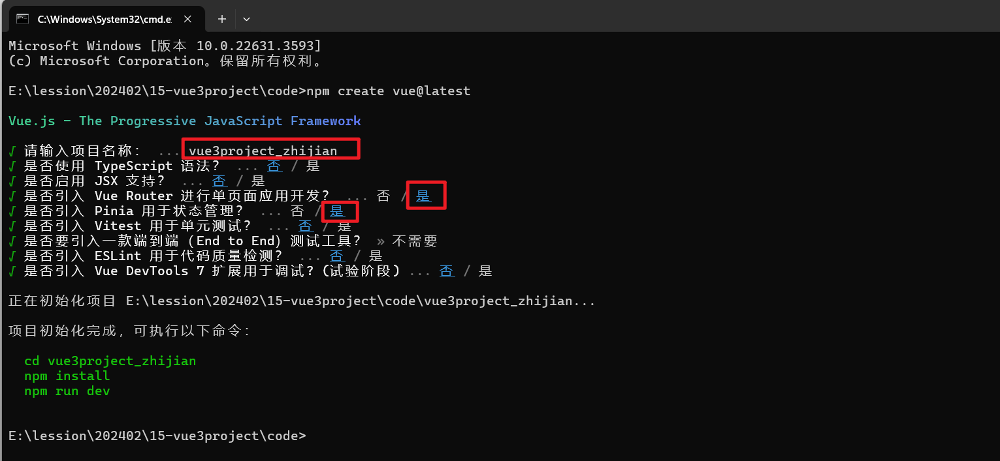
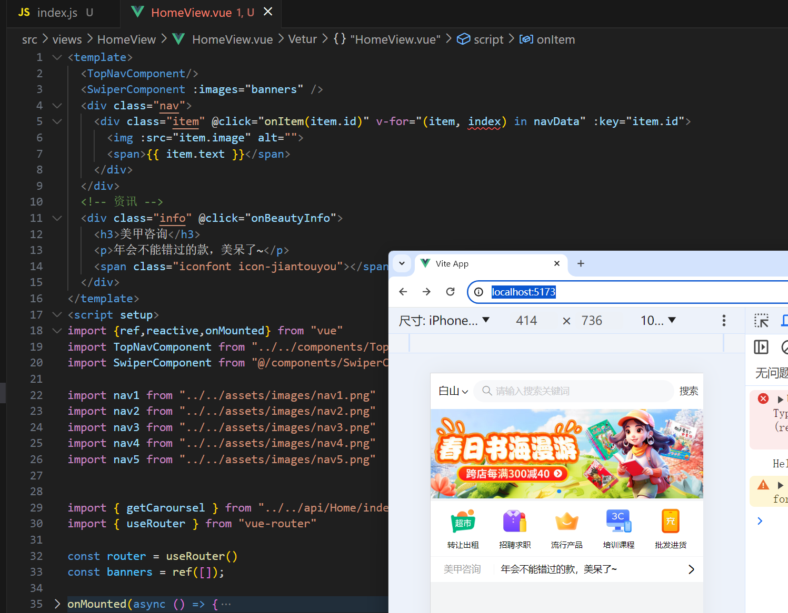

### 1，创建一个Vue3项目


创建项目：




初始化本地仓库：


进行本地仓库的管理：


让本地仓库和远程仓库进行关联：


把代码推送到远程仓库：


查看远程仓库：https://gitee.com/tubie/vue3project_zhijian


安装项目所需要的依赖(后面用到其它的模块，再去安装)：

```
"vant": "^4.8.10",
"pinia-plugin-persist": "^1.0.0",
"less": "^4.2.0",
"less-loader": "^12.2.0",
"axios": "^1.6.8",
"crypto-js": "^4.2.0",
"querystring": "^0.2.1",
"vue-baidu-map-3x": "^1.0.38",
```


运行项目：


查看效果：


项目的原型图：


网上也有一些开源的设计图：https://www.axureshop.com/


### 2，项目集成vant

vant官网：https://vant-ui.github.io/vant/#/zh-CN


如何使用vant:


第一步：


第二步：


第三步：


### 3，创建tabbar

目标：


创建tabbar所对应的几个组件：


创建Layout组件：


配置路由：


```js
import { createRouter, createWebHistory } from 'vue-router'

import LayoutView from "../views/LayoutView.vue"
import HomeView from '../views/HomeView/HomeView.vue'
import PlaceView from "../views/PlaceView/PlaceView.vue"
import ShopView from '../views/ShopView/ShopView.vue'
import PersonView from "../views/PersonView/PersonView.vue"
import MineView from "../views/MineView/MineView.vue"

const router = createRouter({
  history: createWebHistory(import.meta.env.BASE_URL),
  routes: [
    {
      path:"/",
      name: 'layout',
      component: LayoutView,
      children:[
        {
          path:"/",
          name:"home",
          component: HomeView
        },
        {
          path: "/place",
          name: "place",
          component: PlaceView
        },
        {
          path: "/shop",
          name: "shop",
          component: ShopView
        },
        {
          path: "/person",
          name: "person",
          component: PersonView
        },
        {
          path: "/mine",
          name: "mine",
          component: MineView
        }
      ]
    }
  ]
})

export default router
```


然后就需要实现tabbar组件，把tabbar组件封装好后，放到layout组件中，vant中已经实现了：


要使用tabbar，需要一些图片资源和一些其它资源：


在tabbar中需要使用到10张图片，实现tabbar组件：


```vue
<template>
    <van-tabbar v-model="active">
        <van-tabbar-item name="shouye" to="/">
            <span>首页</span>
            <template #icon="props">
                
            </template>
        </van-tabbar-item>
        <van-tabbar-item name="place" to="/place">
            <span>选址</span>
            <template #icon="props">
                
            </template>
        </van-tabbar-item>
        <van-tabbar-item name="shop" to="/shop">
            <span>商城</span>
            <template #icon="props">
                
            </template>
        </van-tabbar-item>
        <van-tabbar-item name="person" to="/person">
            <span>人才</span>
            <template #icon="props">
                
            </template>
        </van-tabbar-item>
        <van-tabbar-item name="mine" to="/mine">
            <span>我的</span>
            <template #icon="props">
                
            </template>
        </van-tabbar-item>
    </van-tabbar>
</template>
<script setup>

import { ref, reactive } from "vue"
import shouye from "../assets/images/shouye.png"
import shouye_select from "../assets/images/shouye_select.png"
import shop from "../assets/images/shop.png"
import shop_select from "../assets/images/shop_select.png"
import place from "../assets/images/place.png"
import place_select from "../assets/images/place_select.png"
import person from "../assets/images/person.png"
import person_select from "../assets/images/person_select.png"
import mine from "../assets/images/mine.png"
import mine_select from "../assets/images/mine_select.png"

const active = ref("shouye")

</script>
<style lang="less" scoped></style>
```


在layout组件中使用tabbar，如下：


```vue
<template>
    <router-view></router-view>
    <TabBarComponent />
</template>

<script setup>
import {ref,reactive} from "vue"
import TabBarComponent from "../components/TabbarComponent.vue";

</script>
<style lang="less" scoped>

</style>
```


修改选中的颜色：


在入口中引入重置样式和字体图标：


### 4，封装TopNav

目标：


vant已经封装好了：


使用之：


```vue
<template>
    <div class="header">
        <van-search shape="round" v-model="value" show-action placeholder="请输入搜索关键词">
            <template #left>
                <div class="city" @click="onCity">北京<span class="iconfont icon-jiantouxia"></span></div>
            </template>
            <template #action>
                <div @click="onClickButton">搜索</div>
            </template>
        </van-search>
    </div>
</template>
<script setup>
import { ref, reactive } from "vue"
import { useRouter } from "vue-router"

const router = useRouter()

const value = ref("");

const onCity = ()=>{
    router.push("/city")
}

const onClickButton = ()=>{
    console.log('点击了搜索...');
}

</script>
<style lang="less" scoped>
.city{
    margin-right: 5px;
    span{
        font-size: 10px;
        margin: 0 3px;
    }
}
</style>
```


### 5，城市选择组件

创建City组件：


配置路由：


开始实现地址选择，在vant中也封装了一个组件，如下：


使用之：


```vue
<template>
    <van-index-bar>
        <div v-for="(value, key, index) in CityJSON.city_list" :key="index">
            <van-index-anchor :index="key" />
            <van-cell v-for="(item,cityIndex) in CityJSON.city_list[key]" :key="cityIndex"  :title="item.city" @click="onChangeCity(item.city)"/>
        </div>
    </van-index-bar>
</template>
<script setup>
import { ref, reactive } from "vue"
import CityJSON from "../../assets/json/city_list.json"
import { useRouter } from "vue-router"

const router = useRouter()

const onChangeCity = (city)=>{
    // console.log("city:",city)
    router.back()
}
</script>
<style lang="less" scoped></style>
```


### 5，集成pinia

创建city仓库：


```js
import { defineStore } from "pinia"
export const useCityStore = defineStore("city", {
    state: () => ({
        city: "北京"
    }),
})
```


使用：


修改仓库中的数据：


测试：


持久化：


实现之：


```js
import { defineStore } from "pinia"
export const useCityStore = defineStore("city", {
    state: () => ({
        city: "北京"
    }),
    persist: {
        enabled: true,
        strategies: [{
            storage: localStorage,
            key: "city"
        }]
    }
})
```


在main.js中配置：


### 6，实现公共的返回组件

创建组件：


```vue
<template>
  <div class="pub-header">
    <van-nav-bar :title="props.title" left-text="返回" left-arrow @click-left="onClickLeft" />
  </div>
</template>
<script setup>
import {ref,reactive} from "vue"

const props = defineProps({
    title:String
})

const onClickLeft = ()=>{
    // window.history
    history.back();
}
</script>
<style lang="less" scoped>

</style>
```


在地址选择页面中使用：


```vue
<template>
    <CityHeader :title="title"/>
    <div class="current-city">
        <h3>当前定位城市</h3>
        <div>北京</div>
    </div>
    <div class="change-city">选择城市</div>
    <van-index-bar>
        <div v-for="(value, key, index) in CityJSON.city_list" :key="index">
            <van-index-anchor :index="key" />
            <van-cell v-for="(item,cityIndex) in CityJSON.city_list[key]" :key="cityIndex"  :title="item.city" @click="onChangeCity(item.city)"/>
        </div>
    </van-index-bar>
</template>
<script setup>
import { ref, reactive } from "vue"
import CityHeader from "../../components/PubHeaderComponent.vue"
import CityJSON from "../../assets/json/city_list.json"
import { useCityStore } from "../../stores/city"
import { useRouter } from "vue-router"

const cityStore = useCityStore()
const router = useRouter()

const title = "城市选择"

const onChangeCity = (city)=>{
    // console.log("city:",city)
    cityStore.city = city
    router.back()
}
</script>
<style lang="less" scoped>
.current-city {
    background: #fff;
    margin: 10px 0;
    padding: 10px;

    h3 {
        font-size: 14px;
        color: #999;
        font-weight: 400;
    }

    div {
        font-size: 14px;
        margin-top: 15px;
    }
}

.change-city {
    background: #fff;
    margin: 10px 0;
    padding: 10px;
}
</style>
```


修改组件的样式：


```html
<style lang="less">
// 公共导航返回按钮样式修改
.van-nav-bar  .van-nav-bar__text{
    color: #684886 !important;
}
.van-nav-bar .van-icon{
    color: #684886 !important;
}
</style>
```


### 7，轮播图

封装轮播图组件：


```vue
<template>
    <van-swipe :autoplay="3000" lazy-render>
        <van-swipe-item v-for="(item,index) in images" :key="index">
            
        </van-swipe-item>
    </van-swipe>
</template>
<script setup>
import {ref,reactive} from "vue"

const props = defineProps({
    images:Array
})

</script>
<style lang="less" scoped>
img{
    width: 100%;
}
</style>
```


封装axios，如下：


```js
import axios from "axios"
import qs from "querystring"

const errorHandle = (status,info) =>{
    switch(status){
        case 400:
            console.log("语义错误");
            break;
        case 401:
            console.log("服务器认证失败");
            break;
        case 403:
            console.log("服务器请求拒绝执行");
            break;
        case 404:
            console.log("请检查网路请求地址");
            break;
        case 500:
            console.log("服务器发生意外");
            break;
        case 502:
            console.log("服务器无响应");
            break;
        default:
            console.log(info);
            break;
    }
}
/**
 * 创建Axios对象
 */
const instance = axios.create({
    timeout:5000
})

instance.interceptors.request.use(
    config =>{
        if(config.method === 'post' || config.method === "put"){
            // name=iwen&age=20    { name:"iwen",age:20 }
            // config.data = qs.stringify(config.data)
        }
        return config
    },
    error => Promise.reject(error)
)
instance.interceptors.response.use(
    response => response.status === 200 ? Promise.resolve(response) : Promise.reject(response),
    error => Promise.reject(error)
)
export default instance
```


API接口：http://123.249.16.147:3000/api/banner


ajax发请求有跨域问题，前端配置代理解决跨域：


```js
  server:{
    proxy:{
      "^/api":{
        target:"http://123.249.16.147:3000/",
        changeOrigin:true,
        rewrite:(path) => path.replace(/^\/api/,"")
      }
    }
  }
```


封装API接口：


```js
import axios from "../../utils/request"

// banner轮播图
export function getCaroursel(){
    return axios({
        url:"/api/api/banner",
        method:"get"
    })
}
```


在Home组件中调用接口：


测试：


使用：


### 8，首页导航实现

准备数据：


书写HTML+CSS，如下：


```vue
<template> 
  <TopNavComponent/>
  <SwiperComponent :images="banners" />
  <div class="nav">
    <div class="item" @click="onItem(item.id)" v-for="(item, index) in navData" :key="item.id">
      
      <span>{{ item.text }}</span>
    </div>
  </div>
</template>
<script setup>
import {ref,reactive,onMounted} from "vue"
import TopNavComponent from "../../components/TopNavCompponent.vue"
import SwiperComponent from "@/components/SwiperComponent.vue";

import nav1 from "../../assets/images/nav1.png"
import nav2 from "../../assets/images/nav2.png"
import nav3 from "../../assets/images/nav3.png"
import nav4 from "../../assets/images/nav4.png"
import nav5 from "../../assets/images/nav5.png"


import { getCaroursel } from "../../api/Home/index"

const banners = ref([]);

onMounted(async () => {
  const res = await getCaroursel();
  // console.log("res:",res)
  if (res.data.status === 200) {
    banners.value = res.data.data
  }
})

// 首页导航数据
const navData = [
  {
    id: 1,
    text: "转让出租",
    image: nav1
  },
  {
    id: 2,
    text: "招聘求职",
    image: nav2
  },
  {
    id: 3,
    text: "流行产品",
    image: nav3
  },
  {
    id: 4,
    text: "培训课程",
    image: nav4
  },
  {
    id: 5,
    text: "批发进货",
    image: nav5
  }
]

const onItem = (id)=>{

}
</script>
<style lang="less" scoped>
.nav {
  background: #fff;
  width: 100%;
  padding: 10px;
  box-sizing: border-box;
  overflow: hidden;
  clear: both;

  .item {
    width: 20%;
    float: left;
    // text-align: center;
    display: flex;
    flex-direction: column;
    align-items: center;
    justify-content: center;

    img {
      width: 40px;
    }

    span {
      display: block;
      font-size: 12px;
      margin-top: 10px;
    }
  }
}
</style>
```


### 9，资讯和推荐

实现资讯：




```html
  <!-- 资讯 -->
  <div class="info" @click="onBeautyInfo">
    <h3>美甲咨询</h3>
    <p>年会不能错过的款，美呆了~</p>
    <span class="iconfont icon-jiantouyou"></span>
  </div>
```


```css
.info {
  background: #fff;
  display: flex;
  padding: 10px 0;
  align-items: center;
  border-top: 1px solid #f3f4f5;

  h3 {
    font-size: 14px;
    color: #999;
    font-weight: 400;
    padding: 0 20px;
    border-right: 1px solid #f3f4f5;
  }

  p {
    font-size: 14px;
    margin-left: 10px;
  }

  span {
    flex: 1;
    text-align: right;
    padding-right: 10px;
  }
}
```


```js
import { useRouter } from "vue-router"
const router = useRouter()
// 点击资讯
const onBeautyInfo = ()=>{
  router.push("/beauty")
}
```


推荐：


```html
  <!-- 推荐 -->
  <div class="recommend">
    <div class="hot">
      <h3>热门活动</h3>
    </div>
    <div class="opt">
      <h3>优选店铺</h3>
    </div>
  </div>
```


```css
.recommend {
  width: 100%;
  background-color: #fff;
  margin-top: 5px;
  display: flex;
  padding: 10px;
  box-sizing: border-box;

  div {
    flex: 1;
    height: 80px;
    border-radius: 10px;
    display: flex;
    justify-content: center;
    align-items: center;
  }

  .hot {
    background: url("../../assets/images/home-cb1.png");
    background-position: center;
    background-size: cover;
    margin-right: 5px;
  }

  .opt {
    background: url("../../assets/images/home-cb2.png");
    background-position: center;
    background-size: cover;
    margin-left: 5px;
  }
}
```


### 10，实现资讯


创建资讯页面：


配置路由：


测试：


资讯页面：


实现：


