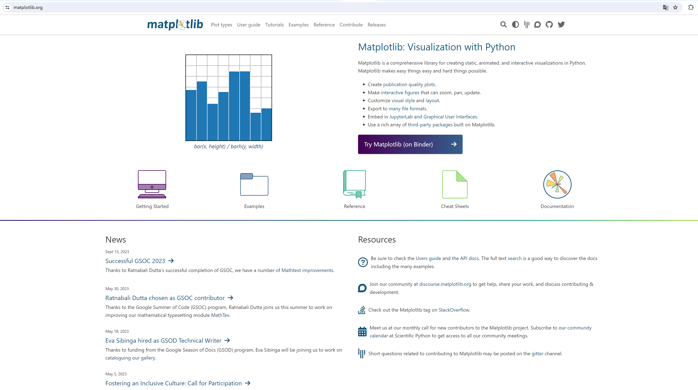
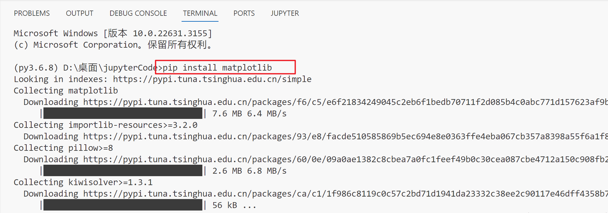
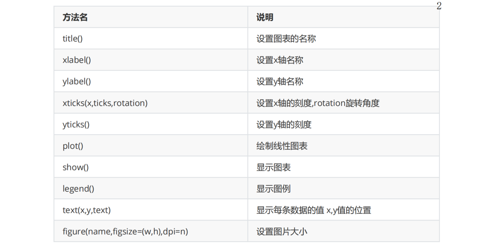
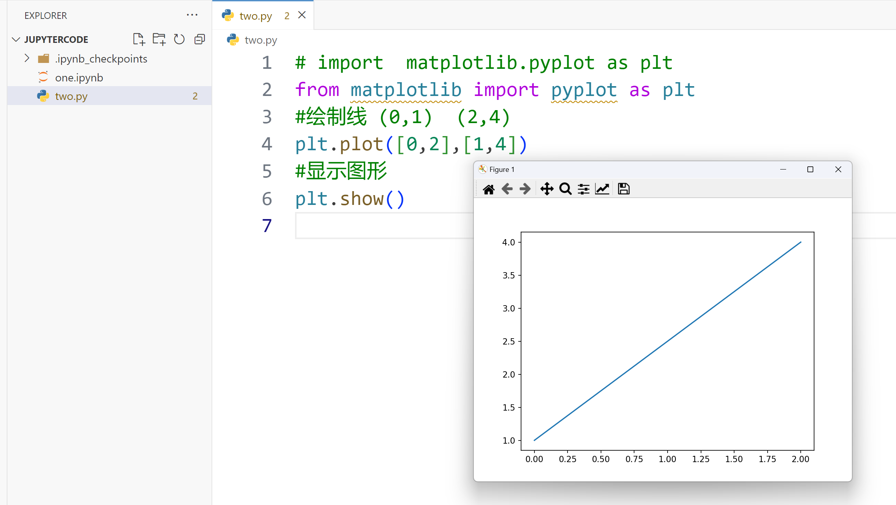
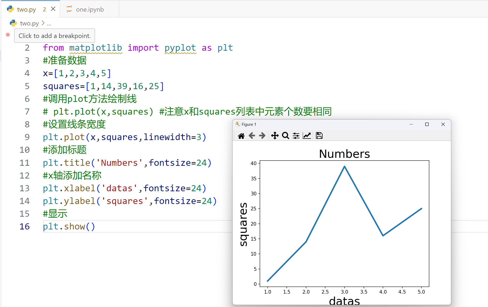
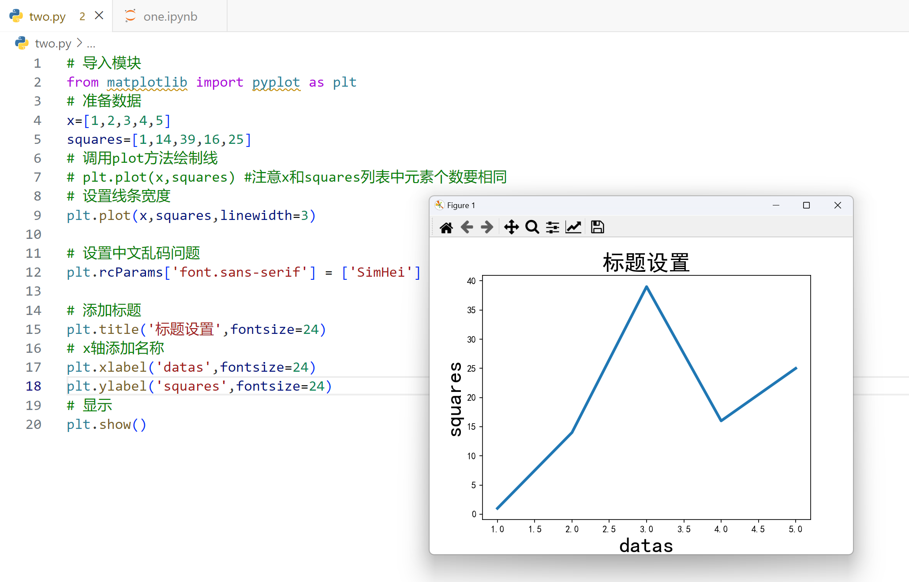
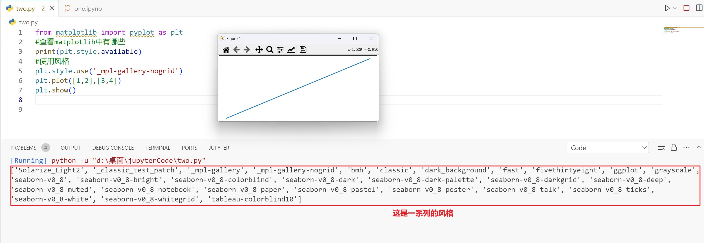
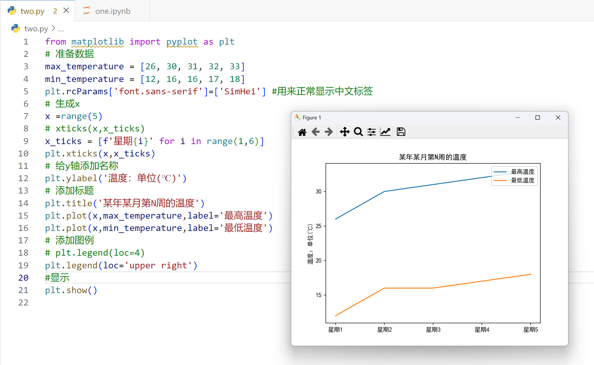
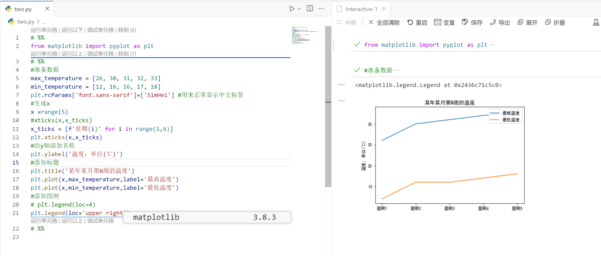

## 一，Matplotlib


### 1，Matplotlib介绍

Matplotlib 是一个 Python 的 2D绘图库。通过 Matplotlib，开发者可以仅需要几行代码，便可以生成绘图，直方图，功率谱，条形图，错误图，散点图等。官网：https://matplotlib.org/ 




为什么学习Matplotlib

- 可让数据可视化，更直观的真实给用户。使数据更加客观、更具有说服力。
- Matplotlib是Python的库，又是开发中常用的库


### 2，Matplotlib安装


安装：pip install matplotlib。




在使用Matplotlib绘制图形时，其中有两个最为常用的场景。一个是画点，一个是画线。pyplot基本方法的使用如下表。 



### 3，绘制直线


代码演示：

```python
# import  matplotlib.pyplot as plt
from matplotlib import pyplot as plt
#绘制线 (0,1)  (2,4)
plt.plot([0,2],[1,4])
#显示图形
plt.show()
```


效果：




### 4，绘制拆线


代码演示：

```python
#导入模块
from matplotlib import pyplot as plt
#准备数据
x=[1,2,3,4,5]
squares=[1,14,39,16,25]
#调用plot方法绘制线
# plt.plot(x,squares) #注意x和squares列表中元素个数要相同
#设置线条宽度
plt.plot(x,squares,linewidth=3)
#添加标题
plt.title('Numbers',fontsize=24)
#x轴添加名称
plt.xlabel('datas',fontsize=24)
plt.ylabel('squares',fontsize=24)
#显示
plt.show()
```


效果：




Matplotlib 默认情况不支持中文，我们可以使用以下简单的方法来解决： 

```python
plt.rcParams['font.sans-serif']=['SimHei'] # 用来正常显示中文标签
```


代码演示：

```python
# 导入模块
from matplotlib import pyplot as plt
# 准备数据
x=[1,2,3,4,5]
squares=[1,14,39,16,25]
# 调用plot方法绘制线
# plt.plot(x,squares) #注意x和squares列表中元素个数要相同
# 设置线条宽度
plt.plot(x,squares,linewidth=3)

# 设置中文乱码问题
plt.rcParams['font.sans-serif'] = ['SimHei']

# 添加标题
plt.title('标题设置',fontsize=24)
# x轴添加名称
plt.xlabel('datas',fontsize=24)
plt.ylabel('squares',fontsize=24)
# 显示
plt.show()
```


效果：




风格设置：

```python
from matplotlib import pyplot as plt
# 查看matplotlib中有哪些
print(plt.style.available)
# 使用风格
plt.style.use('_mpl-gallery-nogrid')
plt.plot([1,2],[3,4])
plt.show()
```


效果：




### 5，某周最高温度和最低温度变化


代码如下：

```python
from matplotlib import pyplot as plt
# 准备数据
max_temperature = [26, 30, 31, 32, 33]
min_temperature = [12, 16, 16, 17, 18]
plt.rcParams['font.sans-serif']=['SimHei'] #用来正常显示中文标签
# 生成x
x =range(5)
# xticks(x,x_ticks)
x_ticks = [f'星期{i}' for i in range(1,6)]
plt.xticks(x,x_ticks)
# 给y轴添加名称
plt.ylabel('温度：单位(℃)')
# 添加标题
plt.title('某年某月第N周的温度')
plt.plot(x,max_temperature,label='最高温度')
plt.plot(x,min_temperature,label='最低温度')
# 添加图例
# plt.legend(loc=4)
plt.legend(loc='upper right')
#显示
plt.show()
```


效果：




使用%%在jupyter中运行，这样，就可以边写代码，边看效果了。如下：




