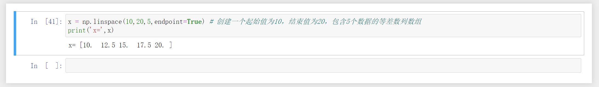

### 一，Numpy


### 1，Numpy是什么

​	numpy(Numerical Python) 是科学计算基础库，提供大量科学计算相关功能，比如数据统计，随机数生成等。其提供最核心类型为多维数组类型（ndarray），支持大量的维度数组与矩阵运算，numpy支持向量处理ndarray对象，提高程序运算速度。


通过安装Anaconda可以安装numpy：

> conda install numpy


### 2，array创建数组


​	numpy模块的array函数可以生成多维数组。例如，如果要生成一个二维数组，需要向array函数传递一个列表类型的参数。每一个列表元素是一维的ndarray类型数组，作为二维数组的行。另外，通 过ndarray类的shape属性可以获得数组每一维的元素个数（元组形式），也可以通过shape[n]形式获得每一维的元素个数，其中n是维度，从0开始。 


语法：

> numpy.array(object, dtype = None, copy = True, order = None, subok = False, ndmin = 0) 


创建一维：

```python
import numpy as np
b = np.array([1,2,3,4,5,6])
print(b)
print('b数组的形状：',b.shape)
```


结果：


创建二维：

```python
# 创建二维数组
c = np.array([
    [1,2,3],
    [4,5,6],
    [7,8,9]
])
print(c)
print('c数组的维度：',c.shape)
```


结果：


ndmin参数的使用：

```python
# ndmin参数的使用:如果没有指定ndmin（默认为0），则生成数组的维度根据传进来的第一个参数来决定
# 如果指定了ndmin，则指定生成数组的最小维度
d = np.array([1,2,3,4,5,6],ndmin=3)
print(d)
print(d.shape)
```


结果：


dtype参数的使用：

```python
# dtype指定了数组元素的数据类型
e = np.array([1,2,3,4,5,6],dtype=np.float64)
print(e)
```


结果：


### 3，arange创建数组

使用 arange 函数创建数值范围并返回 ndarray 对象，函数格式如下：

> numpy.arange([start,] stop[, step,], dtype=None)


arange生成0到5的数组：

```python
x1 = np.arange(0,6,dtype=int)  # start=0,stop=6（不包括）
x2 = np.arange(6)  # stop参数设置为6（不包括）
print('x1数组是：',x1)
print('x2数组是：',x2)
```


结果：


arange创建二维数组：

```python
# 通过array函数与arange函数配合使用创建二维数组
y = np.array([
    np.arange(1,4),
    np.arange(4,7),
    np.arange(7,10)
])
print(y)  # 打印数组
print(y.shape) # 形状
```


结果：


### 4，随机数创建

numpy中的random模块包含了很多函数可以用来产生随机数。


返回[0.0, 1.0)范围的随机数：

```python
x = np.random.random(size=4)  # 返回 [0.0, 1.0)的一维数组
y = np.random.random(size=(3,4)) # 创建二维数组，数据范围在[0.0, 1.0)
print('x=',x)
print('y=',y)
```


结果：


随机整数：

> numpy.random.randint()

该方法有三个参数low、high、size三个参数。默认high是None,如果只有low，那范围就是[0,low)。如果有high，范围就是[low,high)。 

```python
m = np.random.randint(5,size=10)  # low=5,创建包含10个元素的一维数组，每个元素的范围在[0,5)
print(m)
```


结果：


随机整数：

```python
n = np.random.randint(5,10,size=10)  # low=5,high=10,每个元素范围在[5,10)
print(n)
```


结果：


随机整数：

```python
w = np.random.randint(5,10,size=(2,3))  # 也可以通过size指定形状
print(w)
```


结果：


正态分布：

> numpy.random.randn(d0,d1,…,dn)

randn函数返回一个或一组样本，具有标准正态分布（期望为0，方差为1）。dn表格每个维度，返回值为指定维度的数组。


正态分布：

```python
# 从标准正态分布中随机获取数据，生成形状为（2，3）的数组
a = np.random.randn(2,3)  
# 从标准正态分布中随机获取数据，生成形状为（2，3,4）的数组
b = np.random.randn(2,3,4)
print('a=',a)
print('b=',b)
```


结果：


指定期望和方差的正态分布：

```python
# 从指定的均值与标准差的正态分布中随机获取数据
z = np.random.normal(loc=3,scale=4,size=(2,2,3))
print(z)
```


结果：


### 5，ndarray对象

​	numpy 最重要的一个特点是其 N 维数组对象 ndarray，它是一系列同类型数据的集合，以 0 下标为开始进行集合中元素的索引。 


ndarray 对象：

```python
# 先随机创建三个数组
x1 = np.random.randint(10,size=6)
x2 = np.random.randint(10,size=(3,4))
x3 = np.random.randn(3,4,5)
print("ndim:",x1.ndim,x2.ndim,x3.ndim)  # 数组的维度数量
print("shape:",x1.shape,x2.shape,x3.shape)  # 数组的形状
print("dtype:",x1.dtype,x2.dtype,x3.dtype)  # 数组中每个元素的数据类型
print("size:",x1.size,x2.size,x3.size)  # 数组中包含元素的个数
print("itemsize:",x1.itemsize,x2.itemsize,x3.itemsize)  # 数组中每个元素的大小，以字节为单位
```


结果：


### 6，zeros函数创建数组


创建指定大小的数组，数组元素以 0 来填充

> numpy.zeros(shape, dtype = float, order = 'C')


zeros函数创建数组：

```python
import numpy as np
x = np.zeros(5)  # 创建一个包含5个元素的全0数组
print("x=",x)

y = np.zeros((5,),dtype=int) # 创建一个包含5个元素的全0数组,设置元素类型为整数
print("y=",y)
```


结果：


形状为2x2的全0数组：

```python
z = np.zeros((2,2))  # 形状为2x2的全0数组
print("z=",z)
```


结果：


创建一个与z数组形状相同的全0数组：

```python
w = np.zeros_like(z)  # 创建一个与z数组形状相同的全0数组
print("w=",w)
```


结果：


### 7,ones函数创建数组


创建指定形状的数组，数组元素以 1 来填充。

> numpy.ones(shape, dtype = None, order = 'C')


创建一个包含5个元素的全1一维数组：

```python
x = np.ones(5)  # 创建一个包含5个元素的全1一维数组
print("x=",x)
```


结果：


创建一个形状为3x4的全1二维数组：

```python
y = np.ones((3,4),dtype=int) # 创建一个形状为3x4的全1二维数组
print("y=",y)
```


结果：


创建一个与y数组形状和元素数据类型相同的全1数组：

```python
z = np.ones_like(y)  # 创建一个与y数组形状和元素数据类型相同的全1数组
print("z=",z)
```


结果：


### 8，empty函数创建数组

创建一个指定形状（shape）、数据类型（dtype）且未初始化的数组

> numpy.empty(shape, dtype = float, order = 'C')


empty函数创建数组：

```python
# empty函数经常参与算法中的初始参数的生成
x = np.empty((2,2),dtype=np.float32)  # 创建形状为2x2的未初始化的数组
print("x=",x)
y = np.empty_like(x)  # 创建与x数组形状与数据类型相同的另一个数组
print("y=",y)
```


结果：


### 9，full函数创建数组

创建全为某个指定值的数组

> full(shape,fill_value)


创建二维：

```python
import numpy as np

a = np.full((2,2),3)  # 创建一个形状为2x2的数组，数组中的元素都填充为3
print("a=",a)
```


结果：


创建一个与a数组形状和数据类型相同的数组，数组中的填充元素都是6：

```python
b = np.full_like(a,6)  # 创建一个与a数组形状和数据类型相同的数组，数组中的填充元素都是6
print("b=",b)
```


结果：


### 10，创建单位矩阵数组

单位矩阵从左上角到右下角的对角线上的元素均为1,除此以外全都 为0。任何矩阵与单位矩阵相乘都等于本身，而且单位矩阵因此独特性在高等数学中也有广泛应用。 

> eye(N, M=None, k=0, dtype=<class 'float'>, order='C')


创建一个3阶单位矩阵数组：

```python
import numpy as np

a = np.eye(3)  # 创建一个3阶单位矩阵数组
print('a=',a)
```


结果：


创建一个3行2列的数组：

```python
np.eye(3,2)  # 创建一个3行2列的数组
```


结果：


创建一个5行4列的数组，第一行索引为2的位置是1：

```python
np.eye(5,4,k=2)  # 创建一个5行4列的数组，第一行索引为2的位置是1
```


结果：


### 11，linspace创建数组

linspace函数用于创建一个一维数组，数组是一个等差数列构成的，格式如下：

> np.linspace(start, stop, num=50, endpoint=True, retstep=False, dtype=None)


创建一个起始值为1，结束值为10，包含10个数据的等差数列数组：

```python
x = np.linspace(1,10,10)  # 创建一个起始值为1，结束值为10，包含10个数据的等差数列数组
print('x=',x)
```


结果：


创建一个起始值为10，结束值为20，包含5个数据的等差数列数组：

```python
x = np.linspace(10,20,5,endpoint=True) # 创建一个起始值为10，结束值为20，包含5个数据的等差数列数组
print('x=',x)
```


结果：




创建一个起始值为1，结束值为5(不包括)，包含5个数据的等差数列数组：

```python
# 创建一个起始值为1，结束值为5(不包括)，包含5个数据的等差数列数组
x = np.linspace(1,5,num=5,endpoint=False) 
print('x=',x)
```


结果：


创建一个起始值为10，结束值为20，包含5个数据的等差数列数组,返回结果也显示了等差数列的公差（步幅）：

```python
# 创建一个起始值为10，结束值为20，包含5个数据的等差数列数组,返回结果也显示了等差数列的公差（步幅）
x = np.linspace(10,20,5,endpoint=True,retstep=True) 
print('x=',x)
```


结果：


### 12，logspace创建数组


logspace 函数用于创建一个于等比数列。格式如下：

> np.logspace(start, stop, num=50, endpoint=True, base=10.0, dtype=None) 


生成一个等比数列，第一项值为2^0，最后一项的值为2^9，数列中包含10个数：

```python
# 生成一个等比数列，第一项值为2^0，最后一项的值为2^9，数列中包含10个数
x = np.logspace(0,9,10,base=2)
print('x=',x)
```


结果：


生成一个等比数列，第一项值为10^0，最后一项的值为10^3，数列中包含4个数：

```python
# 生成一个等比数列，第一项值为10^0，最后一项的值为10^3，数列中包含4个数
x = np.logspace(0,3,num=4)
print('x=',x)
```


结果：


### 13，一维数组索引和切片

​	ndarray对象的内容可以通过索引或切片来访问和修改，与 Python中 list 的切片操作一样。 ndarray 数组可以基于 0 - n 的下标进行索引，并设置 start, stop及 step 参数进行，从原数组中切割出一个新数组。


一维数组索引和切片：

```python
x = np.arange(10)
print('x=',x)
print('x[2]=',x[2])  # 获取索引为2的元素
print('x[2:7:2]=',x[2:7:2]) # 获取索引为2-7的元素,按照step=2的规律获取
print('x[2:]=',x[2:])  # 从索引为2的位置截取到数组结尾，进行切片得到新数组
```


结果：


获取倒数第二个元素：

```python
x[-2]  # 获取倒数第二个元素
```


结果：


从倒数第二个元素开始截取数组，进行切片得到新数组：

```python
x[-2:] # 从倒数第二个元素开始截取数组，进行切片得到新数组
```


结果：


### 14，二维数组的索引和切片


创建二维：

```python
x = np.arange(1,13)  # 创建一个一维数组
a = x.reshape(4,3)   # 将一维数组的形状重塑，生成一个新的二维数组
a
```


结果：


获取二维数组的索引为1的那一行（第二行）：

```python
a[1]  # 获取二维数组的索引为1的那一行（第二行）
```


结果：


索引为2的行（第三行）中的索引为1的元素（第二个数据）：

```python
a[2][1]  # 索引为2的行（第三行）中的索引为1的元素（第二个数据）
```


结果：


获取所有行的索引为1的列（第二列）：

```python
a[:,1]  # 获取所有行的索引为1的列（第二列）
```


结果：


第三行第二列的数：

```python
a[2,1] # 第三行第二列的数
```


结果：


奇数行的第一列：

```python
a[::2,0] # 奇数行的第一列
```


结果：


同时获取第三行第二列的数，第四行第一列的数：

```python
a[(2,3),(1,0)] # 同时获取第三行第二列的数，第四行第一列的数
```


结果：


获取最后一行：

```python
a[-1]  # 获取最后一行
```


结果：


行倒序：

```python
a[::-1]  # 行倒序
```


结果：


行列都倒序：

```python
a[::-1,::-1] # 行列都倒序
```


结果：


创建3x4的二维数组：

```python
a = np.arange(1,13).reshape(3,4)  # 创建3x4的二维数组
a
```


结果：


获取前两行和前两列组成的数组：

```python
sub_array = a[:2,:2]  # 获取前两行和前两列组成的数组
sub_array
```


结果：


修改第1行第1列的值为1000：

```python
sub_array[0][0] = 1000  # 修改第1行第1列的值为1000
sub_array
```


结果：


发现a数组的对应位置的值也改变了


数组拷贝：

```python
sub_array2 =  np.copy(a[:2,:2])  # 数组拷贝
sub_array2
```


结果：


修改第1行第1列的值为2000：

```python
sub_array2[0][0] = 2000 # 修改第1行第1列的值为2000
sub_array2
```


结果：


a数组的相应位置的值并没有改变，说明只是改变了拷贝的数组，原来的a数组并未改变：


### 15，改变数组的维度


行倒序：

```python

```


结果：


行倒序：

```python

```


结果：


行倒序：

```python

```


结果：


行倒序：

```python

```


结果：


行倒序：

```python

```


结果：


行倒序：

```python

```


结果：


行倒序：

```python

```


结果：


行倒序：

```python

```


结果：

行倒序：

```python

```


结果：


行倒序：

```python

```


结果：


