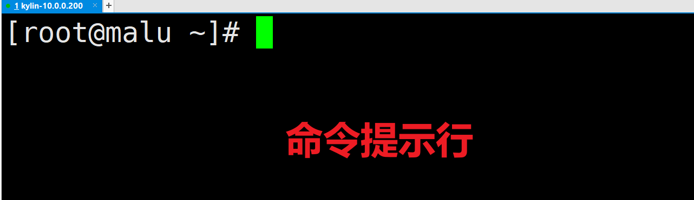

## 一，前置内容

### 1，Linux严格区分大小写

Linux严格区分大小写，Windows不区分大小写，演示：


Linux演示：


由以上图解可知：Linux是一个非常严谨的操作系统，严格区分大小写。


总结：

- Linux 和Windows不同，Linux严格区分大小写的，包括文件名和目录名、命令、命令选项、配置文件设置选项等。
- window不不严格区分大小写的，Win7 系统桌面上有文件夹叫做Test，当我们在桌面上再新建一个名为 test 的文件夹时，系统会提示文件夹命名冲突；


### 2，Linux文件"扩展名"

> 在Linux操作系统中，与Windows不同，其文件的类型不是通过扩展名来进行区分的！


我们都知道，Windows 是依赖扩展名区分文件类型的，比如，".txt" 是文本文件、".exe" 是执行文件，但 Linux 不是。Linux 系统通过**权限位标识**来确定文件类型，常见的文件类型有普通文件、目录、链接文件、块设备文件、字符设备文件等几种。Linux 的可执行文件就是普通文件被赋予了可执行权限。


Linux系统中常见的后缀名称：

- Linux 中的一些特殊文件还是要求写 "扩展名" 的，但 Linux 不依赖扩展名来识别文件类型，写这些扩展名是为了帮助运维人员或者开发人员来区分不同的文件类型。
- 压缩包：Linux 下常见的压缩文件名有 .gz、.bz2、.zip、.tar.gz、.tar.bz2、.tgz 等。
- 二进制软件包：CentOS 中所使用的二进制安装包是 RPM 包，所有的 RPM 包都用".rpm"扩展名结尾，目的同样是让管理员一目了然。=> 类似Windows中的exe文件
- 程序文件：Shell 脚本一般用 ".sh" 扩展名结尾。=> startup.sh  tomcat开机就执行startup.sh
- 网页文件：网页文件一般使用 ".php" 等结尾，不过这是网页服务器的要求，而不是 Linux 的要求。
  .html/.css/.js/.jsp/.php/.py => 网页文件


### 3，Linux命令提示行




解释：

- root   表示当前登录的系统用户
- @   分隔符
- malu   主机名 (在企业中需要根据业务需求修改)
- ~   表示当前所在的路径 随着路径变化而变，默认的~表示家目录
- `#`  表示用户提示符 # 是管理员(皇帝)   $是普通用户(贫民)


### 4，Linux命令语法结构

结构1: 命令   直接回车

```shell
[root@malu ~]# ls
anaconda-ks.cfg  initial-setup-ks.cfg
[root@malu ~]# 
```


结构2: 命令 空格 文件/目录

```shell
[root@malu ~]# ls /tmp/
systemd-private-ee67abb5a54a4c51a2d0267b8ac11263-bluetooth.service-9F1TPe
systemd-private-ee67abb5a54a4c51a2d0267b8ac11263-chronyd.service-RBQM1n
systemd-private-ee67abb5a54a4c51a2d0267b8ac11263-systemd-logind.service-VxqfTL
[root@malu ~]# 
```


结构3: 命令 空格 [参数选项] 空格 文件/目录    在Linux 系统中[] 表示可选择,任意单个含义

```shell
[root@malu ~]# ls -a /tmp/
.
..
.font-unix
.ICE-unix
systemd-private-ee67abb5a54a4c51a2d0267b8ac11263-bluetooth.service-9F1TPe
systemd-private-ee67abb5a54a4c51a2d0267b8ac11263-chronyd.service-RBQM1n
systemd-private-ee67abb5a54a4c51a2d0267b8ac11263-systemd-logind.service-VxqfTL
.Test-unix
.X11-unix
.XIM-unix
[root@malu ~]# 

[root@malu ~]# ls -ltr /etc/
总用量 1292
-rw-r--r--  1 root root      261  3月 27  2013 quotatab
-rw-r--r--  1 root root      220  3月 27  2013 quotagrpadmins
-rw-r--r--  1 root root     2391  7月 24  2015 libuser.conf
-rw-r--r--  1 root root     3360 12月 17  2015 warnquota.conf
-rw-r--r--  1 root root     1634  8月  1  2018 rpc
-rw-r--r--  1 root root     4945  8月 17  2018 wgetrc
-rw-r-----  1 root chrony    540  5月 10  2019 chrony.keys
-rw-r--r--  1 root root      434 10月 14  2019 logrotate.conf
-rw-r--r--  1 root root      587 10月 29  2019 updatedb.conf
-rw-r--r--  1 root root      587  1月 12  2020 krb5.conf
drwx------  2 root root        6  3月 14  2020 cron.weekly
-rw-------  1 root root      451  3月 14  2020 crontab
drwx------  2 root root        6  3月 14  2020 cron.monthly
-rw-r--r--  1 root root     2872  3月 15  2020 pinforc
```


### 5，Linux的目录结构

Linux 系统不同于 Windows，没有 C 盘、D 盘、E 盘那么多的盘符，只有一个根目录（/），所有的文件（资源）都存储在以根目录（/）为树根的树形目录结构中。


Windows：


Linux：


windows目录结构特点（分区: 把一块盘分成几块盘）:

- C：windows/桌面
- D：/学习资料/大片/
- E：/软件包/
- F：/视频/


Linux目录结构特点:

-  /   只有1个根分区 一切都  / 开始
- /etc/
- /tmp
- /root/


查看linux根目录下都有哪些文件或文件夹：

```shell
[root@malu ~]# cd /
[root@malu /]# ls -l /
总用量 16
lrwxrwxrwx    1 root root    7  3月  6  2021 bin -> usr/bin
dr-xr-xr-x.   6 root root 4096  8月  5 16:28 boot
drwxr-xr-x   20 root root 4040  8月  5 16:28 dev
drwxr-xr-x  121 root root 8192  8月  5 16:34 etc
drwxr-xr-x    2 root root    6  3月  6  2021 home
lrwxrwxrwx    1 root root    7  3月  6  2021 lib -> usr/lib
lrwxrwxrwx    1 root root    9  3月  6  2021 lib64 -> usr/lib64
drwxr-xr-x    2 root root    6  3月  6  2021 media
drwxr-xr-x    2 root root    6  3月  6  2021 mnt
drwxr-xr-x    4 root root   53  7月 29 20:47 opt
dr-xr-xr-x  214 root root    0  8月  5 16:28 proc
dr-xr-x---    3 root root  156  7月 29 20:49 root
drwxr-xr-x   40 root root 1140  8月  5 16:28 run
lrwxrwxrwx    1 root root    8  3月  6  2021 sbin -> usr/sbin
drwxr-xr-x    2 root root    6  3月  6  2021 srv
dr-xr-xr-x   14 root root    0  8月  5 16:28 sys
drwxrwxrwt   10 root root  200  8月  5 16:40 tmp
drwxr-xr-x   12 root root  144  7月 29 20:44 usr
drwxr-xr-x   22 root root  303  7月 29 20:48 var

```


看图：


在 Linux 根目录（/）下包含很多的子目录，称为一级目录。 例如 bin、boot、dev 等。同时，各一级目录下还含有很多子目录，称为二级目录。 例如 /bin/bash、/bin/ed 等。


解释：

- /bin：系统命令目录
- /sbin：超级命令目录，只能超级管理员可以执行的命令
- /boot：系统目录，类似于Windows中的C盘
- /dev ：设备文件目录，硬盘、光驱、U盘都属于设备文件，/dev/sr0代表光驱设备。注意，此目录下的文件没有办法直接使用，必须先挂载
- /etc ：非常重要，代表系统的配置文件目录。大部分软件安装完成后，其配置文件都存放在此目录
- /home：普通用户的家目录，用户登录后会自动切换到此目录
- /root：超级管理员的家目录，超级管理员登录后会自动切换到此目录
- /media：挂载目录，早期Linux挂载目录，用于挂载光盘以及软盘
- /mnt：挂载目录，用来挂载额外的设备，如 U 盘、移动硬盘和其他操作系统的分区
- /opt ：第三方软件目录，这个目录是放置和安装其他软件的位置，手工安装的源码包软件都可以安装到这个目录中。不过笔者还是习惯把软件放到 /usr/local/ 目录中，也就是说，/usr/local/ 目录也可以用来安装软件
- /usr ：系统程序目录，类似Windows中的Program Files
- /proc：虚拟文件系统。该目录中的数据并不保存在硬盘上，而是保存到内存中。主要保存系统的内核、进程、外部设备状态和网络状态等。
- /tmp ：临时文件目录，在该目录下，所有用户都可以访问和写入。建议此目录中不能保存重要数据，最好每次开机都把该目录清理
- /var ：经常变化的文件目录，网页文件、数据文件、日志文件


总结常用的目录：

```shell
bin # 二进制命令
boot # 开机引导程序  内核
dev # 硬件设备所在的目录
etc # 存放配置文件的目录 web服务 nginx服务 /etc/nginx/nginx.conf
home # 普通用户的家目录
mnt # 临时挂载点 默认是空
opt # 第三方程序默认安装的目录 类似华为手机 只有华为应用商城 默认为空
proc # 内存的映射目录 查看cpu 内存 系统负载
root # 管理员的家 类似皇宫
sbin - # 超级管理员可允许的命令
tmp # 临时文件存放文件的目录 类似windows的回收站 不要得东西不要使用删除功能，移动到/tmp目录
usr # 用户程序存放的位置 软件
var # 日志存放的位置
```


### 6，Linux运维人员的核心职责

- 网站数据不能丢
- 网站7*24小时运转(通过监控手段+人工运维+微信通知+短信通知)
- 提升用户体验，访问速度要快


## 二，基础命令


### 1，pwd命令

主要功能：pwd=print working directory，打印当前工作目录（告诉我们，我们当前位置）


注意：

- 所有的命令需要区分大小写
- 路径和路径之间不允许有空格


语法：

```shell
语法格式: 
	pwd # 直接回车
```


演示：

```shell
[root@malu /]# pwd   # 查看当前所在的路径 print working directory
/
[root@malu /]# cd /root/
[root@malu ~]# pwd
/root
[root@malu ~]# 
```


### 2，cd命令

主要功能：cd全称change directory，切换目录（从一个目录跳转到另外一个目录）


语法格式：

```shell
cd 目录/相对路径/绝对路径（从根开始）

参数选项:
	cd ~ # 回到家目录
	cd   # 直接回车 快速回到家目录
	cd  /root # 回到家目录
	cd  - # 快速回到上一次所在的目录
	cd .  # . 表示当前的目录 cp mv rm 都可以用(后面用)
	cd .. # 返回上一级目录
```


演示：

```shell
# 快速回到家目录
[root@malu etc]# pwd
/etc
[root@malu etc]# cd 
[root@malu ~]# 

# 快速回到上一次所在的目录
[root@malu etc]# pwd
/etc
[root@malu etc]# cd 
[root@malu ~]# cd -
/etc
[root@malu etc]# 
```


案例练习：

```shell
案例1.切换到/etc目录（绝对路径）
# cd /etc


案例2.切换到/etc目录（相对路径），1级1级的进入到etc
[root@malu /]# cd /
[root@malu etc]# cd etc

案例3.切换到/etc/sysconfig/network-scripts/
[root@malu ~]# cd /
[root@malu /]# cd etc/
[root@malu etc]# cd sysconfig/
[root@malu sysconfig]# cd network-scripts/
[root@malu network-scripts]# pwd
/etc/sysconfig/network-scripts
注意：使用tab键 目录后都带/ 文件后面没有/

# 使用绝对路径
[root@malu network-scripts]# cd /etc/sysconfig/network-scripts/
[root@malu network-scripts]# pwd
/etc/sysconfig/network-scripts
[root@malu network-scripts]# 

案例4.快速回到家目录
[root@malu network-scripts]# pwd
/etc/sysconfig/network-scripts
[root@malu network-scripts]# cd  # cd ~  # cd /root/
[root@malu ~]# pwd
/root
[root@malu ~]# 

案例5.快速回到上一次所在的目录
[root@malu network-scripts]# pwd
/etc/sysconfig/network-scripts
[root@malu network-scripts]# cd 
[root@malu ~]# cd -
/etc/sysconfig/network-scripts
[root@malu network-scripts]# pwd
/etc/sysconfig/network-scripts
[root@malu network-scripts]# 

案例6.返回到上级目录 ..
[root@malu network-scripts]# pwd
/etc/sysconfig/network-scripts
[root@malu network-scripts]# cd ..
[root@malu sysconfig]# cd ..
[root@malu etc]# cd ..
[root@malu /]# cd ..
[root@malu /]# 

或者：
[root@malu network-scripts]# pwd
/etc/sysconfig/network-scripts
[root@malu network-scripts]# cd ../../
[root@malu etc]# cd ..
[root@malu /]# 
```


### 3，clear命令

主要功能：清屏

基本语法：

```shell
# clear  # 快捷键  ctrl+l
```


### 4，reboot命令

主要功能：立即重启计算机

基本语法：

```shell
# reboot
```


### 5，shutdown命令

主要功能：立即关机或延迟关机

立即关机基本语法：

```shell
# shutdown -h 0或now
# shutdown -h 0
# shutdown -h now
选项说明：
-h ：halt缩写，代表关机

在Linux系统中，立即关机除了使用shutdown -h 0以外还可以使用halt -p命令
```


延迟关机基本语法：

```shell
# shutdown -h 分钟数
代表多少分钟后，自动关机
```


案例1：10分钟后自动关机

```shell
# shutdown -h 10
```


案例2：后悔了，取消关机

```shell
光标一直不停的闪，取消关机
# shutdown -c   CentOS7中还需要使用shutdown -c命令
```


### 6，ls命令


作用：查看当前目录下所有的文件 list

语法结构：

```shell
ls [参数选项] 目录/文件
ls 文件 # 查看文件是否存在
ls 目录 # 查看目录下所有的文件
ls 文件1 文件2 文件3 # 查看多个文件

参数选项：
	ls -l # 查看文件的详细信息
	ll # 查看文件的详细信息 相当于 ls -l   是linux命令的别名
	ls -a # 显示隐藏的文件，.文件表示隐藏文件
```


案例练习：

```shell
案例0.查看linux系统中某个命令的别保
[root@malu ~]# alias
alias cp='cp -i'
alias l.='ls -d .* --color=auto'
alias ll='ls -l --color=auto'
alias ls='ls --color=auto'
alias mv='mv -i'
alias rm='rm -i'
[root@malu ~]# 

起别名
[root@malu ~]# alias xixi='ls'
[root@malu ~]# xixi
anaconda-ks.cfg  initial-setup-ks.cfg
[root@malu ~]# 


案例1.查看/etc/hosts 文件是否存在


案例2.查看/etc/hosts /etc/passwd 是否存在


案例3.查找当前位置的oldboy和/etc/passwd


案例4.显示/tmp目录下所有的内容


案例5.显示/etc/sysconfig/network-scripts 下得所有文件


```


### 7，touch命令

创建普通文件，如果文件存在则修改文件的创建时间。不影响文件内容。


语法结构：

```shell
touch 文件 # 相对路径
touch /目录/文件 # 绝对路径
touch 文件1 文件2 # 创建多个文件
rm -rf * # 删除当前所有的文件

案例1.在当前目录创建malu.txt

写入test字符串到malu.txt 中

案例2./tmp目录下创建test.txt
相对路径演示：
第一步: 切换到/tmp目录
第二步: ll 查看下当前的文件
第三步: 创建test.txt

绝对路径演示:
第一步：删除/tmp/目录下所有的文件
第二步: ll 查看
第三步：使用绝对路径可以在任意路径下直接创建
第四步: ll 查看

案例3.在当前的malu目录中创建1.txt


```


