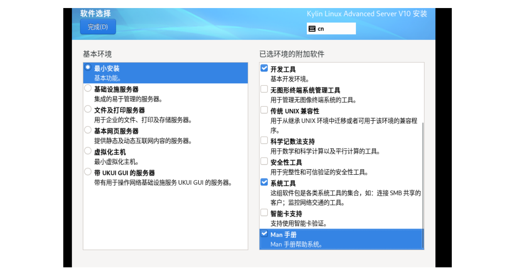
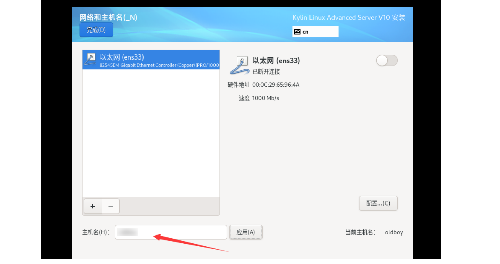

## 一，安装CentOS

### 1，什么是虚拟机

虚拟机目前有2 个比较有名的产品：

- vmware 出品的vmware workstation（推荐使用）
- oracle 出品的virtual Box。


> 特别注意：VMware WorkStation安装完毕后，其在网络适配器中会产生两张虚拟网卡。VMnet1与VMnet8，如果没有产生这两张网卡，则操作系统必须重装！


### 1，创建一台虚拟机

1.创建一个虚拟主机(类似我们自己购买一台服务器)


### 2，安装操作系统


## 二，安装麒麟


### 1，创建一台虚拟机（同上）

https://blog.csdn.net/2303_81265321/article/details/139654954


### 2，安装操作系统


如果安装带有桌面的，选择最后一个（带UKUI GUI的服务器）








读取遵从协议..


## 三，使用XShell远程连接工具连接


### 1，XShell连接


修改虚拟交换机信息，虚拟机-->左上角编辑-->虚拟网络编辑器


修改完成后重新连接：


输入密码


## 四，安装Ubuntu


### 1，创建一台虚拟机

过程同上，有一个地方，需要注意：


### 2，安装操作系统

安装操作系统，将镜像插入到cdrom光驱中


下一步需要将网络断开，因为在安装过程中回去官方更新软件包特别慢。右键虚拟机--》设置


记得将网络恢复


使用xshell连接


## 五，其它

### 1，vmware使用

开启vmware，只能开一次vmware，不能开两个vmware。看到以下提示说明开了两个vmware


解决方法: 关闭刚打开的vmware


关闭虚拟机，使用挂起功能(不会占用系统资源)，优势: 在使用直接开启，不需要走开机流程。


删除虚拟机，从挂起或者关机状态下，选中虚拟机-->右键-->管理-->从磁盘中删除。


快照功能：类似月光宝盒，在把操作系统玩坏了情况下，使用快照进行恢复。右键虚拟机-->快照-->拍摄快照 ： 给快照命令。

恢复快照：右键虚拟机-->快照-->恢复快照


### 2，关于远程连接


什么是IP地址？

- IP地址是服务器的身份证号,在局域网内唯一，类似家庭住址。


公网IP地址 全球任意的可以上网的位置都可以连接的IP。私网IP地址：


IP地址分为两部分组成: 网络地址+主机地址。只有在相同网段内的地址才可以通信。网络地址: 前三位相同 192.168.15. 类似昌平区 海淀区 朝阳区 不同的区域。主机地址: 1-254，类似 863软件园9号楼1520 具体的地址


什么是端口号：

- 端口就是表示不同的服务,Linux操作系统不知道什么是服务
- 22端口--->SSH服务 才可以进行远程连接 默认是开启的状态
- 80端口--->WEB服务
- 3306端口-->MySQL服务


类似于去医院:

- 1号--->挂号服务
- 2号--->缴费服务
- 3号--->取药服务


关于用户名：

- 管理员用户 类似皇帝 最高权限 Linux:root 
- windows:administrator
- 普通用户: 自个家活动 类似贫民


关于协议：

- 大家共同遵守的语言
- ssh协议
- 网站: http协议


### 3，无法远程连接排查思路


优先执行一个ping命令：

```shell
# ping的通显示结果
[c:\~]$ ping 10.0.0.200
正在 Ping 10.0.0.200 具有 32 字节的数据:
来自 10.0.0.200 的回复: 字节=32 时间<1ms TTL=64
来自 10.0.0.200 的回复: 字节=32 时间<1ms TTL=64
来自 10.0.0.200 的回复: 字节=32 时间<1ms TTL=64
来自 10.0.0.200 的回复: 字节=32 时间<1ms TTL=64


# ping不通显示结果:
[c:\~]$ ping 10.0.0.201
正在 Ping 10.0.0.201 具有 32 字节的数据:
来自 10.0.0.1 的回复: 无法访问目标主机。
请求超时。
请求超时。
```


检查系统的IP地址是否正确:

```shell
# 连接到系统后执行  ip a
 
# 错误1:如果IP地址显示为10.0.0.128，说明安装系统的时候配置为DHCP自动下发

# 错误2:如果IP地址啥都不显示,IP地址没有配置，NetworkManager服务管理了我们的网络,管理IP地址的服务有两个:
#   1. network服务
#   2. NetworkManager服务
# 关闭一个服务:
systemctl stop NetworkManager
systemctl disable NetworkManager

# 错误3.啥都正常,还是无法连接

```


错误3.啥都正常,还是无法连接


vmware虚拟交换机网段配置:vmware->编辑->虚拟网络编辑器-->选择vmnet8


windows网卡是否有vmnet8，vmnet8安装完虚拟机后自动生成的。


如果系统中没有vmnet8，尝试恢复网络配置，如果还原后出现了vmnet8，则需要重新配置下虚拟网络交换机


如果还原还没有vmnet8,则群文件下载cc清理工具，群文件搜索: ccleane,下载到windows后安装

- 第一步: 卸载vmware
- 第二步: 使用cc工具清理注册表
- 第三步: 重启系统重新安装vmware17.5


如果还不行最终只能重装系统,安装win专业版


### 4，无法连接外网排查思路


检查麒麟系统网卡配置的网关，使用 route -n命令查看网关：


网卡配置文件:

```shell
[root@malu ~]# cat
/etc/sysconfig/network-scripts/ifcfg-ens33
TYPE=Ethernet
PROXY_METHOD=none
BROWSER_ONLY=no
BOOTPROTO=none
DEFROUTE=yes
IPV4_FAILURE_FATAL=no
IPV6INIT=yes
IPV6_AUTOCONF=yes
IPV6_DEFROUTE=yes
IPV6_FAILURE_FATAL=no
IPV6_ADDR_GEN_MODE=stable-privacy
NAME=ens33
UUID=e0f13fe3-0419-4c65-9ec5-
a02adce36e98
DEVICE=ens33
ONBOOT=yes
IPADDR=10.0.0.200
PREFIX=24
GATEWAY=10.0.0.2
DNS1=223.5.5.5
IPV6_PRIVACY=no
```


检查路由器网关:


检查windows的NAT服务:此电脑-->右键管理-->服务


检查DNS配置:

```shell
查看当前系统配置的是哪个DNS服务器
[root@malu ~]# cat /etc/resolv.conf
# Generated by NetworkManager
nameserver 114.114.114.114
```


```shell
linux和windows使用哪个DNS服务器解析的域名
nslookup
[root@malu ~]# nslookup www.baidu.com
Server: 114.114.114.114
Address: 114.114.114.114#53
Non-authoritative answer:
www.baidu.com canonical name =
www.a.shifen.com.
Name: www.a.shifen.com
Address: 110.242.68.4
Name: www.a.shifen.com
Address: 110.242.68.3
Name: www.a.shifen.com
Address: 2408:871a:2100:2:0:ff:b09f:237
Name: www.a.shifen.com
Address: 2408:871a:2100:3:0:ff:b025:348d
```


查看windows的IP地址:

```shell
C:\Users\13700>ipconfig
Windows IP 配置
以太网适配器 以太网:
连接特定的 DNS 后缀 . . . . . . . :
本地链接 IPv6 地址. . . . . . . . :
fe80::b5b0:d74f:1886:7600%7
IPv4 地址 . . . . . . . . . . . . :
192.168.15.253
子网掩码 . . . . . . . . . . . . :
255.255.255.0
默认网关. . . . . . . . . . . . . :
192.168.15.1
```


