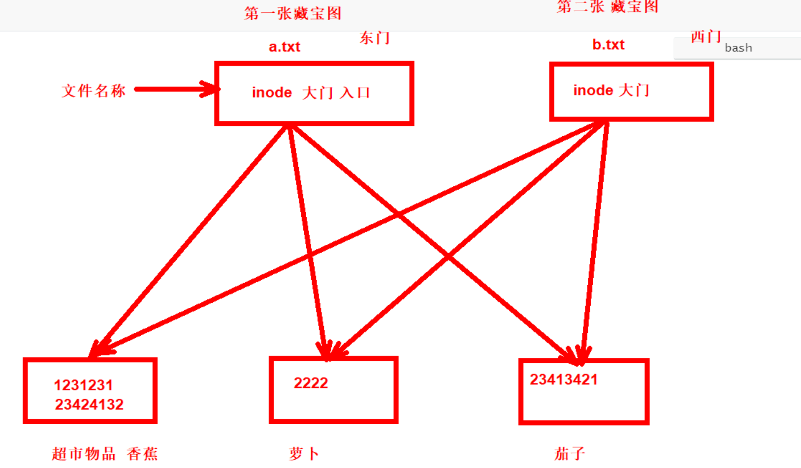
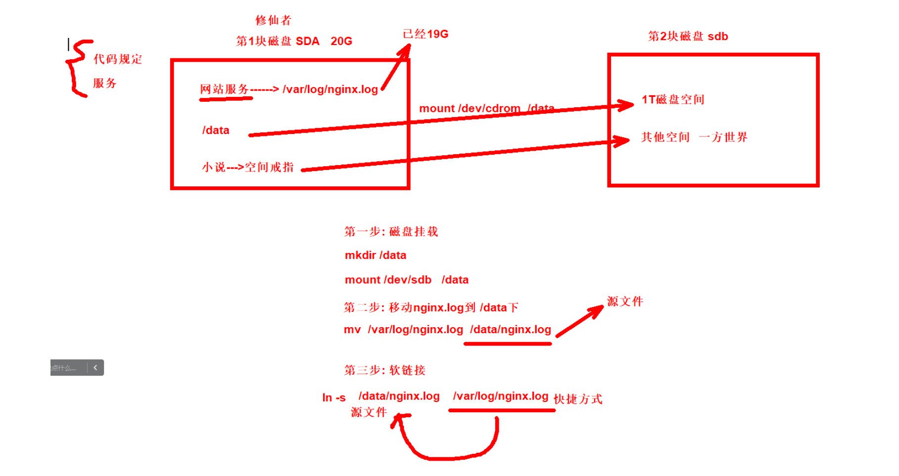

### 1，inode号


作用: 存放着文件具体内容的指针指向。存放了文件的详细信息。类似藏宝图(指向宝藏的路线和宝藏的说明)


回顾ls命令：

```bash
ls命令:
参数选项:
	    -i # 查看inode号码
	    -l # 查看详细信息
	    -a # 显示隐藏的文件
	    -r # 逆序排序
	    -t # 按照创建文件的时间排序
	    -h # 人类可读 K M G 显示
按照时间的逆序显示文件:
[root@malu:~]# ll -rt /etc/
总用量 1284
-rw-r--r--  1 root root      261  3月 27  2013 quotatab
-rw-r--r--  1 root root      220  3月 27  2013 quotagrpadmins
-rw-r--r--  1 root root     2391  7月 24  2015 libuser.conf
-rw-r--r--  1 root root     3360 12月 17  2015 warnquota.conf
-rw-r--r--  1 root root     1634  8月  1  2018 rpc
-rw-r--r--  1 root root     4945  8月 17  2018 wgetrc

[root@malu:~]# ll -i a.txt 
67161329 - rw-r--r-- 1 root root 0 Jul 10 10:03 a.txt
第一列: inode号
第二列: 文件类型
第三列: 文件权限
第四列: 硬链接个数
第五列: 属主
第六列: 属组
第七列: 大小
第八列: 文件的时间
第九列: 文件名称

查看磁盘总inode号:
[root@malu:~]# df -i
Filesystem              Inodes  IUsed    IFree IUse% Mounted on
devtmpfs                246345    481   245864    1% /dev
tmpfs                   250391      1   250390    1% /dev/shm
tmpfs                   250391    709   249682    1% /run
tmpfs                   250391     17   250374    1% /sys/fs/cgroup
/dev/mapper/klas-root 24619008 124001 24495007    1% /

查看磁盘block:
[root@malu:~]# df -h
Filesystem             Size  Used Avail Use% Mounted on
devtmpfs               963M     0  963M   0% /dev
tmpfs                  979M     0  979M   0% /dev/shm
tmpfs                  979M   57M  922M   6% /run
tmpfs                  979M     0  979M   0% /sys/fs/cgroup
/dev/mapper/klas-root   47G  3.9G   44G   9% /

导致无法存储数据的原因有两个:
一是inode号满
二是磁盘空间满
```


inode索引节点,inode号码类似于身份证号码,通过inode号码可以找到文件的内容.inode是一个空间，inode号是空间的位置,类似于身份证,inode空间存放:

- inode空间中存放的是 文件属性信息 ,文件大小,修改时间,权限,所有者..
- inode空间中存放block的位置(指向文件实体的指针)
- 这里不存放文件名.


block块(数据块): 存放数据


用户访问查看malu.txt文件内容的流程:

- .用户访问oldboy.txt的时候，系统会找出他对应的inode空间（根据inode号码)。
- 访问来到inode空间后，确认用户,确认权限。
- 权限信息正确就准许通过，可以访问inode对应的block区域（数据）。


 inode和block特点

- inode索引节点,存放文件属性信息,block位置。
- 每创建1个非空文件至少占用1个inode,1个block，一般文件都要有1个inode。
- 1个block默认是4k。
- inode,block数量是在格式化的时候创建的。
- 正常情况下block的使用会更快.
- 创建小文件不足4k,1个block还有剩余空间,无法给其他文件使用.
- 创建文件大于4k,占用多个block.
- 文件名是存放在目录的block中的. 没有存放在inode中,所以文件名不是文件属性


如何查看：

- 查看block的使用情况命令:（平时说的磁盘空间） df -h  磁盘空间使用情况
- 查看inode的使用情况命令: df -i


导致无法存储数据的原因有两个：

- 一是inode号满
- 二是磁盘空间满


### 2，文件类型


文件类型: 文件类型决定了文件是啥类型。

- windows: .txt .exe .pfd .mp3 .mp4 .avi .jpg.....
- linux: 文件类型是方便给我们看的。Linux一切皆文件。Linux下面扩展名仅仅用于展示,随意修改.


常用的扩展名：

| 常用的扩展名               | 说明           |
| -------------------------- | -------------- |
| .txt                       | 普通文件       |
| .sh .bash                  | shell脚本      |
| .conf .cfg .xml .yaml .yml | 配置文件       |
| .py                        | python脚本文件 |


文件类型:

- `-` 普通文件，命令文件，数据文件 图片 视频 rpm zip
- `d`  目录
- `l`  软链接 类似windows的快捷方式
- `c ` 字节文件， 字符设备 char 特殊文件,不断输出,吸入
- `b`  块设备  硬件， 块设备 block 硬盘
- `s`  接口文件 系统用得， 套接字 socket文件
- `p`  管道文件 系统使用， 管道文件


```bash
# 不同的文件类型
[root@linux ~]# ll -d /etc/hostname /etc/rc.local /dev/null /dev/sda
crw-rw-rw- 1 root root 1, 3  8月  8 18:12 /dev/null
brw-rw---- 1 root disk 8, 0  8月  8 18:12 /dev/sda
-rw-r--r-- 1 root root    6  8月  8 17:38 /etc/hostname
lrwxrwxrwx 1 root root   13  4月 20  2022 /etc/rc.local -> rc.d/rc.local
[root@linux ~]# 

# file命令查看详细文件类型
#   text  普通文件（文本文件）,我们日常可以查看或直接修改,平时书写就是这种,脚本
#   data  数据文件,需要用专用命令查看. 比如压缩包
#   二进制文件  大部分都是命令

[root@linux ~]# ll /etc/hostname /var/log/wtmp /bin/ls
-rwxr-xr-x 1 root root 142024  4月 21  2022 /bin/ls
-rw-r--r-- 1 root root      6  8月  8 17:38 /etc/hostname
-rw-rw-r-- 1 root utmp  15744  8月  8 18:39 /var/log/wtmp
[root@linux ~]# file /etc/hostname /var/log/wtmp /bin/ls
/etc/hostname: ASCII text
/var/log/wtmp: data
/bin/ls:       ELF 64-bit LSB pie executable, x86-64, version 1 (SYSV), dynamically linked, interpreter /lib64/ld-linux-x86-64.so.2, BuildID[sha1]=a950a08b8f987313e68ade5862d728e96b245d14, for GNU/Linux 3.2.0, stripped
[root@linux ~]# 

# file查看文件的详细类型.
[root@linux ~]# file /etc/hostname /var/log/wtmp /bin/ls /etc /etc/rc.local 
/etc/hostname: ASCII text
/var/log/wtmp: data
/bin/ls:       ELF 64-bit LSB pie executable, x86-64, version 1 (SYSV), dynamically linked, interpreter /lib64/ld-linux-x86-64.so.2, BuildID[sha1]=a950a08b8f987313e68ade5862d728e96b245d14, for GNU/Linux 3.2.0, stripped
/etc:          directory
/etc/rc.local: symbolic link to rc.d/rc.local
[root@linux ~]# 

# 字节文件:
[root@linux:~]# ll /dev/urandom     # 一直不断的往外吐乱码   了解
crw-rw-rw- 1 root root 1, 9 Jul  5 14:08 /dev/urandom

# 字节文件
作用: 不想看到的结果定向到空/dev/null,使用$?判断执行是否成功
[root@linux:~]# ll /dev/null        # 空 类似宇宙的黑洞
crw-rw-rw- 1 root root 1, 3 Jul  5 14:08 /dev/null

# 案例: /dev/null       $? 上一条命令的执行结果，0为成功，非0失败。
[root@linux ~]# ping -c1  -W2  www.google.com &> /dev/null
[root@linux ~]# echo $?
1
[root@linux ~]# ping -c1  -W2  www.baidu.com &> /dev/null
[root@linux ~]# echo $?
0
[root@linux ~]# lllll &>/dev/null
[root@linux ~]# echo $?
127
[root@linux ~]# 

# 字节设备: /dev/zero
# 作用：经常用来做测试，生成大文件使用。
[root@linux ~]# ll /dev/zero
crw-rw-rw- 1 root root 1, 5  8月  8 18:12 /dev/zero
[root@linux ~]#

案例: 在linux中生成一个1g的文件怎么办？
[root@linux ~]# ll /dev/zero
crw-rw-rw- 1 root root 1, 5  8月  8 18:12 /dev/zero
[root@linux ~]# dd if=/dev/zero of=1g.txt bs=1M count=1000
记录了1000+0 的读入
记录了1000+0 的写出
1048576000字节（1.0 GB，1000 MiB）已复制，2.8008 s，374 MB/s
[root@linux ~]# ll -h
总用量 1001M
-rw-r--r-- 1 root root 1000M  8月  8 20:44 1g.txt

dd: 命令
if: input file 要读取/etc/zero
of: output file 输出到当前的1g.txt  
bs: 1次输出多大
count: 总共输出的次数

# 块设备
[root@linux ~]# ll /dev/sr0
brw-rw---- 1 root cdrom 11, 0  8月  8 18:12 /dev/sr0
[root@linux ~]# ll /dev/sda
brw-rw---- 1 root disk 8, 0  8月  8 18:12 /dev/sda
[root@linux ~]# 
```


### 3，文件的硬链接

硬链接的特点:

- inode号码相同互为硬链接
- 通过ln 源文件 目标文件
- 目录不能做硬链接
- 目录不能跨文件系统(磁盘)
- 目录可以软链接
- 删除一个不影响其他的文件(门)
- 目录的硬链接个数为2


```bash
创建硬链接:
语法结构: 使用绝对路径链接
    ln 源文件 目标文件
    ln a.txt  b.txt
    带路径:
    ln a.txt /opt/b.txt
    绝对路径:
    ln /root/a.txt /opt/b.txt
		 
第一步: 有一个存在的文件  123   a.txt
第二步: ln a.txt  b.txt--->对应的inode123
[root@malu:~]# ll -i
total 0
67161164 -rw-r--r-- 2 root root 0 Jul 10 16:37 a.txt
67161164 -rw-r--r-- 2 root root 0 Jul 10 16:37 b.txt
[root@malu:~]# cat a.txt 
[root@malu:~]# cat b.txt 
[root@malu:~]# echo hehe > a.txt 
[root@malu:~]# ll -i
total 8
67161164 -rw-r--r-- 2 root root 5 Jul 10 16:48 a.txt
67161164 -rw-r--r-- 2 root root 5 Jul 10 16:48 b.txt
[root@malu:~]# cat b.txt 
hehe
[root@malu:~]# echo aaaa >>b.txt
[root@malu:~]# cat a.txt 
hehe
aaaa
[root@malu:~]# cat b.txt 
hehe
aaaa


作用: 实时备份同步文件
#目的，/etc/hosts发生变化，/opt/hosts.bak同时会发生变化
ln /etc/hosts  /opt/hosts.bak
ln /opt/hosts.bak  /etc/hosts  # 如果误删，则链接回去
```




Linux为什么创建目录后,硬链接数是2，参考文章：https://www.jianshu.com/p/f2d54b76a55f


### 4，文件软件连接

软链接特点：

- inode不同
- 类似windows的快捷方式，通过快捷方式找到源文件
- 软链接文件存放着是源文件的指针指向
- 目录可以软链接
- 软链接可以跨文件系统(磁盘)
- 删除软链接不影响源文件
- 删除源文件，影响链接文件，链接文件变红


```bash
创建软链接:
语法结构:
		 ln -s  a.txt  b.txt
		 ln -s /root/a.txt  /opt/b.txt

作用: 解决磁盘不够用
	 代码变更(后面学习)
```




```bash
面试题: 软链接和硬链接的区别
1.硬链接inode号相同
2.软链接inode号不同
3.目录不能做硬硬链接，文件可以做硬链接，目录可以做软链接
4.硬链接不能跨文件系统，软链接可以跨文件系统
5.创建方式不同，ln 软 ln -s
6.目录默认硬链接数，文件默认硬链接数是1
7.删除硬链接不影响其他硬链接，删除软链接不影响源文件，删除源文件影响软链接变红。
8.链接数为0，和文件不被进程所占用，文件才真正的被删除。
9.硬链接和软链接都是普通文件，使用rm删除
```


### 5，文件时间

```
Access: 文件访问时间  less cat  more vim
Modify: 文件修改时间  echo sed 
Change: 文件属性改变时间 chmod 
```


### 6，初识文件权限(后续精讲)

```bash
rw-r--r--   # 九位权限位
前三位: 表示属主的权限   笔记本是我们自己的   rw-
中三位: 表示属组的权限   笔记本在小组的权限   r--
后三位: 其他用户陌生人的权限  隔壁网安       r--

r read  # 读
w write # 写
x excute# 执行
-       # 空的
对于文件谁是主人，文件属于哪个组。
root root 1048576000 Jul 10 10:55 1g.txt  # 第一个root是主人 第二个root是小组名称
小明主人 系统自动创建叫小明的组
```


### 7，find命令

作用: 按照文件类型查找文件

```bash
语法格式:
		find  在哪里找 找什么类型
		找对象 在北京  好看的
		find  路径    - d c b
		
find 路径
/
/opt
/mtp
/etc
./ 当前目录查找

环境准备:
[root@malu:~]# mkdir malu
[root@malu:~]# cd malu/
[root@malu:malu]# ll
[root@malu:malu]# touch {1..3}.txt
[root@malu:malu]# mkdir malu{1..3}
[root@malu:malu]# touch {4..6}.TXT

total 0
-rw-r--r-- 1 root root 0 Jul 10 11:25 1.txt
-rw-r--r-- 1 root root 0 Jul 10 11:25 2.txt
-rw-r--r-- 1 root root 0 Jul 10 11:25 3.txt
-rw-r--r-- 1 root root 0 Jul 10 11:31 4.TXT
-rw-r--r-- 1 root root 0 Jul 10 11:31 5.TXT
-rw-r--r-- 1 root root 0 Jul 10 11:31 6.TXT

drwxr-xr-x 2 root root 6 Jul 10 11:26 malu1
drwxr-xr-x 2 root root 6 Jul 10 11:26 malu2
drwxr-xr-x 2 root root 6 Jul 10 11:26 malu3

1.find按照文件类型查找
案例1.find查找当前目录下所有的普通文件
[root@malu:malu]# find ./ -type f
./1.txt
./2.txt
./3.txt

案例2.查找当前所有的目录
[root@malu:malu]# find ./ -type d
./
./malu1
./malu2
./malu3

2.find按照名称查找
案例1.查找名字是2.txt的文件
[root@malu:malu]# find ./ -name "2.txt"
./2.txt

案例2.查找名称是malu1
[root@malu:malu]# find ./ -name "malu1"
./malu1

案例3.按照名称模糊查找*
[root@malu:malu]# find ./ -name "*.txt"
./1.txt
./2.txt
./3.txt

案例4.忽略大小写
[root@malu:malu]# find ./ -iname "*.txt"
./1.txt
./2.txt
./3.txt
./4.TXT
./5.TXT
./6.TXT

案例5.查找名字是1.txt的普通文件
[root@malu:malu]# find ./ -type f -name "1.txt"
./1.txt

-and # 并且关系
-or  # 或者关系

查找目录是1.txt的
[root@malu:malu]# ll /tmp/
total 0
drwxr-xr-x 2 root root 40 Jul 10 11:33 1.txt
drwx------ 3 root root 60 Jul  5 14:08 systemd-private-93b8153508bb49898a1fd7e2e79132ba-chronyd.service-V7IxOl
drwx------ 3 root root 60 Jul  5 14:08 systemd-private-93b8153508bb49898a1fd7e2e79132ba-systemd-logind.service-fjh1Oi

[root@malu:malu]# find /tmp/ -type f -name "1.txt"
[root@malu:malu]# find /tmp/ -type d -name "1.txt"
/tmp/1.txt

-or 或者  查找/tmp目录下所有的普通文件 或者 名字叫1.txt的
[root@malu:malu]# find /tmp -type f -or -name "1.txt"
/tmp/1.txt

3.find按照inode号查找
[root@malu:malu]# find ./ -inum  68979295
./4.TXT
通过查找inode号码，删除文件 # 遇到乱码的文件无法删除情况下使用
[root@malu:malu]# find ./ -inum 68979300|xargs rm

4.按照深度等级查找
[root@malu:malu]# find ./ -maxdepth 1 -type f
./1.txt
./2.txt
./3.txt
./4.TXT
./5.TXT
./6.TXT

6.按照文件的大小查找
环境准备:
[root@malu:malu]# cat /etc/services /etc/services > 1.txt
[root@malu:malu]# ll -h
total 2.0M
-rw-r--r-- 1 root root 1.4M Jul 10 11:51 1.txt
-rw-r--r-- 1 root root 677K Jul 10 11:51 services

[root@malu:malu]# cat 1.txt 1.txt 1.txt 1.txt 1.txt 1.txt 1.txt 1.txt > 2.txt
[root@malu:malu]# ll -h
total 13M
-rw-r--r-- 1 root root 1.4M Jul 10 11:51 1.txt
-rw-r--r-- 1 root root  11M Jul 10 11:52 2.txt
-rw-r--r-- 1 root root 677K Jul 10 11:51 services

[root@malu:malu]# dd if=/dev/zero of=3.txt bs=1M count=1200
1200+0 records in
1200+0 records out
1258291200 bytes (1.3 GB, 1.2 GiB) copied, 35.4469 s, 35.5 MB/s

案例1.查找文件小10M的文件
[root@malu:malu]# find ./ -size -10M
./
./services
./1.txt

案例2.查找文件等于10的文件
[root@malu:malu]# find ./ -size 10M

案例3.查找文件大于10M的文件
[root@malu:malu]# find ./ -size +10M
./2.txt
./3.txt

案例4.查找文件大于10M并且小于1000M的文件
[root@malu:malu]# find ./ -size +10M -size -1000M
./2.txt

案例5.查找文件大于1G 或者 文件名称是1.txt
[root@malu:malu]# find ./ -size +1G -or -name "1.txt"

查看目录的总大小:
[root@malu:~]# du -sh malu
1.2G	malu

find按照文件大小查找:
find ./ -size 10M  等于10M
		      +10M 大于10M
		      -10M 小于10M
		      
		      
单位:
1字节=8bit
1M=1024字节
1G=1024M
1T=1024G


find查找
find按照文件类型查找
    find ./ -type f
    find ./ -type d
find按照文件名称查找
    find ./ -name "1.txt"
    find ./ -name "*.txt"
    find ./ -iname "*.txt"
find按照深度等级查找
    find ./ -maxdepth 1 -type f
find按照inum进行查找
    find ./ -inum 2342342  # 删除无法正常删除的文件
find按照大小进行查找
    find ./ -size 10M 
    		      +10M
    		      -10M
或者-or
并且-and

find ./ -type f -name "1.txt"  # 默认为并且
find ./ -type -f -or -size 10M
```


### 8，find结果交给其他命令


```bash
1.第一步查找文件或者目录
2.查找文件后做的动作
动作: 复制，移动，删除，查看

第一种方法:
注意: 在xargs后面别名失效
[root@malu:malu]# find ./ -name "1.txt"|xargs ll
xargs: ll: No such file or directory

案例.find的结果交给ls命令
[root@malu:malu]# find ./ -name "1.txt"
./1.txt
[root@malu:malu]# find ./ -name "1.txt"|xargs ls -l   
-rw-r--r-- 1 root root 1384504 Jul 10 11:51 ./1.txt
[root@malu:malu]# find ./ -name "1.txt"|xargs cat

案例2.find结果交给rm命令
[root@malu:malu]# find ./ -name "1.txt"|xargs rm

案例3.find结果交给cp命令
[root@malu:malu]# find ./ -name "1.txt"|xargs -i cp {} /opt/
[root@malu:malu]# ll /opt/
total 0
-rw-r--r-- 1 root root 0 Jul 10 15:31 1.txt

[root@malu:malu]# find ./ -name "1.txt"|xargs -i cp {} /opt/1.txt.bak
[root@malu:malu]# ll /opt/
total 0
-rw-r--r-- 1 root root 0 Jul 10 15:31 1.txt
-rw-r--r-- 1 root root 0 Jul 10 15:31 1.txt.bak


案例4.find结果交给mv命令
[root@malu:malu]# find ./ -name "1.txt"|xargs -i mv {} /opt/
[root@malu:malu]# ll
total 1240304
-rw-r--r-- 1 root root   11076032 Jul 10 11:52 2.txt
-rw-r--r-- 1 root root 1258291200 Jul 10 11:54 3.txt
-rw-r--r-- 1 root root        926 Jul 10 12:11 count.txt
-rw-r--r-- 1 root root     692252 Jul 10 11:51 services
[root@malu:malu]# ll /opt/
total 0
-rw-r--r-- 1 root root 0 Jul 10 15:29 1.txt


第二种方法:exec    \; 表示命令结束
案例1.find的结果交给ls命令
[root@malu:malu]# find ./ -name "1.txt" -exec ls -l {} \;
-rw-r--r-- 1 root root 0 Jul 10 15:48 ./1.txt
[root@malu:malu]# 
[root@malu:malu]# ls -l 1.txt 2.txt
-rw-r--r-- 1 root root        0 Jul 10 15:48 1.txt
-rw-r--r-- 1 root root 11076032 Jul 10 11:52 2.txt
[root@malu:malu]# find ./ -name "*.txt" -exec ls -l {} \;
-rw-r--r-- 1 root root 11076032 Jul 10 11:52 ./2.txt
-rw-r--r-- 1 root root 1258291200 Jul 10 11:54 ./3.txt
-rw-r--r-- 1 root root 926 Jul 10 12:11 ./count.txt
-rw-r--r-- 1 root root 0 Jul 10 15:48 ./1.txt


案例2.find结果交给rm命令
[root@malu:malu]# find ./ -name "1.txt" -exec rm {} \;

案例3.find结果交给cp命令
[root@malu:malu]# find ./ -name "1.txt" -exec cp {} /opt/ \;
[root@malu:malu]# ll /opt/
total 0
-rw-r--r-- 1 root root 0 Jul 10 15:53 1.txt


案例4.find结果交给mv命令
[root@malu:malu]# find ./ -name "1.txt" -exec mv {} /tmp/a.txt \;

;  # shell中命令的分隔符
[root@malu:~]# mkdir test;cd test;touch a.txt;ll a.txt


方法3 `` 反引号 $() 先执行反引号和$()中的命令，然后交给其他的命令，相当于(加)减乘除 先算括号
[root@malu:test]# awk 'BEGIN{print 10+2*2}'
14
[root@malu:test]# awk 'BEGIN{print (10+2)*2}'
24

案例1.find的结果交给ls命令
[root@malu:test]# ll `find ./ -name "a.txt"`
-rw-r--r-- 1 root root 0 Jul 10 15:57 ./a.txt


案例2.find结果交给rm命令
[root@malu:test]# rm -f `find ./ -name "a.txt"`

案例3.find结果交给cp命令
[root@malu:test]# cp `find ./ -name "a.txt"` /opt/
[root@malu:test]# ll /opt/
total 0
-rw-r--r-- 1 root root 0 Jul 10 15:53 1.txt
-rw-r--r-- 1 root root 0 Jul 10 16:00 a.txt


案例4.find结果交给mv命令
[root@malu:test]# mv `find ./ -name "a.txt"` /tmp/

或者$()
[root@malu:test]# ll $(find /tmp/ -name "1.txt")
-rw-r--r-- 1 root root 0 Jul 10 15:52 /tmp/1.txt


重点小结:
1.inode号和block了解
2.磁盘无法写入检查 inode block  df -i df -h
3.文件类型 - d l c b 
4.字节设备/dev/zero /dev/null  (dd命令笔记)
5.文件权限 了解
6.find 查找文件  重点
7.find的执行结果交给其他命令调用
find ./ -name "1.txt"|xargs ls -l
find ./ -name "1.txt"|xargs -i cp {} /opt/
find ./ -name "1.txt" -exec ls -l {} \;
find ./ -name "1.txt" -exec cp {} /opt/ \;
ll `find ./ -name "1.txt"`
cp `find ./ -name "1.txt"` /opt/
```


### 9，find按时间查找

```bash
案例1: 查找7天前被修改过的文件
[root@malu:test]# date -s 20081010
Fri Oct 10 00:00:00 CST 2008

[root@malu:test]# touch {1..4}.txt
[root@malu:test]# ll
total 0
-rw-r--r-- 1 root root 0 Oct 10 00:00 1.txt
-rw-r--r-- 1 root root 0 Oct 10 00:00 2.txt
-rw-r--r-- 1 root root 0 Oct 10 00:00 3.txt
-rw-r--r-- 1 root root 0 Oct 10 00:00 4.txt

[root@malu:test]# ntpdate ntp2.aliyun.com

查找时间:
[root@malu:test]# find ./ -mtime +7
./1.txt
./2.txt
./3.txt
./4.txt


案例2: 查找7天内被修改的文件
[root@malu:test]# find ./ -mtime -7
./
./a.log
./b.log
./c.log


案例3.查找1天内被修改过的文件
[root@malu:test]# find ./ -mtime 0
./
./a.log
./b.log
./c.log


笔试题: 查找出/data目录30天前被修改过的文件，然后删除。
find /data  -mtime +30|xargs rm -rf

[root@malu:test]# find ./ -mtime +30
./1.txt
./2.txt
./3.txt
./4.txt
[root@malu:test]# find ./ -mtime +30|xargs rm -rf
[root@malu:test]# ll
total 0
-rw-r--r-- 1 root root 0 Jul 11 10:33 a.log
-rw-r--r-- 1 root root 0 Jul 11 10:33 b.log
-rw-r--r-- 1 root root 0 Jul 11 10:33 c.log
```


