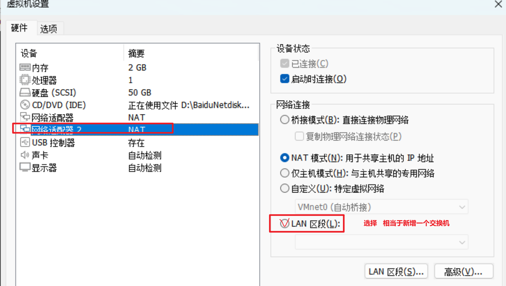
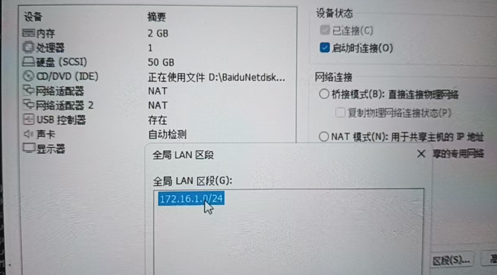
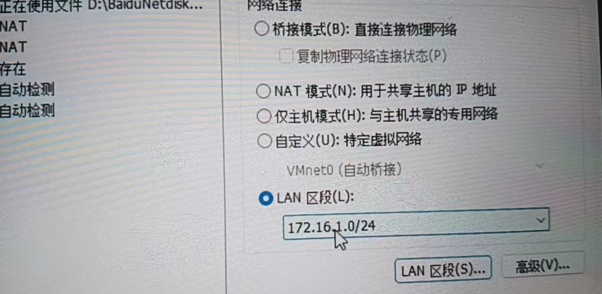
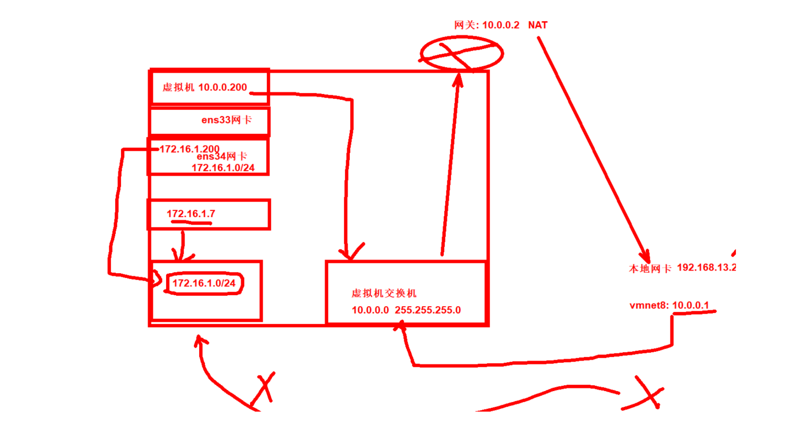
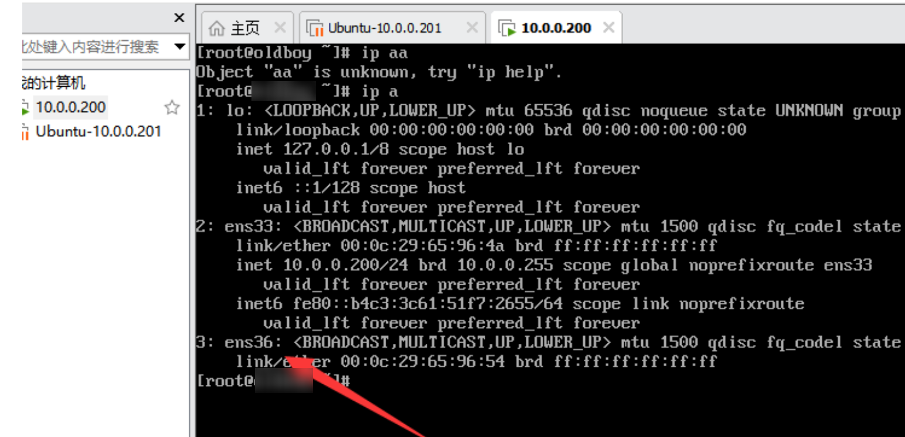
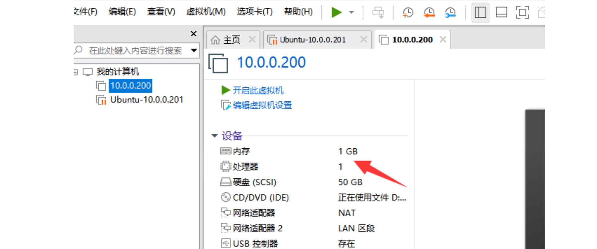

之前学习过的命令：

```bash
常用命令
1.pwd 
2.cd 
    -
    ~
    .
    ..
    ../../
3.ls
     -l 详细信息
     -a 查看隐藏的文件
4.touch  
5.mkdir 
     -p 递归创建目录
6.cat   查看文件内容
     -n 显示行号
7.cp    复制文件
     -r 复制目录
8.mv    移动文件/目录
9.rm    删除文件
     -r 删除目录
     -f 强制删除不提示
10.tree 树形结构
11.vi vim 文件编辑   # 替换文件内容
12.history 查看历史记录
13.grep 模糊过滤字符串
14.head 显示头部
      -n 3 # 前n行 省略-n -3
15.tail 显示尾巴
	  -n 3 # 后n 行
	  -f 实时显示文件的变化  tailf
	  -F .. 
16.which 查看命令的绝对路径
17.wc -l 统计行数
18.df    查看磁盘
       -h 
19.lscpu 查看cpu信息
20.free -h 查看内存信息
21.uptime 查看负载信息
22.w      查看负载和登录信息
23.hostname 查看主机名称
24.hostnamectl 查看主机信息
25.uname    查看系统版本和内核信息
26.blkid    查看硬件的设备的UUID
27.mount    挂载
28.umount   卸载
29.ip address 查看ip地址 ip a
30.ifconfig 查看ip地址
   ifconfig ens33
31.ping
32.nslookup 域名解析
33.ifdown 关闭网卡
34.ifup   启动网卡
35.echo   打印字符串 屏幕shell编程 菜单。
36.shutdown 关机
           -h now 立刻关机
           -r now 立刻重启
37.poweroff 关机
38.init 0   关机
39.reboot   重启
40.init 6   重启
41.hostnamectl set-hostname xx # 修改主机名称
42.source   让变量文件重新执行一遍

其他知识点:
1.命令提示符
2.目录结构
3./etc/重要系统文件
1)/etc/sysconfig/network-scrips/ifcfg-ens33
2)/etc/hostname # 主机名称
3)/etc/hosts    # 本地DNS 默认空的
4)/etc/resolv.conf # DNS的配置文件 nameserver 223.5.5.5 面试题
5)/etc/rc.local    # 开机自动运行里面的命令
6)/etc/profile     # 永久生效 变量配置文件
7)/etc/inittab   不用配置文件，运行级别面试点
8)/etc/fstab       # 开机自动挂载 讲磁盘还会讲到
9)/etc/issue issue.net 清空
10)/etc/motd      # 登录提示
11)/etc/os-release  # 查看系统版本号
```


## 系统优化


### 1，修改默认的YUM仓库

```bash
什么是YUM仓库: 软件仓库(华为软件应用商店)  yum软件仓库 yum源
仓库地址: 国外的官网仓库。清华源 阿里源 重庆大学源 
https://ip138.com/ 查看域名的IP地址所在的国家或者地区


阿里源仓库地址:
http://opsx.alibaba.com


centos操作系统: 默认的为国外的仓库，下载速度慢。修改为国内的YUM仓库
第一步: 移动备份
mv /etc/yum.repos.d/CentOS-Base.repo /etc/yum.repos.d/CentOS-Base.repo.backup
第二步: 下载新的仓库地址
curl -o /etc/yum.repos.d/CentOS-Base.repo https://mirrors.aliyun.com/repo/Centos-7.repo


麒麟操作系统: 默认不需要修改。
Ubuntu系统: 修改为国内的YUM仓库
查看默认的仓库:
root@ubuntu:~# apt-cache policy
Package files:
 100 /var/lib/dpkg/status
     release a=now
 500 http://security.ubuntu.com/ubuntu jammy-security/multiverse amd64 Packages
     release v=22.04,o=Ubuntu,a=jammy-security,n=jammy,l=Ubuntu,c=multiverse,b=amd64
     origin security.ubuntu.com
...省略

第一步: 编辑/etc/apt/sources.list
root@ubuntu:~# vim /etc/apt/sources.list

第二步: 删除里面默认的所有内容
dG

第三步: 进入编辑模式粘贴以下内容
deb https://mirrors.aliyun.com/ubuntu/ focal main restricted universe multiverse
deb-src https://mirrors.aliyun.com/ubuntu/ focal main restricted universe multiverse

deb https://mirrors.aliyun.com/ubuntu/ focal-security main restricted universe multiverse
deb-src https://mirrors.aliyun.com/ubuntu/ focal-security main restricted universe multiverse

deb https://mirrors.aliyun.com/ubuntu/ focal-updates main restricted universe multiverse
deb-src https://mirrors.aliyun.com/ubuntu/ focal-updates main restricted universe multiverse

# deb https://mirrors.aliyun.com/ubuntu/ focal-proposed main restricted universe multiverse
# deb-src https://mirrors.aliyun.com/ubuntu/ focal-proposed main restricted universe multiverse

deb https://mirrors.aliyun.com/ubuntu/ focal-backports main restricted universe multiverse
deb-src https://mirrors.aliyun.com/ubuntu/ focal-backports main restricted universe multiverse

第四步: 保存退出

第五步: 生成软件本地缓存
root@ubuntu:~# apt update

查看配置是否成功
root@ubuntu:~# apt-cache policy
or或者
直接安装命令测试是否从阿里云下载软件
root@ubuntu:~# apt -y install lrzsz


安装软件:
centos和麒麟:  yum -y install  xx
ubuntu: 	  apt -y install  xx


安装epel扩展仓库:
Centos和麒麟需要安装，ubuntu不需要安装。
麒麟安装epel扩展仓库:
[root@oldboy ~]# wget -O /etc/yum.repos.d/epel.repo https://mirrors.aliyun.com/repo/epel-7.repo

查看是否成功:
[root@oldboy ~]# ll /etc/yum.repos.d/
total 8
-rw-r--r-- 1 root root 664 Aug  4  2022 epel.repo
-rw-r--r-- 1 root root 701 Sep  8  2022 kylin_x86_64.repo


安装软件:
麒麟: 
    yum -y install lrzsz
    yum -y install cowsay sl	# 在扩展的epel仓库中

ubuntu: apt -y install lrzsz cowsay sl

[root@malu ~]# animalsay "呵呵哒"  # 动物说话
```


对于麒麟来说：

```bash
安装扩展的仓库: epel
[root@oldboy ~]# wget -O /etc/yum.repos.d/epel.repo https://mirrors.aliyun.com/repo/epel-7.repo
```


### 2，关闭防火墙


作用: 阻止非法流量进入系统。


什么情况下开启防火墙

- 在有公网的服务器上需要开启
- 服务器上有服务的情况下开启(NAT路由器)


什么情况下关闭防火墙

- 内网情况下关闭
- 测试服务器关闭
- 在流量较大的情况下(网站访问人多)


```bash
centos和麒麟防火墙: firewalld
systemctl 动作 服务名称
动作:
systemctl start   服务		启动
systemctl stop    服务	    停止
systemctl status  服务	    状态
systemctl reload  服务重载	  
systemctl restart 服务重启
systemctl enable  服务 开机自动让这个服务运行
systemctl disable 服务 开机禁止让这个服务运行

centos和麒麟系统关闭防火墙的流程:
第一步: 从系统中关闭
[root@malu ~]# systemctl stop firewalld
第二步: 禁止开机自动运行
[root@malu ~]# systemctl disable firewalld

ubuntu系统关闭防火墙流程: 
第一步: 从系统中关闭
root@ubuntu:~# systemctl stop ufw
第二步: 禁止开机自动运行
root@ubuntu:~# systemctl disable ufw
```


### 3，关闭selinux

```bash
美国国家安全局开发,企业中不用。
centos: 默认开启需要关闭
第一步: 操作系统退出
[root@malu ~]# setenforce 0
第二步: 禁止开机启动
修改/etc/selinux/config 配置文件将
SELINUX=enforcing 修改为 SELINUX=disabled

麒麟:    默认关闭 不需要配置任何信息。
ubuntu: 默认关闭 不需要配置任何信息。
```


### 4，字符集优化

```bash
字符集: 让字符串正常的在系统中显示
GBK:    国标
UTF-8:  万国码 默认
en_US.UTF-8 英语表示
zh_CN.UTF-8 中文表示

查看默认的字符集:
root@ubuntu:~# echo $LANG
en_US.UTF-8

麒麟修改字符集:
第一步: vim 编辑这个文件
[root@malu ~]# vim /etc/locale.conf 
LANG="zh_CN.UTF-8"
第二步: 修改
LANG="en_US.UTF-8"
第三步: 让配置文件生效
[root@malu ~]# source /etc/locale.conf
或者
重新连接xshell生效


source或者. 让变量生效
[root@malu ~]# llll
-bash: llll：未找到命令			   # 默认中文
[root@malu ~]# . /etc/locale.conf 
[root@malu ~]# lllll
-bash: lllll: command not found		# 成功变为英文


ubuntu修改字符集:
第一步: vim编辑以下文件
root@ubuntu:~# vim /etc/default/locale 
LANG=en_US.UTF-8
第二步: 修改字符集
root@ubuntu:~# vim /etc/default/locale 
LANG=zh_CN.UTF-8
第三步: 让配置文件生效
[root@oldboy ~]# source /etc/default/locale 
或者
重新连接xshell生效
```


### 5，时间同步

时间分为两种: 如果时间不对，麒麟软件无法安装，会影响业务。
- 硬件时间
- 系统时间

什么是时间和时间戳
- 时间: 我们可以看懂得
- 时间戳: 看不懂需要转换


```bash
查看时间: date
[root@malu ~]# date
Mon Jul  8 11:50:19 CST 2024

修改时间: date  测试使用。
[root@malu ~]# date -s 20081010
Fri Oct 10 00:00:00 CST 2008

查看硬件时间:
[root@malu ~]# clock
2024-07-05 15:04:19.758481+08:00

centos和麒麟操作系统:
安装时间同步工具: ntpdate
[root@malu ~]# ntpdate 时间服务器   # 时间同步命令 同步为北京时间
时间服务器: ntp1.aliyun.com
# 注意如果系统当前时间不正确，无法安装软件，需要手动调整为当前时间。
[root@malu ~]# date -s "20240708 12:00:00"
Mon Jul  8 12:00:00 CST 2024
[root@malu ~]# yum -y install ntpdate

时间错误如何进行时间同步:
第一步: 修改时间
[root@malu ~]# date -s 20081010
Fri Oct 10 00:00:00 CST 2008
[root@malu ~]# date
Fri Oct 10 00:00:00 CST 2008

第二步: 使用ntpdate命令进行时间同步
[root@malu ~]# ntpdate  ntp2.aliyun.com


ubuntu操作系统: 时间默认会自动同步。服务名称systemd-timesyncd
1.修改时区:亚洲/上海 亚洲/重庆
timedatectl set-timezone Asia/Shanghai
root@ubuntu:~# timedatectl 
               Local time: Mon 2024-07-08 12:06:53 CST
           Universal time: Mon 2024-07-08 04:06:53 UTC
                 RTC time: Mon 2024-07-08 04:06:53
                Time zone: Asia/Shanghai (CST, +0800)
System clock synchronized: yes
              NTP service: active
          RTC in local TZ: no
root@ubuntu:~# date
Mon Jul  8 12:07:01 PM CST 2024

注意如果修改了时区还是显示12小时制: 执行以下命令
修改为24小时
echo "LC_TIME=en_DK.UTF-8" >>/etc/default/locale
重启服务:
systemctl restart systemd-timesyncd.service


可以将默认的时间服务器修改为国内的. 笔记
第一步: 修改时间服务器地址
vim /etc/systemd/timesyncd.conf
root@ubuntu:~# grep NTP /etc/systemd/timesyncd.conf
NTP=ntp2.aliyun.com
#FallbackNTP=ntp.ubuntu.com
第二步:重启时间服务
systemctl restart systemd-timesyncd.service

补充: 同步系统时间到硬件时间。
```

麒麟需要做的：

```bash
安装ntpdate命令
[root@malu ~]# yum -y install ntpdate
配置定时任务
[root@malu ~]# tail -1 /etc/crontab
*/15 * * * * root ntpdate ntp1.aliyun.com &>/dev/null
```


### 6，加大文件描述符

```bash
Linux默认最大打开文件数量是1024
[root@malu ~]# echo '* - nofile 65535' >> /etc/security/limits.conf
[root@malu ~]# tail -1 /etc/security/limits.conf
* - nofile 65535
```


### 7，命令提示符优化

```bash
调试命令行
第一步: 写入/etc/profile
[root@malu:~]#tail -1 /etc/profile
export PS1='[\[\033[1;32m\]\u\[\033[1;37m\]@\[\033[1;36m\]\h\[\033[00m\]:\[\033[1;34m\]\W\[\033[00m\]]\$'

第二步: 重新连接xshell或者使用source /etc/profile
```


### 8，安装常用命令

```bash
[root@malu:~]#yum -y install net-tools tree net-tools htop iftop lrzsz unzip telnet httpd-tools tcpdump

ubuntu安装常用命令:
apt -y install  net-tools tree lrzsz

lrzsz包含了两个命令
rz   # 将windows上的文件上传到Linux系统
    xshell: 鼠标拖拽文件到linux
    不能上传空文件
[root@malu:~]# rz -bye  # 格式化上传文件

sz   # 将linux上的文件下载到windows
[root@malu:~]# sz a.txt
```


### 9，增加网卡













给第二块网卡配置IP地址

```bash
1.优化ens33
[root@malu network-scripts]# cat ifcfg-ens33 
TYPE=Ethernet
BOOTPROTO=none
NAME=ens33
DEVICE=ens33
ONBOOT=yes
IPADDR=10.0.0.200
PREFIX=24
GATEWAY=10.0.0.2
DNS1=223.5.5.5

2.重启网卡生效
[root@malu network-scripts]# ifdown eth0  && ifup eth0

3.复制ens33配置为ens36
[root@malu ~]# cd /etc/sysconfig/network-scripts/
[root@malu network-scripts]# cp ifcfg-ens33 ifcfg-ens36

4.修改ens36
[root@malu network-scripts]# cat ifcfg-ens36
TYPE=Ethernet
BOOTPROTO=none
NAME=ens36
DEVICE=ens36
ONBOOT=yes
IPADDR=172.16.1.200
PREFIX=24

5.重启生效
[root@oldboy ~]# ifdown ens36 && ifup ens36
```


### 10，重启系统并关机

```bash
reboot
重启后关机，调整内存为1G
```




### 11，生成一个快照


### 12，克隆一台虚拟机

链接克隆就可以

```bash
backup服务器:
1.克隆一台虚拟机41
2.修改IP地址
修改ens33
vim /etc/sysconfig/network-scripts/ifcfg-ens33
..
IPADDR=10.0.0.41
..
修改ens36
vim /etc/sysconfig/network-scripts/ifcfg-ens36
..
IPADDR=172.16.1.41
..
重启网卡:
ifdown ens33
ifdown ens36
ifup ens33
ifup ens36

3.修改主机名称
hostnamectl set-hostname backup

4.创建远程连接会话
xshell复制已优化的会话修改信息

5.快照
```


