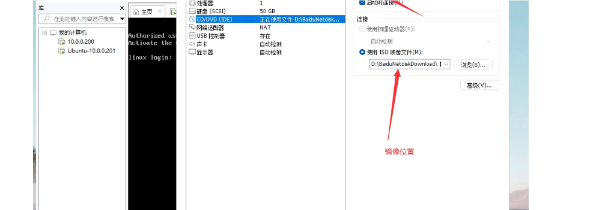

**Linux系统中重要的配置文件：**

- /etc/sysconfig/network-scripts/ifcfg-ens33
- /etc/hostname
- /etc/hosts
- /etc/resolv.conf
- /etc/rc.local
- /etc/inittab
- /etc/profile
- /etc/fstab
- /etc/issue /etc/issue.net
- /etc/motd


### 1，网卡配置

网卡配置文件路径：/etc/sysconfig/network-scripts/ifcfg-ens33

```bash
[root@malu ~]# cat /etc/sysconfig/network-scripts/ifcfg-ens33
TYPE=Ethernet		     # 网络类型 以太网(常用)  快速以太网(金融)
BOOTPROTO=none		     # 配置网络类型 自动获取IP 静态IP=none 静态地址=static 动态地址dhcp(不用)
NAME=ens33				 # 网卡的名称
UUID=e0f13fe3-0419-4c65-9ec5-a02adce36e98 # 硬件设备唯一标识 删除掉，因为后期还要克隆很多机器
DEVICE=ens33			 # 硬件网卡的名称
ONBOOT=yes			     # 开机自动运行网络服务
IPADDR=10.0.0.200		 # IP地址  主机唯一标识
PREFIX=24			     # 子网掩码决定过了网络内可以用得主机数量 10.0.0.1-10.0.0.254
				         # 24 --->另外一种表示方式 255.255.255.0  十进制
				         11111111  11111111  11111111  00000000 二进制
GATEWAY=10.0.0.2         # 网关 出网的必经之路。去往不同网段的必经之路。 配置到路由器
DNS1=223.5.5.5			 # 域名解析服务 将域名解析成IP地址的过程
					     浏览器访问-->www.baidu.com---DNS解析服务器IP地址-->返回给浏览器
						 浏览器---->服务器IP地址建立连接。
				         公用的DNS服务器: 
				               223.5.5.5   223.6.6.6 阿里云
							   114.114.114.114  电信
							   8.8.8.8  谷歌
							   202.106.0.20 联通

[root@malu ~]# cp /etc/sysconfig/network-scripts/ifcfg-ens33 /etc/sysconfig/network-scripts/ifcfg-ens33.bak    # 备份默认的网卡配置

[root@malu ~]# ll /etc/sysconfig/network-scripts/ifcfg-ens33*
-rw-r--r-- 1 root root 356 Jun 27 23:46 /etc/sysconfig/network-scripts/ifcfg-ens33
-rw-r--r-- 1 root root 356 Jul  3 11:23 /etc/sysconfig/network-scripts/ifcfg-ens33.bak

[root@malu ~]# cat /etc/sysconfig/network-scripts/ifcfg-ens33
TYPE=Ethernet
BOOTPROTO=none
NAME=ens33
DEVICE=ens33
ONBOOT=yes
IPADDR=10.0.0.200
PREFIX=24
GATEWAY=10.0.0.2
DNS1=223.5.5.5

修改后重启网卡生效:
[root@malu ~]# cat /etc/sysconfig/network-scripts/ifcfg-ens33
TYPE=Ethernet
BOOTPROTO=none
NAME=ens33
DEVICE=ens33
ONBOOT=yes
IPADDR=10.0.0.200
PREFIX=24
GATEWAY=10.0.0.2
DNS1=223.5.5.5

重启网卡:
[root@malu ~]# ifdown ens33 && ifup ens33
```


### 2，配置主机名称


配置文件：/etc/hostname， 作用: 配置主机名称


查看主机名称:

```bash
方法1
[root@malu ~]# hostname
malu

方法2
[root@malu ~]# hostnamectl 
   Static hostname: malu			 # 主机名称
         Icon name: computer-vm
           Chassis: vm
        Machine ID: d10efe1a571843729847d2a4fde2ad2e
           Boot ID: 1f8d0188632d44539939a6d4a36a7059
    Virtualization: vmware
  Operating System: Kylin Linux Advanced Server V10 (Lance)
            Kernel: Linux 4.19.90-52.22.v2207.ky10.x86_64
      Architecture: x86-64
      
      
方法3
[root@malu ~]# cat /etc/hostname 
malu      
```


修改主机名称:

- 临时修改(重启系统失效)
- 永久修改主机名称


临时修改(重启系统失效):

```bash
第一步: hostname 主机名称
[root@malu ~]# hostname test
第二步: 重新连接xshell
```


永久修改主机名称:

```bash
方法1: 了解
第一步: 修改配置文件
[root@test ~]# vim /etc/hostname
malu
第二步: 重启系统生效

方法2: 重点 永久+临时
[root@test ~]# hostnamectl set-hostname linux
使用hostnamectl即修改了配置文件/etc/hostname ,重新连接xshell也会显示新的主机名称
```


### 3，本地域名解析

配置文件：/etc/hosts， 作用：本地域名解析(本地的DNS解析服务器 类似223.5.5.5 默认里面是空的)


浏览器访问www.baidu.com---->本地hosts文件查询是否有域名的对应关系(如果有对应关系，则直接返回IP地址给浏览器)--->如果没有继续查询223.5.5.5


```bash
[root@linux ~]# cat /etc/hosts
127.0.0.1   localhost localhost.localdomain localhost4 localhost4.localdomain4
::1         localhost localhost.localdomain localhost6 localhost6.localdomain6
10.0.0.1     www.baidu.com
```


  windows中hosts文件的路径:

- C:\Windows\System32\drivers\etc


### 4，DNS的配置


配置文件：/etc/resolv.conf， 作用：DNS的配置文件

```bash
[root@linux ~]# cat /etc/resolv.conf 
# Generated by NetworkManager
nameserver 223.5.5.5

修改DNS配置:
[root@linux ~]# cat /etc/resolv.conf
# Generated by NetworkManager
nameserver 114.114.114.114
nameserver 223.5.5.5
nameserver 8.8.8.8 

使用nslookup 查看使用哪个DNS服务器做的域名解析
[root@linux ~]# nslookup www.qq.com
Server:		114.114.114.114
Address:	114.114.114.114#53

Non-authoritative answer:
www.qq.com	canonical name = ins-r23tsuuf.ias.tencent-cloud.net.
Name:	ins-r23tsuuf.ias.tencent-cloud.net
Address: 221.198.70.47
Name:	ins-r23tsuuf.ias.tencent-cloud.net
Address: 2408:8711:10:1002::19
Name:	ins-r23tsuuf.ias.tencent-cloud.net
Address: 2408:8711:10:1003::30

[root@linux ~]# nslookup www.baidu.com
Server:		8.8.8.8
Address:	8.8.8.8#53

Non-authoritative answer:
www.baidu.com	canonical name = www.a.shifen.com.
Name:	www.a.shifen.com
Address: 110.242.68.3
Name:	www.a.shifen.com
Address: 110.242.68.4
Name:	www.a.shifen.com
Address: 2408:871a:2100:3:0:ff:b025:348d
Name:	www.a.shifen.com
Address: 2408:871a:2100:2:0:ff:b09f:237

特点:
1.resolv.conf中修改后直接生效
2.配置网卡的时候必须配置DNS
[root@linux ~]# cat /etc/sysconfig/network-scripts/ifcfg-ens33
TYPE=Ethernet
BOOTPROTO=none
NAME=ens33
DEVICE=ens33
ONBOOT=yes
IPADDR=10.0.0.200
PREFIX=24
GATEWAY=10.0.0.2
DNS1=223.5.5.5				# 必须配置，会覆盖/etc/resolv.conf
3.如果网卡中没有DNS，手动配置resolv.conf，重启网卡不会覆盖resolv.conf.
```


关于ubuntu网卡配置：

```bash
centos ubuntu系统 麒麟
centos和麒麟相同 ubuntu网卡配置不同	# 后面讲如何自动切换到root
malu@malu-lnb:~$ sudo su -		# ubuntu切换到root管理员账号
[sudo] password for oldboy: 		# 输入的是oldboy普通账号的密码 1
root@malu-lnb:~# 
root@malu-lnb:~# cat /etc/netplan/00-installer-config.yaml 
# This is the network config written by 'subiquity'
network:
  ethernets:
    ens33:
      addresses:
      - 10.0.0.201/24
      nameservers:
        addresses:
        - 223.5.5.5
        search: []
      routes:
      - to: default
        via: 10.0.0.2
  version: 2
```


### 5，开机自动执行命令

配置文件：/etc/rc.local， 作用：作用: 开机自动执行里面的命令。

```bash
注意: rc.local是一个软链接(windows的快捷方式)
[root@linux ~]# ll /etc/rc.local 	    # 快捷方式
lrwxrwxrwx 1 root root 13 Apr 20  2022 /etc/rc.local -> rc.d/rc.local
[root@linux ~]# ll /etc/rc.d/rc.local   # 源文件位置
-rw-r--r-- 1 root root 473 Apr 20  2022 /etc/rc.d/rc.local

案例.开机在/root创建rc.txt文件
第一步: 编辑/etc/rc.local
[root@linux ~]#vim /etc/rc.local
第二步: 写入命令
到最后一行写入
touch /root/rc.txt

第三步: 保持退出
:wq
补充:
:wq 保持并退出
:q  退出（没有做任何操作）
:q! 强制退出不保存
:wq! 强制保存并退出

第四步: 给源文件执行权限x		执行1次就可以了。
[root@linux ~]# ll /etc/rc.d/rc.local 
-rw-r--r-- 1 root root 494 Jul  3 19:27 /etc/rc.d/rc.local
[root@linux ~]# chmod +x /etc/rc.d/rc.local
[root@linux ~]# ll /etc/rc.d/rc.local
-rwxr-xr-x 1 root root 494 Jul  3 19:27 /etc/rc.d/rc.local

第五步: 重启系统查看结果
[root@linux ~]# reboot
[root@linux ~]# ll
total 0
-rw-r--r-- 1 root root 0 Jul  3 19:33 rc.txt
```


### 6，配置开机自动运行级别

配置文件：/etc/inittab， 作用：配置开机自动运行级别 (面试题/笔试题)

```bash
Linux操作系统7个运行级别。每个级别表示不同的功能。
0   # 表示系统关机
1   # 表示单用户模式，如果忘记密码，通过单用户模式找回修改
2   # 表示多用户模式，不支持NFS。
3   # 表示完全多用户，默认我们使用的3级别
4   # 保留待开发
5   # 桌面模式(企业系统不安装桌面)
6   # 表示系统重启
```


### 7，环境变量相关

配置文件：/etc/profile， 作用: 永久存放环境变量的配置文件。

```bash
什么是变量:
[root@linux ~]# name=malu
[root@linux ~]# echo $name
oldboy
[root@linux ~]# mkdir $name
[root@linux ~]# ll
total 0
drwxr-xr-x 2 root root 6 Jul  3 20:16 malu

演示:
[root@linux ~]# dir=/etc/sysconfig/network-scripts/
[root@linux ~]# cd $dir
[root@linux network-scripts]# pwd
/etc/sysconfig/network-scripts

系统中存在的变量: PATH路径变量
PATH中存放着命令的执行路径。
[root@linux ~]# echo $PATH
/usr/local/sbin:/usr/local/bin:/usr/sbin:/usr/bin:/root/bin:/root/bin

which查看命令的绝对路径:
[root@linux ~]# which touch
/usr/bin/touch
[root@linux ~]# which aaaaa
which: no aaaaa in (/usr/local/sbin:/usr/local/bin:/usr/sbin:/usr/bin:/root/bin:/root/bin)

Linux命令执行流程:
第一步: 在命令行输入touch 1.txt
第二步: 系统查找PATH变量中所有的路径下有没有touch这个命令,如果存在则执行
	   如果没有在PATH变量中的路径下，则系统提示command not Found
	   [root@linux ~]# aaaaa
	   -bash: aaaaa: command not found
	   
	   
演示PATH变量
1.将touch命令移动到/opt目录下
[root@linux ~]# mv /usr/bin/touch /opt/

2.执行touch命令
[root@linux ~]# touch a.txt
-bash: /usr/bin/touch: No such file or directory

3.解决不能执行touch命令方法
方法1: 使用绝对路径执行touch
[root@linux ~]# /opt/touch a.txt

方法2: 重新定义PATH变量，将/opt路径加入进去
查看原来的PATH内容
[root@linux ~]# echo $PATH
/usr/local/sbin:/usr/local/bin:/usr/sbin:/usr/bin:/root/bin:/root/bin
将/opt目录添加到PATH变量中
[root@linux ~]# PATH=/usr/local/sbin:/usr/local/bin:/usr/sbin:/usr/bin:/root/bin:/root/bin:/opt/
[root@linux ~]# touch hehe.txt

永久生效方法:
1.将PATH变量写入/etc/profile 
vim /etc/profile
写到文件的末尾
export PATH=/usr/local/sbin:/usr/local/bin:/usr/sbin:/usr/bin:/root/bin:/root/bin:/opt/
2.让配置文件生效方法
方法1.重新连接xshell 重启系统  重点。
方法2.使用source /etc/profile 直接生效  . /etc/profile  了解

练习完成后修改回原样:
[root@linux ~]# mv /opt/touch /usr/bin/
```


### 8，开机自动挂载

配置文件：/etc/fstab， 作用：开机自动挂载





```bash
系统挂载cdrom 光驱
第一步: 将cdrom连接到虚拟机

第二步: 在系统中查看cdrom 在系统中显示的
[root@linux ~]# ll /dev/cdrom 
lrwxrwxrwx 1 root root 3 Jul  3 20:11 /dev/cdrom -> sr0


第三步: 给cdrom开一个门(将cdrom挂载到系统中的/mnt目录)
通过/mnt目录实际访问的是cdrom
[root@linux ~]# mount /dev/cdrom /mnt
mount: /mnt: WARNING: source write-protected, mounted read-only.


第四步: 查看cdrom中的文件
[root@linux ~]# cd /mnt/
[root@linux mnt]# ll
total 544
dr-xr-xr-x 3 root root   2048 Mar 15  2023 EFI
dr-xr-xr-x 3 root root   2048 Mar 15  2023 images
dr-xr-xr-x 2 root root   2048 Mar 15  2023 isolinux
dr-xr-xr-x 5 root root   2048 Mar 24  2023 kylin-sm-package
-r--r--r-- 1 root root    441 Mar 31  2023 LICENSE
dr-xr-xr-x 2 root root   2048 Mar 15  2023 manual
dr-xr-xr-x 2 root root 538624 Mar 24  2023 Packages
dr-xr-xr-x 2 root root   4096 Mar 24  2023 repodata
-r--r--r-- 1 root root   2883 Mar 31  2023 TRANS.TBL

查看是否挂载成功：
[root@linux ~]# df -h
Filesystem             Size  Used Avail Use% Mounted on
devtmpfs               963M     0  963M   0% /dev
tmpfs                  979M     0  979M   0% /dev/shm
tmpfs                  979M  8.9M  970M   1% /run
tmpfs                  979M     0  979M   0% /sys/fs/cgroup
/dev/mapper/klas-root   47G  3.7G   44G   8% /
tmpfs                  979M     0  979M   0% /tmp
/dev/sda1             1014M  169M  846M  17% /boot
tmpfs                  196M     0  196M   0% /run/user/0
/dev/sr0               4.3G  4.3G     0 100% /mnt			#挂载成功

卸载cdrom使用,卸载的时候出门后在卸载。
[root@linux ~]# umount /mnt

如果不退出，会提示: target is busy
[root@linux ~]# cd /mnt/
[root@linux mnt]# umount /mnt
umount: /mnt: target is busy.
[root@linux mnt]# cd


查看硬件的类型:
[root@linux ~]# blkid
/dev/mapper/klas-swap: UUID="deddfd66-1a7d-4653-b97b-0e0f8933f51b" TYPE="swap"
/dev/sr0: BLOCK_SIZE="2048" UUID="2023-03-31-21-06-57-00" LABEL="Kylin-Server-10" TYPE="iso9660"
/dev/mapper/klas-root: UUID="09db8ffd-281e-4bff-aa49-14f6f656a459" BLOCK_SIZE="512" TYPE="xfs"
/dev/sda2: UUID="lqyH0s-0kKa-fs7G-kpGh-1sdk-RbLE-GNzXmh" TYPE="LVM2_member" PARTUUID="9a148942-02"
/dev/sda1: UUID="2b4ae922-aa11-4f08-b98a-e99355d21546" BLOCK_SIZE="512" TYPE="xfs" PARTUUID="9a148942-01"


写入开机自动挂载: /etc/fstab  （笔试题）
vim /etc/fstab
...
/dev/cdrom              /mnt                    iso9660 defaults 0 0
第一列: 设备的名称
第二列: 挂载点
第三列: 文件类型
第四列: 挂载的参数默认 defaults
第五列: 0 是否备份
第六列: 0 是否开机自动检查
```


### 9，系统版本号


centos中两个文件（/etc/issue   /etc/issue.net）中存放系统版本号，远程连接时会显示版本号：

```bash
[root@malu ~]# > /etc/issue
[root@malu ~]# > /etc/issue.net 
[root@malu ~]# cat /etc/issue
[root@malu ~]# cat /etc/issue.net 
```


### 10，登录的欢迎页面

配置文件：/etc/motd

```bash
直接编辑vim /etc/motd
```


### 11，查看CPU，内存信息，系统负载

proc作用: 内存映射，通过内存映射看到资源信息

```bash
/proc/cpuinfo  作用: 查看cpu信息
[root@malu ~]# lscpu
Architecture:                    x86_64
CPU op-mode(s):                  32-bit, 64-bit
Byte Order:                      Little Endian
Address sizes:                   45 bits physical, 48 bits virtual
CPU(s):                          4				# 总核心数量
On-line CPU(s) list:             0-3		    # 核心数列表
Thread(s) per core:              1
Core(s) per socket:              2
Socket(s):                       2				# cpu的个数


/proc/meminfo  作用: 查看内存信息
注意: vmware真实内存2G，但是只显示1G。重启系统解决问题
[root@malu ~]# free -h
              total        used        free      shared  buff/cache   available
Mem:          1.9Gi       216Mi       1.5Gi       8.0Mi       173Mi       1.5Gi
Swap:         2.0Gi          0B       2.0Gi		# 磁盘空间


swap: 内存的交换分区文件。使用的硬盘的空间
作用: 内存不够用得时候，临时充当内存来使用。速度特别慢。
	 Linux系统运行过程中，如果内存满了，为了保障系统正常运行。会干掉使用内存最高的那个进程。oom
分区大小: 分给swap 内存的1-1.5倍。如果内存大于8G，swap就分8G即可。
cpu最快 火箭
内存    高铁
硬盘    电瓶车


/proc/loadavg   作用: 查看系统的负载
[root@malu ~]# cat /proc/loadavg 
0.00 0.00 0.00 1/189 1364
1分钟  5分钟 15分钟的平均负载
什么是系统负载: 衡量了系统的繁忙程度。
达到了和CPU核心数的时候说明了系统非常繁忙了。
如果CPU核心是4，负载的值达到4说明系统繁忙

[root@malu ~]# uptime
 10:50:14 up 21 min,     1 user,  load average: 0.00, 0.00, 0.00
 当前时间     运行了21分    1个用户   系统平均负载	 1分钟  5分钟 15分钟的平均负载
 
[root@malu ~]# w
 10:53:01 up 24 min,  2 users,  load average: 0.00, 0.00, 0.00
USER     TTY        LOGIN@   IDLE   JCPU   PCPU WHAT
root     pts/0     10:29    0.00s  0.03s  0.00s w
root     pts/1     10:52   29.00s  0.00s  0.00s -bash

负载高: 对外的服务负载达到了核心数量 排查问题。
	   内部测试服务器，算法服务器，负载达到多少都不算高。 32核 负载达到了300 挖矿。比特币。

  
/proc/mounts   作用: 查看内存挂载信息   # 了解


```


```bash
查看磁盘信息
[root@malu ~]# df -h
文件系统(硬件)	      大小    使用  可用  使用百分比  挂载点
Filesystem             Size  Used Avail Use%     Mounted on
devtmpfs               963M     0  963M   0%     /dev
tmpfs                  979M     0  979M   0%     /dev/shm
tmpfs                  979M  8.9M  970M   1%     /run
tmpfs                  979M     0  979M   0%      /sys/fs/cgroup
/dev/mapper/klas-root   47G  3.7G   44G   8%      /
tmpfs                  979M  8.0K  979M   1%      /tmp
/dev/sda1             1014M  169M  846M  17%      /boot		# 系统内核，引导程序
tmpfs                  196M     0  196M   0%       /run/user/0

通过df -h可以获取的信息:
1)多少块磁盘
2)磁盘的总大小
3)磁盘可用多少
4)挂载点
```


### 12，系统版本

查看系统版本：

```bash
[root@malu ~]# cat /etc/os-release 
NAME="Kylin Linux Advanced Server"
VERSION="V10 (Lance)"
ID="kylin"
VERSION_ID="V10"
PRETTY_NAME="Kylin Linux Advanced Server V10 (Lance)"
ANSI_COLOR="0;31"

root@malu-lnb:~# cat /etc/os-release 
PRETTY_NAME="Ubuntu 22.04.4 LTS"
NAME="Ubuntu"
VERSION_ID="22.04"
VERSION="22.04.4 LTS (Jammy Jellyfish)"
VERSION_CODENAME=jammy
```


使用命令查看：

```bash
[root@malu ~]# hostnamectl 
   Static hostname: malu
         Icon name: computer-vm
           Chassis: vm
        Machine ID: d10efe1a571843729847d2a4fde2ad2e
           Boot ID: ed2d9b88b2e44864830fa837b367e861
    Virtualization: vmware
  Operating System: Kylin Linux Advanced Server V10 (Lance)
            Kernel: Linux 4.19.90-52.22.v2207.ky10.x86_64
      Architecture: x86-64
[root@malu ~]# uname -a
Linux malu 4.19.90-52.22.v2207.ky10.x86_64 #1 SMP Tue Mar 14 12:19:10 CST 2023 x86_64 x86_64 x86_64 GNU/Linux
[root@malu ~]# uname -r
4.19.90-52.22.v2207.ky10.x86_64
```


### 13，日志文件

```bash
麒麟和centos系统:
[root@malu ~]# ll /var/log/secure    # 系统登录日志
-rw------- 1 root root 5009 Jul  5 11:10 /var/log/secure
[root@malu ~]# ll /var/log/messages  # 系统日志
-rw------- 1 root root 1057084 Jul  5 11:21 /var/log/messages


ubunut日志:
root@malu-lnb:~# ll /var/log/auth.log # 系统登录日志
-rw-r----- 1 syslog adm 11657 Jul  5 03:17 /var/log/auth.log
root@malu-lnb:~# ll /var/log/syslog 	# 系统日志
-rw-r----- 1 syslog adm 456432 Jul  5 03:20 /var/log/syslog

日志的特点:
1.最新的日志在文件的最下面
2.实时更新
```

