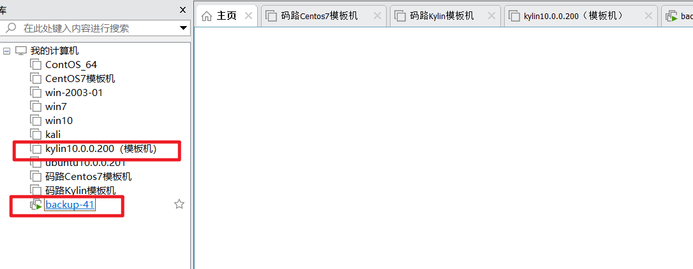
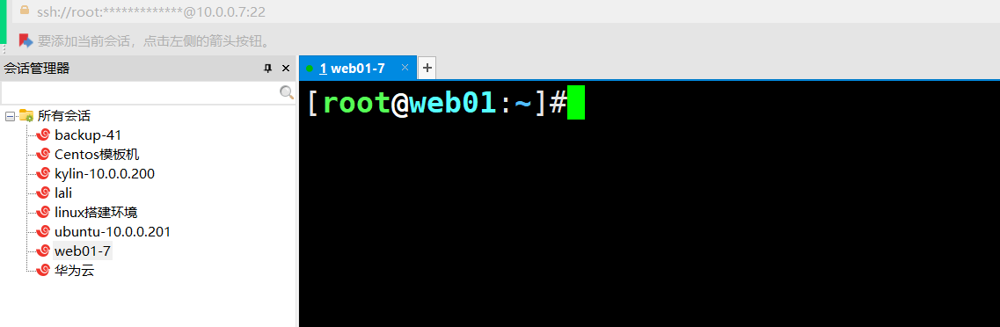
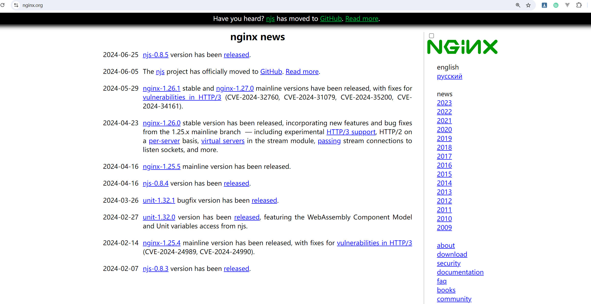

### 1，克隆一台web01机器


前面我们有了两台机器了：




backup有两个IP：

- 10.0.0.41
- 172.16.1.41


克隆一个web01机器：

- 10.0.0.7
- 172.16.1.7


克隆成功： 具体的流程，就看系统优化的课件




### 2，安装nginx

安装方式：

- 通过官方仓库安装    类手机安装游戏找到官方下载安装      版本新的
- 通过epel安装   扩展仓库     类似手机通过应用软件商店搜索安装     版本较低
- 编译安装


通过官方仓库安装Nginx服务，官网：https://nginx.org/




操作流程：

```bash
1.配置Nginx官方仓库
配置仓库的链接: https://nginx.org/en/linux_packages.html#RHEL

[root@web01:~]#vim /etc/yum.repos.d/nginx.repo
[nginx-stable]
name=nginx stable repo			# 名称
baseurl=http://nginx.org/packages/centos/7/$basearch/  # 软件链接地址
gpgcheck=0					    # 是否校验
enabled=1					    # 是否开启此仓库 1为开启 0为关闭
gpgkey=https://nginx.org/keys/nginx_signing.key
module_hotfixes=true

[root@web01:~]#ll /etc/yum.repos.d/
total 12
-rw-r--r-- 1 root root 664 Aug  4  2022 epel.repo
-rw-r--r-- 1 root root 701 Sep  8  2022 kylin_x86_64.repo
-rw-r--r-- 1 root root 182 Aug  5 10:46 nginx.repo


2.安装Nginx
[root@web01:~]#yum -y install nginx

查看是否成功：
[root@web01:~]#nginx -v
nginx version: nginx/1.26.1

3.配置Nginx
主配置: /etc/nginx/nginx.conf

[root@web01:~]#cat /etc/nginx/nginx.conf 
# 核心区块
user  nginx;				# 启动进程使用nginx用户
worker_processes  auto;     # nginx进程打开数量 auto自动以cpu核心数相同

error_log  /var/log/nginx/error.log notice;  # 错误日志的位置和级别
pid        /var/run/nginx.pid;			     # 运行的PID号会保存到此文件

#事件区块
events {
    worker_connections  10240;				 # 每个子进程最大的链接数量。
}


#http区块 响应浏览器请求区块
http {
    include       /etc/nginx/mime.types;	 # 默认为下载类型
    default_type  application/octet-stream;  # 网站支持的默认资源类型

    log_format  main  '$remote_addr - $remote_user [$time_local] "$request" '
                      '$status $body_bytes_sent "$http_referer" '
                      '"$http_user_agent" "$http_x_forwarded_for"';  # nginx日志格式
	
    access_log  /var/log/nginx/access.log  main;	# 日志存放的位置

    sendfile        on;			# 文件高效传输
    #tcp_nopush     on;

    keepalive_timeout  65;	    # 长连接 如果用户65秒内无操作，则服务器主动断开连接

    #gzip  on;

    include /etc/nginx/conf.d/*.conf;  # 包含/etc/nginx/conf.d/下所有的文件 到当前的位置
    # charset utf-8; 引用game.conf 相当于直接写到当前的位置
}

# 编辑default.conf
vim default.conf  # 将默认的配置清空 写入以下内容
server{

        listen 80;              # 监听的端口号 浏览器默认访问都是以80端口访问的页面
        server_name www.malu.com;  # 自己注册的域名,也可以使用没有注册过的写入hosts本地解析

        location / {   # 访问域名的后面默认都是有个/  www.baidu.com/  路径匹配
                root /code/;  # 如果有人访问的是www.malu.com/，则让用户去/code目录下访问
                index  index.html;  # 默认让用户访问index.html内容
        }

}

语法检测:
[root@web01:conf.d]#nginx -t
nginx: the configuration file /etc/nginx/nginx.conf syntax is ok
nginx: configuration file /etc/nginx/nginx.conf test is successful

[root@web01:conf.d]#mkdir /code
[root@web01:conf.d]#cd /
[root@web01:/]#ls
bin   code  d.txt  home  lib64  mnt  proc  run   srv  tmp  var
boot  dev   etc    lib   media  opt  root  sbin  sys  usr
[root@web01:/]#cd code
[root@web01:code]#touch index.html
[root@web01:code]#echo 123 > index.html 
[root@web01:code]#cat index.html 
123
[root@web01:code]#


4.启动Nginx
systemctl start nginx


5.浏览器访问主页查看是否是123
```


### 3，将小霸王游戏机部署到nginx

```bash
1.进入到代码目录
[root@web01:~]#cd /code/
[root@web01:code]#

2.上传小霸
[root@web01:code]#ll
-rw-r--r-- 1 root root 7902976 Aug  5 10:21 小霸王_FC怀旧游戏机-HTML源码.zip
3.解压代码
[root@web01:code]#unzip 小霸王_FC怀旧游戏机-HTML源码.zip

4.直接浏览器访问即可
10.0.0.7
```


### 4，nginx的启动与停止 


```bash
# 查看nginx当前的状态
[root@web01:code]#systemctl status nginx
● nginx.service - nginx - high performance web server
   Loaded: loaded (/usr/lib/systemd/system/nginx.service; disabled; vendor preset: disabled)
   Active: active (running) since Fri 2024-08-09 11:17:03 CST; 31min ago
     Docs: http://nginx.org/en/docs/
  Process: 1767 ExecStart=/usr/sbin/
  
# 启动Nginx服务
systemctl start nginx  # 启动ngix
systemctl restart nginx  # 启动ngix
systemctl enable nginx  # 开机自动启动

# 停止nginx
systemctl stop nginx  # 停止ngix
systemctl disable nginx  # 禁止开机自动启动

[root@web01:code]#systemctl stop nginx
[root@web01:code]#systemctl status nginx
● nginx.service - nginx - high performance web server
   Loaded: loaded (/usr/lib/systemd/system/nginx.service; disabled; vendor preset: disabled)
   Active: inactive (dead)
   
# 还有一种启动和停止的方式（了解）
[root@web01:code]#which nginx
/usr/sbin/nginx
[root@web01:~]#/usr/sbin/nginx			  # 启动
[root@web01:~]#/usr/sbin/nginx -s stop    # 停止
[root@web01:~]#/usr/sbin/nginx -s reload  # 重新加载
```


