### 1，网线

网线：

- 网线分类:    五类线      超五类    六类线(千兆)     按箱子305米  
- 水晶头   橙白    橙    绿白   蓝    蓝白    绿     棕白    棕     568B线序(568A线序)
- 568A标准：绿白-1，绿-2，橙白-3，蓝-4，蓝白-5，橙-6，棕白-7，棕-8
- 568B标准：橙白-1，橙-2，绿白-3，蓝-4，蓝白-5，绿-6，棕白-7，棕-8
- 直通线：双绞线两边是一样标准，如568B-568B（常用）
- 交叉线：双绞线两边标准不一样，如568A-568B


8芯线: 

- 4芯     1236芯      用来传输数据      其他4芯没用(额外供电 反向供电 POE供电)


传输：

- 普通网络的传输距离100米，超过100米需要加信号放大器 交换机 HUB
- 光纤    千兆万兆
- 多模光纤   传输距离近     2公里
- 单模光纤    传输距离远    120公里
- wifi 


网络设备连接

- 直通线：交换机到路由器、计算机到交换机、计算机到集线器等不同设备互联
- 交叉线：交换机到交换机、交换机到集线器、集线器到集线器、路由器到路由器、计算机到计算机


光纤

- 与其它传输介质比较，光纤的电磁绝缘性能好、信号衰小、频带宽、传输速度快、传输距离大。主要用于要求
  传输距离较长、布线条件特殊的主干网连接。具有不受外界电磁场的影响，无限制的带宽等特点，可以实现每
  秒万兆位的数据传送，尺寸小、重量轻，数据可传送几百千米，价格昂贵。


### 2，多台主机之间的通讯


物体于物体:

- 计算机-计算机

- 计算机-服务器

- 服务器-服务器

- 计算机-交换机

- 计算机-路由器

- 交换机-交换机

- 路由器-路由器

  

物联网: 所有的物体都是由网络进行互通互联， 所有的系统都有网络！


如何通过网络实现多台主机之间的通讯：

- 在两台主机之间需要有传输介质(网线、光纤、无线等)
- 在两台主机上面需要有网卡设备，网卡: 全球唯一的地址(MAC)     类似家的位置
- 在进行数据传输之前，需要协商网络传输速率。


在发送信息时：

- 将二进制（数字信号）信息转换为高低电压（电信号），这个叫调制过程

在接收信息时：

- 将高低电压（电信号）信息转换为二进制数（数字信号），这个叫解调过程


在进行数据传输之前，需要协商网络传输速率：

- 网卡速度参数  100Mbps（100M  bit  每秒），每秒钟传输多少个bit(位， 1或0)

- 1M=1000k    

- 100M=100000k

- 1k=1000b

- 100000k = 100000000b

  

网卡的100Mbps同样是以bit/s来定义的 ，所以100Mb/S＝100/8。在理论上1秒钟可以传输12.5MB的速据。考虑到干扰的因素每秒传输只要超过10MB就是正常了。


网络的传输数据单位和磁盘存储数据单位不一样：

- 网络传输数据单位：比特  bit    1bit=1/8byte

- 磁盘存储数据单位：字节  byte   1byte=8bit


真实的运营商下载带宽:

- 非对称式网络，上传和下载带宽不一样，家用
- 企业专线：对称式网络，上传和下载相同，价格翻好几倍，10MB的10万左右/1年


### 2，交换机

实现一个网络内多台主机之间的通讯

- 能够进行地址学习（源端和目标端的MAC地址），维护一张MAC地址表

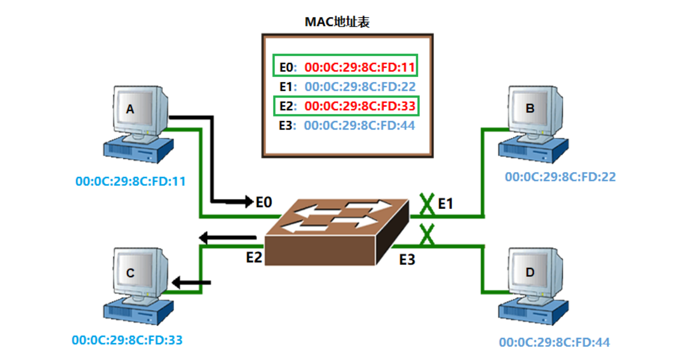


如何利用交换机实现通讯

1. 在数据前面设置目标地址和源地址，目标地址和源地址用mac地址进行标识
   - mac称为物理地址，每块网卡上都有的一个标识身份信息的
   -  mac地址全球唯一，不能进行修改，mac地址用16进制标识
2. 在网络通讯初期，会利用广播方式进行发送数据包，在通讯的过程，数据包的发送一定是有去有回的。
   -  在一个交换网路中，如果产生了大量广播数据包时会产生广播风暴，影响主机性能，这样的问题称为广播风暴问题


解决广播风暴问题思路：

- 减少广播产生数量，将一个大的交换网络切割为几个小的交换网络（局域网，广播域）


交换机的种类：

- 傻瓜交换机（TP-link/Dlink/水星...），4口 8口 12口 16口 24口 48口
- 程控交换机（存储程序控制交换机，配置管理，思科、华为、华三、锐捷、中兴、瑞斯康达）
- 二层交换  支持数据转发 vlan隔离端口
- 三层交换  功能比较多 DHCP ACL访问控制列表 支持路由器功能

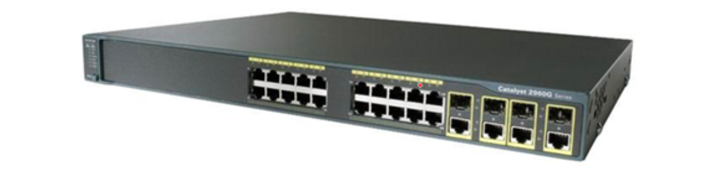


### 4，路由器

实现不同局域网之间主机通讯，可以隔离广播风暴（路由不同的接口连接不同广播域）

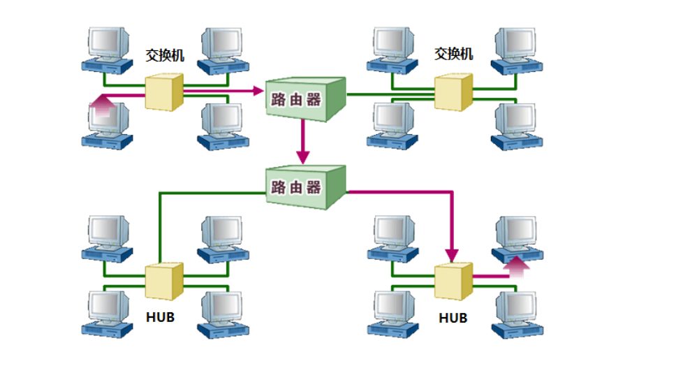

路由类似于现实生活中从A地去往B地可能需要先步行，在坐车，在做飞机才能到达B地，这样的整个过程在网络中对应数据的传递过程就称为路由。因此一个数据信息跨越不同的网段传递到目的地址，就可以把传递数据的过程称为路由，也可以看做每条传递数据的路径。


需要有身份标识信息：ip地址，逻辑地址（可以改变的地址） 利用10进制方式进行显示。

- IP地址由两部分组成: 交换网络标识信息+主机地址标识信息===网段地址+主机地址

```bash
192.16.13 网段 1-254 主机地址
10.0.0   网段  1-254 主机地址
昌平区  网段  xx地址 192.168.11.X
海淀区  网段  xx地址 192.168.10.X
```


查公网ip的方法：

- windows，打开浏览器，访问百度，搜IP即可
- linux：curl ifconfig.me


路由实现数据传输通讯时，会根据路由表信息进行数据包路由，实现不同网段之间通讯需要经过一条必经之路，这条路称为网关。

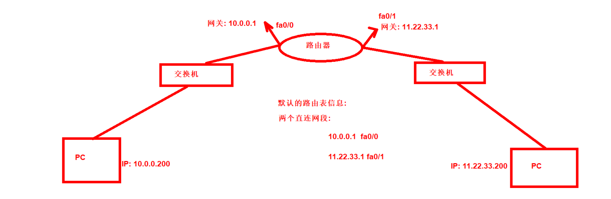


查看路由条目信息：

```bash
[root@qls ~]# route -n
Kernel IP routing table
Destination     Gateway         Genmask         Flags Metric Ref    Use Iface
0.0.0.0         10.0.0.254      0.0.0.0         UG    0      0        0 eth0
10.0.0.0        0.0.0.0         255.255.255.0   U     0      0        0 eth0
169.254.0.0     0.0.0.0         255.255.0.0     U     1002   0        0 eth0
169.254.0.0     0.0.0.0         255.255.0.0     U     1003   0        0 eth1
172.16.1.0      0.0.0.0         255.255.255.0   U     0      0        0 eth1
[root@qls ~]# netstat  -rn
Kernel IP routing table
Destination     Gateway         Genmask         Flags   MSS Window  irtt Iface
0.0.0.0         10.0.0.254      0.0.0.0         UG        0 0          0 eth0
10.0.0.0        0.0.0.0         255.255.255.0   U         0 0          0 eth0
169.254.0.0     0.0.0.0         255.255.0.0     U         0 0          0 eth0
169.254.0.0     0.0.0.0         255.255.0.0     U         0 0          0 eth1
172.16.1.0      0.0.0.0         255.255.255.0   U         0 0          0 eth1

第一列：所能去往网段的信息 
第二列：0.0.0.0  通过局域网即可到达
       10.0.0.254 想去往其他网段的必经节点，称为网关
第三列：子网掩码（告诉网段内可以容纳多少主机）
最后一列：到达指定目标，通过哪一个接口出去
```


### 5，IP地址和MAC地址介绍

以太网上的两台计算机之所以能够交换信息就是因为每个设备都有一块网卡，并且每块网卡拥有唯一的物理地
址（称为MAC地址）和唯一的逻辑地址（称为IP地址）。


MAC地址是由生产厂商烧录好的，一般不能改动，并且全球唯一；IP地址需要绑定在网卡上，并且同一个IP地
址不能绑定在多个网卡上。MAC地址和IP地址的区别如下：

- MAC地址和IP地址结构长度不一样。

  - MAC地址是48位的十六进制数，IPv4地址是32位的二进制数，IPv6地址是128位，通常写成8组，每组为四个十六进制数的形式。

  - 0 1 bit 1B=8bit 1KB=1024B 1MB=1024KB 1GB=1024MB 1TB 1PB EB

  - IPv4地址使用"点分十进制"法表示；IPv6地址使用"冒分十六进制"法表示

  - > IPv4地址：192.168.1.1 十进制数
    >
    > IPv6地址：FE80:0000:0000:0000:AAAA:0000:00C2:0002
    >
    > MAC地址：00-E1-8C-D8-EC-FE 十六进制

- MAC地址和IP地址在OSI模型中寻址层不同

  - IP地址应用于OSI第三层，即网络层
  - MAC地址应用在OSI第二层，即数据链路层

- MAC地址和IP地址分配方式不一样

  - MAC地址分为前24位(称为组织唯一标志符,是由 1 的注册管理机构给厂商分配)和后24位(称为扩展标识符，由厂家自己分配)
  - IP地址是由网络拓扑结构决定分配


为了便于根据IP地址寻找到该地址所代表的主机，这个32位的二进制数被分为2个部分：

- 网络号：区分网络是否在同一区域（网段），说明可以划分为几个网络或区域。
- 主机号：区分同一个网络中的主机，说明网络里有多少台主机。

说明：我们现在所说的互联网就是由两个或者两个以上的网络进行互联。


思考：每个IP地址都分割成网络号和主机号两部分，目的是便于IP地址的寻址操作；那么IP地址的网络号和主机号各是多少位呢？如何确定？答案就是通过子网掩码，子网掩码特点：

- 子网掩码不能单独存在，它必须结合IP地址一起使用；
- 子网掩码只有一个作用，就是将某个IP地址划分成网络地址和主机地址两部分；用来判断两个IP是否在同一网络
- 子网掩码是一个32位的二进制数，用"点分十进制"表示；其对应网络地址的所有位置都为1，对应于主机地址的所有位置都为0。


IP地址：192.168.1.254， 子网掩码：255.255.255.0

```
192=11000000
168=10101000
1=00000001
254=11111110
255=11111111
```


### 6， IP地址分类

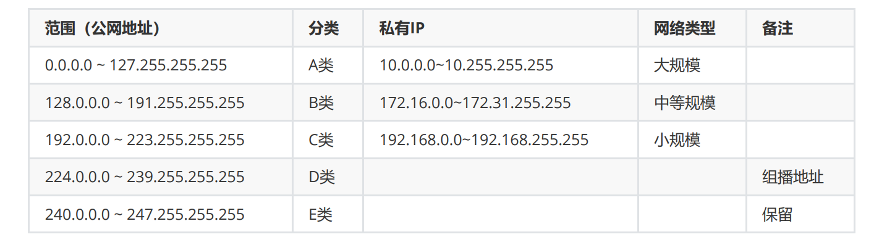

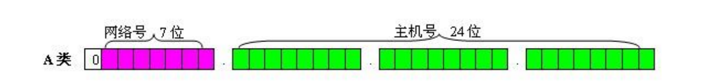

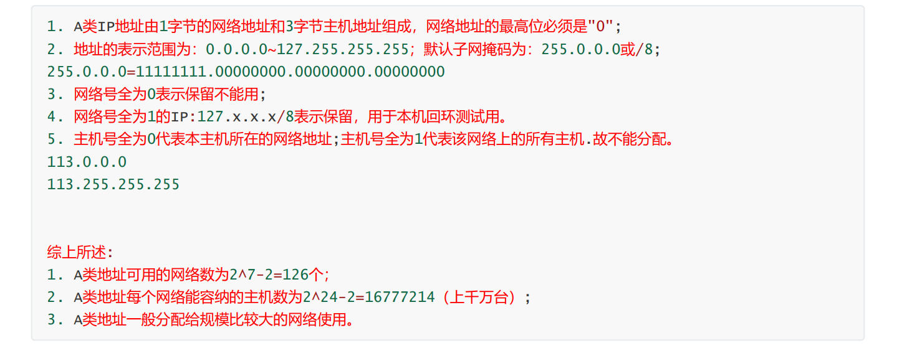


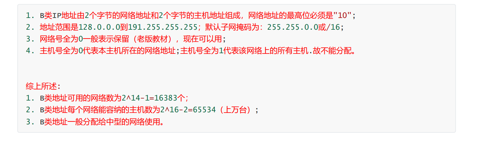

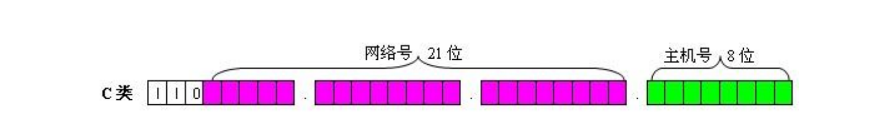


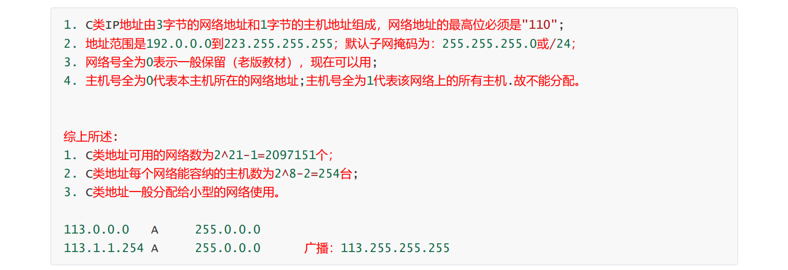


特殊IP说明：

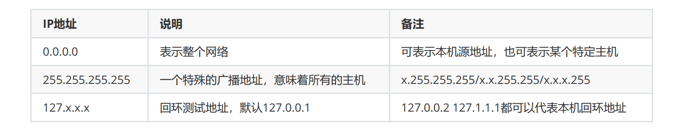


### 7，子网划分

子网划分核心，"借用"主机位来"制造"新的网络。IP地址=网络号+主机号(子网位+主机位)。IP地址=网络位+子网位+主机位

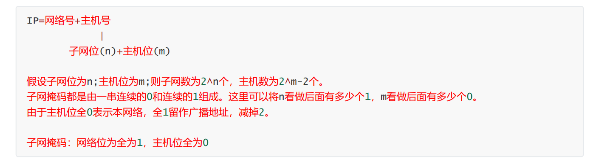

根据子网掩码判断主机数

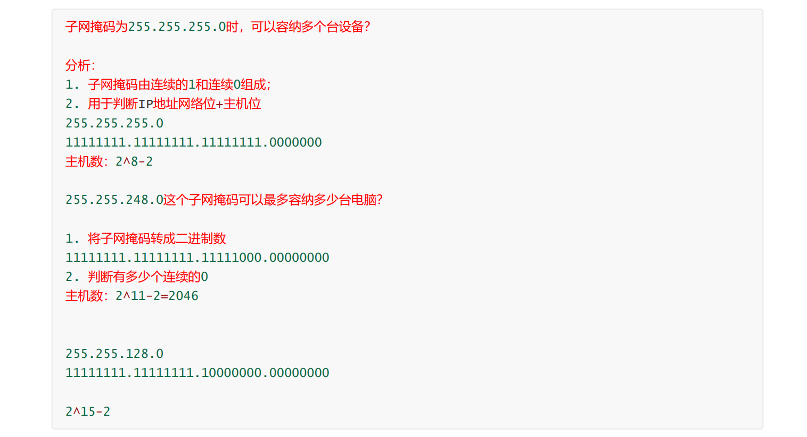

根据主机和子网判断子网掩码：

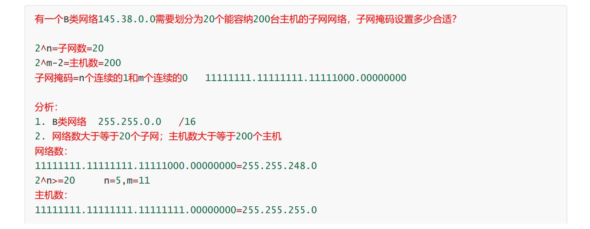

根据IP和子网掩码判断子网数：

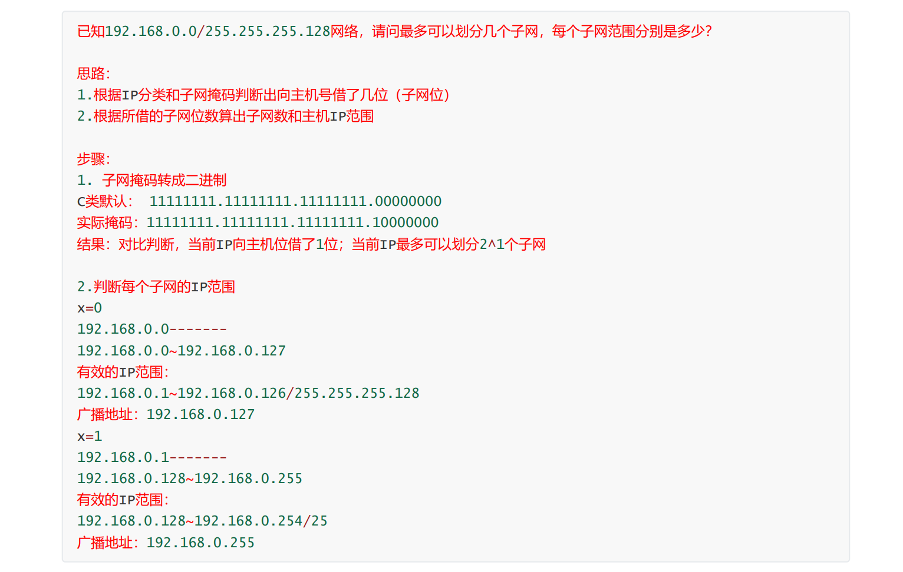


### 8，网络拓扑

网络层次结构

- 核心层：主要部署路由器设备，用于连接外网线路，还要具备冗余能力
- 汇聚层：主要部署三层交换设备，用于相应安全访问控制 进行链路汇聚
- 接入层：主要部署二层交换设备，用于终端设备接入


关于交换机：

- 一层交换机：只支持物理层协议。
- 二层交换机：支持物理层和数据链路层协议。
- 三层交换机：支持物理层，数据链路层及网络层协议。

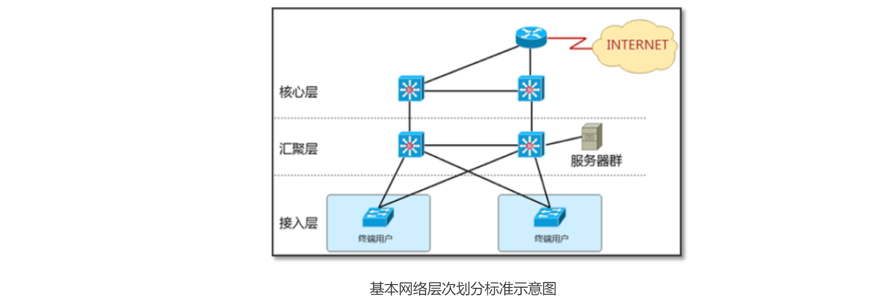


网络类型：

- 局域网：本地私有的一个网络范围。规模较大的局域网，也会称为园区网。教室 家庭  公司内 校园
- 公网: 全球任意一个可以上网的地方都可以直接访问到
- 城域网：网络的覆盖面积达到了一个城市，就可以称为城域网。
- 广域网：覆盖面积 达到了全国或全球，就称为广域网，全球最大的广域网就是Internet互联网。


### 9，网络层次模型


网络层次模型（OSI7层模型），OSI是Open System Interconnection的缩写，意为开放式系统互联。国际标准化组织（ISO）制定了OSI模型，该模型定义了不同计算机互联的标准，是设计和描述计算机网络通信的基本框架。OSI模型把网络通信的工作分为7层，分别是物理层、数据链路层、网络层、传输层、会话层、表示层和应用层。

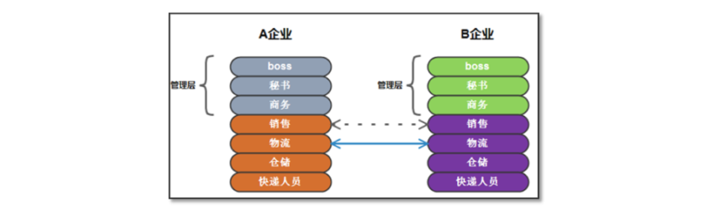


OSI 7层模型结构示意图

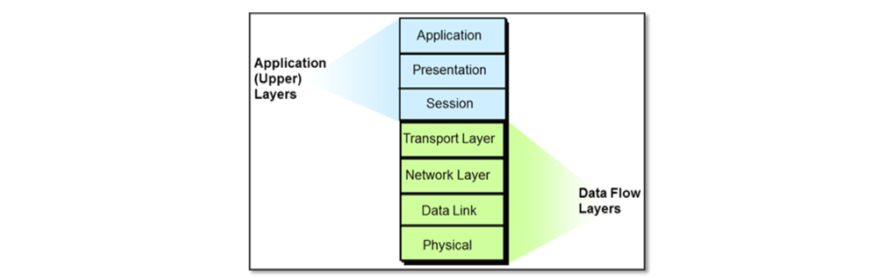

 OSI七层模型详解

应用层：主要就是提供应用程序可以接入网络接口，并根据程序的不同对应不同的接口协议。

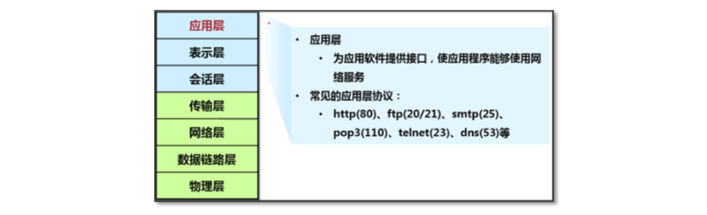

表示层：

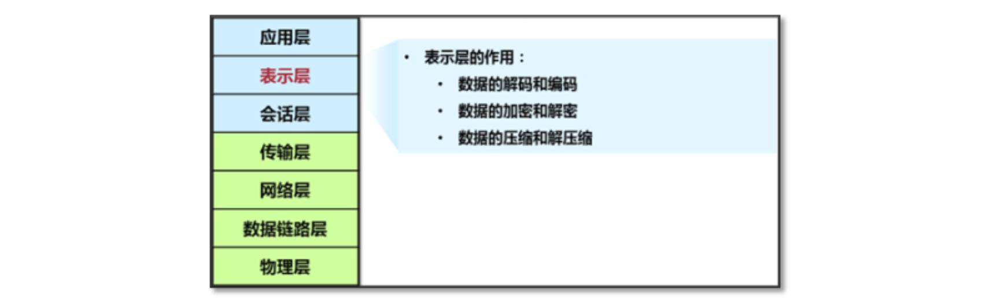

会话层：

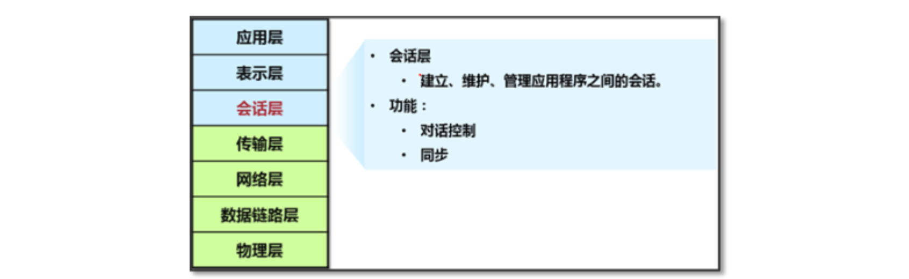

传输层：负责网络中端到端的连接（TCP、UDP）。

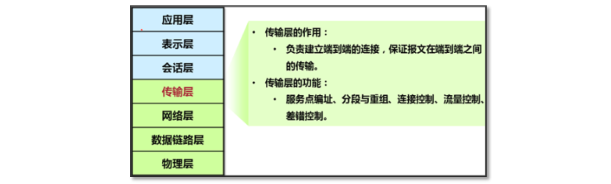

网络层：网络层的主要作用就是路由和寻址，主要接触到的是IP协议，即IP地址。 

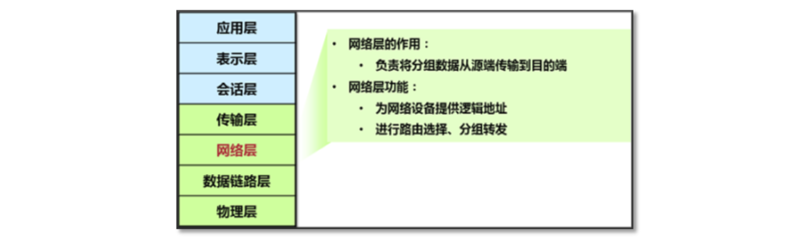

数据链路层：

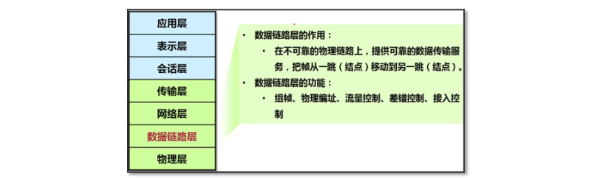

物理层：物理层标准规定了信号、连接器和电缆要求、接口类型、线缆类型、设备（集线器hub）。

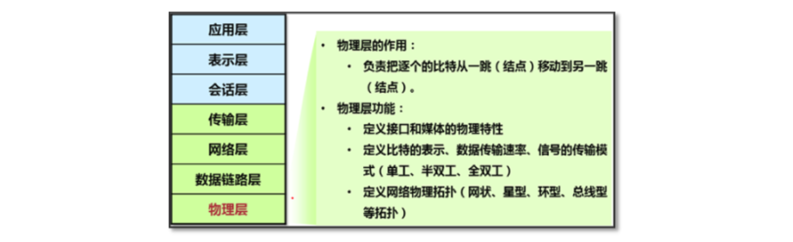

单工，半双工，全双工：

- 单工：（广播电台）通讯时候。只有一方作为发送方，另一方作为接受方
- 半双工:（对讲机） 通讯的某一时刻，只有一方作为发送方，另一方作为接受方,通讯时刻发生转变，发送方可以变为接收方，接收方可以变为发送方
- 全双工:（电话）    同一时刻，双方皆可以是发送方，又可以是接收方


### 10，数据包封装与解封装

封装：

- 由上至下进行封装
- 应用层、表示层、会话层  PDU 数据
- 传输层：分段 TCP协议
- 网络层：打包 TCP协议+IP地址
- 数据链路层:成帧  TCP协议+IP地址+MAC地址 
- 物理层：位      数据成为比特

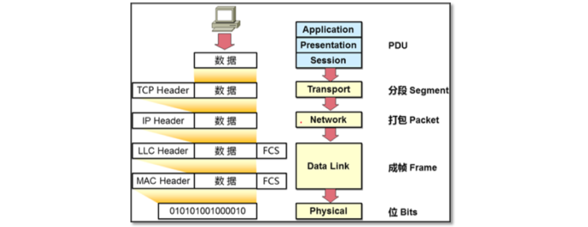


解封装：

- 由下至上进行拆包
- 物理层：位  比特
- 数据链路层：查看MAC地址
- 网络层：查看IP地址
- 传输层：查看TCP协议
- 前三层：数据内容

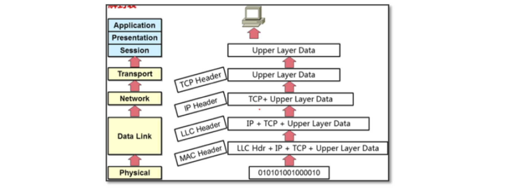


### 11，TCP/IP模型（4层模型）

OSI7层模型与TCP/IP模型（DOD）对应关系：

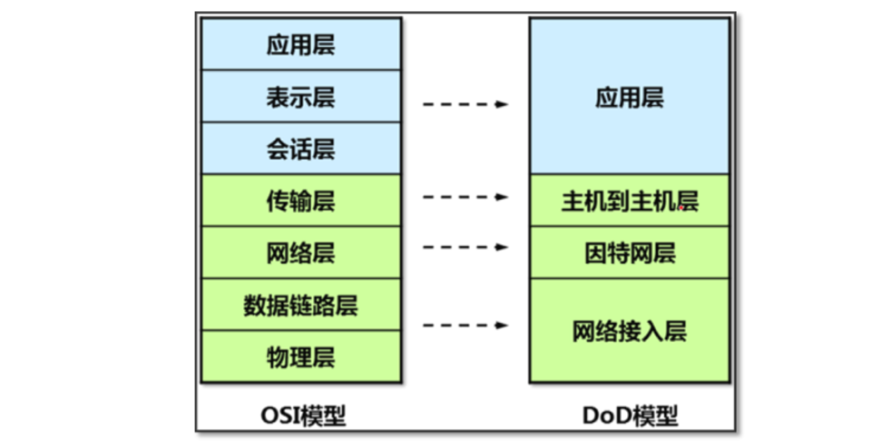

TCP/IP协议簇相关协议汇总：

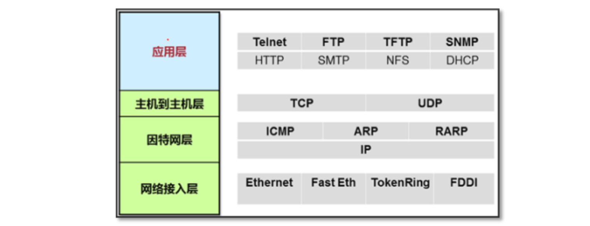


各个端口介绍：

```
面试题: 面试官问 ssh默认端口 http默认端口？
FTP         21          明文协议,文件传输协议，基于TCP
TFTP        69          简单文件传输协议，基于UDP
SSH         22          安全外壳协议，远程连接,加密
Telnet      23          明文协议,远程连接
SNMP        161/162     简单网络管理协议，基于UDP
SMTP        25          简单邮件传输协议，基于TCP
HTTP        80          超文本传输协议
HTTPS       443         超文本传输安全协议
DHCP        67/68/546   动态主机设置协议,C(67),S(68),546(V6)
```


### 12，DNS

DNS称为域名系统，在网站运行中起到了至关重要的作用，主要作用是负责把网站域名解析为对应的IP地址。
一般域名提供商，提供的dns服务器，都是走udp53端口的。


域名是什么：

>举个例子，https://www.baidu.com，这个其实并不是域名，其中https是指协议，去掉https后，www.baidu.com.（注意最后面有一个点号）才是真正的域名。
>
>每个域名的最后面都有一个点号 "." 表示根域名，为了方便在实际使用的时候被省略了。
>
>根域名的下一级就是顶级域名了，.com 也就是顶级域名，常见的顶级域名后缀有.com、.cn、.net、.org 等，这些都是固定的，用户不能自己修改，只能选择。
>
>顶级域名的下一级又是权威域名，如baidu.com中的.baidu，这个权威域名就是我们自己可注册的域名。
>www.baidu.com www.weibo.com www.linuxnc.com
>
>顶级域名下就是主机名了，www是指主机名，这个是我们可以自己定义的，通常在http服务器如nginx中可以修改。
>
>http https 协议
>.com .cn .org .net. ...  顶级域名
>baidu sina weibo linuxnc 权威域名
>www.baidu.com --->显示百度的主页
>news.baidu.com --->显示的百度的新闻页面
>
>www.baidu.com的www  news.baidu.com 的news 表示主机名 表示不同的业务 不同的页面


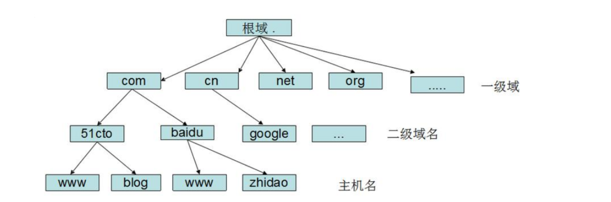

域名解析过程分析:

```
下面就还以www.baidu,com这个网址来分析一下dns的解析过程。

当浏览器拿到输入的www.baidu.com后，首先会去浏览器的dns缓存中去查询是否有对应记录，如果查询到记录就可以直接返回ip地址，完成解析。

如果浏览器没有缓存，那就再去查询操作系统的缓存，同样的，如果查询到记录就可以直接返回ip地址，完成解析。

如果操作系统也没有缓存，那就再去查看本地hosts文件，Windows下host文件一般位于 "C:\Windows\System32\drivers\etc"。

近几年网上流传的通过修改本地host文件来避免双11女友剁手的段子，其实就是将淘宝的支付接口解析到错误的ip地址，从而导致支付不成功。

如果本地host文件也没有相应记录，那就需要求助于本地dns服务器了，所以应该要知道本地dns的ip地址。
Linux本地DNS: 223.5.5.5 LocalDNS  LDNS

本地dns服务器ip地址一般是由本地网络服务商如移动、电信提供，一般是通过DHCP自动分配，当然你也可以自己手动配置。目前用的比较多的是谷歌提供的公用dns 8.8.8.8和国内的公用dns 114.114.114.114及阿里的223.5.5.5。

你之前可能有遇到过电脑可以正常上QQ但是就是不能打开网页的怪现象，这种情况大多数可能就是dns域名解析出问题了，你可以尝试手动把dns设置为公用dns。

找到本地dns后，它也会先去查询一遍它自己的缓存，如果有记录就返回，如果没有记录，它将开始要去我们前面提到的根域名服务器查询了。注意由于根域名服务器ip地址一般都是固定的，所以本地dns服务器一般都内置了根域名服务器ip地址。https://www.uedbox.com/post/50977/

目前全球一共有13个根域名服务器（这里并不是指13台服务器，是指13个ip地址，按字母a-m编号），为了能更高效完成全球所有域名的解析请求，根域名服务器本身并不会直接去解析域名，而是会把不同的解析请求分配给下面的其他服务器去完成，下面是dns域名系统的树状结构图。
```

