## 一，小程序登录[讲师：码路于老师/LY]


### 1，流程分析

用户登录是微信小程序的重要内容，那么今天就讲用户登录的一个流程，当然微信官方文档也有相关的一个登录流程图，这里也给大家附上地址：[官方 | 小程序登录](https://developers.weixin.qq.com/miniprogram/dev/framework/open-ability/login.html) 。


用户登录流程可以用这一句话简单概括：3个角色，4个步骤 ，3个角色就是

- 小程序 (通过微信开发者工具创建)

- 开发者服务器 （本地的服务器来实现）

- 微信接口服务  （微信官方提供文档）

  

4个步骤就是：

1. 小程序获取code
2. 将code发送到开发者服务器
3. 开发者服务器通过微信接口服务校验登录凭证 
4. 开发者服务自定义登录的状态


**流程：**

1. 首先小程序通过wx.login()获取登录凭证code，每次调用code均不同，有效时间是5分钟，该code被微信接口服务验证一次就会失效了，
2. 小程序获取到code之后，通过wx.request()将code发送到开发者服务器，开发者服务器将appid，appSecret（密钥），和code发送给微信接口服务去校验登录凭证，成功会返回session_key(会话信息记录)和openid(用户唯一标识)
3. 用户登录成功后，开发者服务器可以将openid和session_key保存，生成一个自定义登录态的token(令牌)响应回去给小程序
4. 通过token可以查询openid和session_key，小程序下次请求只要携带着token就可以证明已经登录。


### 2，搭建开发者服务器

在实际开发中是去购买服务器的，那么这里仅限了解和搭建，那么就用本地localhost:3000作为服务器的端口，选用node.js来搭建开发者服务器 。创建服务器代码如下：

```js
const express = require('express') 				
const bodyParser = require('body-parser')		
const request = require('request')	
const app = express()		

app.use(bodyParser.json())	

app.post('/login', (req, res) => {
    
})

app.listen(3000, () => {
    console.log('server running...');
})
```


### 3，获取code

创建小程序项目：

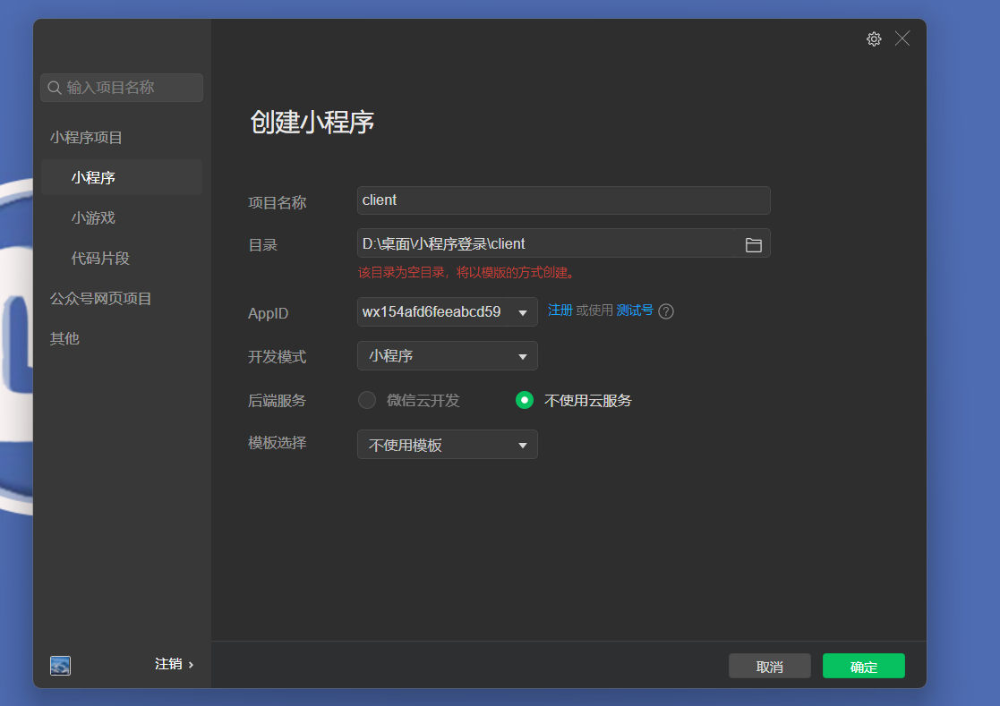


小程序通过wx.login()获取登录凭证code，那么在微信开发者工具中创建一个名为Login的小程序，在这里要实现一个小程序启动时自动执行登录的操作，在app.js文件中来编写代码，可以在onLaunch中进行触发；

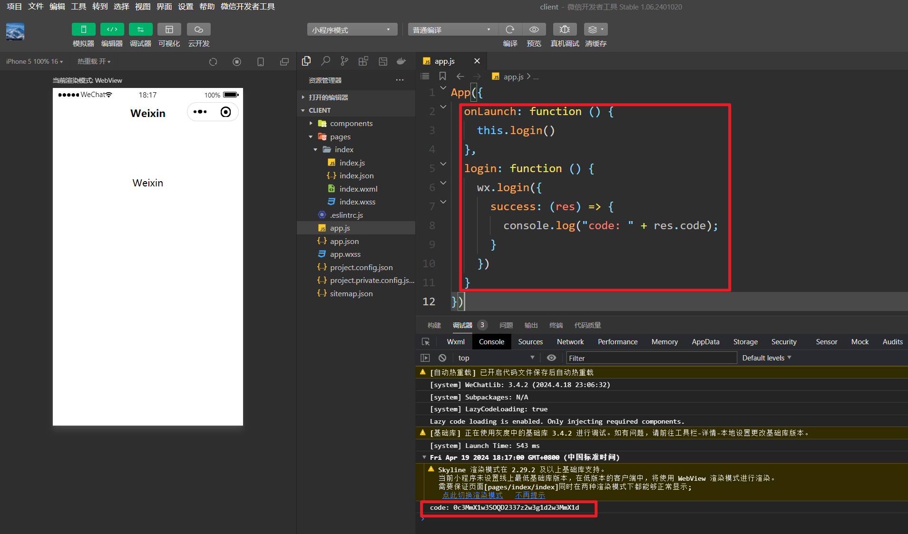

```js
App({
    onLaunch:function(){
       this.login()  
    },
    login:function(){
        wx.login({
            success:(res)=>{
                console.log("code: " + res.code);
            }
        })
    }
})
```

以上就是获取code，此时可以在控制台上看到打印出来的code


### 3，将Code发送到开发服务器

通过wx.request()将code发送到开发者服务器

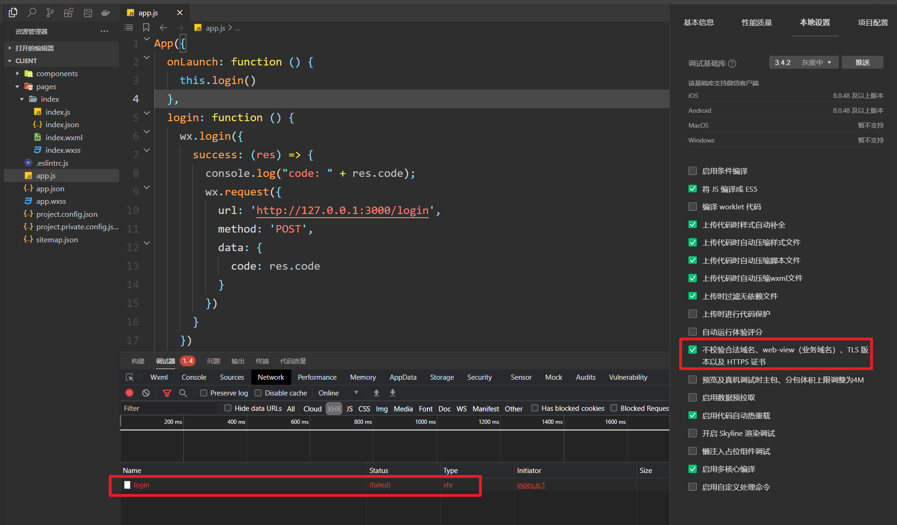

```js
login:function(){
    // wx.login()获取code
        wx.login({
            success:(res)=>{
                console.log("code: " + res.code);
                wx.request({
                    url:'http://127.0.0.1:3000/login',
                    method:'POST',
                    data:{
                        code : res.code
                    }
                })
            }
    })
}
```


在开发者服务器当中来个响应请求接口，请求的方式是post，那可以在index.js文件当中编写代码，这里如果你安装了nodemon的话可以不用重新启动，如果没有，则需要命令行重新输出node index.js重新运行。

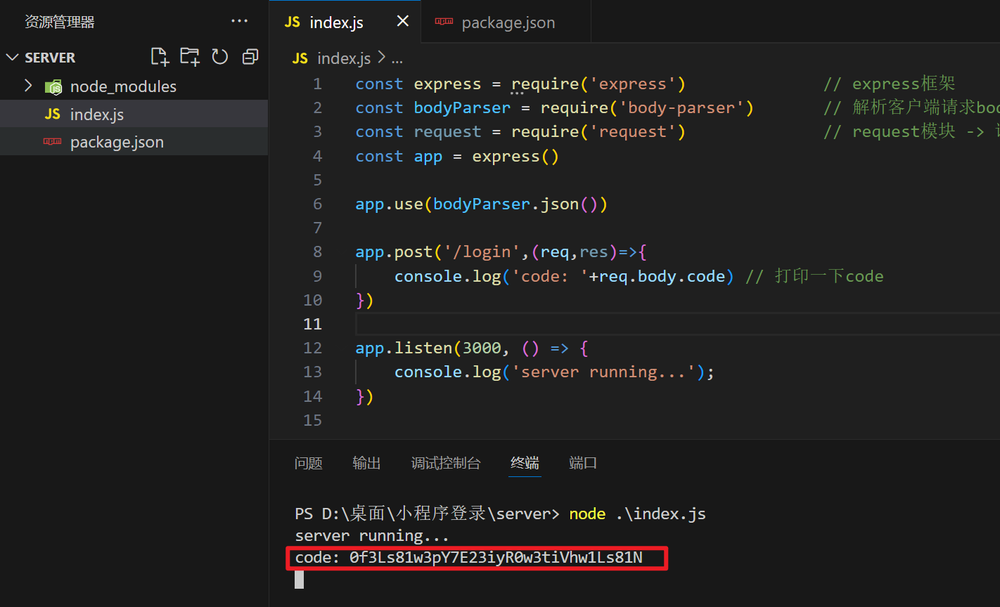

```js
app.post('/login',(req,res)=>{
    console.log('code: '+req.body.code) 
})
```


可以看到小程序通过wx.request()的方式成功将code发送到开发者服务器上；


### 5，通过微信接口服务校验

​	开发者服务器将appid，appSecret（密钥），和code发送给微信接口服务去校验登录凭证，成功会返回session_key(会话信息记录)和openid(用户唯一标识)；这时主要是编写开发者服务器当中的代码，在此之间需要开发者将自己的appid和appSecret密钥准备好，这里也给大家将如何获取到；


获取appid和(用户唯一标识)，appSecret(用户密钥)，如下：

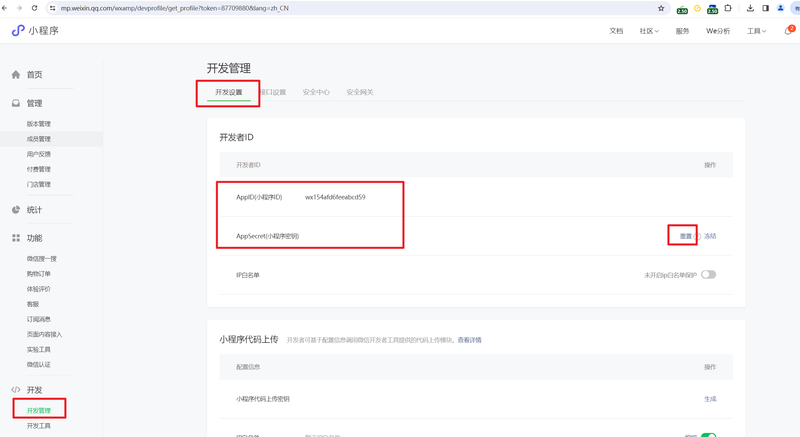

```
AppID(小程序ID)         wx154afd6feeabcd59
AppSecret(小程序密钥)	723d3311bd8d194789437b7b8e99ec33
```


现在编写开发者服务器当中的代码；有了code，appid，appsecret就可以进行微信接口服务校验了，附上这个官方链接用到复制即可，以防自己打错。连接：https://developers.weixin.qq.com/miniprogram/dev/api-backend/open-api/login/auth.code2Session.html


代码：

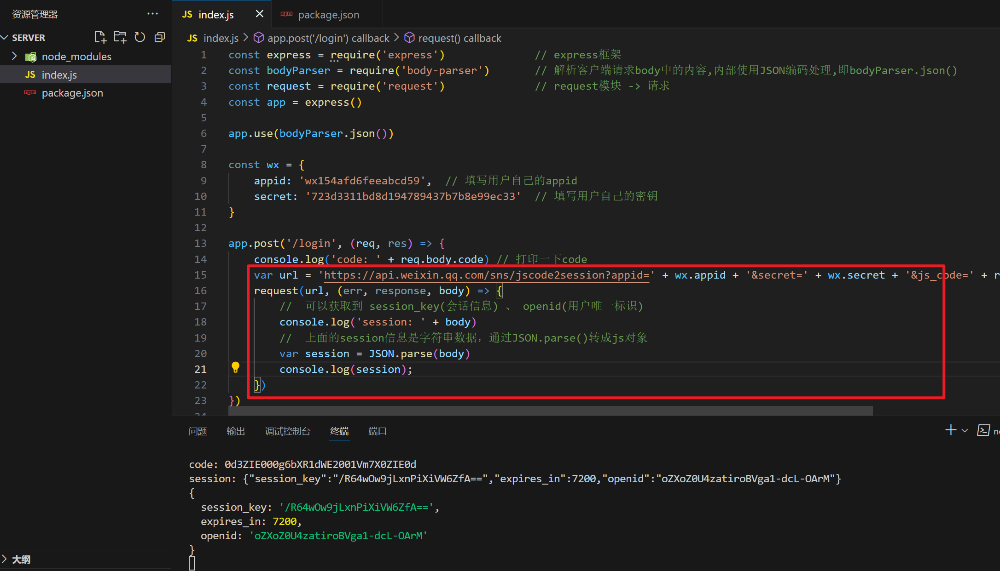

```js
const express = require('express') 				
const bodyParser = require('body-parser')		
const request = require('request')			
const app = express()

app.use(bodyParser.json())

const wx = {
    appid: 'wx154afd6feeabcd59',  // 填写用户自己的appid
    secret: '723d3311bd8d194789437b7b8e99ec33'  // 填写用户自己的密钥
}

app.post('/login', (req, res) => {
    console.log('code: ' + req.body.code) // 打印一下code
    var url = 'https://api.weixin.qq.com/sns/jscode2session?appid=' + wx.appid + '&secret=' + wx.secret + '&js_code=' + req.body.code + '&grant_type=authorization_code'
    request(url, (err, response, body) => {
        //	可以获取到 session_key(会话信息) 、 openid(用户唯一标识)
        console.log('session: ' + body)
        //  上面的session信息是字符串数据，通过JSON.parse()转成js对象
        var session = JSON.parse(body)
        console.log(session);
    })
})

app.listen(3000, () => {
    console.log('server running...');
})

```


成功之后会返回openid和session_key，openid是用户在这个小程序上唯一的id，不同小程序用户的id都不一样，session_key是用户的会话信息记录；将结果打印出来，可以在开发者服务器当中看到如下：

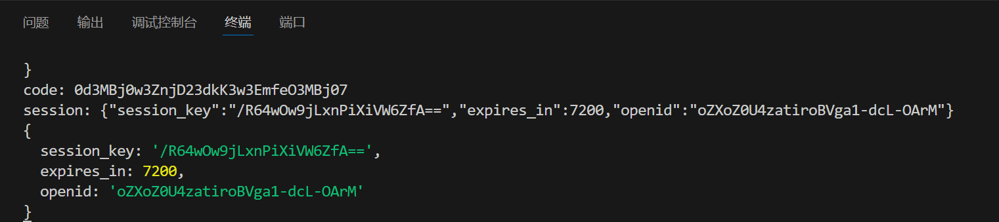

以上就是校验成功之后所返回的session_key和openid；这里注意的是账户不得是测试的账户，否则获取不到code，获取不到code，则校验不能通过；


### 6，开发者服务器自定义登录态

​	通过校验成功后返回的session_key和openid进行保存，实际开发中，通常会使用数据库来保存数据，比如可以用MongoDB，这里就不搭建数据库来存数据，将其作为数据保存到我们的变量当中；openid是用户的唯一标识，所以可以判断session中是否存有openid，如果有我们才返回一个token回去，返回去的token不能是固定的，固定存在一定的分析，这时可以用这个时间戳生成token，当然再实际开发中是推荐使用比较成熟模块生成token，避免token被伪造带来不好的影响，这里我们就通过时间戳的方式来生成token给大家演示这个过程；

```js
const express = require('express') 				
const bodyParser = require('body-parser')		
const request = require('request')				
const app = express()

app.use(bodyParser.json())

const wx = {
    appid: 'wx154afd6feeabcd59',  // 填写用户自己的appid
    secret: '723d3311bd8d194789437b7b8e99ec33'  // 填写用户自己的密钥
}

// 模拟数据库存放数据
var db = {
	user: {},		// userInfo
    session: {}		// 保存 openid 和session_key会话信息 
}

app.post('/login', (req, res) => {
    console.log('code: ' + req.body.code) // 打印一下code
    var url = 'https://api.weixin.qq.com/sns/jscode2session?appid=' + wx.appid + '&secret=' + wx.secret + '&js_code=' + req.body.code + '&grant_type=authorization_code'
    request(url, (err, response, body) => {
        //	可以获取到 session_key(会话信息) 、 openid(用户唯一标识)
        console.log('session: ' + body)
        //  上面的session信息是字符串数据，通过JSON.parse()转成js对象
        var session = JSON.parse(body)
        console.log(session);
        // 将openid和session_key保存后响应token回去,openid是用户的唯一标识
        if(session.openid){
            var token = 'token_' + new Date().getTime() 
            db.session[token] = session
            if(!db.user[session.openid]) {
                db.user[session.openid] = {
                    state:1  // 成功登录可以获取
                }
            }
            console.log(db);
        }
        res.json({
            token: token  // 返回token
        })
    })
})

app.listen(3000, () => {
    console.log('server running...');
})
```


打印结果测试：

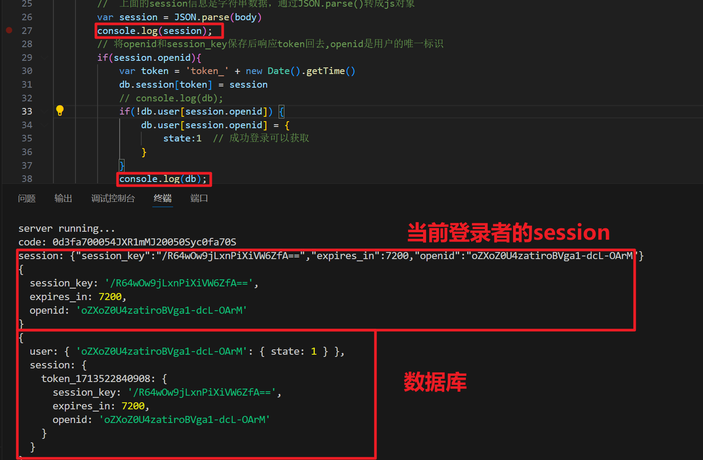


成功之后返回token，可以在小程序当中的wx.request()请求校验当中添加请求成功之后将返回的数据进行打印到小程序的控制台上；

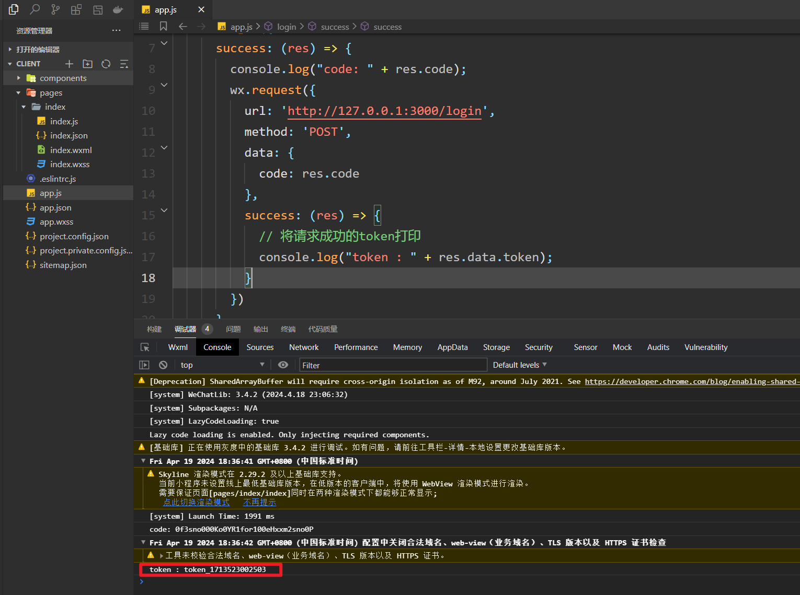

```js
App({
  onLaunch: function () {
    this.login()
  },
  login: function () {
    wx.login({
      success: (res) => {
        console.log("code: " + res.code);
        wx.request({
          url: 'http://127.0.0.1:3000/login',
          method: 'POST',
          data: {
            code: res.code
          },
          success: (res) => {
            // 将请求成功的token打印
            console.log("token : " + res.data.token);
          }
        })
      }
    })
  }
})
```


将返回到小程序的token进行一个缓存，小程序的下次请求时只要携带token，就可以证明用户已经登录，那么我们在进入小程序之前就需要将检查是否登录。


### 7，检查用户是否登录

在检查用户登录之前，将返回的token进行数据缓存，token是公共数据，是多个页面当中需要用到的，可以定义为全局的globalData；数据缓存可以用wx.setStorage()。

```js
App({
  globalData: {
    token: "",
  },
  onLaunch: function () {
    this.login()
  },
  login: function () {
    wx.login({
      success: (res) => {
        console.log("code: " + res.code);
        wx.request({
          url: 'http://127.0.0.1:3000/login',
          method: 'POST',
          data: {
            code: res.code
          },
          success: (res) => {
            // 将请求成功的token打印
            console.log("token : " + res.data.token);
            // 将token保存为公共数据（多页面使用->全局globalData）
            this.globalData.token = res.data.token
            // 将token保存在数据缓存中（下次无需重新获取token）
            wx.setStorage({
              key: 'token',
              data: res.data.token
            })
          }
        })
      }
    })
  }
})
```


可以查看是否已经缓存下来，打开控制台查看，如下图：

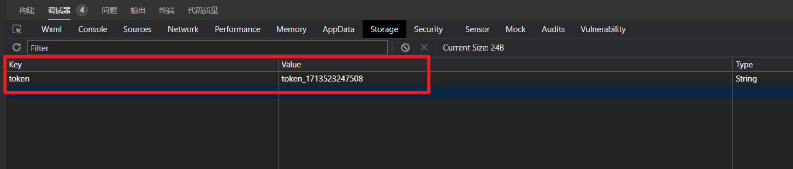


上述内容将返回token缓存下来，那么检查的是否需要先从缓存当中看是否有token，如果有则可以请求服务器去检验token是否有效，如果没有token，则按照原来的方式去调用login()来获取token；

```js
App({
  globalData: {
    token: "",
  },
  onLaunch: function () {
    // 检测用户是否登录
    this.checkLogin(res => {
      console.log('is_login : ', res.is_login);
      // 未登录 -> login()
      if (!res.is_login) {
        // 调用Login
        this.login();
      }
    })
    // this.login()
  },
  checkLogin:function(callback){
    var token = this.globalData.token
    if(!token){
      // 从缓存中获取token
      token = wx.getStorageSync('token')
      if(token){
        this.globalData.token = token
      }else{
        callback({ is_login : false })
      }
    }
     // 发送请求检验token是否存在
     wx.request({
      url: 'http://127.0.0.1:3000/checklogin',
      data:{
        token : token
      },
      success:(res)=>{
        console.log(res);
        callback({
          is_login:res.data.is_login
        })
      }
    }) 
  },
  login: function () {
    wx.login({
      success: (res) => {
        console.log("code: " + res.code);
        wx.request({
          url: 'http://127.0.0.1:3000/login',
          method: 'POST',
          data: {
            code: res.code
          },
          success: (res) => {
            // 将请求成功的token打印
            console.log("token : " + res.data.token);
            // 将token保存为公共数据（多页面使用->全局globalData）
            this.globalData.token = res.data.token
            // 将token保存在数据缓存中（下次无需重新获取token）
            wx.setStorage({
              key: 'token',
              data: res.data.token
            })
          }
        })
      }
    })
  }
})
```


响应接口请求，查询保存的数据库当中是否有该token的存在，判断取出的session是否为undefined，如是则表示token值已经失效了，如有缓存token且token有效则表示用户已经登录；

```js
const express = require('express') 				
const bodyParser = require('body-parser')		
const request = require('request')				
const app = express()

app.use(bodyParser.json())

const wx = {
    appid: 'wx154afd6feeabcd59',  // 填写用户自己的appid
    secret: '723d3311bd8d194789437b7b8e99ec33'  // 填写用户自己的密钥
}

// 模拟数据库存放数据
var db = {
	user: {},		// userInfo
    session: {}		// 保存 openid 和session_key会话信息 
}

app.post('/login', (req, res) => {
    console.log('code: ' + req.body.code) // 打印一下code
    var url = 'https://api.weixin.qq.com/sns/jscode2session?appid=' + wx.appid + '&secret=' + wx.secret + '&js_code=' + req.body.code + '&grant_type=authorization_code'
    request(url, (err, response, body) => {
        //	可以获取到 session_key(会话信息) 、 openid(用户唯一标识)
        console.log('session: ' + body)
        //  上面的session信息是字符串数据，通过JSON.parse()转成js对象
        var session = JSON.parse(body)
        console.log(session);
        // 将openid和session_key保存后响应token回去,openid是用户的唯一标识
        if(session.openid){
            var token = 'token_' + new Date().getTime() 
            db.session[token] = session
            // console.log(db);
            if(!db.user[session.openid]) {
                db.user[session.openid] = {
                    state:1  // 成功登录可以获取
                }
            }
            console.log(db);
        }
        res.json({
            token: token  // 返回token
        })
    })
})


app.get('/checklogin', (req, res) => {
    var session = db.session[req.query.token]
    console.log('checklogin: ', session)
    // 将用户是否已经登录的布尔值返回给客户端
    res.json({
        is_login: session !== undefined
    })
})

app.listen(3000, () => {
    console.log('server running...');
})
```


现在缓存当中有了token值，我们重新编译一下，此时缓存当中是有token值的，is_login的值为 true ，证明用户已经登录；

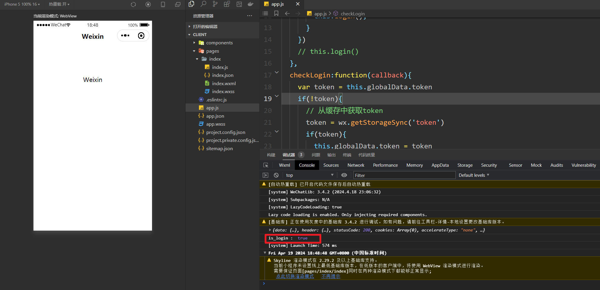


完整代码，客户端：

```js
App({
  globalData: {
    token: "",
  },
  onLaunch: function () {
    // 检测用户是否登录
    this.checkLogin(res => {
      console.log('is_login : ', res.is_login);
      // 未登录 -> login()
      if (!res.is_login) {
        // 调用Login
        this.login();
      }
    })
    // this.login()
  },
  checkLogin:function(callback){
    var token = this.globalData.token
    if(!token){
      // 从缓存中获取token
      token = wx.getStorageSync('token')
      if(token){
        this.globalData.token = token
      }else{
        callback({ is_login : false })
      }
    }
     // 发送请求检验token是否存在
     wx.request({
      url: 'http://127.0.0.1:3000/checklogin',
      data:{
        token : token
      },
      success:(res)=>{
        console.log(res);
        callback({
          is_login:res.data.is_login
        })
      }
    }) 
  },
  login: function () {
    wx.login({
      success: (res) => {
        console.log("code: " + res.code);
        wx.request({
          url: 'http://127.0.0.1:3000/login',
          method: 'POST',
          data: {
            code: res.code
          },
          success: (res) => {
            // 将请求成功的token打印
            console.log("token : " + res.data.token);
            // 将token保存为公共数据（多页面使用->全局globalData）
            this.globalData.token = res.data.token
            // 将token保存在数据缓存中（下次无需重新获取token）
            wx.setStorage({
              key: 'token',
              data: res.data.token
            })
          }
        })
      }
    })
  }
})
```


服务器：

```js
const express = require('express') 				
const bodyParser = require('body-parser')		
const request = require('request')				
const app = express()

app.use(bodyParser.json())

const wx = {
    appid: 'wx154afd6feeabcd59',  // 填写用户自己的appid
    secret: '723d3311bd8d194789437b7b8e99ec33'  // 填写用户自己的密钥
}

// 模拟数据库存放数据
var db = {
	user: {},		// userInfo
    session: {}		// 保存 openid 和session_key会话信息 
}

app.post('/login', (req, res) => {
    console.log('code: ' + req.body.code) // 打印一下code
    var url = 'https://api.weixin.qq.com/sns/jscode2session?appid=' + wx.appid + '&secret=' + wx.secret + '&js_code=' + req.body.code + '&grant_type=authorization_code'
    request(url, (err, response, body) => {
        //	可以获取到 session_key(会话信息) 、 openid(用户唯一标识)
        console.log('session: ' + body)
        //  上面的session信息是字符串数据，通过JSON.parse()转成js对象
        var session = JSON.parse(body)
        console.log(session);
        // 将openid和session_key保存后响应token回去,openid是用户的唯一标识
        if(session.openid){
            var token = 'token_' + new Date().getTime() 
            db.session[token] = session
            // console.log(db);
            if(!db.user[session.openid]) {
                db.user[session.openid] = {
                    state:1  // 成功登录可以获取
                }
            }
            console.log(db);
        }
        res.json({
            token: token  // 返回token
        })
    })
})


app.get('/checklogin', (req, res) => {
    var session = db.session[req.query.token]
    console.log('checklogin: ', session)
    // 将用户是否已经登录的布尔值返回给客户端
    res.json({
        is_login: session !== undefined
    })
})

app.listen(3000, () => {
    console.log('server running...');
})
```


项目中用到的依赖：

```json
"dependencies": {
    "body-parser": "^1.20.0",
    "express": "^4.18.1",
    "request": "^2.88.2"
}
```


## 二，Fetch发请求[讲师：码路于老师/LY]


## 三，TypeScript工程化


## 四，Vue权限管理上


## 五，Vue权限管理中


## 六，Vue权限管理下


## 七，Vue的.sync的使用


## 八，Grid网络布局


## 九，粘性定位


## 十一，滑动门


## 十二，瀑布流


## 十三，放大镜


## 十四，防抖和节流


## 十五，工厂模式


## 十六，单例模式


## 十七，原型模式


## 十八，适配器模式


## 十九，代理模式


## 二十，策略模式


## 二十一，迭代器模式


## 二十二，观察者模式


## 二十三，命令模式


## 二十四，状态模式
